# Module 1 — React & UI

> Roadmap MCP × Full-Stack AI · 5 session · khoảng 3 tuần · mốc: giao diện tĩnh Nexus đầy đủ, responsive, dùng được bằng bàn phím.

## Mục lục

- **S1.1 React cốt lõi**
  - Bắt đầu: session này làm gì
  - Bài 1 — Component & props
  - Bài 2 — State & khi nào render lại
  - Bài 3 — Danh sách & key
  - Bài 4 — Controlled input
  - Bài 5 — Lifting state & derived state
  - Lab — App Todo: thêm / sửa / xoá / lọc
  - Kiểm tra AC & Exit
- **S1.2 Effects, refs & custom hooks**
  - Bắt đầu: session này làm gì
  - Bài 1 — useEffect & cleanup
  - Bài 2 — Có thể bạn không cần Effect
  - Bài 3 — useRef
  - Bài 4 — useMemo & useCallback
  - Bài 5 — Custom hook & Context
  - Lab — useAutoScroll() cho khung chat
  - Kiểm tra AC & Exit
- **S1.3 Tailwind CSS & shadcn/ui**
  - Bắt đầu: session này làm gì
  - Bài 1 — Utility-first: Tailwind sinh CSS thế nào
  - Bài 2 — Responsive & variant
  - Bài 3 — Design token & dark mode
  - Bài 4 — shadcn/ui: chép code, không cài thư viện
  - Lab — Layout Nexus: sidebar, header, nội dung
  - Kiểm tra AC & Exit
- **S1.4 Form: React Hook Form + Zod**
  - Bắt đầu: session này làm gì
  - Bài 1 — Một schema, hai nơi dùng
  - Bài 2 — useForm, register, Controller
  - Bài 3 — Lỗi hiện khi nào, ở đâu
  - Bài 4 — Submit, nút khoá, lỗi từ server
  - Lab — Form đăng ký và tạo workspace
  - Kiểm tra AC & Exit
- **S1.5 Accessibility & UI tĩnh**
  - Bắt đầu: session này làm gì
  - Bài 1 — HTML ngữ nghĩa: đúng thẻ cho đúng việc
  - Bài 2 — Tên, label và aria-*: trình đọc màn hình nghe được gì
  - Bài 3 — Bàn phím và focus
  - Bài 4 — Tương phản màu và mọi kích thước màn hình
  - Lab — Toàn bộ giao diện tĩnh Nexus
  - Kiểm tra AC & Exit Module 1


---

## S1.1 — React cốt lõi

> **Module 1 — React & UI · Session 1/5.** Nắm mô hình tư duy (mental model — cách bạn hình dung cái máy chạy bên trong) của React trước khi đụng Next.js.
>
> **Output:** một component danh sách việc (todo list) có thêm / sửa / xoá / lọc.
> **Acceptance criteria (AC — điều kiện để tick xong session):** không có state trùng lặp (dữ liệu suy ra được thì tính lúc render) · `key` dùng id ổn định, không dùng index.

### Bắt đầu: session này làm gì

Hình dung React như **một quán cà phê có bếp và quầy**. Bếp (component) nhận order (props), nhớ những thứ riêng của mình (state), và mỗi khi có gì thay đổi thì làm lại đĩa mới đưa ra quầy (render). Người khách chỉ nhìn thấy quầy (DOM — cây phần tử HTML trình duyệt đang vẽ ra màn hình). React là người quản lý: so đĩa mới với đĩa cũ và chỉ thay đúng phần khác.

Cả session xoay quanh **một vòng lặp duy nhất**. Đọc sơ đồ này trước; mỗi bài sau sẽ tô sáng một đoạn của nó.

**Sơ đồ (Luồng dữ liệu) — Một cú bấm đi vòng qua React thế nào?**

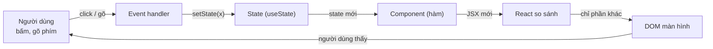

**Đọc sơ đồ:** Bắt đầu ở “Người dùng” (trái trên), đi theo chiều kim đồng hồ: sự kiện → hàm xử lý → state → React gọi lại component → so sánh → sửa DOM → người dùng thấy kết quả. Cả session chỉ là vòng này. *Màu: viền terracotta dày = phần của bài này · be = phần còn lại của vòng. Mũi tên ghi thứ đi qua.*


Lộ trình: 5 bài ngắn, mỗi bài một mảnh của vòng lặp, rồi Lab ghép tất cả thành app Todo.

| Bài | Học gì | Mảnh nào của vòng lặp |
|---|---|---|
| 1 | Component & props | Component (hàm) → DOM |
| 2 | State & khi nào render lại | Event → State → Component |
| 3 | Danh sách & `key` | React so sánh |
| 4 | Controlled input | Người dùng gõ → State |
| 5 | Lifting state & derived state | State đặt ở đâu, cái gì *không* là state |
| Lab | Todo app | Cả vòng |

#### Chuẩn bị project

Session này là **bãi tập riêng**, chưa đụng monorepo Nexus (giao diện Nexus bắt đầu từ S1.3). Dùng Vite (công cụ chạy dev server và đóng gói code front-end) với template React + TypeScript:

```bash title="terminal"
npm create vite@latest s1-1-todo -- --template react-ts
cd s1-1-todo
npm install
npm run dev
```

Kết quả thật khi mình chạy lệnh tạo project (Node v22.22.2, Vite 8, React 19.2, TypeScript 6):

```console title="output"
$ npm create vite@latest s1-1-todo -- --template react-ts
o  Scaffolding project in /home/claude/s1-1-todo...
—  Done. Now run:

  cd s1-1-todo
  npm install
  npm run dev
```

Mở `http://localhost:5173`. Xoá `src/App.css` và thư mục `src/assets` — ta sẽ tự viết lại từ đầu.

> **Luật của session:** mỗi bài có đoạn code nhỏ. Gõ lại bằng tay trong `App.tsx`, đừng copy. Ngón tay nhớ lâu hơn mắt.

### Bài 1 — Component & props

**Nó là gì (1 câu):** component giống **cái khuôn đổ bánh flan** — viết khuôn một lần, đổ ra bao nhiêu cái cũng được; còn props là **topping bạn chọn cho từng cái** (cùng khuôn, cái này caramel, cái kia cà phê).

**Sơ đồ tổng** — bài này nằm ở đoạn *Component → DOM*:

**Sơ đồ (Luồng dữ liệu) — Một cú bấm đi vòng qua React thế nào?**

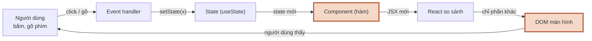

**Đọc sơ đồ:** Vòng lặp của cả session; phần tô viền terracotta là đoạn bài này đào sâu — Bài 1: Component → DOM. *Màu: viền terracotta dày = phần của bài này · be = phần còn lại của vòng. Mũi tên ghi thứ đi qua.*


#### 1.1 Component là gì

**Ẩn dụ:** component là khuôn bánh. Bạn không vẽ từng cái bánh; bạn làm khuôn, React đổ ra.

**Sơ đồ:** trước khi viết component đầu tiên, xem file `.tsx` của bạn đi đường nào để thành thứ trên màn hình.

**Sơ đồ (Bản đồ dịch vụ) — File .tsx của bạn chạy ở đâu để thành giao diện?**

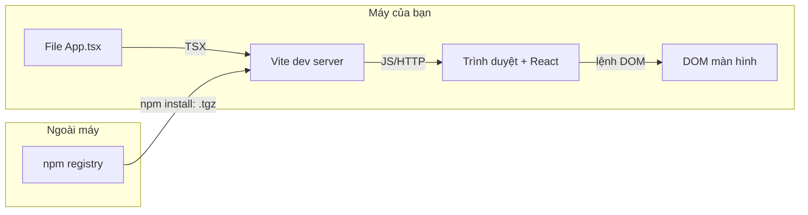

**Đọc sơ đồ:** Đọc từ trái sang: bạn gõ App.tsx → Vite biên dịch JSX thành JS → trình duyệt chạy React → React sửa DOM. Chỉ lệnh npm install đi ra ngoài máy (tải package về một lần). *Màu: vùng nét đứt = nơi chạy (trong máy / ngoài máy) · mũi tên ghi định dạng dữ liệu đi qua.*


**Chi tiết kỹ thuật:**

Component trong React **chỉ là một hàm JavaScript trả về JSX** (JSX — cú pháp trông như HTML viết thẳng trong JS; Vite biên dịch nó thành lời gọi hàm thường).

```tsx title="src/App.tsx"
function Greeting() {
  return <p className="greet">Chào buổi sáng ☕</p>;
}

export default function App() {
  return (
    <main>
      <h1>Việc hôm nay</h1>
      <Greeting />
      <Greeting />
    </main>
  );
}
```

Bốn luật JSX gặp ngay trong ngày đầu:

1. **Tên component viết hoa chữ đầu** (`Greeting`, không phải `greeting`). Chữ thường thì React hiểu là thẻ HTML.
2. **Trả về đúng một phần tử gốc.** Muốn trả hai thứ ngang hàng thì bọc bằng Fragment (phần tử rỗng không sinh ra thẻ HTML nào): `<>...</>`.
3. **`className` thay cho `class`, `htmlFor` thay cho `for`** — vì `class` và `for` là từ khoá của JavaScript.
4. **`{ }` để nhúng biểu thức JS**: `<p>Còn {3 - 1} việc</p>`. Trong ngoặc nhọn chỉ được *biểu thức* (thứ trả ra giá trị), không được `if`/`for` — dùng toán tử ba ngôi `a ? b : c` hoặc `&&`.

#### 1.2 Props: truyền dữ liệu từ cha xuống con

**Ẩn dụ:** props như **phiếu order** thu ngân đưa cho barista. Barista đọc phiếu để pha, nhưng không được tự sửa phiếu. Muốn đổi món, barista phải gọi thu ngân.

**Sơ đồ:** bấm các kịch bản để thấy dữ liệu chảy xuống, và điều gì xảy ra khi con muốn đổi dữ liệu.

**Sơ đồ (Luồng dữ liệu) — Props chảy theo hướng nào, và con muốn đổi thì làm sao?**

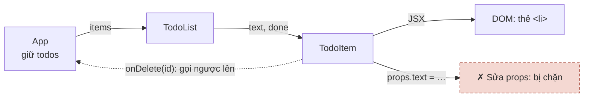

**Đọc sơ đồ:** Đọc hàng trên từ trái sang: App đưa items xuống TodoList, TodoList đưa text/done xuống TodoItem, TodoItem vẽ ra thẻ <li>. Đường nét đứt phía dưới là cách duy nhất để con ‘nói’ với cha: gọi hàm cha truyền xuống. *Màu: đỏ gạch + ✗ + viền đứt = bị chặn/sai · vàng mù tạt + ? + viền chấm = cần xem lại · xanh ô-liu + ✓ = chạy đúng. Nét đứt = callback gọi ngược lên.*


**Chi tiết kỹ thuật:**

Props (viết tắt của *properties*) là **một object duy nhất** React đưa vào hàm component. Ta thường destructure (tách object thành biến) ngay ở tham số, và khai báo kiểu bằng TypeScript:

```tsx title="src/App.tsx"
type TodoItemProps = {
  text: string;
  done: boolean;
  onDelete: () => void; // hàm cũng là props
};

function TodoItem({ text, done, onDelete }: TodoItemProps) {
  return (
    <li>
      <span className={done ? 'done' : undefined}>{text}</span>
      <button onClick={onDelete}>Xoá</button>
    </li>
  );
}

export default function App() {
  return (
    <ul>
      <TodoItem text="Pha cà phê phin" done={true} onDelete={() => alert('xoá 1')} />
      <TodoItem text="Tưới cây" done={false} onDelete={() => alert('xoá 2')} />
    </ul>
  );
}
```

Ba điều phải khắc cốt:

- **Props chỉ đọc (read-only).** Con không được gán `props.text = ...`. Dữ liệu chảy **một chiều**: cha → con.
- **Con muốn “đổi” thì gọi hàm cha đưa xuống** (callback — hàm truyền đi để người khác gọi lại). `onDelete` ở trên là callback. Quy ước đặt tên: prop là `onXxx`, hàm xử lý ở cha là `handleXxx`.
- **Chuỗi thì dùng ngoặc kép, mọi thứ khác dùng `{}`**: `text="Tưới cây"` nhưng `done={false}`, `count={3}`. Viết `done="false"` là truyền *chuỗi* `"false"` — mà chuỗi khác rỗng thì luôn là truthy (được coi là đúng)!

#### Nhìn lại bức tranh lớn

**Sơ đồ (Luồng dữ liệu) — Một cú bấm đi vòng qua React thế nào?**


**Đọc sơ đồ:** Cùng vòng lặp như đầu bài; phần tô viền terracotta là thứ bạn vừa học — Bài 1: Component → DOM. Bấm “Chạy một vòng” để xem nó nằm ở đâu trong cả vòng. *Màu: viền terracotta dày = phần của bài này · be = phần còn lại của vòng. Mũi tên ghi thứ đi qua.*


Bạn vừa học đoạn **Component → DOM**: component là hàm trả JSX, nhận props từ cha. Nhưng tới giờ mọi thứ còn *đứng yên* — bấm nút chưa làm gì đổi được. Bài 2 sẽ lắp phần còn thiếu của vòng: **State**.

#### Tự vẽ lại

1. Kể bằng lời: file `App.tsx` bạn gõ đi qua những “trạm” nào để thành chữ trên màn hình?
2. Vì sao `TodoItem` không được tự sửa `text` của nó? Nếu muốn xoá chính nó thì nó làm gì?
3. `done="false"` và `done={false}` khác nhau thế nào, và cái nào gây bug?

### Bài 2 — State & khi nào render lại

**Nó là gì (1 câu):** state là **trí nhớ của component** — như tấm bảng phấn “Hôm nay còn 3 bánh croissant” trong quán: muốn cả quán biết số mới, bạn phải *xoá bảng và viết lại*, chứ nhẩm trong đầu thì không ai thấy.

**Sơ đồ tổng** — bài này nằm ở đoạn *Event → State → Component*:

**Sơ đồ (Luồng dữ liệu) — Một cú bấm đi vòng qua React thế nào?**

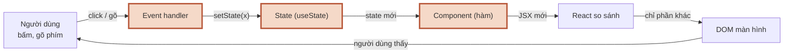

**Đọc sơ đồ:** Vòng lặp của cả session; phần tô viền terracotta là đoạn bài này đào sâu — Bài 2: Event → State → Component. *Màu: viền terracotta dày = phần của bài này · be = phần còn lại của vòng. Mũi tên ghi thứ đi qua.*


#### 2.1 useState: trí nhớ + cái chuông báo

**Ẩn dụ:** `useState` đưa bạn hai thứ: **tấm bảng** (giá trị hiện tại) và **cái chuông** (hàm set). Viết lên bảng mà không rung chuông thì bếp không làm đĩa mới.

**Sơ đồ:** đi theo thứ tự từng mũi tên khi bạn bấm nút “+1”. Thử cả 4 kịch bản — kịch bản 2 và 3 là câu hỏi phỏng vấn kinh điển.

**Sơ đồ (Trình tự) — Ai nói gì với ai khi bạn bấm nút +1?**

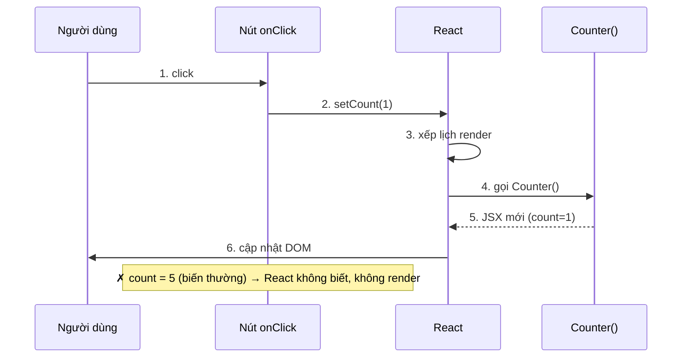

**Đọc sơ đồ:** Mỗi cột là một bên, đọc mũi tên theo số ①→⑥ từ trên xuống. Ô đỏ giữa cột ‘Nút onClick’ là đường sai: gán biến thường. *Màu: đỏ gạch + ✗ + viền đứt = bị chặn/sai · vàng mù tạt + ? + viền chấm = cần xem lại · xanh ô-liu + ✓ = chạy đúng.*


**Chi tiết kỹ thuật:**

```tsx title="src/App.tsx"
import { useState } from 'react';

export default function Counter() {
  const [count, setCount] = useState(0); // [giá trị, hàm set] = useState(giá trị ban đầu)

  return (
    <button onClick={() => setCount(count + 1)}>
      Đã uống {count} ly
    </button>
  );
}
```

- `useState` là một **Hook** (hàm đặc biệt của React, tên bắt đầu bằng `use`). Luật Hook: chỉ gọi ở **đầu** component, không gọi trong `if`, vòng lặp hay hàm lồng.
- **Vì sao biến thường không được?** `let count = 0; count++` — (1) mỗi lần render hàm chạy lại từ đầu nên `count` về 0; (2) gán biến không báo cho React, nên React không render lại.
- **Snapshot (ảnh chụp):** trong một lần render, `count` là **hằng số**. Gọi `setCount(count + 1)` ba lần liền thì cả ba đều đọc cùng `count = 0` → kết quả chỉ +1.
- **Updater function (hàm cập nhật):** `setCount(c => c + 1)` — React đưa giá trị *mới nhất* vào `c`. Gọi ba lần → +3. Quy tắc: **giá trị mới phụ thuộc giá trị cũ thì dùng updater.**
- **Batching (gom lô):** nhiều lần set trong cùng một event chỉ gây **một** lần render.

#### 2.2 Khi nào component render lại?

**Ẩn dụ:** quản lý quán chỉ bảo bếp làm lại đĩa khi có ai **rung chuông** *và* **order thật sự khác** order cũ.

**Sơ đồ:** bấm từng kịch bản để thấy React chọn nhánh nào.

**Sơ đồ (Luồng quyết định) — Khi nào component render lại?**

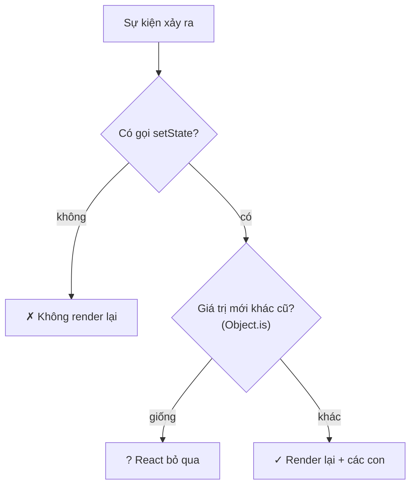

**Đọc sơ đồ:** Đọc từ trên xuống: mỗi ô vàng nhạt là một câu hỏi React tự đặt ra. Rẽ ngang sang phải là dừng; đi thẳng xuống cuối là render lại. *Màu: đỏ gạch + ✗ + viền đứt = bị chặn/sai · vàng mù tạt + ? + viền chấm = cần xem lại · xanh ô-liu + ✓ = chạy đúng.*


**Chi tiết kỹ thuật:**

“Render” trong React = **React gọi lại hàm component của bạn** để lấy JSX mới. Chưa phải là vẽ lại màn hình — vẽ lại chỉ xảy ra ở bước sau, và chỉ với phần khác.

Component render lại khi:

1. **State của chính nó đổi** (qua hàm set, giá trị mới khác cũ theo `Object.is` — phép so sánh “có phải cùng một thứ không”).
2. **Component cha render lại** → mặc định mọi con cũng render lại (dù props y hệt). Điều này bình thường và thường rất nhanh; tối ưu để sau.

Bẫy lớn nhất với mảng/object — **đừng sửa trực tiếp (mutate), hãy tạo bản mới (immutable update)**:

```tsx title="mutate vs tạo mới"
// ✗ SAI: sửa mảng cũ → cùng tham chiếu → React tưởng không đổi
todos.push(newTodo);
setTodos(todos);

// ✓ ĐÚNG: tạo mảng mới
setTodos([...todos, newTodo]);                                // thêm
setTodos(todos.filter((t) => t.id !== id));                     // xoá
setTodos(todos.map((t) => (t.id === id ? { ...t, done: !t.done } : t))); // sửa 1 phần tử
```

> **Vì sao dev log in hai lần?** `main.tsx` bọc app trong `<StrictMode>`. Ở chế độ dev, React cố ý gọi component **hai lần** để bắt bug do component không “thuần” (pure — cùng input thì cùng output, không đụng thứ bên ngoài). Bản build production chỉ gọi một lần. Đừng tắt StrictMode.

#### Nhìn lại bức tranh lớn

**Sơ đồ (Luồng dữ liệu) — Một cú bấm đi vòng qua React thế nào?**


**Đọc sơ đồ:** Cùng vòng lặp như đầu bài; phần tô viền terracotta là thứ bạn vừa học — Bài 2: Event → State → Component. Bấm “Chạy một vòng” để xem nó nằm ở đâu trong cả vòng. *Màu: viền terracotta dày = phần của bài này · be = phần còn lại của vòng. Mũi tên ghi thứ đi qua.*


Bạn vừa học trái tim của React: **Event → setState → React gọi lại component**. Vòng lặp giờ đã quay được. Nhưng khi component trả về *cả một danh sách*, React làm sao biết dòng nào là dòng nào? Bài 3.

#### Tự vẽ lại

1. Kể 6 bước từ lúc bạn bấm “+1” tới lúc thấy số mới, không nhìn sơ đồ.
2. Vì sao `setCount(count + 1)` ×3 chỉ +1, còn `setCount(c => c + 1)` ×3 thì +3?
3. `todos.push(x); setTodos(todos)` sai ở đâu, và sửa thế nào?

### Bài 3 — Danh sách & key

**Nó là gì (1 câu):** `key` giống **số thẻ gửi xe** — xe có bị dời chỗ trong bãi thì bảo vệ vẫn trả đúng xe nhờ số thẻ, chứ không nhờ “chiếc thứ ba từ trái sang”.

**Sơ đồ tổng** — bài này nằm ở bước *React so sánh*:

**Sơ đồ (Luồng dữ liệu) — Một cú bấm đi vòng qua React thế nào?**

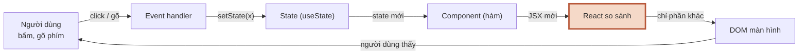

**Đọc sơ đồ:** Vòng lặp của cả session; phần tô viền terracotta là đoạn bài này đào sâu — Bài 3: React so sánh (key). *Màu: viền terracotta dày = phần của bài này · be = phần còn lại của vòng. Mũi tên ghi thứ đi qua.*


#### 3.1 Từ mảng dữ liệu tới danh sách: `.map()`

**Ẩn dụ:** `.map()` là **dây chuyền đóng gói**: mỗi hạt cà phê đi vào một đầu, ra đầu kia thành một gói — số gói bằng số hạt.

**Sơ đồ:**

**Sơ đồ (Luồng dữ liệu) — Mảng dữ liệu biến thành danh sách trên màn hình thế nào?**

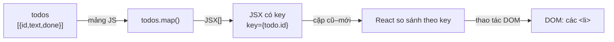

**Đọc sơ đồ:** Đọc từ trái sang: mảng todos đi qua .map() thành mảng JSX, mỗi phần tử mang một key; React dùng key để ghép cặp với lần trước rồi chỉ sửa DOM chỗ khác. *Màu: đỏ gạch + ✗ + viền đứt = bị chặn/sai · vàng mù tạt + ? + viền chấm = cần xem lại · xanh ô-liu + ✓ = chạy đúng. Nhãn trên mũi tên = định dạng dữ liệu.*


**Chi tiết kỹ thuật:**

```tsx title="src/App.tsx"
type Todo = { id: string; text: string; done: boolean };

const todos: Todo[] = [
  { id: 't1', text: 'Pha cà phê phin', done: true },
  { id: 't2', text: 'Đọc react.dev', done: false },
];

export default function App() {
  return (
    <ul>
      {todos.map((todo) => (
        <li key={todo.id}>{todo.text}</li>
      ))}
    </ul>
  );
}
```

- JSX nhận được **một mảng phần tử** — `.map()` trả đúng thứ đó.
- Lọc trước rồi map: `todos.filter(t => !t.done).map(...)`.
- `key` đặt ở **phần tử ngoài cùng** trong `map` (ở đây là `<li>`; nếu map ra `<TodoItem>` thì đặt ở `<TodoItem key=...>`).

#### 3.2 `key`: số thẻ gửi xe của từng dòng

**Ẩn dụ:** khi danh sách đổi (thêm, xoá, sắp xếp), React so danh sách mới với cũ. Có số thẻ ổn định thì React trả đúng “xe” — kèm mọi thứ gắn với nó (state bên trong, chữ đang gõ trong ô, focus).

**Sơ đồ:** thử 4 cách đặt key.

**Sơ đồ (Luồng quyết định) — Khi list đổi, React giữ đúng phần tử nào?**

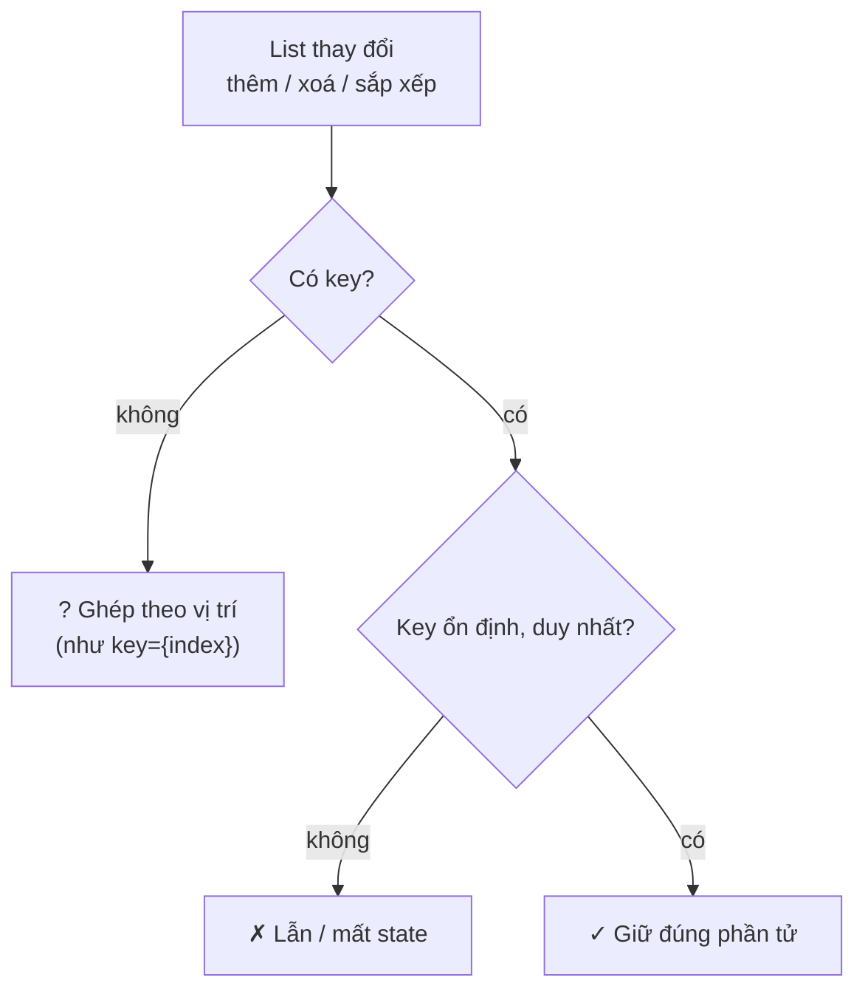

**Đọc sơ đồ:** Đọc từ trên xuống: React hỏi hai câu về key của mỗi dòng. Chỉ nhánh đi thẳng xuống đáy mới giữ đúng state từng dòng. *Màu: đỏ gạch + ✗ + viền đứt = bị chặn/sai · vàng mù tạt + ? + viền chấm = cần xem lại · xanh ô-liu + ✓ = chạy đúng.*


**Tự thấy bug bằng tay** — bên trái dùng `key={index}`, bên phải dùng `key={todo.id}`. Mỗi ô ghi chú đang ghi đúng tên việc của dòng đó. Bấm “Xoá dòng đầu” và nhìn cột trái:

> *(Bản HTML có demo bấm được ở đây. Trong MD: làm thí nghiệm 1 ở Bước 8 của Lab để thấy bug y hệt.)*

**Chi tiết kỹ thuật:**

- `key` phải **duy nhất giữa các anh em** (trong cùng một danh sách) và **ổn định** (cùng một mục thì cùng key qua mọi lần render).
- **Nguồn key tốt nhất:** id từ dữ liệu (id trong database). Tạo mới ở client thì dùng `crypto.randomUUID()` **lúc tạo dữ liệu**, không phải lúc render.
- **`key={index}`** chỉ tạm chấp nhận khi danh sách **không bao giờ** thêm/xoá/sắp xếp và dòng không có state. Todo thì có xoá → cấm.
- **`key={Math.random()}`** là tệ nhất: mỗi render key mới → React huỷ và tạo lại mọi dòng → mất focus, mất chữ đang gõ, chậm.
- `key` **không phải prop**: component con không đọc được `props.key`. Cần id thì truyền thêm `id={todo.id}` hoặc cả `todo`.

#### Nhìn lại bức tranh lớn

**Sơ đồ (Luồng dữ liệu) — Một cú bấm đi vòng qua React thế nào?**


**Đọc sơ đồ:** Cùng vòng lặp như đầu bài; phần tô viền terracotta là thứ bạn vừa học — Bài 3: React so sánh (key). Bấm “Chạy một vòng” để xem nó nằm ở đâu trong cả vòng. *Màu: viền terracotta dày = phần của bài này · be = phần còn lại của vòng. Mũi tên ghi thứ đi qua.*


Bạn vừa học bước **React so sánh**: với danh sách, `key` là thứ React dùng để ghép cặp cũ–mới. Key sai = ghép nhầm = state dính sang dòng khác. Giờ đến lượt dữ liệu *từ người dùng* đi vào vòng lặp — bài 4.

#### Tự vẽ lại

1. Kể lại chuyện gì xảy ra ở cột trái demo khi xoá dòng đầu, dùng từ “vị trí” và “ô input”.
2. Vì sao `Math.random()` làm key còn tệ hơn index?
3. Todo mới tạo ở client lấy id từ đâu, và tạo vào lúc nào?

### Bài 4 — Controlled input

**Nó là gì (1 câu):** controlled input giống **máy pha có bảng điều khiển điện tử**: vặn núm không trực tiếp đổi nhiệt độ — núm gửi tín hiệu lên bảng điều khiển (state), bảng quyết định rồi mới hiển thị con số.

**Sơ đồ tổng** — bài này nằm ở đoạn *Người dùng → Event → State*:

**Sơ đồ (Luồng dữ liệu) — Một cú bấm đi vòng qua React thế nào?**

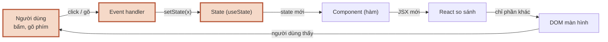

**Đọc sơ đồ:** Vòng lặp của cả session; phần tô viền terracotta là đoạn bài này đào sâu — Bài 4: Người dùng gõ → State. *Màu: viền terracotta dày = phần của bài này · be = phần còn lại của vòng. Mũi tên ghi thứ đi qua.*


#### 4.1 Ai giữ giá trị của ô input?

**Ẩn dụ:** ô `<input>` bình thường tự nhớ chữ trong nó (như sổ tay riêng của barista). Controlled input bắt nó **không được tự nhớ** — chữ hiển thị luôn là thứ state của React nói.

**Sơ đồ:** một vòng tròn khép kín, state là nguồn sự thật duy nhất (single source of truth).

**Sơ đồ (Luồng dữ liệu) — Giá trị ô input nằm ở đâu và đi vòng thế nào?**

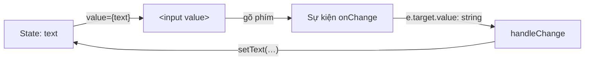

**Đọc sơ đồ:** Đọc theo chiều kim đồng hồ từ góc trái trên: state đẩy value vào ô → người dùng gõ tạo event → handler đọc chuỗi → setText ghi vào state. Ô input không tự nhớ gì. *Màu: be = mọi bước đều đi qua React · mũi tên ghi định dạng dữ liệu (string).*


**Chi tiết kỹ thuật:**

```tsx title="src/App.tsx"
import { useState } from 'react';

export default function App() {
  const [text, setText] = useState('');

  return (
    <label>
      Việc mới{' '}
      <input value={text} onChange={(e) => setText(e.target.value)} />
      <small>{text.length}/80</small>
    </label>
  );
}
```

Hai mảnh luôn đi cặp: **`value={text}`** (state → ô) và **`onChange`** (ô → state). Thiếu `onChange` thì ô bị khoá cứng và React cảnh báo trong console.

Lợi ích: vì chữ đi qua state, bạn làm được mọi thứ *mỗi phím gõ* — đếm ký tự, khoá nút khi rỗng, viết hoa, xoá sạch ô bằng `setText('')`.

#### 4.2 Một phím gõ đi qua những ai?

**Ẩn dụ:** như một order đi qua quầy: khách nói → thu ngân ghi → bảng order cập nhật → barista làm theo bảng.

**Sơ đồ:** bấm “Quên onChange” và “Chặn quá 40 ký tự” để thấy hai đường rẽ.

**Sơ đồ (Trình tự) — Một phím gõ đi qua những ai, theo thứ tự nào?**

```mermaid
sequenceDiagram
    participant U as Người dùng
    participant I as &lt;input&gt;
    participant H as handleChange
    participant S as State text
    U->>I: 1. gõ 'a'
    I->>H: 2. onChange(e)
    H->>S: 3. setText('a')
    S->>I: 4. render: value='a'
    I->>U: 5. thấy chữ 'a'
    Note over I: ✗ thiếu onChange → ô bị khoá
    Note over H: ? quá 40 ký tự → không set
```

**Đọc sơ đồ:** Mỗi cột là một bên, đọc ①→⑤ từ trên xuống. Hai ô ở đáy là hai đường rẽ: quên onChange (bị khoá) và handler cố ý không set (chặn). *Màu: đỏ gạch + ✗ + viền đứt = bị chặn/sai · vàng mù tạt + ? + viền chấm = cần xem lại · xanh ô-liu + ✓ = chạy đúng.*


**Chi tiết kỹ thuật — form hoàn chỉnh:**

```tsx title="src/App.tsx"
import { useState, type FormEvent } from 'react';

export default function App() {
  const [text, setText] = useState('');
  const trimmed = text.trim(); // derived: tính mỗi render, không cần state

  function handleSubmit(e: FormEvent<HTMLFormElement>) {
    e.preventDefault(); // chặn trình duyệt submit kiểu cũ (tải lại trang)
    if (!trimmed) return;
    console.log('Thêm:', trimmed);
    setText(''); // ô trống lại vì value bám theo state
  }

  return (
    <form onSubmit={handleSubmit}>
      <label htmlFor="new-todo">Việc mới</label>
      <input id="new-todo" value={text} onChange={(e) => setText(e.target.value)} />
      <button type="submit" disabled={!trimmed}>Thêm</button>
    </form>
  );
}
```

- **`e.target.value` luôn là chuỗi** (string), kể cả `<input type="number">`. Cần số thì `Number(...)`.
- **Checkbox dùng `checked`**, không dùng `value`: `<input type="checkbox" checked={done} onChange={...} />`.
- **Dùng `<form onSubmit>`** thay vì `onClick` trên nút → nhấn Enter cũng submit, đúng chuẩn accessibility (khả năng dùng được cho mọi người, kể cả dùng bàn phím/trình đọc màn hình).
- Ngược lại là **uncontrolled input** (DOM tự giữ giá trị, đọc bằng `defaultValue`/ref lúc submit). Ở S1.4, React Hook Form dùng cách này để form lớn nhanh hơn — lúc đó bạn sẽ hiểu vì sao.

#### Nhìn lại bức tranh lớn

**Sơ đồ (Luồng dữ liệu) — Một cú bấm đi vòng qua React thế nào?**


**Đọc sơ đồ:** Cùng vòng lặp như đầu bài; phần tô viền terracotta là thứ bạn vừa học — Bài 4: Người dùng gõ → State. Bấm “Chạy một vòng” để xem nó nằm ở đâu trong cả vòng. *Màu: viền terracotta dày = phần của bài này · be = phần còn lại của vòng. Mũi tên ghi thứ đi qua.*


Bạn vừa nối **người dùng** vào vòng lặp: mỗi phím gõ → event → state → render → ô hiện chữ. Giờ app có nhiều state rải rác: todos, filter, chữ đang gõ… Đặt chúng ở đâu, và cái gì *không nên* là state? Bài cuối.

#### Tự vẽ lại

1. Kể 5 bước của một phím gõ trong controlled input.
2. Vì sao quên `onChange` thì không gõ được?
3. Muốn xoá trống ô sau khi thêm todo, bạn làm gì — đụng vào DOM hay đụng vào state?

### Bài 5 — Lifting state & derived state

**Nó là gì (1 câu):** nâng state lên giống **đặt bình nước chung giữa bàn**: ai cần thì rót từ đó, thay vì mỗi người ôm một bình rồi lượng nước lệch nhau.

**Sơ đồ tổng** — bài này nói về *vị trí* của ô State:

**Sơ đồ (Luồng dữ liệu) — Một cú bấm đi vòng qua React thế nào?**

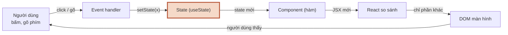

**Đọc sơ đồ:** Vòng lặp của cả session; phần tô viền terracotta là đoạn bài này đào sâu — Bài 5: State đặt ở đâu. *Màu: viền terracotta dày = phần của bài này · be = phần còn lại của vòng. Mũi tên ghi thứ đi qua.*


#### 5.1 Lifting state up: nâng lên cha chung gần nhất

**Ẩn dụ:** khi hai component cần **cùng một** dữ liệu, đừng để mỗi đứa giữ một bản — nâng nó lên **cha chung gần nhất**, rồi cha chia xuống bằng props.

**Sơ đồ:** cây component của app Todo. Bấm từng kịch bản để thấy một hành động ở con đi lên cha rồi toả xuống các con khác.

**Sơ đồ (Luồng dữ liệu) — State đặt ở đâu để các component con cùng thấy?**

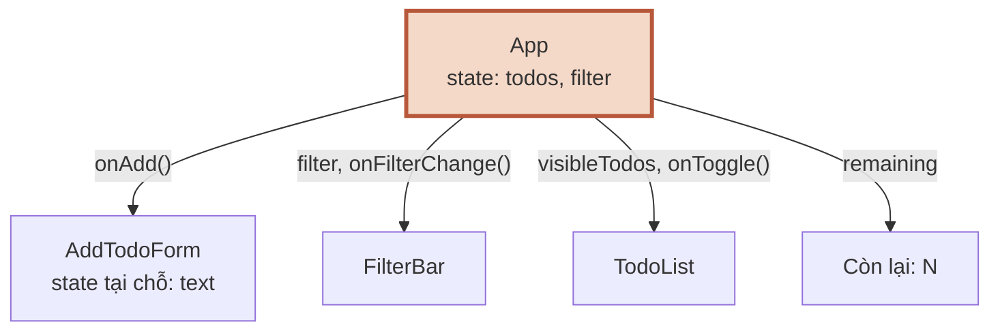

**Đọc sơ đồ:** Đọc từ App (trên) xuống 4 con: mũi tên là props đi xuống. Prop nào là hàm (có dấu ()) thì đó là đường để con gọi ngược lên App. *Màu: viền terracotta = nơi giữ state chung · be = component chỉ nhận props (hoặc có state tại chỗ).*


**Chi tiết kỹ thuật:**

- `FilterBar` đổi filter, `TodoList` cần filter để lọc → filter phải ở **cha chung** là `App`.
- `AddTodoForm` thêm todo, `TodoList` và dòng “Còn lại” đọc todos → todos ở `App`.
- Con thay đổi dữ liệu của cha **chỉ bằng cách gọi callback**: `onAdd(text)`, `onFilterChange('done')`, `onToggle(id)`.
- Ngược lại, **đừng nâng thứ chỉ một nơi cần**: chữ đang gõ trong form thêm việc chỉ `AddTodoForm` dùng → để state *tại chỗ* trong form. State nâng càng cao, càng nhiều component render lại khi nó đổi.

#### 5.2 Derived state: cái gì tính được thì đừng lưu

**Ẩn dụ:** hoá đơn quán không cần ô “tổng tiền” ghi tay — cứ cộng từ các món mỗi lần in. Ghi tay thì sớm muộn sẽ quên sửa khi khách gọi thêm món.

**Sơ đồ:** chạy lần lượt 5 thứ trong app Todo qua bộ câu hỏi này.

**Sơ đồ (Luồng quyết định) — X có nên là state không — và đặt ở đâu?**

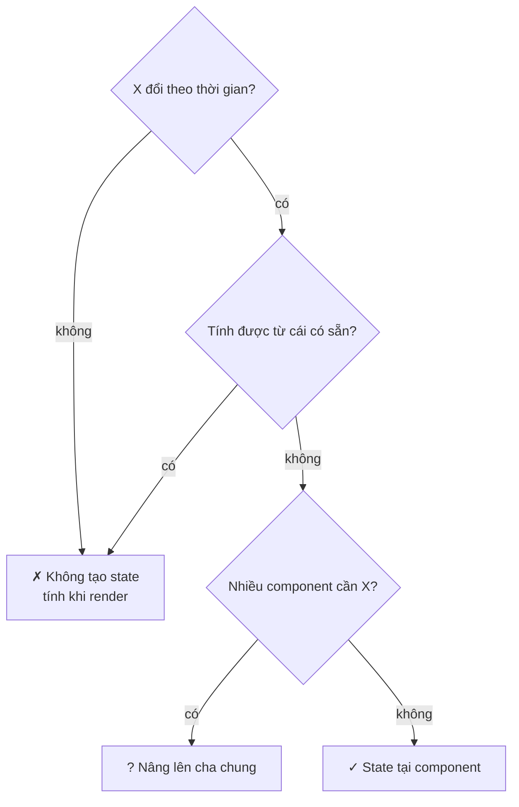

**Đọc sơ đồ:** Đọc từ trên xuống, trả lời từng câu cho dữ liệu X. Nhánh phải trên cùng = không cần state; đáy chia hai: nâng lên cha hoặc để tại chỗ. *Màu: đỏ gạch + ✗ + viền đứt = đừng tạo state · vàng mù tạt + ? = state, nhưng nâng lên cha chung · xanh ô-liu + ✓ = state tại chỗ.*


**Chi tiết kỹ thuật — đây chính là AC #1 của session:**

```tsx title="✗ state trùng lặp"
const [todos, setTodos] = useState<Todo[]>([]);
const [remaining, setRemaining] = useState(0);        // ✗ suy ra được từ todos
const [visibleTodos, setVisibleTodos] = useState<Todo[]>([]); // ✗ suy ra được từ todos + filter
// → mỗi lần sửa todos phải nhớ sửa 2 chỗ kia. Quên một lần = UI nói dối.
```

```tsx title="✓ chỉ lưu nguồn, còn lại tính khi render"
const [todos, setTodos] = useState<Todo[]>([]);
const [filter, setFilter] = useState<Filter>('all');

const visibleTodos = todos.filter((t) => matchesFilter(t, filter));
const remaining = todos.filter((t) => !t.done).length;
```

react.dev gợi ý ba câu hỏi: một dữ liệu **không** là state nếu (1) nó không đổi theo thời gian, (2) nó được cha truyền qua props, hoặc (3) nó tính được từ state/props đang có.

> **Lo tính lại mỗi render có chậm không?** Với vài trăm phần tử, `filter` tốn chưa tới một mili-giây. Đừng tối ưu sớm. `useMemo` (ghi nhớ kết quả tính) là chuyện của S1.2, và chỉ dùng khi đo thấy chậm thật.

> **Anti-pattern (mẫu sai hay gặp) cần né:** dùng `useEffect` để “đồng bộ” derived state — `useEffect(() => setRemaining(...), [todos])`. Nó gây render hai lần và lệch dữ liệu một nhịp. S1.2 có hẳn bài “You Might Not Need an Effect” về chuyện này.

#### Nhìn lại bức tranh lớn

**Sơ đồ (Luồng dữ liệu) — Một cú bấm đi vòng qua React thế nào?**

```mermaid
flowchart LR
    user["Người dùng<br/>bấm, gõ phím"] -- "click / gõ" --> handler["Event handler"]
    handler -- "setState(x)" --> state["State (useState)"]
    state -- "state mới" --> comp["Component (hàm)"]
    comp -- "JSX mới" --> diff["React so sánh"]
    diff -- "chỉ phần khác" --> dom["DOM màn hình"]
    dom -- "người dùng thấy" --> user
    classDef hl fill:#f5d9c8,stroke:#b8583a,stroke-width:3px
    class state hl
```

**Đọc sơ đồ:** Cùng vòng lặp như đầu bài; phần tô viền terracotta là thứ bạn vừa học — Bài 5: State đặt ở đâu. Bấm “Chạy một vòng” để xem nó nằm ở đâu trong cả vòng. *Màu: viền terracotta dày = phần của bài này · be = phần còn lại của vòng. Mũi tên ghi thứ đi qua.*


Vòng lặp đã đủ: component nhận props, state giữ trí nhớ, event gọi set, React so sánh bằng key, input bám theo state — và giờ bạn biết **đặt state ở đâu** và **cái gì không phải state**. Vào Lab.

#### Tự vẽ lại

1. `filter` nằm ở `App` chứ không ở `FilterBar`. Giải thích bằng tên hai component cần nó.
2. Vì sao `remaining` không phải state? Nếu lỡ để nó là state, bug trông như thế nào?
3. Chữ đang gõ trong form thêm việc nên ở đâu, và vì sao không nâng lên `App`?

### Lab — App Todo: thêm / sửa / xoá / lọc

Mục tiêu: ghép 5 bài thành một app. Làm **theo thứ tự**, mỗi bước chạy được rồi mới sang bước sau. Tự gõ trước; chỉ mở code mẫu khi kẹt quá 15 phút.

Cấu trúc đích:

```text title="cấu trúc thư mục"
src/
├── main.tsx              (giữ nguyên của Vite)
├── index.css
├── types.ts              Todo, Filter, matchesFilter()
├── App.tsx               state: todos, filter · derived: visibleTodos, remaining
└── components/
    ├── AddTodoForm.tsx   state tại chỗ: text          (Bài 4)
    ├── FilterBar.tsx     props: filter, onFilterChange (Bài 5)
    ├── TodoList.tsx      map + key={todo.id}           (Bài 3)
    └── TodoItem.tsx      state tại chỗ: isEditing, draft
```

#### Bước 1 — Kiểu dữ liệu (`types.ts`)

Khai báo `Todo` và `Filter` trước, để TypeScript dẫn đường cho mọi file sau. `matchesFilter` dùng `switch` trên union type (kiểu “một trong vài giá trị”) — thiếu một nhánh là TypeScript báo lỗi ngay.

```ts title="src/types.ts"
// Kiểu dữ liệu dùng chung cho cả app
export type Todo = {
  id: string; // id ổn định → dùng làm key
  text: string;
  done: boolean;
};

export type Filter = 'all' | 'active' | 'done';

export function matchesFilter(todo: Todo, filter: Filter): boolean {
  switch (filter) {
    case 'all':
      return true;
    case 'active':
      return !todo.done;
    case 'done':
      return todo.done;
  }
}
```

#### Bước 2 — Form thêm việc (`AddTodoForm.tsx`) · Bài 4

Controlled input + `form onSubmit`. `text` là state *tại chỗ*; `trimmed` là derived.

```tsx title="src/components/AddTodoForm.tsx"
import { useState, type FormEvent } from 'react';

type Props = {
  onAdd: (text: string) => void; // callback: con gọi ngược lên cha
};

export default function AddTodoForm({ onAdd }: Props) {
  // State tại chỗ: chỉ form này cần biết chữ đang gõ
  const [text, setText] = useState('');
  const trimmed = text.trim(); // derived

  function handleSubmit(e: FormEvent<HTMLFormElement>) {
    e.preventDefault(); // chặn trình duyệt tải lại trang
    if (!trimmed) return;
    onAdd(trimmed);
    setText(''); // controlled → xoá state là ô input trống
  }

  return (
    <form className="add-form" onSubmit={handleSubmit}>
      <label htmlFor="new-todo">Việc mới</label>
      <input
        id="new-todo"
        value={text}
        onChange={(e) => setText(e.target.value)}
        maxLength={80}
        placeholder="Ví dụ: tưới cây"
      />
      <button type="submit" disabled={!trimmed}>
        Thêm
      </button>
    </form>
  );
}
```

#### Bước 3 — Thanh lọc (`FilterBar.tsx`) · Bài 1 + 5

Component “ngốc” (chỉ hiển thị props và gọi callback, không có state). `aria-pressed` cho trình đọc màn hình biết nút nào đang bật.

```tsx title="src/components/FilterBar.tsx"
import type { Filter } from '../types';

const OPTIONS: { value: Filter; label: string }[] = [
  { value: 'all', label: 'Tất cả' },
  { value: 'active', label: 'Đang làm' },
  { value: 'done', label: 'Đã xong' },
];

type Props = {
  filter: Filter;
  onFilterChange: (filter: Filter) => void;
};

export default function FilterBar({ filter, onFilterChange }: Props) {
  return (
    <div className="filter-bar" role="group" aria-label="Lọc việc">
      {OPTIONS.map((opt) => (
        <button
          key={opt.value}
          type="button"
          aria-pressed={filter === opt.value}
          onClick={() => onFilterChange(opt.value)}
        >
          {opt.label}
        </button>
      ))}
    </div>
  );
}
```

#### Bước 4 — Một dòng việc (`TodoItem.tsx`) · Bài 2 + 4

Chế độ sửa là state *tại chỗ* của từng dòng. `draft` là **bản nháp có chủ đích** — không phải state trùng lặp: nó chỉ sống trong lúc sửa, được nạp từ `todo.text` lúc bấm “Sửa”, và chỉ đẩy lên cha khi bấm “Lưu”. Huỷ thì bỏ nháp, dữ liệu gốc không bị động tới.

```tsx title="src/components/TodoItem.tsx"
import { useState } from 'react';
import type { Todo } from '../types';

type Props = {
  todo: Todo;
  onToggle: (id: string) => void;
  onEdit: (id: string, text: string) => void;
  onDelete: (id: string) => void;
};

export default function TodoItem({ todo, onToggle, onEdit, onDelete }: Props) {
  // State tại chỗ: chỉ dòng này cần biết nó có đang sửa không
  const [isEditing, setIsEditing] = useState(false);
  // Bản nháp có chủ đích: chỉ sống trong lúc sửa, lưu xong mới đẩy lên cha
  const [draft, setDraft] = useState('');

  function startEdit() {
    setDraft(todo.text);
    setIsEditing(true);
  }

  function save() {
    const next = draft.trim();
    if (next) onEdit(todo.id, next);
    setIsEditing(false);
  }

  if (isEditing) {
    return (
      <li className="todo-item editing">
        <input
          aria-label={`Sửa: ${todo.text}`}
          value={draft}
          onChange={(e) => setDraft(e.target.value)}
          onKeyDown={(e) => {
            if (e.key === 'Enter') save();
            if (e.key === 'Escape') setIsEditing(false);
          }}
          autoFocus
        />
        <button type="button" onClick={save}>Lưu</button>
        <button type="button" onClick={() => setIsEditing(false)}>Huỷ</button>
      </li>
    );
  }

  return (
    <li className="todo-item">
      <label>
        <input
          type="checkbox"
          checked={todo.done}
          onChange={() => onToggle(todo.id)}
        />
        <span className={todo.done ? 'done' : undefined}>{todo.text}</span>
      </label>
      <button type="button" onClick={startEdit}>Sửa</button>
      <button type="button" onClick={() => onDelete(todo.id)}>Xoá</button>
    </li>
  );
}
```

#### Bước 5 — Danh sách (`TodoList.tsx`) · Bài 3

`key={todo.id}` và trạng thái rỗng có hướng dẫn.

```tsx title="src/components/TodoList.tsx"
import type { Todo } from '../types';
import TodoItem from './TodoItem';

type Props = {
  todos: Todo[];
  onToggle: (id: string) => void;
  onEdit: (id: string, text: string) => void;
  onDelete: (id: string) => void;
};

export default function TodoList({ todos, onToggle, onEdit, onDelete }: Props) {
  if (todos.length === 0) {
    return <p className="empty">Chưa có việc nào ở mục này.</p>;
  }

  return (
    <ul className="todo-list">
      {todos.map((todo) => (
        // key = id ổn định, KHÔNG dùng index
        <TodoItem
          key={todo.id}
          todo={todo}
          onToggle={onToggle}
          onEdit={onEdit}
          onDelete={onDelete}
        />
      ))}
    </ul>
  );
}
```

#### Bước 6 — Ghép ở `App.tsx` · Bài 5

Chỉ **hai** state. Mọi thứ khác tính khi render. Mọi cập nhật dùng updater `prev => ...` và tạo mảng mới.

```tsx title="src/App.tsx"
import { useState } from 'react';
import { matchesFilter, type Filter, type Todo } from './types';
import AddTodoForm from './components/AddTodoForm';
import FilterBar from './components/FilterBar';
import TodoList from './components/TodoList';

const initialTodos: Todo[] = [
  { id: 't1', text: 'Pha cà phê phin', done: true },
  { id: 't2', text: 'Đọc react.dev phần Learn', done: false },
  { id: 't3', text: 'Làm lab Todo', done: false },
];

export default function App() {
  // STATE: chỉ 2 thứ thật sự "nhớ" theo thời gian
  const [todos, setTodos] = useState<Todo[]>(initialTodos);
  const [filter, setFilter] = useState<Filter>('all');

  // DERIVED: tính lại mỗi lần render, KHÔNG để trong state
  const visibleTodos = todos.filter((t) => matchesFilter(t, filter));
  const remaining = todos.filter((t) => !t.done).length;

  function handleAdd(text: string) {
    setTodos((prev) => [...prev, { id: crypto.randomUUID(), text, done: false }]);
  }

  function handleToggle(id: string) {
    setTodos((prev) => prev.map((t) => (t.id === id ? { ...t, done: !t.done } : t)));
  }

  function handleEdit(id: string, text: string) {
    setTodos((prev) => prev.map((t) => (t.id === id ? { ...t, text } : t)));
  }

  function handleDelete(id: string) {
    setTodos((prev) => prev.filter((t) => t.id !== id));
  }

  return (
    <main className="app">
      <h1>Việc hôm nay</h1>
      <AddTodoForm onAdd={handleAdd} />
      <FilterBar filter={filter} onFilterChange={setFilter} />
      <TodoList
        todos={visibleTodos}
        onToggle={handleToggle}
        onEdit={handleEdit}
        onDelete={handleDelete}
      />
      <p className="footer">Còn lại: {remaining} việc</p>
    </main>
  );
}
```

CSS tối thiểu (thẩm mỹ không phải mục tiêu của session này — Tailwind ở S1.3):

```css title="src/index.css"
:root { font-family: system-ui, sans-serif; color: #2b2119; background: #fbf6ee; }
body { margin: 0; }
.app { max-width: 36rem; margin: 3rem auto; padding: 0 1rem; }
.add-form { display: flex; gap: .5rem; align-items: center; }
.add-form input { flex: 1; padding: .5rem; }
.filter-bar { display: flex; gap: .5rem; margin: 1rem 0; }
.filter-bar button[aria-pressed='true'] { background: #6b4a33; color: #fff; }
.todo-list { list-style: none; padding: 0; }
.todo-item { display: flex; gap: .5rem; align-items: center; padding: .4rem 0; }
.todo-item label { flex: 1; }
.done { text-decoration: line-through; opacity: .6; }
.footer { color: #6b4a33; }
```

#### Bước 7 — Build để TypeScript kiểm tra

Kết quả thật khi mình chạy trên đúng code ở trên:

```console title="output"
$ npm run build

> s1-1-todo@0.0.0 build
> tsc -b && vite build

vite v8.3.1 building client environment for production...
transforming...
✓ 21 modules transformed.
rendering chunks...
computing gzip size...
dist/index.html                   0.45 kB │ gzip:  0.29 kB
dist/assets/index-BqIb6s6t.css    0.54 kB │ gzip:  0.31 kB
dist/assets/index-C3-rfmHs.js   222.44 kB │ gzip: 69.71 kB

✓ built in 156ms
```

```console title="output"
$ npm run lint

> s1-1-todo@0.0.0 lint
> oxlint

Found 0 warnings and 0 errors.
Finished in 9ms on 8 files with 116 rules using 1 threads.
```

Mình cũng đã chạy app trong trình duyệt headless: thêm “Tưới cây” → “Còn lại: 3 việc”; sửa thành “Tưới cây ban công”; tick “Làm lab Todo”; lọc “Đã xong” / “Đang làm” đúng; xoá “Pha cà phê phin” → “Còn lại: 2 việc”; ô rỗng thì nút “Thêm” bị khoá; console không có lỗi hay cảnh báo.

#### Bước 8 — Thử phá (quan trọng hơn bước 1–7)

Mỗi thí nghiệm: đoán trước kết quả, làm, rồi hoàn tác.

1. Trong `TodoList`, đổi `key={todo.id}` thành `key={index}` (thêm tham số `(todo, index)`). Bấm “Sửa” ở dòng **thứ hai**, gõ dở vài chữ, rồi xoá dòng **đầu tiên**. Ô sửa đang mở nhảy sang dòng nào?
2. Trong `App`, đổi `handleAdd` thành `todos.push(...); setTodos(todos)`. Thêm việc — có hiện không?
3. Xoá `onChange` khỏi ô input trong `AddTodoForm`. Gõ thử, rồi mở console đọc cảnh báo.
4. Thêm `const [remaining, setRemaining] = useState(2)` và dùng nó thay cho biến tính. Tick vài việc — con số còn đúng không?

### Kiểm tra AC & Exit

#### AC của S1.1

- [ ] **Không có state trùng lặp.** Liệt kê mọi `useState` trong app và bảo vệ từng cái:

| Ở đâu | State | Vì sao là state | Derived đi kèm |
|---|---|---|---|
| `App` | `todos` | đổi theo thời gian, 3 component cần | `visibleTodos`, `remaining` |
| `App` | `filter` | đổi theo thời gian, `FilterBar` + lọc cần | — |
| `AddTodoForm` | `text` | chỉ form cần → tại chỗ | `trimmed` |
| `TodoItem` | `isEditing` | chỉ dòng đó cần → tại chỗ | — |
| `TodoItem` | `draft` | bản nháp có chủ đích, chỉ sống khi sửa | — |

- [ ] **`key` dùng id ổn định, không dùng index.** `TodoList` dùng `key={todo.id}`; id sinh bằng `crypto.randomUUID()` lúc *tạo* todo. `FilterBar` dùng `key={opt.value}` (giá trị duy nhất, cố định).
- [ ] Làm đủ 4 thí nghiệm “thử phá” và giải thích được từng kết quả.

#### Câu hỏi tự kiểm (trả lời không nhìn tài liệu)

1. “Render” có nghĩa là trình duyệt vẽ lại toàn bộ trang không?
2. Component cha render lại thì con có render lại không, kể cả khi props không đổi?
3. Vì sao `key` không đọc được bằng `props.key`?
4. Chỉ ra một chỗ trong app của bạn dùng updater `prev => ...` và giải thích vì sao nên dùng.

#### Tiếp theo

**S1.2 — Effects, refs và custom hooks:** khi nào cần `useEffect` và, quan trọng hơn, khi nào *không*. Output là `useAutoScroll()` cho khung chat Nexus. Bài 5 hôm nay (derived state) là nền cho bài “You Might Not Need an Effect”.

---

## Cheat Sheet — S1.1

### Bản đồ Module 1

**Sơ đồ (Bản đồ dịch vụ) — Module 1 gồm những session nào, nối với nhau ra sao?**

```mermaid
flowchart LR
    s1["S1.1 React cốt lõi<br/>(đang học)"] -- "state, props" --> s2["S1.2 Hooks"]
    s2 -- "useAutoScroll" --> s3["S1.3 Tailwind + shadcn"]
    s3 -- "layout Nexus" --> s4["S1.4 Form RHF + Zod"]
    s4 -- "form đăng ký" --> s5["S1.5 Accessibility"]
    s5 -- "trang tĩnh" --> out["✓ UI tĩnh Nexus"]
    classDef hl fill:#f5d9c8,stroke:#b8583a,stroke-width:3px
    class s1 hl
```

**Đọc sơ đồ:** Đọc từ S1.1 (trái trên, bạn đang ở đây) sang phải, vòng xuống hàng dưới và đi ngược về trái tới đích ‘UI tĩnh Nexus’. Nhãn mũi tên = thứ mang theo sang session sau. *Màu: viền terracotta = session hiện tại · xanh ô-liu + ✓ = đích của module · be = sắp học.*


### Cú pháp nhanh

| Việc | Viết thế này |
|---|---|
| Component | `function Card({ title }: Props) { return <h2>{title}</h2>; }` |
| Nhúng biểu thức | `<p>Còn {n} việc</p>` |
| Điều kiện | `{done ? <Check /> : null}` · `{list.length > 0 && <List />}` |
| Class CSS | `className="card"` (không phải `class`) |
| Label | `<label htmlFor="id">` (không phải `for`) |
| State | `const [v, setV] = useState<T>(init)` |
| Cập nhật theo giá trị cũ | `setN(n => n + 1)` |
| Thêm vào mảng | `setA(prev => [...prev, x])` |
| Xoá khỏi mảng | `setA(prev => prev.filter(i => i.id !== id))` |
| Sửa 1 phần tử | `setA(prev => prev.map(i => i.id === id ? { ...i, done: true } : i))` |
| Danh sách | `{items.map(i => <Row key={i.id} item={i} />)}` |
| Controlled text | `<input value={t} onChange={e => setT(e.target.value)} />` |
| Controlled checkbox | `<input type="checkbox" checked={c} onChange={e => setC(e.target.checked)} />` |
| Form | `<form onSubmit={e => { e.preventDefault(); ... }}>` |
| Callback prop | cha: `onAdd={handleAdd}` · con: `onAdd(text)` |

### Luật vàng

1. Props chỉ đọc. Con muốn đổi dữ liệu → gọi callback của cha.
2. Chỉ `setXxx` mới làm React render lại. Gán biến thường thì không.
3. Trong một lần render, state là ảnh chụp (snapshot) cố định.
4. Giá trị mới phụ thuộc giá trị cũ → dùng updater `prev => ...`.
5. Không mutate mảng/object trong state — luôn tạo bản mới.
6. `key` = id ổn định, duy nhất giữa anh em. Không index (khi list đổi), không random.
7. Controlled input = `value` + `onChange`, luôn đi cặp.
8. Tính được từ state/props → tính khi render, không tạo state.
9. Nhiều component cần cùng dữ liệu → nâng lên cha chung gần nhất. Chỉ một nơi cần → để tại chỗ.
10. Hook gọi ở đầu component, không trong `if`/vòng lặp.

### Lỗi hay gặp

| Triệu chứng | Nguyên nhân | Sửa |
|---|---|---|
| Bấm nút, số không đổi | Gán biến thường, hoặc mutate rồi set cùng tham chiếu | Dùng `setX` với giá trị/mảng mới |
| Gọi set 3 lần chỉ +1 | Snapshot | Updater `n => n + 1` |
| Console: *Each child in a list should have a unique "key"* | Thiếu `key` trong `map` | `key={item.id}` ở phần tử ngoài cùng |
| Chữ/ô sửa nhảy sang dòng khác sau khi xoá | `key={index}` | `key={item.id}` |
| Ô input mất focus mỗi lần gõ | `key` random, hoặc khai báo component *bên trong* component khác | Key ổn định; đưa component ra ngoài |
| Không gõ được vào ô | Có `value` mà thiếu `onChange` | Thêm `onChange` |
| Trang tải lại khi submit | Quên `e.preventDefault()` | Thêm vào đầu `handleSubmit` |
| Con số “Còn lại” sai | Lưu derived trong state | Tính khi render |
| Log in 2 lần ở dev | `StrictMode` (cố ý) | Bình thường — không tắt |

---

## Code hoàn chỉnh — Lab S1.1

### Tạo project & chạy

```bash title="terminal"
npm create vite@latest s1-1-todo -- --template react-ts
cd s1-1-todo
npm install
rm -rf src/App.css src/assets
mkdir -p src/components
npm run dev      # http://localhost:5173
npm run build    # tsc kiểm tra kiểu + đóng gói
```

### src/types.ts

```ts title="src/types.ts"
// Kiểu dữ liệu dùng chung cho cả app
export type Todo = {
  id: string; // id ổn định → dùng làm key
  text: string;
  done: boolean;
};

export type Filter = 'all' | 'active' | 'done';

export function matchesFilter(todo: Todo, filter: Filter): boolean {
  switch (filter) {
    case 'all':
      return true;
    case 'active':
      return !todo.done;
    case 'done':
      return todo.done;
  }
}
```

### src/App.tsx

```tsx title="src/App.tsx"
import { useState } from 'react';
import { matchesFilter, type Filter, type Todo } from './types';
import AddTodoForm from './components/AddTodoForm';
import FilterBar from './components/FilterBar';
import TodoList from './components/TodoList';

const initialTodos: Todo[] = [
  { id: 't1', text: 'Pha cà phê phin', done: true },
  { id: 't2', text: 'Đọc react.dev phần Learn', done: false },
  { id: 't3', text: 'Làm lab Todo', done: false },
];

export default function App() {
  // STATE: chỉ 2 thứ thật sự "nhớ" theo thời gian
  const [todos, setTodos] = useState<Todo[]>(initialTodos);
  const [filter, setFilter] = useState<Filter>('all');

  // DERIVED: tính lại mỗi lần render, KHÔNG để trong state
  const visibleTodos = todos.filter((t) => matchesFilter(t, filter));
  const remaining = todos.filter((t) => !t.done).length;

  function handleAdd(text: string) {
    setTodos((prev) => [...prev, { id: crypto.randomUUID(), text, done: false }]);
  }

  function handleToggle(id: string) {
    setTodos((prev) => prev.map((t) => (t.id === id ? { ...t, done: !t.done } : t)));
  }

  function handleEdit(id: string, text: string) {
    setTodos((prev) => prev.map((t) => (t.id === id ? { ...t, text } : t)));
  }

  function handleDelete(id: string) {
    setTodos((prev) => prev.filter((t) => t.id !== id));
  }

  return (
    <main className="app">
      <h1>Việc hôm nay</h1>
      <AddTodoForm onAdd={handleAdd} />
      <FilterBar filter={filter} onFilterChange={setFilter} />
      <TodoList
        todos={visibleTodos}
        onToggle={handleToggle}
        onEdit={handleEdit}
        onDelete={handleDelete}
      />
      <p className="footer">Còn lại: {remaining} việc</p>
    </main>
  );
}
```

### src/components/AddTodoForm.tsx

```tsx title="src/components/AddTodoForm.tsx"
import { useState, type FormEvent } from 'react';

type Props = {
  onAdd: (text: string) => void; // callback: con gọi ngược lên cha
};

export default function AddTodoForm({ onAdd }: Props) {
  // State tại chỗ: chỉ form này cần biết chữ đang gõ
  const [text, setText] = useState('');
  const trimmed = text.trim(); // derived

  function handleSubmit(e: FormEvent<HTMLFormElement>) {
    e.preventDefault(); // chặn trình duyệt tải lại trang
    if (!trimmed) return;
    onAdd(trimmed);
    setText(''); // controlled → xoá state là ô input trống
  }

  return (
    <form className="add-form" onSubmit={handleSubmit}>
      <label htmlFor="new-todo">Việc mới</label>
      <input
        id="new-todo"
        value={text}
        onChange={(e) => setText(e.target.value)}
        maxLength={80}
        placeholder="Ví dụ: tưới cây"
      />
      <button type="submit" disabled={!trimmed}>
        Thêm
      </button>
    </form>
  );
}
```

### src/components/FilterBar.tsx

```tsx title="src/components/FilterBar.tsx"
import type { Filter } from '../types';

const OPTIONS: { value: Filter; label: string }[] = [
  { value: 'all', label: 'Tất cả' },
  { value: 'active', label: 'Đang làm' },
  { value: 'done', label: 'Đã xong' },
];

type Props = {
  filter: Filter;
  onFilterChange: (filter: Filter) => void;
};

export default function FilterBar({ filter, onFilterChange }: Props) {
  return (
    <div className="filter-bar" role="group" aria-label="Lọc việc">
      {OPTIONS.map((opt) => (
        <button
          key={opt.value}
          type="button"
          aria-pressed={filter === opt.value}
          onClick={() => onFilterChange(opt.value)}
        >
          {opt.label}
        </button>
      ))}
    </div>
  );
}
```

### src/components/TodoList.tsx

```tsx title="src/components/TodoList.tsx"
import type { Todo } from '../types';
import TodoItem from './TodoItem';

type Props = {
  todos: Todo[];
  onToggle: (id: string) => void;
  onEdit: (id: string, text: string) => void;
  onDelete: (id: string) => void;
};

export default function TodoList({ todos, onToggle, onEdit, onDelete }: Props) {
  if (todos.length === 0) {
    return <p className="empty">Chưa có việc nào ở mục này.</p>;
  }

  return (
    <ul className="todo-list">
      {todos.map((todo) => (
        // key = id ổn định, KHÔNG dùng index
        <TodoItem
          key={todo.id}
          todo={todo}
          onToggle={onToggle}
          onEdit={onEdit}
          onDelete={onDelete}
        />
      ))}
    </ul>
  );
}
```

### src/components/TodoItem.tsx

```tsx title="src/components/TodoItem.tsx"
import { useState } from 'react';
import type { Todo } from '../types';

type Props = {
  todo: Todo;
  onToggle: (id: string) => void;
  onEdit: (id: string, text: string) => void;
  onDelete: (id: string) => void;
};

export default function TodoItem({ todo, onToggle, onEdit, onDelete }: Props) {
  // State tại chỗ: chỉ dòng này cần biết nó có đang sửa không
  const [isEditing, setIsEditing] = useState(false);
  // Bản nháp có chủ đích: chỉ sống trong lúc sửa, lưu xong mới đẩy lên cha
  const [draft, setDraft] = useState('');

  function startEdit() {
    setDraft(todo.text);
    setIsEditing(true);
  }

  function save() {
    const next = draft.trim();
    if (next) onEdit(todo.id, next);
    setIsEditing(false);
  }

  if (isEditing) {
    return (
      <li className="todo-item editing">
        <input
          aria-label={`Sửa: ${todo.text}`}
          value={draft}
          onChange={(e) => setDraft(e.target.value)}
          onKeyDown={(e) => {
            if (e.key === 'Enter') save();
            if (e.key === 'Escape') setIsEditing(false);
          }}
          autoFocus
        />
        <button type="button" onClick={save}>Lưu</button>
        <button type="button" onClick={() => setIsEditing(false)}>Huỷ</button>
      </li>
    );
  }

  return (
    <li className="todo-item">
      <label>
        <input
          type="checkbox"
          checked={todo.done}
          onChange={() => onToggle(todo.id)}
        />
        <span className={todo.done ? 'done' : undefined}>{todo.text}</span>
      </label>
      <button type="button" onClick={startEdit}>Sửa</button>
      <button type="button" onClick={() => onDelete(todo.id)}>Xoá</button>
    </li>
  );
}
```

### src/index.css

```css title="src/index.css"
:root { font-family: system-ui, sans-serif; color: #2b2119; background: #fbf6ee; }
body { margin: 0; }
.app { max-width: 36rem; margin: 3rem auto; padding: 0 1rem; }
.add-form { display: flex; gap: .5rem; align-items: center; }
.add-form input { flex: 1; padding: .5rem; }
.filter-bar { display: flex; gap: .5rem; margin: 1rem 0; }
.filter-bar button[aria-pressed='true'] { background: #6b4a33; color: #fff; }
.todo-list { list-style: none; padding: 0; }
.todo-item { display: flex; gap: .5rem; align-items: center; padding: .4rem 0; }
.todo-item label { flex: 1; }
.done { text-decoration: line-through; opacity: .6; }
.footer { color: #6b4a33; }
```


---

## S1.2 — Effects, refs và custom hooks

> **Module 1 — React & UI · Session 2/5.** Biết khi nào cần `useEffect` — và quan trọng hơn, khi nào **không**.
>
> **Output:** custom hook `useAutoScroll()` — tự cuộn xuống cuối, dừng khi user cuộn lên (sẽ dùng cho khung chat Nexus).
> **AC:** có cleanup, không rò event listener · user cuộn lên đọc thì không bị kéo xuống; cuộn về cuối thì tự cuộn lại.

### Bắt đầu: session này làm gì

Ở S1.1, mọi thứ xảy ra **bên trong** React: bấm → state → render → DOM. Nhưng app thật phải nói chuyện với những thứ React không quản lý: sự kiện cuộn của trình duyệt, đồng hồ `setInterval`, kết nối WebSocket, API của thư viện khác. S1.2 dạy cách **bắc cầu ra bên ngoài** mà không để lại rác.

Hình dung quán cà phê lúc đóng cửa: pha xong phải **tắt máy, rút điện, khoá két**. Effect là “mở máy”, cleanup là “tắt máy”. Quên tắt một lần thì không sao; quên mỗi ngày thì cuối tháng quán cháy hoá đơn điện. Rò event listener chính là như vậy.

Vòng đời của một component, có thêm chặng “ra ngoài”:

**Sơ đồ (Luồng dữ liệu) — Vòng đời component đi ra ngoài React thế nào?**

```mermaid
flowchart LR
    ev["Event / setState"] -- "state mới" --> render["Render (hàm)"]
    render -- "JSX" --> commit["Commit DOM"]
    commit -- "deps đổi?" --> cleanup["Cleanup cũ"]
    cleanup -- "effect mới" --> effect["Effect chạy"]
    effect -- "đăng ký" --> ext["Hệ thống ngoài"]
    ext -- "callback → set" --> ev
    classDef hl fill:#f5d9c8,stroke:#b8583a,stroke-width:3px
```

**Đọc sơ đồ:** Bắt đầu ở “Event / setState” (trái trên), đi theo chiều kim đồng hồ: render tính JSX → commit sửa DOM → dọn effect cũ → chạy effect mới → effect đăng ký với hệ thống ngoài → hệ thống ngoài gọi lại, set state, vòng mới. *Màu: viền terracotta dày = phần của bài này · be = phần còn lại của vòng.*


| Bài | Học gì | Mảnh nào của vòng |
|---|---|---|
| 1 | `useEffect` & cleanup | Cleanup → Effect → Hệ thống ngoài |
| 2 | Có thể bạn không cần Effect | Đưa logic về Render và Event |
| 3 | `useRef` | Commit gắn DOM node vào ref |
| 4 | `useMemo` & `useCallback` | Render (nhớ kết quả) |
| 5 | Custom hook & Context | Gói Render + Effect + Cleanup thành một hàm |
| Lab | `useAutoScroll()` | Cả vòng |

#### Chuẩn bị project

Lại một bãi tập riêng. Hook làm xong sẽ được chép vào `apps/web` của Nexus ở M11 (khung chat stream).

```bash title="terminal"
npm create vite@latest s1-2-autoscroll -- --template react-ts
cd s1-2-autoscroll
npm install
rm -rf src/App.css src/assets
mkdir -p src/hooks src/components
npm run dev
```

Bật thêm luật `exhaustive-deps` (kiểm tra mảng phụ thuộc của hook) cho oxlint — sửa `.oxlintrc.json`:

```json title=".oxlintrc.json"
{
  "$schema": "./node_modules/oxlint/configuration_schema.json",
  "plugins": ["react", "typescript", "oxc"],
  "rules": {
    "react/rules-of-hooks": "error",
    "react/only-export-components": ["warn", { "allowConstantExport": true }],
    "react/exhaustive-deps": "warn"
  }
}
```

### Bài 1 — useEffect & cleanup

**Nó là gì (1 câu):** effect là **ca làm việc sau giờ phục vụ**: khi đĩa đã ra quầy (màn hình đã vẽ xong), bạn mới đi bật máy ở kho, đăng ký nhận hàng, hẹn giờ… và cleanup là **tắt đúng những thứ đó** trước ca sau.

**Sơ đồ tổng** — bài này nằm ở đoạn *Cleanup → Effect → Hệ thống ngoài*:

**Sơ đồ (Luồng dữ liệu) — Vòng đời component đi ra ngoài React thế nào?**

```mermaid
flowchart LR
    ev["Event / setState"] -- "state mới" --> render["Render (hàm)"]
    render -- "JSX" --> commit["Commit DOM"]
    commit -- "deps đổi?" --> cleanup["Cleanup cũ"]
    cleanup -- "effect mới" --> effect["Effect chạy"]
    effect -- "đăng ký" --> ext["Hệ thống ngoài"]
    ext -- "callback → set" --> ev
    classDef hl fill:#f5d9c8,stroke:#b8583a,stroke-width:3px
    class cleanup,effect,ext hl
```

**Đọc sơ đồ:** Vòng đời của component; phần viền terracotta là đoạn bài này đào sâu — Bài 1: Cleanup → Effect → Hệ thống ngoài. *Màu: viền terracotta dày = phần của bài này · be = phần còn lại của vòng.*


#### 1.1 Effect chạy lúc nào, cleanup chạy lúc nào

**Ẩn dụ:** mỗi lần đổi ca (deps đổi), người ca cũ **tắt máy của mình trước**, rồi người ca mới mới bật máy. Đóng cửa hẳn (unmount) thì người ca cuối tắt máy.

**Sơ đồ:** ví dụ kinh điển — kết nối vào phòng chat theo `roomId`. Bấm từng kịch bản, đặc biệt là “Quên cleanup”.

**Sơ đồ (Trình tự) — Effect và cleanup chạy theo thứ tự nào?**

```mermaid
sequenceDiagram
    participant C as ChatRoom()
    participant R as React
    participant S as Màn hình
    participant K as Kết nối (ngoài)
    R->>C: 1. render(room=A)
    R->>S: 2. commit + vẽ
    R->>K: 3. effect: connect(A)
    R->>C: 4. render(room=B)
    R->>K: 5. cleanup: disconnect(A)
    R->>K: 6. effect: connect(B)
    R->>K: 7. unmount: disconnect(B)
    Note over K: ✗ quên cleanup → A và B cùng mở
```

**Đọc sơ đồ:** Mỗi cột là một bên; đọc mũi tên ①→⑦ từ trên xuống. React là người điều phối: nó gọi render, vẽ, rồi mới chạy effect. Ô đỏ ở đáy cột ‘Kết nối’ là hậu quả khi quên cleanup. *Màu: đỏ gạch + ✗ + viền đứt = bị chặn/sai · vàng mù tạt + ? + viền chấm = cần xem lại · xanh ô-liu + ✓ = chạy đúng.*


**Chi tiết kỹ thuật:**

```tsx title="ChatRoom.tsx"
import { useEffect } from 'react';

function ChatRoom({ roomId }: { roomId: string }) {
  useEffect(() => {
    const conn = createConnection(roomId); // bật máy
    conn.connect();
    return () => conn.disconnect();         // cleanup: tắt đúng máy đó
  }, [roomId]);                             // deps: chạy lại khi roomId đổi

  return <h2>Phòng {roomId}</h2>;
}
```

- **Effect** (hiệu ứng phụ — việc chạm ra ngoài React) chạy **sau khi** React đã commit (ghi thay đổi vào DOM) và trình duyệt đã vẽ. Nên nó không chặn màn hình.
- **Cleanup** là hàm bạn `return` từ effect. React gọi nó: (1) **trước khi** chạy effect lần sau, (2) khi component **unmount** (bị gỡ khỏi màn hình).
- **Cặp đối xứng:** `addEventListener` ↔ `removeEventListener`, `setInterval` ↔ `clearInterval`, `connect` ↔ `disconnect`, `subscribe` ↔ `unsubscribe`. Viết dòng bật xong thì viết ngay dòng tắt.
- **StrictMode ở dev** cố ý chạy *mount → cleanup → mount* ngay lần đầu. Nếu thiếu cleanup, bạn sẽ thấy nhân đôi (2 kết nối, 2 listener) — đó là React đang tố cáo bug giúp bạn, đừng tắt StrictMode.

#### 1.2 Mảng deps quyết định khi nào chạy lại

**Ẩn dụ:** deps là **danh sách nguyên liệu** của món. Nguyên liệu nào đổi thì phải pha lại; không đổi thì dùng ly cũ.

**Sơ đồ:**

**Sơ đồ (Luồng quyết định) — Sau một lần render, effect có chạy lại không?**

```mermaid
flowchart TD
    ev["Component render lại"] --> q1{"Có mảng deps?"}
    q1 -- "không" --> rno["? Chạy sau MỌI render"]
    q1 -- "có" --> q2{"Deps có gì đổi?<br/>(Object.is từng phần tử)"}
    q2 -- "không" --> rsame["✓ Bỏ qua lần này"]
    q2 -- "có" --> ryes["✓ Cleanup cũ → chạy lại"]
```

**Đọc sơ đồ:** Đọc từ trên xuống cho MỘT lần render (không tính lần mount đầu — lần đó effect luôn chạy). Rẽ phải ở câu 1 là không có deps; rẽ phải ở câu 2 là deps y hệt. *Màu: vàng mù tạt + ? + viền chấm = thường là dấu hiệu sai · xanh ô-liu + ✓ = hành vi bình thường.*


**Chi tiết kỹ thuật:**

| Cách viết | Chạy khi nào | Cleanup khi nào |
|---|---|---|
| `useEffect(fn)` | Sau **mọi** lần render | Trước mỗi lần chạy lại + unmount |
| `useEffect(fn, [])` | Một lần sau mount | Unmount |
| `useEffect(fn, [a, b])` | Sau mount + khi `a` hoặc `b` đổi (so `Object.is`) | Trước lần chạy lại + unmount |

- **Deps không phải thứ bạn chọn — nó là thứ effect *đọc*.** Mọi biến từ props/state/hàm trong component mà effect dùng đều phải có mặt. Luật `exhaustive-deps` bắt lỗi này. Muốn bớt deps thì **sửa code** (chuyển biến vào trong effect, dùng updater `prev => …`), không phải xoá khỏi mảng.
- **Bẫy object/hàm mới mỗi render:** `const options = { roomId }` tạo object mới mỗi lần render → deps `[options]` luôn “đổi” → effect chạy lại mãi. Sửa: tạo object **bên trong** effect, deps là `[roomId]`.

> **`useLayoutEffect`** giống `useEffect` nhưng chạy **trước khi trình duyệt vẽ**. Chỉ dùng khi bạn đo/sửa bố cục và không muốn người dùng thấy khung hình sai (ví dụ: cuộn xuống đáy ngay khi tin nhắn mới xuất hiện). Lab dùng đúng một lần.

> **Lấy dữ liệu trong effect?** Được, nhưng phải chống race condition (phản hồi cũ về sau đè phản hồi mới) bằng cờ `let ignore = false; … return () => { ignore = true }`. Trong Nexus, dữ liệu sẽ lấy bằng Server Component ở M9 — nên đừng đầu tư sâu vào kiểu này.

#### Nhìn lại bức tranh lớn

**Sơ đồ (Luồng dữ liệu) — Vòng đời component đi ra ngoài React thế nào?**

```mermaid
flowchart LR
    ev["Event / setState"] -- "state mới" --> render["Render (hàm)"]
    render -- "JSX" --> commit["Commit DOM"]
    commit -- "deps đổi?" --> cleanup["Cleanup cũ"]
    cleanup -- "effect mới" --> effect["Effect chạy"]
    effect -- "đăng ký" --> ext["Hệ thống ngoài"]
    ext -- "callback → set" --> ev
    classDef hl fill:#f5d9c8,stroke:#b8583a,stroke-width:3px
    class cleanup,effect,ext hl
```

**Đọc sơ đồ:** Cùng vòng như đầu bài; phần viền terracotta là thứ bạn vừa học — Bài 1: Cleanup → Effect → Hệ thống ngoài. *Màu: viền terracotta dày = phần của bài này · be = phần còn lại của vòng.*


Bạn vừa học chặng **ra ngoài** của vòng: effect bật, cleanup tắt, deps quyết định khi nào đổi ca. Nhưng có một sự thật ngược đời: phần lớn `useEffect` mà người mới viết là **thừa**. Bài 2.

#### Tự vẽ lại

1. Kể thứ tự 3 việc React làm khi `roomId` đổi từ A sang B (render, cleanup, effect — cái nào trước?).
2. Vì sao ở dev bạn thấy effect chạy 2 lần ngay khi mở trang? Đó là bug hay tính năng?
3. `useEffect(fn, [options])` với `options = { roomId }` chạy lại bao nhiêu lần? Sửa thế nào?

### Bài 2 — Có thể bạn không cần Effect

**Nó là gì (1 câu):** effect là **lối thoát hiểm**, không phải cửa chính — chỉ dùng khi phải ra ngoài React; mọi thứ còn lại đi cửa chính là **render** và **event handler**.

**Sơ đồ tổng** — bài này kéo logic về đoạn *Event → Render*:

**Sơ đồ (Luồng dữ liệu) — Vòng đời component đi ra ngoài React thế nào?**

```mermaid
flowchart LR
    ev["Event / setState"] -- "state mới" --> render["Render (hàm)"]
    render -- "JSX" --> commit["Commit DOM"]
    commit -- "deps đổi?" --> cleanup["Cleanup cũ"]
    cleanup -- "effect mới" --> effect["Effect chạy"]
    effect -- "đăng ký" --> ext["Hệ thống ngoài"]
    ext -- "callback → set" --> ev
    classDef hl fill:#f5d9c8,stroke:#b8583a,stroke-width:3px
    class ev,render hl
```

**Đọc sơ đồ:** Vòng đời của component; phần viền terracotta là đoạn bài này đào sâu — Bài 2: Event → Render (không cần effect). *Màu: viền terracotta dày = phần của bài này · be = phần còn lại của vòng.*


#### 2.1 Đoạn code này nên đặt ở đâu?

**Ẩn dụ:** trước khi gọi thợ điện (effect), hỏi xem có phải chỉ cần **bật công tắc** (tính trong render) hay **khách vừa yêu cầu** (event handler) không.

**Sơ đồ:** chạy 5 đoạn code thật qua 2 câu hỏi.

**Sơ đồ (Luồng quyết định) — Đoạn code này nên đặt ở đâu?**

```mermaid
flowchart TD
    ev["Định viết useEffect"] --> q1{"Tính từ props/state?"}
    q1 -- "có" --> rno["✓ Tính khi render"]
    q1 -- "không" --> q2{"Chạy VÌ user làm gì?"}
    q2 -- "có" --> rsame["✓ Event handler"]
    q2 -- "không" --> ryes["? useEffect<br/>đồng bộ hệ thống ngoài"]
```

**Đọc sơ đồ:** Đọc từ trên xuống: hai câu hỏi trước khi viết useEffect. Chỉ khi cả hai đều ‘không’ mới tới effect — và effect đó phải đồng bộ với hệ thống ngoài. *Màu: xanh ô-liu + ✓ = cửa chính (ưu tiên) · vàng mù tạt + ? = được dùng, nhưng phải có cleanup và deps đúng.*


**Chi tiết kỹ thuật — bốn mẫu thay thế hay gặp nhất (theo react.dev “You Might Not Need an Effect”):**

```tsx title="1. Dữ liệu suy ra → tính khi render"
// ✗ const [fullName, setFullName] = useState('');
//   useEffect(() => setFullName(first + ' ' + last), [first, last]);
const fullName = `${first} ${last}`; // ✓
```

```tsx title="2. Việc do user bấm → đặt trong event handler"
// ✗ useEffect(() => { if (submitted) post('/api/order', data); }, [submitted]);
function handleSubmit() {
  post('/api/order', data); // ✓ biết chính xác VÌ SAO nó chạy
}
```

```tsx title="3. Reset state khi prop đổi → dùng key"
// ✗ useEffect(() => setDraft(''), [conversationId]);
<Composer key={conversationId} /> // ✓ key đổi → React tạo component mới, state sạch
```

```tsx title="4. Báo cho cha → gọi callback ngay trong handler"
// ✗ useEffect(() => onChange(isOn), [isOn]);
function handleToggle() {
  const next = !isOn;
  setIsOn(next);
  onChange(next); // ✓ cùng một event, một lần render
}
```

Câu hỏi thần chú: **“Đoạn code này chạy VÌ component vừa hiện ra, hay VÌ user vừa làm gì?”** Vì user → handler. Vì component hiện ra *và* phải đồng bộ với thứ bên ngoài → effect.

#### 2.2 Effect thừa tốn gì?

**Ẩn dụ:** ghi hoá đơn bằng bút chì, in ra cho khách, rồi mới sửa lại tổng tiền và in lần hai. Khách kịp nhìn thấy bản sai.

**Sơ đồ:** so sánh hai đường đi khi `todos` đổi.

**Sơ đồ (Luồng dữ liệu) — Effect ‘đồng bộ’ state tốn thêm những gì?**

```mermaid
flowchart LR
    start["setTodos(…)"] -- "todos mới" --> r1["Render 1"]
    r1 -- "remaining cũ" --> p1["? Vẽ: số cũ"]
    p1 -- "sau khi vẽ" --> eff["Effect: setRemaining"]
    eff -- "state mới" --> r2["Render 2"]
    r2 -- "JSX" --> p2["✓ Vẽ: số đúng"]
    r1 -. "tính luôn trong render" .-> p2
```

**Đọc sơ đồ:** Đường vòng qua bên phải: render 1 vẽ số cũ, effect set lại, render 2 mới đúng. Đường tắt nét đứt ở giữa: tính luôn trong render 1, vẽ đúng ngay. *Màu: đỏ gạch + ✗ + viền đứt = bị chặn/sai · vàng mù tạt + ? + viền chấm = cần xem lại · xanh ô-liu + ✓ = chạy đúng.*


**Chi tiết kỹ thuật:** effect chạy **sau** khi vẽ, nên `setState` trong effect gây **render lần hai**. Giữa hai lần đó, màn hình hiện giá trị cũ một khung hình. Ngoài chậm hơn, nó còn tạo chuỗi effect gọi nhau khó lần theo. Đây chính là lý do AC của S1.1 cấm state trùng lặp.

#### Nhìn lại bức tranh lớn

**Sơ đồ (Luồng dữ liệu) — Vòng đời component đi ra ngoài React thế nào?**

```mermaid
flowchart LR
    ev["Event / setState"] -- "state mới" --> render["Render (hàm)"]
    render -- "JSX" --> commit["Commit DOM"]
    commit -- "deps đổi?" --> cleanup["Cleanup cũ"]
    cleanup -- "effect mới" --> effect["Effect chạy"]
    effect -- "đăng ký" --> ext["Hệ thống ngoài"]
    ext -- "callback → set" --> ev
    classDef hl fill:#f5d9c8,stroke:#b8583a,stroke-width:3px
    class ev,render hl
```

**Đọc sơ đồ:** Cùng vòng như đầu bài; phần viền terracotta là thứ bạn vừa học — Bài 2: Event → Render (không cần effect). *Màu: viền terracotta dày = phần của bài này · be = phần còn lại của vòng.*


Bạn vừa học cách **giữ logic ở cửa chính**: render tính dữ liệu suy ra, handler xử lý hành động. Effect chỉ còn một nhiệm vụ: đồng bộ với hệ thống ngoài. Và khi đồng bộ với DOM, bạn cần cầm được **node DOM thật** — bài 3.

#### Tự vẽ lại

1. Câu hỏi thần chú để quyết định handler hay effect là gì?
2. Vì sao `useEffect(() => setX(f(y)), [y])` làm màn hình sai một khung hình?
3. Muốn xoá sạch ô soạn tin khi đổi cuộc hội thoại, cách gọn nhất là gì?

### Bài 3 — useRef

**Nó là gì (1 câu):** ref là **ngăn kéo riêng dưới quầy**: bỏ gì vào, lấy gì ra cũng được, nhưng **không có chuông** — thay đổi trong ngăn kéo không khiến bếp làm lại đĩa.

**Sơ đồ tổng** — bài này nằm ở *Commit → Effect* (React gắn node DOM vào ref khi commit):

**Sơ đồ (Luồng dữ liệu) — Vòng đời component đi ra ngoài React thế nào?**

```mermaid
flowchart LR
    ev["Event / setState"] -- "state mới" --> render["Render (hàm)"]
    render -- "JSX" --> commit["Commit DOM"]
    commit -- "deps đổi?" --> cleanup["Cleanup cũ"]
    cleanup -- "effect mới" --> effect["Effect chạy"]
    effect -- "đăng ký" --> ext["Hệ thống ngoài"]
    ext -- "callback → set" --> ev
    classDef hl fill:#f5d9c8,stroke:#b8583a,stroke-width:3px
    class commit,effect hl
```

**Đọc sơ đồ:** Vòng đời của component; phần viền terracotta là đoạn bài này đào sâu — Bài 3: Commit gắn DOM vào ref, effect đọc ref. *Màu: viền terracotta dày = phần của bài này · be = phần còn lại của vòng.*


#### 3.1 Ref khác state ở đâu

**Ẩn dụ:** state là **bảng phấn treo tường** (đổi → cả quán thấy, bếp làm lại). Ref là **ngăn kéo** (đổi → không ai biết, nhưng lần sau mở ra vẫn còn đó).

**Sơ đồ:**

**Sơ đồ (Bản đồ dịch vụ) — Ref nằm ở đâu so với state và DOM?**

```mermaid
flowchart TD
    comp["Component (hàm)"] -- "setX(v)" --> state["State"]
    state -- "kích hoạt render" --> comp
    comp -- "ref.current = v" --> ref["Ref (.current)"]
    dom["DOM &lt;div&gt;"] -- "gắn node sau commit" --> ref
    subgraph held["React giữ hộ giữa các lần render"]
      state
      ref
    end
```

**Đọc sơ đồ:** Đọc từ Component (trên): ghi vào State thì có đường quay lại kích hoạt render; ghi vào Ref thì KHÔNG có đường quay lại. DOM thật (phải) được React gắn vào ref sau khi commit. *Màu: vùng nét đứt = nơi giá trị sống · mũi tên ghi thao tác đi qua. Không có mũi tên từ Ref về Component = không render.*


**Chi tiết kỹ thuật:**

```tsx title="Hai công dụng của useRef"
import { useEffect, useRef, useState } from 'react';

function Composer() {
  // 1) Cầm node DOM thật
  const inputRef = useRef<HTMLInputElement>(null);
  // 2) Nhớ giá trị không cần hiển thị (id của timer)
  const timerRef = useRef<number | null>(null);
  const [text, setText] = useState('');

  useEffect(() => {
    inputRef.current?.focus(); // chỉ đọc ref trong effect/handler
  }, []);

  function handleChange(v: string) {
    setText(v);
    if (timerRef.current) clearTimeout(timerRef.current);
    timerRef.current = window.setTimeout(() => console.log('Lưu nháp:', v), 500);
  }

  return <input ref={inputRef} value={text} onChange={(e) => handleChange(e.target.value)} />;
}
```

- `useRef(x)` trả về object `{ current: x }` — **cùng một object** qua mọi lần render.
- Gắn `ref={inputRef}` vào thẻ JSX → sau commit, React đặt node vào `inputRef.current`; khi unmount, đặt lại `null`. Vì vậy kiểu là `useRef<HTMLInputElement>(null)` và luôn kiểm tra null (`?.`).
- **Luật:** không đọc/ghi `ref.current` **trong lúc render** (trừ khởi tạo). Chỉ đụng tới nó trong effect và event handler. Vì render phải thuần, còn ref thì không có chuông báo React.
- React 19: component hàm nhận `ref` như một prop bình thường — không cần `forwardRef` nữa.

#### 3.2 State hay ref?

**Ẩn dụ:** hỏi đúng một câu: **khách có cần nhìn thấy nó không?**

**Sơ đồ:** trong đó có 2 giá trị của Lab — `stickRef` và `isAtBottom`. Hai cái trông giống nhau nhưng một cái là ref, một cái là state.

**Sơ đồ (Luồng quyết định) — Giá trị này nên là state, ref hay biến thường?**

```mermaid
flowchart TD
    ev["Component cần nhớ X"] --> q1{"X hiện ra màn hình?"}
    q1 -- "có" --> rno["✓ useState"]
    q1 -- "không" --> q2{"Cần sống qua render?<br/>timer id, DOM node, cờ"}
    q2 -- "có" --> rsame["✓ useRef"]
    q2 -- "không" --> ryes["? Biến thường"]
```

**Đọc sơ đồ:** Đọc từ trên xuống cho giá trị X. Câu 1 hỏi ‘có hiện ra màn hình không’; câu 2 hỏi ‘có cần sống qua các lần render không’. *Màu: xanh ô-liu + ✓ = dùng hook này · vàng mù tạt + ? = không cần hook nào.*


**Chi tiết kỹ thuật:** trong `useAutoScroll`, “có đang bám đáy không” đổi **mỗi lần cuộn** (hàng chục lần/giây) nhưng không vẽ gì → `stickRef`. Còn “có hiện nút Xuống cuối không” thì phải vẽ → `isAtBottom` là state. `setIsAtBottom(true)` gọi liên tục với cùng giá trị cũng không sao: bài 2 của S1.1 — giá trị y hệt thì React bỏ qua.

#### Nhìn lại bức tranh lớn

**Sơ đồ (Luồng dữ liệu) — Vòng đời component đi ra ngoài React thế nào?**

```mermaid
flowchart LR
    ev["Event / setState"] -- "state mới" --> render["Render (hàm)"]
    render -- "JSX" --> commit["Commit DOM"]
    commit -- "deps đổi?" --> cleanup["Cleanup cũ"]
    cleanup -- "effect mới" --> effect["Effect chạy"]
    effect -- "đăng ký" --> ext["Hệ thống ngoài"]
    ext -- "callback → set" --> ev
    classDef hl fill:#f5d9c8,stroke:#b8583a,stroke-width:3px
    class commit,effect hl
```

**Đọc sơ đồ:** Cùng vòng như đầu bài; phần viền terracotta là thứ bạn vừa học — Bài 3: Commit gắn DOM vào ref, effect đọc ref. *Màu: viền terracotta dày = phần của bài này · be = phần còn lại của vòng.*


Bạn vừa học **ngăn kéo** của component: cầm node DOM và nhớ giá trị không cần vẽ. Ref + effect là cặp đôi để nói chuyện với DOM. Tiếp theo là hai hook “ghi nhớ” mà người mới hay rắc khắp nơi — bài 4 dạy bạn *đừng*.

#### Tự vẽ lại

1. `ref.current = 5` và `setCount(5)` khác nhau thế nào về chuyện render?
2. Vì sao `inputRef.current` là `null` trong lúc render đầu tiên?
3. Trong Lab, vì sao `stickRef` là ref còn `isAtBottom` là state?

### Bài 4 — useMemo & useCallback

**Nó là gì (1 câu):** useMemo là **bình cà phê ủ sẵn**: nguyên liệu không đổi thì rót từ bình, khỏi pha lại — nhưng nếu pha chỉ mất một giây thì giữ bình còn tốn công hơn.

**Sơ đồ tổng** — bài này nằm trong ô *Render*:

**Sơ đồ (Luồng dữ liệu) — Vòng đời component đi ra ngoài React thế nào?**

```mermaid
flowchart LR
    ev["Event / setState"] -- "state mới" --> render["Render (hàm)"]
    render -- "JSX" --> commit["Commit DOM"]
    commit -- "deps đổi?" --> cleanup["Cleanup cũ"]
    cleanup -- "effect mới" --> effect["Effect chạy"]
    effect -- "đăng ký" --> ext["Hệ thống ngoài"]
    ext -- "callback → set" --> ev
    classDef hl fill:#f5d9c8,stroke:#b8583a,stroke-width:3px
    class render hl
```

**Đọc sơ đồ:** Vòng đời của component; phần viền terracotta là đoạn bài này đào sâu — Bài 4: Render nhớ kết quả. *Màu: viền terracotta dày = phần của bài này · be = phần còn lại của vòng.*


#### 4.1 Cơ chế: so deps, trúng thì dùng lại

**Ẩn dụ:** barista nhìn phiếu order: y hệt ly trước → rót từ bình; khác → pha mới và đổ vào bình.

**Sơ đồ:**

**Sơ đồ (Trình tự) — useMemo làm gì ở mỗi lần render?**

```mermaid
sequenceDiagram
    participant C as Component
    participant R as React (cache)
    participant F as Hàm tính fn()
    C->>R: 1. useMemo(fn, deps)
    R->>R: 2. so deps với lần trước
    R->>F: 3. gọi fn() (nếu deps đổi)
    F-->>R: 4. kết quả mới → lưu
    R-->>C: 5. trả giá trị
    Note over R: ? deps y hệt → dùng lại kết quả cũ, không gọi fn
```

**Đọc sơ đồ:** Ba cột: component gọi useMemo, React giữ bộ nhớ đệm (cache), và hàm tính của bạn. Đọc ①→⑤. Ô vàng là đường tắt khi deps không đổi. *Màu: đỏ gạch + ✗ + viền đứt = bị chặn/sai · vàng mù tạt + ? + viền chấm = cần xem lại · xanh ô-liu + ✓ = chạy đúng.*


**Chi tiết kỹ thuật:**

```tsx title="useMemo và useCallback"
import { useCallback, useMemo } from 'react';

// Nhớ KẾT QUẢ của phép tính
const visible = useMemo(() => bigList.filter((r) => matches(r, query)), [bigList, query]);

// Nhớ chính HÀM (useCallback(fn, deps) = useMemo(() => fn, deps))
const scrollToBottom = useCallback(() => {
  ref.current?.scrollTo({ top: ref.current.scrollHeight });
}, []);
```

- Lần đầu: gọi hàm, lưu kết quả + deps. Các lần sau: deps giống → trả kết quả cũ; khác → tính lại.
- Nó **không miễn phí**: mỗi render vẫn tốn công so deps và giữ bộ nhớ.

#### 4.2 Khi nào thật sự cần?

**Ẩn dụ:** chỉ ủ bình khi món **pha lâu thật** hoặc khi **khách khác cần đúng cái ly đó** (so tham chiếu).

**Sơ đồ:**

**Sơ đồ (Luồng quyết định) — Có nên thêm useMemo / useCallback không?**

```mermaid
flowchart TD
    ev["Muốn thêm memo"] --> q1{"Cần tham chiếu ổn định?<br/>deps của hook / con memo()"}
    q1 -- "có" --> rno["✓ useCallback / useMemo"]
    q1 -- "không" --> q2{"Đo thấy chậm thật?"}
    q2 -- "có" --> rsame["✓ useMemo phép tính"]
    q2 -- "không" --> ryes["✗ Không cần"]
```

**Đọc sơ đồ:** Đọc từ trên xuống. Hai lý do chính đáng nằm ở hai nhánh rẽ phải; đi thẳng xuống đáy nghĩa là cứ viết code bình thường. *Màu: xanh ô-liu + ✓ = nên dùng · đỏ gạch + ✗ + viền đứt = đừng thêm memo.*


**Chi tiết kỹ thuật — chỉ 2 lý do chính đáng:**

1. **Phép tính đo được là chậm** (hơn khoảng 1 ms, xem bằng `console.time` hoặc React DevTools Profiler) — ví dụ lọc hàng chục nghìn dòng.
2. **Giữ tham chiếu ổn định** vì giá trị/hàm đó nằm trong **deps của hook khác**, hoặc được truyền cho component bọc `memo()` (chỉ render lại khi props đổi). Custom hook trả hàm ra ngoài nên bọc `useCallback` — người dùng hook có thể đặt nó vào deps.

Ngoài hai lý do đó: **đừng thêm**. `onClick={() => setOpen(true)}` cho một `<button>` không cần `useCallback`.

> **React Compiler** (bản 1.0 ra mắt cuối 2025) có thể tự memo hoá component lúc build. Nếu project bật compiler, bạn càng ít phải viết tay hai hook này. Kiểm tra react.dev/learn/react-compiler trước khi bật cho Nexus.

#### Nhìn lại bức tranh lớn

**Sơ đồ (Luồng dữ liệu) — Vòng đời component đi ra ngoài React thế nào?**

```mermaid
flowchart LR
    ev["Event / setState"] -- "state mới" --> render["Render (hàm)"]
    render -- "JSX" --> commit["Commit DOM"]
    commit -- "deps đổi?" --> cleanup["Cleanup cũ"]
    cleanup -- "effect mới" --> effect["Effect chạy"]
    effect -- "đăng ký" --> ext["Hệ thống ngoài"]
    ext -- "callback → set" --> ev
    classDef hl fill:#f5d9c8,stroke:#b8583a,stroke-width:3px
    class render hl
```

**Đọc sơ đồ:** Cùng vòng như đầu bài; phần viền terracotta là thứ bạn vừa học — Bài 4: Render nhớ kết quả. *Màu: viền terracotta dày = phần của bài này · be = phần còn lại của vòng.*


Bạn vừa học cách **để render nhớ** — và quan trọng hơn, khi nào không cần nhớ. Giờ bạn đã có đủ nguyên liệu (state, effect, ref, callback) để **đóng gói** chúng thành một hook của riêng mình. Bài 5.

#### Tự vẽ lại

1. `useMemo` làm gì ở lần render đầu và các lần sau?
2. Nêu 2 lý do chính đáng để dùng `useCallback`.
3. Vì sao `scrollToBottom` trong Lab được bọc `useCallback`, còn `handleSend` trong `ChatWindow` thì không?

### Bài 5 — Custom hook & Context

**Nó là gì (1 câu):** custom hook là **công thức pha chế viết ra giấy** — ai cầm cũng pha được, mỗi người pha **ly riêng của mình**; còn Context là **loa phát thanh của quán** — nói một lần, bàn nào cần thì nghe, khỏi chuyền tay từng bàn.

**Sơ đồ tổng** — custom hook gói cả *Render + Cleanup + Effect*:

**Sơ đồ (Luồng dữ liệu) — Vòng đời component đi ra ngoài React thế nào?**

```mermaid
flowchart LR
    ev["Event / setState"] -- "state mới" --> render["Render (hàm)"]
    render -- "JSX" --> commit["Commit DOM"]
    commit -- "deps đổi?" --> cleanup["Cleanup cũ"]
    cleanup -- "effect mới" --> effect["Effect chạy"]
    effect -- "đăng ký" --> ext["Hệ thống ngoài"]
    ext -- "callback → set" --> ev
    classDef hl fill:#f5d9c8,stroke:#b8583a,stroke-width:3px
    class render,cleanup,effect hl
```

**Đọc sơ đồ:** Vòng đời của component; phần viền terracotta là đoạn bài này đào sâu — Bài 5: Custom hook gói Render + Effect + Cleanup. *Màu: viền terracotta dày = phần của bài này · be = phần còn lại của vòng.*


#### 5.1 Custom hook: tách logic có state ra thành hàm

**Ẩn dụ:** công thức, không phải cái ly. Hai barista cùng theo một công thức nhưng mỗi người có ly riêng.

**Sơ đồ:** bên trong `useAutoScroll` của Lab.

**Sơ đồ (Luồng dữ liệu) — Custom hook useAutoScroll gói những gì bên trong?**

```mermaid
flowchart LR
    chat["ChatWindow"] -- "messages" --> hook["useAutoScroll()"]
    hook -- "3 giá trị trả về" --> chat
    subgraph inside["Bên trong useAutoScroll"]
      hook --> refs["useRef ×2<br/>ref, stickRef"]
      hook -- "gọi" --> st["useState<br/>isAtBottom"]
      hook --> eff["Effect ×2<br/>nghe cuộn, bám đáy"]
      eff -- "set" --> st
    end
    classDef hl fill:#f5d9c8,stroke:#b8583a,stroke-width:3px
    class hook hl
```

**Đọc sơ đồ:** Đọc từ trái: ChatWindow đưa messages vào hook; hook gọi 3 loại hook có sẵn (phải) và trả lại 3 thứ. Mũi tên dọc bên phải: effect nghe cuộn rồi set state — làm ChatWindow render lại. *Màu: viền terracotta = custom hook của bạn · be = hook có sẵn của React · vùng nét đứt = bên trong hook.*


**Chi tiết kỹ thuật:**

- Custom hook = **hàm tên bắt đầu bằng `use`** và bên trong gọi hook khác. Tên `use…` giúp lint áp luật Hook cho nó.
- **Chia sẻ logic, không chia sẻ state.** Hai component gọi `useAutoScroll()` → hai bộ state/ref/effect độc lập.
- Khi state bên trong hook đổi, **component gọi hook render lại** — hook chạy “như thể” code viết thẳng trong component.
- Hook tốt: tên nói *mục đích* (`useAutoScroll`, `useOnlineStatus`), không nói *cơ chế* (`useScrollEffect`). Trả về object có tên rõ ràng.

#### 5.2 Context: truyền xa không cần chuyền tay

**Ẩn dụ:** chuyền phiếu qua 5 bàn để tới bàn cuối (prop drilling — khoan props qua nhiều tầng) vs. đọc lên loa.

**Sơ đồ:** bấm hai kịch bản để so sánh.

**Sơ đồ (Luồng dữ liệu) — Context đưa theme tới con cháu mà không chuyền tay thế nào?**

```mermaid
flowchart TD
    app["App<br/>&lt;ThemeContext value&gt;"] --> layout["Layout"]
    layout --> side["Sidebar"]
    layout --> chat["ChatWindow<br/>useTheme()"]
    side -- "props theme?" --> toggle["ThemeToggle"]
    app -. "context" .-> toggle
    app -. "context" .-> chat
    classDef hl fill:#f5d9c8,stroke:#b8583a,stroke-width:3px
    class app hl
```

**Đọc sơ đồ:** Mũi tên liền là cây component (cha → con). Hai đường nét đứt là context: đi thẳng từ App tới nơi cần, bỏ qua Layout và Sidebar. *Màu: viền terracotta = nơi giữ giá trị (Provider) · nét đứt = context · nét liền = props/children.*


**Chi tiết kỹ thuật:**

```tsx title="ThemeContext.tsx (React 19)"
import { createContext, useContext, useState, type ReactNode } from 'react';

type Theme = 'light' | 'dark';
type ThemeCtx = { theme: Theme; toggle: () => void };

const ThemeContext = createContext<ThemeCtx | null>(null);

export function ThemeProvider({ children }: { children: ReactNode }) {
  const [theme, setTheme] = useState<Theme>('light');
  const toggle = () => setTheme((t) => (t === 'light' ? 'dark' : 'light'));
  return <ThemeContext value={{ theme, toggle }}>{children}</ThemeContext>;
}

export function useTheme() {
  const ctx = useContext(ThemeContext);
  if (!ctx) throw new Error('useTheme phải nằm trong <ThemeProvider>');
  return ctx;
}
```

- React 19 cho viết thẳng `<ThemeContext value={…}>` (bản cũ phải `.Provider`).
- **Bọc context bằng custom hook** (`useTheme`) → kiểm tra null một chỗ, kiểu TS sạch cho người dùng.
- Dùng context cho thứ **nhiều nơi đọc, ít khi đổi**: theme, user đang đăng nhập, ngôn ngữ. Không dùng cho dữ liệu đổi liên tục (mỗi lần đổi, mọi component đọc context đều render lại).
- Trước khi dùng context, thử cách đơn giản hơn: truyền `children` để bỏ bớt tầng trung gian.

> Ở S1.3 bạn sẽ làm dark mode cho Nexus — `ThemeProvider` ở trên chính là khung sườn.

#### Nhìn lại bức tranh lớn

**Sơ đồ (Luồng dữ liệu) — Vòng đời component đi ra ngoài React thế nào?**

```mermaid
flowchart LR
    ev["Event / setState"] -- "state mới" --> render["Render (hàm)"]
    render -- "JSX" --> commit["Commit DOM"]
    commit -- "deps đổi?" --> cleanup["Cleanup cũ"]
    cleanup -- "effect mới" --> effect["Effect chạy"]
    effect -- "đăng ký" --> ext["Hệ thống ngoài"]
    ext -- "callback → set" --> ev
    classDef hl fill:#f5d9c8,stroke:#b8583a,stroke-width:3px
    class render,cleanup,effect hl
```

**Đọc sơ đồ:** Cùng vòng như đầu bài; phần viền terracotta là thứ bạn vừa học — Bài 5: Custom hook gói Render + Effect + Cleanup. *Màu: viền terracotta dày = phần của bài này · be = phần còn lại của vòng.*


Bạn vừa học cách **đóng gói cả vòng** vào một hàm tái sử dụng được, và cách **phát** giá trị cho cả cây component. Đủ đồ nghề — vào Lab dựng `useAutoScroll()`.

#### Tự vẽ lại

1. Hai component cùng gọi `useAutoScroll()` — chúng có chung `isAtBottom` không? Vì sao?
2. Prop drilling là gì, và Context giải quyết nó thế nào?
3. Vì sao không nên đưa danh sách tin nhắn đang stream vào Context?

### Lab — useAutoScroll() cho khung chat

**Bài toán:** khung chat stream từng chữ (như LLM). Ba yêu cầu mâu thuẫn nhau:

1. Có chữ mới → tự cuộn xuống cuối.
2. User cuộn lên đọc tin cũ → **đừng** giật họ xuống.
3. User cuộn về cuối → tự cuộn trở lại.

Thử trước bằng tay — demo này mô phỏng đúng thuật toán của Lab (không phải React thật). Bấm “Bắt đầu stream”, rồi cuộn lên giữa chừng:

> *(Bản HTML có demo bấm được ở đây. Trong MD: chạy `npm run dev` ở Bước 5 và thử trực tiếp trên khung chat.)*

Cấu trúc đích:

```text title="cấu trúc thư mục"
src/
├── main.tsx                 (giữ nguyên của Vite — có StrictMode)
├── index.css
├── types.ts                 Message
├── fakeBot.ts               tin mẫu + câu trả lời giả
├── hooks/
│   └── useAutoScroll.ts     ⭐ output của session
├── components/
│   └── ChatWindow.tsx       stream giả bằng setInterval + dùng hook
└── App.tsx                  nút Đóng/Mở để thử cleanup
```

#### Bước 1 — Dữ liệu (`types.ts`, `fakeBot.ts`)

```ts title="src/types.ts"
export type Message = {
  id: string;
  role: 'user' | 'bot';
  text: string;
};
```

```ts title="src/fakeBot.ts"
import type { Message } from './types';

// Dữ liệu giả: đủ dài để khung chat phải cuộn
export const seedMessages: Message[] = Array.from({ length: 12 }, (_, i) => ({
  id: `seed-${i}`,
  role: i % 2 === 0 ? 'user' : 'bot',
  text:
    i % 2 === 0
      ? `Câu hỏi số ${i / 2 + 1}: doanh thu tuần này thế nào?`
      : 'Doanh thu tăng nhẹ so với tuần trước, chủ yếu nhờ nhóm khách hàng ở Hà Nội.',
}));

const REPLY =
  'Mình đã tra dữ liệu khách hàng. Tuần này có 42 đơn mới, tăng 12 phần trăm so với tuần trước. ' +
  'Ba khách hàng lớn nhất đều ở Hà Nội và Đà Nẵng. Nhóm sản phẩm cà phê phin bán chạy nhất, ' +
  'tiếp theo là cà phê hạt rang mộc. Nếu cần, mình có thể tách số liệu theo từng khu vực ' +
  'hoặc so sánh với cùng kỳ tháng trước để thấy xu hướng rõ hơn.';

export function makeReply(question: string): string[] {
  return `Về “${question}”: ${REPLY}`.split(' ');
}
```

#### Bước 2 — Bản ngây thơ: cuộn mỗi khi có tin mới

Viết thử phiên bản đầu tiên này trong `useAutoScroll.ts` — đúng yêu cầu 1, sai yêu cầu 2:

```ts title="useAutoScroll.ts — bản 1 (sẽ bỏ)"
export function useAutoScroll<T extends HTMLElement>(content: unknown) {
  const ref = useRef<T>(null);
  useLayoutEffect(() => {
    const el = ref.current;
    if (el) el.scrollTop = el.scrollHeight; // luôn kéo xuống
  }, [content]);
  return { ref };
}
```

Chạy thử: cuộn lên trong lúc bot đang trả lời → bị kéo xuống mỗi 90 ms. Không đọc nổi. Cần nhớ **“user có đang bám đáy không”**.

#### Bước 3 — Nghe sự kiện cuộn + ref ghi nhớ (Bài 1 + 3)

Ý tưởng then chốt: chỉ **sự kiện cuộn** mới được quyết định “bám đáy hay không”. Nội dung dài ra thì khoảng cách tới đáy tăng, nhưng đó không phải user cuộn — nên không được tính.

- Nghe `scroll` trên node DOM = đồng bộ với hệ thống ngoài → **effect + cleanup**.
- “Bám đáy” đổi liên tục, không cần vẽ → **ref**.

#### Bước 4 — Nút “Xuống cuối” (Bài 3 + 4)

UI cần biết có đang ở đáy không → thêm **state** `isAtBottom`. Hàm `scrollToBottom` trả ra ngoài → **`useCallback`**. Hook hoàn chỉnh:

```ts title="src/hooks/useAutoScroll.ts"
import { useCallback, useEffect, useLayoutEffect, useRef, useState } from 'react';

type Options = {
  /** Cách đáy bao nhiêu px thì vẫn tính là "đang ở cuối" */
  threshold?: number;
};

/**
 * Tự cuộn khung chứa xuống cuối khi `content` đổi — trừ khi user đã cuộn lên đọc.
 * Trả về: ref gắn vào khung cuộn, isAtBottom (cho UI), scrollToBottom (cho nút bấm).
 */
export function useAutoScroll<T extends HTMLElement = HTMLDivElement>(
  content: unknown,
  { threshold = 40 }: Options = {},
) {
  const ref = useRef<T>(null);
  // "Có đang bám đáy không?" — đổi liên tục khi cuộn, KHÔNG cần render lại → ref
  const stickRef = useRef(true);
  // Còn UI (nút "Xuống cuối") thì cần render lại → state
  const [isAtBottom, setIsAtBottom] = useState(true);

  // (1) Nghe sự kiện cuộn của DOM = đồng bộ với hệ thống bên ngoài → effect + cleanup
  useEffect(() => {
    const el = ref.current;
    if (!el) return;

    function handleScroll() {
      if (!el) return;
      const distance = el.scrollHeight - el.scrollTop - el.clientHeight;
      const atBottom = distance <= threshold;
      stickRef.current = atBottom;
      setIsAtBottom(atBottom); // giá trị y hệt thì React bỏ qua, không render thừa
    }

    el.addEventListener('scroll', handleScroll, { passive: true });
    return () => el.removeEventListener('scroll', handleScroll); // cleanup: không rò listener
  }, [threshold]);

  // (2) Nội dung đổi → nếu đang bám đáy thì cuộn xuống.
  // useLayoutEffect: chạy TRƯỚC khi trình duyệt vẽ → không thấy giật.
  useLayoutEffect(() => {
    const el = ref.current;
    if (el && stickRef.current) el.scrollTop = el.scrollHeight;
  }, [content]);

  // (3) Hàm trả ra ngoài: giữ ổn định giữa các lần render → useCallback
  const scrollToBottom = useCallback(() => {
    const el = ref.current;
    if (!el) return;
    stickRef.current = true;
    setIsAtBottom(true);
    el.scrollTop = el.scrollHeight;
  }, []);

  return { ref, isAtBottom, scrollToBottom };
}
```

#### Bước 5 — Khung chat với stream giả (Bài 1 + 2)

Hai chỗ cần để ý: stream bằng `setInterval` là **effect** (có cleanup — bấm “Dừng” hoặc đóng khung chat là timer tắt); còn gửi tin là **event handler** (vì user bấm).

```tsx title="src/components/ChatWindow.tsx"
import { useEffect, useState, type FormEvent } from 'react';
import { useAutoScroll } from '../hooks/useAutoScroll';
import { makeReply, seedMessages } from '../fakeBot';
import type { Message } from '../types';

type Stream = { id: string; words: string[] };

export default function ChatWindow() {
  const [messages, setMessages] = useState<Message[]>(seedMessages);
  const [draft, setDraft] = useState('');
  const [stream, setStream] = useState<Stream | null>(null);
  const { ref, isAtBottom, scrollToBottom } = useAutoScroll<HTMLDivElement>(messages);

  // Timer giả lập LLM stream từng chữ = hệ thống bên ngoài → effect + cleanup
  useEffect(() => {
    if (!stream) return;
    let i = 0;
    const timer = setInterval(() => {
      if (i >= stream.words.length) {
        setStream(null); // stream xong → effect cleanup sẽ dọn timer
        return;
      }
      const word = stream.words[i];
      i += 1;
      setMessages((prev) =>
        prev.map((m) =>
          m.id === stream.id ? { ...m, text: m.text ? `${m.text} ${word}` : word } : m,
        ),
      );
    }, 90);
    return () => clearInterval(timer);
  }, [stream]);

  // User bấm Gửi = hành động của user → event handler, KHÔNG phải effect
  function handleSend(e: FormEvent<HTMLFormElement>) {
    e.preventDefault();
    const text = draft.trim();
    if (!text || stream) return;
    const botId = crypto.randomUUID();
    setMessages((prev) => [
      ...prev,
      { id: crypto.randomUUID(), role: 'user', text },
      { id: botId, role: 'bot', text: '' },
    ]);
    setStream({ id: botId, words: makeReply(text) });
    setDraft('');
    scrollToBottom(); // chính user vừa gửi → luôn kéo xuống
  }

  return (
    <section className="chat" aria-label="Khung chat">
      <div ref={ref} className="chat-log" role="log">
        {messages.map((m) => (
          <p key={m.id} className={`msg ${m.role}`}>
            {m.text || '…'}
          </p>
        ))}
      </div>

      {!isAtBottom && (
        <button type="button" className="jump" onClick={scrollToBottom}>
          Xuống cuối ↓
        </button>
      )}

      <form className="composer" onSubmit={handleSend}>
        <label htmlFor="chat-input" className="sr-only">Tin nhắn</label>
        <input
          id="chat-input"
          value={draft}
          onChange={(e) => setDraft(e.target.value)}
          placeholder="Hỏi gì đó…"
        />
        {stream ? (
          <button type="button" onClick={() => setStream(null)}>Dừng</button>
        ) : (
          <button type="submit" disabled={!draft.trim()}>Gửi</button>
        )}
      </form>
    </section>
  );
}
```

#### Bước 6 — App với nút Đóng/Mở

Nút này để kiểm tra AC “không rò listener”: mỗi lần đóng là một lần unmount → cleanup phải chạy.

```tsx title="src/App.tsx"
import { useState } from 'react';
import ChatWindow from './components/ChatWindow';

export default function App() {
  // Bật/tắt để kiểm tra cleanup: unmount phải gỡ hết listener và timer
  const [open, setOpen] = useState(true);

  return (
    <main className="app">
      <h1>Thử useAutoScroll</h1>
      <button type="button" onClick={() => setOpen((o) => !o)}>
        {open ? 'Đóng khung chat' : 'Mở khung chat'}
      </button>
      {open && <ChatWindow />}
    </main>
  );
}
```

```css title="src/index.css"
:root { font-family: system-ui, sans-serif; color: #2b2119; background: #fbf6ee; }
body { margin: 0; }
.app { max-width: 40rem; margin: 2rem auto; padding: 0 1rem; }
.chat { position: relative; margin-top: 1rem; border: 1px solid #c9a97f; border-radius: 12px; background: #fff; }
.chat-log { height: 360px; overflow-y: auto; padding: 1rem; }
.msg { margin: 0 0 .75rem; padding: .5rem .75rem; border-radius: 10px; max-width: 85%; }
.msg.user { margin-left: auto; background: #6b4a33; color: #fff; }
.msg.bot { background: #f3e7d3; }
.jump { position: absolute; right: 1rem; bottom: 4.5rem; border-radius: 99px; }
.composer { display: flex; gap: .5rem; padding: .75rem; border-top: 1px solid #e6d2b0; }
.composer input { flex: 1; padding: .5rem; }
.sr-only { position: absolute; width: 1px; height: 1px; overflow: hidden; clip: rect(0 0 0 0); white-space: nowrap; }
```

#### Bước 7 — Kiểm tra: build, lint, và đo thật

```console title="output"
$ npm run build

> s1-2-autoscroll@0.0.0 build
> tsc -b && vite build

vite v8.3.1 building client environment for production...
transforming...
✓ 19 modules transformed.
rendering chunks...
computing gzip size...
dist/index.html                   0.46 kB │ gzip:  0.29 kB
dist/assets/index-nhvz81oI.css    0.73 kB │ gzip:  0.41 kB
dist/assets/index-1-UwTx-6.js   222.46 kB │ gzip: 69.99 kB

✓ built in 151ms
```

```console title="output"
$ npm run lint

> s1-2-autoscroll@0.0.0 lint
> oxlint

Found 0 warnings and 0 errors.
Finished in 9ms on 7 files with 116 rules using 1 threads.
```

Mình chạy app ở chế độ dev (có StrictMode) bằng trình duyệt headless, cài sẵn bộ đếm: mỗi `addEventListener('scroll')` +1, mỗi `removeEventListener` −1; mỗi `setInterval` +1, mỗi `clearInterval` −1. Kết quả thật (`top` = vị trí cuộn, `dist` = khoảng cách tới đáy, px):

```console title="output"
$ python3 e2e_autoscroll.py
0. nền (khung chat đóng): scroll listeners = 1 | timers = 1 (của trình duyệt/Vite, không phải app)
1. mở trang       : {'top': 318, 'dist': 0} | listeners của hook: 1
2. đang stream    : {'top': 412, 'dist': 0} | timers của app: 1
3. cuộn lên đọc   : {'top': 0, 'dist': 431} | nút Xuống cuối hiện: True
4. cuộn về cuối   : {'top': 450, 'dist': 0} | nút hiện: False
5. stream xong    : {'top': 507, 'dist': 0} | timers của app: 0
6. đóng/mở 5 lần, đóng giữa stream → listeners của app: 0 | timers của app: 0
console errors/warnings: []
```

Đọc kết quả: bước 3 — cuộn lên đầu, bot vẫn stream thêm 1,5 giây mà `top` vẫn là 0 (không bị kéo). Bước 4 — cuộn về cuối, `dist` giữ ở 0 trong khi nội dung vẫn dài ra (tự bám lại). Bước 6 — đóng/mở 5 lần, kể cả đóng giữa lúc đang stream, không còn listener hay timer nào của app.

#### Bước 8 — Thử phá

**Thử 1 — Xoá dòng `return () => el.removeEventListener(…)`.** Mình đã chạy thật với bộ đếm ở trên:

```console title="output"
$ python3 e2e_leak.py   # cleanup đã bị xoá
mở trang (StrictMode chạy effect 2 lần): 2
đóng/mở 5 lần rồi đóng hẳn: 12
```

Khung chat đã đóng mà vẫn còn 12 listener không bao giờ được gỡ. StrictMode lộ bug ngay từ lần mở đầu tiên (2 thay vì 1).

**Thử 2 — Đổi `stickRef` thành tính trong `useLayoutEffect`** (đo `distance` ngay khi `content` đổi thay vì khi cuộn). Tin dài ra hơn `threshold` trong một nhịp → hook tưởng user đã cuộn lên → ngừng bám đáy dù user không làm gì.

**Thử 3 — Xoá `[stream]` khỏi deps của effect stream.** Đọc cảnh báo `exhaustive-deps`, rồi quan sát: effect chạy sau mọi render → mỗi chữ mới lại tạo một timer mới.

**Thử 4 — Chuyển `handleSend` thành effect** kiểu `useEffect(() => { if (submitted) … }, [submitted])`. Viết được không? Đẹp không? Đối chiếu với Bài 2.

### Kiểm tra AC & Exit

#### AC của S1.2

- [ ] **Có cleanup, không rò event listener.** Effect nghe `scroll` trả về `removeEventListener`; effect stream trả về `clearInterval`. Bằng chứng: bước 6 của Bước 7 — sau 5 lần đóng/mở, 0 listener và 0 timer của app. Thử phá #1 cho thấy thiếu cleanup thì rò 12.
- [ ] **Cuộn lên thì không bị kéo; cuộn về cuối thì tự cuộn lại.** Bằng chứng: bước 3 (`top` giữ 0 khi đang stream) và bước 4 (`dist` giữ 0 khi nội dung tăng).
- [ ] Giải thích được vì sao mỗi thứ trong hook dùng đúng loại hook của nó:

| Trong `useAutoScroll` | Loại | Vì sao |
|---|---|---|
| `ref` | `useRef` | Cầm node DOM của khung cuộn |
| `stickRef` | `useRef` | Đổi mỗi lần cuộn, không vẽ gì |
| `isAtBottom` | `useState` | Quyết định hiện nút “Xuống cuối” |
| Nghe `scroll` | `useEffect` + cleanup | Đồng bộ với DOM (hệ thống ngoài) |
| Cuộn khi `content` đổi | `useLayoutEffect` | Sửa vị trí cuộn trước khi vẽ → không giật |
| `scrollToBottom` | `useCallback` | Hàm trả ra khỏi hook → giữ tham chiếu ổn định |

#### Câu hỏi tự kiểm

1. Cleanup chạy vào hai thời điểm nào?
2. Cho 3 ví dụ code *không nên* đặt trong effect, và chỗ đúng của từng cái.
3. Vì sao thiếu cleanup thì StrictMode làm bug lộ ra ngay?
4. Khi nào `useMemo` làm code **chậm hơn**?

#### Tiếp theo

**S1.3 — Tailwind CSS & shadcn/ui:** dựng layout Nexus (sidebar workspace, header, vùng nội dung), responsive và dark mode có nhớ lựa chọn. `ThemeProvider` ở Bài 5 và bài học “effect đồng bộ với hệ thống ngoài” (lưu lựa chọn vào `localStorage`) sẽ dùng ngay.

---

## Cheat Sheet — S1.2

### Bản đồ Module 1

**Sơ đồ (Bản đồ dịch vụ) — Module 1 gồm những session nào, bạn đang ở đâu?**

```mermaid
flowchart LR
    s1["✓ S1.1 React cốt lõi"] -- "state, props" --> s2["S1.2 Hooks<br/>(đang học)"]
    s2 -- "useAutoScroll" --> s3["S1.3 Tailwind + shadcn"]
    s3 -- "layout Nexus" --> s4["S1.4 Form RHF + Zod"]
    s4 -- "form đăng ký" --> s5["S1.5 Accessibility"]
    s5 -- "trang tĩnh" --> out["✓ UI tĩnh Nexus"]
    classDef hl fill:#f5d9c8,stroke:#b8583a,stroke-width:3px
    class s2 hl
```

**Đọc sơ đồ:** Đọc từ S1.1 (trái trên) sang phải, vòng xuống hàng dưới và đi ngược về trái tới đích. Nhãn mũi tên = thứ mang sang session sau. *Màu: xanh ô-liu + ✓ = đã xong / đích · viền terracotta = đang học · be = sắp học.*


### Cú pháp nhanh

| Việc | Viết thế này |
|---|---|
| Effect có cleanup | `useEffect(() => { on(); return () => off(); }, [dep])` |
| Chạy 1 lần sau mount | `useEffect(fn, [])` |
| Trước khi vẽ (đo/cuộn) | `useLayoutEffect(fn, [dep])` |
| Listener DOM | `el.addEventListener('scroll', h, { passive: true })` ↔ `removeEventListener('scroll', h)` |
| Timer | `const id = setInterval(f, 90)` ↔ `clearInterval(id)` |
| Ref DOM | `const r = useRef<HTMLDivElement>(null)` · `<div ref={r}>` · `r.current?.…` |
| Ref giá trị | `const v = useRef(0)` · `v.current += 1` (không render) |
| Nhớ kết quả | `useMemo(() => heavy(a), [a])` |
| Nhớ hàm | `useCallback(() => …, [deps])` |
| Custom hook | `function useX() { …hooks…; return { … } }` |
| Context | `createContext<T \| null>(null)` · `<Ctx value={v}>` · `useContext(Ctx)` |
| Reset state theo id | `<Composer key={conversationId} />` |
| Fetch an toàn | `let ignore = false; …; return () => { ignore = true }` |

### Luật vàng

1. Effect = đồng bộ với hệ thống **ngoài** React. Không có thứ gì ở ngoài → không cần effect.
2. Viết dòng bật xong thì viết ngay dòng tắt (cleanup).
3. Deps = mọi thứ effect đọc. Muốn bớt deps thì sửa code, không xoá khỏi mảng.
4. Dữ liệu suy ra → tính khi render. Việc do user → event handler.
5. Reset state khi đổi “danh tính” → đổi `key`.
6. Hiện lên màn hình → state. Không hiện, chỉ cần nhớ → ref.
7. Không đọc/ghi `ref.current` trong lúc render.
8. `useMemo`/`useCallback` chỉ khi: đo thấy chậm, hoặc cần tham chiếu ổn định.
9. Custom hook chia sẻ logic, không chia sẻ state.
10. Context cho thứ nhiều nơi đọc, ít khi đổi.

### Lỗi hay gặp

| Triệu chứng | Nguyên nhân | Sửa |
|---|---|---|
| Effect chạy 2 lần lúc mở trang (dev) | StrictMode kiểm tra cleanup | Bình thường; đảm bảo có cleanup đúng |
| Listener/kết nối nhân đôi | Thiếu cleanup | `return () => off()` |
| Effect chạy lại vô tận | setState trong effect không deps, hoặc object/hàm mới trong deps | Thêm deps đúng; tạo object bên trong effect |
| Giá trị cũ trong timer/listener (stale closure) | Effect không chạy lại khi biến đổi | Thêm vào deps, hoặc dùng updater `prev => …` |
| Màn hình nháy giá trị sai 1 nhịp | setState đồng bộ trong effect | Tính khi render |
| `Cannot read properties of null` với ref | Đọc `ref.current` trong render hoặc trước mount | Đọc trong effect/handler, dùng `?.` |
| Đổi `ref.current` mà UI không cập nhật | Ref không kích hoạt render | Dùng state cho thứ cần hiển thị |
| `useTheme` trả null | Component nằm ngoài Provider | Bọc bằng `<ThemeProvider>` và throw lỗi rõ ràng |

---

## Code hoàn chỉnh — Lab S1.2

### Tạo project & chạy

```bash title="terminal"
npm create vite@latest s1-2-autoscroll -- --template react-ts
cd s1-2-autoscroll
npm install
rm -rf src/App.css src/assets
mkdir -p src/hooks src/components
npm run dev      # http://localhost:5173
npm run build    # tsc kiểm tra kiểu + đóng gói
npm run lint     # oxlint, đã bật react/exhaustive-deps
```

### src/hooks/useAutoScroll.ts

```ts title="src/hooks/useAutoScroll.ts"
import { useCallback, useEffect, useLayoutEffect, useRef, useState } from 'react';

type Options = {
  /** Cách đáy bao nhiêu px thì vẫn tính là "đang ở cuối" */
  threshold?: number;
};

/**
 * Tự cuộn khung chứa xuống cuối khi `content` đổi — trừ khi user đã cuộn lên đọc.
 * Trả về: ref gắn vào khung cuộn, isAtBottom (cho UI), scrollToBottom (cho nút bấm).
 */
export function useAutoScroll<T extends HTMLElement = HTMLDivElement>(
  content: unknown,
  { threshold = 40 }: Options = {},
) {
  const ref = useRef<T>(null);
  // "Có đang bám đáy không?" — đổi liên tục khi cuộn, KHÔNG cần render lại → ref
  const stickRef = useRef(true);
  // Còn UI (nút "Xuống cuối") thì cần render lại → state
  const [isAtBottom, setIsAtBottom] = useState(true);

  // (1) Nghe sự kiện cuộn của DOM = đồng bộ với hệ thống bên ngoài → effect + cleanup
  useEffect(() => {
    const el = ref.current;
    if (!el) return;

    function handleScroll() {
      if (!el) return;
      const distance = el.scrollHeight - el.scrollTop - el.clientHeight;
      const atBottom = distance <= threshold;
      stickRef.current = atBottom;
      setIsAtBottom(atBottom); // giá trị y hệt thì React bỏ qua, không render thừa
    }

    el.addEventListener('scroll', handleScroll, { passive: true });
    return () => el.removeEventListener('scroll', handleScroll); // cleanup: không rò listener
  }, [threshold]);

  // (2) Nội dung đổi → nếu đang bám đáy thì cuộn xuống.
  // useLayoutEffect: chạy TRƯỚC khi trình duyệt vẽ → không thấy giật.
  useLayoutEffect(() => {
    const el = ref.current;
    if (el && stickRef.current) el.scrollTop = el.scrollHeight;
  }, [content]);

  // (3) Hàm trả ra ngoài: giữ ổn định giữa các lần render → useCallback
  const scrollToBottom = useCallback(() => {
    const el = ref.current;
    if (!el) return;
    stickRef.current = true;
    setIsAtBottom(true);
    el.scrollTop = el.scrollHeight;
  }, []);

  return { ref, isAtBottom, scrollToBottom };
}
```

### src/components/ChatWindow.tsx

```tsx title="src/components/ChatWindow.tsx"
import { useEffect, useState, type FormEvent } from 'react';
import { useAutoScroll } from '../hooks/useAutoScroll';
import { makeReply, seedMessages } from '../fakeBot';
import type { Message } from '../types';

type Stream = { id: string; words: string[] };

export default function ChatWindow() {
  const [messages, setMessages] = useState<Message[]>(seedMessages);
  const [draft, setDraft] = useState('');
  const [stream, setStream] = useState<Stream | null>(null);
  const { ref, isAtBottom, scrollToBottom } = useAutoScroll<HTMLDivElement>(messages);

  // Timer giả lập LLM stream từng chữ = hệ thống bên ngoài → effect + cleanup
  useEffect(() => {
    if (!stream) return;
    let i = 0;
    const timer = setInterval(() => {
      if (i >= stream.words.length) {
        setStream(null); // stream xong → effect cleanup sẽ dọn timer
        return;
      }
      const word = stream.words[i];
      i += 1;
      setMessages((prev) =>
        prev.map((m) =>
          m.id === stream.id ? { ...m, text: m.text ? `${m.text} ${word}` : word } : m,
        ),
      );
    }, 90);
    return () => clearInterval(timer);
  }, [stream]);

  // User bấm Gửi = hành động của user → event handler, KHÔNG phải effect
  function handleSend(e: FormEvent<HTMLFormElement>) {
    e.preventDefault();
    const text = draft.trim();
    if (!text || stream) return;
    const botId = crypto.randomUUID();
    setMessages((prev) => [
      ...prev,
      { id: crypto.randomUUID(), role: 'user', text },
      { id: botId, role: 'bot', text: '' },
    ]);
    setStream({ id: botId, words: makeReply(text) });
    setDraft('');
    scrollToBottom(); // chính user vừa gửi → luôn kéo xuống
  }

  return (
    <section className="chat" aria-label="Khung chat">
      <div ref={ref} className="chat-log" role="log">
        {messages.map((m) => (
          <p key={m.id} className={`msg ${m.role}`}>
            {m.text || '…'}
          </p>
        ))}
      </div>

      {!isAtBottom && (
        <button type="button" className="jump" onClick={scrollToBottom}>
          Xuống cuối ↓
        </button>
      )}

      <form className="composer" onSubmit={handleSend}>
        <label htmlFor="chat-input" className="sr-only">Tin nhắn</label>
        <input
          id="chat-input"
          value={draft}
          onChange={(e) => setDraft(e.target.value)}
          placeholder="Hỏi gì đó…"
        />
        {stream ? (
          <button type="button" onClick={() => setStream(null)}>Dừng</button>
        ) : (
          <button type="submit" disabled={!draft.trim()}>Gửi</button>
        )}
      </form>
    </section>
  );
}
```

### src/App.tsx

```tsx title="src/App.tsx"
import { useState } from 'react';
import ChatWindow from './components/ChatWindow';

export default function App() {
  // Bật/tắt để kiểm tra cleanup: unmount phải gỡ hết listener và timer
  const [open, setOpen] = useState(true);

  return (
    <main className="app">
      <h1>Thử useAutoScroll</h1>
      <button type="button" onClick={() => setOpen((o) => !o)}>
        {open ? 'Đóng khung chat' : 'Mở khung chat'}
      </button>
      {open && <ChatWindow />}
    </main>
  );
}
```

### src/types.ts

```ts title="src/types.ts"
export type Message = {
  id: string;
  role: 'user' | 'bot';
  text: string;
};
```

### src/fakeBot.ts

```ts title="src/fakeBot.ts"
import type { Message } from './types';

// Dữ liệu giả: đủ dài để khung chat phải cuộn
export const seedMessages: Message[] = Array.from({ length: 12 }, (_, i) => ({
  id: `seed-${i}`,
  role: i % 2 === 0 ? 'user' : 'bot',
  text:
    i % 2 === 0
      ? `Câu hỏi số ${i / 2 + 1}: doanh thu tuần này thế nào?`
      : 'Doanh thu tăng nhẹ so với tuần trước, chủ yếu nhờ nhóm khách hàng ở Hà Nội.',
}));

const REPLY =
  'Mình đã tra dữ liệu khách hàng. Tuần này có 42 đơn mới, tăng 12 phần trăm so với tuần trước. ' +
  'Ba khách hàng lớn nhất đều ở Hà Nội và Đà Nẵng. Nhóm sản phẩm cà phê phin bán chạy nhất, ' +
  'tiếp theo là cà phê hạt rang mộc. Nếu cần, mình có thể tách số liệu theo từng khu vực ' +
  'hoặc so sánh với cùng kỳ tháng trước để thấy xu hướng rõ hơn.';

export function makeReply(question: string): string[] {
  return `Về “${question}”: ${REPLY}`.split(' ');
}
```

### src/index.css

```css title="src/index.css"
:root { font-family: system-ui, sans-serif; color: #2b2119; background: #fbf6ee; }
body { margin: 0; }
.app { max-width: 40rem; margin: 2rem auto; padding: 0 1rem; }
.chat { position: relative; margin-top: 1rem; border: 1px solid #c9a97f; border-radius: 12px; background: #fff; }
.chat-log { height: 360px; overflow-y: auto; padding: 1rem; }
.msg { margin: 0 0 .75rem; padding: .5rem .75rem; border-radius: 10px; max-width: 85%; }
.msg.user { margin-left: auto; background: #6b4a33; color: #fff; }
.msg.bot { background: #f3e7d3; }
.jump { position: absolute; right: 1rem; bottom: 4.5rem; border-radius: 99px; }
.composer { display: flex; gap: .5rem; padding: .75rem; border-top: 1px solid #e6d2b0; }
.composer input { flex: 1; padding: .5rem; }
.sr-only { position: absolute; width: 1px; height: 1px; overflow: hidden; clip: rect(0 0 0 0); white-space: nowrap; }
```

### .oxlintrc.json

```json title=".oxlintrc.json"
{
  "$schema": "./node_modules/oxlint/configuration_schema.json",
  "plugins": [
    "react",
    "typescript",
    "oxc"
  ],
  "rules": {
    "react/rules-of-hooks": "error",
    "react/only-export-components": [
      "warn",
      {
        "allowConstantExport": true
      }
    ],
    "react/exhaustive-deps": "warn"
  }
}
```


---

## S1.3 — Tailwind CSS & shadcn/ui

> **Module 1 — React & UI · Session 3/5.** Dựng UI nhanh, nhất quán, tuỳ chỉnh được.
>
> **Output:** layout Nexus — sidebar workspace, header, vùng nội dung.
> **AC:** sidebar thu gọn thành menu trên màn hình < 768px · dark mode chuyển được và nhớ lựa chọn.

### Bắt đầu: session này làm gì

Hai session trước bạn học *React chạy thế nào*. Session này học *làm cho nó trông ra sao* — và từ đây trở đi, mọi thứ dựng thẳng vào giao diện Nexus.

Hình dung quán cà phê dùng **bộ ly tách đồng bộ của một xưởng gốm** thay vì mỗi món một kiểu ly tự nặn. Tailwind là **bộ khuôn kích thước chuẩn** (khoảng cách, cỡ chữ, bo góc…). shadcn/ui là **bộ ly mẫu xưởng giao tận nơi, bạn được quyền mài lại**. Design token là **bảng màu men** — đổi men một lần, cả bộ ly đổi màu (đó là dark mode).

Cả session xoay quanh một chuỗi: từ chữ `className` bạn gõ tới màu thật trên màn hình.

**Sơ đồ (Luồng dữ liệu) — Một className đi đường nào để thành màu trên màn hình?**

```mermaid
flowchart LR
    comp["Component shadcn"] -- "variant, size" --> cls["className<br/>cva + cn()"]
    cls -- "chuỗi class" --> plugin["Tailwind plugin"]
    plugin -- "chỉ class đã dùng" --> css["CSS utility"]
    css -- "var(--primary)" --> tok["Design tokens<br/>:root / .dark"]
    tok -- "oklch(…)" --> px["Pixel"]
    classDef hl fill:#f5d9c8,stroke:#b8583a,stroke-width:3px
```

**Đọc sơ đồ:** Đọc từ trái trên, theo chiều kim đồng hồ: component tạo chuỗi class → Tailwind quét và sinh CSS → luật CSS trỏ tới biến token → token (sáng hoặc tối) cho ra màu thật trên màn hình. *Màu: viền terracotta dày = phần của bài này · be = phần còn lại của chuỗi.*


| Bài | Học gì | Mảnh nào của chuỗi |
|---|---|---|
| 1 | Utility-first & Tailwind v4 sinh CSS thế nào | className → plugin → CSS |
| 2 | Responsive & variant (`md:`, `hover:`, `dark:`) | Điều kiện bên trong CSS |
| 3 | Design token & dark mode | Token → pixel |
| 4 | shadcn/ui: chép code, không cài thư viện | Component → className |
| Lab | Layout Nexus | Cả chuỗi |

#### Chuẩn bị project `nexus-ui`

Từ S1.3 tới S1.5, giao diện tĩnh của Nexus sống ở một project Vite tên `nexus-ui`. Ở M9, các component này được chuyển sang Next.js — vì shadcn là code của bạn nên chuyển chỉ là chép file.

```bash title="terminal"
npm create vite@latest nexus-ui -- --template react-ts
cd nexus-ui
npm install
npm install tailwindcss @tailwindcss/vite
npm install -D @types/node
```

Ba chỗ cấu hình. **(1)** `vite.config.ts` — gắn plugin Tailwind và alias `@` (viết tắt đường dẫn, `@/lib/utils` thay cho `../../lib/utils`):

```ts title="vite.config.ts"
import path from 'node:path'
import tailwindcss from '@tailwindcss/vite'
import react from '@vitejs/plugin-react'
import { defineConfig } from 'vite'

export default defineConfig({
  plugins: [react(), tailwindcss()],
  resolve: {
    alias: { '@': path.resolve(import.meta.dirname, './src') },
  },
})
```

**(2)** Thêm `"paths": { "@/*": ["./src/*"] }` vào `compilerOptions` của **cả** `tsconfig.json` lẫn `tsconfig.app.json` để TypeScript hiểu alias. Không cần `baseUrl` — TypeScript 6 đã deprecate nó và `paths` tự chạy được.

**(3)** `src/index.css` chỉ cần một dòng để bắt đầu (bài 3 sẽ thêm token):

```css title="src/index.css"
@import "tailwindcss";
```

Phiên bản thật lúc mình dựng: Tailwind **4.3.3**, React **19.3.0**, TypeScript **6.0.3**, Vite **8.3.1**, shadcn CLI **4.21.0**.

### Bài 1 — Utility-first: Tailwind sinh CSS thế nào

**Nó là gì (1 câu):** Tailwind là **hộp gia vị chia sẵn từng ngăn** — thay vì pha nước sốt riêng cho mỗi món (viết CSS riêng cho mỗi component), bạn rắc đúng các ngăn cần ngay tại món ăn: `p-4 rounded-lg bg-card`.

**Sơ đồ tổng** — bài này nằm ở đoạn *className → plugin → CSS*:

**Sơ đồ (Luồng dữ liệu) — Một className đi đường nào để thành màu trên màn hình?**

```mermaid
flowchart LR
    comp["Component shadcn"] -- "variant, size" --> cls["className<br/>cva + cn()"]
    cls -- "chuỗi class" --> plugin["Tailwind plugin"]
    plugin -- "chỉ class đã dùng" --> css["CSS utility"]
    css -- "var(--primary)" --> tok["Design tokens<br/>:root / .dark"]
    tok -- "oklch(…)" --> px["Pixel"]
    classDef hl fill:#f5d9c8,stroke:#b8583a,stroke-width:3px
    class cls,plugin,css hl
```

**Đọc sơ đồ:** Chuỗi từ className tới pixel; phần viền terracotta là đoạn bài này đào sâu — Bài 1: className → plugin → CSS. *Màu: viền terracotta dày = phần của bài này · be = phần còn lại của chuỗi.*


#### 1.1 Utility class và thang đo

**Ẩn dụ:** mỗi class là **một ngăn gia vị làm đúng một việc**. `p-4` = padding 1rem. `text-sm` = cỡ chữ nhỏ. Ghép nhiều ngăn thành món.

**Sơ đồ:** trước khi viết, xem class của bạn đi qua đâu để thành CSS thật.

**Sơ đồ (Bản đồ dịch vụ) — Class Tailwind đi đường nào để thành CSS?**

```mermaid
flowchart LR
    subgraph local["Máy của bạn"]
      tsx["File .tsx<br/>className=…"] -- "chuỗi class" --> plugin["Tailwind plugin<br/>@tailwindcss/vite"]
      css["index.css<br/>@import tailwindcss"] -- "@theme, variant" --> plugin
      plugin -- "luật CSS" --> out["CSS sinh ra<br/>chỉ class đã dùng"]
      out -- "&lt;link&gt; .css" --> br["Trình duyệt"]
    end
```

**Đọc sơ đồ:** Hai nguồn bên trái đổ vào plugin: file .tsx (chứa chuỗi class) và index.css (cấu hình). Plugin sinh ra một file CSS chỉ chứa class bạn thật sự viết, trình duyệt tải file đó. *Màu: vùng nét đứt = tất cả chạy trong máy bạn · mũi tên ghi thứ đi qua.*


**Chi tiết kỹ thuật:**

```tsx title="Cùng một thẻ, hai cách viết"
// CSS riêng: đặt tên, nhảy qua file khác, sợ xoá nhầm
<div className="stat-card">…</div>
/* .stat-card { padding: 1rem; border-radius: .5rem; border: 1px solid #e5e5e5; } */

// Utility-first: đọc là biết, xoá thẻ là xoá luôn style
<div className="rounded-lg border p-4">…</div>
```

- **Thang đo chuẩn** (spacing scale): `1` = 0.25rem = 4px. `p-2` 8px, `p-4` 16px, `gap-6` 24px. Nhờ thang chung, khoảng cách trong cả app ăn khớp.
- **Tailwind v4 không cần `tailwind.config.js`.** Cấu hình viết thẳng trong CSS: `@import "tailwindcss"`, `@theme`, `@custom-variant`. Plugin tự tìm file nguồn để quét.
- **Chỉ class bạn viết mới có CSS.** File CSS cuối của Lab chỉ khoảng 40 kB dù Tailwind có hàng nghìn utility.
- **Giá trị tuỳ ý** khi thang không đủ: `w-[18rem]`, `grid-cols-[16rem_1fr]`. Dùng ít — nhiều giá trị lẻ là dấu hiệu design system đang vỡ.

#### 1.2 Bẫy lớn nhất: class ghép động

**Ẩn dụ:** người pha chế chỉ lấy gia vị **có tên ghi trên phiếu**. Phiếu ghi “bg-{màu}-500” thì không có ngăn nào tên như vậy.

**Sơ đồ:**

**Sơ đồ (Luồng quyết định) — Tailwind có sinh CSS cho class này không?**

```mermaid
flowchart TD
    ev["Bạn viết một class"] --> q1{"Chuỗi đầy đủ có trong code?"}
    q1 -- "không" --> rno["✗ Không có CSS<br/>plugin không thấy"]
    q1 -- "có" --> q2{"Tên có nghĩa với Tailwind?"}
    q2 -- "không" --> rsame["? Không có CSS<br/>tên sai / thiếu token"]
    q2 -- "có" --> ryes["✓ Sinh CSS"]
```

**Đọc sơ đồ:** Đọc từ trên xuống cho một class bất kỳ. Hai câu hỏi: plugin có THẤY chuỗi đó không, và tên đó có NGHĨA gì với Tailwind không. *Màu: đỏ gạch + ✗ + viền đứt = bị chặn/sai · vàng mù tạt + ? + viền chấm = cần xem lại · xanh ô-liu + ✓ = chạy đúng.*


**Chi tiết kỹ thuật:**

```tsx title="Class động: sai và đúng"
// ✗ plugin không thấy chuỗi 'bg-red-500' ở đâu cả
<span className={`bg-${color}-500`} />

// ✓ chuỗi đầy đủ nằm trong code, chỉ CHỌN lúc chạy
const TONE = { danger: 'bg-red-500', ok: 'bg-green-600' } as const
<span className={TONE[kind]} />
```

Plugin đọc file như đọc văn bản, không chạy code. Quy tắc: **mọi class phải xuất hiện nguyên văn ở đâu đó trong mã nguồn.**

#### Nhìn lại bức tranh lớn

**Sơ đồ (Luồng dữ liệu) — Một className đi đường nào để thành màu trên màn hình?**

```mermaid
flowchart LR
    comp["Component shadcn"] -- "variant, size" --> cls["className<br/>cva + cn()"]
    cls -- "chuỗi class" --> plugin["Tailwind plugin"]
    plugin -- "chỉ class đã dùng" --> css["CSS utility"]
    css -- "var(--primary)" --> tok["Design tokens<br/>:root / .dark"]
    tok -- "oklch(…)" --> px["Pixel"]
    classDef hl fill:#f5d9c8,stroke:#b8583a,stroke-width:3px
    class cls,plugin,css hl
```

**Đọc sơ đồ:** Cùng chuỗi như đầu bài; phần viền terracotta là thứ bạn vừa học — Bài 1: className → plugin → CSS. *Màu: viền terracotta dày = phần của bài này · be = phần còn lại của chuỗi.*


Bạn vừa học đoạn **className → plugin → CSS**: utility là ngăn gia vị, plugin chỉ sinh CSS cho chữ nó đọc thấy. Nhưng một class như `hidden` thì áp dụng ở mọi màn hình — muốn “ẩn trên điện thoại, hiện trên máy tính” cần thêm điều kiện. Bài 2.

#### Tự vẽ lại

1. Kể đường đi từ `className="p-4"` trong file `.tsx` tới luật CSS trình duyệt nhận được.
2. Vì sao `` `bg-${color}-500` `` không có màu? Sửa thế nào mà vẫn chọn màu lúc chạy?
3. Trong Tailwind v4, cấu hình nằm ở file nào?

### Bài 2 — Responsive & variant

**Nó là gì (1 câu):** prefix như `md:` là **dòng chú thích trên công thức**: “từ ly size vừa trở lên thì thêm một shot” — không có chú thích thì áp dụng cho mọi size.

**Sơ đồ tổng** — prefix biến thành *điều kiện bên trong CSS*:

**Sơ đồ (Luồng dữ liệu) — Một className đi đường nào để thành màu trên màn hình?**

```mermaid
flowchart LR
    comp["Component shadcn"] -- "variant, size" --> cls["className<br/>cva + cn()"]
    cls -- "chuỗi class" --> plugin["Tailwind plugin"]
    plugin -- "chỉ class đã dùng" --> css["CSS utility"]
    css -- "var(--primary)" --> tok["Design tokens<br/>:root / .dark"]
    tok -- "oklch(…)" --> px["Pixel"]
    classDef hl fill:#f5d9c8,stroke:#b8583a,stroke-width:3px
    class cls,css hl
```

**Đọc sơ đồ:** Chuỗi từ className tới pixel; phần viền terracotta là đoạn bài này đào sâu — Bài 2: prefix md:, hover:, dark: thành điều kiện trong CSS. *Màu: viền terracotta dày = phần của bài này · be = phần còn lại của chuỗi.*


#### 2.1 Mobile-first: viết cho màn nhỏ trước

**Ẩn dụ:** công thức gốc là **ly nhỏ**; prefix chỉ ghi phần **thay đổi khi ly to hơn**.

**Sơ đồ:** chạy class `hidden md:block` của sidebar qua 4 chiều rộng.

**Sơ đồ (Luồng quyết định) — Class có prefix như md: áp dụng lúc nào?**

```mermaid
flowchart TD
    ev["Trình duyệt tính style"] --> q1{"Có prefix breakpoint?<br/>sm: md: lg: xl:"}
    q1 -- "không" --> rno["✓ Luôn áp dụng"]
    q1 -- "có" --> q2{"Màn hình ≥ mốc?<br/>sm 640 · md 768 · lg 1024"}
    q2 -- "không" --> rsame["? Bỏ qua, dùng class gốc"]
    q2 -- "có" --> ryes["✓ Áp dụng, đè class gốc"]
```

**Đọc sơ đồ:** Đọc từ trên xuống cho một class ở một chiều rộng màn hình. Tailwind là mobile-first: class không prefix áp dụng mọi nơi, prefix nghĩa là ‘từ mốc này trở lên’. *Màu: xanh ô-liu + ✓ = class có hiệu lực · vàng mù tạt + ? = class bị bỏ qua ở kích thước này.*


**Chi tiết kỹ thuật:**

| Prefix | Nghĩa | CSS sinh ra |
|---|---|---|
| (không) | mọi kích thước | luật thường |
| `sm:` | ≥ 640px | `@media (width >= 40rem)` |
| `md:` | ≥ 768px | `@media (width >= 48rem)` |
| `lg:` | ≥ 1024px | `@media (width >= 64rem)` |
| `max-md:` | < 768px | `@media (width < 48rem)` |

- **Đọc `hidden md:block` là:** “ẩn; từ 768px trở lên thì hiện”. Không phải “ẩn trên mobile” — mobile chỉ là trường hợp mặc định.
- Lỗi hay gặp: viết `sm:hidden` rồi tưởng “ẩn trên màn nhỏ”. Thực ra là “ẩn từ 640px trở lên”.
- **AC của session dùng đúng mốc `md` = 768px**: sidebar `hidden md:block`, nút ☰ `md:hidden`.

#### 2.2 Variant trạng thái & ghép variant

**Ẩn dụ:** ngoài size ly còn có ghi chú khác: “khi khách chạm vào” (`hover:`), “khi đang được chọn bằng bàn phím” (`focus-visible:`), “khi quán tắt đèn” (`dark:`). Ghi chú có thể **chồng lên nhau**.

**Sơ đồ:** layout Nexus biến hình thế nào quanh mốc 768px.

**Sơ đồ (Luồng dữ liệu) — Layout Nexus biến hình thế nào quanh mốc 768px?**

```mermaid
flowchart TD
    shell["AppShell"] -- "≥ 768px" --> side["Sidebar cố định<br/>hidden md:block"]
    shell --> head["SiteHeader"]
    shell -- "luôn có" --> main["Nội dung"]
    head -- "< 768px" --> btn["Nút ☰<br/>md:hidden"]
    btn -- "bấm ☰" --> sheet["Sheet trượt trái"]
    sheet -. "cùng SidebarContent" .-> side
```

**Đọc sơ đồ:** Đọc từ AppShell (trên) xuống: trên desktop nó dựng sidebar cố định; dưới 768px sidebar ẩn, Header hiện nút ☰, bấm vào mở Sheet — bên trong Sheet là đúng component SidebarContent. *Màu: be = component · nhãn mũi tên = class/điều kiện quyết định · nét đứt = dùng lại cùng component.*


**Chi tiết kỹ thuật:**

```tsx title="Variant hay dùng"
<button className="
  rounded-md px-3 py-1.5 text-sm
  hover:bg-accent                    /* chuột đi qua */
  focus-visible:ring-2 ring-ring     /* focus bằng bàn phím */
  disabled:opacity-50                /* thuộc tính disabled */
  aria-[current=page]:font-medium    /* thuộc tính ARIA */
  dark:hover:bg-accent/50            /* ghép 2 variant */
  md:text-base                       /* ≥ 768px */
">
```

- Ghép được: `md:hover:bg-accent` = “từ 768px trở lên *và* khi hover”.
- `/50` sau màu là độ trong suốt 50% (`bg-black/50`).
- Viết class theo nhóm cho dễ đọc: bố cục → khoảng cách → chữ → màu → trạng thái → responsive. Hoặc cài extension Prettier cho Tailwind để tự sắp xếp.

#### Nhìn lại bức tranh lớn

**Sơ đồ (Luồng dữ liệu) — Một className đi đường nào để thành màu trên màn hình?**

```mermaid
flowchart LR
    comp["Component shadcn"] -- "variant, size" --> cls["className<br/>cva + cn()"]
    cls -- "chuỗi class" --> plugin["Tailwind plugin"]
    plugin -- "chỉ class đã dùng" --> css["CSS utility"]
    css -- "var(--primary)" --> tok["Design tokens<br/>:root / .dark"]
    tok -- "oklch(…)" --> px["Pixel"]
    classDef hl fill:#f5d9c8,stroke:#b8583a,stroke-width:3px
    class cls,css hl
```

**Đọc sơ đồ:** Cùng chuỗi như đầu bài; phần viền terracotta là thứ bạn vừa học — Bài 2: prefix md:, hover:, dark: thành điều kiện trong CSS. *Màu: viền terracotta dày = phần của bài này · be = phần còn lại của chuỗi.*


Bạn vừa học cách **đặt điều kiện** cho class: prefix breakpoint thành media query, prefix trạng thái thành selector. Có một variant đặc biệt — `dark:` — và cách tốt hơn cả `dark:` là không cần viết nó. Bài 3.

#### Tự vẽ lại

1. Đọc to `hidden md:block` bằng tiếng Việt.
2. Ở đúng 768px, sidebar hiện hay ẩn? Vì sao?
3. `md:hover:bg-accent` áp dụng khi nào?

### Bài 3 — Design token & dark mode

**Nó là gì (1 câu):** design token là **bảng màu men của xưởng gốm**: ly ghi “men chính”, không ghi “nâu #8B5A2B” — mùa đông đổi men chính sang be, cả bộ ly đổi theo mà không nặn lại cái nào.

**Sơ đồ tổng** — bài này nằm ở đoạn *Token → Pixel*:

**Sơ đồ (Luồng dữ liệu) — Một className đi đường nào để thành màu trên màn hình?**

```mermaid
flowchart LR
    comp["Component shadcn"] -- "variant, size" --> cls["className<br/>cva + cn()"]
    cls -- "chuỗi class" --> plugin["Tailwind plugin"]
    plugin -- "chỉ class đã dùng" --> css["CSS utility"]
    css -- "var(--primary)" --> tok["Design tokens<br/>:root / .dark"]
    tok -- "oklch(…)" --> px["Pixel"]
    classDef hl fill:#f5d9c8,stroke:#b8583a,stroke-width:3px
    class tok,px hl
```

**Đọc sơ đồ:** Chuỗi từ className tới pixel; phần viền terracotta là đoạn bài này đào sâu — Bài 3: token đổi giá trị theo sáng/tối. *Màu: viền terracotta dày = phần của bài này · be = phần còn lại của chuỗi.*


#### 3.1 Token: tên có nghĩa thay cho mã màu

**Ẩn dụ:** công thức ghi “**sữa**”, không ghi “sữa tươi hộp xanh 1 lít”. Hết loại này thay loại khác, công thức vẫn đúng.

**Sơ đồ:** màu của nút chính đi qua 3 lớp.

**Sơ đồ (Luồng dữ liệu) — Màu của bg-primary đi qua những lớp nào?**

```mermaid
flowchart LR
    cls["class bg-primary"] -- "tìm token" --> theme["@theme inline<br/>--color-primary"]
    theme -- "var(--primary)" --> html{"&lt;html&gt; có class dark?"}
    html -- "không" --> root[":root<br/>--primary: nâu"]
    html -- "có" --> dark[".dark<br/>--primary: be sáng"]
    root -- "oklch nâu" --> px["Pixel"]
    dark -- "oklch be" --> px
```

**Đọc sơ đồ:** Đọc hàng trên từ trái: class bg-primary trỏ tới --color-primary, rồi tới --primary. Giá trị --primary lấy ở :root hay .dark tuỳ <html> có class ‘dark’ không. Tên class không bao giờ đổi. *Màu: be = một lớp trong chuỗi · mũi tên ghi thứ được tra cứu.*


**Chi tiết kỹ thuật** — trích `src/index.css` của Lab:

```css title="src/index.css (trích)"
@custom-variant dark (&:is(.dark *));   /* dark: = nằm trong phần tử có class .dark */

@theme inline {
  --color-background: var(--background); /* sinh bg-background, text-background… */
  --color-primary: var(--primary);       /* sinh bg-primary, text-primary, ring-primary… */
}

:root {
  --background: oklch(1 0 0);
  --primary: oklch(0.47 0.09 50);        /* Nexus: nâu cà phê */
}

.dark {
  --background: oklch(0.145 0 0);
  --primary: oklch(0.78 0.09 60);        /* cùng TÊN, khác GIÁ TRỊ */
}
```

- **Ba lớp:** class (`bg-primary`) → cầu nối `@theme inline` (`--color-primary`) → biến gốc (`--primary`) có giá trị ở `:root` và `.dark`.
- **Token đi thành cặp:** `primary` / `primary-foreground` (chữ đặt trên nền primary). Luôn dùng cặp để đủ tương phản ở cả hai chế độ.
- **Dùng token, đừng dùng màu thô.** `bg-background text-foreground border-border` thay cho `bg-white text-black border-gray-200`. Nhờ vậy component **không cần một chữ `dark:` nào** — cả bộ token tự đổi.
- `oklch(độ sáng độ bão hoà sắc độ)` là cách viết màu theo cảm nhận của mắt: tăng số đầu là sáng lên, rất tiện để làm biến thể sáng/tối.

#### 3.2 Chọn sáng hay tối — và nhớ lựa chọn

**Ẩn dụ:** quán có **công tắc đèn** (user chọn) và **cảm biến ánh sáng** (theo hệ điều hành). Ai bật công tắc tay thì cảm biến phải nghe theo.

**Sơ đồ:**

**Sơ đồ (Luồng quyết định) — Trang nên hiện sáng hay tối?**

```mermaid
flowchart TD
    ev["Trang tải / user chọn"] --> q1{"Đã chọn Sáng hoặc Tối?<br/>localStorage 'nexus-theme'"}
    q1 -- "có" --> rno["✓ Dùng lựa chọn đó"]
    q1 -- "không / system" --> q2{"OS đang tối?<br/>prefers-color-scheme"}
    q2 -- "không" --> rsame["Sáng (theo OS)"]
    q2 -- "có" --> ryes["Tối (theo OS)"]
```

**Đọc sơ đồ:** Đọc từ trên xuống — cùng một logic chạy ở hai nơi: script nhỏ trong index.html (trước khi vẽ) và ThemeProvider (khi React chạy). Lựa chọn của user luôn thắng hệ điều hành. *Màu: xanh ô-liu + ✓ = theo lựa chọn đã lưu của user · be = theo hệ điều hành (và tự đổi khi OS đổi).*


**Chi tiết kỹ thuật:** `ThemeProvider` của Lab là bản nâng cấp của khung bạn viết ở S1.2 bài 5. Mỗi dòng trong đó áp dụng lại một luật của S1.2:

| Dòng trong ThemeProvider | Luật từ S1.2 |
|---|---|
| `useState(readStoredTheme)` | Lazy init: đọc localStorage một lần |
| `resolvedTheme = theme === 'system' ? … : theme` | Derived → tính khi render |
| `useEffect` nghe `matchMedia` + `removeEventListener` | Hệ thống ngoài → effect + cleanup |
| `useEffect` đặt class trên `<html>` | `<html>` nằm ngoài cây React → effect |
| `localStorage.setItem` trong `setTheme` | Do user chọn → trong hàm, không trong effect |
| `useMemo` cho `value` của context | Giữ tham chiếu ổn định cho người đọc context |

#### 3.3 Chống nháy trắng khi tải trang

**Ẩn dụ:** nếu đợi quản lý (React) tới mới tắt đèn, khách bước vào sẽ thấy **chớp sáng một giây**. Phải để **bảo vệ gác cửa** (script nhỏ) tắt đèn trước khi mở cửa.

**Sơ đồ:**

**Sơ đồ (Trình tự) — Tải trang: ai đặt class dark trước khi màn hình vẽ?**

```mermaid
sequenceDiagram
    participant S as Script trong &lt;head&gt;
    participant L as localStorage
    participant H as &lt;html&gt;
    participant R as ThemeProvider
    S->>L: 1. đọc 'nexus-theme'
    L-->>S: 2. 'dark'
    S->>H: 3. classList.add('dark')
    H->>H: 4. vẽ khung đầu: tối
    R->>L: 5. React mount: đọc lại
    R->>H: 6. effect: giữ class dark
    Note over H: ✗ thiếu script → khung đầu sáng → nháy trắng
```

**Đọc sơ đồ:** Bốn cột, đọc ①→⑥. Script nhỏ trong <head> chạy trước cả CSS lẫn React, nên khung hình đầu tiên đã đúng màu. Ô đỏ là chuyện xảy ra nếu chỉ dựa vào React. *Màu: đỏ gạch + ✗ + viền đứt = bị chặn/sai · vàng mù tạt + ? + viền chấm = cần xem lại · xanh ô-liu + ✓ = chạy đúng.*


**Chi tiết kỹ thuật:** đặt đoạn script inline trong `<head>` của `index.html` — nó chạy đồng bộ trước khi trình duyệt vẽ, trước cả khi React tải. Hiện tượng nháy gọi là **FOUC** (flash of unstyled/incorrect content — khung hình đầu sai giao diện). Khoá `'nexus-theme'` phải **giống hệt** ở script và ở `theme-context.ts`.

#### Nhìn lại bức tranh lớn

**Sơ đồ (Luồng dữ liệu) — Một className đi đường nào để thành màu trên màn hình?**

```mermaid
flowchart LR
    comp["Component shadcn"] -- "variant, size" --> cls["className<br/>cva + cn()"]
    cls -- "chuỗi class" --> plugin["Tailwind plugin"]
    plugin -- "chỉ class đã dùng" --> css["CSS utility"]
    css -- "var(--primary)" --> tok["Design tokens<br/>:root / .dark"]
    tok -- "oklch(…)" --> px["Pixel"]
    classDef hl fill:#f5d9c8,stroke:#b8583a,stroke-width:3px
    class tok,px hl
```

**Đọc sơ đồ:** Cùng chuỗi như đầu bài; phần viền terracotta là thứ bạn vừa học — Bài 3: token đổi giá trị theo sáng/tối. *Màu: viền terracotta dày = phần của bài này · be = phần còn lại của chuỗi.*


Bạn vừa học phần **giá trị** của chuỗi: class chỉ mang tên token, token mang màu thật, class `dark` trên `<html>` quyết định bộ màu nào thắng. Còn lại mảnh đầu chuỗi: ai viết ra những chuỗi class dài kia? — component shadcn. Bài 4.

#### Tự vẽ lại

1. Kể 3 lớp từ `bg-primary` tới màu thật, và lớp nào đổi khi bật dark mode.
2. User chọn “Sáng” nhưng hệ điều hành đang tối — trang hiện gì? Vì sao?
3. Vì sao phải có script trong `index.html` khi đã có `ThemeProvider`?

### Bài 4 — shadcn/ui: chép code, không cài thư viện

**Nó là gì (1 câu):** shadcn/ui là **bộ ly mẫu xưởng giao tận nhà kèm khuôn** — không phải thuê ly theo tháng (thư viện trong `node_modules`), mà ly thuộc về bạn: mài lại, sơn lại tuỳ ý.

**Sơ đồ tổng** — bài này nằm ở đầu chuỗi, *Component → className*:

**Sơ đồ (Luồng dữ liệu) — Một className đi đường nào để thành màu trên màn hình?**

```mermaid
flowchart LR
    comp["Component shadcn"] -- "variant, size" --> cls["className<br/>cva + cn()"]
    cls -- "chuỗi class" --> plugin["Tailwind plugin"]
    plugin -- "chỉ class đã dùng" --> css["CSS utility"]
    css -- "var(--primary)" --> tok["Design tokens<br/>:root / .dark"]
    tok -- "oklch(…)" --> px["Pixel"]
    classDef hl fill:#f5d9c8,stroke:#b8583a,stroke-width:3px
    class comp,cls hl
```

**Đọc sơ đồ:** Chuỗi từ className tới pixel; phần viền terracotta là đoạn bài này đào sâu — Bài 4: component shadcn tạo className. *Màu: viền terracotta dày = phần của bài này · be = phần còn lại của chuỗi.*


#### 4.1 `shadcn add` thật ra làm gì

**Ẩn dụ:** xưởng gửi bạn **bản vẽ và khuôn**, không gửi ly thành phẩm dán tem bảo hành.

**Sơ đồ:** chú ý kịch bản thứ hai — đó là chuyện xảy ra thật khi mình soạn bài.

**Sơ đồ (Bản đồ dịch vụ) — Lệnh npx shadcn add button làm gì trên máy bạn?**

```mermaid
flowchart LR
    subgraph local["Máy của bạn"]
      cfg["components.json"] -- "alias" --> cli["shadcn CLI"]
      cli -- "ghi file .tsx" --> file["ui/button.tsx<br/>code CỦA BẠN"]
    end
    subgraph outside["Ngoài máy"]
      reg["Registry shadcn"]
      npm["npm registry"]
    end
    cli -- "lấy code + deps" --> reg
    cli -- "npm install" --> npm
```

**Đọc sơ đồ:** CLI đọc components.json để biết đặt file ở đâu, lấy code từ registry (ngoài máy), cài vài package npm, rồi GHI một file .tsx vào repo của bạn. Từ đó file là của bạn. *Màu: đỏ gạch + ✗ + viền đứt = bị chặn/sai · vàng mù tạt + ? + viền chấm = cần xem lại · xanh ô-liu + ✓ = chạy đúng. Vùng nét đứt = trong máy / ngoài máy.*


**Chi tiết kỹ thuật:**

Trên máy bạn (có mạng bình thường), từ thư mục `nexus-ui`:

```bash title="terminal"
npx shadcn@latest init            # chọn template vite, base radix
npx shadcn@latest add button card badge avatar separator sheet dropdown-menu
```

Bản CLI 4.x hỏi thêm **base** (thư viện nền cho phần tương tác: `radix`, `base` hay `aria`) và **preset** (bộ style). Lab dùng style `new-york` trên nền **Radix**. Máy soạn bài của mình chặn mạng tới `ui.shadcn.com`, nên đây là kết quả thật khi chạy `init`:

```console title="output"
$ npx shadcn@latest init -t vite -b radix -p nova -y --no-monorepo
Something went wrong. Please check the error below for more details.
Message:
You are not authorized to access the item at https://ui.shadcn.com/init?base=radix&style=nova…
```

Mình làm đúng việc CLI làm, bằng tay: lấy source từ kho GitHub chính thức `shadcn-ui/ui` (thư mục `apps/v4/registry/new-york-v4/ui/`), đổi dòng `import { cn } from "cn"` thành `"@/lib/utils"`, cài các package nó cần:

```bash title="terminal"
npm install radix-ui lucide-react class-variance-authority clsx tailwind-merge
npm install -D tw-animate-css
```

Bạn thì cứ dùng CLI. Điểm đáng nhớ ở đây: **vì shadcn chỉ là code, không có CLI vẫn làm được** — điều mà thư viện component thông thường không cho phép.

- **Những gì bạn sở hữu:** `src/components/ui/*.tsx`, `src/lib/utils.ts`, token trong `index.css`, `components.json`.
- **Những gì vẫn là thư viện:** `radix-ui` (hành vi: focus trap, Esc để đóng, ARIA), `lucide-react` (icon), `cva`, `clsx`, `tailwind-merge`.
- Nhờ Radix, `Sheet` (dựa trên Dialog) tự khoá focus bên trong khi mở và đóng bằng Esc — Lab đã kiểm tra cả hai.

#### 4.2 Giải phẫu `Button`: cva + cn()

**Ẩn dụ:** `cva` là **bảng size ly và loại ly** (nhỏ/vừa/lớn × sứ/thuỷ tinh), `cn()` là **người đóng gói cuối** — gom mọi yêu cầu, gạch bỏ cái mâu thuẫn.

**Sơ đồ:**

**Sơ đồ (Luồng dữ liệu) — Button tính ra className cuối cùng thế nào?**

```mermaid
flowchart LR
    props["Props<br/>variant, className"] -- "'outline'" --> cva["cva()<br/>bảng biến thể"]
    cva -- "chuỗi class" --> clsx["clsx"]
    clsx -- "1 chuỗi" --> twm["tailwind-merge"]
    twm -- "class cuối" --> dom["&lt;button class&gt;"]
```

**Đọc sơ đồ:** Đọc từ trái: props đi vào bảng biến thể cva, được nối với className bạn truyền, clsx gộp thành một chuỗi, tailwind-merge dọn các class đánh nhau, rồi mới gắn lên thẻ <button>. *Màu: đỏ gạch + ✗ + viền đứt = bị chặn/sai · vàng mù tạt + ? + viền chấm = cần xem lại · xanh ô-liu + ✓ = chạy đúng. Nhãn trên mũi tên = dữ liệu đi qua.*


**Chi tiết kỹ thuật** — rút gọn từ `button.tsx`:

```tsx title="src/components/ui/button.tsx (rút gọn)"
const buttonVariants = cva(
  'inline-flex items-center justify-center gap-2 rounded-md text-sm font-medium …', // luôn có
  {
    variants: {
      variant: {
        default: 'bg-primary text-primary-foreground hover:bg-primary/90',
        outline: 'border bg-background shadow-xs hover:bg-accent …',
        ghost: 'hover:bg-accent hover:text-accent-foreground …',
      },
      size: { default: 'h-9 px-4 py-2', sm: 'h-8 px-3', icon: 'size-9' },
    },
    defaultVariants: { variant: 'default', size: 'default' },
  },
)

function Button({ className, variant, size, asChild = false, ...props }) {
  const Comp = asChild ? Slot.Root : 'button' // asChild: "mặc" style lên phần tử con
  return <Comp className={cn(buttonVariants({ variant, size, className }))} {...props} />
}
```

- **`cva`** (class-variance-authority) biến bảng biến thể thành hàm: `buttonVariants({ variant: 'outline' })` → chuỗi class. TypeScript biết đúng các giá trị hợp lệ.
- **`cn()`** = `twMerge(clsx(...))`. `clsx` gộp và bỏ giá trị rỗng/false; `tailwind-merge` hiểu `px-4` và `px-8` cùng nhóm nên giữ cái sau.
- **`asChild`**: `<DropdownMenuTrigger asChild><Button …/></DropdownMenuTrigger>` — trigger không tạo thêm `<button>` lồng nhau mà truyền hành vi cho con. Lab dùng đúng mẫu này.
- **Muốn thêm biến thể?** Sửa thẳng object `variants` — ví dụ thêm `variant: { brand: '…' }`. Đó là lý do bạn sở hữu file.

#### Nhìn lại bức tranh lớn

**Sơ đồ (Luồng dữ liệu) — Một className đi đường nào để thành màu trên màn hình?**

```mermaid
flowchart LR
    comp["Component shadcn"] -- "variant, size" --> cls["className<br/>cva + cn()"]
    cls -- "chuỗi class" --> plugin["Tailwind plugin"]
    plugin -- "chỉ class đã dùng" --> css["CSS utility"]
    css -- "var(--primary)" --> tok["Design tokens<br/>:root / .dark"]
    tok -- "oklch(…)" --> px["Pixel"]
    classDef hl fill:#f5d9c8,stroke:#b8583a,stroke-width:3px
    class comp,cls hl
```

**Đọc sơ đồ:** Cùng chuỗi như đầu bài; phần viền terracotta là thứ bạn vừa học — Bài 4: component shadcn tạo className. *Màu: viền terracotta dày = phần của bài này · be = phần còn lại của chuỗi.*


Giờ bạn nắm cả chuỗi: component shadcn dùng `cva` + `cn()` tạo chuỗi class, Tailwind sinh CSS cho đúng các class đó, CSS trỏ tới token, token đổi theo sáng/tối. Vào Lab — ghép chúng thành layout Nexus.

#### Tự vẽ lại

1. Sau `shadcn add button`, file nào mới xuất hiện trong repo và thư viện nào mới vào `node_modules`?
2. `<Button className="px-8">` — vì sao không bị `px-4` của biến thể đè lên?
3. `asChild` giải quyết vấn đề gì?

### Lab — Layout Nexus: sidebar, header, nội dung

**Mục tiêu:** khung trang dùng tới hết Module 1 (và chuyển sang Next.js ở M9). Hai AC: dưới 768px sidebar thành menu trượt; dark mode chuyển được và nhớ.

Cây component của Lab — đọc trước khi gõ:

**Sơ đồ (Luồng dữ liệu) — Các component của layout Nexus nối với nhau thế nào?**

```mermaid
flowchart TD
    prov["ThemeProvider<br/>state: theme"] --> shell["AppShell<br/>state: workspace, nav"]
    shell -- "≥ 768px" --> side["SidebarContent"]
    shell -- "title" --> head["SiteHeader"]
    head -- "mobileNav" --> mob["MobileNav<br/>Sheet, md:hidden"]
    head --> tog["ModeToggle<br/>useTheme()"]
    mob -. "trong Sheet" .-> side
    tog -. "setTheme (context)" .-> prov
    classDef hl fill:#f5d9c8,stroke:#b8583a,stroke-width:3px
    class prov,shell hl
```

**Đọc sơ đồ:** Đọc từ ThemeProvider (trên cùng) xuống. Nét liền = cha render con. Hai nét đứt: SidebarContent được dùng lại trong Sheet, và ModeToggle gọi setTheme ngược lên Provider qua context. *Màu: viền terracotta = nơi giữ state · nét đứt = dùng lại / context.*


Cấu trúc đích:

```text title="cấu trúc thư mục"
nexus-ui/
├── index.html                    script chặn nháy (Bài 3.3)
├── components.json               cấu hình shadcn
├── vite.config.ts                plugin Tailwind + alias @
└── src/
    ├── index.css                 Tailwind + token sáng/tối (Bài 3)
    ├── main.tsx                  bọc <ThemeProvider>
    ├── App.tsx
    ├── lib/utils.ts              cn()
    ├── data/nav.ts               workspace + mục điều hướng (dữ liệu giả)
    └── components/
        ├── ui/                   shadcn: button, card, badge, avatar, separator, sheet, dropdown-menu
        ├── theme/                theme-context.ts · theme-provider.tsx · use-theme.ts · mode-toggle.tsx
        └── layout/               app-shell · sidebar-content · mobile-nav · site-header
```

#### Bước 1 — Token & `cn()`

`index.css` hoàn chỉnh: token neutral của shadcn, riêng `--primary`, `--ring` và `--sidebar-primary` đổi sang màu thương hiệu Nexus (nâu cà phê khi sáng, be sáng khi tối).

```css title="src/index.css"
@import "tailwindcss";
@import "tw-animate-css";

/* dark: áp dụng khi phần tử nằm trong .dark (class trên <html>) */
@custom-variant dark (&:is(.dark *));

/* Nối biến CSS → utility của Tailwind: --color-primary sinh ra bg-primary, text-primary… */
@theme inline {
  --radius-sm: calc(var(--radius) - 4px);
  --radius-md: calc(var(--radius) - 2px);
  --radius-lg: var(--radius);
  --radius-xl: calc(var(--radius) + 4px);
  --color-background: var(--background);
  --color-foreground: var(--foreground);
  --color-card: var(--card);
  --color-card-foreground: var(--card-foreground);
  --color-popover: var(--popover);
  --color-popover-foreground: var(--popover-foreground);
  --color-primary: var(--primary);
  --color-primary-foreground: var(--primary-foreground);
  --color-secondary: var(--secondary);
  --color-secondary-foreground: var(--secondary-foreground);
  --color-muted: var(--muted);
  --color-muted-foreground: var(--muted-foreground);
  --color-accent: var(--accent);
  --color-accent-foreground: var(--accent-foreground);
  --color-destructive: var(--destructive);
  --color-border: var(--border);
  --color-input: var(--input);
  --color-ring: var(--ring);
  --color-chart-1: var(--chart-1);
  --color-chart-2: var(--chart-2);
  --color-chart-3: var(--chart-3);
  --color-chart-4: var(--chart-4);
  --color-chart-5: var(--chart-5);
  --color-sidebar: var(--sidebar);
  --color-sidebar-foreground: var(--sidebar-foreground);
  --color-sidebar-primary: var(--sidebar-primary);
  --color-sidebar-primary-foreground: var(--sidebar-primary-foreground);
  --color-sidebar-accent: var(--sidebar-accent);
  --color-sidebar-accent-foreground: var(--sidebar-accent-foreground);
  --color-sidebar-border: var(--sidebar-border);
  --color-sidebar-ring: var(--sidebar-ring);
}

/* Design tokens — chế độ sáng */
:root {
  --background: oklch(1 0 0);
  --foreground: oklch(0.145 0 0);
  --card: oklch(1 0 0);
  --card-foreground: oklch(0.145 0 0);
  --popover: oklch(1 0 0);
  --popover-foreground: oklch(0.145 0 0);
  --primary: oklch(0.47 0.09 50); /* Nexus brand */
  --primary-foreground: oklch(0.985 0 0); /* Nexus brand */
  --secondary: oklch(0.97 0 0);
  --secondary-foreground: oklch(0.205 0 0);
  --muted: oklch(0.97 0 0);
  --muted-foreground: oklch(0.556 0 0);
  --accent: oklch(0.97 0 0);
  --accent-foreground: oklch(0.205 0 0);
  --destructive: oklch(0.577 0.245 27.325);
  --border: oklch(0.922 0 0);
  --input: oklch(0.922 0 0);
  --ring: oklch(0.62 0.09 50); /* Nexus brand */
  --chart-1: oklch(0.87 0 0);
  --chart-2: oklch(0.556 0 0);
  --chart-3: oklch(0.439 0 0);
  --chart-4: oklch(0.371 0 0);
  --chart-5: oklch(0.269 0 0);
  --radius: 0.625rem;
  --sidebar: oklch(0.985 0 0);
  --sidebar-foreground: oklch(0.145 0 0);
  --sidebar-primary: oklch(0.47 0.09 50); /* Nexus brand */
  --sidebar-primary-foreground: oklch(0.985 0 0);
  --sidebar-accent: oklch(0.97 0 0);
  --sidebar-accent-foreground: oklch(0.205 0 0);
  --sidebar-border: oklch(0.922 0 0);
  --sidebar-ring: oklch(0.708 0 0);
}

/* Design tokens — chế độ tối: chỉ đổi GIÁ TRỊ, không đổi TÊN */
.dark {
  --background: oklch(0.145 0 0);
  --foreground: oklch(0.985 0 0);
  --card: oklch(0.205 0 0);
  --card-foreground: oklch(0.985 0 0);
  --popover: oklch(0.205 0 0);
  --popover-foreground: oklch(0.985 0 0);
  --primary: oklch(0.78 0.09 60); /* Nexus brand */
  --primary-foreground: oklch(0.2 0.02 50); /* Nexus brand */
  --secondary: oklch(0.269 0 0);
  --secondary-foreground: oklch(0.985 0 0);
  --muted: oklch(0.269 0 0);
  --muted-foreground: oklch(0.708 0 0);
  --accent: oklch(0.269 0 0);
  --accent-foreground: oklch(0.985 0 0);
  --destructive: oklch(0.704 0.191 22.216);
  --border: oklch(1 0 0 / 10%);
  --input: oklch(1 0 0 / 15%);
  --ring: oklch(0.6 0.08 55); /* Nexus brand */
  --chart-1: oklch(0.87 0 0);
  --chart-2: oklch(0.556 0 0);
  --chart-3: oklch(0.439 0 0);
  --chart-4: oklch(0.371 0 0);
  --chart-5: oklch(0.269 0 0);
  --sidebar: oklch(0.205 0 0);
  --sidebar-foreground: oklch(0.985 0 0);
  --sidebar-primary: oklch(0.78 0.09 60); /* Nexus brand */
  --sidebar-primary-foreground: oklch(0.2 0.02 50); /* Nexus brand */
  --sidebar-accent: oklch(0.269 0 0);
  --sidebar-accent-foreground: oklch(0.985 0 0);
  --sidebar-border: oklch(1 0 0 / 10%);
  --sidebar-ring: oklch(0.556 0 0);
}

@layer base {
  * {
    @apply border-border outline-ring/50;
  }
  body {
    @apply bg-background text-foreground;
  }
}
```

```ts title="src/lib/utils.ts"
import { clsx, type ClassValue } from 'clsx'
import { twMerge } from 'tailwind-merge'

/** Gộp class: clsx xử lý điều kiện, twMerge xử lý xung đột (px-2 vs px-4 → giữ cái sau) */
export function cn(...inputs: ClassValue[]) {
  return twMerge(clsx(inputs))
}
```

```json title="components.json"
{
  "$schema": "https://ui.shadcn.com/schema.json",
  "style": "new-york",
  "rsc": false,
  "tsx": true,
  "tailwind": {
    "config": "",
    "css": "src/index.css",
    "baseColor": "neutral",
    "cssVariables": true,
    "prefix": ""
  },
  "iconLibrary": "lucide",
  "aliases": {
    "components": "@/components",
    "utils": "@/lib/utils",
    "ui": "@/components/ui",
    "lib": "@/lib",
    "hooks": "@/hooks"
  }
}
```

#### Bước 2 — Theme: context, provider, hook, nút chọn

Tách thành 3 file để luật lint “một file chỉ export component” (giúp HMR — Hot Module Replacement — hoạt động đúng) không cảnh báo.

```ts title="src/components/theme/theme-context.ts"
import { createContext } from 'react'

export type Theme = 'light' | 'dark' | 'system'
export type ResolvedTheme = 'light' | 'dark'

export type ThemeContextValue = {
  theme: Theme // lựa chọn của user
  resolvedTheme: ResolvedTheme // thứ thật sự đang hiển thị
  setTheme: (theme: Theme) => void
}

export const STORAGE_KEY = 'nexus-theme' // phải khớp với script trong index.html

export const ThemeContext = createContext<ThemeContextValue | null>(null)
```

```tsx title="src/components/theme/theme-provider.tsx"
import { useCallback, useEffect, useMemo, useState, type ReactNode } from 'react'
import { STORAGE_KEY, ThemeContext, type Theme } from './theme-context'

const DARK_QUERY = '(prefers-color-scheme: dark)'

function readStoredTheme(): Theme {
  try {
    const v = localStorage.getItem(STORAGE_KEY)
    return v === 'light' || v === 'dark' || v === 'system' ? v : 'system'
  } catch {
    return 'system' // localStorage có thể bị chặn (chế độ riêng tư…)
  }
}

export function ThemeProvider({ children }: { children: ReactNode }) {
  // Lazy init: chỉ đọc localStorage một lần lúc mount
  const [theme, setThemeState] = useState<Theme>(readStoredTheme)
  const [systemDark, setSystemDark] = useState(() => window.matchMedia(DARK_QUERY).matches)

  // (1) Nghe hệ điều hành đổi sáng/tối = hệ thống ngoài → effect + cleanup
  useEffect(() => {
    const mq = window.matchMedia(DARK_QUERY)
    const onChange = (e: MediaQueryListEvent) => setSystemDark(e.matches)
    mq.addEventListener('change', onChange)
    return () => mq.removeEventListener('change', onChange)
  }, [])

  // Derived: tính khi render, không phải state
  const resolvedTheme = theme === 'system' ? (systemDark ? 'dark' : 'light') : theme

  // (2) Đồng bộ class trên <html> = DOM ngoài cây React → effect
  useEffect(() => {
    const root = document.documentElement
    root.classList.toggle('dark', resolvedTheme === 'dark')
    root.style.colorScheme = resolvedTheme
  }, [resolvedTheme])

  // (3) Lưu lựa chọn: xảy ra VÌ user chọn → làm trong hàm set, không phải effect
  const setTheme = useCallback((next: Theme) => {
    setThemeState(next)
    try {
      localStorage.setItem(STORAGE_KEY, next)
    } catch {
      /* không lưu được thì thôi, UI vẫn đổi */
    }
  }, [])

  // Giữ object value ổn định → component đọc context không render thừa
  const value = useMemo(
    () => ({ theme, resolvedTheme, setTheme }),
    [theme, resolvedTheme, setTheme],
  )

  return <ThemeContext value={value}>{children}</ThemeContext>
}
```

```ts title="src/components/theme/use-theme.ts"
import { useContext } from 'react'
import { ThemeContext } from './theme-context'

export function useTheme() {
  const ctx = useContext(ThemeContext)
  if (!ctx) throw new Error('useTheme phải được dùng bên trong <ThemeProvider>')
  return ctx
}
```

`ModeToggle` dùng `DropdownMenu` của shadcn với 3 lựa chọn. `asChild` để `Button` làm luôn vai trò trigger:

```tsx title="src/components/theme/mode-toggle.tsx"
import { Monitor, Moon, Sun } from 'lucide-react'
import { Button } from '@/components/ui/button'
import {
  DropdownMenu,
  DropdownMenuContent,
  DropdownMenuRadioGroup,
  DropdownMenuRadioItem,
  DropdownMenuTrigger,
} from '@/components/ui/dropdown-menu'
import type { Theme } from './theme-context'
import { useTheme } from './use-theme'

const OPTIONS: { value: Theme; label: string; icon: typeof Sun }[] = [
  { value: 'light', label: 'Sáng', icon: Sun },
  { value: 'dark', label: 'Tối', icon: Moon },
  { value: 'system', label: 'Theo hệ thống', icon: Monitor },
]

export function ModeToggle() {
  const { theme, resolvedTheme, setTheme } = useTheme()
  const Icon = resolvedTheme === 'dark' ? Moon : Sun

  return (
    <DropdownMenu>
      <DropdownMenuTrigger asChild>
        <Button variant="ghost" size="icon" aria-label="Đổi giao diện sáng/tối">
          <Icon />
        </Button>
      </DropdownMenuTrigger>
      <DropdownMenuContent align="end">
        <DropdownMenuRadioGroup value={theme} onValueChange={(v) => setTheme(v as Theme)}>
          {OPTIONS.map(({ value, label, icon: ItemIcon }) => (
            <DropdownMenuRadioItem key={value} value={value}>
              <ItemIcon className="text-muted-foreground" />
              {label}
            </DropdownMenuRadioItem>
          ))}
        </DropdownMenuRadioGroup>
      </DropdownMenuContent>
    </DropdownMenu>
  )
}
```

Và script chặn nháy trong `index.html`:

```html title="index.html"
<!doctype html>
<html lang="vi">
  <head>
    <meta charset="UTF-8" />
    <meta name="viewport" content="width=device-width, initial-scale=1.0" />
    <title>Nexus</title>
    <!-- Chạy TRƯỚC khi CSS/React tải: đặt class dark ngay → không nháy trắng -->
    <script>
      (function () {
        try {
          var t = localStorage.getItem('nexus-theme');
          var dark =
            t === 'dark' ||
            ((t === null || t === 'system') &&
              window.matchMedia('(prefers-color-scheme: dark)').matches);
          document.documentElement.classList.toggle('dark', dark);
          document.documentElement.style.colorScheme = dark ? 'dark' : 'light';
        } catch (e) {}
      })();
    </script>
  </head>
  <body>
    <div id="root"></div>
    <script type="module" src="/src/main.tsx"></script>
  </body>
</html>
```

#### Bước 3 — Dữ liệu điều hướng

```ts title="src/data/nav.ts"
import { FileText, LayoutDashboard, MessageSquare, Settings, Users, type LucideIcon } from 'lucide-react'

export type Workspace = { id: string; name: string; initials: string }
export type NavItem = { id: string; label: string; icon: LucideIcon }

export const workspaces: Workspace[] = [
  { id: 'acme', name: 'Acme Coffee', initials: 'AC' },
  { id: 'phin', name: 'Phin Roasters', initials: 'PR' },
  { id: 'lotus', name: 'Lotus Tea House', initials: 'LT' },
]

export const navItems: NavItem[] = [
  { id: 'chat', label: 'Chat', icon: MessageSquare },
  { id: 'dashboard', label: 'Dashboard', icon: LayoutDashboard },
  { id: 'customers', label: 'Khách hàng', icon: Users },
  { id: 'docs', label: 'Tài liệu', icon: FileText },
  { id: 'settings', label: 'Cài đặt', icon: Settings },
]
```

#### Bước 4 — `SidebarContent`: một component, hai nơi dùng

Không phụ thuộc vào việc nằm trong `<aside>` hay trong Sheet. Chú ý `aria-current` để trình đọc màn hình biết mục đang chọn (S1.5 sẽ đào sâu).

```tsx title="src/components/layout/sidebar-content.tsx"
import { Separator } from '@/components/ui/separator'
import { cn } from '@/lib/utils'
import { navItems, workspaces } from '@/data/nav'

type Props = {
  workspaceId: string
  activeNav: string
  onSelectWorkspace: (id: string) => void
  onNavigate: (id: string) => void
}

/** Nội dung sidebar — dùng chung cho sidebar desktop và Sheet trên mobile */
export function SidebarContent({ workspaceId, activeNav, onSelectWorkspace, onNavigate }: Props) {
  return (
    <div className="flex h-full flex-col gap-4 p-4">
      <p className="px-2 text-lg font-semibold tracking-tight">Nexus</p>

      <nav aria-label="Workspace">
        <p className="px-2 pb-1 text-xs font-medium text-muted-foreground">Workspace</p>
        <ul className="space-y-1">
          {workspaces.map((ws) => {
            const active = ws.id === workspaceId
            return (
              <li key={ws.id}>
                <button
                  type="button"
                  onClick={() => onSelectWorkspace(ws.id)}
                  aria-current={active ? 'true' : undefined}
                  className={cn(
                    'flex w-full items-center gap-2 rounded-md px-2 py-1.5 text-left text-sm',
                    'hover:bg-sidebar-accent hover:text-sidebar-accent-foreground',
                    active && 'bg-sidebar-accent font-medium text-sidebar-accent-foreground',
                  )}
                >
                  <span className="grid size-6 shrink-0 place-items-center rounded bg-sidebar-primary text-[10px] font-semibold text-sidebar-primary-foreground">
                    {ws.initials}
                  </span>
                  <span className="truncate">{ws.name}</span>
                </button>
              </li>
            )
          })}
        </ul>
      </nav>

      <Separator />

      <nav aria-label="Chính">
        <ul className="space-y-1">
          {navItems.map(({ id, label, icon: Icon }) => {
            const active = id === activeNav
            return (
              <li key={id}>
                <button
                  type="button"
                  onClick={() => onNavigate(id)}
                  aria-current={active ? 'page' : undefined}
                  className={cn(
                    'flex w-full items-center gap-2 rounded-md px-2 py-1.5 text-sm text-muted-foreground',
                    'hover:bg-sidebar-accent hover:text-sidebar-accent-foreground',
                    active && 'bg-sidebar-accent font-medium text-sidebar-accent-foreground',
                  )}
                >
                  <Icon className="size-4" />
                  {label}
                </button>
              </li>
            )
          })}
        </ul>
      </nav>

      <p className="mt-auto px-2 text-xs text-muted-foreground">Bản giao diện tĩnh · M1</p>
    </div>
  )
}
```

#### Bước 5 — `MobileNav`: Sheet chỉ hiện dưới 768px

`md:hidden` trên nút ☰. `open` là state có kiểm soát (controlled — giống controlled input ở S1.1) để đóng Sheet ngay khi chọn mục. `SheetTitle` ẩn bằng `sr-only` vì Radix yêu cầu dialog phải có tiêu đề cho trình đọc màn hình.

```tsx title="src/components/layout/mobile-nav.tsx"
import { Menu } from 'lucide-react'
import { useState, type ComponentProps } from 'react'
import { Button } from '@/components/ui/button'
import { Sheet, SheetContent, SheetTitle, SheetTrigger } from '@/components/ui/sheet'
import { SidebarContent } from './sidebar-content'

type Props = ComponentProps<typeof SidebarContent>

/** Chỉ hiện dưới 768px (md:hidden). Chọn mục xong thì tự đóng. */
export function MobileNav({ onNavigate, onSelectWorkspace, ...rest }: Props) {
  const [open, setOpen] = useState(false)

  return (
    <Sheet open={open} onOpenChange={setOpen}>
      <SheetTrigger asChild>
        <Button variant="ghost" size="icon" className="md:hidden" aria-label="Mở menu">
          <Menu />
        </Button>
      </SheetTrigger>
      <SheetContent side="left" className="w-72 bg-sidebar p-0" aria-describedby={undefined}>
        <SheetTitle className="sr-only">Menu điều hướng</SheetTitle>
        <SidebarContent
          {...rest}
          onNavigate={(id) => {
            onNavigate(id)
            setOpen(false)
          }}
          onSelectWorkspace={(id) => {
            onSelectWorkspace(id)
            setOpen(false)
          }}
        />
      </SheetContent>
    </Sheet>
  )
}
```

#### Bước 6 — Header và AppShell

```tsx title="src/components/layout/site-header.tsx"
import type { ReactNode } from 'react'
import { Avatar, AvatarFallback } from '@/components/ui/avatar'
import { Badge } from '@/components/ui/badge'
import { ModeToggle } from '@/components/theme/mode-toggle'

type Props = { title: string; workspaceName: string; mobileNav: ReactNode }

export function SiteHeader({ title, workspaceName, mobileNav }: Props) {
  return (
    <header className="sticky top-0 z-10 flex h-14 items-center gap-2 border-b bg-background/80 px-4 backdrop-blur md:px-6">
      {mobileNav}
      <div className="min-w-0 flex-1">
        <p className="truncate text-xs text-muted-foreground">{workspaceName}</p>
        <h1 className="truncate text-sm font-semibold md:text-base">{title}</h1>
      </div>
      <Badge variant="secondary" className="hidden sm:inline-flex">Beta</Badge>
      <ModeToggle />
      <Avatar className="size-8">
        <AvatarFallback>NA</AvatarFallback>
      </Avatar>
    </header>
  )
}
```

`AppShell` giữ state `workspaceId` và `activeNav` (S1.1 bài 5: cha chung gần nhất của sidebar, Sheet và header). Hai class quyết định AC #1: `md:grid md:grid-cols-[16rem_1fr]` trên khung và `hidden md:block` trên `<aside>`.

```tsx title="src/components/layout/app-shell.tsx"
import { useState } from 'react'
import { Card, CardContent, CardDescription, CardHeader, CardTitle } from '@/components/ui/card'
import { Button } from '@/components/ui/button'
import { navItems, workspaces } from '@/data/nav'
import { MobileNav } from './mobile-nav'
import { SidebarContent } from './sidebar-content'
import { SiteHeader } from './site-header'

const STATS = [
  { label: 'Khách hàng', value: '1.284' },
  { label: 'Hội thoại tuần này', value: '342' },
  { label: 'Tool call', value: '2.910' },
]

export function AppShell() {
  const [workspaceId, setWorkspaceId] = useState(workspaces[0].id)
  const [activeNav, setActiveNav] = useState(navItems[0].id)

  // Derived
  const workspace = workspaces.find((w) => w.id === workspaceId) ?? workspaces[0]
  const title = navItems.find((n) => n.id === activeNav)?.label ?? ''

  const sidebarProps = {
    workspaceId,
    activeNav,
    onSelectWorkspace: setWorkspaceId,
    onNavigate: setActiveNav,
  }

  return (
    // < 768px: 1 cột. ≥ 768px (md): 2 cột, sidebar rộng 16rem
    <div className="min-h-svh md:grid md:grid-cols-[16rem_1fr]">
      <aside className="sticky top-0 hidden h-svh border-r border-sidebar-border bg-sidebar text-sidebar-foreground md:block">
        <SidebarContent {...sidebarProps} />
      </aside>

      <div className="flex min-w-0 flex-col">
        <SiteHeader
          title={title}
          workspaceName={workspace.name}
          mobileNav={<MobileNav {...sidebarProps} />}
        />

        <main className="flex-1 space-y-6 p-4 md:p-6">
          <section className="grid gap-4 sm:grid-cols-2 lg:grid-cols-3" aria-label="Số liệu nhanh">
            {STATS.map((s) => (
              <Card key={s.label} className="gap-2 py-4">
                <CardHeader className="px-4">
                  <CardDescription>{s.label}</CardDescription>
                  <CardTitle className="text-2xl tabular-nums">{s.value}</CardTitle>
                </CardHeader>
              </Card>
            ))}
          </section>

          <Card>
            <CardHeader>
              <CardTitle>{title}</CardTitle>
              <CardDescription>
                Nội dung trang “{title}” sẽ được dựng ở S1.5. Đây là khung layout.
              </CardDescription>
            </CardHeader>
            <CardContent className="flex flex-wrap gap-2">
              <Button>Hành động chính</Button>
              <Button variant="outline">Phụ</Button>
              <Button variant="ghost">Ghost</Button>
              <Button variant="destructive">Xoá</Button>
            </CardContent>
          </Card>
        </main>
      </div>
    </div>
  )
}
```

```tsx title="src/main.tsx"
import { StrictMode } from 'react'
import { createRoot } from 'react-dom/client'
import './index.css'
import App from './App.tsx'
import { ThemeProvider } from '@/components/theme/theme-provider'

createRoot(document.getElementById('root')!).render(
  <StrictMode>
    <ThemeProvider>
      <App />
    </ThemeProvider>
  </StrictMode>,
)
```

#### Bước 7 — Build, lint và đo thật

Mình tắt luật `only-export-components` riêng cho thư mục `components/ui/` — code vendored (chép từ nơi khác) của shadcn export cả hằng như `buttonVariants`, và mình không muốn sửa nó chỉ để chiều lint:

```json title=".oxlintrc.json"
{
  "$schema": "./node_modules/oxlint/configuration_schema.json",
  "plugins": [
    "react",
    "typescript",
    "oxc"
  ],
  "rules": {
    "react/rules-of-hooks": "error",
    "react/only-export-components": [
      "warn",
      {
        "allowConstantExport": true
      }
    ],
    "react/exhaustive-deps": "warn"
  },
  "overrides": [
    {
      "files": [
        "src/components/ui/**"
      ],
      "rules": {
        "react/only-export-components": "off"
      }
    }
  ]
}
```

```console title="output"
$ npm run build

> nexus-ui@0.0.0 build
> tsc -b && vite build

vite v8.3.1 building client environment for production...
transforming...
✓ 2005 modules transformed.
rendering chunks...
computing gzip size...
dist/index.html                   0.95 kB │ gzip:   0.56 kB
dist/assets/index-BKF6XeDP.css   39.49 kB │ gzip:   7.40 kB
dist/assets/index-RC2Ghots.js   358.07 kB │ gzip: 113.70 kB

✓ built in 716ms
```

```console title="output"
$ npm run lint

> nexus-ui@0.0.0 lint
> oxlint

Found 0 warnings and 0 errors.
Finished in 18ms on 20 files with 116 rules using 1 threads.
```

Rồi chạy bản build trong trình duyệt headless ở nhiều chiều rộng, bấm thật vào menu và dropdown, giả lập hệ điều hành đổi sáng/tối. Kết quả thật:

```console title="output"
$ python3 e2e_layout.py
1280px: sidebar desktop hiện=True | nút ☰ hiện=False
 768px: sidebar desktop hiện=True | nút ☰ hiện=False
 767px: sidebar desktop hiện=False | nút ☰ hiện=True
 375px: sidebar desktop hiện=False | nút ☰ hiện=True
      mở menu → dialog hiện: True | focus trong dialog: True
      chọn Dashboard → dialog đóng: True | tiêu đề: Dashboard
      Esc → dialog đóng: True
theme mặc định (OS sáng): (trống)
chọn Tối → dark | localStorage = dark
tải lại → dark
tải lại nhưng CHẶN toàn bộ JS của React → <html> class = dark (script chặn nháy đã chạy)
chọn Theo hệ thống (OS sáng) → (trống)
OS chuyển sang tối (không tải lại) → dark
OS chuyển về sáng → (trống)
console errors/warnings: []
```

Đọc kết quả: mốc chuyển đúng giữa 767px và 768px; Sheet mở có focus bên trong, chọn mục thì tự đóng, Esc cũng đóng. Dark mode lưu vào localStorage, tải lại vẫn tối — kể cả khi chặn hết JS của React, nhờ script trong `<head>`. Chế độ “Theo hệ thống” đổi theo OS ngay mà không cần tải lại.

#### Bước 8 — Thử phá

**Thử 1 — Xoá script trong `index.html`**, chọn Tối rồi tải lại vài lần (bật “CPU throttling” trong DevTools để thấy rõ). Có chớp trắng không?

**Thử 2 — Đổi `hidden md:block` thành `hidden sm:block`** trên `<aside>`. Ở 700px chuyện gì xảy ra với sidebar và nút ☰ (vẫn `md:hidden`)? Vì sao hai mốc phải khớp nhau?

**Thử 3 — Viết `bg-white` thay cho `bg-background`** trên `<main>`. Bật dark mode. Chỗ nào “quên” đổi màu?

**Thử 4 — Thêm biến thể `variant: 'brand'`** vào `button.tsx` với nền gradient của riêng bạn. Không có thư viện nào cản bạn — đó là điểm của shadcn.

### Kiểm tra AC & Exit

#### AC của S1.3

- [ ] **Sidebar thu gọn thành menu trên màn hình < 768px.** `<aside className="hidden md:block">` + nút ☰ `md:hidden` mở `Sheet`. Bằng chứng: bảng 1280/768/767/375px ở Bước 7; Sheet mở, khoá focus, tự đóng khi chọn mục, đóng bằng Esc.
- [ ] **Dark mode chuyển được và nhớ lựa chọn.** `ModeToggle` → `setTheme` → `localStorage['nexus-theme']`. Bằng chứng: chọn Tối → tải lại vẫn tối; chặn JS vẫn tối (không nháy); “Theo hệ thống” đổi theo OS ngay.
- [ ] Không component nào trong `layout/` dùng màu thô (`bg-white`, `text-gray-…`) — chỉ token. Thử 3 là cách tự kiểm.

#### Câu hỏi tự kiểm

1. Tailwind v4 cấu hình ở đâu, và nó quyết định sinh CSS cho class nào bằng cách nào?
2. “Mobile-first” nghĩa là gì khi đọc `hidden md:block`?
3. Vì sao component shadcn không cần chữ `dark:` nào mà vẫn đổi màu?
4. Kể 3 thứ bạn *sở hữu* và 3 thứ vẫn là *thư viện* sau khi `shadcn add sheet`.

#### Tiếp theo

**S1.4 — Form với React Hook Form + Zod:** form đăng ký và tạo workspace, dùng schema từ `packages/shared` cho cả client lẫn server. Form sẽ nằm trong `<main>` của layout hôm nay, dùng `Button` và thêm các component shadcn `input`, `label`, `form`.

---

## Cheat Sheet — S1.3

### Bản đồ Module 1

**Sơ đồ (Bản đồ dịch vụ) — Module 1 gồm những session nào, bạn đang ở đâu?**

```mermaid
flowchart LR
    s1["✓ S1.1 React"] -- "state, props" --> s2["✓ S1.2 Hooks"]
    s2 -- "ThemeProvider" --> s3["S1.3 Tailwind + shadcn<br/>(đang học)"]
    s3 -- "layout Nexus" --> s4["S1.4 Form RHF + Zod"]
    s4 -- "form đăng ký" --> s5["S1.5 Accessibility"]
    s5 -- "trang tĩnh" --> out["✓ UI tĩnh Nexus"]
    classDef hl fill:#f5d9c8,stroke:#b8583a,stroke-width:3px
    class s3 hl
```

**Đọc sơ đồ:** Đọc từ S1.1 (trái trên) sang phải, vòng xuống hàng dưới và đi ngược về trái tới đích. Nhãn mũi tên = thứ mang sang session sau. *Màu: xanh ô-liu + ✓ = đã xong / đích · viền terracotta = đang học · be = sắp học.*


### Cú pháp nhanh

| Việc | Viết thế này |
|---|---|
| Bật Tailwind v4 | `@import "tailwindcss";` trong CSS + plugin `@tailwindcss/vite` |
| Khoảng cách | `p-4` (16px) · `px-3 py-1.5` · `gap-2` · `space-y-1` |
| Flex / grid | `flex items-center gap-2` · `grid gap-4 sm:grid-cols-2 lg:grid-cols-3` |
| Cột tuỳ ý | `md:grid-cols-[16rem_1fr]` |
| Responsive | `hidden md:block` (≥768 hiện) · `md:hidden` (≥768 ẩn) · `max-md:…` (<768) |
| Trạng thái | `hover:` · `focus-visible:` · `disabled:` · `aria-[current=page]:` |
| Trong suốt | `bg-black/50` · `bg-background/80` |
| Token | `bg-background text-foreground` · `bg-primary text-primary-foreground` · `border-border` · `text-muted-foreground` |
| Dark variant | `@custom-variant dark (&:is(.dark *));` · class `dark` trên `<html>` |
| Map token → utility | `@theme inline { --color-brand: var(--brand); }` → `bg-brand` |
| Gộp class | `cn('px-4', active && 'font-medium', className)` |
| Biến thể | `cva(base, { variants: { size: { sm: '…' } }, defaultVariants })` |
| Chỉ cho trình đọc màn hình | `sr-only` |
| Thêm component shadcn | `npx shadcn@latest add sheet` |

### Luật vàng

1. Mọi class phải xuất hiện nguyên văn trong code. Không ghép chuỗi class.
2. Viết cho màn nhỏ trước; prefix chỉ ghi phần thay đổi khi màn to hơn.
3. `md:` = từ 768px trở lên, không phải “chỉ trên tablet”.
4. Dùng token (`bg-background`), không dùng màu thô (`bg-white`).
5. Token đi thành cặp: nền + `-foreground`.
6. Dark mode = đổi giá trị token, không đổi tên class.
7. Chống nháy: script inline trong `<head>` đặt class trước khi vẽ.
8. Lựa chọn của user thắng hệ điều hành; “Theo hệ thống” phải nghe OS đổi.
9. shadcn là code của bạn — sửa thẳng file, thêm variant trong `cva`.
10. Ghi đè class của component bằng `className` — `cn()` lo xung đột.

### Lỗi hay gặp

| Triệu chứng | Nguyên nhân | Sửa |
|---|---|---|
| Class không có tác dụng | Ghép động, hoặc sai tên | Viết chuỗi đầy đủ; kiểm tra token trong `@theme` |
| `Cannot find module '@/…'` | Thiếu alias ở Vite hoặc TS | `resolve.alias` + `paths` ở cả 2 tsconfig |
| Chớp trắng khi tải ở dark mode | Chỉ dựa vào React đặt class | Script inline trong `<head>` |
| Một vài chỗ không đổi màu khi dark | Dùng màu thô `bg-white`, `text-black` | Đổi sang token |
| `dark:` không chạy | Thiếu `@custom-variant dark` hoặc class `dark` không nằm trên tổ tiên | Thêm variant; đặt class trên `<html>` |
| Console: *DialogContent requires a DialogTitle* | Sheet/Dialog thiếu tiêu đề | `<SheetTitle className="sr-only">` |
| Console: *Missing Description or aria-describedby* | Dialog không có mô tả | `<SheetDescription>` hoặc `aria-describedby={undefined}` |
| `className` truyền vào bị lờ | Component không dùng `cn()` để gộp | Luôn `cn(base, className)` |
| `shadcn init` lỗi mạng | Registry bị chặn | Chép source từ GitHub `shadcn-ui/ui`, sửa import `cn` |

---

## Code hoàn chỉnh — Lab S1.3

### Tạo project & chạy

```bash title="terminal"
npm create vite@latest nexus-ui -- --template react-ts
cd nexus-ui
npm install
npm install tailwindcss @tailwindcss/vite
npm install -D @types/node tw-animate-css
npm install radix-ui lucide-react class-variance-authority clsx tailwind-merge
npx shadcn@latest add button card badge avatar separator sheet dropdown-menu
npm run dev      # http://localhost:5173
npm run build
npm run lint
```

### vite.config.ts

```ts title="vite.config.ts"
import path from 'node:path'
import tailwindcss from '@tailwindcss/vite'
import react from '@vitejs/plugin-react'
import { defineConfig } from 'vite'

export default defineConfig({
  plugins: [react(), tailwindcss()],
  resolve: {
    alias: { '@': path.resolve(import.meta.dirname, './src') },
  },
})
```

### tsconfig.app.json

```json title="tsconfig.app.json"
{
  "compilerOptions": {
    "tsBuildInfoFile": "./node_modules/.tmp/tsconfig.app.tsbuildinfo",
    "target": "es2023",
    "lib": [
      "ES2023",
      "DOM"
    ],
    "module": "esnext",
    "types": [
      "vite/client"
    ],
    "allowArbitraryExtensions": true,
    "skipLibCheck": true,
    "moduleResolution": "bundler",
    "allowImportingTsExtensions": true,
    "verbatimModuleSyntax": true,
    "moduleDetection": "force",
    "noEmit": true,
    "jsx": "react-jsx",
    "noUnusedLocals": true,
    "noUnusedParameters": true,
    "erasableSyntaxOnly": true,
    "noFallthroughCasesInSwitch": true,
    "paths": {
      "@/*": [
        "./src/*"
      ]
    }
  },
  "include": [
    "src"
  ]
}
```

### index.html

```html title="index.html"
<!doctype html>
<html lang="vi">
  <head>
    <meta charset="UTF-8" />
    <meta name="viewport" content="width=device-width, initial-scale=1.0" />
    <title>Nexus</title>
    <!-- Chạy TRƯỚC khi CSS/React tải: đặt class dark ngay → không nháy trắng -->
    <script>
      (function () {
        try {
          var t = localStorage.getItem('nexus-theme');
          var dark =
            t === 'dark' ||
            ((t === null || t === 'system') &&
              window.matchMedia('(prefers-color-scheme: dark)').matches);
          document.documentElement.classList.toggle('dark', dark);
          document.documentElement.style.colorScheme = dark ? 'dark' : 'light';
        } catch (e) {}
      })();
    </script>
  </head>
  <body>
    <div id="root"></div>
    <script type="module" src="/src/main.tsx"></script>
  </body>
</html>
```

### src/index.css

```css title="src/index.css"
@import "tailwindcss";
@import "tw-animate-css";

/* dark: áp dụng khi phần tử nằm trong .dark (class trên <html>) */
@custom-variant dark (&:is(.dark *));

/* Nối biến CSS → utility của Tailwind: --color-primary sinh ra bg-primary, text-primary… */
@theme inline {
  --radius-sm: calc(var(--radius) - 4px);
  --radius-md: calc(var(--radius) - 2px);
  --radius-lg: var(--radius);
  --radius-xl: calc(var(--radius) + 4px);
  --color-background: var(--background);
  --color-foreground: var(--foreground);
  --color-card: var(--card);
  --color-card-foreground: var(--card-foreground);
  --color-popover: var(--popover);
  --color-popover-foreground: var(--popover-foreground);
  --color-primary: var(--primary);
  --color-primary-foreground: var(--primary-foreground);
  --color-secondary: var(--secondary);
  --color-secondary-foreground: var(--secondary-foreground);
  --color-muted: var(--muted);
  --color-muted-foreground: var(--muted-foreground);
  --color-accent: var(--accent);
  --color-accent-foreground: var(--accent-foreground);
  --color-destructive: var(--destructive);
  --color-border: var(--border);
  --color-input: var(--input);
  --color-ring: var(--ring);
  --color-chart-1: var(--chart-1);
  --color-chart-2: var(--chart-2);
  --color-chart-3: var(--chart-3);
  --color-chart-4: var(--chart-4);
  --color-chart-5: var(--chart-5);
  --color-sidebar: var(--sidebar);
  --color-sidebar-foreground: var(--sidebar-foreground);
  --color-sidebar-primary: var(--sidebar-primary);
  --color-sidebar-primary-foreground: var(--sidebar-primary-foreground);
  --color-sidebar-accent: var(--sidebar-accent);
  --color-sidebar-accent-foreground: var(--sidebar-accent-foreground);
  --color-sidebar-border: var(--sidebar-border);
  --color-sidebar-ring: var(--sidebar-ring);
}

/* Design tokens — chế độ sáng */
:root {
  --background: oklch(1 0 0);
  --foreground: oklch(0.145 0 0);
  --card: oklch(1 0 0);
  --card-foreground: oklch(0.145 0 0);
  --popover: oklch(1 0 0);
  --popover-foreground: oklch(0.145 0 0);
  --primary: oklch(0.47 0.09 50); /* Nexus brand */
  --primary-foreground: oklch(0.985 0 0); /* Nexus brand */
  --secondary: oklch(0.97 0 0);
  --secondary-foreground: oklch(0.205 0 0);
  --muted: oklch(0.97 0 0);
  --muted-foreground: oklch(0.556 0 0);
  --accent: oklch(0.97 0 0);
  --accent-foreground: oklch(0.205 0 0);
  --destructive: oklch(0.577 0.245 27.325);
  --border: oklch(0.922 0 0);
  --input: oklch(0.922 0 0);
  --ring: oklch(0.62 0.09 50); /* Nexus brand */
  --chart-1: oklch(0.87 0 0);
  --chart-2: oklch(0.556 0 0);
  --chart-3: oklch(0.439 0 0);
  --chart-4: oklch(0.371 0 0);
  --chart-5: oklch(0.269 0 0);
  --radius: 0.625rem;
  --sidebar: oklch(0.985 0 0);
  --sidebar-foreground: oklch(0.145 0 0);
  --sidebar-primary: oklch(0.47 0.09 50); /* Nexus brand */
  --sidebar-primary-foreground: oklch(0.985 0 0);
  --sidebar-accent: oklch(0.97 0 0);
  --sidebar-accent-foreground: oklch(0.205 0 0);
  --sidebar-border: oklch(0.922 0 0);
  --sidebar-ring: oklch(0.708 0 0);
}

/* Design tokens — chế độ tối: chỉ đổi GIÁ TRỊ, không đổi TÊN */
.dark {
  --background: oklch(0.145 0 0);
  --foreground: oklch(0.985 0 0);
  --card: oklch(0.205 0 0);
  --card-foreground: oklch(0.985 0 0);
  --popover: oklch(0.205 0 0);
  --popover-foreground: oklch(0.985 0 0);
  --primary: oklch(0.78 0.09 60); /* Nexus brand */
  --primary-foreground: oklch(0.2 0.02 50); /* Nexus brand */
  --secondary: oklch(0.269 0 0);
  --secondary-foreground: oklch(0.985 0 0);
  --muted: oklch(0.269 0 0);
  --muted-foreground: oklch(0.708 0 0);
  --accent: oklch(0.269 0 0);
  --accent-foreground: oklch(0.985 0 0);
  --destructive: oklch(0.704 0.191 22.216);
  --border: oklch(1 0 0 / 10%);
  --input: oklch(1 0 0 / 15%);
  --ring: oklch(0.6 0.08 55); /* Nexus brand */
  --chart-1: oklch(0.87 0 0);
  --chart-2: oklch(0.556 0 0);
  --chart-3: oklch(0.439 0 0);
  --chart-4: oklch(0.371 0 0);
  --chart-5: oklch(0.269 0 0);
  --sidebar: oklch(0.205 0 0);
  --sidebar-foreground: oklch(0.985 0 0);
  --sidebar-primary: oklch(0.78 0.09 60); /* Nexus brand */
  --sidebar-primary-foreground: oklch(0.2 0.02 50); /* Nexus brand */
  --sidebar-accent: oklch(0.269 0 0);
  --sidebar-accent-foreground: oklch(0.985 0 0);
  --sidebar-border: oklch(1 0 0 / 10%);
  --sidebar-ring: oklch(0.556 0 0);
}

@layer base {
  * {
    @apply border-border outline-ring/50;
  }
  body {
    @apply bg-background text-foreground;
  }
}
```

### src/main.tsx

```tsx title="src/main.tsx"
import { StrictMode } from 'react'
import { createRoot } from 'react-dom/client'
import './index.css'
import App from './App.tsx'
import { ThemeProvider } from '@/components/theme/theme-provider'

createRoot(document.getElementById('root')!).render(
  <StrictMode>
    <ThemeProvider>
      <App />
    </ThemeProvider>
  </StrictMode>,
)
```

### src/lib/utils.ts

```ts title="src/lib/utils.ts"
import { clsx, type ClassValue } from 'clsx'
import { twMerge } from 'tailwind-merge'

/** Gộp class: clsx xử lý điều kiện, twMerge xử lý xung đột (px-2 vs px-4 → giữ cái sau) */
export function cn(...inputs: ClassValue[]) {
  return twMerge(clsx(inputs))
}
```

### src/components/theme

```ts title="src/components/theme/theme-context.ts"
import { createContext } from 'react'

export type Theme = 'light' | 'dark' | 'system'
export type ResolvedTheme = 'light' | 'dark'

export type ThemeContextValue = {
  theme: Theme // lựa chọn của user
  resolvedTheme: ResolvedTheme // thứ thật sự đang hiển thị
  setTheme: (theme: Theme) => void
}

export const STORAGE_KEY = 'nexus-theme' // phải khớp với script trong index.html

export const ThemeContext = createContext<ThemeContextValue | null>(null)
```

```tsx title="src/components/theme/theme-provider.tsx"
import { useCallback, useEffect, useMemo, useState, type ReactNode } from 'react'
import { STORAGE_KEY, ThemeContext, type Theme } from './theme-context'

const DARK_QUERY = '(prefers-color-scheme: dark)'

function readStoredTheme(): Theme {
  try {
    const v = localStorage.getItem(STORAGE_KEY)
    return v === 'light' || v === 'dark' || v === 'system' ? v : 'system'
  } catch {
    return 'system' // localStorage có thể bị chặn (chế độ riêng tư…)
  }
}

export function ThemeProvider({ children }: { children: ReactNode }) {
  // Lazy init: chỉ đọc localStorage một lần lúc mount
  const [theme, setThemeState] = useState<Theme>(readStoredTheme)
  const [systemDark, setSystemDark] = useState(() => window.matchMedia(DARK_QUERY).matches)

  // (1) Nghe hệ điều hành đổi sáng/tối = hệ thống ngoài → effect + cleanup
  useEffect(() => {
    const mq = window.matchMedia(DARK_QUERY)
    const onChange = (e: MediaQueryListEvent) => setSystemDark(e.matches)
    mq.addEventListener('change', onChange)
    return () => mq.removeEventListener('change', onChange)
  }, [])

  // Derived: tính khi render, không phải state
  const resolvedTheme = theme === 'system' ? (systemDark ? 'dark' : 'light') : theme

  // (2) Đồng bộ class trên <html> = DOM ngoài cây React → effect
  useEffect(() => {
    const root = document.documentElement
    root.classList.toggle('dark', resolvedTheme === 'dark')
    root.style.colorScheme = resolvedTheme
  }, [resolvedTheme])

  // (3) Lưu lựa chọn: xảy ra VÌ user chọn → làm trong hàm set, không phải effect
  const setTheme = useCallback((next: Theme) => {
    setThemeState(next)
    try {
      localStorage.setItem(STORAGE_KEY, next)
    } catch {
      /* không lưu được thì thôi, UI vẫn đổi */
    }
  }, [])

  // Giữ object value ổn định → component đọc context không render thừa
  const value = useMemo(
    () => ({ theme, resolvedTheme, setTheme }),
    [theme, resolvedTheme, setTheme],
  )

  return <ThemeContext value={value}>{children}</ThemeContext>
}
```

```ts title="src/components/theme/use-theme.ts"
import { useContext } from 'react'
import { ThemeContext } from './theme-context'

export function useTheme() {
  const ctx = useContext(ThemeContext)
  if (!ctx) throw new Error('useTheme phải được dùng bên trong <ThemeProvider>')
  return ctx
}
```

```tsx title="src/components/theme/mode-toggle.tsx"
import { Monitor, Moon, Sun } from 'lucide-react'
import { Button } from '@/components/ui/button'
import {
  DropdownMenu,
  DropdownMenuContent,
  DropdownMenuRadioGroup,
  DropdownMenuRadioItem,
  DropdownMenuTrigger,
} from '@/components/ui/dropdown-menu'
import type { Theme } from './theme-context'
import { useTheme } from './use-theme'

const OPTIONS: { value: Theme; label: string; icon: typeof Sun }[] = [
  { value: 'light', label: 'Sáng', icon: Sun },
  { value: 'dark', label: 'Tối', icon: Moon },
  { value: 'system', label: 'Theo hệ thống', icon: Monitor },
]

export function ModeToggle() {
  const { theme, resolvedTheme, setTheme } = useTheme()
  const Icon = resolvedTheme === 'dark' ? Moon : Sun

  return (
    <DropdownMenu>
      <DropdownMenuTrigger asChild>
        <Button variant="ghost" size="icon" aria-label="Đổi giao diện sáng/tối">
          <Icon />
        </Button>
      </DropdownMenuTrigger>
      <DropdownMenuContent align="end">
        <DropdownMenuRadioGroup value={theme} onValueChange={(v) => setTheme(v as Theme)}>
          {OPTIONS.map(({ value, label, icon: ItemIcon }) => (
            <DropdownMenuRadioItem key={value} value={value}>
              <ItemIcon className="text-muted-foreground" />
              {label}
            </DropdownMenuRadioItem>
          ))}
        </DropdownMenuRadioGroup>
      </DropdownMenuContent>
    </DropdownMenu>
  )
}
```

### src/data/nav.ts

```ts title="src/data/nav.ts"
import { FileText, LayoutDashboard, MessageSquare, Settings, Users, type LucideIcon } from 'lucide-react'

export type Workspace = { id: string; name: string; initials: string }
export type NavItem = { id: string; label: string; icon: LucideIcon }

export const workspaces: Workspace[] = [
  { id: 'acme', name: 'Acme Coffee', initials: 'AC' },
  { id: 'phin', name: 'Phin Roasters', initials: 'PR' },
  { id: 'lotus', name: 'Lotus Tea House', initials: 'LT' },
]

export const navItems: NavItem[] = [
  { id: 'chat', label: 'Chat', icon: MessageSquare },
  { id: 'dashboard', label: 'Dashboard', icon: LayoutDashboard },
  { id: 'customers', label: 'Khách hàng', icon: Users },
  { id: 'docs', label: 'Tài liệu', icon: FileText },
  { id: 'settings', label: 'Cài đặt', icon: Settings },
]
```

### src/components/layout

```tsx title="src/components/layout/app-shell.tsx"
import { useState } from 'react'
import { Card, CardContent, CardDescription, CardHeader, CardTitle } from '@/components/ui/card'
import { Button } from '@/components/ui/button'
import { navItems, workspaces } from '@/data/nav'
import { MobileNav } from './mobile-nav'
import { SidebarContent } from './sidebar-content'
import { SiteHeader } from './site-header'

const STATS = [
  { label: 'Khách hàng', value: '1.284' },
  { label: 'Hội thoại tuần này', value: '342' },
  { label: 'Tool call', value: '2.910' },
]

export function AppShell() {
  const [workspaceId, setWorkspaceId] = useState(workspaces[0].id)
  const [activeNav, setActiveNav] = useState(navItems[0].id)

  // Derived
  const workspace = workspaces.find((w) => w.id === workspaceId) ?? workspaces[0]
  const title = navItems.find((n) => n.id === activeNav)?.label ?? ''

  const sidebarProps = {
    workspaceId,
    activeNav,
    onSelectWorkspace: setWorkspaceId,
    onNavigate: setActiveNav,
  }

  return (
    // < 768px: 1 cột. ≥ 768px (md): 2 cột, sidebar rộng 16rem
    <div className="min-h-svh md:grid md:grid-cols-[16rem_1fr]">
      <aside className="sticky top-0 hidden h-svh border-r border-sidebar-border bg-sidebar text-sidebar-foreground md:block">
        <SidebarContent {...sidebarProps} />
      </aside>

      <div className="flex min-w-0 flex-col">
        <SiteHeader
          title={title}
          workspaceName={workspace.name}
          mobileNav={<MobileNav {...sidebarProps} />}
        />

        <main className="flex-1 space-y-6 p-4 md:p-6">
          <section className="grid gap-4 sm:grid-cols-2 lg:grid-cols-3" aria-label="Số liệu nhanh">
            {STATS.map((s) => (
              <Card key={s.label} className="gap-2 py-4">
                <CardHeader className="px-4">
                  <CardDescription>{s.label}</CardDescription>
                  <CardTitle className="text-2xl tabular-nums">{s.value}</CardTitle>
                </CardHeader>
              </Card>
            ))}
          </section>

          <Card>
            <CardHeader>
              <CardTitle>{title}</CardTitle>
              <CardDescription>
                Nội dung trang “{title}” sẽ được dựng ở S1.5. Đây là khung layout.
              </CardDescription>
            </CardHeader>
            <CardContent className="flex flex-wrap gap-2">
              <Button>Hành động chính</Button>
              <Button variant="outline">Phụ</Button>
              <Button variant="ghost">Ghost</Button>
              <Button variant="destructive">Xoá</Button>
            </CardContent>
          </Card>
        </main>
      </div>
    </div>
  )
}
```

```tsx title="src/components/layout/sidebar-content.tsx"
import { Separator } from '@/components/ui/separator'
import { cn } from '@/lib/utils'
import { navItems, workspaces } from '@/data/nav'

type Props = {
  workspaceId: string
  activeNav: string
  onSelectWorkspace: (id: string) => void
  onNavigate: (id: string) => void
}

/** Nội dung sidebar — dùng chung cho sidebar desktop và Sheet trên mobile */
export function SidebarContent({ workspaceId, activeNav, onSelectWorkspace, onNavigate }: Props) {
  return (
    <div className="flex h-full flex-col gap-4 p-4">
      <p className="px-2 text-lg font-semibold tracking-tight">Nexus</p>

      <nav aria-label="Workspace">
        <p className="px-2 pb-1 text-xs font-medium text-muted-foreground">Workspace</p>
        <ul className="space-y-1">
          {workspaces.map((ws) => {
            const active = ws.id === workspaceId
            return (
              <li key={ws.id}>
                <button
                  type="button"
                  onClick={() => onSelectWorkspace(ws.id)}
                  aria-current={active ? 'true' : undefined}
                  className={cn(
                    'flex w-full items-center gap-2 rounded-md px-2 py-1.5 text-left text-sm',
                    'hover:bg-sidebar-accent hover:text-sidebar-accent-foreground',
                    active && 'bg-sidebar-accent font-medium text-sidebar-accent-foreground',
                  )}
                >
                  <span className="grid size-6 shrink-0 place-items-center rounded bg-sidebar-primary text-[10px] font-semibold text-sidebar-primary-foreground">
                    {ws.initials}
                  </span>
                  <span className="truncate">{ws.name}</span>
                </button>
              </li>
            )
          })}
        </ul>
      </nav>

      <Separator />

      <nav aria-label="Chính">
        <ul className="space-y-1">
          {navItems.map(({ id, label, icon: Icon }) => {
            const active = id === activeNav
            return (
              <li key={id}>
                <button
                  type="button"
                  onClick={() => onNavigate(id)}
                  aria-current={active ? 'page' : undefined}
                  className={cn(
                    'flex w-full items-center gap-2 rounded-md px-2 py-1.5 text-sm text-muted-foreground',
                    'hover:bg-sidebar-accent hover:text-sidebar-accent-foreground',
                    active && 'bg-sidebar-accent font-medium text-sidebar-accent-foreground',
                  )}
                >
                  <Icon className="size-4" />
                  {label}
                </button>
              </li>
            )
          })}
        </ul>
      </nav>

      <p className="mt-auto px-2 text-xs text-muted-foreground">Bản giao diện tĩnh · M1</p>
    </div>
  )
}
```

```tsx title="src/components/layout/mobile-nav.tsx"
import { Menu } from 'lucide-react'
import { useState, type ComponentProps } from 'react'
import { Button } from '@/components/ui/button'
import { Sheet, SheetContent, SheetTitle, SheetTrigger } from '@/components/ui/sheet'
import { SidebarContent } from './sidebar-content'

type Props = ComponentProps<typeof SidebarContent>

/** Chỉ hiện dưới 768px (md:hidden). Chọn mục xong thì tự đóng. */
export function MobileNav({ onNavigate, onSelectWorkspace, ...rest }: Props) {
  const [open, setOpen] = useState(false)

  return (
    <Sheet open={open} onOpenChange={setOpen}>
      <SheetTrigger asChild>
        <Button variant="ghost" size="icon" className="md:hidden" aria-label="Mở menu">
          <Menu />
        </Button>
      </SheetTrigger>
      <SheetContent side="left" className="w-72 bg-sidebar p-0" aria-describedby={undefined}>
        <SheetTitle className="sr-only">Menu điều hướng</SheetTitle>
        <SidebarContent
          {...rest}
          onNavigate={(id) => {
            onNavigate(id)
            setOpen(false)
          }}
          onSelectWorkspace={(id) => {
            onSelectWorkspace(id)
            setOpen(false)
          }}
        />
      </SheetContent>
    </Sheet>
  )
}
```

```tsx title="src/components/layout/site-header.tsx"
import type { ReactNode } from 'react'
import { Avatar, AvatarFallback } from '@/components/ui/avatar'
import { Badge } from '@/components/ui/badge'
import { ModeToggle } from '@/components/theme/mode-toggle'

type Props = { title: string; workspaceName: string; mobileNav: ReactNode }

export function SiteHeader({ title, workspaceName, mobileNav }: Props) {
  return (
    <header className="sticky top-0 z-10 flex h-14 items-center gap-2 border-b bg-background/80 px-4 backdrop-blur md:px-6">
      {mobileNav}
      <div className="min-w-0 flex-1">
        <p className="truncate text-xs text-muted-foreground">{workspaceName}</p>
        <h1 className="truncate text-sm font-semibold md:text-base">{title}</h1>
      </div>
      <Badge variant="secondary" className="hidden sm:inline-flex">Beta</Badge>
      <ModeToggle />
      <Avatar className="size-8">
        <AvatarFallback>NA</AvatarFallback>
      </Avatar>
    </header>
  )
}
```

### src/components/ui/button.tsx (shadcn, không sửa)

```tsx title="src/components/ui/button.tsx"
import * as React from "react"
import { cva, type VariantProps } from "class-variance-authority"
import { cn } from "@/lib/utils"
import { Slot } from "radix-ui"

const buttonVariants = cva(
  "inline-flex shrink-0 items-center justify-center gap-2 rounded-md text-sm font-medium whitespace-nowrap transition-all outline-none focus-visible:border-ring focus-visible:ring-[3px] focus-visible:ring-ring/50 disabled:pointer-events-none disabled:opacity-50 aria-invalid:border-destructive aria-invalid:ring-destructive/20 dark:aria-invalid:ring-destructive/40 [&_svg]:pointer-events-none [&_svg]:shrink-0 [&_svg:not([class*='size-'])]:size-4",
  {
    variants: {
      variant: {
        default: "bg-primary text-primary-foreground hover:bg-primary/90",
        destructive:
          "bg-destructive text-white hover:bg-destructive/90 focus-visible:ring-destructive/20 dark:bg-destructive/60 dark:focus-visible:ring-destructive/40",
        outline:
          "border bg-background shadow-xs hover:bg-accent hover:text-accent-foreground dark:border-input dark:bg-input/30 dark:hover:bg-input/50",
        secondary:
          "bg-secondary text-secondary-foreground hover:bg-secondary/80",
        ghost:
          "hover:bg-accent hover:text-accent-foreground dark:hover:bg-accent/50",
        link: "text-primary underline-offset-4 hover:underline",
      },
      size: {
        default: "h-9 px-4 py-2 has-[>svg]:px-3",
        xs: "h-6 gap-1 rounded-md px-2 text-xs has-[>svg]:px-1.5 [&_svg:not([class*='size-'])]:size-3",
        sm: "h-8 gap-1.5 rounded-md px-3 has-[>svg]:px-2.5",
        lg: "h-10 rounded-md px-6 has-[>svg]:px-4",
        icon: "size-9",
        "icon-xs": "size-6 rounded-md [&_svg:not([class*='size-'])]:size-3",
        "icon-sm": "size-8",
        "icon-lg": "size-10",
      },
    },
    defaultVariants: {
      variant: "default",
      size: "default",
    },
  }
)

function Button({
  className,
  variant = "default",
  size = "default",
  asChild = false,
  ...props
}: React.ComponentProps<"button"> &
  VariantProps<typeof buttonVariants> & {
    asChild?: boolean
  }) {
  const Comp = asChild ? Slot.Root : "button"

  return (
    <Comp
      data-slot="button"
      data-variant={variant}
      data-size={size}
      className={cn(buttonVariants({ variant, size, className }))}
      {...props}
    />
  )
}

export { Button, buttonVariants }
```


---

## S1.4 — Form với React Hook Form + Zod

> **Module 1 — React & UI · Session 4/5.** Một schema dùng cho cả client lẫn server.
>
> **Output:** form đăng ký và form tạo workspace, dùng schema từ `packages/shared`.
> **AC:** schema import từ `packages/shared`, không định nghĩa lại · lỗi hiện dưới đúng field, nút submit khoá khi đang gửi.

### Bắt đầu: session này làm gì

Form là chỗ dữ liệu **từ ngoài đi vào** hệ thống. Luật kiểm tra (“email phải hợp lệ”, “slug chỉ gồm chữ thường”) phải chạy ở **hai nơi**: ở client để báo lỗi ngay, ở server vì client có thể bị qua mặt. Viết luật hai lần thì sớm muộn hai bản sẽ lệch nhau.

Hình dung quán cà phê có **một cuốn sổ công thức duy nhất** treo ở quầy. Thu ngân nhìn sổ để nhắc khách “size L không có đá xay” (client). Barista cũng nhìn đúng cuốn sổ đó trước khi pha (server). Không ai chép tay công thức ra giấy riêng. `packages/shared` chính là cuốn sổ; Zod là ngôn ngữ viết công thức; React Hook Form là **thu ngân nhanh tay** — ghi order mà không bắt cả quầy dừng lại mỗi khi khách nói một chữ.

**Sơ đồ (Luồng dữ liệu) — Một lần gửi form đi qua những đâu?**

```mermaid
flowchart LR
    user["Người dùng"] -- "register" --> rhf["React Hook Form"]
    rhf -- "zodResolver" --> zodc["Zod (client)"]
    zodc -- "values sạch" --> api["API / server"]
    api -- "payload" --> zods["Zod (server)<br/>CÙNG schema"]
    zods -- "fieldErrors" --> ui["Lỗi đúng chỗ"]
    ui -- "sửa, gửi lại" --> user
    classDef hl fill:#f5d9c8,stroke:#b8583a,stroke-width:3px
```

**Đọc sơ đồ:** Đọc từ ‘Người dùng’ (trái trên) theo chiều kim đồng hồ: RHF giữ giá trị, Zod kiểm tra ở client, dữ liệu sạch gửi lên API, CÙNG schema kiểm tra lại ở server, lỗi quay về đúng ô, người dùng sửa và gửi lại. *Màu: viền terracotta dày = phần của bài này · be = phần còn lại của vòng.*


| Bài | Học gì | Mảnh nào của vòng |
|---|---|---|
| 1 | Một schema, hai nơi dùng (`packages/shared`, Zod 4) | Zod client = Zod server |
| 2 | `useForm`, `register`, `Controller`, `zodResolver` | Người dùng → RHF → Zod |
| 3 | Lỗi hiện khi nào, ở đâu | RHF → lỗi đúng chỗ |
| 4 | Submit, nút khoá, lỗi từ server | API → server → lỗi đúng chỗ |
| Lab | Form đăng ký + tạo workspace | Cả vòng |

#### Chuẩn bị: đưa `nexus-ui` vào monorepo

AC yêu cầu schema nằm ở `packages/shared` — tức là phải có monorepo (bạn đã dựng khung ở S0.4). `nexus-ui` của S1.3 chuyển vào thành `apps/ui`. Ở M9, các component trong đó được chuyển sang `apps/web` (Next.js).

```text title="cấu trúc monorepo"
nexus/
├── package.json            scripts chạy cho cả repo
├── pnpm-workspace.yaml     apps/* và packages/*
├── tsconfig.base.json      cấu hình TS dùng chung
├── apps/
│   └── ui/                 ← nexus-ui của S1.3 (tên package: @nexus/ui)
└── packages/
    └── shared/             ← @nexus/shared: schema Zod
```

```yaml title="nexus/pnpm-workspace.yaml"
packages:
  - apps/*
  - packages/*
```

```json title="nexus/package.json"
{
  "name": "nexus",
  "private": true,
  "type": "module",
  "scripts": {
    "typecheck": "pnpm -r run typecheck",
    "lint": "pnpm -r run lint",
    "build": "pnpm -r run build",
    "dev:ui": "pnpm --filter @nexus/ui dev",
    "check:server": "pnpm --filter @nexus/shared check:server"
  }
}
```

`packages/shared` là **gói nội bộ không cần build**: trường `exports` trỏ thẳng vào file `.ts`. Vite (phía UI) và Node 22 (phía script) đều đọc được TypeScript trực tiếp.

```json title="nexus/packages/shared/package.json"
{
  "name": "@nexus/shared",
  "version": "0.0.0",
  "private": true,
  "type": "module",
  "exports": {
    ".": "./src/index.ts"
  },
  "scripts": {
    "typecheck": "tsc --noEmit",
    "check:server": "node scripts/server-check.ts"
  },
  "dependencies": {
    "zod": "^4.6.5"
  },
  "devDependencies": {
    "@types/node": "^22.20.4",
    "typescript": "~6.0.3"
  }
}
```

Cài đặt:

```bash title="terminal"
cd nexus/packages/shared && pnpm add zod@^4 && pnpm add -D typescript@~6.0.3 @types/node@^22
cd ../../apps/ui
pnpm add @nexus/shared@workspace:* react-hook-form @hookform/resolvers zod@^4
```

`workspace:*` bảo pnpm **nối symlink** (lối tắt thư mục) tới `packages/shared` trong repo thay vì tải từ npm. Phiên bản thật lúc mình dựng: pnpm **10.28.0**, Zod **4.6.5**, React Hook Form **7.89.0**, @hookform/resolvers **5.9.1**.

### Bài 1 — Một schema, hai nơi dùng

**Nó là gì (1 câu):** schema là **cuốn sổ công thức treo ở quầy** — một bản duy nhất, thu ngân và barista cùng đọc; sửa công thức ở đó là cả quán theo.

**Sơ đồ tổng** — bài này nói về hai ô Zod: client và server là **cùng một thứ**:

**Sơ đồ (Luồng dữ liệu) — Một lần gửi form đi qua những đâu?**

```mermaid
flowchart LR
    user["Người dùng"] -- "register" --> rhf["React Hook Form"]
    rhf -- "zodResolver" --> zodc["Zod (client)"]
    zodc -- "values sạch" --> api["API / server"]
    api -- "payload" --> zods["Zod (server)<br/>CÙNG schema"]
    zods -- "fieldErrors" --> ui["Lỗi đúng chỗ"]
    ui -- "sửa, gửi lại" --> user
    classDef hl fill:#f5d9c8,stroke:#b8583a,stroke-width:3px
    class zodc,zods hl
```

**Đọc sơ đồ:** Vòng đời một lần submit; phần viền terracotta là đoạn bài này đào sâu — Bài 1: một schema, chạy ở cả client và server. *Màu: viền terracotta dày = phần của bài này · be = phần còn lại của vòng.*


#### 1.1 Schema đặt ở đâu

**Ẩn dụ:** sổ công thức treo ở chỗ ai cũng với tới được — không nằm trong ngăn kéo riêng của thu ngân.

**Sơ đồ:**

**Sơ đồ (Bản đồ dịch vụ) — Schema sống ở đâu, và ai import nó?**

```mermaid
flowchart LR
    subgraph mono["Monorepo nexus/"]
      ui["apps/ui<br/>form"] -- "import" --> shared["packages/shared<br/>@nexus/shared"]
      node["server-check.ts<br/>Node"] -- "import" --> shared
      web["apps/web (M9)<br/>Server Action"] -. "import" .-> shared
    end
    subgraph out["Ngoài máy"]
      npm["npm registry<br/>zod@4"]
    end
    shared -- "dependency" --> npm
    classDef hl fill:#f5d9c8,stroke:#b8583a,stroke-width:3px
    class shared hl
```

**Đọc sơ đồ:** Mọi mũi tên ‘import’ đều trỏ vào MỘT chỗ: packages/shared. Form trên trình duyệt, script Node, và server Next.js ở M9 đều dùng cùng file. Chỉ zod đến từ ngoài máy. *Màu: viền terracotta = nguồn sự thật duy nhất · mũi tên nét đứt = sẽ có ở M9 · vùng nét đứt = trong / ngoài máy.*


**Chi tiết kỹ thuật** — schema đăng ký (bản đã sửa, xem 1.2):

```ts title="nexus/packages/shared/src/schemas/auth.ts"
import { z } from 'zod'

/** Đăng ký tài khoản — MỘT nguồn sự thật cho form (client) và API (server) */
export const registerSchema = z
  .object({
    name: z
      .string()
      .trim()
      .min(2, 'Tên cần ít nhất 2 ký tự')
      .max(60, 'Tên tối đa 60 ký tự'),
    // trim/lowercase TRƯỚC, kiểm tra định dạng SAU (thứ tự trong chuỗi quan trọng!)
    email: z.string().trim().toLowerCase().pipe(z.email('Email không hợp lệ')),
    password: z
      .string()
      .min(8, 'Mật khẩu cần ít nhất 8 ký tự')
      .regex(/[A-Za-z]/, 'Mật khẩu cần ít nhất 1 chữ cái')
      .regex(/\d/, 'Mật khẩu cần ít nhất 1 chữ số'),
    confirmPassword: z.string().min(1, 'Nhập lại mật khẩu'),
    acceptTerms: z.boolean().refine((v) => v, 'Bạn cần đồng ý điều khoản sử dụng'),
  })
  // Luật liên quan 2 field → refine ở cấp object, gắn lỗi vào đúng field bằng path
  .refine((d) => d.password === d.confirmPassword, {
    message: 'Mật khẩu nhập lại không khớp',
    path: ['confirmPassword'],
  })

/** Kiểu của dữ liệu NGƯỜI DÙNG GÕ (trước trim/lowercase) */
export type RegisterFormValues = z.input<typeof registerSchema>
/** Kiểu của dữ liệu ĐÃ KIỂM TRA (sau trim/lowercase) — thứ server nhận */
export type RegisterInput = z.output<typeof registerSchema>
```

- **Zod 4** viết email là `z.email()` (hàm cấp cao), không còn `z.string().email()` như Zod 3.
- **`.refine` ở cấp object** cho luật dính hai ô (mật khẩu = nhập lại). `path: ['confirmPassword']` quyết định lỗi **hiện dưới ô nào** — đây là mấu chốt của AC “lỗi dưới đúng field”.
- **Hai kiểu từ một schema:** `z.input` (thứ người dùng gõ, còn khoảng trắng) cho giá trị form; `z.output` (đã trim, lowercase) cho `onSubmit` và server. Không khai báo kiểu tay nào — S0.2 đã dạy: kiểu **suy ra** từ schema.

Schema workspace và hai tiện ích dùng chung:

```ts title="nexus/packages/shared/src/schemas/workspace.ts"
import { z } from 'zod'

export const WORKSPACE_PLANS = ['free', 'team'] as const

export const createWorkspaceSchema = z.object({
  name: z
    .string()
    .trim()
    .min(2, 'Tên workspace cần ít nhất 2 ký tự')
    .max(50, 'Tên workspace tối đa 50 ký tự'),
  slug: z
    .string()
    .trim()
    .min(3, 'Đường dẫn cần ít nhất 3 ký tự')
    .max(32, 'Đường dẫn tối đa 32 ký tự')
    .regex(/^[a-z0-9]+(?:-[a-z0-9]+)*$/, 'Chỉ dùng chữ thường không dấu, số và dấu gạch ngang'),
  plan: z.enum(WORKSPACE_PLANS, 'Chọn một gói'),
  description: z.string().trim().max(200, 'Mô tả tối đa 200 ký tự'),
})

export type CreateWorkspaceFormValues = z.input<typeof createWorkspaceSchema>
export type CreateWorkspaceInput = z.output<typeof createWorkspaceSchema>
```

```ts title="nexus/packages/shared/src/field-errors.ts"
import { z } from 'zod'

/** Lỗi theo field mà server trả về: { email: 'Email này đã có tài khoản' } */
export type FieldErrorMap<T> = Partial<Record<keyof T & string, string>>

/** ZodError → mỗi field một câu (câu đầu tiên), để client gắn vào đúng ô */
export function toFieldErrors<T>(error: z.ZodError<T>): FieldErrorMap<T> {
  const out: Record<string, string> = {}
  for (const [field, messages] of Object.entries(z.flattenError(error).fieldErrors)) {
    const first = (messages as string[] | undefined)?.[0]
    if (first) out[field] = first
  }
  return out as FieldErrorMap<T>
}
```

```ts title="nexus/packages/shared/src/index.ts"
export * from './schemas/auth.ts'
export * from './schemas/workspace.ts'
export * from './slugify.ts'
export * from './field-errors.ts'
```

#### 1.2 Thứ tự các bước trong schema

**Ẩn dụ:** công thức ghi “rửa ly **rồi** kiểm tra ly có sạch không”. Đảo thứ tự thì ly sắp được rửa vẫn bị báo bẩn.

**Sơ đồ:** kịch bản thứ hai là lỗi mình gặp thật khi soạn bài.

**Sơ đồ (Luồng dữ liệu) — Email người dùng gõ biến đổi thế nào qua schema?**

```mermaid
flowchart LR
    raw["Người dùng gõ<br/>' Anh@Nexus.VN '"] -- "thô" --> trim[".trim()"]
    trim -- "'Anh@Nexus.VN'" --> lower[".toLowerCase()"]
    lower -- "'anh@nexus.vn'" --> check["z.email()"]
    check -- "hợp lệ" --> out["Dữ liệu sạch<br/>z.output"]
```

**Đọc sơ đồ:** Đọc từ trái: chuỗi thô đi qua trim, lowercase, rồi mới kiểm tra định dạng email. Thứ tự các bước trong schema chính là thứ tự chạy. *Màu: đỏ gạch + ✗ + viền đứt = bị chặn/sai · vàng mù tạt + ? + viền chấm = cần xem lại · xanh ô-liu + ✓ = chạy đúng. Nhãn trên mũi tên = giá trị tại bước đó.*


**Chi tiết kỹ thuật:** bản đầu mình viết `email: z.email('Email không hợp lệ').trim().toLowerCase()`. Chạy thử phía server với email có khoảng trắng hai đầu — kết quả thật:

```console title="output"
$ node scripts/server-check.ts        # bản schema đầu tiên (sai thứ tự)
register (dữ liệu tốt) → [ZodError: [
  {
    "origin": "string",
    "code": "invalid_format",
    "format": "email",
    "path": [ "email" ],
    "message": "Email không hợp lệ"
  }
]]
```

Kiểm tra định dạng chạy **trước** khi trim, nên `' Anh@Nexus.VN '` bị từ chối. Sửa: làm sạch trước, rồi `.pipe()` (nối sang một schema khác) để kiểm tra — `z.string().trim().toLowerCase().pipe(z.email(…))`.

Script dưới đây chạy bằng Node — không React, không trình duyệt — để chứng minh schema dùng được ở phía server:

```ts title="nexus/packages/shared/scripts/server-check.ts"
// Chạy bằng Node (không có React, không có trình duyệt) để chứng minh:
// cùng schema dùng được ở phía server.
import { createWorkspaceSchema, registerSchema, slugify, toFieldErrors } from '../src/index.ts'

const bad = registerSchema.safeParse({
  name: 'A',
  email: 'khong-phai-email',
  password: 'abc',
  confirmPassword: 'abcd',
  acceptTerms: false,
})
console.log('register (dữ liệu xấu) →', bad.success ? 'OK' : toFieldErrors(bad.error))

const good = registerSchema.safeParse({
  name: '  Ngọc Anh  ',
  email: ' Anh@Nexus.VN ',
  password: 'caphe2026',
  confirmPassword: 'caphe2026',
  acceptTerms: true,
})
console.log('register (dữ liệu tốt) →', good.success ? good.data : good.error)

console.log('slugify →', slugify('Cà Phê Phin Đà Lạt'))
const ws = createWorkspaceSchema.safeParse({ name: 'Acme', slug: 'Acme Coffee', plan: 'vip', description: '' })
console.log('workspace (slug & plan sai) →', ws.success ? 'OK' : toFieldErrors(ws.error))
```

Kết quả thật sau khi sửa:

```console title="output"
$ pnpm check:server
> @nexus/shared@0.0.0 check:server /home/claude/nexus/packages/shared
> node scripts/server-check.ts

register (dữ liệu xấu) → {
  name: 'Tên cần ít nhất 2 ký tự',
  email: 'Email không hợp lệ',
  password: 'Mật khẩu cần ít nhất 8 ký tự',
  acceptTerms: 'Bạn cần đồng ý điều khoản sử dụng',
  confirmPassword: 'Mật khẩu nhập lại không khớp'
}
register (dữ liệu tốt) → {
  name: 'Ngọc Anh',
  email: 'anh@nexus.vn',
  password: 'caphe2026',
  confirmPassword: 'caphe2026',
  acceptTerms: true
}
slugify → ca-phe-phin-da-lat
workspace (slug & plan sai) → {
  slug: 'Chỉ dùng chữ thường không dấu, số và dấu gạch ngang',
  plan: 'Chọn một gói'
}
```

Node 22 chạy thẳng file `.ts` bằng cách tự bỏ phần khai báo kiểu (type stripping), với điều kiện import tương đối phải ghi đuôi `.ts`. Đó là lý do `index.ts` viết `from './schemas/auth.ts'`.

#### Nhìn lại bức tranh lớn

**Sơ đồ (Luồng dữ liệu) — Một lần gửi form đi qua những đâu?**

```mermaid
flowchart LR
    user["Người dùng"] -- "register" --> rhf["React Hook Form"]
    rhf -- "zodResolver" --> zodc["Zod (client)"]
    zodc -- "values sạch" --> api["API / server"]
    api -- "payload" --> zods["Zod (server)<br/>CÙNG schema"]
    zods -- "fieldErrors" --> ui["Lỗi đúng chỗ"]
    ui -- "sửa, gửi lại" --> user
    classDef hl fill:#f5d9c8,stroke:#b8583a,stroke-width:3px
    class zodc,zods hl
```

**Đọc sơ đồ:** Cùng vòng như đầu bài; phần viền terracotta là thứ bạn vừa học — Bài 1: một schema, chạy ở cả client và server. *Màu: viền terracotta dày = phần của bài này · be = phần còn lại của vòng.*


Bạn vừa có **cuốn sổ công thức**: một schema, hai kiểu dữ liệu suy ra, chạy được cả ở trình duyệt lẫn Node. Giờ cần một thu ngân biết đọc sổ và ghi order thật nhanh — React Hook Form. Bài 2.

#### Tự vẽ lại

1. Kể ba nơi import `@nexus/shared` (hôm nay và ở M9).
2. `z.input` và `z.output` của `registerSchema` khác nhau ở field nào?
3. Vì sao `z.email().trim()` từ chối `' anh@nexus.vn '`, và sửa bằng gì?

### Bài 2 — useForm, register, Controller

**Nó là gì (1 câu):** React Hook Form là **thu ngân ghi order vào sổ tay riêng** — khách nói từng chữ thì thu ngân ghi thầm, không bắt cả bếp dừng lại; chỉ khi có chuyện cần báo (lỗi, gửi đơn) mới lên tiếng.

**Sơ đồ tổng** — bài này nằm ở đoạn *Người dùng → RHF → Zod*:

**Sơ đồ (Luồng dữ liệu) — Một lần gửi form đi qua những đâu?**

```mermaid
flowchart LR
    user["Người dùng"] -- "register" --> rhf["React Hook Form"]
    rhf -- "zodResolver" --> zodc["Zod (client)"]
    zodc -- "values sạch" --> api["API / server"]
    api -- "payload" --> zods["Zod (server)<br/>CÙNG schema"]
    zods -- "fieldErrors" --> ui["Lỗi đúng chỗ"]
    ui -- "sửa, gửi lại" --> user
    classDef hl fill:#f5d9c8,stroke:#b8583a,stroke-width:3px
    class user,rhf,zodc hl
```

**Đọc sơ đồ:** Vòng đời một lần submit; phần viền terracotta là đoạn bài này đào sâu — Bài 2: useForm + register + zodResolver. *Màu: viền terracotta dày = phần của bài này · be = phần còn lại của vòng.*


#### 2.1 Uncontrolled: vì sao RHF nhanh

**Ẩn dụ:** ở S1.1, controlled input giống thu ngân **đọc to từng chữ khách nói cho cả quầy nghe** (render mỗi phím). RHF thì **ghi thầm**, chỉ đọc to khi lỗi thay đổi.

**Sơ đồ:**

**Sơ đồ (Trình tự) — Gõ một phím trong form RHF — ai làm gì?**

```mermaid
sequenceDiagram
    participant U as Người dùng
    participant I as &lt;input&gt;
    participant H as React Hook Form
    participant C as RegisterForm()
    U->>I: 1. gõ phím
    I->>H: 2. onChange → đọc value
    H->>H: 3. lưu, validate nếu cần
    H->>C: 4. lỗi đổi → render
    C->>I: 5. FieldError dưới ô
    Note over I: ? controlled (S1.1): render mỗi phím
```

**Đọc sơ đồ:** Bốn cột, đọc ①→⑤. RHF đọc giá trị thẳng từ ô input qua ref, nên phần lớn phím gõ KHÔNG làm component render lại — khác với controlled input ở S1.1. *Màu: đỏ gạch + ✗ + viền đứt = bị chặn/sai · vàng mù tạt + ? + viền chấm = cần xem lại · xanh ô-liu + ✓ = chạy đúng.*


**Chi tiết kỹ thuật:**

```tsx title="Khung tối thiểu"
import { zodResolver } from '@hookform/resolvers/zod'
import { useForm } from 'react-hook-form'
import { registerSchema, type RegisterFormValues, type RegisterInput } from '@nexus/shared'

const { register, handleSubmit, formState: { errors, isSubmitting } } =
  useForm<RegisterFormValues, unknown, RegisterInput>({
    resolver: zodResolver(registerSchema), // schema làm trọng tài
    mode: 'onTouched',
    defaultValues: { name: '', email: '', password: '', confirmPassword: '', acceptTerms: false },
  })

<input {...register('email')} />  // trả về { name, onChange, onBlur, ref }
```

- **`register('email')`** trả về 4 thứ trải thẳng vào ô: `name`, `onChange`, `onBlur`, `ref`. RHF đọc giá trị qua `ref` — đây là **uncontrolled input** (ô tự giữ giá trị, React không giữ) mà S1.1 bài 4 nhắc tới.
- **Ba tham số kiểu** `useForm<TInput, TContext, TOutput>`: giá trị trong ô là `z.input`, còn `handleSubmit` đưa cho bạn `z.output` (đã trim). Resolver v5 tự suy được, nhưng ghi rõ giúp đọc code dễ hơn.
- **`defaultValues` đủ mọi field.** Thiếu thì ô bắt đầu là `undefined` — React cảnh báo chuyển từ uncontrolled sang controlled, và nút “reset” không biết reset về đâu.
- **`formState` là Proxy** (đối tượng theo dõi ai đọc thuộc tính nào): RHF chỉ render lại khi thứ bạn **đọc** ra thay đổi. Đọc `errors` và `isSubmitting` → chỉ render khi hai thứ đó đổi.
- **Cần giá trị để hiển thị** (xem trước đường dẫn, đếm ký tự) → `useWatch({ control, name: 'slug' })`. Chỉ component gọi `useWatch` render lại khi ô đó đổi.

#### 2.2 Ô nào dùng register, ô nào cần Controller

**Ẩn dụ:** order viết tay thì thu ngân chép thẳng (`register`). Order qua **máy bấm riêng của nhà cung cấp** (Checkbox của Radix) thì cần một người **phiên dịch** (`Controller`).

**Sơ đồ:**

**Sơ đồ (Luồng quyết định) — Nối một ô vào form: register hay Controller?**

```mermaid
flowchart TD
    ev["Thêm một ô vào form"] --> q1{"Là input/textarea gốc?<br/>(hoặc chuyển props xuống nó)"}
    q1 -- "có" --> rno["✓ register('name')"]
    q1 -- "không" --> q2{"Có value + onChange?"}
    q2 -- "có" --> rsame["✓ Controller"]
    q2 -- "không" --> ryes["? Viết adapter"]
```

**Đọc sơ đồ:** Đọc từ trên xuống cho từng ô. register cho thẻ gốc (hoặc component chuyển props thẳng xuống thẻ gốc); Controller cho component tự quản giá trị với API riêng. *Màu: xanh ô-liu + ✓ = cách nối chuẩn · vàng mù tạt + ? = cần tự viết thêm.*


**Chi tiết kỹ thuật:** Checkbox của Radix không phải `<input type="checkbox">` — nó là `<button role="checkbox">` với API `checked` / `onCheckedChange`, và giá trị có thể là `'indeterminate'` (nửa chọn nửa không). `Controller` đưa bạn `field` để tự nối:

```tsx title="Controller cho Checkbox Radix"
<Controller
  name="acceptTerms"
  control={control}
  render={({ field, fieldState }) => (
    <Checkbox
      ref={field.ref}
      checked={field.value}
      onCheckedChange={(checked) => field.onChange(checked === true)} // ép về boolean
      onBlur={field.onBlur}
      aria-invalid={fieldState.invalid}
    />
  )}
/>
```

`Input` và `Textarea` của shadcn chỉ chuyển props xuống thẻ gốc, nên `register` chạy thẳng. React 19 cho `ref` đi như prop thường — không cần `forwardRef`.

#### Nhìn lại bức tranh lớn

**Sơ đồ (Luồng dữ liệu) — Một lần gửi form đi qua những đâu?**

```mermaid
flowchart LR
    user["Người dùng"] -- "register" --> rhf["React Hook Form"]
    rhf -- "zodResolver" --> zodc["Zod (client)"]
    zodc -- "values sạch" --> api["API / server"]
    api -- "payload" --> zods["Zod (server)<br/>CÙNG schema"]
    zods -- "fieldErrors" --> ui["Lỗi đúng chỗ"]
    ui -- "sửa, gửi lại" --> user
    classDef hl fill:#f5d9c8,stroke:#b8583a,stroke-width:3px
    class user,rhf,zodc hl
```

**Đọc sơ đồ:** Cùng vòng như đầu bài; phần viền terracotta là thứ bạn vừa học — Bài 2: useForm + register + zodResolver. *Màu: viền terracotta dày = phần của bài này · be = phần còn lại của vòng.*


Bạn vừa nối **người dùng → RHF → Zod**: `register` cho ô gốc, `Controller` cho component Radix, `zodResolver` để schema làm trọng tài. Zod tạo ra lỗi — nhưng lỗi hiện **lúc nào** và **ở đâu** mới quyết định form dễ chịu hay khó chịu. Bài 3.

#### Tự vẽ lại

1. `register('email')` trả về những gì, và RHF đọc giá trị ô bằng cách nào?
2. Vì sao Checkbox của shadcn cần `Controller` còn Input thì không?
3. Muốn hiện “nexus.app/{slug}” theo thời gian thực, dùng gì để không render cả form mỗi phím?

### Bài 3 — Lỗi hiện khi nào, ở đâu

**Nó là gì (1 câu):** thu ngân tử tế **đợi khách nói hết câu mới sửa**, và khi sửa thì **chỉ vào đúng món sai** chứ không đọc lại cả hoá đơn.

**Sơ đồ tổng** — bài này nằm ở đoạn *RHF → Lỗi đúng chỗ → người dùng sửa*:

**Sơ đồ (Luồng dữ liệu) — Một lần gửi form đi qua những đâu?**

```mermaid
flowchart LR
    user["Người dùng"] -- "register" --> rhf["React Hook Form"]
    rhf -- "zodResolver" --> zodc["Zod (client)"]
    zodc -- "values sạch" --> api["API / server"]
    api -- "payload" --> zods["Zod (server)<br/>CÙNG schema"]
    zods -- "fieldErrors" --> ui["Lỗi đúng chỗ"]
    ui -- "sửa, gửi lại" --> user
    classDef hl fill:#f5d9c8,stroke:#b8583a,stroke-width:3px
    class rhf,ui hl
```

**Đọc sơ đồ:** Vòng đời một lần submit; phần viền terracotta là đoạn bài này đào sâu — Bài 3: lỗi hiện khi nào, ở đâu. *Màu: viền terracotta dày = phần của bài này · be = phần còn lại của vòng.*


#### 3.1 Chế độ validate: đừng mắng người đang gõ

**Ẩn dụ:** khách mới nói “cà phê…” mà thu ngân đã kêu “thiếu size!” thì rất khó chịu. Đợi khách nói xong (rời ô) rồi mới nhắc; một khi đã nhắc thì báo ngay khi khách sửa đúng.

**Sơ đồ:**

**Sơ đồ (Luồng quyết định) — Với mode 'onTouched', khi nào lỗi hiện ra?**

```mermaid
flowchart TD
    ev["Người dùng tương tác"] --> q1{"Đã bấm gửi lần nào?"}
    q1 -- "rồi" --> rno["✓ Kiểm tra mỗi phím"]
    q1 -- "chưa" --> q2{"Ô này đã rời lần nào?"}
    q2 -- "rồi" --> rsame["✓ Kiểm tra mỗi phím"]
    q2 -- "chưa" --> ryes["? Chưa báo gì"]
```

**Đọc sơ đồ:** Đọc từ trên xuống mỗi khi người dùng làm gì đó với một ô. Mục tiêu: không mắng người dùng khi họ CHƯA gõ xong, nhưng báo ngay khi họ đang sửa. *Màu: xanh ô-liu + ✓ = lỗi được kiểm tra và hiện · vàng mù tạt + ? = cố ý chưa báo.*


**Chi tiết kỹ thuật:**

| `mode` | Kiểm tra lần đầu khi | Hợp với |
|---|---|---|
| `onSubmit` (mặc định) | bấm gửi | form rất ngắn |
| `onTouched` | rời ô lần đầu, rồi mỗi phím | **hầu hết form** — Lab dùng cái này |
| `onBlur` | mỗi lần rời ô | ô tốn công kiểm tra |
| `onChange` | mỗi phím ngay từ đầu | ít dùng — hay “mắng sớm” |
| `all` | cả blur lẫn change | hiếm |

Sau lần submit đầu, `reValidateMode` (mặc định `onChange`) quyết định — nên sửa xong là lỗi biến mất ngay. Submit lỗi thì RHF **tự focus ô sai đầu tiên** (`shouldFocusError` mặc định bật).

#### 3.2 Lỗi đi tới đúng ô

**Ẩn dụ:** mỗi lỗi mang **số bàn** (path). Người chạy bàn đọc số bàn và đặt phiếu đúng bàn đó, không dán lên cửa quán.

**Sơ đồ:**

**Sơ đồ (Luồng dữ liệu) — Một lỗi đi từ schema tới đúng ô trên màn hình thế nào?**

```mermaid
flowchart LR
    issue["Zod issue<br/>path + message"] -- "ZodError" --> res["zodResolver"]
    res -- "errors" --> errs["formState.errors"]
    errs -- "errors.x" --> fe["&lt;FieldError&gt;<br/>ngay dưới ô"]
    fe -- "id" --> aria["aria-describedby"]
```

**Đọc sơ đồ:** Đọc từ trái: Zod tạo một ‘issue’ có path; zodResolver dịch path thành key trong errors; component đọc đúng key đó để vẽ FieldError dưới ô và nối aria-describedby. *Màu: đỏ gạch + ✗ + viền đứt = bị chặn/sai · vàng mù tạt + ? + viền chấm = cần xem lại · xanh ô-liu + ✓ = chạy đúng. Nhãn trên mũi tên = dữ liệu đi qua.*


**Chi tiết kỹ thuật** — component `TextField` của Lab gói quy tắc “lỗi ngay dưới ô” vào một chỗ:

```tsx title="apps/ui/src/components/form/text-field.tsx"
import type { ComponentProps } from 'react'
import type { FieldError as RHFFieldError } from 'react-hook-form'
import { Field, FieldDescription, FieldError, FieldLabel } from '@/components/ui/field'
import { Input } from '@/components/ui/input'

type Props = ComponentProps<typeof Input> & {
  id: string
  label: string
  error?: RHFFieldError
  description?: string
}

/** Nhãn + ô nhập + mô tả + lỗi — lỗi luôn nằm NGAY DƯỚI ô của nó */
export function TextField({ id, label, error, description, ...inputProps }: Props) {
  const errorId = `${id}-error`
  const descId = `${id}-desc`
  const describedBy = [description ? descId : null, error ? errorId : null].filter(Boolean).join(' ')

  return (
    <Field data-invalid={!!error}>
      <FieldLabel htmlFor={id}>{label}</FieldLabel>
      <Input
        id={id}
        aria-invalid={!!error}
        aria-describedby={describedBy || undefined}
        {...inputProps}
      />
      {description && <FieldDescription id={descId}>{description}</FieldDescription>}
      <FieldError id={errorId} errors={[error]} />
    </Field>
  )
}
```

- **`Field`, `FieldLabel`, `FieldError`** là component mới của shadcn (thay cho component `Form` cũ). `data-invalid` trên `Field` tô đỏ cả nhãn; `aria-invalid` trên ô tô viền đỏ.
- **`FieldError` có `role="alert"`**: trình đọc màn hình (phần mềm đọc to giao diện cho người khiếm thị) đọc lỗi ngay khi nó xuất hiện.
- **`aria-describedby`** nối ô với lỗi (và mô tả) bằng `id`: khi focus vào ô, trình đọc màn hình đọc luôn “Email không hợp lệ”. S1.5 sẽ kiểm tra chuyện này kỹ hơn.
- **`noValidate` trên `<form>`**: tắt bong bóng lỗi mặc định của trình duyệt (`type="email"`) để chỉ còn một nguồn lỗi là schema.

#### Nhìn lại bức tranh lớn

**Sơ đồ (Luồng dữ liệu) — Một lần gửi form đi qua những đâu?**

```mermaid
flowchart LR
    user["Người dùng"] -- "register" --> rhf["React Hook Form"]
    rhf -- "zodResolver" --> zodc["Zod (client)"]
    zodc -- "values sạch" --> api["API / server"]
    api -- "payload" --> zods["Zod (server)<br/>CÙNG schema"]
    zods -- "fieldErrors" --> ui["Lỗi đúng chỗ"]
    ui -- "sửa, gửi lại" --> user
    classDef hl fill:#f5d9c8,stroke:#b8583a,stroke-width:3px
    class rhf,ui hl
```

**Đọc sơ đồ:** Cùng vòng như đầu bài; phần viền terracotta là thứ bạn vừa học — Bài 3: lỗi hiện khi nào, ở đâu. *Màu: viền terracotta dày = phần của bài này · be = phần còn lại của vòng.*


Bạn vừa làm cho lỗi **đúng lúc** (onTouched) và **đúng chỗ** (path → errors → FieldError → aria-describedby). Nhưng có những lỗi client không thể biết: “email này đã có tài khoản”. Chỉ server biết — và trong lúc chờ server, người dùng không được bấm gửi lần hai. Bài 4.

#### Tự vẽ lại

1. Với `mode: 'onTouched'`, gõ “an@” rồi dừng — có hiện lỗi không? Rời ô thì sao?
2. Kể 4 chặng từ Zod issue tới dòng chữ đỏ dưới ô.
3. Quên `path` trong `.refine` thì người dùng thấy gì?

### Bài 4 — Submit, nút khoá, lỗi từ server

**Nó là gì (1 câu):** khi thu ngân đã **gửi order vào bếp**, máy tính tiền khoá lại cho tới khi bếp trả lời — khách sốt ruột bấm hai lần cũng không ra hai ly.

**Sơ đồ tổng** — bài này nằm ở đoạn *API → Zod server → lỗi đúng chỗ*:

**Sơ đồ (Luồng dữ liệu) — Một lần gửi form đi qua những đâu?**

```mermaid
flowchart LR
    user["Người dùng"] -- "register" --> rhf["React Hook Form"]
    rhf -- "zodResolver" --> zodc["Zod (client)"]
    zodc -- "values sạch" --> api["API / server"]
    api -- "payload" --> zods["Zod (server)<br/>CÙNG schema"]
    zods -- "fieldErrors" --> ui["Lỗi đúng chỗ"]
    ui -- "sửa, gửi lại" --> user
    classDef hl fill:#f5d9c8,stroke:#b8583a,stroke-width:3px
    class api,zods,ui hl
```

**Đọc sơ đồ:** Vòng đời một lần submit; phần viền terracotta là đoạn bài này đào sâu — Bài 4: submit, lỗi server, nút khoá. *Màu: viền terracotta dày = phần của bài này · be = phần còn lại của vòng.*


#### 4.1 handleSubmit và isSubmitting

**Ẩn dụ:** thu ngân kiểm tra order với sổ công thức **trước** khi gửi bếp; sai thì trả lại khách ngay, không làm phiền bếp.

**Sơ đồ:**

**Sơ đồ (Trình tự) — Bấm ‘Tạo tài khoản’ — ai nói gì với ai?**

```mermaid
sequenceDiagram
    participant U as Người dùng
    participant F as Form (RHF)
    participant Z as Zod (client)
    participant A as fake-api (server)
    U->>F: 1. bấm gửi
    F->>Z: 2. handleSubmit → parse
    Z-->>F: 3. hợp lệ: values sạch
    F->>U: 4. isSubmitting: nút khoá
    F->>A: 5. await registerUser(values)
    A-->>F: 6. { fieldErrors: { email } }
    F->>U: 7. lỗi dưới ô + focus
    Note over Z: ? dữ liệu sai → dừng ở client, không gọi API
```

**Đọc sơ đồ:** Bốn cột, đọc ①→⑦. Nút khoá ở bước ④ và mở lại khi onSubmit (async) kết thúc. Ô vàng là đường dừng sớm khi dữ liệu sai ngay ở client. *Màu: đỏ gạch + ✗ + viền đứt = bị chặn/sai · vàng mù tạt + ? + viền chấm = cần xem lại · xanh ô-liu + ✓ = chạy đúng.*


**Chi tiết kỹ thuật:**

```tsx title="Luồng submit trong RegisterForm"
async function onSubmit(values: RegisterInput) {   // chỉ chạy khi schema đã PASS
  const result = await registerUser(values)        // trong lúc await: isSubmitting = true
  if (result.ok) {
    onRegistered(result.data.name)
    return
  }
  applyServerErrors(result, setError)              // lỗi server → đúng ô
}

<form noValidate onSubmit={handleSubmit(onSubmit)}>
  …
  <Button type="submit" disabled={isSubmitting}>
    {isSubmitting ? <><Spinner aria-hidden="true" /> Đang tạo tài khoản…</> : 'Tạo tài khoản'}
  </Button>
</form>
```

- **`handleSubmit(onSubmit)`**: chặn tải lại trang, chạy schema, chỉ gọi `onSubmit` khi hợp lệ.
- **`onSubmit` là `async`** → RHF tự đặt `isSubmitting = true` cho tới khi promise xong. Không cần `useState` riêng.
- **Nút đổi chữ** (“Đang tạo tài khoản…”) chứ không chỉ mờ đi — người dùng biết việc gì đang xảy ra. Spinner `aria-hidden` vì chữ đã nói đủ.

#### 4.2 Lỗi server gắn vào đâu

**Ẩn dụ:** bếp báo “hết sữa yến mạch” → thu ngân chỉ vào **đúng món đó** trên order. Bếp báo “mất điện” → thông báo chung cho khách.

**Sơ đồ:**

**Sơ đồ (Luồng quyết định) — Lỗi server trả về nên hiện ở đâu?**

```mermaid
flowchart TD
    ev["API trả lỗi"] --> q1{"Thuộc về một ô?"}
    q1 -- "có" --> rno["✓ setError(ô)<br/>dưới ô, focus"]
    q1 -- "không" --> q2{"Thử lại sẽ được?"}
    q2 -- "có" --> rsame["? root: Alert + thử lại"]
    q2 -- "không" --> ryes["✗ root: Alert + hướng dẫn"]
```

**Đọc sơ đồ:** Đọc từ trên xuống cho mỗi lỗi server trả. Ưu tiên gắn vào đúng ô; chỉ khi không thuộc ô nào mới dùng lỗi chung (errors.root) hiện thành Alert. *Màu: xanh ô-liu = lỗi người dùng tự sửa tại ô · vàng mù tạt = lỗi tạm thời · đỏ gạch = lỗi cần hướng dẫn thêm.*


**Chi tiết kỹ thuật** — server giả lập kiểm tra lại bằng cùng schema, rồi mới kiểm tra nghiệp vụ:

```ts title="apps/ui/src/lib/fake-api.ts"
import {
  createWorkspaceSchema,
  registerSchema,
  toFieldErrors,
  type CreateWorkspaceInput,
  type FieldErrorMap,
  type RegisterInput,
} from '@nexus/shared'

/** Kết quả API: thành công, hoặc lỗi theo field / lỗi chung cả form */
export type ApiResult<TData, TInput> =
  | { ok: true; data: TData }
  | { ok: false; fieldErrors?: FieldErrorMap<TInput>; formError?: string }

const delay = (ms: number) => new Promise((resolve) => setTimeout(resolve, ms))

// "Database" giả trong bộ nhớ
const takenEmails = new Set(['an@nexus.vn'])
const takenSlugs = new Set(['acme', 'phin', 'lotus'])

/**
 * Giả lập POST /api/register (server thật làm ở M9).
 * Server KHÔNG tin client: parse lại bằng CÙNG schema từ @nexus/shared.
 */
export async function registerUser(
  payload: unknown,
): Promise<ApiResult<{ id: string; name: string }, RegisterInput>> {
  await delay(800)
  const parsed = registerSchema.safeParse(payload)
  if (!parsed.success) return { ok: false, fieldErrors: toFieldErrors(parsed.error) }

  const { name, email } = parsed.data
  if (email === 'loi@nexus.vn') {
    return { ok: false, formError: 'Máy chủ đang bận. Thử lại sau ít phút.' }
  }
  if (takenEmails.has(email)) {
    return { ok: false, fieldErrors: { email: 'Email này đã có tài khoản. Hãy đăng nhập.' } }
  }
  takenEmails.add(email)
  return { ok: true, data: { id: crypto.randomUUID(), name } }
}

/** Giả lập POST /api/workspaces */
export async function createWorkspace(
  payload: unknown,
): Promise<ApiResult<{ id: string; name: string }, CreateWorkspaceInput>> {
  await delay(700)
  const parsed = createWorkspaceSchema.safeParse(payload)
  if (!parsed.success) return { ok: false, fieldErrors: toFieldErrors(parsed.error) }

  const { name, slug } = parsed.data
  if (takenSlugs.has(slug)) {
    return { ok: false, fieldErrors: { slug: `Đường dẫn “${slug}” đã có workspace khác dùng` } }
  }
  takenSlugs.add(slug)
  return { ok: true, data: { id: slug, name } }
}
```

```ts title="apps/ui/src/lib/form.ts"
import type { FieldValues, Path, UseFormSetError } from 'react-hook-form'

type ServerErrors = { fieldErrors?: Partial<Record<string, string>>; formError?: string }

/** Lỗi từ server → gắn vào đúng field (hoặc root nếu là lỗi chung) */
export function applyServerErrors<T extends FieldValues>(
  result: ServerErrors,
  setError: UseFormSetError<T>,
) {
  let first = true
  for (const [field, message] of Object.entries(result.fieldErrors ?? {})) {
    if (!message) continue
    setError(field as Path<T>, { type: 'server', message }, { shouldFocus: first })
    first = false
  }
  if (result.formError) {
    setError('root.server', { type: 'server', message: result.formError })
  }
}
```

- **`setError('email', { type: 'server', message })`**: lỗi server nằm trong cùng `errors` với lỗi client → `TextField` hiện nó y hệt, không cần code riêng.
- **`setError('root.server', …)`** cho lỗi không thuộc ô nào; hiện bằng `Alert`. Lỗi `root` **không chặn** lần submit sau — người dùng bấm lại được.
- **`shouldFocus: true`** cho lỗi đầu tiên để người dùng bàn phím không bị lạc.
- Ở M9, `registerUser` sẽ là Server Action gọi MongoDB — chữ ký hàm và hình dạng kết quả giữ nguyên.

#### Nhìn lại bức tranh lớn

**Sơ đồ (Luồng dữ liệu) — Một lần gửi form đi qua những đâu?**

```mermaid
flowchart LR
    user["Người dùng"] -- "register" --> rhf["React Hook Form"]
    rhf -- "zodResolver" --> zodc["Zod (client)"]
    zodc -- "values sạch" --> api["API / server"]
    api -- "payload" --> zods["Zod (server)<br/>CÙNG schema"]
    zods -- "fieldErrors" --> ui["Lỗi đúng chỗ"]
    ui -- "sửa, gửi lại" --> user
    classDef hl fill:#f5d9c8,stroke:#b8583a,stroke-width:3px
    class api,zods,ui hl
```

**Đọc sơ đồ:** Cùng vòng như đầu bài; phần viền terracotta là thứ bạn vừa học — Bài 4: submit, lỗi server, nút khoá. *Màu: viền terracotta dày = phần của bài này · be = phần còn lại của vòng.*


Vòng đã khép: người dùng gõ → RHF giữ → Zod client chặn lỗi sớm → server kiểm tra lại bằng cùng schema → lỗi quay về đúng ô → nút khoá suốt lúc chờ. Vào Lab.

#### Tự vẽ lại

1. Dữ liệu sai ngay ở client thì `onSubmit` có chạy không? API có bị gọi không?
2. Vì sao không cần `useState` cho trạng thái “đang gửi”?
3. Lỗi “Email đã có tài khoản” và “Máy chủ đang bận” hiện ở đâu, khác nhau thế nào?

### Lab — Form đăng ký và tạo workspace

**Mục tiêu:** hai form thật trong `apps/ui`, schema lấy từ `@nexus/shared`, lỗi dưới đúng ô, nút khoá khi gửi, có lỗi server giả lập.

**Sơ đồ (Luồng dữ liệu) — Hai form của Lab dùng chung những gì?**

```mermaid
flowchart TD
    shared["@nexus/shared"] -- "registerSchema" --> reg["RegisterForm"]
    shared -- "createWorkspaceSchema" --> ws["CreateWorkspaceForm"]
    reg -- "4 ô chữ" --> tf["TextField"]
    reg -- "checkbox" --> ctrl["Controller"]
    ws -- "radio" --> ctrl
    ws -- "createWorkspace()" --> api["fake-api"]
    api -. "cùng schema" .-> shared
    classDef hl fill:#f5d9c8,stroke:#b8583a,stroke-width:3px
    class shared hl
```

**Đọc sơ đồ:** Đọc từ @nexus/shared (trên): mỗi form lấy schema của nó; cả hai dùng TextField cho ô chữ và Controller cho component Radix; fake-api kiểm tra lại bằng cùng schema (nét đứt bên phải). *Màu: viền terracotta = nguồn schema · nét đứt = server kiểm tra lại. RegisterForm cũng gọi registerUser() của fake-api.*


```text title="file mới / sửa trong apps/ui/src"
lib/fake-api.ts                         giả lập API, validate lại bằng schema dùng chung
lib/form.ts                             applyServerErrors()
components/form/text-field.tsx          nhãn + ô + mô tả + lỗi
components/ui/                          + input, label, field, checkbox, radio-group, textarea, spinner, alert
features/auth/register-form.tsx         form đăng ký
features/auth/register-page.tsx         trang đăng ký
features/workspace/create-workspace-form.tsx
components/layout/*                     workspaces thành state, thêm nút “Tạo workspace”
App.tsx                                 chưa đăng ký → RegisterPage, rồi → AppShell
```

#### Bước 1 — Schema trong `packages/shared`

Đã có đủ ở Bài 1 (`auth.ts`, `workspace.ts`, `field-errors.ts`, `index.ts`), cộng `slugify`:

```ts title="nexus/packages/shared/src/slugify.ts"
/** "Cà Phê Phin Hà Nội" → "ca-phe-phin-ha-noi" */
export function slugify(text: string): string {
  return text
    .normalize('NFD')
    .replace(/[̀-ͯ]/g, '') // bỏ dấu
    .replace(/đ/g, 'd')
    .replace(/Đ/g, 'D')
    .toLowerCase()
    .replace(/[^a-z0-9]+/g, '-')
    .replace(/^-+|-+$/g, '')
    .slice(0, 32)
    .replace(/-+$/, '')
}
```

#### Bước 2 — Component shadcn cho form

```bash title="terminal (từ apps/ui)"
npx shadcn@latest add input label field checkbox radio-group textarea spinner alert
```

Máy soạn bài vẫn bị chặn tới registry như S1.3, nên mình chép đúng các file đó từ GitHub `shadcn-ui/ui` (thư mục `apps/v4/registry/new-york-v4/ui/`) và đổi import `cn` cùng đường dẫn `@/registry/new-york-v4/ui/…` thành `@/components/ui/…`.

#### Bước 3 — `TextField`, `fake-api`, `applyServerErrors`

Đã có ở Bài 3 và Bài 4.

#### Bước 4 — Form đăng ký

```tsx title="apps/ui/src/features/auth/register-form.tsx"
import { zodResolver } from '@hookform/resolvers/zod'
import { Controller, useForm } from 'react-hook-form'
import { registerSchema, type RegisterFormValues, type RegisterInput } from '@nexus/shared'
import { TextField } from '@/components/form/text-field'
import { Alert, AlertDescription, AlertTitle } from '@/components/ui/alert'
import { Button } from '@/components/ui/button'
import { Checkbox } from '@/components/ui/checkbox'
import { Field, FieldError, FieldGroup, FieldLabel } from '@/components/ui/field'
import { Spinner } from '@/components/ui/spinner'
import { registerUser } from '@/lib/fake-api'
import { applyServerErrors } from '@/lib/form'

type Props = { onRegistered: (name: string) => void }

export function RegisterForm({ onRegistered }: Props) {
  const {
    register,
    control,
    handleSubmit,
    setError,
    formState: { errors, isSubmitting },
  } = useForm<RegisterFormValues, unknown, RegisterInput>({
    resolver: zodResolver(registerSchema), // schema từ packages/shared, KHÔNG định nghĩa lại
    mode: 'onTouched', // báo lỗi khi rời ô; sau lần submit đầu thì báo theo từng phím
    defaultValues: { name: '', email: '', password: '', confirmPassword: '', acceptTerms: false },
  })

  // Chỉ chạy khi schema đã PASS ở client. values đã được trim/lowercase.
  async function onSubmit(values: RegisterInput) {
    const result = await registerUser(values)
    if (result.ok) {
      onRegistered(result.data.name)
      return
    }
    applyServerErrors(result, setError)
  }

  return (
    <form noValidate onSubmit={handleSubmit(onSubmit)} className="space-y-6">
      <FieldGroup className="gap-5">
        <TextField id="reg-name" label="Họ tên" autoComplete="name" error={errors.name} {...register('name')} />
        <TextField id="reg-email" label="Email" type="email" autoComplete="email" error={errors.email} {...register('email')} />
        <TextField
          id="reg-password"
          label="Mật khẩu"
          type="password"
          autoComplete="new-password"
          description="Ít nhất 8 ký tự, có cả chữ và số."
          error={errors.password}
          {...register('password')}
        />
        <TextField
          id="reg-confirm"
          label="Nhập lại mật khẩu"
          type="password"
          autoComplete="new-password"
          error={errors.confirmPassword}
          {...register('confirmPassword')}
        />

        {/* Checkbox của Radix không phải <input> gốc → dùng Controller */}
        <Controller
          name="acceptTerms"
          control={control}
          render={({ field, fieldState }) => (
            <div className="space-y-2">
              <Field orientation="horizontal" data-invalid={fieldState.invalid}>
                <Checkbox
                  id="reg-terms"
                  ref={field.ref}
                  checked={field.value}
                  onCheckedChange={(checked) => field.onChange(checked === true)}
                  onBlur={field.onBlur}
                  aria-invalid={fieldState.invalid}
                  aria-describedby={fieldState.error ? 'reg-terms-error' : undefined}
                />
                <FieldLabel htmlFor="reg-terms" className="font-normal">
                  Tôi đồng ý với điều khoản sử dụng
                </FieldLabel>
              </Field>
              <FieldError id="reg-terms-error" errors={[fieldState.error]} />
            </div>
          )}
        />
      </FieldGroup>

      {errors.root?.server && (
        <Alert variant="destructive">
          <AlertTitle>Chưa tạo được tài khoản</AlertTitle>
          <AlertDescription>{errors.root.server.message}</AlertDescription>
        </Alert>
      )}

      <Button type="submit" className="w-full" disabled={isSubmitting}>
        {isSubmitting ? (
          <>
            <Spinner aria-hidden="true" /> Đang tạo tài khoản…
          </>
        ) : (
          'Tạo tài khoản'
        )}
      </Button>
    </form>
  )
}
```

```tsx title="apps/ui/src/features/auth/register-page.tsx"
import { ModeToggle } from '@/components/theme/mode-toggle'
import { Card, CardContent, CardDescription, CardHeader, CardTitle } from '@/components/ui/card'
import { RegisterForm } from './register-form'

export function RegisterPage({ onRegistered }: { onRegistered: (name: string) => void }) {
  return (
    <div className="relative grid min-h-svh place-items-center bg-muted/40 p-4">
      <div className="absolute top-4 right-4">
        <ModeToggle />
      </div>
      <Card className="w-full max-w-md">
        <CardHeader>
          <CardTitle className="text-xl">Tạo tài khoản Nexus</CardTitle>
          <CardDescription>Trò chuyện với dữ liệu công ty bạn.</CardDescription>
        </CardHeader>
        <CardContent>
          <RegisterForm onRegistered={onRegistered} />
        </CardContent>
      </Card>
    </div>
  )
}
```

#### Bước 5 — Form tạo workspace

Ba điểm mới: gợi ý slug **trong `onChange` của ô tên** (event handler, không phải effect — S1.2 bài 2) và **ngừng gợi ý khi người dùng đã tự sửa slug** (`dirtyFields.slug`); `useWatch` cho xem trước đường dẫn và đếm ký tự; `Controller` cho `RadioGroup`.

```tsx title="apps/ui/src/features/workspace/create-workspace-form.tsx"
import { zodResolver } from '@hookform/resolvers/zod'
import type { ChangeEvent } from 'react'
import { Controller, useForm, useWatch } from 'react-hook-form'
import {
  createWorkspaceSchema,
  slugify,
  type CreateWorkspaceFormValues,
  type CreateWorkspaceInput,
} from '@nexus/shared'
import { TextField } from '@/components/form/text-field'
import { Alert, AlertDescription } from '@/components/ui/alert'
import { Button } from '@/components/ui/button'
import {
  Field,
  FieldContent,
  FieldDescription,
  FieldError,
  FieldGroup,
  FieldLabel,
  FieldLegend,
  FieldSet,
} from '@/components/ui/field'
import { RadioGroup, RadioGroupItem } from '@/components/ui/radio-group'
import { Spinner } from '@/components/ui/spinner'
import { Textarea } from '@/components/ui/textarea'
import { createWorkspace } from '@/lib/fake-api'
import { applyServerErrors } from '@/lib/form'

const PLANS = [
  { value: 'free', label: 'Miễn phí', desc: '1 thành viên, 100 câu hỏi/tháng' },
  { value: 'team', label: 'Nhóm', desc: 'Không giới hạn thành viên, có phân quyền' },
] as const

type Props = {
  onCreated: (ws: { id: string; name: string }) => void
  onCancel: () => void
}

export function CreateWorkspaceForm({ onCreated, onCancel }: Props) {
  const {
    register,
    control,
    handleSubmit,
    setError,
    setValue,
    formState: { errors, isSubmitting, isSubmitted, dirtyFields },
  } = useForm<CreateWorkspaceFormValues, unknown, CreateWorkspaceInput>({
    resolver: zodResolver(createWorkspaceSchema),
    mode: 'onTouched',
    defaultValues: { name: '', slug: '', plan: 'free', description: '' },
  })

  // Theo dõi giá trị để hiển thị (xem trước đường dẫn, đếm ký tự)
  const slug = useWatch({ control, name: 'slug' })
  const description = useWatch({ control, name: 'description' })

  // Gõ tên → gợi ý slug, NHƯNG chỉ khi user chưa tự sửa slug.
  // Đặt trong onChange (event handler), không dùng useEffect — S1.2 bài 2.
  const nameField = register('name', {
    onChange: (e: ChangeEvent<HTMLInputElement>) => {
      if (!dirtyFields.slug) {
        setValue('slug', slugify(e.target.value), { shouldValidate: isSubmitted })
      }
    },
  })

  async function onSubmit(values: CreateWorkspaceInput) {
    const result = await createWorkspace(values)
    if (result.ok) {
      onCreated(result.data)
      return
    }
    applyServerErrors(result, setError)
  }

  return (
    <form noValidate onSubmit={handleSubmit(onSubmit)} className="max-w-xl space-y-6">
      <FieldGroup className="gap-5">
        <TextField id="ws-name" label="Tên workspace" placeholder="Phin Roasters Đà Lạt" error={errors.name} {...nameField} />
        <TextField
          id="ws-slug"
          label="Đường dẫn"
          description={`Địa chỉ: nexus.app/${slug || '…'}`}
          error={errors.slug}
          {...register('slug')}
        />

        <Controller
          name="plan"
          control={control}
          render={({ field, fieldState }) => (
            <FieldSet data-invalid={fieldState.invalid}>
              <FieldLegend variant="label">Gói</FieldLegend>
              <RadioGroup name={field.name} value={field.value} onValueChange={field.onChange} ref={field.ref}>
                {PLANS.map((p) => (
                  <Field key={p.value} orientation="horizontal">
                    <RadioGroupItem value={p.value} id={`plan-${p.value}`} />
                    <FieldContent>
                      <FieldLabel htmlFor={`plan-${p.value}`}>{p.label}</FieldLabel>
                      <FieldDescription>{p.desc}</FieldDescription>
                    </FieldContent>
                  </Field>
                ))}
              </RadioGroup>
              <FieldError errors={[fieldState.error]} />
            </FieldSet>
          )}
        />

        <Field data-invalid={!!errors.description}>
          <FieldLabel htmlFor="ws-desc">Mô tả (không bắt buộc)</FieldLabel>
          <Textarea
            id="ws-desc"
            rows={3}
            aria-invalid={!!errors.description}
            aria-describedby="ws-desc-count ws-desc-error"
            {...register('description')}
          />
          <FieldDescription id="ws-desc-count">{description.length}/200 ký tự</FieldDescription>
          <FieldError id="ws-desc-error" errors={[errors.description]} />
        </Field>
      </FieldGroup>

      {errors.root?.server && (
        <Alert variant="destructive">
          <AlertDescription>{errors.root.server.message}</AlertDescription>
        </Alert>
      )}

      <div className="flex gap-2">
        <Button type="submit" disabled={isSubmitting}>
          {isSubmitting ? (
            <>
              <Spinner aria-hidden="true" /> Đang tạo…
            </>
          ) : (
            'Tạo workspace'
          )}
        </Button>
        <Button type="button" variant="ghost" onClick={onCancel} disabled={isSubmitting}>
          Huỷ
        </Button>
      </div>
    </form>
  )
}
```

#### Bước 6 — Nối vào layout

`workspaces` giờ là state (tạo mới thì thêm vào). `key={workspaces.length}` trên form: tạo xong, lần mở sau là một form sạch (S1.2 bài 2 — reset state bằng key).

```tsx title="apps/ui/src/components/layout/app-shell.tsx"
import { useState } from 'react'
import { Card, CardContent, CardDescription, CardHeader, CardTitle } from '@/components/ui/card'
import { Button } from '@/components/ui/button'
import { initialWorkspaces, initialsOf, navItems, type Workspace } from '@/data/nav'
import { CreateWorkspaceForm } from '@/features/workspace/create-workspace-form'
import { MobileNav } from './mobile-nav'
import { SidebarContent } from './sidebar-content'
import { SiteHeader } from './site-header'

const STATS = [
  { label: 'Khách hàng', value: '1.284' },
  { label: 'Hội thoại tuần này', value: '342' },
  { label: 'Tool call', value: '2.910' },
]

export function AppShell({ userName }: { userName: string }) {
  const [workspaces, setWorkspaces] = useState<Workspace[]>(initialWorkspaces)
  const [workspaceId, setWorkspaceId] = useState(initialWorkspaces[0].id)
  const [activeNav, setActiveNav] = useState(navItems[0].id)
  const [creating, setCreating] = useState(false)

  // Derived
  const workspace = workspaces.find((w) => w.id === workspaceId) ?? workspaces[0]
  const title = creating ? 'Tạo workspace' : (navItems.find((n) => n.id === activeNav)?.label ?? '')

  function handleCreated(ws: { id: string; name: string }) {
    setWorkspaces((prev) => [...prev, { ...ws, initials: initialsOf(ws.name) }])
    setWorkspaceId(ws.id)
    setCreating(false)
  }

  const sidebarProps = {
    workspaces,
    workspaceId,
    activeNav: creating ? '' : activeNav,
    onSelectWorkspace: (id: string) => {
      setWorkspaceId(id)
      setCreating(false)
    },
    onNavigate: (id: string) => {
      setActiveNav(id)
      setCreating(false)
    },
    onCreateWorkspace: () => setCreating(true),
  }

  return (
    // < 768px: 1 cột. ≥ 768px (md): 2 cột, sidebar rộng 16rem
    <div className="min-h-svh md:grid md:grid-cols-[16rem_1fr]">
      <aside className="sticky top-0 hidden h-svh border-r border-sidebar-border bg-sidebar text-sidebar-foreground md:block">
        <SidebarContent {...sidebarProps} />
      </aside>

      <div className="flex min-w-0 flex-col">
        <SiteHeader
          title={title}
          workspaceName={workspace.name}
          userInitials={initialsOf(userName)}
          mobileNav={<MobileNav {...sidebarProps} />}
        />

        <main className="flex-1 space-y-6 p-4 md:p-6">
          {creating ? (
            <Card>
              <CardHeader>
                <CardTitle>Workspace mới</CardTitle>
                <CardDescription>Mỗi workspace có dữ liệu và thành viên riêng.</CardDescription>
              </CardHeader>
              <CardContent>
                {/* key: mỗi lần mở là một form sạch (S1.2 bài 2) */}
                <CreateWorkspaceForm key={workspaces.length} onCreated={handleCreated} onCancel={() => setCreating(false)} />
              </CardContent>
            </Card>
          ) : (
            <>
              <section className="grid gap-4 sm:grid-cols-2 lg:grid-cols-3" aria-label="Số liệu nhanh">
                {STATS.map((s) => (
                  <Card key={s.label} className="gap-2 py-4">
                    <CardHeader className="px-4">
                      <CardDescription>{s.label}</CardDescription>
                      <CardTitle className="text-2xl tabular-nums">{s.value}</CardTitle>
                    </CardHeader>
                  </Card>
                ))}
              </section>

              <Card>
                <CardHeader>
                  <CardTitle>{title}</CardTitle>
                  <CardDescription>
                    Nội dung trang “{title}” sẽ được dựng ở S1.5. Đây là khung layout.
                  </CardDescription>
                </CardHeader>
                <CardContent className="flex flex-wrap gap-2">
                  <Button onClick={() => setCreating(true)}>Tạo workspace</Button>
                  <Button variant="outline">Phụ</Button>
                </CardContent>
              </Card>
            </>
          )}
        </main>
      </div>
    </div>
  )
}
```

```tsx title="apps/ui/src/App.tsx"
import { useState } from 'react'
import { AppShell } from '@/components/layout/app-shell'
import { RegisterPage } from '@/features/auth/register-page'

export default function App() {
  // Chưa có router/auth thật (M9) — một state là đủ cho giao diện tĩnh
  const [userName, setUserName] = useState<string | null>(null)

  if (!userName) return <RegisterPage onRegistered={setUserName} />
  return <AppShell userName={userName} />
}
```

`SidebarContent` nhận thêm `workspaces` và `onCreateWorkspace` (nút “+ Tạo workspace” dưới danh sách); `MobileNav` đóng Sheet khi bấm nút đó. Toàn văn ở tab Code.

#### Bước 7 — Kiểm tra: typecheck, lint, build, AC

Typecheck **cả monorepo** từ thư mục gốc — kết quả thật:

```console title="output"
$ pnpm typecheck
> nexus@ typecheck /home/claude/nexus
> pnpm -r run typecheck
Scope: 2 of 3 workspace projects
packages/shared typecheck$ tsc --noEmit
packages/shared typecheck: Done
apps/ui typecheck$ tsc -b
apps/ui typecheck: Done
```

Lint. oxlint 1.85 in gọn (không có dòng tổng kết) khi không chạy trong terminal thật, nên mình thêm `--format default` để thấy đủ:

```console title="output"
$ pnpm --filter @nexus/ui exec oxlint --format default
Found 0 warnings and 0 errors.
Finished in 40ms on 34 files with 116 rules using 2 threads.
```

```console title="output"
$ pnpm --filter @nexus/ui build
✓ 2122 modules transformed.
rendering chunks...
computing gzip size...
dist/index.html                   0.95 kB │ gzip:   0.56 kB
dist/assets/index-DOsz3i85.css   49.56 kB │ gzip:   8.97 kB
dist/assets/index-CA3mPLdX.js   501.27 kB │ gzip: 156.49 kB
(!) Some chunks are larger than 500 kB after minification. Consider:
- Using dynamic import() to code-split the application
✓ built in 597ms
```

Cảnh báo 500 kB là thật và vô hại lúc này (một trang, chưa chia nhỏ code). Next.js ở M9 tự chia theo route.

**AC #1 — không định nghĩa lại schema.** Tìm mọi `z.object` hay `import … 'zod'` trong code UI:

```console title="output"
$ grep -rn "z\.object\|from 'zod'" apps/ui/src
(không có kết quả)

$ grep -rln "@nexus/shared" apps/ui/src
apps/ui/src/features/auth/register-form.tsx
apps/ui/src/features/workspace/create-workspace-form.tsx
apps/ui/src/lib/fake-api.ts
```

**AC #2 — lỗi dưới đúng ô, nút khoá khi gửi.** Mình chạy bản build trong trình duyệt headless (trình duyệt không có cửa sổ, điều khiển bằng script), gõ và bấm thật. Với mỗi lỗi, script kiểm tra: lỗi nằm **trong cùng `Field`** với ô, **đứng sau** ô trong DOM, và được **`aria-describedby`** của ô trỏ tới. Kết quả thật:

```console title="output"
$ python3 e2e_forms.py
== Đăng ký ==
  submit rỗng · reg-name    : Tên cần ít nhất 2 ký tự  [dưới ô ✓, aria-describedby ✓]
  submit rỗng · reg-email   : Email không hợp lệ  [dưới ô ✓, aria-describedby ✓]
  submit rỗng · reg-password: Mật khẩu cần ít nhất 8 ký tự  [dưới ô ✓, aria-describedby ✓]
  submit rỗng · reg-confirm : Nhập lại mật khẩu  [dưới ô ✓, aria-describedby ✓]
  submit rỗng · reg-terms   : Bạn cần đồng ý điều khoản sử dụng
  focus sau submit lỗi       : reg-name
  gõ email thiếu đuôi        : Email không hợp lệ  [dưới ô ✓, aria-describedby ✓]
  nhập lại lệch mật khẩu     : Mật khẩu nhập lại không khớp  [dưới ô ✓, aria-describedby ✓]
  sửa xong → còn lỗi nào     : 0
  đang gửi → nút disabled    : True | chữ: Đang tạo tài khoản…
  server: email đã có        : Email này đã có tài khoản. Hãy đăng nhập.  [dưới ô ✓, aria-describedby ✓] | focus: reg-email
  server: lỗi chung (root)   : Chưa tạo được tài khoản — Máy chủ đang bận. Thử lại sau ít phút.
  thành công → vào app, avatar: NA
== Tạo workspace ==
  gõ tên → slug tự gợi ý     : phin-roasters-da-lat
  đổi tên → slug theo        : acme
  đang gửi → nút disabled    : True
  server: slug trùng         : Đường dẫn “acme” đã có workspace khác dùng  [dưới ô ✓, aria-describedby ✓]
  slug có hoa & khoảng trắng : Chỉ dùng chữ thường không dấu, số và dấu gạch ngang  [dưới ô ✓, aria-describedby ✓]
  tự sửa slug rồi đổi tên    : slug giữ = acme-da-lat
  mô tả 205 ký tự            : 205/200 ký tự | Mô tả tối đa 200 ký tự
  bấm đúp Tạo → số workspace : 3 → 4 | đang chọn: AĐ Acme Đà Lạt
console errors/warnings: []
```

Đọc kết quả: mọi lỗi (của client lẫn server) nằm dưới đúng ô và được nối ARIA; nút khoá và đổi chữ khi đang gửi; bấm đúp chỉ tạo **một** workspace; submit lỗi thì focus nhảy về ô sai đầu tiên; lỗi chung hiện thành Alert.

#### Bước 8 — Thử phá

**Thử 1 — Xoá `path: ['confirmPassword']`** trong `registerSchema`. Nhập mật khẩu lệch rồi bấm gửi. Có dòng đỏ nào không? Nút gửi có tác dụng không?

**Thử 2 — Định nghĩa lại schema trong `register-form.tsx`** với min tên là 3 thay vì 2. Gõ tên 2 ký tự: client báo gì, `fake-api` báo gì? Đây chính là thứ AC #1 ngăn chặn.

**Thử 3 — Bỏ `async`/`await` trong `onSubmit`** (gọi `registerUser(values)` không chờ). Nút còn khoá khi gửi không? Bấm đúp thì sao?

**Thử 4 — Đổi `mode` thành `'onChange'`.** Gõ email từ đầu. Bạn thấy khó chịu từ ký tự thứ mấy?

### Kiểm tra AC & Exit

#### AC của S1.4

- [ ] **Schema import từ `packages/shared`, không định nghĩa lại.** Bằng chứng: `grep` không thấy `z.object` hay `import … 'zod'` nào trong `apps/ui/src`; 3 file import `@nexus/shared`; script Node chạy cùng schema cho cùng kết quả.
- [ ] **Lỗi hiện dưới đúng field.** Bằng chứng: E2E kiểm tra vị trí DOM + `aria-describedby` cho mọi ô, cả lỗi client lẫn lỗi server; lỗi 2 ô (`confirmPassword`) nhờ `path`.
- [ ] **Nút submit khoá khi đang gửi.** Bằng chứng: `disabled=True` và chữ “Đang tạo tài khoản…” trong lúc chờ; bấm đúp tạo đúng 1 workspace.

#### Câu hỏi tự kiểm

1. Vì sao phải validate ở server khi client đã validate rồi?
2. `z.input` và `z.output` dùng ở đâu trong `useForm`?
3. `register` và `Controller` — chọn cái nào cho `<Select>` của Radix?
4. Lỗi server “slug đã có người dùng” đi đường nào để hiện dưới ô slug?

#### Tiếp theo

**S1.5 — Accessibility & giao diện tĩnh hoàn chỉnh:** HTML ngữ nghĩa, label, focus, `aria-*`, tương phản; dựng toàn bộ màn hình tĩnh (đăng nhập, workspace, khung chat, dashboard). Form hôm nay đã có `aria-describedby`, `role="alert"` và focus khi lỗi — S1.5 sẽ đo chúng bằng Lighthouse và thử bằng bàn phím.

---

## Cheat Sheet — S1.4

### Bản đồ Module 1

**Sơ đồ (Bản đồ dịch vụ) — Module 1 gồm những session nào, bạn đang ở đâu?**

```mermaid
flowchart LR
    s1["✓ S1.1 React"] -- "state, props" --> s2["✓ S1.2 Hooks"]
    s2["✓ S1.2 Hooks"] -- "useTheme" --> s3["✓ S1.3 Tailwind"]
    s3["✓ S1.3 Tailwind"] -- "layout Nexus" --> s4["S1.4 Form (đang học)"]
    s4["S1.4 Form (đang học)"] -- "form + lỗi" --> s5["S1.5 Accessibility"]
    s5["S1.5 Accessibility"] -- "trang tĩnh" --> out["✓ UI tĩnh Nexus"]
    classDef hl fill:#f5d9c8,stroke:#b8583a,stroke-width:3px
    class s4 hl
```

**Đọc sơ đồ:** Đọc từ S1.1 (trái trên) sang phải, vòng xuống hàng dưới và đi ngược về trái tới đích. Nhãn mũi tên = thứ mang sang session sau. *Màu: xanh ô-liu + ✓ = đã xong / đích · viền terracotta = đang học · be = sắp học.*


### Cú pháp nhanh

| Việc | Viết thế này |
|---|---|
| Gói schema dùng chung | `"exports": { ".": "./src/index.ts" }` · app: `"@nexus/shared": "workspace:*"` |
| Email Zod 4 (có làm sạch) | `z.string().trim().toLowerCase().pipe(z.email('…'))` |
| Luật 2 ô | `.refine(d => d.a === d.b, { message, path: ['b'] })` |
| Enum | `z.enum(['free', 'team'], 'Chọn một gói')` |
| Kiểu từ schema | `z.input<typeof s>` (form) · `z.output<typeof s>` (submit/server) |
| Parse an toàn | `const r = s.safeParse(x); if (!r.success) toFieldErrors(r.error)` |
| Lỗi theo field | `z.flattenError(err).fieldErrors` |
| Khởi tạo form | `useForm<In, unknown, Out>({ resolver: zodResolver(s), mode: 'onTouched', defaultValues })` |
| Ô gốc | `<Input {...register('email')} />` |
| Component Radix | `<Controller name control render={({ field, fieldState }) => …} />` |
| Xem giá trị | `useWatch({ control, name: 'slug' })` |
| Đặt giá trị | `setValue('slug', v, { shouldValidate: isSubmitted })` |
| Gửi | `<form noValidate onSubmit={handleSubmit(onSubmit)}>` |
| Đang gửi | `disabled={isSubmitting}` (onSubmit phải `async`) |
| Lỗi server | `setError('email', { type: 'server', message }, { shouldFocus: true })` |
| Lỗi chung | `setError('root.server', { message })` → `errors.root?.server` |
| Nối ARIA | `aria-invalid={!!error}` · `aria-describedby="x-error"` · `<FieldError id="x-error">` |

### Luật vàng

1. Một schema, đặt ở `packages/shared`. UI không `import 'zod'` để tự viết luật.
2. Server luôn validate lại — không bao giờ tin client.
3. Kiểu dữ liệu suy ra từ schema; không khai báo tay.
4. Làm sạch trước, kiểm tra sau (thứ tự trong schema là thứ tự chạy).
5. Luật dính 2 ô → `refine` có `path` trỏ đúng ô hiện lỗi.
6. `defaultValues` đủ mọi field.
7. Ô gốc → `register`; component tự quản giá trị → `Controller`.
8. `mode: 'onTouched'`: không mắng người đang gõ.
9. Lỗi luôn nằm ngay dưới ô, nối bằng `aria-describedby`.
10. `onSubmit` async + `disabled={isSubmitting}` = không gửi hai lần.

### Lỗi hay gặp

| Triệu chứng | Nguyên nhân | Sửa |
|---|---|---|
| Email đúng mà vẫn báo sai | Kiểm tra trước khi trim | `.trim().pipe(z.email())` |
| Bấm gửi không có gì xảy ra, không thấy lỗi | Lỗi không có `path` khớp ô nào | Thêm `path` vào `refine` |
| Checkbox tick mà giá trị không đổi | Dùng `register` cho Radix Checkbox | `Controller` + `onCheckedChange` |
| Cảnh báo “uncontrolled to controlled” | Thiếu `defaultValues` | Khai đủ mọi field |
| Bong bóng lỗi của trình duyệt chồng lên lỗi của bạn | Thiếu `noValidate` | `<form noValidate>` |
| Nút không khoá khi gửi | `onSubmit` không trả Promise | `async` + `await` API |
| Lỗi server không hiện | Tên field server trả khác tên trong form | Dùng chung schema → chung tên |
| `Cannot find module '@nexus/shared'` | Chưa `pnpm install` sau khi thêm `workspace:*` | `pnpm install` ở gốc |
| Node báo lỗi import trong shared | Import tương đối thiếu đuôi `.ts` | `from './schemas/auth.ts'` |
| `pnpm lint` im lặng, không có dòng tổng kết | oxlint ≥ 1.85 ngoài terminal dùng format gọn | `oxlint --format default` |

---

## Code hoàn chỉnh — Lab S1.4

### Monorepo gốc

```json title="nexus/package.json"
{
  "name": "nexus",
  "private": true,
  "type": "module",
  "scripts": {
    "typecheck": "pnpm -r run typecheck",
    "lint": "pnpm -r run lint",
    "build": "pnpm -r run build",
    "dev:ui": "pnpm --filter @nexus/ui dev",
    "check:server": "pnpm --filter @nexus/shared check:server"
  }
}
```

```yaml title="nexus/pnpm-workspace.yaml"
packages:
  - apps/*
  - packages/*
```

```json title="nexus/tsconfig.base.json"
{
  "compilerOptions": {
    "target": "es2023",
    "module": "esnext",
    "moduleResolution": "bundler",
    "strict": true,
    "skipLibCheck": true,
    "noEmit": true,
    "allowImportingTsExtensions": true,
    "verbatimModuleSyntax": true,
    "noUnusedLocals": true,
    "noUnusedParameters": true
  }
}
```

### packages/shared

```json title="nexus/packages/shared/package.json"
{
  "name": "@nexus/shared",
  "version": "0.0.0",
  "private": true,
  "type": "module",
  "exports": {
    ".": "./src/index.ts"
  },
  "scripts": {
    "typecheck": "tsc --noEmit",
    "check:server": "node scripts/server-check.ts"
  },
  "dependencies": {
    "zod": "^4.6.5"
  },
  "devDependencies": {
    "@types/node": "^22.20.4",
    "typescript": "~6.0.3"
  }
}
```

```json title="nexus/packages/shared/tsconfig.json"
{
  "extends": "../../tsconfig.base.json",
  "compilerOptions": { "lib": ["ES2023"], "types": ["node"] },
  "include": ["src", "scripts"]
}
```

```ts title="nexus/packages/shared/src/index.ts"
export * from './schemas/auth.ts'
export * from './schemas/workspace.ts'
export * from './slugify.ts'
export * from './field-errors.ts'
```

```ts title="nexus/packages/shared/src/schemas/auth.ts"
import { z } from 'zod'

/** Đăng ký tài khoản — MỘT nguồn sự thật cho form (client) và API (server) */
export const registerSchema = z
  .object({
    name: z
      .string()
      .trim()
      .min(2, 'Tên cần ít nhất 2 ký tự')
      .max(60, 'Tên tối đa 60 ký tự'),
    // trim/lowercase TRƯỚC, kiểm tra định dạng SAU (thứ tự trong chuỗi quan trọng!)
    email: z.string().trim().toLowerCase().pipe(z.email('Email không hợp lệ')),
    password: z
      .string()
      .min(8, 'Mật khẩu cần ít nhất 8 ký tự')
      .regex(/[A-Za-z]/, 'Mật khẩu cần ít nhất 1 chữ cái')
      .regex(/\d/, 'Mật khẩu cần ít nhất 1 chữ số'),
    confirmPassword: z.string().min(1, 'Nhập lại mật khẩu'),
    acceptTerms: z.boolean().refine((v) => v, 'Bạn cần đồng ý điều khoản sử dụng'),
  })
  // Luật liên quan 2 field → refine ở cấp object, gắn lỗi vào đúng field bằng path
  .refine((d) => d.password === d.confirmPassword, {
    message: 'Mật khẩu nhập lại không khớp',
    path: ['confirmPassword'],
  })

/** Kiểu của dữ liệu NGƯỜI DÙNG GÕ (trước trim/lowercase) */
export type RegisterFormValues = z.input<typeof registerSchema>
/** Kiểu của dữ liệu ĐÃ KIỂM TRA (sau trim/lowercase) — thứ server nhận */
export type RegisterInput = z.output<typeof registerSchema>
```

```ts title="nexus/packages/shared/src/schemas/workspace.ts"
import { z } from 'zod'

export const WORKSPACE_PLANS = ['free', 'team'] as const

export const createWorkspaceSchema = z.object({
  name: z
    .string()
    .trim()
    .min(2, 'Tên workspace cần ít nhất 2 ký tự')
    .max(50, 'Tên workspace tối đa 50 ký tự'),
  slug: z
    .string()
    .trim()
    .min(3, 'Đường dẫn cần ít nhất 3 ký tự')
    .max(32, 'Đường dẫn tối đa 32 ký tự')
    .regex(/^[a-z0-9]+(?:-[a-z0-9]+)*$/, 'Chỉ dùng chữ thường không dấu, số và dấu gạch ngang'),
  plan: z.enum(WORKSPACE_PLANS, 'Chọn một gói'),
  description: z.string().trim().max(200, 'Mô tả tối đa 200 ký tự'),
})

export type CreateWorkspaceFormValues = z.input<typeof createWorkspaceSchema>
export type CreateWorkspaceInput = z.output<typeof createWorkspaceSchema>
```

```ts title="nexus/packages/shared/src/field-errors.ts"
import { z } from 'zod'

/** Lỗi theo field mà server trả về: { email: 'Email này đã có tài khoản' } */
export type FieldErrorMap<T> = Partial<Record<keyof T & string, string>>

/** ZodError → mỗi field một câu (câu đầu tiên), để client gắn vào đúng ô */
export function toFieldErrors<T>(error: z.ZodError<T>): FieldErrorMap<T> {
  const out: Record<string, string> = {}
  for (const [field, messages] of Object.entries(z.flattenError(error).fieldErrors)) {
    const first = (messages as string[] | undefined)?.[0]
    if (first) out[field] = first
  }
  return out as FieldErrorMap<T>
}
```

```ts title="nexus/packages/shared/src/slugify.ts"
/** "Cà Phê Phin Hà Nội" → "ca-phe-phin-ha-noi" */
export function slugify(text: string): string {
  return text
    .normalize('NFD')
    .replace(/[̀-ͯ]/g, '') // bỏ dấu
    .replace(/đ/g, 'd')
    .replace(/Đ/g, 'D')
    .toLowerCase()
    .replace(/[^a-z0-9]+/g, '-')
    .replace(/^-+|-+$/g, '')
    .slice(0, 32)
    .replace(/-+$/, '')
}
```

```ts title="nexus/packages/shared/scripts/server-check.ts"
// Chạy bằng Node (không có React, không có trình duyệt) để chứng minh:
// cùng schema dùng được ở phía server.
import { createWorkspaceSchema, registerSchema, slugify, toFieldErrors } from '../src/index.ts'

const bad = registerSchema.safeParse({
  name: 'A',
  email: 'khong-phai-email',
  password: 'abc',
  confirmPassword: 'abcd',
  acceptTerms: false,
})
console.log('register (dữ liệu xấu) →', bad.success ? 'OK' : toFieldErrors(bad.error))

const good = registerSchema.safeParse({
  name: '  Ngọc Anh  ',
  email: ' Anh@Nexus.VN ',
  password: 'caphe2026',
  confirmPassword: 'caphe2026',
  acceptTerms: true,
})
console.log('register (dữ liệu tốt) →', good.success ? good.data : good.error)

console.log('slugify →', slugify('Cà Phê Phin Đà Lạt'))
const ws = createWorkspaceSchema.safeParse({ name: 'Acme', slug: 'Acme Coffee', plan: 'vip', description: '' })
console.log('workspace (slug & plan sai) →', ws.success ? 'OK' : toFieldErrors(ws.error))
```

### apps/ui — form

```tsx title="apps/ui/src/features/auth/register-form.tsx"
import { zodResolver } from '@hookform/resolvers/zod'
import { Controller, useForm } from 'react-hook-form'
import { registerSchema, type RegisterFormValues, type RegisterInput } from '@nexus/shared'
import { TextField } from '@/components/form/text-field'
import { Alert, AlertDescription, AlertTitle } from '@/components/ui/alert'
import { Button } from '@/components/ui/button'
import { Checkbox } from '@/components/ui/checkbox'
import { Field, FieldError, FieldGroup, FieldLabel } from '@/components/ui/field'
import { Spinner } from '@/components/ui/spinner'
import { registerUser } from '@/lib/fake-api'
import { applyServerErrors } from '@/lib/form'

type Props = { onRegistered: (name: string) => void }

export function RegisterForm({ onRegistered }: Props) {
  const {
    register,
    control,
    handleSubmit,
    setError,
    formState: { errors, isSubmitting },
  } = useForm<RegisterFormValues, unknown, RegisterInput>({
    resolver: zodResolver(registerSchema), // schema từ packages/shared, KHÔNG định nghĩa lại
    mode: 'onTouched', // báo lỗi khi rời ô; sau lần submit đầu thì báo theo từng phím
    defaultValues: { name: '', email: '', password: '', confirmPassword: '', acceptTerms: false },
  })

  // Chỉ chạy khi schema đã PASS ở client. values đã được trim/lowercase.
  async function onSubmit(values: RegisterInput) {
    const result = await registerUser(values)
    if (result.ok) {
      onRegistered(result.data.name)
      return
    }
    applyServerErrors(result, setError)
  }

  return (
    <form noValidate onSubmit={handleSubmit(onSubmit)} className="space-y-6">
      <FieldGroup className="gap-5">
        <TextField id="reg-name" label="Họ tên" autoComplete="name" error={errors.name} {...register('name')} />
        <TextField id="reg-email" label="Email" type="email" autoComplete="email" error={errors.email} {...register('email')} />
        <TextField
          id="reg-password"
          label="Mật khẩu"
          type="password"
          autoComplete="new-password"
          description="Ít nhất 8 ký tự, có cả chữ và số."
          error={errors.password}
          {...register('password')}
        />
        <TextField
          id="reg-confirm"
          label="Nhập lại mật khẩu"
          type="password"
          autoComplete="new-password"
          error={errors.confirmPassword}
          {...register('confirmPassword')}
        />

        {/* Checkbox của Radix không phải <input> gốc → dùng Controller */}
        <Controller
          name="acceptTerms"
          control={control}
          render={({ field, fieldState }) => (
            <div className="space-y-2">
              <Field orientation="horizontal" data-invalid={fieldState.invalid}>
                <Checkbox
                  id="reg-terms"
                  ref={field.ref}
                  checked={field.value}
                  onCheckedChange={(checked) => field.onChange(checked === true)}
                  onBlur={field.onBlur}
                  aria-invalid={fieldState.invalid}
                  aria-describedby={fieldState.error ? 'reg-terms-error' : undefined}
                />
                <FieldLabel htmlFor="reg-terms" className="font-normal">
                  Tôi đồng ý với điều khoản sử dụng
                </FieldLabel>
              </Field>
              <FieldError id="reg-terms-error" errors={[fieldState.error]} />
            </div>
          )}
        />
      </FieldGroup>

      {errors.root?.server && (
        <Alert variant="destructive">
          <AlertTitle>Chưa tạo được tài khoản</AlertTitle>
          <AlertDescription>{errors.root.server.message}</AlertDescription>
        </Alert>
      )}

      <Button type="submit" className="w-full" disabled={isSubmitting}>
        {isSubmitting ? (
          <>
            <Spinner aria-hidden="true" /> Đang tạo tài khoản…
          </>
        ) : (
          'Tạo tài khoản'
        )}
      </Button>
    </form>
  )
}
```

```tsx title="apps/ui/src/features/auth/register-page.tsx"
import { ModeToggle } from '@/components/theme/mode-toggle'
import { Card, CardContent, CardDescription, CardHeader, CardTitle } from '@/components/ui/card'
import { RegisterForm } from './register-form'

export function RegisterPage({ onRegistered }: { onRegistered: (name: string) => void }) {
  return (
    <div className="relative grid min-h-svh place-items-center bg-muted/40 p-4">
      <div className="absolute top-4 right-4">
        <ModeToggle />
      </div>
      <Card className="w-full max-w-md">
        <CardHeader>
          <CardTitle className="text-xl">Tạo tài khoản Nexus</CardTitle>
          <CardDescription>Trò chuyện với dữ liệu công ty bạn.</CardDescription>
        </CardHeader>
        <CardContent>
          <RegisterForm onRegistered={onRegistered} />
        </CardContent>
      </Card>
    </div>
  )
}
```

```tsx title="apps/ui/src/features/workspace/create-workspace-form.tsx"
import { zodResolver } from '@hookform/resolvers/zod'
import type { ChangeEvent } from 'react'
import { Controller, useForm, useWatch } from 'react-hook-form'
import {
  createWorkspaceSchema,
  slugify,
  type CreateWorkspaceFormValues,
  type CreateWorkspaceInput,
} from '@nexus/shared'
import { TextField } from '@/components/form/text-field'
import { Alert, AlertDescription } from '@/components/ui/alert'
import { Button } from '@/components/ui/button'
import {
  Field,
  FieldContent,
  FieldDescription,
  FieldError,
  FieldGroup,
  FieldLabel,
  FieldLegend,
  FieldSet,
} from '@/components/ui/field'
import { RadioGroup, RadioGroupItem } from '@/components/ui/radio-group'
import { Spinner } from '@/components/ui/spinner'
import { Textarea } from '@/components/ui/textarea'
import { createWorkspace } from '@/lib/fake-api'
import { applyServerErrors } from '@/lib/form'

const PLANS = [
  { value: 'free', label: 'Miễn phí', desc: '1 thành viên, 100 câu hỏi/tháng' },
  { value: 'team', label: 'Nhóm', desc: 'Không giới hạn thành viên, có phân quyền' },
] as const

type Props = {
  onCreated: (ws: { id: string; name: string }) => void
  onCancel: () => void
}

export function CreateWorkspaceForm({ onCreated, onCancel }: Props) {
  const {
    register,
    control,
    handleSubmit,
    setError,
    setValue,
    formState: { errors, isSubmitting, isSubmitted, dirtyFields },
  } = useForm<CreateWorkspaceFormValues, unknown, CreateWorkspaceInput>({
    resolver: zodResolver(createWorkspaceSchema),
    mode: 'onTouched',
    defaultValues: { name: '', slug: '', plan: 'free', description: '' },
  })

  // Theo dõi giá trị để hiển thị (xem trước đường dẫn, đếm ký tự)
  const slug = useWatch({ control, name: 'slug' })
  const description = useWatch({ control, name: 'description' })

  // Gõ tên → gợi ý slug, NHƯNG chỉ khi user chưa tự sửa slug.
  // Đặt trong onChange (event handler), không dùng useEffect — S1.2 bài 2.
  const nameField = register('name', {
    onChange: (e: ChangeEvent<HTMLInputElement>) => {
      if (!dirtyFields.slug) {
        setValue('slug', slugify(e.target.value), { shouldValidate: isSubmitted })
      }
    },
  })

  async function onSubmit(values: CreateWorkspaceInput) {
    const result = await createWorkspace(values)
    if (result.ok) {
      onCreated(result.data)
      return
    }
    applyServerErrors(result, setError)
  }

  return (
    <form noValidate onSubmit={handleSubmit(onSubmit)} className="max-w-xl space-y-6">
      <FieldGroup className="gap-5">
        <TextField id="ws-name" label="Tên workspace" placeholder="Phin Roasters Đà Lạt" error={errors.name} {...nameField} />
        <TextField
          id="ws-slug"
          label="Đường dẫn"
          description={`Địa chỉ: nexus.app/${slug || '…'}`}
          error={errors.slug}
          {...register('slug')}
        />

        <Controller
          name="plan"
          control={control}
          render={({ field, fieldState }) => (
            <FieldSet data-invalid={fieldState.invalid}>
              <FieldLegend variant="label">Gói</FieldLegend>
              <RadioGroup name={field.name} value={field.value} onValueChange={field.onChange} ref={field.ref}>
                {PLANS.map((p) => (
                  <Field key={p.value} orientation="horizontal">
                    <RadioGroupItem value={p.value} id={`plan-${p.value}`} />
                    <FieldContent>
                      <FieldLabel htmlFor={`plan-${p.value}`}>{p.label}</FieldLabel>
                      <FieldDescription>{p.desc}</FieldDescription>
                    </FieldContent>
                  </Field>
                ))}
              </RadioGroup>
              <FieldError errors={[fieldState.error]} />
            </FieldSet>
          )}
        />

        <Field data-invalid={!!errors.description}>
          <FieldLabel htmlFor="ws-desc">Mô tả (không bắt buộc)</FieldLabel>
          <Textarea
            id="ws-desc"
            rows={3}
            aria-invalid={!!errors.description}
            aria-describedby="ws-desc-count ws-desc-error"
            {...register('description')}
          />
          <FieldDescription id="ws-desc-count">{description.length}/200 ký tự</FieldDescription>
          <FieldError id="ws-desc-error" errors={[errors.description]} />
        </Field>
      </FieldGroup>

      {errors.root?.server && (
        <Alert variant="destructive">
          <AlertDescription>{errors.root.server.message}</AlertDescription>
        </Alert>
      )}

      <div className="flex gap-2">
        <Button type="submit" disabled={isSubmitting}>
          {isSubmitting ? (
            <>
              <Spinner aria-hidden="true" /> Đang tạo…
            </>
          ) : (
            'Tạo workspace'
          )}
        </Button>
        <Button type="button" variant="ghost" onClick={onCancel} disabled={isSubmitting}>
          Huỷ
        </Button>
      </div>
    </form>
  )
}
```

```tsx title="apps/ui/src/components/form/text-field.tsx"
import type { ComponentProps } from 'react'
import type { FieldError as RHFFieldError } from 'react-hook-form'
import { Field, FieldDescription, FieldError, FieldLabel } from '@/components/ui/field'
import { Input } from '@/components/ui/input'

type Props = ComponentProps<typeof Input> & {
  id: string
  label: string
  error?: RHFFieldError
  description?: string
}

/** Nhãn + ô nhập + mô tả + lỗi — lỗi luôn nằm NGAY DƯỚI ô của nó */
export function TextField({ id, label, error, description, ...inputProps }: Props) {
  const errorId = `${id}-error`
  const descId = `${id}-desc`
  const describedBy = [description ? descId : null, error ? errorId : null].filter(Boolean).join(' ')

  return (
    <Field data-invalid={!!error}>
      <FieldLabel htmlFor={id}>{label}</FieldLabel>
      <Input
        id={id}
        aria-invalid={!!error}
        aria-describedby={describedBy || undefined}
        {...inputProps}
      />
      {description && <FieldDescription id={descId}>{description}</FieldDescription>}
      <FieldError id={errorId} errors={[error]} />
    </Field>
  )
}
```

### apps/ui — lib

```ts title="apps/ui/src/lib/fake-api.ts"
import {
  createWorkspaceSchema,
  registerSchema,
  toFieldErrors,
  type CreateWorkspaceInput,
  type FieldErrorMap,
  type RegisterInput,
} from '@nexus/shared'

/** Kết quả API: thành công, hoặc lỗi theo field / lỗi chung cả form */
export type ApiResult<TData, TInput> =
  | { ok: true; data: TData }
  | { ok: false; fieldErrors?: FieldErrorMap<TInput>; formError?: string }

const delay = (ms: number) => new Promise((resolve) => setTimeout(resolve, ms))

// "Database" giả trong bộ nhớ
const takenEmails = new Set(['an@nexus.vn'])
const takenSlugs = new Set(['acme', 'phin', 'lotus'])

/**
 * Giả lập POST /api/register (server thật làm ở M9).
 * Server KHÔNG tin client: parse lại bằng CÙNG schema từ @nexus/shared.
 */
export async function registerUser(
  payload: unknown,
): Promise<ApiResult<{ id: string; name: string }, RegisterInput>> {
  await delay(800)
  const parsed = registerSchema.safeParse(payload)
  if (!parsed.success) return { ok: false, fieldErrors: toFieldErrors(parsed.error) }

  const { name, email } = parsed.data
  if (email === 'loi@nexus.vn') {
    return { ok: false, formError: 'Máy chủ đang bận. Thử lại sau ít phút.' }
  }
  if (takenEmails.has(email)) {
    return { ok: false, fieldErrors: { email: 'Email này đã có tài khoản. Hãy đăng nhập.' } }
  }
  takenEmails.add(email)
  return { ok: true, data: { id: crypto.randomUUID(), name } }
}

/** Giả lập POST /api/workspaces */
export async function createWorkspace(
  payload: unknown,
): Promise<ApiResult<{ id: string; name: string }, CreateWorkspaceInput>> {
  await delay(700)
  const parsed = createWorkspaceSchema.safeParse(payload)
  if (!parsed.success) return { ok: false, fieldErrors: toFieldErrors(parsed.error) }

  const { name, slug } = parsed.data
  if (takenSlugs.has(slug)) {
    return { ok: false, fieldErrors: { slug: `Đường dẫn “${slug}” đã có workspace khác dùng` } }
  }
  takenSlugs.add(slug)
  return { ok: true, data: { id: slug, name } }
}
```

```ts title="apps/ui/src/lib/form.ts"
import type { FieldValues, Path, UseFormSetError } from 'react-hook-form'

type ServerErrors = { fieldErrors?: Partial<Record<string, string>>; formError?: string }

/** Lỗi từ server → gắn vào đúng field (hoặc root nếu là lỗi chung) */
export function applyServerErrors<T extends FieldValues>(
  result: ServerErrors,
  setError: UseFormSetError<T>,
) {
  let first = true
  for (const [field, message] of Object.entries(result.fieldErrors ?? {})) {
    if (!message) continue
    setError(field as Path<T>, { type: 'server', message }, { shouldFocus: first })
    first = false
  }
  if (result.formError) {
    setError('root.server', { type: 'server', message: result.formError })
  }
}
```

### apps/ui — layout đã sửa

```tsx title="apps/ui/src/App.tsx"
import { useState } from 'react'
import { AppShell } from '@/components/layout/app-shell'
import { RegisterPage } from '@/features/auth/register-page'

export default function App() {
  // Chưa có router/auth thật (M9) — một state là đủ cho giao diện tĩnh
  const [userName, setUserName] = useState<string | null>(null)

  if (!userName) return <RegisterPage onRegistered={setUserName} />
  return <AppShell userName={userName} />
}
```

```tsx title="apps/ui/src/components/layout/app-shell.tsx"
import { useState } from 'react'
import { Card, CardContent, CardDescription, CardHeader, CardTitle } from '@/components/ui/card'
import { Button } from '@/components/ui/button'
import { initialWorkspaces, initialsOf, navItems, type Workspace } from '@/data/nav'
import { CreateWorkspaceForm } from '@/features/workspace/create-workspace-form'
import { MobileNav } from './mobile-nav'
import { SidebarContent } from './sidebar-content'
import { SiteHeader } from './site-header'

const STATS = [
  { label: 'Khách hàng', value: '1.284' },
  { label: 'Hội thoại tuần này', value: '342' },
  { label: 'Tool call', value: '2.910' },
]

export function AppShell({ userName }: { userName: string }) {
  const [workspaces, setWorkspaces] = useState<Workspace[]>(initialWorkspaces)
  const [workspaceId, setWorkspaceId] = useState(initialWorkspaces[0].id)
  const [activeNav, setActiveNav] = useState(navItems[0].id)
  const [creating, setCreating] = useState(false)

  // Derived
  const workspace = workspaces.find((w) => w.id === workspaceId) ?? workspaces[0]
  const title = creating ? 'Tạo workspace' : (navItems.find((n) => n.id === activeNav)?.label ?? '')

  function handleCreated(ws: { id: string; name: string }) {
    setWorkspaces((prev) => [...prev, { ...ws, initials: initialsOf(ws.name) }])
    setWorkspaceId(ws.id)
    setCreating(false)
  }

  const sidebarProps = {
    workspaces,
    workspaceId,
    activeNav: creating ? '' : activeNav,
    onSelectWorkspace: (id: string) => {
      setWorkspaceId(id)
      setCreating(false)
    },
    onNavigate: (id: string) => {
      setActiveNav(id)
      setCreating(false)
    },
    onCreateWorkspace: () => setCreating(true),
  }

  return (
    // < 768px: 1 cột. ≥ 768px (md): 2 cột, sidebar rộng 16rem
    <div className="min-h-svh md:grid md:grid-cols-[16rem_1fr]">
      <aside className="sticky top-0 hidden h-svh border-r border-sidebar-border bg-sidebar text-sidebar-foreground md:block">
        <SidebarContent {...sidebarProps} />
      </aside>

      <div className="flex min-w-0 flex-col">
        <SiteHeader
          title={title}
          workspaceName={workspace.name}
          userInitials={initialsOf(userName)}
          mobileNav={<MobileNav {...sidebarProps} />}
        />

        <main className="flex-1 space-y-6 p-4 md:p-6">
          {creating ? (
            <Card>
              <CardHeader>
                <CardTitle>Workspace mới</CardTitle>
                <CardDescription>Mỗi workspace có dữ liệu và thành viên riêng.</CardDescription>
              </CardHeader>
              <CardContent>
                {/* key: mỗi lần mở là một form sạch (S1.2 bài 2) */}
                <CreateWorkspaceForm key={workspaces.length} onCreated={handleCreated} onCancel={() => setCreating(false)} />
              </CardContent>
            </Card>
          ) : (
            <>
              <section className="grid gap-4 sm:grid-cols-2 lg:grid-cols-3" aria-label="Số liệu nhanh">
                {STATS.map((s) => (
                  <Card key={s.label} className="gap-2 py-4">
                    <CardHeader className="px-4">
                      <CardDescription>{s.label}</CardDescription>
                      <CardTitle className="text-2xl tabular-nums">{s.value}</CardTitle>
                    </CardHeader>
                  </Card>
                ))}
              </section>

              <Card>
                <CardHeader>
                  <CardTitle>{title}</CardTitle>
                  <CardDescription>
                    Nội dung trang “{title}” sẽ được dựng ở S1.5. Đây là khung layout.
                  </CardDescription>
                </CardHeader>
                <CardContent className="flex flex-wrap gap-2">
                  <Button onClick={() => setCreating(true)}>Tạo workspace</Button>
                  <Button variant="outline">Phụ</Button>
                </CardContent>
              </Card>
            </>
          )}
        </main>
      </div>
    </div>
  )
}
```

```tsx title="apps/ui/src/components/layout/sidebar-content.tsx"
import { Plus } from 'lucide-react'
import { Separator } from '@/components/ui/separator'
import { cn } from '@/lib/utils'
import { navItems, type Workspace } from '@/data/nav'

type Props = {
  workspaces: Workspace[]
  workspaceId: string
  activeNav: string
  onSelectWorkspace: (id: string) => void
  onNavigate: (id: string) => void
  onCreateWorkspace: () => void
}

/** Nội dung sidebar — dùng chung cho sidebar desktop và Sheet trên mobile */
export function SidebarContent({
  workspaces,
  workspaceId,
  activeNav,
  onSelectWorkspace,
  onNavigate,
  onCreateWorkspace,
}: Props) {
  return (
    <div className="flex h-full flex-col gap-4 p-4">
      <p className="px-2 text-lg font-semibold tracking-tight">Nexus</p>

      <nav aria-label="Workspace">
        <p className="px-2 pb-1 text-xs font-medium text-muted-foreground">Workspace</p>
        <ul className="space-y-1">
          {workspaces.map((ws) => {
            const active = ws.id === workspaceId
            return (
              <li key={ws.id}>
                <button
                  type="button"
                  onClick={() => onSelectWorkspace(ws.id)}
                  aria-current={active ? 'true' : undefined}
                  className={cn(
                    'flex w-full items-center gap-2 rounded-md px-2 py-1.5 text-left text-sm',
                    'hover:bg-sidebar-accent hover:text-sidebar-accent-foreground',
                    active && 'bg-sidebar-accent font-medium text-sidebar-accent-foreground',
                  )}
                >
                  <span className="grid size-6 shrink-0 place-items-center rounded bg-sidebar-primary text-[10px] font-semibold text-sidebar-primary-foreground">
                    {ws.initials}
                  </span>
                  <span className="truncate">{ws.name}</span>
                </button>
              </li>
            )
          })}
          <li>
            <button
              type="button"
              onClick={onCreateWorkspace}
              className="flex w-full items-center gap-2 rounded-md px-2 py-1.5 text-left text-sm text-muted-foreground hover:bg-sidebar-accent hover:text-sidebar-accent-foreground"
            >
              <Plus className="size-4" />
              Tạo workspace
            </button>
          </li>
        </ul>
      </nav>

      <Separator />

      <nav aria-label="Chính">
        <ul className="space-y-1">
          {navItems.map(({ id, label, icon: Icon }) => {
            const active = id === activeNav
            return (
              <li key={id}>
                <button
                  type="button"
                  onClick={() => onNavigate(id)}
                  aria-current={active ? 'page' : undefined}
                  className={cn(
                    'flex w-full items-center gap-2 rounded-md px-2 py-1.5 text-sm text-muted-foreground',
                    'hover:bg-sidebar-accent hover:text-sidebar-accent-foreground',
                    active && 'bg-sidebar-accent font-medium text-sidebar-accent-foreground',
                  )}
                >
                  <Icon className="size-4" />
                  {label}
                </button>
              </li>
            )
          })}
        </ul>
      </nav>

      <p className="mt-auto px-2 text-xs text-muted-foreground">Bản giao diện tĩnh · M1</p>
    </div>
  )
}
```

```tsx title="apps/ui/src/components/layout/mobile-nav.tsx"
import { Menu } from 'lucide-react'
import { useState, type ComponentProps } from 'react'
import { Button } from '@/components/ui/button'
import { Sheet, SheetContent, SheetTitle, SheetTrigger } from '@/components/ui/sheet'
import { SidebarContent } from './sidebar-content'

type Props = ComponentProps<typeof SidebarContent>

/** Chỉ hiện dưới 768px (md:hidden). Chọn mục xong thì tự đóng. */
export function MobileNav({ onNavigate, onSelectWorkspace, onCreateWorkspace, ...rest }: Props) {
  const [open, setOpen] = useState(false)

  return (
    <Sheet open={open} onOpenChange={setOpen}>
      <SheetTrigger asChild>
        <Button variant="ghost" size="icon" className="md:hidden" aria-label="Mở menu">
          <Menu />
        </Button>
      </SheetTrigger>
      <SheetContent side="left" className="w-72 bg-sidebar p-0" aria-describedby={undefined}>
        <SheetTitle className="sr-only">Menu điều hướng</SheetTitle>
        <SidebarContent
          {...rest}
          onNavigate={(id) => {
            onNavigate(id)
            setOpen(false)
          }}
          onSelectWorkspace={(id) => {
            onSelectWorkspace(id)
            setOpen(false)
          }}
          onCreateWorkspace={() => {
            onCreateWorkspace()
            setOpen(false)
          }}
        />
      </SheetContent>
    </Sheet>
  )
}
```

```tsx title="apps/ui/src/components/layout/site-header.tsx"
import type { ReactNode } from 'react'
import { Avatar, AvatarFallback } from '@/components/ui/avatar'
import { Badge } from '@/components/ui/badge'
import { ModeToggle } from '@/components/theme/mode-toggle'

type Props = { title: string; workspaceName: string; userInitials: string; mobileNav: ReactNode }

export function SiteHeader({ title, workspaceName, userInitials, mobileNav }: Props) {
  return (
    <header className="sticky top-0 z-10 flex h-14 items-center gap-2 border-b bg-background/80 px-4 backdrop-blur md:px-6">
      {mobileNav}
      <div className="min-w-0 flex-1">
        <p className="truncate text-xs text-muted-foreground">{workspaceName}</p>
        <h1 className="truncate text-sm font-semibold md:text-base">{title}</h1>
      </div>
      <Badge variant="secondary" className="hidden sm:inline-flex">Beta</Badge>
      <ModeToggle />
      <Avatar className="size-8">
        <AvatarFallback>{userInitials}</AvatarFallback>
      </Avatar>
    </header>
  )
}
```

```ts title="apps/ui/src/data/nav.ts"
import { FileText, LayoutDashboard, MessageSquare, Settings, Users, type LucideIcon } from 'lucide-react'

export type Workspace = { id: string; name: string; initials: string }
export type NavItem = { id: string; label: string; icon: LucideIcon }

export const initialWorkspaces: Workspace[] = [
  { id: 'acme', name: 'Acme Coffee', initials: 'AC' },
  { id: 'phin', name: 'Phin Roasters', initials: 'PR' },
  { id: 'lotus', name: 'Lotus Tea House', initials: 'LT' },
]

export const navItems: NavItem[] = [
  { id: 'chat', label: 'Chat', icon: MessageSquare },
  { id: 'dashboard', label: 'Dashboard', icon: LayoutDashboard },
  { id: 'customers', label: 'Khách hàng', icon: Users },
  { id: 'docs', label: 'Tài liệu', icon: FileText },
  { id: 'settings', label: 'Cài đặt', icon: Settings },
]

/** "Phin Roasters Đà Lạt" → "PR" */
export function initialsOf(name: string): string {
  const words = name.trim().split(/\s+/)
  return ((words[0]?.[0] ?? '') + (words[1]?.[0] ?? '')).toUpperCase() || '?'
}
```

### apps/ui/package.json

```json title="apps/ui/package.json"
{
  "name": "@nexus/ui",
  "private": true,
  "version": "0.0.0",
  "type": "module",
  "scripts": {
    "dev": "vite",
    "build": "tsc -b && vite build",
    "lint": "oxlint",
    "preview": "vite preview",
    "typecheck": "tsc -b"
  },
  "dependencies": {
    "@hookform/resolvers": "^5.9.1",
    "@nexus/shared": "workspace:*",
    "@tailwindcss/vite": "^4.3.3",
    "class-variance-authority": "^0.7.1",
    "clsx": "^2.1.1",
    "lucide-react": "^1.48.0",
    "radix-ui": "^1.6.7",
    "react": "^19.2.8",
    "react-dom": "^19.2.8",
    "react-hook-form": "^7.89.0",
    "tailwind-merge": "^3.7.0",
    "tailwindcss": "^4.3.3",
    "zod": "^4.6.5"
  },
  "devDependencies": {
    "@types/node": "^24.13.3",
    "@types/react": "^19.2.18",
    "@types/react-dom": "^19.2.7",
    "@vitejs/plugin-react": "^6.1.1",
    "oxlint": "^1.81.0",
    "tw-animate-css": "^1.4.0",
    "typescript": "~6.0.2",
    "vite": "^8.3.0"
  }
}
```


---

## S1.5 — Accessibility & giao diện tĩnh hoàn chỉnh

> **Module 1 — React & UI · Session 5/5 (session cuối của module).** UI dùng được bằng bàn phím và trình đọc màn hình.
>
> **Output:** toàn bộ giao diện tĩnh của Nexus với dữ liệu giả: đăng nhập, danh sách workspace, khung chat (tin nhắn, trạng thái “tool đang chạy”, nút dừng), dashboard.
> **AC:** đi hết luồng chính chỉ bằng bàn phím · Lighthouse Accessibility ≥ 90 · hiển thị ổn trên điện thoại và desktop.

### Bắt đầu: session này làm gì

Accessibility (viết tắt **a11y** — chữ a, 11 chữ ở giữa, chữ y; nghĩa là “khả năng tiếp cận”) là làm cho giao diện dùng được với **mọi người**: người chỉ dùng bàn phím, người khiếm thị nghe bằng trình đọc màn hình (screen reader — phần mềm đọc to giao diện), người nhìn kém cần chữ đủ đậm, người cầm điện thoại màn nhỏ.

Hình dung quán cà phê làm **lối đi cho xe lăn, thực đơn chữ nổi và bảng giá chữ to**. Không ai gọi đó là “tính năng thêm”: quán nào cũng phải có, và người không cần tới cũng thấy dễ chịu hơn. Code cũng vậy: `<button>` thật thay cho `<div onClick>` giúp người dùng bàn phím, và cũng làm code của bạn gọn hơn.

Tin vui: nhờ shadcn/Radix (S1.3) và form ở S1.4, Nexus đã **gần đạt** từ trước. Session này dạy bạn **nhìn thấy** phần còn thiếu, **đo** nó, và **sửa** — rồi dựng nốt các màn hình còn lại.

Giao diện đi tới người dùng qua hai đường cùng lúc: **pixel** cho mắt, và **cây accessibility** cho trình đọc màn hình. Bàn phím là đường quay về:

**Sơ đồ (Luồng dữ liệu) — Giao diện đi tới mọi người dùng qua những chặng nào?**

```mermaid
flowchart LR
    comp["Component<br/>JSX của bạn"] -- "render" --> html["HTML ngữ nghĩa<br/>thẻ + aria-*"]
    html -- "trình duyệt dựng" --> tree["Cây a11y<br/>vai trò, tên, trạng thái"]
    tree -- "hỏi cây a11y" --> out["Mắt & tai<br/>pixel, giọng đọc"]
    out -- "nhìn / nghe" --> user["Người dùng"]
    user -- "Tab, Enter" --> kb["Focus & sự kiện"]
    kb -- "onKeyDown" --> comp
    classDef hl fill:#f5d9c8,stroke:#b8583a,stroke-width:3px
```

**Đọc sơ đồ:** Đọc từ ‘Component’ (trái trên) theo chiều kim đồng hồ: JSX thành HTML, trình duyệt dựng cây accessibility, người dùng nhìn pixel hoặc nghe giọng đọc, rồi đáp lại bằng phím; sự kiện quay về component. *Màu: viền terracotta dày = phần của bài này · be = phần còn lại của vòng.*


| Bài | Học gì | Mảnh nào của vòng |
|---|---|---|
| 1 | HTML ngữ nghĩa, landmark, heading, link vs button | Component → HTML → cây a11y |
| 2 | Tên, label, `aria-*`, vùng thông báo | Cây a11y → thứ được đọc to |
| 3 | Bàn phím & quản lý focus | Người dùng → focus → component |
| 4 | Tương phản màu & mọi kích thước màn hình | Pixel → mắt |
| Lab | Toàn bộ UI tĩnh + đo bằng Lighthouse, axe, bàn phím | Cả vòng |

#### Chuẩn bị

Tiếp tục trong monorepo `nexus/` của S1.4. Thêm một component shadcn và hai công cụ đo (cài ở thư mục riêng, không dính vào app):

```bash title="terminal"
cd nexus/apps/ui
npx shadcn@latest add table          # máy soạn bài bị chặn registry → chép từ GitHub shadcn-ui/ui như S1.3
mkdir -p ~/a11y-tools && cd ~/a11y-tools
npm init -y && npm i lighthouse axe-core
```

Phiên bản thật lúc mình dựng: Lighthouse **13.5.0**, axe-core **4.13.0**, Chromium của Playwright. Mọi con số trong bài đo trên bản build (`pnpm --filter @nexus/ui build` rồi `vite preview`).

### Bài 1 — HTML ngữ nghĩa: đúng thẻ cho đúng việc

**Nó là gì (1 câu):** HTML ngữ nghĩa (semantic HTML — dùng thẻ nói lên *vai trò* của nội dung) giống **biển chỉ dẫn trong quán**: “Quầy order”, “Nhà vệ sinh”, “Lối ra” — người không nhìn được cả phòng vẫn tìm được đường nếu biển ghi đúng.

**Sơ đồ tổng** — bài này nằm ở đoạn *Component → HTML → cây a11y*:

**Sơ đồ (Luồng dữ liệu) — Giao diện đi tới mọi người dùng qua những chặng nào?**

```mermaid
flowchart LR
    comp["Component<br/>JSX của bạn"] -- "render" --> html["HTML ngữ nghĩa<br/>thẻ + aria-*"]
    html -- "trình duyệt dựng" --> tree["Cây a11y<br/>vai trò, tên, trạng thái"]
    tree -- "hỏi cây a11y" --> out["Mắt & tai<br/>pixel, giọng đọc"]
    out -- "nhìn / nghe" --> user["Người dùng"]
    user -- "Tab, Enter" --> kb["Focus & sự kiện"]
    kb -- "onKeyDown" --> comp
    classDef hl fill:#f5d9c8,stroke:#b8583a,stroke-width:3px
    class comp,html,tree hl
```

**Đọc sơ đồ:** Giao diện đi tới MỌI người dùng; phần viền terracotta là đoạn bài này đào sâu — Bài 1: HTML ngữ nghĩa → cây accessibility. *Màu: viền terracotta dày = phần của bài này · be = phần còn lại của vòng.*


#### 1.1 Landmark và heading: bản đồ của trang

**Ẩn dụ:** landmark (vùng mốc) là **các khu trong quán** (quầy, khu ngồi, lối ra); heading là **biển tên từng khu**. Trình đọc màn hình có phím tắt để nhảy thẳng giữa các khu và giữa các biển.

**Sơ đồ:**

**Sơ đồ (Bản đồ dịch vụ) — Một trang Nexus chia thành những vùng (landmark) nào?**

```mermaid
flowchart TB
    skip["Skip link (Tab đầu tiên)"] -- "Enter" --> h1
    subgraph aside["&lt;aside&gt;"]
      navws["nav Workspace"]
      navmain["nav Chính (aria-current)"]
    end
    subgraph header["&lt;header&gt;"]
      head["theme, avatar, ☰"]
    end
    subgraph main["&lt;main id=main&gt;"]
      h1["h1 trang (tabIndex=-1)"] -- "Tab" --> content["h2, bảng, form, log"]
    end
    classDef hl fill:#f5d9c8,stroke:#b8583a,stroke-width:3px
    class h1 hl
```

**Đọc sơ đồ:** Mỗi khung nét đứt là một landmark mà trình đọc màn hình liệt kê được. Skip link (trên cùng) cho người dùng bàn phím nhảy thẳng vào <main>, bỏ qua sidebar và header. *Màu: vùng nét đứt = landmark · viền terracotta = nơi focus tới sau khi dùng skip link hoặc đổi trang.*


**Chi tiết kỹ thuật:**

| Thẻ | Landmark (vai trò) | Trong Nexus |
|---|---|---|
| `<header>` (con trực tiếp của trang) | banner | Thanh trên: workspace, theme, avatar |
| `<nav aria-label="…">` | navigation | Hai cái: “Workspace” và “Chính” — **phải có tên** để phân biệt |
| `<main id="main">` | main | Nội dung trang, đúng **một** cái |
| `<aside aria-label="Thanh bên">` | complementary | Sidebar desktop |
| `<section aria-labelledby="…">` | region | Mỗi khối lớn của dashboard |

- **Mỗi trang đúng một `<h1>`**, rồi `h2` → `h3` không nhảy cóc. Dashboard có `h2` “Số liệu nhanh” dạng `sr-only` (chỉ trình đọc màn hình thấy) để cây heading đủ bậc mà không thêm chữ thừa lên màn hình.
- **Skip link** (link “Bỏ qua tới nội dung chính”) là phần tử đầu tiên: ẩn đi, hiện ra khi được Tab tới, Enter thì nhảy vào `<main>`.
- Bảng dữ liệu dùng `<table>` với `<th scope="col">` và `<caption>`: trình đọc màn hình đọc “Doanh thu, cột 4, 182.400.000 ₫” thay vì một dãy số trơ trọi.

> **Bẫy riêng của app dùng hash router:** skip link kiểu cổ điển `<a href="#main">` để trình duyệt tự nhảy — nhưng Nexus dùng `#/…` để định tuyến, nên `#main` là một “trang” không tồn tại. Kết quả thật khi mình thử đặt hash thành `#main`:

```console title="output"
$ python3 naive_skip.py   # nếu skip link để trình duyệt tự nhảy tới #main
URL: #main | h1: Không tìm thấy trang
```

Sửa: chặn hành vi mặc định và tự `focus()` vào `<main tabIndex={-1}>`:

```tsx title="apps/ui/src/components/a11y/skip-link.tsx"
import type { MouseEvent } from 'react'

/**
 * Link “bỏ qua” — phần tử đầu tiên người dùng bàn phím gặp.
 * KHÔNG để trình duyệt tự nhảy tới #main: app dùng hash để định tuyến,
 * đổi hash thành #main sẽ đưa người dùng tới trang “Không tìm thấy”.
 */
export function SkipLink() {
  function handleClick(e: MouseEvent<HTMLAnchorElement>) {
    e.preventDefault()
    document.getElementById('main')?.focus()
  }

  return (
    <a
      href="#main"
      onClick={handleClick}
      className="sr-only rounded-md bg-primary px-4 py-2 text-sm font-medium text-primary-foreground focus:not-sr-only focus:fixed focus:top-3 focus:left-3 focus:z-50 focus-visible:ring-[3px] focus-visible:ring-ring/50 focus-visible:outline-none"
    >
      Bỏ qua tới nội dung chính
    </a>
  )
}
```

#### 1.2 Link hay button?

**Ẩn dụ:** **biển chỉ đường** (đi tới chỗ khác) khác **chuông gọi phục vụ** (làm một việc tại chỗ). Sơn chuông cho giống biển thì khách vẫn biết đâu là chuông — nhưng người không nhìn được thì không.

**Sơ đồ:**

**Sơ đồ (Luồng quyết định) — Phần tử này nên là thẻ gì?**

```mermaid
flowchart TD
    ev["Người dùng bấm vào X"] --> q1{"Đưa tới URL khác?"}
    q1 -- "có" --> rno["✓ &lt;a href&gt;"]
    q1 -- "không" --> q2{"Làm việc tại chỗ?"}
    q2 -- "có" --> rsame["✓ &lt;button&gt;"]
    q2 -- "không" --> ryes["? Không cho bấm: &lt;p&gt;, &lt;span&gt;"]
```

**Đọc sơ đồ:** Đọc từ trên xuống cho thứ người dùng bấm vào được. Câu 1: nó đưa sang trang khác? Câu 2: nó làm một việc tại chỗ? Không phải cả hai thì nó không nên bấm được. *Màu: xanh ô-liu + ✓ = thẻ có sẵn hành vi bàn phím · vàng mù tạt + ? = nội dung tĩnh, đừng gắn onClick.*


**Tự thấy bằng tay** — bấm vào vùng trắng rồi nhấn Tab, Shift+Tab, Enter, Space. Để ý thứ bàn phím **không bao giờ tới được**:

> *(Bản HTML có demo bấm được ở đây: một `<button>`, một `<div onClick>`, một link và một ô nhập. Nhấn Tab để thấy `<div>` không bao giờ nhận focus.)*

**Chi tiết kỹ thuật:**

- `<button>` có sẵn: vào vòng Tab, Enter **và** Space kích hoạt, trình đọc màn hình đọc “nút”. `<div onClick>` không có gì trong số đó — phải tự thêm `tabIndex`, `role`, `onKeyDown`… và vẫn dễ sót.
- `<a href>` có sẵn: Enter kích hoạt, chuột giữa mở tab mới, trình đọc màn hình đọc “link”. Nút “Tạo workspace” trên trang danh sách **trông như nút** nhưng đi sang trang khác, nên là link: `<Button asChild><a href={href.newWorkspace}>…</a></Button>` (`asChild` của S1.3: mặc style nút lên thẻ `<a>`).
- **Stretched link** (link “kéo giãn”) cho thẻ bấm được cả khối: một `<a>` thật trong tiêu đề, cộng `after:absolute after:inset-0` phủ cả thẻ. Người nhìn bấm đâu cũng được; trình đọc màn hình nghe **một** link có tên rõ ràng, thay vì cả khối chữ.

```tsx title="apps/ui/src/features/workspace/workspace-list-page.tsx"
import { Plus } from 'lucide-react'
import { PageTitle } from '@/components/a11y/page-title'
import { SkipLink } from '@/components/a11y/skip-link'
import { PublicHeader } from '@/components/layout/public-header'
import { Avatar, AvatarFallback } from '@/components/ui/avatar'
import { Button } from '@/components/ui/button'
import { Card, CardDescription, CardHeader, CardTitle } from '@/components/ui/card'
import type { Workspace } from '@/data/nav'
import { href } from '@/lib/router'

type Props = { workspaces: Workspace[]; userInitials: string }

export function WorkspaceListPage({ workspaces, userInitials }: Props) {
  return (
    <div className="flex min-h-svh flex-col">
      <SkipLink />
      <PublicHeader>
        <Avatar className="size-8">
          <AvatarFallback>{userInitials}</AvatarFallback>
        </Avatar>
      </PublicHeader>
      <main id="main" tabIndex={-1} className="mx-auto w-full max-w-4xl flex-1 space-y-6 p-4 outline-none md:p-8">
        <div className="flex flex-wrap items-end justify-between gap-4">
          <div className="space-y-1">
            <PageTitle>Chọn workspace</PageTitle>
            <p className="text-sm text-muted-foreground">Mỗi workspace có dữ liệu và thành viên riêng.</p>
          </div>
          {/* Điều hướng sang trang khác → là LINK, dù trông như nút */}
          <Button asChild>
            <a href={href.newWorkspace}>
              <Plus aria-hidden="true" /> Tạo workspace
            </a>
          </Button>
        </div>

        <ul className="grid gap-4 sm:grid-cols-2" aria-label="Danh sách workspace">
          {workspaces.map((ws) => (
            <li key={ws.id}>
              {/* “Stretched link”: cả thẻ bấm được, nhưng trình đọc màn hình chỉ nghe MỘT link có tên rõ ràng */}
              <Card className="relative gap-3 py-5 transition-colors focus-within:ring-[3px] focus-within:ring-ring/50 hover:bg-accent/50">
                <CardHeader className="flex flex-row items-center gap-3 px-5">
                  <span
                    aria-hidden="true"
                    className="grid size-10 shrink-0 place-items-center rounded-md bg-primary text-sm font-semibold text-primary-foreground"
                  >
                    {ws.initials}
                  </span>
                  <div className="min-w-0 space-y-1">
                    <CardTitle className="text-base">
                      <a
                        href={href.page(ws.id, 'chat')}
                        className="outline-none after:absolute after:inset-0 after:rounded-xl after:content-['']"
                      >
                        {ws.name}
                      </a>
                    </CardTitle>
                    <CardDescription>nexus.app/{ws.id}</CardDescription>
                  </div>
                </CardHeader>
              </Card>
            </li>
          ))}
        </ul>
      </main>
    </div>
  )
}
```

#### Nhìn lại bức tranh lớn

**Sơ đồ (Luồng dữ liệu) — Giao diện đi tới mọi người dùng qua những chặng nào?**

```mermaid
flowchart LR
    comp["Component<br/>JSX của bạn"] -- "render" --> html["HTML ngữ nghĩa<br/>thẻ + aria-*"]
    html -- "trình duyệt dựng" --> tree["Cây a11y<br/>vai trò, tên, trạng thái"]
    tree -- "hỏi cây a11y" --> out["Mắt & tai<br/>pixel, giọng đọc"]
    out -- "nhìn / nghe" --> user["Người dùng"]
    user -- "Tab, Enter" --> kb["Focus & sự kiện"]
    kb -- "onKeyDown" --> comp
    classDef hl fill:#f5d9c8,stroke:#b8583a,stroke-width:3px
    class comp,html,tree hl
```

**Đọc sơ đồ:** Cùng vòng như đầu bài; phần viền terracotta là thứ bạn vừa học — Bài 1: HTML ngữ nghĩa → cây accessibility. *Màu: viền terracotta dày = phần của bài này · be = phần còn lại của vòng.*


Bạn vừa làm phần **nền móng**: đúng thẻ → trình duyệt tự dựng cây accessibility có vùng, tiêu đề, link, nút. Nhưng mỗi phần tử trong cây còn cần một **cái tên** — và giao diện động (chat đang chạy tool) cần biết **báo tin** thế nào. Bài 2.

#### Tự vẽ lại

1. Kể 4 landmark của một trang trong workspace và vì sao hai `<nav>` phải có `aria-label`.
2. “Tạo workspace” là link hay nút? “Gửi” là link hay nút? Dựa vào câu hỏi nào?
3. Vì sao skip link `href="#main"` làm hỏng Nexus, và sửa thế nào?

### Bài 2 — Tên, label và aria-*: trình đọc màn hình nghe được gì

**Nó là gì (1 câu):** mỗi thứ bấm được cần một **bảng tên** như ly của khách ghi tên trên cốc — barista gọi “Latte của Anh” chứ không gọi “cái ly thứ ba”.

**Sơ đồ tổng** — bài này nằm ở đoạn *Cây a11y → Mắt & tai*:

**Sơ đồ (Luồng dữ liệu) — Giao diện đi tới mọi người dùng qua những chặng nào?**

```mermaid
flowchart LR
    comp["Component<br/>JSX của bạn"] -- "render" --> html["HTML ngữ nghĩa<br/>thẻ + aria-*"]
    html -- "trình duyệt dựng" --> tree["Cây a11y<br/>vai trò, tên, trạng thái"]
    tree -- "hỏi cây a11y" --> out["Mắt & tai<br/>pixel, giọng đọc"]
    out -- "nhìn / nghe" --> user["Người dùng"]
    user -- "Tab, Enter" --> kb["Focus & sự kiện"]
    kb -- "onKeyDown" --> comp
    classDef hl fill:#f5d9c8,stroke:#b8583a,stroke-width:3px
    class tree,out hl
```

**Đọc sơ đồ:** Giao diện đi tới MỌI người dùng; phần viền terracotta là đoạn bài này đào sâu — Bài 2: tên, label, aria-* → thứ được đọc to. *Màu: viền terracotta dày = phần của bài này · be = phần còn lại của vòng.*


#### 2.1 Tên (accessible name) đến từ đâu

**Ẩn dụ:** barista tìm tên theo thứ tự: **giấy dán đè** lên cốc (aria-labelledby, aria-label) → **tên viết trên cốc** (label, chữ bên trong) → **ghi chú mờ dưới đáy** (title). Không có gì cả thì chỉ gọi được “cái ly”.

**Sơ đồ:**

**Sơ đồ (Luồng dữ liệu) — Trình đọc màn hình lấy TÊN của một phần tử từ đâu?**

```mermaid
flowchart LR
    lby["aria-labelledby"] -- "không có" --> lbl["aria-label"]
    lbl -- "không có" --> own["&lt;label&gt; / chữ bên trong"]
    own -- "không có" --> ttl["? title"]
    ttl -- "không có" --> none["✗ Không tên"]
```

**Đọc sơ đồ:** Đọc từ trái: trình duyệt thử từng nguồn theo thứ tự ưu tiên, gặp nguồn nào có chữ thì dừng. Hết nguồn mà vẫn trống → phần tử KHÔNG có tên (ô đỏ). *Màu: đỏ gạch + ✗ + viền đứt = bị chặn/sai · vàng mù tạt + ? + viền chấm = cần xem lại · xanh ô-liu + ✓ = chạy đúng. Nhãn mũi tên = ‘không có’ → thử nguồn kế.*


**Chi tiết kỹ thuật:**

| Phần tử trong Nexus | Tên lấy từ | Trình đọc màn hình nói |
|---|---|---|
| Nút ☰ (chỉ có icon) | `aria-label="Mở menu điều hướng"` | “Mở menu điều hướng, nút” |
| Ô hỏi Nexus | `<label htmlFor="chat-input" className="sr-only">` | “Câu hỏi cho Nexus, vùng soạn thảo” |
| Nút Gửi / Dừng | chữ bên trong | “Gửi, nút” / “Dừng, nút” |
| Biểu đồ doanh thu | `<svg role="img" aria-labelledby="…">` → `<title>` + `<desc>` | “Doanh thu theo tháng… Tăng từ 412 triệu ở T4 lên 569 triệu ở T9” |
| Khung bảng cuộn ngang | `role="region" aria-label="…"` | “Bảng khách hàng lớn nhất (cuộn ngang được), vùng” |

- **Icon đi kèm chữ thì ẩn icon** (`aria-hidden="true"`), kẻo đọc hai lần. Icon đứng một mình thì nút cần `aria-label`.
- `sr-only` = ẩn khỏi mắt nhưng vẫn nằm trong cây accessibility. Khác với `hidden` / `display:none` — ẩn khỏi **cả hai**.
- **Luật số 1 của ARIA:** có thẻ HTML làm được thì dùng thẻ, đừng dùng `role`. `aria-*` chỉ **mô tả**, không **tạo hành vi**: `role="button"` trên `<div>` không làm nó bấm được bằng phím.

#### 2.2 Trạng thái: aria-current, aria-invalid, aria-busy, aria-disabled

**Ẩn dụ:** ngoài tên, cốc còn có **nhãn trạng thái**: “đang pha”, “xong”, “hết món”.

**Chi tiết kỹ thuật** — các trạng thái Nexus dùng:

| Thuộc tính | Ở đâu | Nghĩa |
|---|---|---|
| `aria-current="page"` | link trang đang mở ở sidebar | “trang hiện tại” |
| `aria-invalid` + `aria-describedby` | ô form có lỗi (S1.4) | “không hợp lệ” + đọc câu lỗi |
| `aria-busy` | vùng log khi đang stream, thẻ tool đang chạy | “đang cập nhật, chờ xong hãy đọc” |
| `aria-disabled` | nút Gửi khi ô trống | “không khả dụng” nhưng **vẫn Tab tới được** |
| `aria-keyshortcuts="Escape"` | nút Dừng | báo có phím tắt |

**Vì sao `aria-disabled` thay cho `disabled` ở nút Gửi?** Nút `disabled` bị gỡ khỏi vòng Tab — người dùng bàn phím không biết nút tồn tại. Nút `aria-disabled` vẫn tới được, nghe “Gửi, không khả dụng”, và `handleSubmit` tự bỏ qua khi ô trống.

#### 2.3 Báo tin khi giao diện đổi mà focus đứng yên

**Ẩn dụ:** loa của quán có hai kiểu: **chuông báo cháy** (ngắt mọi thứ — chỉ dùng khi phải xử lý ngay) và **loa gọi số** (đợi bài nhạc hết mới gọi).

**Sơ đồ:** chọn loại loa:

**Sơ đồ (Luồng quyết định) — Trạng thái vừa đổi — báo cho trình đọc màn hình bằng cách nào?**

```mermaid
flowchart TD
    ev["Giao diện đổi, focus đứng yên"] --> q1{"Lỗi phải sửa ngay?"}
    q1 -- "có" --> rno["? role=alert (ngắt lời)"]
    q1 -- "không" --> q2{"Tiến trình / kết quả?"}
    q2 -- "có" --> rsame["✓ role=status (lịch sự)"]
    q2 -- "không" --> ryes["Không báo"]
```

**Đọc sơ đồ:** Đọc từ trên xuống mỗi khi giao diện đổi mà focus không đổi. Chỉ lỗi cần sửa ngay mới được ngắt lời; tiến trình thì báo lịch sự; còn lại để người dùng tự đọc. *Màu: vàng mù tạt = ngắt lời (dùng dè sẻn) · xanh ô-liu = lịch sự · be = không cần báo.*


**Sơ đồ:** và đây là thứ trình đọc màn hình thật sự nghe trong một lượt hỏi đáp:

**Sơ đồ (Trình tự) — Gửi một câu hỏi — trình đọc màn hình nghe gì, lúc nào?**

```mermaid
sequenceDiagram
    participant U as Người dùng
    participant C as ChatPage
    participant S as status + log
    participant R as Trình đọc màn hình
    U->>C: 1. Enter gửi
    C->>S: 2. 47ms: 'Đang chạy tool…'
    S->>R: 3. đọc (lịch sự, chờ)
    C->>S: 4. 1546ms: aria-busy=true
    C->>S: 5. 3076ms: 'đã trả lời xong'
    S->>R: 6. busy=false: đọc
    R->>U: 7. nghe câu trả lời 1 lần
    Note over S: ✗ không aria-busy → đọc 34 lần
```

**Đọc sơ đồ:** Bốn cột, đọc ①→⑦. Mốc thời gian là số đo thật. Vùng role=status chỉ đổi 3 lần; câu trả lời 34 chữ được đọc MỘT lần khi aria-busy tắt. Ô đỏ: nếu để log tự đọc từng chữ. *Màu: đỏ gạch + ✗ + viền đứt = bị chặn/sai · vàng mù tạt + ? + viền chấm = cần xem lại · xanh ô-liu + ✓ = chạy đúng.*


**Chi tiết kỹ thuật** — mình gắn bộ theo dõi (MutationObserver — thứ báo mỗi khi DOM đổi) vào vùng `role="status"` và thuộc tính `aria-busy` của log, rồi gửi một câu hỏi thật. Kết quả thật:

```console title="output"
$ python3 announce.py
   47 ms  status         → 'Đang chạy tool: Tính doanh thu theo tháng'
 1546 ms  status         → 'Nexus đang trả lời'
 1546 ms  log aria-busy  → 'true'
 3076 ms  status         → 'Nexus đã trả lời xong'
 3076 ms  log aria-busy  → 'false'
Câu trả lời dài 34 chữ, nhưng vùng status chỉ đổi 3 lần.
```

Câu thông báo là **derived state** (S1.1 bài 5) — tính từ `status` và tin nhắn cuối, không lưu riêng:

```tsx title="apps/ui/src/features/chat/chat-page.tsx"
import { PageTitle } from '@/components/a11y/page-title'
import type { Workspace } from '@/data/nav'
import { Composer } from './composer'
import { MessageList } from './message-list'
import { useFakeAgent } from './use-fake-agent'

export function ChatPage({ workspace }: { workspace: Workspace }) {
  const { messages, status, send, stop } = useFakeAgent()
  const running = status !== 'idle'

  // Derived: câu thông báo cho trình đọc màn hình, tính từ state có sẵn
  const last = messages[messages.length - 1]
  const announcement =
    status === 'tool'
      ? `Đang chạy tool: ${last.tool?.label}`
      : status === 'streaming'
        ? 'Nexus đang trả lời'
        : last.role === 'assistant' && last.stopped
          ? 'Đã dừng'
          : last.role === 'assistant'
            ? 'Nexus đã trả lời xong'
            : ''

  return (
    <div className="flex min-h-0 flex-1 flex-col gap-4">
      <div className="space-y-1">
        <PageTitle>Chat</PageTitle>
        <p className="text-sm text-muted-foreground">Hỏi Nexus về dữ liệu của {workspace.name}.</p>
      </div>

      <MessageList messages={messages} busy={status === 'streaming'} />

      {/* Vùng trạng thái: trình đọc màn hình đọc khi chữ đổi, không cướp focus */}
      <p role="status" className="sr-only">
        {announcement}
      </p>

      <Composer running={running} onSend={send} onStop={stop} />
    </div>
  )
}
```

- **Vùng live phải có mặt trong DOM từ trước** khi chữ đổi — thêm một `<p role="status">` mới cùng lúc với chữ thì nhiều trình đọc màn hình không đọc. Vì vậy `<p role="status">` luôn render, chỉ nội dung đổi.
- `role="alert"` ngắt lời ngay — chỉ cho lỗi (FieldError của S1.4 đã dùng). `role="status"` lịch sự — cho tiến trình.
- `aria-busy` được các trình đọc màn hình hỗ trợ **không đều nhau**; Nexus không dựa hoàn toàn vào nó: câu tóm tắt ở vùng status vẫn báo “đã trả lời xong”. Ở M13 bạn nên thử thật với NVDA/VoiceOver.

#### Nhìn lại bức tranh lớn

**Sơ đồ (Luồng dữ liệu) — Giao diện đi tới mọi người dùng qua những chặng nào?**

```mermaid
flowchart LR
    comp["Component<br/>JSX của bạn"] -- "render" --> html["HTML ngữ nghĩa<br/>thẻ + aria-*"]
    html -- "trình duyệt dựng" --> tree["Cây a11y<br/>vai trò, tên, trạng thái"]
    tree -- "hỏi cây a11y" --> out["Mắt & tai<br/>pixel, giọng đọc"]
    out -- "nhìn / nghe" --> user["Người dùng"]
    user -- "Tab, Enter" --> kb["Focus & sự kiện"]
    kb -- "onKeyDown" --> comp
    classDef hl fill:#f5d9c8,stroke:#b8583a,stroke-width:3px
    class tree,out hl
```

**Đọc sơ đồ:** Cùng vòng như đầu bài; phần viền terracotta là thứ bạn vừa học — Bài 2: tên, label, aria-* → thứ được đọc to. *Màu: viền terracotta dày = phần của bài này · be = phần còn lại của vòng.*


Giờ mọi thứ trong cây accessibility có **tên**, có **trạng thái**, và giao diện động biết **báo tin vừa đủ**. Nhưng người dùng bàn phím còn cần một thứ nữa: biết mình **đang đứng ở đâu**, và không bao giờ bị **lạc**. Bài 3.

#### Tự vẽ lại

1. Kể 4 nguồn tên theo thứ tự ưu tiên. Nút ☰ lấy tên từ nguồn nào?
2. Vì sao câu trả lời 34 chữ không bị đọc 34 lần?
3. `disabled` và `aria-disabled` khác nhau thế nào với người dùng bàn phím?

### Bài 3 — Bàn phím và focus

**Nó là gì (1 câu):** focus là **ngón tay chỉ vào món trên thực đơn** của người không dùng chuột: Tab dời ngón tay tới món kế, Enter là “lấy món này” — và ngón tay phải luôn **nhìn thấy được** và **không bao giờ rời khỏi thực đơn**.

**Sơ đồ tổng** — bài này nằm ở đoạn *Người dùng → Focus → Component*:

**Sơ đồ (Luồng dữ liệu) — Giao diện đi tới mọi người dùng qua những chặng nào?**

```mermaid
flowchart LR
    comp["Component<br/>JSX của bạn"] -- "render" --> html["HTML ngữ nghĩa<br/>thẻ + aria-*"]
    html -- "trình duyệt dựng" --> tree["Cây a11y<br/>vai trò, tên, trạng thái"]
    tree -- "hỏi cây a11y" --> out["Mắt & tai<br/>pixel, giọng đọc"]
    out -- "nhìn / nghe" --> user["Người dùng"]
    user -- "Tab, Enter" --> kb["Focus & sự kiện"]
    kb -- "onKeyDown" --> comp
    classDef hl fill:#f5d9c8,stroke:#b8583a,stroke-width:3px
    class user,kb,comp hl
```

**Đọc sơ đồ:** Giao diện đi tới MỌI người dùng; phần viền terracotta là đoạn bài này đào sâu — Bài 3: bàn phím & focus. *Màu: viền terracotta dày = phần của bài này · be = phần còn lại của vòng.*


#### 3.1 Bộ phím chuẩn và vòng focus nhìn thấy được

**Ẩn dụ:** ngón tay chỉ món mà trong suốt thì chẳng ai biết đang chỉ món nào.

**Chi tiết kỹ thuật** — phím người dùng mong đợi:

| Phím | Ở đâu | Làm gì |
|---|---|---|
| Tab / Shift+Tab | mọi nơi | tới / lùi phần tử tương tác kế tiếp |
| Enter | link, nút, form | kích hoạt / gửi |
| Space | nút, checkbox | kích hoạt / đánh dấu |
| ↑ ↓ ← → | radio, menu, tab | di chuyển **trong** một nhóm (roving focus — chỉ một phần tử của nhóm nằm trong vòng Tab) |
| Esc | dialog, menu, chat đang chạy | đóng / dừng |

- **Không bao giờ `outline: none` mà không thay bằng thứ khác.** shadcn dùng `outline-none focus-visible:ring-[3px] focus-visible:ring-ring/50`: bỏ viền mặc định nhưng vẽ vòng (ring) riêng.
- `:focus-visible` chỉ bật khi trình duyệt đoán người dùng đang dùng **bàn phím** — bấm chuột thì không hiện vòng, đỡ rối mắt.
- Link tự viết trong sidebar cũng phải có vòng: Lab gom vào một hằng `itemClass` có `focus-visible:ring-[3px]`.
- **Thứ tự Tab = thứ tự trong DOM.** Đừng dùng `tabIndex` dương (1, 2, 3…) để sắp lại; sắp lại DOM. Chỉ dùng `tabIndex={0}` (thêm vào vòng Tab, ví dụ vùng cuộn) và `tabIndex={-1}` (focus được bằng code, không nằm trong vòng Tab — ví dụ `<h1>`, `<main>`).

#### 3.2 Quản lý focus: không để người dùng bị lạc

**Ẩn dụ:** khi phục vụ **dọn bàn** (gỡ một phần tử) hoặc **chuyển khách sang phòng khác** (đổi trang), họ phải **dẫn khách tới chỗ mới** — không bỏ khách đứng giữa lối đi (`<body>`).

**Sơ đồ:** quyết định focus đi đâu:

**Sơ đồ (Luồng quyết định) — Sau một hành động, focus nên ở đâu?**

```mermaid
flowchart TD
    ev["Người dùng vừa hành động"] --> q1{"Cả trang đổi (route)?"}
    q1 -- "có" --> rno["✓ Focus h1 trang mới"]
    q1 -- "không" --> q2{"Phần tử đang focus mất?"}
    q2 -- "có" --> rsame["? Đưa về chỗ hợp lý"]
    q2 -- "không" --> ryes["✓ Để yên"]
```

**Đọc sơ đồ:** Đọc từ trên xuống sau mỗi hành động của người dùng bàn phím. Quy tắc gốc: focus không bao giờ được ‘rơi’ vào <body>. *Màu: xanh ô-liu = đúng mặc định · vàng mù tạt = phải tự viết code đặt focus.*


**Sơ đồ:** đổi trang bằng bàn phím:

**Sơ đồ (Trình tự) — Đổi trang bằng bàn phím — focus đi đâu?**

```mermaid
sequenceDiagram
    participant U as Người dùng
    participant L as Link sidebar
    participant A as App + router
    participant P as Trang mới
    U->>L: 1. Enter
    L->>A: 2. hashchange
    A->>P: 3. render trang mới
    A->>A: 4. effect: document.title
    A->>P: 5. effect: focus h1
    P->>U: 6. Tab tiếp từ đầu nội dung
    Note over L: ✗ không quản lý focus → focus lạc ở link cũ
```

**Đọc sơ đồ:** Bốn cột, đọc ①→⑥. Router chỉ đổi URL; chính useRouteFocus đưa focus tới h1 của trang mới. Ô đỏ: không ai quản lý focus. *Màu: đỏ gạch + ✗ + viền đứt = bị chặn/sai · vàng mù tạt + ? + viền chấm = cần xem lại · xanh ô-liu + ✓ = chạy đúng.*


**Chi tiết kỹ thuật:**

```ts title="apps/ui/src/hooks/use-route-focus.ts"
import { useEffect, useRef } from 'react'

/**
 * Sau mỗi lần đổi trang (không phải lần tải đầu):
 *  - đặt document.title → trình đọc màn hình và tab trình duyệt biết đang ở đâu
 *  - chuyển focus vào <h1 id="page-title"> → người dùng bàn phím bắt đầu từ đầu nội dung mới
 * Cả hai chạm vào DOM ngoài cây React → effect.
 */
export function useRouteFocus(routeKey: string, title: string) {
  const prevKey = useRef(routeKey)

  useEffect(() => {
    document.title = `${title} · Nexus`
  }, [title])

  useEffect(() => {
    if (prevKey.current === routeKey) return // lần đầu (và lần chạy lại của StrictMode): không cướp focus
    prevKey.current = routeKey
    document.getElementById('page-title')?.focus()
  }, [routeKey])
}
```

- `document.title` và `focus()` đều chạm vào DOM ngoài cây React → **effect** (S1.2). Router đọc URL — một hệ thống ngoài — bằng `useSyncExternalStore`:

```ts title="apps/ui/src/lib/router.ts"
import { useSyncExternalStore } from 'react'

/**
 * Router “tạm” bằng hash (#/…) cho giao diện tĩnh — M9 thay bằng App Router của Next.js.
 * Mỗi màn hình có URL riêng → Back/Forward chạy, và Lighthouse đo được từng trang.
 */
export type PageId = 'chat' | 'dashboard' | 'customers' | 'docs' | 'settings'
export const PAGE_IDS: PageId[] = ['chat', 'dashboard', 'customers', 'docs', 'settings']

export type Route =
  | { name: 'login' }
  | { name: 'register' }
  | { name: 'workspaces' }
  | { name: 'new-workspace' }
  | { name: 'app'; ws: string; page: PageId }
  | { name: 'not-found' }

export const href = {
  login: '#/login',
  register: '#/register',
  workspaces: '#/workspaces',
  newWorkspace: '#/workspaces/new',
  page: (ws: string, page: PageId) => `#/w/${ws}/${page}`,
}

export function parseRoute(hash: string): Route {
  const parts = (hash.replace(/^#/, '') || '/login').split('/').filter(Boolean)
  const [a, b, c] = parts
  if (parts.length === 1 && a === 'login') return { name: 'login' }
  if (parts.length === 1 && a === 'register') return { name: 'register' }
  if (parts.length === 1 && a === 'workspaces') return { name: 'workspaces' }
  if (parts.length === 2 && a === 'workspaces' && b === 'new') return { name: 'new-workspace' }
  if (parts.length === 3 && a === 'w' && PAGE_IDS.includes(c as PageId)) {
    return { name: 'app', ws: b, page: c as PageId }
  }
  return { name: 'not-found' }
}

export function navigate(to: string) {
  window.location.hash = to
}

// URL là “hệ thống ngoài” → đọc bằng useSyncExternalStore (đăng ký + huỷ đăng ký sự kiện)
function subscribe(onChange: () => void) {
  window.addEventListener('hashchange', onChange)
  return () => window.removeEventListener('hashchange', onChange)
}
const getHash = () => window.location.hash

export function useHash() {
  return useSyncExternalStore(subscribe, getHash)
}
```

- **Một nút đổi vai thay vì hai nút thay phiên.** Nếu render `{running ? <Stop/> : <Send/>}`, nút đang được focus bị **gỡ khỏi DOM** khi đổi → focus rơi về `<body>`. Composer dùng **một** `<Button>` đổi `type`, chữ và `onClick`; khi bấm Dừng thì chủ động `inputRef.current?.focus()`:

```tsx title="apps/ui/src/features/chat/composer.tsx"
import { Send, Square } from 'lucide-react'
import { useRef, useState, type FormEvent, type KeyboardEvent } from 'react'
import { Button } from '@/components/ui/button'
import { Textarea } from '@/components/ui/textarea'

type Props = { running: boolean; onSend: (text: string) => void; onStop: () => void }

export function Composer({ running, onSend, onStop }: Props) {
  const [text, setText] = useState('')
  const inputRef = useRef<HTMLTextAreaElement>(null)
  const canSend = !running && text.trim().length > 0

  function handleSubmit(e: FormEvent<HTMLFormElement>) {
    e.preventDefault()
    if (!canSend) return
    onSend(text.trim())
    setText('')
  }

  function handleKeyDown(e: KeyboardEvent<HTMLTextAreaElement>) {
    // isComposing: đang gõ dấu tiếng Việt bằng bộ gõ (IME) → Enter là để chốt chữ, KHÔNG phải để gửi
    if (e.key === 'Enter' && !e.shiftKey && !e.nativeEvent.isComposing) {
      e.preventDefault()
      e.currentTarget.form?.requestSubmit()
    }
  }

  function handleStop() {
    onStop()
    inputRef.current?.focus() // đưa người dùng bàn phím về đúng chỗ để hỏi tiếp
  }

  return (
    <form
      onSubmit={handleSubmit}
      onKeyDown={(e) => {
        if (e.key === 'Escape' && running) handleStop()
      }}
      className="space-y-2"
    >
      <label htmlFor="chat-input" className="sr-only">
        Câu hỏi cho Nexus
      </label>
      <div className="flex items-end gap-2">
        <Textarea
          id="chat-input"
          ref={inputRef}
          rows={2}
          value={text}
          onChange={(e) => setText(e.target.value)}
          onKeyDown={handleKeyDown}
          placeholder="Hỏi về khách hàng, doanh thu…"
          aria-describedby="chat-hint"
          className="min-h-11 resize-none"
        />
        {/*
          MỘT nút duy nhất đổi vai (Gửi ↔ Dừng) thay vì 2 nút thay phiên:
          phần tử không bị gỡ khỏi DOM → focus không rơi mất.
          aria-disabled thay cho disabled: nút vẫn nằm trong vòng Tab, trình đọc màn hình đọc "không khả dụng".
        */}
        <Button
          type={running ? 'button' : 'submit'}
          onClick={running ? handleStop : undefined}
          variant={running ? 'outline' : 'default'}
          aria-disabled={!running && !canSend}
          aria-keyshortcuts={running ? 'Escape' : undefined}
          className="aria-disabled:cursor-not-allowed aria-disabled:opacity-50"
        >
          {running ? <Square aria-hidden="true" /> : <Send aria-hidden="true" />}
          {running ? 'Dừng' : 'Gửi'}
        </Button>
      </div>
      <p id="chat-hint" className="text-xs text-muted-foreground">
        Enter để gửi · Shift+Enter xuống dòng · Esc để dừng khi Nexus đang chạy
      </p>
    </form>
  )
}
```

- `isComposing`: khi gõ tiếng Việt bằng bộ gõ (IME — Input Method Editor) trên một số hệ điều hành, Enter dùng để **chốt chữ** đang soạn. Không kiểm tra cờ này thì Enter sẽ gửi câu hỏi dở dang.
- **Menu mobile:** Radix tự **khoá focus** trong Sheet khi mở (focus trap) và **trả focus về nút ☰** khi đóng. Nhưng nếu đóng *vì* đã chọn trang khác, focus phải ở `<h1>` trang mới — `onCloseAutoFocus` chặn Radix đúng trường hợp đó:

```tsx title="apps/ui/src/components/layout/mobile-nav.tsx"
import { Menu } from 'lucide-react'
import { useRef, useState, type ComponentProps } from 'react'
import { Button } from '@/components/ui/button'
import { Sheet, SheetContent, SheetTitle, SheetTrigger } from '@/components/ui/sheet'
import { SidebarContent } from './sidebar-content'

type Props = Omit<ComponentProps<typeof SidebarContent>, 'onNavigate'>

/** Chỉ hiện dưới 768px (md:hidden). Chọn mục xong thì tự đóng. */
export function MobileNav(props: Props) {
  const [open, setOpen] = useState(false)
  const navigatedRef = useRef(false) // đóng vì đã chuyển trang? (không cần vẽ → ref)

  return (
    <Sheet open={open} onOpenChange={setOpen}>
      <SheetTrigger asChild>
        <Button variant="ghost" size="icon" className="md:hidden" aria-label="Mở menu điều hướng">
          <Menu aria-hidden="true" />
        </Button>
      </SheetTrigger>
      <SheetContent
        side="left"
        className="w-72 bg-sidebar p-0"
        aria-describedby={undefined}
        // Mặc định Radix trả focus về nút ☰ khi đóng. Nếu đóng VÌ chuyển trang,
        // focus phải ở h1 của trang mới (useRouteFocus lo) → chặn Radix.
        onCloseAutoFocus={(e) => {
          if (navigatedRef.current) e.preventDefault()
          navigatedRef.current = false
        }}
      >
        <SheetTitle className="sr-only">Menu điều hướng</SheetTitle>
        <SidebarContent
          {...props}
          onNavigate={() => {
            navigatedRef.current = true
            setOpen(false)
          }}
        />
      </SheetContent>
    </Sheet>
  )
}
```

#### Nhìn lại bức tranh lớn

**Sơ đồ (Luồng dữ liệu) — Giao diện đi tới mọi người dùng qua những chặng nào?**

```mermaid
flowchart LR
    comp["Component<br/>JSX của bạn"] -- "render" --> html["HTML ngữ nghĩa<br/>thẻ + aria-*"]
    html -- "trình duyệt dựng" --> tree["Cây a11y<br/>vai trò, tên, trạng thái"]
    tree -- "hỏi cây a11y" --> out["Mắt & tai<br/>pixel, giọng đọc"]
    out -- "nhìn / nghe" --> user["Người dùng"]
    user -- "Tab, Enter" --> kb["Focus & sự kiện"]
    kb -- "onKeyDown" --> comp
    classDef hl fill:#f5d9c8,stroke:#b8583a,stroke-width:3px
    class user,kb,comp hl
```

**Đọc sơ đồ:** Cùng vòng như đầu bài; phần viền terracotta là thứ bạn vừa học — Bài 3: bàn phím & focus. *Màu: viền terracotta dày = phần của bài này · be = phần còn lại của vòng.*


Người dùng bàn phím giờ luôn **thấy** mình đang ở đâu và **không bị lạc** khi trang đổi, khi nút đổi vai, khi menu đóng. Còn lại đường **pixel**: chữ có đủ đậm để đọc không, và trang có vừa màn hình điện thoại không. Bài 4.

#### Tự vẽ lại

1. Đổi trang xong, focus nằm ở đâu, do ai đặt, trong hook nào?
2. Vì sao hai nút Gửi/Dừng thay phiên làm mất focus, còn một nút đổi vai thì không?
3. `tabIndex={0}` và `tabIndex={-1}` dùng cho những gì trong Nexus?

### Bài 4 — Tương phản màu và mọi kích thước màn hình

**Nó là gì (1 câu):** tương phản là **chữ trên bảng đen của quán**: phấn trắng trên bảng đen thì đọc từ cửa, phấn xám trên bảng xám thì phải đứng sát mới đọc được — và người mắt kém thì chịu.

**Sơ đồ tổng** — bài này nằm ở đoạn *Pixel → Mắt*:

**Sơ đồ (Luồng dữ liệu) — Giao diện đi tới mọi người dùng qua những chặng nào?**

```mermaid
flowchart LR
    comp["Component<br/>JSX của bạn"] -- "render" --> html["HTML ngữ nghĩa<br/>thẻ + aria-*"]
    html -- "trình duyệt dựng" --> tree["Cây a11y<br/>vai trò, tên, trạng thái"]
    tree -- "hỏi cây a11y" --> out["Mắt & tai<br/>pixel, giọng đọc"]
    out -- "nhìn / nghe" --> user["Người dùng"]
    user -- "Tab, Enter" --> kb["Focus & sự kiện"]
    kb -- "onKeyDown" --> comp
    classDef hl fill:#f5d9c8,stroke:#b8583a,stroke-width:3px
    class out,user hl
```

**Đọc sơ đồ:** Giao diện đi tới MỌI người dùng; phần viền terracotta là đoạn bài này đào sâu — Bài 4: tương phản & mọi kích thước màn hình. *Màu: viền terracotta dày = phần của bài này · be = phần còn lại của vòng.*


#### 4.1 Tỉ lệ tương phản

**Ẩn dụ:** đo **độ sáng của phấn** so với **độ sáng của bảng**, lấy tỉ số. 21:1 là trắng tinh trên đen tuyền; 1:1 là cùng một màu.

**Sơ đồ:**

**Sơ đồ (Luồng dữ liệu) — Tỉ lệ tương phản được tính ra thế nào?**

```mermaid
flowchart LR
    tok["2 token<br/>chữ + nền"] -- "oklch" --> rgb["sRGB tuyến tính"]
    rgb -- "rgb" --> lum["Độ chói"]
    lum -- "Y" --> ratio["Tỉ lệ<br/>(sáng+.05)/(tối+.05)"]
    ratio -- "x:1" --> pass["So ngưỡng 4.5 / 3"]
```

**Đọc sơ đồ:** Đọc từ trái: hai token màu (chữ và nền) đổi sang sRGB, tính độ chói (luminance) của từng màu, chia ra tỉ lệ, rồi so với ngưỡng WCAG. *Màu: đỏ gạch + ✗ + viền đứt = bị chặn/sai · vàng mù tạt + ? + viền chấm = cần xem lại · xanh ô-liu + ✓ = chạy đúng. Nhãn mũi tên = dạng dữ liệu tại bước đó.*


**Sơ đồ:** cần đạt bao nhiêu:

**Sơ đồ (Luồng quyết định) — Chữ (hoặc icon) này cần tương phản bao nhiêu?**

```mermaid
flowchart TD
    ev["Một chữ / icon trên nền"] --> q1{"Trang trí / đang tắt?"}
    q1 -- "có" --> rno["Không bắt buộc"]
    q1 -- "không" --> q2{"Chữ lớn? ≥24px hoặc ≥18.7px đậm"}
    q2 -- "có" --> rsame["✓ ≥ 3 : 1"]
    q2 -- "không" --> ryes["✓ ≥ 4.5 : 1"]
```

**Đọc sơ đồ:** Đọc từ trên xuống cho mỗi thứ hiện trên màn hình. Ngưỡng WCAG 2 mức AA — thứ Lighthouse đo. *Màu: xanh ô-liu = ngưỡng phải đạt · be = được miễn. Viền ô input và icon mang nghĩa là ‘thành phần không phải chữ’: cần 3:1.*


**Tự thấy bằng tay** — các thẻ dưới đây dùng **đúng token của Nexus**, tính bằng đúng công thức Lighthouse dùng. Kéo thanh trượt ở thẻ cuối để thấy lằn ranh 4.5:1:

> *(Bản HTML có demo tính tương phản trên token thật của Nexus, kèm thanh trượt. Trong MD: chạy `python3 a11y-checks/contrast.py src/index.css`.)*

**Chi tiết kỹ thuật — lỗi thật Lighthouse tìm ra.** Lần đo đầu tiên, 3 trang chỉ đạt 95–96 điểm vì cùng một lỗi:

```console title="output"
$ ./lh_all.sh          # lần đo đầu, lúc đó mới có 4 trang (điểm · audit trượt · số phần tử)
login 100
workspaces 95 color-contrast: 1
w/acme/chat 96 color-contrast: 1
w/acme/dashboard 96 color-contrast: 1

$ node -e "…in audits['color-contrast'].details.items của lh/workspaces.json…"
workspaces | <span data-slot="avatar-fallback" class="flex size-full items-center justify-center rounded-full bg-muted text-sm t…">
  | Fix any of the following:   Element has insufficient color contrast of 4.34 (foreground color: #737373,
    background color: #f5f5f5, font size: 10.5pt (14px), font weight: normal). Expected contrast ratio of 4.5:1
```

Token `--muted-foreground` **gốc của shadcn** đạt trên nền trắng nhưng trượt trên nền `--muted` của chính nó. Mình viết script tính mọi cặp token (cùng công thức, ra đúng 4.34 như Lighthouse):

```console title="output"
$ python3 contrast.py src/index.css        # trước khi sửa (trích chế độ sáng)
--- SÁNG
foreground                   trên background       19.79:1  ✓
muted-foreground             trên background        4.73:1  ✓
muted-foreground             trên muted             4.34:1  ✗
muted-foreground             trên sidebar           4.53:1  ✓
primary-foreground           trên primary           6.76:1  ✓
```

Sửa **một dòng token** (không vá từng component) — chọn 0.53 để còn dư:

```css title="src/index.css (trích :root)"
  --muted-foreground: oklch(0.53 0 0); /* shadcn gốc 0.556 → chỉ 4.34:1 trên --muted; 0.53 → 4.84:1 (WCAG AA) */
```

```console title="output"
$ python3 contrast.py src/index.css        # sau khi sửa
--- SÁNG
foreground                   trên background       19.79:1  ✓
muted-foreground             trên background        5.28:1  ✓
muted-foreground             trên muted             4.84:1  ✓
muted-foreground             trên sidebar           5.06:1  ✓
muted-foreground             trên card              5.28:1  ✓
primary-foreground           trên primary           6.76:1  ✓
sidebar-primary-foreground   trên sidebar-primary   6.76:1  ✓
secondary-foreground         trên secondary        16.42:1  ✓
destructive                  trên background        4.76:1  ✓
--- TỐI
foreground                   trên background       18.96:1  ✓
muted-foreground             trên background        7.63:1  ✓
muted-foreground             trên muted             5.83:1  ✓
muted-foreground             trên sidebar           6.91:1  ✓
muted-foreground             trên card              6.91:1  ✓
primary-foreground           trên primary           8.90:1  ✓
sidebar-primary-foreground   trên sidebar-primary   8.90:1  ✓
secondary-foreground         trên secondary        14.48:1  ✓
destructive                  trên background        6.84:1  ✓
```

- **Màu không được là tín hiệu duy nhất.** Tool call lỗi trên dashboard có chữ “Lỗi” cạnh icon đỏ; thẻ tool trong chat nói bằng chữ “Đang chạy: …” / “Đã xong: …” / “Đã dừng: …”.
- Viền ô input và icon mang nghĩa cần **3:1** với nền (WCAG 1.4.11 — thành phần không phải chữ).

```python title="apps/ui/a11y-checks/contrast.py"
import re, sys
def oklch_to_lin(L,C,H):
    import math
    h=math.radians(H); a=C*math.cos(h); b=C*math.sin(h)
    l_=L+0.3963377774*a+0.2158037573*b; m_=L-0.1055613458*a-0.0638541728*b; s_=L-0.0894841775*a-1.2914855480*b
    l,m,s=l_**3,m_**3,s_**3
    rgb=[4.0767416621*l-3.3077115913*m+0.2309699292*s,-1.2684380046*l+2.6097574011*m-0.3413193965*s,-0.0041960863*l-0.7034186147*m+1.7076147010*s]
    return [min(1,max(0,v)) for v in rgb]
def parse(s):
    m=re.match(r'oklch\(\s*([\d.]+)\s+([\d.]+)\s+([\d.]+)',s); return oklch_to_lin(float(m[1]),float(m[2]),float(m[3]))
lum=lambda c:0.2126*c[0]+0.7152*c[1]+0.0722*c[2]
def ratio(a,b):
    x,y=lum(parse(a)),lum(parse(b)); return (max(x,y)+.05)/(min(x,y)+.05)
def tokens(css, block):
    body=re.search(block+r'\s*\{(.*?)\}', css, re.S)[1]
    return dict(re.findall(r'--([\w-]+):\s*(oklch\([^)]*\))', body))
if __name__=='__main__':
    css=open(sys.argv[1]).read(); L=tokens(css,':root'); D=tokens(css,r'\.dark')
    pairs=[('foreground','background'),('muted-foreground','background'),('muted-foreground','muted'),('muted-foreground','sidebar'),
           ('muted-foreground','card'),('primary-foreground','primary'),('sidebar-primary-foreground','sidebar-primary'),
           ('secondary-foreground','secondary'),('destructive','background')]
    for name,T in (('SÁNG',L),('TỐI',D)):
        print(f'--- {name}')
        for fg,bg in pairs:
            r=ratio(T[fg],T[bg]); print(f'{fg:28} trên {bg:16} {r:5.2f}:1  {"✓" if r>=4.5 else "✗"}')
```

#### 4.2 Hiển thị ổn trên điện thoại và desktop

**Ẩn dụ:** một thực đơn in cho **cả bảng treo tường lẫn tờ cầm tay**: nội dung như nhau, chỉ cách xếp đổi.

**Sơ đồ:** lỗi thật mình gặp ở dashboard:

**Sơ đồ (Luồng dữ liệu) — Vì sao một cái bảng làm cả trang tràn ngang ở 360px?**

```mermaid
flowchart LR
    tbl["Bảng 4 cột"] -- "369" --> box["Khung cuộn overflow-x-auto"]
    box -- "369" --> card["Card (grid item)"]
    card -- "419" --> grid["? Cột grid auto"]
    grid -- "435" --> page["✗ Trang tràn 435 > 360px"]
```

**Đọc sơ đồ:** Đọc từ trái: bề rộng tối thiểu của bảng đẩy ngược lên từng lớp cha. Lớp ‘Cột grid auto’ là chỗ chặn được: grid-cols-1 = minmax(0,1fr) cho cột co lại. *Màu: đỏ gạch + ✗ + viền đứt = bị chặn/sai · vàng mù tạt + ? + viền chấm = cần xem lại · xanh ô-liu + ✓ = chạy đúng. Nhãn mũi tên = bề rộng bị đẩy lên (px, đo thật).*


**Chi tiết kỹ thuật:**

- **`grid` không khai cột = một cột `auto`**, rộng bằng phần tử con rộng nhất. Một bảng 4 cột (369px) đẩy cả trang lên 435px trên màn 360px. `grid-cols-1` = `repeat(1, minmax(0, 1fr))` cho cột co lại; bảng cuộn **bên trong** khung của nó.
- **Sửa xong lỗi này lại lộ ra lỗi kia:** khung vừa cuộn được thì người dùng bàn phím phải tới được để cuộn — axe báo `scrollable-region-focusable`. Vì shadcn là **code của bạn** (S1.3), mình sửa thẳng `table.tsx` thêm prop `scrollLabel`:

```tsx title="apps/ui/src/components/ui/table.tsx"
"use client"

import * as React from "react"
import { cn } from "@/lib/utils"

// Nexus: thêm `scrollLabel`. Bảng rộng hơn màn hình thì khung cuộn ngang phải tới được bằng Tab
// (WCAG 2.1.1 — axe: scrollable-region-focusable) và có tên để trình đọc màn hình đọc.
function Table({
  className,
  scrollLabel,
  ...props
}: React.ComponentProps<"table"> & { scrollLabel?: string }) {
  return (
    <div
      data-slot="table-container"
      className="relative w-full overflow-x-auto rounded-md outline-none focus-visible:ring-[3px] focus-visible:ring-ring/50"
      {...(scrollLabel ? { role: "region", "aria-label": scrollLabel, tabIndex: 0 } : {})}
    >
      <table
        data-slot="table"
        className={cn("w-full caption-bottom text-sm", className)}
        {...props}
      />
    </div>
  )
}

function TableHeader({ className, ...props }: React.ComponentProps<"thead">) {
  return (
    <thead
      data-slot="table-header"
      className={cn("[&_tr]:border-b", className)}
      {...props}
    />
  )
}

function TableBody({ className, ...props }: React.ComponentProps<"tbody">) {
  return (
    <tbody
      data-slot="table-body"
      className={cn("[&_tr:last-child]:border-0", className)}
      {...props}
    />
  )
}

function TableFooter({ className, ...props }: React.ComponentProps<"tfoot">) {
  return (
    <tfoot
      data-slot="table-footer"
      className={cn(
        "border-t bg-muted/50 font-medium [&>tr]:last:border-b-0",
        className
      )}
      {...props}
    />
  )
}

function TableRow({ className, ...props }: React.ComponentProps<"tr">) {
  return (
    <tr
      data-slot="table-row"
      className={cn(
        "border-b transition-colors hover:bg-muted/50 has-aria-expanded:bg-muted/50 data-[state=selected]:bg-muted",
        className
      )}
      {...props}
    />
  )
}

function TableHead({ className, ...props }: React.ComponentProps<"th">) {
  return (
    <th
      data-slot="table-head"
      className={cn(
        "h-10 px-2 text-left align-middle font-medium whitespace-nowrap text-foreground [&:has([role=checkbox])]:pr-0 [&>[role=checkbox]]:translate-y-[2px]",
        className
      )}
      {...props}
    />
  )
}

function TableCell({ className, ...props }: React.ComponentProps<"td">) {
  return (
    <td
      data-slot="table-cell"
      className={cn(
        "p-2 align-middle whitespace-nowrap [&:has([role=checkbox])]:pr-0 [&>[role=checkbox]]:translate-y-[2px]",
        className
      )}
      {...props}
    />
  )
}

function TableCaption({
  className,
  ...props
}: React.ComponentProps<"caption">) {
  return (
    <caption
      data-slot="table-caption"
      className={cn("mt-4 text-sm text-muted-foreground", className)}
      {...props}
    />
  )
}

export {
  Table,
  TableHeader,
  TableBody,
  TableFooter,
  TableHead,
  TableRow,
  TableCell,
  TableCaption,
}
```

- **Lighthouse không thấy lỗi này**: chế độ mobile của nó giả lập màn 412px, vừa đủ chứa bảng. Chỉ kiểm tra ở 360–375px mới lộ. Bài học: đo ở chiều rộng nhỏ nhất bạn hỗ trợ.
- **Chữ trong SVG co theo SVG.** Biểu đồ vẽ trong `viewBox` rộng 480 bị thu còn ≈ 280px trên điện thoại → chữ 12 đơn vị chỉ còn ≈ 7.5px. Thu `viewBox` về 320 và chặn `max-w-md` trên desktop. Đo thật cỡ chữ hiện ra:

```console title="output"
$ python3 chart_text.py
 360px: chữ trong biểu đồ hiện ra ≈ 12.2px
 375px: chữ trong biểu đồ hiện ra ≈ 12.8px
1280px: chữ trong biểu đồ hiện ra ≈ 18.6px
```

- Vùng bấm (target size) ≥ 24×24px (WCAG 2.2 — 2.5.8): nút shadcn cao 36px, link sidebar ≈ 32px.
- Không chặn phóng to: `<meta name="viewport" content="width=device-width, initial-scale=1.0">` — **không** thêm `user-scalable=no`.

#### Nhìn lại bức tranh lớn

**Sơ đồ (Luồng dữ liệu) — Giao diện đi tới mọi người dùng qua những chặng nào?**

```mermaid
flowchart LR
    comp["Component<br/>JSX của bạn"] -- "render" --> html["HTML ngữ nghĩa<br/>thẻ + aria-*"]
    html -- "trình duyệt dựng" --> tree["Cây a11y<br/>vai trò, tên, trạng thái"]
    tree -- "hỏi cây a11y" --> out["Mắt & tai<br/>pixel, giọng đọc"]
    out -- "nhìn / nghe" --> user["Người dùng"]
    user -- "Tab, Enter" --> kb["Focus & sự kiện"]
    kb -- "onKeyDown" --> comp
    classDef hl fill:#f5d9c8,stroke:#b8583a,stroke-width:3px
    class out,user hl
```

**Đọc sơ đồ:** Cùng vòng như đầu bài; phần viền terracotta là thứ bạn vừa học — Bài 4: tương phản & mọi kích thước màn hình. *Màu: viền terracotta dày = phần của bài này · be = phần còn lại của vòng.*


Cả vòng đã đủ: đúng thẻ → có tên và trạng thái → báo tin vừa đủ → bàn phím không lạc → chữ đủ đậm, trang vừa mọi màn hình. Vào Lab: dựng nốt các màn hình và **đo** từng AC.

#### Tự vẽ lại

1. Tính bằng lời: vì sao `#737373` đạt trên nền trắng mà trượt trên `#f5f5f5`?
2. Kể chuỗi “ai đẩy ai” khiến bảng làm tràn cả trang, và chỗ nào chặn được.
3. Vì sao Lighthouse chấm 100 mà trang vẫn tràn ngang ở 375px?

### Lab — Toàn bộ giao diện tĩnh Nexus

**Mục tiêu:** đăng nhập, danh sách workspace, tạo workspace, chat (tin nhắn, “tool đang chạy”, nút dừng), dashboard, trang tạm và 404 — với dữ liệu giả. Chưa có auth thật và router thật: M9 thay bằng Next.js App Router.

**Sơ đồ (Luồng dữ liệu) — Các màn hình của Nexus nối với nhau thế nào?**

```mermaid
flowchart LR
    login["Đăng nhập #/login"] -- "Enter: đăng nhập" --> list["Chọn workspace"]
    list -- "link Tạo" --> new["Tạo workspace"]
    list -- "2 Tab + Enter" --> chat["Chat #/w/:id/chat"]
    chat -- "sidebar" --> dash["Dashboard"]
    new -- "Enter: tạo" --> chat
    nf["Không tìm thấy (URL lạ)"]
```

**Đọc sơ đồ:** Mỗi ô là một URL riêng (hash). Mũi tên là thao tác bàn phím thật đã đo trong Lab. Hai trang Chat ↔ Dashboard đi qua sidebar. *Màu: be = màn hình · xanh ô-liu = trong workspace · số Tab là số đo thật ở 1280px.*


```text title="file mới / sửa trong apps/ui/src (so với S1.4)"
lib/router.ts                      hash router: parseRoute, href, useHash (useSyncExternalStore)
hooks/use-route-focus.ts           document.title + focus h1 khi đổi trang
hooks/use-auto-scroll.ts           chép nguyên từ Lab S1.2
components/a11y/skip-link.tsx      link bỏ qua (không đổi hash)
components/a11y/page-title.tsx     <h1 id="page-title" tabIndex={-1}>
components/layout/*                landmark, sidebar thành link, public-header, MobileNav giữ focus đúng
components/ui/table.tsx            + scrollLabel (khung cuộn focus được)
data/fake.ts                       khách hàng, doanh thu, tool call giả
features/auth/login-*.tsx          đăng nhập (loginSchema mới trong packages/shared)
features/workspace/*-page.tsx      danh sách workspace (stretched link), trang tạo workspace
features/chat/*                    agent giả, thẻ tool, log, composer
features/dashboard/*               số liệu, biểu đồ SVG + bảng thay thế, bảng khách hàng
features/misc/*                    trang tạm (Khách hàng, Tài liệu, Cài đặt) và 404
App.tsx                            chọn trang theo URL, state workspaces + userName
index.css                          --muted-foreground: 0.556 → 0.53
```

#### Bước 1 — Schema đăng nhập trong `packages/shared`

Thêm vào cuối `auth.ts` (form đăng nhập chỉ kiểm tra hình thức; đúng/sai mật khẩu là việc của server):

```ts title="nexus/packages/shared/src/schemas/auth.ts (thêm)"
export const loginSchema = z.object({
  email: z.string().trim().toLowerCase().pipe(z.email('Email không hợp lệ')),
  password: z.string().min(1, 'Nhập mật khẩu'),
})
export type LoginFormValues = z.input<typeof loginSchema>
export type LoginInput = z.output<typeof loginSchema>
```

`fake-api.ts` thêm `loginUser`: sai mật khẩu trả **một câu chung** “Email hoặc mật khẩu không đúng” — không tiết lộ email có tồn tại hay không (điều M9 sẽ nhắc lại khi làm auth thật).

#### Bước 2 — Router, tiêu đề trang và focus

Đã có ở Bài 3 (`router.ts`, `use-route-focus.ts`) và Bài 1 (`skip-link.tsx`). Cộng `PageTitle`:

```tsx title="apps/ui/src/components/a11y/page-title.tsx"
import type { ReactNode } from 'react'
import { cn } from '@/lib/utils'

/** Mỗi trang đúng MỘT h1. tabIndex={-1}: nhận focus bằng code, không nằm trong vòng Tab. */
export function PageTitle({ children, className }: { children: ReactNode; className?: string }) {
  return (
    <h1 id="page-title" tabIndex={-1} className={cn('text-2xl font-semibold tracking-tight outline-none', className)}>
      {children}
    </h1>
  )
}
```

#### Bước 3 — Khung trang: landmark và sidebar bằng link

```tsx title="apps/ui/src/components/layout/app-shell.tsx"
import type { ReactNode } from 'react'
import { SkipLink } from '@/components/a11y/skip-link'
import type { Workspace } from '@/data/nav'
import type { PageId } from '@/lib/router'
import { MobileNav } from './mobile-nav'
import { SidebarContent } from './sidebar-content'
import { SiteHeader } from './site-header'

type Props = {
  workspaces: Workspace[]
  workspace: Workspace
  page: PageId
  userInitials: string
  children: ReactNode
}

/**
 * Landmark của một trang trong workspace:
 *   SkipLink → <aside>(<nav>) · <header> · <main id="main">
 * Trình đọc màn hình liệt kê các vùng này để nhảy thẳng tới.
 */
export function AppShell({ workspaces, workspace, page, userInitials, children }: Props) {
  const sidebarProps = { workspaces, workspaceId: workspace.id, page }

  return (
    <div className="min-h-svh md:grid md:grid-cols-[16rem_1fr]">
      <SkipLink />
      <aside
        aria-label="Thanh bên"
        className="sticky top-0 hidden h-svh border-r border-sidebar-border bg-sidebar text-sidebar-foreground md:block"
      >
        <SidebarContent {...sidebarProps} />
      </aside>

      <div className="flex min-w-0 flex-col">
        <SiteHeader
          workspaceName={workspace.name}
          userInitials={userInitials}
          mobileNav={<MobileNav {...sidebarProps} />}
        />
        <main id="main" tabIndex={-1} className="flex min-h-0 flex-1 flex-col p-4 outline-none md:p-6">
          {children}
        </main>
      </div>
    </div>
  )
}
```

```tsx title="apps/ui/src/components/layout/sidebar-content.tsx"
import { LayoutGrid, Plus } from 'lucide-react'
import { Separator } from '@/components/ui/separator'
import { navItems, type Workspace } from '@/data/nav'
import { href, type PageId } from '@/lib/router'
import { cn } from '@/lib/utils'

type Props = {
  workspaces: Workspace[]
  workspaceId: string
  page: PageId
  /** Gọi khi bấm bất kỳ link nào — MobileNav dùng để đóng Sheet */
  onNavigate?: () => void
}

// Link điều hướng: vòng focus rõ ràng, vùng bấm ≥ 32px, chữ đủ tương phản
const itemClass = cn(
  'flex w-full items-center gap-2 rounded-md px-2 py-1.5 text-left text-sm outline-none',
  'hover:bg-sidebar-accent hover:text-sidebar-accent-foreground',
  'focus-visible:ring-[3px] focus-visible:ring-sidebar-ring/60',
)

/** Nội dung sidebar — dùng chung cho sidebar desktop và Sheet trên mobile */
export function SidebarContent({ workspaces, workspaceId, page, onNavigate }: Props) {
  return (
    <div className="flex h-full flex-col gap-4 p-4">
      <p className="px-2 text-lg font-semibold tracking-tight">Nexus</p>

      <nav aria-label="Workspace">
        <h2 className="px-2 pb-1 text-xs font-medium text-muted-foreground">Workspace</h2>
        <ul className="space-y-1">
          {workspaces.map((ws) => {
            const active = ws.id === workspaceId
            return (
              <li key={ws.id}>
                <a
                  href={href.page(ws.id, page)}
                  onClick={onNavigate}
                  aria-current={active ? 'true' : undefined}
                  className={cn(itemClass, active && 'bg-sidebar-accent font-medium text-sidebar-accent-foreground')}
                >
                  <span
                    aria-hidden="true"
                    className="grid size-6 shrink-0 place-items-center rounded bg-sidebar-primary text-[10px] font-semibold text-sidebar-primary-foreground"
                  >
                    {ws.initials}
                  </span>
                  <span className="truncate">{ws.name}</span>
                </a>
              </li>
            )
          })}
          <li>
            <a href={href.newWorkspace} onClick={onNavigate} className={cn(itemClass, 'text-muted-foreground')}>
              <Plus className="size-4" aria-hidden="true" />
              Tạo workspace
            </a>
          </li>
          <li>
            <a href={href.workspaces} onClick={onNavigate} className={cn(itemClass, 'text-muted-foreground')}>
              <LayoutGrid className="size-4" aria-hidden="true" />
              Tất cả workspace
            </a>
          </li>
        </ul>
      </nav>

      <Separator />

      <nav aria-label="Chính">
        <ul className="space-y-1">
          {navItems.map(({ id, label, icon: Icon }) => {
            const active = id === page
            return (
              <li key={id}>
                <a
                  href={href.page(workspaceId, id)}
                  onClick={onNavigate}
                  aria-current={active ? 'page' : undefined}
                  className={cn(
                    itemClass,
                    'text-muted-foreground',
                    active && 'bg-sidebar-accent font-medium text-sidebar-accent-foreground',
                  )}
                >
                  <Icon className="size-4" aria-hidden="true" />
                  {label}
                </a>
              </li>
            )
          })}
        </ul>
      </nav>

      <p className="mt-auto px-2 text-xs text-muted-foreground">Bản giao diện tĩnh · M1</p>
    </div>
  )
}
```

`SiteHeader` không còn chứa `<h1>` (h1 chuyển vào `<main>` của từng trang); `PublicHeader` dùng cho các trang ngoài workspace. Toàn văn ở tab Code.

#### Bước 4 — Đăng nhập, danh sách và tạo workspace

```tsx title="apps/ui/src/features/auth/login-page.tsx"
import { PageTitle } from '@/components/a11y/page-title'
import { SkipLink } from '@/components/a11y/skip-link'
import { PublicHeader } from '@/components/layout/public-header'
import { Card, CardContent, CardDescription, CardHeader } from '@/components/ui/card'
import { href } from '@/lib/router'
import { LoginForm } from './login-form'

export function LoginPage({ onLoggedIn }: { onLoggedIn: (name: string) => void }) {
  return (
    <div className="flex min-h-svh flex-col bg-muted/40">
      <SkipLink />
      <PublicHeader />
      <main id="main" tabIndex={-1} className="grid flex-1 place-items-center p-4 outline-none">
        <Card className="w-full max-w-md">
          <CardHeader>
            <PageTitle className="text-xl">Đăng nhập Nexus</PageTitle>
            <CardDescription>Trò chuyện với dữ liệu công ty bạn.</CardDescription>
          </CardHeader>
          <CardContent className="space-y-6">
            <LoginForm onLoggedIn={onLoggedIn} />
            <p className="text-center text-sm text-muted-foreground">
              Chưa có tài khoản?{' '}
              <a href={href.register} className="font-medium text-foreground underline underline-offset-4">
                Tạo tài khoản
              </a>
            </p>
          </CardContent>
        </Card>
      </main>
    </div>
  )
}
```

Danh sách workspace ở Bài 1.2; trang tạo workspace bọc lại `CreateWorkspaceForm` của S1.4 (xem tab Code).

#### Bước 5 — Chat: agent giả, thẻ tool, log, composer

Agent giả chạy “tool” 1,5 giây rồi stream câu trả lời. Timer là hệ thống ngoài → nhớ id trong ref, dọn khi rời trang (S1.2):

```ts title="apps/ui/src/features/chat/use-fake-agent.ts"
import { useCallback, useEffect, useRef, useState } from 'react'
import type { AgentStatus, Message, ToolCall } from './types'

/**
 * Agent GIẢ cho giao diện tĩnh: chạy "tool" 1,5 giây rồi stream câu trả lời từng chữ.
 * M2 thay bằng LLM + MCP thật; M11 thêm stream tool call thật. Hình dạng dữ liệu giữ nguyên.
 */
const SCRIPTS: { match: RegExp; tool: Omit<ToolCall, 'status'>; answer: string }[] = [
  {
    match: /doanh thu|revenue/i,
    tool: { name: 'nexus_revenue_by', label: 'Tính doanh thu theo tháng', input: { groupBy: 'month', months: 6 }, output: '6 tháng, tổng 2.902 triệu' },
    answer:
      'Doanh thu 6 tháng gần nhất tăng đều: từ 412 triệu (tháng 4) lên 569 triệu (tháng 9), tức tăng khoảng 38%. Tháng 6 giảm nhẹ so với tháng 5 rồi tăng trở lại.',
  },
  {
    match: /.*/,
    tool: { name: 'nexus_list_customers', label: 'Tra danh sách khách hàng', input: { city: 'Hà Nội', limit: 50 }, output: '42 khách hàng' },
    answer:
      'Hiện có 42 khách hàng ở Hà Nội. Hai khách lớn nhất là Cà phê Phố Cổ (48 đơn) và Mộc Coffee (37 đơn). Bạn muốn xem theo quận hay theo doanh thu?',
  },
]

export const SEED: Message[] = [
  { id: 'm1', role: 'user', text: 'Có bao nhiêu khách hàng ở Đà Nẵng?' },
  {
    id: 'm2',
    role: 'assistant',
    tool: { name: 'nexus_list_customers', label: 'Tra danh sách khách hàng', status: 'done', input: { city: 'Đà Nẵng', limit: 50 }, output: '17 khách hàng' },
    text: 'Có 17 khách hàng ở Đà Nẵng. Lớn nhất là Sông Hàn Roastery với 41 đơn trong 6 tháng qua.',
  },
]

export function useFakeAgent() {
  const [messages, setMessages] = useState<Message[]>(SEED)
  const [status, setStatus] = useState<AgentStatus>('idle')
  // id timer + id tin nhắn đang chạy: cần nhớ, không cần vẽ → ref
  const timers = useRef<number[]>([])
  const currentId = useRef<string | null>(null)

  const clearTimers = useCallback(() => {
    timers.current.forEach((t) => window.clearTimeout(t))
    timers.current = []
  }, [])

  // Rời trang giữa chừng → dọn timer (S1.2: có mở là có tắt)
  useEffect(() => clearTimers, [clearTimers])

  const patch = (id: string, fn: (m: Message) => Message) =>
    setMessages((prev) => prev.map((m) => (m.id === id ? fn(m) : m)))

  const send = useCallback(
    (question: string) => {
      const script = SCRIPTS.find((s) => s.match.test(question))!
      const botId = crypto.randomUUID()
      currentId.current = botId
      setMessages((prev) => [
        ...prev,
        { id: crypto.randomUUID(), role: 'user', text: question },
        { id: botId, role: 'assistant', text: '', tool: { ...script.tool, output: undefined, status: 'running' } },
      ])
      setStatus('tool')

      // 1) tool chạy xong sau 1,5 giây
      timers.current.push(
        window.setTimeout(() => {
          patch(botId, (m) => ({ ...m, tool: { ...m.tool!, status: 'done', output: script.tool.output } }))
          setStatus('streaming')
          // 2) stream câu trả lời, mỗi chữ 45ms
          script.answer.split(' ').forEach((word, i, all) => {
            timers.current.push(
              window.setTimeout(() => {
                patch(botId, (m) => ({ ...m, text: m.text ? `${m.text} ${word}` : word }))
                if (i === all.length - 1) {
                  setStatus('idle')
                  currentId.current = null
                }
              }, 45 * (i + 1)),
            )
          })
        }, 1500),
      )
    },
    [],
  )

  const stop = useCallback(() => {
    clearTimers()
    const id = currentId.current
    if (id) {
      patch(id, (m) => ({
        ...m,
        stopped: true,
        tool: m.tool && m.tool.status === 'running' ? { ...m.tool, status: 'stopped' } : m.tool,
      }))
    }
    currentId.current = null
    setStatus('idle')
  }, [clearTimers])

  return { messages, status, send, stop }
}
```

Thẻ tool nói trạng thái bằng **chữ**; phần chi tiết dùng `<details>` — có sẵn bàn phím và trạng thái mở/đóng:

```tsx title="apps/ui/src/features/chat/tool-call-card.tsx"
import { CircleCheck, CircleSlash } from 'lucide-react'
import { Spinner } from '@/components/ui/spinner'
import type { ToolCall } from './types'

const TEXT = {
  running: (t: ToolCall) => `Đang chạy: ${t.label}…`,
  done: (t: ToolCall) => `Đã xong: ${t.label} · ${t.output}`,
  stopped: (t: ToolCall) => `Đã dừng: ${t.label}`,
}

/** Trạng thái nói bằng CHỮ, icon chỉ minh hoạ (aria-hidden) → không phụ thuộc màu hay hình */
export function ToolCallCard({ tool }: { tool: ToolCall }) {
  const Icon = tool.status === 'done' ? CircleCheck : CircleSlash
  return (
    <div className="rounded-lg border bg-muted/50 text-sm" aria-busy={tool.status === 'running'}>
      <div className="flex flex-wrap items-center gap-2 px-3 py-2">
        {tool.status === 'running' ? (
          <Spinner aria-hidden="true" role={undefined} aria-label={undefined} className="motion-reduce:animate-none" />
        ) : (
          <Icon className="size-4 shrink-0" aria-hidden="true" />
        )}
        <span className="font-medium">{TEXT[tool.status](tool)}</span>
        <code className="ml-auto rounded bg-background px-1.5 py-0.5 text-xs">{tool.name}</code>
      </div>
      {/* <details> có sẵn hành vi bàn phím (Enter/Space) và trạng thái mở/đóng cho trình đọc màn hình */}
      <details className="border-t px-3 py-2">
        <summary className="cursor-pointer rounded text-muted-foreground outline-none focus-visible:ring-[3px] focus-visible:ring-ring/50">
          Xem input của tool
        </summary>
        <pre className="mt-2 overflow-x-auto rounded bg-background p-2 text-xs">{JSON.stringify(tool.input, null, 2)}</pre>
      </details>
    </div>
  )
}
```

Log tin nhắn dùng lại `useAutoScroll` của S1.2 — đúng mục đích bạn viết nó:

```tsx title="apps/ui/src/features/chat/message-list.tsx"
import { ArrowDown } from 'lucide-react'
import { Button } from '@/components/ui/button'
import { useAutoScroll } from '@/hooks/use-auto-scroll'
import { cn } from '@/lib/utils'
import { ToolCallCard } from './tool-call-card'
import type { Message } from './types'

type Props = { messages: Message[]; busy: boolean }

export function MessageList({ messages, busy }: Props) {
  const { ref, isAtBottom, scrollToBottom } = useAutoScroll<HTMLDivElement>(messages)

  return (
    <div className="relative min-h-0 flex-1">
      {/*
        role="log": vùng tin nhắn nối tiếp nhau.
        aria-busy khi đang stream: nhờ trình đọc màn hình ĐỢI xong rồi mới đọc, thay vì đọc từng chữ.
        tabIndex={0}: vùng cuộn phải tới được bằng Tab để cuộn bằng phím mũi tên.
      */}
      <div
        ref={ref}
        role="log"
        aria-label="Cuộc trò chuyện"
        aria-busy={busy}
        tabIndex={0}
        className="h-full max-h-[60svh] min-h-64 overflow-y-auto rounded-lg border bg-background p-4 outline-none focus-visible:ring-[3px] focus-visible:ring-ring/50 md:max-h-[calc(100svh-17rem)]"
      >
        <ol className="space-y-5">
          {messages.map((m) => (
            <li key={m.id} className={cn('flex flex-col gap-1.5', m.role === 'user' && 'items-end')}>
              {/* Nhãn người nói là CHỮ thật — ai cũng thấy, trình đọc màn hình cũng đọc */}
              <p className="text-xs font-medium text-muted-foreground">{m.role === 'user' ? 'Bạn' : 'Nexus'}</p>
              {m.tool && <ToolCallCard tool={m.tool} />}
              {(m.text || m.role === 'user') && (
                <p
                  className={cn(
                    'max-w-[85%] rounded-2xl px-4 py-2 text-sm leading-relaxed whitespace-pre-wrap',
                    m.role === 'user' ? 'bg-primary text-primary-foreground' : 'bg-muted text-foreground',
                  )}
                >
                  {m.text}
                </p>
              )}
              {m.stopped && <p className="text-xs text-muted-foreground">Đã dừng theo yêu cầu của bạn.</p>}
            </li>
          ))}
        </ol>
      </div>

      {!isAtBottom && (
        <Button size="sm" variant="secondary" className="absolute right-4 bottom-4 shadow" onClick={scrollToBottom}>
          <ArrowDown aria-hidden="true" /> Tin mới nhất
        </Button>
      )}
    </div>
  )
}
```

`ChatPage` và `Composer` đã có ở Bài 2 và Bài 3.

#### Bước 6 — Dashboard

```tsx title="apps/ui/src/features/dashboard/revenue-chart.tsx"
import { useId } from 'react'
import { Table, TableBody, TableCell, TableHead, TableHeader, TableRow } from '@/components/ui/table'
import { revenueByMonth } from '@/data/fake'

// viewBox nhỏ (320) → trên điện thoại SVG gần như không bị thu nhỏ, chữ 14 đơn vị hiện ≈ 12px thật
const W = 320
const H = 190
const PAD = { top: 24, right: 4, bottom: 28, left: 4 }

/**
 * Biểu đồ cột tự vẽ bằng SVG.
 * Người nhìn thấy cột; trình đọc màn hình nghe <title> + <desc> tóm tắt xu hướng;
 * ai cần số chính xác mở bảng ngay bên dưới.
 */
export function RevenueChart() {
  const id = useId()
  const max = Math.max(...revenueByMonth.map((d) => d.value))
  const first = revenueByMonth[0]
  const last = revenueByMonth[revenueByMonth.length - 1]
  const bw = (W - PAD.left - PAD.right) / revenueByMonth.length
  const scale = (v: number) => ((H - PAD.top - PAD.bottom) * v) / max

  return (
    <figure className="space-y-3">
      <svg viewBox={`0 0 ${W} ${H}`} role="img" aria-labelledby={`${id}-t ${id}-d`} className="mx-auto h-auto w-full max-w-md">
        <title id={`${id}-t`}>Doanh thu theo tháng, triệu đồng</title>
        <desc id={`${id}-d`}>
          Tăng từ {first.value} triệu ở {first.month} lên {last.value} triệu ở {last.month}; chỉ giảm nhẹ ở T6.
        </desc>
        {revenueByMonth.map((d, i) => {
          const h = scale(d.value)
          const x = PAD.left + i * bw + bw * 0.18
          const y = H - PAD.bottom - h
          return (
            <g key={d.month}>
              <rect x={x} y={y} width={bw * 0.64} height={h} rx={4} className="fill-primary" />
              <text x={x + bw * 0.32} y={y - 6} textAnchor="middle" className="fill-foreground text-[14px] tabular-nums">
                {d.value}
              </text>
              <text x={x + bw * 0.32} y={H - 8} textAnchor="middle" className="fill-muted-foreground text-[14px]">
                {d.month}
              </text>
            </g>
          )
        })}
      </svg>
      <figcaption className="text-sm text-muted-foreground">Đơn vị: triệu đồng. Nguồn: dữ liệu giả của giao diện tĩnh.</figcaption>

      <details className="rounded-md border px-3 py-2 text-sm">
        <summary className="cursor-pointer rounded outline-none focus-visible:ring-[3px] focus-visible:ring-ring/50">
          Xem số liệu dạng bảng
        </summary>
        <Table className="mt-2">
          <TableHeader>
            <TableRow>
              <TableHead scope="col">Tháng</TableHead>
              <TableHead scope="col" className="text-right">
                Doanh thu (triệu đồng)
              </TableHead>
            </TableRow>
          </TableHeader>
          <TableBody>
            {revenueByMonth.map((d) => (
              <TableRow key={d.month}>
                <TableCell>{d.month}</TableCell>
                <TableCell className="text-right tabular-nums">{d.value}</TableCell>
              </TableRow>
            ))}
          </TableBody>
        </Table>
      </details>
    </figure>
  )
}
```

```tsx title="apps/ui/src/features/dashboard/dashboard-page.tsx"
import { CircleAlert, CircleCheck } from 'lucide-react'
import { PageTitle } from '@/components/a11y/page-title'
import { Card, CardContent, CardDescription, CardHeader, CardTitle } from '@/components/ui/card'
import { Table, TableBody, TableCaption, TableCell, TableHead, TableHeader, TableRow } from '@/components/ui/table'
import { formatVnd, recentToolCalls, stats, topCustomers } from '@/data/fake'
import type { Workspace } from '@/data/nav'
import { RevenueChart } from './revenue-chart'

export function DashboardPage({ workspace }: { workspace: Workspace }) {
  return (
    <div className="space-y-6">
      <div className="space-y-1">
        <PageTitle>Dashboard</PageTitle>
        <p className="text-sm text-muted-foreground">Số liệu 6 tháng gần nhất của {workspace.name}.</p>
      </div>

      {/* Thứ bậc heading không nhảy cóc: h1 → h2 → h3 */}
      <section aria-labelledby="stats-h">
        <h2 id="stats-h" className="sr-only">
          Số liệu nhanh
        </h2>
        <ul className="grid gap-4 sm:grid-cols-2 lg:grid-cols-3">
          {stats.map((s) => (
            <li key={s.label}>
              <Card className="gap-1 py-4">
                <CardHeader className="px-4">
                  <h3 className="text-sm text-muted-foreground">{s.label}</h3>
                  <p className="text-2xl font-semibold tabular-nums">{s.value}</p>
                  <p className="text-xs text-muted-foreground">{s.change}</p>
                </CardHeader>
              </Card>
            </li>
          ))}
        </ul>
      </section>

      {/* grid-cols-1 = minmax(0,1fr): cho cột co lại nhỏ hơn bề rộng tối thiểu của bảng → bảng tự cuộn ngang
          bên trong khung của nó, thay vì đẩy cả trang tràn ra ngoài màn hình 360px */}
      <div className="grid grid-cols-1 gap-6 lg:grid-cols-2">
        <Card>
          <CardHeader>
            <CardTitle>
              <h2>Doanh thu theo tháng</h2>
            </CardTitle>
          </CardHeader>
          <CardContent>
            <RevenueChart />
          </CardContent>
        </Card>

        <Card>
          <CardHeader>
            <CardTitle>
              <h2>Khách hàng lớn nhất</h2>
            </CardTitle>
            <CardDescription>Xếp theo doanh thu 6 tháng.</CardDescription>
          </CardHeader>
          <CardContent>
            <Table scrollLabel="Bảng khách hàng lớn nhất (cuộn ngang được)">
              <TableCaption className="sr-only">5 khách hàng có doanh thu cao nhất trong 6 tháng</TableCaption>
              <TableHeader>
                <TableRow>
                  <TableHead scope="col">Khách hàng</TableHead>
                  <TableHead scope="col">Thành phố</TableHead>
                  <TableHead scope="col" className="text-right">
                    Đơn
                  </TableHead>
                  <TableHead scope="col" className="text-right">
                    Doanh thu
                  </TableHead>
                </TableRow>
              </TableHeader>
              <TableBody>
                {topCustomers.map((c) => (
                  <TableRow key={c.id}>
                    <TableCell className="font-medium">{c.name}</TableCell>
                    <TableCell>{c.city}</TableCell>
                    <TableCell className="text-right tabular-nums">{c.orders}</TableCell>
                    <TableCell className="text-right tabular-nums">{formatVnd(c.revenue)}</TableCell>
                  </TableRow>
                ))}
              </TableBody>
            </Table>
          </CardContent>
        </Card>
      </div>

      <Card>
        <CardHeader>
          <CardTitle>
            <h2>Tool call gần đây</h2>
          </CardTitle>
        </CardHeader>
        <CardContent>
          <ul className="divide-y">
            {recentToolCalls.map((t) => (
              <li key={t.id} className="flex flex-wrap items-center gap-2 py-2 text-sm">
                {t.ok ? <CircleCheck className="size-4" aria-hidden="true" /> : <CircleAlert className="size-4 text-destructive" aria-hidden="true" />}
                <code className="text-xs">{t.tool}</code>
                {/* Kết quả nói bằng chữ, màu chỉ để nhấn mạnh */}
                <span className={t.ok ? 'text-muted-foreground' : 'font-medium text-destructive'}>{t.ok ? 'Thành công' : 'Lỗi'}</span>
                <span className="ml-auto text-muted-foreground">{t.when}</span>
              </li>
            ))}
          </ul>
        </CardContent>
      </Card>
    </div>
  )
}
```

#### Bước 7 — Nối các trang trong `App.tsx`

```tsx title="apps/ui/src/App.tsx"
import { useState } from 'react'
import { AppShell } from '@/components/layout/app-shell'
import { initialWorkspaces, initialsOf, navItems, type Workspace } from '@/data/nav'
import { LoginPage } from '@/features/auth/login-page'
import { RegisterPage } from '@/features/auth/register-page'
import { ChatPage } from '@/features/chat/chat-page'
import { DashboardPage } from '@/features/dashboard/dashboard-page'
import { NotFoundPage } from '@/features/misc/not-found-page'
import { PlaceholderPage } from '@/features/misc/placeholder-page'
import { NewWorkspacePage } from '@/features/workspace/new-workspace-page'
import { WorkspaceListPage } from '@/features/workspace/workspace-list-page'
import { useRouteFocus } from '@/hooks/use-route-focus'
import { href, navigate, parseRoute, useHash, type Route } from '@/lib/router'

const LATER = { customers: 'M10', docs: 'M12', settings: 'M9' } as const

function titleOf(route: Route, workspaces: Workspace[]): string {
  switch (route.name) {
    case 'login':
      return 'Đăng nhập'
    case 'register':
      return 'Tạo tài khoản'
    case 'workspaces':
      return 'Chọn workspace'
    case 'new-workspace':
      return 'Tạo workspace'
    case 'app': {
      const ws = workspaces.find((w) => w.id === route.ws)
      const page = navItems.find((n) => n.id === route.page)
      return ws && page ? `${page.label} — ${ws.name}` : 'Không tìm thấy trang'
    }
    case 'not-found':
      return 'Không tìm thấy trang'
  }
}

export default function App() {
  const hash = useHash()
  const route = parseRoute(hash)
  // Chưa có auth thật (M9): giao diện tĩnh giả định đã đăng nhập, trang login chỉ để dựng UI
  const [userName, setUserName] = useState('Ngọc Anh')
  const [workspaces, setWorkspaces] = useState<Workspace[]>(initialWorkspaces)

  useRouteFocus(hash, titleOf(route, workspaces))

  function handleSignedIn(name: string) {
    setUserName(name)
    navigate(href.workspaces)
  }

  function handleCreated(ws: { id: string; name: string }) {
    setWorkspaces((prev) => [...prev, { ...ws, initials: initialsOf(ws.name) }])
    navigate(href.page(ws.id, 'chat'))
  }

  switch (route.name) {
    case 'login':
      return <LoginPage onLoggedIn={handleSignedIn} />
    case 'register':
      return <RegisterPage onRegistered={handleSignedIn} />
    case 'workspaces':
      return <WorkspaceListPage workspaces={workspaces} userInitials={initialsOf(userName)} />
    case 'new-workspace':
      return <NewWorkspacePage onCreated={handleCreated} />
    case 'not-found':
      return <NotFoundPage />
    case 'app': {
      const workspace = workspaces.find((w) => w.id === route.ws)
      if (!workspace) return <NotFoundPage />
      const page =
        route.page === 'chat' ? (
          // key: đổi workspace → cuộc trò chuyện mới (S1.2 bài 2)
          <ChatPage key={workspace.id} workspace={workspace} />
        ) : route.page === 'dashboard' ? (
          <DashboardPage workspace={workspace} />
        ) : (
          <PlaceholderPage
            title={navItems.find((n) => n.id === route.page)!.label}
            when={LATER[route.page]}
            workspaceId={workspace.id}
          />
        )
      return (
        <AppShell workspaces={workspaces} workspace={workspace} page={route.page} userInitials={initialsOf(userName)}>
          {page}
        </AppShell>
      )
    }
  }
}
```

`key={workspace.id}` trên `ChatPage`: đổi workspace là cuộc trò chuyện mới (S1.2 bài 2). Rời trang Chat thì cuộc trò chuyện mất — lưu vào MongoDB là việc của M9/M10.

#### Bước 8 — Kiểm tra: build và 3 AC

```console title="output"
$ pnpm typecheck
Scope: 2 of 3 workspace projects
packages/shared typecheck$ tsc --noEmit
packages/shared typecheck: Done
apps/ui typecheck$ tsc -b
apps/ui typecheck: Done
```

```console title="output"
$ pnpm --filter @nexus/ui exec oxlint --format default
Found 0 warnings and 0 errors.
Finished in 56ms on 56 files with 116 rules using 2 threads.
```

```console title="output"
$ pnpm --filter @nexus/ui build
✓ 2143 modules transformed.
dist/index.html                   0.95 kB │ gzip:   0.56 kB
dist/assets/index-VOUctoV-.css   56.03 kB │ gzip:   9.94 kB
dist/assets/index-CQaUEc-l.js   524.49 kB │ gzip: 162.77 kB
✓ built in 639ms
```

**AC #1 — đi hết luồng chính chỉ bằng bàn phím.** Script dưới đây **không có một lệnh click nào**: chỉ `Tab`, `Shift+Tab`, `Enter`, `Esc`, phím mũi tên và gõ chữ. Nó đếm số lần Tab và kiểm tra focus nằm ở đâu sau mỗi bước. Kết quả thật:

```console title="output"
$ python3 a11y-checks/keyboard_flow.py
== Desktop 1280px ==
  Tab đầu tiên                                 → 'Bỏ qua tới nội dung chính' (hiện ra: True)
  Enter trên skip link                         → focus #main · URL vẫn là #/login
  Đăng nhập (1 Tab tới ô email, gõ, Tab, gõ, Enter) → #/workspaces · focus: <h1> 'Chọn workspace' · title: 'Chọn workspace · Nexus'
  Chọn workspace (2 Tab + Enter)               → #/w/acme/chat · focus: <h1> 'Chat'
  Tới ô chat (3 Tab: log → “Xem input” → ô)    → #chat-input
  Enter gửi câu hỏi                            → trạng thái: 'Đang chạy tool: Tra danh sách khách hàng' · nút: 'Dừng' · focus vẫn #chat-input
  Esc khi tool đang chạy                       → thẻ tool: 'Đã dừng: Tra danh sách khách hàng' · trạng thái: 'Đã dừng' · focus #chat-input
  Tab tới nút Dừng (1 Tab) + Enter             → trạng thái: 'Đã dừng' · focus quay về #chat-input
  Gửi lại và đợi trả lời xong                  → trạng thái: 'Nexus đã trả lời xong' · nút: 'Gửi'
  Shift+Tab về sidebar (10 lần) → Dashboard    → #/w/acme/dashboard · focus: <h1> 'Dashboard'
  Mở bảng số liệu (1 Tab + Enter)              → số dòng bảng: 6
  Đổi theme (1 Shift+Tab, Enter, ↓, Enter)     → <html class='dark'>
  Sidebar → Tạo workspace (7 Shift+Tab)        → #/workspaces/new · focus: <h1> 'Tạo workspace'
  Điền form, ↓ chọn gói (plan-team), Enter     → #/w/hoi-an-roastery/chat · focus: <h1> 'Chat'
== Mobile 375px ==
  Mở menu (2 Tab + Enter)                      → dialog mở, focus trong dialog: True
  Nhấn Tab 25 lần liền                         → focus vẫn trong dialog: True (focus trap)
  Esc                                          → dialog đóng: True · focus về: 'Mở menu điều hướng'
  Mở lại, Tab tới Dashboard (7) + Enter        → #/w/acme/dashboard · focus: <h1> 'Dashboard'
console errors/warnings: []
```

> **Bài học về test:** lần chạy đầu, bước chọn gói báo vẫn là `plan-free` sau khi nhấn ↓. Mình kiểm tra riêng: Radix dời focus bằng `setTimeout` và chỉ **chọn** nếu phím mũi tên **vẫn đang giữ** lúc đó. `press()` của Playwright nhả phím ngay trong cùng khoảnh khắc; người thật giữ phím vài chục mili-giây. Giữ phím 60ms (`keyboard.down` → chờ → `keyboard.up`) thì chọn đúng `plan-team`. Không phải lỗi của app — nhưng nhớ: **test sai cũng có thể báo đỏ**, luôn kiểm tra lại bằng tay trước khi “sửa” app.

Thêm một vòng kiểm tra **vòng focus**: Tab từ đầu tới cuối mọi trang, cả hai chế độ màu, xác nhận **mọi** điểm dừng đều có viền hoặc vòng nhìn thấy được:

```console title="output"
$ python3 a11y-checks/focus_and_layout.py
== (1) Vòng focus ==
  light #/login               6 điểm dừng · thiếu vòng focus: 0
  light #/register            9 điểm dừng · thiếu vòng focus: 0
  light #/workspaces          6 điểm dừng · thiếu vòng focus: 0
  light #/workspaces/new      9 điểm dừng · thiếu vòng focus: 0
  light #/w/acme/chat        16 điểm dừng · thiếu vòng focus: 0
  light #/w/acme/dashboard   14 điểm dừng · thiếu vòng focus: 0
  light #/w/acme/customers   13 điểm dừng · thiếu vòng focus: 0
  dark  #/login               6 điểm dừng · thiếu vòng focus: 0
  dark  #/register            9 điểm dừng · thiếu vòng focus: 0
  dark  #/workspaces          6 điểm dừng · thiếu vòng focus: 0
  dark  #/workspaces/new      9 điểm dừng · thiếu vòng focus: 0
  dark  #/w/acme/chat        16 điểm dừng · thiếu vòng focus: 0
  dark  #/w/acme/dashboard   14 điểm dừng · thiếu vòng focus: 0
  dark  #/w/acme/customers   13 điểm dừng · thiếu vòng focus: 0
== (2) Tràn ngang ==
   360px: 9 trang · tràn ngang: không
   768px: 9 trang · tràn ngang: không
  1280px: 9 trang · tràn ngang: không
```

**AC #2 — Lighthouse Accessibility ≥ 90.** Chạy cho **mọi** màn hình, cả cấu hình mobile lẫn desktop. Kết quả thật sau hai lần sửa (token tương phản, và xem mục axe dưới đây):

```text title="apps/ui/a11y-checks/lh_all.sh"
#!/bin/bash
# Lighthouse Accessibility cho mọi màn hình, 2 cấu hình: mobile (mặc định) và desktop
for preset in mobile desktop; do
  for r in login register workspaces workspaces/new w/acme/chat w/acme/dashboard w/acme/customers khong-co; do
    n=$(echo "$preset-$r" | tr '/' '_')
    extra=""; [ "$preset" = desktop ] && extra="--preset=desktop"
    timeout 150 npx lighthouse "http://localhost:4190/#/$r" $extra --only-categories=accessibility \
      --chrome-flags="--headless=new --no-sandbox" --output=json --output-path=lh/$n.json --quiet >/dev/null 2>&1
    node -e "const r=require('./lh/$n.json');const f=Object.values(r.audits).filter(a=>a.score===0&&a.scoreDisplayMode==='binary').map(a=>a.id);console.log('$preset'.padEnd(8), '#/$r'.padEnd(20), String(Math.round(r.categories.accessibility.score*100)).padStart(3), f.length?'✗ '+f.join(', '):'✓')"
  done
done
```

```console title="output"
$ ./lh_all.sh
mobile   #/login              100 ✓
mobile   #/register           100 ✓
mobile   #/workspaces         100 ✓
mobile   #/workspaces/new     100 ✓
mobile   #/w/acme/chat        100 ✓
mobile   #/w/acme/dashboard   100 ✓
mobile   #/w/acme/customers   100 ✓
mobile   #/khong-co           100 ✓
desktop  #/login              100 ✓
desktop  #/register           100 ✓
desktop  #/workspaces         100 ✓
desktop  #/workspaces/new     100 ✓
desktop  #/w/acme/chat        100 ✓
desktop  #/w/acme/dashboard   100 ✓
desktop  #/w/acme/customers   100 ✓
desktop  #/khong-co           100 ✓
```

**Lighthouse chỉ chấm lúc trang vừa tải, ở chế độ sáng.** Nên mình chạy thêm axe-core (bộ luật Lighthouse dùng bên dưới) trên 26 **trạng thái** Lighthouse không thấy: dark mode, lỗi form đang hiện, tool đang chạy, đang stream, dropdown và menu mobile đang mở. Hai lần chạy tìm ra 2 lỗi thật — lỗi thứ hai chỉ xuất hiện **sau khi** sửa lỗi tràn ngang ở Bài 4.2:

```console title="output"
$ python3 a11y-checks/axe_states.py      # lần 1 (trích: lỗi này lặp ở cả 4 tổ hợp sáng/tối × 1280/375px)
light 1280px dashboard · dropdown theme đang mở      ✗ aria-hidden-focus ×1 (#root)

$ python3 a11y-checks/axe_states.py      # lần 2, sau khi sửa grid-cols-1 (trích: lặp ở sáng/tối × 375px)
light  375px dashboard · mở bảng số liệu             ✗ scrollable-region-focusable ×1 (.px-6[data-slot="card-content"] > .overflow-x-auto.relative[data-slot="table-container"])
```

- `aria-hidden-focus`: menu theme của Radix mặc định là **modal** — gắn `aria-hidden` lên cả `#root` trong khi các nút bên trong vẫn focus được. Mình thử bằng bàn phím: Tab bị khoá trong menu nên người dùng không tới được phần bị ẩn — tác hại nhỏ, nhưng trang ở trạng thái mâu thuẫn. Với menu 3 lựa chọn, `modal={false}` gọn hơn: không ẩn gì, Tab thì menu tự đóng.
- `scrollable-region-focusable`: đã kể ở Bài 4.2.

Sau khi sửa:

```python title="apps/ui/a11y-checks/axe_states.py"
"""axe-core (bộ luật Lighthouse dùng) trên các TRẠNG THÁI mà Lighthouse không thấy: dark mode, lỗi form, tool đang chạy, menu mở."""
from playwright.sync_api import sync_playwright
AXE = open('/home/claude/tools/node_modules/axe-core/axe.min.js').read()
URL = 'http://localhost:4190/#/'
RUN = """async()=>{const r=await axe.run(document,{runOnly:{type:'tag',values:['wcag2a','wcag2aa','wcag21a','wcag21aa','wcag22aa']}});
 return r.violations.map(v=>v.id+' ×'+v.nodes.length+' ('+v.nodes[0].target.join(' ')+')')}"""

def check(pg, label):
    pg.add_script_tag(content=AXE)
    v = pg.evaluate(RUN)
    print(f'{label:52}', '✓ 0 vi phạm' if not v else '✗ ' + '; '.join(v))

with sync_playwright() as p:
    b = p.chromium.launch()
    for scheme in ('light', 'dark'):
        for w in (1280, 375):
            ctx = b.new_context(viewport={'width': w, 'height': 800}, color_scheme=scheme)
            pg = ctx.new_page(); tag = f'{scheme:5} {w:>4}px'
            pg.goto(URL + 'login'); pg.wait_for_timeout(300)
            pg.click('button[type=submit]'); pg.wait_for_timeout(200); check(pg, f'{tag} login · đang hiện lỗi form')
            pg.goto(URL + 'workspaces/new'); pg.wait_for_timeout(200)
            pg.click('button[type=submit]'); pg.wait_for_timeout(200); check(pg, f'{tag} tạo workspace · đang hiện lỗi form')
            pg.goto(URL + 'w/acme/chat'); pg.wait_for_timeout(300)
            pg.fill('#chat-input', 'Có bao nhiêu khách ở Hà Nội?'); pg.keyboard.press('Enter'); pg.wait_for_timeout(400)
            check(pg, f'{tag} chat · tool đang chạy')
            pg.click('details summary'); pg.wait_for_timeout(1800); check(pg, f'{tag} chat · đang stream + mở chi tiết tool')
            pg.goto(URL + 'w/acme/dashboard'); pg.wait_for_timeout(300)
            pg.click('summary:has-text("Xem số liệu dạng bảng")'); check(pg, f'{tag} dashboard · mở bảng số liệu')
            pg.click("button[aria-label='Đổi giao diện sáng/tối']"); pg.wait_for_timeout(300); check(pg, f'{tag} dashboard · dropdown theme đang mở')
            pg.keyboard.press('Escape')
            if w < 768:
                pg.click("button[aria-label='Mở menu điều hướng']"); pg.wait_for_timeout(500); check(pg, f'{tag} dashboard · menu mobile đang mở')
            ctx.close()
    b.close()
```

```console title="output"
$ python3 a11y-checks/axe_states.py
light 1280px login · đang hiện lỗi form              ✓ 0 vi phạm
light 1280px tạo workspace · đang hiện lỗi form      ✓ 0 vi phạm
light 1280px chat · tool đang chạy                   ✓ 0 vi phạm
light 1280px chat · đang stream + mở chi tiết tool   ✓ 0 vi phạm
light 1280px dashboard · mở bảng số liệu             ✓ 0 vi phạm
light 1280px dashboard · dropdown theme đang mở      ✓ 0 vi phạm
light  375px login · đang hiện lỗi form              ✓ 0 vi phạm
light  375px tạo workspace · đang hiện lỗi form      ✓ 0 vi phạm
light  375px chat · tool đang chạy                   ✓ 0 vi phạm
light  375px chat · đang stream + mở chi tiết tool   ✓ 0 vi phạm
light  375px dashboard · mở bảng số liệu             ✓ 0 vi phạm
light  375px dashboard · dropdown theme đang mở      ✓ 0 vi phạm
light  375px dashboard · menu mobile đang mở         ✓ 0 vi phạm
dark  1280px login · đang hiện lỗi form              ✓ 0 vi phạm
dark  1280px tạo workspace · đang hiện lỗi form      ✓ 0 vi phạm
dark  1280px chat · tool đang chạy                   ✓ 0 vi phạm
dark  1280px chat · đang stream + mở chi tiết tool   ✓ 0 vi phạm
dark  1280px dashboard · mở bảng số liệu             ✓ 0 vi phạm
dark  1280px dashboard · dropdown theme đang mở      ✓ 0 vi phạm
dark   375px login · đang hiện lỗi form              ✓ 0 vi phạm
dark   375px tạo workspace · đang hiện lỗi form      ✓ 0 vi phạm
dark   375px chat · tool đang chạy                   ✓ 0 vi phạm
dark   375px chat · đang stream + mở chi tiết tool   ✓ 0 vi phạm
dark   375px dashboard · mở bảng số liệu             ✓ 0 vi phạm
dark   375px dashboard · dropdown theme đang mở      ✓ 0 vi phạm
dark   375px dashboard · menu mobile đang mở         ✓ 0 vi phạm
```

**AC #3 — hiển thị ổn trên điện thoại và desktop.** Bằng chứng: 9 trang × 3 chiều rộng không tràn ngang (ở trên); chữ biểu đồ ≥ 12px ở 360px (Bài 4.2); luồng bàn phím chạy cả ở 375px với menu Sheet (ở trên); axe sạch ở 375px và 1280px.

**Hồi quy S1.4.** Form đăng ký và tạo workspace của S1.4 chạy lại trên UI mới — mọi lỗi vẫn dưới đúng ô, nút vẫn khoá khi gửi:

```console title="output"
$ python3 e2e_forms.py    # bản chỉnh URL cho router mới (trích)
  submit rỗng · reg-email   : Email không hợp lệ  [dưới ô ✓, aria-describedby ✓]
  đang gửi → nút disabled    : True | chữ: Đang tạo tài khoản…
  server: email đã có        : Email này đã có tài khoản. Hãy đăng nhập.  [dưới ô ✓, aria-describedby ✓] | focus: reg-email
  thành công → chuyển tới     : #/workspaces | avatar: NA
  server: slug trùng         : Đường dẫn “acme” đã có workspace khác dùng  [dưới ô ✓, aria-describedby ✓]
  bấm đúp Tạo → số workspace : 3 → 4 | URL: #/w/acme-da-lat/chat | đang chọn: AĐ Acme Đà Lạt
console errors/warnings: []
```

#### Bước 9 — Thử phá

**Thử 1 — Đổi skip link thành `<a href="#main">` thường** (bỏ `onClick`). Tab, Enter. Bạn đang ở trang nào?

**Thử 2 — Xoá `useRouteFocus(hash, …)` trong `App.tsx`.** Chọn Dashboard ở sidebar bằng Enter, rồi Tab một lần. Focus tới đâu? Tiêu đề tab trình duyệt có đổi không?

**Thử 3 — Tách nút Gửi/Dừng thành hai nút** `{running ? <Button>Dừng</Button> : <Button>Gửi</Button>}`, bỏ `inputRef.focus()`. Gửi câu hỏi, Tab tới Dừng, Enter. `document.activeElement` là gì?

**Thử 4 — Bỏ `aria-busy` trên log** và bật trình đọc màn hình của máy bạn (VoiceOver: Cmd+F5 trên macOS; Narrator: Ctrl+Win+Enter trên Windows). Gửi câu hỏi và nghe.

**Thử 5 — Trả `--muted-foreground` về `0.556`** rồi chạy lại `lh_all.sh`. Mấy trang tụt điểm, vì phần tử nào?

### Kiểm tra AC & Exit Module 1

#### AC của S1.5

- [ ] **Đi hết luồng chính chỉ bằng bàn phím.** Bằng chứng: `keyboard_flow.py` không có click — đăng nhập → chọn workspace → hỏi, Esc dừng, Tab tới Dừng, hỏi lại → Dashboard → mở bảng → đổi theme → tạo workspace; mobile: menu Sheet có focus trap, Esc trả focus. Mọi điểm dừng có vòng focus (0 thiếu, cả sáng lẫn tối).
- [ ] **Lighthouse Accessibility ≥ 90.** Bằng chứng: 100 trên 8 màn hình × 2 cấu hình; cộng axe 0 vi phạm trên 26 trạng thái động.
- [ ] **Hiển thị ổn trên điện thoại và desktop.** Bằng chứng: 0 trang tràn ngang ở 360/768/1280px; chữ biểu đồ ≥ 12px ở 360px; bảng rộng cuộn trong khung có thể Tab tới.

#### Exit check Module 1

- [ ] **Giải thích được vì sao component render lại và cách tránh render thừa.** Tự kể lại không nhìn tài liệu: state đổi (S1.1 bài 2) · cha render thì con render (S1.1) · derived state thay vì state + effect (S1.1 bài 5, S1.2 bài 2) · `formState` Proxy của RHF chỉ render khi thứ bạn đọc đổi (S1.4) · `useMemo`/`useCallback` chỉ khi đo thấy cần (S1.2 bài 4) · context value ổn định bằng `useMemo` (S1.3).
- [ ] **Giao diện tĩnh Nexus hoàn chỉnh, responsive, dùng được bằng bàn phím.** Bằng chứng: ba AC ở trên.

#### Câu hỏi tự kiểm

1. Kể 3 thứ `<button>` cho bạn miễn phí mà `<div onClick>` không có.
2. Khi nào dùng `role="alert"`, khi nào `role="status"`, khi nào không báo gì?
3. Vì sao Lighthouse 100 vẫn chưa đủ để kết luận “accessible”? Kể 2 lỗi Lab tìm ra mà Lighthouse bỏ sót.
4. Bạn đổi một token màu. Làm sao biết chắc không trang nào trượt tương phản?

#### Tiếp theo

**Module 2 — Walking skeleton.** S2.1 dựng MCP server đầu tiên (`apps/mcp-server`, tool `ping` và `get_time`) và nối với Claude Desktop. Tới S2.4, khung chat hôm nay sẽ gọi **LLM thật** thay cho `useFakeAgent` — thẻ tool, vùng status, nút Dừng giữ nguyên, chỉ đổi nguồn dữ liệu.

---

## Cheat Sheet — S1.5

### Bản đồ Module 1

**Sơ đồ (Bản đồ dịch vụ) — Module 1 gồm những session nào, bạn đang ở đâu?**

```mermaid
flowchart LR
    s1["✓ S1.1 React"] -- "state, props" --> s2["✓ S1.2 Hooks"]
    s2["✓ S1.2 Hooks"] -- "useTheme" --> s3["✓ S1.3 Tailwind"]
    s3["✓ S1.3 Tailwind"] -- "layout Nexus" --> s4["✓ S1.4 Form"]
    s4["✓ S1.4 Form"] -- "form + lỗi" --> s5["S1.5 A11y (đang học)"]
    s5["S1.5 A11y (đang học)"] -- "UI tĩnh" --> out["✓ UI tĩnh Nexus"]
    classDef hl fill:#f5d9c8,stroke:#b8583a,stroke-width:3px
    class s5 hl
```

**Đọc sơ đồ:** Đọc từ S1.1 (trái trên) sang phải, vòng xuống hàng dưới và đi ngược về trái tới đích. Nhãn mũi tên = thứ mang sang session sau. *Màu: xanh ô-liu + ✓ = đã xong / đích · viền terracotta = đang học · be = sắp học.*


### Cú pháp nhanh

| Việc | Viết thế này |
|---|---|
| Landmark | `<header>` · `<nav aria-label="Chính">` · `<main id="main" tabIndex={-1}>` · `<aside aria-label="…">` |
| Tiêu đề trang | `<h1 id="page-title" tabIndex={-1}>` — mỗi trang một cái |
| Ẩn khỏi mắt, giữ cho trình đọc | `className="sr-only"` |
| Hiện lại khi focus | `sr-only focus:not-sr-only` |
| Nút chỉ có icon | `<Button size="icon" aria-label="Mở menu"><Menu aria-hidden="true" /></Button>` |
| Link trông như nút | `<Button asChild><a href="…">…</a></Button>` |
| Cả thẻ bấm được | `<a className="after:absolute after:inset-0">` trong thẻ `relative` |
| Trang hiện tại | `aria-current="page"` |
| Ô lỗi | `aria-invalid` + `aria-describedby="x-error"` |
| Báo lỗi ngay | `role="alert"` |
| Báo tiến trình | `<p role="status" className="sr-only">{text}</p>` (luôn render) |
| Đang cập nhật | `aria-busy={streaming}` |
| Khả dụng nhưng tắt | `aria-disabled` (vẫn Tab tới được) |
| Vùng cuộn | `tabIndex={0} role="region" aria-label="…"` |
| Biểu đồ SVG | `<svg role="img" aria-labelledby="t d"><title id="t"/><desc id="d"/>` + bảng thay thế |
| Vòng focus | `outline-none focus-visible:ring-[3px] focus-visible:ring-ring/50` |
| Đặt tiêu đề tab | `useEffect(() => { document.title = … }, [title])` |
| Gõ tiếng Việt + Enter | `if (e.key === 'Enter' && !e.nativeEvent.isComposing)` |
| Grid không tràn | `grid-cols-1 lg:grid-cols-2` (không để cột `auto`) |
| Menu không khoá trang | `<DropdownMenu modal={false}>` |

### Luật vàng

1. Có thẻ HTML làm được thì dùng thẻ, đừng dùng `role`.
2. Đi tới URL khác → `<a href>`. Làm việc tại chỗ → `<button>`.
3. Mọi thứ bấm được đều có tên; icon đi kèm chữ thì `aria-hidden`.
4. Mỗi trang một `<h1>`, heading không nhảy cóc, landmark có tên khi trùng loại.
5. Không bao giờ bỏ vòng focus mà không thay bằng vòng khác.
6. Focus không bao giờ rơi vào `<body>`: đổi trang → h1; gỡ phần tử → dời focus.
7. Vùng live có sẵn trong DOM; chỉ lỗi mới dùng `alert`.
8. Chữ thường ≥ 4.5:1, chữ lớn và viền ≥ 3:1. Sửa ở token, không vá từng chỗ.
9. Màu không bao giờ là tín hiệu duy nhất.
10. Đo ở 360px, ở dark mode, và ở trạng thái động — không chỉ trang vừa tải.

### Lỗi hay gặp

| Triệu chứng | Nguyên nhân | Sửa |
|---|---|---|
| Lighthouse: `button-name` | Nút chỉ có icon | `aria-label` |
| Lighthouse: `color-contrast` | Token chữ phụ quá nhạt trên nền phụ | Chỉnh token, chạy lại `contrast.py` |
| Lighthouse: `heading-order` | h1 → h3 | Thêm h2 (`sr-only` nếu cần) |
| axe: `aria-hidden-focus` | Dialog/menu modal ẩn `#root` | `modal={false}` cho menu nhỏ, hoặc chắc chắn có focus trap |
| axe: `scrollable-region-focusable` | Khung cuộn không Tab tới được | `tabIndex={0}` + `role="region"` + `aria-label` |
| Skip link đưa tới trang 404 | Hash router + `href="#main"` | `preventDefault` + `main.focus()` |
| Đổi trang xong Tab chạy từ sidebar | Không quản lý focus | Focus h1 trong effect theo route |
| Bấm Dừng xong focus biến mất | Nút bị gỡ khỏi DOM | Một nút đổi vai + `.focus()` ô nhập |
| Trình đọc màn hình đọc từng chữ khi stream | Vùng live nhận từng chữ | `aria-busy` + câu tóm tắt ở `role=status` |
| Trang tràn ngang ở 360px | Grid cột `auto` + bảng rộng | `grid-cols-1` |
| Chữ biểu đồ tí hon trên điện thoại | `viewBox` quá rộng | `viewBox` nhỏ hơn + `max-w` |
| Enter gửi câu tiếng Việt dở dang | Bộ gõ đang soạn chữ | Kiểm tra `isComposing` |

---

## Code hoàn chỉnh — Lab S1.5

### Chạy & kiểm tra

```bash title="terminal"
cd nexus
pnpm install
pnpm typecheck && pnpm lint
pnpm --filter @nexus/ui build
pnpm --filter @nexus/ui preview --port 4190       # rồi mở http://localhost:4190/#/login
# công cụ đo (thư mục riêng): npm i lighthouse axe-core ; pip install playwright
python3 apps/ui/a11y-checks/keyboard_flow.py
python3 apps/ui/a11y-checks/axe_states.py
python3 apps/ui/a11y-checks/focus_and_layout.py
CHROME_PATH=/đường/dẫn/chrome ./apps/ui/a11y-checks/lh_all.sh
```

### Router, focus, a11y

```ts title="apps/ui/src/lib/router.ts"
import { useSyncExternalStore } from 'react'

/**
 * Router “tạm” bằng hash (#/…) cho giao diện tĩnh — M9 thay bằng App Router của Next.js.
 * Mỗi màn hình có URL riêng → Back/Forward chạy, và Lighthouse đo được từng trang.
 */
export type PageId = 'chat' | 'dashboard' | 'customers' | 'docs' | 'settings'
export const PAGE_IDS: PageId[] = ['chat', 'dashboard', 'customers', 'docs', 'settings']

export type Route =
  | { name: 'login' }
  | { name: 'register' }
  | { name: 'workspaces' }
  | { name: 'new-workspace' }
  | { name: 'app'; ws: string; page: PageId }
  | { name: 'not-found' }

export const href = {
  login: '#/login',
  register: '#/register',
  workspaces: '#/workspaces',
  newWorkspace: '#/workspaces/new',
  page: (ws: string, page: PageId) => `#/w/${ws}/${page}`,
}

export function parseRoute(hash: string): Route {
  const parts = (hash.replace(/^#/, '') || '/login').split('/').filter(Boolean)
  const [a, b, c] = parts
  if (parts.length === 1 && a === 'login') return { name: 'login' }
  if (parts.length === 1 && a === 'register') return { name: 'register' }
  if (parts.length === 1 && a === 'workspaces') return { name: 'workspaces' }
  if (parts.length === 2 && a === 'workspaces' && b === 'new') return { name: 'new-workspace' }
  if (parts.length === 3 && a === 'w' && PAGE_IDS.includes(c as PageId)) {
    return { name: 'app', ws: b, page: c as PageId }
  }
  return { name: 'not-found' }
}

export function navigate(to: string) {
  window.location.hash = to
}

// URL là “hệ thống ngoài” → đọc bằng useSyncExternalStore (đăng ký + huỷ đăng ký sự kiện)
function subscribe(onChange: () => void) {
  window.addEventListener('hashchange', onChange)
  return () => window.removeEventListener('hashchange', onChange)
}
const getHash = () => window.location.hash

export function useHash() {
  return useSyncExternalStore(subscribe, getHash)
}
```

```ts title="apps/ui/src/hooks/use-route-focus.ts"
import { useEffect, useRef } from 'react'

/**
 * Sau mỗi lần đổi trang (không phải lần tải đầu):
 *  - đặt document.title → trình đọc màn hình và tab trình duyệt biết đang ở đâu
 *  - chuyển focus vào <h1 id="page-title"> → người dùng bàn phím bắt đầu từ đầu nội dung mới
 * Cả hai chạm vào DOM ngoài cây React → effect.
 */
export function useRouteFocus(routeKey: string, title: string) {
  const prevKey = useRef(routeKey)

  useEffect(() => {
    document.title = `${title} · Nexus`
  }, [title])

  useEffect(() => {
    if (prevKey.current === routeKey) return // lần đầu (và lần chạy lại của StrictMode): không cướp focus
    prevKey.current = routeKey
    document.getElementById('page-title')?.focus()
  }, [routeKey])
}
```

```tsx title="apps/ui/src/components/a11y/skip-link.tsx"
import type { MouseEvent } from 'react'

/**
 * Link “bỏ qua” — phần tử đầu tiên người dùng bàn phím gặp.
 * KHÔNG để trình duyệt tự nhảy tới #main: app dùng hash để định tuyến,
 * đổi hash thành #main sẽ đưa người dùng tới trang “Không tìm thấy”.
 */
export function SkipLink() {
  function handleClick(e: MouseEvent<HTMLAnchorElement>) {
    e.preventDefault()
    document.getElementById('main')?.focus()
  }

  return (
    <a
      href="#main"
      onClick={handleClick}
      className="sr-only rounded-md bg-primary px-4 py-2 text-sm font-medium text-primary-foreground focus:not-sr-only focus:fixed focus:top-3 focus:left-3 focus:z-50 focus-visible:ring-[3px] focus-visible:ring-ring/50 focus-visible:outline-none"
    >
      Bỏ qua tới nội dung chính
    </a>
  )
}
```

```tsx title="apps/ui/src/components/a11y/page-title.tsx"
import type { ReactNode } from 'react'
import { cn } from '@/lib/utils'

/** Mỗi trang đúng MỘT h1. tabIndex={-1}: nhận focus bằng code, không nằm trong vòng Tab. */
export function PageTitle({ children, className }: { children: ReactNode; className?: string }) {
  return (
    <h1 id="page-title" tabIndex={-1} className={cn('text-2xl font-semibold tracking-tight outline-none', className)}>
      {children}
    </h1>
  )
}
```

### App

```tsx title="apps/ui/src/App.tsx"
import { useState } from 'react'
import { AppShell } from '@/components/layout/app-shell'
import { initialWorkspaces, initialsOf, navItems, type Workspace } from '@/data/nav'
import { LoginPage } from '@/features/auth/login-page'
import { RegisterPage } from '@/features/auth/register-page'
import { ChatPage } from '@/features/chat/chat-page'
import { DashboardPage } from '@/features/dashboard/dashboard-page'
import { NotFoundPage } from '@/features/misc/not-found-page'
import { PlaceholderPage } from '@/features/misc/placeholder-page'
import { NewWorkspacePage } from '@/features/workspace/new-workspace-page'
import { WorkspaceListPage } from '@/features/workspace/workspace-list-page'
import { useRouteFocus } from '@/hooks/use-route-focus'
import { href, navigate, parseRoute, useHash, type Route } from '@/lib/router'

const LATER = { customers: 'M10', docs: 'M12', settings: 'M9' } as const

function titleOf(route: Route, workspaces: Workspace[]): string {
  switch (route.name) {
    case 'login':
      return 'Đăng nhập'
    case 'register':
      return 'Tạo tài khoản'
    case 'workspaces':
      return 'Chọn workspace'
    case 'new-workspace':
      return 'Tạo workspace'
    case 'app': {
      const ws = workspaces.find((w) => w.id === route.ws)
      const page = navItems.find((n) => n.id === route.page)
      return ws && page ? `${page.label} — ${ws.name}` : 'Không tìm thấy trang'
    }
    case 'not-found':
      return 'Không tìm thấy trang'
  }
}

export default function App() {
  const hash = useHash()
  const route = parseRoute(hash)
  // Chưa có auth thật (M9): giao diện tĩnh giả định đã đăng nhập, trang login chỉ để dựng UI
  const [userName, setUserName] = useState('Ngọc Anh')
  const [workspaces, setWorkspaces] = useState<Workspace[]>(initialWorkspaces)

  useRouteFocus(hash, titleOf(route, workspaces))

  function handleSignedIn(name: string) {
    setUserName(name)
    navigate(href.workspaces)
  }

  function handleCreated(ws: { id: string; name: string }) {
    setWorkspaces((prev) => [...prev, { ...ws, initials: initialsOf(ws.name) }])
    navigate(href.page(ws.id, 'chat'))
  }

  switch (route.name) {
    case 'login':
      return <LoginPage onLoggedIn={handleSignedIn} />
    case 'register':
      return <RegisterPage onRegistered={handleSignedIn} />
    case 'workspaces':
      return <WorkspaceListPage workspaces={workspaces} userInitials={initialsOf(userName)} />
    case 'new-workspace':
      return <NewWorkspacePage onCreated={handleCreated} />
    case 'not-found':
      return <NotFoundPage />
    case 'app': {
      const workspace = workspaces.find((w) => w.id === route.ws)
      if (!workspace) return <NotFoundPage />
      const page =
        route.page === 'chat' ? (
          // key: đổi workspace → cuộc trò chuyện mới (S1.2 bài 2)
          <ChatPage key={workspace.id} workspace={workspace} />
        ) : route.page === 'dashboard' ? (
          <DashboardPage workspace={workspace} />
        ) : (
          <PlaceholderPage
            title={navItems.find((n) => n.id === route.page)!.label}
            when={LATER[route.page]}
            workspaceId={workspace.id}
          />
        )
      return (
        <AppShell workspaces={workspaces} workspace={workspace} page={route.page} userInitials={initialsOf(userName)}>
          {page}
        </AppShell>
      )
    }
  }
}
```

### Layout

```tsx title="apps/ui/src/components/layout/app-shell.tsx"
import type { ReactNode } from 'react'
import { SkipLink } from '@/components/a11y/skip-link'
import type { Workspace } from '@/data/nav'
import type { PageId } from '@/lib/router'
import { MobileNav } from './mobile-nav'
import { SidebarContent } from './sidebar-content'
import { SiteHeader } from './site-header'

type Props = {
  workspaces: Workspace[]
  workspace: Workspace
  page: PageId
  userInitials: string
  children: ReactNode
}

/**
 * Landmark của một trang trong workspace:
 *   SkipLink → <aside>(<nav>) · <header> · <main id="main">
 * Trình đọc màn hình liệt kê các vùng này để nhảy thẳng tới.
 */
export function AppShell({ workspaces, workspace, page, userInitials, children }: Props) {
  const sidebarProps = { workspaces, workspaceId: workspace.id, page }

  return (
    <div className="min-h-svh md:grid md:grid-cols-[16rem_1fr]">
      <SkipLink />
      <aside
        aria-label="Thanh bên"
        className="sticky top-0 hidden h-svh border-r border-sidebar-border bg-sidebar text-sidebar-foreground md:block"
      >
        <SidebarContent {...sidebarProps} />
      </aside>

      <div className="flex min-w-0 flex-col">
        <SiteHeader
          workspaceName={workspace.name}
          userInitials={userInitials}
          mobileNav={<MobileNav {...sidebarProps} />}
        />
        <main id="main" tabIndex={-1} className="flex min-h-0 flex-1 flex-col p-4 outline-none md:p-6">
          {children}
        </main>
      </div>
    </div>
  )
}
```

```tsx title="apps/ui/src/components/layout/sidebar-content.tsx"
import { LayoutGrid, Plus } from 'lucide-react'
import { Separator } from '@/components/ui/separator'
import { navItems, type Workspace } from '@/data/nav'
import { href, type PageId } from '@/lib/router'
import { cn } from '@/lib/utils'

type Props = {
  workspaces: Workspace[]
  workspaceId: string
  page: PageId
  /** Gọi khi bấm bất kỳ link nào — MobileNav dùng để đóng Sheet */
  onNavigate?: () => void
}

// Link điều hướng: vòng focus rõ ràng, vùng bấm ≥ 32px, chữ đủ tương phản
const itemClass = cn(
  'flex w-full items-center gap-2 rounded-md px-2 py-1.5 text-left text-sm outline-none',
  'hover:bg-sidebar-accent hover:text-sidebar-accent-foreground',
  'focus-visible:ring-[3px] focus-visible:ring-sidebar-ring/60',
)

/** Nội dung sidebar — dùng chung cho sidebar desktop và Sheet trên mobile */
export function SidebarContent({ workspaces, workspaceId, page, onNavigate }: Props) {
  return (
    <div className="flex h-full flex-col gap-4 p-4">
      <p className="px-2 text-lg font-semibold tracking-tight">Nexus</p>

      <nav aria-label="Workspace">
        <h2 className="px-2 pb-1 text-xs font-medium text-muted-foreground">Workspace</h2>
        <ul className="space-y-1">
          {workspaces.map((ws) => {
            const active = ws.id === workspaceId
            return (
              <li key={ws.id}>
                <a
                  href={href.page(ws.id, page)}
                  onClick={onNavigate}
                  aria-current={active ? 'true' : undefined}
                  className={cn(itemClass, active && 'bg-sidebar-accent font-medium text-sidebar-accent-foreground')}
                >
                  <span
                    aria-hidden="true"
                    className="grid size-6 shrink-0 place-items-center rounded bg-sidebar-primary text-[10px] font-semibold text-sidebar-primary-foreground"
                  >
                    {ws.initials}
                  </span>
                  <span className="truncate">{ws.name}</span>
                </a>
              </li>
            )
          })}
          <li>
            <a href={href.newWorkspace} onClick={onNavigate} className={cn(itemClass, 'text-muted-foreground')}>
              <Plus className="size-4" aria-hidden="true" />
              Tạo workspace
            </a>
          </li>
          <li>
            <a href={href.workspaces} onClick={onNavigate} className={cn(itemClass, 'text-muted-foreground')}>
              <LayoutGrid className="size-4" aria-hidden="true" />
              Tất cả workspace
            </a>
          </li>
        </ul>
      </nav>

      <Separator />

      <nav aria-label="Chính">
        <ul className="space-y-1">
          {navItems.map(({ id, label, icon: Icon }) => {
            const active = id === page
            return (
              <li key={id}>
                <a
                  href={href.page(workspaceId, id)}
                  onClick={onNavigate}
                  aria-current={active ? 'page' : undefined}
                  className={cn(
                    itemClass,
                    'text-muted-foreground',
                    active && 'bg-sidebar-accent font-medium text-sidebar-accent-foreground',
                  )}
                >
                  <Icon className="size-4" aria-hidden="true" />
                  {label}
                </a>
              </li>
            )
          })}
        </ul>
      </nav>

      <p className="mt-auto px-2 text-xs text-muted-foreground">Bản giao diện tĩnh · M1</p>
    </div>
  )
}
```

```tsx title="apps/ui/src/components/layout/mobile-nav.tsx"
import { Menu } from 'lucide-react'
import { useRef, useState, type ComponentProps } from 'react'
import { Button } from '@/components/ui/button'
import { Sheet, SheetContent, SheetTitle, SheetTrigger } from '@/components/ui/sheet'
import { SidebarContent } from './sidebar-content'

type Props = Omit<ComponentProps<typeof SidebarContent>, 'onNavigate'>

/** Chỉ hiện dưới 768px (md:hidden). Chọn mục xong thì tự đóng. */
export function MobileNav(props: Props) {
  const [open, setOpen] = useState(false)
  const navigatedRef = useRef(false) // đóng vì đã chuyển trang? (không cần vẽ → ref)

  return (
    <Sheet open={open} onOpenChange={setOpen}>
      <SheetTrigger asChild>
        <Button variant="ghost" size="icon" className="md:hidden" aria-label="Mở menu điều hướng">
          <Menu aria-hidden="true" />
        </Button>
      </SheetTrigger>
      <SheetContent
        side="left"
        className="w-72 bg-sidebar p-0"
        aria-describedby={undefined}
        // Mặc định Radix trả focus về nút ☰ khi đóng. Nếu đóng VÌ chuyển trang,
        // focus phải ở h1 của trang mới (useRouteFocus lo) → chặn Radix.
        onCloseAutoFocus={(e) => {
          if (navigatedRef.current) e.preventDefault()
          navigatedRef.current = false
        }}
      >
        <SheetTitle className="sr-only">Menu điều hướng</SheetTitle>
        <SidebarContent
          {...props}
          onNavigate={() => {
            navigatedRef.current = true
            setOpen(false)
          }}
        />
      </SheetContent>
    </Sheet>
  )
}
```

```tsx title="apps/ui/src/components/layout/site-header.tsx"
import type { ReactNode } from 'react'
import { ModeToggle } from '@/components/theme/mode-toggle'
import { Avatar, AvatarFallback } from '@/components/ui/avatar'
import { Badge } from '@/components/ui/badge'

type Props = { workspaceName: string; userInitials: string; mobileNav: ReactNode }

export function SiteHeader({ workspaceName, userInitials, mobileNav }: Props) {
  return (
    <header className="sticky top-0 z-10 flex h-14 items-center gap-2 border-b bg-background/95 px-4 backdrop-blur md:px-6">
      {mobileNav}
      <p className="min-w-0 flex-1 truncate text-sm font-medium">{workspaceName}</p>
      <Badge variant="secondary" className="hidden sm:inline-flex">
        Beta
      </Badge>
      <ModeToggle />
      <Avatar className="size-8">
        <AvatarFallback>{userInitials}</AvatarFallback>
      </Avatar>
    </header>
  )
}
```

```tsx title="apps/ui/src/components/layout/public-header.tsx"
import type { ReactNode } from 'react'
import { ModeToggle } from '@/components/theme/mode-toggle'

/** Header của các trang chưa vào workspace (đăng nhập, đăng ký, chọn workspace) */
export function PublicHeader({ children }: { children?: ReactNode }) {
  return (
    <header className="flex h-14 items-center gap-2 border-b px-4 md:px-6">
      <p className="flex-1 text-lg font-semibold tracking-tight">Nexus</p>
      {children}
      <ModeToggle />
    </header>
  )
}
```

```tsx title="apps/ui/src/components/theme/mode-toggle.tsx"
import { Monitor, Moon, Sun } from 'lucide-react'
import { Button } from '@/components/ui/button'
import {
  DropdownMenu,
  DropdownMenuContent,
  DropdownMenuRadioGroup,
  DropdownMenuRadioItem,
  DropdownMenuTrigger,
} from '@/components/ui/dropdown-menu'
import type { Theme } from './theme-context'
import { useTheme } from './use-theme'

const OPTIONS: { value: Theme; label: string; icon: typeof Sun }[] = [
  { value: 'light', label: 'Sáng', icon: Sun },
  { value: 'dark', label: 'Tối', icon: Moon },
  { value: 'system', label: 'Theo hệ thống', icon: Monitor },
]

export function ModeToggle() {
  const { theme, resolvedTheme, setTheme } = useTheme()
  const Icon = resolvedTheme === 'dark' ? Moon : Sun

  return (
    // modal={false}: menu nhỏ 3 lựa chọn không cần khoá cả trang.
    // Mặc định (modal) Radix gắn aria-hidden lên #root → axe báo "aria-hidden-focus".
    <DropdownMenu modal={false}>
      <DropdownMenuTrigger asChild>
        <Button variant="ghost" size="icon" aria-label="Đổi giao diện sáng/tối">
          <Icon />
        </Button>
      </DropdownMenuTrigger>
      <DropdownMenuContent align="end">
        <DropdownMenuRadioGroup value={theme} onValueChange={(v) => setTheme(v as Theme)}>
          {OPTIONS.map(({ value, label, icon: ItemIcon }) => (
            <DropdownMenuRadioItem key={value} value={value}>
              <ItemIcon className="text-muted-foreground" />
              {label}
            </DropdownMenuRadioItem>
          ))}
        </DropdownMenuRadioGroup>
      </DropdownMenuContent>
    </DropdownMenu>
  )
}
```

### Trang ngoài workspace

```tsx title="apps/ui/src/features/auth/login-form.tsx"
import { zodResolver } from '@hookform/resolvers/zod'
import { useForm } from 'react-hook-form'
import { loginSchema, type LoginFormValues, type LoginInput } from '@nexus/shared'
import { TextField } from '@/components/form/text-field'
import { Alert, AlertDescription } from '@/components/ui/alert'
import { Button } from '@/components/ui/button'
import { FieldGroup } from '@/components/ui/field'
import { Spinner } from '@/components/ui/spinner'
import { loginUser } from '@/lib/fake-api'
import { applyServerErrors } from '@/lib/form'

export function LoginForm({ onLoggedIn }: { onLoggedIn: (name: string) => void }) {
  const {
    register,
    handleSubmit,
    setError,
    formState: { errors, isSubmitting },
  } = useForm<LoginFormValues, unknown, LoginInput>({
    resolver: zodResolver(loginSchema),
    mode: 'onTouched',
    defaultValues: { email: '', password: '' },
  })

  async function onSubmit(values: LoginInput) {
    const result = await loginUser(values)
    if (result.ok) return onLoggedIn(result.data.name)
    applyServerErrors(result, setError)
  }

  return (
    <form noValidate onSubmit={handleSubmit(onSubmit)} className="space-y-6">
      <FieldGroup className="gap-5">
        <TextField id="login-email" label="Email" type="email" autoComplete="email" error={errors.email} {...register('email')} />
        <TextField
          id="login-password"
          label="Mật khẩu"
          type="password"
          autoComplete="current-password"
          error={errors.password}
          {...register('password')}
        />
      </FieldGroup>

      {errors.root?.server && (
        <Alert variant="destructive">
          <AlertDescription>{errors.root.server.message}</AlertDescription>
        </Alert>
      )}

      <Button type="submit" className="w-full" disabled={isSubmitting}>
        {isSubmitting ? (
          <>
            <Spinner aria-hidden="true" /> Đang đăng nhập…
          </>
        ) : (
          'Đăng nhập'
        )}
      </Button>
    </form>
  )
}
```

```tsx title="apps/ui/src/features/auth/login-page.tsx"
import { PageTitle } from '@/components/a11y/page-title'
import { SkipLink } from '@/components/a11y/skip-link'
import { PublicHeader } from '@/components/layout/public-header'
import { Card, CardContent, CardDescription, CardHeader } from '@/components/ui/card'
import { href } from '@/lib/router'
import { LoginForm } from './login-form'

export function LoginPage({ onLoggedIn }: { onLoggedIn: (name: string) => void }) {
  return (
    <div className="flex min-h-svh flex-col bg-muted/40">
      <SkipLink />
      <PublicHeader />
      <main id="main" tabIndex={-1} className="grid flex-1 place-items-center p-4 outline-none">
        <Card className="w-full max-w-md">
          <CardHeader>
            <PageTitle className="text-xl">Đăng nhập Nexus</PageTitle>
            <CardDescription>Trò chuyện với dữ liệu công ty bạn.</CardDescription>
          </CardHeader>
          <CardContent className="space-y-6">
            <LoginForm onLoggedIn={onLoggedIn} />
            <p className="text-center text-sm text-muted-foreground">
              Chưa có tài khoản?{' '}
              <a href={href.register} className="font-medium text-foreground underline underline-offset-4">
                Tạo tài khoản
              </a>
            </p>
          </CardContent>
        </Card>
      </main>
    </div>
  )
}
```

```tsx title="apps/ui/src/features/auth/register-page.tsx"
import { PageTitle } from '@/components/a11y/page-title'
import { SkipLink } from '@/components/a11y/skip-link'
import { PublicHeader } from '@/components/layout/public-header'
import { Card, CardContent, CardDescription, CardHeader } from '@/components/ui/card'
import { href } from '@/lib/router'
import { RegisterForm } from './register-form'

export function RegisterPage({ onRegistered }: { onRegistered: (name: string) => void }) {
  return (
    <div className="flex min-h-svh flex-col bg-muted/40">
      <SkipLink />
      <PublicHeader />
      <main id="main" tabIndex={-1} className="grid flex-1 place-items-center p-4 outline-none">
        <Card className="w-full max-w-md">
          <CardHeader>
            <PageTitle className="text-xl">Tạo tài khoản Nexus</PageTitle>
            <CardDescription>Trò chuyện với dữ liệu công ty bạn.</CardDescription>
          </CardHeader>
          <CardContent className="space-y-6">
            <RegisterForm onRegistered={onRegistered} />
            <p className="text-center text-sm text-muted-foreground">
              Đã có tài khoản?{' '}
              <a href={href.login} className="font-medium text-foreground underline underline-offset-4">
                Đăng nhập
              </a>
            </p>
          </CardContent>
        </Card>
      </main>
    </div>
  )
}
```

```tsx title="apps/ui/src/features/workspace/workspace-list-page.tsx"
import { Plus } from 'lucide-react'
import { PageTitle } from '@/components/a11y/page-title'
import { SkipLink } from '@/components/a11y/skip-link'
import { PublicHeader } from '@/components/layout/public-header'
import { Avatar, AvatarFallback } from '@/components/ui/avatar'
import { Button } from '@/components/ui/button'
import { Card, CardDescription, CardHeader, CardTitle } from '@/components/ui/card'
import type { Workspace } from '@/data/nav'
import { href } from '@/lib/router'

type Props = { workspaces: Workspace[]; userInitials: string }

export function WorkspaceListPage({ workspaces, userInitials }: Props) {
  return (
    <div className="flex min-h-svh flex-col">
      <SkipLink />
      <PublicHeader>
        <Avatar className="size-8">
          <AvatarFallback>{userInitials}</AvatarFallback>
        </Avatar>
      </PublicHeader>
      <main id="main" tabIndex={-1} className="mx-auto w-full max-w-4xl flex-1 space-y-6 p-4 outline-none md:p-8">
        <div className="flex flex-wrap items-end justify-between gap-4">
          <div className="space-y-1">
            <PageTitle>Chọn workspace</PageTitle>
            <p className="text-sm text-muted-foreground">Mỗi workspace có dữ liệu và thành viên riêng.</p>
          </div>
          {/* Điều hướng sang trang khác → là LINK, dù trông như nút */}
          <Button asChild>
            <a href={href.newWorkspace}>
              <Plus aria-hidden="true" /> Tạo workspace
            </a>
          </Button>
        </div>

        <ul className="grid gap-4 sm:grid-cols-2" aria-label="Danh sách workspace">
          {workspaces.map((ws) => (
            <li key={ws.id}>
              {/* “Stretched link”: cả thẻ bấm được, nhưng trình đọc màn hình chỉ nghe MỘT link có tên rõ ràng */}
              <Card className="relative gap-3 py-5 transition-colors focus-within:ring-[3px] focus-within:ring-ring/50 hover:bg-accent/50">
                <CardHeader className="flex flex-row items-center gap-3 px-5">
                  <span
                    aria-hidden="true"
                    className="grid size-10 shrink-0 place-items-center rounded-md bg-primary text-sm font-semibold text-primary-foreground"
                  >
                    {ws.initials}
                  </span>
                  <div className="min-w-0 space-y-1">
                    <CardTitle className="text-base">
                      <a
                        href={href.page(ws.id, 'chat')}
                        className="outline-none after:absolute after:inset-0 after:rounded-xl after:content-['']"
                      >
                        {ws.name}
                      </a>
                    </CardTitle>
                    <CardDescription>nexus.app/{ws.id}</CardDescription>
                  </div>
                </CardHeader>
              </Card>
            </li>
          ))}
        </ul>
      </main>
    </div>
  )
}
```

```tsx title="apps/ui/src/features/workspace/new-workspace-page.tsx"
import { PageTitle } from '@/components/a11y/page-title'
import { SkipLink } from '@/components/a11y/skip-link'
import { PublicHeader } from '@/components/layout/public-header'
import { Card, CardContent, CardDescription, CardHeader } from '@/components/ui/card'
import { href, navigate } from '@/lib/router'
import { CreateWorkspaceForm } from './create-workspace-form'

type Props = { onCreated: (ws: { id: string; name: string }) => void }

export function NewWorkspacePage({ onCreated }: Props) {
  return (
    <div className="flex min-h-svh flex-col">
      <SkipLink />
      <PublicHeader />
      <main id="main" tabIndex={-1} className="mx-auto w-full max-w-2xl flex-1 space-y-6 p-4 outline-none md:p-8">
        <p className="text-sm">
          <a href={href.workspaces} className="text-muted-foreground underline underline-offset-4 hover:text-foreground">
            ← Tất cả workspace
          </a>
        </p>
        <Card>
          <CardHeader>
            <PageTitle className="text-xl">Tạo workspace</PageTitle>
            <CardDescription>Mỗi workspace có dữ liệu và thành viên riêng.</CardDescription>
          </CardHeader>
          <CardContent>
            <CreateWorkspaceForm onCreated={onCreated} onCancel={() => navigate(href.workspaces)} />
          </CardContent>
        </Card>
      </main>
    </div>
  )
}
```

### Chat

```ts title="apps/ui/src/features/chat/types.ts"
export type ToolStatus = 'running' | 'done' | 'stopped'

export type ToolCall = {
  name: string // tên tool MCP, vd nexus_list_customers
  label: string // mô tả cho người: "Tra danh sách khách hàng"
  status: ToolStatus
  input: Record<string, unknown>
  output?: string
}

export type Message = {
  id: string
  role: 'user' | 'assistant'
  text: string
  tool?: ToolCall
  stopped?: boolean
}

/** idle: chờ câu hỏi · tool: đang chạy tool · streaming: đang in câu trả lời */
export type AgentStatus = 'idle' | 'tool' | 'streaming'
```

```ts title="apps/ui/src/features/chat/use-fake-agent.ts"
import { useCallback, useEffect, useRef, useState } from 'react'
import type { AgentStatus, Message, ToolCall } from './types'

/**
 * Agent GIẢ cho giao diện tĩnh: chạy "tool" 1,5 giây rồi stream câu trả lời từng chữ.
 * M2 thay bằng LLM + MCP thật; M11 thêm stream tool call thật. Hình dạng dữ liệu giữ nguyên.
 */
const SCRIPTS: { match: RegExp; tool: Omit<ToolCall, 'status'>; answer: string }[] = [
  {
    match: /doanh thu|revenue/i,
    tool: { name: 'nexus_revenue_by', label: 'Tính doanh thu theo tháng', input: { groupBy: 'month', months: 6 }, output: '6 tháng, tổng 2.902 triệu' },
    answer:
      'Doanh thu 6 tháng gần nhất tăng đều: từ 412 triệu (tháng 4) lên 569 triệu (tháng 9), tức tăng khoảng 38%. Tháng 6 giảm nhẹ so với tháng 5 rồi tăng trở lại.',
  },
  {
    match: /.*/,
    tool: { name: 'nexus_list_customers', label: 'Tra danh sách khách hàng', input: { city: 'Hà Nội', limit: 50 }, output: '42 khách hàng' },
    answer:
      'Hiện có 42 khách hàng ở Hà Nội. Hai khách lớn nhất là Cà phê Phố Cổ (48 đơn) và Mộc Coffee (37 đơn). Bạn muốn xem theo quận hay theo doanh thu?',
  },
]

export const SEED: Message[] = [
  { id: 'm1', role: 'user', text: 'Có bao nhiêu khách hàng ở Đà Nẵng?' },
  {
    id: 'm2',
    role: 'assistant',
    tool: { name: 'nexus_list_customers', label: 'Tra danh sách khách hàng', status: 'done', input: { city: 'Đà Nẵng', limit: 50 }, output: '17 khách hàng' },
    text: 'Có 17 khách hàng ở Đà Nẵng. Lớn nhất là Sông Hàn Roastery với 41 đơn trong 6 tháng qua.',
  },
]

export function useFakeAgent() {
  const [messages, setMessages] = useState<Message[]>(SEED)
  const [status, setStatus] = useState<AgentStatus>('idle')
  // id timer + id tin nhắn đang chạy: cần nhớ, không cần vẽ → ref
  const timers = useRef<number[]>([])
  const currentId = useRef<string | null>(null)

  const clearTimers = useCallback(() => {
    timers.current.forEach((t) => window.clearTimeout(t))
    timers.current = []
  }, [])

  // Rời trang giữa chừng → dọn timer (S1.2: có mở là có tắt)
  useEffect(() => clearTimers, [clearTimers])

  const patch = (id: string, fn: (m: Message) => Message) =>
    setMessages((prev) => prev.map((m) => (m.id === id ? fn(m) : m)))

  const send = useCallback(
    (question: string) => {
      const script = SCRIPTS.find((s) => s.match.test(question))!
      const botId = crypto.randomUUID()
      currentId.current = botId
      setMessages((prev) => [
        ...prev,
        { id: crypto.randomUUID(), role: 'user', text: question },
        { id: botId, role: 'assistant', text: '', tool: { ...script.tool, output: undefined, status: 'running' } },
      ])
      setStatus('tool')

      // 1) tool chạy xong sau 1,5 giây
      timers.current.push(
        window.setTimeout(() => {
          patch(botId, (m) => ({ ...m, tool: { ...m.tool!, status: 'done', output: script.tool.output } }))
          setStatus('streaming')
          // 2) stream câu trả lời, mỗi chữ 45ms
          script.answer.split(' ').forEach((word, i, all) => {
            timers.current.push(
              window.setTimeout(() => {
                patch(botId, (m) => ({ ...m, text: m.text ? `${m.text} ${word}` : word }))
                if (i === all.length - 1) {
                  setStatus('idle')
                  currentId.current = null
                }
              }, 45 * (i + 1)),
            )
          })
        }, 1500),
      )
    },
    [],
  )

  const stop = useCallback(() => {
    clearTimers()
    const id = currentId.current
    if (id) {
      patch(id, (m) => ({
        ...m,
        stopped: true,
        tool: m.tool && m.tool.status === 'running' ? { ...m.tool, status: 'stopped' } : m.tool,
      }))
    }
    currentId.current = null
    setStatus('idle')
  }, [clearTimers])

  return { messages, status, send, stop }
}
```

```tsx title="apps/ui/src/features/chat/tool-call-card.tsx"
import { CircleCheck, CircleSlash } from 'lucide-react'
import { Spinner } from '@/components/ui/spinner'
import type { ToolCall } from './types'

const TEXT = {
  running: (t: ToolCall) => `Đang chạy: ${t.label}…`,
  done: (t: ToolCall) => `Đã xong: ${t.label} · ${t.output}`,
  stopped: (t: ToolCall) => `Đã dừng: ${t.label}`,
}

/** Trạng thái nói bằng CHỮ, icon chỉ minh hoạ (aria-hidden) → không phụ thuộc màu hay hình */
export function ToolCallCard({ tool }: { tool: ToolCall }) {
  const Icon = tool.status === 'done' ? CircleCheck : CircleSlash
  return (
    <div className="rounded-lg border bg-muted/50 text-sm" aria-busy={tool.status === 'running'}>
      <div className="flex flex-wrap items-center gap-2 px-3 py-2">
        {tool.status === 'running' ? (
          <Spinner aria-hidden="true" role={undefined} aria-label={undefined} className="motion-reduce:animate-none" />
        ) : (
          <Icon className="size-4 shrink-0" aria-hidden="true" />
        )}
        <span className="font-medium">{TEXT[tool.status](tool)}</span>
        <code className="ml-auto rounded bg-background px-1.5 py-0.5 text-xs">{tool.name}</code>
      </div>
      {/* <details> có sẵn hành vi bàn phím (Enter/Space) và trạng thái mở/đóng cho trình đọc màn hình */}
      <details className="border-t px-3 py-2">
        <summary className="cursor-pointer rounded text-muted-foreground outline-none focus-visible:ring-[3px] focus-visible:ring-ring/50">
          Xem input của tool
        </summary>
        <pre className="mt-2 overflow-x-auto rounded bg-background p-2 text-xs">{JSON.stringify(tool.input, null, 2)}</pre>
      </details>
    </div>
  )
}
```

```tsx title="apps/ui/src/features/chat/message-list.tsx"
import { ArrowDown } from 'lucide-react'
import { Button } from '@/components/ui/button'
import { useAutoScroll } from '@/hooks/use-auto-scroll'
import { cn } from '@/lib/utils'
import { ToolCallCard } from './tool-call-card'
import type { Message } from './types'

type Props = { messages: Message[]; busy: boolean }

export function MessageList({ messages, busy }: Props) {
  const { ref, isAtBottom, scrollToBottom } = useAutoScroll<HTMLDivElement>(messages)

  return (
    <div className="relative min-h-0 flex-1">
      {/*
        role="log": vùng tin nhắn nối tiếp nhau.
        aria-busy khi đang stream: nhờ trình đọc màn hình ĐỢI xong rồi mới đọc, thay vì đọc từng chữ.
        tabIndex={0}: vùng cuộn phải tới được bằng Tab để cuộn bằng phím mũi tên.
      */}
      <div
        ref={ref}
        role="log"
        aria-label="Cuộc trò chuyện"
        aria-busy={busy}
        tabIndex={0}
        className="h-full max-h-[60svh] min-h-64 overflow-y-auto rounded-lg border bg-background p-4 outline-none focus-visible:ring-[3px] focus-visible:ring-ring/50 md:max-h-[calc(100svh-17rem)]"
      >
        <ol className="space-y-5">
          {messages.map((m) => (
            <li key={m.id} className={cn('flex flex-col gap-1.5', m.role === 'user' && 'items-end')}>
              {/* Nhãn người nói là CHỮ thật — ai cũng thấy, trình đọc màn hình cũng đọc */}
              <p className="text-xs font-medium text-muted-foreground">{m.role === 'user' ? 'Bạn' : 'Nexus'}</p>
              {m.tool && <ToolCallCard tool={m.tool} />}
              {(m.text || m.role === 'user') && (
                <p
                  className={cn(
                    'max-w-[85%] rounded-2xl px-4 py-2 text-sm leading-relaxed whitespace-pre-wrap',
                    m.role === 'user' ? 'bg-primary text-primary-foreground' : 'bg-muted text-foreground',
                  )}
                >
                  {m.text}
                </p>
              )}
              {m.stopped && <p className="text-xs text-muted-foreground">Đã dừng theo yêu cầu của bạn.</p>}
            </li>
          ))}
        </ol>
      </div>

      {!isAtBottom && (
        <Button size="sm" variant="secondary" className="absolute right-4 bottom-4 shadow" onClick={scrollToBottom}>
          <ArrowDown aria-hidden="true" /> Tin mới nhất
        </Button>
      )}
    </div>
  )
}
```

```tsx title="apps/ui/src/features/chat/composer.tsx"
import { Send, Square } from 'lucide-react'
import { useRef, useState, type FormEvent, type KeyboardEvent } from 'react'
import { Button } from '@/components/ui/button'
import { Textarea } from '@/components/ui/textarea'

type Props = { running: boolean; onSend: (text: string) => void; onStop: () => void }

export function Composer({ running, onSend, onStop }: Props) {
  const [text, setText] = useState('')
  const inputRef = useRef<HTMLTextAreaElement>(null)
  const canSend = !running && text.trim().length > 0

  function handleSubmit(e: FormEvent<HTMLFormElement>) {
    e.preventDefault()
    if (!canSend) return
    onSend(text.trim())
    setText('')
  }

  function handleKeyDown(e: KeyboardEvent<HTMLTextAreaElement>) {
    // isComposing: đang gõ dấu tiếng Việt bằng bộ gõ (IME) → Enter là để chốt chữ, KHÔNG phải để gửi
    if (e.key === 'Enter' && !e.shiftKey && !e.nativeEvent.isComposing) {
      e.preventDefault()
      e.currentTarget.form?.requestSubmit()
    }
  }

  function handleStop() {
    onStop()
    inputRef.current?.focus() // đưa người dùng bàn phím về đúng chỗ để hỏi tiếp
  }

  return (
    <form
      onSubmit={handleSubmit}
      onKeyDown={(e) => {
        if (e.key === 'Escape' && running) handleStop()
      }}
      className="space-y-2"
    >
      <label htmlFor="chat-input" className="sr-only">
        Câu hỏi cho Nexus
      </label>
      <div className="flex items-end gap-2">
        <Textarea
          id="chat-input"
          ref={inputRef}
          rows={2}
          value={text}
          onChange={(e) => setText(e.target.value)}
          onKeyDown={handleKeyDown}
          placeholder="Hỏi về khách hàng, doanh thu…"
          aria-describedby="chat-hint"
          className="min-h-11 resize-none"
        />
        {/*
          MỘT nút duy nhất đổi vai (Gửi ↔ Dừng) thay vì 2 nút thay phiên:
          phần tử không bị gỡ khỏi DOM → focus không rơi mất.
          aria-disabled thay cho disabled: nút vẫn nằm trong vòng Tab, trình đọc màn hình đọc "không khả dụng".
        */}
        <Button
          type={running ? 'button' : 'submit'}
          onClick={running ? handleStop : undefined}
          variant={running ? 'outline' : 'default'}
          aria-disabled={!running && !canSend}
          aria-keyshortcuts={running ? 'Escape' : undefined}
          className="aria-disabled:cursor-not-allowed aria-disabled:opacity-50"
        >
          {running ? <Square aria-hidden="true" /> : <Send aria-hidden="true" />}
          {running ? 'Dừng' : 'Gửi'}
        </Button>
      </div>
      <p id="chat-hint" className="text-xs text-muted-foreground">
        Enter để gửi · Shift+Enter xuống dòng · Esc để dừng khi Nexus đang chạy
      </p>
    </form>
  )
}
```

```tsx title="apps/ui/src/features/chat/chat-page.tsx"
import { PageTitle } from '@/components/a11y/page-title'
import type { Workspace } from '@/data/nav'
import { Composer } from './composer'
import { MessageList } from './message-list'
import { useFakeAgent } from './use-fake-agent'

export function ChatPage({ workspace }: { workspace: Workspace }) {
  const { messages, status, send, stop } = useFakeAgent()
  const running = status !== 'idle'

  // Derived: câu thông báo cho trình đọc màn hình, tính từ state có sẵn
  const last = messages[messages.length - 1]
  const announcement =
    status === 'tool'
      ? `Đang chạy tool: ${last.tool?.label}`
      : status === 'streaming'
        ? 'Nexus đang trả lời'
        : last.role === 'assistant' && last.stopped
          ? 'Đã dừng'
          : last.role === 'assistant'
            ? 'Nexus đã trả lời xong'
            : ''

  return (
    <div className="flex min-h-0 flex-1 flex-col gap-4">
      <div className="space-y-1">
        <PageTitle>Chat</PageTitle>
        <p className="text-sm text-muted-foreground">Hỏi Nexus về dữ liệu của {workspace.name}.</p>
      </div>

      <MessageList messages={messages} busy={status === 'streaming'} />

      {/* Vùng trạng thái: trình đọc màn hình đọc khi chữ đổi, không cướp focus */}
      <p role="status" className="sr-only">
        {announcement}
      </p>

      <Composer running={running} onSend={send} onStop={stop} />
    </div>
  )
}
```

```ts title="apps/ui/src/hooks/use-auto-scroll.ts"
import { useCallback, useEffect, useLayoutEffect, useRef, useState } from 'react'

type Options = {
  /** Cách đáy bao nhiêu px thì vẫn tính là "đang ở cuối" */
  threshold?: number
}

/**
 * Chép nguyên từ Lab S1.2.
 * Tự cuộn khung chứa xuống cuối khi `content` đổi — trừ khi user đã cuộn lên đọc.
 */
export function useAutoScroll<T extends HTMLElement = HTMLDivElement>(
  content: unknown,
  { threshold = 40 }: Options = {},
) {
  const ref = useRef<T>(null)
  const stickRef = useRef(true)
  const [isAtBottom, setIsAtBottom] = useState(true)

  useEffect(() => {
    const el = ref.current
    if (!el) return

    function handleScroll() {
      if (!el) return
      const distance = el.scrollHeight - el.scrollTop - el.clientHeight
      const atBottom = distance <= threshold
      stickRef.current = atBottom
      setIsAtBottom(atBottom)
    }

    el.addEventListener('scroll', handleScroll, { passive: true })
    return () => el.removeEventListener('scroll', handleScroll)
  }, [threshold])

  useLayoutEffect(() => {
    const el = ref.current
    if (el && stickRef.current) el.scrollTop = el.scrollHeight
  }, [content])

  const scrollToBottom = useCallback(() => {
    const el = ref.current
    if (!el) return
    stickRef.current = true
    setIsAtBottom(true)
    el.scrollTop = el.scrollHeight
  }, [])

  return { ref, isAtBottom, scrollToBottom }
}
```

### Dashboard

```tsx title="apps/ui/src/features/dashboard/dashboard-page.tsx"
import { CircleAlert, CircleCheck } from 'lucide-react'
import { PageTitle } from '@/components/a11y/page-title'
import { Card, CardContent, CardDescription, CardHeader, CardTitle } from '@/components/ui/card'
import { Table, TableBody, TableCaption, TableCell, TableHead, TableHeader, TableRow } from '@/components/ui/table'
import { formatVnd, recentToolCalls, stats, topCustomers } from '@/data/fake'
import type { Workspace } from '@/data/nav'
import { RevenueChart } from './revenue-chart'

export function DashboardPage({ workspace }: { workspace: Workspace }) {
  return (
    <div className="space-y-6">
      <div className="space-y-1">
        <PageTitle>Dashboard</PageTitle>
        <p className="text-sm text-muted-foreground">Số liệu 6 tháng gần nhất của {workspace.name}.</p>
      </div>

      {/* Thứ bậc heading không nhảy cóc: h1 → h2 → h3 */}
      <section aria-labelledby="stats-h">
        <h2 id="stats-h" className="sr-only">
          Số liệu nhanh
        </h2>
        <ul className="grid gap-4 sm:grid-cols-2 lg:grid-cols-3">
          {stats.map((s) => (
            <li key={s.label}>
              <Card className="gap-1 py-4">
                <CardHeader className="px-4">
                  <h3 className="text-sm text-muted-foreground">{s.label}</h3>
                  <p className="text-2xl font-semibold tabular-nums">{s.value}</p>
                  <p className="text-xs text-muted-foreground">{s.change}</p>
                </CardHeader>
              </Card>
            </li>
          ))}
        </ul>
      </section>

      {/* grid-cols-1 = minmax(0,1fr): cho cột co lại nhỏ hơn bề rộng tối thiểu của bảng → bảng tự cuộn ngang
          bên trong khung của nó, thay vì đẩy cả trang tràn ra ngoài màn hình 360px */}
      <div className="grid grid-cols-1 gap-6 lg:grid-cols-2">
        <Card>
          <CardHeader>
            <CardTitle>
              <h2>Doanh thu theo tháng</h2>
            </CardTitle>
          </CardHeader>
          <CardContent>
            <RevenueChart />
          </CardContent>
        </Card>

        <Card>
          <CardHeader>
            <CardTitle>
              <h2>Khách hàng lớn nhất</h2>
            </CardTitle>
            <CardDescription>Xếp theo doanh thu 6 tháng.</CardDescription>
          </CardHeader>
          <CardContent>
            <Table scrollLabel="Bảng khách hàng lớn nhất (cuộn ngang được)">
              <TableCaption className="sr-only">5 khách hàng có doanh thu cao nhất trong 6 tháng</TableCaption>
              <TableHeader>
                <TableRow>
                  <TableHead scope="col">Khách hàng</TableHead>
                  <TableHead scope="col">Thành phố</TableHead>
                  <TableHead scope="col" className="text-right">
                    Đơn
                  </TableHead>
                  <TableHead scope="col" className="text-right">
                    Doanh thu
                  </TableHead>
                </TableRow>
              </TableHeader>
              <TableBody>
                {topCustomers.map((c) => (
                  <TableRow key={c.id}>
                    <TableCell className="font-medium">{c.name}</TableCell>
                    <TableCell>{c.city}</TableCell>
                    <TableCell className="text-right tabular-nums">{c.orders}</TableCell>
                    <TableCell className="text-right tabular-nums">{formatVnd(c.revenue)}</TableCell>
                  </TableRow>
                ))}
              </TableBody>
            </Table>
          </CardContent>
        </Card>
      </div>

      <Card>
        <CardHeader>
          <CardTitle>
            <h2>Tool call gần đây</h2>
          </CardTitle>
        </CardHeader>
        <CardContent>
          <ul className="divide-y">
            {recentToolCalls.map((t) => (
              <li key={t.id} className="flex flex-wrap items-center gap-2 py-2 text-sm">
                {t.ok ? <CircleCheck className="size-4" aria-hidden="true" /> : <CircleAlert className="size-4 text-destructive" aria-hidden="true" />}
                <code className="text-xs">{t.tool}</code>
                {/* Kết quả nói bằng chữ, màu chỉ để nhấn mạnh */}
                <span className={t.ok ? 'text-muted-foreground' : 'font-medium text-destructive'}>{t.ok ? 'Thành công' : 'Lỗi'}</span>
                <span className="ml-auto text-muted-foreground">{t.when}</span>
              </li>
            ))}
          </ul>
        </CardContent>
      </Card>
    </div>
  )
}
```

```tsx title="apps/ui/src/features/dashboard/revenue-chart.tsx"
import { useId } from 'react'
import { Table, TableBody, TableCell, TableHead, TableHeader, TableRow } from '@/components/ui/table'
import { revenueByMonth } from '@/data/fake'

// viewBox nhỏ (320) → trên điện thoại SVG gần như không bị thu nhỏ, chữ 14 đơn vị hiện ≈ 12px thật
const W = 320
const H = 190
const PAD = { top: 24, right: 4, bottom: 28, left: 4 }

/**
 * Biểu đồ cột tự vẽ bằng SVG.
 * Người nhìn thấy cột; trình đọc màn hình nghe <title> + <desc> tóm tắt xu hướng;
 * ai cần số chính xác mở bảng ngay bên dưới.
 */
export function RevenueChart() {
  const id = useId()
  const max = Math.max(...revenueByMonth.map((d) => d.value))
  const first = revenueByMonth[0]
  const last = revenueByMonth[revenueByMonth.length - 1]
  const bw = (W - PAD.left - PAD.right) / revenueByMonth.length
  const scale = (v: number) => ((H - PAD.top - PAD.bottom) * v) / max

  return (
    <figure className="space-y-3">
      <svg viewBox={`0 0 ${W} ${H}`} role="img" aria-labelledby={`${id}-t ${id}-d`} className="mx-auto h-auto w-full max-w-md">
        <title id={`${id}-t`}>Doanh thu theo tháng, triệu đồng</title>
        <desc id={`${id}-d`}>
          Tăng từ {first.value} triệu ở {first.month} lên {last.value} triệu ở {last.month}; chỉ giảm nhẹ ở T6.
        </desc>
        {revenueByMonth.map((d, i) => {
          const h = scale(d.value)
          const x = PAD.left + i * bw + bw * 0.18
          const y = H - PAD.bottom - h
          return (
            <g key={d.month}>
              <rect x={x} y={y} width={bw * 0.64} height={h} rx={4} className="fill-primary" />
              <text x={x + bw * 0.32} y={y - 6} textAnchor="middle" className="fill-foreground text-[14px] tabular-nums">
                {d.value}
              </text>
              <text x={x + bw * 0.32} y={H - 8} textAnchor="middle" className="fill-muted-foreground text-[14px]">
                {d.month}
              </text>
            </g>
          )
        })}
      </svg>
      <figcaption className="text-sm text-muted-foreground">Đơn vị: triệu đồng. Nguồn: dữ liệu giả của giao diện tĩnh.</figcaption>

      <details className="rounded-md border px-3 py-2 text-sm">
        <summary className="cursor-pointer rounded outline-none focus-visible:ring-[3px] focus-visible:ring-ring/50">
          Xem số liệu dạng bảng
        </summary>
        <Table className="mt-2">
          <TableHeader>
            <TableRow>
              <TableHead scope="col">Tháng</TableHead>
              <TableHead scope="col" className="text-right">
                Doanh thu (triệu đồng)
              </TableHead>
            </TableRow>
          </TableHeader>
          <TableBody>
            {revenueByMonth.map((d) => (
              <TableRow key={d.month}>
                <TableCell>{d.month}</TableCell>
                <TableCell className="text-right tabular-nums">{d.value}</TableCell>
              </TableRow>
            ))}
          </TableBody>
        </Table>
      </details>
    </figure>
  )
}
```

```ts title="apps/ui/src/data/fake.ts"
/** Dữ liệu giả cho giao diện tĩnh. Từ M2/M10 những thứ này đến từ MongoDB. */

export type Customer = { id: string; name: string; city: string; orders: number; revenue: number }

export const topCustomers: Customer[] = [
  { id: 'c1', name: 'Cà phê Phố Cổ', city: 'Hà Nội', orders: 48, revenue: 182_400_000 },
  { id: 'c2', name: 'Sông Hàn Roastery', city: 'Đà Nẵng', orders: 41, revenue: 156_900_000 },
  { id: 'c3', name: 'Mộc Coffee', city: 'Hà Nội', orders: 37, revenue: 131_200_000 },
  { id: 'c4', name: 'Sài Gòn Brew', city: 'TP.HCM', orders: 33, revenue: 118_500_000 },
  { id: 'c5', name: 'Đà Lạt Farm', city: 'Lâm Đồng', orders: 29, revenue: 97_300_000 },
]

export const revenueByMonth = [
  { month: 'T4', value: 412 },
  { month: 'T5', value: 455 },
  { month: 'T6', value: 431 },
  { month: 'T7', value: 498 },
  { month: 'T8', value: 537 },
  { month: 'T9', value: 569 },
] // triệu đồng

export const stats = [
  { label: 'Khách hàng', value: '1.284', change: '+3,2% so với tháng trước' },
  { label: 'Hội thoại tuần này', value: '342', change: '+12% so với tuần trước' },
  { label: 'Tool call', value: '2.910', change: '98,7% thành công' },
]

export const recentToolCalls = [
  { id: 't1', tool: 'nexus_list_customers', when: '2 phút trước', ok: true },
  { id: 't2', tool: 'nexus_revenue_by', when: '15 phút trước', ok: true },
  { id: 't3', tool: 'nexus_get_customer', when: '1 giờ trước', ok: false },
]

export const formatVnd = (n: number) =>
  new Intl.NumberFormat('vi-VN', { style: 'currency', currency: 'VND', maximumFractionDigits: 0 }).format(n)
```

### Trang tạm & 404

```tsx title="apps/ui/src/features/misc/placeholder-page.tsx"
import { PageTitle } from '@/components/a11y/page-title'
import { Button } from '@/components/ui/button'
import { href } from '@/lib/router'

type Props = { title: string; when: string; workspaceId: string }

/** Trang chưa làm: nói rõ khi nào có, và cho một lối đi tiếp */
export function PlaceholderPage({ title, when, workspaceId }: Props) {
  return (
    <div className="space-y-4">
      <PageTitle>{title}</PageTitle>
      <p className="max-w-prose text-muted-foreground">Trang này sẽ được dựng ở {when}. Hiện bạn có thể hỏi Nexus trong Chat.</p>
      <Button asChild variant="outline">
        <a href={href.page(workspaceId, 'chat')}>Mở Chat</a>
      </Button>
    </div>
  )
}
```

```tsx title="apps/ui/src/features/misc/not-found-page.tsx"
import { PageTitle } from '@/components/a11y/page-title'
import { SkipLink } from '@/components/a11y/skip-link'
import { PublicHeader } from '@/components/layout/public-header'
import { Button } from '@/components/ui/button'
import { href } from '@/lib/router'

export function NotFoundPage() {
  return (
    <div className="flex min-h-svh flex-col">
      <SkipLink />
      <PublicHeader />
      <main id="main" tabIndex={-1} className="mx-auto w-full max-w-2xl flex-1 space-y-4 p-4 outline-none md:p-8">
        <PageTitle>Không tìm thấy trang</PageTitle>
        <p className="text-muted-foreground">Đường dẫn này không tồn tại hoặc workspace đã bị xoá.</p>
        <Button asChild>
          <a href={href.workspaces}>Về danh sách workspace</a>
        </Button>
      </main>
    </div>
  )
}
```

### Dữ liệu, API giả, schema

```ts title="apps/ui/src/data/nav.ts"
import { FileText, LayoutDashboard, MessageSquare, Settings, Users, type LucideIcon } from 'lucide-react'
import type { PageId } from '@/lib/router'

export type Workspace = { id: string; name: string; initials: string }
export type NavItem = { id: PageId; label: string; icon: LucideIcon }

export const initialWorkspaces: Workspace[] = [
  { id: 'acme', name: 'Acme Coffee', initials: 'AC' },
  { id: 'phin', name: 'Phin Roasters', initials: 'PR' },
  { id: 'lotus', name: 'Lotus Tea House', initials: 'LT' },
]

export const navItems: NavItem[] = [
  { id: 'chat', label: 'Chat', icon: MessageSquare },
  { id: 'dashboard', label: 'Dashboard', icon: LayoutDashboard },
  { id: 'customers', label: 'Khách hàng', icon: Users },
  { id: 'docs', label: 'Tài liệu', icon: FileText },
  { id: 'settings', label: 'Cài đặt', icon: Settings },
]

/** "Phin Roasters Đà Lạt" → "PR" */
export function initialsOf(name: string): string {
  const words = name.trim().split(/\s+/)
  return ((words[0]?.[0] ?? '') + (words[1]?.[0] ?? '')).toUpperCase() || '?'
}
```

```ts title="apps/ui/src/lib/fake-api.ts"
import {
  createWorkspaceSchema,
  loginSchema,
  registerSchema,
  toFieldErrors,
  type CreateWorkspaceInput,
  type FieldErrorMap,
  type LoginInput,
  type RegisterInput,
} from '@nexus/shared'

/** Kết quả API: thành công, hoặc lỗi theo field / lỗi chung cả form */
export type ApiResult<TData, TInput> =
  | { ok: true; data: TData }
  | { ok: false; fieldErrors?: FieldErrorMap<TInput>; formError?: string }

const delay = (ms: number) => new Promise((resolve) => setTimeout(resolve, ms))

// "Database" giả trong bộ nhớ
const takenEmails = new Set(['an@nexus.vn'])
const takenSlugs = new Set(['acme', 'phin', 'lotus'])

/**
 * Giả lập POST /api/register (server thật làm ở M9).
 * Server KHÔNG tin client: parse lại bằng CÙNG schema từ @nexus/shared.
 */
export async function registerUser(
  payload: unknown,
): Promise<ApiResult<{ id: string; name: string }, RegisterInput>> {
  await delay(800)
  const parsed = registerSchema.safeParse(payload)
  if (!parsed.success) return { ok: false, fieldErrors: toFieldErrors(parsed.error) }

  const { name, email } = parsed.data
  if (email === 'loi@nexus.vn') {
    return { ok: false, formError: 'Máy chủ đang bận. Thử lại sau ít phút.' }
  }
  if (takenEmails.has(email)) {
    return { ok: false, fieldErrors: { email: 'Email này đã có tài khoản. Hãy đăng nhập.' } }
  }
  takenEmails.add(email)
  return { ok: true, data: { id: crypto.randomUUID(), name } }
}

/** Giả lập POST /api/workspaces */
export async function createWorkspace(
  payload: unknown,
): Promise<ApiResult<{ id: string; name: string }, CreateWorkspaceInput>> {
  await delay(700)
  const parsed = createWorkspaceSchema.safeParse(payload)
  if (!parsed.success) return { ok: false, fieldErrors: toFieldErrors(parsed.error) }

  const { name, slug } = parsed.data
  if (takenSlugs.has(slug)) {
    return { ok: false, fieldErrors: { slug: `Đường dẫn “${slug}” đã có workspace khác dùng` } }
  }
  takenSlugs.add(slug)
  return { ok: true, data: { id: slug, name } }
}

/** Giả lập POST /api/login. Sai mật khẩu → một câu chung, KHÔNG nói email có tồn tại hay không. */
export async function loginUser(payload: unknown): Promise<ApiResult<{ name: string }, LoginInput>> {
  await delay(600)
  const parsed = loginSchema.safeParse(payload)
  if (!parsed.success) return { ok: false, fieldErrors: toFieldErrors(parsed.error) }
  if (parsed.data.password === 'sai') {
    return { ok: false, formError: 'Email hoặc mật khẩu không đúng.' }
  }
  return { ok: true, data: { name: parsed.data.email === 'an@nexus.vn' ? 'Nguyễn An' : 'Ngọc Anh' } }
}
```

```ts title="nexus/packages/shared/src/schemas/auth.ts"
import { z } from 'zod'

/** Đăng ký tài khoản — MỘT nguồn sự thật cho form (client) và API (server) */
export const registerSchema = z
  .object({
    name: z
      .string()
      .trim()
      .min(2, 'Tên cần ít nhất 2 ký tự')
      .max(60, 'Tên tối đa 60 ký tự'),
    // trim/lowercase TRƯỚC, kiểm tra định dạng SAU (thứ tự trong chuỗi quan trọng!)
    email: z.string().trim().toLowerCase().pipe(z.email('Email không hợp lệ')),
    password: z
      .string()
      .min(8, 'Mật khẩu cần ít nhất 8 ký tự')
      .regex(/[A-Za-z]/, 'Mật khẩu cần ít nhất 1 chữ cái')
      .regex(/\d/, 'Mật khẩu cần ít nhất 1 chữ số'),
    confirmPassword: z.string().min(1, 'Nhập lại mật khẩu'),
    acceptTerms: z.boolean().refine((v) => v, 'Bạn cần đồng ý điều khoản sử dụng'),
  })
  // Luật liên quan 2 field → refine ở cấp object, gắn lỗi vào đúng field bằng path
  .refine((d) => d.password === d.confirmPassword, {
    message: 'Mật khẩu nhập lại không khớp',
    path: ['confirmPassword'],
  })

/** Kiểu của dữ liệu NGƯỜI DÙNG GÕ (trước trim/lowercase) */
export type RegisterFormValues = z.input<typeof registerSchema>
/** Kiểu của dữ liệu ĐÃ KIỂM TRA (sau trim/lowercase) — thứ server nhận */
export type RegisterInput = z.output<typeof registerSchema>

/** Đăng nhập — chỉ kiểm tra hình thức; đúng/sai mật khẩu là việc của server */
export const loginSchema = z.object({
  email: z.string().trim().toLowerCase().pipe(z.email('Email không hợp lệ')),
  password: z.string().min(1, 'Nhập mật khẩu'),
})

export type LoginFormValues = z.input<typeof loginSchema>
export type LoginInput = z.output<typeof loginSchema>
```

### Token màu

```css title="apps/ui/src/index.css"
@import "tailwindcss";
@import "tw-animate-css";

/* dark: áp dụng khi phần tử nằm trong .dark (class trên <html>) */
@custom-variant dark (&:is(.dark *));

/* Nối biến CSS → utility của Tailwind: --color-primary sinh ra bg-primary, text-primary… */
@theme inline {
  --radius-sm: calc(var(--radius) - 4px);
  --radius-md: calc(var(--radius) - 2px);
  --radius-lg: var(--radius);
  --radius-xl: calc(var(--radius) + 4px);
  --color-background: var(--background);
  --color-foreground: var(--foreground);
  --color-card: var(--card);
  --color-card-foreground: var(--card-foreground);
  --color-popover: var(--popover);
  --color-popover-foreground: var(--popover-foreground);
  --color-primary: var(--primary);
  --color-primary-foreground: var(--primary-foreground);
  --color-secondary: var(--secondary);
  --color-secondary-foreground: var(--secondary-foreground);
  --color-muted: var(--muted);
  --color-muted-foreground: var(--muted-foreground);
  --color-accent: var(--accent);
  --color-accent-foreground: var(--accent-foreground);
  --color-destructive: var(--destructive);
  --color-border: var(--border);
  --color-input: var(--input);
  --color-ring: var(--ring);
  --color-chart-1: var(--chart-1);
  --color-chart-2: var(--chart-2);
  --color-chart-3: var(--chart-3);
  --color-chart-4: var(--chart-4);
  --color-chart-5: var(--chart-5);
  --color-sidebar: var(--sidebar);
  --color-sidebar-foreground: var(--sidebar-foreground);
  --color-sidebar-primary: var(--sidebar-primary);
  --color-sidebar-primary-foreground: var(--sidebar-primary-foreground);
  --color-sidebar-accent: var(--sidebar-accent);
  --color-sidebar-accent-foreground: var(--sidebar-accent-foreground);
  --color-sidebar-border: var(--sidebar-border);
  --color-sidebar-ring: var(--sidebar-ring);
}

/* Design tokens — chế độ sáng */
:root {
  --background: oklch(1 0 0);
  --foreground: oklch(0.145 0 0);
  --card: oklch(1 0 0);
  --card-foreground: oklch(0.145 0 0);
  --popover: oklch(1 0 0);
  --popover-foreground: oklch(0.145 0 0);
  --primary: oklch(0.47 0.09 50); /* Nexus brand */
  --primary-foreground: oklch(0.985 0 0); /* Nexus brand */
  --secondary: oklch(0.97 0 0);
  --secondary-foreground: oklch(0.205 0 0);
  --muted: oklch(0.97 0 0);
  --muted-foreground: oklch(0.53 0 0); /* shadcn gốc 0.556 → chỉ 4.34:1 trên --muted; 0.53 → 4.84:1 (WCAG AA) */
  --accent: oklch(0.97 0 0);
  --accent-foreground: oklch(0.205 0 0);
  --destructive: oklch(0.577 0.245 27.325);
  --border: oklch(0.922 0 0);
  --input: oklch(0.922 0 0);
  --ring: oklch(0.62 0.09 50); /* Nexus brand */
  --chart-1: oklch(0.87 0 0);
  --chart-2: oklch(0.556 0 0);
  --chart-3: oklch(0.439 0 0);
  --chart-4: oklch(0.371 0 0);
  --chart-5: oklch(0.269 0 0);
  --radius: 0.625rem;
  --sidebar: oklch(0.985 0 0);
  --sidebar-foreground: oklch(0.145 0 0);
  --sidebar-primary: oklch(0.47 0.09 50); /* Nexus brand */
  --sidebar-primary-foreground: oklch(0.985 0 0);
  --sidebar-accent: oklch(0.97 0 0);
  --sidebar-accent-foreground: oklch(0.205 0 0);
  --sidebar-border: oklch(0.922 0 0);
  --sidebar-ring: oklch(0.708 0 0);
}

/* Design tokens — chế độ tối: chỉ đổi GIÁ TRỊ, không đổi TÊN */
.dark {
  --background: oklch(0.145 0 0);
  --foreground: oklch(0.985 0 0);
  --card: oklch(0.205 0 0);
  --card-foreground: oklch(0.985 0 0);
  --popover: oklch(0.205 0 0);
  --popover-foreground: oklch(0.985 0 0);
  --primary: oklch(0.78 0.09 60); /* Nexus brand */
  --primary-foreground: oklch(0.2 0.02 50); /* Nexus brand */
  --secondary: oklch(0.269 0 0);
  --secondary-foreground: oklch(0.985 0 0);
  --muted: oklch(0.269 0 0);
  --muted-foreground: oklch(0.708 0 0);
  --accent: oklch(0.269 0 0);
  --accent-foreground: oklch(0.985 0 0);
  --destructive: oklch(0.704 0.191 22.216);
  --border: oklch(1 0 0 / 10%);
  --input: oklch(1 0 0 / 15%);
  --ring: oklch(0.6 0.08 55); /* Nexus brand */
  --chart-1: oklch(0.87 0 0);
  --chart-2: oklch(0.556 0 0);
  --chart-3: oklch(0.439 0 0);
  --chart-4: oklch(0.371 0 0);
  --chart-5: oklch(0.269 0 0);
  --sidebar: oklch(0.205 0 0);
  --sidebar-foreground: oklch(0.985 0 0);
  --sidebar-primary: oklch(0.78 0.09 60); /* Nexus brand */
  --sidebar-primary-foreground: oklch(0.2 0.02 50); /* Nexus brand */
  --sidebar-accent: oklch(0.269 0 0);
  --sidebar-accent-foreground: oklch(0.985 0 0);
  --sidebar-border: oklch(1 0 0 / 10%);
  --sidebar-ring: oklch(0.556 0 0);
}

@layer base {
  * {
    @apply border-border outline-ring/50;
  }
  body {
    @apply bg-background text-foreground;
  }
}
```

### Script kiểm tra

```python title="apps/ui/a11y-checks/keyboard_flow.py"
"""AC #1: đi hết luồng chính CHỈ bằng bàn phím. Không có một lệnh click nào trong file này."""
from playwright.sync_api import sync_playwright
URL = 'http://localhost:4190/#/'
FOCUS = """()=>{const e=document.activeElement;const t=(e.getAttribute('aria-label')||e.innerText||e.id||e.tagName).trim().split('\\n')[0].slice(0,40);
  return {tag:e.tagName.toLowerCase(), id:e.id, text:t}}"""

def focus(pg): return pg.evaluate(FOCUS)

def tab_to(pg, want, back=False, limit=40):
    """Nhấn Tab (hoặc Shift+Tab) tới khi focus vào phần tử có chữ/id = want. Trả về số lần nhấn."""
    for n in range(1, limit + 1):
        pg.keyboard.press('Shift+Tab' if back else 'Tab')
        f = focus(pg)
        if want in (f['text'], f['id']): return n
    raise AssertionError(f'không Tab tới được {want!r}')

def step(label, detail): print(f'  {label:44} {detail}')

with sync_playwright() as p:
    b = p.chromium.launch(); errs = []
    pg = b.new_page(viewport={'width': 1280, 'height': 900})
    pg.on('console', lambda m: errs.append(m.text) if m.type in ('error', 'warning') else None)
    pg.on('pageerror', lambda e: errs.append(str(e)))
    print('== Desktop 1280px ==')
    pg.goto(URL + 'login'); pg.wait_for_timeout(300)
    pg.keyboard.press('Tab'); f = focus(pg)
    box = pg.evaluate("()=>{const r=document.activeElement.getBoundingClientRect();return r.width>1&&r.height>1}")
    step('Tab đầu tiên', f"→ {f['text']!r} (hiện ra: {box})")
    pg.keyboard.press('Enter')
    step('Enter trên skip link', f"→ focus #{focus(pg)['id']} · URL vẫn là {pg.evaluate('location.hash')}")
    n = tab_to(pg, 'login-email'); pg.keyboard.type('ngocanh@nexus.vn')
    pg.keyboard.press('Tab'); pg.keyboard.type('caphe2026'); pg.keyboard.press('Enter')
    pg.wait_for_timeout(900)
    step(f'Đăng nhập ({n} Tab tới ô email, gõ, Tab, gõ, Enter)', f"→ {pg.evaluate('location.hash')} · focus: <{focus(pg)['tag']}> {focus(pg)['text']!r} · title: {pg.title()!r}")
    n = tab_to(pg, 'Acme Coffee'); pg.keyboard.press('Enter'); pg.wait_for_timeout(300)
    step(f'Chọn workspace ({n} Tab + Enter)', f"→ {pg.evaluate('location.hash')} · focus: <{focus(pg)['tag']}> {focus(pg)['text']!r}")
    n = tab_to(pg, 'chat-input')
    step(f'Tới ô chat ({n} Tab: log → “Xem input” → ô)', f"→ #{focus(pg)['id']}")
    pg.keyboard.type('Có bao nhiêu khách hàng ở Hà Nội?'); pg.keyboard.press('Enter'); pg.wait_for_timeout(300)
    step('Enter gửi câu hỏi', f"→ trạng thái: {pg.inner_text('[role=status]')!r} · nút: {pg.inner_text('form button').strip()!r} · focus vẫn #{focus(pg)['id']}")
    pg.keyboard.press('Escape'); pg.wait_for_timeout(150)
    step('Esc khi tool đang chạy', f"→ thẻ tool: {pg.inner_text('[role=log] li:last-child [aria-busy] span')!r} · trạng thái: {pg.inner_text('[role=status]')!r} · focus #{focus(pg)['id']}")
    pg.keyboard.type('Doanh thu 6 tháng thế nào?'); pg.keyboard.press('Enter'); pg.wait_for_timeout(200)
    n = tab_to(pg, 'Dừng'); pg.keyboard.press('Enter'); pg.wait_for_timeout(150)
    step(f'Tab tới nút Dừng ({n} Tab) + Enter', f"→ trạng thái: {pg.inner_text('[role=status]')!r} · focus quay về #{focus(pg)['id']}")
    pg.keyboard.type('Doanh thu 6 tháng thế nào?'); pg.keyboard.press('Enter'); pg.wait_for_timeout(3800)
    step('Gửi lại và đợi trả lời xong', f"→ trạng thái: {pg.inner_text('[role=status]')!r} · nút: {pg.inner_text('form button').strip()!r}")
    n = tab_to(pg, 'Dashboard', back=True); pg.keyboard.press('Enter'); pg.wait_for_timeout(300)
    step(f'Shift+Tab về sidebar ({n} lần) → Dashboard', f"→ {pg.evaluate('location.hash')} · focus: <{focus(pg)['tag']}> {focus(pg)['text']!r}")
    n = tab_to(pg, 'Xem số liệu dạng bảng'); pg.keyboard.press('Enter')
    step(f'Mở bảng số liệu ({n} Tab + Enter)', f"→ số dòng bảng: {pg.locator('details[open] tbody tr').count()}")
    n = tab_to(pg, 'Đổi giao diện sáng/tối', back=True); pg.keyboard.press('Enter'); pg.wait_for_timeout(200)
    pg.keyboard.press('ArrowDown'); pg.keyboard.press('Enter'); pg.wait_for_timeout(200)
    step(f'Đổi theme ({n} Shift+Tab, Enter, ↓, Enter)', f"→ <html class={pg.evaluate('document.documentElement.className')!r}>")
    n = tab_to(pg, 'Tạo workspace', back=True); pg.keyboard.press('Enter'); pg.wait_for_timeout(300)
    step(f'Sidebar → Tạo workspace ({n} Shift+Tab)', f"→ {pg.evaluate('location.hash')} · focus: <{focus(pg)['tag']}> {focus(pg)['text']!r}")
    tab_to(pg, 'ws-name'); pg.keyboard.type('Hội An Roastery')
    tab_to(pg, 'plan-free')
    # nhấn ↓ như người thật (giữ ~60ms). press() nhả phím ngay lập tức → Radix chỉ dời focus, không chọn
    pg.keyboard.down('ArrowDown'); pg.wait_for_timeout(60); pg.keyboard.up('ArrowDown'); pg.wait_for_timeout(100)
    picked = pg.evaluate("document.querySelector('[role=radio][aria-checked=true]').id")
    n = tab_to(pg, 'Tạo workspace'); pg.keyboard.press('Enter'); pg.wait_for_timeout(1100)
    step(f'Điền form, ↓ chọn gói ({picked}), Enter', f"→ {pg.evaluate('location.hash')} · focus: <{focus(pg)['tag']}> {focus(pg)['text']!r}")

    print('== Mobile 375px ==')
    m = b.new_page(viewport={'width': 375, 'height': 800})
    m.goto(URL + 'w/acme/chat'); m.wait_for_timeout(300)
    n = tab_to(m, 'Mở menu điều hướng'); m.keyboard.press('Enter'); m.wait_for_timeout(400)
    inside = lambda: m.evaluate("!!document.activeElement.closest('[role=dialog]')")
    step(f'Mở menu ({n} Tab + Enter)', f'→ dialog mở, focus trong dialog: {inside()}')
    for _ in range(25): m.keyboard.press('Tab')
    step('Nhấn Tab 25 lần liền', f'→ focus vẫn trong dialog: {inside()} (focus trap)')
    m.keyboard.press('Escape'); m.wait_for_timeout(400)
    step('Esc', f"→ dialog đóng: {not m.is_visible('[role=dialog]')} · focus về: {focus(m)['text']!r}")
    m.keyboard.press('Enter'); m.wait_for_timeout(400)
    n = tab_to(m, 'Dashboard'); m.keyboard.press('Enter'); m.wait_for_timeout(700)
    step(f'Mở lại, Tab tới Dashboard ({n}) + Enter', f"→ {m.evaluate('location.hash')} · focus: <{focus(m)['tag']}> {focus(m)['text']!r}")
    print('console errors/warnings:', errs)
    b.close()
```

```python title="apps/ui/a11y-checks/focus_and_layout.py"
"""(1) Mọi điểm dừng Tab đều có vòng focus nhìn thấy được. (2) Không tràn ngang ở 360/768/1280px. (3) Chụp ảnh."""
from playwright.sync_api import sync_playwright
URL = 'http://localhost:4190/#/'
PAGES = ['login', 'register', 'workspaces', 'workspaces/new', 'w/acme/chat', 'w/acme/dashboard', 'w/acme/customers']
VISIBLE = """()=>{const e=document.activeElement;
 const has=(el)=>{if(!el)return false;const s=getComputedStyle(el);return (s.outlineStyle!=='none'&&parseFloat(s.outlineWidth)>0)||s.boxShadow!=='none'};
 // stretched link: vòng focus vẽ trên thẻ Card chứa nó (focus-within)
 return has(e)||has(e.closest('[data-slot=card]'))}"""
DESC = "()=>{const e=document.activeElement;return (e.getAttribute('aria-label')||e.innerText||e.id||e.tagName).trim().split('\\n')[0].slice(0,30)}"
with sync_playwright() as p:
    b = p.chromium.launch()
    print('== (1) Vòng focus ==')
    for scheme in ('light', 'dark'):
        pg = b.new_page(viewport={'width': 1280, 'height': 900}, color_scheme=scheme)
        for path in PAGES:
            pg.goto('about:blank'); pg.goto(URL + path); pg.wait_for_timeout(250)  # tải mới hẳn, Tab từ đầu trang
            seen, stops, bad = set(), 0, []
            for _ in range(60):
                pg.keyboard.press('Tab')
                if pg.evaluate('document.activeElement === document.body'): break  # Tab đã đi hết trang
                key = pg.evaluate("()=>{const e=document.activeElement;return e.id+'|'+e.outerHTML.slice(0,80)}")
                if key in seen: break
                seen.add(key); stops += 1
                if not pg.evaluate(VISIBLE): bad.append(pg.evaluate(DESC))
            print(f'  {scheme:5} #/{path:18} {stops:2} điểm dừng · thiếu vòng focus: {bad or "0"}')
        pg.close()
    print('== (2) Tràn ngang ==')
    for w in (360, 768, 1280):
        pg = b.new_page(viewport={'width': w, 'height': 800})
        over = []
        for path in PAGES + ['w/acme/docs', 'khong-co']:
            pg.goto(URL + path); pg.wait_for_timeout(250)
            sw, iw = pg.evaluate('[document.documentElement.scrollWidth, window.innerWidth]')
            if sw > iw: over.append(f'{path} ({sw}>{iw})')
        print(f'  {w:>4}px: {len(PAGES) + 2} trang · tràn ngang: {over or "không"}')
        pg.close()
    # (3) ảnh chụp để xem bằng mắt
    for scheme in ('light', 'dark'):
        for w, h in ((1280, 800), (375, 780)):
            pg = b.new_page(viewport={'width': w, 'height': h}, color_scheme=scheme)
            for path in ('login', 'workspaces', 'w/acme/chat', 'w/acme/dashboard'):
                pg.goto(URL + path); pg.wait_for_timeout(300)
                if path == 'w/acme/chat':
                    pg.fill('#chat-input', 'Có bao nhiêu khách ở Hà Nội?'); pg.keyboard.press('Enter'); pg.wait_for_timeout(500)
                pg.screenshot(path=f'/home/claude/e2e/shots/{scheme}-{w}-{path.replace("/", "_")}.png')
            pg.close()
    b.close()
```

```python title="apps/ui/a11y-checks/announce.py"
"""Ghi lại mọi lần vùng role=status đổi chữ (= thứ trình đọc màn hình sẽ đọc) và lúc log bật/tắt aria-busy."""
from playwright.sync_api import sync_playwright
with sync_playwright() as p:
    b = p.chromium.launch(); pg = b.new_page()
    pg.goto('http://localhost:4190/#/w/acme/chat'); pg.wait_for_timeout(300)
    pg.evaluate("""()=>{window.__t0=performance.now();window.__ev=[];
      const st=document.querySelector('[role=status]'), log=document.querySelector('[role=log]');
      new MutationObserver(()=>__ev.push([Math.round(performance.now()-__t0),'status', st.textContent])).observe(st,{childList:true,characterData:true,subtree:true});
      new MutationObserver(()=>__ev.push([Math.round(performance.now()-__t0),'log aria-busy', log.getAttribute('aria-busy')])).observe(log,{attributes:true,attributeFilter:['aria-busy']});}""")
    pg.fill('#chat-input', 'Doanh thu 6 tháng thế nào?'); pg.keyboard.press('Enter'); pg.wait_for_timeout(3800)
    words = pg.evaluate("document.querySelector('[role=log] li:last-child p:last-child').textContent.split(' ').length")
    print('$ python3 announce.py')
    for t, kind, v in pg.evaluate('__ev'): print(f'{t:>5} ms  {kind:14} → {v!r}')
    print(f'Câu trả lời dài {words} chữ, nhưng vùng status chỉ đổi {sum(1 for e in pg.evaluate("__ev") if e[1]=="status")} lần.')
    print('\n$ python3 naive_skip.py   # nếu skip link để trình duyệt tự nhảy tới #main')
    pg.evaluate("location.hash = '#main'"); pg.wait_for_timeout(300)
    print('URL:', pg.evaluate('location.hash'), '| h1:', pg.inner_text('h1'))
    b.close()
```

