# S1.1 — React cốt lõi

> **Module 1 — React & UI · Session 1/5.** Nắm mô hình tư duy (mental model — cách bạn hình dung cái máy chạy bên trong) của React trước khi đụng Next.js.
>
> **Output:** một component danh sách việc (todo list) có thêm / sửa / xoá / lọc.
> **Acceptance criteria (AC — điều kiện để tick xong session):** không có state trùng lặp (dữ liệu suy ra được thì tính lúc render) · `key` dùng id ổn định, không dùng index.

## Bắt đầu: session này làm gì

Hình dung React như **một quán cà phê có bếp và quầy**. Bếp (component) nhận order (props), nhớ những thứ riêng của mình (state), và mỗi khi có gì thay đổi thì làm lại đĩa mới đưa ra quầy (render). Người khách chỉ nhìn thấy quầy (DOM — cây phần tử HTML trình duyệt đang vẽ ra màn hình). React là người quản lý: so đĩa mới với đĩa cũ và chỉ thay đúng phần khác.

Cả session xoay quanh **một vòng lặp duy nhất**. Đọc sơ đồ này trước; mỗi bài sau sẽ tô sáng một đoạn của nó.

**Sơ đồ (Luồng dữ liệu) — Một cú bấm đi vòng qua React thế nào?**

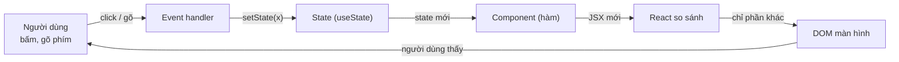

**Đọc sơ đồ:** Bắt đầu ở “Người dùng” (trái trên), đi theo chiều kim đồng hồ: sự kiện → hàm xử lý → state → React gọi lại component → so sánh → sửa DOM → người dùng thấy kết quả. Cả session chỉ là vòng này. *Màu: viền terracotta dày = phần của bài này · be = phần còn lại của vòng. Mũi tên ghi thứ đi qua.*


Lộ trình: 5 bài ngắn, mỗi bài một mảnh của vòng lặp, rồi Lab ghép tất cả thành app Todo.

| Bài | Học gì | Mảnh nào của vòng lặp |
|---|---|---|
| 1 | Component & props | Component (hàm) → DOM |
| 2 | State & khi nào render lại | Event → State → Component |
| 3 | Danh sách & `key` | React so sánh |
| 4 | Controlled input | Người dùng gõ → State |
| 5 | Lifting state & derived state | State đặt ở đâu, cái gì *không* là state |
| Lab | Todo app | Cả vòng |

### Chuẩn bị project

Session này là **bãi tập riêng**, chưa đụng monorepo Nexus (giao diện Nexus bắt đầu từ S1.3). Dùng Vite (công cụ chạy dev server và đóng gói code front-end) với template React + TypeScript:

```bash title="terminal"
npm create vite@latest s1-1-todo -- --template react-ts
cd s1-1-todo
npm install
npm run dev
```

Kết quả thật khi mình chạy lệnh tạo project (Node v22.22.2, Vite 8, React 19.2, TypeScript 6):

```console title="output"
$ npm create vite@latest s1-1-todo -- --template react-ts
o  Scaffolding project in /home/claude/s1-1-todo...
—  Done. Now run:

  cd s1-1-todo
  npm install
  npm run dev
```

Mở `http://localhost:5173`. Xoá `src/App.css` và thư mục `src/assets` — ta sẽ tự viết lại từ đầu.

> **Luật của session:** mỗi bài có đoạn code nhỏ. Gõ lại bằng tay trong `App.tsx`, đừng copy. Ngón tay nhớ lâu hơn mắt.

## Bài 1 — Component & props

**Nó là gì (1 câu):** component giống **cái khuôn đổ bánh flan** — viết khuôn một lần, đổ ra bao nhiêu cái cũng được; còn props là **topping bạn chọn cho từng cái** (cùng khuôn, cái này caramel, cái kia cà phê).

**Sơ đồ tổng** — bài này nằm ở đoạn *Component → DOM*:

**Sơ đồ (Luồng dữ liệu) — Một cú bấm đi vòng qua React thế nào?**

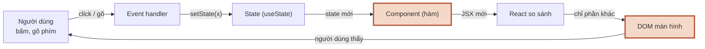

**Đọc sơ đồ:** Vòng lặp của cả session; phần tô viền terracotta là đoạn bài này đào sâu — Bài 1: Component → DOM. *Màu: viền terracotta dày = phần của bài này · be = phần còn lại của vòng. Mũi tên ghi thứ đi qua.*


### 1.1 Component là gì

**Ẩn dụ:** component là khuôn bánh. Bạn không vẽ từng cái bánh; bạn làm khuôn, React đổ ra.

**Sơ đồ:** trước khi viết component đầu tiên, xem file `.tsx` của bạn đi đường nào để thành thứ trên màn hình.

**Sơ đồ (Bản đồ dịch vụ) — File .tsx của bạn chạy ở đâu để thành giao diện?**

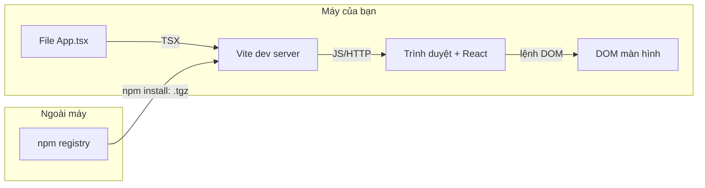

**Đọc sơ đồ:** Đọc từ trái sang: bạn gõ App.tsx → Vite biên dịch JSX thành JS → trình duyệt chạy React → React sửa DOM. Chỉ lệnh npm install đi ra ngoài máy (tải package về một lần). *Màu: vùng nét đứt = nơi chạy (trong máy / ngoài máy) · mũi tên ghi định dạng dữ liệu đi qua.*


**Chi tiết kỹ thuật:**

Component trong React **chỉ là một hàm JavaScript trả về JSX** (JSX — cú pháp trông như HTML viết thẳng trong JS; Vite biên dịch nó thành lời gọi hàm thường).

```tsx title="src/App.tsx"
function Greeting() {
  return <p className="greet">Chào buổi sáng ☕</p>;
}

export default function App() {
  return (
    <main>
      <h1>Việc hôm nay</h1>
      <Greeting />
      <Greeting />
    </main>
  );
}
```

Bốn luật JSX gặp ngay trong ngày đầu:

1. **Tên component viết hoa chữ đầu** (`Greeting`, không phải `greeting`). Chữ thường thì React hiểu là thẻ HTML.
2. **Trả về đúng một phần tử gốc.** Muốn trả hai thứ ngang hàng thì bọc bằng Fragment (phần tử rỗng không sinh ra thẻ HTML nào): `<>...</>`.
3. **`className` thay cho `class`, `htmlFor` thay cho `for`** — vì `class` và `for` là từ khoá của JavaScript.
4. **`{ }` để nhúng biểu thức JS**: `<p>Còn {3 - 1} việc</p>`. Trong ngoặc nhọn chỉ được *biểu thức* (thứ trả ra giá trị), không được `if`/`for` — dùng toán tử ba ngôi `a ? b : c` hoặc `&&`.

### 1.2 Props: truyền dữ liệu từ cha xuống con

**Ẩn dụ:** props như **phiếu order** thu ngân đưa cho barista. Barista đọc phiếu để pha, nhưng không được tự sửa phiếu. Muốn đổi món, barista phải gọi thu ngân.

**Sơ đồ:** bấm các kịch bản để thấy dữ liệu chảy xuống, và điều gì xảy ra khi con muốn đổi dữ liệu.

**Sơ đồ (Luồng dữ liệu) — Props chảy theo hướng nào, và con muốn đổi thì làm sao?**

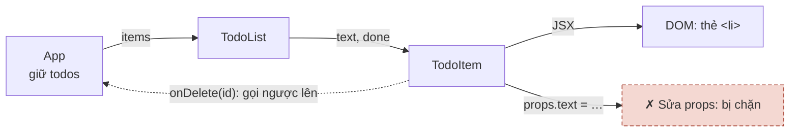

**Đọc sơ đồ:** Đọc hàng trên từ trái sang: App đưa items xuống TodoList, TodoList đưa text/done xuống TodoItem, TodoItem vẽ ra thẻ <li>. Đường nét đứt phía dưới là cách duy nhất để con ‘nói’ với cha: gọi hàm cha truyền xuống. *Màu: đỏ gạch + ✗ + viền đứt = bị chặn/sai · vàng mù tạt + ? + viền chấm = cần xem lại · xanh ô-liu + ✓ = chạy đúng. Nét đứt = callback gọi ngược lên.*


**Chi tiết kỹ thuật:**

Props (viết tắt của *properties*) là **một object duy nhất** React đưa vào hàm component. Ta thường destructure (tách object thành biến) ngay ở tham số, và khai báo kiểu bằng TypeScript:

```tsx title="src/App.tsx"
type TodoItemProps = {
  text: string;
  done: boolean;
  onDelete: () => void; // hàm cũng là props
};

function TodoItem({ text, done, onDelete }: TodoItemProps) {
  return (
    <li>
      <span className={done ? 'done' : undefined}>{text}</span>
      <button onClick={onDelete}>Xoá</button>
    </li>
  );
}

export default function App() {
  return (
    <ul>
      <TodoItem text="Pha cà phê phin" done={true} onDelete={() => alert('xoá 1')} />
      <TodoItem text="Tưới cây" done={false} onDelete={() => alert('xoá 2')} />
    </ul>
  );
}
```

Ba điều phải khắc cốt:

- **Props chỉ đọc (read-only).** Con không được gán `props.text = ...`. Dữ liệu chảy **một chiều**: cha → con.
- **Con muốn “đổi” thì gọi hàm cha đưa xuống** (callback — hàm truyền đi để người khác gọi lại). `onDelete` ở trên là callback. Quy ước đặt tên: prop là `onXxx`, hàm xử lý ở cha là `handleXxx`.
- **Chuỗi thì dùng ngoặc kép, mọi thứ khác dùng `{}`**: `text="Tưới cây"` nhưng `done={false}`, `count={3}`. Viết `done="false"` là truyền *chuỗi* `"false"` — mà chuỗi khác rỗng thì luôn là truthy (được coi là đúng)!

### Nhìn lại bức tranh lớn

**Sơ đồ (Luồng dữ liệu) — Một cú bấm đi vòng qua React thế nào?**


**Đọc sơ đồ:** Cùng vòng lặp như đầu bài; phần tô viền terracotta là thứ bạn vừa học — Bài 1: Component → DOM. Bấm “Chạy một vòng” để xem nó nằm ở đâu trong cả vòng. *Màu: viền terracotta dày = phần của bài này · be = phần còn lại của vòng. Mũi tên ghi thứ đi qua.*


Bạn vừa học đoạn **Component → DOM**: component là hàm trả JSX, nhận props từ cha. Nhưng tới giờ mọi thứ còn *đứng yên* — bấm nút chưa làm gì đổi được. Bài 2 sẽ lắp phần còn thiếu của vòng: **State**.

### Tự vẽ lại

1. Kể bằng lời: file `App.tsx` bạn gõ đi qua những “trạm” nào để thành chữ trên màn hình?
2. Vì sao `TodoItem` không được tự sửa `text` của nó? Nếu muốn xoá chính nó thì nó làm gì?
3. `done="false"` và `done={false}` khác nhau thế nào, và cái nào gây bug?

## Bài 2 — State & khi nào render lại

**Nó là gì (1 câu):** state là **trí nhớ của component** — như tấm bảng phấn “Hôm nay còn 3 bánh croissant” trong quán: muốn cả quán biết số mới, bạn phải *xoá bảng và viết lại*, chứ nhẩm trong đầu thì không ai thấy.

**Sơ đồ tổng** — bài này nằm ở đoạn *Event → State → Component*:

**Sơ đồ (Luồng dữ liệu) — Một cú bấm đi vòng qua React thế nào?**

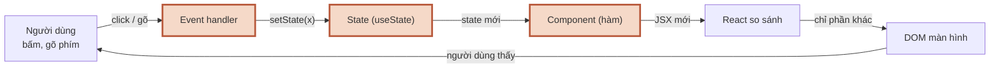

**Đọc sơ đồ:** Vòng lặp của cả session; phần tô viền terracotta là đoạn bài này đào sâu — Bài 2: Event → State → Component. *Màu: viền terracotta dày = phần của bài này · be = phần còn lại của vòng. Mũi tên ghi thứ đi qua.*


### 2.1 useState: trí nhớ + cái chuông báo

**Ẩn dụ:** `useState` đưa bạn hai thứ: **tấm bảng** (giá trị hiện tại) và **cái chuông** (hàm set). Viết lên bảng mà không rung chuông thì bếp không làm đĩa mới.

**Sơ đồ:** đi theo thứ tự từng mũi tên khi bạn bấm nút “+1”. Thử cả 4 kịch bản — kịch bản 2 và 3 là câu hỏi phỏng vấn kinh điển.

**Sơ đồ (Trình tự) — Ai nói gì với ai khi bạn bấm nút +1?**

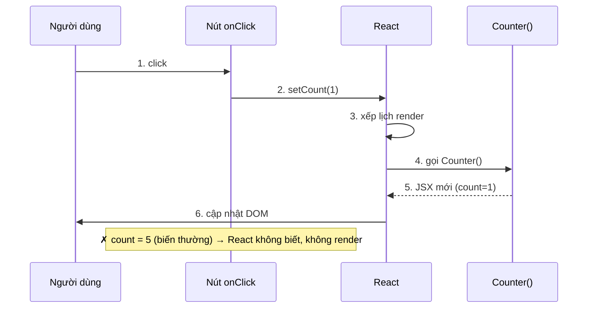

**Đọc sơ đồ:** Mỗi cột là một bên, đọc mũi tên theo số ①→⑥ từ trên xuống. Ô đỏ giữa cột ‘Nút onClick’ là đường sai: gán biến thường. *Màu: đỏ gạch + ✗ + viền đứt = bị chặn/sai · vàng mù tạt + ? + viền chấm = cần xem lại · xanh ô-liu + ✓ = chạy đúng.*


**Chi tiết kỹ thuật:**

```tsx title="src/App.tsx"
import { useState } from 'react';

export default function Counter() {
  const [count, setCount] = useState(0); // [giá trị, hàm set] = useState(giá trị ban đầu)

  return (
    <button onClick={() => setCount(count + 1)}>
      Đã uống {count} ly
    </button>
  );
}
```

- `useState` là một **Hook** (hàm đặc biệt của React, tên bắt đầu bằng `use`). Luật Hook: chỉ gọi ở **đầu** component, không gọi trong `if`, vòng lặp hay hàm lồng.
- **Vì sao biến thường không được?** `let count = 0; count++` — (1) mỗi lần render hàm chạy lại từ đầu nên `count` về 0; (2) gán biến không báo cho React, nên React không render lại.
- **Snapshot (ảnh chụp):** trong một lần render, `count` là **hằng số**. Gọi `setCount(count + 1)` ba lần liền thì cả ba đều đọc cùng `count = 0` → kết quả chỉ +1.
- **Updater function (hàm cập nhật):** `setCount(c => c + 1)` — React đưa giá trị *mới nhất* vào `c`. Gọi ba lần → +3. Quy tắc: **giá trị mới phụ thuộc giá trị cũ thì dùng updater.**
- **Batching (gom lô):** nhiều lần set trong cùng một event chỉ gây **một** lần render.

### 2.2 Khi nào component render lại?

**Ẩn dụ:** quản lý quán chỉ bảo bếp làm lại đĩa khi có ai **rung chuông** *và* **order thật sự khác** order cũ.

**Sơ đồ:** bấm từng kịch bản để thấy React chọn nhánh nào.

**Sơ đồ (Luồng quyết định) — Khi nào component render lại?**

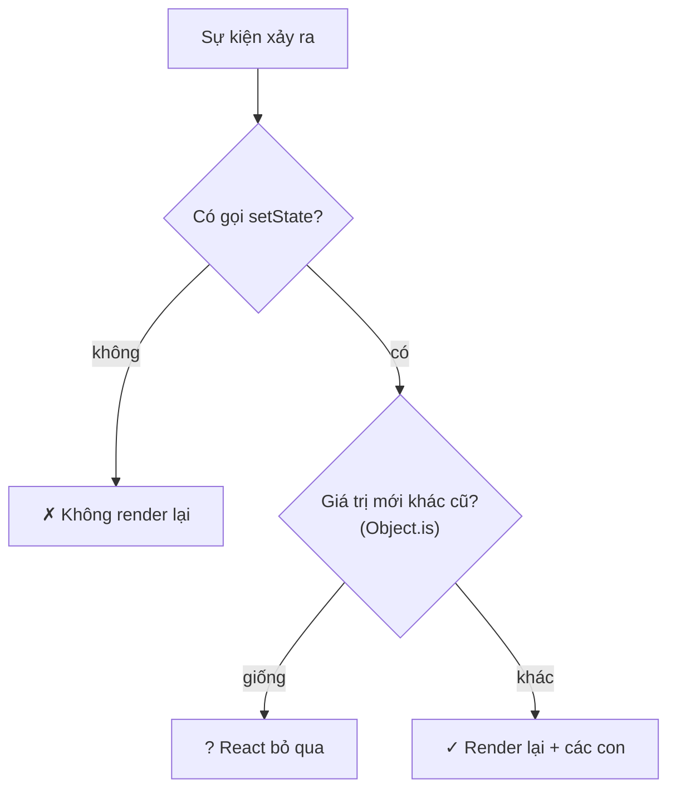

**Đọc sơ đồ:** Đọc từ trên xuống: mỗi ô vàng nhạt là một câu hỏi React tự đặt ra. Rẽ ngang sang phải là dừng; đi thẳng xuống cuối là render lại. *Màu: đỏ gạch + ✗ + viền đứt = bị chặn/sai · vàng mù tạt + ? + viền chấm = cần xem lại · xanh ô-liu + ✓ = chạy đúng.*


**Chi tiết kỹ thuật:**

“Render” trong React = **React gọi lại hàm component của bạn** để lấy JSX mới. Chưa phải là vẽ lại màn hình — vẽ lại chỉ xảy ra ở bước sau, và chỉ với phần khác.

Component render lại khi:

1. **State của chính nó đổi** (qua hàm set, giá trị mới khác cũ theo `Object.is` — phép so sánh “có phải cùng một thứ không”).
2. **Component cha render lại** → mặc định mọi con cũng render lại (dù props y hệt). Điều này bình thường và thường rất nhanh; tối ưu để sau.

Bẫy lớn nhất với mảng/object — **đừng sửa trực tiếp (mutate), hãy tạo bản mới (immutable update)**:

```tsx title="mutate vs tạo mới"
// ✗ SAI: sửa mảng cũ → cùng tham chiếu → React tưởng không đổi
todos.push(newTodo);
setTodos(todos);

// ✓ ĐÚNG: tạo mảng mới
setTodos([...todos, newTodo]);                                // thêm
setTodos(todos.filter((t) => t.id !== id));                     // xoá
setTodos(todos.map((t) => (t.id === id ? { ...t, done: !t.done } : t))); // sửa 1 phần tử
```

> **Vì sao dev log in hai lần?** `main.tsx` bọc app trong `<StrictMode>`. Ở chế độ dev, React cố ý gọi component **hai lần** để bắt bug do component không “thuần” (pure — cùng input thì cùng output, không đụng thứ bên ngoài). Bản build production chỉ gọi một lần. Đừng tắt StrictMode.

### Nhìn lại bức tranh lớn

**Sơ đồ (Luồng dữ liệu) — Một cú bấm đi vòng qua React thế nào?**


**Đọc sơ đồ:** Cùng vòng lặp như đầu bài; phần tô viền terracotta là thứ bạn vừa học — Bài 2: Event → State → Component. Bấm “Chạy một vòng” để xem nó nằm ở đâu trong cả vòng. *Màu: viền terracotta dày = phần của bài này · be = phần còn lại của vòng. Mũi tên ghi thứ đi qua.*


Bạn vừa học trái tim của React: **Event → setState → React gọi lại component**. Vòng lặp giờ đã quay được. Nhưng khi component trả về *cả một danh sách*, React làm sao biết dòng nào là dòng nào? Bài 3.

### Tự vẽ lại

1. Kể 6 bước từ lúc bạn bấm “+1” tới lúc thấy số mới, không nhìn sơ đồ.
2. Vì sao `setCount(count + 1)` ×3 chỉ +1, còn `setCount(c => c + 1)` ×3 thì +3?
3. `todos.push(x); setTodos(todos)` sai ở đâu, và sửa thế nào?

## Bài 3 — Danh sách & key

**Nó là gì (1 câu):** `key` giống **số thẻ gửi xe** — xe có bị dời chỗ trong bãi thì bảo vệ vẫn trả đúng xe nhờ số thẻ, chứ không nhờ “chiếc thứ ba từ trái sang”.

**Sơ đồ tổng** — bài này nằm ở bước *React so sánh*:

**Sơ đồ (Luồng dữ liệu) — Một cú bấm đi vòng qua React thế nào?**

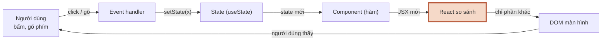

**Đọc sơ đồ:** Vòng lặp của cả session; phần tô viền terracotta là đoạn bài này đào sâu — Bài 3: React so sánh (key). *Màu: viền terracotta dày = phần của bài này · be = phần còn lại của vòng. Mũi tên ghi thứ đi qua.*


### 3.1 Từ mảng dữ liệu tới danh sách: `.map()`

**Ẩn dụ:** `.map()` là **dây chuyền đóng gói**: mỗi hạt cà phê đi vào một đầu, ra đầu kia thành một gói — số gói bằng số hạt.

**Sơ đồ:**

**Sơ đồ (Luồng dữ liệu) — Mảng dữ liệu biến thành danh sách trên màn hình thế nào?**

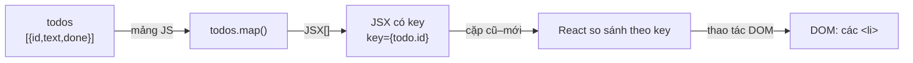

**Đọc sơ đồ:** Đọc từ trái sang: mảng todos đi qua .map() thành mảng JSX, mỗi phần tử mang một key; React dùng key để ghép cặp với lần trước rồi chỉ sửa DOM chỗ khác. *Màu: đỏ gạch + ✗ + viền đứt = bị chặn/sai · vàng mù tạt + ? + viền chấm = cần xem lại · xanh ô-liu + ✓ = chạy đúng. Nhãn trên mũi tên = định dạng dữ liệu.*


**Chi tiết kỹ thuật:**

```tsx title="src/App.tsx"
type Todo = { id: string; text: string; done: boolean };

const todos: Todo[] = [
  { id: 't1', text: 'Pha cà phê phin', done: true },
  { id: 't2', text: 'Đọc react.dev', done: false },
];

export default function App() {
  return (
    <ul>
      {todos.map((todo) => (
        <li key={todo.id}>{todo.text}</li>
      ))}
    </ul>
  );
}
```

- JSX nhận được **một mảng phần tử** — `.map()` trả đúng thứ đó.
- Lọc trước rồi map: `todos.filter(t => !t.done).map(...)`.
- `key` đặt ở **phần tử ngoài cùng** trong `map` (ở đây là `<li>`; nếu map ra `<TodoItem>` thì đặt ở `<TodoItem key=...>`).

### 3.2 `key`: số thẻ gửi xe của từng dòng

**Ẩn dụ:** khi danh sách đổi (thêm, xoá, sắp xếp), React so danh sách mới với cũ. Có số thẻ ổn định thì React trả đúng “xe” — kèm mọi thứ gắn với nó (state bên trong, chữ đang gõ trong ô, focus).

**Sơ đồ:** thử 4 cách đặt key.

**Sơ đồ (Luồng quyết định) — Khi list đổi, React giữ đúng phần tử nào?**

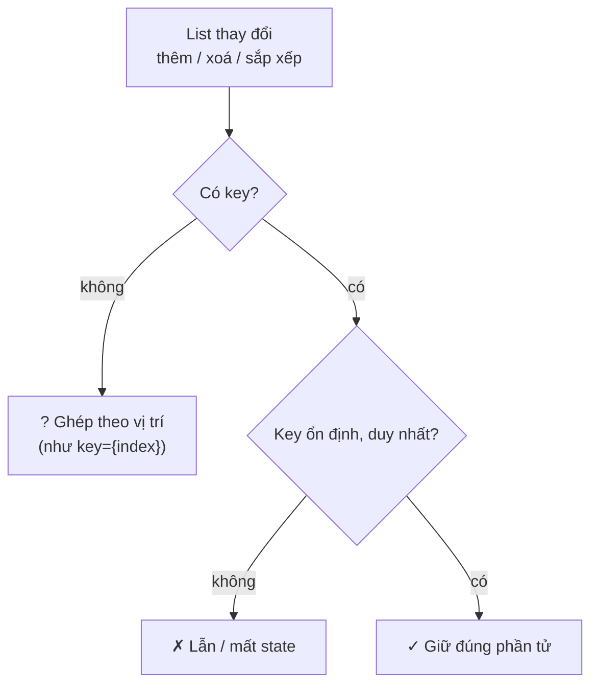

**Đọc sơ đồ:** Đọc từ trên xuống: React hỏi hai câu về key của mỗi dòng. Chỉ nhánh đi thẳng xuống đáy mới giữ đúng state từng dòng. *Màu: đỏ gạch + ✗ + viền đứt = bị chặn/sai · vàng mù tạt + ? + viền chấm = cần xem lại · xanh ô-liu + ✓ = chạy đúng.*


**Tự thấy bug bằng tay** — bên trái dùng `key={index}`, bên phải dùng `key={todo.id}`. Mỗi ô ghi chú đang ghi đúng tên việc của dòng đó. Bấm “Xoá dòng đầu” và nhìn cột trái:

> *(Bản HTML có demo bấm được ở đây. Trong MD: làm thí nghiệm 1 ở Bước 8 của Lab để thấy bug y hệt.)*

**Chi tiết kỹ thuật:**

- `key` phải **duy nhất giữa các anh em** (trong cùng một danh sách) và **ổn định** (cùng một mục thì cùng key qua mọi lần render).
- **Nguồn key tốt nhất:** id từ dữ liệu (id trong database). Tạo mới ở client thì dùng `crypto.randomUUID()` **lúc tạo dữ liệu**, không phải lúc render.
- **`key={index}`** chỉ tạm chấp nhận khi danh sách **không bao giờ** thêm/xoá/sắp xếp và dòng không có state. Todo thì có xoá → cấm.
- **`key={Math.random()}`** là tệ nhất: mỗi render key mới → React huỷ và tạo lại mọi dòng → mất focus, mất chữ đang gõ, chậm.
- `key` **không phải prop**: component con không đọc được `props.key`. Cần id thì truyền thêm `id={todo.id}` hoặc cả `todo`.

### Nhìn lại bức tranh lớn

**Sơ đồ (Luồng dữ liệu) — Một cú bấm đi vòng qua React thế nào?**


**Đọc sơ đồ:** Cùng vòng lặp như đầu bài; phần tô viền terracotta là thứ bạn vừa học — Bài 3: React so sánh (key). Bấm “Chạy một vòng” để xem nó nằm ở đâu trong cả vòng. *Màu: viền terracotta dày = phần của bài này · be = phần còn lại của vòng. Mũi tên ghi thứ đi qua.*


Bạn vừa học bước **React so sánh**: với danh sách, `key` là thứ React dùng để ghép cặp cũ–mới. Key sai = ghép nhầm = state dính sang dòng khác. Giờ đến lượt dữ liệu *từ người dùng* đi vào vòng lặp — bài 4.

### Tự vẽ lại

1. Kể lại chuyện gì xảy ra ở cột trái demo khi xoá dòng đầu, dùng từ “vị trí” và “ô input”.
2. Vì sao `Math.random()` làm key còn tệ hơn index?
3. Todo mới tạo ở client lấy id từ đâu, và tạo vào lúc nào?

## Bài 4 — Controlled input

**Nó là gì (1 câu):** controlled input giống **máy pha có bảng điều khiển điện tử**: vặn núm không trực tiếp đổi nhiệt độ — núm gửi tín hiệu lên bảng điều khiển (state), bảng quyết định rồi mới hiển thị con số.

**Sơ đồ tổng** — bài này nằm ở đoạn *Người dùng → Event → State*:

**Sơ đồ (Luồng dữ liệu) — Một cú bấm đi vòng qua React thế nào?**

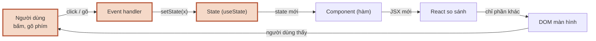

**Đọc sơ đồ:** Vòng lặp của cả session; phần tô viền terracotta là đoạn bài này đào sâu — Bài 4: Người dùng gõ → State. *Màu: viền terracotta dày = phần của bài này · be = phần còn lại của vòng. Mũi tên ghi thứ đi qua.*


### 4.1 Ai giữ giá trị của ô input?

**Ẩn dụ:** ô `<input>` bình thường tự nhớ chữ trong nó (như sổ tay riêng của barista). Controlled input bắt nó **không được tự nhớ** — chữ hiển thị luôn là thứ state của React nói.

**Sơ đồ:** một vòng tròn khép kín, state là nguồn sự thật duy nhất (single source of truth).

**Sơ đồ (Luồng dữ liệu) — Giá trị ô input nằm ở đâu và đi vòng thế nào?**

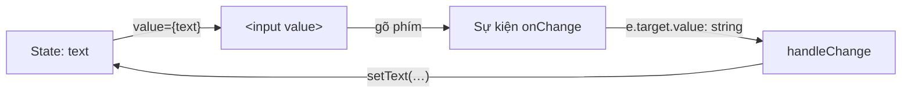

**Đọc sơ đồ:** Đọc theo chiều kim đồng hồ từ góc trái trên: state đẩy value vào ô → người dùng gõ tạo event → handler đọc chuỗi → setText ghi vào state. Ô input không tự nhớ gì. *Màu: be = mọi bước đều đi qua React · mũi tên ghi định dạng dữ liệu (string).*


**Chi tiết kỹ thuật:**

```tsx title="src/App.tsx"
import { useState } from 'react';

export default function App() {
  const [text, setText] = useState('');

  return (
    <label>
      Việc mới{' '}
      <input value={text} onChange={(e) => setText(e.target.value)} />
      <small>{text.length}/80</small>
    </label>
  );
}
```

Hai mảnh luôn đi cặp: **`value={text}`** (state → ô) và **`onChange`** (ô → state). Thiếu `onChange` thì ô bị khoá cứng và React cảnh báo trong console.

Lợi ích: vì chữ đi qua state, bạn làm được mọi thứ *mỗi phím gõ* — đếm ký tự, khoá nút khi rỗng, viết hoa, xoá sạch ô bằng `setText('')`.

### 4.2 Một phím gõ đi qua những ai?

**Ẩn dụ:** như một order đi qua quầy: khách nói → thu ngân ghi → bảng order cập nhật → barista làm theo bảng.

**Sơ đồ:** bấm “Quên onChange” và “Chặn quá 40 ký tự” để thấy hai đường rẽ.

**Sơ đồ (Trình tự) — Một phím gõ đi qua những ai, theo thứ tự nào?**

```mermaid
sequenceDiagram
    participant U as Người dùng
    participant I as &lt;input&gt;
    participant H as handleChange
    participant S as State text
    U->>I: 1. gõ 'a'
    I->>H: 2. onChange(e)
    H->>S: 3. setText('a')
    S->>I: 4. render: value='a'
    I->>U: 5. thấy chữ 'a'
    Note over I: ✗ thiếu onChange → ô bị khoá
    Note over H: ? quá 40 ký tự → không set
```

**Đọc sơ đồ:** Mỗi cột là một bên, đọc ①→⑤ từ trên xuống. Hai ô ở đáy là hai đường rẽ: quên onChange (bị khoá) và handler cố ý không set (chặn). *Màu: đỏ gạch + ✗ + viền đứt = bị chặn/sai · vàng mù tạt + ? + viền chấm = cần xem lại · xanh ô-liu + ✓ = chạy đúng.*


**Chi tiết kỹ thuật — form hoàn chỉnh:**

```tsx title="src/App.tsx"
import { useState, type FormEvent } from 'react';

export default function App() {
  const [text, setText] = useState('');
  const trimmed = text.trim(); // derived: tính mỗi render, không cần state

  function handleSubmit(e: FormEvent<HTMLFormElement>) {
    e.preventDefault(); // chặn trình duyệt submit kiểu cũ (tải lại trang)
    if (!trimmed) return;
    console.log('Thêm:', trimmed);
    setText(''); // ô trống lại vì value bám theo state
  }

  return (
    <form onSubmit={handleSubmit}>
      <label htmlFor="new-todo">Việc mới</label>
      <input id="new-todo" value={text} onChange={(e) => setText(e.target.value)} />
      <button type="submit" disabled={!trimmed}>Thêm</button>
    </form>
  );
}
```

- **`e.target.value` luôn là chuỗi** (string), kể cả `<input type="number">`. Cần số thì `Number(...)`.
- **Checkbox dùng `checked`**, không dùng `value`: `<input type="checkbox" checked={done} onChange={...} />`.
- **Dùng `<form onSubmit>`** thay vì `onClick` trên nút → nhấn Enter cũng submit, đúng chuẩn accessibility (khả năng dùng được cho mọi người, kể cả dùng bàn phím/trình đọc màn hình).
- Ngược lại là **uncontrolled input** (DOM tự giữ giá trị, đọc bằng `defaultValue`/ref lúc submit). Ở S1.4, React Hook Form dùng cách này để form lớn nhanh hơn — lúc đó bạn sẽ hiểu vì sao.

### Nhìn lại bức tranh lớn

**Sơ đồ (Luồng dữ liệu) — Một cú bấm đi vòng qua React thế nào?**


**Đọc sơ đồ:** Cùng vòng lặp như đầu bài; phần tô viền terracotta là thứ bạn vừa học — Bài 4: Người dùng gõ → State. Bấm “Chạy một vòng” để xem nó nằm ở đâu trong cả vòng. *Màu: viền terracotta dày = phần của bài này · be = phần còn lại của vòng. Mũi tên ghi thứ đi qua.*


Bạn vừa nối **người dùng** vào vòng lặp: mỗi phím gõ → event → state → render → ô hiện chữ. Giờ app có nhiều state rải rác: todos, filter, chữ đang gõ… Đặt chúng ở đâu, và cái gì *không nên* là state? Bài cuối.

### Tự vẽ lại

1. Kể 5 bước của một phím gõ trong controlled input.
2. Vì sao quên `onChange` thì không gõ được?
3. Muốn xoá trống ô sau khi thêm todo, bạn làm gì — đụng vào DOM hay đụng vào state?

## Bài 5 — Lifting state & derived state

**Nó là gì (1 câu):** nâng state lên giống **đặt bình nước chung giữa bàn**: ai cần thì rót từ đó, thay vì mỗi người ôm một bình rồi lượng nước lệch nhau.

**Sơ đồ tổng** — bài này nói về *vị trí* của ô State:

**Sơ đồ (Luồng dữ liệu) — Một cú bấm đi vòng qua React thế nào?**

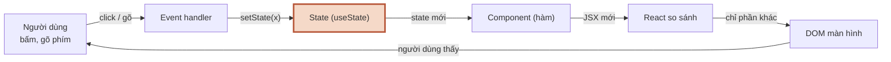

**Đọc sơ đồ:** Vòng lặp của cả session; phần tô viền terracotta là đoạn bài này đào sâu — Bài 5: State đặt ở đâu. *Màu: viền terracotta dày = phần của bài này · be = phần còn lại của vòng. Mũi tên ghi thứ đi qua.*


### 5.1 Lifting state up: nâng lên cha chung gần nhất

**Ẩn dụ:** khi hai component cần **cùng một** dữ liệu, đừng để mỗi đứa giữ một bản — nâng nó lên **cha chung gần nhất**, rồi cha chia xuống bằng props.

**Sơ đồ:** cây component của app Todo. Bấm từng kịch bản để thấy một hành động ở con đi lên cha rồi toả xuống các con khác.

**Sơ đồ (Luồng dữ liệu) — State đặt ở đâu để các component con cùng thấy?**

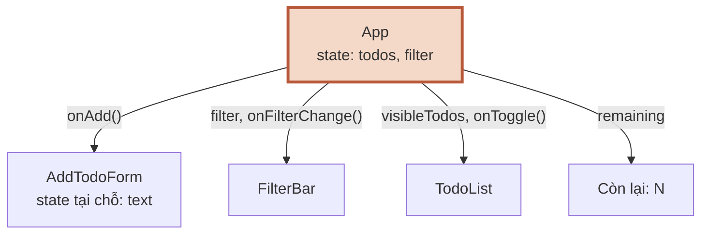

**Đọc sơ đồ:** Đọc từ App (trên) xuống 4 con: mũi tên là props đi xuống. Prop nào là hàm (có dấu ()) thì đó là đường để con gọi ngược lên App. *Màu: viền terracotta = nơi giữ state chung · be = component chỉ nhận props (hoặc có state tại chỗ).*


**Chi tiết kỹ thuật:**

- `FilterBar` đổi filter, `TodoList` cần filter để lọc → filter phải ở **cha chung** là `App`.
- `AddTodoForm` thêm todo, `TodoList` và dòng “Còn lại” đọc todos → todos ở `App`.
- Con thay đổi dữ liệu của cha **chỉ bằng cách gọi callback**: `onAdd(text)`, `onFilterChange('done')`, `onToggle(id)`.
- Ngược lại, **đừng nâng thứ chỉ một nơi cần**: chữ đang gõ trong form thêm việc chỉ `AddTodoForm` dùng → để state *tại chỗ* trong form. State nâng càng cao, càng nhiều component render lại khi nó đổi.

### 5.2 Derived state: cái gì tính được thì đừng lưu

**Ẩn dụ:** hoá đơn quán không cần ô “tổng tiền” ghi tay — cứ cộng từ các món mỗi lần in. Ghi tay thì sớm muộn sẽ quên sửa khi khách gọi thêm món.

**Sơ đồ:** chạy lần lượt 5 thứ trong app Todo qua bộ câu hỏi này.

**Sơ đồ (Luồng quyết định) — X có nên là state không — và đặt ở đâu?**

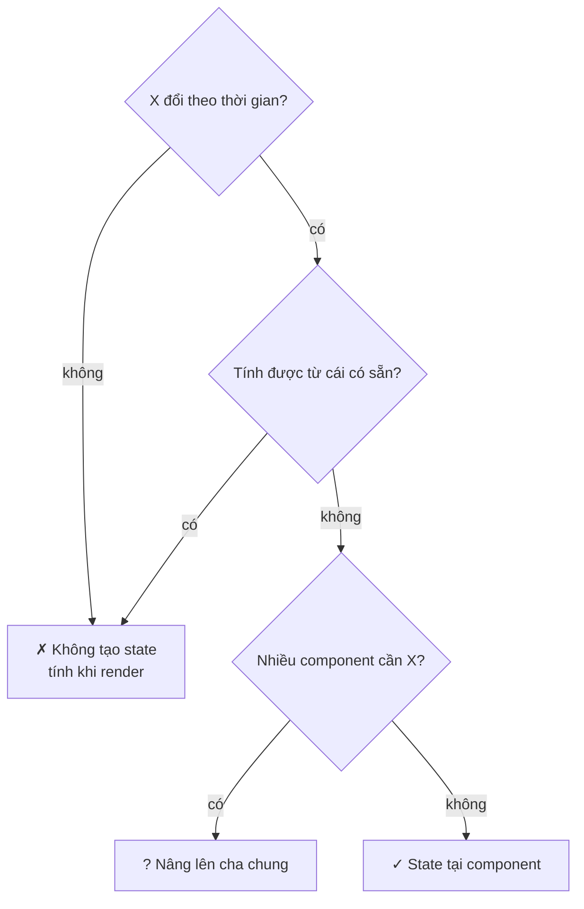

**Đọc sơ đồ:** Đọc từ trên xuống, trả lời từng câu cho dữ liệu X. Nhánh phải trên cùng = không cần state; đáy chia hai: nâng lên cha hoặc để tại chỗ. *Màu: đỏ gạch + ✗ + viền đứt = đừng tạo state · vàng mù tạt + ? = state, nhưng nâng lên cha chung · xanh ô-liu + ✓ = state tại chỗ.*


**Chi tiết kỹ thuật — đây chính là AC #1 của session:**

```tsx title="✗ state trùng lặp"
const [todos, setTodos] = useState<Todo[]>([]);
const [remaining, setRemaining] = useState(0);        // ✗ suy ra được từ todos
const [visibleTodos, setVisibleTodos] = useState<Todo[]>([]); // ✗ suy ra được từ todos + filter
// → mỗi lần sửa todos phải nhớ sửa 2 chỗ kia. Quên một lần = UI nói dối.
```

```tsx title="✓ chỉ lưu nguồn, còn lại tính khi render"
const [todos, setTodos] = useState<Todo[]>([]);
const [filter, setFilter] = useState<Filter>('all');

const visibleTodos = todos.filter((t) => matchesFilter(t, filter));
const remaining = todos.filter((t) => !t.done).length;
```

react.dev gợi ý ba câu hỏi: một dữ liệu **không** là state nếu (1) nó không đổi theo thời gian, (2) nó được cha truyền qua props, hoặc (3) nó tính được từ state/props đang có.

> **Lo tính lại mỗi render có chậm không?** Với vài trăm phần tử, `filter` tốn chưa tới một mili-giây. Đừng tối ưu sớm. `useMemo` (ghi nhớ kết quả tính) là chuyện của S1.2, và chỉ dùng khi đo thấy chậm thật.

> **Anti-pattern (mẫu sai hay gặp) cần né:** dùng `useEffect` để “đồng bộ” derived state — `useEffect(() => setRemaining(...), [todos])`. Nó gây render hai lần và lệch dữ liệu một nhịp. S1.2 có hẳn bài “You Might Not Need an Effect” về chuyện này.

### Nhìn lại bức tranh lớn

**Sơ đồ (Luồng dữ liệu) — Một cú bấm đi vòng qua React thế nào?**

```mermaid
flowchart LR
    user["Người dùng<br/>bấm, gõ phím"] -- "click / gõ" --> handler["Event handler"]
    handler -- "setState(x)" --> state["State (useState)"]
    state -- "state mới" --> comp["Component (hàm)"]
    comp -- "JSX mới" --> diff["React so sánh"]
    diff -- "chỉ phần khác" --> dom["DOM màn hình"]
    dom -- "người dùng thấy" --> user
    classDef hl fill:#f5d9c8,stroke:#b8583a,stroke-width:3px
    class state hl
```

**Đọc sơ đồ:** Cùng vòng lặp như đầu bài; phần tô viền terracotta là thứ bạn vừa học — Bài 5: State đặt ở đâu. Bấm “Chạy một vòng” để xem nó nằm ở đâu trong cả vòng. *Màu: viền terracotta dày = phần của bài này · be = phần còn lại của vòng. Mũi tên ghi thứ đi qua.*


Vòng lặp đã đủ: component nhận props, state giữ trí nhớ, event gọi set, React so sánh bằng key, input bám theo state — và giờ bạn biết **đặt state ở đâu** và **cái gì không phải state**. Vào Lab.

### Tự vẽ lại

1. `filter` nằm ở `App` chứ không ở `FilterBar`. Giải thích bằng tên hai component cần nó.
2. Vì sao `remaining` không phải state? Nếu lỡ để nó là state, bug trông như thế nào?
3. Chữ đang gõ trong form thêm việc nên ở đâu, và vì sao không nâng lên `App`?

## Lab — App Todo: thêm / sửa / xoá / lọc

Mục tiêu: ghép 5 bài thành một app. Làm **theo thứ tự**, mỗi bước chạy được rồi mới sang bước sau. Tự gõ trước; chỉ mở code mẫu khi kẹt quá 15 phút.

Cấu trúc đích:

```text title="cấu trúc thư mục"
src/
├── main.tsx              (giữ nguyên của Vite)
├── index.css
├── types.ts              Todo, Filter, matchesFilter()
├── App.tsx               state: todos, filter · derived: visibleTodos, remaining
└── components/
    ├── AddTodoForm.tsx   state tại chỗ: text          (Bài 4)
    ├── FilterBar.tsx     props: filter, onFilterChange (Bài 5)
    ├── TodoList.tsx      map + key={todo.id}           (Bài 3)
    └── TodoItem.tsx      state tại chỗ: isEditing, draft
```

### Bước 1 — Kiểu dữ liệu (`types.ts`)

Khai báo `Todo` và `Filter` trước, để TypeScript dẫn đường cho mọi file sau. `matchesFilter` dùng `switch` trên union type (kiểu “một trong vài giá trị”) — thiếu một nhánh là TypeScript báo lỗi ngay.

```ts title="src/types.ts"
// Kiểu dữ liệu dùng chung cho cả app
export type Todo = {
  id: string; // id ổn định → dùng làm key
  text: string;
  done: boolean;
};

export type Filter = 'all' | 'active' | 'done';

export function matchesFilter(todo: Todo, filter: Filter): boolean {
  switch (filter) {
    case 'all':
      return true;
    case 'active':
      return !todo.done;
    case 'done':
      return todo.done;
  }
}
```

### Bước 2 — Form thêm việc (`AddTodoForm.tsx`) · Bài 4

Controlled input + `form onSubmit`. `text` là state *tại chỗ*; `trimmed` là derived.

```tsx title="src/components/AddTodoForm.tsx"
import { useState, type FormEvent } from 'react';

type Props = {
  onAdd: (text: string) => void; // callback: con gọi ngược lên cha
};

export default function AddTodoForm({ onAdd }: Props) {
  // State tại chỗ: chỉ form này cần biết chữ đang gõ
  const [text, setText] = useState('');
  const trimmed = text.trim(); // derived

  function handleSubmit(e: FormEvent<HTMLFormElement>) {
    e.preventDefault(); // chặn trình duyệt tải lại trang
    if (!trimmed) return;
    onAdd(trimmed);
    setText(''); // controlled → xoá state là ô input trống
  }

  return (
    <form className="add-form" onSubmit={handleSubmit}>
      <label htmlFor="new-todo">Việc mới</label>
      <input
        id="new-todo"
        value={text}
        onChange={(e) => setText(e.target.value)}
        maxLength={80}
        placeholder="Ví dụ: tưới cây"
      />
      <button type="submit" disabled={!trimmed}>
        Thêm
      </button>
    </form>
  );
}
```

### Bước 3 — Thanh lọc (`FilterBar.tsx`) · Bài 1 + 5

Component “ngốc” (chỉ hiển thị props và gọi callback, không có state). `aria-pressed` cho trình đọc màn hình biết nút nào đang bật.

```tsx title="src/components/FilterBar.tsx"
import type { Filter } from '../types';

const OPTIONS: { value: Filter; label: string }[] = [
  { value: 'all', label: 'Tất cả' },
  { value: 'active', label: 'Đang làm' },
  { value: 'done', label: 'Đã xong' },
];

type Props = {
  filter: Filter;
  onFilterChange: (filter: Filter) => void;
};

export default function FilterBar({ filter, onFilterChange }: Props) {
  return (
    <div className="filter-bar" role="group" aria-label="Lọc việc">
      {OPTIONS.map((opt) => (
        <button
          key={opt.value}
          type="button"
          aria-pressed={filter === opt.value}
          onClick={() => onFilterChange(opt.value)}
        >
          {opt.label}
        </button>
      ))}
    </div>
  );
}
```

### Bước 4 — Một dòng việc (`TodoItem.tsx`) · Bài 2 + 4

Chế độ sửa là state *tại chỗ* của từng dòng. `draft` là **bản nháp có chủ đích** — không phải state trùng lặp: nó chỉ sống trong lúc sửa, được nạp từ `todo.text` lúc bấm “Sửa”, và chỉ đẩy lên cha khi bấm “Lưu”. Huỷ thì bỏ nháp, dữ liệu gốc không bị động tới.

```tsx title="src/components/TodoItem.tsx"
import { useState } from 'react';
import type { Todo } from '../types';

type Props = {
  todo: Todo;
  onToggle: (id: string) => void;
  onEdit: (id: string, text: string) => void;
  onDelete: (id: string) => void;
};

export default function TodoItem({ todo, onToggle, onEdit, onDelete }: Props) {
  // State tại chỗ: chỉ dòng này cần biết nó có đang sửa không
  const [isEditing, setIsEditing] = useState(false);
  // Bản nháp có chủ đích: chỉ sống trong lúc sửa, lưu xong mới đẩy lên cha
  const [draft, setDraft] = useState('');

  function startEdit() {
    setDraft(todo.text);
    setIsEditing(true);
  }

  function save() {
    const next = draft.trim();
    if (next) onEdit(todo.id, next);
    setIsEditing(false);
  }

  if (isEditing) {
    return (
      <li className="todo-item editing">
        <input
          aria-label={`Sửa: ${todo.text}`}
          value={draft}
          onChange={(e) => setDraft(e.target.value)}
          onKeyDown={(e) => {
            if (e.key === 'Enter') save();
            if (e.key === 'Escape') setIsEditing(false);
          }}
          autoFocus
        />
        <button type="button" onClick={save}>Lưu</button>
        <button type="button" onClick={() => setIsEditing(false)}>Huỷ</button>
      </li>
    );
  }

  return (
    <li className="todo-item">
      <label>
        <input
          type="checkbox"
          checked={todo.done}
          onChange={() => onToggle(todo.id)}
        />
        <span className={todo.done ? 'done' : undefined}>{todo.text}</span>
      </label>
      <button type="button" onClick={startEdit}>Sửa</button>
      <button type="button" onClick={() => onDelete(todo.id)}>Xoá</button>
    </li>
  );
}
```

### Bước 5 — Danh sách (`TodoList.tsx`) · Bài 3

`key={todo.id}` và trạng thái rỗng có hướng dẫn.

```tsx title="src/components/TodoList.tsx"
import type { Todo } from '../types';
import TodoItem from './TodoItem';

type Props = {
  todos: Todo[];
  onToggle: (id: string) => void;
  onEdit: (id: string, text: string) => void;
  onDelete: (id: string) => void;
};

export default function TodoList({ todos, onToggle, onEdit, onDelete }: Props) {
  if (todos.length === 0) {
    return <p className="empty">Chưa có việc nào ở mục này.</p>;
  }

  return (
    <ul className="todo-list">
      {todos.map((todo) => (
        // key = id ổn định, KHÔNG dùng index
        <TodoItem
          key={todo.id}
          todo={todo}
          onToggle={onToggle}
          onEdit={onEdit}
          onDelete={onDelete}
        />
      ))}
    </ul>
  );
}
```

### Bước 6 — Ghép ở `App.tsx` · Bài 5

Chỉ **hai** state. Mọi thứ khác tính khi render. Mọi cập nhật dùng updater `prev => ...` và tạo mảng mới.

```tsx title="src/App.tsx"
import { useState } from 'react';
import { matchesFilter, type Filter, type Todo } from './types';
import AddTodoForm from './components/AddTodoForm';
import FilterBar from './components/FilterBar';
import TodoList from './components/TodoList';

const initialTodos: Todo[] = [
  { id: 't1', text: 'Pha cà phê phin', done: true },
  { id: 't2', text: 'Đọc react.dev phần Learn', done: false },
  { id: 't3', text: 'Làm lab Todo', done: false },
];

export default function App() {
  // STATE: chỉ 2 thứ thật sự "nhớ" theo thời gian
  const [todos, setTodos] = useState<Todo[]>(initialTodos);
  const [filter, setFilter] = useState<Filter>('all');

  // DERIVED: tính lại mỗi lần render, KHÔNG để trong state
  const visibleTodos = todos.filter((t) => matchesFilter(t, filter));
  const remaining = todos.filter((t) => !t.done).length;

  function handleAdd(text: string) {
    setTodos((prev) => [...prev, { id: crypto.randomUUID(), text, done: false }]);
  }

  function handleToggle(id: string) {
    setTodos((prev) => prev.map((t) => (t.id === id ? { ...t, done: !t.done } : t)));
  }

  function handleEdit(id: string, text: string) {
    setTodos((prev) => prev.map((t) => (t.id === id ? { ...t, text } : t)));
  }

  function handleDelete(id: string) {
    setTodos((prev) => prev.filter((t) => t.id !== id));
  }

  return (
    <main className="app">
      <h1>Việc hôm nay</h1>
      <AddTodoForm onAdd={handleAdd} />
      <FilterBar filter={filter} onFilterChange={setFilter} />
      <TodoList
        todos={visibleTodos}
        onToggle={handleToggle}
        onEdit={handleEdit}
        onDelete={handleDelete}
      />
      <p className="footer">Còn lại: {remaining} việc</p>
    </main>
  );
}
```

CSS tối thiểu (thẩm mỹ không phải mục tiêu của session này — Tailwind ở S1.3):

```css title="src/index.css"
:root { font-family: system-ui, sans-serif; color: #2b2119; background: #fbf6ee; }
body { margin: 0; }
.app { max-width: 36rem; margin: 3rem auto; padding: 0 1rem; }
.add-form { display: flex; gap: .5rem; align-items: center; }
.add-form input { flex: 1; padding: .5rem; }
.filter-bar { display: flex; gap: .5rem; margin: 1rem 0; }
.filter-bar button[aria-pressed='true'] { background: #6b4a33; color: #fff; }
.todo-list { list-style: none; padding: 0; }
.todo-item { display: flex; gap: .5rem; align-items: center; padding: .4rem 0; }
.todo-item label { flex: 1; }
.done { text-decoration: line-through; opacity: .6; }
.footer { color: #6b4a33; }
```

### Bước 7 — Build để TypeScript kiểm tra

Kết quả thật khi mình chạy trên đúng code ở trên:

```console title="output"
$ npm run build

> s1-1-todo@0.0.0 build
> tsc -b && vite build

vite v8.3.1 building client environment for production...
transforming...
✓ 21 modules transformed.
rendering chunks...
computing gzip size...
dist/index.html                   0.45 kB │ gzip:  0.29 kB
dist/assets/index-BqIb6s6t.css    0.54 kB │ gzip:  0.31 kB
dist/assets/index-C3-rfmHs.js   222.44 kB │ gzip: 69.71 kB

✓ built in 156ms
```

```console title="output"
$ npm run lint

> s1-1-todo@0.0.0 lint
> oxlint

Found 0 warnings and 0 errors.
Finished in 9ms on 8 files with 116 rules using 1 threads.
```

Mình cũng đã chạy app trong trình duyệt headless: thêm “Tưới cây” → “Còn lại: 3 việc”; sửa thành “Tưới cây ban công”; tick “Làm lab Todo”; lọc “Đã xong” / “Đang làm” đúng; xoá “Pha cà phê phin” → “Còn lại: 2 việc”; ô rỗng thì nút “Thêm” bị khoá; console không có lỗi hay cảnh báo.

### Bước 8 — Thử phá (quan trọng hơn bước 1–7)

Mỗi thí nghiệm: đoán trước kết quả, làm, rồi hoàn tác.

1. Trong `TodoList`, đổi `key={todo.id}` thành `key={index}` (thêm tham số `(todo, index)`). Bấm “Sửa” ở dòng **thứ hai**, gõ dở vài chữ, rồi xoá dòng **đầu tiên**. Ô sửa đang mở nhảy sang dòng nào?
2. Trong `App`, đổi `handleAdd` thành `todos.push(...); setTodos(todos)`. Thêm việc — có hiện không?
3. Xoá `onChange` khỏi ô input trong `AddTodoForm`. Gõ thử, rồi mở console đọc cảnh báo.
4. Thêm `const [remaining, setRemaining] = useState(2)` và dùng nó thay cho biến tính. Tick vài việc — con số còn đúng không?

## Kiểm tra AC & Exit

### AC của S1.1

- [ ] **Không có state trùng lặp.** Liệt kê mọi `useState` trong app và bảo vệ từng cái:

| Ở đâu | State | Vì sao là state | Derived đi kèm |
|---|---|---|---|
| `App` | `todos` | đổi theo thời gian, 3 component cần | `visibleTodos`, `remaining` |
| `App` | `filter` | đổi theo thời gian, `FilterBar` + lọc cần | — |
| `AddTodoForm` | `text` | chỉ form cần → tại chỗ | `trimmed` |
| `TodoItem` | `isEditing` | chỉ dòng đó cần → tại chỗ | — |
| `TodoItem` | `draft` | bản nháp có chủ đích, chỉ sống khi sửa | — |

- [ ] **`key` dùng id ổn định, không dùng index.** `TodoList` dùng `key={todo.id}`; id sinh bằng `crypto.randomUUID()` lúc *tạo* todo. `FilterBar` dùng `key={opt.value}` (giá trị duy nhất, cố định).
- [ ] Làm đủ 4 thí nghiệm “thử phá” và giải thích được từng kết quả.

### Câu hỏi tự kiểm (trả lời không nhìn tài liệu)

1. “Render” có nghĩa là trình duyệt vẽ lại toàn bộ trang không?
2. Component cha render lại thì con có render lại không, kể cả khi props không đổi?
3. Vì sao `key` không đọc được bằng `props.key`?
4. Chỉ ra một chỗ trong app của bạn dùng updater `prev => ...` và giải thích vì sao nên dùng.

### Tiếp theo

**S1.2 — Effects, refs và custom hooks:** khi nào cần `useEffect` và, quan trọng hơn, khi nào *không*. Output là `useAutoScroll()` cho khung chat Nexus. Bài 5 hôm nay (derived state) là nền cho bài “You Might Not Need an Effect”.

---

# Cheat Sheet — S1.1

## Bản đồ Module 1

**Sơ đồ (Bản đồ dịch vụ) — Module 1 gồm những session nào, nối với nhau ra sao?**

```mermaid
flowchart LR
    s1["S1.1 React cốt lõi<br/>(đang học)"] -- "state, props" --> s2["S1.2 Hooks"]
    s2 -- "useAutoScroll" --> s3["S1.3 Tailwind + shadcn"]
    s3 -- "layout Nexus" --> s4["S1.4 Form RHF + Zod"]
    s4 -- "form đăng ký" --> s5["S1.5 Accessibility"]
    s5 -- "trang tĩnh" --> out["✓ UI tĩnh Nexus"]
    classDef hl fill:#f5d9c8,stroke:#b8583a,stroke-width:3px
    class s1 hl
```

**Đọc sơ đồ:** Đọc từ S1.1 (trái trên, bạn đang ở đây) sang phải, vòng xuống hàng dưới và đi ngược về trái tới đích ‘UI tĩnh Nexus’. Nhãn mũi tên = thứ mang theo sang session sau. *Màu: viền terracotta = session hiện tại · xanh ô-liu + ✓ = đích của module · be = sắp học.*


## Cú pháp nhanh

| Việc | Viết thế này |
|---|---|
| Component | `function Card({ title }: Props) { return <h2>{title}</h2>; }` |
| Nhúng biểu thức | `<p>Còn {n} việc</p>` |
| Điều kiện | `{done ? <Check /> : null}` · `{list.length > 0 && <List />}` |
| Class CSS | `className="card"` (không phải `class`) |
| Label | `<label htmlFor="id">` (không phải `for`) |
| State | `const [v, setV] = useState<T>(init)` |
| Cập nhật theo giá trị cũ | `setN(n => n + 1)` |
| Thêm vào mảng | `setA(prev => [...prev, x])` |
| Xoá khỏi mảng | `setA(prev => prev.filter(i => i.id !== id))` |
| Sửa 1 phần tử | `setA(prev => prev.map(i => i.id === id ? { ...i, done: true } : i))` |
| Danh sách | `{items.map(i => <Row key={i.id} item={i} />)}` |
| Controlled text | `<input value={t} onChange={e => setT(e.target.value)} />` |
| Controlled checkbox | `<input type="checkbox" checked={c} onChange={e => setC(e.target.checked)} />` |
| Form | `<form onSubmit={e => { e.preventDefault(); ... }}>` |
| Callback prop | cha: `onAdd={handleAdd}` · con: `onAdd(text)` |

## Luật vàng

1. Props chỉ đọc. Con muốn đổi dữ liệu → gọi callback của cha.
2. Chỉ `setXxx` mới làm React render lại. Gán biến thường thì không.
3. Trong một lần render, state là ảnh chụp (snapshot) cố định.
4. Giá trị mới phụ thuộc giá trị cũ → dùng updater `prev => ...`.
5. Không mutate mảng/object trong state — luôn tạo bản mới.
6. `key` = id ổn định, duy nhất giữa anh em. Không index (khi list đổi), không random.
7. Controlled input = `value` + `onChange`, luôn đi cặp.
8. Tính được từ state/props → tính khi render, không tạo state.
9. Nhiều component cần cùng dữ liệu → nâng lên cha chung gần nhất. Chỉ một nơi cần → để tại chỗ.
10. Hook gọi ở đầu component, không trong `if`/vòng lặp.

## Lỗi hay gặp

| Triệu chứng | Nguyên nhân | Sửa |
|---|---|---|
| Bấm nút, số không đổi | Gán biến thường, hoặc mutate rồi set cùng tham chiếu | Dùng `setX` với giá trị/mảng mới |
| Gọi set 3 lần chỉ +1 | Snapshot | Updater `n => n + 1` |
| Console: *Each child in a list should have a unique "key"* | Thiếu `key` trong `map` | `key={item.id}` ở phần tử ngoài cùng |
| Chữ/ô sửa nhảy sang dòng khác sau khi xoá | `key={index}` | `key={item.id}` |
| Ô input mất focus mỗi lần gõ | `key` random, hoặc khai báo component *bên trong* component khác | Key ổn định; đưa component ra ngoài |
| Không gõ được vào ô | Có `value` mà thiếu `onChange` | Thêm `onChange` |
| Trang tải lại khi submit | Quên `e.preventDefault()` | Thêm vào đầu `handleSubmit` |
| Con số “Còn lại” sai | Lưu derived trong state | Tính khi render |
| Log in 2 lần ở dev | `StrictMode` (cố ý) | Bình thường — không tắt |

---

# Code hoàn chỉnh — Lab S1.1

## Tạo project & chạy

```bash title="terminal"
npm create vite@latest s1-1-todo -- --template react-ts
cd s1-1-todo
npm install
rm -rf src/App.css src/assets
mkdir -p src/components
npm run dev      # http://localhost:5173
npm run build    # tsc kiểm tra kiểu + đóng gói
```

## src/types.ts

```ts title="src/types.ts"
// Kiểu dữ liệu dùng chung cho cả app
export type Todo = {
  id: string; // id ổn định → dùng làm key
  text: string;
  done: boolean;
};

export type Filter = 'all' | 'active' | 'done';

export function matchesFilter(todo: Todo, filter: Filter): boolean {
  switch (filter) {
    case 'all':
      return true;
    case 'active':
      return !todo.done;
    case 'done':
      return todo.done;
  }
}
```

## src/App.tsx

```tsx title="src/App.tsx"
import { useState } from 'react';
import { matchesFilter, type Filter, type Todo } from './types';
import AddTodoForm from './components/AddTodoForm';
import FilterBar from './components/FilterBar';
import TodoList from './components/TodoList';

const initialTodos: Todo[] = [
  { id: 't1', text: 'Pha cà phê phin', done: true },
  { id: 't2', text: 'Đọc react.dev phần Learn', done: false },
  { id: 't3', text: 'Làm lab Todo', done: false },
];

export default function App() {
  // STATE: chỉ 2 thứ thật sự "nhớ" theo thời gian
  const [todos, setTodos] = useState<Todo[]>(initialTodos);
  const [filter, setFilter] = useState<Filter>('all');

  // DERIVED: tính lại mỗi lần render, KHÔNG để trong state
  const visibleTodos = todos.filter((t) => matchesFilter(t, filter));
  const remaining = todos.filter((t) => !t.done).length;

  function handleAdd(text: string) {
    setTodos((prev) => [...prev, { id: crypto.randomUUID(), text, done: false }]);
  }

  function handleToggle(id: string) {
    setTodos((prev) => prev.map((t) => (t.id === id ? { ...t, done: !t.done } : t)));
  }

  function handleEdit(id: string, text: string) {
    setTodos((prev) => prev.map((t) => (t.id === id ? { ...t, text } : t)));
  }

  function handleDelete(id: string) {
    setTodos((prev) => prev.filter((t) => t.id !== id));
  }

  return (
    <main className="app">
      <h1>Việc hôm nay</h1>
      <AddTodoForm onAdd={handleAdd} />
      <FilterBar filter={filter} onFilterChange={setFilter} />
      <TodoList
        todos={visibleTodos}
        onToggle={handleToggle}
        onEdit={handleEdit}
        onDelete={handleDelete}
      />
      <p className="footer">Còn lại: {remaining} việc</p>
    </main>
  );
}
```

## src/components/AddTodoForm.tsx

```tsx title="src/components/AddTodoForm.tsx"
import { useState, type FormEvent } from 'react';

type Props = {
  onAdd: (text: string) => void; // callback: con gọi ngược lên cha
};

export default function AddTodoForm({ onAdd }: Props) {
  // State tại chỗ: chỉ form này cần biết chữ đang gõ
  const [text, setText] = useState('');
  const trimmed = text.trim(); // derived

  function handleSubmit(e: FormEvent<HTMLFormElement>) {
    e.preventDefault(); // chặn trình duyệt tải lại trang
    if (!trimmed) return;
    onAdd(trimmed);
    setText(''); // controlled → xoá state là ô input trống
  }

  return (
    <form className="add-form" onSubmit={handleSubmit}>
      <label htmlFor="new-todo">Việc mới</label>
      <input
        id="new-todo"
        value={text}
        onChange={(e) => setText(e.target.value)}
        maxLength={80}
        placeholder="Ví dụ: tưới cây"
      />
      <button type="submit" disabled={!trimmed}>
        Thêm
      </button>
    </form>
  );
}
```

## src/components/FilterBar.tsx

```tsx title="src/components/FilterBar.tsx"
import type { Filter } from '../types';

const OPTIONS: { value: Filter; label: string }[] = [
  { value: 'all', label: 'Tất cả' },
  { value: 'active', label: 'Đang làm' },
  { value: 'done', label: 'Đã xong' },
];

type Props = {
  filter: Filter;
  onFilterChange: (filter: Filter) => void;
};

export default function FilterBar({ filter, onFilterChange }: Props) {
  return (
    <div className="filter-bar" role="group" aria-label="Lọc việc">
      {OPTIONS.map((opt) => (
        <button
          key={opt.value}
          type="button"
          aria-pressed={filter === opt.value}
          onClick={() => onFilterChange(opt.value)}
        >
          {opt.label}
        </button>
      ))}
    </div>
  );
}
```

## src/components/TodoList.tsx

```tsx title="src/components/TodoList.tsx"
import type { Todo } from '../types';
import TodoItem from './TodoItem';

type Props = {
  todos: Todo[];
  onToggle: (id: string) => void;
  onEdit: (id: string, text: string) => void;
  onDelete: (id: string) => void;
};

export default function TodoList({ todos, onToggle, onEdit, onDelete }: Props) {
  if (todos.length === 0) {
    return <p className="empty">Chưa có việc nào ở mục này.</p>;
  }

  return (
    <ul className="todo-list">
      {todos.map((todo) => (
        // key = id ổn định, KHÔNG dùng index
        <TodoItem
          key={todo.id}
          todo={todo}
          onToggle={onToggle}
          onEdit={onEdit}
          onDelete={onDelete}
        />
      ))}
    </ul>
  );
}
```

## src/components/TodoItem.tsx

```tsx title="src/components/TodoItem.tsx"
import { useState } from 'react';
import type { Todo } from '../types';

type Props = {
  todo: Todo;
  onToggle: (id: string) => void;
  onEdit: (id: string, text: string) => void;
  onDelete: (id: string) => void;
};

export default function TodoItem({ todo, onToggle, onEdit, onDelete }: Props) {
  // State tại chỗ: chỉ dòng này cần biết nó có đang sửa không
  const [isEditing, setIsEditing] = useState(false);
  // Bản nháp có chủ đích: chỉ sống trong lúc sửa, lưu xong mới đẩy lên cha
  const [draft, setDraft] = useState('');

  function startEdit() {
    setDraft(todo.text);
    setIsEditing(true);
  }

  function save() {
    const next = draft.trim();
    if (next) onEdit(todo.id, next);
    setIsEditing(false);
  }

  if (isEditing) {
    return (
      <li className="todo-item editing">
        <input
          aria-label={`Sửa: ${todo.text}`}
          value={draft}
          onChange={(e) => setDraft(e.target.value)}
          onKeyDown={(e) => {
            if (e.key === 'Enter') save();
            if (e.key === 'Escape') setIsEditing(false);
          }}
          autoFocus
        />
        <button type="button" onClick={save}>Lưu</button>
        <button type="button" onClick={() => setIsEditing(false)}>Huỷ</button>
      </li>
    );
  }

  return (
    <li className="todo-item">
      <label>
        <input
          type="checkbox"
          checked={todo.done}
          onChange={() => onToggle(todo.id)}
        />
        <span className={todo.done ? 'done' : undefined}>{todo.text}</span>
      </label>
      <button type="button" onClick={startEdit}>Sửa</button>
      <button type="button" onClick={() => onDelete(todo.id)}>Xoá</button>
    </li>
  );
}
```

## src/index.css

```css title="src/index.css"
:root { font-family: system-ui, sans-serif; color: #2b2119; background: #fbf6ee; }
body { margin: 0; }
.app { max-width: 36rem; margin: 3rem auto; padding: 0 1rem; }
.add-form { display: flex; gap: .5rem; align-items: center; }
.add-form input { flex: 1; padding: .5rem; }
.filter-bar { display: flex; gap: .5rem; margin: 1rem 0; }
.filter-bar button[aria-pressed='true'] { background: #6b4a33; color: #fff; }
.todo-list { list-style: none; padding: 0; }
.todo-item { display: flex; gap: .5rem; align-items: center; padding: .4rem 0; }
.todo-item label { flex: 1; }
.done { text-decoration: line-through; opacity: .6; }
.footer { color: #6b4a33; }
```
