# S1.2 — Effects, refs và custom hooks

> **Module 1 — React & UI · Session 2/5.** Biết khi nào cần `useEffect` — và quan trọng hơn, khi nào **không**.
>
> **Output:** custom hook `useAutoScroll()` — tự cuộn xuống cuối, dừng khi user cuộn lên (sẽ dùng cho khung chat Nexus).
> **AC:** có cleanup, không rò event listener · user cuộn lên đọc thì không bị kéo xuống; cuộn về cuối thì tự cuộn lại.

## Bắt đầu: session này làm gì

Ở S1.1, mọi thứ xảy ra **bên trong** React: bấm → state → render → DOM. Nhưng app thật phải nói chuyện với những thứ React không quản lý: sự kiện cuộn của trình duyệt, đồng hồ `setInterval`, kết nối WebSocket, API của thư viện khác. S1.2 dạy cách **bắc cầu ra bên ngoài** mà không để lại rác.

Hình dung quán cà phê lúc đóng cửa: pha xong phải **tắt máy, rút điện, khoá két**. Effect là “mở máy”, cleanup là “tắt máy”. Quên tắt một lần thì không sao; quên mỗi ngày thì cuối tháng quán cháy hoá đơn điện. Rò event listener chính là như vậy.

Vòng đời của một component, có thêm chặng “ra ngoài”:

**Sơ đồ (Luồng dữ liệu) — Vòng đời component đi ra ngoài React thế nào?**

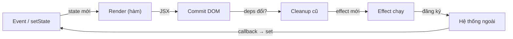

**Đọc sơ đồ:** Bắt đầu ở “Event / setState” (trái trên), đi theo chiều kim đồng hồ: render tính JSX → commit sửa DOM → dọn effect cũ → chạy effect mới → effect đăng ký với hệ thống ngoài → hệ thống ngoài gọi lại, set state, vòng mới. *Màu: viền terracotta dày = phần của bài này · be = phần còn lại của vòng.*


| Bài | Học gì | Mảnh nào của vòng |
|---|---|---|
| 1 | `useEffect` & cleanup | Cleanup → Effect → Hệ thống ngoài |
| 2 | Có thể bạn không cần Effect | Đưa logic về Render và Event |
| 3 | `useRef` | Commit gắn DOM node vào ref |
| 4 | `useMemo` & `useCallback` | Render (nhớ kết quả) |
| 5 | Custom hook & Context | Gói Render + Effect + Cleanup thành một hàm |
| Lab | `useAutoScroll()` | Cả vòng |

### Chuẩn bị project

Lại một bãi tập riêng. Hook làm xong sẽ được chép vào `apps/web` của Nexus ở M11 (khung chat stream).

```bash title="terminal"
npm create vite@latest s1-2-autoscroll -- --template react-ts
cd s1-2-autoscroll
npm install
rm -rf src/App.css src/assets
mkdir -p src/hooks src/components
npm run dev
```

Bật thêm luật `exhaustive-deps` (kiểm tra mảng phụ thuộc của hook) cho oxlint — sửa `.oxlintrc.json`:

```json title=".oxlintrc.json"
{
  "$schema": "./node_modules/oxlint/configuration_schema.json",
  "plugins": ["react", "typescript", "oxc"],
  "rules": {
    "react/rules-of-hooks": "error",
    "react/only-export-components": ["warn", { "allowConstantExport": true }],
    "react/exhaustive-deps": "warn"
  }
}
```

## Bài 1 — useEffect & cleanup

**Nó là gì (1 câu):** effect là **ca làm việc sau giờ phục vụ**: khi đĩa đã ra quầy (màn hình đã vẽ xong), bạn mới đi bật máy ở kho, đăng ký nhận hàng, hẹn giờ… và cleanup là **tắt đúng những thứ đó** trước ca sau.

**Sơ đồ tổng** — bài này nằm ở đoạn *Cleanup → Effect → Hệ thống ngoài*:

**Sơ đồ (Luồng dữ liệu) — Vòng đời component đi ra ngoài React thế nào?**

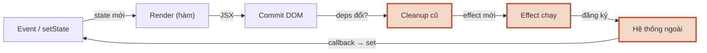

**Đọc sơ đồ:** Vòng đời của component; phần viền terracotta là đoạn bài này đào sâu — Bài 1: Cleanup → Effect → Hệ thống ngoài. *Màu: viền terracotta dày = phần của bài này · be = phần còn lại của vòng.*


### 1.1 Effect chạy lúc nào, cleanup chạy lúc nào

**Ẩn dụ:** mỗi lần đổi ca (deps đổi), người ca cũ **tắt máy của mình trước**, rồi người ca mới mới bật máy. Đóng cửa hẳn (unmount) thì người ca cuối tắt máy.

**Sơ đồ:** ví dụ kinh điển — kết nối vào phòng chat theo `roomId`. Bấm từng kịch bản, đặc biệt là “Quên cleanup”.

**Sơ đồ (Trình tự) — Effect và cleanup chạy theo thứ tự nào?**

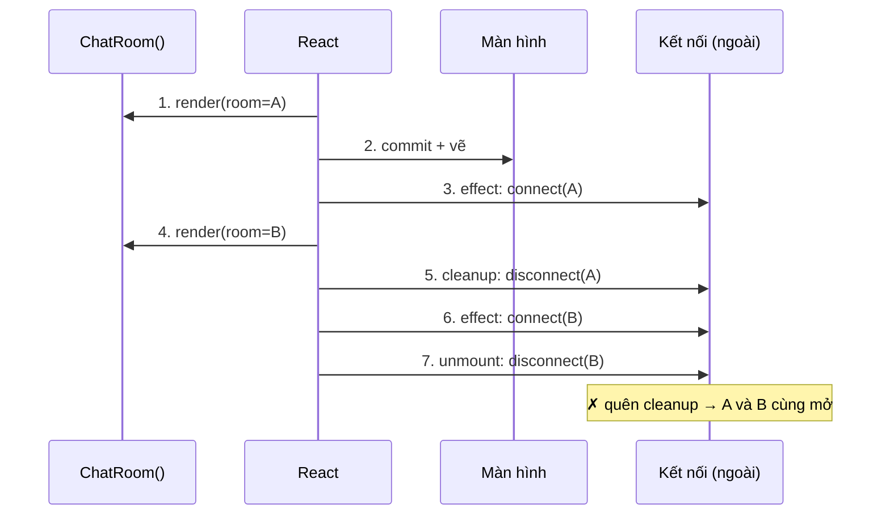

**Đọc sơ đồ:** Mỗi cột là một bên; đọc mũi tên ①→⑦ từ trên xuống. React là người điều phối: nó gọi render, vẽ, rồi mới chạy effect. Ô đỏ ở đáy cột ‘Kết nối’ là hậu quả khi quên cleanup. *Màu: đỏ gạch + ✗ + viền đứt = bị chặn/sai · vàng mù tạt + ? + viền chấm = cần xem lại · xanh ô-liu + ✓ = chạy đúng.*


**Chi tiết kỹ thuật:**

```tsx title="ChatRoom.tsx"
import { useEffect } from 'react';

function ChatRoom({ roomId }: { roomId: string }) {
  useEffect(() => {
    const conn = createConnection(roomId); // bật máy
    conn.connect();
    return () => conn.disconnect();         // cleanup: tắt đúng máy đó
  }, [roomId]);                             // deps: chạy lại khi roomId đổi

  return <h2>Phòng {roomId}</h2>;
}
```

- **Effect** (hiệu ứng phụ — việc chạm ra ngoài React) chạy **sau khi** React đã commit (ghi thay đổi vào DOM) và trình duyệt đã vẽ. Nên nó không chặn màn hình.
- **Cleanup** là hàm bạn `return` từ effect. React gọi nó: (1) **trước khi** chạy effect lần sau, (2) khi component **unmount** (bị gỡ khỏi màn hình).
- **Cặp đối xứng:** `addEventListener` ↔ `removeEventListener`, `setInterval` ↔ `clearInterval`, `connect` ↔ `disconnect`, `subscribe` ↔ `unsubscribe`. Viết dòng bật xong thì viết ngay dòng tắt.
- **StrictMode ở dev** cố ý chạy *mount → cleanup → mount* ngay lần đầu. Nếu thiếu cleanup, bạn sẽ thấy nhân đôi (2 kết nối, 2 listener) — đó là React đang tố cáo bug giúp bạn, đừng tắt StrictMode.

### 1.2 Mảng deps quyết định khi nào chạy lại

**Ẩn dụ:** deps là **danh sách nguyên liệu** của món. Nguyên liệu nào đổi thì phải pha lại; không đổi thì dùng ly cũ.

**Sơ đồ:**

**Sơ đồ (Luồng quyết định) — Sau một lần render, effect có chạy lại không?**

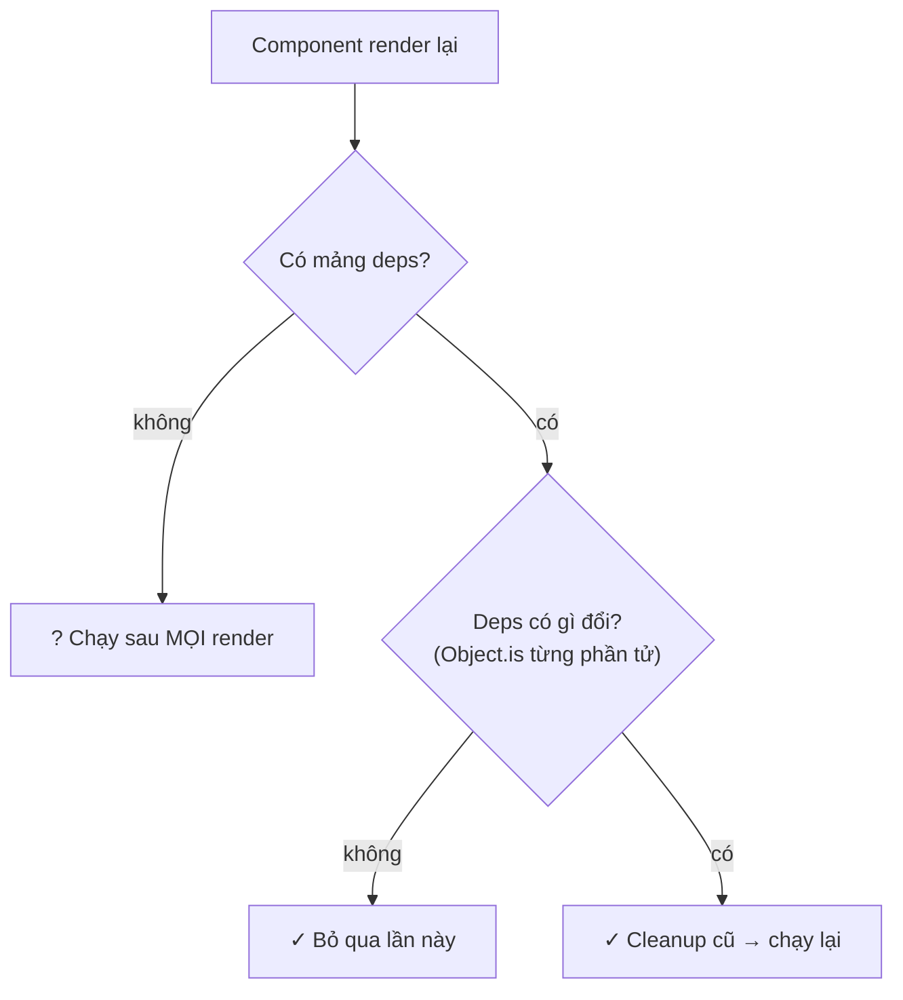

**Đọc sơ đồ:** Đọc từ trên xuống cho MỘT lần render (không tính lần mount đầu — lần đó effect luôn chạy). Rẽ phải ở câu 1 là không có deps; rẽ phải ở câu 2 là deps y hệt. *Màu: vàng mù tạt + ? + viền chấm = thường là dấu hiệu sai · xanh ô-liu + ✓ = hành vi bình thường.*


**Chi tiết kỹ thuật:**

| Cách viết | Chạy khi nào | Cleanup khi nào |
|---|---|---|
| `useEffect(fn)` | Sau **mọi** lần render | Trước mỗi lần chạy lại + unmount |
| `useEffect(fn, [])` | Một lần sau mount | Unmount |
| `useEffect(fn, [a, b])` | Sau mount + khi `a` hoặc `b` đổi (so `Object.is`) | Trước lần chạy lại + unmount |

- **Deps không phải thứ bạn chọn — nó là thứ effect *đọc*.** Mọi biến từ props/state/hàm trong component mà effect dùng đều phải có mặt. Luật `exhaustive-deps` bắt lỗi này. Muốn bớt deps thì **sửa code** (chuyển biến vào trong effect, dùng updater `prev => …`), không phải xoá khỏi mảng.
- **Bẫy object/hàm mới mỗi render:** `const options = { roomId }` tạo object mới mỗi lần render → deps `[options]` luôn “đổi” → effect chạy lại mãi. Sửa: tạo object **bên trong** effect, deps là `[roomId]`.

> **`useLayoutEffect`** giống `useEffect` nhưng chạy **trước khi trình duyệt vẽ**. Chỉ dùng khi bạn đo/sửa bố cục và không muốn người dùng thấy khung hình sai (ví dụ: cuộn xuống đáy ngay khi tin nhắn mới xuất hiện). Lab dùng đúng một lần.

> **Lấy dữ liệu trong effect?** Được, nhưng phải chống race condition (phản hồi cũ về sau đè phản hồi mới) bằng cờ `let ignore = false; … return () => { ignore = true }`. Trong Nexus, dữ liệu sẽ lấy bằng Server Component ở M9 — nên đừng đầu tư sâu vào kiểu này.

### Nhìn lại bức tranh lớn

**Sơ đồ (Luồng dữ liệu) — Vòng đời component đi ra ngoài React thế nào?**


**Đọc sơ đồ:** Cùng vòng như đầu bài; phần viền terracotta là thứ bạn vừa học — Bài 1: Cleanup → Effect → Hệ thống ngoài. *Màu: viền terracotta dày = phần của bài này · be = phần còn lại của vòng.*


Bạn vừa học chặng **ra ngoài** của vòng: effect bật, cleanup tắt, deps quyết định khi nào đổi ca. Nhưng có một sự thật ngược đời: phần lớn `useEffect` mà người mới viết là **thừa**. Bài 2.

### Tự vẽ lại

1. Kể thứ tự 3 việc React làm khi `roomId` đổi từ A sang B (render, cleanup, effect — cái nào trước?).
2. Vì sao ở dev bạn thấy effect chạy 2 lần ngay khi mở trang? Đó là bug hay tính năng?
3. `useEffect(fn, [options])` với `options = { roomId }` chạy lại bao nhiêu lần? Sửa thế nào?

## Bài 2 — Có thể bạn không cần Effect

**Nó là gì (1 câu):** effect là **lối thoát hiểm**, không phải cửa chính — chỉ dùng khi phải ra ngoài React; mọi thứ còn lại đi cửa chính là **render** và **event handler**.

**Sơ đồ tổng** — bài này kéo logic về đoạn *Event → Render*:

**Sơ đồ (Luồng dữ liệu) — Vòng đời component đi ra ngoài React thế nào?**

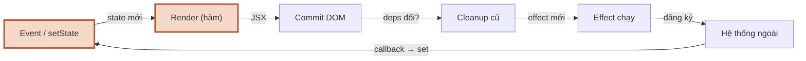

**Đọc sơ đồ:** Vòng đời của component; phần viền terracotta là đoạn bài này đào sâu — Bài 2: Event → Render (không cần effect). *Màu: viền terracotta dày = phần của bài này · be = phần còn lại của vòng.*


### 2.1 Đoạn code này nên đặt ở đâu?

**Ẩn dụ:** trước khi gọi thợ điện (effect), hỏi xem có phải chỉ cần **bật công tắc** (tính trong render) hay **khách vừa yêu cầu** (event handler) không.

**Sơ đồ:** chạy 5 đoạn code thật qua 2 câu hỏi.

**Sơ đồ (Luồng quyết định) — Đoạn code này nên đặt ở đâu?**

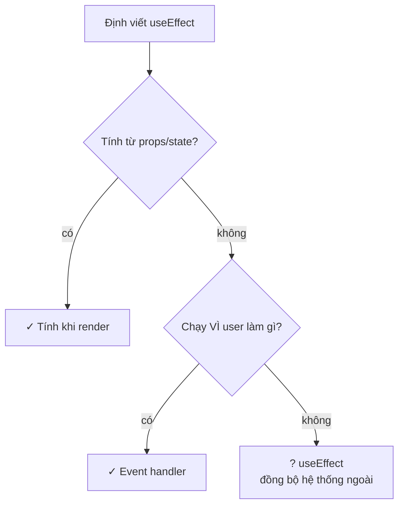

**Đọc sơ đồ:** Đọc từ trên xuống: hai câu hỏi trước khi viết useEffect. Chỉ khi cả hai đều ‘không’ mới tới effect — và effect đó phải đồng bộ với hệ thống ngoài. *Màu: xanh ô-liu + ✓ = cửa chính (ưu tiên) · vàng mù tạt + ? = được dùng, nhưng phải có cleanup và deps đúng.*


**Chi tiết kỹ thuật — bốn mẫu thay thế hay gặp nhất (theo react.dev “You Might Not Need an Effect”):**

```tsx title="1. Dữ liệu suy ra → tính khi render"
// ✗ const [fullName, setFullName] = useState('');
//   useEffect(() => setFullName(first + ' ' + last), [first, last]);
const fullName = `${first} ${last}`; // ✓
```

```tsx title="2. Việc do user bấm → đặt trong event handler"
// ✗ useEffect(() => { if (submitted) post('/api/order', data); }, [submitted]);
function handleSubmit() {
  post('/api/order', data); // ✓ biết chính xác VÌ SAO nó chạy
}
```

```tsx title="3. Reset state khi prop đổi → dùng key"
// ✗ useEffect(() => setDraft(''), [conversationId]);
<Composer key={conversationId} /> // ✓ key đổi → React tạo component mới, state sạch
```

```tsx title="4. Báo cho cha → gọi callback ngay trong handler"
// ✗ useEffect(() => onChange(isOn), [isOn]);
function handleToggle() {
  const next = !isOn;
  setIsOn(next);
  onChange(next); // ✓ cùng một event, một lần render
}
```

Câu hỏi thần chú: **“Đoạn code này chạy VÌ component vừa hiện ra, hay VÌ user vừa làm gì?”** Vì user → handler. Vì component hiện ra *và* phải đồng bộ với thứ bên ngoài → effect.

### 2.2 Effect thừa tốn gì?

**Ẩn dụ:** ghi hoá đơn bằng bút chì, in ra cho khách, rồi mới sửa lại tổng tiền và in lần hai. Khách kịp nhìn thấy bản sai.

**Sơ đồ:** so sánh hai đường đi khi `todos` đổi.

**Sơ đồ (Luồng dữ liệu) — Effect ‘đồng bộ’ state tốn thêm những gì?**

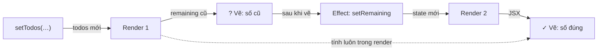

**Đọc sơ đồ:** Đường vòng qua bên phải: render 1 vẽ số cũ, effect set lại, render 2 mới đúng. Đường tắt nét đứt ở giữa: tính luôn trong render 1, vẽ đúng ngay. *Màu: đỏ gạch + ✗ + viền đứt = bị chặn/sai · vàng mù tạt + ? + viền chấm = cần xem lại · xanh ô-liu + ✓ = chạy đúng.*


**Chi tiết kỹ thuật:** effect chạy **sau** khi vẽ, nên `setState` trong effect gây **render lần hai**. Giữa hai lần đó, màn hình hiện giá trị cũ một khung hình. Ngoài chậm hơn, nó còn tạo chuỗi effect gọi nhau khó lần theo. Đây chính là lý do AC của S1.1 cấm state trùng lặp.

### Nhìn lại bức tranh lớn

**Sơ đồ (Luồng dữ liệu) — Vòng đời component đi ra ngoài React thế nào?**


**Đọc sơ đồ:** Cùng vòng như đầu bài; phần viền terracotta là thứ bạn vừa học — Bài 2: Event → Render (không cần effect). *Màu: viền terracotta dày = phần của bài này · be = phần còn lại của vòng.*


Bạn vừa học cách **giữ logic ở cửa chính**: render tính dữ liệu suy ra, handler xử lý hành động. Effect chỉ còn một nhiệm vụ: đồng bộ với hệ thống ngoài. Và khi đồng bộ với DOM, bạn cần cầm được **node DOM thật** — bài 3.

### Tự vẽ lại

1. Câu hỏi thần chú để quyết định handler hay effect là gì?
2. Vì sao `useEffect(() => setX(f(y)), [y])` làm màn hình sai một khung hình?
3. Muốn xoá sạch ô soạn tin khi đổi cuộc hội thoại, cách gọn nhất là gì?

## Bài 3 — useRef

**Nó là gì (1 câu):** ref là **ngăn kéo riêng dưới quầy**: bỏ gì vào, lấy gì ra cũng được, nhưng **không có chuông** — thay đổi trong ngăn kéo không khiến bếp làm lại đĩa.

**Sơ đồ tổng** — bài này nằm ở *Commit → Effect* (React gắn node DOM vào ref khi commit):

**Sơ đồ (Luồng dữ liệu) — Vòng đời component đi ra ngoài React thế nào?**

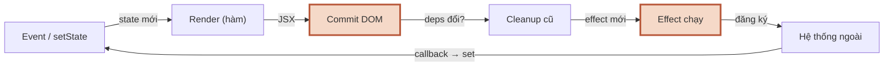

**Đọc sơ đồ:** Vòng đời của component; phần viền terracotta là đoạn bài này đào sâu — Bài 3: Commit gắn DOM vào ref, effect đọc ref. *Màu: viền terracotta dày = phần của bài này · be = phần còn lại của vòng.*


### 3.1 Ref khác state ở đâu

**Ẩn dụ:** state là **bảng phấn treo tường** (đổi → cả quán thấy, bếp làm lại). Ref là **ngăn kéo** (đổi → không ai biết, nhưng lần sau mở ra vẫn còn đó).

**Sơ đồ:**

**Sơ đồ (Bản đồ dịch vụ) — Ref nằm ở đâu so với state và DOM?**

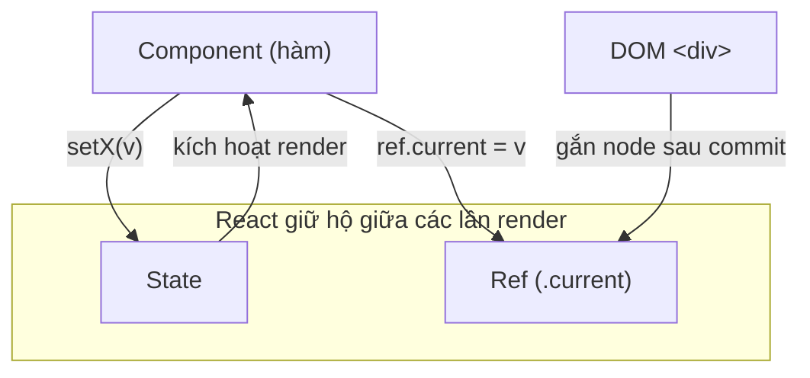

**Đọc sơ đồ:** Đọc từ Component (trên): ghi vào State thì có đường quay lại kích hoạt render; ghi vào Ref thì KHÔNG có đường quay lại. DOM thật (phải) được React gắn vào ref sau khi commit. *Màu: vùng nét đứt = nơi giá trị sống · mũi tên ghi thao tác đi qua. Không có mũi tên từ Ref về Component = không render.*


**Chi tiết kỹ thuật:**

```tsx title="Hai công dụng của useRef"
import { useEffect, useRef, useState } from 'react';

function Composer() {
  // 1) Cầm node DOM thật
  const inputRef = useRef<HTMLInputElement>(null);
  // 2) Nhớ giá trị không cần hiển thị (id của timer)
  const timerRef = useRef<number | null>(null);
  const [text, setText] = useState('');

  useEffect(() => {
    inputRef.current?.focus(); // chỉ đọc ref trong effect/handler
  }, []);

  function handleChange(v: string) {
    setText(v);
    if (timerRef.current) clearTimeout(timerRef.current);
    timerRef.current = window.setTimeout(() => console.log('Lưu nháp:', v), 500);
  }

  return <input ref={inputRef} value={text} onChange={(e) => handleChange(e.target.value)} />;
}
```

- `useRef(x)` trả về object `{ current: x }` — **cùng một object** qua mọi lần render.
- Gắn `ref={inputRef}` vào thẻ JSX → sau commit, React đặt node vào `inputRef.current`; khi unmount, đặt lại `null`. Vì vậy kiểu là `useRef<HTMLInputElement>(null)` và luôn kiểm tra null (`?.`).
- **Luật:** không đọc/ghi `ref.current` **trong lúc render** (trừ khởi tạo). Chỉ đụng tới nó trong effect và event handler. Vì render phải thuần, còn ref thì không có chuông báo React.
- React 19: component hàm nhận `ref` như một prop bình thường — không cần `forwardRef` nữa.

### 3.2 State hay ref?

**Ẩn dụ:** hỏi đúng một câu: **khách có cần nhìn thấy nó không?**

**Sơ đồ:** trong đó có 2 giá trị của Lab — `stickRef` và `isAtBottom`. Hai cái trông giống nhau nhưng một cái là ref, một cái là state.

**Sơ đồ (Luồng quyết định) — Giá trị này nên là state, ref hay biến thường?**

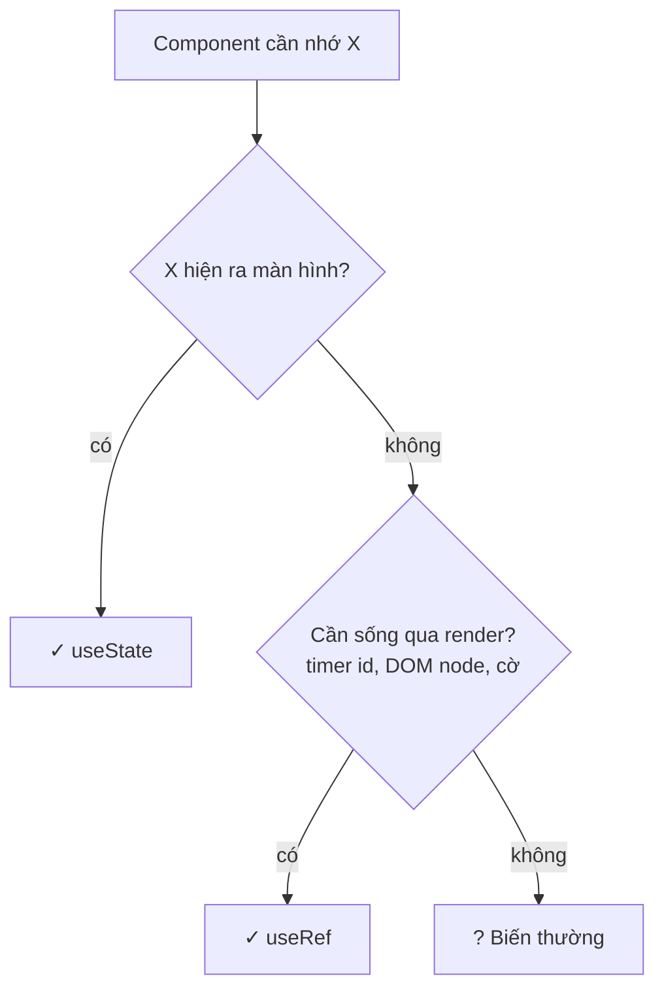

**Đọc sơ đồ:** Đọc từ trên xuống cho giá trị X. Câu 1 hỏi ‘có hiện ra màn hình không’; câu 2 hỏi ‘có cần sống qua các lần render không’. *Màu: xanh ô-liu + ✓ = dùng hook này · vàng mù tạt + ? = không cần hook nào.*


**Chi tiết kỹ thuật:** trong `useAutoScroll`, “có đang bám đáy không” đổi **mỗi lần cuộn** (hàng chục lần/giây) nhưng không vẽ gì → `stickRef`. Còn “có hiện nút Xuống cuối không” thì phải vẽ → `isAtBottom` là state. `setIsAtBottom(true)` gọi liên tục với cùng giá trị cũng không sao: bài 2 của S1.1 — giá trị y hệt thì React bỏ qua.

### Nhìn lại bức tranh lớn

**Sơ đồ (Luồng dữ liệu) — Vòng đời component đi ra ngoài React thế nào?**


**Đọc sơ đồ:** Cùng vòng như đầu bài; phần viền terracotta là thứ bạn vừa học — Bài 3: Commit gắn DOM vào ref, effect đọc ref. *Màu: viền terracotta dày = phần của bài này · be = phần còn lại của vòng.*


Bạn vừa học **ngăn kéo** của component: cầm node DOM và nhớ giá trị không cần vẽ. Ref + effect là cặp đôi để nói chuyện với DOM. Tiếp theo là hai hook “ghi nhớ” mà người mới hay rắc khắp nơi — bài 4 dạy bạn *đừng*.

### Tự vẽ lại

1. `ref.current = 5` và `setCount(5)` khác nhau thế nào về chuyện render?
2. Vì sao `inputRef.current` là `null` trong lúc render đầu tiên?
3. Trong Lab, vì sao `stickRef` là ref còn `isAtBottom` là state?

## Bài 4 — useMemo & useCallback

**Nó là gì (1 câu):** useMemo là **bình cà phê ủ sẵn**: nguyên liệu không đổi thì rót từ bình, khỏi pha lại — nhưng nếu pha chỉ mất một giây thì giữ bình còn tốn công hơn.

**Sơ đồ tổng** — bài này nằm trong ô *Render*:

**Sơ đồ (Luồng dữ liệu) — Vòng đời component đi ra ngoài React thế nào?**

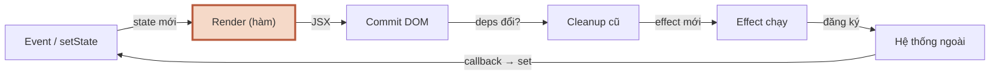

**Đọc sơ đồ:** Vòng đời của component; phần viền terracotta là đoạn bài này đào sâu — Bài 4: Render nhớ kết quả. *Màu: viền terracotta dày = phần của bài này · be = phần còn lại của vòng.*


### 4.1 Cơ chế: so deps, trúng thì dùng lại

**Ẩn dụ:** barista nhìn phiếu order: y hệt ly trước → rót từ bình; khác → pha mới và đổ vào bình.

**Sơ đồ:**

**Sơ đồ (Trình tự) — useMemo làm gì ở mỗi lần render?**

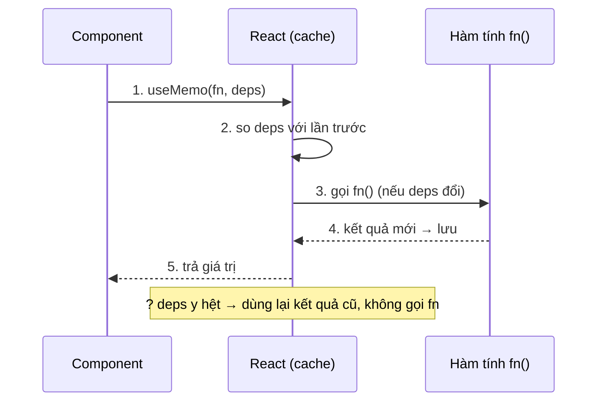

**Đọc sơ đồ:** Ba cột: component gọi useMemo, React giữ bộ nhớ đệm (cache), và hàm tính của bạn. Đọc ①→⑤. Ô vàng là đường tắt khi deps không đổi. *Màu: đỏ gạch + ✗ + viền đứt = bị chặn/sai · vàng mù tạt + ? + viền chấm = cần xem lại · xanh ô-liu + ✓ = chạy đúng.*


**Chi tiết kỹ thuật:**

```tsx title="useMemo và useCallback"
import { useCallback, useMemo } from 'react';

// Nhớ KẾT QUẢ của phép tính
const visible = useMemo(() => bigList.filter((r) => matches(r, query)), [bigList, query]);

// Nhớ chính HÀM (useCallback(fn, deps) = useMemo(() => fn, deps))
const scrollToBottom = useCallback(() => {
  ref.current?.scrollTo({ top: ref.current.scrollHeight });
}, []);
```

- Lần đầu: gọi hàm, lưu kết quả + deps. Các lần sau: deps giống → trả kết quả cũ; khác → tính lại.
- Nó **không miễn phí**: mỗi render vẫn tốn công so deps và giữ bộ nhớ.

### 4.2 Khi nào thật sự cần?

**Ẩn dụ:** chỉ ủ bình khi món **pha lâu thật** hoặc khi **khách khác cần đúng cái ly đó** (so tham chiếu).

**Sơ đồ:**

**Sơ đồ (Luồng quyết định) — Có nên thêm useMemo / useCallback không?**

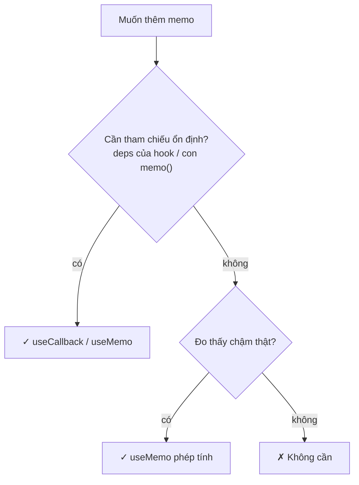

**Đọc sơ đồ:** Đọc từ trên xuống. Hai lý do chính đáng nằm ở hai nhánh rẽ phải; đi thẳng xuống đáy nghĩa là cứ viết code bình thường. *Màu: xanh ô-liu + ✓ = nên dùng · đỏ gạch + ✗ + viền đứt = đừng thêm memo.*


**Chi tiết kỹ thuật — chỉ 2 lý do chính đáng:**

1. **Phép tính đo được là chậm** (hơn khoảng 1 ms, xem bằng `console.time` hoặc React DevTools Profiler) — ví dụ lọc hàng chục nghìn dòng.
2. **Giữ tham chiếu ổn định** vì giá trị/hàm đó nằm trong **deps của hook khác**, hoặc được truyền cho component bọc `memo()` (chỉ render lại khi props đổi). Custom hook trả hàm ra ngoài nên bọc `useCallback` — người dùng hook có thể đặt nó vào deps.

Ngoài hai lý do đó: **đừng thêm**. `onClick={() => setOpen(true)}` cho một `<button>` không cần `useCallback`.

> **React Compiler** (bản 1.0 ra mắt cuối 2025) có thể tự memo hoá component lúc build. Nếu project bật compiler, bạn càng ít phải viết tay hai hook này. Kiểm tra react.dev/learn/react-compiler trước khi bật cho Nexus.

### Nhìn lại bức tranh lớn

**Sơ đồ (Luồng dữ liệu) — Vòng đời component đi ra ngoài React thế nào?**


**Đọc sơ đồ:** Cùng vòng như đầu bài; phần viền terracotta là thứ bạn vừa học — Bài 4: Render nhớ kết quả. *Màu: viền terracotta dày = phần của bài này · be = phần còn lại của vòng.*


Bạn vừa học cách **để render nhớ** — và quan trọng hơn, khi nào không cần nhớ. Giờ bạn đã có đủ nguyên liệu (state, effect, ref, callback) để **đóng gói** chúng thành một hook của riêng mình. Bài 5.

### Tự vẽ lại

1. `useMemo` làm gì ở lần render đầu và các lần sau?
2. Nêu 2 lý do chính đáng để dùng `useCallback`.
3. Vì sao `scrollToBottom` trong Lab được bọc `useCallback`, còn `handleSend` trong `ChatWindow` thì không?

## Bài 5 — Custom hook & Context

**Nó là gì (1 câu):** custom hook là **công thức pha chế viết ra giấy** — ai cầm cũng pha được, mỗi người pha **ly riêng của mình**; còn Context là **loa phát thanh của quán** — nói một lần, bàn nào cần thì nghe, khỏi chuyền tay từng bàn.

**Sơ đồ tổng** — custom hook gói cả *Render + Cleanup + Effect*:

**Sơ đồ (Luồng dữ liệu) — Vòng đời component đi ra ngoài React thế nào?**

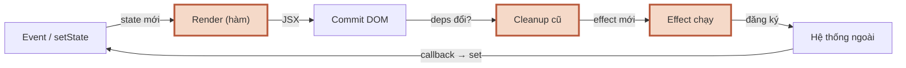

**Đọc sơ đồ:** Vòng đời của component; phần viền terracotta là đoạn bài này đào sâu — Bài 5: Custom hook gói Render + Effect + Cleanup. *Màu: viền terracotta dày = phần của bài này · be = phần còn lại của vòng.*


### 5.1 Custom hook: tách logic có state ra thành hàm

**Ẩn dụ:** công thức, không phải cái ly. Hai barista cùng theo một công thức nhưng mỗi người có ly riêng.

**Sơ đồ:** bên trong `useAutoScroll` của Lab.

**Sơ đồ (Luồng dữ liệu) — Custom hook useAutoScroll gói những gì bên trong?**

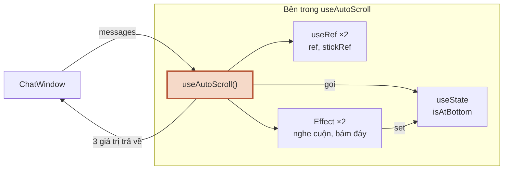

**Đọc sơ đồ:** Đọc từ trái: ChatWindow đưa messages vào hook; hook gọi 3 loại hook có sẵn (phải) và trả lại 3 thứ. Mũi tên dọc bên phải: effect nghe cuộn rồi set state — làm ChatWindow render lại. *Màu: viền terracotta = custom hook của bạn · be = hook có sẵn của React · vùng nét đứt = bên trong hook.*


**Chi tiết kỹ thuật:**

- Custom hook = **hàm tên bắt đầu bằng `use`** và bên trong gọi hook khác. Tên `use…` giúp lint áp luật Hook cho nó.
- **Chia sẻ logic, không chia sẻ state.** Hai component gọi `useAutoScroll()` → hai bộ state/ref/effect độc lập.
- Khi state bên trong hook đổi, **component gọi hook render lại** — hook chạy “như thể” code viết thẳng trong component.
- Hook tốt: tên nói *mục đích* (`useAutoScroll`, `useOnlineStatus`), không nói *cơ chế* (`useScrollEffect`). Trả về object có tên rõ ràng.

### 5.2 Context: truyền xa không cần chuyền tay

**Ẩn dụ:** chuyền phiếu qua 5 bàn để tới bàn cuối (prop drilling — khoan props qua nhiều tầng) vs. đọc lên loa.

**Sơ đồ:** bấm hai kịch bản để so sánh.

**Sơ đồ (Luồng dữ liệu) — Context đưa theme tới con cháu mà không chuyền tay thế nào?**

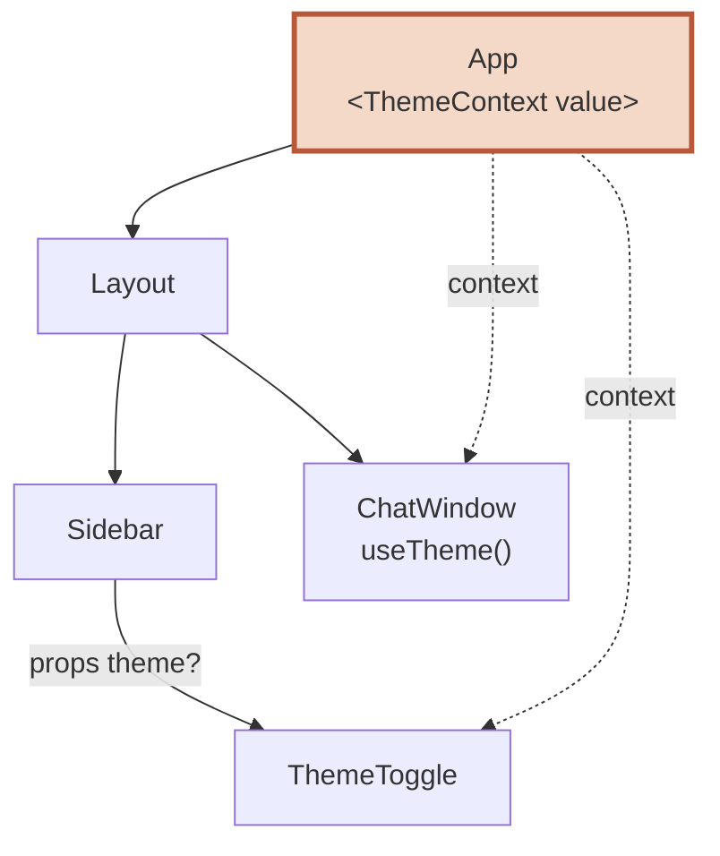

**Đọc sơ đồ:** Mũi tên liền là cây component (cha → con). Hai đường nét đứt là context: đi thẳng từ App tới nơi cần, bỏ qua Layout và Sidebar. *Màu: viền terracotta = nơi giữ giá trị (Provider) · nét đứt = context · nét liền = props/children.*


**Chi tiết kỹ thuật:**

```tsx title="ThemeContext.tsx (React 19)"
import { createContext, useContext, useState, type ReactNode } from 'react';

type Theme = 'light' | 'dark';
type ThemeCtx = { theme: Theme; toggle: () => void };

const ThemeContext = createContext<ThemeCtx | null>(null);

export function ThemeProvider({ children }: { children: ReactNode }) {
  const [theme, setTheme] = useState<Theme>('light');
  const toggle = () => setTheme((t) => (t === 'light' ? 'dark' : 'light'));
  return <ThemeContext value={{ theme, toggle }}>{children}</ThemeContext>;
}

export function useTheme() {
  const ctx = useContext(ThemeContext);
  if (!ctx) throw new Error('useTheme phải nằm trong <ThemeProvider>');
  return ctx;
}
```

- React 19 cho viết thẳng `<ThemeContext value={…}>` (bản cũ phải `.Provider`).
- **Bọc context bằng custom hook** (`useTheme`) → kiểm tra null một chỗ, kiểu TS sạch cho người dùng.
- Dùng context cho thứ **nhiều nơi đọc, ít khi đổi**: theme, user đang đăng nhập, ngôn ngữ. Không dùng cho dữ liệu đổi liên tục (mỗi lần đổi, mọi component đọc context đều render lại).
- Trước khi dùng context, thử cách đơn giản hơn: truyền `children` để bỏ bớt tầng trung gian.

> Ở S1.3 bạn sẽ làm dark mode cho Nexus — `ThemeProvider` ở trên chính là khung sườn.

### Nhìn lại bức tranh lớn

**Sơ đồ (Luồng dữ liệu) — Vòng đời component đi ra ngoài React thế nào?**

```mermaid
flowchart LR
    ev["Event / setState"] -- "state mới" --> render["Render (hàm)"]
    render -- "JSX" --> commit["Commit DOM"]
    commit -- "deps đổi?" --> cleanup["Cleanup cũ"]
    cleanup -- "effect mới" --> effect["Effect chạy"]
    effect -- "đăng ký" --> ext["Hệ thống ngoài"]
    ext -- "callback → set" --> ev
    classDef hl fill:#f5d9c8,stroke:#b8583a,stroke-width:3px
    class render,cleanup,effect hl
```

**Đọc sơ đồ:** Cùng vòng như đầu bài; phần viền terracotta là thứ bạn vừa học — Bài 5: Custom hook gói Render + Effect + Cleanup. *Màu: viền terracotta dày = phần của bài này · be = phần còn lại của vòng.*


Bạn vừa học cách **đóng gói cả vòng** vào một hàm tái sử dụng được, và cách **phát** giá trị cho cả cây component. Đủ đồ nghề — vào Lab dựng `useAutoScroll()`.

### Tự vẽ lại

1. Hai component cùng gọi `useAutoScroll()` — chúng có chung `isAtBottom` không? Vì sao?
2. Prop drilling là gì, và Context giải quyết nó thế nào?
3. Vì sao không nên đưa danh sách tin nhắn đang stream vào Context?

## Lab — useAutoScroll() cho khung chat

**Bài toán:** khung chat stream từng chữ (như LLM). Ba yêu cầu mâu thuẫn nhau:

1. Có chữ mới → tự cuộn xuống cuối.
2. User cuộn lên đọc tin cũ → **đừng** giật họ xuống.
3. User cuộn về cuối → tự cuộn trở lại.

Thử trước bằng tay — demo này mô phỏng đúng thuật toán của Lab (không phải React thật). Bấm “Bắt đầu stream”, rồi cuộn lên giữa chừng:

> *(Bản HTML có demo bấm được ở đây. Trong MD: chạy `npm run dev` ở Bước 5 và thử trực tiếp trên khung chat.)*

Cấu trúc đích:

```text title="cấu trúc thư mục"
src/
├── main.tsx                 (giữ nguyên của Vite — có StrictMode)
├── index.css
├── types.ts                 Message
├── fakeBot.ts               tin mẫu + câu trả lời giả
├── hooks/
│   └── useAutoScroll.ts     ⭐ output của session
├── components/
│   └── ChatWindow.tsx       stream giả bằng setInterval + dùng hook
└── App.tsx                  nút Đóng/Mở để thử cleanup
```

### Bước 1 — Dữ liệu (`types.ts`, `fakeBot.ts`)

```ts title="src/types.ts"
export type Message = {
  id: string;
  role: 'user' | 'bot';
  text: string;
};
```

```ts title="src/fakeBot.ts"
import type { Message } from './types';

// Dữ liệu giả: đủ dài để khung chat phải cuộn
export const seedMessages: Message[] = Array.from({ length: 12 }, (_, i) => ({
  id: `seed-${i}`,
  role: i % 2 === 0 ? 'user' : 'bot',
  text:
    i % 2 === 0
      ? `Câu hỏi số ${i / 2 + 1}: doanh thu tuần này thế nào?`
      : 'Doanh thu tăng nhẹ so với tuần trước, chủ yếu nhờ nhóm khách hàng ở Hà Nội.',
}));

const REPLY =
  'Mình đã tra dữ liệu khách hàng. Tuần này có 42 đơn mới, tăng 12 phần trăm so với tuần trước. ' +
  'Ba khách hàng lớn nhất đều ở Hà Nội và Đà Nẵng. Nhóm sản phẩm cà phê phin bán chạy nhất, ' +
  'tiếp theo là cà phê hạt rang mộc. Nếu cần, mình có thể tách số liệu theo từng khu vực ' +
  'hoặc so sánh với cùng kỳ tháng trước để thấy xu hướng rõ hơn.';

export function makeReply(question: string): string[] {
  return `Về “${question}”: ${REPLY}`.split(' ');
}
```

### Bước 2 — Bản ngây thơ: cuộn mỗi khi có tin mới

Viết thử phiên bản đầu tiên này trong `useAutoScroll.ts` — đúng yêu cầu 1, sai yêu cầu 2:

```ts title="useAutoScroll.ts — bản 1 (sẽ bỏ)"
export function useAutoScroll<T extends HTMLElement>(content: unknown) {
  const ref = useRef<T>(null);
  useLayoutEffect(() => {
    const el = ref.current;
    if (el) el.scrollTop = el.scrollHeight; // luôn kéo xuống
  }, [content]);
  return { ref };
}
```

Chạy thử: cuộn lên trong lúc bot đang trả lời → bị kéo xuống mỗi 90 ms. Không đọc nổi. Cần nhớ **“user có đang bám đáy không”**.

### Bước 3 — Nghe sự kiện cuộn + ref ghi nhớ (Bài 1 + 3)

Ý tưởng then chốt: chỉ **sự kiện cuộn** mới được quyết định “bám đáy hay không”. Nội dung dài ra thì khoảng cách tới đáy tăng, nhưng đó không phải user cuộn — nên không được tính.

- Nghe `scroll` trên node DOM = đồng bộ với hệ thống ngoài → **effect + cleanup**.
- “Bám đáy” đổi liên tục, không cần vẽ → **ref**.

### Bước 4 — Nút “Xuống cuối” (Bài 3 + 4)

UI cần biết có đang ở đáy không → thêm **state** `isAtBottom`. Hàm `scrollToBottom` trả ra ngoài → **`useCallback`**. Hook hoàn chỉnh:

```ts title="src/hooks/useAutoScroll.ts"
import { useCallback, useEffect, useLayoutEffect, useRef, useState } from 'react';

type Options = {
  /** Cách đáy bao nhiêu px thì vẫn tính là "đang ở cuối" */
  threshold?: number;
};

/**
 * Tự cuộn khung chứa xuống cuối khi `content` đổi — trừ khi user đã cuộn lên đọc.
 * Trả về: ref gắn vào khung cuộn, isAtBottom (cho UI), scrollToBottom (cho nút bấm).
 */
export function useAutoScroll<T extends HTMLElement = HTMLDivElement>(
  content: unknown,
  { threshold = 40 }: Options = {},
) {
  const ref = useRef<T>(null);
  // "Có đang bám đáy không?" — đổi liên tục khi cuộn, KHÔNG cần render lại → ref
  const stickRef = useRef(true);
  // Còn UI (nút "Xuống cuối") thì cần render lại → state
  const [isAtBottom, setIsAtBottom] = useState(true);

  // (1) Nghe sự kiện cuộn của DOM = đồng bộ với hệ thống bên ngoài → effect + cleanup
  useEffect(() => {
    const el = ref.current;
    if (!el) return;

    function handleScroll() {
      if (!el) return;
      const distance = el.scrollHeight - el.scrollTop - el.clientHeight;
      const atBottom = distance <= threshold;
      stickRef.current = atBottom;
      setIsAtBottom(atBottom); // giá trị y hệt thì React bỏ qua, không render thừa
    }

    el.addEventListener('scroll', handleScroll, { passive: true });
    return () => el.removeEventListener('scroll', handleScroll); // cleanup: không rò listener
  }, [threshold]);

  // (2) Nội dung đổi → nếu đang bám đáy thì cuộn xuống.
  // useLayoutEffect: chạy TRƯỚC khi trình duyệt vẽ → không thấy giật.
  useLayoutEffect(() => {
    const el = ref.current;
    if (el && stickRef.current) el.scrollTop = el.scrollHeight;
  }, [content]);

  // (3) Hàm trả ra ngoài: giữ ổn định giữa các lần render → useCallback
  const scrollToBottom = useCallback(() => {
    const el = ref.current;
    if (!el) return;
    stickRef.current = true;
    setIsAtBottom(true);
    el.scrollTop = el.scrollHeight;
  }, []);

  return { ref, isAtBottom, scrollToBottom };
}
```

### Bước 5 — Khung chat với stream giả (Bài 1 + 2)

Hai chỗ cần để ý: stream bằng `setInterval` là **effect** (có cleanup — bấm “Dừng” hoặc đóng khung chat là timer tắt); còn gửi tin là **event handler** (vì user bấm).

```tsx title="src/components/ChatWindow.tsx"
import { useEffect, useState, type FormEvent } from 'react';
import { useAutoScroll } from '../hooks/useAutoScroll';
import { makeReply, seedMessages } from '../fakeBot';
import type { Message } from '../types';

type Stream = { id: string; words: string[] };

export default function ChatWindow() {
  const [messages, setMessages] = useState<Message[]>(seedMessages);
  const [draft, setDraft] = useState('');
  const [stream, setStream] = useState<Stream | null>(null);
  const { ref, isAtBottom, scrollToBottom } = useAutoScroll<HTMLDivElement>(messages);

  // Timer giả lập LLM stream từng chữ = hệ thống bên ngoài → effect + cleanup
  useEffect(() => {
    if (!stream) return;
    let i = 0;
    const timer = setInterval(() => {
      if (i >= stream.words.length) {
        setStream(null); // stream xong → effect cleanup sẽ dọn timer
        return;
      }
      const word = stream.words[i];
      i += 1;
      setMessages((prev) =>
        prev.map((m) =>
          m.id === stream.id ? { ...m, text: m.text ? `${m.text} ${word}` : word } : m,
        ),
      );
    }, 90);
    return () => clearInterval(timer);
  }, [stream]);

  // User bấm Gửi = hành động của user → event handler, KHÔNG phải effect
  function handleSend(e: FormEvent<HTMLFormElement>) {
    e.preventDefault();
    const text = draft.trim();
    if (!text || stream) return;
    const botId = crypto.randomUUID();
    setMessages((prev) => [
      ...prev,
      { id: crypto.randomUUID(), role: 'user', text },
      { id: botId, role: 'bot', text: '' },
    ]);
    setStream({ id: botId, words: makeReply(text) });
    setDraft('');
    scrollToBottom(); // chính user vừa gửi → luôn kéo xuống
  }

  return (
    <section className="chat" aria-label="Khung chat">
      <div ref={ref} className="chat-log" role="log">
        {messages.map((m) => (
          <p key={m.id} className={`msg ${m.role}`}>
            {m.text || '…'}
          </p>
        ))}
      </div>

      {!isAtBottom && (
        <button type="button" className="jump" onClick={scrollToBottom}>
          Xuống cuối ↓
        </button>
      )}

      <form className="composer" onSubmit={handleSend}>
        <label htmlFor="chat-input" className="sr-only">Tin nhắn</label>
        <input
          id="chat-input"
          value={draft}
          onChange={(e) => setDraft(e.target.value)}
          placeholder="Hỏi gì đó…"
        />
        {stream ? (
          <button type="button" onClick={() => setStream(null)}>Dừng</button>
        ) : (
          <button type="submit" disabled={!draft.trim()}>Gửi</button>
        )}
      </form>
    </section>
  );
}
```

### Bước 6 — App với nút Đóng/Mở

Nút này để kiểm tra AC “không rò listener”: mỗi lần đóng là một lần unmount → cleanup phải chạy.

```tsx title="src/App.tsx"
import { useState } from 'react';
import ChatWindow from './components/ChatWindow';

export default function App() {
  // Bật/tắt để kiểm tra cleanup: unmount phải gỡ hết listener và timer
  const [open, setOpen] = useState(true);

  return (
    <main className="app">
      <h1>Thử useAutoScroll</h1>
      <button type="button" onClick={() => setOpen((o) => !o)}>
        {open ? 'Đóng khung chat' : 'Mở khung chat'}
      </button>
      {open && <ChatWindow />}
    </main>
  );
}
```

```css title="src/index.css"
:root { font-family: system-ui, sans-serif; color: #2b2119; background: #fbf6ee; }
body { margin: 0; }
.app { max-width: 40rem; margin: 2rem auto; padding: 0 1rem; }
.chat { position: relative; margin-top: 1rem; border: 1px solid #c9a97f; border-radius: 12px; background: #fff; }
.chat-log { height: 360px; overflow-y: auto; padding: 1rem; }
.msg { margin: 0 0 .75rem; padding: .5rem .75rem; border-radius: 10px; max-width: 85%; }
.msg.user { margin-left: auto; background: #6b4a33; color: #fff; }
.msg.bot { background: #f3e7d3; }
.jump { position: absolute; right: 1rem; bottom: 4.5rem; border-radius: 99px; }
.composer { display: flex; gap: .5rem; padding: .75rem; border-top: 1px solid #e6d2b0; }
.composer input { flex: 1; padding: .5rem; }
.sr-only { position: absolute; width: 1px; height: 1px; overflow: hidden; clip: rect(0 0 0 0); white-space: nowrap; }
```

### Bước 7 — Kiểm tra: build, lint, và đo thật

```console title="output"
$ npm run build

> s1-2-autoscroll@0.0.0 build
> tsc -b && vite build

vite v8.3.1 building client environment for production...
transforming...
✓ 19 modules transformed.
rendering chunks...
computing gzip size...
dist/index.html                   0.46 kB │ gzip:  0.29 kB
dist/assets/index-nhvz81oI.css    0.73 kB │ gzip:  0.41 kB
dist/assets/index-1-UwTx-6.js   222.46 kB │ gzip: 69.99 kB

✓ built in 151ms
```

```console title="output"
$ npm run lint

> s1-2-autoscroll@0.0.0 lint
> oxlint

Found 0 warnings and 0 errors.
Finished in 9ms on 7 files with 116 rules using 1 threads.
```

Mình chạy app ở chế độ dev (có StrictMode) bằng trình duyệt headless, cài sẵn bộ đếm: mỗi `addEventListener('scroll')` +1, mỗi `removeEventListener` −1; mỗi `setInterval` +1, mỗi `clearInterval` −1. Kết quả thật (`top` = vị trí cuộn, `dist` = khoảng cách tới đáy, px):

```console title="output"
$ python3 e2e_autoscroll.py
0. nền (khung chat đóng): scroll listeners = 1 | timers = 1 (của trình duyệt/Vite, không phải app)
1. mở trang       : {'top': 318, 'dist': 0} | listeners của hook: 1
2. đang stream    : {'top': 412, 'dist': 0} | timers của app: 1
3. cuộn lên đọc   : {'top': 0, 'dist': 431} | nút Xuống cuối hiện: True
4. cuộn về cuối   : {'top': 450, 'dist': 0} | nút hiện: False
5. stream xong    : {'top': 507, 'dist': 0} | timers của app: 0
6. đóng/mở 5 lần, đóng giữa stream → listeners của app: 0 | timers của app: 0
console errors/warnings: []
```

Đọc kết quả: bước 3 — cuộn lên đầu, bot vẫn stream thêm 1,5 giây mà `top` vẫn là 0 (không bị kéo). Bước 4 — cuộn về cuối, `dist` giữ ở 0 trong khi nội dung vẫn dài ra (tự bám lại). Bước 6 — đóng/mở 5 lần, kể cả đóng giữa lúc đang stream, không còn listener hay timer nào của app.

### Bước 8 — Thử phá

**Thử 1 — Xoá dòng `return () => el.removeEventListener(…)`.** Mình đã chạy thật với bộ đếm ở trên:

```console title="output"
$ python3 e2e_leak.py   # cleanup đã bị xoá
mở trang (StrictMode chạy effect 2 lần): 2
đóng/mở 5 lần rồi đóng hẳn: 12
```

Khung chat đã đóng mà vẫn còn 12 listener không bao giờ được gỡ. StrictMode lộ bug ngay từ lần mở đầu tiên (2 thay vì 1).

**Thử 2 — Đổi `stickRef` thành tính trong `useLayoutEffect`** (đo `distance` ngay khi `content` đổi thay vì khi cuộn). Tin dài ra hơn `threshold` trong một nhịp → hook tưởng user đã cuộn lên → ngừng bám đáy dù user không làm gì.

**Thử 3 — Xoá `[stream]` khỏi deps của effect stream.** Đọc cảnh báo `exhaustive-deps`, rồi quan sát: effect chạy sau mọi render → mỗi chữ mới lại tạo một timer mới.

**Thử 4 — Chuyển `handleSend` thành effect** kiểu `useEffect(() => { if (submitted) … }, [submitted])`. Viết được không? Đẹp không? Đối chiếu với Bài 2.

## Kiểm tra AC & Exit

### AC của S1.2

- [ ] **Có cleanup, không rò event listener.** Effect nghe `scroll` trả về `removeEventListener`; effect stream trả về `clearInterval`. Bằng chứng: bước 6 của Bước 7 — sau 5 lần đóng/mở, 0 listener và 0 timer của app. Thử phá #1 cho thấy thiếu cleanup thì rò 12.
- [ ] **Cuộn lên thì không bị kéo; cuộn về cuối thì tự cuộn lại.** Bằng chứng: bước 3 (`top` giữ 0 khi đang stream) và bước 4 (`dist` giữ 0 khi nội dung tăng).
- [ ] Giải thích được vì sao mỗi thứ trong hook dùng đúng loại hook của nó:

| Trong `useAutoScroll` | Loại | Vì sao |
|---|---|---|
| `ref` | `useRef` | Cầm node DOM của khung cuộn |
| `stickRef` | `useRef` | Đổi mỗi lần cuộn, không vẽ gì |
| `isAtBottom` | `useState` | Quyết định hiện nút “Xuống cuối” |
| Nghe `scroll` | `useEffect` + cleanup | Đồng bộ với DOM (hệ thống ngoài) |
| Cuộn khi `content` đổi | `useLayoutEffect` | Sửa vị trí cuộn trước khi vẽ → không giật |
| `scrollToBottom` | `useCallback` | Hàm trả ra khỏi hook → giữ tham chiếu ổn định |

### Câu hỏi tự kiểm

1. Cleanup chạy vào hai thời điểm nào?
2. Cho 3 ví dụ code *không nên* đặt trong effect, và chỗ đúng của từng cái.
3. Vì sao thiếu cleanup thì StrictMode làm bug lộ ra ngay?
4. Khi nào `useMemo` làm code **chậm hơn**?

### Tiếp theo

**S1.3 — Tailwind CSS & shadcn/ui:** dựng layout Nexus (sidebar workspace, header, vùng nội dung), responsive và dark mode có nhớ lựa chọn. `ThemeProvider` ở Bài 5 và bài học “effect đồng bộ với hệ thống ngoài” (lưu lựa chọn vào `localStorage`) sẽ dùng ngay.

---

# Cheat Sheet — S1.2

## Bản đồ Module 1

**Sơ đồ (Bản đồ dịch vụ) — Module 1 gồm những session nào, bạn đang ở đâu?**

```mermaid
flowchart LR
    s1["✓ S1.1 React cốt lõi"] -- "state, props" --> s2["S1.2 Hooks<br/>(đang học)"]
    s2 -- "useAutoScroll" --> s3["S1.3 Tailwind + shadcn"]
    s3 -- "layout Nexus" --> s4["S1.4 Form RHF + Zod"]
    s4 -- "form đăng ký" --> s5["S1.5 Accessibility"]
    s5 -- "trang tĩnh" --> out["✓ UI tĩnh Nexus"]
    classDef hl fill:#f5d9c8,stroke:#b8583a,stroke-width:3px
    class s2 hl
```

**Đọc sơ đồ:** Đọc từ S1.1 (trái trên) sang phải, vòng xuống hàng dưới và đi ngược về trái tới đích. Nhãn mũi tên = thứ mang sang session sau. *Màu: xanh ô-liu + ✓ = đã xong / đích · viền terracotta = đang học · be = sắp học.*


## Cú pháp nhanh

| Việc | Viết thế này |
|---|---|
| Effect có cleanup | `useEffect(() => { on(); return () => off(); }, [dep])` |
| Chạy 1 lần sau mount | `useEffect(fn, [])` |
| Trước khi vẽ (đo/cuộn) | `useLayoutEffect(fn, [dep])` |
| Listener DOM | `el.addEventListener('scroll', h, { passive: true })` ↔ `removeEventListener('scroll', h)` |
| Timer | `const id = setInterval(f, 90)` ↔ `clearInterval(id)` |
| Ref DOM | `const r = useRef<HTMLDivElement>(null)` · `<div ref={r}>` · `r.current?.…` |
| Ref giá trị | `const v = useRef(0)` · `v.current += 1` (không render) |
| Nhớ kết quả | `useMemo(() => heavy(a), [a])` |
| Nhớ hàm | `useCallback(() => …, [deps])` |
| Custom hook | `function useX() { …hooks…; return { … } }` |
| Context | `createContext<T \| null>(null)` · `<Ctx value={v}>` · `useContext(Ctx)` |
| Reset state theo id | `<Composer key={conversationId} />` |
| Fetch an toàn | `let ignore = false; …; return () => { ignore = true }` |

## Luật vàng

1. Effect = đồng bộ với hệ thống **ngoài** React. Không có thứ gì ở ngoài → không cần effect.
2. Viết dòng bật xong thì viết ngay dòng tắt (cleanup).
3. Deps = mọi thứ effect đọc. Muốn bớt deps thì sửa code, không xoá khỏi mảng.
4. Dữ liệu suy ra → tính khi render. Việc do user → event handler.
5. Reset state khi đổi “danh tính” → đổi `key`.
6. Hiện lên màn hình → state. Không hiện, chỉ cần nhớ → ref.
7. Không đọc/ghi `ref.current` trong lúc render.
8. `useMemo`/`useCallback` chỉ khi: đo thấy chậm, hoặc cần tham chiếu ổn định.
9. Custom hook chia sẻ logic, không chia sẻ state.
10. Context cho thứ nhiều nơi đọc, ít khi đổi.

## Lỗi hay gặp

| Triệu chứng | Nguyên nhân | Sửa |
|---|---|---|
| Effect chạy 2 lần lúc mở trang (dev) | StrictMode kiểm tra cleanup | Bình thường; đảm bảo có cleanup đúng |
| Listener/kết nối nhân đôi | Thiếu cleanup | `return () => off()` |
| Effect chạy lại vô tận | setState trong effect không deps, hoặc object/hàm mới trong deps | Thêm deps đúng; tạo object bên trong effect |
| Giá trị cũ trong timer/listener (stale closure) | Effect không chạy lại khi biến đổi | Thêm vào deps, hoặc dùng updater `prev => …` |
| Màn hình nháy giá trị sai 1 nhịp | setState đồng bộ trong effect | Tính khi render |
| `Cannot read properties of null` với ref | Đọc `ref.current` trong render hoặc trước mount | Đọc trong effect/handler, dùng `?.` |
| Đổi `ref.current` mà UI không cập nhật | Ref không kích hoạt render | Dùng state cho thứ cần hiển thị |
| `useTheme` trả null | Component nằm ngoài Provider | Bọc bằng `<ThemeProvider>` và throw lỗi rõ ràng |

---

# Code hoàn chỉnh — Lab S1.2

## Tạo project & chạy

```bash title="terminal"
npm create vite@latest s1-2-autoscroll -- --template react-ts
cd s1-2-autoscroll
npm install
rm -rf src/App.css src/assets
mkdir -p src/hooks src/components
npm run dev      # http://localhost:5173
npm run build    # tsc kiểm tra kiểu + đóng gói
npm run lint     # oxlint, đã bật react/exhaustive-deps
```

## src/hooks/useAutoScroll.ts

```ts title="src/hooks/useAutoScroll.ts"
import { useCallback, useEffect, useLayoutEffect, useRef, useState } from 'react';

type Options = {
  /** Cách đáy bao nhiêu px thì vẫn tính là "đang ở cuối" */
  threshold?: number;
};

/**
 * Tự cuộn khung chứa xuống cuối khi `content` đổi — trừ khi user đã cuộn lên đọc.
 * Trả về: ref gắn vào khung cuộn, isAtBottom (cho UI), scrollToBottom (cho nút bấm).
 */
export function useAutoScroll<T extends HTMLElement = HTMLDivElement>(
  content: unknown,
  { threshold = 40 }: Options = {},
) {
  const ref = useRef<T>(null);
  // "Có đang bám đáy không?" — đổi liên tục khi cuộn, KHÔNG cần render lại → ref
  const stickRef = useRef(true);
  // Còn UI (nút "Xuống cuối") thì cần render lại → state
  const [isAtBottom, setIsAtBottom] = useState(true);

  // (1) Nghe sự kiện cuộn của DOM = đồng bộ với hệ thống bên ngoài → effect + cleanup
  useEffect(() => {
    const el = ref.current;
    if (!el) return;

    function handleScroll() {
      if (!el) return;
      const distance = el.scrollHeight - el.scrollTop - el.clientHeight;
      const atBottom = distance <= threshold;
      stickRef.current = atBottom;
      setIsAtBottom(atBottom); // giá trị y hệt thì React bỏ qua, không render thừa
    }

    el.addEventListener('scroll', handleScroll, { passive: true });
    return () => el.removeEventListener('scroll', handleScroll); // cleanup: không rò listener
  }, [threshold]);

  // (2) Nội dung đổi → nếu đang bám đáy thì cuộn xuống.
  // useLayoutEffect: chạy TRƯỚC khi trình duyệt vẽ → không thấy giật.
  useLayoutEffect(() => {
    const el = ref.current;
    if (el && stickRef.current) el.scrollTop = el.scrollHeight;
  }, [content]);

  // (3) Hàm trả ra ngoài: giữ ổn định giữa các lần render → useCallback
  const scrollToBottom = useCallback(() => {
    const el = ref.current;
    if (!el) return;
    stickRef.current = true;
    setIsAtBottom(true);
    el.scrollTop = el.scrollHeight;
  }, []);

  return { ref, isAtBottom, scrollToBottom };
}
```

## src/components/ChatWindow.tsx

```tsx title="src/components/ChatWindow.tsx"
import { useEffect, useState, type FormEvent } from 'react';
import { useAutoScroll } from '../hooks/useAutoScroll';
import { makeReply, seedMessages } from '../fakeBot';
import type { Message } from '../types';

type Stream = { id: string; words: string[] };

export default function ChatWindow() {
  const [messages, setMessages] = useState<Message[]>(seedMessages);
  const [draft, setDraft] = useState('');
  const [stream, setStream] = useState<Stream | null>(null);
  const { ref, isAtBottom, scrollToBottom } = useAutoScroll<HTMLDivElement>(messages);

  // Timer giả lập LLM stream từng chữ = hệ thống bên ngoài → effect + cleanup
  useEffect(() => {
    if (!stream) return;
    let i = 0;
    const timer = setInterval(() => {
      if (i >= stream.words.length) {
        setStream(null); // stream xong → effect cleanup sẽ dọn timer
        return;
      }
      const word = stream.words[i];
      i += 1;
      setMessages((prev) =>
        prev.map((m) =>
          m.id === stream.id ? { ...m, text: m.text ? `${m.text} ${word}` : word } : m,
        ),
      );
    }, 90);
    return () => clearInterval(timer);
  }, [stream]);

  // User bấm Gửi = hành động của user → event handler, KHÔNG phải effect
  function handleSend(e: FormEvent<HTMLFormElement>) {
    e.preventDefault();
    const text = draft.trim();
    if (!text || stream) return;
    const botId = crypto.randomUUID();
    setMessages((prev) => [
      ...prev,
      { id: crypto.randomUUID(), role: 'user', text },
      { id: botId, role: 'bot', text: '' },
    ]);
    setStream({ id: botId, words: makeReply(text) });
    setDraft('');
    scrollToBottom(); // chính user vừa gửi → luôn kéo xuống
  }

  return (
    <section className="chat" aria-label="Khung chat">
      <div ref={ref} className="chat-log" role="log">
        {messages.map((m) => (
          <p key={m.id} className={`msg ${m.role}`}>
            {m.text || '…'}
          </p>
        ))}
      </div>

      {!isAtBottom && (
        <button type="button" className="jump" onClick={scrollToBottom}>
          Xuống cuối ↓
        </button>
      )}

      <form className="composer" onSubmit={handleSend}>
        <label htmlFor="chat-input" className="sr-only">Tin nhắn</label>
        <input
          id="chat-input"
          value={draft}
          onChange={(e) => setDraft(e.target.value)}
          placeholder="Hỏi gì đó…"
        />
        {stream ? (
          <button type="button" onClick={() => setStream(null)}>Dừng</button>
        ) : (
          <button type="submit" disabled={!draft.trim()}>Gửi</button>
        )}
      </form>
    </section>
  );
}
```

## src/App.tsx

```tsx title="src/App.tsx"
import { useState } from 'react';
import ChatWindow from './components/ChatWindow';

export default function App() {
  // Bật/tắt để kiểm tra cleanup: unmount phải gỡ hết listener và timer
  const [open, setOpen] = useState(true);

  return (
    <main className="app">
      <h1>Thử useAutoScroll</h1>
      <button type="button" onClick={() => setOpen((o) => !o)}>
        {open ? 'Đóng khung chat' : 'Mở khung chat'}
      </button>
      {open && <ChatWindow />}
    </main>
  );
}
```

## src/types.ts

```ts title="src/types.ts"
export type Message = {
  id: string;
  role: 'user' | 'bot';
  text: string;
};
```

## src/fakeBot.ts

```ts title="src/fakeBot.ts"
import type { Message } from './types';

// Dữ liệu giả: đủ dài để khung chat phải cuộn
export const seedMessages: Message[] = Array.from({ length: 12 }, (_, i) => ({
  id: `seed-${i}`,
  role: i % 2 === 0 ? 'user' : 'bot',
  text:
    i % 2 === 0
      ? `Câu hỏi số ${i / 2 + 1}: doanh thu tuần này thế nào?`
      : 'Doanh thu tăng nhẹ so với tuần trước, chủ yếu nhờ nhóm khách hàng ở Hà Nội.',
}));

const REPLY =
  'Mình đã tra dữ liệu khách hàng. Tuần này có 42 đơn mới, tăng 12 phần trăm so với tuần trước. ' +
  'Ba khách hàng lớn nhất đều ở Hà Nội và Đà Nẵng. Nhóm sản phẩm cà phê phin bán chạy nhất, ' +
  'tiếp theo là cà phê hạt rang mộc. Nếu cần, mình có thể tách số liệu theo từng khu vực ' +
  'hoặc so sánh với cùng kỳ tháng trước để thấy xu hướng rõ hơn.';

export function makeReply(question: string): string[] {
  return `Về “${question}”: ${REPLY}`.split(' ');
}
```

## src/index.css

```css title="src/index.css"
:root { font-family: system-ui, sans-serif; color: #2b2119; background: #fbf6ee; }
body { margin: 0; }
.app { max-width: 40rem; margin: 2rem auto; padding: 0 1rem; }
.chat { position: relative; margin-top: 1rem; border: 1px solid #c9a97f; border-radius: 12px; background: #fff; }
.chat-log { height: 360px; overflow-y: auto; padding: 1rem; }
.msg { margin: 0 0 .75rem; padding: .5rem .75rem; border-radius: 10px; max-width: 85%; }
.msg.user { margin-left: auto; background: #6b4a33; color: #fff; }
.msg.bot { background: #f3e7d3; }
.jump { position: absolute; right: 1rem; bottom: 4.5rem; border-radius: 99px; }
.composer { display: flex; gap: .5rem; padding: .75rem; border-top: 1px solid #e6d2b0; }
.composer input { flex: 1; padding: .5rem; }
.sr-only { position: absolute; width: 1px; height: 1px; overflow: hidden; clip: rect(0 0 0 0); white-space: nowrap; }
```

## .oxlintrc.json

```json title=".oxlintrc.json"
{
  "$schema": "./node_modules/oxlint/configuration_schema.json",
  "plugins": [
    "react",
    "typescript",
    "oxc"
  ],
  "rules": {
    "react/rules-of-hooks": "error",
    "react/only-export-components": [
      "warn",
      {
        "allowConstantExport": true
      }
    ],
    "react/exhaustive-deps": "warn"
  }
}
```
