# S1.3 — Tailwind CSS & shadcn/ui

> **Module 1 — React & UI · Session 3/5.** Dựng UI nhanh, nhất quán, tuỳ chỉnh được.
>
> **Output:** layout Nexus — sidebar workspace, header, vùng nội dung.
> **AC:** sidebar thu gọn thành menu trên màn hình < 768px · dark mode chuyển được và nhớ lựa chọn.

## Bắt đầu: session này làm gì

Hai session trước bạn học *React chạy thế nào*. Session này học *làm cho nó trông ra sao* — và từ đây trở đi, mọi thứ dựng thẳng vào giao diện Nexus.

Hình dung quán cà phê dùng **bộ ly tách đồng bộ của một xưởng gốm** thay vì mỗi món một kiểu ly tự nặn. Tailwind là **bộ khuôn kích thước chuẩn** (khoảng cách, cỡ chữ, bo góc…). shadcn/ui là **bộ ly mẫu xưởng giao tận nơi, bạn được quyền mài lại**. Design token là **bảng màu men** — đổi men một lần, cả bộ ly đổi màu (đó là dark mode).

Cả session xoay quanh một chuỗi: từ chữ `className` bạn gõ tới màu thật trên màn hình.

**Sơ đồ (Luồng dữ liệu) — Một className đi đường nào để thành màu trên màn hình?**

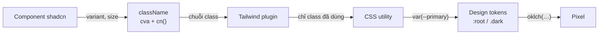

**Đọc sơ đồ:** Đọc từ trái trên, theo chiều kim đồng hồ: component tạo chuỗi class → Tailwind quét và sinh CSS → luật CSS trỏ tới biến token → token (sáng hoặc tối) cho ra màu thật trên màn hình. *Màu: viền terracotta dày = phần của bài này · be = phần còn lại của chuỗi.*


| Bài | Học gì | Mảnh nào của chuỗi |
|---|---|---|
| 1 | Utility-first & Tailwind v4 sinh CSS thế nào | className → plugin → CSS |
| 2 | Responsive & variant (`md:`, `hover:`, `dark:`) | Điều kiện bên trong CSS |
| 3 | Design token & dark mode | Token → pixel |
| 4 | shadcn/ui: chép code, không cài thư viện | Component → className |
| Lab | Layout Nexus | Cả chuỗi |

### Chuẩn bị project `nexus-ui`

Từ S1.3 tới S1.5, giao diện tĩnh của Nexus sống ở một project Vite tên `nexus-ui`. Ở M9, các component này được chuyển sang Next.js — vì shadcn là code của bạn nên chuyển chỉ là chép file.

```bash title="terminal"
npm create vite@latest nexus-ui -- --template react-ts
cd nexus-ui
npm install
npm install tailwindcss @tailwindcss/vite
npm install -D @types/node
```

Ba chỗ cấu hình. **(1)** `vite.config.ts` — gắn plugin Tailwind và alias `@` (viết tắt đường dẫn, `@/lib/utils` thay cho `../../lib/utils`):

```ts title="vite.config.ts"
import path from 'node:path'
import tailwindcss from '@tailwindcss/vite'
import react from '@vitejs/plugin-react'
import { defineConfig } from 'vite'

export default defineConfig({
  plugins: [react(), tailwindcss()],
  resolve: {
    alias: { '@': path.resolve(import.meta.dirname, './src') },
  },
})
```

**(2)** Thêm `"paths": { "@/*": ["./src/*"] }` vào `compilerOptions` của **cả** `tsconfig.json` lẫn `tsconfig.app.json` để TypeScript hiểu alias. Không cần `baseUrl` — TypeScript 6 đã deprecate nó và `paths` tự chạy được.

**(3)** `src/index.css` chỉ cần một dòng để bắt đầu (bài 3 sẽ thêm token):

```css title="src/index.css"
@import "tailwindcss";
```

Phiên bản thật lúc mình dựng: Tailwind **4.3.3**, React **19.3.0**, TypeScript **6.0.3**, Vite **8.3.1**, shadcn CLI **4.21.0**.

## Bài 1 — Utility-first: Tailwind sinh CSS thế nào

**Nó là gì (1 câu):** Tailwind là **hộp gia vị chia sẵn từng ngăn** — thay vì pha nước sốt riêng cho mỗi món (viết CSS riêng cho mỗi component), bạn rắc đúng các ngăn cần ngay tại món ăn: `p-4 rounded-lg bg-card`.

**Sơ đồ tổng** — bài này nằm ở đoạn *className → plugin → CSS*:

**Sơ đồ (Luồng dữ liệu) — Một className đi đường nào để thành màu trên màn hình?**

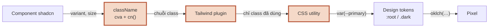

**Đọc sơ đồ:** Chuỗi từ className tới pixel; phần viền terracotta là đoạn bài này đào sâu — Bài 1: className → plugin → CSS. *Màu: viền terracotta dày = phần của bài này · be = phần còn lại của chuỗi.*


### 1.1 Utility class và thang đo

**Ẩn dụ:** mỗi class là **một ngăn gia vị làm đúng một việc**. `p-4` = padding 1rem. `text-sm` = cỡ chữ nhỏ. Ghép nhiều ngăn thành món.

**Sơ đồ:** trước khi viết, xem class của bạn đi qua đâu để thành CSS thật.

**Sơ đồ (Bản đồ dịch vụ) — Class Tailwind đi đường nào để thành CSS?**

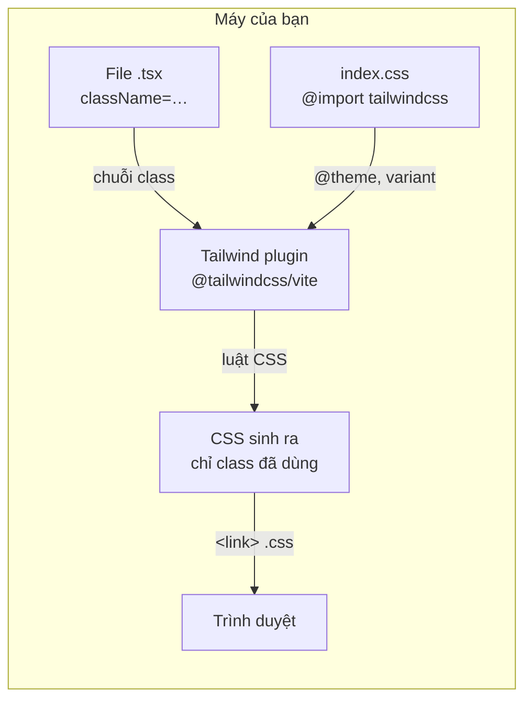

**Đọc sơ đồ:** Hai nguồn bên trái đổ vào plugin: file .tsx (chứa chuỗi class) và index.css (cấu hình). Plugin sinh ra một file CSS chỉ chứa class bạn thật sự viết, trình duyệt tải file đó. *Màu: vùng nét đứt = tất cả chạy trong máy bạn · mũi tên ghi thứ đi qua.*


**Chi tiết kỹ thuật:**

```tsx title="Cùng một thẻ, hai cách viết"
// CSS riêng: đặt tên, nhảy qua file khác, sợ xoá nhầm
<div className="stat-card">…</div>
/* .stat-card { padding: 1rem; border-radius: .5rem; border: 1px solid #e5e5e5; } */

// Utility-first: đọc là biết, xoá thẻ là xoá luôn style
<div className="rounded-lg border p-4">…</div>
```

- **Thang đo chuẩn** (spacing scale): `1` = 0.25rem = 4px. `p-2` 8px, `p-4` 16px, `gap-6` 24px. Nhờ thang chung, khoảng cách trong cả app ăn khớp.
- **Tailwind v4 không cần `tailwind.config.js`.** Cấu hình viết thẳng trong CSS: `@import "tailwindcss"`, `@theme`, `@custom-variant`. Plugin tự tìm file nguồn để quét.
- **Chỉ class bạn viết mới có CSS.** File CSS cuối của Lab chỉ khoảng 40 kB dù Tailwind có hàng nghìn utility.
- **Giá trị tuỳ ý** khi thang không đủ: `w-[18rem]`, `grid-cols-[16rem_1fr]`. Dùng ít — nhiều giá trị lẻ là dấu hiệu design system đang vỡ.

### 1.2 Bẫy lớn nhất: class ghép động

**Ẩn dụ:** người pha chế chỉ lấy gia vị **có tên ghi trên phiếu**. Phiếu ghi “bg-{màu}-500” thì không có ngăn nào tên như vậy.

**Sơ đồ:**

**Sơ đồ (Luồng quyết định) — Tailwind có sinh CSS cho class này không?**

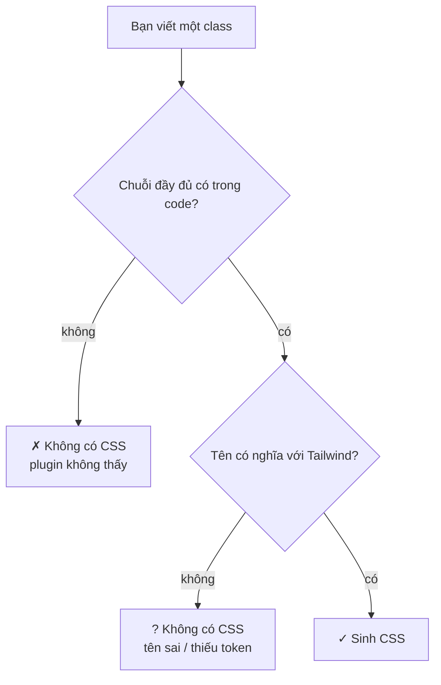

**Đọc sơ đồ:** Đọc từ trên xuống cho một class bất kỳ. Hai câu hỏi: plugin có THẤY chuỗi đó không, và tên đó có NGHĨA gì với Tailwind không. *Màu: đỏ gạch + ✗ + viền đứt = bị chặn/sai · vàng mù tạt + ? + viền chấm = cần xem lại · xanh ô-liu + ✓ = chạy đúng.*


**Chi tiết kỹ thuật:**

```tsx title="Class động: sai và đúng"
// ✗ plugin không thấy chuỗi 'bg-red-500' ở đâu cả
<span className={`bg-${color}-500`} />

// ✓ chuỗi đầy đủ nằm trong code, chỉ CHỌN lúc chạy
const TONE = { danger: 'bg-red-500', ok: 'bg-green-600' } as const
<span className={TONE[kind]} />
```

Plugin đọc file như đọc văn bản, không chạy code. Quy tắc: **mọi class phải xuất hiện nguyên văn ở đâu đó trong mã nguồn.**

### Nhìn lại bức tranh lớn

**Sơ đồ (Luồng dữ liệu) — Một className đi đường nào để thành màu trên màn hình?**


**Đọc sơ đồ:** Cùng chuỗi như đầu bài; phần viền terracotta là thứ bạn vừa học — Bài 1: className → plugin → CSS. *Màu: viền terracotta dày = phần của bài này · be = phần còn lại của chuỗi.*


Bạn vừa học đoạn **className → plugin → CSS**: utility là ngăn gia vị, plugin chỉ sinh CSS cho chữ nó đọc thấy. Nhưng một class như `hidden` thì áp dụng ở mọi màn hình — muốn “ẩn trên điện thoại, hiện trên máy tính” cần thêm điều kiện. Bài 2.

### Tự vẽ lại

1. Kể đường đi từ `className="p-4"` trong file `.tsx` tới luật CSS trình duyệt nhận được.
2. Vì sao `` `bg-${color}-500` `` không có màu? Sửa thế nào mà vẫn chọn màu lúc chạy?
3. Trong Tailwind v4, cấu hình nằm ở file nào?

## Bài 2 — Responsive & variant

**Nó là gì (1 câu):** prefix như `md:` là **dòng chú thích trên công thức**: “từ ly size vừa trở lên thì thêm một shot” — không có chú thích thì áp dụng cho mọi size.

**Sơ đồ tổng** — prefix biến thành *điều kiện bên trong CSS*:

**Sơ đồ (Luồng dữ liệu) — Một className đi đường nào để thành màu trên màn hình?**

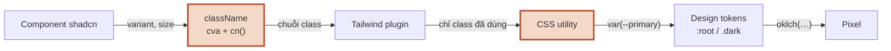

**Đọc sơ đồ:** Chuỗi từ className tới pixel; phần viền terracotta là đoạn bài này đào sâu — Bài 2: prefix md:, hover:, dark: thành điều kiện trong CSS. *Màu: viền terracotta dày = phần của bài này · be = phần còn lại của chuỗi.*


### 2.1 Mobile-first: viết cho màn nhỏ trước

**Ẩn dụ:** công thức gốc là **ly nhỏ**; prefix chỉ ghi phần **thay đổi khi ly to hơn**.

**Sơ đồ:** chạy class `hidden md:block` của sidebar qua 4 chiều rộng.

**Sơ đồ (Luồng quyết định) — Class có prefix như md: áp dụng lúc nào?**

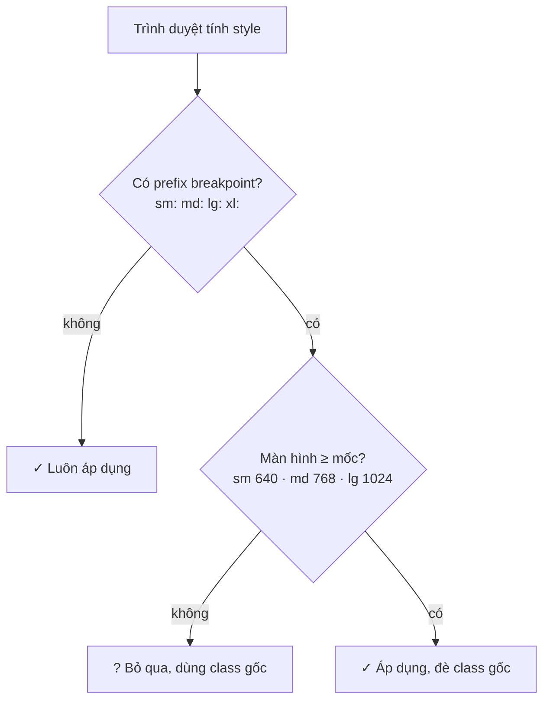

**Đọc sơ đồ:** Đọc từ trên xuống cho một class ở một chiều rộng màn hình. Tailwind là mobile-first: class không prefix áp dụng mọi nơi, prefix nghĩa là ‘từ mốc này trở lên’. *Màu: xanh ô-liu + ✓ = class có hiệu lực · vàng mù tạt + ? = class bị bỏ qua ở kích thước này.*


**Chi tiết kỹ thuật:**

| Prefix | Nghĩa | CSS sinh ra |
|---|---|---|
| (không) | mọi kích thước | luật thường |
| `sm:` | ≥ 640px | `@media (width >= 40rem)` |
| `md:` | ≥ 768px | `@media (width >= 48rem)` |
| `lg:` | ≥ 1024px | `@media (width >= 64rem)` |
| `max-md:` | < 768px | `@media (width < 48rem)` |

- **Đọc `hidden md:block` là:** “ẩn; từ 768px trở lên thì hiện”. Không phải “ẩn trên mobile” — mobile chỉ là trường hợp mặc định.
- Lỗi hay gặp: viết `sm:hidden` rồi tưởng “ẩn trên màn nhỏ”. Thực ra là “ẩn từ 640px trở lên”.
- **AC của session dùng đúng mốc `md` = 768px**: sidebar `hidden md:block`, nút ☰ `md:hidden`.

### 2.2 Variant trạng thái & ghép variant

**Ẩn dụ:** ngoài size ly còn có ghi chú khác: “khi khách chạm vào” (`hover:`), “khi đang được chọn bằng bàn phím” (`focus-visible:`), “khi quán tắt đèn” (`dark:`). Ghi chú có thể **chồng lên nhau**.

**Sơ đồ:** layout Nexus biến hình thế nào quanh mốc 768px.

**Sơ đồ (Luồng dữ liệu) — Layout Nexus biến hình thế nào quanh mốc 768px?**

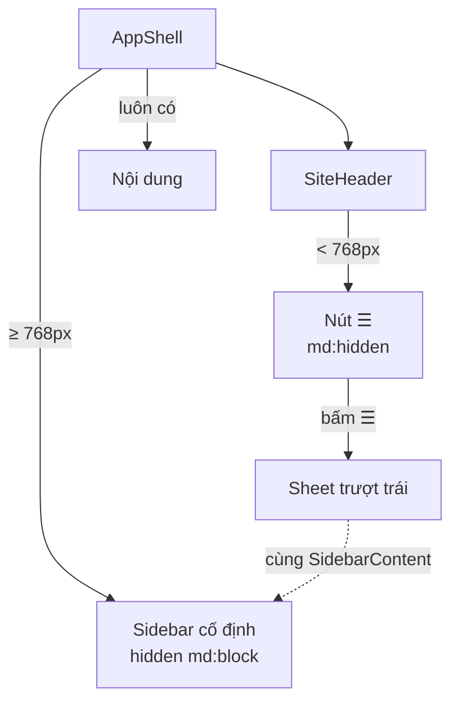

**Đọc sơ đồ:** Đọc từ AppShell (trên) xuống: trên desktop nó dựng sidebar cố định; dưới 768px sidebar ẩn, Header hiện nút ☰, bấm vào mở Sheet — bên trong Sheet là đúng component SidebarContent. *Màu: be = component · nhãn mũi tên = class/điều kiện quyết định · nét đứt = dùng lại cùng component.*


**Chi tiết kỹ thuật:**

```tsx title="Variant hay dùng"
<button className="
  rounded-md px-3 py-1.5 text-sm
  hover:bg-accent                    /* chuột đi qua */
  focus-visible:ring-2 ring-ring     /* focus bằng bàn phím */
  disabled:opacity-50                /* thuộc tính disabled */
  aria-[current=page]:font-medium    /* thuộc tính ARIA */
  dark:hover:bg-accent/50            /* ghép 2 variant */
  md:text-base                       /* ≥ 768px */
">
```

- Ghép được: `md:hover:bg-accent` = “từ 768px trở lên *và* khi hover”.
- `/50` sau màu là độ trong suốt 50% (`bg-black/50`).
- Viết class theo nhóm cho dễ đọc: bố cục → khoảng cách → chữ → màu → trạng thái → responsive. Hoặc cài extension Prettier cho Tailwind để tự sắp xếp.

### Nhìn lại bức tranh lớn

**Sơ đồ (Luồng dữ liệu) — Một className đi đường nào để thành màu trên màn hình?**


**Đọc sơ đồ:** Cùng chuỗi như đầu bài; phần viền terracotta là thứ bạn vừa học — Bài 2: prefix md:, hover:, dark: thành điều kiện trong CSS. *Màu: viền terracotta dày = phần của bài này · be = phần còn lại của chuỗi.*


Bạn vừa học cách **đặt điều kiện** cho class: prefix breakpoint thành media query, prefix trạng thái thành selector. Có một variant đặc biệt — `dark:` — và cách tốt hơn cả `dark:` là không cần viết nó. Bài 3.

### Tự vẽ lại

1. Đọc to `hidden md:block` bằng tiếng Việt.
2. Ở đúng 768px, sidebar hiện hay ẩn? Vì sao?
3. `md:hover:bg-accent` áp dụng khi nào?

## Bài 3 — Design token & dark mode

**Nó là gì (1 câu):** design token là **bảng màu men của xưởng gốm**: ly ghi “men chính”, không ghi “nâu #8B5A2B” — mùa đông đổi men chính sang be, cả bộ ly đổi theo mà không nặn lại cái nào.

**Sơ đồ tổng** — bài này nằm ở đoạn *Token → Pixel*:

**Sơ đồ (Luồng dữ liệu) — Một className đi đường nào để thành màu trên màn hình?**

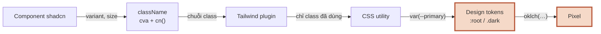

**Đọc sơ đồ:** Chuỗi từ className tới pixel; phần viền terracotta là đoạn bài này đào sâu — Bài 3: token đổi giá trị theo sáng/tối. *Màu: viền terracotta dày = phần của bài này · be = phần còn lại của chuỗi.*


### 3.1 Token: tên có nghĩa thay cho mã màu

**Ẩn dụ:** công thức ghi “**sữa**”, không ghi “sữa tươi hộp xanh 1 lít”. Hết loại này thay loại khác, công thức vẫn đúng.

**Sơ đồ:** màu của nút chính đi qua 3 lớp.

**Sơ đồ (Luồng dữ liệu) — Màu của bg-primary đi qua những lớp nào?**

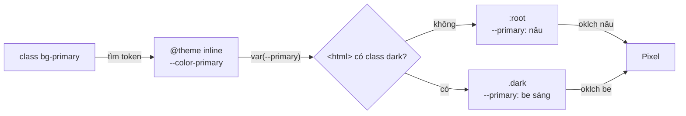

**Đọc sơ đồ:** Đọc hàng trên từ trái: class bg-primary trỏ tới --color-primary, rồi tới --primary. Giá trị --primary lấy ở :root hay .dark tuỳ <html> có class ‘dark’ không. Tên class không bao giờ đổi. *Màu: be = một lớp trong chuỗi · mũi tên ghi thứ được tra cứu.*


**Chi tiết kỹ thuật** — trích `src/index.css` của Lab:

```css title="src/index.css (trích)"
@custom-variant dark (&:is(.dark *));   /* dark: = nằm trong phần tử có class .dark */

@theme inline {
  --color-background: var(--background); /* sinh bg-background, text-background… */
  --color-primary: var(--primary);       /* sinh bg-primary, text-primary, ring-primary… */
}

:root {
  --background: oklch(1 0 0);
  --primary: oklch(0.47 0.09 50);        /* Nexus: nâu cà phê */
}

.dark {
  --background: oklch(0.145 0 0);
  --primary: oklch(0.78 0.09 60);        /* cùng TÊN, khác GIÁ TRỊ */
}
```

- **Ba lớp:** class (`bg-primary`) → cầu nối `@theme inline` (`--color-primary`) → biến gốc (`--primary`) có giá trị ở `:root` và `.dark`.
- **Token đi thành cặp:** `primary` / `primary-foreground` (chữ đặt trên nền primary). Luôn dùng cặp để đủ tương phản ở cả hai chế độ.
- **Dùng token, đừng dùng màu thô.** `bg-background text-foreground border-border` thay cho `bg-white text-black border-gray-200`. Nhờ vậy component **không cần một chữ `dark:` nào** — cả bộ token tự đổi.
- `oklch(độ sáng độ bão hoà sắc độ)` là cách viết màu theo cảm nhận của mắt: tăng số đầu là sáng lên, rất tiện để làm biến thể sáng/tối.

### 3.2 Chọn sáng hay tối — và nhớ lựa chọn

**Ẩn dụ:** quán có **công tắc đèn** (user chọn) và **cảm biến ánh sáng** (theo hệ điều hành). Ai bật công tắc tay thì cảm biến phải nghe theo.

**Sơ đồ:**

**Sơ đồ (Luồng quyết định) — Trang nên hiện sáng hay tối?**

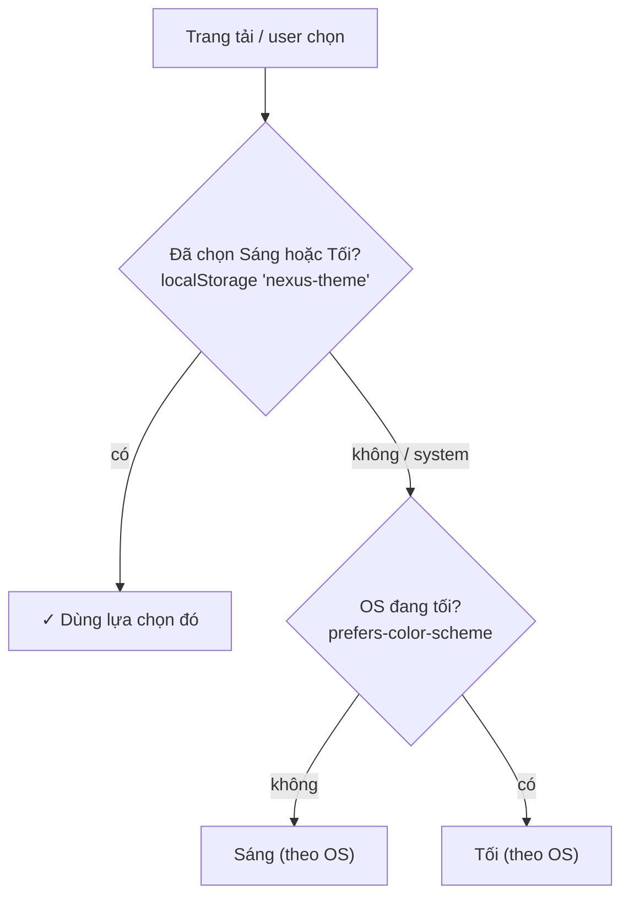

**Đọc sơ đồ:** Đọc từ trên xuống — cùng một logic chạy ở hai nơi: script nhỏ trong index.html (trước khi vẽ) và ThemeProvider (khi React chạy). Lựa chọn của user luôn thắng hệ điều hành. *Màu: xanh ô-liu + ✓ = theo lựa chọn đã lưu của user · be = theo hệ điều hành (và tự đổi khi OS đổi).*


**Chi tiết kỹ thuật:** `ThemeProvider` của Lab là bản nâng cấp của khung bạn viết ở S1.2 bài 5. Mỗi dòng trong đó áp dụng lại một luật của S1.2:

| Dòng trong ThemeProvider | Luật từ S1.2 |
|---|---|
| `useState(readStoredTheme)` | Lazy init: đọc localStorage một lần |
| `resolvedTheme = theme === 'system' ? … : theme` | Derived → tính khi render |
| `useEffect` nghe `matchMedia` + `removeEventListener` | Hệ thống ngoài → effect + cleanup |
| `useEffect` đặt class trên `<html>` | `<html>` nằm ngoài cây React → effect |
| `localStorage.setItem` trong `setTheme` | Do user chọn → trong hàm, không trong effect |
| `useMemo` cho `value` của context | Giữ tham chiếu ổn định cho người đọc context |

### 3.3 Chống nháy trắng khi tải trang

**Ẩn dụ:** nếu đợi quản lý (React) tới mới tắt đèn, khách bước vào sẽ thấy **chớp sáng một giây**. Phải để **bảo vệ gác cửa** (script nhỏ) tắt đèn trước khi mở cửa.

**Sơ đồ:**

**Sơ đồ (Trình tự) — Tải trang: ai đặt class dark trước khi màn hình vẽ?**

```mermaid
sequenceDiagram
    participant S as Script trong &lt;head&gt;
    participant L as localStorage
    participant H as &lt;html&gt;
    participant R as ThemeProvider
    S->>L: 1. đọc 'nexus-theme'
    L-->>S: 2. 'dark'
    S->>H: 3. classList.add('dark')
    H->>H: 4. vẽ khung đầu: tối
    R->>L: 5. React mount: đọc lại
    R->>H: 6. effect: giữ class dark
    Note over H: ✗ thiếu script → khung đầu sáng → nháy trắng
```

**Đọc sơ đồ:** Bốn cột, đọc ①→⑥. Script nhỏ trong <head> chạy trước cả CSS lẫn React, nên khung hình đầu tiên đã đúng màu. Ô đỏ là chuyện xảy ra nếu chỉ dựa vào React. *Màu: đỏ gạch + ✗ + viền đứt = bị chặn/sai · vàng mù tạt + ? + viền chấm = cần xem lại · xanh ô-liu + ✓ = chạy đúng.*


**Chi tiết kỹ thuật:** đặt đoạn script inline trong `<head>` của `index.html` — nó chạy đồng bộ trước khi trình duyệt vẽ, trước cả khi React tải. Hiện tượng nháy gọi là **FOUC** (flash of unstyled/incorrect content — khung hình đầu sai giao diện). Khoá `'nexus-theme'` phải **giống hệt** ở script và ở `theme-context.ts`.

### Nhìn lại bức tranh lớn

**Sơ đồ (Luồng dữ liệu) — Một className đi đường nào để thành màu trên màn hình?**


**Đọc sơ đồ:** Cùng chuỗi như đầu bài; phần viền terracotta là thứ bạn vừa học — Bài 3: token đổi giá trị theo sáng/tối. *Màu: viền terracotta dày = phần của bài này · be = phần còn lại của chuỗi.*


Bạn vừa học phần **giá trị** của chuỗi: class chỉ mang tên token, token mang màu thật, class `dark` trên `<html>` quyết định bộ màu nào thắng. Còn lại mảnh đầu chuỗi: ai viết ra những chuỗi class dài kia? — component shadcn. Bài 4.

### Tự vẽ lại

1. Kể 3 lớp từ `bg-primary` tới màu thật, và lớp nào đổi khi bật dark mode.
2. User chọn “Sáng” nhưng hệ điều hành đang tối — trang hiện gì? Vì sao?
3. Vì sao phải có script trong `index.html` khi đã có `ThemeProvider`?

## Bài 4 — shadcn/ui: chép code, không cài thư viện

**Nó là gì (1 câu):** shadcn/ui là **bộ ly mẫu xưởng giao tận nhà kèm khuôn** — không phải thuê ly theo tháng (thư viện trong `node_modules`), mà ly thuộc về bạn: mài lại, sơn lại tuỳ ý.

**Sơ đồ tổng** — bài này nằm ở đầu chuỗi, *Component → className*:

**Sơ đồ (Luồng dữ liệu) — Một className đi đường nào để thành màu trên màn hình?**

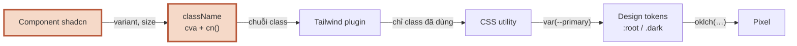

**Đọc sơ đồ:** Chuỗi từ className tới pixel; phần viền terracotta là đoạn bài này đào sâu — Bài 4: component shadcn tạo className. *Màu: viền terracotta dày = phần của bài này · be = phần còn lại của chuỗi.*


### 4.1 `shadcn add` thật ra làm gì

**Ẩn dụ:** xưởng gửi bạn **bản vẽ và khuôn**, không gửi ly thành phẩm dán tem bảo hành.

**Sơ đồ:** chú ý kịch bản thứ hai — đó là chuyện xảy ra thật khi mình soạn bài.

**Sơ đồ (Bản đồ dịch vụ) — Lệnh npx shadcn add button làm gì trên máy bạn?**

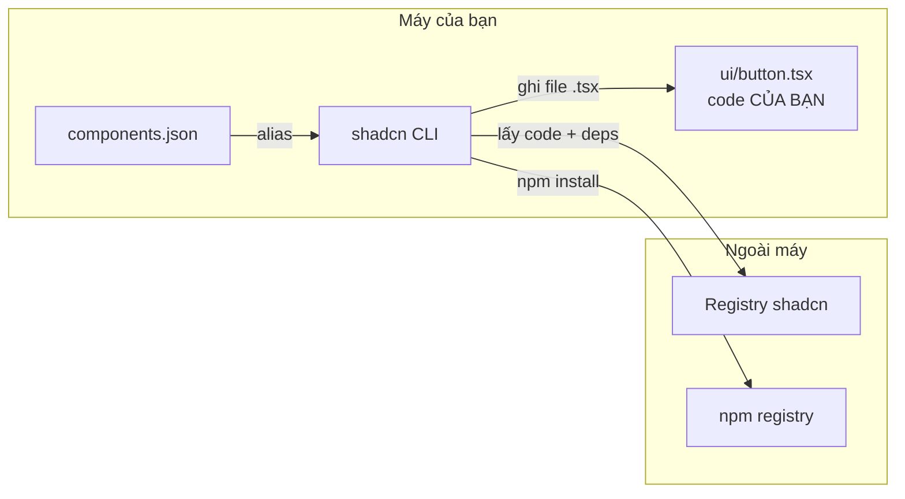

**Đọc sơ đồ:** CLI đọc components.json để biết đặt file ở đâu, lấy code từ registry (ngoài máy), cài vài package npm, rồi GHI một file .tsx vào repo của bạn. Từ đó file là của bạn. *Màu: đỏ gạch + ✗ + viền đứt = bị chặn/sai · vàng mù tạt + ? + viền chấm = cần xem lại · xanh ô-liu + ✓ = chạy đúng. Vùng nét đứt = trong máy / ngoài máy.*


**Chi tiết kỹ thuật:**

Trên máy bạn (có mạng bình thường), từ thư mục `nexus-ui`:

```bash title="terminal"
npx shadcn@latest init            # chọn template vite, base radix
npx shadcn@latest add button card badge avatar separator sheet dropdown-menu
```

Bản CLI 4.x hỏi thêm **base** (thư viện nền cho phần tương tác: `radix`, `base` hay `aria`) và **preset** (bộ style). Lab dùng style `new-york` trên nền **Radix**. Máy soạn bài của mình chặn mạng tới `ui.shadcn.com`, nên đây là kết quả thật khi chạy `init`:

```console title="output"
$ npx shadcn@latest init -t vite -b radix -p nova -y --no-monorepo
Something went wrong. Please check the error below for more details.
Message:
You are not authorized to access the item at https://ui.shadcn.com/init?base=radix&style=nova…
```

Mình làm đúng việc CLI làm, bằng tay: lấy source từ kho GitHub chính thức `shadcn-ui/ui` (thư mục `apps/v4/registry/new-york-v4/ui/`), đổi dòng `import { cn } from "cn"` thành `"@/lib/utils"`, cài các package nó cần:

```bash title="terminal"
npm install radix-ui lucide-react class-variance-authority clsx tailwind-merge
npm install -D tw-animate-css
```

Bạn thì cứ dùng CLI. Điểm đáng nhớ ở đây: **vì shadcn chỉ là code, không có CLI vẫn làm được** — điều mà thư viện component thông thường không cho phép.

- **Những gì bạn sở hữu:** `src/components/ui/*.tsx`, `src/lib/utils.ts`, token trong `index.css`, `components.json`.
- **Những gì vẫn là thư viện:** `radix-ui` (hành vi: focus trap, Esc để đóng, ARIA), `lucide-react` (icon), `cva`, `clsx`, `tailwind-merge`.
- Nhờ Radix, `Sheet` (dựa trên Dialog) tự khoá focus bên trong khi mở và đóng bằng Esc — Lab đã kiểm tra cả hai.

### 4.2 Giải phẫu `Button`: cva + cn()

**Ẩn dụ:** `cva` là **bảng size ly và loại ly** (nhỏ/vừa/lớn × sứ/thuỷ tinh), `cn()` là **người đóng gói cuối** — gom mọi yêu cầu, gạch bỏ cái mâu thuẫn.

**Sơ đồ:**

**Sơ đồ (Luồng dữ liệu) — Button tính ra className cuối cùng thế nào?**

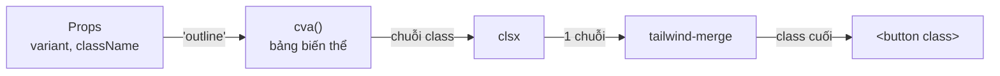

**Đọc sơ đồ:** Đọc từ trái: props đi vào bảng biến thể cva, được nối với className bạn truyền, clsx gộp thành một chuỗi, tailwind-merge dọn các class đánh nhau, rồi mới gắn lên thẻ <button>. *Màu: đỏ gạch + ✗ + viền đứt = bị chặn/sai · vàng mù tạt + ? + viền chấm = cần xem lại · xanh ô-liu + ✓ = chạy đúng. Nhãn trên mũi tên = dữ liệu đi qua.*


**Chi tiết kỹ thuật** — rút gọn từ `button.tsx`:

```tsx title="src/components/ui/button.tsx (rút gọn)"
const buttonVariants = cva(
  'inline-flex items-center justify-center gap-2 rounded-md text-sm font-medium …', // luôn có
  {
    variants: {
      variant: {
        default: 'bg-primary text-primary-foreground hover:bg-primary/90',
        outline: 'border bg-background shadow-xs hover:bg-accent …',
        ghost: 'hover:bg-accent hover:text-accent-foreground …',
      },
      size: { default: 'h-9 px-4 py-2', sm: 'h-8 px-3', icon: 'size-9' },
    },
    defaultVariants: { variant: 'default', size: 'default' },
  },
)

function Button({ className, variant, size, asChild = false, ...props }) {
  const Comp = asChild ? Slot.Root : 'button' // asChild: "mặc" style lên phần tử con
  return <Comp className={cn(buttonVariants({ variant, size, className }))} {...props} />
}
```

- **`cva`** (class-variance-authority) biến bảng biến thể thành hàm: `buttonVariants({ variant: 'outline' })` → chuỗi class. TypeScript biết đúng các giá trị hợp lệ.
- **`cn()`** = `twMerge(clsx(...))`. `clsx` gộp và bỏ giá trị rỗng/false; `tailwind-merge` hiểu `px-4` và `px-8` cùng nhóm nên giữ cái sau.
- **`asChild`**: `<DropdownMenuTrigger asChild><Button …/></DropdownMenuTrigger>` — trigger không tạo thêm `<button>` lồng nhau mà truyền hành vi cho con. Lab dùng đúng mẫu này.
- **Muốn thêm biến thể?** Sửa thẳng object `variants` — ví dụ thêm `variant: { brand: '…' }`. Đó là lý do bạn sở hữu file.

### Nhìn lại bức tranh lớn

**Sơ đồ (Luồng dữ liệu) — Một className đi đường nào để thành màu trên màn hình?**


**Đọc sơ đồ:** Cùng chuỗi như đầu bài; phần viền terracotta là thứ bạn vừa học — Bài 4: component shadcn tạo className. *Màu: viền terracotta dày = phần của bài này · be = phần còn lại của chuỗi.*


Giờ bạn nắm cả chuỗi: component shadcn dùng `cva` + `cn()` tạo chuỗi class, Tailwind sinh CSS cho đúng các class đó, CSS trỏ tới token, token đổi theo sáng/tối. Vào Lab — ghép chúng thành layout Nexus.

### Tự vẽ lại

1. Sau `shadcn add button`, file nào mới xuất hiện trong repo và thư viện nào mới vào `node_modules`?
2. `<Button className="px-8">` — vì sao không bị `px-4` của biến thể đè lên?
3. `asChild` giải quyết vấn đề gì?

## Lab — Layout Nexus: sidebar, header, nội dung

**Mục tiêu:** khung trang dùng tới hết Module 1 (và chuyển sang Next.js ở M9). Hai AC: dưới 768px sidebar thành menu trượt; dark mode chuyển được và nhớ.

Cây component của Lab — đọc trước khi gõ:

**Sơ đồ (Luồng dữ liệu) — Các component của layout Nexus nối với nhau thế nào?**

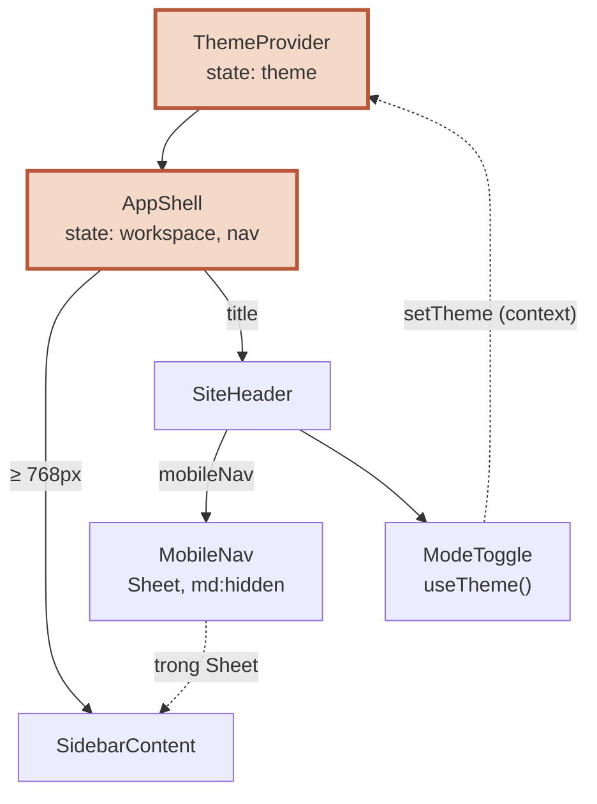

**Đọc sơ đồ:** Đọc từ ThemeProvider (trên cùng) xuống. Nét liền = cha render con. Hai nét đứt: SidebarContent được dùng lại trong Sheet, và ModeToggle gọi setTheme ngược lên Provider qua context. *Màu: viền terracotta = nơi giữ state · nét đứt = dùng lại / context.*


Cấu trúc đích:

```text title="cấu trúc thư mục"
nexus-ui/
├── index.html                    script chặn nháy (Bài 3.3)
├── components.json               cấu hình shadcn
├── vite.config.ts                plugin Tailwind + alias @
└── src/
    ├── index.css                 Tailwind + token sáng/tối (Bài 3)
    ├── main.tsx                  bọc <ThemeProvider>
    ├── App.tsx
    ├── lib/utils.ts              cn()
    ├── data/nav.ts               workspace + mục điều hướng (dữ liệu giả)
    └── components/
        ├── ui/                   shadcn: button, card, badge, avatar, separator, sheet, dropdown-menu
        ├── theme/                theme-context.ts · theme-provider.tsx · use-theme.ts · mode-toggle.tsx
        └── layout/               app-shell · sidebar-content · mobile-nav · site-header
```

### Bước 1 — Token & `cn()`

`index.css` hoàn chỉnh: token neutral của shadcn, riêng `--primary`, `--ring` và `--sidebar-primary` đổi sang màu thương hiệu Nexus (nâu cà phê khi sáng, be sáng khi tối).

```css title="src/index.css"
@import "tailwindcss";
@import "tw-animate-css";

/* dark: áp dụng khi phần tử nằm trong .dark (class trên <html>) */
@custom-variant dark (&:is(.dark *));

/* Nối biến CSS → utility của Tailwind: --color-primary sinh ra bg-primary, text-primary… */
@theme inline {
  --radius-sm: calc(var(--radius) - 4px);
  --radius-md: calc(var(--radius) - 2px);
  --radius-lg: var(--radius);
  --radius-xl: calc(var(--radius) + 4px);
  --color-background: var(--background);
  --color-foreground: var(--foreground);
  --color-card: var(--card);
  --color-card-foreground: var(--card-foreground);
  --color-popover: var(--popover);
  --color-popover-foreground: var(--popover-foreground);
  --color-primary: var(--primary);
  --color-primary-foreground: var(--primary-foreground);
  --color-secondary: var(--secondary);
  --color-secondary-foreground: var(--secondary-foreground);
  --color-muted: var(--muted);
  --color-muted-foreground: var(--muted-foreground);
  --color-accent: var(--accent);
  --color-accent-foreground: var(--accent-foreground);
  --color-destructive: var(--destructive);
  --color-border: var(--border);
  --color-input: var(--input);
  --color-ring: var(--ring);
  --color-chart-1: var(--chart-1);
  --color-chart-2: var(--chart-2);
  --color-chart-3: var(--chart-3);
  --color-chart-4: var(--chart-4);
  --color-chart-5: var(--chart-5);
  --color-sidebar: var(--sidebar);
  --color-sidebar-foreground: var(--sidebar-foreground);
  --color-sidebar-primary: var(--sidebar-primary);
  --color-sidebar-primary-foreground: var(--sidebar-primary-foreground);
  --color-sidebar-accent: var(--sidebar-accent);
  --color-sidebar-accent-foreground: var(--sidebar-accent-foreground);
  --color-sidebar-border: var(--sidebar-border);
  --color-sidebar-ring: var(--sidebar-ring);
}

/* Design tokens — chế độ sáng */
:root {
  --background: oklch(1 0 0);
  --foreground: oklch(0.145 0 0);
  --card: oklch(1 0 0);
  --card-foreground: oklch(0.145 0 0);
  --popover: oklch(1 0 0);
  --popover-foreground: oklch(0.145 0 0);
  --primary: oklch(0.47 0.09 50); /* Nexus brand */
  --primary-foreground: oklch(0.985 0 0); /* Nexus brand */
  --secondary: oklch(0.97 0 0);
  --secondary-foreground: oklch(0.205 0 0);
  --muted: oklch(0.97 0 0);
  --muted-foreground: oklch(0.556 0 0);
  --accent: oklch(0.97 0 0);
  --accent-foreground: oklch(0.205 0 0);
  --destructive: oklch(0.577 0.245 27.325);
  --border: oklch(0.922 0 0);
  --input: oklch(0.922 0 0);
  --ring: oklch(0.62 0.09 50); /* Nexus brand */
  --chart-1: oklch(0.87 0 0);
  --chart-2: oklch(0.556 0 0);
  --chart-3: oklch(0.439 0 0);
  --chart-4: oklch(0.371 0 0);
  --chart-5: oklch(0.269 0 0);
  --radius: 0.625rem;
  --sidebar: oklch(0.985 0 0);
  --sidebar-foreground: oklch(0.145 0 0);
  --sidebar-primary: oklch(0.47 0.09 50); /* Nexus brand */
  --sidebar-primary-foreground: oklch(0.985 0 0);
  --sidebar-accent: oklch(0.97 0 0);
  --sidebar-accent-foreground: oklch(0.205 0 0);
  --sidebar-border: oklch(0.922 0 0);
  --sidebar-ring: oklch(0.708 0 0);
}

/* Design tokens — chế độ tối: chỉ đổi GIÁ TRỊ, không đổi TÊN */
.dark {
  --background: oklch(0.145 0 0);
  --foreground: oklch(0.985 0 0);
  --card: oklch(0.205 0 0);
  --card-foreground: oklch(0.985 0 0);
  --popover: oklch(0.205 0 0);
  --popover-foreground: oklch(0.985 0 0);
  --primary: oklch(0.78 0.09 60); /* Nexus brand */
  --primary-foreground: oklch(0.2 0.02 50); /* Nexus brand */
  --secondary: oklch(0.269 0 0);
  --secondary-foreground: oklch(0.985 0 0);
  --muted: oklch(0.269 0 0);
  --muted-foreground: oklch(0.708 0 0);
  --accent: oklch(0.269 0 0);
  --accent-foreground: oklch(0.985 0 0);
  --destructive: oklch(0.704 0.191 22.216);
  --border: oklch(1 0 0 / 10%);
  --input: oklch(1 0 0 / 15%);
  --ring: oklch(0.6 0.08 55); /* Nexus brand */
  --chart-1: oklch(0.87 0 0);
  --chart-2: oklch(0.556 0 0);
  --chart-3: oklch(0.439 0 0);
  --chart-4: oklch(0.371 0 0);
  --chart-5: oklch(0.269 0 0);
  --sidebar: oklch(0.205 0 0);
  --sidebar-foreground: oklch(0.985 0 0);
  --sidebar-primary: oklch(0.78 0.09 60); /* Nexus brand */
  --sidebar-primary-foreground: oklch(0.2 0.02 50); /* Nexus brand */
  --sidebar-accent: oklch(0.269 0 0);
  --sidebar-accent-foreground: oklch(0.985 0 0);
  --sidebar-border: oklch(1 0 0 / 10%);
  --sidebar-ring: oklch(0.556 0 0);
}

@layer base {
  * {
    @apply border-border outline-ring/50;
  }
  body {
    @apply bg-background text-foreground;
  }
}
```

```ts title="src/lib/utils.ts"
import { clsx, type ClassValue } from 'clsx'
import { twMerge } from 'tailwind-merge'

/** Gộp class: clsx xử lý điều kiện, twMerge xử lý xung đột (px-2 vs px-4 → giữ cái sau) */
export function cn(...inputs: ClassValue[]) {
  return twMerge(clsx(inputs))
}
```

```json title="components.json"
{
  "$schema": "https://ui.shadcn.com/schema.json",
  "style": "new-york",
  "rsc": false,
  "tsx": true,
  "tailwind": {
    "config": "",
    "css": "src/index.css",
    "baseColor": "neutral",
    "cssVariables": true,
    "prefix": ""
  },
  "iconLibrary": "lucide",
  "aliases": {
    "components": "@/components",
    "utils": "@/lib/utils",
    "ui": "@/components/ui",
    "lib": "@/lib",
    "hooks": "@/hooks"
  }
}
```

### Bước 2 — Theme: context, provider, hook, nút chọn

Tách thành 3 file để luật lint “một file chỉ export component” (giúp HMR — Hot Module Replacement — hoạt động đúng) không cảnh báo.

```ts title="src/components/theme/theme-context.ts"
import { createContext } from 'react'

export type Theme = 'light' | 'dark' | 'system'
export type ResolvedTheme = 'light' | 'dark'

export type ThemeContextValue = {
  theme: Theme // lựa chọn của user
  resolvedTheme: ResolvedTheme // thứ thật sự đang hiển thị
  setTheme: (theme: Theme) => void
}

export const STORAGE_KEY = 'nexus-theme' // phải khớp với script trong index.html

export const ThemeContext = createContext<ThemeContextValue | null>(null)
```

```tsx title="src/components/theme/theme-provider.tsx"
import { useCallback, useEffect, useMemo, useState, type ReactNode } from 'react'
import { STORAGE_KEY, ThemeContext, type Theme } from './theme-context'

const DARK_QUERY = '(prefers-color-scheme: dark)'

function readStoredTheme(): Theme {
  try {
    const v = localStorage.getItem(STORAGE_KEY)
    return v === 'light' || v === 'dark' || v === 'system' ? v : 'system'
  } catch {
    return 'system' // localStorage có thể bị chặn (chế độ riêng tư…)
  }
}

export function ThemeProvider({ children }: { children: ReactNode }) {
  // Lazy init: chỉ đọc localStorage một lần lúc mount
  const [theme, setThemeState] = useState<Theme>(readStoredTheme)
  const [systemDark, setSystemDark] = useState(() => window.matchMedia(DARK_QUERY).matches)

  // (1) Nghe hệ điều hành đổi sáng/tối = hệ thống ngoài → effect + cleanup
  useEffect(() => {
    const mq = window.matchMedia(DARK_QUERY)
    const onChange = (e: MediaQueryListEvent) => setSystemDark(e.matches)
    mq.addEventListener('change', onChange)
    return () => mq.removeEventListener('change', onChange)
  }, [])

  // Derived: tính khi render, không phải state
  const resolvedTheme = theme === 'system' ? (systemDark ? 'dark' : 'light') : theme

  // (2) Đồng bộ class trên <html> = DOM ngoài cây React → effect
  useEffect(() => {
    const root = document.documentElement
    root.classList.toggle('dark', resolvedTheme === 'dark')
    root.style.colorScheme = resolvedTheme
  }, [resolvedTheme])

  // (3) Lưu lựa chọn: xảy ra VÌ user chọn → làm trong hàm set, không phải effect
  const setTheme = useCallback((next: Theme) => {
    setThemeState(next)
    try {
      localStorage.setItem(STORAGE_KEY, next)
    } catch {
      /* không lưu được thì thôi, UI vẫn đổi */
    }
  }, [])

  // Giữ object value ổn định → component đọc context không render thừa
  const value = useMemo(
    () => ({ theme, resolvedTheme, setTheme }),
    [theme, resolvedTheme, setTheme],
  )

  return <ThemeContext value={value}>{children}</ThemeContext>
}
```

```ts title="src/components/theme/use-theme.ts"
import { useContext } from 'react'
import { ThemeContext } from './theme-context'

export function useTheme() {
  const ctx = useContext(ThemeContext)
  if (!ctx) throw new Error('useTheme phải được dùng bên trong <ThemeProvider>')
  return ctx
}
```

`ModeToggle` dùng `DropdownMenu` của shadcn với 3 lựa chọn. `asChild` để `Button` làm luôn vai trò trigger:

```tsx title="src/components/theme/mode-toggle.tsx"
import { Monitor, Moon, Sun } from 'lucide-react'
import { Button } from '@/components/ui/button'
import {
  DropdownMenu,
  DropdownMenuContent,
  DropdownMenuRadioGroup,
  DropdownMenuRadioItem,
  DropdownMenuTrigger,
} from '@/components/ui/dropdown-menu'
import type { Theme } from './theme-context'
import { useTheme } from './use-theme'

const OPTIONS: { value: Theme; label: string; icon: typeof Sun }[] = [
  { value: 'light', label: 'Sáng', icon: Sun },
  { value: 'dark', label: 'Tối', icon: Moon },
  { value: 'system', label: 'Theo hệ thống', icon: Monitor },
]

export function ModeToggle() {
  const { theme, resolvedTheme, setTheme } = useTheme()
  const Icon = resolvedTheme === 'dark' ? Moon : Sun

  return (
    <DropdownMenu>
      <DropdownMenuTrigger asChild>
        <Button variant="ghost" size="icon" aria-label="Đổi giao diện sáng/tối">
          <Icon />
        </Button>
      </DropdownMenuTrigger>
      <DropdownMenuContent align="end">
        <DropdownMenuRadioGroup value={theme} onValueChange={(v) => setTheme(v as Theme)}>
          {OPTIONS.map(({ value, label, icon: ItemIcon }) => (
            <DropdownMenuRadioItem key={value} value={value}>
              <ItemIcon className="text-muted-foreground" />
              {label}
            </DropdownMenuRadioItem>
          ))}
        </DropdownMenuRadioGroup>
      </DropdownMenuContent>
    </DropdownMenu>
  )
}
```

Và script chặn nháy trong `index.html`:

```html title="index.html"
<!doctype html>
<html lang="vi">
  <head>
    <meta charset="UTF-8" />
    <meta name="viewport" content="width=device-width, initial-scale=1.0" />
    <title>Nexus</title>
    <!-- Chạy TRƯỚC khi CSS/React tải: đặt class dark ngay → không nháy trắng -->
    <script>
      (function () {
        try {
          var t = localStorage.getItem('nexus-theme');
          var dark =
            t === 'dark' ||
            ((t === null || t === 'system') &&
              window.matchMedia('(prefers-color-scheme: dark)').matches);
          document.documentElement.classList.toggle('dark', dark);
          document.documentElement.style.colorScheme = dark ? 'dark' : 'light';
        } catch (e) {}
      })();
    </script>
  </head>
  <body>
    <div id="root"></div>
    <script type="module" src="/src/main.tsx"></script>
  </body>
</html>
```

### Bước 3 — Dữ liệu điều hướng

```ts title="src/data/nav.ts"
import { FileText, LayoutDashboard, MessageSquare, Settings, Users, type LucideIcon } from 'lucide-react'

export type Workspace = { id: string; name: string; initials: string }
export type NavItem = { id: string; label: string; icon: LucideIcon }

export const workspaces: Workspace[] = [
  { id: 'acme', name: 'Acme Coffee', initials: 'AC' },
  { id: 'phin', name: 'Phin Roasters', initials: 'PR' },
  { id: 'lotus', name: 'Lotus Tea House', initials: 'LT' },
]

export const navItems: NavItem[] = [
  { id: 'chat', label: 'Chat', icon: MessageSquare },
  { id: 'dashboard', label: 'Dashboard', icon: LayoutDashboard },
  { id: 'customers', label: 'Khách hàng', icon: Users },
  { id: 'docs', label: 'Tài liệu', icon: FileText },
  { id: 'settings', label: 'Cài đặt', icon: Settings },
]
```

### Bước 4 — `SidebarContent`: một component, hai nơi dùng

Không phụ thuộc vào việc nằm trong `<aside>` hay trong Sheet. Chú ý `aria-current` để trình đọc màn hình biết mục đang chọn (S1.5 sẽ đào sâu).

```tsx title="src/components/layout/sidebar-content.tsx"
import { Separator } from '@/components/ui/separator'
import { cn } from '@/lib/utils'
import { navItems, workspaces } from '@/data/nav'

type Props = {
  workspaceId: string
  activeNav: string
  onSelectWorkspace: (id: string) => void
  onNavigate: (id: string) => void
}

/** Nội dung sidebar — dùng chung cho sidebar desktop và Sheet trên mobile */
export function SidebarContent({ workspaceId, activeNav, onSelectWorkspace, onNavigate }: Props) {
  return (
    <div className="flex h-full flex-col gap-4 p-4">
      <p className="px-2 text-lg font-semibold tracking-tight">Nexus</p>

      <nav aria-label="Workspace">
        <p className="px-2 pb-1 text-xs font-medium text-muted-foreground">Workspace</p>
        <ul className="space-y-1">
          {workspaces.map((ws) => {
            const active = ws.id === workspaceId
            return (
              <li key={ws.id}>
                <button
                  type="button"
                  onClick={() => onSelectWorkspace(ws.id)}
                  aria-current={active ? 'true' : undefined}
                  className={cn(
                    'flex w-full items-center gap-2 rounded-md px-2 py-1.5 text-left text-sm',
                    'hover:bg-sidebar-accent hover:text-sidebar-accent-foreground',
                    active && 'bg-sidebar-accent font-medium text-sidebar-accent-foreground',
                  )}
                >
                  <span className="grid size-6 shrink-0 place-items-center rounded bg-sidebar-primary text-[10px] font-semibold text-sidebar-primary-foreground">
                    {ws.initials}
                  </span>
                  <span className="truncate">{ws.name}</span>
                </button>
              </li>
            )
          })}
        </ul>
      </nav>

      <Separator />

      <nav aria-label="Chính">
        <ul className="space-y-1">
          {navItems.map(({ id, label, icon: Icon }) => {
            const active = id === activeNav
            return (
              <li key={id}>
                <button
                  type="button"
                  onClick={() => onNavigate(id)}
                  aria-current={active ? 'page' : undefined}
                  className={cn(
                    'flex w-full items-center gap-2 rounded-md px-2 py-1.5 text-sm text-muted-foreground',
                    'hover:bg-sidebar-accent hover:text-sidebar-accent-foreground',
                    active && 'bg-sidebar-accent font-medium text-sidebar-accent-foreground',
                  )}
                >
                  <Icon className="size-4" />
                  {label}
                </button>
              </li>
            )
          })}
        </ul>
      </nav>

      <p className="mt-auto px-2 text-xs text-muted-foreground">Bản giao diện tĩnh · M1</p>
    </div>
  )
}
```

### Bước 5 — `MobileNav`: Sheet chỉ hiện dưới 768px

`md:hidden` trên nút ☰. `open` là state có kiểm soát (controlled — giống controlled input ở S1.1) để đóng Sheet ngay khi chọn mục. `SheetTitle` ẩn bằng `sr-only` vì Radix yêu cầu dialog phải có tiêu đề cho trình đọc màn hình.

```tsx title="src/components/layout/mobile-nav.tsx"
import { Menu } from 'lucide-react'
import { useState, type ComponentProps } from 'react'
import { Button } from '@/components/ui/button'
import { Sheet, SheetContent, SheetTitle, SheetTrigger } from '@/components/ui/sheet'
import { SidebarContent } from './sidebar-content'

type Props = ComponentProps<typeof SidebarContent>

/** Chỉ hiện dưới 768px (md:hidden). Chọn mục xong thì tự đóng. */
export function MobileNav({ onNavigate, onSelectWorkspace, ...rest }: Props) {
  const [open, setOpen] = useState(false)

  return (
    <Sheet open={open} onOpenChange={setOpen}>
      <SheetTrigger asChild>
        <Button variant="ghost" size="icon" className="md:hidden" aria-label="Mở menu">
          <Menu />
        </Button>
      </SheetTrigger>
      <SheetContent side="left" className="w-72 bg-sidebar p-0" aria-describedby={undefined}>
        <SheetTitle className="sr-only">Menu điều hướng</SheetTitle>
        <SidebarContent
          {...rest}
          onNavigate={(id) => {
            onNavigate(id)
            setOpen(false)
          }}
          onSelectWorkspace={(id) => {
            onSelectWorkspace(id)
            setOpen(false)
          }}
        />
      </SheetContent>
    </Sheet>
  )
}
```

### Bước 6 — Header và AppShell

```tsx title="src/components/layout/site-header.tsx"
import type { ReactNode } from 'react'
import { Avatar, AvatarFallback } from '@/components/ui/avatar'
import { Badge } from '@/components/ui/badge'
import { ModeToggle } from '@/components/theme/mode-toggle'

type Props = { title: string; workspaceName: string; mobileNav: ReactNode }

export function SiteHeader({ title, workspaceName, mobileNav }: Props) {
  return (
    <header className="sticky top-0 z-10 flex h-14 items-center gap-2 border-b bg-background/80 px-4 backdrop-blur md:px-6">
      {mobileNav}
      <div className="min-w-0 flex-1">
        <p className="truncate text-xs text-muted-foreground">{workspaceName}</p>
        <h1 className="truncate text-sm font-semibold md:text-base">{title}</h1>
      </div>
      <Badge variant="secondary" className="hidden sm:inline-flex">Beta</Badge>
      <ModeToggle />
      <Avatar className="size-8">
        <AvatarFallback>NA</AvatarFallback>
      </Avatar>
    </header>
  )
}
```

`AppShell` giữ state `workspaceId` và `activeNav` (S1.1 bài 5: cha chung gần nhất của sidebar, Sheet và header). Hai class quyết định AC #1: `md:grid md:grid-cols-[16rem_1fr]` trên khung và `hidden md:block` trên `<aside>`.

```tsx title="src/components/layout/app-shell.tsx"
import { useState } from 'react'
import { Card, CardContent, CardDescription, CardHeader, CardTitle } from '@/components/ui/card'
import { Button } from '@/components/ui/button'
import { navItems, workspaces } from '@/data/nav'
import { MobileNav } from './mobile-nav'
import { SidebarContent } from './sidebar-content'
import { SiteHeader } from './site-header'

const STATS = [
  { label: 'Khách hàng', value: '1.284' },
  { label: 'Hội thoại tuần này', value: '342' },
  { label: 'Tool call', value: '2.910' },
]

export function AppShell() {
  const [workspaceId, setWorkspaceId] = useState(workspaces[0].id)
  const [activeNav, setActiveNav] = useState(navItems[0].id)

  // Derived
  const workspace = workspaces.find((w) => w.id === workspaceId) ?? workspaces[0]
  const title = navItems.find((n) => n.id === activeNav)?.label ?? ''

  const sidebarProps = {
    workspaceId,
    activeNav,
    onSelectWorkspace: setWorkspaceId,
    onNavigate: setActiveNav,
  }

  return (
    // < 768px: 1 cột. ≥ 768px (md): 2 cột, sidebar rộng 16rem
    <div className="min-h-svh md:grid md:grid-cols-[16rem_1fr]">
      <aside className="sticky top-0 hidden h-svh border-r border-sidebar-border bg-sidebar text-sidebar-foreground md:block">
        <SidebarContent {...sidebarProps} />
      </aside>

      <div className="flex min-w-0 flex-col">
        <SiteHeader
          title={title}
          workspaceName={workspace.name}
          mobileNav={<MobileNav {...sidebarProps} />}
        />

        <main className="flex-1 space-y-6 p-4 md:p-6">
          <section className="grid gap-4 sm:grid-cols-2 lg:grid-cols-3" aria-label="Số liệu nhanh">
            {STATS.map((s) => (
              <Card key={s.label} className="gap-2 py-4">
                <CardHeader className="px-4">
                  <CardDescription>{s.label}</CardDescription>
                  <CardTitle className="text-2xl tabular-nums">{s.value}</CardTitle>
                </CardHeader>
              </Card>
            ))}
          </section>

          <Card>
            <CardHeader>
              <CardTitle>{title}</CardTitle>
              <CardDescription>
                Nội dung trang “{title}” sẽ được dựng ở S1.5. Đây là khung layout.
              </CardDescription>
            </CardHeader>
            <CardContent className="flex flex-wrap gap-2">
              <Button>Hành động chính</Button>
              <Button variant="outline">Phụ</Button>
              <Button variant="ghost">Ghost</Button>
              <Button variant="destructive">Xoá</Button>
            </CardContent>
          </Card>
        </main>
      </div>
    </div>
  )
}
```

```tsx title="src/main.tsx"
import { StrictMode } from 'react'
import { createRoot } from 'react-dom/client'
import './index.css'
import App from './App.tsx'
import { ThemeProvider } from '@/components/theme/theme-provider'

createRoot(document.getElementById('root')!).render(
  <StrictMode>
    <ThemeProvider>
      <App />
    </ThemeProvider>
  </StrictMode>,
)
```

### Bước 7 — Build, lint và đo thật

Mình tắt luật `only-export-components` riêng cho thư mục `components/ui/` — code vendored (chép từ nơi khác) của shadcn export cả hằng như `buttonVariants`, và mình không muốn sửa nó chỉ để chiều lint:

```json title=".oxlintrc.json"
{
  "$schema": "./node_modules/oxlint/configuration_schema.json",
  "plugins": [
    "react",
    "typescript",
    "oxc"
  ],
  "rules": {
    "react/rules-of-hooks": "error",
    "react/only-export-components": [
      "warn",
      {
        "allowConstantExport": true
      }
    ],
    "react/exhaustive-deps": "warn"
  },
  "overrides": [
    {
      "files": [
        "src/components/ui/**"
      ],
      "rules": {
        "react/only-export-components": "off"
      }
    }
  ]
}
```

```console title="output"
$ npm run build

> nexus-ui@0.0.0 build
> tsc -b && vite build

vite v8.3.1 building client environment for production...
transforming...
✓ 2005 modules transformed.
rendering chunks...
computing gzip size...
dist/index.html                   0.95 kB │ gzip:   0.56 kB
dist/assets/index-BKF6XeDP.css   39.49 kB │ gzip:   7.40 kB
dist/assets/index-RC2Ghots.js   358.07 kB │ gzip: 113.70 kB

✓ built in 716ms
```

```console title="output"
$ npm run lint

> nexus-ui@0.0.0 lint
> oxlint

Found 0 warnings and 0 errors.
Finished in 18ms on 20 files with 116 rules using 1 threads.
```

Rồi chạy bản build trong trình duyệt headless ở nhiều chiều rộng, bấm thật vào menu và dropdown, giả lập hệ điều hành đổi sáng/tối. Kết quả thật:

```console title="output"
$ python3 e2e_layout.py
1280px: sidebar desktop hiện=True | nút ☰ hiện=False
 768px: sidebar desktop hiện=True | nút ☰ hiện=False
 767px: sidebar desktop hiện=False | nút ☰ hiện=True
 375px: sidebar desktop hiện=False | nút ☰ hiện=True
      mở menu → dialog hiện: True | focus trong dialog: True
      chọn Dashboard → dialog đóng: True | tiêu đề: Dashboard
      Esc → dialog đóng: True
theme mặc định (OS sáng): (trống)
chọn Tối → dark | localStorage = dark
tải lại → dark
tải lại nhưng CHẶN toàn bộ JS của React → <html> class = dark (script chặn nháy đã chạy)
chọn Theo hệ thống (OS sáng) → (trống)
OS chuyển sang tối (không tải lại) → dark
OS chuyển về sáng → (trống)
console errors/warnings: []
```

Đọc kết quả: mốc chuyển đúng giữa 767px và 768px; Sheet mở có focus bên trong, chọn mục thì tự đóng, Esc cũng đóng. Dark mode lưu vào localStorage, tải lại vẫn tối — kể cả khi chặn hết JS của React, nhờ script trong `<head>`. Chế độ “Theo hệ thống” đổi theo OS ngay mà không cần tải lại.

### Bước 8 — Thử phá

**Thử 1 — Xoá script trong `index.html`**, chọn Tối rồi tải lại vài lần (bật “CPU throttling” trong DevTools để thấy rõ). Có chớp trắng không?

**Thử 2 — Đổi `hidden md:block` thành `hidden sm:block`** trên `<aside>`. Ở 700px chuyện gì xảy ra với sidebar và nút ☰ (vẫn `md:hidden`)? Vì sao hai mốc phải khớp nhau?

**Thử 3 — Viết `bg-white` thay cho `bg-background`** trên `<main>`. Bật dark mode. Chỗ nào “quên” đổi màu?

**Thử 4 — Thêm biến thể `variant: 'brand'`** vào `button.tsx` với nền gradient của riêng bạn. Không có thư viện nào cản bạn — đó là điểm của shadcn.

## Kiểm tra AC & Exit

### AC của S1.3

- [ ] **Sidebar thu gọn thành menu trên màn hình < 768px.** `<aside className="hidden md:block">` + nút ☰ `md:hidden` mở `Sheet`. Bằng chứng: bảng 1280/768/767/375px ở Bước 7; Sheet mở, khoá focus, tự đóng khi chọn mục, đóng bằng Esc.
- [ ] **Dark mode chuyển được và nhớ lựa chọn.** `ModeToggle` → `setTheme` → `localStorage['nexus-theme']`. Bằng chứng: chọn Tối → tải lại vẫn tối; chặn JS vẫn tối (không nháy); “Theo hệ thống” đổi theo OS ngay.
- [ ] Không component nào trong `layout/` dùng màu thô (`bg-white`, `text-gray-…`) — chỉ token. Thử 3 là cách tự kiểm.

### Câu hỏi tự kiểm

1. Tailwind v4 cấu hình ở đâu, và nó quyết định sinh CSS cho class nào bằng cách nào?
2. “Mobile-first” nghĩa là gì khi đọc `hidden md:block`?
3. Vì sao component shadcn không cần chữ `dark:` nào mà vẫn đổi màu?
4. Kể 3 thứ bạn *sở hữu* và 3 thứ vẫn là *thư viện* sau khi `shadcn add sheet`.

### Tiếp theo

**S1.4 — Form với React Hook Form + Zod:** form đăng ký và tạo workspace, dùng schema từ `packages/shared` cho cả client lẫn server. Form sẽ nằm trong `<main>` của layout hôm nay, dùng `Button` và thêm các component shadcn `input`, `label`, `form`.

---

# Cheat Sheet — S1.3

## Bản đồ Module 1

**Sơ đồ (Bản đồ dịch vụ) — Module 1 gồm những session nào, bạn đang ở đâu?**

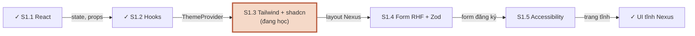

**Đọc sơ đồ:** Đọc từ S1.1 (trái trên) sang phải, vòng xuống hàng dưới và đi ngược về trái tới đích. Nhãn mũi tên = thứ mang sang session sau. *Màu: xanh ô-liu + ✓ = đã xong / đích · viền terracotta = đang học · be = sắp học.*


## Cú pháp nhanh

| Việc | Viết thế này |
|---|---|
| Bật Tailwind v4 | `@import "tailwindcss";` trong CSS + plugin `@tailwindcss/vite` |
| Khoảng cách | `p-4` (16px) · `px-3 py-1.5` · `gap-2` · `space-y-1` |
| Flex / grid | `flex items-center gap-2` · `grid gap-4 sm:grid-cols-2 lg:grid-cols-3` |
| Cột tuỳ ý | `md:grid-cols-[16rem_1fr]` |
| Responsive | `hidden md:block` (≥768 hiện) · `md:hidden` (≥768 ẩn) · `max-md:…` (<768) |
| Trạng thái | `hover:` · `focus-visible:` · `disabled:` · `aria-[current=page]:` |
| Trong suốt | `bg-black/50` · `bg-background/80` |
| Token | `bg-background text-foreground` · `bg-primary text-primary-foreground` · `border-border` · `text-muted-foreground` |
| Dark variant | `@custom-variant dark (&:is(.dark *));` · class `dark` trên `<html>` |
| Map token → utility | `@theme inline { --color-brand: var(--brand); }` → `bg-brand` |
| Gộp class | `cn('px-4', active && 'font-medium', className)` |
| Biến thể | `cva(base, { variants: { size: { sm: '…' } }, defaultVariants })` |
| Chỉ cho trình đọc màn hình | `sr-only` |
| Thêm component shadcn | `npx shadcn@latest add sheet` |

## Luật vàng

1. Mọi class phải xuất hiện nguyên văn trong code. Không ghép chuỗi class.
2. Viết cho màn nhỏ trước; prefix chỉ ghi phần thay đổi khi màn to hơn.
3. `md:` = từ 768px trở lên, không phải “chỉ trên tablet”.
4. Dùng token (`bg-background`), không dùng màu thô (`bg-white`).
5. Token đi thành cặp: nền + `-foreground`.
6. Dark mode = đổi giá trị token, không đổi tên class.
7. Chống nháy: script inline trong `<head>` đặt class trước khi vẽ.
8. Lựa chọn của user thắng hệ điều hành; “Theo hệ thống” phải nghe OS đổi.
9. shadcn là code của bạn — sửa thẳng file, thêm variant trong `cva`.
10. Ghi đè class của component bằng `className` — `cn()` lo xung đột.

## Lỗi hay gặp

| Triệu chứng | Nguyên nhân | Sửa |
|---|---|---|
| Class không có tác dụng | Ghép động, hoặc sai tên | Viết chuỗi đầy đủ; kiểm tra token trong `@theme` |
| `Cannot find module '@/…'` | Thiếu alias ở Vite hoặc TS | `resolve.alias` + `paths` ở cả 2 tsconfig |
| Chớp trắng khi tải ở dark mode | Chỉ dựa vào React đặt class | Script inline trong `<head>` |
| Một vài chỗ không đổi màu khi dark | Dùng màu thô `bg-white`, `text-black` | Đổi sang token |
| `dark:` không chạy | Thiếu `@custom-variant dark` hoặc class `dark` không nằm trên tổ tiên | Thêm variant; đặt class trên `<html>` |
| Console: *DialogContent requires a DialogTitle* | Sheet/Dialog thiếu tiêu đề | `<SheetTitle className="sr-only">` |
| Console: *Missing Description or aria-describedby* | Dialog không có mô tả | `<SheetDescription>` hoặc `aria-describedby={undefined}` |
| `className` truyền vào bị lờ | Component không dùng `cn()` để gộp | Luôn `cn(base, className)` |
| `shadcn init` lỗi mạng | Registry bị chặn | Chép source từ GitHub `shadcn-ui/ui`, sửa import `cn` |

---

# Code hoàn chỉnh — Lab S1.3

## Tạo project & chạy

```bash title="terminal"
npm create vite@latest nexus-ui -- --template react-ts
cd nexus-ui
npm install
npm install tailwindcss @tailwindcss/vite
npm install -D @types/node tw-animate-css
npm install radix-ui lucide-react class-variance-authority clsx tailwind-merge
npx shadcn@latest add button card badge avatar separator sheet dropdown-menu
npm run dev      # http://localhost:5173
npm run build
npm run lint
```

## vite.config.ts

```ts title="vite.config.ts"
import path from 'node:path'
import tailwindcss from '@tailwindcss/vite'
import react from '@vitejs/plugin-react'
import { defineConfig } from 'vite'

export default defineConfig({
  plugins: [react(), tailwindcss()],
  resolve: {
    alias: { '@': path.resolve(import.meta.dirname, './src') },
  },
})
```

## tsconfig.app.json

```json title="tsconfig.app.json"
{
  "compilerOptions": {
    "tsBuildInfoFile": "./node_modules/.tmp/tsconfig.app.tsbuildinfo",
    "target": "es2023",
    "lib": [
      "ES2023",
      "DOM"
    ],
    "module": "esnext",
    "types": [
      "vite/client"
    ],
    "allowArbitraryExtensions": true,
    "skipLibCheck": true,
    "moduleResolution": "bundler",
    "allowImportingTsExtensions": true,
    "verbatimModuleSyntax": true,
    "moduleDetection": "force",
    "noEmit": true,
    "jsx": "react-jsx",
    "noUnusedLocals": true,
    "noUnusedParameters": true,
    "erasableSyntaxOnly": true,
    "noFallthroughCasesInSwitch": true,
    "paths": {
      "@/*": [
        "./src/*"
      ]
    }
  },
  "include": [
    "src"
  ]
}
```

## index.html

```html title="index.html"
<!doctype html>
<html lang="vi">
  <head>
    <meta charset="UTF-8" />
    <meta name="viewport" content="width=device-width, initial-scale=1.0" />
    <title>Nexus</title>
    <!-- Chạy TRƯỚC khi CSS/React tải: đặt class dark ngay → không nháy trắng -->
    <script>
      (function () {
        try {
          var t = localStorage.getItem('nexus-theme');
          var dark =
            t === 'dark' ||
            ((t === null || t === 'system') &&
              window.matchMedia('(prefers-color-scheme: dark)').matches);
          document.documentElement.classList.toggle('dark', dark);
          document.documentElement.style.colorScheme = dark ? 'dark' : 'light';
        } catch (e) {}
      })();
    </script>
  </head>
  <body>
    <div id="root"></div>
    <script type="module" src="/src/main.tsx"></script>
  </body>
</html>
```

## src/index.css

```css title="src/index.css"
@import "tailwindcss";
@import "tw-animate-css";

/* dark: áp dụng khi phần tử nằm trong .dark (class trên <html>) */
@custom-variant dark (&:is(.dark *));

/* Nối biến CSS → utility của Tailwind: --color-primary sinh ra bg-primary, text-primary… */
@theme inline {
  --radius-sm: calc(var(--radius) - 4px);
  --radius-md: calc(var(--radius) - 2px);
  --radius-lg: var(--radius);
  --radius-xl: calc(var(--radius) + 4px);
  --color-background: var(--background);
  --color-foreground: var(--foreground);
  --color-card: var(--card);
  --color-card-foreground: var(--card-foreground);
  --color-popover: var(--popover);
  --color-popover-foreground: var(--popover-foreground);
  --color-primary: var(--primary);
  --color-primary-foreground: var(--primary-foreground);
  --color-secondary: var(--secondary);
  --color-secondary-foreground: var(--secondary-foreground);
  --color-muted: var(--muted);
  --color-muted-foreground: var(--muted-foreground);
  --color-accent: var(--accent);
  --color-accent-foreground: var(--accent-foreground);
  --color-destructive: var(--destructive);
  --color-border: var(--border);
  --color-input: var(--input);
  --color-ring: var(--ring);
  --color-chart-1: var(--chart-1);
  --color-chart-2: var(--chart-2);
  --color-chart-3: var(--chart-3);
  --color-chart-4: var(--chart-4);
  --color-chart-5: var(--chart-5);
  --color-sidebar: var(--sidebar);
  --color-sidebar-foreground: var(--sidebar-foreground);
  --color-sidebar-primary: var(--sidebar-primary);
  --color-sidebar-primary-foreground: var(--sidebar-primary-foreground);
  --color-sidebar-accent: var(--sidebar-accent);
  --color-sidebar-accent-foreground: var(--sidebar-accent-foreground);
  --color-sidebar-border: var(--sidebar-border);
  --color-sidebar-ring: var(--sidebar-ring);
}

/* Design tokens — chế độ sáng */
:root {
  --background: oklch(1 0 0);
  --foreground: oklch(0.145 0 0);
  --card: oklch(1 0 0);
  --card-foreground: oklch(0.145 0 0);
  --popover: oklch(1 0 0);
  --popover-foreground: oklch(0.145 0 0);
  --primary: oklch(0.47 0.09 50); /* Nexus brand */
  --primary-foreground: oklch(0.985 0 0); /* Nexus brand */
  --secondary: oklch(0.97 0 0);
  --secondary-foreground: oklch(0.205 0 0);
  --muted: oklch(0.97 0 0);
  --muted-foreground: oklch(0.556 0 0);
  --accent: oklch(0.97 0 0);
  --accent-foreground: oklch(0.205 0 0);
  --destructive: oklch(0.577 0.245 27.325);
  --border: oklch(0.922 0 0);
  --input: oklch(0.922 0 0);
  --ring: oklch(0.62 0.09 50); /* Nexus brand */
  --chart-1: oklch(0.87 0 0);
  --chart-2: oklch(0.556 0 0);
  --chart-3: oklch(0.439 0 0);
  --chart-4: oklch(0.371 0 0);
  --chart-5: oklch(0.269 0 0);
  --radius: 0.625rem;
  --sidebar: oklch(0.985 0 0);
  --sidebar-foreground: oklch(0.145 0 0);
  --sidebar-primary: oklch(0.47 0.09 50); /* Nexus brand */
  --sidebar-primary-foreground: oklch(0.985 0 0);
  --sidebar-accent: oklch(0.97 0 0);
  --sidebar-accent-foreground: oklch(0.205 0 0);
  --sidebar-border: oklch(0.922 0 0);
  --sidebar-ring: oklch(0.708 0 0);
}

/* Design tokens — chế độ tối: chỉ đổi GIÁ TRỊ, không đổi TÊN */
.dark {
  --background: oklch(0.145 0 0);
  --foreground: oklch(0.985 0 0);
  --card: oklch(0.205 0 0);
  --card-foreground: oklch(0.985 0 0);
  --popover: oklch(0.205 0 0);
  --popover-foreground: oklch(0.985 0 0);
  --primary: oklch(0.78 0.09 60); /* Nexus brand */
  --primary-foreground: oklch(0.2 0.02 50); /* Nexus brand */
  --secondary: oklch(0.269 0 0);
  --secondary-foreground: oklch(0.985 0 0);
  --muted: oklch(0.269 0 0);
  --muted-foreground: oklch(0.708 0 0);
  --accent: oklch(0.269 0 0);
  --accent-foreground: oklch(0.985 0 0);
  --destructive: oklch(0.704 0.191 22.216);
  --border: oklch(1 0 0 / 10%);
  --input: oklch(1 0 0 / 15%);
  --ring: oklch(0.6 0.08 55); /* Nexus brand */
  --chart-1: oklch(0.87 0 0);
  --chart-2: oklch(0.556 0 0);
  --chart-3: oklch(0.439 0 0);
  --chart-4: oklch(0.371 0 0);
  --chart-5: oklch(0.269 0 0);
  --sidebar: oklch(0.205 0 0);
  --sidebar-foreground: oklch(0.985 0 0);
  --sidebar-primary: oklch(0.78 0.09 60); /* Nexus brand */
  --sidebar-primary-foreground: oklch(0.2 0.02 50); /* Nexus brand */
  --sidebar-accent: oklch(0.269 0 0);
  --sidebar-accent-foreground: oklch(0.985 0 0);
  --sidebar-border: oklch(1 0 0 / 10%);
  --sidebar-ring: oklch(0.556 0 0);
}

@layer base {
  * {
    @apply border-border outline-ring/50;
  }
  body {
    @apply bg-background text-foreground;
  }
}
```

## src/main.tsx

```tsx title="src/main.tsx"
import { StrictMode } from 'react'
import { createRoot } from 'react-dom/client'
import './index.css'
import App from './App.tsx'
import { ThemeProvider } from '@/components/theme/theme-provider'

createRoot(document.getElementById('root')!).render(
  <StrictMode>
    <ThemeProvider>
      <App />
    </ThemeProvider>
  </StrictMode>,
)
```

## src/lib/utils.ts

```ts title="src/lib/utils.ts"
import { clsx, type ClassValue } from 'clsx'
import { twMerge } from 'tailwind-merge'

/** Gộp class: clsx xử lý điều kiện, twMerge xử lý xung đột (px-2 vs px-4 → giữ cái sau) */
export function cn(...inputs: ClassValue[]) {
  return twMerge(clsx(inputs))
}
```

## src/components/theme

```ts title="src/components/theme/theme-context.ts"
import { createContext } from 'react'

export type Theme = 'light' | 'dark' | 'system'
export type ResolvedTheme = 'light' | 'dark'

export type ThemeContextValue = {
  theme: Theme // lựa chọn của user
  resolvedTheme: ResolvedTheme // thứ thật sự đang hiển thị
  setTheme: (theme: Theme) => void
}

export const STORAGE_KEY = 'nexus-theme' // phải khớp với script trong index.html

export const ThemeContext = createContext<ThemeContextValue | null>(null)
```

```tsx title="src/components/theme/theme-provider.tsx"
import { useCallback, useEffect, useMemo, useState, type ReactNode } from 'react'
import { STORAGE_KEY, ThemeContext, type Theme } from './theme-context'

const DARK_QUERY = '(prefers-color-scheme: dark)'

function readStoredTheme(): Theme {
  try {
    const v = localStorage.getItem(STORAGE_KEY)
    return v === 'light' || v === 'dark' || v === 'system' ? v : 'system'
  } catch {
    return 'system' // localStorage có thể bị chặn (chế độ riêng tư…)
  }
}

export function ThemeProvider({ children }: { children: ReactNode }) {
  // Lazy init: chỉ đọc localStorage một lần lúc mount
  const [theme, setThemeState] = useState<Theme>(readStoredTheme)
  const [systemDark, setSystemDark] = useState(() => window.matchMedia(DARK_QUERY).matches)

  // (1) Nghe hệ điều hành đổi sáng/tối = hệ thống ngoài → effect + cleanup
  useEffect(() => {
    const mq = window.matchMedia(DARK_QUERY)
    const onChange = (e: MediaQueryListEvent) => setSystemDark(e.matches)
    mq.addEventListener('change', onChange)
    return () => mq.removeEventListener('change', onChange)
  }, [])

  // Derived: tính khi render, không phải state
  const resolvedTheme = theme === 'system' ? (systemDark ? 'dark' : 'light') : theme

  // (2) Đồng bộ class trên <html> = DOM ngoài cây React → effect
  useEffect(() => {
    const root = document.documentElement
    root.classList.toggle('dark', resolvedTheme === 'dark')
    root.style.colorScheme = resolvedTheme
  }, [resolvedTheme])

  // (3) Lưu lựa chọn: xảy ra VÌ user chọn → làm trong hàm set, không phải effect
  const setTheme = useCallback((next: Theme) => {
    setThemeState(next)
    try {
      localStorage.setItem(STORAGE_KEY, next)
    } catch {
      /* không lưu được thì thôi, UI vẫn đổi */
    }
  }, [])

  // Giữ object value ổn định → component đọc context không render thừa
  const value = useMemo(
    () => ({ theme, resolvedTheme, setTheme }),
    [theme, resolvedTheme, setTheme],
  )

  return <ThemeContext value={value}>{children}</ThemeContext>
}
```

```ts title="src/components/theme/use-theme.ts"
import { useContext } from 'react'
import { ThemeContext } from './theme-context'

export function useTheme() {
  const ctx = useContext(ThemeContext)
  if (!ctx) throw new Error('useTheme phải được dùng bên trong <ThemeProvider>')
  return ctx
}
```

```tsx title="src/components/theme/mode-toggle.tsx"
import { Monitor, Moon, Sun } from 'lucide-react'
import { Button } from '@/components/ui/button'
import {
  DropdownMenu,
  DropdownMenuContent,
  DropdownMenuRadioGroup,
  DropdownMenuRadioItem,
  DropdownMenuTrigger,
} from '@/components/ui/dropdown-menu'
import type { Theme } from './theme-context'
import { useTheme } from './use-theme'

const OPTIONS: { value: Theme; label: string; icon: typeof Sun }[] = [
  { value: 'light', label: 'Sáng', icon: Sun },
  { value: 'dark', label: 'Tối', icon: Moon },
  { value: 'system', label: 'Theo hệ thống', icon: Monitor },
]

export function ModeToggle() {
  const { theme, resolvedTheme, setTheme } = useTheme()
  const Icon = resolvedTheme === 'dark' ? Moon : Sun

  return (
    <DropdownMenu>
      <DropdownMenuTrigger asChild>
        <Button variant="ghost" size="icon" aria-label="Đổi giao diện sáng/tối">
          <Icon />
        </Button>
      </DropdownMenuTrigger>
      <DropdownMenuContent align="end">
        <DropdownMenuRadioGroup value={theme} onValueChange={(v) => setTheme(v as Theme)}>
          {OPTIONS.map(({ value, label, icon: ItemIcon }) => (
            <DropdownMenuRadioItem key={value} value={value}>
              <ItemIcon className="text-muted-foreground" />
              {label}
            </DropdownMenuRadioItem>
          ))}
        </DropdownMenuRadioGroup>
      </DropdownMenuContent>
    </DropdownMenu>
  )
}
```

## src/data/nav.ts

```ts title="src/data/nav.ts"
import { FileText, LayoutDashboard, MessageSquare, Settings, Users, type LucideIcon } from 'lucide-react'

export type Workspace = { id: string; name: string; initials: string }
export type NavItem = { id: string; label: string; icon: LucideIcon }

export const workspaces: Workspace[] = [
  { id: 'acme', name: 'Acme Coffee', initials: 'AC' },
  { id: 'phin', name: 'Phin Roasters', initials: 'PR' },
  { id: 'lotus', name: 'Lotus Tea House', initials: 'LT' },
]

export const navItems: NavItem[] = [
  { id: 'chat', label: 'Chat', icon: MessageSquare },
  { id: 'dashboard', label: 'Dashboard', icon: LayoutDashboard },
  { id: 'customers', label: 'Khách hàng', icon: Users },
  { id: 'docs', label: 'Tài liệu', icon: FileText },
  { id: 'settings', label: 'Cài đặt', icon: Settings },
]
```

## src/components/layout

```tsx title="src/components/layout/app-shell.tsx"
import { useState } from 'react'
import { Card, CardContent, CardDescription, CardHeader, CardTitle } from '@/components/ui/card'
import { Button } from '@/components/ui/button'
import { navItems, workspaces } from '@/data/nav'
import { MobileNav } from './mobile-nav'
import { SidebarContent } from './sidebar-content'
import { SiteHeader } from './site-header'

const STATS = [
  { label: 'Khách hàng', value: '1.284' },
  { label: 'Hội thoại tuần này', value: '342' },
  { label: 'Tool call', value: '2.910' },
]

export function AppShell() {
  const [workspaceId, setWorkspaceId] = useState(workspaces[0].id)
  const [activeNav, setActiveNav] = useState(navItems[0].id)

  // Derived
  const workspace = workspaces.find((w) => w.id === workspaceId) ?? workspaces[0]
  const title = navItems.find((n) => n.id === activeNav)?.label ?? ''

  const sidebarProps = {
    workspaceId,
    activeNav,
    onSelectWorkspace: setWorkspaceId,
    onNavigate: setActiveNav,
  }

  return (
    // < 768px: 1 cột. ≥ 768px (md): 2 cột, sidebar rộng 16rem
    <div className="min-h-svh md:grid md:grid-cols-[16rem_1fr]">
      <aside className="sticky top-0 hidden h-svh border-r border-sidebar-border bg-sidebar text-sidebar-foreground md:block">
        <SidebarContent {...sidebarProps} />
      </aside>

      <div className="flex min-w-0 flex-col">
        <SiteHeader
          title={title}
          workspaceName={workspace.name}
          mobileNav={<MobileNav {...sidebarProps} />}
        />

        <main className="flex-1 space-y-6 p-4 md:p-6">
          <section className="grid gap-4 sm:grid-cols-2 lg:grid-cols-3" aria-label="Số liệu nhanh">
            {STATS.map((s) => (
              <Card key={s.label} className="gap-2 py-4">
                <CardHeader className="px-4">
                  <CardDescription>{s.label}</CardDescription>
                  <CardTitle className="text-2xl tabular-nums">{s.value}</CardTitle>
                </CardHeader>
              </Card>
            ))}
          </section>

          <Card>
            <CardHeader>
              <CardTitle>{title}</CardTitle>
              <CardDescription>
                Nội dung trang “{title}” sẽ được dựng ở S1.5. Đây là khung layout.
              </CardDescription>
            </CardHeader>
            <CardContent className="flex flex-wrap gap-2">
              <Button>Hành động chính</Button>
              <Button variant="outline">Phụ</Button>
              <Button variant="ghost">Ghost</Button>
              <Button variant="destructive">Xoá</Button>
            </CardContent>
          </Card>
        </main>
      </div>
    </div>
  )
}
```

```tsx title="src/components/layout/sidebar-content.tsx"
import { Separator } from '@/components/ui/separator'
import { cn } from '@/lib/utils'
import { navItems, workspaces } from '@/data/nav'

type Props = {
  workspaceId: string
  activeNav: string
  onSelectWorkspace: (id: string) => void
  onNavigate: (id: string) => void
}

/** Nội dung sidebar — dùng chung cho sidebar desktop và Sheet trên mobile */
export function SidebarContent({ workspaceId, activeNav, onSelectWorkspace, onNavigate }: Props) {
  return (
    <div className="flex h-full flex-col gap-4 p-4">
      <p className="px-2 text-lg font-semibold tracking-tight">Nexus</p>

      <nav aria-label="Workspace">
        <p className="px-2 pb-1 text-xs font-medium text-muted-foreground">Workspace</p>
        <ul className="space-y-1">
          {workspaces.map((ws) => {
            const active = ws.id === workspaceId
            return (
              <li key={ws.id}>
                <button
                  type="button"
                  onClick={() => onSelectWorkspace(ws.id)}
                  aria-current={active ? 'true' : undefined}
                  className={cn(
                    'flex w-full items-center gap-2 rounded-md px-2 py-1.5 text-left text-sm',
                    'hover:bg-sidebar-accent hover:text-sidebar-accent-foreground',
                    active && 'bg-sidebar-accent font-medium text-sidebar-accent-foreground',
                  )}
                >
                  <span className="grid size-6 shrink-0 place-items-center rounded bg-sidebar-primary text-[10px] font-semibold text-sidebar-primary-foreground">
                    {ws.initials}
                  </span>
                  <span className="truncate">{ws.name}</span>
                </button>
              </li>
            )
          })}
        </ul>
      </nav>

      <Separator />

      <nav aria-label="Chính">
        <ul className="space-y-1">
          {navItems.map(({ id, label, icon: Icon }) => {
            const active = id === activeNav
            return (
              <li key={id}>
                <button
                  type="button"
                  onClick={() => onNavigate(id)}
                  aria-current={active ? 'page' : undefined}
                  className={cn(
                    'flex w-full items-center gap-2 rounded-md px-2 py-1.5 text-sm text-muted-foreground',
                    'hover:bg-sidebar-accent hover:text-sidebar-accent-foreground',
                    active && 'bg-sidebar-accent font-medium text-sidebar-accent-foreground',
                  )}
                >
                  <Icon className="size-4" />
                  {label}
                </button>
              </li>
            )
          })}
        </ul>
      </nav>

      <p className="mt-auto px-2 text-xs text-muted-foreground">Bản giao diện tĩnh · M1</p>
    </div>
  )
}
```

```tsx title="src/components/layout/mobile-nav.tsx"
import { Menu } from 'lucide-react'
import { useState, type ComponentProps } from 'react'
import { Button } from '@/components/ui/button'
import { Sheet, SheetContent, SheetTitle, SheetTrigger } from '@/components/ui/sheet'
import { SidebarContent } from './sidebar-content'

type Props = ComponentProps<typeof SidebarContent>

/** Chỉ hiện dưới 768px (md:hidden). Chọn mục xong thì tự đóng. */
export function MobileNav({ onNavigate, onSelectWorkspace, ...rest }: Props) {
  const [open, setOpen] = useState(false)

  return (
    <Sheet open={open} onOpenChange={setOpen}>
      <SheetTrigger asChild>
        <Button variant="ghost" size="icon" className="md:hidden" aria-label="Mở menu">
          <Menu />
        </Button>
      </SheetTrigger>
      <SheetContent side="left" className="w-72 bg-sidebar p-0" aria-describedby={undefined}>
        <SheetTitle className="sr-only">Menu điều hướng</SheetTitle>
        <SidebarContent
          {...rest}
          onNavigate={(id) => {
            onNavigate(id)
            setOpen(false)
          }}
          onSelectWorkspace={(id) => {
            onSelectWorkspace(id)
            setOpen(false)
          }}
        />
      </SheetContent>
    </Sheet>
  )
}
```

```tsx title="src/components/layout/site-header.tsx"
import type { ReactNode } from 'react'
import { Avatar, AvatarFallback } from '@/components/ui/avatar'
import { Badge } from '@/components/ui/badge'
import { ModeToggle } from '@/components/theme/mode-toggle'

type Props = { title: string; workspaceName: string; mobileNav: ReactNode }

export function SiteHeader({ title, workspaceName, mobileNav }: Props) {
  return (
    <header className="sticky top-0 z-10 flex h-14 items-center gap-2 border-b bg-background/80 px-4 backdrop-blur md:px-6">
      {mobileNav}
      <div className="min-w-0 flex-1">
        <p className="truncate text-xs text-muted-foreground">{workspaceName}</p>
        <h1 className="truncate text-sm font-semibold md:text-base">{title}</h1>
      </div>
      <Badge variant="secondary" className="hidden sm:inline-flex">Beta</Badge>
      <ModeToggle />
      <Avatar className="size-8">
        <AvatarFallback>NA</AvatarFallback>
      </Avatar>
    </header>
  )
}
```

## src/components/ui/button.tsx (shadcn, không sửa)

```tsx title="src/components/ui/button.tsx"
import * as React from "react"
import { cva, type VariantProps } from "class-variance-authority"
import { cn } from "@/lib/utils"
import { Slot } from "radix-ui"

const buttonVariants = cva(
  "inline-flex shrink-0 items-center justify-center gap-2 rounded-md text-sm font-medium whitespace-nowrap transition-all outline-none focus-visible:border-ring focus-visible:ring-[3px] focus-visible:ring-ring/50 disabled:pointer-events-none disabled:opacity-50 aria-invalid:border-destructive aria-invalid:ring-destructive/20 dark:aria-invalid:ring-destructive/40 [&_svg]:pointer-events-none [&_svg]:shrink-0 [&_svg:not([class*='size-'])]:size-4",
  {
    variants: {
      variant: {
        default: "bg-primary text-primary-foreground hover:bg-primary/90",
        destructive:
          "bg-destructive text-white hover:bg-destructive/90 focus-visible:ring-destructive/20 dark:bg-destructive/60 dark:focus-visible:ring-destructive/40",
        outline:
          "border bg-background shadow-xs hover:bg-accent hover:text-accent-foreground dark:border-input dark:bg-input/30 dark:hover:bg-input/50",
        secondary:
          "bg-secondary text-secondary-foreground hover:bg-secondary/80",
        ghost:
          "hover:bg-accent hover:text-accent-foreground dark:hover:bg-accent/50",
        link: "text-primary underline-offset-4 hover:underline",
      },
      size: {
        default: "h-9 px-4 py-2 has-[>svg]:px-3",
        xs: "h-6 gap-1 rounded-md px-2 text-xs has-[>svg]:px-1.5 [&_svg:not([class*='size-'])]:size-3",
        sm: "h-8 gap-1.5 rounded-md px-3 has-[>svg]:px-2.5",
        lg: "h-10 rounded-md px-6 has-[>svg]:px-4",
        icon: "size-9",
        "icon-xs": "size-6 rounded-md [&_svg:not([class*='size-'])]:size-3",
        "icon-sm": "size-8",
        "icon-lg": "size-10",
      },
    },
    defaultVariants: {
      variant: "default",
      size: "default",
    },
  }
)

function Button({
  className,
  variant = "default",
  size = "default",
  asChild = false,
  ...props
}: React.ComponentProps<"button"> &
  VariantProps<typeof buttonVariants> & {
    asChild?: boolean
  }) {
  const Comp = asChild ? Slot.Root : "button"

  return (
    <Comp
      data-slot="button"
      data-variant={variant}
      data-size={size}
      className={cn(buttonVariants({ variant, size, className }))}
      {...props}
    />
  )
}

export { Button, buttonVariants }
```
