# S1.4 — Form với React Hook Form + Zod

> **Module 1 — React & UI · Session 4/5.** Một schema dùng cho cả client lẫn server.
>
> **Output:** form đăng ký và form tạo workspace, dùng schema từ `packages/shared`.
> **AC:** schema import từ `packages/shared`, không định nghĩa lại · lỗi hiện dưới đúng field, nút submit khoá khi đang gửi.

## Bắt đầu: session này làm gì

Form là chỗ dữ liệu **từ ngoài đi vào** hệ thống. Luật kiểm tra (“email phải hợp lệ”, “slug chỉ gồm chữ thường”) phải chạy ở **hai nơi**: ở client để báo lỗi ngay, ở server vì client có thể bị qua mặt. Viết luật hai lần thì sớm muộn hai bản sẽ lệch nhau.

Hình dung quán cà phê có **một cuốn sổ công thức duy nhất** treo ở quầy. Thu ngân nhìn sổ để nhắc khách “size L không có đá xay” (client). Barista cũng nhìn đúng cuốn sổ đó trước khi pha (server). Không ai chép tay công thức ra giấy riêng. `packages/shared` chính là cuốn sổ; Zod là ngôn ngữ viết công thức; React Hook Form là **thu ngân nhanh tay** — ghi order mà không bắt cả quầy dừng lại mỗi khi khách nói một chữ.

**Sơ đồ (Luồng dữ liệu) — Một lần gửi form đi qua những đâu?**

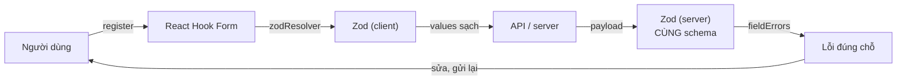

**Đọc sơ đồ:** Đọc từ ‘Người dùng’ (trái trên) theo chiều kim đồng hồ: RHF giữ giá trị, Zod kiểm tra ở client, dữ liệu sạch gửi lên API, CÙNG schema kiểm tra lại ở server, lỗi quay về đúng ô, người dùng sửa và gửi lại. *Màu: viền terracotta dày = phần của bài này · be = phần còn lại của vòng.*


| Bài | Học gì | Mảnh nào của vòng |
|---|---|---|
| 1 | Một schema, hai nơi dùng (`packages/shared`, Zod 4) | Zod client = Zod server |
| 2 | `useForm`, `register`, `Controller`, `zodResolver` | Người dùng → RHF → Zod |
| 3 | Lỗi hiện khi nào, ở đâu | RHF → lỗi đúng chỗ |
| 4 | Submit, nút khoá, lỗi từ server | API → server → lỗi đúng chỗ |
| Lab | Form đăng ký + tạo workspace | Cả vòng |

### Chuẩn bị: đưa `nexus-ui` vào monorepo

AC yêu cầu schema nằm ở `packages/shared` — tức là phải có monorepo (bạn đã dựng khung ở S0.4). `nexus-ui` của S1.3 chuyển vào thành `apps/ui`. Ở M9, các component trong đó được chuyển sang `apps/web` (Next.js).

```text title="cấu trúc monorepo"
nexus/
├── package.json            scripts chạy cho cả repo
├── pnpm-workspace.yaml     apps/* và packages/*
├── tsconfig.base.json      cấu hình TS dùng chung
├── apps/
│   └── ui/                 ← nexus-ui của S1.3 (tên package: @nexus/ui)
└── packages/
    └── shared/             ← @nexus/shared: schema Zod
```

```yaml title="nexus/pnpm-workspace.yaml"
packages:
  - apps/*
  - packages/*
```

```json title="nexus/package.json"
{
  "name": "nexus",
  "private": true,
  "type": "module",
  "scripts": {
    "typecheck": "pnpm -r run typecheck",
    "lint": "pnpm -r run lint",
    "build": "pnpm -r run build",
    "dev:ui": "pnpm --filter @nexus/ui dev",
    "check:server": "pnpm --filter @nexus/shared check:server"
  }
}
```

`packages/shared` là **gói nội bộ không cần build**: trường `exports` trỏ thẳng vào file `.ts`. Vite (phía UI) và Node 22 (phía script) đều đọc được TypeScript trực tiếp.

```json title="nexus/packages/shared/package.json"
{
  "name": "@nexus/shared",
  "version": "0.0.0",
  "private": true,
  "type": "module",
  "exports": {
    ".": "./src/index.ts"
  },
  "scripts": {
    "typecheck": "tsc --noEmit",
    "check:server": "node scripts/server-check.ts"
  },
  "dependencies": {
    "zod": "^4.6.5"
  },
  "devDependencies": {
    "@types/node": "^22.20.4",
    "typescript": "~6.0.3"
  }
}
```

Cài đặt:

```bash title="terminal"
cd nexus/packages/shared && pnpm add zod@^4 && pnpm add -D typescript@~6.0.3 @types/node@^22
cd ../../apps/ui
pnpm add @nexus/shared@workspace:* react-hook-form @hookform/resolvers zod@^4
```

`workspace:*` bảo pnpm **nối symlink** (lối tắt thư mục) tới `packages/shared` trong repo thay vì tải từ npm. Phiên bản thật lúc mình dựng: pnpm **10.28.0**, Zod **4.6.5**, React Hook Form **7.89.0**, @hookform/resolvers **5.9.1**.

## Bài 1 — Một schema, hai nơi dùng

**Nó là gì (1 câu):** schema là **cuốn sổ công thức treo ở quầy** — một bản duy nhất, thu ngân và barista cùng đọc; sửa công thức ở đó là cả quán theo.

**Sơ đồ tổng** — bài này nói về hai ô Zod: client và server là **cùng một thứ**:

**Sơ đồ (Luồng dữ liệu) — Một lần gửi form đi qua những đâu?**

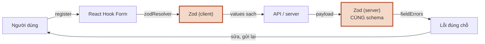

**Đọc sơ đồ:** Vòng đời một lần submit; phần viền terracotta là đoạn bài này đào sâu — Bài 1: một schema, chạy ở cả client và server. *Màu: viền terracotta dày = phần của bài này · be = phần còn lại của vòng.*


### 1.1 Schema đặt ở đâu

**Ẩn dụ:** sổ công thức treo ở chỗ ai cũng với tới được — không nằm trong ngăn kéo riêng của thu ngân.

**Sơ đồ:**

**Sơ đồ (Bản đồ dịch vụ) — Schema sống ở đâu, và ai import nó?**

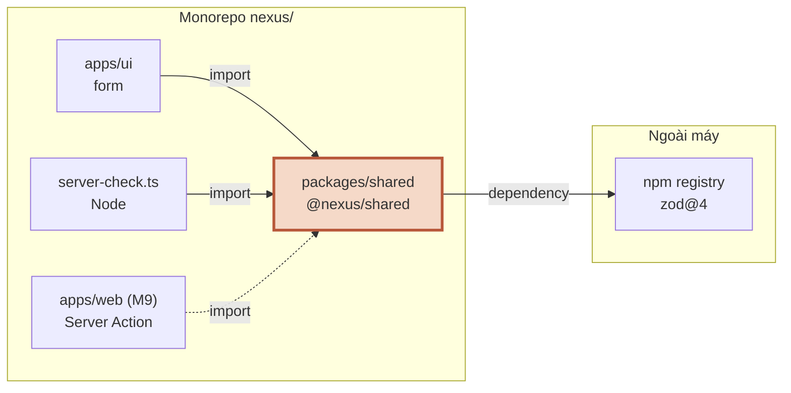

**Đọc sơ đồ:** Mọi mũi tên ‘import’ đều trỏ vào MỘT chỗ: packages/shared. Form trên trình duyệt, script Node, và server Next.js ở M9 đều dùng cùng file. Chỉ zod đến từ ngoài máy. *Màu: viền terracotta = nguồn sự thật duy nhất · mũi tên nét đứt = sẽ có ở M9 · vùng nét đứt = trong / ngoài máy.*


**Chi tiết kỹ thuật** — schema đăng ký (bản đã sửa, xem 1.2):

```ts title="nexus/packages/shared/src/schemas/auth.ts"
import { z } from 'zod'

/** Đăng ký tài khoản — MỘT nguồn sự thật cho form (client) và API (server) */
export const registerSchema = z
  .object({
    name: z
      .string()
      .trim()
      .min(2, 'Tên cần ít nhất 2 ký tự')
      .max(60, 'Tên tối đa 60 ký tự'),
    // trim/lowercase TRƯỚC, kiểm tra định dạng SAU (thứ tự trong chuỗi quan trọng!)
    email: z.string().trim().toLowerCase().pipe(z.email('Email không hợp lệ')),
    password: z
      .string()
      .min(8, 'Mật khẩu cần ít nhất 8 ký tự')
      .regex(/[A-Za-z]/, 'Mật khẩu cần ít nhất 1 chữ cái')
      .regex(/\d/, 'Mật khẩu cần ít nhất 1 chữ số'),
    confirmPassword: z.string().min(1, 'Nhập lại mật khẩu'),
    acceptTerms: z.boolean().refine((v) => v, 'Bạn cần đồng ý điều khoản sử dụng'),
  })
  // Luật liên quan 2 field → refine ở cấp object, gắn lỗi vào đúng field bằng path
  .refine((d) => d.password === d.confirmPassword, {
    message: 'Mật khẩu nhập lại không khớp',
    path: ['confirmPassword'],
  })

/** Kiểu của dữ liệu NGƯỜI DÙNG GÕ (trước trim/lowercase) */
export type RegisterFormValues = z.input<typeof registerSchema>
/** Kiểu của dữ liệu ĐÃ KIỂM TRA (sau trim/lowercase) — thứ server nhận */
export type RegisterInput = z.output<typeof registerSchema>
```

- **Zod 4** viết email là `z.email()` (hàm cấp cao), không còn `z.string().email()` như Zod 3.
- **`.refine` ở cấp object** cho luật dính hai ô (mật khẩu = nhập lại). `path: ['confirmPassword']` quyết định lỗi **hiện dưới ô nào** — đây là mấu chốt của AC “lỗi dưới đúng field”.
- **Hai kiểu từ một schema:** `z.input` (thứ người dùng gõ, còn khoảng trắng) cho giá trị form; `z.output` (đã trim, lowercase) cho `onSubmit` và server. Không khai báo kiểu tay nào — S0.2 đã dạy: kiểu **suy ra** từ schema.

Schema workspace và hai tiện ích dùng chung:

```ts title="nexus/packages/shared/src/schemas/workspace.ts"
import { z } from 'zod'

export const WORKSPACE_PLANS = ['free', 'team'] as const

export const createWorkspaceSchema = z.object({
  name: z
    .string()
    .trim()
    .min(2, 'Tên workspace cần ít nhất 2 ký tự')
    .max(50, 'Tên workspace tối đa 50 ký tự'),
  slug: z
    .string()
    .trim()
    .min(3, 'Đường dẫn cần ít nhất 3 ký tự')
    .max(32, 'Đường dẫn tối đa 32 ký tự')
    .regex(/^[a-z0-9]+(?:-[a-z0-9]+)*$/, 'Chỉ dùng chữ thường không dấu, số và dấu gạch ngang'),
  plan: z.enum(WORKSPACE_PLANS, 'Chọn một gói'),
  description: z.string().trim().max(200, 'Mô tả tối đa 200 ký tự'),
})

export type CreateWorkspaceFormValues = z.input<typeof createWorkspaceSchema>
export type CreateWorkspaceInput = z.output<typeof createWorkspaceSchema>
```

```ts title="nexus/packages/shared/src/field-errors.ts"
import { z } from 'zod'

/** Lỗi theo field mà server trả về: { email: 'Email này đã có tài khoản' } */
export type FieldErrorMap<T> = Partial<Record<keyof T & string, string>>

/** ZodError → mỗi field một câu (câu đầu tiên), để client gắn vào đúng ô */
export function toFieldErrors<T>(error: z.ZodError<T>): FieldErrorMap<T> {
  const out: Record<string, string> = {}
  for (const [field, messages] of Object.entries(z.flattenError(error).fieldErrors)) {
    const first = (messages as string[] | undefined)?.[0]
    if (first) out[field] = first
  }
  return out as FieldErrorMap<T>
}
```

```ts title="nexus/packages/shared/src/index.ts"
export * from './schemas/auth.ts'
export * from './schemas/workspace.ts'
export * from './slugify.ts'
export * from './field-errors.ts'
```

### 1.2 Thứ tự các bước trong schema

**Ẩn dụ:** công thức ghi “rửa ly **rồi** kiểm tra ly có sạch không”. Đảo thứ tự thì ly sắp được rửa vẫn bị báo bẩn.

**Sơ đồ:** kịch bản thứ hai là lỗi mình gặp thật khi soạn bài.

**Sơ đồ (Luồng dữ liệu) — Email người dùng gõ biến đổi thế nào qua schema?**

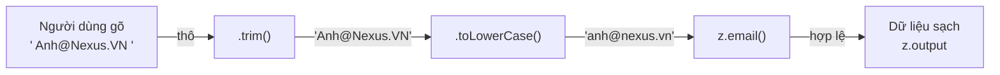

**Đọc sơ đồ:** Đọc từ trái: chuỗi thô đi qua trim, lowercase, rồi mới kiểm tra định dạng email. Thứ tự các bước trong schema chính là thứ tự chạy. *Màu: đỏ gạch + ✗ + viền đứt = bị chặn/sai · vàng mù tạt + ? + viền chấm = cần xem lại · xanh ô-liu + ✓ = chạy đúng. Nhãn trên mũi tên = giá trị tại bước đó.*


**Chi tiết kỹ thuật:** bản đầu mình viết `email: z.email('Email không hợp lệ').trim().toLowerCase()`. Chạy thử phía server với email có khoảng trắng hai đầu — kết quả thật:

```console title="output"
$ node scripts/server-check.ts        # bản schema đầu tiên (sai thứ tự)
register (dữ liệu tốt) → [ZodError: [
  {
    "origin": "string",
    "code": "invalid_format",
    "format": "email",
    "path": [ "email" ],
    "message": "Email không hợp lệ"
  }
]]
```

Kiểm tra định dạng chạy **trước** khi trim, nên `' Anh@Nexus.VN '` bị từ chối. Sửa: làm sạch trước, rồi `.pipe()` (nối sang một schema khác) để kiểm tra — `z.string().trim().toLowerCase().pipe(z.email(…))`.

Script dưới đây chạy bằng Node — không React, không trình duyệt — để chứng minh schema dùng được ở phía server:

```ts title="nexus/packages/shared/scripts/server-check.ts"
// Chạy bằng Node (không có React, không có trình duyệt) để chứng minh:
// cùng schema dùng được ở phía server.
import { createWorkspaceSchema, registerSchema, slugify, toFieldErrors } from '../src/index.ts'

const bad = registerSchema.safeParse({
  name: 'A',
  email: 'khong-phai-email',
  password: 'abc',
  confirmPassword: 'abcd',
  acceptTerms: false,
})
console.log('register (dữ liệu xấu) →', bad.success ? 'OK' : toFieldErrors(bad.error))

const good = registerSchema.safeParse({
  name: '  Ngọc Anh  ',
  email: ' Anh@Nexus.VN ',
  password: 'caphe2026',
  confirmPassword: 'caphe2026',
  acceptTerms: true,
})
console.log('register (dữ liệu tốt) →', good.success ? good.data : good.error)

console.log('slugify →', slugify('Cà Phê Phin Đà Lạt'))
const ws = createWorkspaceSchema.safeParse({ name: 'Acme', slug: 'Acme Coffee', plan: 'vip', description: '' })
console.log('workspace (slug & plan sai) →', ws.success ? 'OK' : toFieldErrors(ws.error))
```

Kết quả thật sau khi sửa:

```console title="output"
$ pnpm check:server
> @nexus/shared@0.0.0 check:server /home/claude/nexus/packages/shared
> node scripts/server-check.ts

register (dữ liệu xấu) → {
  name: 'Tên cần ít nhất 2 ký tự',
  email: 'Email không hợp lệ',
  password: 'Mật khẩu cần ít nhất 8 ký tự',
  acceptTerms: 'Bạn cần đồng ý điều khoản sử dụng',
  confirmPassword: 'Mật khẩu nhập lại không khớp'
}
register (dữ liệu tốt) → {
  name: 'Ngọc Anh',
  email: 'anh@nexus.vn',
  password: 'caphe2026',
  confirmPassword: 'caphe2026',
  acceptTerms: true
}
slugify → ca-phe-phin-da-lat
workspace (slug & plan sai) → {
  slug: 'Chỉ dùng chữ thường không dấu, số và dấu gạch ngang',
  plan: 'Chọn một gói'
}
```

Node 22 chạy thẳng file `.ts` bằng cách tự bỏ phần khai báo kiểu (type stripping), với điều kiện import tương đối phải ghi đuôi `.ts`. Đó là lý do `index.ts` viết `from './schemas/auth.ts'`.

### Nhìn lại bức tranh lớn

**Sơ đồ (Luồng dữ liệu) — Một lần gửi form đi qua những đâu?**


**Đọc sơ đồ:** Cùng vòng như đầu bài; phần viền terracotta là thứ bạn vừa học — Bài 1: một schema, chạy ở cả client và server. *Màu: viền terracotta dày = phần của bài này · be = phần còn lại của vòng.*


Bạn vừa có **cuốn sổ công thức**: một schema, hai kiểu dữ liệu suy ra, chạy được cả ở trình duyệt lẫn Node. Giờ cần một thu ngân biết đọc sổ và ghi order thật nhanh — React Hook Form. Bài 2.

### Tự vẽ lại

1. Kể ba nơi import `@nexus/shared` (hôm nay và ở M9).
2. `z.input` và `z.output` của `registerSchema` khác nhau ở field nào?
3. Vì sao `z.email().trim()` từ chối `' anh@nexus.vn '`, và sửa bằng gì?

## Bài 2 — useForm, register, Controller

**Nó là gì (1 câu):** React Hook Form là **thu ngân ghi order vào sổ tay riêng** — khách nói từng chữ thì thu ngân ghi thầm, không bắt cả bếp dừng lại; chỉ khi có chuyện cần báo (lỗi, gửi đơn) mới lên tiếng.

**Sơ đồ tổng** — bài này nằm ở đoạn *Người dùng → RHF → Zod*:

**Sơ đồ (Luồng dữ liệu) — Một lần gửi form đi qua những đâu?**

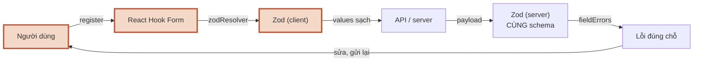

**Đọc sơ đồ:** Vòng đời một lần submit; phần viền terracotta là đoạn bài này đào sâu — Bài 2: useForm + register + zodResolver. *Màu: viền terracotta dày = phần của bài này · be = phần còn lại của vòng.*


### 2.1 Uncontrolled: vì sao RHF nhanh

**Ẩn dụ:** ở S1.1, controlled input giống thu ngân **đọc to từng chữ khách nói cho cả quầy nghe** (render mỗi phím). RHF thì **ghi thầm**, chỉ đọc to khi lỗi thay đổi.

**Sơ đồ:**

**Sơ đồ (Trình tự) — Gõ một phím trong form RHF — ai làm gì?**

```mermaid
sequenceDiagram
    participant U as Người dùng
    participant I as &lt;input&gt;
    participant H as React Hook Form
    participant C as RegisterForm()
    U->>I: 1. gõ phím
    I->>H: 2. onChange → đọc value
    H->>H: 3. lưu, validate nếu cần
    H->>C: 4. lỗi đổi → render
    C->>I: 5. FieldError dưới ô
    Note over I: ? controlled (S1.1): render mỗi phím
```

**Đọc sơ đồ:** Bốn cột, đọc ①→⑤. RHF đọc giá trị thẳng từ ô input qua ref, nên phần lớn phím gõ KHÔNG làm component render lại — khác với controlled input ở S1.1. *Màu: đỏ gạch + ✗ + viền đứt = bị chặn/sai · vàng mù tạt + ? + viền chấm = cần xem lại · xanh ô-liu + ✓ = chạy đúng.*


**Chi tiết kỹ thuật:**

```tsx title="Khung tối thiểu"
import { zodResolver } from '@hookform/resolvers/zod'
import { useForm } from 'react-hook-form'
import { registerSchema, type RegisterFormValues, type RegisterInput } from '@nexus/shared'

const { register, handleSubmit, formState: { errors, isSubmitting } } =
  useForm<RegisterFormValues, unknown, RegisterInput>({
    resolver: zodResolver(registerSchema), // schema làm trọng tài
    mode: 'onTouched',
    defaultValues: { name: '', email: '', password: '', confirmPassword: '', acceptTerms: false },
  })

<input {...register('email')} />  // trả về { name, onChange, onBlur, ref }
```

- **`register('email')`** trả về 4 thứ trải thẳng vào ô: `name`, `onChange`, `onBlur`, `ref`. RHF đọc giá trị qua `ref` — đây là **uncontrolled input** (ô tự giữ giá trị, React không giữ) mà S1.1 bài 4 nhắc tới.
- **Ba tham số kiểu** `useForm<TInput, TContext, TOutput>`: giá trị trong ô là `z.input`, còn `handleSubmit` đưa cho bạn `z.output` (đã trim). Resolver v5 tự suy được, nhưng ghi rõ giúp đọc code dễ hơn.
- **`defaultValues` đủ mọi field.** Thiếu thì ô bắt đầu là `undefined` — React cảnh báo chuyển từ uncontrolled sang controlled, và nút “reset” không biết reset về đâu.
- **`formState` là Proxy** (đối tượng theo dõi ai đọc thuộc tính nào): RHF chỉ render lại khi thứ bạn **đọc** ra thay đổi. Đọc `errors` và `isSubmitting` → chỉ render khi hai thứ đó đổi.
- **Cần giá trị để hiển thị** (xem trước đường dẫn, đếm ký tự) → `useWatch({ control, name: 'slug' })`. Chỉ component gọi `useWatch` render lại khi ô đó đổi.

### 2.2 Ô nào dùng register, ô nào cần Controller

**Ẩn dụ:** order viết tay thì thu ngân chép thẳng (`register`). Order qua **máy bấm riêng của nhà cung cấp** (Checkbox của Radix) thì cần một người **phiên dịch** (`Controller`).

**Sơ đồ:**

**Sơ đồ (Luồng quyết định) — Nối một ô vào form: register hay Controller?**

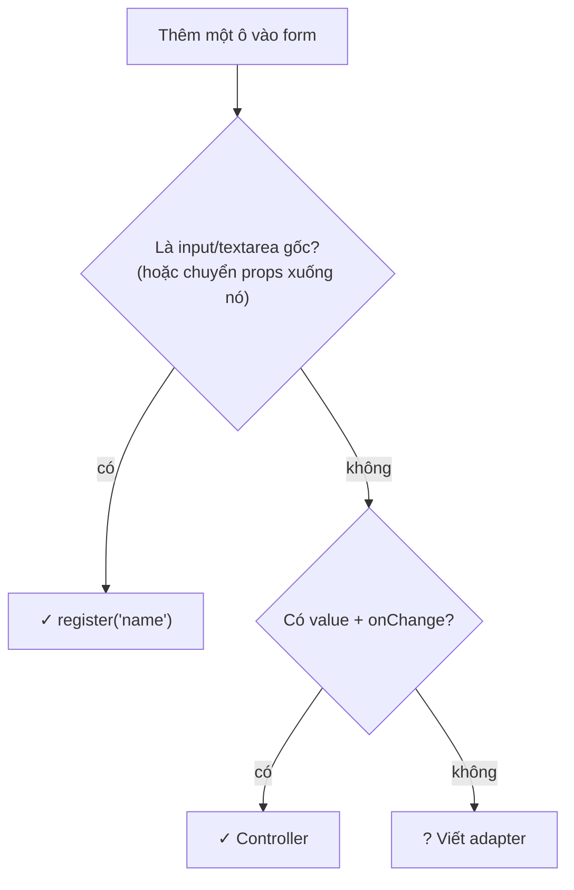

**Đọc sơ đồ:** Đọc từ trên xuống cho từng ô. register cho thẻ gốc (hoặc component chuyển props thẳng xuống thẻ gốc); Controller cho component tự quản giá trị với API riêng. *Màu: xanh ô-liu + ✓ = cách nối chuẩn · vàng mù tạt + ? = cần tự viết thêm.*


**Chi tiết kỹ thuật:** Checkbox của Radix không phải `<input type="checkbox">` — nó là `<button role="checkbox">` với API `checked` / `onCheckedChange`, và giá trị có thể là `'indeterminate'` (nửa chọn nửa không). `Controller` đưa bạn `field` để tự nối:

```tsx title="Controller cho Checkbox Radix"
<Controller
  name="acceptTerms"
  control={control}
  render={({ field, fieldState }) => (
    <Checkbox
      ref={field.ref}
      checked={field.value}
      onCheckedChange={(checked) => field.onChange(checked === true)} // ép về boolean
      onBlur={field.onBlur}
      aria-invalid={fieldState.invalid}
    />
  )}
/>
```

`Input` và `Textarea` của shadcn chỉ chuyển props xuống thẻ gốc, nên `register` chạy thẳng. React 19 cho `ref` đi như prop thường — không cần `forwardRef`.

### Nhìn lại bức tranh lớn

**Sơ đồ (Luồng dữ liệu) — Một lần gửi form đi qua những đâu?**


**Đọc sơ đồ:** Cùng vòng như đầu bài; phần viền terracotta là thứ bạn vừa học — Bài 2: useForm + register + zodResolver. *Màu: viền terracotta dày = phần của bài này · be = phần còn lại của vòng.*


Bạn vừa nối **người dùng → RHF → Zod**: `register` cho ô gốc, `Controller` cho component Radix, `zodResolver` để schema làm trọng tài. Zod tạo ra lỗi — nhưng lỗi hiện **lúc nào** và **ở đâu** mới quyết định form dễ chịu hay khó chịu. Bài 3.

### Tự vẽ lại

1. `register('email')` trả về những gì, và RHF đọc giá trị ô bằng cách nào?
2. Vì sao Checkbox của shadcn cần `Controller` còn Input thì không?
3. Muốn hiện “nexus.app/{slug}” theo thời gian thực, dùng gì để không render cả form mỗi phím?

## Bài 3 — Lỗi hiện khi nào, ở đâu

**Nó là gì (1 câu):** thu ngân tử tế **đợi khách nói hết câu mới sửa**, và khi sửa thì **chỉ vào đúng món sai** chứ không đọc lại cả hoá đơn.

**Sơ đồ tổng** — bài này nằm ở đoạn *RHF → Lỗi đúng chỗ → người dùng sửa*:

**Sơ đồ (Luồng dữ liệu) — Một lần gửi form đi qua những đâu?**

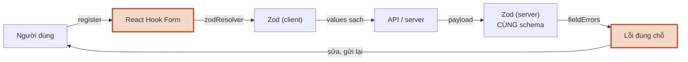

**Đọc sơ đồ:** Vòng đời một lần submit; phần viền terracotta là đoạn bài này đào sâu — Bài 3: lỗi hiện khi nào, ở đâu. *Màu: viền terracotta dày = phần của bài này · be = phần còn lại của vòng.*


### 3.1 Chế độ validate: đừng mắng người đang gõ

**Ẩn dụ:** khách mới nói “cà phê…” mà thu ngân đã kêu “thiếu size!” thì rất khó chịu. Đợi khách nói xong (rời ô) rồi mới nhắc; một khi đã nhắc thì báo ngay khi khách sửa đúng.

**Sơ đồ:**

**Sơ đồ (Luồng quyết định) — Với mode 'onTouched', khi nào lỗi hiện ra?**

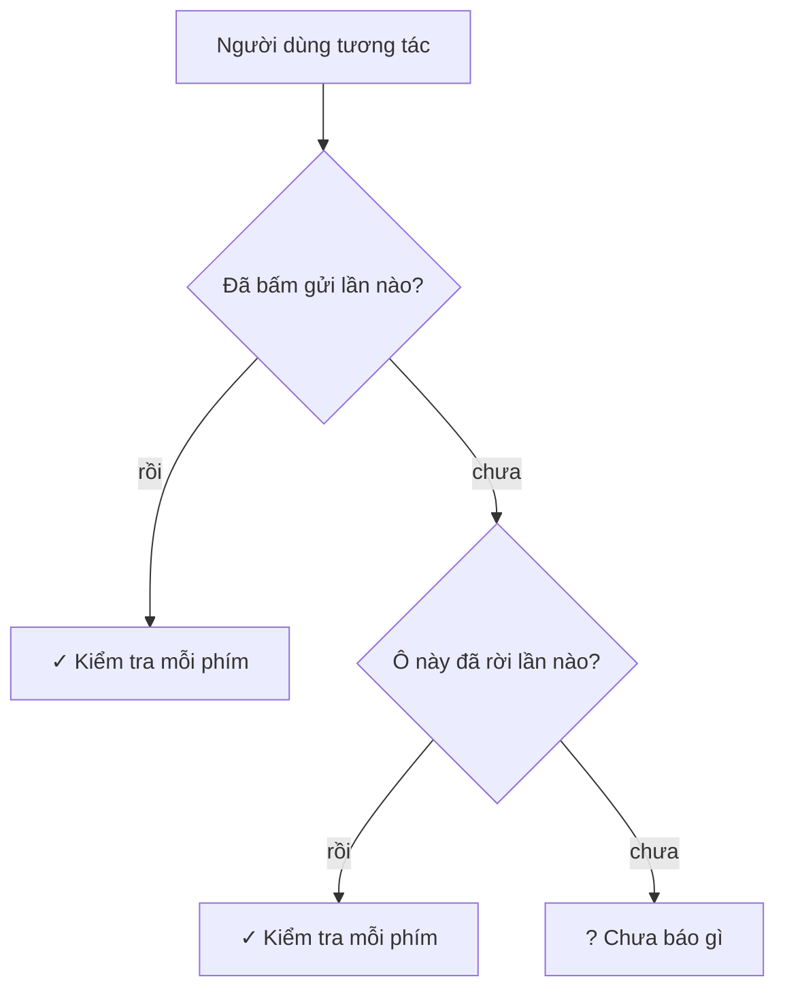

**Đọc sơ đồ:** Đọc từ trên xuống mỗi khi người dùng làm gì đó với một ô. Mục tiêu: không mắng người dùng khi họ CHƯA gõ xong, nhưng báo ngay khi họ đang sửa. *Màu: xanh ô-liu + ✓ = lỗi được kiểm tra và hiện · vàng mù tạt + ? = cố ý chưa báo.*


**Chi tiết kỹ thuật:**

| `mode` | Kiểm tra lần đầu khi | Hợp với |
|---|---|---|
| `onSubmit` (mặc định) | bấm gửi | form rất ngắn |
| `onTouched` | rời ô lần đầu, rồi mỗi phím | **hầu hết form** — Lab dùng cái này |
| `onBlur` | mỗi lần rời ô | ô tốn công kiểm tra |
| `onChange` | mỗi phím ngay từ đầu | ít dùng — hay “mắng sớm” |
| `all` | cả blur lẫn change | hiếm |

Sau lần submit đầu, `reValidateMode` (mặc định `onChange`) quyết định — nên sửa xong là lỗi biến mất ngay. Submit lỗi thì RHF **tự focus ô sai đầu tiên** (`shouldFocusError` mặc định bật).

### 3.2 Lỗi đi tới đúng ô

**Ẩn dụ:** mỗi lỗi mang **số bàn** (path). Người chạy bàn đọc số bàn và đặt phiếu đúng bàn đó, không dán lên cửa quán.

**Sơ đồ:**

**Sơ đồ (Luồng dữ liệu) — Một lỗi đi từ schema tới đúng ô trên màn hình thế nào?**

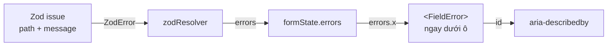

**Đọc sơ đồ:** Đọc từ trái: Zod tạo một ‘issue’ có path; zodResolver dịch path thành key trong errors; component đọc đúng key đó để vẽ FieldError dưới ô và nối aria-describedby. *Màu: đỏ gạch + ✗ + viền đứt = bị chặn/sai · vàng mù tạt + ? + viền chấm = cần xem lại · xanh ô-liu + ✓ = chạy đúng. Nhãn trên mũi tên = dữ liệu đi qua.*


**Chi tiết kỹ thuật** — component `TextField` của Lab gói quy tắc “lỗi ngay dưới ô” vào một chỗ:

```tsx title="apps/ui/src/components/form/text-field.tsx"
import type { ComponentProps } from 'react'
import type { FieldError as RHFFieldError } from 'react-hook-form'
import { Field, FieldDescription, FieldError, FieldLabel } from '@/components/ui/field'
import { Input } from '@/components/ui/input'

type Props = ComponentProps<typeof Input> & {
  id: string
  label: string
  error?: RHFFieldError
  description?: string
}

/** Nhãn + ô nhập + mô tả + lỗi — lỗi luôn nằm NGAY DƯỚI ô của nó */
export function TextField({ id, label, error, description, ...inputProps }: Props) {
  const errorId = `${id}-error`
  const descId = `${id}-desc`
  const describedBy = [description ? descId : null, error ? errorId : null].filter(Boolean).join(' ')

  return (
    <Field data-invalid={!!error}>
      <FieldLabel htmlFor={id}>{label}</FieldLabel>
      <Input
        id={id}
        aria-invalid={!!error}
        aria-describedby={describedBy || undefined}
        {...inputProps}
      />
      {description && <FieldDescription id={descId}>{description}</FieldDescription>}
      <FieldError id={errorId} errors={[error]} />
    </Field>
  )
}
```

- **`Field`, `FieldLabel`, `FieldError`** là component mới của shadcn (thay cho component `Form` cũ). `data-invalid` trên `Field` tô đỏ cả nhãn; `aria-invalid` trên ô tô viền đỏ.
- **`FieldError` có `role="alert"`**: trình đọc màn hình (phần mềm đọc to giao diện cho người khiếm thị) đọc lỗi ngay khi nó xuất hiện.
- **`aria-describedby`** nối ô với lỗi (và mô tả) bằng `id`: khi focus vào ô, trình đọc màn hình đọc luôn “Email không hợp lệ”. S1.5 sẽ kiểm tra chuyện này kỹ hơn.
- **`noValidate` trên `<form>`**: tắt bong bóng lỗi mặc định của trình duyệt (`type="email"`) để chỉ còn một nguồn lỗi là schema.

### Nhìn lại bức tranh lớn

**Sơ đồ (Luồng dữ liệu) — Một lần gửi form đi qua những đâu?**


**Đọc sơ đồ:** Cùng vòng như đầu bài; phần viền terracotta là thứ bạn vừa học — Bài 3: lỗi hiện khi nào, ở đâu. *Màu: viền terracotta dày = phần của bài này · be = phần còn lại của vòng.*


Bạn vừa làm cho lỗi **đúng lúc** (onTouched) và **đúng chỗ** (path → errors → FieldError → aria-describedby). Nhưng có những lỗi client không thể biết: “email này đã có tài khoản”. Chỉ server biết — và trong lúc chờ server, người dùng không được bấm gửi lần hai. Bài 4.

### Tự vẽ lại

1. Với `mode: 'onTouched'`, gõ “an@” rồi dừng — có hiện lỗi không? Rời ô thì sao?
2. Kể 4 chặng từ Zod issue tới dòng chữ đỏ dưới ô.
3. Quên `path` trong `.refine` thì người dùng thấy gì?

## Bài 4 — Submit, nút khoá, lỗi từ server

**Nó là gì (1 câu):** khi thu ngân đã **gửi order vào bếp**, máy tính tiền khoá lại cho tới khi bếp trả lời — khách sốt ruột bấm hai lần cũng không ra hai ly.

**Sơ đồ tổng** — bài này nằm ở đoạn *API → Zod server → lỗi đúng chỗ*:

**Sơ đồ (Luồng dữ liệu) — Một lần gửi form đi qua những đâu?**

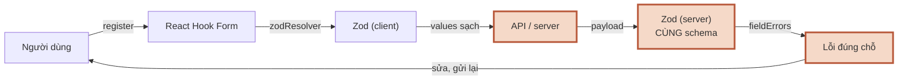

**Đọc sơ đồ:** Vòng đời một lần submit; phần viền terracotta là đoạn bài này đào sâu — Bài 4: submit, lỗi server, nút khoá. *Màu: viền terracotta dày = phần của bài này · be = phần còn lại của vòng.*


### 4.1 handleSubmit và isSubmitting

**Ẩn dụ:** thu ngân kiểm tra order với sổ công thức **trước** khi gửi bếp; sai thì trả lại khách ngay, không làm phiền bếp.

**Sơ đồ:**

**Sơ đồ (Trình tự) — Bấm ‘Tạo tài khoản’ — ai nói gì với ai?**

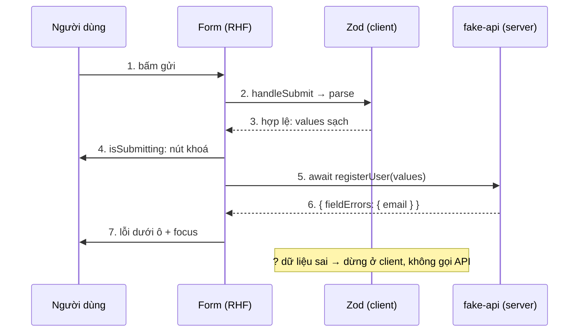

**Đọc sơ đồ:** Bốn cột, đọc ①→⑦. Nút khoá ở bước ④ và mở lại khi onSubmit (async) kết thúc. Ô vàng là đường dừng sớm khi dữ liệu sai ngay ở client. *Màu: đỏ gạch + ✗ + viền đứt = bị chặn/sai · vàng mù tạt + ? + viền chấm = cần xem lại · xanh ô-liu + ✓ = chạy đúng.*


**Chi tiết kỹ thuật:**

```tsx title="Luồng submit trong RegisterForm"
async function onSubmit(values: RegisterInput) {   // chỉ chạy khi schema đã PASS
  const result = await registerUser(values)        // trong lúc await: isSubmitting = true
  if (result.ok) {
    onRegistered(result.data.name)
    return
  }
  applyServerErrors(result, setError)              // lỗi server → đúng ô
}

<form noValidate onSubmit={handleSubmit(onSubmit)}>
  …
  <Button type="submit" disabled={isSubmitting}>
    {isSubmitting ? <><Spinner aria-hidden="true" /> Đang tạo tài khoản…</> : 'Tạo tài khoản'}
  </Button>
</form>
```

- **`handleSubmit(onSubmit)`**: chặn tải lại trang, chạy schema, chỉ gọi `onSubmit` khi hợp lệ.
- **`onSubmit` là `async`** → RHF tự đặt `isSubmitting = true` cho tới khi promise xong. Không cần `useState` riêng.
- **Nút đổi chữ** (“Đang tạo tài khoản…”) chứ không chỉ mờ đi — người dùng biết việc gì đang xảy ra. Spinner `aria-hidden` vì chữ đã nói đủ.

### 4.2 Lỗi server gắn vào đâu

**Ẩn dụ:** bếp báo “hết sữa yến mạch” → thu ngân chỉ vào **đúng món đó** trên order. Bếp báo “mất điện” → thông báo chung cho khách.

**Sơ đồ:**

**Sơ đồ (Luồng quyết định) — Lỗi server trả về nên hiện ở đâu?**

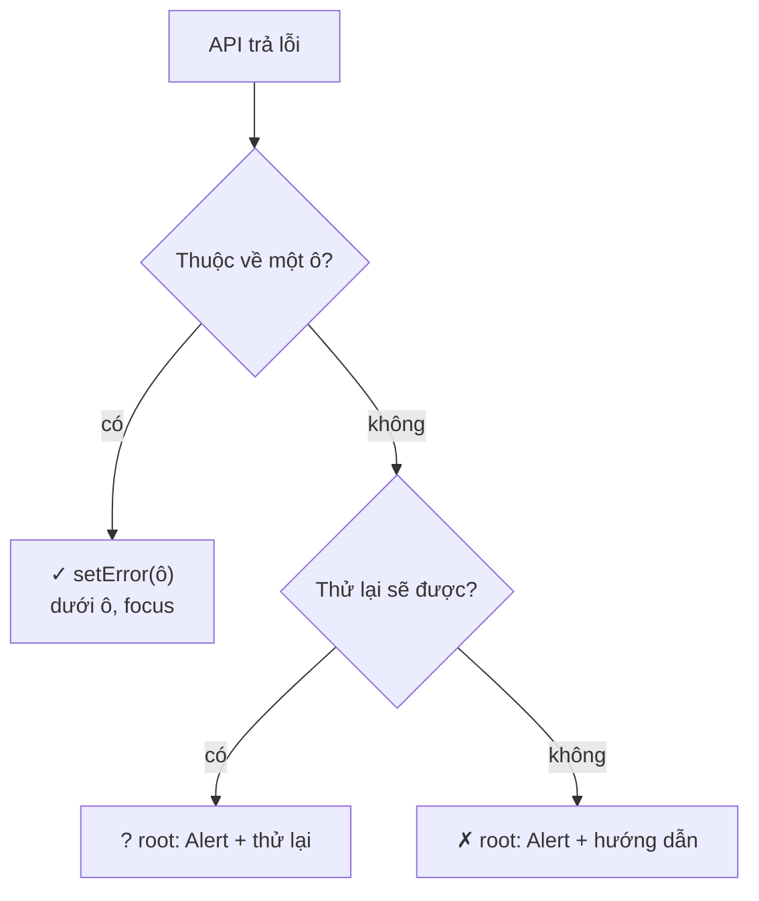

**Đọc sơ đồ:** Đọc từ trên xuống cho mỗi lỗi server trả. Ưu tiên gắn vào đúng ô; chỉ khi không thuộc ô nào mới dùng lỗi chung (errors.root) hiện thành Alert. *Màu: xanh ô-liu = lỗi người dùng tự sửa tại ô · vàng mù tạt = lỗi tạm thời · đỏ gạch = lỗi cần hướng dẫn thêm.*


**Chi tiết kỹ thuật** — server giả lập kiểm tra lại bằng cùng schema, rồi mới kiểm tra nghiệp vụ:

```ts title="apps/ui/src/lib/fake-api.ts"
import {
  createWorkspaceSchema,
  registerSchema,
  toFieldErrors,
  type CreateWorkspaceInput,
  type FieldErrorMap,
  type RegisterInput,
} from '@nexus/shared'

/** Kết quả API: thành công, hoặc lỗi theo field / lỗi chung cả form */
export type ApiResult<TData, TInput> =
  | { ok: true; data: TData }
  | { ok: false; fieldErrors?: FieldErrorMap<TInput>; formError?: string }

const delay = (ms: number) => new Promise((resolve) => setTimeout(resolve, ms))

// "Database" giả trong bộ nhớ
const takenEmails = new Set(['an@nexus.vn'])
const takenSlugs = new Set(['acme', 'phin', 'lotus'])

/**
 * Giả lập POST /api/register (server thật làm ở M9).
 * Server KHÔNG tin client: parse lại bằng CÙNG schema từ @nexus/shared.
 */
export async function registerUser(
  payload: unknown,
): Promise<ApiResult<{ id: string; name: string }, RegisterInput>> {
  await delay(800)
  const parsed = registerSchema.safeParse(payload)
  if (!parsed.success) return { ok: false, fieldErrors: toFieldErrors(parsed.error) }

  const { name, email } = parsed.data
  if (email === 'loi@nexus.vn') {
    return { ok: false, formError: 'Máy chủ đang bận. Thử lại sau ít phút.' }
  }
  if (takenEmails.has(email)) {
    return { ok: false, fieldErrors: { email: 'Email này đã có tài khoản. Hãy đăng nhập.' } }
  }
  takenEmails.add(email)
  return { ok: true, data: { id: crypto.randomUUID(), name } }
}

/** Giả lập POST /api/workspaces */
export async function createWorkspace(
  payload: unknown,
): Promise<ApiResult<{ id: string; name: string }, CreateWorkspaceInput>> {
  await delay(700)
  const parsed = createWorkspaceSchema.safeParse(payload)
  if (!parsed.success) return { ok: false, fieldErrors: toFieldErrors(parsed.error) }

  const { name, slug } = parsed.data
  if (takenSlugs.has(slug)) {
    return { ok: false, fieldErrors: { slug: `Đường dẫn “${slug}” đã có workspace khác dùng` } }
  }
  takenSlugs.add(slug)
  return { ok: true, data: { id: slug, name } }
}
```

```ts title="apps/ui/src/lib/form.ts"
import type { FieldValues, Path, UseFormSetError } from 'react-hook-form'

type ServerErrors = { fieldErrors?: Partial<Record<string, string>>; formError?: string }

/** Lỗi từ server → gắn vào đúng field (hoặc root nếu là lỗi chung) */
export function applyServerErrors<T extends FieldValues>(
  result: ServerErrors,
  setError: UseFormSetError<T>,
) {
  let first = true
  for (const [field, message] of Object.entries(result.fieldErrors ?? {})) {
    if (!message) continue
    setError(field as Path<T>, { type: 'server', message }, { shouldFocus: first })
    first = false
  }
  if (result.formError) {
    setError('root.server', { type: 'server', message: result.formError })
  }
}
```

- **`setError('email', { type: 'server', message })`**: lỗi server nằm trong cùng `errors` với lỗi client → `TextField` hiện nó y hệt, không cần code riêng.
- **`setError('root.server', …)`** cho lỗi không thuộc ô nào; hiện bằng `Alert`. Lỗi `root` **không chặn** lần submit sau — người dùng bấm lại được.
- **`shouldFocus: true`** cho lỗi đầu tiên để người dùng bàn phím không bị lạc.
- Ở M9, `registerUser` sẽ là Server Action gọi MongoDB — chữ ký hàm và hình dạng kết quả giữ nguyên.

### Nhìn lại bức tranh lớn

**Sơ đồ (Luồng dữ liệu) — Một lần gửi form đi qua những đâu?**


**Đọc sơ đồ:** Cùng vòng như đầu bài; phần viền terracotta là thứ bạn vừa học — Bài 4: submit, lỗi server, nút khoá. *Màu: viền terracotta dày = phần của bài này · be = phần còn lại của vòng.*


Vòng đã khép: người dùng gõ → RHF giữ → Zod client chặn lỗi sớm → server kiểm tra lại bằng cùng schema → lỗi quay về đúng ô → nút khoá suốt lúc chờ. Vào Lab.

### Tự vẽ lại

1. Dữ liệu sai ngay ở client thì `onSubmit` có chạy không? API có bị gọi không?
2. Vì sao không cần `useState` cho trạng thái “đang gửi”?
3. Lỗi “Email đã có tài khoản” và “Máy chủ đang bận” hiện ở đâu, khác nhau thế nào?

## Lab — Form đăng ký và tạo workspace

**Mục tiêu:** hai form thật trong `apps/ui`, schema lấy từ `@nexus/shared`, lỗi dưới đúng ô, nút khoá khi gửi, có lỗi server giả lập.

**Sơ đồ (Luồng dữ liệu) — Hai form của Lab dùng chung những gì?**

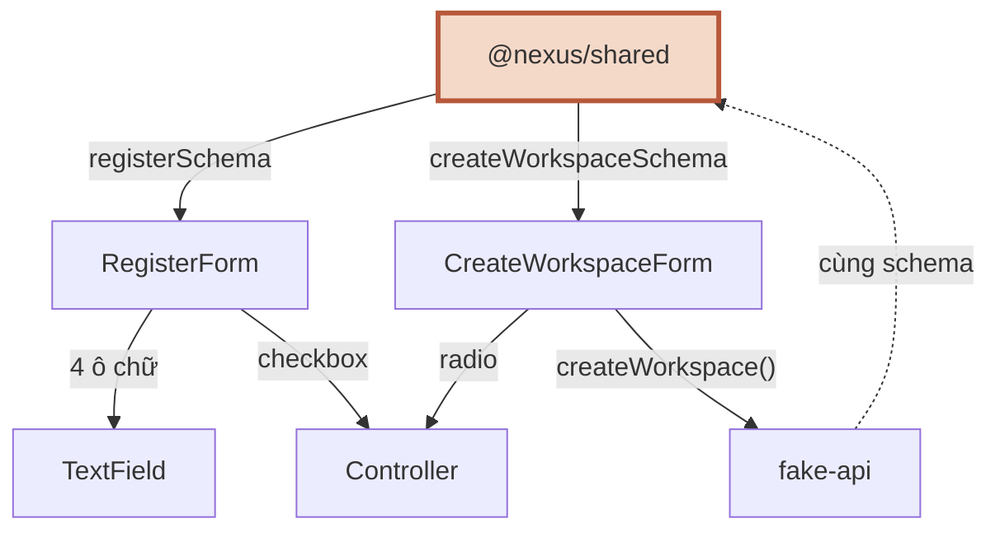

**Đọc sơ đồ:** Đọc từ @nexus/shared (trên): mỗi form lấy schema của nó; cả hai dùng TextField cho ô chữ và Controller cho component Radix; fake-api kiểm tra lại bằng cùng schema (nét đứt bên phải). *Màu: viền terracotta = nguồn schema · nét đứt = server kiểm tra lại. RegisterForm cũng gọi registerUser() của fake-api.*


```text title="file mới / sửa trong apps/ui/src"
lib/fake-api.ts                         giả lập API, validate lại bằng schema dùng chung
lib/form.ts                             applyServerErrors()
components/form/text-field.tsx          nhãn + ô + mô tả + lỗi
components/ui/                          + input, label, field, checkbox, radio-group, textarea, spinner, alert
features/auth/register-form.tsx         form đăng ký
features/auth/register-page.tsx         trang đăng ký
features/workspace/create-workspace-form.tsx
components/layout/*                     workspaces thành state, thêm nút “Tạo workspace”
App.tsx                                 chưa đăng ký → RegisterPage, rồi → AppShell
```

### Bước 1 — Schema trong `packages/shared`

Đã có đủ ở Bài 1 (`auth.ts`, `workspace.ts`, `field-errors.ts`, `index.ts`), cộng `slugify`:

```ts title="nexus/packages/shared/src/slugify.ts"
/** "Cà Phê Phin Hà Nội" → "ca-phe-phin-ha-noi" */
export function slugify(text: string): string {
  return text
    .normalize('NFD')
    .replace(/[̀-ͯ]/g, '') // bỏ dấu
    .replace(/đ/g, 'd')
    .replace(/Đ/g, 'D')
    .toLowerCase()
    .replace(/[^a-z0-9]+/g, '-')
    .replace(/^-+|-+$/g, '')
    .slice(0, 32)
    .replace(/-+$/, '')
}
```

### Bước 2 — Component shadcn cho form

```bash title="terminal (từ apps/ui)"
npx shadcn@latest add input label field checkbox radio-group textarea spinner alert
```

Máy soạn bài vẫn bị chặn tới registry như S1.3, nên mình chép đúng các file đó từ GitHub `shadcn-ui/ui` (thư mục `apps/v4/registry/new-york-v4/ui/`) và đổi import `cn` cùng đường dẫn `@/registry/new-york-v4/ui/…` thành `@/components/ui/…`.

### Bước 3 — `TextField`, `fake-api`, `applyServerErrors`

Đã có ở Bài 3 và Bài 4.

### Bước 4 — Form đăng ký

```tsx title="apps/ui/src/features/auth/register-form.tsx"
import { zodResolver } from '@hookform/resolvers/zod'
import { Controller, useForm } from 'react-hook-form'
import { registerSchema, type RegisterFormValues, type RegisterInput } from '@nexus/shared'
import { TextField } from '@/components/form/text-field'
import { Alert, AlertDescription, AlertTitle } from '@/components/ui/alert'
import { Button } from '@/components/ui/button'
import { Checkbox } from '@/components/ui/checkbox'
import { Field, FieldError, FieldGroup, FieldLabel } from '@/components/ui/field'
import { Spinner } from '@/components/ui/spinner'
import { registerUser } from '@/lib/fake-api'
import { applyServerErrors } from '@/lib/form'

type Props = { onRegistered: (name: string) => void }

export function RegisterForm({ onRegistered }: Props) {
  const {
    register,
    control,
    handleSubmit,
    setError,
    formState: { errors, isSubmitting },
  } = useForm<RegisterFormValues, unknown, RegisterInput>({
    resolver: zodResolver(registerSchema), // schema từ packages/shared, KHÔNG định nghĩa lại
    mode: 'onTouched', // báo lỗi khi rời ô; sau lần submit đầu thì báo theo từng phím
    defaultValues: { name: '', email: '', password: '', confirmPassword: '', acceptTerms: false },
  })

  // Chỉ chạy khi schema đã PASS ở client. values đã được trim/lowercase.
  async function onSubmit(values: RegisterInput) {
    const result = await registerUser(values)
    if (result.ok) {
      onRegistered(result.data.name)
      return
    }
    applyServerErrors(result, setError)
  }

  return (
    <form noValidate onSubmit={handleSubmit(onSubmit)} className="space-y-6">
      <FieldGroup className="gap-5">
        <TextField id="reg-name" label="Họ tên" autoComplete="name" error={errors.name} {...register('name')} />
        <TextField id="reg-email" label="Email" type="email" autoComplete="email" error={errors.email} {...register('email')} />
        <TextField
          id="reg-password"
          label="Mật khẩu"
          type="password"
          autoComplete="new-password"
          description="Ít nhất 8 ký tự, có cả chữ và số."
          error={errors.password}
          {...register('password')}
        />
        <TextField
          id="reg-confirm"
          label="Nhập lại mật khẩu"
          type="password"
          autoComplete="new-password"
          error={errors.confirmPassword}
          {...register('confirmPassword')}
        />

        {/* Checkbox của Radix không phải <input> gốc → dùng Controller */}
        <Controller
          name="acceptTerms"
          control={control}
          render={({ field, fieldState }) => (
            <div className="space-y-2">
              <Field orientation="horizontal" data-invalid={fieldState.invalid}>
                <Checkbox
                  id="reg-terms"
                  ref={field.ref}
                  checked={field.value}
                  onCheckedChange={(checked) => field.onChange(checked === true)}
                  onBlur={field.onBlur}
                  aria-invalid={fieldState.invalid}
                  aria-describedby={fieldState.error ? 'reg-terms-error' : undefined}
                />
                <FieldLabel htmlFor="reg-terms" className="font-normal">
                  Tôi đồng ý với điều khoản sử dụng
                </FieldLabel>
              </Field>
              <FieldError id="reg-terms-error" errors={[fieldState.error]} />
            </div>
          )}
        />
      </FieldGroup>

      {errors.root?.server && (
        <Alert variant="destructive">
          <AlertTitle>Chưa tạo được tài khoản</AlertTitle>
          <AlertDescription>{errors.root.server.message}</AlertDescription>
        </Alert>
      )}

      <Button type="submit" className="w-full" disabled={isSubmitting}>
        {isSubmitting ? (
          <>
            <Spinner aria-hidden="true" /> Đang tạo tài khoản…
          </>
        ) : (
          'Tạo tài khoản'
        )}
      </Button>
    </form>
  )
}
```

```tsx title="apps/ui/src/features/auth/register-page.tsx"
import { ModeToggle } from '@/components/theme/mode-toggle'
import { Card, CardContent, CardDescription, CardHeader, CardTitle } from '@/components/ui/card'
import { RegisterForm } from './register-form'

export function RegisterPage({ onRegistered }: { onRegistered: (name: string) => void }) {
  return (
    <div className="relative grid min-h-svh place-items-center bg-muted/40 p-4">
      <div className="absolute top-4 right-4">
        <ModeToggle />
      </div>
      <Card className="w-full max-w-md">
        <CardHeader>
          <CardTitle className="text-xl">Tạo tài khoản Nexus</CardTitle>
          <CardDescription>Trò chuyện với dữ liệu công ty bạn.</CardDescription>
        </CardHeader>
        <CardContent>
          <RegisterForm onRegistered={onRegistered} />
        </CardContent>
      </Card>
    </div>
  )
}
```

### Bước 5 — Form tạo workspace

Ba điểm mới: gợi ý slug **trong `onChange` của ô tên** (event handler, không phải effect — S1.2 bài 2) và **ngừng gợi ý khi người dùng đã tự sửa slug** (`dirtyFields.slug`); `useWatch` cho xem trước đường dẫn và đếm ký tự; `Controller` cho `RadioGroup`.

```tsx title="apps/ui/src/features/workspace/create-workspace-form.tsx"
import { zodResolver } from '@hookform/resolvers/zod'
import type { ChangeEvent } from 'react'
import { Controller, useForm, useWatch } from 'react-hook-form'
import {
  createWorkspaceSchema,
  slugify,
  type CreateWorkspaceFormValues,
  type CreateWorkspaceInput,
} from '@nexus/shared'
import { TextField } from '@/components/form/text-field'
import { Alert, AlertDescription } from '@/components/ui/alert'
import { Button } from '@/components/ui/button'
import {
  Field,
  FieldContent,
  FieldDescription,
  FieldError,
  FieldGroup,
  FieldLabel,
  FieldLegend,
  FieldSet,
} from '@/components/ui/field'
import { RadioGroup, RadioGroupItem } from '@/components/ui/radio-group'
import { Spinner } from '@/components/ui/spinner'
import { Textarea } from '@/components/ui/textarea'
import { createWorkspace } from '@/lib/fake-api'
import { applyServerErrors } from '@/lib/form'

const PLANS = [
  { value: 'free', label: 'Miễn phí', desc: '1 thành viên, 100 câu hỏi/tháng' },
  { value: 'team', label: 'Nhóm', desc: 'Không giới hạn thành viên, có phân quyền' },
] as const

type Props = {
  onCreated: (ws: { id: string; name: string }) => void
  onCancel: () => void
}

export function CreateWorkspaceForm({ onCreated, onCancel }: Props) {
  const {
    register,
    control,
    handleSubmit,
    setError,
    setValue,
    formState: { errors, isSubmitting, isSubmitted, dirtyFields },
  } = useForm<CreateWorkspaceFormValues, unknown, CreateWorkspaceInput>({
    resolver: zodResolver(createWorkspaceSchema),
    mode: 'onTouched',
    defaultValues: { name: '', slug: '', plan: 'free', description: '' },
  })

  // Theo dõi giá trị để hiển thị (xem trước đường dẫn, đếm ký tự)
  const slug = useWatch({ control, name: 'slug' })
  const description = useWatch({ control, name: 'description' })

  // Gõ tên → gợi ý slug, NHƯNG chỉ khi user chưa tự sửa slug.
  // Đặt trong onChange (event handler), không dùng useEffect — S1.2 bài 2.
  const nameField = register('name', {
    onChange: (e: ChangeEvent<HTMLInputElement>) => {
      if (!dirtyFields.slug) {
        setValue('slug', slugify(e.target.value), { shouldValidate: isSubmitted })
      }
    },
  })

  async function onSubmit(values: CreateWorkspaceInput) {
    const result = await createWorkspace(values)
    if (result.ok) {
      onCreated(result.data)
      return
    }
    applyServerErrors(result, setError)
  }

  return (
    <form noValidate onSubmit={handleSubmit(onSubmit)} className="max-w-xl space-y-6">
      <FieldGroup className="gap-5">
        <TextField id="ws-name" label="Tên workspace" placeholder="Phin Roasters Đà Lạt" error={errors.name} {...nameField} />
        <TextField
          id="ws-slug"
          label="Đường dẫn"
          description={`Địa chỉ: nexus.app/${slug || '…'}`}
          error={errors.slug}
          {...register('slug')}
        />

        <Controller
          name="plan"
          control={control}
          render={({ field, fieldState }) => (
            <FieldSet data-invalid={fieldState.invalid}>
              <FieldLegend variant="label">Gói</FieldLegend>
              <RadioGroup name={field.name} value={field.value} onValueChange={field.onChange} ref={field.ref}>
                {PLANS.map((p) => (
                  <Field key={p.value} orientation="horizontal">
                    <RadioGroupItem value={p.value} id={`plan-${p.value}`} />
                    <FieldContent>
                      <FieldLabel htmlFor={`plan-${p.value}`}>{p.label}</FieldLabel>
                      <FieldDescription>{p.desc}</FieldDescription>
                    </FieldContent>
                  </Field>
                ))}
              </RadioGroup>
              <FieldError errors={[fieldState.error]} />
            </FieldSet>
          )}
        />

        <Field data-invalid={!!errors.description}>
          <FieldLabel htmlFor="ws-desc">Mô tả (không bắt buộc)</FieldLabel>
          <Textarea
            id="ws-desc"
            rows={3}
            aria-invalid={!!errors.description}
            aria-describedby="ws-desc-count ws-desc-error"
            {...register('description')}
          />
          <FieldDescription id="ws-desc-count">{description.length}/200 ký tự</FieldDescription>
          <FieldError id="ws-desc-error" errors={[errors.description]} />
        </Field>
      </FieldGroup>

      {errors.root?.server && (
        <Alert variant="destructive">
          <AlertDescription>{errors.root.server.message}</AlertDescription>
        </Alert>
      )}

      <div className="flex gap-2">
        <Button type="submit" disabled={isSubmitting}>
          {isSubmitting ? (
            <>
              <Spinner aria-hidden="true" /> Đang tạo…
            </>
          ) : (
            'Tạo workspace'
          )}
        </Button>
        <Button type="button" variant="ghost" onClick={onCancel} disabled={isSubmitting}>
          Huỷ
        </Button>
      </div>
    </form>
  )
}
```

### Bước 6 — Nối vào layout

`workspaces` giờ là state (tạo mới thì thêm vào). `key={workspaces.length}` trên form: tạo xong, lần mở sau là một form sạch (S1.2 bài 2 — reset state bằng key).

```tsx title="apps/ui/src/components/layout/app-shell.tsx"
import { useState } from 'react'
import { Card, CardContent, CardDescription, CardHeader, CardTitle } from '@/components/ui/card'
import { Button } from '@/components/ui/button'
import { initialWorkspaces, initialsOf, navItems, type Workspace } from '@/data/nav'
import { CreateWorkspaceForm } from '@/features/workspace/create-workspace-form'
import { MobileNav } from './mobile-nav'
import { SidebarContent } from './sidebar-content'
import { SiteHeader } from './site-header'

const STATS = [
  { label: 'Khách hàng', value: '1.284' },
  { label: 'Hội thoại tuần này', value: '342' },
  { label: 'Tool call', value: '2.910' },
]

export function AppShell({ userName }: { userName: string }) {
  const [workspaces, setWorkspaces] = useState<Workspace[]>(initialWorkspaces)
  const [workspaceId, setWorkspaceId] = useState(initialWorkspaces[0].id)
  const [activeNav, setActiveNav] = useState(navItems[0].id)
  const [creating, setCreating] = useState(false)

  // Derived
  const workspace = workspaces.find((w) => w.id === workspaceId) ?? workspaces[0]
  const title = creating ? 'Tạo workspace' : (navItems.find((n) => n.id === activeNav)?.label ?? '')

  function handleCreated(ws: { id: string; name: string }) {
    setWorkspaces((prev) => [...prev, { ...ws, initials: initialsOf(ws.name) }])
    setWorkspaceId(ws.id)
    setCreating(false)
  }

  const sidebarProps = {
    workspaces,
    workspaceId,
    activeNav: creating ? '' : activeNav,
    onSelectWorkspace: (id: string) => {
      setWorkspaceId(id)
      setCreating(false)
    },
    onNavigate: (id: string) => {
      setActiveNav(id)
      setCreating(false)
    },
    onCreateWorkspace: () => setCreating(true),
  }

  return (
    // < 768px: 1 cột. ≥ 768px (md): 2 cột, sidebar rộng 16rem
    <div className="min-h-svh md:grid md:grid-cols-[16rem_1fr]">
      <aside className="sticky top-0 hidden h-svh border-r border-sidebar-border bg-sidebar text-sidebar-foreground md:block">
        <SidebarContent {...sidebarProps} />
      </aside>

      <div className="flex min-w-0 flex-col">
        <SiteHeader
          title={title}
          workspaceName={workspace.name}
          userInitials={initialsOf(userName)}
          mobileNav={<MobileNav {...sidebarProps} />}
        />

        <main className="flex-1 space-y-6 p-4 md:p-6">
          {creating ? (
            <Card>
              <CardHeader>
                <CardTitle>Workspace mới</CardTitle>
                <CardDescription>Mỗi workspace có dữ liệu và thành viên riêng.</CardDescription>
              </CardHeader>
              <CardContent>
                {/* key: mỗi lần mở là một form sạch (S1.2 bài 2) */}
                <CreateWorkspaceForm key={workspaces.length} onCreated={handleCreated} onCancel={() => setCreating(false)} />
              </CardContent>
            </Card>
          ) : (
            <>
              <section className="grid gap-4 sm:grid-cols-2 lg:grid-cols-3" aria-label="Số liệu nhanh">
                {STATS.map((s) => (
                  <Card key={s.label} className="gap-2 py-4">
                    <CardHeader className="px-4">
                      <CardDescription>{s.label}</CardDescription>
                      <CardTitle className="text-2xl tabular-nums">{s.value}</CardTitle>
                    </CardHeader>
                  </Card>
                ))}
              </section>

              <Card>
                <CardHeader>
                  <CardTitle>{title}</CardTitle>
                  <CardDescription>
                    Nội dung trang “{title}” sẽ được dựng ở S1.5. Đây là khung layout.
                  </CardDescription>
                </CardHeader>
                <CardContent className="flex flex-wrap gap-2">
                  <Button onClick={() => setCreating(true)}>Tạo workspace</Button>
                  <Button variant="outline">Phụ</Button>
                </CardContent>
              </Card>
            </>
          )}
        </main>
      </div>
    </div>
  )
}
```

```tsx title="apps/ui/src/App.tsx"
import { useState } from 'react'
import { AppShell } from '@/components/layout/app-shell'
import { RegisterPage } from '@/features/auth/register-page'

export default function App() {
  // Chưa có router/auth thật (M9) — một state là đủ cho giao diện tĩnh
  const [userName, setUserName] = useState<string | null>(null)

  if (!userName) return <RegisterPage onRegistered={setUserName} />
  return <AppShell userName={userName} />
}
```

`SidebarContent` nhận thêm `workspaces` và `onCreateWorkspace` (nút “+ Tạo workspace” dưới danh sách); `MobileNav` đóng Sheet khi bấm nút đó. Toàn văn ở tab Code.

### Bước 7 — Kiểm tra: typecheck, lint, build, AC

Typecheck **cả monorepo** từ thư mục gốc — kết quả thật:

```console title="output"
$ pnpm typecheck
> nexus@ typecheck /home/claude/nexus
> pnpm -r run typecheck
Scope: 2 of 3 workspace projects
packages/shared typecheck$ tsc --noEmit
packages/shared typecheck: Done
apps/ui typecheck$ tsc -b
apps/ui typecheck: Done
```

Lint. oxlint 1.85 in gọn (không có dòng tổng kết) khi không chạy trong terminal thật, nên mình thêm `--format default` để thấy đủ:

```console title="output"
$ pnpm --filter @nexus/ui exec oxlint --format default
Found 0 warnings and 0 errors.
Finished in 40ms on 34 files with 116 rules using 2 threads.
```

```console title="output"
$ pnpm --filter @nexus/ui build
✓ 2122 modules transformed.
rendering chunks...
computing gzip size...
dist/index.html                   0.95 kB │ gzip:   0.56 kB
dist/assets/index-DOsz3i85.css   49.56 kB │ gzip:   8.97 kB
dist/assets/index-CA3mPLdX.js   501.27 kB │ gzip: 156.49 kB
(!) Some chunks are larger than 500 kB after minification. Consider:
- Using dynamic import() to code-split the application
✓ built in 597ms
```

Cảnh báo 500 kB là thật và vô hại lúc này (một trang, chưa chia nhỏ code). Next.js ở M9 tự chia theo route.

**AC #1 — không định nghĩa lại schema.** Tìm mọi `z.object` hay `import … 'zod'` trong code UI:

```console title="output"
$ grep -rn "z\.object\|from 'zod'" apps/ui/src
(không có kết quả)

$ grep -rln "@nexus/shared" apps/ui/src
apps/ui/src/features/auth/register-form.tsx
apps/ui/src/features/workspace/create-workspace-form.tsx
apps/ui/src/lib/fake-api.ts
```

**AC #2 — lỗi dưới đúng ô, nút khoá khi gửi.** Mình chạy bản build trong trình duyệt headless (trình duyệt không có cửa sổ, điều khiển bằng script), gõ và bấm thật. Với mỗi lỗi, script kiểm tra: lỗi nằm **trong cùng `Field`** với ô, **đứng sau** ô trong DOM, và được **`aria-describedby`** của ô trỏ tới. Kết quả thật:

```console title="output"
$ python3 e2e_forms.py
== Đăng ký ==
  submit rỗng · reg-name    : Tên cần ít nhất 2 ký tự  [dưới ô ✓, aria-describedby ✓]
  submit rỗng · reg-email   : Email không hợp lệ  [dưới ô ✓, aria-describedby ✓]
  submit rỗng · reg-password: Mật khẩu cần ít nhất 8 ký tự  [dưới ô ✓, aria-describedby ✓]
  submit rỗng · reg-confirm : Nhập lại mật khẩu  [dưới ô ✓, aria-describedby ✓]
  submit rỗng · reg-terms   : Bạn cần đồng ý điều khoản sử dụng
  focus sau submit lỗi       : reg-name
  gõ email thiếu đuôi        : Email không hợp lệ  [dưới ô ✓, aria-describedby ✓]
  nhập lại lệch mật khẩu     : Mật khẩu nhập lại không khớp  [dưới ô ✓, aria-describedby ✓]
  sửa xong → còn lỗi nào     : 0
  đang gửi → nút disabled    : True | chữ: Đang tạo tài khoản…
  server: email đã có        : Email này đã có tài khoản. Hãy đăng nhập.  [dưới ô ✓, aria-describedby ✓] | focus: reg-email
  server: lỗi chung (root)   : Chưa tạo được tài khoản — Máy chủ đang bận. Thử lại sau ít phút.
  thành công → vào app, avatar: NA
== Tạo workspace ==
  gõ tên → slug tự gợi ý     : phin-roasters-da-lat
  đổi tên → slug theo        : acme
  đang gửi → nút disabled    : True
  server: slug trùng         : Đường dẫn “acme” đã có workspace khác dùng  [dưới ô ✓, aria-describedby ✓]
  slug có hoa & khoảng trắng : Chỉ dùng chữ thường không dấu, số và dấu gạch ngang  [dưới ô ✓, aria-describedby ✓]
  tự sửa slug rồi đổi tên    : slug giữ = acme-da-lat
  mô tả 205 ký tự            : 205/200 ký tự | Mô tả tối đa 200 ký tự
  bấm đúp Tạo → số workspace : 3 → 4 | đang chọn: AĐ Acme Đà Lạt
console errors/warnings: []
```

Đọc kết quả: mọi lỗi (của client lẫn server) nằm dưới đúng ô và được nối ARIA; nút khoá và đổi chữ khi đang gửi; bấm đúp chỉ tạo **một** workspace; submit lỗi thì focus nhảy về ô sai đầu tiên; lỗi chung hiện thành Alert.

### Bước 8 — Thử phá

**Thử 1 — Xoá `path: ['confirmPassword']`** trong `registerSchema`. Nhập mật khẩu lệch rồi bấm gửi. Có dòng đỏ nào không? Nút gửi có tác dụng không?

**Thử 2 — Định nghĩa lại schema trong `register-form.tsx`** với min tên là 3 thay vì 2. Gõ tên 2 ký tự: client báo gì, `fake-api` báo gì? Đây chính là thứ AC #1 ngăn chặn.

**Thử 3 — Bỏ `async`/`await` trong `onSubmit`** (gọi `registerUser(values)` không chờ). Nút còn khoá khi gửi không? Bấm đúp thì sao?

**Thử 4 — Đổi `mode` thành `'onChange'`.** Gõ email từ đầu. Bạn thấy khó chịu từ ký tự thứ mấy?

## Kiểm tra AC & Exit

### AC của S1.4

- [ ] **Schema import từ `packages/shared`, không định nghĩa lại.** Bằng chứng: `grep` không thấy `z.object` hay `import … 'zod'` nào trong `apps/ui/src`; 3 file import `@nexus/shared`; script Node chạy cùng schema cho cùng kết quả.
- [ ] **Lỗi hiện dưới đúng field.** Bằng chứng: E2E kiểm tra vị trí DOM + `aria-describedby` cho mọi ô, cả lỗi client lẫn lỗi server; lỗi 2 ô (`confirmPassword`) nhờ `path`.
- [ ] **Nút submit khoá khi đang gửi.** Bằng chứng: `disabled=True` và chữ “Đang tạo tài khoản…” trong lúc chờ; bấm đúp tạo đúng 1 workspace.

### Câu hỏi tự kiểm

1. Vì sao phải validate ở server khi client đã validate rồi?
2. `z.input` và `z.output` dùng ở đâu trong `useForm`?
3. `register` và `Controller` — chọn cái nào cho `<Select>` của Radix?
4. Lỗi server “slug đã có người dùng” đi đường nào để hiện dưới ô slug?

### Tiếp theo

**S1.5 — Accessibility & giao diện tĩnh hoàn chỉnh:** HTML ngữ nghĩa, label, focus, `aria-*`, tương phản; dựng toàn bộ màn hình tĩnh (đăng nhập, workspace, khung chat, dashboard). Form hôm nay đã có `aria-describedby`, `role="alert"` và focus khi lỗi — S1.5 sẽ đo chúng bằng Lighthouse và thử bằng bàn phím.

---

# Cheat Sheet — S1.4

## Bản đồ Module 1

**Sơ đồ (Bản đồ dịch vụ) — Module 1 gồm những session nào, bạn đang ở đâu?**

```mermaid
flowchart LR
    s1["✓ S1.1 React"] -- "state, props" --> s2["✓ S1.2 Hooks"]
    s2["✓ S1.2 Hooks"] -- "useTheme" --> s3["✓ S1.3 Tailwind"]
    s3["✓ S1.3 Tailwind"] -- "layout Nexus" --> s4["S1.4 Form (đang học)"]
    s4["S1.4 Form (đang học)"] -- "form + lỗi" --> s5["S1.5 Accessibility"]
    s5["S1.5 Accessibility"] -- "trang tĩnh" --> out["✓ UI tĩnh Nexus"]
    classDef hl fill:#f5d9c8,stroke:#b8583a,stroke-width:3px
    class s4 hl
```

**Đọc sơ đồ:** Đọc từ S1.1 (trái trên) sang phải, vòng xuống hàng dưới và đi ngược về trái tới đích. Nhãn mũi tên = thứ mang sang session sau. *Màu: xanh ô-liu + ✓ = đã xong / đích · viền terracotta = đang học · be = sắp học.*


## Cú pháp nhanh

| Việc | Viết thế này |
|---|---|
| Gói schema dùng chung | `"exports": { ".": "./src/index.ts" }` · app: `"@nexus/shared": "workspace:*"` |
| Email Zod 4 (có làm sạch) | `z.string().trim().toLowerCase().pipe(z.email('…'))` |
| Luật 2 ô | `.refine(d => d.a === d.b, { message, path: ['b'] })` |
| Enum | `z.enum(['free', 'team'], 'Chọn một gói')` |
| Kiểu từ schema | `z.input<typeof s>` (form) · `z.output<typeof s>` (submit/server) |
| Parse an toàn | `const r = s.safeParse(x); if (!r.success) toFieldErrors(r.error)` |
| Lỗi theo field | `z.flattenError(err).fieldErrors` |
| Khởi tạo form | `useForm<In, unknown, Out>({ resolver: zodResolver(s), mode: 'onTouched', defaultValues })` |
| Ô gốc | `<Input {...register('email')} />` |
| Component Radix | `<Controller name control render={({ field, fieldState }) => …} />` |
| Xem giá trị | `useWatch({ control, name: 'slug' })` |
| Đặt giá trị | `setValue('slug', v, { shouldValidate: isSubmitted })` |
| Gửi | `<form noValidate onSubmit={handleSubmit(onSubmit)}>` |
| Đang gửi | `disabled={isSubmitting}` (onSubmit phải `async`) |
| Lỗi server | `setError('email', { type: 'server', message }, { shouldFocus: true })` |
| Lỗi chung | `setError('root.server', { message })` → `errors.root?.server` |
| Nối ARIA | `aria-invalid={!!error}` · `aria-describedby="x-error"` · `<FieldError id="x-error">` |

## Luật vàng

1. Một schema, đặt ở `packages/shared`. UI không `import 'zod'` để tự viết luật.
2. Server luôn validate lại — không bao giờ tin client.
3. Kiểu dữ liệu suy ra từ schema; không khai báo tay.
4. Làm sạch trước, kiểm tra sau (thứ tự trong schema là thứ tự chạy).
5. Luật dính 2 ô → `refine` có `path` trỏ đúng ô hiện lỗi.
6. `defaultValues` đủ mọi field.
7. Ô gốc → `register`; component tự quản giá trị → `Controller`.
8. `mode: 'onTouched'`: không mắng người đang gõ.
9. Lỗi luôn nằm ngay dưới ô, nối bằng `aria-describedby`.
10. `onSubmit` async + `disabled={isSubmitting}` = không gửi hai lần.

## Lỗi hay gặp

| Triệu chứng | Nguyên nhân | Sửa |
|---|---|---|
| Email đúng mà vẫn báo sai | Kiểm tra trước khi trim | `.trim().pipe(z.email())` |
| Bấm gửi không có gì xảy ra, không thấy lỗi | Lỗi không có `path` khớp ô nào | Thêm `path` vào `refine` |
| Checkbox tick mà giá trị không đổi | Dùng `register` cho Radix Checkbox | `Controller` + `onCheckedChange` |
| Cảnh báo “uncontrolled to controlled” | Thiếu `defaultValues` | Khai đủ mọi field |
| Bong bóng lỗi của trình duyệt chồng lên lỗi của bạn | Thiếu `noValidate` | `<form noValidate>` |
| Nút không khoá khi gửi | `onSubmit` không trả Promise | `async` + `await` API |
| Lỗi server không hiện | Tên field server trả khác tên trong form | Dùng chung schema → chung tên |
| `Cannot find module '@nexus/shared'` | Chưa `pnpm install` sau khi thêm `workspace:*` | `pnpm install` ở gốc |
| Node báo lỗi import trong shared | Import tương đối thiếu đuôi `.ts` | `from './schemas/auth.ts'` |
| `pnpm lint` im lặng, không có dòng tổng kết | oxlint ≥ 1.85 ngoài terminal dùng format gọn | `oxlint --format default` |

---

# Code hoàn chỉnh — Lab S1.4

## Monorepo gốc

```json title="nexus/package.json"
{
  "name": "nexus",
  "private": true,
  "type": "module",
  "scripts": {
    "typecheck": "pnpm -r run typecheck",
    "lint": "pnpm -r run lint",
    "build": "pnpm -r run build",
    "dev:ui": "pnpm --filter @nexus/ui dev",
    "check:server": "pnpm --filter @nexus/shared check:server"
  }
}
```

```yaml title="nexus/pnpm-workspace.yaml"
packages:
  - apps/*
  - packages/*
```

```json title="nexus/tsconfig.base.json"
{
  "compilerOptions": {
    "target": "es2023",
    "module": "esnext",
    "moduleResolution": "bundler",
    "strict": true,
    "skipLibCheck": true,
    "noEmit": true,
    "allowImportingTsExtensions": true,
    "verbatimModuleSyntax": true,
    "noUnusedLocals": true,
    "noUnusedParameters": true
  }
}
```

## packages/shared

```json title="nexus/packages/shared/package.json"
{
  "name": "@nexus/shared",
  "version": "0.0.0",
  "private": true,
  "type": "module",
  "exports": {
    ".": "./src/index.ts"
  },
  "scripts": {
    "typecheck": "tsc --noEmit",
    "check:server": "node scripts/server-check.ts"
  },
  "dependencies": {
    "zod": "^4.6.5"
  },
  "devDependencies": {
    "@types/node": "^22.20.4",
    "typescript": "~6.0.3"
  }
}
```

```json title="nexus/packages/shared/tsconfig.json"
{
  "extends": "../../tsconfig.base.json",
  "compilerOptions": { "lib": ["ES2023"], "types": ["node"] },
  "include": ["src", "scripts"]
}
```

```ts title="nexus/packages/shared/src/index.ts"
export * from './schemas/auth.ts'
export * from './schemas/workspace.ts'
export * from './slugify.ts'
export * from './field-errors.ts'
```

```ts title="nexus/packages/shared/src/schemas/auth.ts"
import { z } from 'zod'

/** Đăng ký tài khoản — MỘT nguồn sự thật cho form (client) và API (server) */
export const registerSchema = z
  .object({
    name: z
      .string()
      .trim()
      .min(2, 'Tên cần ít nhất 2 ký tự')
      .max(60, 'Tên tối đa 60 ký tự'),
    // trim/lowercase TRƯỚC, kiểm tra định dạng SAU (thứ tự trong chuỗi quan trọng!)
    email: z.string().trim().toLowerCase().pipe(z.email('Email không hợp lệ')),
    password: z
      .string()
      .min(8, 'Mật khẩu cần ít nhất 8 ký tự')
      .regex(/[A-Za-z]/, 'Mật khẩu cần ít nhất 1 chữ cái')
      .regex(/\d/, 'Mật khẩu cần ít nhất 1 chữ số'),
    confirmPassword: z.string().min(1, 'Nhập lại mật khẩu'),
    acceptTerms: z.boolean().refine((v) => v, 'Bạn cần đồng ý điều khoản sử dụng'),
  })
  // Luật liên quan 2 field → refine ở cấp object, gắn lỗi vào đúng field bằng path
  .refine((d) => d.password === d.confirmPassword, {
    message: 'Mật khẩu nhập lại không khớp',
    path: ['confirmPassword'],
  })

/** Kiểu của dữ liệu NGƯỜI DÙNG GÕ (trước trim/lowercase) */
export type RegisterFormValues = z.input<typeof registerSchema>
/** Kiểu của dữ liệu ĐÃ KIỂM TRA (sau trim/lowercase) — thứ server nhận */
export type RegisterInput = z.output<typeof registerSchema>
```

```ts title="nexus/packages/shared/src/schemas/workspace.ts"
import { z } from 'zod'

export const WORKSPACE_PLANS = ['free', 'team'] as const

export const createWorkspaceSchema = z.object({
  name: z
    .string()
    .trim()
    .min(2, 'Tên workspace cần ít nhất 2 ký tự')
    .max(50, 'Tên workspace tối đa 50 ký tự'),
  slug: z
    .string()
    .trim()
    .min(3, 'Đường dẫn cần ít nhất 3 ký tự')
    .max(32, 'Đường dẫn tối đa 32 ký tự')
    .regex(/^[a-z0-9]+(?:-[a-z0-9]+)*$/, 'Chỉ dùng chữ thường không dấu, số và dấu gạch ngang'),
  plan: z.enum(WORKSPACE_PLANS, 'Chọn một gói'),
  description: z.string().trim().max(200, 'Mô tả tối đa 200 ký tự'),
})

export type CreateWorkspaceFormValues = z.input<typeof createWorkspaceSchema>
export type CreateWorkspaceInput = z.output<typeof createWorkspaceSchema>
```

```ts title="nexus/packages/shared/src/field-errors.ts"
import { z } from 'zod'

/** Lỗi theo field mà server trả về: { email: 'Email này đã có tài khoản' } */
export type FieldErrorMap<T> = Partial<Record<keyof T & string, string>>

/** ZodError → mỗi field một câu (câu đầu tiên), để client gắn vào đúng ô */
export function toFieldErrors<T>(error: z.ZodError<T>): FieldErrorMap<T> {
  const out: Record<string, string> = {}
  for (const [field, messages] of Object.entries(z.flattenError(error).fieldErrors)) {
    const first = (messages as string[] | undefined)?.[0]
    if (first) out[field] = first
  }
  return out as FieldErrorMap<T>
}
```

```ts title="nexus/packages/shared/src/slugify.ts"
/** "Cà Phê Phin Hà Nội" → "ca-phe-phin-ha-noi" */
export function slugify(text: string): string {
  return text
    .normalize('NFD')
    .replace(/[̀-ͯ]/g, '') // bỏ dấu
    .replace(/đ/g, 'd')
    .replace(/Đ/g, 'D')
    .toLowerCase()
    .replace(/[^a-z0-9]+/g, '-')
    .replace(/^-+|-+$/g, '')
    .slice(0, 32)
    .replace(/-+$/, '')
}
```

```ts title="nexus/packages/shared/scripts/server-check.ts"
// Chạy bằng Node (không có React, không có trình duyệt) để chứng minh:
// cùng schema dùng được ở phía server.
import { createWorkspaceSchema, registerSchema, slugify, toFieldErrors } from '../src/index.ts'

const bad = registerSchema.safeParse({
  name: 'A',
  email: 'khong-phai-email',
  password: 'abc',
  confirmPassword: 'abcd',
  acceptTerms: false,
})
console.log('register (dữ liệu xấu) →', bad.success ? 'OK' : toFieldErrors(bad.error))

const good = registerSchema.safeParse({
  name: '  Ngọc Anh  ',
  email: ' Anh@Nexus.VN ',
  password: 'caphe2026',
  confirmPassword: 'caphe2026',
  acceptTerms: true,
})
console.log('register (dữ liệu tốt) →', good.success ? good.data : good.error)

console.log('slugify →', slugify('Cà Phê Phin Đà Lạt'))
const ws = createWorkspaceSchema.safeParse({ name: 'Acme', slug: 'Acme Coffee', plan: 'vip', description: '' })
console.log('workspace (slug & plan sai) →', ws.success ? 'OK' : toFieldErrors(ws.error))
```

## apps/ui — form

```tsx title="apps/ui/src/features/auth/register-form.tsx"
import { zodResolver } from '@hookform/resolvers/zod'
import { Controller, useForm } from 'react-hook-form'
import { registerSchema, type RegisterFormValues, type RegisterInput } from '@nexus/shared'
import { TextField } from '@/components/form/text-field'
import { Alert, AlertDescription, AlertTitle } from '@/components/ui/alert'
import { Button } from '@/components/ui/button'
import { Checkbox } from '@/components/ui/checkbox'
import { Field, FieldError, FieldGroup, FieldLabel } from '@/components/ui/field'
import { Spinner } from '@/components/ui/spinner'
import { registerUser } from '@/lib/fake-api'
import { applyServerErrors } from '@/lib/form'

type Props = { onRegistered: (name: string) => void }

export function RegisterForm({ onRegistered }: Props) {
  const {
    register,
    control,
    handleSubmit,
    setError,
    formState: { errors, isSubmitting },
  } = useForm<RegisterFormValues, unknown, RegisterInput>({
    resolver: zodResolver(registerSchema), // schema từ packages/shared, KHÔNG định nghĩa lại
    mode: 'onTouched', // báo lỗi khi rời ô; sau lần submit đầu thì báo theo từng phím
    defaultValues: { name: '', email: '', password: '', confirmPassword: '', acceptTerms: false },
  })

  // Chỉ chạy khi schema đã PASS ở client. values đã được trim/lowercase.
  async function onSubmit(values: RegisterInput) {
    const result = await registerUser(values)
    if (result.ok) {
      onRegistered(result.data.name)
      return
    }
    applyServerErrors(result, setError)
  }

  return (
    <form noValidate onSubmit={handleSubmit(onSubmit)} className="space-y-6">
      <FieldGroup className="gap-5">
        <TextField id="reg-name" label="Họ tên" autoComplete="name" error={errors.name} {...register('name')} />
        <TextField id="reg-email" label="Email" type="email" autoComplete="email" error={errors.email} {...register('email')} />
        <TextField
          id="reg-password"
          label="Mật khẩu"
          type="password"
          autoComplete="new-password"
          description="Ít nhất 8 ký tự, có cả chữ và số."
          error={errors.password}
          {...register('password')}
        />
        <TextField
          id="reg-confirm"
          label="Nhập lại mật khẩu"
          type="password"
          autoComplete="new-password"
          error={errors.confirmPassword}
          {...register('confirmPassword')}
        />

        {/* Checkbox của Radix không phải <input> gốc → dùng Controller */}
        <Controller
          name="acceptTerms"
          control={control}
          render={({ field, fieldState }) => (
            <div className="space-y-2">
              <Field orientation="horizontal" data-invalid={fieldState.invalid}>
                <Checkbox
                  id="reg-terms"
                  ref={field.ref}
                  checked={field.value}
                  onCheckedChange={(checked) => field.onChange(checked === true)}
                  onBlur={field.onBlur}
                  aria-invalid={fieldState.invalid}
                  aria-describedby={fieldState.error ? 'reg-terms-error' : undefined}
                />
                <FieldLabel htmlFor="reg-terms" className="font-normal">
                  Tôi đồng ý với điều khoản sử dụng
                </FieldLabel>
              </Field>
              <FieldError id="reg-terms-error" errors={[fieldState.error]} />
            </div>
          )}
        />
      </FieldGroup>

      {errors.root?.server && (
        <Alert variant="destructive">
          <AlertTitle>Chưa tạo được tài khoản</AlertTitle>
          <AlertDescription>{errors.root.server.message}</AlertDescription>
        </Alert>
      )}

      <Button type="submit" className="w-full" disabled={isSubmitting}>
        {isSubmitting ? (
          <>
            <Spinner aria-hidden="true" /> Đang tạo tài khoản…
          </>
        ) : (
          'Tạo tài khoản'
        )}
      </Button>
    </form>
  )
}
```

```tsx title="apps/ui/src/features/auth/register-page.tsx"
import { ModeToggle } from '@/components/theme/mode-toggle'
import { Card, CardContent, CardDescription, CardHeader, CardTitle } from '@/components/ui/card'
import { RegisterForm } from './register-form'

export function RegisterPage({ onRegistered }: { onRegistered: (name: string) => void }) {
  return (
    <div className="relative grid min-h-svh place-items-center bg-muted/40 p-4">
      <div className="absolute top-4 right-4">
        <ModeToggle />
      </div>
      <Card className="w-full max-w-md">
        <CardHeader>
          <CardTitle className="text-xl">Tạo tài khoản Nexus</CardTitle>
          <CardDescription>Trò chuyện với dữ liệu công ty bạn.</CardDescription>
        </CardHeader>
        <CardContent>
          <RegisterForm onRegistered={onRegistered} />
        </CardContent>
      </Card>
    </div>
  )
}
```

```tsx title="apps/ui/src/features/workspace/create-workspace-form.tsx"
import { zodResolver } from '@hookform/resolvers/zod'
import type { ChangeEvent } from 'react'
import { Controller, useForm, useWatch } from 'react-hook-form'
import {
  createWorkspaceSchema,
  slugify,
  type CreateWorkspaceFormValues,
  type CreateWorkspaceInput,
} from '@nexus/shared'
import { TextField } from '@/components/form/text-field'
import { Alert, AlertDescription } from '@/components/ui/alert'
import { Button } from '@/components/ui/button'
import {
  Field,
  FieldContent,
  FieldDescription,
  FieldError,
  FieldGroup,
  FieldLabel,
  FieldLegend,
  FieldSet,
} from '@/components/ui/field'
import { RadioGroup, RadioGroupItem } from '@/components/ui/radio-group'
import { Spinner } from '@/components/ui/spinner'
import { Textarea } from '@/components/ui/textarea'
import { createWorkspace } from '@/lib/fake-api'
import { applyServerErrors } from '@/lib/form'

const PLANS = [
  { value: 'free', label: 'Miễn phí', desc: '1 thành viên, 100 câu hỏi/tháng' },
  { value: 'team', label: 'Nhóm', desc: 'Không giới hạn thành viên, có phân quyền' },
] as const

type Props = {
  onCreated: (ws: { id: string; name: string }) => void
  onCancel: () => void
}

export function CreateWorkspaceForm({ onCreated, onCancel }: Props) {
  const {
    register,
    control,
    handleSubmit,
    setError,
    setValue,
    formState: { errors, isSubmitting, isSubmitted, dirtyFields },
  } = useForm<CreateWorkspaceFormValues, unknown, CreateWorkspaceInput>({
    resolver: zodResolver(createWorkspaceSchema),
    mode: 'onTouched',
    defaultValues: { name: '', slug: '', plan: 'free', description: '' },
  })

  // Theo dõi giá trị để hiển thị (xem trước đường dẫn, đếm ký tự)
  const slug = useWatch({ control, name: 'slug' })
  const description = useWatch({ control, name: 'description' })

  // Gõ tên → gợi ý slug, NHƯNG chỉ khi user chưa tự sửa slug.
  // Đặt trong onChange (event handler), không dùng useEffect — S1.2 bài 2.
  const nameField = register('name', {
    onChange: (e: ChangeEvent<HTMLInputElement>) => {
      if (!dirtyFields.slug) {
        setValue('slug', slugify(e.target.value), { shouldValidate: isSubmitted })
      }
    },
  })

  async function onSubmit(values: CreateWorkspaceInput) {
    const result = await createWorkspace(values)
    if (result.ok) {
      onCreated(result.data)
      return
    }
    applyServerErrors(result, setError)
  }

  return (
    <form noValidate onSubmit={handleSubmit(onSubmit)} className="max-w-xl space-y-6">
      <FieldGroup className="gap-5">
        <TextField id="ws-name" label="Tên workspace" placeholder="Phin Roasters Đà Lạt" error={errors.name} {...nameField} />
        <TextField
          id="ws-slug"
          label="Đường dẫn"
          description={`Địa chỉ: nexus.app/${slug || '…'}`}
          error={errors.slug}
          {...register('slug')}
        />

        <Controller
          name="plan"
          control={control}
          render={({ field, fieldState }) => (
            <FieldSet data-invalid={fieldState.invalid}>
              <FieldLegend variant="label">Gói</FieldLegend>
              <RadioGroup name={field.name} value={field.value} onValueChange={field.onChange} ref={field.ref}>
                {PLANS.map((p) => (
                  <Field key={p.value} orientation="horizontal">
                    <RadioGroupItem value={p.value} id={`plan-${p.value}`} />
                    <FieldContent>
                      <FieldLabel htmlFor={`plan-${p.value}`}>{p.label}</FieldLabel>
                      <FieldDescription>{p.desc}</FieldDescription>
                    </FieldContent>
                  </Field>
                ))}
              </RadioGroup>
              <FieldError errors={[fieldState.error]} />
            </FieldSet>
          )}
        />

        <Field data-invalid={!!errors.description}>
          <FieldLabel htmlFor="ws-desc">Mô tả (không bắt buộc)</FieldLabel>
          <Textarea
            id="ws-desc"
            rows={3}
            aria-invalid={!!errors.description}
            aria-describedby="ws-desc-count ws-desc-error"
            {...register('description')}
          />
          <FieldDescription id="ws-desc-count">{description.length}/200 ký tự</FieldDescription>
          <FieldError id="ws-desc-error" errors={[errors.description]} />
        </Field>
      </FieldGroup>

      {errors.root?.server && (
        <Alert variant="destructive">
          <AlertDescription>{errors.root.server.message}</AlertDescription>
        </Alert>
      )}

      <div className="flex gap-2">
        <Button type="submit" disabled={isSubmitting}>
          {isSubmitting ? (
            <>
              <Spinner aria-hidden="true" /> Đang tạo…
            </>
          ) : (
            'Tạo workspace'
          )}
        </Button>
        <Button type="button" variant="ghost" onClick={onCancel} disabled={isSubmitting}>
          Huỷ
        </Button>
      </div>
    </form>
  )
}
```

```tsx title="apps/ui/src/components/form/text-field.tsx"
import type { ComponentProps } from 'react'
import type { FieldError as RHFFieldError } from 'react-hook-form'
import { Field, FieldDescription, FieldError, FieldLabel } from '@/components/ui/field'
import { Input } from '@/components/ui/input'

type Props = ComponentProps<typeof Input> & {
  id: string
  label: string
  error?: RHFFieldError
  description?: string
}

/** Nhãn + ô nhập + mô tả + lỗi — lỗi luôn nằm NGAY DƯỚI ô của nó */
export function TextField({ id, label, error, description, ...inputProps }: Props) {
  const errorId = `${id}-error`
  const descId = `${id}-desc`
  const describedBy = [description ? descId : null, error ? errorId : null].filter(Boolean).join(' ')

  return (
    <Field data-invalid={!!error}>
      <FieldLabel htmlFor={id}>{label}</FieldLabel>
      <Input
        id={id}
        aria-invalid={!!error}
        aria-describedby={describedBy || undefined}
        {...inputProps}
      />
      {description && <FieldDescription id={descId}>{description}</FieldDescription>}
      <FieldError id={errorId} errors={[error]} />
    </Field>
  )
}
```

## apps/ui — lib

```ts title="apps/ui/src/lib/fake-api.ts"
import {
  createWorkspaceSchema,
  registerSchema,
  toFieldErrors,
  type CreateWorkspaceInput,
  type FieldErrorMap,
  type RegisterInput,
} from '@nexus/shared'

/** Kết quả API: thành công, hoặc lỗi theo field / lỗi chung cả form */
export type ApiResult<TData, TInput> =
  | { ok: true; data: TData }
  | { ok: false; fieldErrors?: FieldErrorMap<TInput>; formError?: string }

const delay = (ms: number) => new Promise((resolve) => setTimeout(resolve, ms))

// "Database" giả trong bộ nhớ
const takenEmails = new Set(['an@nexus.vn'])
const takenSlugs = new Set(['acme', 'phin', 'lotus'])

/**
 * Giả lập POST /api/register (server thật làm ở M9).
 * Server KHÔNG tin client: parse lại bằng CÙNG schema từ @nexus/shared.
 */
export async function registerUser(
  payload: unknown,
): Promise<ApiResult<{ id: string; name: string }, RegisterInput>> {
  await delay(800)
  const parsed = registerSchema.safeParse(payload)
  if (!parsed.success) return { ok: false, fieldErrors: toFieldErrors(parsed.error) }

  const { name, email } = parsed.data
  if (email === 'loi@nexus.vn') {
    return { ok: false, formError: 'Máy chủ đang bận. Thử lại sau ít phút.' }
  }
  if (takenEmails.has(email)) {
    return { ok: false, fieldErrors: { email: 'Email này đã có tài khoản. Hãy đăng nhập.' } }
  }
  takenEmails.add(email)
  return { ok: true, data: { id: crypto.randomUUID(), name } }
}

/** Giả lập POST /api/workspaces */
export async function createWorkspace(
  payload: unknown,
): Promise<ApiResult<{ id: string; name: string }, CreateWorkspaceInput>> {
  await delay(700)
  const parsed = createWorkspaceSchema.safeParse(payload)
  if (!parsed.success) return { ok: false, fieldErrors: toFieldErrors(parsed.error) }

  const { name, slug } = parsed.data
  if (takenSlugs.has(slug)) {
    return { ok: false, fieldErrors: { slug: `Đường dẫn “${slug}” đã có workspace khác dùng` } }
  }
  takenSlugs.add(slug)
  return { ok: true, data: { id: slug, name } }
}
```

```ts title="apps/ui/src/lib/form.ts"
import type { FieldValues, Path, UseFormSetError } from 'react-hook-form'

type ServerErrors = { fieldErrors?: Partial<Record<string, string>>; formError?: string }

/** Lỗi từ server → gắn vào đúng field (hoặc root nếu là lỗi chung) */
export function applyServerErrors<T extends FieldValues>(
  result: ServerErrors,
  setError: UseFormSetError<T>,
) {
  let first = true
  for (const [field, message] of Object.entries(result.fieldErrors ?? {})) {
    if (!message) continue
    setError(field as Path<T>, { type: 'server', message }, { shouldFocus: first })
    first = false
  }
  if (result.formError) {
    setError('root.server', { type: 'server', message: result.formError })
  }
}
```

## apps/ui — layout đã sửa

```tsx title="apps/ui/src/App.tsx"
import { useState } from 'react'
import { AppShell } from '@/components/layout/app-shell'
import { RegisterPage } from '@/features/auth/register-page'

export default function App() {
  // Chưa có router/auth thật (M9) — một state là đủ cho giao diện tĩnh
  const [userName, setUserName] = useState<string | null>(null)

  if (!userName) return <RegisterPage onRegistered={setUserName} />
  return <AppShell userName={userName} />
}
```

```tsx title="apps/ui/src/components/layout/app-shell.tsx"
import { useState } from 'react'
import { Card, CardContent, CardDescription, CardHeader, CardTitle } from '@/components/ui/card'
import { Button } from '@/components/ui/button'
import { initialWorkspaces, initialsOf, navItems, type Workspace } from '@/data/nav'
import { CreateWorkspaceForm } from '@/features/workspace/create-workspace-form'
import { MobileNav } from './mobile-nav'
import { SidebarContent } from './sidebar-content'
import { SiteHeader } from './site-header'

const STATS = [
  { label: 'Khách hàng', value: '1.284' },
  { label: 'Hội thoại tuần này', value: '342' },
  { label: 'Tool call', value: '2.910' },
]

export function AppShell({ userName }: { userName: string }) {
  const [workspaces, setWorkspaces] = useState<Workspace[]>(initialWorkspaces)
  const [workspaceId, setWorkspaceId] = useState(initialWorkspaces[0].id)
  const [activeNav, setActiveNav] = useState(navItems[0].id)
  const [creating, setCreating] = useState(false)

  // Derived
  const workspace = workspaces.find((w) => w.id === workspaceId) ?? workspaces[0]
  const title = creating ? 'Tạo workspace' : (navItems.find((n) => n.id === activeNav)?.label ?? '')

  function handleCreated(ws: { id: string; name: string }) {
    setWorkspaces((prev) => [...prev, { ...ws, initials: initialsOf(ws.name) }])
    setWorkspaceId(ws.id)
    setCreating(false)
  }

  const sidebarProps = {
    workspaces,
    workspaceId,
    activeNav: creating ? '' : activeNav,
    onSelectWorkspace: (id: string) => {
      setWorkspaceId(id)
      setCreating(false)
    },
    onNavigate: (id: string) => {
      setActiveNav(id)
      setCreating(false)
    },
    onCreateWorkspace: () => setCreating(true),
  }

  return (
    // < 768px: 1 cột. ≥ 768px (md): 2 cột, sidebar rộng 16rem
    <div className="min-h-svh md:grid md:grid-cols-[16rem_1fr]">
      <aside className="sticky top-0 hidden h-svh border-r border-sidebar-border bg-sidebar text-sidebar-foreground md:block">
        <SidebarContent {...sidebarProps} />
      </aside>

      <div className="flex min-w-0 flex-col">
        <SiteHeader
          title={title}
          workspaceName={workspace.name}
          userInitials={initialsOf(userName)}
          mobileNav={<MobileNav {...sidebarProps} />}
        />

        <main className="flex-1 space-y-6 p-4 md:p-6">
          {creating ? (
            <Card>
              <CardHeader>
                <CardTitle>Workspace mới</CardTitle>
                <CardDescription>Mỗi workspace có dữ liệu và thành viên riêng.</CardDescription>
              </CardHeader>
              <CardContent>
                {/* key: mỗi lần mở là một form sạch (S1.2 bài 2) */}
                <CreateWorkspaceForm key={workspaces.length} onCreated={handleCreated} onCancel={() => setCreating(false)} />
              </CardContent>
            </Card>
          ) : (
            <>
              <section className="grid gap-4 sm:grid-cols-2 lg:grid-cols-3" aria-label="Số liệu nhanh">
                {STATS.map((s) => (
                  <Card key={s.label} className="gap-2 py-4">
                    <CardHeader className="px-4">
                      <CardDescription>{s.label}</CardDescription>
                      <CardTitle className="text-2xl tabular-nums">{s.value}</CardTitle>
                    </CardHeader>
                  </Card>
                ))}
              </section>

              <Card>
                <CardHeader>
                  <CardTitle>{title}</CardTitle>
                  <CardDescription>
                    Nội dung trang “{title}” sẽ được dựng ở S1.5. Đây là khung layout.
                  </CardDescription>
                </CardHeader>
                <CardContent className="flex flex-wrap gap-2">
                  <Button onClick={() => setCreating(true)}>Tạo workspace</Button>
                  <Button variant="outline">Phụ</Button>
                </CardContent>
              </Card>
            </>
          )}
        </main>
      </div>
    </div>
  )
}
```

```tsx title="apps/ui/src/components/layout/sidebar-content.tsx"
import { Plus } from 'lucide-react'
import { Separator } from '@/components/ui/separator'
import { cn } from '@/lib/utils'
import { navItems, type Workspace } from '@/data/nav'

type Props = {
  workspaces: Workspace[]
  workspaceId: string
  activeNav: string
  onSelectWorkspace: (id: string) => void
  onNavigate: (id: string) => void
  onCreateWorkspace: () => void
}

/** Nội dung sidebar — dùng chung cho sidebar desktop và Sheet trên mobile */
export function SidebarContent({
  workspaces,
  workspaceId,
  activeNav,
  onSelectWorkspace,
  onNavigate,
  onCreateWorkspace,
}: Props) {
  return (
    <div className="flex h-full flex-col gap-4 p-4">
      <p className="px-2 text-lg font-semibold tracking-tight">Nexus</p>

      <nav aria-label="Workspace">
        <p className="px-2 pb-1 text-xs font-medium text-muted-foreground">Workspace</p>
        <ul className="space-y-1">
          {workspaces.map((ws) => {
            const active = ws.id === workspaceId
            return (
              <li key={ws.id}>
                <button
                  type="button"
                  onClick={() => onSelectWorkspace(ws.id)}
                  aria-current={active ? 'true' : undefined}
                  className={cn(
                    'flex w-full items-center gap-2 rounded-md px-2 py-1.5 text-left text-sm',
                    'hover:bg-sidebar-accent hover:text-sidebar-accent-foreground',
                    active && 'bg-sidebar-accent font-medium text-sidebar-accent-foreground',
                  )}
                >
                  <span className="grid size-6 shrink-0 place-items-center rounded bg-sidebar-primary text-[10px] font-semibold text-sidebar-primary-foreground">
                    {ws.initials}
                  </span>
                  <span className="truncate">{ws.name}</span>
                </button>
              </li>
            )
          })}
          <li>
            <button
              type="button"
              onClick={onCreateWorkspace}
              className="flex w-full items-center gap-2 rounded-md px-2 py-1.5 text-left text-sm text-muted-foreground hover:bg-sidebar-accent hover:text-sidebar-accent-foreground"
            >
              <Plus className="size-4" />
              Tạo workspace
            </button>
          </li>
        </ul>
      </nav>

      <Separator />

      <nav aria-label="Chính">
        <ul className="space-y-1">
          {navItems.map(({ id, label, icon: Icon }) => {
            const active = id === activeNav
            return (
              <li key={id}>
                <button
                  type="button"
                  onClick={() => onNavigate(id)}
                  aria-current={active ? 'page' : undefined}
                  className={cn(
                    'flex w-full items-center gap-2 rounded-md px-2 py-1.5 text-sm text-muted-foreground',
                    'hover:bg-sidebar-accent hover:text-sidebar-accent-foreground',
                    active && 'bg-sidebar-accent font-medium text-sidebar-accent-foreground',
                  )}
                >
                  <Icon className="size-4" />
                  {label}
                </button>
              </li>
            )
          })}
        </ul>
      </nav>

      <p className="mt-auto px-2 text-xs text-muted-foreground">Bản giao diện tĩnh · M1</p>
    </div>
  )
}
```

```tsx title="apps/ui/src/components/layout/mobile-nav.tsx"
import { Menu } from 'lucide-react'
import { useState, type ComponentProps } from 'react'
import { Button } from '@/components/ui/button'
import { Sheet, SheetContent, SheetTitle, SheetTrigger } from '@/components/ui/sheet'
import { SidebarContent } from './sidebar-content'

type Props = ComponentProps<typeof SidebarContent>

/** Chỉ hiện dưới 768px (md:hidden). Chọn mục xong thì tự đóng. */
export function MobileNav({ onNavigate, onSelectWorkspace, onCreateWorkspace, ...rest }: Props) {
  const [open, setOpen] = useState(false)

  return (
    <Sheet open={open} onOpenChange={setOpen}>
      <SheetTrigger asChild>
        <Button variant="ghost" size="icon" className="md:hidden" aria-label="Mở menu">
          <Menu />
        </Button>
      </SheetTrigger>
      <SheetContent side="left" className="w-72 bg-sidebar p-0" aria-describedby={undefined}>
        <SheetTitle className="sr-only">Menu điều hướng</SheetTitle>
        <SidebarContent
          {...rest}
          onNavigate={(id) => {
            onNavigate(id)
            setOpen(false)
          }}
          onSelectWorkspace={(id) => {
            onSelectWorkspace(id)
            setOpen(false)
          }}
          onCreateWorkspace={() => {
            onCreateWorkspace()
            setOpen(false)
          }}
        />
      </SheetContent>
    </Sheet>
  )
}
```

```tsx title="apps/ui/src/components/layout/site-header.tsx"
import type { ReactNode } from 'react'
import { Avatar, AvatarFallback } from '@/components/ui/avatar'
import { Badge } from '@/components/ui/badge'
import { ModeToggle } from '@/components/theme/mode-toggle'

type Props = { title: string; workspaceName: string; userInitials: string; mobileNav: ReactNode }

export function SiteHeader({ title, workspaceName, userInitials, mobileNav }: Props) {
  return (
    <header className="sticky top-0 z-10 flex h-14 items-center gap-2 border-b bg-background/80 px-4 backdrop-blur md:px-6">
      {mobileNav}
      <div className="min-w-0 flex-1">
        <p className="truncate text-xs text-muted-foreground">{workspaceName}</p>
        <h1 className="truncate text-sm font-semibold md:text-base">{title}</h1>
      </div>
      <Badge variant="secondary" className="hidden sm:inline-flex">Beta</Badge>
      <ModeToggle />
      <Avatar className="size-8">
        <AvatarFallback>{userInitials}</AvatarFallback>
      </Avatar>
    </header>
  )
}
```

```ts title="apps/ui/src/data/nav.ts"
import { FileText, LayoutDashboard, MessageSquare, Settings, Users, type LucideIcon } from 'lucide-react'

export type Workspace = { id: string; name: string; initials: string }
export type NavItem = { id: string; label: string; icon: LucideIcon }

export const initialWorkspaces: Workspace[] = [
  { id: 'acme', name: 'Acme Coffee', initials: 'AC' },
  { id: 'phin', name: 'Phin Roasters', initials: 'PR' },
  { id: 'lotus', name: 'Lotus Tea House', initials: 'LT' },
]

export const navItems: NavItem[] = [
  { id: 'chat', label: 'Chat', icon: MessageSquare },
  { id: 'dashboard', label: 'Dashboard', icon: LayoutDashboard },
  { id: 'customers', label: 'Khách hàng', icon: Users },
  { id: 'docs', label: 'Tài liệu', icon: FileText },
  { id: 'settings', label: 'Cài đặt', icon: Settings },
]

/** "Phin Roasters Đà Lạt" → "PR" */
export function initialsOf(name: string): string {
  const words = name.trim().split(/\s+/)
  return ((words[0]?.[0] ?? '') + (words[1]?.[0] ?? '')).toUpperCase() || '?'
}
```

## apps/ui/package.json

```json title="apps/ui/package.json"
{
  "name": "@nexus/ui",
  "private": true,
  "version": "0.0.0",
  "type": "module",
  "scripts": {
    "dev": "vite",
    "build": "tsc -b && vite build",
    "lint": "oxlint",
    "preview": "vite preview",
    "typecheck": "tsc -b"
  },
  "dependencies": {
    "@hookform/resolvers": "^5.9.1",
    "@nexus/shared": "workspace:*",
    "@tailwindcss/vite": "^4.3.3",
    "class-variance-authority": "^0.7.1",
    "clsx": "^2.1.1",
    "lucide-react": "^1.48.0",
    "radix-ui": "^1.6.7",
    "react": "^19.2.8",
    "react-dom": "^19.2.8",
    "react-hook-form": "^7.89.0",
    "tailwind-merge": "^3.7.0",
    "tailwindcss": "^4.3.3",
    "zod": "^4.6.5"
  },
  "devDependencies": {
    "@types/node": "^24.13.3",
    "@types/react": "^19.2.18",
    "@types/react-dom": "^19.2.7",
    "@vitejs/plugin-react": "^6.1.1",
    "oxlint": "^1.81.0",
    "tw-animate-css": "^1.4.0",
    "typescript": "~6.0.2",
    "vite": "^8.3.0"
  }
}
```
