# S1.5 — Accessibility & giao diện tĩnh hoàn chỉnh

> **Module 1 — React & UI · Session 5/5 (session cuối của module).** UI dùng được bằng bàn phím và trình đọc màn hình.
>
> **Output:** toàn bộ giao diện tĩnh của Nexus với dữ liệu giả: đăng nhập, danh sách workspace, khung chat (tin nhắn, trạng thái “tool đang chạy”, nút dừng), dashboard.
> **AC:** đi hết luồng chính chỉ bằng bàn phím · Lighthouse Accessibility ≥ 90 · hiển thị ổn trên điện thoại và desktop.

## Bắt đầu: session này làm gì

Accessibility (viết tắt **a11y** — chữ a, 11 chữ ở giữa, chữ y; nghĩa là “khả năng tiếp cận”) là làm cho giao diện dùng được với **mọi người**: người chỉ dùng bàn phím, người khiếm thị nghe bằng trình đọc màn hình (screen reader — phần mềm đọc to giao diện), người nhìn kém cần chữ đủ đậm, người cầm điện thoại màn nhỏ.

Hình dung quán cà phê làm **lối đi cho xe lăn, thực đơn chữ nổi và bảng giá chữ to**. Không ai gọi đó là “tính năng thêm”: quán nào cũng phải có, và người không cần tới cũng thấy dễ chịu hơn. Code cũng vậy: `<button>` thật thay cho `<div onClick>` giúp người dùng bàn phím, và cũng làm code của bạn gọn hơn.

Tin vui: nhờ shadcn/Radix (S1.3) và form ở S1.4, Nexus đã **gần đạt** từ trước. Session này dạy bạn **nhìn thấy** phần còn thiếu, **đo** nó, và **sửa** — rồi dựng nốt các màn hình còn lại.

Giao diện đi tới người dùng qua hai đường cùng lúc: **pixel** cho mắt, và **cây accessibility** cho trình đọc màn hình. Bàn phím là đường quay về:

**Sơ đồ (Luồng dữ liệu) — Giao diện đi tới mọi người dùng qua những chặng nào?**

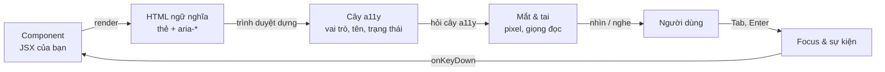

**Đọc sơ đồ:** Đọc từ ‘Component’ (trái trên) theo chiều kim đồng hồ: JSX thành HTML, trình duyệt dựng cây accessibility, người dùng nhìn pixel hoặc nghe giọng đọc, rồi đáp lại bằng phím; sự kiện quay về component. *Màu: viền terracotta dày = phần của bài này · be = phần còn lại của vòng.*


| Bài | Học gì | Mảnh nào của vòng |
|---|---|---|
| 1 | HTML ngữ nghĩa, landmark, heading, link vs button | Component → HTML → cây a11y |
| 2 | Tên, label, `aria-*`, vùng thông báo | Cây a11y → thứ được đọc to |
| 3 | Bàn phím & quản lý focus | Người dùng → focus → component |
| 4 | Tương phản màu & mọi kích thước màn hình | Pixel → mắt |
| Lab | Toàn bộ UI tĩnh + đo bằng Lighthouse, axe, bàn phím | Cả vòng |

### Chuẩn bị

Tiếp tục trong monorepo `nexus/` của S1.4. Thêm một component shadcn và hai công cụ đo (cài ở thư mục riêng, không dính vào app):

```bash title="terminal"
cd nexus/apps/ui
npx shadcn@latest add table          # máy soạn bài bị chặn registry → chép từ GitHub shadcn-ui/ui như S1.3
mkdir -p ~/a11y-tools && cd ~/a11y-tools
npm init -y && npm i lighthouse axe-core
```

Phiên bản thật lúc mình dựng: Lighthouse **13.5.0**, axe-core **4.13.0**, Chromium của Playwright. Mọi con số trong bài đo trên bản build (`pnpm --filter @nexus/ui build` rồi `vite preview`).

## Bài 1 — HTML ngữ nghĩa: đúng thẻ cho đúng việc

**Nó là gì (1 câu):** HTML ngữ nghĩa (semantic HTML — dùng thẻ nói lên *vai trò* của nội dung) giống **biển chỉ dẫn trong quán**: “Quầy order”, “Nhà vệ sinh”, “Lối ra” — người không nhìn được cả phòng vẫn tìm được đường nếu biển ghi đúng.

**Sơ đồ tổng** — bài này nằm ở đoạn *Component → HTML → cây a11y*:

**Sơ đồ (Luồng dữ liệu) — Giao diện đi tới mọi người dùng qua những chặng nào?**

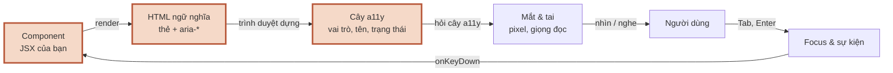

**Đọc sơ đồ:** Giao diện đi tới MỌI người dùng; phần viền terracotta là đoạn bài này đào sâu — Bài 1: HTML ngữ nghĩa → cây accessibility. *Màu: viền terracotta dày = phần của bài này · be = phần còn lại của vòng.*


### 1.1 Landmark và heading: bản đồ của trang

**Ẩn dụ:** landmark (vùng mốc) là **các khu trong quán** (quầy, khu ngồi, lối ra); heading là **biển tên từng khu**. Trình đọc màn hình có phím tắt để nhảy thẳng giữa các khu và giữa các biển.

**Sơ đồ:**

**Sơ đồ (Bản đồ dịch vụ) — Một trang Nexus chia thành những vùng (landmark) nào?**

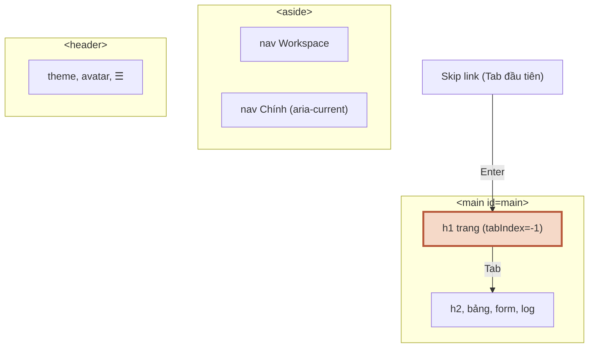

**Đọc sơ đồ:** Mỗi khung nét đứt là một landmark mà trình đọc màn hình liệt kê được. Skip link (trên cùng) cho người dùng bàn phím nhảy thẳng vào <main>, bỏ qua sidebar và header. *Màu: vùng nét đứt = landmark · viền terracotta = nơi focus tới sau khi dùng skip link hoặc đổi trang.*


**Chi tiết kỹ thuật:**

| Thẻ | Landmark (vai trò) | Trong Nexus |
|---|---|---|
| `<header>` (con trực tiếp của trang) | banner | Thanh trên: workspace, theme, avatar |
| `<nav aria-label="…">` | navigation | Hai cái: “Workspace” và “Chính” — **phải có tên** để phân biệt |
| `<main id="main">` | main | Nội dung trang, đúng **một** cái |
| `<aside aria-label="Thanh bên">` | complementary | Sidebar desktop |
| `<section aria-labelledby="…">` | region | Mỗi khối lớn của dashboard |

- **Mỗi trang đúng một `<h1>`**, rồi `h2` → `h3` không nhảy cóc. Dashboard có `h2` “Số liệu nhanh” dạng `sr-only` (chỉ trình đọc màn hình thấy) để cây heading đủ bậc mà không thêm chữ thừa lên màn hình.
- **Skip link** (link “Bỏ qua tới nội dung chính”) là phần tử đầu tiên: ẩn đi, hiện ra khi được Tab tới, Enter thì nhảy vào `<main>`.
- Bảng dữ liệu dùng `<table>` với `<th scope="col">` và `<caption>`: trình đọc màn hình đọc “Doanh thu, cột 4, 182.400.000 ₫” thay vì một dãy số trơ trọi.

> **Bẫy riêng của app dùng hash router:** skip link kiểu cổ điển `<a href="#main">` để trình duyệt tự nhảy — nhưng Nexus dùng `#/…` để định tuyến, nên `#main` là một “trang” không tồn tại. Kết quả thật khi mình thử đặt hash thành `#main`:

```console title="output"
$ python3 naive_skip.py   # nếu skip link để trình duyệt tự nhảy tới #main
URL: #main | h1: Không tìm thấy trang
```

Sửa: chặn hành vi mặc định và tự `focus()` vào `<main tabIndex={-1}>`:

```tsx title="apps/ui/src/components/a11y/skip-link.tsx"
import type { MouseEvent } from 'react'

/**
 * Link “bỏ qua” — phần tử đầu tiên người dùng bàn phím gặp.
 * KHÔNG để trình duyệt tự nhảy tới #main: app dùng hash để định tuyến,
 * đổi hash thành #main sẽ đưa người dùng tới trang “Không tìm thấy”.
 */
export function SkipLink() {
  function handleClick(e: MouseEvent<HTMLAnchorElement>) {
    e.preventDefault()
    document.getElementById('main')?.focus()
  }

  return (
    <a
      href="#main"
      onClick={handleClick}
      className="sr-only rounded-md bg-primary px-4 py-2 text-sm font-medium text-primary-foreground focus:not-sr-only focus:fixed focus:top-3 focus:left-3 focus:z-50 focus-visible:ring-[3px] focus-visible:ring-ring/50 focus-visible:outline-none"
    >
      Bỏ qua tới nội dung chính
    </a>
  )
}
```

### 1.2 Link hay button?

**Ẩn dụ:** **biển chỉ đường** (đi tới chỗ khác) khác **chuông gọi phục vụ** (làm một việc tại chỗ). Sơn chuông cho giống biển thì khách vẫn biết đâu là chuông — nhưng người không nhìn được thì không.

**Sơ đồ:**

**Sơ đồ (Luồng quyết định) — Phần tử này nên là thẻ gì?**

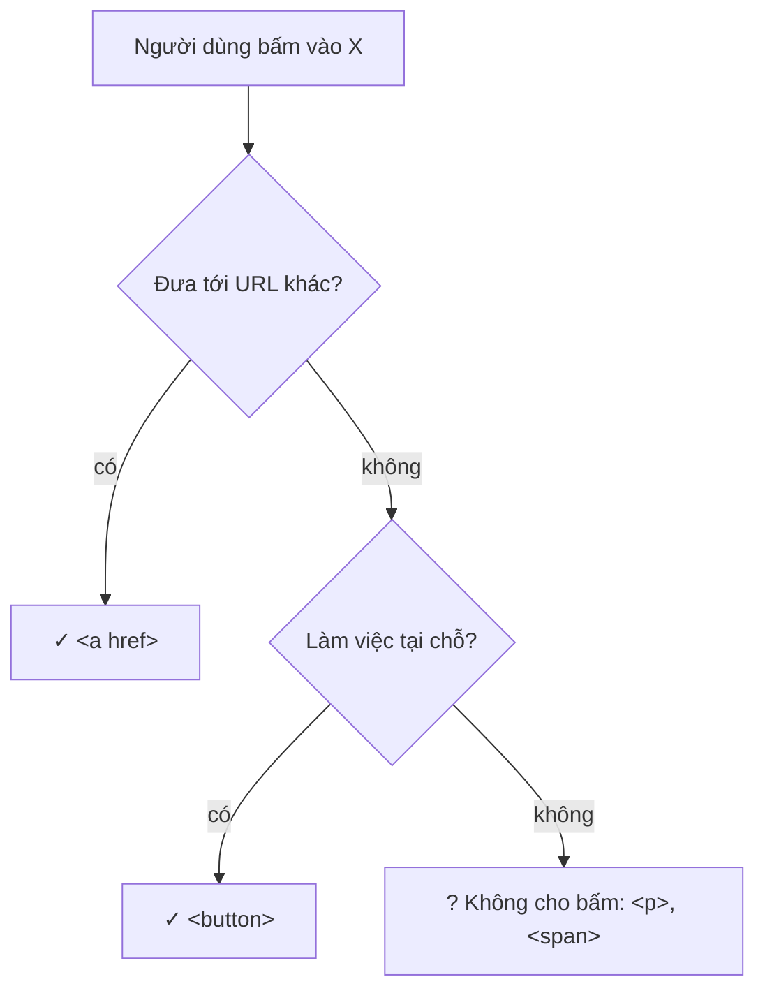

**Đọc sơ đồ:** Đọc từ trên xuống cho thứ người dùng bấm vào được. Câu 1: nó đưa sang trang khác? Câu 2: nó làm một việc tại chỗ? Không phải cả hai thì nó không nên bấm được. *Màu: xanh ô-liu + ✓ = thẻ có sẵn hành vi bàn phím · vàng mù tạt + ? = nội dung tĩnh, đừng gắn onClick.*


**Tự thấy bằng tay** — bấm vào vùng trắng rồi nhấn Tab, Shift+Tab, Enter, Space. Để ý thứ bàn phím **không bao giờ tới được**:

> *(Bản HTML có demo bấm được ở đây: một `<button>`, một `<div onClick>`, một link và một ô nhập. Nhấn Tab để thấy `<div>` không bao giờ nhận focus.)*

**Chi tiết kỹ thuật:**

- `<button>` có sẵn: vào vòng Tab, Enter **và** Space kích hoạt, trình đọc màn hình đọc “nút”. `<div onClick>` không có gì trong số đó — phải tự thêm `tabIndex`, `role`, `onKeyDown`… và vẫn dễ sót.
- `<a href>` có sẵn: Enter kích hoạt, chuột giữa mở tab mới, trình đọc màn hình đọc “link”. Nút “Tạo workspace” trên trang danh sách **trông như nút** nhưng đi sang trang khác, nên là link: `<Button asChild><a href={href.newWorkspace}>…</a></Button>` (`asChild` của S1.3: mặc style nút lên thẻ `<a>`).
- **Stretched link** (link “kéo giãn”) cho thẻ bấm được cả khối: một `<a>` thật trong tiêu đề, cộng `after:absolute after:inset-0` phủ cả thẻ. Người nhìn bấm đâu cũng được; trình đọc màn hình nghe **một** link có tên rõ ràng, thay vì cả khối chữ.

```tsx title="apps/ui/src/features/workspace/workspace-list-page.tsx"
import { Plus } from 'lucide-react'
import { PageTitle } from '@/components/a11y/page-title'
import { SkipLink } from '@/components/a11y/skip-link'
import { PublicHeader } from '@/components/layout/public-header'
import { Avatar, AvatarFallback } from '@/components/ui/avatar'
import { Button } from '@/components/ui/button'
import { Card, CardDescription, CardHeader, CardTitle } from '@/components/ui/card'
import type { Workspace } from '@/data/nav'
import { href } from '@/lib/router'

type Props = { workspaces: Workspace[]; userInitials: string }

export function WorkspaceListPage({ workspaces, userInitials }: Props) {
  return (
    <div className="flex min-h-svh flex-col">
      <SkipLink />
      <PublicHeader>
        <Avatar className="size-8">
          <AvatarFallback>{userInitials}</AvatarFallback>
        </Avatar>
      </PublicHeader>
      <main id="main" tabIndex={-1} className="mx-auto w-full max-w-4xl flex-1 space-y-6 p-4 outline-none md:p-8">
        <div className="flex flex-wrap items-end justify-between gap-4">
          <div className="space-y-1">
            <PageTitle>Chọn workspace</PageTitle>
            <p className="text-sm text-muted-foreground">Mỗi workspace có dữ liệu và thành viên riêng.</p>
          </div>
          {/* Điều hướng sang trang khác → là LINK, dù trông như nút */}
          <Button asChild>
            <a href={href.newWorkspace}>
              <Plus aria-hidden="true" /> Tạo workspace
            </a>
          </Button>
        </div>

        <ul className="grid gap-4 sm:grid-cols-2" aria-label="Danh sách workspace">
          {workspaces.map((ws) => (
            <li key={ws.id}>
              {/* “Stretched link”: cả thẻ bấm được, nhưng trình đọc màn hình chỉ nghe MỘT link có tên rõ ràng */}
              <Card className="relative gap-3 py-5 transition-colors focus-within:ring-[3px] focus-within:ring-ring/50 hover:bg-accent/50">
                <CardHeader className="flex flex-row items-center gap-3 px-5">
                  <span
                    aria-hidden="true"
                    className="grid size-10 shrink-0 place-items-center rounded-md bg-primary text-sm font-semibold text-primary-foreground"
                  >
                    {ws.initials}
                  </span>
                  <div className="min-w-0 space-y-1">
                    <CardTitle className="text-base">
                      <a
                        href={href.page(ws.id, 'chat')}
                        className="outline-none after:absolute after:inset-0 after:rounded-xl after:content-['']"
                      >
                        {ws.name}
                      </a>
                    </CardTitle>
                    <CardDescription>nexus.app/{ws.id}</CardDescription>
                  </div>
                </CardHeader>
              </Card>
            </li>
          ))}
        </ul>
      </main>
    </div>
  )
}
```

### Nhìn lại bức tranh lớn

**Sơ đồ (Luồng dữ liệu) — Giao diện đi tới mọi người dùng qua những chặng nào?**


**Đọc sơ đồ:** Cùng vòng như đầu bài; phần viền terracotta là thứ bạn vừa học — Bài 1: HTML ngữ nghĩa → cây accessibility. *Màu: viền terracotta dày = phần của bài này · be = phần còn lại của vòng.*


Bạn vừa làm phần **nền móng**: đúng thẻ → trình duyệt tự dựng cây accessibility có vùng, tiêu đề, link, nút. Nhưng mỗi phần tử trong cây còn cần một **cái tên** — và giao diện động (chat đang chạy tool) cần biết **báo tin** thế nào. Bài 2.

### Tự vẽ lại

1. Kể 4 landmark của một trang trong workspace và vì sao hai `<nav>` phải có `aria-label`.
2. “Tạo workspace” là link hay nút? “Gửi” là link hay nút? Dựa vào câu hỏi nào?
3. Vì sao skip link `href="#main"` làm hỏng Nexus, và sửa thế nào?

## Bài 2 — Tên, label và aria-*: trình đọc màn hình nghe được gì

**Nó là gì (1 câu):** mỗi thứ bấm được cần một **bảng tên** như ly của khách ghi tên trên cốc — barista gọi “Latte của Anh” chứ không gọi “cái ly thứ ba”.

**Sơ đồ tổng** — bài này nằm ở đoạn *Cây a11y → Mắt & tai*:

**Sơ đồ (Luồng dữ liệu) — Giao diện đi tới mọi người dùng qua những chặng nào?**

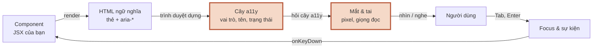

**Đọc sơ đồ:** Giao diện đi tới MỌI người dùng; phần viền terracotta là đoạn bài này đào sâu — Bài 2: tên, label, aria-* → thứ được đọc to. *Màu: viền terracotta dày = phần của bài này · be = phần còn lại của vòng.*


### 2.1 Tên (accessible name) đến từ đâu

**Ẩn dụ:** barista tìm tên theo thứ tự: **giấy dán đè** lên cốc (aria-labelledby, aria-label) → **tên viết trên cốc** (label, chữ bên trong) → **ghi chú mờ dưới đáy** (title). Không có gì cả thì chỉ gọi được “cái ly”.

**Sơ đồ:**

**Sơ đồ (Luồng dữ liệu) — Trình đọc màn hình lấy TÊN của một phần tử từ đâu?**

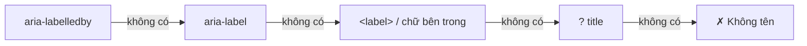

**Đọc sơ đồ:** Đọc từ trái: trình duyệt thử từng nguồn theo thứ tự ưu tiên, gặp nguồn nào có chữ thì dừng. Hết nguồn mà vẫn trống → phần tử KHÔNG có tên (ô đỏ). *Màu: đỏ gạch + ✗ + viền đứt = bị chặn/sai · vàng mù tạt + ? + viền chấm = cần xem lại · xanh ô-liu + ✓ = chạy đúng. Nhãn mũi tên = ‘không có’ → thử nguồn kế.*


**Chi tiết kỹ thuật:**

| Phần tử trong Nexus | Tên lấy từ | Trình đọc màn hình nói |
|---|---|---|
| Nút ☰ (chỉ có icon) | `aria-label="Mở menu điều hướng"` | “Mở menu điều hướng, nút” |
| Ô hỏi Nexus | `<label htmlFor="chat-input" className="sr-only">` | “Câu hỏi cho Nexus, vùng soạn thảo” |
| Nút Gửi / Dừng | chữ bên trong | “Gửi, nút” / “Dừng, nút” |
| Biểu đồ doanh thu | `<svg role="img" aria-labelledby="…">` → `<title>` + `<desc>` | “Doanh thu theo tháng… Tăng từ 412 triệu ở T4 lên 569 triệu ở T9” |
| Khung bảng cuộn ngang | `role="region" aria-label="…"` | “Bảng khách hàng lớn nhất (cuộn ngang được), vùng” |

- **Icon đi kèm chữ thì ẩn icon** (`aria-hidden="true"`), kẻo đọc hai lần. Icon đứng một mình thì nút cần `aria-label`.
- `sr-only` = ẩn khỏi mắt nhưng vẫn nằm trong cây accessibility. Khác với `hidden` / `display:none` — ẩn khỏi **cả hai**.
- **Luật số 1 của ARIA:** có thẻ HTML làm được thì dùng thẻ, đừng dùng `role`. `aria-*` chỉ **mô tả**, không **tạo hành vi**: `role="button"` trên `<div>` không làm nó bấm được bằng phím.

### 2.2 Trạng thái: aria-current, aria-invalid, aria-busy, aria-disabled

**Ẩn dụ:** ngoài tên, cốc còn có **nhãn trạng thái**: “đang pha”, “xong”, “hết món”.

**Chi tiết kỹ thuật** — các trạng thái Nexus dùng:

| Thuộc tính | Ở đâu | Nghĩa |
|---|---|---|
| `aria-current="page"` | link trang đang mở ở sidebar | “trang hiện tại” |
| `aria-invalid` + `aria-describedby` | ô form có lỗi (S1.4) | “không hợp lệ” + đọc câu lỗi |
| `aria-busy` | vùng log khi đang stream, thẻ tool đang chạy | “đang cập nhật, chờ xong hãy đọc” |
| `aria-disabled` | nút Gửi khi ô trống | “không khả dụng” nhưng **vẫn Tab tới được** |
| `aria-keyshortcuts="Escape"` | nút Dừng | báo có phím tắt |

**Vì sao `aria-disabled` thay cho `disabled` ở nút Gửi?** Nút `disabled` bị gỡ khỏi vòng Tab — người dùng bàn phím không biết nút tồn tại. Nút `aria-disabled` vẫn tới được, nghe “Gửi, không khả dụng”, và `handleSubmit` tự bỏ qua khi ô trống.

### 2.3 Báo tin khi giao diện đổi mà focus đứng yên

**Ẩn dụ:** loa của quán có hai kiểu: **chuông báo cháy** (ngắt mọi thứ — chỉ dùng khi phải xử lý ngay) và **loa gọi số** (đợi bài nhạc hết mới gọi).

**Sơ đồ:** chọn loại loa:

**Sơ đồ (Luồng quyết định) — Trạng thái vừa đổi — báo cho trình đọc màn hình bằng cách nào?**

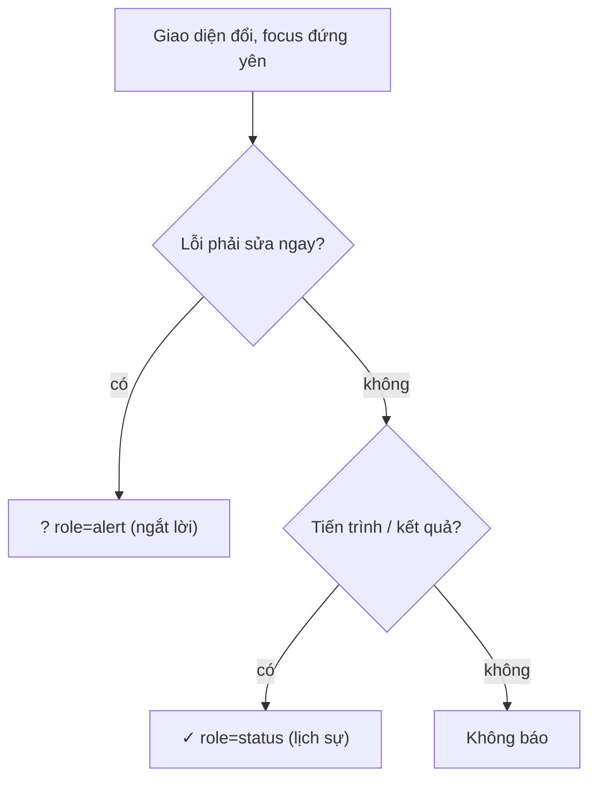

**Đọc sơ đồ:** Đọc từ trên xuống mỗi khi giao diện đổi mà focus không đổi. Chỉ lỗi cần sửa ngay mới được ngắt lời; tiến trình thì báo lịch sự; còn lại để người dùng tự đọc. *Màu: vàng mù tạt = ngắt lời (dùng dè sẻn) · xanh ô-liu = lịch sự · be = không cần báo.*


**Sơ đồ:** và đây là thứ trình đọc màn hình thật sự nghe trong một lượt hỏi đáp:

**Sơ đồ (Trình tự) — Gửi một câu hỏi — trình đọc màn hình nghe gì, lúc nào?**

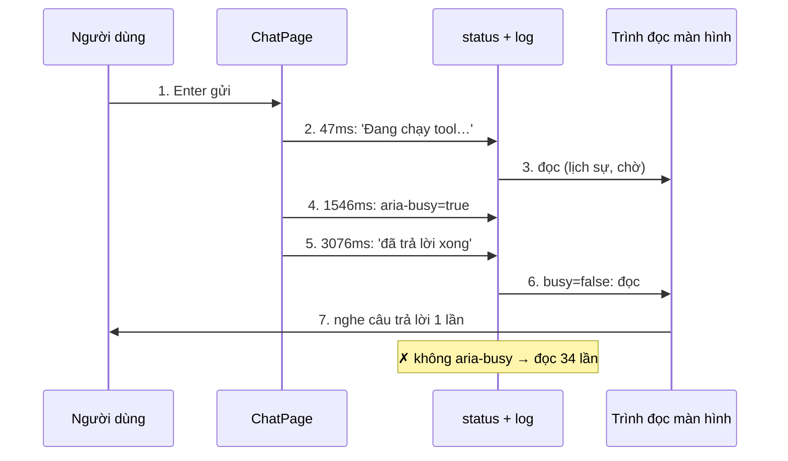

**Đọc sơ đồ:** Bốn cột, đọc ①→⑦. Mốc thời gian là số đo thật. Vùng role=status chỉ đổi 3 lần; câu trả lời 34 chữ được đọc MỘT lần khi aria-busy tắt. Ô đỏ: nếu để log tự đọc từng chữ. *Màu: đỏ gạch + ✗ + viền đứt = bị chặn/sai · vàng mù tạt + ? + viền chấm = cần xem lại · xanh ô-liu + ✓ = chạy đúng.*


**Chi tiết kỹ thuật** — mình gắn bộ theo dõi (MutationObserver — thứ báo mỗi khi DOM đổi) vào vùng `role="status"` và thuộc tính `aria-busy` của log, rồi gửi một câu hỏi thật. Kết quả thật:

```console title="output"
$ python3 announce.py
   47 ms  status         → 'Đang chạy tool: Tính doanh thu theo tháng'
 1546 ms  status         → 'Nexus đang trả lời'
 1546 ms  log aria-busy  → 'true'
 3076 ms  status         → 'Nexus đã trả lời xong'
 3076 ms  log aria-busy  → 'false'
Câu trả lời dài 34 chữ, nhưng vùng status chỉ đổi 3 lần.
```

Câu thông báo là **derived state** (S1.1 bài 5) — tính từ `status` và tin nhắn cuối, không lưu riêng:

```tsx title="apps/ui/src/features/chat/chat-page.tsx"
import { PageTitle } from '@/components/a11y/page-title'
import type { Workspace } from '@/data/nav'
import { Composer } from './composer'
import { MessageList } from './message-list'
import { useFakeAgent } from './use-fake-agent'

export function ChatPage({ workspace }: { workspace: Workspace }) {
  const { messages, status, send, stop } = useFakeAgent()
  const running = status !== 'idle'

  // Derived: câu thông báo cho trình đọc màn hình, tính từ state có sẵn
  const last = messages[messages.length - 1]
  const announcement =
    status === 'tool'
      ? `Đang chạy tool: ${last.tool?.label}`
      : status === 'streaming'
        ? 'Nexus đang trả lời'
        : last.role === 'assistant' && last.stopped
          ? 'Đã dừng'
          : last.role === 'assistant'
            ? 'Nexus đã trả lời xong'
            : ''

  return (
    <div className="flex min-h-0 flex-1 flex-col gap-4">
      <div className="space-y-1">
        <PageTitle>Chat</PageTitle>
        <p className="text-sm text-muted-foreground">Hỏi Nexus về dữ liệu của {workspace.name}.</p>
      </div>

      <MessageList messages={messages} busy={status === 'streaming'} />

      {/* Vùng trạng thái: trình đọc màn hình đọc khi chữ đổi, không cướp focus */}
      <p role="status" className="sr-only">
        {announcement}
      </p>

      <Composer running={running} onSend={send} onStop={stop} />
    </div>
  )
}
```

- **Vùng live phải có mặt trong DOM từ trước** khi chữ đổi — thêm một `<p role="status">` mới cùng lúc với chữ thì nhiều trình đọc màn hình không đọc. Vì vậy `<p role="status">` luôn render, chỉ nội dung đổi.
- `role="alert"` ngắt lời ngay — chỉ cho lỗi (FieldError của S1.4 đã dùng). `role="status"` lịch sự — cho tiến trình.
- `aria-busy` được các trình đọc màn hình hỗ trợ **không đều nhau**; Nexus không dựa hoàn toàn vào nó: câu tóm tắt ở vùng status vẫn báo “đã trả lời xong”. Ở M13 bạn nên thử thật với NVDA/VoiceOver.

### Nhìn lại bức tranh lớn

**Sơ đồ (Luồng dữ liệu) — Giao diện đi tới mọi người dùng qua những chặng nào?**


**Đọc sơ đồ:** Cùng vòng như đầu bài; phần viền terracotta là thứ bạn vừa học — Bài 2: tên, label, aria-* → thứ được đọc to. *Màu: viền terracotta dày = phần của bài này · be = phần còn lại của vòng.*


Giờ mọi thứ trong cây accessibility có **tên**, có **trạng thái**, và giao diện động biết **báo tin vừa đủ**. Nhưng người dùng bàn phím còn cần một thứ nữa: biết mình **đang đứng ở đâu**, và không bao giờ bị **lạc**. Bài 3.

### Tự vẽ lại

1. Kể 4 nguồn tên theo thứ tự ưu tiên. Nút ☰ lấy tên từ nguồn nào?
2. Vì sao câu trả lời 34 chữ không bị đọc 34 lần?
3. `disabled` và `aria-disabled` khác nhau thế nào với người dùng bàn phím?

## Bài 3 — Bàn phím và focus

**Nó là gì (1 câu):** focus là **ngón tay chỉ vào món trên thực đơn** của người không dùng chuột: Tab dời ngón tay tới món kế, Enter là “lấy món này” — và ngón tay phải luôn **nhìn thấy được** và **không bao giờ rời khỏi thực đơn**.

**Sơ đồ tổng** — bài này nằm ở đoạn *Người dùng → Focus → Component*:

**Sơ đồ (Luồng dữ liệu) — Giao diện đi tới mọi người dùng qua những chặng nào?**

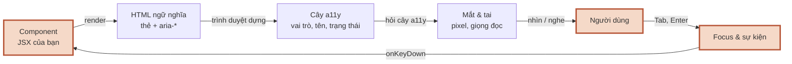

**Đọc sơ đồ:** Giao diện đi tới MỌI người dùng; phần viền terracotta là đoạn bài này đào sâu — Bài 3: bàn phím & focus. *Màu: viền terracotta dày = phần của bài này · be = phần còn lại của vòng.*


### 3.1 Bộ phím chuẩn và vòng focus nhìn thấy được

**Ẩn dụ:** ngón tay chỉ món mà trong suốt thì chẳng ai biết đang chỉ món nào.

**Chi tiết kỹ thuật** — phím người dùng mong đợi:

| Phím | Ở đâu | Làm gì |
|---|---|---|
| Tab / Shift+Tab | mọi nơi | tới / lùi phần tử tương tác kế tiếp |
| Enter | link, nút, form | kích hoạt / gửi |
| Space | nút, checkbox | kích hoạt / đánh dấu |
| ↑ ↓ ← → | radio, menu, tab | di chuyển **trong** một nhóm (roving focus — chỉ một phần tử của nhóm nằm trong vòng Tab) |
| Esc | dialog, menu, chat đang chạy | đóng / dừng |

- **Không bao giờ `outline: none` mà không thay bằng thứ khác.** shadcn dùng `outline-none focus-visible:ring-[3px] focus-visible:ring-ring/50`: bỏ viền mặc định nhưng vẽ vòng (ring) riêng.
- `:focus-visible` chỉ bật khi trình duyệt đoán người dùng đang dùng **bàn phím** — bấm chuột thì không hiện vòng, đỡ rối mắt.
- Link tự viết trong sidebar cũng phải có vòng: Lab gom vào một hằng `itemClass` có `focus-visible:ring-[3px]`.
- **Thứ tự Tab = thứ tự trong DOM.** Đừng dùng `tabIndex` dương (1, 2, 3…) để sắp lại; sắp lại DOM. Chỉ dùng `tabIndex={0}` (thêm vào vòng Tab, ví dụ vùng cuộn) và `tabIndex={-1}` (focus được bằng code, không nằm trong vòng Tab — ví dụ `<h1>`, `<main>`).

### 3.2 Quản lý focus: không để người dùng bị lạc

**Ẩn dụ:** khi phục vụ **dọn bàn** (gỡ một phần tử) hoặc **chuyển khách sang phòng khác** (đổi trang), họ phải **dẫn khách tới chỗ mới** — không bỏ khách đứng giữa lối đi (`<body>`).

**Sơ đồ:** quyết định focus đi đâu:

**Sơ đồ (Luồng quyết định) — Sau một hành động, focus nên ở đâu?**

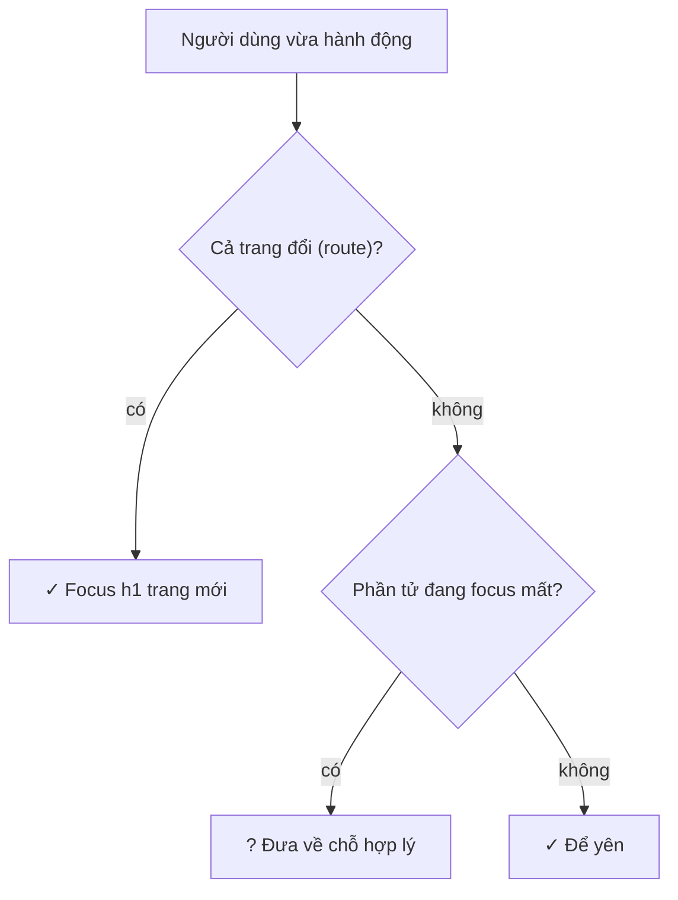

**Đọc sơ đồ:** Đọc từ trên xuống sau mỗi hành động của người dùng bàn phím. Quy tắc gốc: focus không bao giờ được ‘rơi’ vào <body>. *Màu: xanh ô-liu = đúng mặc định · vàng mù tạt = phải tự viết code đặt focus.*


**Sơ đồ:** đổi trang bằng bàn phím:

**Sơ đồ (Trình tự) — Đổi trang bằng bàn phím — focus đi đâu?**

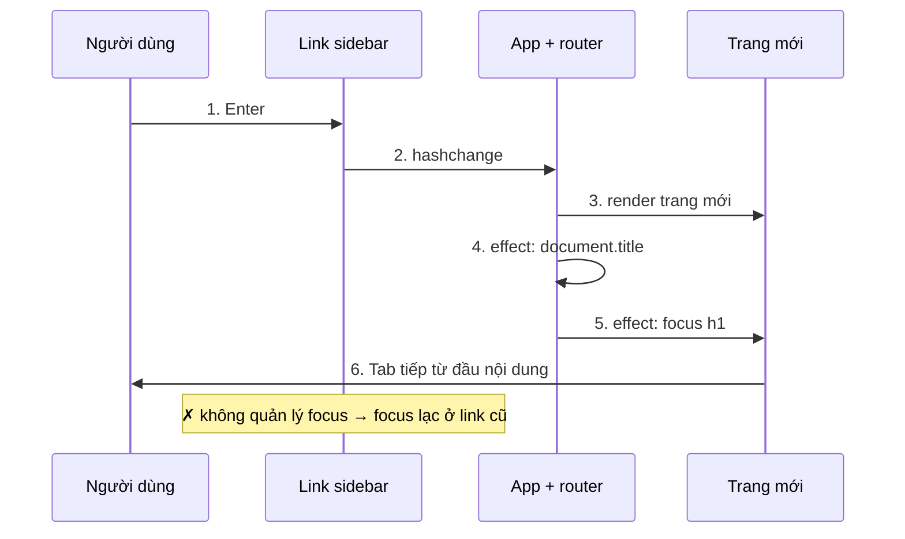

**Đọc sơ đồ:** Bốn cột, đọc ①→⑥. Router chỉ đổi URL; chính useRouteFocus đưa focus tới h1 của trang mới. Ô đỏ: không ai quản lý focus. *Màu: đỏ gạch + ✗ + viền đứt = bị chặn/sai · vàng mù tạt + ? + viền chấm = cần xem lại · xanh ô-liu + ✓ = chạy đúng.*


**Chi tiết kỹ thuật:**

```ts title="apps/ui/src/hooks/use-route-focus.ts"
import { useEffect, useRef } from 'react'

/**
 * Sau mỗi lần đổi trang (không phải lần tải đầu):
 *  - đặt document.title → trình đọc màn hình và tab trình duyệt biết đang ở đâu
 *  - chuyển focus vào <h1 id="page-title"> → người dùng bàn phím bắt đầu từ đầu nội dung mới
 * Cả hai chạm vào DOM ngoài cây React → effect.
 */
export function useRouteFocus(routeKey: string, title: string) {
  const prevKey = useRef(routeKey)

  useEffect(() => {
    document.title = `${title} · Nexus`
  }, [title])

  useEffect(() => {
    if (prevKey.current === routeKey) return // lần đầu (và lần chạy lại của StrictMode): không cướp focus
    prevKey.current = routeKey
    document.getElementById('page-title')?.focus()
  }, [routeKey])
}
```

- `document.title` và `focus()` đều chạm vào DOM ngoài cây React → **effect** (S1.2). Router đọc URL — một hệ thống ngoài — bằng `useSyncExternalStore`:

```ts title="apps/ui/src/lib/router.ts"
import { useSyncExternalStore } from 'react'

/**
 * Router “tạm” bằng hash (#/…) cho giao diện tĩnh — M9 thay bằng App Router của Next.js.
 * Mỗi màn hình có URL riêng → Back/Forward chạy, và Lighthouse đo được từng trang.
 */
export type PageId = 'chat' | 'dashboard' | 'customers' | 'docs' | 'settings'
export const PAGE_IDS: PageId[] = ['chat', 'dashboard', 'customers', 'docs', 'settings']

export type Route =
  | { name: 'login' }
  | { name: 'register' }
  | { name: 'workspaces' }
  | { name: 'new-workspace' }
  | { name: 'app'; ws: string; page: PageId }
  | { name: 'not-found' }

export const href = {
  login: '#/login',
  register: '#/register',
  workspaces: '#/workspaces',
  newWorkspace: '#/workspaces/new',
  page: (ws: string, page: PageId) => `#/w/${ws}/${page}`,
}

export function parseRoute(hash: string): Route {
  const parts = (hash.replace(/^#/, '') || '/login').split('/').filter(Boolean)
  const [a, b, c] = parts
  if (parts.length === 1 && a === 'login') return { name: 'login' }
  if (parts.length === 1 && a === 'register') return { name: 'register' }
  if (parts.length === 1 && a === 'workspaces') return { name: 'workspaces' }
  if (parts.length === 2 && a === 'workspaces' && b === 'new') return { name: 'new-workspace' }
  if (parts.length === 3 && a === 'w' && PAGE_IDS.includes(c as PageId)) {
    return { name: 'app', ws: b, page: c as PageId }
  }
  return { name: 'not-found' }
}

export function navigate(to: string) {
  window.location.hash = to
}

// URL là “hệ thống ngoài” → đọc bằng useSyncExternalStore (đăng ký + huỷ đăng ký sự kiện)
function subscribe(onChange: () => void) {
  window.addEventListener('hashchange', onChange)
  return () => window.removeEventListener('hashchange', onChange)
}
const getHash = () => window.location.hash

export function useHash() {
  return useSyncExternalStore(subscribe, getHash)
}
```

- **Một nút đổi vai thay vì hai nút thay phiên.** Nếu render `{running ? <Stop/> : <Send/>}`, nút đang được focus bị **gỡ khỏi DOM** khi đổi → focus rơi về `<body>`. Composer dùng **một** `<Button>` đổi `type`, chữ và `onClick`; khi bấm Dừng thì chủ động `inputRef.current?.focus()`:

```tsx title="apps/ui/src/features/chat/composer.tsx"
import { Send, Square } from 'lucide-react'
import { useRef, useState, type FormEvent, type KeyboardEvent } from 'react'
import { Button } from '@/components/ui/button'
import { Textarea } from '@/components/ui/textarea'

type Props = { running: boolean; onSend: (text: string) => void; onStop: () => void }

export function Composer({ running, onSend, onStop }: Props) {
  const [text, setText] = useState('')
  const inputRef = useRef<HTMLTextAreaElement>(null)
  const canSend = !running && text.trim().length > 0

  function handleSubmit(e: FormEvent<HTMLFormElement>) {
    e.preventDefault()
    if (!canSend) return
    onSend(text.trim())
    setText('')
  }

  function handleKeyDown(e: KeyboardEvent<HTMLTextAreaElement>) {
    // isComposing: đang gõ dấu tiếng Việt bằng bộ gõ (IME) → Enter là để chốt chữ, KHÔNG phải để gửi
    if (e.key === 'Enter' && !e.shiftKey && !e.nativeEvent.isComposing) {
      e.preventDefault()
      e.currentTarget.form?.requestSubmit()
    }
  }

  function handleStop() {
    onStop()
    inputRef.current?.focus() // đưa người dùng bàn phím về đúng chỗ để hỏi tiếp
  }

  return (
    <form
      onSubmit={handleSubmit}
      onKeyDown={(e) => {
        if (e.key === 'Escape' && running) handleStop()
      }}
      className="space-y-2"
    >
      <label htmlFor="chat-input" className="sr-only">
        Câu hỏi cho Nexus
      </label>
      <div className="flex items-end gap-2">
        <Textarea
          id="chat-input"
          ref={inputRef}
          rows={2}
          value={text}
          onChange={(e) => setText(e.target.value)}
          onKeyDown={handleKeyDown}
          placeholder="Hỏi về khách hàng, doanh thu…"
          aria-describedby="chat-hint"
          className="min-h-11 resize-none"
        />
        {/*
          MỘT nút duy nhất đổi vai (Gửi ↔ Dừng) thay vì 2 nút thay phiên:
          phần tử không bị gỡ khỏi DOM → focus không rơi mất.
          aria-disabled thay cho disabled: nút vẫn nằm trong vòng Tab, trình đọc màn hình đọc "không khả dụng".
        */}
        <Button
          type={running ? 'button' : 'submit'}
          onClick={running ? handleStop : undefined}
          variant={running ? 'outline' : 'default'}
          aria-disabled={!running && !canSend}
          aria-keyshortcuts={running ? 'Escape' : undefined}
          className="aria-disabled:cursor-not-allowed aria-disabled:opacity-50"
        >
          {running ? <Square aria-hidden="true" /> : <Send aria-hidden="true" />}
          {running ? 'Dừng' : 'Gửi'}
        </Button>
      </div>
      <p id="chat-hint" className="text-xs text-muted-foreground">
        Enter để gửi · Shift+Enter xuống dòng · Esc để dừng khi Nexus đang chạy
      </p>
    </form>
  )
}
```

- `isComposing`: khi gõ tiếng Việt bằng bộ gõ (IME — Input Method Editor) trên một số hệ điều hành, Enter dùng để **chốt chữ** đang soạn. Không kiểm tra cờ này thì Enter sẽ gửi câu hỏi dở dang.
- **Menu mobile:** Radix tự **khoá focus** trong Sheet khi mở (focus trap) và **trả focus về nút ☰** khi đóng. Nhưng nếu đóng *vì* đã chọn trang khác, focus phải ở `<h1>` trang mới — `onCloseAutoFocus` chặn Radix đúng trường hợp đó:

```tsx title="apps/ui/src/components/layout/mobile-nav.tsx"
import { Menu } from 'lucide-react'
import { useRef, useState, type ComponentProps } from 'react'
import { Button } from '@/components/ui/button'
import { Sheet, SheetContent, SheetTitle, SheetTrigger } from '@/components/ui/sheet'
import { SidebarContent } from './sidebar-content'

type Props = Omit<ComponentProps<typeof SidebarContent>, 'onNavigate'>

/** Chỉ hiện dưới 768px (md:hidden). Chọn mục xong thì tự đóng. */
export function MobileNav(props: Props) {
  const [open, setOpen] = useState(false)
  const navigatedRef = useRef(false) // đóng vì đã chuyển trang? (không cần vẽ → ref)

  return (
    <Sheet open={open} onOpenChange={setOpen}>
      <SheetTrigger asChild>
        <Button variant="ghost" size="icon" className="md:hidden" aria-label="Mở menu điều hướng">
          <Menu aria-hidden="true" />
        </Button>
      </SheetTrigger>
      <SheetContent
        side="left"
        className="w-72 bg-sidebar p-0"
        aria-describedby={undefined}
        // Mặc định Radix trả focus về nút ☰ khi đóng. Nếu đóng VÌ chuyển trang,
        // focus phải ở h1 của trang mới (useRouteFocus lo) → chặn Radix.
        onCloseAutoFocus={(e) => {
          if (navigatedRef.current) e.preventDefault()
          navigatedRef.current = false
        }}
      >
        <SheetTitle className="sr-only">Menu điều hướng</SheetTitle>
        <SidebarContent
          {...props}
          onNavigate={() => {
            navigatedRef.current = true
            setOpen(false)
          }}
        />
      </SheetContent>
    </Sheet>
  )
}
```

### Nhìn lại bức tranh lớn

**Sơ đồ (Luồng dữ liệu) — Giao diện đi tới mọi người dùng qua những chặng nào?**


**Đọc sơ đồ:** Cùng vòng như đầu bài; phần viền terracotta là thứ bạn vừa học — Bài 3: bàn phím & focus. *Màu: viền terracotta dày = phần của bài này · be = phần còn lại của vòng.*


Người dùng bàn phím giờ luôn **thấy** mình đang ở đâu và **không bị lạc** khi trang đổi, khi nút đổi vai, khi menu đóng. Còn lại đường **pixel**: chữ có đủ đậm để đọc không, và trang có vừa màn hình điện thoại không. Bài 4.

### Tự vẽ lại

1. Đổi trang xong, focus nằm ở đâu, do ai đặt, trong hook nào?
2. Vì sao hai nút Gửi/Dừng thay phiên làm mất focus, còn một nút đổi vai thì không?
3. `tabIndex={0}` và `tabIndex={-1}` dùng cho những gì trong Nexus?

## Bài 4 — Tương phản màu và mọi kích thước màn hình

**Nó là gì (1 câu):** tương phản là **chữ trên bảng đen của quán**: phấn trắng trên bảng đen thì đọc từ cửa, phấn xám trên bảng xám thì phải đứng sát mới đọc được — và người mắt kém thì chịu.

**Sơ đồ tổng** — bài này nằm ở đoạn *Pixel → Mắt*:

**Sơ đồ (Luồng dữ liệu) — Giao diện đi tới mọi người dùng qua những chặng nào?**

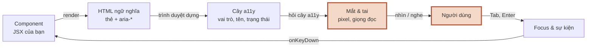

**Đọc sơ đồ:** Giao diện đi tới MỌI người dùng; phần viền terracotta là đoạn bài này đào sâu — Bài 4: tương phản & mọi kích thước màn hình. *Màu: viền terracotta dày = phần của bài này · be = phần còn lại của vòng.*


### 4.1 Tỉ lệ tương phản

**Ẩn dụ:** đo **độ sáng của phấn** so với **độ sáng của bảng**, lấy tỉ số. 21:1 là trắng tinh trên đen tuyền; 1:1 là cùng một màu.

**Sơ đồ:**

**Sơ đồ (Luồng dữ liệu) — Tỉ lệ tương phản được tính ra thế nào?**

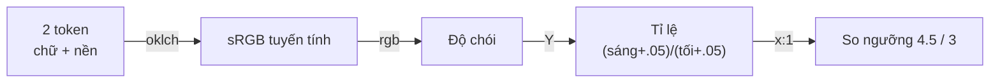

**Đọc sơ đồ:** Đọc từ trái: hai token màu (chữ và nền) đổi sang sRGB, tính độ chói (luminance) của từng màu, chia ra tỉ lệ, rồi so với ngưỡng WCAG. *Màu: đỏ gạch + ✗ + viền đứt = bị chặn/sai · vàng mù tạt + ? + viền chấm = cần xem lại · xanh ô-liu + ✓ = chạy đúng. Nhãn mũi tên = dạng dữ liệu tại bước đó.*


**Sơ đồ:** cần đạt bao nhiêu:

**Sơ đồ (Luồng quyết định) — Chữ (hoặc icon) này cần tương phản bao nhiêu?**

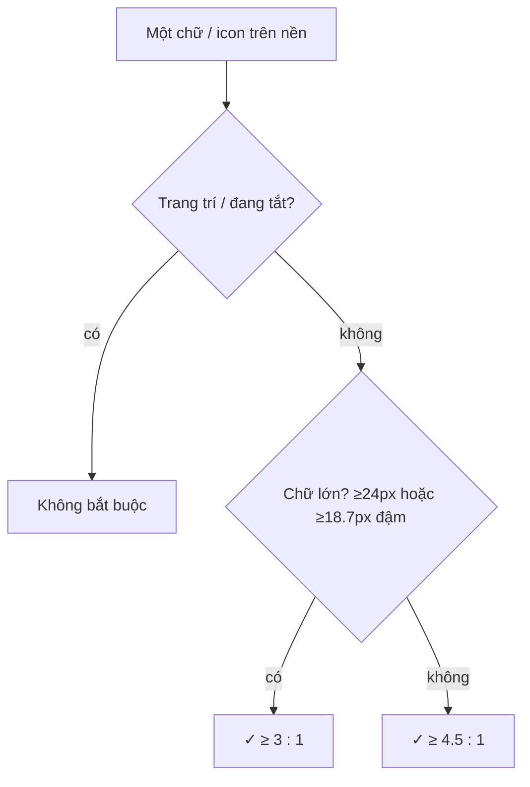

**Đọc sơ đồ:** Đọc từ trên xuống cho mỗi thứ hiện trên màn hình. Ngưỡng WCAG 2 mức AA — thứ Lighthouse đo. *Màu: xanh ô-liu = ngưỡng phải đạt · be = được miễn. Viền ô input và icon mang nghĩa là ‘thành phần không phải chữ’: cần 3:1.*


**Tự thấy bằng tay** — các thẻ dưới đây dùng **đúng token của Nexus**, tính bằng đúng công thức Lighthouse dùng. Kéo thanh trượt ở thẻ cuối để thấy lằn ranh 4.5:1:

> *(Bản HTML có demo tính tương phản trên token thật của Nexus, kèm thanh trượt. Trong MD: chạy `python3 a11y-checks/contrast.py src/index.css`.)*

**Chi tiết kỹ thuật — lỗi thật Lighthouse tìm ra.** Lần đo đầu tiên, 3 trang chỉ đạt 95–96 điểm vì cùng một lỗi:

```console title="output"
$ ./lh_all.sh          # lần đo đầu, lúc đó mới có 4 trang (điểm · audit trượt · số phần tử)
login 100
workspaces 95 color-contrast: 1
w/acme/chat 96 color-contrast: 1
w/acme/dashboard 96 color-contrast: 1

$ node -e "…in audits['color-contrast'].details.items của lh/workspaces.json…"
workspaces | <span data-slot="avatar-fallback" class="flex size-full items-center justify-center rounded-full bg-muted text-sm t…">
  | Fix any of the following:   Element has insufficient color contrast of 4.34 (foreground color: #737373,
    background color: #f5f5f5, font size: 10.5pt (14px), font weight: normal). Expected contrast ratio of 4.5:1
```

Token `--muted-foreground` **gốc của shadcn** đạt trên nền trắng nhưng trượt trên nền `--muted` của chính nó. Mình viết script tính mọi cặp token (cùng công thức, ra đúng 4.34 như Lighthouse):

```console title="output"
$ python3 contrast.py src/index.css        # trước khi sửa (trích chế độ sáng)
--- SÁNG
foreground                   trên background       19.79:1  ✓
muted-foreground             trên background        4.73:1  ✓
muted-foreground             trên muted             4.34:1  ✗
muted-foreground             trên sidebar           4.53:1  ✓
primary-foreground           trên primary           6.76:1  ✓
```

Sửa **một dòng token** (không vá từng component) — chọn 0.53 để còn dư:

```css title="src/index.css (trích :root)"
  --muted-foreground: oklch(0.53 0 0); /* shadcn gốc 0.556 → chỉ 4.34:1 trên --muted; 0.53 → 4.84:1 (WCAG AA) */
```

```console title="output"
$ python3 contrast.py src/index.css        # sau khi sửa
--- SÁNG
foreground                   trên background       19.79:1  ✓
muted-foreground             trên background        5.28:1  ✓
muted-foreground             trên muted             4.84:1  ✓
muted-foreground             trên sidebar           5.06:1  ✓
muted-foreground             trên card              5.28:1  ✓
primary-foreground           trên primary           6.76:1  ✓
sidebar-primary-foreground   trên sidebar-primary   6.76:1  ✓
secondary-foreground         trên secondary        16.42:1  ✓
destructive                  trên background        4.76:1  ✓
--- TỐI
foreground                   trên background       18.96:1  ✓
muted-foreground             trên background        7.63:1  ✓
muted-foreground             trên muted             5.83:1  ✓
muted-foreground             trên sidebar           6.91:1  ✓
muted-foreground             trên card              6.91:1  ✓
primary-foreground           trên primary           8.90:1  ✓
sidebar-primary-foreground   trên sidebar-primary   8.90:1  ✓
secondary-foreground         trên secondary        14.48:1  ✓
destructive                  trên background        6.84:1  ✓
```

- **Màu không được là tín hiệu duy nhất.** Tool call lỗi trên dashboard có chữ “Lỗi” cạnh icon đỏ; thẻ tool trong chat nói bằng chữ “Đang chạy: …” / “Đã xong: …” / “Đã dừng: …”.
- Viền ô input và icon mang nghĩa cần **3:1** với nền (WCAG 1.4.11 — thành phần không phải chữ).

```python title="apps/ui/a11y-checks/contrast.py"
import re, sys
def oklch_to_lin(L,C,H):
    import math
    h=math.radians(H); a=C*math.cos(h); b=C*math.sin(h)
    l_=L+0.3963377774*a+0.2158037573*b; m_=L-0.1055613458*a-0.0638541728*b; s_=L-0.0894841775*a-1.2914855480*b
    l,m,s=l_**3,m_**3,s_**3
    rgb=[4.0767416621*l-3.3077115913*m+0.2309699292*s,-1.2684380046*l+2.6097574011*m-0.3413193965*s,-0.0041960863*l-0.7034186147*m+1.7076147010*s]
    return [min(1,max(0,v)) for v in rgb]
def parse(s):
    m=re.match(r'oklch\(\s*([\d.]+)\s+([\d.]+)\s+([\d.]+)',s); return oklch_to_lin(float(m[1]),float(m[2]),float(m[3]))
lum=lambda c:0.2126*c[0]+0.7152*c[1]+0.0722*c[2]
def ratio(a,b):
    x,y=lum(parse(a)),lum(parse(b)); return (max(x,y)+.05)/(min(x,y)+.05)
def tokens(css, block):
    body=re.search(block+r'\s*\{(.*?)\}', css, re.S)[1]
    return dict(re.findall(r'--([\w-]+):\s*(oklch\([^)]*\))', body))
if __name__=='__main__':
    css=open(sys.argv[1]).read(); L=tokens(css,':root'); D=tokens(css,r'\.dark')
    pairs=[('foreground','background'),('muted-foreground','background'),('muted-foreground','muted'),('muted-foreground','sidebar'),
           ('muted-foreground','card'),('primary-foreground','primary'),('sidebar-primary-foreground','sidebar-primary'),
           ('secondary-foreground','secondary'),('destructive','background')]
    for name,T in (('SÁNG',L),('TỐI',D)):
        print(f'--- {name}')
        for fg,bg in pairs:
            r=ratio(T[fg],T[bg]); print(f'{fg:28} trên {bg:16} {r:5.2f}:1  {"✓" if r>=4.5 else "✗"}')
```

### 4.2 Hiển thị ổn trên điện thoại và desktop

**Ẩn dụ:** một thực đơn in cho **cả bảng treo tường lẫn tờ cầm tay**: nội dung như nhau, chỉ cách xếp đổi.

**Sơ đồ:** lỗi thật mình gặp ở dashboard:

**Sơ đồ (Luồng dữ liệu) — Vì sao một cái bảng làm cả trang tràn ngang ở 360px?**

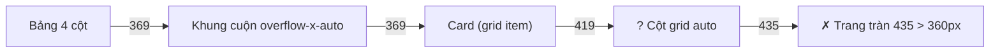

**Đọc sơ đồ:** Đọc từ trái: bề rộng tối thiểu của bảng đẩy ngược lên từng lớp cha. Lớp ‘Cột grid auto’ là chỗ chặn được: grid-cols-1 = minmax(0,1fr) cho cột co lại. *Màu: đỏ gạch + ✗ + viền đứt = bị chặn/sai · vàng mù tạt + ? + viền chấm = cần xem lại · xanh ô-liu + ✓ = chạy đúng. Nhãn mũi tên = bề rộng bị đẩy lên (px, đo thật).*


**Chi tiết kỹ thuật:**

- **`grid` không khai cột = một cột `auto`**, rộng bằng phần tử con rộng nhất. Một bảng 4 cột (369px) đẩy cả trang lên 435px trên màn 360px. `grid-cols-1` = `repeat(1, minmax(0, 1fr))` cho cột co lại; bảng cuộn **bên trong** khung của nó.
- **Sửa xong lỗi này lại lộ ra lỗi kia:** khung vừa cuộn được thì người dùng bàn phím phải tới được để cuộn — axe báo `scrollable-region-focusable`. Vì shadcn là **code của bạn** (S1.3), mình sửa thẳng `table.tsx` thêm prop `scrollLabel`:

```tsx title="apps/ui/src/components/ui/table.tsx"
"use client"

import * as React from "react"
import { cn } from "@/lib/utils"

// Nexus: thêm `scrollLabel`. Bảng rộng hơn màn hình thì khung cuộn ngang phải tới được bằng Tab
// (WCAG 2.1.1 — axe: scrollable-region-focusable) và có tên để trình đọc màn hình đọc.
function Table({
  className,
  scrollLabel,
  ...props
}: React.ComponentProps<"table"> & { scrollLabel?: string }) {
  return (
    <div
      data-slot="table-container"
      className="relative w-full overflow-x-auto rounded-md outline-none focus-visible:ring-[3px] focus-visible:ring-ring/50"
      {...(scrollLabel ? { role: "region", "aria-label": scrollLabel, tabIndex: 0 } : {})}
    >
      <table
        data-slot="table"
        className={cn("w-full caption-bottom text-sm", className)}
        {...props}
      />
    </div>
  )
}

function TableHeader({ className, ...props }: React.ComponentProps<"thead">) {
  return (
    <thead
      data-slot="table-header"
      className={cn("[&_tr]:border-b", className)}
      {...props}
    />
  )
}

function TableBody({ className, ...props }: React.ComponentProps<"tbody">) {
  return (
    <tbody
      data-slot="table-body"
      className={cn("[&_tr:last-child]:border-0", className)}
      {...props}
    />
  )
}

function TableFooter({ className, ...props }: React.ComponentProps<"tfoot">) {
  return (
    <tfoot
      data-slot="table-footer"
      className={cn(
        "border-t bg-muted/50 font-medium [&>tr]:last:border-b-0",
        className
      )}
      {...props}
    />
  )
}

function TableRow({ className, ...props }: React.ComponentProps<"tr">) {
  return (
    <tr
      data-slot="table-row"
      className={cn(
        "border-b transition-colors hover:bg-muted/50 has-aria-expanded:bg-muted/50 data-[state=selected]:bg-muted",
        className
      )}
      {...props}
    />
  )
}

function TableHead({ className, ...props }: React.ComponentProps<"th">) {
  return (
    <th
      data-slot="table-head"
      className={cn(
        "h-10 px-2 text-left align-middle font-medium whitespace-nowrap text-foreground [&:has([role=checkbox])]:pr-0 [&>[role=checkbox]]:translate-y-[2px]",
        className
      )}
      {...props}
    />
  )
}

function TableCell({ className, ...props }: React.ComponentProps<"td">) {
  return (
    <td
      data-slot="table-cell"
      className={cn(
        "p-2 align-middle whitespace-nowrap [&:has([role=checkbox])]:pr-0 [&>[role=checkbox]]:translate-y-[2px]",
        className
      )}
      {...props}
    />
  )
}

function TableCaption({
  className,
  ...props
}: React.ComponentProps<"caption">) {
  return (
    <caption
      data-slot="table-caption"
      className={cn("mt-4 text-sm text-muted-foreground", className)}
      {...props}
    />
  )
}

export {
  Table,
  TableHeader,
  TableBody,
  TableFooter,
  TableHead,
  TableRow,
  TableCell,
  TableCaption,
}
```

- **Lighthouse không thấy lỗi này**: chế độ mobile của nó giả lập màn 412px, vừa đủ chứa bảng. Chỉ kiểm tra ở 360–375px mới lộ. Bài học: đo ở chiều rộng nhỏ nhất bạn hỗ trợ.
- **Chữ trong SVG co theo SVG.** Biểu đồ vẽ trong `viewBox` rộng 480 bị thu còn ≈ 280px trên điện thoại → chữ 12 đơn vị chỉ còn ≈ 7.5px. Thu `viewBox` về 320 và chặn `max-w-md` trên desktop. Đo thật cỡ chữ hiện ra:

```console title="output"
$ python3 chart_text.py
 360px: chữ trong biểu đồ hiện ra ≈ 12.2px
 375px: chữ trong biểu đồ hiện ra ≈ 12.8px
1280px: chữ trong biểu đồ hiện ra ≈ 18.6px
```

- Vùng bấm (target size) ≥ 24×24px (WCAG 2.2 — 2.5.8): nút shadcn cao 36px, link sidebar ≈ 32px.
- Không chặn phóng to: `<meta name="viewport" content="width=device-width, initial-scale=1.0">` — **không** thêm `user-scalable=no`.

### Nhìn lại bức tranh lớn

**Sơ đồ (Luồng dữ liệu) — Giao diện đi tới mọi người dùng qua những chặng nào?**


**Đọc sơ đồ:** Cùng vòng như đầu bài; phần viền terracotta là thứ bạn vừa học — Bài 4: tương phản & mọi kích thước màn hình. *Màu: viền terracotta dày = phần của bài này · be = phần còn lại của vòng.*


Cả vòng đã đủ: đúng thẻ → có tên và trạng thái → báo tin vừa đủ → bàn phím không lạc → chữ đủ đậm, trang vừa mọi màn hình. Vào Lab: dựng nốt các màn hình và **đo** từng AC.

### Tự vẽ lại

1. Tính bằng lời: vì sao `#737373` đạt trên nền trắng mà trượt trên `#f5f5f5`?
2. Kể chuỗi “ai đẩy ai” khiến bảng làm tràn cả trang, và chỗ nào chặn được.
3. Vì sao Lighthouse chấm 100 mà trang vẫn tràn ngang ở 375px?

## Lab — Toàn bộ giao diện tĩnh Nexus

**Mục tiêu:** đăng nhập, danh sách workspace, tạo workspace, chat (tin nhắn, “tool đang chạy”, nút dừng), dashboard, trang tạm và 404 — với dữ liệu giả. Chưa có auth thật và router thật: M9 thay bằng Next.js App Router.

**Sơ đồ (Luồng dữ liệu) — Các màn hình của Nexus nối với nhau thế nào?**

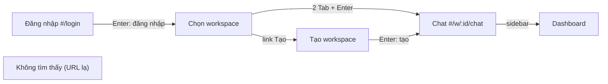

**Đọc sơ đồ:** Mỗi ô là một URL riêng (hash). Mũi tên là thao tác bàn phím thật đã đo trong Lab. Hai trang Chat ↔ Dashboard đi qua sidebar. *Màu: be = màn hình · xanh ô-liu = trong workspace · số Tab là số đo thật ở 1280px.*


```text title="file mới / sửa trong apps/ui/src (so với S1.4)"
lib/router.ts                      hash router: parseRoute, href, useHash (useSyncExternalStore)
hooks/use-route-focus.ts           document.title + focus h1 khi đổi trang
hooks/use-auto-scroll.ts           chép nguyên từ Lab S1.2
components/a11y/skip-link.tsx      link bỏ qua (không đổi hash)
components/a11y/page-title.tsx     <h1 id="page-title" tabIndex={-1}>
components/layout/*                landmark, sidebar thành link, public-header, MobileNav giữ focus đúng
components/ui/table.tsx            + scrollLabel (khung cuộn focus được)
data/fake.ts                       khách hàng, doanh thu, tool call giả
features/auth/login-*.tsx          đăng nhập (loginSchema mới trong packages/shared)
features/workspace/*-page.tsx      danh sách workspace (stretched link), trang tạo workspace
features/chat/*                    agent giả, thẻ tool, log, composer
features/dashboard/*               số liệu, biểu đồ SVG + bảng thay thế, bảng khách hàng
features/misc/*                    trang tạm (Khách hàng, Tài liệu, Cài đặt) và 404
App.tsx                            chọn trang theo URL, state workspaces + userName
index.css                          --muted-foreground: 0.556 → 0.53
```

### Bước 1 — Schema đăng nhập trong `packages/shared`

Thêm vào cuối `auth.ts` (form đăng nhập chỉ kiểm tra hình thức; đúng/sai mật khẩu là việc của server):

```ts title="nexus/packages/shared/src/schemas/auth.ts (thêm)"
export const loginSchema = z.object({
  email: z.string().trim().toLowerCase().pipe(z.email('Email không hợp lệ')),
  password: z.string().min(1, 'Nhập mật khẩu'),
})
export type LoginFormValues = z.input<typeof loginSchema>
export type LoginInput = z.output<typeof loginSchema>
```

`fake-api.ts` thêm `loginUser`: sai mật khẩu trả **một câu chung** “Email hoặc mật khẩu không đúng” — không tiết lộ email có tồn tại hay không (điều M9 sẽ nhắc lại khi làm auth thật).

### Bước 2 — Router, tiêu đề trang và focus

Đã có ở Bài 3 (`router.ts`, `use-route-focus.ts`) và Bài 1 (`skip-link.tsx`). Cộng `PageTitle`:

```tsx title="apps/ui/src/components/a11y/page-title.tsx"
import type { ReactNode } from 'react'
import { cn } from '@/lib/utils'

/** Mỗi trang đúng MỘT h1. tabIndex={-1}: nhận focus bằng code, không nằm trong vòng Tab. */
export function PageTitle({ children, className }: { children: ReactNode; className?: string }) {
  return (
    <h1 id="page-title" tabIndex={-1} className={cn('text-2xl font-semibold tracking-tight outline-none', className)}>
      {children}
    </h1>
  )
}
```

### Bước 3 — Khung trang: landmark và sidebar bằng link

```tsx title="apps/ui/src/components/layout/app-shell.tsx"
import type { ReactNode } from 'react'
import { SkipLink } from '@/components/a11y/skip-link'
import type { Workspace } from '@/data/nav'
import type { PageId } from '@/lib/router'
import { MobileNav } from './mobile-nav'
import { SidebarContent } from './sidebar-content'
import { SiteHeader } from './site-header'

type Props = {
  workspaces: Workspace[]
  workspace: Workspace
  page: PageId
  userInitials: string
  children: ReactNode
}

/**
 * Landmark của một trang trong workspace:
 *   SkipLink → <aside>(<nav>) · <header> · <main id="main">
 * Trình đọc màn hình liệt kê các vùng này để nhảy thẳng tới.
 */
export function AppShell({ workspaces, workspace, page, userInitials, children }: Props) {
  const sidebarProps = { workspaces, workspaceId: workspace.id, page }

  return (
    <div className="min-h-svh md:grid md:grid-cols-[16rem_1fr]">
      <SkipLink />
      <aside
        aria-label="Thanh bên"
        className="sticky top-0 hidden h-svh border-r border-sidebar-border bg-sidebar text-sidebar-foreground md:block"
      >
        <SidebarContent {...sidebarProps} />
      </aside>

      <div className="flex min-w-0 flex-col">
        <SiteHeader
          workspaceName={workspace.name}
          userInitials={userInitials}
          mobileNav={<MobileNav {...sidebarProps} />}
        />
        <main id="main" tabIndex={-1} className="flex min-h-0 flex-1 flex-col p-4 outline-none md:p-6">
          {children}
        </main>
      </div>
    </div>
  )
}
```

```tsx title="apps/ui/src/components/layout/sidebar-content.tsx"
import { LayoutGrid, Plus } from 'lucide-react'
import { Separator } from '@/components/ui/separator'
import { navItems, type Workspace } from '@/data/nav'
import { href, type PageId } from '@/lib/router'
import { cn } from '@/lib/utils'

type Props = {
  workspaces: Workspace[]
  workspaceId: string
  page: PageId
  /** Gọi khi bấm bất kỳ link nào — MobileNav dùng để đóng Sheet */
  onNavigate?: () => void
}

// Link điều hướng: vòng focus rõ ràng, vùng bấm ≥ 32px, chữ đủ tương phản
const itemClass = cn(
  'flex w-full items-center gap-2 rounded-md px-2 py-1.5 text-left text-sm outline-none',
  'hover:bg-sidebar-accent hover:text-sidebar-accent-foreground',
  'focus-visible:ring-[3px] focus-visible:ring-sidebar-ring/60',
)

/** Nội dung sidebar — dùng chung cho sidebar desktop và Sheet trên mobile */
export function SidebarContent({ workspaces, workspaceId, page, onNavigate }: Props) {
  return (
    <div className="flex h-full flex-col gap-4 p-4">
      <p className="px-2 text-lg font-semibold tracking-tight">Nexus</p>

      <nav aria-label="Workspace">
        <h2 className="px-2 pb-1 text-xs font-medium text-muted-foreground">Workspace</h2>
        <ul className="space-y-1">
          {workspaces.map((ws) => {
            const active = ws.id === workspaceId
            return (
              <li key={ws.id}>
                <a
                  href={href.page(ws.id, page)}
                  onClick={onNavigate}
                  aria-current={active ? 'true' : undefined}
                  className={cn(itemClass, active && 'bg-sidebar-accent font-medium text-sidebar-accent-foreground')}
                >
                  <span
                    aria-hidden="true"
                    className="grid size-6 shrink-0 place-items-center rounded bg-sidebar-primary text-[10px] font-semibold text-sidebar-primary-foreground"
                  >
                    {ws.initials}
                  </span>
                  <span className="truncate">{ws.name}</span>
                </a>
              </li>
            )
          })}
          <li>
            <a href={href.newWorkspace} onClick={onNavigate} className={cn(itemClass, 'text-muted-foreground')}>
              <Plus className="size-4" aria-hidden="true" />
              Tạo workspace
            </a>
          </li>
          <li>
            <a href={href.workspaces} onClick={onNavigate} className={cn(itemClass, 'text-muted-foreground')}>
              <LayoutGrid className="size-4" aria-hidden="true" />
              Tất cả workspace
            </a>
          </li>
        </ul>
      </nav>

      <Separator />

      <nav aria-label="Chính">
        <ul className="space-y-1">
          {navItems.map(({ id, label, icon: Icon }) => {
            const active = id === page
            return (
              <li key={id}>
                <a
                  href={href.page(workspaceId, id)}
                  onClick={onNavigate}
                  aria-current={active ? 'page' : undefined}
                  className={cn(
                    itemClass,
                    'text-muted-foreground',
                    active && 'bg-sidebar-accent font-medium text-sidebar-accent-foreground',
                  )}
                >
                  <Icon className="size-4" aria-hidden="true" />
                  {label}
                </a>
              </li>
            )
          })}
        </ul>
      </nav>

      <p className="mt-auto px-2 text-xs text-muted-foreground">Bản giao diện tĩnh · M1</p>
    </div>
  )
}
```

`SiteHeader` không còn chứa `<h1>` (h1 chuyển vào `<main>` của từng trang); `PublicHeader` dùng cho các trang ngoài workspace. Toàn văn ở tab Code.

### Bước 4 — Đăng nhập, danh sách và tạo workspace

```tsx title="apps/ui/src/features/auth/login-page.tsx"
import { PageTitle } from '@/components/a11y/page-title'
import { SkipLink } from '@/components/a11y/skip-link'
import { PublicHeader } from '@/components/layout/public-header'
import { Card, CardContent, CardDescription, CardHeader } from '@/components/ui/card'
import { href } from '@/lib/router'
import { LoginForm } from './login-form'

export function LoginPage({ onLoggedIn }: { onLoggedIn: (name: string) => void }) {
  return (
    <div className="flex min-h-svh flex-col bg-muted/40">
      <SkipLink />
      <PublicHeader />
      <main id="main" tabIndex={-1} className="grid flex-1 place-items-center p-4 outline-none">
        <Card className="w-full max-w-md">
          <CardHeader>
            <PageTitle className="text-xl">Đăng nhập Nexus</PageTitle>
            <CardDescription>Trò chuyện với dữ liệu công ty bạn.</CardDescription>
          </CardHeader>
          <CardContent className="space-y-6">
            <LoginForm onLoggedIn={onLoggedIn} />
            <p className="text-center text-sm text-muted-foreground">
              Chưa có tài khoản?{' '}
              <a href={href.register} className="font-medium text-foreground underline underline-offset-4">
                Tạo tài khoản
              </a>
            </p>
          </CardContent>
        </Card>
      </main>
    </div>
  )
}
```

Danh sách workspace ở Bài 1.2; trang tạo workspace bọc lại `CreateWorkspaceForm` của S1.4 (xem tab Code).

### Bước 5 — Chat: agent giả, thẻ tool, log, composer

Agent giả chạy “tool” 1,5 giây rồi stream câu trả lời. Timer là hệ thống ngoài → nhớ id trong ref, dọn khi rời trang (S1.2):

```ts title="apps/ui/src/features/chat/use-fake-agent.ts"
import { useCallback, useEffect, useRef, useState } from 'react'
import type { AgentStatus, Message, ToolCall } from './types'

/**
 * Agent GIẢ cho giao diện tĩnh: chạy "tool" 1,5 giây rồi stream câu trả lời từng chữ.
 * M2 thay bằng LLM + MCP thật; M11 thêm stream tool call thật. Hình dạng dữ liệu giữ nguyên.
 */
const SCRIPTS: { match: RegExp; tool: Omit<ToolCall, 'status'>; answer: string }[] = [
  {
    match: /doanh thu|revenue/i,
    tool: { name: 'nexus_revenue_by', label: 'Tính doanh thu theo tháng', input: { groupBy: 'month', months: 6 }, output: '6 tháng, tổng 2.902 triệu' },
    answer:
      'Doanh thu 6 tháng gần nhất tăng đều: từ 412 triệu (tháng 4) lên 569 triệu (tháng 9), tức tăng khoảng 38%. Tháng 6 giảm nhẹ so với tháng 5 rồi tăng trở lại.',
  },
  {
    match: /.*/,
    tool: { name: 'nexus_list_customers', label: 'Tra danh sách khách hàng', input: { city: 'Hà Nội', limit: 50 }, output: '42 khách hàng' },
    answer:
      'Hiện có 42 khách hàng ở Hà Nội. Hai khách lớn nhất là Cà phê Phố Cổ (48 đơn) và Mộc Coffee (37 đơn). Bạn muốn xem theo quận hay theo doanh thu?',
  },
]

export const SEED: Message[] = [
  { id: 'm1', role: 'user', text: 'Có bao nhiêu khách hàng ở Đà Nẵng?' },
  {
    id: 'm2',
    role: 'assistant',
    tool: { name: 'nexus_list_customers', label: 'Tra danh sách khách hàng', status: 'done', input: { city: 'Đà Nẵng', limit: 50 }, output: '17 khách hàng' },
    text: 'Có 17 khách hàng ở Đà Nẵng. Lớn nhất là Sông Hàn Roastery với 41 đơn trong 6 tháng qua.',
  },
]

export function useFakeAgent() {
  const [messages, setMessages] = useState<Message[]>(SEED)
  const [status, setStatus] = useState<AgentStatus>('idle')
  // id timer + id tin nhắn đang chạy: cần nhớ, không cần vẽ → ref
  const timers = useRef<number[]>([])
  const currentId = useRef<string | null>(null)

  const clearTimers = useCallback(() => {
    timers.current.forEach((t) => window.clearTimeout(t))
    timers.current = []
  }, [])

  // Rời trang giữa chừng → dọn timer (S1.2: có mở là có tắt)
  useEffect(() => clearTimers, [clearTimers])

  const patch = (id: string, fn: (m: Message) => Message) =>
    setMessages((prev) => prev.map((m) => (m.id === id ? fn(m) : m)))

  const send = useCallback(
    (question: string) => {
      const script = SCRIPTS.find((s) => s.match.test(question))!
      const botId = crypto.randomUUID()
      currentId.current = botId
      setMessages((prev) => [
        ...prev,
        { id: crypto.randomUUID(), role: 'user', text: question },
        { id: botId, role: 'assistant', text: '', tool: { ...script.tool, output: undefined, status: 'running' } },
      ])
      setStatus('tool')

      // 1) tool chạy xong sau 1,5 giây
      timers.current.push(
        window.setTimeout(() => {
          patch(botId, (m) => ({ ...m, tool: { ...m.tool!, status: 'done', output: script.tool.output } }))
          setStatus('streaming')
          // 2) stream câu trả lời, mỗi chữ 45ms
          script.answer.split(' ').forEach((word, i, all) => {
            timers.current.push(
              window.setTimeout(() => {
                patch(botId, (m) => ({ ...m, text: m.text ? `${m.text} ${word}` : word }))
                if (i === all.length - 1) {
                  setStatus('idle')
                  currentId.current = null
                }
              }, 45 * (i + 1)),
            )
          })
        }, 1500),
      )
    },
    [],
  )

  const stop = useCallback(() => {
    clearTimers()
    const id = currentId.current
    if (id) {
      patch(id, (m) => ({
        ...m,
        stopped: true,
        tool: m.tool && m.tool.status === 'running' ? { ...m.tool, status: 'stopped' } : m.tool,
      }))
    }
    currentId.current = null
    setStatus('idle')
  }, [clearTimers])

  return { messages, status, send, stop }
}
```

Thẻ tool nói trạng thái bằng **chữ**; phần chi tiết dùng `<details>` — có sẵn bàn phím và trạng thái mở/đóng:

```tsx title="apps/ui/src/features/chat/tool-call-card.tsx"
import { CircleCheck, CircleSlash } from 'lucide-react'
import { Spinner } from '@/components/ui/spinner'
import type { ToolCall } from './types'

const TEXT = {
  running: (t: ToolCall) => `Đang chạy: ${t.label}…`,
  done: (t: ToolCall) => `Đã xong: ${t.label} · ${t.output}`,
  stopped: (t: ToolCall) => `Đã dừng: ${t.label}`,
}

/** Trạng thái nói bằng CHỮ, icon chỉ minh hoạ (aria-hidden) → không phụ thuộc màu hay hình */
export function ToolCallCard({ tool }: { tool: ToolCall }) {
  const Icon = tool.status === 'done' ? CircleCheck : CircleSlash
  return (
    <div className="rounded-lg border bg-muted/50 text-sm" aria-busy={tool.status === 'running'}>
      <div className="flex flex-wrap items-center gap-2 px-3 py-2">
        {tool.status === 'running' ? (
          <Spinner aria-hidden="true" role={undefined} aria-label={undefined} className="motion-reduce:animate-none" />
        ) : (
          <Icon className="size-4 shrink-0" aria-hidden="true" />
        )}
        <span className="font-medium">{TEXT[tool.status](tool)}</span>
        <code className="ml-auto rounded bg-background px-1.5 py-0.5 text-xs">{tool.name}</code>
      </div>
      {/* <details> có sẵn hành vi bàn phím (Enter/Space) và trạng thái mở/đóng cho trình đọc màn hình */}
      <details className="border-t px-3 py-2">
        <summary className="cursor-pointer rounded text-muted-foreground outline-none focus-visible:ring-[3px] focus-visible:ring-ring/50">
          Xem input của tool
        </summary>
        <pre className="mt-2 overflow-x-auto rounded bg-background p-2 text-xs">{JSON.stringify(tool.input, null, 2)}</pre>
      </details>
    </div>
  )
}
```

Log tin nhắn dùng lại `useAutoScroll` của S1.2 — đúng mục đích bạn viết nó:

```tsx title="apps/ui/src/features/chat/message-list.tsx"
import { ArrowDown } from 'lucide-react'
import { Button } from '@/components/ui/button'
import { useAutoScroll } from '@/hooks/use-auto-scroll'
import { cn } from '@/lib/utils'
import { ToolCallCard } from './tool-call-card'
import type { Message } from './types'

type Props = { messages: Message[]; busy: boolean }

export function MessageList({ messages, busy }: Props) {
  const { ref, isAtBottom, scrollToBottom } = useAutoScroll<HTMLDivElement>(messages)

  return (
    <div className="relative min-h-0 flex-1">
      {/*
        role="log": vùng tin nhắn nối tiếp nhau.
        aria-busy khi đang stream: nhờ trình đọc màn hình ĐỢI xong rồi mới đọc, thay vì đọc từng chữ.
        tabIndex={0}: vùng cuộn phải tới được bằng Tab để cuộn bằng phím mũi tên.
      */}
      <div
        ref={ref}
        role="log"
        aria-label="Cuộc trò chuyện"
        aria-busy={busy}
        tabIndex={0}
        className="h-full max-h-[60svh] min-h-64 overflow-y-auto rounded-lg border bg-background p-4 outline-none focus-visible:ring-[3px] focus-visible:ring-ring/50 md:max-h-[calc(100svh-17rem)]"
      >
        <ol className="space-y-5">
          {messages.map((m) => (
            <li key={m.id} className={cn('flex flex-col gap-1.5', m.role === 'user' && 'items-end')}>
              {/* Nhãn người nói là CHỮ thật — ai cũng thấy, trình đọc màn hình cũng đọc */}
              <p className="text-xs font-medium text-muted-foreground">{m.role === 'user' ? 'Bạn' : 'Nexus'}</p>
              {m.tool && <ToolCallCard tool={m.tool} />}
              {(m.text || m.role === 'user') && (
                <p
                  className={cn(
                    'max-w-[85%] rounded-2xl px-4 py-2 text-sm leading-relaxed whitespace-pre-wrap',
                    m.role === 'user' ? 'bg-primary text-primary-foreground' : 'bg-muted text-foreground',
                  )}
                >
                  {m.text}
                </p>
              )}
              {m.stopped && <p className="text-xs text-muted-foreground">Đã dừng theo yêu cầu của bạn.</p>}
            </li>
          ))}
        </ol>
      </div>

      {!isAtBottom && (
        <Button size="sm" variant="secondary" className="absolute right-4 bottom-4 shadow" onClick={scrollToBottom}>
          <ArrowDown aria-hidden="true" /> Tin mới nhất
        </Button>
      )}
    </div>
  )
}
```

`ChatPage` và `Composer` đã có ở Bài 2 và Bài 3.

### Bước 6 — Dashboard

```tsx title="apps/ui/src/features/dashboard/revenue-chart.tsx"
import { useId } from 'react'
import { Table, TableBody, TableCell, TableHead, TableHeader, TableRow } from '@/components/ui/table'
import { revenueByMonth } from '@/data/fake'

// viewBox nhỏ (320) → trên điện thoại SVG gần như không bị thu nhỏ, chữ 14 đơn vị hiện ≈ 12px thật
const W = 320
const H = 190
const PAD = { top: 24, right: 4, bottom: 28, left: 4 }

/**
 * Biểu đồ cột tự vẽ bằng SVG.
 * Người nhìn thấy cột; trình đọc màn hình nghe <title> + <desc> tóm tắt xu hướng;
 * ai cần số chính xác mở bảng ngay bên dưới.
 */
export function RevenueChart() {
  const id = useId()
  const max = Math.max(...revenueByMonth.map((d) => d.value))
  const first = revenueByMonth[0]
  const last = revenueByMonth[revenueByMonth.length - 1]
  const bw = (W - PAD.left - PAD.right) / revenueByMonth.length
  const scale = (v: number) => ((H - PAD.top - PAD.bottom) * v) / max

  return (
    <figure className="space-y-3">
      <svg viewBox={`0 0 ${W} ${H}`} role="img" aria-labelledby={`${id}-t ${id}-d`} className="mx-auto h-auto w-full max-w-md">
        <title id={`${id}-t`}>Doanh thu theo tháng, triệu đồng</title>
        <desc id={`${id}-d`}>
          Tăng từ {first.value} triệu ở {first.month} lên {last.value} triệu ở {last.month}; chỉ giảm nhẹ ở T6.
        </desc>
        {revenueByMonth.map((d, i) => {
          const h = scale(d.value)
          const x = PAD.left + i * bw + bw * 0.18
          const y = H - PAD.bottom - h
          return (
            <g key={d.month}>
              <rect x={x} y={y} width={bw * 0.64} height={h} rx={4} className="fill-primary" />
              <text x={x + bw * 0.32} y={y - 6} textAnchor="middle" className="fill-foreground text-[14px] tabular-nums">
                {d.value}
              </text>
              <text x={x + bw * 0.32} y={H - 8} textAnchor="middle" className="fill-muted-foreground text-[14px]">
                {d.month}
              </text>
            </g>
          )
        })}
      </svg>
      <figcaption className="text-sm text-muted-foreground">Đơn vị: triệu đồng. Nguồn: dữ liệu giả của giao diện tĩnh.</figcaption>

      <details className="rounded-md border px-3 py-2 text-sm">
        <summary className="cursor-pointer rounded outline-none focus-visible:ring-[3px] focus-visible:ring-ring/50">
          Xem số liệu dạng bảng
        </summary>
        <Table className="mt-2">
          <TableHeader>
            <TableRow>
              <TableHead scope="col">Tháng</TableHead>
              <TableHead scope="col" className="text-right">
                Doanh thu (triệu đồng)
              </TableHead>
            </TableRow>
          </TableHeader>
          <TableBody>
            {revenueByMonth.map((d) => (
              <TableRow key={d.month}>
                <TableCell>{d.month}</TableCell>
                <TableCell className="text-right tabular-nums">{d.value}</TableCell>
              </TableRow>
            ))}
          </TableBody>
        </Table>
      </details>
    </figure>
  )
}
```

```tsx title="apps/ui/src/features/dashboard/dashboard-page.tsx"
import { CircleAlert, CircleCheck } from 'lucide-react'
import { PageTitle } from '@/components/a11y/page-title'
import { Card, CardContent, CardDescription, CardHeader, CardTitle } from '@/components/ui/card'
import { Table, TableBody, TableCaption, TableCell, TableHead, TableHeader, TableRow } from '@/components/ui/table'
import { formatVnd, recentToolCalls, stats, topCustomers } from '@/data/fake'
import type { Workspace } from '@/data/nav'
import { RevenueChart } from './revenue-chart'

export function DashboardPage({ workspace }: { workspace: Workspace }) {
  return (
    <div className="space-y-6">
      <div className="space-y-1">
        <PageTitle>Dashboard</PageTitle>
        <p className="text-sm text-muted-foreground">Số liệu 6 tháng gần nhất của {workspace.name}.</p>
      </div>

      {/* Thứ bậc heading không nhảy cóc: h1 → h2 → h3 */}
      <section aria-labelledby="stats-h">
        <h2 id="stats-h" className="sr-only">
          Số liệu nhanh
        </h2>
        <ul className="grid gap-4 sm:grid-cols-2 lg:grid-cols-3">
          {stats.map((s) => (
            <li key={s.label}>
              <Card className="gap-1 py-4">
                <CardHeader className="px-4">
                  <h3 className="text-sm text-muted-foreground">{s.label}</h3>
                  <p className="text-2xl font-semibold tabular-nums">{s.value}</p>
                  <p className="text-xs text-muted-foreground">{s.change}</p>
                </CardHeader>
              </Card>
            </li>
          ))}
        </ul>
      </section>

      {/* grid-cols-1 = minmax(0,1fr): cho cột co lại nhỏ hơn bề rộng tối thiểu của bảng → bảng tự cuộn ngang
          bên trong khung của nó, thay vì đẩy cả trang tràn ra ngoài màn hình 360px */}
      <div className="grid grid-cols-1 gap-6 lg:grid-cols-2">
        <Card>
          <CardHeader>
            <CardTitle>
              <h2>Doanh thu theo tháng</h2>
            </CardTitle>
          </CardHeader>
          <CardContent>
            <RevenueChart />
          </CardContent>
        </Card>

        <Card>
          <CardHeader>
            <CardTitle>
              <h2>Khách hàng lớn nhất</h2>
            </CardTitle>
            <CardDescription>Xếp theo doanh thu 6 tháng.</CardDescription>
          </CardHeader>
          <CardContent>
            <Table scrollLabel="Bảng khách hàng lớn nhất (cuộn ngang được)">
              <TableCaption className="sr-only">5 khách hàng có doanh thu cao nhất trong 6 tháng</TableCaption>
              <TableHeader>
                <TableRow>
                  <TableHead scope="col">Khách hàng</TableHead>
                  <TableHead scope="col">Thành phố</TableHead>
                  <TableHead scope="col" className="text-right">
                    Đơn
                  </TableHead>
                  <TableHead scope="col" className="text-right">
                    Doanh thu
                  </TableHead>
                </TableRow>
              </TableHeader>
              <TableBody>
                {topCustomers.map((c) => (
                  <TableRow key={c.id}>
                    <TableCell className="font-medium">{c.name}</TableCell>
                    <TableCell>{c.city}</TableCell>
                    <TableCell className="text-right tabular-nums">{c.orders}</TableCell>
                    <TableCell className="text-right tabular-nums">{formatVnd(c.revenue)}</TableCell>
                  </TableRow>
                ))}
              </TableBody>
            </Table>
          </CardContent>
        </Card>
      </div>

      <Card>
        <CardHeader>
          <CardTitle>
            <h2>Tool call gần đây</h2>
          </CardTitle>
        </CardHeader>
        <CardContent>
          <ul className="divide-y">
            {recentToolCalls.map((t) => (
              <li key={t.id} className="flex flex-wrap items-center gap-2 py-2 text-sm">
                {t.ok ? <CircleCheck className="size-4" aria-hidden="true" /> : <CircleAlert className="size-4 text-destructive" aria-hidden="true" />}
                <code className="text-xs">{t.tool}</code>
                {/* Kết quả nói bằng chữ, màu chỉ để nhấn mạnh */}
                <span className={t.ok ? 'text-muted-foreground' : 'font-medium text-destructive'}>{t.ok ? 'Thành công' : 'Lỗi'}</span>
                <span className="ml-auto text-muted-foreground">{t.when}</span>
              </li>
            ))}
          </ul>
        </CardContent>
      </Card>
    </div>
  )
}
```

### Bước 7 — Nối các trang trong `App.tsx`

```tsx title="apps/ui/src/App.tsx"
import { useState } from 'react'
import { AppShell } from '@/components/layout/app-shell'
import { initialWorkspaces, initialsOf, navItems, type Workspace } from '@/data/nav'
import { LoginPage } from '@/features/auth/login-page'
import { RegisterPage } from '@/features/auth/register-page'
import { ChatPage } from '@/features/chat/chat-page'
import { DashboardPage } from '@/features/dashboard/dashboard-page'
import { NotFoundPage } from '@/features/misc/not-found-page'
import { PlaceholderPage } from '@/features/misc/placeholder-page'
import { NewWorkspacePage } from '@/features/workspace/new-workspace-page'
import { WorkspaceListPage } from '@/features/workspace/workspace-list-page'
import { useRouteFocus } from '@/hooks/use-route-focus'
import { href, navigate, parseRoute, useHash, type Route } from '@/lib/router'

const LATER = { customers: 'M10', docs: 'M12', settings: 'M9' } as const

function titleOf(route: Route, workspaces: Workspace[]): string {
  switch (route.name) {
    case 'login':
      return 'Đăng nhập'
    case 'register':
      return 'Tạo tài khoản'
    case 'workspaces':
      return 'Chọn workspace'
    case 'new-workspace':
      return 'Tạo workspace'
    case 'app': {
      const ws = workspaces.find((w) => w.id === route.ws)
      const page = navItems.find((n) => n.id === route.page)
      return ws && page ? `${page.label} — ${ws.name}` : 'Không tìm thấy trang'
    }
    case 'not-found':
      return 'Không tìm thấy trang'
  }
}

export default function App() {
  const hash = useHash()
  const route = parseRoute(hash)
  // Chưa có auth thật (M9): giao diện tĩnh giả định đã đăng nhập, trang login chỉ để dựng UI
  const [userName, setUserName] = useState('Ngọc Anh')
  const [workspaces, setWorkspaces] = useState<Workspace[]>(initialWorkspaces)

  useRouteFocus(hash, titleOf(route, workspaces))

  function handleSignedIn(name: string) {
    setUserName(name)
    navigate(href.workspaces)
  }

  function handleCreated(ws: { id: string; name: string }) {
    setWorkspaces((prev) => [...prev, { ...ws, initials: initialsOf(ws.name) }])
    navigate(href.page(ws.id, 'chat'))
  }

  switch (route.name) {
    case 'login':
      return <LoginPage onLoggedIn={handleSignedIn} />
    case 'register':
      return <RegisterPage onRegistered={handleSignedIn} />
    case 'workspaces':
      return <WorkspaceListPage workspaces={workspaces} userInitials={initialsOf(userName)} />
    case 'new-workspace':
      return <NewWorkspacePage onCreated={handleCreated} />
    case 'not-found':
      return <NotFoundPage />
    case 'app': {
      const workspace = workspaces.find((w) => w.id === route.ws)
      if (!workspace) return <NotFoundPage />
      const page =
        route.page === 'chat' ? (
          // key: đổi workspace → cuộc trò chuyện mới (S1.2 bài 2)
          <ChatPage key={workspace.id} workspace={workspace} />
        ) : route.page === 'dashboard' ? (
          <DashboardPage workspace={workspace} />
        ) : (
          <PlaceholderPage
            title={navItems.find((n) => n.id === route.page)!.label}
            when={LATER[route.page]}
            workspaceId={workspace.id}
          />
        )
      return (
        <AppShell workspaces={workspaces} workspace={workspace} page={route.page} userInitials={initialsOf(userName)}>
          {page}
        </AppShell>
      )
    }
  }
}
```

`key={workspace.id}` trên `ChatPage`: đổi workspace là cuộc trò chuyện mới (S1.2 bài 2). Rời trang Chat thì cuộc trò chuyện mất — lưu vào MongoDB là việc của M9/M10.

### Bước 8 — Kiểm tra: build và 3 AC

```console title="output"
$ pnpm typecheck
Scope: 2 of 3 workspace projects
packages/shared typecheck$ tsc --noEmit
packages/shared typecheck: Done
apps/ui typecheck$ tsc -b
apps/ui typecheck: Done
```

```console title="output"
$ pnpm --filter @nexus/ui exec oxlint --format default
Found 0 warnings and 0 errors.
Finished in 56ms on 56 files with 116 rules using 2 threads.
```

```console title="output"
$ pnpm --filter @nexus/ui build
✓ 2143 modules transformed.
dist/index.html                   0.95 kB │ gzip:   0.56 kB
dist/assets/index-VOUctoV-.css   56.03 kB │ gzip:   9.94 kB
dist/assets/index-CQaUEc-l.js   524.49 kB │ gzip: 162.77 kB
✓ built in 639ms
```

**AC #1 — đi hết luồng chính chỉ bằng bàn phím.** Script dưới đây **không có một lệnh click nào**: chỉ `Tab`, `Shift+Tab`, `Enter`, `Esc`, phím mũi tên và gõ chữ. Nó đếm số lần Tab và kiểm tra focus nằm ở đâu sau mỗi bước. Kết quả thật:

```console title="output"
$ python3 a11y-checks/keyboard_flow.py
== Desktop 1280px ==
  Tab đầu tiên                                 → 'Bỏ qua tới nội dung chính' (hiện ra: True)
  Enter trên skip link                         → focus #main · URL vẫn là #/login
  Đăng nhập (1 Tab tới ô email, gõ, Tab, gõ, Enter) → #/workspaces · focus: <h1> 'Chọn workspace' · title: 'Chọn workspace · Nexus'
  Chọn workspace (2 Tab + Enter)               → #/w/acme/chat · focus: <h1> 'Chat'
  Tới ô chat (3 Tab: log → “Xem input” → ô)    → #chat-input
  Enter gửi câu hỏi                            → trạng thái: 'Đang chạy tool: Tra danh sách khách hàng' · nút: 'Dừng' · focus vẫn #chat-input
  Esc khi tool đang chạy                       → thẻ tool: 'Đã dừng: Tra danh sách khách hàng' · trạng thái: 'Đã dừng' · focus #chat-input
  Tab tới nút Dừng (1 Tab) + Enter             → trạng thái: 'Đã dừng' · focus quay về #chat-input
  Gửi lại và đợi trả lời xong                  → trạng thái: 'Nexus đã trả lời xong' · nút: 'Gửi'
  Shift+Tab về sidebar (10 lần) → Dashboard    → #/w/acme/dashboard · focus: <h1> 'Dashboard'
  Mở bảng số liệu (1 Tab + Enter)              → số dòng bảng: 6
  Đổi theme (1 Shift+Tab, Enter, ↓, Enter)     → <html class='dark'>
  Sidebar → Tạo workspace (7 Shift+Tab)        → #/workspaces/new · focus: <h1> 'Tạo workspace'
  Điền form, ↓ chọn gói (plan-team), Enter     → #/w/hoi-an-roastery/chat · focus: <h1> 'Chat'
== Mobile 375px ==
  Mở menu (2 Tab + Enter)                      → dialog mở, focus trong dialog: True
  Nhấn Tab 25 lần liền                         → focus vẫn trong dialog: True (focus trap)
  Esc                                          → dialog đóng: True · focus về: 'Mở menu điều hướng'
  Mở lại, Tab tới Dashboard (7) + Enter        → #/w/acme/dashboard · focus: <h1> 'Dashboard'
console errors/warnings: []
```

> **Bài học về test:** lần chạy đầu, bước chọn gói báo vẫn là `plan-free` sau khi nhấn ↓. Mình kiểm tra riêng: Radix dời focus bằng `setTimeout` và chỉ **chọn** nếu phím mũi tên **vẫn đang giữ** lúc đó. `press()` của Playwright nhả phím ngay trong cùng khoảnh khắc; người thật giữ phím vài chục mili-giây. Giữ phím 60ms (`keyboard.down` → chờ → `keyboard.up`) thì chọn đúng `plan-team`. Không phải lỗi của app — nhưng nhớ: **test sai cũng có thể báo đỏ**, luôn kiểm tra lại bằng tay trước khi “sửa” app.

Thêm một vòng kiểm tra **vòng focus**: Tab từ đầu tới cuối mọi trang, cả hai chế độ màu, xác nhận **mọi** điểm dừng đều có viền hoặc vòng nhìn thấy được:

```console title="output"
$ python3 a11y-checks/focus_and_layout.py
== (1) Vòng focus ==
  light #/login               6 điểm dừng · thiếu vòng focus: 0
  light #/register            9 điểm dừng · thiếu vòng focus: 0
  light #/workspaces          6 điểm dừng · thiếu vòng focus: 0
  light #/workspaces/new      9 điểm dừng · thiếu vòng focus: 0
  light #/w/acme/chat        16 điểm dừng · thiếu vòng focus: 0
  light #/w/acme/dashboard   14 điểm dừng · thiếu vòng focus: 0
  light #/w/acme/customers   13 điểm dừng · thiếu vòng focus: 0
  dark  #/login               6 điểm dừng · thiếu vòng focus: 0
  dark  #/register            9 điểm dừng · thiếu vòng focus: 0
  dark  #/workspaces          6 điểm dừng · thiếu vòng focus: 0
  dark  #/workspaces/new      9 điểm dừng · thiếu vòng focus: 0
  dark  #/w/acme/chat        16 điểm dừng · thiếu vòng focus: 0
  dark  #/w/acme/dashboard   14 điểm dừng · thiếu vòng focus: 0
  dark  #/w/acme/customers   13 điểm dừng · thiếu vòng focus: 0
== (2) Tràn ngang ==
   360px: 9 trang · tràn ngang: không
   768px: 9 trang · tràn ngang: không
  1280px: 9 trang · tràn ngang: không
```

**AC #2 — Lighthouse Accessibility ≥ 90.** Chạy cho **mọi** màn hình, cả cấu hình mobile lẫn desktop. Kết quả thật sau hai lần sửa (token tương phản, và xem mục axe dưới đây):

```text title="apps/ui/a11y-checks/lh_all.sh"
#!/bin/bash
# Lighthouse Accessibility cho mọi màn hình, 2 cấu hình: mobile (mặc định) và desktop
for preset in mobile desktop; do
  for r in login register workspaces workspaces/new w/acme/chat w/acme/dashboard w/acme/customers khong-co; do
    n=$(echo "$preset-$r" | tr '/' '_')
    extra=""; [ "$preset" = desktop ] && extra="--preset=desktop"
    timeout 150 npx lighthouse "http://localhost:4190/#/$r" $extra --only-categories=accessibility \
      --chrome-flags="--headless=new --no-sandbox" --output=json --output-path=lh/$n.json --quiet >/dev/null 2>&1
    node -e "const r=require('./lh/$n.json');const f=Object.values(r.audits).filter(a=>a.score===0&&a.scoreDisplayMode==='binary').map(a=>a.id);console.log('$preset'.padEnd(8), '#/$r'.padEnd(20), String(Math.round(r.categories.accessibility.score*100)).padStart(3), f.length?'✗ '+f.join(', '):'✓')"
  done
done
```

```console title="output"
$ ./lh_all.sh
mobile   #/login              100 ✓
mobile   #/register           100 ✓
mobile   #/workspaces         100 ✓
mobile   #/workspaces/new     100 ✓
mobile   #/w/acme/chat        100 ✓
mobile   #/w/acme/dashboard   100 ✓
mobile   #/w/acme/customers   100 ✓
mobile   #/khong-co           100 ✓
desktop  #/login              100 ✓
desktop  #/register           100 ✓
desktop  #/workspaces         100 ✓
desktop  #/workspaces/new     100 ✓
desktop  #/w/acme/chat        100 ✓
desktop  #/w/acme/dashboard   100 ✓
desktop  #/w/acme/customers   100 ✓
desktop  #/khong-co           100 ✓
```

**Lighthouse chỉ chấm lúc trang vừa tải, ở chế độ sáng.** Nên mình chạy thêm axe-core (bộ luật Lighthouse dùng bên dưới) trên 26 **trạng thái** Lighthouse không thấy: dark mode, lỗi form đang hiện, tool đang chạy, đang stream, dropdown và menu mobile đang mở. Hai lần chạy tìm ra 2 lỗi thật — lỗi thứ hai chỉ xuất hiện **sau khi** sửa lỗi tràn ngang ở Bài 4.2:

```console title="output"
$ python3 a11y-checks/axe_states.py      # lần 1 (trích: lỗi này lặp ở cả 4 tổ hợp sáng/tối × 1280/375px)
light 1280px dashboard · dropdown theme đang mở      ✗ aria-hidden-focus ×1 (#root)

$ python3 a11y-checks/axe_states.py      # lần 2, sau khi sửa grid-cols-1 (trích: lặp ở sáng/tối × 375px)
light  375px dashboard · mở bảng số liệu             ✗ scrollable-region-focusable ×1 (.px-6[data-slot="card-content"] > .overflow-x-auto.relative[data-slot="table-container"])
```

- `aria-hidden-focus`: menu theme của Radix mặc định là **modal** — gắn `aria-hidden` lên cả `#root` trong khi các nút bên trong vẫn focus được. Mình thử bằng bàn phím: Tab bị khoá trong menu nên người dùng không tới được phần bị ẩn — tác hại nhỏ, nhưng trang ở trạng thái mâu thuẫn. Với menu 3 lựa chọn, `modal={false}` gọn hơn: không ẩn gì, Tab thì menu tự đóng.
- `scrollable-region-focusable`: đã kể ở Bài 4.2.

Sau khi sửa:

```python title="apps/ui/a11y-checks/axe_states.py"
"""axe-core (bộ luật Lighthouse dùng) trên các TRẠNG THÁI mà Lighthouse không thấy: dark mode, lỗi form, tool đang chạy, menu mở."""
from playwright.sync_api import sync_playwright
AXE = open('/home/claude/tools/node_modules/axe-core/axe.min.js').read()
URL = 'http://localhost:4190/#/'
RUN = """async()=>{const r=await axe.run(document,{runOnly:{type:'tag',values:['wcag2a','wcag2aa','wcag21a','wcag21aa','wcag22aa']}});
 return r.violations.map(v=>v.id+' ×'+v.nodes.length+' ('+v.nodes[0].target.join(' ')+')')}"""

def check(pg, label):
    pg.add_script_tag(content=AXE)
    v = pg.evaluate(RUN)
    print(f'{label:52}', '✓ 0 vi phạm' if not v else '✗ ' + '; '.join(v))

with sync_playwright() as p:
    b = p.chromium.launch()
    for scheme in ('light', 'dark'):
        for w in (1280, 375):
            ctx = b.new_context(viewport={'width': w, 'height': 800}, color_scheme=scheme)
            pg = ctx.new_page(); tag = f'{scheme:5} {w:>4}px'
            pg.goto(URL + 'login'); pg.wait_for_timeout(300)
            pg.click('button[type=submit]'); pg.wait_for_timeout(200); check(pg, f'{tag} login · đang hiện lỗi form')
            pg.goto(URL + 'workspaces/new'); pg.wait_for_timeout(200)
            pg.click('button[type=submit]'); pg.wait_for_timeout(200); check(pg, f'{tag} tạo workspace · đang hiện lỗi form')
            pg.goto(URL + 'w/acme/chat'); pg.wait_for_timeout(300)
            pg.fill('#chat-input', 'Có bao nhiêu khách ở Hà Nội?'); pg.keyboard.press('Enter'); pg.wait_for_timeout(400)
            check(pg, f'{tag} chat · tool đang chạy')
            pg.click('details summary'); pg.wait_for_timeout(1800); check(pg, f'{tag} chat · đang stream + mở chi tiết tool')
            pg.goto(URL + 'w/acme/dashboard'); pg.wait_for_timeout(300)
            pg.click('summary:has-text("Xem số liệu dạng bảng")'); check(pg, f'{tag} dashboard · mở bảng số liệu')
            pg.click("button[aria-label='Đổi giao diện sáng/tối']"); pg.wait_for_timeout(300); check(pg, f'{tag} dashboard · dropdown theme đang mở')
            pg.keyboard.press('Escape')
            if w < 768:
                pg.click("button[aria-label='Mở menu điều hướng']"); pg.wait_for_timeout(500); check(pg, f'{tag} dashboard · menu mobile đang mở')
            ctx.close()
    b.close()
```

```console title="output"
$ python3 a11y-checks/axe_states.py
light 1280px login · đang hiện lỗi form              ✓ 0 vi phạm
light 1280px tạo workspace · đang hiện lỗi form      ✓ 0 vi phạm
light 1280px chat · tool đang chạy                   ✓ 0 vi phạm
light 1280px chat · đang stream + mở chi tiết tool   ✓ 0 vi phạm
light 1280px dashboard · mở bảng số liệu             ✓ 0 vi phạm
light 1280px dashboard · dropdown theme đang mở      ✓ 0 vi phạm
light  375px login · đang hiện lỗi form              ✓ 0 vi phạm
light  375px tạo workspace · đang hiện lỗi form      ✓ 0 vi phạm
light  375px chat · tool đang chạy                   ✓ 0 vi phạm
light  375px chat · đang stream + mở chi tiết tool   ✓ 0 vi phạm
light  375px dashboard · mở bảng số liệu             ✓ 0 vi phạm
light  375px dashboard · dropdown theme đang mở      ✓ 0 vi phạm
light  375px dashboard · menu mobile đang mở         ✓ 0 vi phạm
dark  1280px login · đang hiện lỗi form              ✓ 0 vi phạm
dark  1280px tạo workspace · đang hiện lỗi form      ✓ 0 vi phạm
dark  1280px chat · tool đang chạy                   ✓ 0 vi phạm
dark  1280px chat · đang stream + mở chi tiết tool   ✓ 0 vi phạm
dark  1280px dashboard · mở bảng số liệu             ✓ 0 vi phạm
dark  1280px dashboard · dropdown theme đang mở      ✓ 0 vi phạm
dark   375px login · đang hiện lỗi form              ✓ 0 vi phạm
dark   375px tạo workspace · đang hiện lỗi form      ✓ 0 vi phạm
dark   375px chat · tool đang chạy                   ✓ 0 vi phạm
dark   375px chat · đang stream + mở chi tiết tool   ✓ 0 vi phạm
dark   375px dashboard · mở bảng số liệu             ✓ 0 vi phạm
dark   375px dashboard · dropdown theme đang mở      ✓ 0 vi phạm
dark   375px dashboard · menu mobile đang mở         ✓ 0 vi phạm
```

**AC #3 — hiển thị ổn trên điện thoại và desktop.** Bằng chứng: 9 trang × 3 chiều rộng không tràn ngang (ở trên); chữ biểu đồ ≥ 12px ở 360px (Bài 4.2); luồng bàn phím chạy cả ở 375px với menu Sheet (ở trên); axe sạch ở 375px và 1280px.

**Hồi quy S1.4.** Form đăng ký và tạo workspace của S1.4 chạy lại trên UI mới — mọi lỗi vẫn dưới đúng ô, nút vẫn khoá khi gửi:

```console title="output"
$ python3 e2e_forms.py    # bản chỉnh URL cho router mới (trích)
  submit rỗng · reg-email   : Email không hợp lệ  [dưới ô ✓, aria-describedby ✓]
  đang gửi → nút disabled    : True | chữ: Đang tạo tài khoản…
  server: email đã có        : Email này đã có tài khoản. Hãy đăng nhập.  [dưới ô ✓, aria-describedby ✓] | focus: reg-email
  thành công → chuyển tới     : #/workspaces | avatar: NA
  server: slug trùng         : Đường dẫn “acme” đã có workspace khác dùng  [dưới ô ✓, aria-describedby ✓]
  bấm đúp Tạo → số workspace : 3 → 4 | URL: #/w/acme-da-lat/chat | đang chọn: AĐ Acme Đà Lạt
console errors/warnings: []
```

### Bước 9 — Thử phá

**Thử 1 — Đổi skip link thành `<a href="#main">` thường** (bỏ `onClick`). Tab, Enter. Bạn đang ở trang nào?

**Thử 2 — Xoá `useRouteFocus(hash, …)` trong `App.tsx`.** Chọn Dashboard ở sidebar bằng Enter, rồi Tab một lần. Focus tới đâu? Tiêu đề tab trình duyệt có đổi không?

**Thử 3 — Tách nút Gửi/Dừng thành hai nút** `{running ? <Button>Dừng</Button> : <Button>Gửi</Button>}`, bỏ `inputRef.focus()`. Gửi câu hỏi, Tab tới Dừng, Enter. `document.activeElement` là gì?

**Thử 4 — Bỏ `aria-busy` trên log** và bật trình đọc màn hình của máy bạn (VoiceOver: Cmd+F5 trên macOS; Narrator: Ctrl+Win+Enter trên Windows). Gửi câu hỏi và nghe.

**Thử 5 — Trả `--muted-foreground` về `0.556`** rồi chạy lại `lh_all.sh`. Mấy trang tụt điểm, vì phần tử nào?

## Kiểm tra AC & Exit Module 1

### AC của S1.5

- [ ] **Đi hết luồng chính chỉ bằng bàn phím.** Bằng chứng: `keyboard_flow.py` không có click — đăng nhập → chọn workspace → hỏi, Esc dừng, Tab tới Dừng, hỏi lại → Dashboard → mở bảng → đổi theme → tạo workspace; mobile: menu Sheet có focus trap, Esc trả focus. Mọi điểm dừng có vòng focus (0 thiếu, cả sáng lẫn tối).
- [ ] **Lighthouse Accessibility ≥ 90.** Bằng chứng: 100 trên 8 màn hình × 2 cấu hình; cộng axe 0 vi phạm trên 26 trạng thái động.
- [ ] **Hiển thị ổn trên điện thoại và desktop.** Bằng chứng: 0 trang tràn ngang ở 360/768/1280px; chữ biểu đồ ≥ 12px ở 360px; bảng rộng cuộn trong khung có thể Tab tới.

### Exit check Module 1

- [ ] **Giải thích được vì sao component render lại và cách tránh render thừa.** Tự kể lại không nhìn tài liệu: state đổi (S1.1 bài 2) · cha render thì con render (S1.1) · derived state thay vì state + effect (S1.1 bài 5, S1.2 bài 2) · `formState` Proxy của RHF chỉ render khi thứ bạn đọc đổi (S1.4) · `useMemo`/`useCallback` chỉ khi đo thấy cần (S1.2 bài 4) · context value ổn định bằng `useMemo` (S1.3).
- [ ] **Giao diện tĩnh Nexus hoàn chỉnh, responsive, dùng được bằng bàn phím.** Bằng chứng: ba AC ở trên.

### Câu hỏi tự kiểm

1. Kể 3 thứ `<button>` cho bạn miễn phí mà `<div onClick>` không có.
2. Khi nào dùng `role="alert"`, khi nào `role="status"`, khi nào không báo gì?
3. Vì sao Lighthouse 100 vẫn chưa đủ để kết luận “accessible”? Kể 2 lỗi Lab tìm ra mà Lighthouse bỏ sót.
4. Bạn đổi một token màu. Làm sao biết chắc không trang nào trượt tương phản?

### Tiếp theo

**Module 2 — Walking skeleton.** S2.1 dựng MCP server đầu tiên (`apps/mcp-server`, tool `ping` và `get_time`) và nối với Claude Desktop. Tới S2.4, khung chat hôm nay sẽ gọi **LLM thật** thay cho `useFakeAgent` — thẻ tool, vùng status, nút Dừng giữ nguyên, chỉ đổi nguồn dữ liệu.

---

# Cheat Sheet — S1.5

## Bản đồ Module 1

**Sơ đồ (Bản đồ dịch vụ) — Module 1 gồm những session nào, bạn đang ở đâu?**

```mermaid
flowchart LR
    s1["✓ S1.1 React"] -- "state, props" --> s2["✓ S1.2 Hooks"]
    s2["✓ S1.2 Hooks"] -- "useTheme" --> s3["✓ S1.3 Tailwind"]
    s3["✓ S1.3 Tailwind"] -- "layout Nexus" --> s4["✓ S1.4 Form"]
    s4["✓ S1.4 Form"] -- "form + lỗi" --> s5["S1.5 A11y (đang học)"]
    s5["S1.5 A11y (đang học)"] -- "UI tĩnh" --> out["✓ UI tĩnh Nexus"]
    classDef hl fill:#f5d9c8,stroke:#b8583a,stroke-width:3px
    class s5 hl
```

**Đọc sơ đồ:** Đọc từ S1.1 (trái trên) sang phải, vòng xuống hàng dưới và đi ngược về trái tới đích. Nhãn mũi tên = thứ mang sang session sau. *Màu: xanh ô-liu + ✓ = đã xong / đích · viền terracotta = đang học · be = sắp học.*


## Cú pháp nhanh

| Việc | Viết thế này |
|---|---|
| Landmark | `<header>` · `<nav aria-label="Chính">` · `<main id="main" tabIndex={-1}>` · `<aside aria-label="…">` |
| Tiêu đề trang | `<h1 id="page-title" tabIndex={-1}>` — mỗi trang một cái |
| Ẩn khỏi mắt, giữ cho trình đọc | `className="sr-only"` |
| Hiện lại khi focus | `sr-only focus:not-sr-only` |
| Nút chỉ có icon | `<Button size="icon" aria-label="Mở menu"><Menu aria-hidden="true" /></Button>` |
| Link trông như nút | `<Button asChild><a href="…">…</a></Button>` |
| Cả thẻ bấm được | `<a className="after:absolute after:inset-0">` trong thẻ `relative` |
| Trang hiện tại | `aria-current="page"` |
| Ô lỗi | `aria-invalid` + `aria-describedby="x-error"` |
| Báo lỗi ngay | `role="alert"` |
| Báo tiến trình | `<p role="status" className="sr-only">{text}</p>` (luôn render) |
| Đang cập nhật | `aria-busy={streaming}` |
| Khả dụng nhưng tắt | `aria-disabled` (vẫn Tab tới được) |
| Vùng cuộn | `tabIndex={0} role="region" aria-label="…"` |
| Biểu đồ SVG | `<svg role="img" aria-labelledby="t d"><title id="t"/><desc id="d"/>` + bảng thay thế |
| Vòng focus | `outline-none focus-visible:ring-[3px] focus-visible:ring-ring/50` |
| Đặt tiêu đề tab | `useEffect(() => { document.title = … }, [title])` |
| Gõ tiếng Việt + Enter | `if (e.key === 'Enter' && !e.nativeEvent.isComposing)` |
| Grid không tràn | `grid-cols-1 lg:grid-cols-2` (không để cột `auto`) |
| Menu không khoá trang | `<DropdownMenu modal={false}>` |

## Luật vàng

1. Có thẻ HTML làm được thì dùng thẻ, đừng dùng `role`.
2. Đi tới URL khác → `<a href>`. Làm việc tại chỗ → `<button>`.
3. Mọi thứ bấm được đều có tên; icon đi kèm chữ thì `aria-hidden`.
4. Mỗi trang một `<h1>`, heading không nhảy cóc, landmark có tên khi trùng loại.
5. Không bao giờ bỏ vòng focus mà không thay bằng vòng khác.
6. Focus không bao giờ rơi vào `<body>`: đổi trang → h1; gỡ phần tử → dời focus.
7. Vùng live có sẵn trong DOM; chỉ lỗi mới dùng `alert`.
8. Chữ thường ≥ 4.5:1, chữ lớn và viền ≥ 3:1. Sửa ở token, không vá từng chỗ.
9. Màu không bao giờ là tín hiệu duy nhất.
10. Đo ở 360px, ở dark mode, và ở trạng thái động — không chỉ trang vừa tải.

## Lỗi hay gặp

| Triệu chứng | Nguyên nhân | Sửa |
|---|---|---|
| Lighthouse: `button-name` | Nút chỉ có icon | `aria-label` |
| Lighthouse: `color-contrast` | Token chữ phụ quá nhạt trên nền phụ | Chỉnh token, chạy lại `contrast.py` |
| Lighthouse: `heading-order` | h1 → h3 | Thêm h2 (`sr-only` nếu cần) |
| axe: `aria-hidden-focus` | Dialog/menu modal ẩn `#root` | `modal={false}` cho menu nhỏ, hoặc chắc chắn có focus trap |
| axe: `scrollable-region-focusable` | Khung cuộn không Tab tới được | `tabIndex={0}` + `role="region"` + `aria-label` |
| Skip link đưa tới trang 404 | Hash router + `href="#main"` | `preventDefault` + `main.focus()` |
| Đổi trang xong Tab chạy từ sidebar | Không quản lý focus | Focus h1 trong effect theo route |
| Bấm Dừng xong focus biến mất | Nút bị gỡ khỏi DOM | Một nút đổi vai + `.focus()` ô nhập |
| Trình đọc màn hình đọc từng chữ khi stream | Vùng live nhận từng chữ | `aria-busy` + câu tóm tắt ở `role=status` |
| Trang tràn ngang ở 360px | Grid cột `auto` + bảng rộng | `grid-cols-1` |
| Chữ biểu đồ tí hon trên điện thoại | `viewBox` quá rộng | `viewBox` nhỏ hơn + `max-w` |
| Enter gửi câu tiếng Việt dở dang | Bộ gõ đang soạn chữ | Kiểm tra `isComposing` |

---

# Code hoàn chỉnh — Lab S1.5

## Chạy & kiểm tra

```bash title="terminal"
cd nexus
pnpm install
pnpm typecheck && pnpm lint
pnpm --filter @nexus/ui build
pnpm --filter @nexus/ui preview --port 4190       # rồi mở http://localhost:4190/#/login
# công cụ đo (thư mục riêng): npm i lighthouse axe-core ; pip install playwright
python3 apps/ui/a11y-checks/keyboard_flow.py
python3 apps/ui/a11y-checks/axe_states.py
python3 apps/ui/a11y-checks/focus_and_layout.py
CHROME_PATH=/đường/dẫn/chrome ./apps/ui/a11y-checks/lh_all.sh
```

## Router, focus, a11y

```ts title="apps/ui/src/lib/router.ts"
import { useSyncExternalStore } from 'react'

/**
 * Router “tạm” bằng hash (#/…) cho giao diện tĩnh — M9 thay bằng App Router của Next.js.
 * Mỗi màn hình có URL riêng → Back/Forward chạy, và Lighthouse đo được từng trang.
 */
export type PageId = 'chat' | 'dashboard' | 'customers' | 'docs' | 'settings'
export const PAGE_IDS: PageId[] = ['chat', 'dashboard', 'customers', 'docs', 'settings']

export type Route =
  | { name: 'login' }
  | { name: 'register' }
  | { name: 'workspaces' }
  | { name: 'new-workspace' }
  | { name: 'app'; ws: string; page: PageId }
  | { name: 'not-found' }

export const href = {
  login: '#/login',
  register: '#/register',
  workspaces: '#/workspaces',
  newWorkspace: '#/workspaces/new',
  page: (ws: string, page: PageId) => `#/w/${ws}/${page}`,
}

export function parseRoute(hash: string): Route {
  const parts = (hash.replace(/^#/, '') || '/login').split('/').filter(Boolean)
  const [a, b, c] = parts
  if (parts.length === 1 && a === 'login') return { name: 'login' }
  if (parts.length === 1 && a === 'register') return { name: 'register' }
  if (parts.length === 1 && a === 'workspaces') return { name: 'workspaces' }
  if (parts.length === 2 && a === 'workspaces' && b === 'new') return { name: 'new-workspace' }
  if (parts.length === 3 && a === 'w' && PAGE_IDS.includes(c as PageId)) {
    return { name: 'app', ws: b, page: c as PageId }
  }
  return { name: 'not-found' }
}

export function navigate(to: string) {
  window.location.hash = to
}

// URL là “hệ thống ngoài” → đọc bằng useSyncExternalStore (đăng ký + huỷ đăng ký sự kiện)
function subscribe(onChange: () => void) {
  window.addEventListener('hashchange', onChange)
  return () => window.removeEventListener('hashchange', onChange)
}
const getHash = () => window.location.hash

export function useHash() {
  return useSyncExternalStore(subscribe, getHash)
}
```

```ts title="apps/ui/src/hooks/use-route-focus.ts"
import { useEffect, useRef } from 'react'

/**
 * Sau mỗi lần đổi trang (không phải lần tải đầu):
 *  - đặt document.title → trình đọc màn hình và tab trình duyệt biết đang ở đâu
 *  - chuyển focus vào <h1 id="page-title"> → người dùng bàn phím bắt đầu từ đầu nội dung mới
 * Cả hai chạm vào DOM ngoài cây React → effect.
 */
export function useRouteFocus(routeKey: string, title: string) {
  const prevKey = useRef(routeKey)

  useEffect(() => {
    document.title = `${title} · Nexus`
  }, [title])

  useEffect(() => {
    if (prevKey.current === routeKey) return // lần đầu (và lần chạy lại của StrictMode): không cướp focus
    prevKey.current = routeKey
    document.getElementById('page-title')?.focus()
  }, [routeKey])
}
```

```tsx title="apps/ui/src/components/a11y/skip-link.tsx"
import type { MouseEvent } from 'react'

/**
 * Link “bỏ qua” — phần tử đầu tiên người dùng bàn phím gặp.
 * KHÔNG để trình duyệt tự nhảy tới #main: app dùng hash để định tuyến,
 * đổi hash thành #main sẽ đưa người dùng tới trang “Không tìm thấy”.
 */
export function SkipLink() {
  function handleClick(e: MouseEvent<HTMLAnchorElement>) {
    e.preventDefault()
    document.getElementById('main')?.focus()
  }

  return (
    <a
      href="#main"
      onClick={handleClick}
      className="sr-only rounded-md bg-primary px-4 py-2 text-sm font-medium text-primary-foreground focus:not-sr-only focus:fixed focus:top-3 focus:left-3 focus:z-50 focus-visible:ring-[3px] focus-visible:ring-ring/50 focus-visible:outline-none"
    >
      Bỏ qua tới nội dung chính
    </a>
  )
}
```

```tsx title="apps/ui/src/components/a11y/page-title.tsx"
import type { ReactNode } from 'react'
import { cn } from '@/lib/utils'

/** Mỗi trang đúng MỘT h1. tabIndex={-1}: nhận focus bằng code, không nằm trong vòng Tab. */
export function PageTitle({ children, className }: { children: ReactNode; className?: string }) {
  return (
    <h1 id="page-title" tabIndex={-1} className={cn('text-2xl font-semibold tracking-tight outline-none', className)}>
      {children}
    </h1>
  )
}
```

## App

```tsx title="apps/ui/src/App.tsx"
import { useState } from 'react'
import { AppShell } from '@/components/layout/app-shell'
import { initialWorkspaces, initialsOf, navItems, type Workspace } from '@/data/nav'
import { LoginPage } from '@/features/auth/login-page'
import { RegisterPage } from '@/features/auth/register-page'
import { ChatPage } from '@/features/chat/chat-page'
import { DashboardPage } from '@/features/dashboard/dashboard-page'
import { NotFoundPage } from '@/features/misc/not-found-page'
import { PlaceholderPage } from '@/features/misc/placeholder-page'
import { NewWorkspacePage } from '@/features/workspace/new-workspace-page'
import { WorkspaceListPage } from '@/features/workspace/workspace-list-page'
import { useRouteFocus } from '@/hooks/use-route-focus'
import { href, navigate, parseRoute, useHash, type Route } from '@/lib/router'

const LATER = { customers: 'M10', docs: 'M12', settings: 'M9' } as const

function titleOf(route: Route, workspaces: Workspace[]): string {
  switch (route.name) {
    case 'login':
      return 'Đăng nhập'
    case 'register':
      return 'Tạo tài khoản'
    case 'workspaces':
      return 'Chọn workspace'
    case 'new-workspace':
      return 'Tạo workspace'
    case 'app': {
      const ws = workspaces.find((w) => w.id === route.ws)
      const page = navItems.find((n) => n.id === route.page)
      return ws && page ? `${page.label} — ${ws.name}` : 'Không tìm thấy trang'
    }
    case 'not-found':
      return 'Không tìm thấy trang'
  }
}

export default function App() {
  const hash = useHash()
  const route = parseRoute(hash)
  // Chưa có auth thật (M9): giao diện tĩnh giả định đã đăng nhập, trang login chỉ để dựng UI
  const [userName, setUserName] = useState('Ngọc Anh')
  const [workspaces, setWorkspaces] = useState<Workspace[]>(initialWorkspaces)

  useRouteFocus(hash, titleOf(route, workspaces))

  function handleSignedIn(name: string) {
    setUserName(name)
    navigate(href.workspaces)
  }

  function handleCreated(ws: { id: string; name: string }) {
    setWorkspaces((prev) => [...prev, { ...ws, initials: initialsOf(ws.name) }])
    navigate(href.page(ws.id, 'chat'))
  }

  switch (route.name) {
    case 'login':
      return <LoginPage onLoggedIn={handleSignedIn} />
    case 'register':
      return <RegisterPage onRegistered={handleSignedIn} />
    case 'workspaces':
      return <WorkspaceListPage workspaces={workspaces} userInitials={initialsOf(userName)} />
    case 'new-workspace':
      return <NewWorkspacePage onCreated={handleCreated} />
    case 'not-found':
      return <NotFoundPage />
    case 'app': {
      const workspace = workspaces.find((w) => w.id === route.ws)
      if (!workspace) return <NotFoundPage />
      const page =
        route.page === 'chat' ? (
          // key: đổi workspace → cuộc trò chuyện mới (S1.2 bài 2)
          <ChatPage key={workspace.id} workspace={workspace} />
        ) : route.page === 'dashboard' ? (
          <DashboardPage workspace={workspace} />
        ) : (
          <PlaceholderPage
            title={navItems.find((n) => n.id === route.page)!.label}
            when={LATER[route.page]}
            workspaceId={workspace.id}
          />
        )
      return (
        <AppShell workspaces={workspaces} workspace={workspace} page={route.page} userInitials={initialsOf(userName)}>
          {page}
        </AppShell>
      )
    }
  }
}
```

## Layout

```tsx title="apps/ui/src/components/layout/app-shell.tsx"
import type { ReactNode } from 'react'
import { SkipLink } from '@/components/a11y/skip-link'
import type { Workspace } from '@/data/nav'
import type { PageId } from '@/lib/router'
import { MobileNav } from './mobile-nav'
import { SidebarContent } from './sidebar-content'
import { SiteHeader } from './site-header'

type Props = {
  workspaces: Workspace[]
  workspace: Workspace
  page: PageId
  userInitials: string
  children: ReactNode
}

/**
 * Landmark của một trang trong workspace:
 *   SkipLink → <aside>(<nav>) · <header> · <main id="main">
 * Trình đọc màn hình liệt kê các vùng này để nhảy thẳng tới.
 */
export function AppShell({ workspaces, workspace, page, userInitials, children }: Props) {
  const sidebarProps = { workspaces, workspaceId: workspace.id, page }

  return (
    <div className="min-h-svh md:grid md:grid-cols-[16rem_1fr]">
      <SkipLink />
      <aside
        aria-label="Thanh bên"
        className="sticky top-0 hidden h-svh border-r border-sidebar-border bg-sidebar text-sidebar-foreground md:block"
      >
        <SidebarContent {...sidebarProps} />
      </aside>

      <div className="flex min-w-0 flex-col">
        <SiteHeader
          workspaceName={workspace.name}
          userInitials={userInitials}
          mobileNav={<MobileNav {...sidebarProps} />}
        />
        <main id="main" tabIndex={-1} className="flex min-h-0 flex-1 flex-col p-4 outline-none md:p-6">
          {children}
        </main>
      </div>
    </div>
  )
}
```

```tsx title="apps/ui/src/components/layout/sidebar-content.tsx"
import { LayoutGrid, Plus } from 'lucide-react'
import { Separator } from '@/components/ui/separator'
import { navItems, type Workspace } from '@/data/nav'
import { href, type PageId } from '@/lib/router'
import { cn } from '@/lib/utils'

type Props = {
  workspaces: Workspace[]
  workspaceId: string
  page: PageId
  /** Gọi khi bấm bất kỳ link nào — MobileNav dùng để đóng Sheet */
  onNavigate?: () => void
}

// Link điều hướng: vòng focus rõ ràng, vùng bấm ≥ 32px, chữ đủ tương phản
const itemClass = cn(
  'flex w-full items-center gap-2 rounded-md px-2 py-1.5 text-left text-sm outline-none',
  'hover:bg-sidebar-accent hover:text-sidebar-accent-foreground',
  'focus-visible:ring-[3px] focus-visible:ring-sidebar-ring/60',
)

/** Nội dung sidebar — dùng chung cho sidebar desktop và Sheet trên mobile */
export function SidebarContent({ workspaces, workspaceId, page, onNavigate }: Props) {
  return (
    <div className="flex h-full flex-col gap-4 p-4">
      <p className="px-2 text-lg font-semibold tracking-tight">Nexus</p>

      <nav aria-label="Workspace">
        <h2 className="px-2 pb-1 text-xs font-medium text-muted-foreground">Workspace</h2>
        <ul className="space-y-1">
          {workspaces.map((ws) => {
            const active = ws.id === workspaceId
            return (
              <li key={ws.id}>
                <a
                  href={href.page(ws.id, page)}
                  onClick={onNavigate}
                  aria-current={active ? 'true' : undefined}
                  className={cn(itemClass, active && 'bg-sidebar-accent font-medium text-sidebar-accent-foreground')}
                >
                  <span
                    aria-hidden="true"
                    className="grid size-6 shrink-0 place-items-center rounded bg-sidebar-primary text-[10px] font-semibold text-sidebar-primary-foreground"
                  >
                    {ws.initials}
                  </span>
                  <span className="truncate">{ws.name}</span>
                </a>
              </li>
            )
          })}
          <li>
            <a href={href.newWorkspace} onClick={onNavigate} className={cn(itemClass, 'text-muted-foreground')}>
              <Plus className="size-4" aria-hidden="true" />
              Tạo workspace
            </a>
          </li>
          <li>
            <a href={href.workspaces} onClick={onNavigate} className={cn(itemClass, 'text-muted-foreground')}>
              <LayoutGrid className="size-4" aria-hidden="true" />
              Tất cả workspace
            </a>
          </li>
        </ul>
      </nav>

      <Separator />

      <nav aria-label="Chính">
        <ul className="space-y-1">
          {navItems.map(({ id, label, icon: Icon }) => {
            const active = id === page
            return (
              <li key={id}>
                <a
                  href={href.page(workspaceId, id)}
                  onClick={onNavigate}
                  aria-current={active ? 'page' : undefined}
                  className={cn(
                    itemClass,
                    'text-muted-foreground',
                    active && 'bg-sidebar-accent font-medium text-sidebar-accent-foreground',
                  )}
                >
                  <Icon className="size-4" aria-hidden="true" />
                  {label}
                </a>
              </li>
            )
          })}
        </ul>
      </nav>

      <p className="mt-auto px-2 text-xs text-muted-foreground">Bản giao diện tĩnh · M1</p>
    </div>
  )
}
```

```tsx title="apps/ui/src/components/layout/mobile-nav.tsx"
import { Menu } from 'lucide-react'
import { useRef, useState, type ComponentProps } from 'react'
import { Button } from '@/components/ui/button'
import { Sheet, SheetContent, SheetTitle, SheetTrigger } from '@/components/ui/sheet'
import { SidebarContent } from './sidebar-content'

type Props = Omit<ComponentProps<typeof SidebarContent>, 'onNavigate'>

/** Chỉ hiện dưới 768px (md:hidden). Chọn mục xong thì tự đóng. */
export function MobileNav(props: Props) {
  const [open, setOpen] = useState(false)
  const navigatedRef = useRef(false) // đóng vì đã chuyển trang? (không cần vẽ → ref)

  return (
    <Sheet open={open} onOpenChange={setOpen}>
      <SheetTrigger asChild>
        <Button variant="ghost" size="icon" className="md:hidden" aria-label="Mở menu điều hướng">
          <Menu aria-hidden="true" />
        </Button>
      </SheetTrigger>
      <SheetContent
        side="left"
        className="w-72 bg-sidebar p-0"
        aria-describedby={undefined}
        // Mặc định Radix trả focus về nút ☰ khi đóng. Nếu đóng VÌ chuyển trang,
        // focus phải ở h1 của trang mới (useRouteFocus lo) → chặn Radix.
        onCloseAutoFocus={(e) => {
          if (navigatedRef.current) e.preventDefault()
          navigatedRef.current = false
        }}
      >
        <SheetTitle className="sr-only">Menu điều hướng</SheetTitle>
        <SidebarContent
          {...props}
          onNavigate={() => {
            navigatedRef.current = true
            setOpen(false)
          }}
        />
      </SheetContent>
    </Sheet>
  )
}
```

```tsx title="apps/ui/src/components/layout/site-header.tsx"
import type { ReactNode } from 'react'
import { ModeToggle } from '@/components/theme/mode-toggle'
import { Avatar, AvatarFallback } from '@/components/ui/avatar'
import { Badge } from '@/components/ui/badge'

type Props = { workspaceName: string; userInitials: string; mobileNav: ReactNode }

export function SiteHeader({ workspaceName, userInitials, mobileNav }: Props) {
  return (
    <header className="sticky top-0 z-10 flex h-14 items-center gap-2 border-b bg-background/95 px-4 backdrop-blur md:px-6">
      {mobileNav}
      <p className="min-w-0 flex-1 truncate text-sm font-medium">{workspaceName}</p>
      <Badge variant="secondary" className="hidden sm:inline-flex">
        Beta
      </Badge>
      <ModeToggle />
      <Avatar className="size-8">
        <AvatarFallback>{userInitials}</AvatarFallback>
      </Avatar>
    </header>
  )
}
```

```tsx title="apps/ui/src/components/layout/public-header.tsx"
import type { ReactNode } from 'react'
import { ModeToggle } from '@/components/theme/mode-toggle'

/** Header của các trang chưa vào workspace (đăng nhập, đăng ký, chọn workspace) */
export function PublicHeader({ children }: { children?: ReactNode }) {
  return (
    <header className="flex h-14 items-center gap-2 border-b px-4 md:px-6">
      <p className="flex-1 text-lg font-semibold tracking-tight">Nexus</p>
      {children}
      <ModeToggle />
    </header>
  )
}
```

```tsx title="apps/ui/src/components/theme/mode-toggle.tsx"
import { Monitor, Moon, Sun } from 'lucide-react'
import { Button } from '@/components/ui/button'
import {
  DropdownMenu,
  DropdownMenuContent,
  DropdownMenuRadioGroup,
  DropdownMenuRadioItem,
  DropdownMenuTrigger,
} from '@/components/ui/dropdown-menu'
import type { Theme } from './theme-context'
import { useTheme } from './use-theme'

const OPTIONS: { value: Theme; label: string; icon: typeof Sun }[] = [
  { value: 'light', label: 'Sáng', icon: Sun },
  { value: 'dark', label: 'Tối', icon: Moon },
  { value: 'system', label: 'Theo hệ thống', icon: Monitor },
]

export function ModeToggle() {
  const { theme, resolvedTheme, setTheme } = useTheme()
  const Icon = resolvedTheme === 'dark' ? Moon : Sun

  return (
    // modal={false}: menu nhỏ 3 lựa chọn không cần khoá cả trang.
    // Mặc định (modal) Radix gắn aria-hidden lên #root → axe báo "aria-hidden-focus".
    <DropdownMenu modal={false}>
      <DropdownMenuTrigger asChild>
        <Button variant="ghost" size="icon" aria-label="Đổi giao diện sáng/tối">
          <Icon />
        </Button>
      </DropdownMenuTrigger>
      <DropdownMenuContent align="end">
        <DropdownMenuRadioGroup value={theme} onValueChange={(v) => setTheme(v as Theme)}>
          {OPTIONS.map(({ value, label, icon: ItemIcon }) => (
            <DropdownMenuRadioItem key={value} value={value}>
              <ItemIcon className="text-muted-foreground" />
              {label}
            </DropdownMenuRadioItem>
          ))}
        </DropdownMenuRadioGroup>
      </DropdownMenuContent>
    </DropdownMenu>
  )
}
```

## Trang ngoài workspace

```tsx title="apps/ui/src/features/auth/login-form.tsx"
import { zodResolver } from '@hookform/resolvers/zod'
import { useForm } from 'react-hook-form'
import { loginSchema, type LoginFormValues, type LoginInput } from '@nexus/shared'
import { TextField } from '@/components/form/text-field'
import { Alert, AlertDescription } from '@/components/ui/alert'
import { Button } from '@/components/ui/button'
import { FieldGroup } from '@/components/ui/field'
import { Spinner } from '@/components/ui/spinner'
import { loginUser } from '@/lib/fake-api'
import { applyServerErrors } from '@/lib/form'

export function LoginForm({ onLoggedIn }: { onLoggedIn: (name: string) => void }) {
  const {
    register,
    handleSubmit,
    setError,
    formState: { errors, isSubmitting },
  } = useForm<LoginFormValues, unknown, LoginInput>({
    resolver: zodResolver(loginSchema),
    mode: 'onTouched',
    defaultValues: { email: '', password: '' },
  })

  async function onSubmit(values: LoginInput) {
    const result = await loginUser(values)
    if (result.ok) return onLoggedIn(result.data.name)
    applyServerErrors(result, setError)
  }

  return (
    <form noValidate onSubmit={handleSubmit(onSubmit)} className="space-y-6">
      <FieldGroup className="gap-5">
        <TextField id="login-email" label="Email" type="email" autoComplete="email" error={errors.email} {...register('email')} />
        <TextField
          id="login-password"
          label="Mật khẩu"
          type="password"
          autoComplete="current-password"
          error={errors.password}
          {...register('password')}
        />
      </FieldGroup>

      {errors.root?.server && (
        <Alert variant="destructive">
          <AlertDescription>{errors.root.server.message}</AlertDescription>
        </Alert>
      )}

      <Button type="submit" className="w-full" disabled={isSubmitting}>
        {isSubmitting ? (
          <>
            <Spinner aria-hidden="true" /> Đang đăng nhập…
          </>
        ) : (
          'Đăng nhập'
        )}
      </Button>
    </form>
  )
}
```

```tsx title="apps/ui/src/features/auth/login-page.tsx"
import { PageTitle } from '@/components/a11y/page-title'
import { SkipLink } from '@/components/a11y/skip-link'
import { PublicHeader } from '@/components/layout/public-header'
import { Card, CardContent, CardDescription, CardHeader } from '@/components/ui/card'
import { href } from '@/lib/router'
import { LoginForm } from './login-form'

export function LoginPage({ onLoggedIn }: { onLoggedIn: (name: string) => void }) {
  return (
    <div className="flex min-h-svh flex-col bg-muted/40">
      <SkipLink />
      <PublicHeader />
      <main id="main" tabIndex={-1} className="grid flex-1 place-items-center p-4 outline-none">
        <Card className="w-full max-w-md">
          <CardHeader>
            <PageTitle className="text-xl">Đăng nhập Nexus</PageTitle>
            <CardDescription>Trò chuyện với dữ liệu công ty bạn.</CardDescription>
          </CardHeader>
          <CardContent className="space-y-6">
            <LoginForm onLoggedIn={onLoggedIn} />
            <p className="text-center text-sm text-muted-foreground">
              Chưa có tài khoản?{' '}
              <a href={href.register} className="font-medium text-foreground underline underline-offset-4">
                Tạo tài khoản
              </a>
            </p>
          </CardContent>
        </Card>
      </main>
    </div>
  )
}
```

```tsx title="apps/ui/src/features/auth/register-page.tsx"
import { PageTitle } from '@/components/a11y/page-title'
import { SkipLink } from '@/components/a11y/skip-link'
import { PublicHeader } from '@/components/layout/public-header'
import { Card, CardContent, CardDescription, CardHeader } from '@/components/ui/card'
import { href } from '@/lib/router'
import { RegisterForm } from './register-form'

export function RegisterPage({ onRegistered }: { onRegistered: (name: string) => void }) {
  return (
    <div className="flex min-h-svh flex-col bg-muted/40">
      <SkipLink />
      <PublicHeader />
      <main id="main" tabIndex={-1} className="grid flex-1 place-items-center p-4 outline-none">
        <Card className="w-full max-w-md">
          <CardHeader>
            <PageTitle className="text-xl">Tạo tài khoản Nexus</PageTitle>
            <CardDescription>Trò chuyện với dữ liệu công ty bạn.</CardDescription>
          </CardHeader>
          <CardContent className="space-y-6">
            <RegisterForm onRegistered={onRegistered} />
            <p className="text-center text-sm text-muted-foreground">
              Đã có tài khoản?{' '}
              <a href={href.login} className="font-medium text-foreground underline underline-offset-4">
                Đăng nhập
              </a>
            </p>
          </CardContent>
        </Card>
      </main>
    </div>
  )
}
```

```tsx title="apps/ui/src/features/workspace/workspace-list-page.tsx"
import { Plus } from 'lucide-react'
import { PageTitle } from '@/components/a11y/page-title'
import { SkipLink } from '@/components/a11y/skip-link'
import { PublicHeader } from '@/components/layout/public-header'
import { Avatar, AvatarFallback } from '@/components/ui/avatar'
import { Button } from '@/components/ui/button'
import { Card, CardDescription, CardHeader, CardTitle } from '@/components/ui/card'
import type { Workspace } from '@/data/nav'
import { href } from '@/lib/router'

type Props = { workspaces: Workspace[]; userInitials: string }

export function WorkspaceListPage({ workspaces, userInitials }: Props) {
  return (
    <div className="flex min-h-svh flex-col">
      <SkipLink />
      <PublicHeader>
        <Avatar className="size-8">
          <AvatarFallback>{userInitials}</AvatarFallback>
        </Avatar>
      </PublicHeader>
      <main id="main" tabIndex={-1} className="mx-auto w-full max-w-4xl flex-1 space-y-6 p-4 outline-none md:p-8">
        <div className="flex flex-wrap items-end justify-between gap-4">
          <div className="space-y-1">
            <PageTitle>Chọn workspace</PageTitle>
            <p className="text-sm text-muted-foreground">Mỗi workspace có dữ liệu và thành viên riêng.</p>
          </div>
          {/* Điều hướng sang trang khác → là LINK, dù trông như nút */}
          <Button asChild>
            <a href={href.newWorkspace}>
              <Plus aria-hidden="true" /> Tạo workspace
            </a>
          </Button>
        </div>

        <ul className="grid gap-4 sm:grid-cols-2" aria-label="Danh sách workspace">
          {workspaces.map((ws) => (
            <li key={ws.id}>
              {/* “Stretched link”: cả thẻ bấm được, nhưng trình đọc màn hình chỉ nghe MỘT link có tên rõ ràng */}
              <Card className="relative gap-3 py-5 transition-colors focus-within:ring-[3px] focus-within:ring-ring/50 hover:bg-accent/50">
                <CardHeader className="flex flex-row items-center gap-3 px-5">
                  <span
                    aria-hidden="true"
                    className="grid size-10 shrink-0 place-items-center rounded-md bg-primary text-sm font-semibold text-primary-foreground"
                  >
                    {ws.initials}
                  </span>
                  <div className="min-w-0 space-y-1">
                    <CardTitle className="text-base">
                      <a
                        href={href.page(ws.id, 'chat')}
                        className="outline-none after:absolute after:inset-0 after:rounded-xl after:content-['']"
                      >
                        {ws.name}
                      </a>
                    </CardTitle>
                    <CardDescription>nexus.app/{ws.id}</CardDescription>
                  </div>
                </CardHeader>
              </Card>
            </li>
          ))}
        </ul>
      </main>
    </div>
  )
}
```

```tsx title="apps/ui/src/features/workspace/new-workspace-page.tsx"
import { PageTitle } from '@/components/a11y/page-title'
import { SkipLink } from '@/components/a11y/skip-link'
import { PublicHeader } from '@/components/layout/public-header'
import { Card, CardContent, CardDescription, CardHeader } from '@/components/ui/card'
import { href, navigate } from '@/lib/router'
import { CreateWorkspaceForm } from './create-workspace-form'

type Props = { onCreated: (ws: { id: string; name: string }) => void }

export function NewWorkspacePage({ onCreated }: Props) {
  return (
    <div className="flex min-h-svh flex-col">
      <SkipLink />
      <PublicHeader />
      <main id="main" tabIndex={-1} className="mx-auto w-full max-w-2xl flex-1 space-y-6 p-4 outline-none md:p-8">
        <p className="text-sm">
          <a href={href.workspaces} className="text-muted-foreground underline underline-offset-4 hover:text-foreground">
            ← Tất cả workspace
          </a>
        </p>
        <Card>
          <CardHeader>
            <PageTitle className="text-xl">Tạo workspace</PageTitle>
            <CardDescription>Mỗi workspace có dữ liệu và thành viên riêng.</CardDescription>
          </CardHeader>
          <CardContent>
            <CreateWorkspaceForm onCreated={onCreated} onCancel={() => navigate(href.workspaces)} />
          </CardContent>
        </Card>
      </main>
    </div>
  )
}
```

## Chat

```ts title="apps/ui/src/features/chat/types.ts"
export type ToolStatus = 'running' | 'done' | 'stopped'

export type ToolCall = {
  name: string // tên tool MCP, vd nexus_list_customers
  label: string // mô tả cho người: "Tra danh sách khách hàng"
  status: ToolStatus
  input: Record<string, unknown>
  output?: string
}

export type Message = {
  id: string
  role: 'user' | 'assistant'
  text: string
  tool?: ToolCall
  stopped?: boolean
}

/** idle: chờ câu hỏi · tool: đang chạy tool · streaming: đang in câu trả lời */
export type AgentStatus = 'idle' | 'tool' | 'streaming'
```

```ts title="apps/ui/src/features/chat/use-fake-agent.ts"
import { useCallback, useEffect, useRef, useState } from 'react'
import type { AgentStatus, Message, ToolCall } from './types'

/**
 * Agent GIẢ cho giao diện tĩnh: chạy "tool" 1,5 giây rồi stream câu trả lời từng chữ.
 * M2 thay bằng LLM + MCP thật; M11 thêm stream tool call thật. Hình dạng dữ liệu giữ nguyên.
 */
const SCRIPTS: { match: RegExp; tool: Omit<ToolCall, 'status'>; answer: string }[] = [
  {
    match: /doanh thu|revenue/i,
    tool: { name: 'nexus_revenue_by', label: 'Tính doanh thu theo tháng', input: { groupBy: 'month', months: 6 }, output: '6 tháng, tổng 2.902 triệu' },
    answer:
      'Doanh thu 6 tháng gần nhất tăng đều: từ 412 triệu (tháng 4) lên 569 triệu (tháng 9), tức tăng khoảng 38%. Tháng 6 giảm nhẹ so với tháng 5 rồi tăng trở lại.',
  },
  {
    match: /.*/,
    tool: { name: 'nexus_list_customers', label: 'Tra danh sách khách hàng', input: { city: 'Hà Nội', limit: 50 }, output: '42 khách hàng' },
    answer:
      'Hiện có 42 khách hàng ở Hà Nội. Hai khách lớn nhất là Cà phê Phố Cổ (48 đơn) và Mộc Coffee (37 đơn). Bạn muốn xem theo quận hay theo doanh thu?',
  },
]

export const SEED: Message[] = [
  { id: 'm1', role: 'user', text: 'Có bao nhiêu khách hàng ở Đà Nẵng?' },
  {
    id: 'm2',
    role: 'assistant',
    tool: { name: 'nexus_list_customers', label: 'Tra danh sách khách hàng', status: 'done', input: { city: 'Đà Nẵng', limit: 50 }, output: '17 khách hàng' },
    text: 'Có 17 khách hàng ở Đà Nẵng. Lớn nhất là Sông Hàn Roastery với 41 đơn trong 6 tháng qua.',
  },
]

export function useFakeAgent() {
  const [messages, setMessages] = useState<Message[]>(SEED)
  const [status, setStatus] = useState<AgentStatus>('idle')
  // id timer + id tin nhắn đang chạy: cần nhớ, không cần vẽ → ref
  const timers = useRef<number[]>([])
  const currentId = useRef<string | null>(null)

  const clearTimers = useCallback(() => {
    timers.current.forEach((t) => window.clearTimeout(t))
    timers.current = []
  }, [])

  // Rời trang giữa chừng → dọn timer (S1.2: có mở là có tắt)
  useEffect(() => clearTimers, [clearTimers])

  const patch = (id: string, fn: (m: Message) => Message) =>
    setMessages((prev) => prev.map((m) => (m.id === id ? fn(m) : m)))

  const send = useCallback(
    (question: string) => {
      const script = SCRIPTS.find((s) => s.match.test(question))!
      const botId = crypto.randomUUID()
      currentId.current = botId
      setMessages((prev) => [
        ...prev,
        { id: crypto.randomUUID(), role: 'user', text: question },
        { id: botId, role: 'assistant', text: '', tool: { ...script.tool, output: undefined, status: 'running' } },
      ])
      setStatus('tool')

      // 1) tool chạy xong sau 1,5 giây
      timers.current.push(
        window.setTimeout(() => {
          patch(botId, (m) => ({ ...m, tool: { ...m.tool!, status: 'done', output: script.tool.output } }))
          setStatus('streaming')
          // 2) stream câu trả lời, mỗi chữ 45ms
          script.answer.split(' ').forEach((word, i, all) => {
            timers.current.push(
              window.setTimeout(() => {
                patch(botId, (m) => ({ ...m, text: m.text ? `${m.text} ${word}` : word }))
                if (i === all.length - 1) {
                  setStatus('idle')
                  currentId.current = null
                }
              }, 45 * (i + 1)),
            )
          })
        }, 1500),
      )
    },
    [],
  )

  const stop = useCallback(() => {
    clearTimers()
    const id = currentId.current
    if (id) {
      patch(id, (m) => ({
        ...m,
        stopped: true,
        tool: m.tool && m.tool.status === 'running' ? { ...m.tool, status: 'stopped' } : m.tool,
      }))
    }
    currentId.current = null
    setStatus('idle')
  }, [clearTimers])

  return { messages, status, send, stop }
}
```

```tsx title="apps/ui/src/features/chat/tool-call-card.tsx"
import { CircleCheck, CircleSlash } from 'lucide-react'
import { Spinner } from '@/components/ui/spinner'
import type { ToolCall } from './types'

const TEXT = {
  running: (t: ToolCall) => `Đang chạy: ${t.label}…`,
  done: (t: ToolCall) => `Đã xong: ${t.label} · ${t.output}`,
  stopped: (t: ToolCall) => `Đã dừng: ${t.label}`,
}

/** Trạng thái nói bằng CHỮ, icon chỉ minh hoạ (aria-hidden) → không phụ thuộc màu hay hình */
export function ToolCallCard({ tool }: { tool: ToolCall }) {
  const Icon = tool.status === 'done' ? CircleCheck : CircleSlash
  return (
    <div className="rounded-lg border bg-muted/50 text-sm" aria-busy={tool.status === 'running'}>
      <div className="flex flex-wrap items-center gap-2 px-3 py-2">
        {tool.status === 'running' ? (
          <Spinner aria-hidden="true" role={undefined} aria-label={undefined} className="motion-reduce:animate-none" />
        ) : (
          <Icon className="size-4 shrink-0" aria-hidden="true" />
        )}
        <span className="font-medium">{TEXT[tool.status](tool)}</span>
        <code className="ml-auto rounded bg-background px-1.5 py-0.5 text-xs">{tool.name}</code>
      </div>
      {/* <details> có sẵn hành vi bàn phím (Enter/Space) và trạng thái mở/đóng cho trình đọc màn hình */}
      <details className="border-t px-3 py-2">
        <summary className="cursor-pointer rounded text-muted-foreground outline-none focus-visible:ring-[3px] focus-visible:ring-ring/50">
          Xem input của tool
        </summary>
        <pre className="mt-2 overflow-x-auto rounded bg-background p-2 text-xs">{JSON.stringify(tool.input, null, 2)}</pre>
      </details>
    </div>
  )
}
```

```tsx title="apps/ui/src/features/chat/message-list.tsx"
import { ArrowDown } from 'lucide-react'
import { Button } from '@/components/ui/button'
import { useAutoScroll } from '@/hooks/use-auto-scroll'
import { cn } from '@/lib/utils'
import { ToolCallCard } from './tool-call-card'
import type { Message } from './types'

type Props = { messages: Message[]; busy: boolean }

export function MessageList({ messages, busy }: Props) {
  const { ref, isAtBottom, scrollToBottom } = useAutoScroll<HTMLDivElement>(messages)

  return (
    <div className="relative min-h-0 flex-1">
      {/*
        role="log": vùng tin nhắn nối tiếp nhau.
        aria-busy khi đang stream: nhờ trình đọc màn hình ĐỢI xong rồi mới đọc, thay vì đọc từng chữ.
        tabIndex={0}: vùng cuộn phải tới được bằng Tab để cuộn bằng phím mũi tên.
      */}
      <div
        ref={ref}
        role="log"
        aria-label="Cuộc trò chuyện"
        aria-busy={busy}
        tabIndex={0}
        className="h-full max-h-[60svh] min-h-64 overflow-y-auto rounded-lg border bg-background p-4 outline-none focus-visible:ring-[3px] focus-visible:ring-ring/50 md:max-h-[calc(100svh-17rem)]"
      >
        <ol className="space-y-5">
          {messages.map((m) => (
            <li key={m.id} className={cn('flex flex-col gap-1.5', m.role === 'user' && 'items-end')}>
              {/* Nhãn người nói là CHỮ thật — ai cũng thấy, trình đọc màn hình cũng đọc */}
              <p className="text-xs font-medium text-muted-foreground">{m.role === 'user' ? 'Bạn' : 'Nexus'}</p>
              {m.tool && <ToolCallCard tool={m.tool} />}
              {(m.text || m.role === 'user') && (
                <p
                  className={cn(
                    'max-w-[85%] rounded-2xl px-4 py-2 text-sm leading-relaxed whitespace-pre-wrap',
                    m.role === 'user' ? 'bg-primary text-primary-foreground' : 'bg-muted text-foreground',
                  )}
                >
                  {m.text}
                </p>
              )}
              {m.stopped && <p className="text-xs text-muted-foreground">Đã dừng theo yêu cầu của bạn.</p>}
            </li>
          ))}
        </ol>
      </div>

      {!isAtBottom && (
        <Button size="sm" variant="secondary" className="absolute right-4 bottom-4 shadow" onClick={scrollToBottom}>
          <ArrowDown aria-hidden="true" /> Tin mới nhất
        </Button>
      )}
    </div>
  )
}
```

```tsx title="apps/ui/src/features/chat/composer.tsx"
import { Send, Square } from 'lucide-react'
import { useRef, useState, type FormEvent, type KeyboardEvent } from 'react'
import { Button } from '@/components/ui/button'
import { Textarea } from '@/components/ui/textarea'

type Props = { running: boolean; onSend: (text: string) => void; onStop: () => void }

export function Composer({ running, onSend, onStop }: Props) {
  const [text, setText] = useState('')
  const inputRef = useRef<HTMLTextAreaElement>(null)
  const canSend = !running && text.trim().length > 0

  function handleSubmit(e: FormEvent<HTMLFormElement>) {
    e.preventDefault()
    if (!canSend) return
    onSend(text.trim())
    setText('')
  }

  function handleKeyDown(e: KeyboardEvent<HTMLTextAreaElement>) {
    // isComposing: đang gõ dấu tiếng Việt bằng bộ gõ (IME) → Enter là để chốt chữ, KHÔNG phải để gửi
    if (e.key === 'Enter' && !e.shiftKey && !e.nativeEvent.isComposing) {
      e.preventDefault()
      e.currentTarget.form?.requestSubmit()
    }
  }

  function handleStop() {
    onStop()
    inputRef.current?.focus() // đưa người dùng bàn phím về đúng chỗ để hỏi tiếp
  }

  return (
    <form
      onSubmit={handleSubmit}
      onKeyDown={(e) => {
        if (e.key === 'Escape' && running) handleStop()
      }}
      className="space-y-2"
    >
      <label htmlFor="chat-input" className="sr-only">
        Câu hỏi cho Nexus
      </label>
      <div className="flex items-end gap-2">
        <Textarea
          id="chat-input"
          ref={inputRef}
          rows={2}
          value={text}
          onChange={(e) => setText(e.target.value)}
          onKeyDown={handleKeyDown}
          placeholder="Hỏi về khách hàng, doanh thu…"
          aria-describedby="chat-hint"
          className="min-h-11 resize-none"
        />
        {/*
          MỘT nút duy nhất đổi vai (Gửi ↔ Dừng) thay vì 2 nút thay phiên:
          phần tử không bị gỡ khỏi DOM → focus không rơi mất.
          aria-disabled thay cho disabled: nút vẫn nằm trong vòng Tab, trình đọc màn hình đọc "không khả dụng".
        */}
        <Button
          type={running ? 'button' : 'submit'}
          onClick={running ? handleStop : undefined}
          variant={running ? 'outline' : 'default'}
          aria-disabled={!running && !canSend}
          aria-keyshortcuts={running ? 'Escape' : undefined}
          className="aria-disabled:cursor-not-allowed aria-disabled:opacity-50"
        >
          {running ? <Square aria-hidden="true" /> : <Send aria-hidden="true" />}
          {running ? 'Dừng' : 'Gửi'}
        </Button>
      </div>
      <p id="chat-hint" className="text-xs text-muted-foreground">
        Enter để gửi · Shift+Enter xuống dòng · Esc để dừng khi Nexus đang chạy
      </p>
    </form>
  )
}
```

```tsx title="apps/ui/src/features/chat/chat-page.tsx"
import { PageTitle } from '@/components/a11y/page-title'
import type { Workspace } from '@/data/nav'
import { Composer } from './composer'
import { MessageList } from './message-list'
import { useFakeAgent } from './use-fake-agent'

export function ChatPage({ workspace }: { workspace: Workspace }) {
  const { messages, status, send, stop } = useFakeAgent()
  const running = status !== 'idle'

  // Derived: câu thông báo cho trình đọc màn hình, tính từ state có sẵn
  const last = messages[messages.length - 1]
  const announcement =
    status === 'tool'
      ? `Đang chạy tool: ${last.tool?.label}`
      : status === 'streaming'
        ? 'Nexus đang trả lời'
        : last.role === 'assistant' && last.stopped
          ? 'Đã dừng'
          : last.role === 'assistant'
            ? 'Nexus đã trả lời xong'
            : ''

  return (
    <div className="flex min-h-0 flex-1 flex-col gap-4">
      <div className="space-y-1">
        <PageTitle>Chat</PageTitle>
        <p className="text-sm text-muted-foreground">Hỏi Nexus về dữ liệu của {workspace.name}.</p>
      </div>

      <MessageList messages={messages} busy={status === 'streaming'} />

      {/* Vùng trạng thái: trình đọc màn hình đọc khi chữ đổi, không cướp focus */}
      <p role="status" className="sr-only">
        {announcement}
      </p>

      <Composer running={running} onSend={send} onStop={stop} />
    </div>
  )
}
```

```ts title="apps/ui/src/hooks/use-auto-scroll.ts"
import { useCallback, useEffect, useLayoutEffect, useRef, useState } from 'react'

type Options = {
  /** Cách đáy bao nhiêu px thì vẫn tính là "đang ở cuối" */
  threshold?: number
}

/**
 * Chép nguyên từ Lab S1.2.
 * Tự cuộn khung chứa xuống cuối khi `content` đổi — trừ khi user đã cuộn lên đọc.
 */
export function useAutoScroll<T extends HTMLElement = HTMLDivElement>(
  content: unknown,
  { threshold = 40 }: Options = {},
) {
  const ref = useRef<T>(null)
  const stickRef = useRef(true)
  const [isAtBottom, setIsAtBottom] = useState(true)

  useEffect(() => {
    const el = ref.current
    if (!el) return

    function handleScroll() {
      if (!el) return
      const distance = el.scrollHeight - el.scrollTop - el.clientHeight
      const atBottom = distance <= threshold
      stickRef.current = atBottom
      setIsAtBottom(atBottom)
    }

    el.addEventListener('scroll', handleScroll, { passive: true })
    return () => el.removeEventListener('scroll', handleScroll)
  }, [threshold])

  useLayoutEffect(() => {
    const el = ref.current
    if (el && stickRef.current) el.scrollTop = el.scrollHeight
  }, [content])

  const scrollToBottom = useCallback(() => {
    const el = ref.current
    if (!el) return
    stickRef.current = true
    setIsAtBottom(true)
    el.scrollTop = el.scrollHeight
  }, [])

  return { ref, isAtBottom, scrollToBottom }
}
```

## Dashboard

```tsx title="apps/ui/src/features/dashboard/dashboard-page.tsx"
import { CircleAlert, CircleCheck } from 'lucide-react'
import { PageTitle } from '@/components/a11y/page-title'
import { Card, CardContent, CardDescription, CardHeader, CardTitle } from '@/components/ui/card'
import { Table, TableBody, TableCaption, TableCell, TableHead, TableHeader, TableRow } from '@/components/ui/table'
import { formatVnd, recentToolCalls, stats, topCustomers } from '@/data/fake'
import type { Workspace } from '@/data/nav'
import { RevenueChart } from './revenue-chart'

export function DashboardPage({ workspace }: { workspace: Workspace }) {
  return (
    <div className="space-y-6">
      <div className="space-y-1">
        <PageTitle>Dashboard</PageTitle>
        <p className="text-sm text-muted-foreground">Số liệu 6 tháng gần nhất của {workspace.name}.</p>
      </div>

      {/* Thứ bậc heading không nhảy cóc: h1 → h2 → h3 */}
      <section aria-labelledby="stats-h">
        <h2 id="stats-h" className="sr-only">
          Số liệu nhanh
        </h2>
        <ul className="grid gap-4 sm:grid-cols-2 lg:grid-cols-3">
          {stats.map((s) => (
            <li key={s.label}>
              <Card className="gap-1 py-4">
                <CardHeader className="px-4">
                  <h3 className="text-sm text-muted-foreground">{s.label}</h3>
                  <p className="text-2xl font-semibold tabular-nums">{s.value}</p>
                  <p className="text-xs text-muted-foreground">{s.change}</p>
                </CardHeader>
              </Card>
            </li>
          ))}
        </ul>
      </section>

      {/* grid-cols-1 = minmax(0,1fr): cho cột co lại nhỏ hơn bề rộng tối thiểu của bảng → bảng tự cuộn ngang
          bên trong khung của nó, thay vì đẩy cả trang tràn ra ngoài màn hình 360px */}
      <div className="grid grid-cols-1 gap-6 lg:grid-cols-2">
        <Card>
          <CardHeader>
            <CardTitle>
              <h2>Doanh thu theo tháng</h2>
            </CardTitle>
          </CardHeader>
          <CardContent>
            <RevenueChart />
          </CardContent>
        </Card>

        <Card>
          <CardHeader>
            <CardTitle>
              <h2>Khách hàng lớn nhất</h2>
            </CardTitle>
            <CardDescription>Xếp theo doanh thu 6 tháng.</CardDescription>
          </CardHeader>
          <CardContent>
            <Table scrollLabel="Bảng khách hàng lớn nhất (cuộn ngang được)">
              <TableCaption className="sr-only">5 khách hàng có doanh thu cao nhất trong 6 tháng</TableCaption>
              <TableHeader>
                <TableRow>
                  <TableHead scope="col">Khách hàng</TableHead>
                  <TableHead scope="col">Thành phố</TableHead>
                  <TableHead scope="col" className="text-right">
                    Đơn
                  </TableHead>
                  <TableHead scope="col" className="text-right">
                    Doanh thu
                  </TableHead>
                </TableRow>
              </TableHeader>
              <TableBody>
                {topCustomers.map((c) => (
                  <TableRow key={c.id}>
                    <TableCell className="font-medium">{c.name}</TableCell>
                    <TableCell>{c.city}</TableCell>
                    <TableCell className="text-right tabular-nums">{c.orders}</TableCell>
                    <TableCell className="text-right tabular-nums">{formatVnd(c.revenue)}</TableCell>
                  </TableRow>
                ))}
              </TableBody>
            </Table>
          </CardContent>
        </Card>
      </div>

      <Card>
        <CardHeader>
          <CardTitle>
            <h2>Tool call gần đây</h2>
          </CardTitle>
        </CardHeader>
        <CardContent>
          <ul className="divide-y">
            {recentToolCalls.map((t) => (
              <li key={t.id} className="flex flex-wrap items-center gap-2 py-2 text-sm">
                {t.ok ? <CircleCheck className="size-4" aria-hidden="true" /> : <CircleAlert className="size-4 text-destructive" aria-hidden="true" />}
                <code className="text-xs">{t.tool}</code>
                {/* Kết quả nói bằng chữ, màu chỉ để nhấn mạnh */}
                <span className={t.ok ? 'text-muted-foreground' : 'font-medium text-destructive'}>{t.ok ? 'Thành công' : 'Lỗi'}</span>
                <span className="ml-auto text-muted-foreground">{t.when}</span>
              </li>
            ))}
          </ul>
        </CardContent>
      </Card>
    </div>
  )
}
```

```tsx title="apps/ui/src/features/dashboard/revenue-chart.tsx"
import { useId } from 'react'
import { Table, TableBody, TableCell, TableHead, TableHeader, TableRow } from '@/components/ui/table'
import { revenueByMonth } from '@/data/fake'

// viewBox nhỏ (320) → trên điện thoại SVG gần như không bị thu nhỏ, chữ 14 đơn vị hiện ≈ 12px thật
const W = 320
const H = 190
const PAD = { top: 24, right: 4, bottom: 28, left: 4 }

/**
 * Biểu đồ cột tự vẽ bằng SVG.
 * Người nhìn thấy cột; trình đọc màn hình nghe <title> + <desc> tóm tắt xu hướng;
 * ai cần số chính xác mở bảng ngay bên dưới.
 */
export function RevenueChart() {
  const id = useId()
  const max = Math.max(...revenueByMonth.map((d) => d.value))
  const first = revenueByMonth[0]
  const last = revenueByMonth[revenueByMonth.length - 1]
  const bw = (W - PAD.left - PAD.right) / revenueByMonth.length
  const scale = (v: number) => ((H - PAD.top - PAD.bottom) * v) / max

  return (
    <figure className="space-y-3">
      <svg viewBox={`0 0 ${W} ${H}`} role="img" aria-labelledby={`${id}-t ${id}-d`} className="mx-auto h-auto w-full max-w-md">
        <title id={`${id}-t`}>Doanh thu theo tháng, triệu đồng</title>
        <desc id={`${id}-d`}>
          Tăng từ {first.value} triệu ở {first.month} lên {last.value} triệu ở {last.month}; chỉ giảm nhẹ ở T6.
        </desc>
        {revenueByMonth.map((d, i) => {
          const h = scale(d.value)
          const x = PAD.left + i * bw + bw * 0.18
          const y = H - PAD.bottom - h
          return (
            <g key={d.month}>
              <rect x={x} y={y} width={bw * 0.64} height={h} rx={4} className="fill-primary" />
              <text x={x + bw * 0.32} y={y - 6} textAnchor="middle" className="fill-foreground text-[14px] tabular-nums">
                {d.value}
              </text>
              <text x={x + bw * 0.32} y={H - 8} textAnchor="middle" className="fill-muted-foreground text-[14px]">
                {d.month}
              </text>
            </g>
          )
        })}
      </svg>
      <figcaption className="text-sm text-muted-foreground">Đơn vị: triệu đồng. Nguồn: dữ liệu giả của giao diện tĩnh.</figcaption>

      <details className="rounded-md border px-3 py-2 text-sm">
        <summary className="cursor-pointer rounded outline-none focus-visible:ring-[3px] focus-visible:ring-ring/50">
          Xem số liệu dạng bảng
        </summary>
        <Table className="mt-2">
          <TableHeader>
            <TableRow>
              <TableHead scope="col">Tháng</TableHead>
              <TableHead scope="col" className="text-right">
                Doanh thu (triệu đồng)
              </TableHead>
            </TableRow>
          </TableHeader>
          <TableBody>
            {revenueByMonth.map((d) => (
              <TableRow key={d.month}>
                <TableCell>{d.month}</TableCell>
                <TableCell className="text-right tabular-nums">{d.value}</TableCell>
              </TableRow>
            ))}
          </TableBody>
        </Table>
      </details>
    </figure>
  )
}
```

```ts title="apps/ui/src/data/fake.ts"
/** Dữ liệu giả cho giao diện tĩnh. Từ M2/M10 những thứ này đến từ MongoDB. */

export type Customer = { id: string; name: string; city: string; orders: number; revenue: number }

export const topCustomers: Customer[] = [
  { id: 'c1', name: 'Cà phê Phố Cổ', city: 'Hà Nội', orders: 48, revenue: 182_400_000 },
  { id: 'c2', name: 'Sông Hàn Roastery', city: 'Đà Nẵng', orders: 41, revenue: 156_900_000 },
  { id: 'c3', name: 'Mộc Coffee', city: 'Hà Nội', orders: 37, revenue: 131_200_000 },
  { id: 'c4', name: 'Sài Gòn Brew', city: 'TP.HCM', orders: 33, revenue: 118_500_000 },
  { id: 'c5', name: 'Đà Lạt Farm', city: 'Lâm Đồng', orders: 29, revenue: 97_300_000 },
]

export const revenueByMonth = [
  { month: 'T4', value: 412 },
  { month: 'T5', value: 455 },
  { month: 'T6', value: 431 },
  { month: 'T7', value: 498 },
  { month: 'T8', value: 537 },
  { month: 'T9', value: 569 },
] // triệu đồng

export const stats = [
  { label: 'Khách hàng', value: '1.284', change: '+3,2% so với tháng trước' },
  { label: 'Hội thoại tuần này', value: '342', change: '+12% so với tuần trước' },
  { label: 'Tool call', value: '2.910', change: '98,7% thành công' },
]

export const recentToolCalls = [
  { id: 't1', tool: 'nexus_list_customers', when: '2 phút trước', ok: true },
  { id: 't2', tool: 'nexus_revenue_by', when: '15 phút trước', ok: true },
  { id: 't3', tool: 'nexus_get_customer', when: '1 giờ trước', ok: false },
]

export const formatVnd = (n: number) =>
  new Intl.NumberFormat('vi-VN', { style: 'currency', currency: 'VND', maximumFractionDigits: 0 }).format(n)
```

## Trang tạm & 404

```tsx title="apps/ui/src/features/misc/placeholder-page.tsx"
import { PageTitle } from '@/components/a11y/page-title'
import { Button } from '@/components/ui/button'
import { href } from '@/lib/router'

type Props = { title: string; when: string; workspaceId: string }

/** Trang chưa làm: nói rõ khi nào có, và cho một lối đi tiếp */
export function PlaceholderPage({ title, when, workspaceId }: Props) {
  return (
    <div className="space-y-4">
      <PageTitle>{title}</PageTitle>
      <p className="max-w-prose text-muted-foreground">Trang này sẽ được dựng ở {when}. Hiện bạn có thể hỏi Nexus trong Chat.</p>
      <Button asChild variant="outline">
        <a href={href.page(workspaceId, 'chat')}>Mở Chat</a>
      </Button>
    </div>
  )
}
```

```tsx title="apps/ui/src/features/misc/not-found-page.tsx"
import { PageTitle } from '@/components/a11y/page-title'
import { SkipLink } from '@/components/a11y/skip-link'
import { PublicHeader } from '@/components/layout/public-header'
import { Button } from '@/components/ui/button'
import { href } from '@/lib/router'

export function NotFoundPage() {
  return (
    <div className="flex min-h-svh flex-col">
      <SkipLink />
      <PublicHeader />
      <main id="main" tabIndex={-1} className="mx-auto w-full max-w-2xl flex-1 space-y-4 p-4 outline-none md:p-8">
        <PageTitle>Không tìm thấy trang</PageTitle>
        <p className="text-muted-foreground">Đường dẫn này không tồn tại hoặc workspace đã bị xoá.</p>
        <Button asChild>
          <a href={href.workspaces}>Về danh sách workspace</a>
        </Button>
      </main>
    </div>
  )
}
```

## Dữ liệu, API giả, schema

```ts title="apps/ui/src/data/nav.ts"
import { FileText, LayoutDashboard, MessageSquare, Settings, Users, type LucideIcon } from 'lucide-react'
import type { PageId } from '@/lib/router'

export type Workspace = { id: string; name: string; initials: string }
export type NavItem = { id: PageId; label: string; icon: LucideIcon }

export const initialWorkspaces: Workspace[] = [
  { id: 'acme', name: 'Acme Coffee', initials: 'AC' },
  { id: 'phin', name: 'Phin Roasters', initials: 'PR' },
  { id: 'lotus', name: 'Lotus Tea House', initials: 'LT' },
]

export const navItems: NavItem[] = [
  { id: 'chat', label: 'Chat', icon: MessageSquare },
  { id: 'dashboard', label: 'Dashboard', icon: LayoutDashboard },
  { id: 'customers', label: 'Khách hàng', icon: Users },
  { id: 'docs', label: 'Tài liệu', icon: FileText },
  { id: 'settings', label: 'Cài đặt', icon: Settings },
]

/** "Phin Roasters Đà Lạt" → "PR" */
export function initialsOf(name: string): string {
  const words = name.trim().split(/\s+/)
  return ((words[0]?.[0] ?? '') + (words[1]?.[0] ?? '')).toUpperCase() || '?'
}
```

```ts title="apps/ui/src/lib/fake-api.ts"
import {
  createWorkspaceSchema,
  loginSchema,
  registerSchema,
  toFieldErrors,
  type CreateWorkspaceInput,
  type FieldErrorMap,
  type LoginInput,
  type RegisterInput,
} from '@nexus/shared'

/** Kết quả API: thành công, hoặc lỗi theo field / lỗi chung cả form */
export type ApiResult<TData, TInput> =
  | { ok: true; data: TData }
  | { ok: false; fieldErrors?: FieldErrorMap<TInput>; formError?: string }

const delay = (ms: number) => new Promise((resolve) => setTimeout(resolve, ms))

// "Database" giả trong bộ nhớ
const takenEmails = new Set(['an@nexus.vn'])
const takenSlugs = new Set(['acme', 'phin', 'lotus'])

/**
 * Giả lập POST /api/register (server thật làm ở M9).
 * Server KHÔNG tin client: parse lại bằng CÙNG schema từ @nexus/shared.
 */
export async function registerUser(
  payload: unknown,
): Promise<ApiResult<{ id: string; name: string }, RegisterInput>> {
  await delay(800)
  const parsed = registerSchema.safeParse(payload)
  if (!parsed.success) return { ok: false, fieldErrors: toFieldErrors(parsed.error) }

  const { name, email } = parsed.data
  if (email === 'loi@nexus.vn') {
    return { ok: false, formError: 'Máy chủ đang bận. Thử lại sau ít phút.' }
  }
  if (takenEmails.has(email)) {
    return { ok: false, fieldErrors: { email: 'Email này đã có tài khoản. Hãy đăng nhập.' } }
  }
  takenEmails.add(email)
  return { ok: true, data: { id: crypto.randomUUID(), name } }
}

/** Giả lập POST /api/workspaces */
export async function createWorkspace(
  payload: unknown,
): Promise<ApiResult<{ id: string; name: string }, CreateWorkspaceInput>> {
  await delay(700)
  const parsed = createWorkspaceSchema.safeParse(payload)
  if (!parsed.success) return { ok: false, fieldErrors: toFieldErrors(parsed.error) }

  const { name, slug } = parsed.data
  if (takenSlugs.has(slug)) {
    return { ok: false, fieldErrors: { slug: `Đường dẫn “${slug}” đã có workspace khác dùng` } }
  }
  takenSlugs.add(slug)
  return { ok: true, data: { id: slug, name } }
}

/** Giả lập POST /api/login. Sai mật khẩu → một câu chung, KHÔNG nói email có tồn tại hay không. */
export async function loginUser(payload: unknown): Promise<ApiResult<{ name: string }, LoginInput>> {
  await delay(600)
  const parsed = loginSchema.safeParse(payload)
  if (!parsed.success) return { ok: false, fieldErrors: toFieldErrors(parsed.error) }
  if (parsed.data.password === 'sai') {
    return { ok: false, formError: 'Email hoặc mật khẩu không đúng.' }
  }
  return { ok: true, data: { name: parsed.data.email === 'an@nexus.vn' ? 'Nguyễn An' : 'Ngọc Anh' } }
}
```

```ts title="nexus/packages/shared/src/schemas/auth.ts"
import { z } from 'zod'

/** Đăng ký tài khoản — MỘT nguồn sự thật cho form (client) và API (server) */
export const registerSchema = z
  .object({
    name: z
      .string()
      .trim()
      .min(2, 'Tên cần ít nhất 2 ký tự')
      .max(60, 'Tên tối đa 60 ký tự'),
    // trim/lowercase TRƯỚC, kiểm tra định dạng SAU (thứ tự trong chuỗi quan trọng!)
    email: z.string().trim().toLowerCase().pipe(z.email('Email không hợp lệ')),
    password: z
      .string()
      .min(8, 'Mật khẩu cần ít nhất 8 ký tự')
      .regex(/[A-Za-z]/, 'Mật khẩu cần ít nhất 1 chữ cái')
      .regex(/\d/, 'Mật khẩu cần ít nhất 1 chữ số'),
    confirmPassword: z.string().min(1, 'Nhập lại mật khẩu'),
    acceptTerms: z.boolean().refine((v) => v, 'Bạn cần đồng ý điều khoản sử dụng'),
  })
  // Luật liên quan 2 field → refine ở cấp object, gắn lỗi vào đúng field bằng path
  .refine((d) => d.password === d.confirmPassword, {
    message: 'Mật khẩu nhập lại không khớp',
    path: ['confirmPassword'],
  })

/** Kiểu của dữ liệu NGƯỜI DÙNG GÕ (trước trim/lowercase) */
export type RegisterFormValues = z.input<typeof registerSchema>
/** Kiểu của dữ liệu ĐÃ KIỂM TRA (sau trim/lowercase) — thứ server nhận */
export type RegisterInput = z.output<typeof registerSchema>

/** Đăng nhập — chỉ kiểm tra hình thức; đúng/sai mật khẩu là việc của server */
export const loginSchema = z.object({
  email: z.string().trim().toLowerCase().pipe(z.email('Email không hợp lệ')),
  password: z.string().min(1, 'Nhập mật khẩu'),
})

export type LoginFormValues = z.input<typeof loginSchema>
export type LoginInput = z.output<typeof loginSchema>
```

## Token màu

```css title="apps/ui/src/index.css"
@import "tailwindcss";
@import "tw-animate-css";

/* dark: áp dụng khi phần tử nằm trong .dark (class trên <html>) */
@custom-variant dark (&:is(.dark *));

/* Nối biến CSS → utility của Tailwind: --color-primary sinh ra bg-primary, text-primary… */
@theme inline {
  --radius-sm: calc(var(--radius) - 4px);
  --radius-md: calc(var(--radius) - 2px);
  --radius-lg: var(--radius);
  --radius-xl: calc(var(--radius) + 4px);
  --color-background: var(--background);
  --color-foreground: var(--foreground);
  --color-card: var(--card);
  --color-card-foreground: var(--card-foreground);
  --color-popover: var(--popover);
  --color-popover-foreground: var(--popover-foreground);
  --color-primary: var(--primary);
  --color-primary-foreground: var(--primary-foreground);
  --color-secondary: var(--secondary);
  --color-secondary-foreground: var(--secondary-foreground);
  --color-muted: var(--muted);
  --color-muted-foreground: var(--muted-foreground);
  --color-accent: var(--accent);
  --color-accent-foreground: var(--accent-foreground);
  --color-destructive: var(--destructive);
  --color-border: var(--border);
  --color-input: var(--input);
  --color-ring: var(--ring);
  --color-chart-1: var(--chart-1);
  --color-chart-2: var(--chart-2);
  --color-chart-3: var(--chart-3);
  --color-chart-4: var(--chart-4);
  --color-chart-5: var(--chart-5);
  --color-sidebar: var(--sidebar);
  --color-sidebar-foreground: var(--sidebar-foreground);
  --color-sidebar-primary: var(--sidebar-primary);
  --color-sidebar-primary-foreground: var(--sidebar-primary-foreground);
  --color-sidebar-accent: var(--sidebar-accent);
  --color-sidebar-accent-foreground: var(--sidebar-accent-foreground);
  --color-sidebar-border: var(--sidebar-border);
  --color-sidebar-ring: var(--sidebar-ring);
}

/* Design tokens — chế độ sáng */
:root {
  --background: oklch(1 0 0);
  --foreground: oklch(0.145 0 0);
  --card: oklch(1 0 0);
  --card-foreground: oklch(0.145 0 0);
  --popover: oklch(1 0 0);
  --popover-foreground: oklch(0.145 0 0);
  --primary: oklch(0.47 0.09 50); /* Nexus brand */
  --primary-foreground: oklch(0.985 0 0); /* Nexus brand */
  --secondary: oklch(0.97 0 0);
  --secondary-foreground: oklch(0.205 0 0);
  --muted: oklch(0.97 0 0);
  --muted-foreground: oklch(0.53 0 0); /* shadcn gốc 0.556 → chỉ 4.34:1 trên --muted; 0.53 → 4.84:1 (WCAG AA) */
  --accent: oklch(0.97 0 0);
  --accent-foreground: oklch(0.205 0 0);
  --destructive: oklch(0.577 0.245 27.325);
  --border: oklch(0.922 0 0);
  --input: oklch(0.922 0 0);
  --ring: oklch(0.62 0.09 50); /* Nexus brand */
  --chart-1: oklch(0.87 0 0);
  --chart-2: oklch(0.556 0 0);
  --chart-3: oklch(0.439 0 0);
  --chart-4: oklch(0.371 0 0);
  --chart-5: oklch(0.269 0 0);
  --radius: 0.625rem;
  --sidebar: oklch(0.985 0 0);
  --sidebar-foreground: oklch(0.145 0 0);
  --sidebar-primary: oklch(0.47 0.09 50); /* Nexus brand */
  --sidebar-primary-foreground: oklch(0.985 0 0);
  --sidebar-accent: oklch(0.97 0 0);
  --sidebar-accent-foreground: oklch(0.205 0 0);
  --sidebar-border: oklch(0.922 0 0);
  --sidebar-ring: oklch(0.708 0 0);
}

/* Design tokens — chế độ tối: chỉ đổi GIÁ TRỊ, không đổi TÊN */
.dark {
  --background: oklch(0.145 0 0);
  --foreground: oklch(0.985 0 0);
  --card: oklch(0.205 0 0);
  --card-foreground: oklch(0.985 0 0);
  --popover: oklch(0.205 0 0);
  --popover-foreground: oklch(0.985 0 0);
  --primary: oklch(0.78 0.09 60); /* Nexus brand */
  --primary-foreground: oklch(0.2 0.02 50); /* Nexus brand */
  --secondary: oklch(0.269 0 0);
  --secondary-foreground: oklch(0.985 0 0);
  --muted: oklch(0.269 0 0);
  --muted-foreground: oklch(0.708 0 0);
  --accent: oklch(0.269 0 0);
  --accent-foreground: oklch(0.985 0 0);
  --destructive: oklch(0.704 0.191 22.216);
  --border: oklch(1 0 0 / 10%);
  --input: oklch(1 0 0 / 15%);
  --ring: oklch(0.6 0.08 55); /* Nexus brand */
  --chart-1: oklch(0.87 0 0);
  --chart-2: oklch(0.556 0 0);
  --chart-3: oklch(0.439 0 0);
  --chart-4: oklch(0.371 0 0);
  --chart-5: oklch(0.269 0 0);
  --sidebar: oklch(0.205 0 0);
  --sidebar-foreground: oklch(0.985 0 0);
  --sidebar-primary: oklch(0.78 0.09 60); /* Nexus brand */
  --sidebar-primary-foreground: oklch(0.2 0.02 50); /* Nexus brand */
  --sidebar-accent: oklch(0.269 0 0);
  --sidebar-accent-foreground: oklch(0.985 0 0);
  --sidebar-border: oklch(1 0 0 / 10%);
  --sidebar-ring: oklch(0.556 0 0);
}

@layer base {
  * {
    @apply border-border outline-ring/50;
  }
  body {
    @apply bg-background text-foreground;
  }
}
```

## Script kiểm tra

```python title="apps/ui/a11y-checks/keyboard_flow.py"
"""AC #1: đi hết luồng chính CHỈ bằng bàn phím. Không có một lệnh click nào trong file này."""
from playwright.sync_api import sync_playwright
URL = 'http://localhost:4190/#/'
FOCUS = """()=>{const e=document.activeElement;const t=(e.getAttribute('aria-label')||e.innerText||e.id||e.tagName).trim().split('\\n')[0].slice(0,40);
  return {tag:e.tagName.toLowerCase(), id:e.id, text:t}}"""

def focus(pg): return pg.evaluate(FOCUS)

def tab_to(pg, want, back=False, limit=40):
    """Nhấn Tab (hoặc Shift+Tab) tới khi focus vào phần tử có chữ/id = want. Trả về số lần nhấn."""
    for n in range(1, limit + 1):
        pg.keyboard.press('Shift+Tab' if back else 'Tab')
        f = focus(pg)
        if want in (f['text'], f['id']): return n
    raise AssertionError(f'không Tab tới được {want!r}')

def step(label, detail): print(f'  {label:44} {detail}')

with sync_playwright() as p:
    b = p.chromium.launch(); errs = []
    pg = b.new_page(viewport={'width': 1280, 'height': 900})
    pg.on('console', lambda m: errs.append(m.text) if m.type in ('error', 'warning') else None)
    pg.on('pageerror', lambda e: errs.append(str(e)))
    print('== Desktop 1280px ==')
    pg.goto(URL + 'login'); pg.wait_for_timeout(300)
    pg.keyboard.press('Tab'); f = focus(pg)
    box = pg.evaluate("()=>{const r=document.activeElement.getBoundingClientRect();return r.width>1&&r.height>1}")
    step('Tab đầu tiên', f"→ {f['text']!r} (hiện ra: {box})")
    pg.keyboard.press('Enter')
    step('Enter trên skip link', f"→ focus #{focus(pg)['id']} · URL vẫn là {pg.evaluate('location.hash')}")
    n = tab_to(pg, 'login-email'); pg.keyboard.type('ngocanh@nexus.vn')
    pg.keyboard.press('Tab'); pg.keyboard.type('caphe2026'); pg.keyboard.press('Enter')
    pg.wait_for_timeout(900)
    step(f'Đăng nhập ({n} Tab tới ô email, gõ, Tab, gõ, Enter)', f"→ {pg.evaluate('location.hash')} · focus: <{focus(pg)['tag']}> {focus(pg)['text']!r} · title: {pg.title()!r}")
    n = tab_to(pg, 'Acme Coffee'); pg.keyboard.press('Enter'); pg.wait_for_timeout(300)
    step(f'Chọn workspace ({n} Tab + Enter)', f"→ {pg.evaluate('location.hash')} · focus: <{focus(pg)['tag']}> {focus(pg)['text']!r}")
    n = tab_to(pg, 'chat-input')
    step(f'Tới ô chat ({n} Tab: log → “Xem input” → ô)', f"→ #{focus(pg)['id']}")
    pg.keyboard.type('Có bao nhiêu khách hàng ở Hà Nội?'); pg.keyboard.press('Enter'); pg.wait_for_timeout(300)
    step('Enter gửi câu hỏi', f"→ trạng thái: {pg.inner_text('[role=status]')!r} · nút: {pg.inner_text('form button').strip()!r} · focus vẫn #{focus(pg)['id']}")
    pg.keyboard.press('Escape'); pg.wait_for_timeout(150)
    step('Esc khi tool đang chạy', f"→ thẻ tool: {pg.inner_text('[role=log] li:last-child [aria-busy] span')!r} · trạng thái: {pg.inner_text('[role=status]')!r} · focus #{focus(pg)['id']}")
    pg.keyboard.type('Doanh thu 6 tháng thế nào?'); pg.keyboard.press('Enter'); pg.wait_for_timeout(200)
    n = tab_to(pg, 'Dừng'); pg.keyboard.press('Enter'); pg.wait_for_timeout(150)
    step(f'Tab tới nút Dừng ({n} Tab) + Enter', f"→ trạng thái: {pg.inner_text('[role=status]')!r} · focus quay về #{focus(pg)['id']}")
    pg.keyboard.type('Doanh thu 6 tháng thế nào?'); pg.keyboard.press('Enter'); pg.wait_for_timeout(3800)
    step('Gửi lại và đợi trả lời xong', f"→ trạng thái: {pg.inner_text('[role=status]')!r} · nút: {pg.inner_text('form button').strip()!r}")
    n = tab_to(pg, 'Dashboard', back=True); pg.keyboard.press('Enter'); pg.wait_for_timeout(300)
    step(f'Shift+Tab về sidebar ({n} lần) → Dashboard', f"→ {pg.evaluate('location.hash')} · focus: <{focus(pg)['tag']}> {focus(pg)['text']!r}")
    n = tab_to(pg, 'Xem số liệu dạng bảng'); pg.keyboard.press('Enter')
    step(f'Mở bảng số liệu ({n} Tab + Enter)', f"→ số dòng bảng: {pg.locator('details[open] tbody tr').count()}")
    n = tab_to(pg, 'Đổi giao diện sáng/tối', back=True); pg.keyboard.press('Enter'); pg.wait_for_timeout(200)
    pg.keyboard.press('ArrowDown'); pg.keyboard.press('Enter'); pg.wait_for_timeout(200)
    step(f'Đổi theme ({n} Shift+Tab, Enter, ↓, Enter)', f"→ <html class={pg.evaluate('document.documentElement.className')!r}>")
    n = tab_to(pg, 'Tạo workspace', back=True); pg.keyboard.press('Enter'); pg.wait_for_timeout(300)
    step(f'Sidebar → Tạo workspace ({n} Shift+Tab)', f"→ {pg.evaluate('location.hash')} · focus: <{focus(pg)['tag']}> {focus(pg)['text']!r}")
    tab_to(pg, 'ws-name'); pg.keyboard.type('Hội An Roastery')
    tab_to(pg, 'plan-free')
    # nhấn ↓ như người thật (giữ ~60ms). press() nhả phím ngay lập tức → Radix chỉ dời focus, không chọn
    pg.keyboard.down('ArrowDown'); pg.wait_for_timeout(60); pg.keyboard.up('ArrowDown'); pg.wait_for_timeout(100)
    picked = pg.evaluate("document.querySelector('[role=radio][aria-checked=true]').id")
    n = tab_to(pg, 'Tạo workspace'); pg.keyboard.press('Enter'); pg.wait_for_timeout(1100)
    step(f'Điền form, ↓ chọn gói ({picked}), Enter', f"→ {pg.evaluate('location.hash')} · focus: <{focus(pg)['tag']}> {focus(pg)['text']!r}")

    print('== Mobile 375px ==')
    m = b.new_page(viewport={'width': 375, 'height': 800})
    m.goto(URL + 'w/acme/chat'); m.wait_for_timeout(300)
    n = tab_to(m, 'Mở menu điều hướng'); m.keyboard.press('Enter'); m.wait_for_timeout(400)
    inside = lambda: m.evaluate("!!document.activeElement.closest('[role=dialog]')")
    step(f'Mở menu ({n} Tab + Enter)', f'→ dialog mở, focus trong dialog: {inside()}')
    for _ in range(25): m.keyboard.press('Tab')
    step('Nhấn Tab 25 lần liền', f'→ focus vẫn trong dialog: {inside()} (focus trap)')
    m.keyboard.press('Escape'); m.wait_for_timeout(400)
    step('Esc', f"→ dialog đóng: {not m.is_visible('[role=dialog]')} · focus về: {focus(m)['text']!r}")
    m.keyboard.press('Enter'); m.wait_for_timeout(400)
    n = tab_to(m, 'Dashboard'); m.keyboard.press('Enter'); m.wait_for_timeout(700)
    step(f'Mở lại, Tab tới Dashboard ({n}) + Enter', f"→ {m.evaluate('location.hash')} · focus: <{focus(m)['tag']}> {focus(m)['text']!r}")
    print('console errors/warnings:', errs)
    b.close()
```

```python title="apps/ui/a11y-checks/focus_and_layout.py"
"""(1) Mọi điểm dừng Tab đều có vòng focus nhìn thấy được. (2) Không tràn ngang ở 360/768/1280px. (3) Chụp ảnh."""
from playwright.sync_api import sync_playwright
URL = 'http://localhost:4190/#/'
PAGES = ['login', 'register', 'workspaces', 'workspaces/new', 'w/acme/chat', 'w/acme/dashboard', 'w/acme/customers']
VISIBLE = """()=>{const e=document.activeElement;
 const has=(el)=>{if(!el)return false;const s=getComputedStyle(el);return (s.outlineStyle!=='none'&&parseFloat(s.outlineWidth)>0)||s.boxShadow!=='none'};
 // stretched link: vòng focus vẽ trên thẻ Card chứa nó (focus-within)
 return has(e)||has(e.closest('[data-slot=card]'))}"""
DESC = "()=>{const e=document.activeElement;return (e.getAttribute('aria-label')||e.innerText||e.id||e.tagName).trim().split('\\n')[0].slice(0,30)}"
with sync_playwright() as p:
    b = p.chromium.launch()
    print('== (1) Vòng focus ==')
    for scheme in ('light', 'dark'):
        pg = b.new_page(viewport={'width': 1280, 'height': 900}, color_scheme=scheme)
        for path in PAGES:
            pg.goto('about:blank'); pg.goto(URL + path); pg.wait_for_timeout(250)  # tải mới hẳn, Tab từ đầu trang
            seen, stops, bad = set(), 0, []
            for _ in range(60):
                pg.keyboard.press('Tab')
                if pg.evaluate('document.activeElement === document.body'): break  # Tab đã đi hết trang
                key = pg.evaluate("()=>{const e=document.activeElement;return e.id+'|'+e.outerHTML.slice(0,80)}")
                if key in seen: break
                seen.add(key); stops += 1
                if not pg.evaluate(VISIBLE): bad.append(pg.evaluate(DESC))
            print(f'  {scheme:5} #/{path:18} {stops:2} điểm dừng · thiếu vòng focus: {bad or "0"}')
        pg.close()
    print('== (2) Tràn ngang ==')
    for w in (360, 768, 1280):
        pg = b.new_page(viewport={'width': w, 'height': 800})
        over = []
        for path in PAGES + ['w/acme/docs', 'khong-co']:
            pg.goto(URL + path); pg.wait_for_timeout(250)
            sw, iw = pg.evaluate('[document.documentElement.scrollWidth, window.innerWidth]')
            if sw > iw: over.append(f'{path} ({sw}>{iw})')
        print(f'  {w:>4}px: {len(PAGES) + 2} trang · tràn ngang: {over or "không"}')
        pg.close()
    # (3) ảnh chụp để xem bằng mắt
    for scheme in ('light', 'dark'):
        for w, h in ((1280, 800), (375, 780)):
            pg = b.new_page(viewport={'width': w, 'height': h}, color_scheme=scheme)
            for path in ('login', 'workspaces', 'w/acme/chat', 'w/acme/dashboard'):
                pg.goto(URL + path); pg.wait_for_timeout(300)
                if path == 'w/acme/chat':
                    pg.fill('#chat-input', 'Có bao nhiêu khách ở Hà Nội?'); pg.keyboard.press('Enter'); pg.wait_for_timeout(500)
                pg.screenshot(path=f'/home/claude/e2e/shots/{scheme}-{w}-{path.replace("/", "_")}.png')
            pg.close()
    b.close()
```

```python title="apps/ui/a11y-checks/announce.py"
"""Ghi lại mọi lần vùng role=status đổi chữ (= thứ trình đọc màn hình sẽ đọc) và lúc log bật/tắt aria-busy."""
from playwright.sync_api import sync_playwright
with sync_playwright() as p:
    b = p.chromium.launch(); pg = b.new_page()
    pg.goto('http://localhost:4190/#/w/acme/chat'); pg.wait_for_timeout(300)
    pg.evaluate("""()=>{window.__t0=performance.now();window.__ev=[];
      const st=document.querySelector('[role=status]'), log=document.querySelector('[role=log]');
      new MutationObserver(()=>__ev.push([Math.round(performance.now()-__t0),'status', st.textContent])).observe(st,{childList:true,characterData:true,subtree:true});
      new MutationObserver(()=>__ev.push([Math.round(performance.now()-__t0),'log aria-busy', log.getAttribute('aria-busy')])).observe(log,{attributes:true,attributeFilter:['aria-busy']});}""")
    pg.fill('#chat-input', 'Doanh thu 6 tháng thế nào?'); pg.keyboard.press('Enter'); pg.wait_for_timeout(3800)
    words = pg.evaluate("document.querySelector('[role=log] li:last-child p:last-child').textContent.split(' ').length")
    print('$ python3 announce.py')
    for t, kind, v in pg.evaluate('__ev'): print(f'{t:>5} ms  {kind:14} → {v!r}')
    print(f'Câu trả lời dài {words} chữ, nhưng vùng status chỉ đổi {sum(1 for e in pg.evaluate("__ev") if e[1]=="status")} lần.')
    print('\n$ python3 naive_skip.py   # nếu skip link để trình duyệt tự nhảy tới #main')
    pg.evaluate("location.hash = '#main'"); pg.wait_for_timeout(300)
    print('URL:', pg.evaluate('location.hash'), '| h1:', pg.inner_text('h1'))
    b.close()
```
