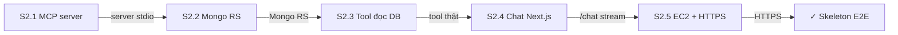
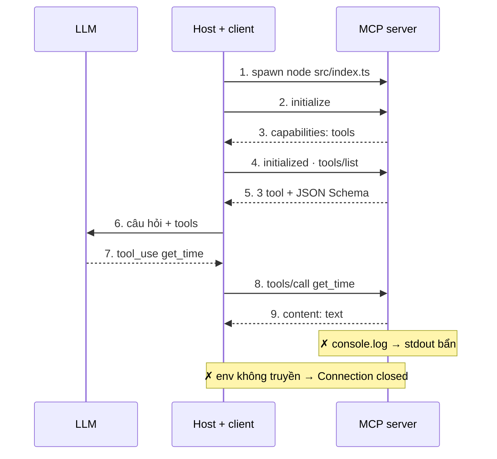
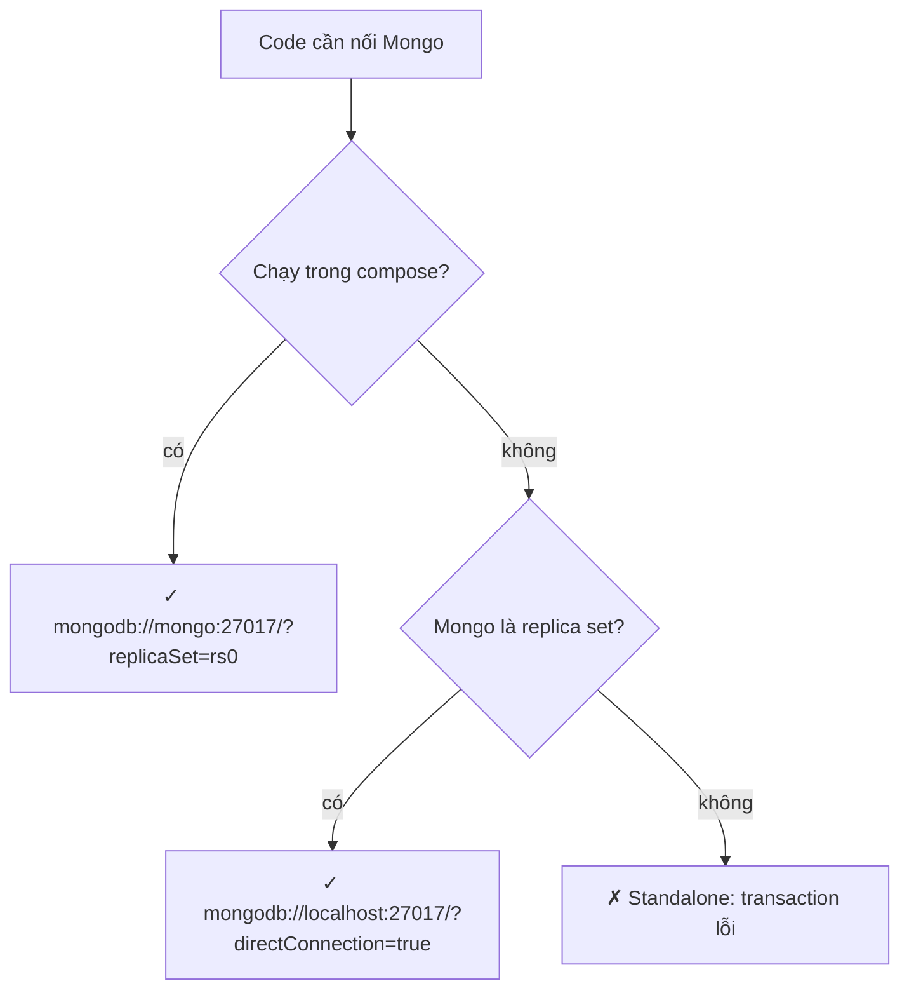
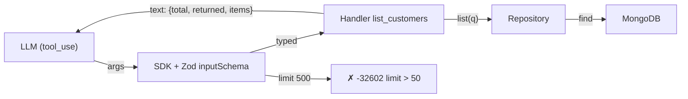
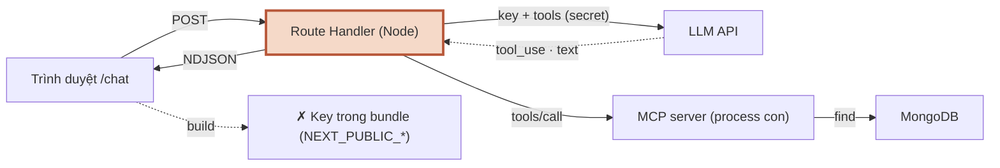
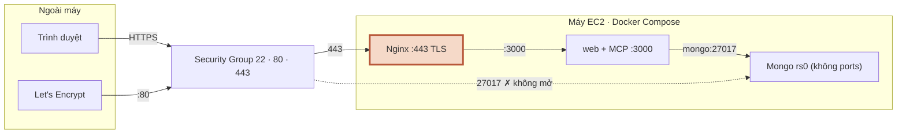

# Module 2 — Walking skeleton

> Roadmap MCP × Full-Stack AI · 5 session · 2 tuần · Chat → LLM → MCP tool → Mongo, chạy trên EC2 có HTTPS

## Mục lục

- **Tổng quan** — Walking skeleton
- **S2.1** — MCP server đầu tiên
- **S2.2** — MongoDB replica set local
- **S2.3** — Tool đọc dữ liệu thật
- **S2.4** — Chat Next.js gọi LLM + MCP
- **S2.5** — Lên EC2 với HTTPS
- **Kiểm tra cuối** — Exit check Module 2

---

## Module 2 — Walking skeleton

Nối **mọi tầng** thật sớm, xấu cũng được, miễn chạy end-to-end: trình duyệt → Next.js → LLM → MCP tool → MongoDB → stream ngược về, trên một EC2 có HTTPS. Lỗi hạ tầng (stdio bẩn, chuỗi kết nối Mongo, stream bị proxy gom, secret lọt bundle) lộ ra ở tuần 2 thay vì tháng thứ 6.

Project: **Nexus** (monorepo `apps/mcp-server`, `apps/web`, `packages/shared`). Module này dạy theo chế độ dev C#: bảng C# → TS đầu mỗi session, lab trước, bẫy có lỗi thật.

### 5 session

| Session | Học gì | Output |
|---|---|---|
| **S2.1** MCP server đầu tiên | Vòng đời host → client → server, JSON-RPC trên stdio, `registerTool`, log ra stderr | `apps/mcp-server` với `ping`, `get_time`, chạy trong Claude Desktop |
| **S2.2** MongoDB replica set local | Compose 1 node rs0, chuỗi kết nối theo chỗ chạy, transaction, timeout driver | `infra/docker-compose.yml`, seed 30 khách, `tx-check` |
| **S2.3** Tool đọc dữ liệu thật | Schema Zod dùng chung, `limit` có trần, `total` tách `items`, chuẩn hóa tiếng Việt | Tool `list_customers` — “Hà Nội có 12 khách” |
| **S2.4** Chat Next.js gọi LLM + MCP | Route Handler stream NDJSON, async generator, MCP client singleton, ranh giới server/client | Trang `/chat` stream câu trả lời có tool call |
| **S2.5** Lên EC2 với HTTPS | Standalone + esbuild + pnpm deploy, Nginx cho stream, certbot, 2 lớp chặn cổng | Nexus chạy tại domain thật, reboot tự lên |

### Phiên bản đã chạy

```console
node v22.22.2 · pnpm 10.28.0 · Version 7.0.2
@anthropic-ai/sdk 0.128.0
@modelcontextprotocol/sdk 1.30.1
@types/react 19.3.0
esbuild 0.28.2
mongodb 7.6.0
next 16.3.6
react 19.3.0
typescript 7.0.2
zod 4.6.5
nginx version: nginx/1.24.0 (Ubuntu)
Docker Compose version v5.1.3
```

| Khác biệt phiên bản gặp khi dựng bài | Xử lý trong bài |
|---|---|
| MCP TS SDK **v2** (`@modelcontextprotocol/server`, spec 2026-07-28) đã stable | Dùng **v1.30.1** cho khớp C50 (M3–M8); đã thử v2 chạy được, ghi cách đổi ở S2.1 |
| SDK v1 thương lượng protocol xuống `2025-11-25` khi client hỏi bản mới hơn | Không cần làm gì; ghi nhận ở S2.1 |
| MCP Inspector 2.x đổi CLI (đòi file config) | Thay bằng `scripts/smoke.ts` dùng SDK client |
| TypeScript **7.0** (native) là `latest` | Dùng luôn; Next 16.3 build được với TS 7 |
| TS ≥ 6 không tự nạp `@types/*` | `"types": ["node"]` trong tsconfig |
| Node 22.18+ chạy thẳng `.ts`, nhưng không trong `node_modules` | Dev chạy `.ts`; production bundle bằng esbuild |
| pnpm 10: `pnpm deploy` đổi mặc định | `--legacy` |
| Nginx 1.24 (Ubuntu 24.04) chưa có `http2 on;` | `listen 443 ssl http2;` |

### Đã chạy thật gì, chưa chạy gì

Sandbox dựng bài chặn Docker Hub và nguồn tải MongoDB, không có API key LLM, không có AWS / Claude Desktop. Bài **không** bịa output cho phần chưa chạy.

| Phần | Trạng thái | Thay thế đã chạy |
|---|---|---|
| MCP server, 3 tool, JSON-RPC thô | ✓ chạy thật | — |
| Claude Desktop | ✗ | SDK client thật qua stdio (`pnpm smoke`) — cùng giao thức |
| MongoDB replica set, seed, transaction | ✗ (không kéo được image) | Code qua `tsc` strict; driver khi Mongo vắng mặt (timeout thật); repository in-memory cùng hợp đồng |
| `/chat` stream + MCP tool thật | ✓ chạy thật | LLM là provider giả lập có kịch bản |
| Đường Anthropic | ✓ tới bước xác thực | Key sai → 401 thật từ `api.anthropic.com` |
| Secret không lọt bundle | ✓ build + grep thật | — |
| Docker build, EC2, certbot | ✗ | Ráp đúng layout image và chạy; `docker compose config`; Nginx 1.24 thật + TLS tự ký; `shellcheck` |
| Stream qua Nginx | ✓ đo thật 5 cấu hình | — |

### Cách dùng trang

- Mỗi session: **Lý thuyết + Lab** (bảng C# → TS, lab có AC + lệnh nghiệm thu, bẫy, code mẫu & pattern, 3 câu trắc nghiệm) · **Cheat Sheet** · **Code** (toàn bộ file theo cây thư mục).
- Ô tick AC được nhớ trên trình duyệt này. Tick khi **lệnh nghiệm thu** xanh, không phải khi đọc xong.
- Code block: chuyển tab file bằng chuột hoặc ←/→; nút Copy chỉ copy code (không số dòng, bỏ dòng `-` của diff).
- Sơ đồ: bấm nút kịch bản để chạy từng bước, bấm vào ô để xem 4 dòng Là gì · Chạy ở đâu · Nhận gì · Trả gì.

### Exit check Module 2

- [ ] Từ trình duyệt ngoài internet: hỏi → LLM → MCP tool → Mongo → trả lời stream về.
- [ ] Vẽ được sơ đồ luồng request qua từng tầng và giải thích từng mũi tên (so với sơ đồ ở S2.4 và S2.5).
- [ ] Trang [Kiểm tra cuối](#fx): mọi session ≥ 80%.


---

## Tổng quan · Cheat Sheet

### Bản đồ module

**Sơ đồ (Bản đồ dịch vụ) — Module 2 gồm những session nào, nối vào nhau ra sao?**



**Đọc sơ đồ:** Đọc từ ô đầu (trái trên) sang phải, vòng xuống hàng dưới và đi ngược về trái tới đích. Nhãn mũi tên = thứ mang sang session sau. *Màu: xanh ô-liu + ✓ = đã xong / đích · viền terracotta = đang học · be = sắp học.*


### Bảng pattern của module

| Pattern | Session | Tương đương C# / .NET | Dùng khi |
|---|---|---|---|
| Registrar function (composition root) | S2.1 | `[McpServerToolType]` + `WithToolsFromAssembly()`, extension `services.AddX()` | Lắp tool vào server bằng hàm `registerX(server, deps)` thay vì reflection/base class |
| Deps object (tiêm phụ thuộc bằng tham số) | S2.1, S2.3 | Constructor injection | Hàm cần clock, logger, repository: nhận `deps` — test thay bằng bản giả |
| Repository hẹp theo use case | S2.2 | `IRepository<T>` / EF Core repository | Tool cần đọc DB mà không biết Mongo; đổi Mongo ↔ in-memory để test |
| Schema-first contract | S2.3 | DTO + DataAnnotations + Swashbuckle | 1 schema Zod = validate runtime + type TS + JSON Schema cho LLM |
| Strategy + factory function | S2.4 | `IChatClient` (Microsoft.Extensions.AI) + DI keyed service | Nhiều implementation cùng hợp đồng (Anthropic / giả lập), chọn theo env |
| Async generator pipeline | S2.4 | `IAsyncEnumerable<T>` + `yield return` | Dòng sự kiện có backpressure: LLM → orchestrator → NDJSON |
| Options + validate lúc khởi động | S2.4, S2.5 | `IOptions<T>` + `ValidateOnStart()` | Sai cấu hình phải chết lúc boot, không đợi request đầu tiên |


### Lệnh cả module

```console
$ pnpm install
$ pnpm check                                                    # typecheck + smoke MCP
$ docker compose -f infra/docker-compose.yml up -d              # Mongo rs0 local
$ pnpm --filter @nexus/mcp-server seed
$ cd apps/web && LLM_PROVIDER=scripted NEXUS_DATA=memory pnpm dev
$ node apps/web/scripts/chat-probe.ts http://localhost:3000
$ pnpm build                                                    # mcp-server dist + web standalone
```

### 10 bẫy của module

| # | Bẫy | Session | Dấu hiệu |
|---|---|---|---|
| 1 | `console.log` trong server stdio | S2.1 | `Unexpected token … is not valid JSON` |
| 2 | Import không đuôi / đuôi `.js` khi chạy `.ts` | S2.1 | TS2835 / `ERR_MODULE_NOT_FOUND` |
| 3 | `enum` với strip types | S2.1 | TS1294 / `ERR_UNSUPPORTED_TYPESCRIPT_SYNTAX` |
| 4 | Client không truyền env cho server | S2.1 | `MCP error -32000: Connection closed` |
| 5 | Timeout driver Mongo 30 s | S2.2 | Tool treo đúng 30 s |
| 6 | Chỉ trả `items`, không `total` | S2.3 | LLM đếm sai |
| 7 | `NEXT_PUBLIC_` cho secret | S2.4 | Key nằm trong `.next/static` |
| 8 | Env chỉ kiểm lúc request | S2.4 | “Ready” rồi 500 |
| 9 | `.ts` trong `node_modules` ở production | S2.5 | `ERR_UNSUPPORTED_NODE_MODULES_TYPE_STRIPPING` |
| 10 | gzip/buffer ở Nginx cho route stream | S2.5 | Câu trả lời hiện một cục |


---

## Tổng quan · Code

### Cây repo sau Module 2

```txt
nexus/
├─ package.json · pnpm-workspace.yaml · pnpm-lock.yaml · tsconfig.base.json · .gitignore · .dockerignore
├─ packages/shared/src/        index.ts · customer.ts · chat.ts
├─ apps/mcp-server/
│  ├─ src/                     index.ts · server.ts · env.ts · log.ts · db.ts
│  │  ├─ tools/                ping.ts · get-time.ts · list-customers.ts
│  │  └─ customers/            repository.ts · mongo-repository.ts · memory-repository.ts · seed-data.ts
│  ├─ scripts/                 smoke.ts · seed.ts · tx-check.ts
│  └─ claude_desktop_config.example.json
├─ apps/web/
│  ├─ app/                     layout.tsx · page.tsx · chat/ · api/chat/route.ts
│  ├─ lib/                     env.server.ts · boot-check.ts · chat/ · llm/ · mcp/host.ts
│  ├─ instrumentation.ts · next.config.ts
│  └─ scripts/chat-probe.ts
├─ infra/docker-compose.yml    Mongo rs0 cho dev
└─ deploy/                     web.Dockerfile · docker-compose.prod.yml · nginx/ · ec2-bootstrap.sh · aws-network.sh
```

### Gốc repo

`package.json`

```json
{
  "name": "nexus",
  "private": true,
  "packageManager": "pnpm@10.28.0",
  "scripts": {
    "typecheck": "pnpm -r typecheck",
    "smoke": "pnpm --filter @nexus/mcp-server smoke",
    "check": "pnpm typecheck && pnpm smoke",
    "build": "pnpm --filter @nexus/mcp-server build && pnpm --filter @nexus/web build"
  },
  "devDependencies": {
    "@types/node": "^22.20.4",
    "tsx": "^4.23.15",
    "typescript": "^7.0.2"
  },
  "engines": {
    "node": ">=22.18"
  }
}
```
`pnpm-workspace.yaml`

```yaml
packages:
  - apps/*
  - packages/*
```
`tsconfig.base.json`

```json
{
  "compilerOptions": {
    "target": "ES2023",
    "lib": ["ES2023"],
    "module": "NodeNext",
    "moduleResolution": "NodeNext",
    "strict": true,
    "noUncheckedIndexedAccess": true,
    "noImplicitOverride": true,
    "verbatimModuleSyntax": true,
    "erasableSyntaxOnly": true,
    "allowImportingTsExtensions": true,
    "rewriteRelativeImportExtensions": true,
    "isolatedModules": true,
    "skipLibCheck": true,
    "noEmit": true,
    "types": ["node"]
  }
}
```
`.gitignore`

```txt
node_modules
.next
dist
.env
.env.local
*.tsbuildinfo
next-env.d.ts
```

Code từng phần nằm ở tab **Code** của session tương ứng.

---

## S2.1 — MCP server đầu tiên

Mục tiêu: hiểu vòng đời host → client → server và có `apps/mcp-server` chạy được với 2 tool `ping`, `get_time` qua stdio.

### C# → TS/Node

| Khái niệm C# | Tương đương TS/Node | Khác ở đâu |
|---|---|---|
| `Program.cs` + `dotnet run` | `src/index.ts` + `node src/index.ts` | Node ≥ 22.18 chạy thẳng file `.ts` (strip types — xóa type, không biên dịch) → không có bước build khi dev |
| `namespace` / `using` | `import { x } from "./env.ts"` | Import theo **đường dẫn file**, bắt buộc có đuôi; không có namespace toàn cục |
| `enum`, primary constructor param | union string `"a" \| "b"`, field thường | Chế độ strip types cấm cú pháp phải sinh code JS (`enum`, parameter property) |
| `[McpServerTool]` + `WithToolsFromAssembly()` (C# MCP SDK) | `server.registerTool(name, config, handler)` | Đăng ký tường minh, không reflection quét assembly |
| `[Range(1, 50)]`, `[Description]` | Zod `.min(1).max(50).describe(...)` | Schema vừa validate lúc chạy vừa thành JSON Schema gửi cho LLM |
| `Console.WriteLine` | `console.log` → **stdout** | Server stdio dùng stdout làm kênh JSON-RPC → log phải ra **stderr** |
| `IHostApplicationLifetime`, Ctrl+C | `process.on("SIGTERM")`, `process.stdin.on("end")` | Host đóng pipe = tín hiệu tắt; tự thoát, đừng để process mồ côi |
| `Task`/`async Main` | top-level `await` | Chỉ có trong ESM (`"type": "module"`) |

### Lab S2.1 — server stdio với `ping` + `get_time`

#### Mục tiêu

`apps/mcp-server` là một MCP server stdio, có 2 tool, chạy được trong Claude Desktop, không in gì ra stdout ngoài JSON-RPC.

#### Acceptance criteria

- [ ] Claude Desktop liệt kê và gọi được `ping` và `get_time` (bản thay thế trong CI: `pnpm smoke` liệt kê đủ 3 tool và gọi thành công).
- [ ] Không có `console.log` nào trong `apps/mcp-server/src` — mọi log đi stderr.
- [ ] `pnpm typecheck` sạch với `strict`, không `any`.
- [ ] Sai múi giờ (`get_time {"timeZone":"Hanoi"}`) trả `isError` có hướng dẫn, không làm chết server.

#### Lệnh nghiệm thu

```console
$ pnpm check                                   # typecheck toàn repo + smoke qua MCP client thật
$ grep -rn "console.log" apps/mcp-server/src   # phải KHÔNG ra dòng nào
```

Output thật của `pnpm smoke` (client MCP của SDK spawn server qua stdio, provider dữ liệu in-memory):

```console
$ pnpm --filter @nexus/mcp-server smoke
server: nexus@0.1.0 · capabilities: tools
tools (3): ping, get_time, list_customers

▶ ping {}
pong

▶ get_time {"timeZone":"Asia/Ho_Chi_Minh"}
2026-09-27T08:13:02.994Z — Asia/Ho_Chi_Minh: lúc 15:13:02 Chủ Nhật, 27 tháng 9, 2026

▶ get_time {"timeZone":"Hanoi"}  [isError]
Múi giờ 'Hanoi' không hợp lệ. Dùng tên IANA như 'Asia/Ho_Chi_Minh'.

▶ list_customers {"city":"ha noi","limit":3}
{"total":12,"returned":3,"items":[{"id":"cus_030","name":"Gạo Sóc Trăng","city":"Hà Nội","tier":"enterprise"},{"id":"cus_028","name":"Bánh Kẹo Tràng An","city":"Hà Nội","tier":"free"},{"id":"cus_025","name":"Nước Mắm Phú Quốc","city":"Hà Nội","tier":"free"}]}

▶ list_customers {"limit":500}  [isError]
MCP error -32602: Input validation error: Invalid arguments for tool list_customers: Too big: expected number to be <=50 at limit
```

<details>
<summary>Tra khi test đỏ</summary>

| Triệu chứng | Nguyên nhân | Sửa |
|---|---|---|
| `Unexpected token … is not valid JSON` ở client | Có gì đó in ra stdout (console.log, thư viện in banner) | Log bằng `createLogger()` (stderr). Tìm: `grep -rn "console.log" src` |
| `MCP error -32000: Connection closed` | Server chết lúc khởi động (thiếu env, lỗi import) | Chạy tay `node src/index.ts` xem stderr; nhớ client **không** tự truyền env của bạn |
| `ERR_MODULE_NOT_FOUND … env.js` | Import ghi `.js` trong khi file là `.ts` và bạn chạy thẳng `.ts` | Ghi đúng `./env.ts` (repo bật `allowImportingTsExtensions` + `rewriteRelativeImportExtensions`) |
| `ERR_UNSUPPORTED_TYPESCRIPT_SYNTAX` | Dùng `enum`, `namespace`, parameter property | Đổi sang union string / field thường; `erasableSyntaxOnly` trong tsconfig bắt trước |
| Claude Desktop không thấy server | Sai đường dẫn tuyệt đối, `node` trong PATH của app là bản cũ | Dùng đường dẫn tuyệt đối cho cả `node` (`which node`) lẫn `src/index.ts`; xem log `mcp-server-nexus.log` |
| Claude Desktop thấy server nhưng tool lỗi | Node < 22.18 không chạy được `.ts` | `node -v`; nâng Node hoặc đổi `command` sang `npx tsx` |

</details>

### MCP chạy thế nào: host → client → server

Ba vai, cần tách rõ vì C# dev hay gộp “client” với “app”:

- **Host**: app người dùng nhìn thấy (Claude Desktop, sau S2.4 là Nexus web). Nó nói chuyện với LLM.
- **Client**: đối tượng `Client` của SDK nằm **trong** host, mỗi client giữ 1 kết nối tới 1 server.
- **Server**: process của bạn. Với transport stdio, host **spawn** server thành process con và nói chuyện bằng từng dòng JSON trên stdin/stdout.

LLM không bao giờ gọi server trực tiếp: nó chỉ trả về “tôi muốn gọi tool X với tham số Y”, host mới là bên gửi `tools/call`.

**Sơ đồ (Trình tự) — Từ lúc host bật tới lúc tool trả kết quả, những message nào chạy qua stdio?**



**Đọc sơ đồ:** Ba cột, đọc ①→⑨ từ trên xuống. ①–⑤ là bắt tay (1 lần/kết nối); ⑥–⑨ lặp lại mỗi câu hỏi. Mọi mũi tên Host ↔ Server là 1 dòng JSON trên stdin/stdout của process con. *Màu: đỏ gạch + ✗ + viền đứt = bị chặn/sai · vàng mù tạt + ? + viền chấm = cần xem lại · xanh ô-liu + ✓ = chạy đúng. Nhãn = method JSON-RPC.*


Đây là đúng những dòng đó, gõ tay vào stdin của server (không qua SDK client) — output thật:

```console
$ printf "%s\n" "$INIT" "$INITIALIZED" "$LIST" "$CALL" | NEXUS_DATA=memory node src/index.ts
{"result":{"protocolVersion":"2025-06-18","capabilities":{"tools":{"listChanged":true}},"serverInfo":{"name":"nexus","version":"0.1.0"}},"jsonrpc":"2.0","id":1}
{"result":{"tools":[{"name":"ping","title":"Ping","description":"Kiểm tra server Nexus còn sống. Gọi khi người dùng hỏi server có hoạt động không.","inputSchema":{"type":"object","properties":{}},"execution":{"taskSupport":"forbidden"}},{"name":"get_time","title":"Giờ hiện tại","description":"Trả thời điểm hiện tại theo múi giờ IANA. Gọi khi câu hỏi phụ thuộc 'bây giờ', 'hôm nay', 'tuần này'.","inputSchema":{"$schema":"http://json-schema.org/draft-07/schema#","type":"object","properties":{"timeZone":{"default":"Asia/Ho_Chi_Minh","description":"Múi giờ IANA, ví dụ 'Asia/Ho_Chi_Minh', 'Europe/London'.","type":"string"}}},"execution":{"taskSupport":"forbidden"}},{"name":"list_customers","title":"Danh sách khách hàng","description":"Liệt kê khách hàng của công ty, lọc theo thành phố. Dùng để đếm hoặc xem khách hàng. Kết quả có 'total' (tổng thật) và 'items' (tối đa 'limit' bản ghi) — để đếm, đọc 'total'.","inputSchema":{"$schema":"http://json-schema.org/draft-07/schema#","type":"object","properties":{"city":{"description":"Lọc theo thành phố, ví dụ 'Hà Nội'. Không phân biệt hoa thường và dấu.","type":"string","minLength":1,"maxLength":60},"limit":{"default":20,"description":"Số bản ghi tối đa trả về (1–50). 'total' luôn là tổng thật.","type":"integer","minimum":1,"maximum":50}}},"annotations":{"readOnlyHint":true},"execution":{"taskSupport":"forbidden"}}]},"jsonrpc":"2.0","id":2}
{"result":{"content":[{"type":"text","text":"{\"total\":4,\"returned\":2,\"items\":[{\"id\":\"cus_026\",\"name\":\"Sách Cổ Hàng Bông\",\"city\":\"Đà Nẵng\",\"tier\":\"pro\"},{\"id\":\"cus_018\",\"name\":\"Hải Sản Cát Bà\",\"city\":\"Đà Nẵng\",\"tier\":\"enterprise\"}]}"}]},"jsonrpc":"2.0","id":3}
```

Đọc output: mỗi request có `id`, response mang lại đúng `id` đó (JSON-RPC 2.0); `notifications/initialized` không có `id` nên không có response. Server tự sinh `inputSchema` (JSON Schema) từ schema Zod và thêm `execution.taskSupport` — đó là trường của spec mới mà SDK 1.30 đã hỗ trợ.

### Phần khác C# thật sự

**1. Chạy thẳng TypeScript.** Node 22.18+ bỏ type rồi chạy, không kiểm type. Nghĩa là `node src/index.ts` chạy được cả khi code sai type — `tsc --noEmit` là bước kiểm riêng, giống analyzer chạy tách khỏi runtime. Repo bật 3 cờ để hai thứ khớp nhau:

`tsconfig.base.json`

```json
{
  "compilerOptions": {
    "target": "ES2023",
    "lib": ["ES2023"],
    "module": "NodeNext",
    "moduleResolution": "NodeNext",
    "strict": true,
    "noUncheckedIndexedAccess": true,
    "noImplicitOverride": true,
    "verbatimModuleSyntax": true,
    "erasableSyntaxOnly": true,
    "allowImportingTsExtensions": true,
    "rewriteRelativeImportExtensions": true,
    "isolatedModules": true,
    "skipLibCheck": true,
    "noEmit": true,
    "types": ["node"]
  }
}
```

**2. Tool = tên + schema + hàm.** Không có class, không attribute. `inputSchema` nhận *shape* của Zod (object các field) — SDK tự dựng JSON Schema cho LLM và tự validate trước khi gọi handler. Kiểu của tham số handler được suy ra từ schema, không khai báo lại.

**3. Hai loại lỗi.** Lỗi *trong* tool (múi giờ sai) → trả `{ isError: true, content }` để LLM đọc và tự sửa. Lỗi *giao thức* (method không tồn tại) → JSON-RPC error. SDK 1.30 xếp lỗi validate input vào loại thứ nhất (xem dòng `limit: 500` ở output smoke: `[isError]` kèm mã `-32602` trong text). M3 đào sâu phần này.

**4. Vòng đời process.** Host đóng stdin khi thoát → server phải tự `exit`. Không có generic host lo giùm như .NET.

### Bẫy dev .NET hay vấp

#### Bẫy 1 — `console.log` trong server stdio

Thói quen `Console.WriteLine("started")`. Thêm một dòng vào `index.ts`:

`apps/mcp-server/src/index.ts`

```ts
  await server.connect(new StdioServerTransport());
  // ...
  console.log("nexus mcp-server started");
```

```console
$ node traps/client-once.ts traps/index-console-log.ts
{"t":"2026-09-27T08:13:03.538Z","level":"info","msg":"nexus mcp-server ready","transport":"stdio","data":"memory"}
[client transport error] Unexpected token 'e', "nexus mcp-s"... is not valid JSON
tools: ping, get_time, list_customers
{"t":"2026-09-27T08:13:03.562Z","level":"info","msg":"shutting down","reason":"stdin closed"}
```

SDK client 1.30 bỏ qua dòng hỏng và chạy tiếp (nên tool vẫn liệt kê được), nhưng lỗi parse vẫn bắn ra; client khác có thể ngắt kết nối, và nếu dòng lạc trông giống JSON thì nó bị hiểu nhầm thành message. Luật: **stdout chỉ dành cho SDK**.

#### Bẫy 2 — import không đuôi, hoặc nghe lời tsc ghi `.js`

C# không có khái niệm đuôi file trong `using`. Trong ESM, import là đường dẫn file thật:

`traps/no-ext.ts`

```ts
import { loadEnv } from "../src/env";

export const env = loadEnv();
```

> ❌ **TS2835** (dòng 1, cột 25): Relative import paths need explicit file extensions in ECMAScript imports when '--moduleResolution' is 'node16' or 'nodenext'. Did you mean '../src/env.js'?

TS 7 gợi ý `.js` (thói quen cũ: viết `.js` vì tsc sẽ biên dịch ra `.js`). Nhưng ta **chạy thẳng `.ts`**, không có file `.js` nào:

```console
Error [ERR_MODULE_NOT_FOUND]: Cannot find module '/home/claude/nexus/apps/mcp-server/src/env.js' imported from /home/claude/nexus/apps/mcp-server/traps/no-ext.ts
```

Sửa: ghi `../src/env.ts`. `allowImportingTsExtensions` cho tsc chấp nhận, `rewriteRelativeImportExtensions` đổi `.ts` → `.js` nếu sau này có emit.

#### Bẫy 3 — `enum` (và primary constructor)

`traps/enum-tier.ts`

```ts
export enum Tier {
  Free = "free",
  Pro = "pro",
}
console.log(Tier.Pro);
```

> ❌ **TS1294** (dòng 1, cột 13): This syntax is not allowed when 'erasableSyntaxOnly' is enabled.

Không có cờ đó thì tsc im, còn Node chết lúc chạy:

```console
SyntaxError [ERR_UNSUPPORTED_TYPESCRIPT_SYNTAX]: TypeScript enum is not supported in strip-only mode
  code: 'ERR_UNSUPPORTED_TYPESCRIPT_SYNTAX'
```

Thay `enum` bằng `z.enum(["free", "pro", "enterprise"])` hoặc `as const` + union — xem `CustomerSchema` ở S2.3.

#### Bẫy 4 — quên `"type": "module"`

Không có dòng này trong `package.json`, file `.ts` bị coi là CommonJS:

```console
v2-client.ts(1,10): error TS1295: ECMAScript imports and exports cannot be written in a CommonJS file under 'verbatimModuleSyntax'. Adjust the 'type' field in the nearest 'package.json' to make this file an ECMAScript module, or adjust your 'verbatimModuleSyntax', 'module', and 'moduleResolution' settings in TypeScript.
v2-client.ts(2,10): error TS1295: ECMAScript imports and exports cannot be written in a CommonJS file under 'verbatimModuleSyntax'. Adjust the 'type' field in the nearest 'package.json' to make this file an ECMAScript module, or adjust your 'verbatimModuleSyntax', 'module', and 'moduleResolution' settings in TypeScript.
```

#### Bẫy 5 — TypeScript ≥ 6 không tự nạp `@types/node`

Cài `@types/node` chưa đủ; phải khai `"types": ["node"]`. Bỏ dòng đó khỏi `tsconfig.base.json`:

```console
src/db.ts(21,51): error TS2740: Type '{ appName: string; serverSelectionTimeoutMS: number; maxPoolSize: number; }' is missing the following properties from type 'MongoClientOptions': ALPNProtocols, allowPartialTrustChain, autoSelectFamily, autoSelectFamilyAttemptTimeout, and 21 more.
src/env.ts(25,33): error TS2503: Cannot find namespace 'NodeJS'.
src/env.ts(25,53): error TS2591: Cannot find name 'process'. Do you need to install type definitions for node? Try `npm i --save-dev @types/node` and then add 'node' to the types field in your tsconfig.
src/env.ts(29,5): error TS2591: Cannot find name 'process'. Do you need to install type definitions for node? Try `npm i --save-dev @types/node` and then add 'node' to the types field in your tsconfig.
```

#### Bẫy 6 — nghĩ rằng client truyền hết biến môi trường cho server

`StdioClientTransport` chỉ chuyển một nhóm biến an toàn (`PATH`, `HOME`…). Đặt `NEXUS_DATA=memory` ở shell cha rồi spawn không kèm `env`:

```console
$ NEXUS_DATA=memory node traps/client-once.ts src/index.ts --no-env
[nexus-mcp] cấu hình sai:
✖ thiếu MONGODB_URI
  → at MONGODB_URI
[client] MCP error -32000: Connection closed
```

Server không thấy `NEXUS_DATA` → mặc định `mongo` → thiếu `MONGODB_URI` → `exit(1)` → client chỉ thấy `Connection closed`. Luôn truyền `env` tường minh (xem `scripts/smoke.ts`, và `lib/mcp/host.ts` ở S2.4). Claude Desktop cũng vậy: khai trong khối `env` của config.

### Nối vào Claude Desktop

Sandbox dựng bài này không có Claude Desktop — phần này là cấu hình, chưa được chạy ở đây; `pnpm smoke` đóng vai trò kiểm tra tương đương (cùng SDK client, cùng stdio).

`apps/mcp-server/claude_desktop_config.example.json`

```json
{
  "mcpServers": {
    "nexus": {
      "command": "/ABSOLUTE/PATH/TO/node",
      "args": ["/ABSOLUTE/PATH/TO/nexus/apps/mcp-server/src/index.ts"],
      "env": {
        "NEXUS_DATA": "mongo",
        "MONGODB_URI": "mongodb://localhost:27017/?directConnection=true"
      }
    }
  }
}
```

1. Mở Claude Desktop → Settings → Developer → Edit Config; dán khối `nexus` vào `claude_desktop_config.json`. Ở S2.1 chưa có Mongo: để `"NEXUS_DATA": "memory"`.
2. `command` là đường dẫn tuyệt đối từ `which node` (Node ≥ 22.18). App không đọc `.zshrc`, nên `nvm` trong shell không có tác dụng.
3. Thoát hẳn Claude Desktop rồi mở lại. Menu công cụ phải hiện `nexus` với 3 tool.
4. Lỗi thì đọc log server trong thư mục log của Claude Desktop (`mcp-server-nexus.log`) — đó chính là stderr của process bạn.

### Code mẫu & pattern

#### Code production (repo `nexus/`)

Entry point, composition root và 2 tool — cùng một editor, chuyển tab để xem từng file:

`apps/mcp-server/src/index.ts`

```ts
import { StdioServerTransport } from "@modelcontextprotocol/sdk/server/stdio.js";
import { openDataSource } from "./db.ts";
import { loadEnv } from "./env.ts";
import { createLogger, errorFields } from "./log.ts";
import { createNexusServer } from "./server.ts";

const env = loadEnv();
const log = createLogger(env.LOG_LEVEL);

try {
  const data = await openDataSource(env, log);
  const server = createNexusServer({ customers: data.customers, log, now: () => new Date() });

  let closing = false;
  const shutdown = async (reason: string): Promise<void> => {
    if (closing) return;
    closing = true;
    log.info("shutting down", { reason });
    await server.close();
    await data.close();
    process.exit(0);
  };
  process.on("SIGINT", () => void shutdown("SIGINT"));
  process.on("SIGTERM", () => void shutdown("SIGTERM"));
  // Host đóng pipe (Claude Desktop tắt, web app restart) → stdin kết thúc → tự thoát, không để process mồ côi.
  process.stdin.on("end", () => void shutdown("stdin closed"));

  await server.connect(new StdioServerTransport());
  log.info("nexus mcp-server ready", { transport: "stdio", data: env.NEXUS_DATA });
} catch (err) {
  log.error("startup failed", errorFields(err));
  process.exit(1);
}
```
`apps/mcp-server/src/server.ts`

```ts
import { McpServer } from "@modelcontextprotocol/sdk/server/mcp.js";
import type { CustomerRepository } from "./customers/repository.ts";
import type { Logger } from "./log.ts";
import { registerGetTime } from "./tools/get-time.ts";
import { registerListCustomers } from "./tools/list-customers.ts";
import { registerPing } from "./tools/ping.ts";

export interface ServerDeps {
  customers: CustomerRepository;
  log: Logger;
  now: () => Date;
}

/** Composition root: lắp tool vào server. Không biết transport — stdio hay HTTP là việc của entry point. */
export function createNexusServer(deps: ServerDeps): McpServer {
  const server = new McpServer({ name: "nexus", version: "0.1.0" });
  registerPing(server);
  registerGetTime(server, deps);
  registerListCustomers(server, deps);
  return server;
}
```
`apps/mcp-server/src/tools/ping.ts`

```ts
import type { McpServer } from "@modelcontextprotocol/sdk/server/mcp.js";

export function registerPing(server: McpServer): void {
  server.registerTool(
    "ping",
    {
      title: "Ping",
      description: "Kiểm tra server Nexus còn sống. Gọi khi người dùng hỏi server có hoạt động không.",
    },
    async () => ({ content: [{ type: "text", text: "pong" }] }),
  );
}
```
`apps/mcp-server/src/tools/get-time.ts`

```ts
import type { McpServer } from "@modelcontextprotocol/sdk/server/mcp.js";
import { z } from "zod";

export interface GetTimeDeps {
  now: () => Date;
}

function isTimeZone(tz: string): boolean {
  try {
    new Intl.DateTimeFormat("en-US", { timeZone: tz });
    return true;
  } catch {
    return false;
  }
}

export function registerGetTime(server: McpServer, deps: GetTimeDeps): void {
  server.registerTool(
    "get_time",
    {
      title: "Giờ hiện tại",
      description:
        "Trả thời điểm hiện tại theo múi giờ IANA. Gọi khi câu hỏi phụ thuộc 'bây giờ', 'hôm nay', 'tuần này'.",
      inputSchema: {
        timeZone: z
          .string()
          .default("Asia/Ho_Chi_Minh")
          .describe("Múi giờ IANA, ví dụ 'Asia/Ho_Chi_Minh', 'Europe/London'."),
      },
    },
    async ({ timeZone }) => {
      if (!isTimeZone(timeZone)) {
        return {
          isError: true,
          content: [{ type: "text", text: `Múi giờ '${timeZone}' không hợp lệ. Dùng tên IANA như 'Asia/Ho_Chi_Minh'.` }],
        };
      }
      const now = deps.now();
      const local = new Intl.DateTimeFormat("vi-VN", {
        timeZone, dateStyle: "full", timeStyle: "medium",
      }).format(now);
      return { content: [{ type: "text", text: `${now.toISOString()} — ${timeZone}: ${local}` }] };
    },
  );
}
```
`apps/mcp-server/src/log.ts`

```ts
/**
 * Logger tối thiểu: 1 dòng JSON / sự kiện, luôn ghi ra STDERR.
 * Server stdio dùng stdout cho JSON-RPC — một dòng in lạc ra stdout là client parse lỗi.
 */
export type LogLevel = "debug" | "info" | "warn" | "error";
export type LogFields = Record<string, unknown>;

export interface Logger {
  debug(msg: string, fields?: LogFields): void;
  info(msg: string, fields?: LogFields): void;
  warn(msg: string, fields?: LogFields): void;
  error(msg: string, fields?: LogFields): void;
}

const ORDER: Record<LogLevel, number> = { debug: 10, info: 20, warn: 30, error: 40 };

export function createLogger(min: LogLevel, sink: NodeJS.WritableStream = process.stderr): Logger {
  const write = (level: LogLevel, msg: string, fields?: LogFields): void => {
    if (ORDER[level] < ORDER[min]) return;
    sink.write(`${JSON.stringify({ t: new Date().toISOString(), level, msg, ...fields })}\n`);
  };
  return {
    debug: (m, f) => write("debug", m, f),
    info: (m, f) => write("info", m, f),
    warn: (m, f) => write("warn", m, f),
    error: (m, f) => write("error", m, f),
  };
}

/** Biến unknown (thứ `catch` nhận được) thành field log an toàn — không đẩy stack ra ngoài process. */
export function errorFields(err: unknown): LogFields {
  if (err instanceof Error) return { err: err.name, errMsg: err.message };
  return { err: "NonError", errMsg: String(err) };
}
```
`apps/mcp-server/src/env.ts`

```ts
import { z } from "zod";

const LogLevel = z.enum(["debug", "info", "warn", "error"]).default("info");

/**
 * Hai chế độ dữ liệu, mỗi chế độ đòi biến khác nhau → discriminated union theo NEXUS_DATA.
 * `memory` dùng cho test/smoke không cần Mongo; `mongo` là mặc định.
 */
const EnvSchema = z.discriminatedUnion("NEXUS_DATA", [
  z.object({
    NEXUS_DATA: z.literal("memory"),
    LOG_LEVEL: LogLevel,
  }),
  z.object({
    NEXUS_DATA: z.literal("mongo"),
    LOG_LEVEL: LogLevel,
    MONGODB_URI: z
      .string({ error: "thiếu MONGODB_URI" })
      .regex(/^mongodb(\+srv)?:\/\//, "MONGODB_URI phải bắt đầu bằng mongodb:// hoặc mongodb+srv://"),
    MONGODB_DB: z.string().min(1).default("nexus"),
  }),
]);
export type Env = z.infer<typeof EnvSchema>;

export function loadEnv(source: NodeJS.ProcessEnv = process.env): Env {
  const parsed = EnvSchema.safeParse({ NEXUS_DATA: "mongo", ...source });
  if (!parsed.success) {
    // stderr, KHÔNG phải stdout: stdout của server stdio là kênh JSON-RPC.
    process.stderr.write(`[nexus-mcp] cấu hình sai:\n${z.prettifyError(parsed.error)}\n`);
    process.exit(1);
  }
  return parsed.data;
}
```

#### Pattern: Registrar function (composition root)

**Vấn đề:** lắp N tool vào 1 server, mỗi tool có phụ thuộc riêng (clock, repository, logger), mà vẫn giữ được type suy ra từ schema.

**Tương đương C#:** C# MCP SDK dùng `[McpServerToolType]` / `[McpServerTool]` + `builder.Services.AddMcpServer().WithToolsFromAssembly()`; phụ thuộc vào qua constructor injection.

**So sánh dịch thẳng vs kiểu TS** — hai tab, cùng compile sạch:

`lesson-code/mcp/tool-registry.direct.ts`

```ts
// "Dịch thẳng" từ C#: base class + registry tự viết, giống [McpServerToolType] + WithToolsFromAssembly()
import type { McpServer } from "@modelcontextprotocol/sdk/server/mcp.js";
import type { CallToolResult } from "@modelcontextprotocol/sdk/types.js";

export abstract class ToolBase {
  abstract readonly name: string;
  abstract readonly description: string;
  // Muốn có tham số? Phải thành ToolBase<TArgs> + tự parse unknown → mất type suy ra từ schema
  abstract execute(args: unknown): Promise<CallToolResult>;
}

export class PingTool extends ToolBase {
  readonly name = "ping";
  readonly description = "Kiểm tra server Nexus còn sống.";
  async execute(): Promise<CallToolResult> {
    return { content: [{ type: "text", text: "pong" }] };
  }
}

export class ToolRegistry {
  private readonly tools: ToolBase[] = [];

  add(tool: ToolBase): this {
    this.tools.push(tool);
    return this;
  }

  registerAll(server: McpServer): void {
    for (const t of this.tools) {
      server.registerTool(t.name, { description: t.description }, () => t.execute({}));
    }
  }
}

// Program.cs
// new ToolRegistry().add(new PingTool()).add(new GetTimeTool(clock)).registerAll(server);
```
`apps/mcp-server/src/tools/get-time.ts`

```ts
import type { McpServer } from "@modelcontextprotocol/sdk/server/mcp.js";
import { z } from "zod";

export interface GetTimeDeps {
  now: () => Date;
}

function isTimeZone(tz: string): boolean {
  try {
    new Intl.DateTimeFormat("en-US", { timeZone: tz });
    return true;
  } catch {
    return false;
  }
}

export function registerGetTime(server: McpServer, deps: GetTimeDeps): void {
  server.registerTool(
    "get_time",
    {
      title: "Giờ hiện tại",
      description:
        "Trả thời điểm hiện tại theo múi giờ IANA. Gọi khi câu hỏi phụ thuộc 'bây giờ', 'hôm nay', 'tuần này'.",
      inputSchema: {
        timeZone: z
          .string()
          .default("Asia/Ho_Chi_Minh")
          .describe("Múi giờ IANA, ví dụ 'Asia/Ho_Chi_Minh', 'Europe/London'."),
      },
    },
    async ({ timeZone }) => {
      if (!isTimeZone(timeZone)) {
        return {
          isError: true,
          content: [{ type: "text", text: `Múi giờ '${timeZone}' không hợp lệ. Dùng tên IANA như 'Asia/Ho_Chi_Minh'.` }],
        };
      }
      const now = deps.now();
      const local = new Intl.DateTimeFormat("vi-VN", {
        timeZone, dateStyle: "full", timeStyle: "medium",
      }).format(now);
      return { content: [{ type: "text", text: `${now.toISOString()} — ${timeZone}: ${local}` }] };
    },
  );
}
```

Vì sao bản TS tốt hơn:

- Bản dịch thẳng: `execute(args: unknown)` — base class không biết schema của từng tool, nên mất type, phải parse tay. Bản TS: `registerTool(..., { inputSchema }, async ({ timeZone }) => ...)` — `timeZone` có type `string` suy ra từ Zod.
- Phụ thuộc là tham số `deps: { now: () => Date }` (một object literal), không cần container. Test chỉ cần `{ now: () => new Date("2026-01-01") }`.
- Không có registry tự viết: `server.ts` gọi thẳng `registerPing(server)`, đọc là biết server có gì (reflection thì phải chạy mới biết).

**Khi nào KHÔNG dùng / đừng over-engineer:** đừng dựng DI container (tsyringe, inversify) cho 3–10 tool. Đừng tạo `interface ITool` chỉ có 1 implementation. Khi server lên vài chục tool, gom theo domain (`registerCustomerTools(server, deps)`) — vẫn là hàm.

### Phiên bản đã chạy & khác biệt

```console
node v22.22.2 · pnpm 10.28.0 · Version 7.0.2
@anthropic-ai/sdk 0.128.0
@modelcontextprotocol/sdk 1.30.1
@types/react 19.3.0
esbuild 0.28.2
mongodb 7.6.0
next 16.3.6
react 19.3.0
typescript 7.0.2
zod 4.6.5
nginx version: nginx/1.24.0 (Ubuntu)
Docker Compose version v5.1.3
```

- **MCP TypeScript SDK v2 đã ra (2.0.0 ngày 27/07/2026, hiện 2.1.0)**, tách thành `@modelcontextprotocol/server` / `@modelcontextprotocol/client`, implement spec `2026-07-28`. Bài dùng **v1 (`@modelcontextprotocol/sdk` 1.30.1)** vì khóa C50 (M3–M8) và harness chấm lab viết cho v1. Đã thử v2: đổi import (`@modelcontextprotocol/server`, `…/server/stdio`) và `inputSchema` nhận nguyên `z.object(...)` thay vì shape — chạy được. Chuyển sang v2 để dành tới M15 (theo kịp spec).
- SDK 1.30 được client hỏi version `2026-07-28` sẽ **thương lượng xuống** `2025-11-25` (output thật):

```console
$ echo "$INIT_2026_07_28" | NEXUS_DATA=memory node src/index.ts
{"result":{"protocolVersion":"2025-11-25","capabilities":{"tools":{"listChanged":true}},"serverInfo":{"name":"nexus","version":"0.1.0"}},"jsonrpc":"2.0","id":1}
```

- **MCP Inspector 2.x** đổi CLI: `npx @modelcontextprotocol/inspector --cli node src/index.ts` kiểu cũ báo `No servers found in config file`. Bài dùng `scripts/smoke.ts` (SDK client) thay cho Inspector — ổn định hơn và chạy được trong CI.
- **TypeScript 7.0** (bản native, viết lại bằng Go) là `latest` trên npm: nhanh hơn nhiều, thông báo lỗi có khác đôi chút so với 5.x (ví dụ gợi ý `.js` ở Bẫy 2).

### Trắc nghiệm S2.1

1. Server stdio của bạn cần in “server started” để debug. Viết ở đâu?
   - A. `console.log("server started")`
   - B. `process.stderr.write("server started\n")` (hoặc logger ghi stderr)
   - C. `console.info("server started")`

   <details><summary>Đáp án</summary>

   **B.** stdout là kênh JSON-RPC. `console.log` và `console.info` đều ghi stdout; chỉ stderr là an toàn — Claude Desktop gom stderr vào file log của server.

   </details>

2. LLM trả về `tool_use get_time`. Ai gửi `tools/call` tới MCP server?
   - A. LLM gọi thẳng server qua HTTP
   - B. Host (qua MCP client nằm trong host)
   - C. MCP server tự đọc câu hỏi và tự gọi

   <details><summary>Đáp án</summary>

   **B.** LLM chỉ đề nghị. Host quyết định có gọi không (có thể hỏi người dùng), gửi `tools/call`, rồi đưa kết quả lại cho LLM.

   </details>

3. `node src/index.ts` chạy ngon nhưng `pnpm typecheck` báo lỗi type. Chuyện gì?
   - A. Không thể xảy ra: Node kiểm type trước khi chạy
   - B. Bình thường: Node chỉ xóa type rồi chạy, không kiểm; `tsc` là bước kiểm riêng
   - C. Node dùng tsconfig khác

   <details><summary>Đáp án</summary>

   **B.** Strip types = bỏ chú thích type, không type-check. Vì vậy `pnpm check` (typecheck + smoke) mới là lệnh nghiệm thu, không phải “chạy được là xong”.

   </details>


---

## S2.1 · Cheat Sheet

### Lệnh

```console
$ pnpm --filter @nexus/mcp-server start          # node src/index.ts (Node ≥ 22.18)
$ pnpm smoke                                      # SDK client spawn server, gọi từng tool
$ pnpm typecheck                                  # tsc --noEmit toàn repo
$ printf '%s\n' "$INIT" "$LIST" | NEXUS_DATA=memory node apps/mcp-server/src/index.ts
```

### JSON-RPC của MCP dùng trong session này

| Method | Chiều | Có `id`? | Dùng để |
|---|---|---|---|
| `initialize` | client → server | có | Thỏa thuận `protocolVersion`, trao `capabilities` |
| `notifications/initialized` | client → server | không | Báo bắt tay xong |
| `tools/list` | client → server | có | Lấy tên, mô tả, `inputSchema` |
| `tools/call` | client → server | có | Gọi tool: `{ name, arguments }` → `{ content, isError? }` |

### Luật của server stdio

- stdout = JSON-RPC, **chỉ SDK được ghi**. Log → stderr.
- Env: client chỉ chuyển `PATH`, `HOME`…; tự truyền biến của mình.
- stdin `end` → tự `exit`.
- Import tương đối có đuôi `.ts`; không `enum`, không `namespace`, không parameter property.
- `package.json` có `"type": "module"`; tsconfig có `"types": ["node"]`.

### Khung một tool

`lesson-code/mcp/tool-template.ts`

```ts
import type { McpServer } from "@modelcontextprotocol/sdk/server/mcp.js";
import { z } from "zod";

export interface EchoDeps {
  now: () => Date;
}

/** Khung chuẩn: tên verb_noun · description nói KHI NÀO gọi · schema có describe · lỗi nghiệp vụ = isError. */
export function registerEcho(server: McpServer, deps: EchoDeps): void {
  server.registerTool(
    "echo_text",
    {
      title: "Echo",
      description: "Lặp lại chuỗi người dùng đưa. Gọi khi cần kiểm tra kết nối có giữ nguyên dữ liệu.",
      inputSchema: { text: z.string().min(1).max(500).describe("Chuỗi cần lặp lại") },
    },
    async ({ text }) => {
      if (text.trim() === "") {
        return { isError: true, content: [{ type: "text", text: "text rỗng. Gửi ít nhất 1 ký tự không phải khoảng trắng." }] };
      }
      return { content: [{ type: "text", text: `${deps.now().toISOString()} ${text}` }] };
    },
  );
}
```

### Bảng pattern của module

| Pattern | Session | Tương đương C# / .NET | Dùng khi |
|---|---|---|---|
| Registrar function (composition root) | S2.1 | `[McpServerToolType]` + `WithToolsFromAssembly()`, extension `services.AddX()` | Lắp tool vào server bằng hàm `registerX(server, deps)` thay vì reflection/base class |
| Deps object (tiêm phụ thuộc bằng tham số) | S2.1, S2.3 | Constructor injection | Hàm cần clock, logger, repository: nhận `deps` — test thay bằng bản giả |
| Repository hẹp theo use case | S2.2 | `IRepository<T>` / EF Core repository | Tool cần đọc DB mà không biết Mongo; đổi Mongo ↔ in-memory để test |
| Schema-first contract | S2.3 | DTO + DataAnnotations + Swashbuckle | 1 schema Zod = validate runtime + type TS + JSON Schema cho LLM |
| Strategy + factory function | S2.4 | `IChatClient` (Microsoft.Extensions.AI) + DI keyed service | Nhiều implementation cùng hợp đồng (Anthropic / giả lập), chọn theo env |
| Async generator pipeline | S2.4 | `IAsyncEnumerable<T>` + `yield return` | Dòng sự kiện có backpressure: LLM → orchestrator → NDJSON |
| Options + validate lúc khởi động | S2.4, S2.5 | `IOptions<T>` + `ValidateOnStart()` | Sai cấu hình phải chết lúc boot, không đợi request đầu tiên |


---

## S2.1 · Code

### Cây thư mục

```txt
nexus/
├─ package.json                 "type" không cần ở root; scripts check/typecheck/smoke
├─ pnpm-workspace.yaml
├─ tsconfig.base.json
└─ apps/mcp-server/
   ├─ package.json              "type": "module", engines node >= 22.18
   ├─ tsconfig.json
   ├─ claude_desktop_config.example.json
   ├─ scripts/smoke.ts
   └─ src/
      ├─ index.ts               entry stdio
      ├─ server.ts              composition root
      ├─ env.ts · log.ts
      └─ tools/ping.ts · get-time.ts
```

### Gốc repo

`package.json`

```json
{
  "name": "nexus",
  "private": true,
  "packageManager": "pnpm@10.28.0",
  "scripts": {
    "typecheck": "pnpm -r typecheck",
    "smoke": "pnpm --filter @nexus/mcp-server smoke",
    "check": "pnpm typecheck && pnpm smoke",
    "build": "pnpm --filter @nexus/mcp-server build && pnpm --filter @nexus/web build"
  },
  "devDependencies": {
    "@types/node": "^22.20.4",
    "tsx": "^4.23.15",
    "typescript": "^7.0.2"
  },
  "engines": {
    "node": ">=22.18"
  }
}
```
`pnpm-workspace.yaml`

```yaml
packages:
  - apps/*
  - packages/*
```
`tsconfig.base.json`

```json
{
  "compilerOptions": {
    "target": "ES2023",
    "lib": ["ES2023"],
    "module": "NodeNext",
    "moduleResolution": "NodeNext",
    "strict": true,
    "noUncheckedIndexedAccess": true,
    "noImplicitOverride": true,
    "verbatimModuleSyntax": true,
    "erasableSyntaxOnly": true,
    "allowImportingTsExtensions": true,
    "rewriteRelativeImportExtensions": true,
    "isolatedModules": true,
    "skipLibCheck": true,
    "noEmit": true,
    "types": ["node"]
  }
}
```

### apps/mcp-server

`apps/mcp-server/package.json`

```json
{
  "name": "@nexus/mcp-server",
  "version": "0.1.0",
  "private": true,
  "type": "module",
  "engines": {
    "node": ">=22.18"
  },
  "scripts": {
    "start": "node src/index.ts",
    "typecheck": "tsc -p tsconfig.json",
    "smoke": "node scripts/smoke.ts",
    "seed": "node scripts/seed.ts",
    "tx-check": "node scripts/tx-check.ts",
    "build": "esbuild src/index.ts scripts/seed.ts scripts/tx-check.ts --bundle --platform=node --target=node22 --format=esm --outdir=dist --entry-names=[name] --external:@modelcontextprotocol/sdk --external:mongodb --external:zod",
    "start:prod": "node dist/index.js"
  },
  "dependencies": {
    "@modelcontextprotocol/sdk": "^1.30.1",
    "@nexus/shared": "workspace:*",
    "mongodb": "^7.6.0",
    "zod": "^4.6.5"
  },
  "devDependencies": {
    "esbuild": "^0.28.2"
  }
}
```
`apps/mcp-server/tsconfig.json`

```json
{ "extends": "../../tsconfig.base.json", "include": ["src", "scripts"] }
```
`apps/mcp-server/src/index.ts`

```ts
import { StdioServerTransport } from "@modelcontextprotocol/sdk/server/stdio.js";
import { openDataSource } from "./db.ts";
import { loadEnv } from "./env.ts";
import { createLogger, errorFields } from "./log.ts";
import { createNexusServer } from "./server.ts";

const env = loadEnv();
const log = createLogger(env.LOG_LEVEL);

try {
  const data = await openDataSource(env, log);
  const server = createNexusServer({ customers: data.customers, log, now: () => new Date() });

  let closing = false;
  const shutdown = async (reason: string): Promise<void> => {
    if (closing) return;
    closing = true;
    log.info("shutting down", { reason });
    await server.close();
    await data.close();
    process.exit(0);
  };
  process.on("SIGINT", () => void shutdown("SIGINT"));
  process.on("SIGTERM", () => void shutdown("SIGTERM"));
  // Host đóng pipe (Claude Desktop tắt, web app restart) → stdin kết thúc → tự thoát, không để process mồ côi.
  process.stdin.on("end", () => void shutdown("stdin closed"));

  await server.connect(new StdioServerTransport());
  log.info("nexus mcp-server ready", { transport: "stdio", data: env.NEXUS_DATA });
} catch (err) {
  log.error("startup failed", errorFields(err));
  process.exit(1);
}
```
`apps/mcp-server/src/server.ts`

```ts
import { McpServer } from "@modelcontextprotocol/sdk/server/mcp.js";
import type { CustomerRepository } from "./customers/repository.ts";
import type { Logger } from "./log.ts";
import { registerGetTime } from "./tools/get-time.ts";
import { registerListCustomers } from "./tools/list-customers.ts";
import { registerPing } from "./tools/ping.ts";

export interface ServerDeps {
  customers: CustomerRepository;
  log: Logger;
  now: () => Date;
}

/** Composition root: lắp tool vào server. Không biết transport — stdio hay HTTP là việc của entry point. */
export function createNexusServer(deps: ServerDeps): McpServer {
  const server = new McpServer({ name: "nexus", version: "0.1.0" });
  registerPing(server);
  registerGetTime(server, deps);
  registerListCustomers(server, deps);
  return server;
}
```
`apps/mcp-server/src/env.ts`

```ts
import { z } from "zod";

const LogLevel = z.enum(["debug", "info", "warn", "error"]).default("info");

/**
 * Hai chế độ dữ liệu, mỗi chế độ đòi biến khác nhau → discriminated union theo NEXUS_DATA.
 * `memory` dùng cho test/smoke không cần Mongo; `mongo` là mặc định.
 */
const EnvSchema = z.discriminatedUnion("NEXUS_DATA", [
  z.object({
    NEXUS_DATA: z.literal("memory"),
    LOG_LEVEL: LogLevel,
  }),
  z.object({
    NEXUS_DATA: z.literal("mongo"),
    LOG_LEVEL: LogLevel,
    MONGODB_URI: z
      .string({ error: "thiếu MONGODB_URI" })
      .regex(/^mongodb(\+srv)?:\/\//, "MONGODB_URI phải bắt đầu bằng mongodb:// hoặc mongodb+srv://"),
    MONGODB_DB: z.string().min(1).default("nexus"),
  }),
]);
export type Env = z.infer<typeof EnvSchema>;

export function loadEnv(source: NodeJS.ProcessEnv = process.env): Env {
  const parsed = EnvSchema.safeParse({ NEXUS_DATA: "mongo", ...source });
  if (!parsed.success) {
    // stderr, KHÔNG phải stdout: stdout của server stdio là kênh JSON-RPC.
    process.stderr.write(`[nexus-mcp] cấu hình sai:\n${z.prettifyError(parsed.error)}\n`);
    process.exit(1);
  }
  return parsed.data;
}
```
`apps/mcp-server/src/log.ts`

```ts
/**
 * Logger tối thiểu: 1 dòng JSON / sự kiện, luôn ghi ra STDERR.
 * Server stdio dùng stdout cho JSON-RPC — một dòng in lạc ra stdout là client parse lỗi.
 */
export type LogLevel = "debug" | "info" | "warn" | "error";
export type LogFields = Record<string, unknown>;

export interface Logger {
  debug(msg: string, fields?: LogFields): void;
  info(msg: string, fields?: LogFields): void;
  warn(msg: string, fields?: LogFields): void;
  error(msg: string, fields?: LogFields): void;
}

const ORDER: Record<LogLevel, number> = { debug: 10, info: 20, warn: 30, error: 40 };

export function createLogger(min: LogLevel, sink: NodeJS.WritableStream = process.stderr): Logger {
  const write = (level: LogLevel, msg: string, fields?: LogFields): void => {
    if (ORDER[level] < ORDER[min]) return;
    sink.write(`${JSON.stringify({ t: new Date().toISOString(), level, msg, ...fields })}\n`);
  };
  return {
    debug: (m, f) => write("debug", m, f),
    info: (m, f) => write("info", m, f),
    warn: (m, f) => write("warn", m, f),
    error: (m, f) => write("error", m, f),
  };
}

/** Biến unknown (thứ `catch` nhận được) thành field log an toàn — không đẩy stack ra ngoài process. */
export function errorFields(err: unknown): LogFields {
  if (err instanceof Error) return { err: err.name, errMsg: err.message };
  return { err: "NonError", errMsg: String(err) };
}
```

### apps/mcp-server/src/tools

`apps/mcp-server/src/tools/ping.ts`

```ts
import type { McpServer } from "@modelcontextprotocol/sdk/server/mcp.js";

export function registerPing(server: McpServer): void {
  server.registerTool(
    "ping",
    {
      title: "Ping",
      description: "Kiểm tra server Nexus còn sống. Gọi khi người dùng hỏi server có hoạt động không.",
    },
    async () => ({ content: [{ type: "text", text: "pong" }] }),
  );
}
```
`apps/mcp-server/src/tools/get-time.ts`

```ts
import type { McpServer } from "@modelcontextprotocol/sdk/server/mcp.js";
import { z } from "zod";

export interface GetTimeDeps {
  now: () => Date;
}

function isTimeZone(tz: string): boolean {
  try {
    new Intl.DateTimeFormat("en-US", { timeZone: tz });
    return true;
  } catch {
    return false;
  }
}

export function registerGetTime(server: McpServer, deps: GetTimeDeps): void {
  server.registerTool(
    "get_time",
    {
      title: "Giờ hiện tại",
      description:
        "Trả thời điểm hiện tại theo múi giờ IANA. Gọi khi câu hỏi phụ thuộc 'bây giờ', 'hôm nay', 'tuần này'.",
      inputSchema: {
        timeZone: z
          .string()
          .default("Asia/Ho_Chi_Minh")
          .describe("Múi giờ IANA, ví dụ 'Asia/Ho_Chi_Minh', 'Europe/London'."),
      },
    },
    async ({ timeZone }) => {
      if (!isTimeZone(timeZone)) {
        return {
          isError: true,
          content: [{ type: "text", text: `Múi giờ '${timeZone}' không hợp lệ. Dùng tên IANA như 'Asia/Ho_Chi_Minh'.` }],
        };
      }
      const now = deps.now();
      const local = new Intl.DateTimeFormat("vi-VN", {
        timeZone, dateStyle: "full", timeStyle: "medium",
      }).format(now);
      return { content: [{ type: "text", text: `${now.toISOString()} — ${timeZone}: ${local}` }] };
    },
  );
}
```

### apps/mcp-server/scripts

`apps/mcp-server/scripts/smoke.ts`

```ts
/**
 * Smoke test qua MCP client THẬT: spawn server bằng stdio, list tools, gọi từng tool.
 * Thay cho "mở Claude Desktop xem có hiện tool không" — chạy được trong CI.
 *   NEXUS_DATA=memory node scripts/smoke.ts
 */
import { Client } from "@modelcontextprotocol/sdk/client/index.js";
import { StdioClientTransport, getDefaultEnvironment } from "@modelcontextprotocol/sdk/client/stdio.js";
import type { CallToolResult } from "@modelcontextprotocol/sdk/types.js";
import { fileURLToPath } from "node:url";

const entry = fileURLToPath(new URL("../src/index.ts", import.meta.url));

const transport = new StdioClientTransport({
  command: process.execPath,
  args: [entry],
  // Client chỉ chuyển một nhóm env an toàn (PATH, HOME...) — biến của mình phải truyền tường minh.
  env: { ...getDefaultEnvironment(), NEXUS_DATA: process.env["NEXUS_DATA"] ?? "memory", LOG_LEVEL: "warn" },
  stderr: "inherit",
});
const client = new Client({ name: "nexus-smoke", version: "0.1.0" });
await client.connect(transport);

const server = client.getServerVersion();
console.log(`server: ${server?.name}@${server?.version} · capabilities: ${Object.keys(client.getServerCapabilities() ?? {}).join(", ")}`);

const { tools } = await client.listTools();
console.log(`tools (${tools.length}): ${tools.map((t) => t.name).join(", ")}`);

function textOf(r: CallToolResult): string {
  return r.content.map((c) => (c.type === "text" ? c.text : `[${c.type}]`)).join("\n");
}

async function call(name: string, args: Record<string, unknown> = {}): Promise<void> {
  try {
    const r = (await client.callTool({ name, arguments: args })) as CallToolResult;
    console.log(`\n▶ ${name} ${JSON.stringify(args)}${r.isError ? "  [isError]" : ""}\n${textOf(r)}`);
  } catch (err) {
    console.log(`\n▶ ${name} ${JSON.stringify(args)}  [protocol error]\n${err instanceof Error ? err.message : String(err)}`);
  }
}

await call("ping");
await call("get_time", { timeZone: "Asia/Ho_Chi_Minh" });
await call("get_time", { timeZone: "Hanoi" });
await call("list_customers", { city: "ha noi", limit: 3 });
await call("list_customers", { limit: 500 });

await client.close();
```
`apps/mcp-server/claude_desktop_config.example.json`

```json
{
  "mcpServers": {
    "nexus": {
      "command": "/ABSOLUTE/PATH/TO/node",
      "args": ["/ABSOLUTE/PATH/TO/nexus/apps/mcp-server/src/index.ts"],
      "env": {
        "NEXUS_DATA": "mongo",
        "MONGODB_URI": "mongodb://localhost:27017/?directConnection=true"
      }
    }
  }
}
```

---

## S2.2 — MongoDB replica set chạy local

Mục tiêu: có Mongo đúng topology production (replica set) ngay từ ngày đầu, để transaction — và sau này change stream ở M4 — chạy được ở máy dev y như trên EC2.

### C# → TS/Node

| Khái niệm C# | Tương đương TS/Node | Khác ở đâu |
|---|---|---|
| `services.AddSingleton<IMongoClient>(…)` | 1 `MongoClient` / process, tạo trong `db.ts` | Không container; handle truyền tay qua `openDataSource()` |
| `IMongoCollection<Customer>` | `Collection<CustomerDoc>` | Type là interface TS, không attribute `[BsonElement]`; driver không map, chỉ gõ type |
| `.Where(c => c.City == x)` (LINQ) | filter object `{ cityKey: x }` (`Filter<T>`) | Filter là JSON có type; sai kiểu field thì tsc bắt (Bẫy 2) |
| `[BsonId] string Id` | `_id: string` trong interface | Domain dùng `id`, DB dùng `_id` → hàm `toDoc`/`toCustomer` |
| `session.WithTransactionAsync(…)` | `session.withTransaction(async () => …)` | Truyền `{ session }` vào **từng** lệnh; quên là lệnh chạy ngoài transaction |
| `appsettings.json` ConnectionStrings | env `MONGODB_URI` (Zod validate) | 1 biến, không có file cấu hình theo môi trường |
| `MongoClientSettings.ServerSelectionTimeout` | `serverSelectionTimeoutMS` | Mặc định 30 000 ms — đổi xuống 5 000 (Bẫy 1) |
| EF migration / `EnsureIndexes()` | `createIndex()` trong script `seed` | Idempotent: chạy lại không tạo trùng |

### Lab S2.2 — replica set 1 node + seed + transaction

#### Mục tiêu

`docker compose up` là có Mongo replica set `rs0` (1 node, tự `rs.initiate` qua healthcheck), cổng chỉ mở cho `127.0.0.1`, dữ liệu mẫu 30 khách hàng, và một transaction chạy thành công.

#### Acceptance criteria

- [ ] `rs.status()` báo member duy nhất là `PRIMARY`.
- [ ] `pnpm --filter @nexus/mcp-server tx-check` in `transaction: committed ✓`.
- [ ] Cổng 27017 publish trên `127.0.0.1`, không phải `0.0.0.0` (kiểm bằng `docker compose config`).
- [ ] Chạy `seed` 2 lần vẫn đúng 30 document (idempotent).

#### Lệnh nghiệm thu

```console
$ docker compose -f infra/docker-compose.yml up -d
$ docker compose -f infra/docker-compose.yml ps                      # mongo … (healthy)
$ docker compose -f infra/docker-compose.yml exec mongo mongosh --quiet --eval 'rs.status().members.map(m => m.stateStr)'
$ export NEXUS_DATA=mongo MONGODB_URI="mongodb://localhost:27017/?directConnection=true"
$ pnpm --filter @nexus/mcp-server seed && pnpm --filter @nexus/mcp-server seed
$ pnpm --filter @nexus/mcp-server tx-check
```

> **Nói thẳng về output:** sandbox dựng bài chặn Docker Hub và mọi nguồn tải `mongod`, nên các lệnh trên **chưa được chạy ở đây** — bài không đưa output bịa. Thứ đã chạy thật: `docker compose config` (dưới), toàn bộ code Mongo qua `tsc` strict, và driver khi Mongo không có mặt (Bẫy 1). Khi bạn chạy, đối chiếu với: `rs.status()` → `[ 'PRIMARY' ]`; `seed` lần 2 → `upserted=0 matched=30 total=30` và bảng thành phố **Hà Nội 12 · Hải Phòng 5 · TP.HCM 5 · Đà Nẵng 4 · Cần Thơ 4** (đếm từ `seed-data.ts`); `tx-check` → `mongo:27017  PRIMARY  health=1` rồi `transaction: committed ✓`.

```console
$ docker compose -f infra/docker-compose.yml config --quiet && echo "compose hợp lệ"
compose hợp lệ
$ docker compose -f infra/docker-compose.yml config | grep -A6 "ports:"
    ports:
      - mode: ingress
        host_ip: 127.0.0.1
        target: 27017
        published: "27017"
        protocol: tcp
    restart: unless-stopped
```

<details>
<summary>Tra khi test đỏ</summary>

| Triệu chứng | Nguyên nhân | Sửa |
|---|---|---|
| `getaddrinfo ENOTFOUND mongo` từ máy dev | Không có `directConnection=true` → driver đọc cấu hình rs, thấy host `mongo:27017`, máy bạn không phân giải được | Thêm `?directConnection=true` vào URI dùng ở máy dev |
| `Transaction numbers are only allowed on a replica set member or mongos` | Đang nối vào `mongod` standalone (cài bằng brew/apt, hoặc container cũ không `--replSet`) | Dừng mongod local, dùng container của compose |
| `NotYetInitialized` / `no replset config has been received` | Healthcheck chưa kịp `rs.initiate` | Đợi `ps` báo `healthy`; xem `docker compose logs mongo` |
| `bind: address already in use` khi `up` | Có `mongod` khác chiếm 27017 | `lsof -i :27017`, dừng nó hoặc đổi cổng host `127.0.0.1:27018:27017` |
| Seed chạy nhưng tool vẫn trả `total: 0` | Tool đang chạy `NEXUS_DATA=memory` hoặc khác `MONGODB_DB` | Kiểm env của process server (khối `env` trong config Claude Desktop) |
| Treo đúng 30 giây rồi lỗi | Mongo không chạy + timeout mặc định | Bẫy 1 |

</details>

### Vì sao replica set, dù chỉ 1 node

MongoDB chỉ cho **transaction nhiều document** và **change stream** khi chạy replica set (hoặc sharded). Standalone đọc/ghi thường vẫn chạy, nên lỗi chỉ lộ ra khi code đụng transaction — thường là lúc đã lên production. Replica set 1 node không cho HA, nhưng cho đúng tập tính năng; lên production bạn thêm node chứ không đổi code.

Điểm dễ vấp là **chuỗi kết nối**: replica set tự công bố danh sách host của nó (`mongo:27017` — tên service trong mạng compose). Driver mặc định nối tới những host đó, nên nơi code chạy quyết định chuỗi nào đúng:

**Sơ đồ (Luồng quyết định) — Code của mình nên nối Mongo bằng chuỗi kết nối nào?**



**Đọc sơ đồ:** Đọc từ trên xuống, hỏi theo CHỖ code đang chạy. Replica set công bố host 'mongo:27017' — chỉ máy trong mạng compose phân giải được tên đó. *Màu: đỏ gạch + ✗ + viền đứt = bị chặn/sai · vàng mù tạt + ? + viền chấm = cần xem lại · xanh ô-liu + ✓ = chạy đúng.*


### Phần khác C# thật sự

**Không ORM, không mapping attribute.** Driver Node trả document thô gõ theo interface bạn khai (`Collection<CustomerDoc>`). Không có gì đảm bảo document trong DB khớp interface — nên repository parse lại bằng Zod ở ranh giới (`toCustomer`). DB là dữ liệu từ bên ngoài, giống JSON từ HTTP.

**Hai hình dạng: domain và document.** `Customer` (domain, dùng trong tool, `createdAt` là chuỗi ISO) khác `CustomerDoc` (DB: `_id`, `Date` thật, thêm `cityKey` để query). Tách hai type thay vì một class có `[BsonIgnore]`.

**Client là singleton theo process, có pool.** `MongoClient` giữ pool kết nối (`maxPoolSize: 10`). Tạo 1 lần trong `openDataSource`, đóng khi process tắt. Tạo client mới mỗi lần gọi tool = mở pool mới mỗi lần.

**Transaction truyền `session` tay.** Không có ambient transaction như `TransactionScope`. Mọi lệnh trong `withTransaction` phải nhận `{ session }`:

`apps/mcp-server/scripts/tx-check.ts`

```ts
/**
 * Chứng minh replica set hoạt động: in trạng thái member + chạy 1 transaction 2 collection.
 * Trên standalone mongod, bước transaction sẽ lỗi — đó chính là mục đích của script.
 *   MONGODB_URI="mongodb://localhost:27017/?directConnection=true" node scripts/tx-check.ts
 */
import { MongoServerError } from "mongodb";
import { connectMongo } from "../src/db.ts";
import { loadEnv } from "../src/env.ts";
import { createLogger } from "../src/log.ts";
import { customersCollection } from "../src/customers/mongo-repository.ts";

interface RsMember { name: string; stateStr: string; health: number }
interface RsStatus { set: string; members: RsMember[] }
interface AuditDoc { customerId: string; action: string; at: Date }

const env = loadEnv();
if (env.NEXUS_DATA !== "mongo") throw new Error("tx-check cần NEXUS_DATA=mongo");
const { client, db } = await connectMongo(env, createLogger("warn"));

try {
  const rs = await db.admin().command({ replSetGetStatus: 1 }) as unknown as RsStatus;
  console.log(`replica set: ${rs.set}`);
  for (const m of rs.members) console.log(`  ${m.name}  ${m.stateStr}  health=${m.health}`);

  const session = client.startSession();
  try {
    await session.withTransaction(async () => {
      await customersCollection(db).updateOne(
        { _id: "cus_001" }, { $set: { tier: "enterprise" } }, { session });
      await db.collection<AuditDoc>("audit").insertOne(
        { customerId: "cus_001", action: "tier->enterprise", at: new Date() }, { session });
    });
    console.log("transaction: committed ✓");
  } finally {
    await session.endSession();
  }
} catch (err) {
  if (err instanceof MongoServerError) console.error(`MongoServerError code=${err.code}: ${err.message}`);
  else throw err;
  process.exitCode = 1;
} finally {
  await client.close();
}
```

### Bẫy dev .NET hay vấp

#### Bẫy 1 — Mongo chết thì tool treo 30 giây

Timeout mặc định của driver để chọn server là 30 s. Tool treo 30 s thì host thường đã bỏ cuộc trước. Đo thật, không có Mongo nào chạy:

```console
sau 30.0s → MongoServerSelectionError: connect ECONNREFUSED 127.0.0.1:27017
```

```console
sau 5.0s → MongoServerSelectionError: connect ECONNREFUSED 127.0.0.1:27017
```

Server Nexus kết nối lúc khởi động và fail nhanh (stderr, exit 1) — host thấy ngay, không phải đợi tới lần gọi tool đầu tiên.

#### Bẫy 2 — `Filter<T>` có type, nhưng dữ liệu đi vào là string

Tham số tool luôn tới dưới dạng JSON: ngày là **chuỗi**. Viết filter như LINQ với `DateTime`:

`traps/filter-trap.ts`

```ts
import type { Db } from "mongodb";
import { customersCollection } from "../../nexus/apps/mcp-server/src/customers/mongo-repository.ts";

export async function recentSince(db: Db, since: string) {
  // C#: .Where(c => c.CreatedAt > since) — nhưng ở đây `since` là string từ tool input
  return customersCollection(db).find({ createdAt: { $gt: since } }).toArray();
}
```

> ❌ **TS2769** (dòng 6, cột 54): No overload matches this call. The last overload gave the following error. Type 'string' is not assignable to type 'Date'.

```console
$ pnpm typecheck
filter-trap.ts(6,54): error TS2769: No overload matches this call.
  The last overload gave the following error.
    Type 'string' is not assignable to type 'Date'.
```

May mà tsc bắt được: nếu `Collection` không có type (`db.collection("customers")`), code chạy bình thường và Mongo **so string với Date ra rỗng**, không báo lỗi. Luôn gõ type cho collection, và parse input bằng `z.iso.datetime()` rồi `new Date(...)`.

#### Bẫy 3 — `ports: "27017:27017"`

Viết tắt kiểu này publish trên **mọi interface** của máy (`0.0.0.0`). Trên laptop ở quán cà phê là mở DB không mật khẩu cho cả mạng Wi-Fi. Ghi rõ `127.0.0.1:27017:27017` và kiểm bằng `docker compose config` (output ở phần Lab: `host_ip: 127.0.0.1`). Ở S2.5, bản production còn **không có** `ports` cho Mongo.

#### Bẫy 4 — nghĩ `directConnection` là tùy chọn “tối ưu”

Không phải. Với replica set, driver *mặc định* đi tìm các host mà rs công bố. `directConnection=true` bảo driver nói chuyện đúng 1 host bạn đưa. Dùng ở máy dev (ngoài compose); **không** dùng trong container web ở production — ở đó dùng `?replicaSet=rs0` để driver theo dõi PRIMARY.

### Code mẫu & pattern

#### Code production

`infra/docker-compose.yml`

```yaml
# MongoDB replica set 1 node cho dev. Cùng cấu hình topology với production.
#   docker compose -f infra/docker-compose.yml up -d
name: nexus-dev

services:
  mongo:
    image: mongo:8.0
    command: ["mongod", "--replSet", "rs0", "--bind_ip_all"]
    ports:
      - "127.0.0.1:27017:27017" # chỉ máy mình, không mở ra LAN
    volumes:
      - mongo-data:/data/db
    healthcheck:
      # Lần đầu: rs.status() ném lỗi NotYetInitialized → rs.initiate(). Các lần sau: trả ok = 1.
      # host "mongo:27017" = tên service trong mạng compose, dùng được cho container khác (S2.5).
      test:
        - CMD
        - mongosh
        - --quiet
        - --eval
        - "try { rs.status().ok } catch (e) { rs.initiate({ _id: 'rs0', members: [{ _id: 0, host: 'mongo:27017' }] }).ok }"
      interval: 5s
      timeout: 10s
      retries: 20
      start_period: 5s
    restart: unless-stopped

volumes:
  mongo-data:
```
`apps/mcp-server/src/db.ts`

```ts
import { MongoClient, type Db } from "mongodb";
import type { Env } from "./env.ts";
import type { Logger } from "./log.ts";
import { createMemoryCustomerRepository } from "./customers/memory-repository.ts";
import { createMongoCustomerRepository } from "./customers/mongo-repository.ts";
import type { CustomerRepository } from "./customers/repository.ts";
import { SEED_CUSTOMERS } from "./customers/seed-data.ts";

type MongoEnv = Extract<Env, { NEXUS_DATA: "mongo" }>;

export interface MongoHandle {
  client: MongoClient;
  db: Db;
}

/**
 * Mặc định driver chờ 30s để tìm server — tool sẽ treo 30s khi Mongo chết.
 * Hạ xuống 5s: fail nhanh, LLM nhận lỗi và nói lại với user.
 */
export async function connectMongo(env: MongoEnv, log: Logger): Promise<MongoHandle> {
  const client = new MongoClient(env.MONGODB_URI, {
    appName: "nexus-mcp",
    serverSelectionTimeoutMS: 5_000,
    maxPoolSize: 10,
  });
  await client.connect();
  const db = client.db(env.MONGODB_DB);
  await db.command({ ping: 1 });
  log.info("mongo connected", { db: env.MONGODB_DB });
  return { client, db };
}

export interface DataSource {
  customers: CustomerRepository;
  close(): Promise<void>;
}

export async function openDataSource(env: Env, log: Logger): Promise<DataSource> {
  switch (env.NEXUS_DATA) {
    case "memory":
      return { customers: createMemoryCustomerRepository(SEED_CUSTOMERS), close: async () => {} };
    case "mongo": {
      const { client, db } = await connectMongo(env, log);
      return { customers: createMongoCustomerRepository(db), close: () => client.close() };
    }
  }
}
```
`apps/mcp-server/scripts/seed.ts`

```ts
/**
 * Seed dữ liệu mẫu vào Mongo (idempotent: chạy lại bao nhiêu lần cũng ra cùng kết quả).
 *   MONGODB_URI="mongodb://localhost:27017/?directConnection=true" node scripts/seed.ts
 */
import { connectMongo } from "../src/db.ts";
import { loadEnv } from "../src/env.ts";
import { createLogger } from "../src/log.ts";
import { customersCollection, toDoc } from "../src/customers/mongo-repository.ts";
import { SEED_CUSTOMERS } from "../src/customers/seed-data.ts";

const env = loadEnv();
if (env.NEXUS_DATA !== "mongo") throw new Error("seed cần NEXUS_DATA=mongo");
const log = createLogger("info");
const { client, db } = await connectMongo(env, log);

try {
  const col = customersCollection(db);
  await col.createIndex({ cityKey: 1, createdAt: -1 }, { name: "cityKey_createdAt" });
  const ops = SEED_CUSTOMERS.map((c) => {
    const doc = toDoc(c);
    return { replaceOne: { filter: { _id: doc._id }, replacement: doc, upsert: true } };
  });
  const res = await col.bulkWrite(ops, { ordered: false });
  const byCity = await col
    .aggregate<{ _id: string; n: number }>([{ $group: { _id: "$city", n: { $sum: 1 } } }, { $sort: { n: -1 } }])
    .toArray();
  console.log(`upserted=${res.upsertedCount} matched=${res.matchedCount} total=${await col.countDocuments()}`);
  for (const row of byCity) console.log(`  ${row._id.padEnd(10)} ${row.n}`);
} finally {
  await client.close();
}
```
`apps/mcp-server/scripts/tx-check.ts`

```ts
/**
 * Chứng minh replica set hoạt động: in trạng thái member + chạy 1 transaction 2 collection.
 * Trên standalone mongod, bước transaction sẽ lỗi — đó chính là mục đích của script.
 *   MONGODB_URI="mongodb://localhost:27017/?directConnection=true" node scripts/tx-check.ts
 */
import { MongoServerError } from "mongodb";
import { connectMongo } from "../src/db.ts";
import { loadEnv } from "../src/env.ts";
import { createLogger } from "../src/log.ts";
import { customersCollection } from "../src/customers/mongo-repository.ts";

interface RsMember { name: string; stateStr: string; health: number }
interface RsStatus { set: string; members: RsMember[] }
interface AuditDoc { customerId: string; action: string; at: Date }

const env = loadEnv();
if (env.NEXUS_DATA !== "mongo") throw new Error("tx-check cần NEXUS_DATA=mongo");
const { client, db } = await connectMongo(env, createLogger("warn"));

try {
  const rs = await db.admin().command({ replSetGetStatus: 1 }) as unknown as RsStatus;
  console.log(`replica set: ${rs.set}`);
  for (const m of rs.members) console.log(`  ${m.name}  ${m.stateStr}  health=${m.health}`);

  const session = client.startSession();
  try {
    await session.withTransaction(async () => {
      await customersCollection(db).updateOne(
        { _id: "cus_001" }, { $set: { tier: "enterprise" } }, { session });
      await db.collection<AuditDoc>("audit").insertOne(
        { customerId: "cus_001", action: "tier->enterprise", at: new Date() }, { session });
    });
    console.log("transaction: committed ✓");
  } finally {
    await session.endSession();
  }
} catch (err) {
  if (err instanceof MongoServerError) console.error(`MongoServerError code=${err.code}: ${err.message}`);
  else throw err;
  process.exitCode = 1;
} finally {
  await client.close();
}
```

#### Pattern: Repository hẹp theo use case

**Vấn đề:** tool cần đọc khách hàng mà không phụ thuộc Mongo (để test bằng dữ liệu RAM, để đổi DB, để chặn truy vấn tùy tiện).

**Tương đương C#:** `IRepository<T>` / generic repository trên EF Core hoặc MongoDB C# driver, đăng ký DI `AddScoped<ICustomerRepository, MongoCustomerRepository>()`.

**Dịch thẳng vs kiểu TS:**

`lesson-code/mcp/customer-repository.direct.ts`

```ts
// "Dịch thẳng" từ C#: IRepository<T> generic + base class, giống EF Core GenericRepository<T>
import type { Collection, Db, Document, Filter, OptionalUnlessRequiredId, WithId } from "mongodb";
import type { CustomerDoc } from "../../nexus/apps/mcp-server/src/customers/mongo-repository.ts";

export interface IRepository<T extends Document> {
  findAll(filter: Filter<T>, take: number): Promise<WithId<T>[]>;
  count(filter: Filter<T>): Promise<number>;
  add(entity: OptionalUnlessRequiredId<T>): Promise<void>;
}

export abstract class MongoRepositoryBase<T extends Document> implements IRepository<T> {
  protected readonly col: Collection<T>;

  protected constructor(db: Db, name: string) {
    this.col = db.collection<T>(name);
  }

  findAll(filter: Filter<T>, take: number): Promise<WithId<T>[]> {
    return this.col.find(filter).limit(take).toArray();
  }

  count(filter: Filter<T>): Promise<number> {
    return this.col.countDocuments(filter);
  }

  async add(entity: OptionalUnlessRequiredId<T>): Promise<void> {
    await this.col.insertOne(entity);
  }
}

export class CustomerRepository extends MongoRepositoryBase<CustomerDoc> {
  constructor(db: Db) {
    super(db, "customers");
  }
}

// Tool gọi: repo.findAll({ cityKey: "ha noi" }, 20)  ← tool phải biết Filter của Mongo và tên field cityKey
```
`apps/mcp-server/src/customers/repository.ts`

```ts
import type { Customer } from "@nexus/shared";

export interface CustomerQuery {
  /** Tên thành phố người dùng gõ; repository tự chuẩn hóa. */
  city?: string | undefined;
  limit: number;
}

export interface CustomerPage {
  /** Tổng số bản ghi khớp filter — KHÔNG bị cắt bởi limit. */
  total: number;
  items: Customer[];
}

/** Cổng dữ liệu mà tool phụ thuộc vào. Tool không biết Mongo tồn tại. */
export interface CustomerRepository {
  list(query: CustomerQuery): Promise<CustomerPage>;
}
```
`apps/mcp-server/src/customers/mongo-repository.ts`

```ts
import { CustomerSchema, cityKey, type Customer } from "@nexus/shared";
import type { Collection, Db, Filter } from "mongodb";
import type { CustomerPage, CustomerQuery, CustomerRepository } from "./repository.ts";

/** Hình dạng document TRONG Mongo — khác domain type: _id, Date thật, cityKey để query. */
export interface CustomerDoc {
  _id: string;
  name: string;
  email: string;
  city: string;
  cityKey: string;
  tier: string;
  createdAt: Date;
}

export const CUSTOMERS = "customers";

export function customersCollection(db: Db): Collection<CustomerDoc> {
  return db.collection<CustomerDoc>(CUSTOMERS);
}

export function toDoc(c: Customer): CustomerDoc {
  return { _id: c.id, name: c.name, email: c.email, city: c.city, cityKey: cityKey(c.city),
    tier: c.tier, createdAt: new Date(c.createdAt) };
}

/** DB là ranh giới tin cậy: parse lại bằng Zod, document hỏng thì nổ ở đây chứ không lọt vào LLM. */
function toCustomer(d: CustomerDoc): Customer {
  return CustomerSchema.parse({ id: d._id, name: d.name, email: d.email, city: d.city,
    tier: d.tier, createdAt: d.createdAt.toISOString() });
}

export function createMongoCustomerRepository(db: Db): CustomerRepository {
  const col = customersCollection(db);
  return {
    async list({ city, limit }: CustomerQuery): Promise<CustomerPage> {
      const filter: Filter<CustomerDoc> = city === undefined ? {} : { cityKey: cityKey(city) };
      const [total, docs] = await Promise.all([
        col.countDocuments(filter),
        col.find(filter).sort({ createdAt: -1 }).limit(limit).toArray(),
      ]);
      return { total, items: docs.map(toCustomer) };
    },
  };
}
```
`apps/mcp-server/src/customers/memory-repository.ts`

```ts
import { cityKey, type Customer } from "@nexus/shared";
import type { CustomerPage, CustomerQuery, CustomerRepository } from "./repository.ts";

/** Repository trong RAM: cho smoke test, CI và máy chưa có Mongo. Cùng hợp đồng với bản Mongo. */
export function createMemoryCustomerRepository(seed: readonly Customer[]): CustomerRepository {
  const rows = [...seed].sort((a, b) => b.createdAt.localeCompare(a.createdAt));
  return {
    async list({ city, limit }: CustomerQuery): Promise<CustomerPage> {
      const key = city === undefined ? undefined : cityKey(city);
      const matched = key === undefined ? rows : rows.filter((c) => cityKey(c.city) === key);
      return { total: matched.length, items: matched.slice(0, limit) };
    },
  };
}
```

- Bản dịch thẳng generic hóa theo **bảng** (`IRepository<T>` có `findAll/count/add`) nhưng tham số là `Filter<T>` của Mongo → tool vẫn phải biết Mongo và biết field `cityKey`. Abstraction bị rò.
- Bản TS hẹp theo **use case**: `list({ city, limit })` trả `{ total, items }`. Chuẩn hóa `cityKey`, `countDocuments`, parse Zod nằm trong repository. Tool không import gì từ `mongodb`.
- Implementation là **hàm trả object literal** (`createMongoCustomerRepository(db)`), không class, không `this`. Bản RAM cùng hợp đồng → `NEXUS_DATA=memory` chạy được toàn bộ smoke/chat mà không cần Mongo (chính là cách bài này lấy output thật).

**Khi nào KHÔNG dùng:** đừng bọc mọi collection bằng repository generic “cho đủ bộ”. Script một lần (seed, migration) gọi driver thẳng là đúng — xem `seed.ts`. Chỉ đặt repository ở ranh giới cần thay thế được (tool, test).

### Trắc nghiệm S2.2

1. Laptop của bạn chạy `pnpm seed` với `MONGODB_URI=mongodb://localhost:27017/?replicaSet=rs0`, Mongo trong compose khai member `mongo:27017`. Chuyện gì xảy ra?
   - A. Chạy bình thường vì cổng 27017 đã publish
   - B. Driver đọc cấu hình rs, cố nối tới `mongo:27017` và lỗi không phân giải được tên `mongo`
   - C. Mongo từ chối vì thiếu mật khẩu

   <details><summary>Đáp án</summary>

   **B.** Có `replicaSet` là driver đi theo danh sách host mà rs công bố. Ngoài mạng compose, dùng `directConnection=true`.

   </details>

2. Vì sao dev local cũng phải là replica set?
   - A. Để có tốc độ đọc nhanh hơn
   - B. Transaction nhiều document và change stream chỉ chạy trên replica set/sharded
   - C. Vì Docker không chạy được standalone

   <details><summary>Đáp án</summary>

   **B.** Standalone vẫn đọc/ghi được, nên lỗi chỉ lộ khi đụng transaction. Dev đúng topology thì lỗi lộ ngay trên máy bạn.

   </details>

3. Trong `withTransaction(async () => { await col.updateOne(f, u); await audit.insertOne(doc, { session }); })`, lệnh nào nằm trong transaction?
   - A. Cả hai
   - B. Chỉ `insertOne` — `updateOne` không nhận `{ session }` nên chạy ngoài transaction
   - C. Không lệnh nào, vì thiếu `session.startTransaction()`

   <details><summary>Đáp án</summary>

   **B.** Không có ambient transaction kiểu `TransactionScope`. Mỗi lệnh phải được truyền `session`; `withTransaction` lo start/commit/retry.

   </details>


---

## S2.2 · Cheat Sheet

### Lệnh

```console
$ docker compose -f infra/docker-compose.yml up -d
$ docker compose -f infra/docker-compose.yml ps
$ docker compose -f infra/docker-compose.yml logs -f mongo
$ docker compose -f infra/docker-compose.yml exec mongo mongosh --quiet --eval 'rs.status().members.map(m => m.stateStr)'
$ docker compose -f infra/docker-compose.yml exec mongo mongosh nexus --quiet --eval 'db.customers.countDocuments()'
$ docker compose -f infra/docker-compose.yml down        # giữ volume; thêm -v để xóa dữ liệu
```

### Chuỗi kết nối

| Code chạy ở | URI | Vì sao |
|---|---|---|
| Máy dev (seed, smoke, Claude Desktop) | `mongodb://localhost:27017/?directConnection=true` | Bỏ discovery; `mongo` không phân giải được ngoài compose |
| Container trong compose (web ở S2.5) | `mongodb://mongo:27017/?replicaSet=rs0` | Theo dõi PRIMARY qua discovery |
| mongosh trong container mongo | `mongosh` (mặc định localhost) | Chạy ngay trên node |

### Driver: nhớ nhanh

| Việc | Code |
|---|---|
| Timeout chọn server | `new MongoClient(uri, { serverSelectionTimeoutMS: 5_000 })` |
| Collection có type | `db.collection<CustomerDoc>("customers")` |
| Đếm + lấy trang | `Promise.all([col.countDocuments(f), col.find(f).sort(s).limit(n).toArray()])` |
| Upsert idempotent | `bulkWrite([{ replaceOne: { filter: { _id }, replacement, upsert: true } }])` |
| Transaction | `session.withTransaction(async () => { await x({ session }) })` |

### Bảng pattern của module

| Pattern | Session | Tương đương C# / .NET | Dùng khi |
|---|---|---|---|
| Registrar function (composition root) | S2.1 | `[McpServerToolType]` + `WithToolsFromAssembly()`, extension `services.AddX()` | Lắp tool vào server bằng hàm `registerX(server, deps)` thay vì reflection/base class |
| Deps object (tiêm phụ thuộc bằng tham số) | S2.1, S2.3 | Constructor injection | Hàm cần clock, logger, repository: nhận `deps` — test thay bằng bản giả |
| Repository hẹp theo use case | S2.2 | `IRepository<T>` / EF Core repository | Tool cần đọc DB mà không biết Mongo; đổi Mongo ↔ in-memory để test |
| Schema-first contract | S2.3 | DTO + DataAnnotations + Swashbuckle | 1 schema Zod = validate runtime + type TS + JSON Schema cho LLM |
| Strategy + factory function | S2.4 | `IChatClient` (Microsoft.Extensions.AI) + DI keyed service | Nhiều implementation cùng hợp đồng (Anthropic / giả lập), chọn theo env |
| Async generator pipeline | S2.4 | `IAsyncEnumerable<T>` + `yield return` | Dòng sự kiện có backpressure: LLM → orchestrator → NDJSON |
| Options + validate lúc khởi động | S2.4, S2.5 | `IOptions<T>` + `ValidateOnStart()` | Sai cấu hình phải chết lúc boot, không đợi request đầu tiên |


---

## S2.2 · Code

### infra

`infra/docker-compose.yml`

```yaml
# MongoDB replica set 1 node cho dev. Cùng cấu hình topology với production.
#   docker compose -f infra/docker-compose.yml up -d
name: nexus-dev

services:
  mongo:
    image: mongo:8.0
    command: ["mongod", "--replSet", "rs0", "--bind_ip_all"]
    ports:
      - "127.0.0.1:27017:27017" # chỉ máy mình, không mở ra LAN
    volumes:
      - mongo-data:/data/db
    healthcheck:
      # Lần đầu: rs.status() ném lỗi NotYetInitialized → rs.initiate(). Các lần sau: trả ok = 1.
      # host "mongo:27017" = tên service trong mạng compose, dùng được cho container khác (S2.5).
      test:
        - CMD
        - mongosh
        - --quiet
        - --eval
        - "try { rs.status().ok } catch (e) { rs.initiate({ _id: 'rs0', members: [{ _id: 0, host: 'mongo:27017' }] }).ok }"
      interval: 5s
      timeout: 10s
      retries: 20
      start_period: 5s
    restart: unless-stopped

volumes:
  mongo-data:
```

### apps/mcp-server/src

`apps/mcp-server/src/db.ts`

```ts
import { MongoClient, type Db } from "mongodb";
import type { Env } from "./env.ts";
import type { Logger } from "./log.ts";
import { createMemoryCustomerRepository } from "./customers/memory-repository.ts";
import { createMongoCustomerRepository } from "./customers/mongo-repository.ts";
import type { CustomerRepository } from "./customers/repository.ts";
import { SEED_CUSTOMERS } from "./customers/seed-data.ts";

type MongoEnv = Extract<Env, { NEXUS_DATA: "mongo" }>;

export interface MongoHandle {
  client: MongoClient;
  db: Db;
}

/**
 * Mặc định driver chờ 30s để tìm server — tool sẽ treo 30s khi Mongo chết.
 * Hạ xuống 5s: fail nhanh, LLM nhận lỗi và nói lại với user.
 */
export async function connectMongo(env: MongoEnv, log: Logger): Promise<MongoHandle> {
  const client = new MongoClient(env.MONGODB_URI, {
    appName: "nexus-mcp",
    serverSelectionTimeoutMS: 5_000,
    maxPoolSize: 10,
  });
  await client.connect();
  const db = client.db(env.MONGODB_DB);
  await db.command({ ping: 1 });
  log.info("mongo connected", { db: env.MONGODB_DB });
  return { client, db };
}

export interface DataSource {
  customers: CustomerRepository;
  close(): Promise<void>;
}

export async function openDataSource(env: Env, log: Logger): Promise<DataSource> {
  switch (env.NEXUS_DATA) {
    case "memory":
      return { customers: createMemoryCustomerRepository(SEED_CUSTOMERS), close: async () => {} };
    case "mongo": {
      const { client, db } = await connectMongo(env, log);
      return { customers: createMongoCustomerRepository(db), close: () => client.close() };
    }
  }
}
```
`apps/mcp-server/src/customers/repository.ts`

```ts
import type { Customer } from "@nexus/shared";

export interface CustomerQuery {
  /** Tên thành phố người dùng gõ; repository tự chuẩn hóa. */
  city?: string | undefined;
  limit: number;
}

export interface CustomerPage {
  /** Tổng số bản ghi khớp filter — KHÔNG bị cắt bởi limit. */
  total: number;
  items: Customer[];
}

/** Cổng dữ liệu mà tool phụ thuộc vào. Tool không biết Mongo tồn tại. */
export interface CustomerRepository {
  list(query: CustomerQuery): Promise<CustomerPage>;
}
```
`apps/mcp-server/src/customers/mongo-repository.ts`

```ts
import { CustomerSchema, cityKey, type Customer } from "@nexus/shared";
import type { Collection, Db, Filter } from "mongodb";
import type { CustomerPage, CustomerQuery, CustomerRepository } from "./repository.ts";

/** Hình dạng document TRONG Mongo — khác domain type: _id, Date thật, cityKey để query. */
export interface CustomerDoc {
  _id: string;
  name: string;
  email: string;
  city: string;
  cityKey: string;
  tier: string;
  createdAt: Date;
}

export const CUSTOMERS = "customers";

export function customersCollection(db: Db): Collection<CustomerDoc> {
  return db.collection<CustomerDoc>(CUSTOMERS);
}

export function toDoc(c: Customer): CustomerDoc {
  return { _id: c.id, name: c.name, email: c.email, city: c.city, cityKey: cityKey(c.city),
    tier: c.tier, createdAt: new Date(c.createdAt) };
}

/** DB là ranh giới tin cậy: parse lại bằng Zod, document hỏng thì nổ ở đây chứ không lọt vào LLM. */
function toCustomer(d: CustomerDoc): Customer {
  return CustomerSchema.parse({ id: d._id, name: d.name, email: d.email, city: d.city,
    tier: d.tier, createdAt: d.createdAt.toISOString() });
}

export function createMongoCustomerRepository(db: Db): CustomerRepository {
  const col = customersCollection(db);
  return {
    async list({ city, limit }: CustomerQuery): Promise<CustomerPage> {
      const filter: Filter<CustomerDoc> = city === undefined ? {} : { cityKey: cityKey(city) };
      const [total, docs] = await Promise.all([
        col.countDocuments(filter),
        col.find(filter).sort({ createdAt: -1 }).limit(limit).toArray(),
      ]);
      return { total, items: docs.map(toCustomer) };
    },
  };
}
```
`apps/mcp-server/src/customers/memory-repository.ts`

```ts
import { cityKey, type Customer } from "@nexus/shared";
import type { CustomerPage, CustomerQuery, CustomerRepository } from "./repository.ts";

/** Repository trong RAM: cho smoke test, CI và máy chưa có Mongo. Cùng hợp đồng với bản Mongo. */
export function createMemoryCustomerRepository(seed: readonly Customer[]): CustomerRepository {
  const rows = [...seed].sort((a, b) => b.createdAt.localeCompare(a.createdAt));
  return {
    async list({ city, limit }: CustomerQuery): Promise<CustomerPage> {
      const key = city === undefined ? undefined : cityKey(city);
      const matched = key === undefined ? rows : rows.filter((c) => cityKey(c.city) === key);
      return { total: matched.length, items: matched.slice(0, limit) };
    },
  };
}
```
`apps/mcp-server/src/customers/seed-data.ts`

```ts
import { CITIES, type City, type Customer } from "@nexus/shared";

const NAMES = [
  "Cà Phê Mộc", "Gốm Bát Tràng Xanh", "Logistics Sông Hồng", "Nông Sản Tây Nguyên", "In Ấn Phương Nam",
  "Dệt May Thành Công", "Nội Thất Gỗ Việt", "Thép Hòa Bình", "Du Lịch Biển Xanh", "Phần Mềm Sao Mai",
  "Thực Phẩm Sạch Ba Vì", "Điện Máy Kim Long", "Vận Tải Bắc Nam", "Nhựa An Phát", "Dược Phẩm Hà Tây",
  "Giáo Dục Tuổi Trẻ", "Kiến Trúc Mây", "Hải Sản Cát Bà", "Trà Thái Nguyên Xanh", "Bao Bì Đông Á",
  "Xây Dựng Trường Sơn", "Tư Vấn Minh Khang", "Mỹ Phẩm Hoa Sen", "Cơ Khí Đại Việt", "Nước Mắm Phú Quốc",
  "Sách Cổ Hàng Bông", "Điện Mặt Trời Ninh Thuận", "Bánh Kẹo Tràng An", "Thời Trang Lụa Hà Đông", "Gạo Sóc Trăng",
] as const;

// Phân bố cố định để câu hỏi "có bao nhiêu khách ở Hà Nội" có đáp án kiểm được.
const CITY_PLAN: readonly City[] = NAMES.map((_, i): City => {
  if (i % 3 === 0 || i === 1 || i === 29) return "Hà Nội";
  return CITIES[1 + (i % 4)] ?? "TP.HCM";
});

const TIERS = ["free", "pro", "enterprise"] as const;

export const SEED_CUSTOMERS: readonly Customer[] = NAMES.map((name, i) => {
  const n = String(i + 1).padStart(3, "0");
  return {
    id: `cus_${n}`,
    name,
    email: `contact+${n}@example.vn`,
    city: CITY_PLAN[i] ?? "Hà Nội",
    tier: TIERS[i % TIERS.length] ?? "free",
    createdAt: new Date(Date.UTC(2026, 0, 1 + i * 7)).toISOString(),
  };
});
```

### apps/mcp-server/scripts

`apps/mcp-server/scripts/seed.ts`

```ts
/**
 * Seed dữ liệu mẫu vào Mongo (idempotent: chạy lại bao nhiêu lần cũng ra cùng kết quả).
 *   MONGODB_URI="mongodb://localhost:27017/?directConnection=true" node scripts/seed.ts
 */
import { connectMongo } from "../src/db.ts";
import { loadEnv } from "../src/env.ts";
import { createLogger } from "../src/log.ts";
import { customersCollection, toDoc } from "../src/customers/mongo-repository.ts";
import { SEED_CUSTOMERS } from "../src/customers/seed-data.ts";

const env = loadEnv();
if (env.NEXUS_DATA !== "mongo") throw new Error("seed cần NEXUS_DATA=mongo");
const log = createLogger("info");
const { client, db } = await connectMongo(env, log);

try {
  const col = customersCollection(db);
  await col.createIndex({ cityKey: 1, createdAt: -1 }, { name: "cityKey_createdAt" });
  const ops = SEED_CUSTOMERS.map((c) => {
    const doc = toDoc(c);
    return { replaceOne: { filter: { _id: doc._id }, replacement: doc, upsert: true } };
  });
  const res = await col.bulkWrite(ops, { ordered: false });
  const byCity = await col
    .aggregate<{ _id: string; n: number }>([{ $group: { _id: "$city", n: { $sum: 1 } } }, { $sort: { n: -1 } }])
    .toArray();
  console.log(`upserted=${res.upsertedCount} matched=${res.matchedCount} total=${await col.countDocuments()}`);
  for (const row of byCity) console.log(`  ${row._id.padEnd(10)} ${row.n}`);
} finally {
  await client.close();
}
```
`apps/mcp-server/scripts/tx-check.ts`

```ts
/**
 * Chứng minh replica set hoạt động: in trạng thái member + chạy 1 transaction 2 collection.
 * Trên standalone mongod, bước transaction sẽ lỗi — đó chính là mục đích của script.
 *   MONGODB_URI="mongodb://localhost:27017/?directConnection=true" node scripts/tx-check.ts
 */
import { MongoServerError } from "mongodb";
import { connectMongo } from "../src/db.ts";
import { loadEnv } from "../src/env.ts";
import { createLogger } from "../src/log.ts";
import { customersCollection } from "../src/customers/mongo-repository.ts";

interface RsMember { name: string; stateStr: string; health: number }
interface RsStatus { set: string; members: RsMember[] }
interface AuditDoc { customerId: string; action: string; at: Date }

const env = loadEnv();
if (env.NEXUS_DATA !== "mongo") throw new Error("tx-check cần NEXUS_DATA=mongo");
const { client, db } = await connectMongo(env, createLogger("warn"));

try {
  const rs = await db.admin().command({ replSetGetStatus: 1 }) as unknown as RsStatus;
  console.log(`replica set: ${rs.set}`);
  for (const m of rs.members) console.log(`  ${m.name}  ${m.stateStr}  health=${m.health}`);

  const session = client.startSession();
  try {
    await session.withTransaction(async () => {
      await customersCollection(db).updateOne(
        { _id: "cus_001" }, { $set: { tier: "enterprise" } }, { session });
      await db.collection<AuditDoc>("audit").insertOne(
        { customerId: "cus_001", action: "tier->enterprise", at: new Date() }, { session });
    });
    console.log("transaction: committed ✓");
  } finally {
    await session.endSession();
  }
} catch (err) {
  if (err instanceof MongoServerError) console.error(`MongoServerError code=${err.code}: ${err.message}`);
  else throw err;
  process.exitCode = 1;
} finally {
  await client.close();
}
```

---

## S2.3 — Tool đọc dữ liệu thật

Mục tiêu: nối MCP tool với Mongo qua repository — input chặn bằng schema Zod, output là text JSON mà LLM đọc đúng.

### C# → TS/Node

| Khái niệm C# | Tương đương TS/Node | Khác ở đâu |
|---|---|---|
| DTO + `[Range]`, FluentValidation | `ListCustomersInputSchema` (Zod) trong `packages/shared` | 1 schema: validate runtime + type (`z.infer`) + JSON Schema cho LLM |
| `[Description("…")]` trên tham số | `.describe("…")` | Mô tả này **là prompt**: LLM đọc nó để chọn giá trị |
| Model binding trả 400 | SDK validate trước handler → `isError` + `-32602` | Handler không chạy; LLM đọc message và tự gọi lại |
| `IActionResult` / `Ok(dto)` | `CallToolResult { content: [{ type: "text", text }] }` | Kết quả là **text** (JSON stringify); structured output để M3 |
| Exception filter / middleware | `try/catch` trong handler → `isError: true` | Lỗi nghiệp vụ là dữ liệu cho LLM, không phải exception bay ra ngoài |
| `.Take(20)` / `.Count()` | `limit` / `countDocuments` | Trả **cả hai**: `total` thật + `items` đã cắt |
| `StringComparison.OrdinalIgnoreCase`, collation | `cityKey()` chuẩn hóa + lưu sẵn | Tự bỏ dấu tiếng Việt, `đ` phải xử lý riêng (Bẫy 2) |

### Lab S2.3 — `list_customers`

#### Mục tiêu

Tool `list_customers(city?, limit)` đọc Mongo qua `CustomerRepository`; `limit` bị chặn tối đa 50 ngay trong schema; hỏi “có bao nhiêu khách hàng ở Hà Nội?” thì LLM trả lời đúng **12** từ dữ liệu seed.

#### Acceptance criteria

- [ ] `limit` > 50 bị SDK từ chối trước khi vào handler (schema `max(50)`, không `if` trong handler).
- [ ] Kết quả có `total` (tổng thật) tách khỏi `items` (đã cắt theo `limit`).
- [ ] `"ha noi"`, `"HÀ  NỘI"`, `"Hà Nội"` cho cùng kết quả; `"da nang"` khớp `"Đà Nẵng"`.
- [ ] Claude Desktop hỏi “Có bao nhiêu khách hàng ở Hà Nội?” → 12. (Bản không cần Claude Desktop: `/chat` ở S2.4.)
- [ ] Mongo chết → tool trả `isError` câu dễ hiểu sau ≤ 5 s, không lộ stack trace.

#### Lệnh nghiệm thu

```console
$ pnpm check
$ node lesson-code/mcp/call-tool.ts list_customers '{"city":"HÀ  NỘI","limit":1}'
$ node lesson-code/mcp/call-tool.ts list_customers '{"limit":500}'
```

Output thật (dữ liệu in-memory, cùng `seed-data.ts` sẽ nạp vào Mongo):

```console
$ node call-tool.ts list_customers '{"city":"HÀ  NỘI","limit":1}'
{"total":12,"returned":1,"items":[{"id":"cus_030","name":"Gạo Sóc Trăng","city":"Hà Nội","tier":"enterprise"}]}
$ node call-tool.ts list_customers '{"city":"da nang","limit":1}'
{"total":4,"returned":1,"items":[{"id":"cus_026","name":"Sách Cổ Hàng Bông","city":"Đà Nẵng","tier":"pro"}]}
$ node call-tool.ts list_customers '{"city":"Sài Gòn","limit":1}'
{"total":0,"returned":0,"items":[]}
$ node call-tool.ts list_customers '{}'
{"total":30,"returned":20,"items":[{"id":"cus_030","name":"Gạo Sóc Trăng","city":"Hà Nội","tier":"enterprise"},{"id":"cus_029","name":"Thời Trang Lụa Hà Đông","city":"TP.HCM","tier":"pro"},{"id":"cus_028","name":"Bánh Kẹo Tràng An","city":"Hà Nội","tier":"free"},{"id":"cus_027","name":"Điện Mặt Trời Ninh Thuận","city":"Hải Phòng","tier":"enterprise"},{"id":"cus_026","name":"Sách Cổ Hàng Bông","city":"Đà Nẵng","tier":"pro"},{"id":"cus_025","name":"Nước Mắm Phú Quốc","city":"Hà Nội","tier":"free"},{"id":"cus_024","name":"Cơ Khí Đại Việt","city":"Cần Thơ","tier":"enterprise"},{"id":"cus_023","name":"Mỹ Phẩm Hoa Sen","city":"Hải Phòng","tier":"pro"},{"id":"cus_022","name":"Tư Vấn Minh Khang","city":"Hà Nội","tier":"free"},{"id":"cus_021","name":"Xây Dựng Trường Sơn","city":"TP.HCM","tier":"enterprise"},{"id":"cus_020","name":"Bao Bì Đông Á","city":"Cần Thơ","tier":"pro"},{"id":"cus_019","name":"Trà Thái Nguyên Xanh","city":"Hà Nội","tier":"free"},{"id":"cus_018","name":"Hải Sản Cát Bà","city":"Đà Nẵng","tier":"enterprise"},{"id":"cus_017","name":"Kiến Trúc Mây","city":"TP.HCM","tier":"pro"},{"id":"cus_016","name":"Giáo Dục Tuổi Trẻ","city":"Hà Nội","tier":"free"},{"id":"cus_015","name":"Dược Phẩm Hà Tây","city":"Hải Phòng","tier":"enterprise"},{"id":"cus_014","name":"Nhựa An Phát","city":"Đà Nẵng","tier":"pro"},{"id":"cus_013","name":"Vận Tải Bắc Nam","city":"Hà Nội","tier":"free"},{"id":"cus_012","name":"Điện Máy Kim Long","city":"Cần Thơ","tier":"enterprise"},{"id":"cus_011","name":"Thực Phẩm Sạch Ba Vì","city":"Hải Phòng","tier":"pro"}]}
```

<details>
<summary>Tra khi test đỏ</summary>

| Triệu chứng | Nguyên nhân | Sửa |
|---|---|---|
| LLM trả “20 khách hàng” trong khi có 30 | Tool chỉ trả `items`, LLM đếm mảng | Trả `total` + ghi trong description “để đếm, đọc total” (Bẫy 1) |
| `"da nang"` ra 0 | Chuẩn hóa không xử lý `đ` | `cityKey` thay `[đĐ]` → `d` (Bẫy 2) |
| `limit: 500` vẫn chạy | Kiểm `limit` trong handler, hoặc quên `.max()` | Đặt ràng buộc trong schema — SDK chặn trước |
| TS báo lỗi ở `inputSchema` | Truyền nguyên `z.object(...)` cho SDK v1 kiểu shape | v1 nhận cả hai; bài dùng `.shape` cho khớp tài liệu C50 |
| `"Sài Gòn"` ra 0 | Dữ liệu lưu `TP.HCM` | Đúng hành vi; M3 sẽ sửa description (liệt kê giá trị hợp lệ) |
| Tool trả `ZodError` lằng nhằng | Document DB sai hình dạng, `toCustomer` ném | Sửa dữ liệu; lỗi lọt ra thành `isError` chung — xem log stderr |

</details>

### Dữ liệu đi qua tool thế nào

**Sơ đồ (Luồng dữ liệu) — Tham số LLM gửi đi qua những lớp nào trước khi chạm Mongo — và bị chặn ở đâu?**



**Đọc sơ đồ:** Đọc hàng trên từ trái sang phải: SDK validate bằng CHÍNH schema Zod đã công bố cho LLM, rồi mới tới handler. Kết quả quay về theo đường dưới. Ô đỏ: tham số sai bị chặn trước handler. *Màu: đỏ gạch + ✗ + viền đứt = bị chặn/sai · vàng mù tạt + ? + viền chấm = cần xem lại · xanh ô-liu + ✓ = chạy đúng. Nhãn mũi tên = dạng dữ liệu.*


Ba điểm đáng nhớ của sơ đồ:

1. **Schema là hợp đồng công khai.** `ListCustomersInputSchema.shape` → SDK sinh JSON Schema trong `tools/list` (LLM đọc `maximum: 50`, `default: 20`, các `description`) *và* dùng chính schema đó validate `arguments`.
2. **Handler chỉ lo nghiệp vụ.** Tới handler thì `limit` chắc chắn là số nguyên 1–50 và đã có default — type `number`, không phải `number | undefined`.
3. **Kết quả là văn bản cho LLM đọc.** Chọn field gọn (`id, name, city, tier`), bỏ `email`, `createdAt` — thứ LLM không cần thì đừng tốn token và đừng lộ dữ liệu.

### Phần khác C# thật sự

**Schema sống ở `packages/shared`.** Cùng một object Zod được server MCP import (validate + JSON Schema) và sau này web import (form, Server Action ở M9). Trong C#, DTO + attribute + OpenAPI generator là ba chỗ; ở đây là một.

`packages/shared/src/customer.ts`

```ts
import { z } from "zod";

export const CITIES = ["Hà Nội", "TP.HCM", "Đà Nẵng", "Hải Phòng", "Cần Thơ"] as const;
export type City = (typeof CITIES)[number];

export const CustomerSchema = z.object({
  id: z.string().min(1),
  name: z.string().min(1),
  email: z.email(),
  city: z.enum(CITIES),
  tier: z.enum(["free", "pro", "enterprise"]),
  createdAt: z.iso.datetime(),
});
export type Customer = z.infer<typeof CustomerSchema>;

/** Trần cứng cho mọi tool trả danh sách: LLM không được kéo cả collection vào context. */
export const MAX_LIST_LIMIT = 50;

export const ListCustomersInputSchema = z.object({
  city: z
    .string()
    .trim()
    .min(1)
    .max(60)
    .optional()
    .describe("Lọc theo thành phố, ví dụ 'Hà Nội'. Không phân biệt hoa thường và dấu."),
  limit: z
    .number()
    .int()
    .min(1)
    .max(MAX_LIST_LIMIT)
    .default(20)
    .describe(`Số bản ghi tối đa trả về (1–${MAX_LIST_LIMIT}). 'total' luôn là tổng thật.`),
});
export type ListCustomersInput = z.infer<typeof ListCustomersInputSchema>;

/**
 * Khóa so khớp thành phố: bỏ dấu, bỏ hoa thường, gộp khoảng trắng.
 * "Hà Nội" / "ha noi" / "HA  NỘI" → "ha noi". Lưu sẵn vào DB (cityKey) để query dùng được index.
 */
export function cityKey(input: string): string {
  return input
    .normalize("NFD")
    .replace(/\p{Diacritic}/gu, "")
    .replace(/[đĐ]/g, "d")
    .toLowerCase()
    .replace(/\s+/g, " ")
    .trim();
}
```

**`.shape` và `z.infer`.** SDK v1 nhận *shape* (`{ city: ZodString, limit: ZodDefault<…> }`), nên truyền `ListCustomersInputSchema.shape`. Type của tham số handler được SDK suy từ shape đó — bạn không viết `ListCustomersInput` ở đâu trong handler cả.

**Lỗi validate không phải exception.** SDK 1.30 biến lỗi schema thành tool result `isError` (không phải JSON-RPC error), để LLM đọc được và tự sửa. Output thật ở S2.1: `MCP error -32602: Input validation error: … Too big: expected number to be <=50 at limit`.

### Bẫy dev .NET hay vấp

#### Bẫy 1 — trả mỗi `items`, để LLM tự đếm

Thói quen C#: API list trả `List<CustomerDto>`, client `.Count`. LLM cũng “đếm” mảng — và mảng đã bị `limit` cắt. Không truyền `limit` thì default 20:

```console
items.length=20  total=30
```

Hỏi “công ty có bao nhiêu khách?” mà tool chỉ trả 20 item là LLM trả lời 20 (sai, thật là 30). Sửa ở cả dữ liệu lẫn description:

`apps/mcp-server/src/tools/list-customers.ts`

```diff
       title: "Danh sách khách hàng",
       description:
-        "Liệt kê khách hàng của công ty, lọc theo thành phố.",
+        "Liệt kê khách hàng của công ty, lọc theo thành phố. Dùng để đếm hoặc xem khách hàng. " +
+        "Kết quả có 'total' (tổng thật) và 'items' (tối đa 'limit' bản ghi) — để đếm, đọc 'total'.",
       inputSchema: ListCustomersInputSchema.shape,
       annotations: { readOnlyHint: true },
     },
     async ({ city, limit }) => {
       try {
         const page = await deps.customers.list({ city, limit });
-        const body = page.items.map(({ id, name, city: c, tier }) => ({ id, name, city: c, tier }));
+        const body = {
+          total: page.total,
+          returned: page.items.length,
+          items: page.items.map(({ id, name, city: c, tier }) => ({ id, name, city: c, tier })),
+        };
         return { content: [{ type: "text", text: JSON.stringify(body) }] };
```

#### Bẫy 2 — bỏ dấu tiếng Việt bằng `normalize("NFD")` là xong?

Gần xong. Chữ `đ/Đ` là một ký tự riêng, không tách thành `d` + dấu:

```console
$ node normalize.ts
"Hà Nội"     naive → "ha noi"
"ha noi"     naive → "ha noi"
"HÀ  NỘI"    naive → "ha  noi"
"Đà Nẵng"    naive → "đa nang"
```

Hai lỗi: `"đa nang"` không khớp `"da nang"`, và `"ha  noi"` (2 dấu cách) không khớp `"ha noi"`. `cityKey` trong `packages/shared` xử lý cả hai:

`packages/shared/src/customer.ts`

```ts
import { z } from "zod";

export const CITIES = ["Hà Nội", "TP.HCM", "Đà Nẵng", "Hải Phòng", "Cần Thơ"] as const;
export type City = (typeof CITIES)[number];

export const CustomerSchema = z.object({
  id: z.string().min(1),
  name: z.string().min(1),
  email: z.email(),
  city: z.enum(CITIES),
  tier: z.enum(["free", "pro", "enterprise"]),
  createdAt: z.iso.datetime(),
});
export type Customer = z.infer<typeof CustomerSchema>;

/** Trần cứng cho mọi tool trả danh sách: LLM không được kéo cả collection vào context. */
export const MAX_LIST_LIMIT = 50;

export const ListCustomersInputSchema = z.object({
  city: z
    .string()
    .trim()
    .min(1)
    .max(60)
    .optional()
    .describe("Lọc theo thành phố, ví dụ 'Hà Nội'. Không phân biệt hoa thường và dấu."),
  limit: z
    .number()
    .int()
    .min(1)
    .max(MAX_LIST_LIMIT)
    .default(20)
    .describe(`Số bản ghi tối đa trả về (1–${MAX_LIST_LIMIT}). 'total' luôn là tổng thật.`),
});
export type ListCustomersInput = z.infer<typeof ListCustomersInputSchema>;

/**
 * Khóa so khớp thành phố: bỏ dấu, bỏ hoa thường, gộp khoảng trắng.
 * "Hà Nội" / "ha noi" / "HA  NỘI" → "ha noi". Lưu sẵn vào DB (cityKey) để query dùng được index.
 */
export function cityKey(input: string): string {
  return input
    .normalize("NFD")
    .replace(/\p{Diacritic}/gu, "")
    .replace(/[đĐ]/g, "d")
    .toLowerCase()
    .replace(/\s+/g, " ")
    .trim();
}
```

Và vì phải query được bằng index, `cityKey` được **tính lúc ghi** (`toDoc`) và lưu vào document; query là `{ cityKey: cityKey(input) }`. C# dev hay nghĩ tới collation của Mongo — nhưng collation `vi` coi `â, ă, ơ, ư, đ` là **chữ cái riêng**, không bỏ qua được như `à/á`; tự chuẩn hóa thì kết quả chắc chắn và giống hệt ở bản in-memory.

#### Bẫy 3 — kiểm `limit` trong handler

`lesson-code/mcp/list-customers.clamp.ts`

```ts
// ĐỪNG LÀM: kiểm limit trong handler thay vì trong schema
import type { McpServer } from "@modelcontextprotocol/sdk/server/mcp.js";
import { z } from "zod";
import type { CustomerRepository } from "../../nexus/apps/mcp-server/src/customers/repository.ts";

export function registerListCustomersClamp(server: McpServer, repo: CustomerRepository): void {
  server.registerTool(
    "list_customers",
    {
      description: "Liệt kê khách hàng.",
      inputSchema: { city: z.string().optional(), limit: z.number().int().default(20) }, // không có max
    },
    async ({ city, limit }) => {
      const safe = Math.min(limit, 50); // LLM gửi 500, nhận 50, tưởng đã đủ — nó không thấy giới hạn nào
      const page = await repo.list({ city, limit: safe });
      return { content: [{ type: "text", text: JSON.stringify(page.items) }] };
    },
  );
}
```

Ràng buộc nằm trong schema thì nó hiện trong JSON Schema LLM đọc (`"maximum": 50`) — LLM tránh được từ đầu. Handler âm thầm cắt thì LLM tưởng đã có đủ dữ liệu.

#### Bẫy 4 — `throw` trong handler

Exception thoát khỏi handler → SDK bọc thành lỗi chung, message có thể mang chi tiết nội bộ (tên host DB, stack). Bắt trong handler, log chi tiết ra **stderr**, trả cho LLM một câu có hướng xử lý:

`apps/mcp-server/src/tools/list-customers.ts`

```ts
import type { McpServer } from "@modelcontextprotocol/sdk/server/mcp.js";
import { ListCustomersInputSchema } from "@nexus/shared";
import type { CustomerRepository } from "../customers/repository.ts";
import { errorFields, type Logger } from "../log.ts";

export interface ListCustomersDeps {
  customers: CustomerRepository;
  log: Logger;
}

export function registerListCustomers(server: McpServer, deps: ListCustomersDeps): void {
  server.registerTool(
    "list_customers",
    {
      title: "Danh sách khách hàng",
      description:
        "Liệt kê khách hàng của công ty, lọc theo thành phố. Dùng để đếm hoặc xem khách hàng. " +
        "Kết quả có 'total' (tổng thật) và 'items' (tối đa 'limit' bản ghi) — để đếm, đọc 'total'.",
      inputSchema: ListCustomersInputSchema.shape,
      annotations: { readOnlyHint: true },
    },
    async ({ city, limit }) => {
      try {
        const page = await deps.customers.list({ city, limit });
        const body = {
          total: page.total,
          returned: page.items.length,
          items: page.items.map(({ id, name, city: c, tier }) => ({ id, name, city: c, tier })),
        };
        return { content: [{ type: "text", text: JSON.stringify(body) }] };
      } catch (err) {
        deps.log.error("list_customers failed", errorFields(err));
        return {
          isError: true,
          content: [{ type: "text", text: "Không đọc được dữ liệu khách hàng lúc này (DB không phản hồi). Thử lại sau ít phút." }],
        };
      }
    },
  );
}
```

### Code mẫu & pattern

#### Code production

`apps/mcp-server/src/tools/list-customers.ts`

```ts
import type { McpServer } from "@modelcontextprotocol/sdk/server/mcp.js";
import { ListCustomersInputSchema } from "@nexus/shared";
import type { CustomerRepository } from "../customers/repository.ts";
import { errorFields, type Logger } from "../log.ts";

export interface ListCustomersDeps {
  customers: CustomerRepository;
  log: Logger;
}

export function registerListCustomers(server: McpServer, deps: ListCustomersDeps): void {
  server.registerTool(
    "list_customers",
    {
      title: "Danh sách khách hàng",
      description:
        "Liệt kê khách hàng của công ty, lọc theo thành phố. Dùng để đếm hoặc xem khách hàng. " +
        "Kết quả có 'total' (tổng thật) và 'items' (tối đa 'limit' bản ghi) — để đếm, đọc 'total'.",
      inputSchema: ListCustomersInputSchema.shape,
      annotations: { readOnlyHint: true },
    },
    async ({ city, limit }) => {
      try {
        const page = await deps.customers.list({ city, limit });
        const body = {
          total: page.total,
          returned: page.items.length,
          items: page.items.map(({ id, name, city: c, tier }) => ({ id, name, city: c, tier })),
        };
        return { content: [{ type: "text", text: JSON.stringify(body) }] };
      } catch (err) {
        deps.log.error("list_customers failed", errorFields(err));
        return {
          isError: true,
          content: [{ type: "text", text: "Không đọc được dữ liệu khách hàng lúc này (DB không phản hồi). Thử lại sau ít phút." }],
        };
      }
    },
  );
}
```
`packages/shared/src/customer.ts`

```ts
import { z } from "zod";

export const CITIES = ["Hà Nội", "TP.HCM", "Đà Nẵng", "Hải Phòng", "Cần Thơ"] as const;
export type City = (typeof CITIES)[number];

export const CustomerSchema = z.object({
  id: z.string().min(1),
  name: z.string().min(1),
  email: z.email(),
  city: z.enum(CITIES),
  tier: z.enum(["free", "pro", "enterprise"]),
  createdAt: z.iso.datetime(),
});
export type Customer = z.infer<typeof CustomerSchema>;

/** Trần cứng cho mọi tool trả danh sách: LLM không được kéo cả collection vào context. */
export const MAX_LIST_LIMIT = 50;

export const ListCustomersInputSchema = z.object({
  city: z
    .string()
    .trim()
    .min(1)
    .max(60)
    .optional()
    .describe("Lọc theo thành phố, ví dụ 'Hà Nội'. Không phân biệt hoa thường và dấu."),
  limit: z
    .number()
    .int()
    .min(1)
    .max(MAX_LIST_LIMIT)
    .default(20)
    .describe(`Số bản ghi tối đa trả về (1–${MAX_LIST_LIMIT}). 'total' luôn là tổng thật.`),
});
export type ListCustomersInput = z.infer<typeof ListCustomersInputSchema>;

/**
 * Khóa so khớp thành phố: bỏ dấu, bỏ hoa thường, gộp khoảng trắng.
 * "Hà Nội" / "ha noi" / "HA  NỘI" → "ha noi". Lưu sẵn vào DB (cityKey) để query dùng được index.
 */
export function cityKey(input: string): string {
  return input
    .normalize("NFD")
    .replace(/\p{Diacritic}/gu, "")
    .replace(/[đĐ]/g, "d")
    .toLowerCase()
    .replace(/\s+/g, " ")
    .trim();
}
```
`apps/mcp-server/src/customers/mongo-repository.ts`

```ts
import { CustomerSchema, cityKey, type Customer } from "@nexus/shared";
import type { Collection, Db, Filter } from "mongodb";
import type { CustomerPage, CustomerQuery, CustomerRepository } from "./repository.ts";

/** Hình dạng document TRONG Mongo — khác domain type: _id, Date thật, cityKey để query. */
export interface CustomerDoc {
  _id: string;
  name: string;
  email: string;
  city: string;
  cityKey: string;
  tier: string;
  createdAt: Date;
}

export const CUSTOMERS = "customers";

export function customersCollection(db: Db): Collection<CustomerDoc> {
  return db.collection<CustomerDoc>(CUSTOMERS);
}

export function toDoc(c: Customer): CustomerDoc {
  return { _id: c.id, name: c.name, email: c.email, city: c.city, cityKey: cityKey(c.city),
    tier: c.tier, createdAt: new Date(c.createdAt) };
}

/** DB là ranh giới tin cậy: parse lại bằng Zod, document hỏng thì nổ ở đây chứ không lọt vào LLM. */
function toCustomer(d: CustomerDoc): Customer {
  return CustomerSchema.parse({ id: d._id, name: d.name, email: d.email, city: d.city,
    tier: d.tier, createdAt: d.createdAt.toISOString() });
}

export function createMongoCustomerRepository(db: Db): CustomerRepository {
  const col = customersCollection(db);
  return {
    async list({ city, limit }: CustomerQuery): Promise<CustomerPage> {
      const filter: Filter<CustomerDoc> = city === undefined ? {} : { cityKey: cityKey(city) };
      const [total, docs] = await Promise.all([
        col.countDocuments(filter),
        col.find(filter).sort({ createdAt: -1 }).limit(limit).toArray(),
      ]);
      return { total, items: docs.map(toCustomer) };
    },
  };
}
```
`apps/mcp-server/src/server.ts`

```ts
import { McpServer } from "@modelcontextprotocol/sdk/server/mcp.js";
import type { CustomerRepository } from "./customers/repository.ts";
import type { Logger } from "./log.ts";
import { registerGetTime } from "./tools/get-time.ts";
import { registerListCustomers } from "./tools/list-customers.ts";
import { registerPing } from "./tools/ping.ts";

export interface ServerDeps {
  customers: CustomerRepository;
  log: Logger;
  now: () => Date;
}

/** Composition root: lắp tool vào server. Không biết transport — stdio hay HTTP là việc của entry point. */
export function createNexusServer(deps: ServerDeps): McpServer {
  const server = new McpServer({ name: "nexus", version: "0.1.0" });
  registerPing(server);
  registerGetTime(server, deps);
  registerListCustomers(server, deps);
  return server;
}
```

#### Pattern: Schema-first contract

**Vấn đề:** cùng một luật (“limit 1–50, mặc định 20”) cần có ở 3 nơi — validate lúc chạy, type lúc code, tài liệu cho LLM — và không được lệch nhau.

**Tương đương C#:** DTO class + `[Range(1, 50)]` + `[Description]` + Swashbuckle sinh OpenAPI; hoặc FluentValidation + viết tay schema.

**Dịch thẳng vs kiểu TS:**

`lesson-code/mcp/list-customers-input.direct.ts`

```ts
// "Dịch thẳng" từ C#: DTO class + Validate() tay + JSON Schema viết tay riêng (như Swashbuckle attribute)
export class ListCustomersRequest {
  city: string | undefined = undefined;
  limit = 20;

  static parse(input: unknown): ListCustomersRequest {
    const req = new ListCustomersRequest();
    if (typeof input !== "object" || input === null) throw new Error("input phải là object");
    if ("city" in input) {
      if (typeof input.city !== "string") throw new Error("city phải là string");
      req.city = input.city.trim();
    }
    if ("limit" in input) {
      if (typeof input.limit !== "number" || !Number.isInteger(input.limit)) throw new Error("limit phải là số nguyên");
      if (input.limit < 1 || input.limit > 50) throw new Error("limit phải trong 1..50");
      req.limit = input.limit;
    }
    return req;
  }
}

// Bản thứ hai của CÙNG luật, cho LLM đọc — sửa max ở trên mà quên sửa ở đây là lệch
export const listCustomersJsonSchema = {
  type: "object",
  properties: {
    city: { type: "string", description: "Lọc theo thành phố" },
    limit: { type: "integer", minimum: 1, maximum: 50, default: 20 },
  },
} as const;
```
`packages/shared/src/customer.ts`

```ts
import { z } from "zod";

export const CITIES = ["Hà Nội", "TP.HCM", "Đà Nẵng", "Hải Phòng", "Cần Thơ"] as const;
export type City = (typeof CITIES)[number];

export const CustomerSchema = z.object({
  id: z.string().min(1),
  name: z.string().min(1),
  email: z.email(),
  city: z.enum(CITIES),
  tier: z.enum(["free", "pro", "enterprise"]),
  createdAt: z.iso.datetime(),
});
export type Customer = z.infer<typeof CustomerSchema>;

/** Trần cứng cho mọi tool trả danh sách: LLM không được kéo cả collection vào context. */
export const MAX_LIST_LIMIT = 50;

export const ListCustomersInputSchema = z.object({
  city: z
    .string()
    .trim()
    .min(1)
    .max(60)
    .optional()
    .describe("Lọc theo thành phố, ví dụ 'Hà Nội'. Không phân biệt hoa thường và dấu."),
  limit: z
    .number()
    .int()
    .min(1)
    .max(MAX_LIST_LIMIT)
    .default(20)
    .describe(`Số bản ghi tối đa trả về (1–${MAX_LIST_LIMIT}). 'total' luôn là tổng thật.`),
});
export type ListCustomersInput = z.infer<typeof ListCustomersInputSchema>;

/**
 * Khóa so khớp thành phố: bỏ dấu, bỏ hoa thường, gộp khoảng trắng.
 * "Hà Nội" / "ha noi" / "HA  NỘI" → "ha noi". Lưu sẵn vào DB (cityKey) để query dùng được index.
 */
export function cityKey(input: string): string {
  return input
    .normalize("NFD")
    .replace(/\p{Diacritic}/gu, "")
    .replace(/[đĐ]/g, "d")
    .toLowerCase()
    .replace(/\s+/g, " ")
    .trim();
}
```

- Bản dịch thẳng: luật `1..50` viết **hai lần** (trong `parse()` và trong JSON Schema), 30 dòng check tay, message lỗi tự chế.
- Bản TS: một `z.object` → `z.infer` cho type, `.shape` cho SDK (JSON Schema + validate), `.describe` cho LLM. Đổi `MAX_LIST_LIMIT` một chỗ, cả ba cập nhật.
- `CustomerSchema` dùng `z.enum(CITIES)` thay `enum` (Bẫy 3 của S2.1) — union type `City` suy ra tự động.

**Khi nào KHÔNG dùng:** không parse Zod giữa các hàm nội bộ đã có type (repository → tool). Zod ở **ranh giới tin cậy**: input từ LLM/HTTP, document đọc từ DB, env. Đừng dựng class DTO song song với schema.

### Trắc nghiệm S2.3

1. Có 30 khách, tool trả `{"items":[…20 phần tử]}` (không có total). User hỏi “có bao nhiêu khách?”. LLM nhiều khả năng trả lời?
   - A. 30, vì LLM đọc được collection
   - B. 20, vì nó chỉ thấy 20 phần tử
   - C. Từ chối trả lời

   <details><summary>Đáp án</summary>

   **B.** LLM chỉ biết thứ nằm trong kết quả tool. Muốn đếm đúng, trả `total` và nói rõ trong description.

   </details>

2. Đặt `max(50)` ở đâu để LLM tránh được việc gửi `limit: 500` ngay từ đầu?
   - A. Trong schema Zod — nó thành `"maximum": 50` trong JSON Schema của `tools/list`
   - B. Trong handler: `if (limit > 50) limit = 50`
   - C. Trong system prompt của host

   <details><summary>Đáp án</summary>

   **A.** Schema vừa được LLM đọc, vừa được SDK dùng để chặn. Handler cắt âm thầm thì LLM không biết có giới hạn.

   </details>

3. Vì sao lưu sẵn `cityKey` trong document thay vì chuẩn hóa lúc query bằng `$regex` không dấu?
   - A. Mongo không hỗ trợ regex
   - B. Để query là so khớp bằng trên field có index; regex/biến đổi lúc query không dùng index hiệu quả
   - C. Vì Zod không cho phép regex

   <details><summary>Đáp án</summary>

   **B.** Tính một lần lúc ghi, query `{ cityKey }` đi index `cityKey_createdAt` (tạo trong seed). Cùng hàm `cityKey()` dùng cho bản in-memory nên kết quả giống hệt.

   </details>


---

## S2.3 · Cheat Sheet

### Thiết kế tool đọc danh sách

| Quy tắc | Cách làm ở Nexus |
|---|---|
| Luôn có trần | `limit: z.number().int().min(1).max(50).default(20)` |
| Đếm ≠ liệt kê | Trả `total` + `returned` + `items` |
| Chỉ field cần | `id, name, city, tier` — bỏ email, timestamp |
| So khớp mềm | `cityKey()` bỏ dấu, `đ→d`, gộp khoảng trắng; lưu sẵn trong DB |
| Lỗi nghiệp vụ | `isError: true` + câu “chuyện gì + làm gì tiếp” |
| Log | stderr, JSON 1 dòng, không đưa stack cho LLM |
| Read-only | `annotations: { readOnlyHint: true }` (M3 đào sâu) |

### Zod → MCP

| Zod | JSON Schema LLM thấy |
|---|---|
| `z.string().trim().min(1).max(60).optional()` | `{"type":"string","minLength":1,"maxLength":60}`, không nằm trong `required` |
| `z.number().int().min(1).max(50).default(20)` | `{"type":"integer","minimum":1,"maximum":50,"default":20}` |
| `.describe("…")` | `"description": "…"` |
| `z.enum(["a","b"])` | `{"type":"string","enum":["a","b"]}` |

### Bảng pattern của module

| Pattern | Session | Tương đương C# / .NET | Dùng khi |
|---|---|---|---|
| Registrar function (composition root) | S2.1 | `[McpServerToolType]` + `WithToolsFromAssembly()`, extension `services.AddX()` | Lắp tool vào server bằng hàm `registerX(server, deps)` thay vì reflection/base class |
| Deps object (tiêm phụ thuộc bằng tham số) | S2.1, S2.3 | Constructor injection | Hàm cần clock, logger, repository: nhận `deps` — test thay bằng bản giả |
| Repository hẹp theo use case | S2.2 | `IRepository<T>` / EF Core repository | Tool cần đọc DB mà không biết Mongo; đổi Mongo ↔ in-memory để test |
| Schema-first contract | S2.3 | DTO + DataAnnotations + Swashbuckle | 1 schema Zod = validate runtime + type TS + JSON Schema cho LLM |
| Strategy + factory function | S2.4 | `IChatClient` (Microsoft.Extensions.AI) + DI keyed service | Nhiều implementation cùng hợp đồng (Anthropic / giả lập), chọn theo env |
| Async generator pipeline | S2.4 | `IAsyncEnumerable<T>` + `yield return` | Dòng sự kiện có backpressure: LLM → orchestrator → NDJSON |
| Options + validate lúc khởi động | S2.4, S2.5 | `IOptions<T>` + `ValidateOnStart()` | Sai cấu hình phải chết lúc boot, không đợi request đầu tiên |


---

## S2.3 · Code

### packages/shared

`packages/shared/package.json`

```json
{
  "name": "@nexus/shared",
  "version": "0.1.0",
  "private": true,
  "type": "module",
  "exports": { ".": "./src/index.ts" },
  "scripts": { "typecheck": "tsc -p tsconfig.json" },
  "dependencies": { "zod": "^4.6.5" }
}
```
`packages/shared/src/index.ts`

```ts
export * from "./customer.ts";
export * from "./chat.ts";
```
`packages/shared/src/customer.ts`

```ts
import { z } from "zod";

export const CITIES = ["Hà Nội", "TP.HCM", "Đà Nẵng", "Hải Phòng", "Cần Thơ"] as const;
export type City = (typeof CITIES)[number];

export const CustomerSchema = z.object({
  id: z.string().min(1),
  name: z.string().min(1),
  email: z.email(),
  city: z.enum(CITIES),
  tier: z.enum(["free", "pro", "enterprise"]),
  createdAt: z.iso.datetime(),
});
export type Customer = z.infer<typeof CustomerSchema>;

/** Trần cứng cho mọi tool trả danh sách: LLM không được kéo cả collection vào context. */
export const MAX_LIST_LIMIT = 50;

export const ListCustomersInputSchema = z.object({
  city: z
    .string()
    .trim()
    .min(1)
    .max(60)
    .optional()
    .describe("Lọc theo thành phố, ví dụ 'Hà Nội'. Không phân biệt hoa thường và dấu."),
  limit: z
    .number()
    .int()
    .min(1)
    .max(MAX_LIST_LIMIT)
    .default(20)
    .describe(`Số bản ghi tối đa trả về (1–${MAX_LIST_LIMIT}). 'total' luôn là tổng thật.`),
});
export type ListCustomersInput = z.infer<typeof ListCustomersInputSchema>;

/**
 * Khóa so khớp thành phố: bỏ dấu, bỏ hoa thường, gộp khoảng trắng.
 * "Hà Nội" / "ha noi" / "HA  NỘI" → "ha noi". Lưu sẵn vào DB (cityKey) để query dùng được index.
 */
export function cityKey(input: string): string {
  return input
    .normalize("NFD")
    .replace(/\p{Diacritic}/gu, "")
    .replace(/[đĐ]/g, "d")
    .toLowerCase()
    .replace(/\s+/g, " ")
    .trim();
}
```

### apps/mcp-server

`apps/mcp-server/src/tools/list-customers.ts`

```ts
import type { McpServer } from "@modelcontextprotocol/sdk/server/mcp.js";
import { ListCustomersInputSchema } from "@nexus/shared";
import type { CustomerRepository } from "../customers/repository.ts";
import { errorFields, type Logger } from "../log.ts";

export interface ListCustomersDeps {
  customers: CustomerRepository;
  log: Logger;
}

export function registerListCustomers(server: McpServer, deps: ListCustomersDeps): void {
  server.registerTool(
    "list_customers",
    {
      title: "Danh sách khách hàng",
      description:
        "Liệt kê khách hàng của công ty, lọc theo thành phố. Dùng để đếm hoặc xem khách hàng. " +
        "Kết quả có 'total' (tổng thật) và 'items' (tối đa 'limit' bản ghi) — để đếm, đọc 'total'.",
      inputSchema: ListCustomersInputSchema.shape,
      annotations: { readOnlyHint: true },
    },
    async ({ city, limit }) => {
      try {
        const page = await deps.customers.list({ city, limit });
        const body = {
          total: page.total,
          returned: page.items.length,
          items: page.items.map(({ id, name, city: c, tier }) => ({ id, name, city: c, tier })),
        };
        return { content: [{ type: "text", text: JSON.stringify(body) }] };
      } catch (err) {
        deps.log.error("list_customers failed", errorFields(err));
        return {
          isError: true,
          content: [{ type: "text", text: "Không đọc được dữ liệu khách hàng lúc này (DB không phản hồi). Thử lại sau ít phút." }],
        };
      }
    },
  );
}
```
`apps/mcp-server/src/customers/repository.ts`

```ts
import type { Customer } from "@nexus/shared";

export interface CustomerQuery {
  /** Tên thành phố người dùng gõ; repository tự chuẩn hóa. */
  city?: string | undefined;
  limit: number;
}

export interface CustomerPage {
  /** Tổng số bản ghi khớp filter — KHÔNG bị cắt bởi limit. */
  total: number;
  items: Customer[];
}

/** Cổng dữ liệu mà tool phụ thuộc vào. Tool không biết Mongo tồn tại. */
export interface CustomerRepository {
  list(query: CustomerQuery): Promise<CustomerPage>;
}
```
`apps/mcp-server/src/customers/mongo-repository.ts`

```ts
import { CustomerSchema, cityKey, type Customer } from "@nexus/shared";
import type { Collection, Db, Filter } from "mongodb";
import type { CustomerPage, CustomerQuery, CustomerRepository } from "./repository.ts";

/** Hình dạng document TRONG Mongo — khác domain type: _id, Date thật, cityKey để query. */
export interface CustomerDoc {
  _id: string;
  name: string;
  email: string;
  city: string;
  cityKey: string;
  tier: string;
  createdAt: Date;
}

export const CUSTOMERS = "customers";

export function customersCollection(db: Db): Collection<CustomerDoc> {
  return db.collection<CustomerDoc>(CUSTOMERS);
}

export function toDoc(c: Customer): CustomerDoc {
  return { _id: c.id, name: c.name, email: c.email, city: c.city, cityKey: cityKey(c.city),
    tier: c.tier, createdAt: new Date(c.createdAt) };
}

/** DB là ranh giới tin cậy: parse lại bằng Zod, document hỏng thì nổ ở đây chứ không lọt vào LLM. */
function toCustomer(d: CustomerDoc): Customer {
  return CustomerSchema.parse({ id: d._id, name: d.name, email: d.email, city: d.city,
    tier: d.tier, createdAt: d.createdAt.toISOString() });
}

export function createMongoCustomerRepository(db: Db): CustomerRepository {
  const col = customersCollection(db);
  return {
    async list({ city, limit }: CustomerQuery): Promise<CustomerPage> {
      const filter: Filter<CustomerDoc> = city === undefined ? {} : { cityKey: cityKey(city) };
      const [total, docs] = await Promise.all([
        col.countDocuments(filter),
        col.find(filter).sort({ createdAt: -1 }).limit(limit).toArray(),
      ]);
      return { total, items: docs.map(toCustomer) };
    },
  };
}
```
`apps/mcp-server/src/customers/memory-repository.ts`

```ts
import { cityKey, type Customer } from "@nexus/shared";
import type { CustomerPage, CustomerQuery, CustomerRepository } from "./repository.ts";

/** Repository trong RAM: cho smoke test, CI và máy chưa có Mongo. Cùng hợp đồng với bản Mongo. */
export function createMemoryCustomerRepository(seed: readonly Customer[]): CustomerRepository {
  const rows = [...seed].sort((a, b) => b.createdAt.localeCompare(a.createdAt));
  return {
    async list({ city, limit }: CustomerQuery): Promise<CustomerPage> {
      const key = city === undefined ? undefined : cityKey(city);
      const matched = key === undefined ? rows : rows.filter((c) => cityKey(c.city) === key);
      return { total: matched.length, items: matched.slice(0, limit) };
    },
  };
}
```

### lesson-code (script gọi tool dùng trong bài)

`lesson-code/mcp/call-tool.ts`

```ts
/**
 * Gọi 1 tool của Nexus qua MCP client thật (stdio), in kết quả.
 *   node call-tool.ts list_customers '{"city":"HÀ  NỘI","limit":1}'
 */
import { Client } from "@modelcontextprotocol/sdk/client/index.js";
import { StdioClientTransport, getDefaultEnvironment } from "@modelcontextprotocol/sdk/client/stdio.js";
import type { CallToolResult } from "@modelcontextprotocol/sdk/types.js";

const [name = "ping", json = "{}"] = process.argv.slice(2);
const args: unknown = JSON.parse(json);
if (typeof args !== "object" || args === null || Array.isArray(args)) throw new Error("args phải là JSON object");

const client = new Client({ name: "call-tool", version: "0.1.0" });
await client.connect(new StdioClientTransport({
  command: process.execPath,
  args: ["/home/claude/nexus/apps/mcp-server/src/index.ts"],
  env: { ...getDefaultEnvironment(), NEXUS_DATA: "memory", LOG_LEVEL: "warn" },
}));
const r = (await client.callTool({ name, arguments: { ...args } })) as CallToolResult;
for (const c of r.content) console.log(c.type === "text" ? c.text : `[${c.type}]`);
if (r.isError) console.log("(isError)");
await client.close();
```

---

## S2.4 — Chat trong Next.js gọi LLM + MCP

Mục tiêu: app của mình làm **host** — trang `/chat` gửi câu hỏi, Route Handler gọi LLM có tool, LLM gọi `list_customers` qua MCP, câu trả lời stream về UI. Không cần Claude Desktop nữa.

### C# → TS/Node

| Khái niệm C# | Tương đương TS/Node | Khác ở đâu |
|---|---|---|
| Minimal API `app.MapPost("/api/chat", …)` | `app/api/chat/route.ts` → `export async function POST(req)` | Route theo **thư mục**; hàm nhận/ trả `Request`/`Response` chuẩn Web |
| `IAsyncEnumerable<T>` + `yield return` | `async function*` + `for await` | Giống gần hết; `return()` của iterator = dừng sớm |
| `Results.Stream(…)`, SSE | `new Response(ReadableStream)` | Stream kéo (pull): chỉ sinh chunk kế khi client đọc |
| `HttpContext.RequestAborted` | `req.signal` (`AbortSignal`) | Truyền xuống SDK LLM để hủy thật |
| `IOptions<T>` + user-secrets | `env.server.ts` (Zod) + `import "server-only"` | Build lỗi nếu module server bị import vào client |
| Blazor Server vs WASM | Server Component vs `"use client"` | Code client bị **đóng gói gửi xuống trình duyệt** — cả hằng số env `NEXT_PUBLIC_*` |
| `Process.Start` + redirect stdio | `StdioClientTransport` spawn MCP server | 1 process con cho cả web process, không phải mỗi request |
| `IChatClient` (Microsoft.Extensions.AI) | `LlmProvider` interface tự định nghĩa | Hợp đồng nhỏ của mình, không phụ thuộc SDK nào |

### Lab S2.4 — `/chat` stream câu trả lời có dùng tool

#### Mục tiêu

Trang `/chat`: gõ “Có bao nhiêu khách hàng ở Hà Nội?” → UI hiện “Đang gọi list_customers…”, “✓ list_customers (x ms)”, rồi câu trả lời hiện dần. API key chỉ tồn tại ở server.

#### Acceptance criteria

- [ ] Câu trả lời hiện dần theo token, không đổ ra một cục (đo bằng `scripts/chat-probe.ts`: mốc thời gian các `text` event tăng dần).
- [ ] API key không có trong bundle client: build với key giả rồi `grep -r` trong `.next/static` ra **0** file.
- [ ] MCP server chỉ spawn **1 lần** cho cả web process (nhiều request → vẫn 1 process con).
- [ ] Thiếu `ANTHROPIC_API_KEY` khi `LLM_PROVIDER=anthropic` → server **không lên** (exit 1 lúc boot), không phải trả 500 ở request đầu.
- [ ] Lỗi từ LLM (401, 429…) không lộ ra client: client nhận câu chung, chi tiết nằm ở log server.

#### Lệnh nghiệm thu

```console
$ pnpm build && LLM_PROVIDER=scripted NEXUS_DATA=memory pnpm start &
$ node scripts/chat-probe.ts http://localhost:3000 "Có bao nhiêu khách hàng ở Hà Nội?"
$ ANTHROPIC_API_KEY=sk-ant-TEST-leakcheck-123 pnpm build && grep -rl "leakcheck" .next/static | wc -l   # phải là 0
$ LLM_PROVIDER=anthropic pnpm start; echo $?                                                          # phải là 1
```

Output thật — provider giả lập (không có API key trong sandbox), MCP server thật, dữ liệu in-memory:

```console
$ LLM_PROVIDER=scripted NEXUS_DATA=memory npx next start -p 3000 &
$ node scripts/chat-probe.ts http://localhost:3000
HTTP 200 application/x-ndjson; charset=utf-8
  490 ms  {"type":"tool_start","name":"list_customers","input":{"city":"Hà Nội","limit":5}}
  495 ms  {"type":"tool_end","name":"list_customers","ok":true,"ms":9}
  556 ms  {"type":"text","delta":"Theo "}
  616 ms  {"type":"text","delta":"dữ "}
  676 ms  {"type":"text","delta":"liệu "}
  736 ms  {"type":"text","delta":"hiện "}
  797 ms  {"type":"text","delta":"có, "}
  858 ms  {"type":"text","delta":"có "}
  919 ms  {"type":"text","delta":"12 "}
  980 ms  {"type":"text","delta":"khách "}
 1041 ms  {"type":"text","delta":"hàng "}
 1102 ms  {"type":"text","delta":"thỏa "}
 1162 ms  {"type":"text","delta":"điều "}
 1222 ms  {"type":"text","delta":"kiện "}
 1283 ms  {"type":"text","delta":"bạn "}
 1350 ms  {"type":"text","delta":"hỏi. "}
 1350 ms  {"type":"done"}

câu trả lời: Theo dữ liệu hiện có, có 12 khách hàng thỏa điều kiện bạn hỏi.
```

Lần đầu 490 ms là spawn MCP server + `initialize` + `tools/list`. Các request sau:

```console
$ for i in 1 2 3; do node scripts/chat-probe.ts | sed -n 2p; done
   77 ms  {"type":"tool_start","name":"list_customers","input":{"city":"Hà Nội","limit":5}}
   81 ms  {"type":"tool_start","name":"list_customers","input":{"city":"Hà Nội","limit":5}}
   71 ms  {"type":"tool_start","name":"list_customers","input":{"city":"Hà Nội","limit":5}}
$ ps -eo pid,etime,cmd | grep "[m]cp/dist/index.js"
 4653       20:29 /opt/node22/bin/node /tmp/app/mcp/dist/index.js
```

> **Nói thẳng:** sandbox không có API key Anthropic, nên câu trả lời trên đến từ `createScriptedProvider()` (kịch bản cố định, stream từng từ mỗi 60 ms) — **không phải LLM**. Đường Anthropic đã chạy thật tới bước xác thực với một key sai (output ở Bẫy 4): request đi ra `api.anthropic.com`, nhận 401 thật. Với key thật, bạn chạy cùng lệnh probe, chỉ bỏ `LLM_PROVIDER=scripted`.

<details>
<summary>Tra khi test đỏ</summary>

| Triệu chứng | Nguyên nhân | Sửa |
|---|---|---|
| Câu trả lời hiện một cục ở cuối | Đọc `await res.text()` thay vì reader; hoặc proxy (Nginx) gom response | Đọc `res.body.getReader()`; qua Nginx xem S2.5 |
| `You're importing a module that depends on "server-only"` | File `"use client"` import (gián tiếp) module server | Tách: client chỉ gọi `fetch("/api/chat")` |
| `grep` thấy key trong `.next/static` | Dùng `NEXT_PUBLIC_*` hoặc truyền key qua props xuống client component | Key chỉ đọc trong `env.server.ts` |
| Mỗi lần sửa code dev lại thêm 1 process MCP | Singleton để ở biến module, HMR nạp lại module | Để trên `globalThis` (đã làm trong `host.ts`) |
| `Cannot find module …/mcp-server/src/index.ts` | `MCP_SERVER_ENTRY` mặc định tính từ `process.cwd()` = `apps/web` | Chạy lệnh trong `apps/web`, hoặc đặt `MCP_SERVER_ENTRY` tuyệt đối |
| Tool trả `total: 0` dù Mongo có dữ liệu | Process MCP con chạy `NEXUS_DATA=memory` hoặc không nhận `MONGODB_URI` | Env web → `host.ts` chỉ chuyển `NEXUS_DATA`, `MONGODB_URI`; kiểm env của web |
| `401 authentication_error` | Key sai, hoặc SDK đọc `ANTHROPIC_BASE_URL` trong env máy bạn | Kiểm key; bỏ biến `ANTHROPIC_BASE_URL` lạ khỏi env |

</details>

### Một câu hỏi đi qua những tầng nào

**Sơ đồ (Luồng dữ liệu) — Một câu hỏi đi qua những tầng nào — và API key dừng ở đâu?**



**Đọc sơ đồ:** Bắt đầu ở Trình duyệt (trái). Route Handler là tầng duy nhất cầm API key (mũi tên vàng) và là host gọi MCP server. Câu trả lời quay về trình duyệt dạng NDJSON từng dòng. *Màu: mũi tên vàng mù tạt = có mang secret · đỏ gạch + ✗ = rò rỉ · be = dữ liệu thường.*


Luồng trong code (tool calling **một bước** — đủ cho skeleton; vòng lặp nhiều bước là M11):

1. `route.ts` validate body bằng `ChatRequestSchema` (từ `packages/shared`), lấy danh sách tool từ `mcpHost()`.
2. `answer()` (async generator) gọi LLM lượt 1 **có** tools. Text thì `yield` ngay; `tool_use` thì gom lại.
3. Có tool call → `callMcpTool()` qua MCP client → `yield tool_start/tool_end`.
4. Lượt 2 gọi LLM **không** tools với kết quả tool → stream câu trả lời cuối.
5. `toNdjsonStream()` biến generator thành `ReadableStream`, mỗi event một dòng JSON; UI đọc bằng `readNdjson()`.

### Phần khác C# thật sự

**Code client bị gửi xuống trình duyệt — kể cả env.** Next thay `process.env.NEXT_PUBLIC_X` bằng **giá trị chuỗi** lúc build. Không có tầng “config chỉ ở server” tự nhiên như ASP.NET. `import "server-only"` là cầu chì: module nào có dòng đó mà bị kéo vào bundle client thì build fail.

**Route Handler là `Request → Response` chuẩn Web.** Không `HttpContext`, không middleware pipeline. Stream = trả `Response` có body là `ReadableStream`. Hủy = `req.signal` (client đóng tab → signal abort → SDK Anthropic hủy HTTP request → ngừng tính tiền token).

**Async generator là pipeline có backpressure.** `ReadableStream({ pull })` chỉ gọi `it.next()` khi client đọc kịp. Client chậm → generator dừng ở `yield` → không gọi LLM thêm. `cancel()` → `it.return()` → khối `finally`/vòng `for await` bên trong dừng.

**Process sống lâu, module có thể nạp lại.** `next start` chạy một process Node lâu dài → singleton (1 MCP client) là hợp lý. `next dev` nạp lại module khi sửa file → singleton ở biến module bị tạo lại; để trên `globalThis`.

**`runtime = "nodejs"`.** Route cần spawn process con → không chạy được trên Edge runtime (không có `child_process`).

### Bẫy dev .NET hay vấp

#### Bẫy 1 — `NEXT_PUBLIC_` cho “tiện”

Muốn client gọi thẳng LLM cho nhanh, đặt `NEXT_PUBLIC_ANTHROPIC_API_KEY` và dùng trong `chat-panel.tsx`:

```console
$ grep -n NEXT_PUBLIC app/chat/chat-panel.tsx
35:        headers: { "Content-Type": "application/json", "x-api-key": process.env.NEXT_PUBLIC_ANTHROPIC_API_KEY ?? "" },
```

```console
$ NEXT_PUBLIC_ANTHROPIC_API_KEY=sk-ant-TEST-leakcheck-123 npx next build
$ grep -rho "sk-ant-TEST-[a-z0-9-]*" .next/static
sk-ant-TEST-leakcheck-123
  trong: .next/static/chunks/2o4iako6ki9nq.js
```

Key nằm nguyên văn trong file JS gửi cho mọi người mở trang. Bản đúng (key không có tiền tố, chỉ đọc trong `env.server.ts`):

```console
$ ANTHROPIC_API_KEY=sk-ant-TEST-leakcheck-123 npx next build
$ grep -rl "leakcheck" .next/static | wc -l
0
```

#### Bẫy 2 — client component import module server

Tưởng như gọi service trong Blazor: `chat-panel.tsx` (`"use client"`) import `llm()` để hiện tên provider:

```console
$ npx next build   # chat-panel.tsx ("use client") import llm() từ lib/llm
▲ Next.js 16.3.6 (Turbopack)
✓ Running next.config.ts took 23ms
  Creating an optimized production build ...
> Build error occurred
Error: Turbopack build failed with 6 errors:
./apps/web/lib/env.server.ts:1:1
Error: You're importing a module that depends on "server-only". This API is only available in Server Components in the App Router, but you are using it in the Pages Router.
    Learn more: https://nextjs.org/docs/app/building-your-application/rendering/server-components
> 1 | import "server-only";
    | ^^^^^^^^^^^^^^^^^^^^^
  2 | import path from "node:path";
  3 | import { z } from "zod";
  4 |
Ecmascript file had an error
Import traces:
  App Route:
    ./apps/web/lib/env.server.ts
    ./apps/web/lib/mcp/host.ts
    ./apps/web/app/api/chat/route.ts
  Client Component Browser:
    ./apps/web/lib/env.server.ts [Client Component Browser]
    ./apps/web/lib/llm/index.ts [Client Component Browser]
    ./apps/web/app/chat/chat-panel.tsx [Client Component Browser]
    ./apps/web/app/chat/chat-panel.tsx [Server Component]
    ./apps/web/app/chat/page.tsx [Server Component]
  Client Component SSR:
    ./apps/web/lib/env.server.ts [Client Component SSR]
    ./apps/web/lib/llm/index.ts [Client Component SSR]
    ./apps/web/app/chat/chat-panel.tsx [Client Component SSR]
    ./apps/web/app/chat/chat-panel.tsx [Server Component]
    ./apps/web/app/chat/page.tsx [Server Component]
```

(Output thật còn 5 lỗi cùng loại cho các file server khác trong chuỗi import.) Đây là lỗi **tốt** — nó chặn secret và SDK Node lọt xuống trình duyệt. Không có `import "server-only"` thì build có thể qua, và code server bị gửi xuống client.

#### Bẫy 3 — env sai chỉ lộ ở request đầu tiên

Module route chỉ được nạp khi có request đầu tiên. Thiếu key → server vẫn “Ready”, người dùng đầu tiên nhận 500:

```console
$ LLM_PROVIDER=anthropic NEXUS_DATA=memory npx next start -p 3002 &   # quên ANTHROPIC_API_KEY, chưa có instrumentation.ts
$ curl -s -X POST localhost:3002/api/chat -H 'content-type: application/json' -d '{"message":"hi"}' -o /dev/null -w "HTTP %{http_code}\n"
HTTP 500
$ grep -A4 "Cấu hình" web.log   # log của next start
⨯ Error: Cấu hình web sai:
✖ Invalid input: expected string, received undefined
  → at ANTHROPIC_API_KEY
    at hS (.next/server/chunks/[root-of-the-server]__0djbl11._.js:58:73932)
    at bf (.next/server/chunks/[root-of-the-server]__0djbl11._.js:86:95178)
```

Thêm `instrumentation.ts` (Next gọi `register()` lúc khởi động). Chỉ `throw` thì **chưa đủ** — Next 16 in lỗi nhưng process vẫn sống, `timeout` phải giết nó:

```console
$ LLM_PROVIDER=anthropic NEXUS_DATA=memory timeout 15 npx next start -p 3002   # register() chỉ throw
▲ Next.js 16.3.6
- Local:         http://localhost:3002
- Network:       http://192.0.2.2:3002
✓ Ready in 144ms
✓ Running next.config.ts took 37ms
⚠ "next start" does not work with "output: standalone" configuration. Use "node .next/standalone/server.js" instead.
Failed to prepare server Error: An error occurred while loading instrumentation hook: Cấu hình web sai:
✖ Invalid input: expected string, received undefined
  → at ANTHROPIC_API_KEY
    at <unknown> (.next/server/chunks/apps_web_lib_env_server_ts_188jk8b._.js:58:72022)
    at Module.s [as register] (.next/server/chunks/apps_web_1i4qsnr._.js:1:92)
⨯ unhandledRejection: Error: An error occurred while loading instrumentation hook: Cấu hình web sai:
✖ Invalid input: expected string, received undefined
  → at ANTHROPIC_API_KEY
$ echo $?
124
```

Phải thoát tường minh — đổi thành pattern Options + validate lúc boot (chi tiết ở S2.5):

```console
$ LLM_PROVIDER=anthropic NEXUS_DATA=memory timeout 15 npx next start -p 3002   # register() → boot-check.ts: exit(1)
▲ Next.js 16.3.6
- Local:         http://localhost:3002
- Network:       http://192.0.2.2:3002
✓ Ready in 140ms
✓ Running next.config.ts took 43ms
⚠ "next start" does not work with "output: standalone" configuration. Use "node .next/standalone/server.js" instead.
Cấu hình web sai:
✖ Invalid input: expected string, received undefined
  → at ANTHROPIC_API_KEY
$ echo $?
1
```

#### Bẫy 4 — trả nguyên lỗi LLM cho client

Key sai, LLM trả 401. Client chỉ nhận câu chung; chi tiết ở stderr của server:

```console
$ LLM_PROVIDER=anthropic ANTHROPIC_API_KEY=sk-ant-invalid-for-demo NEXUS_DATA=memory npx next start -p 3001 &
$ node scripts/chat-probe.ts http://localhost:3001
HTTP 200 application/x-ndjson; charset=utf-8
  569 ms  {"type":"error","message":"Có lỗi khi tạo câu trả lời. Thử lại sau."}

câu trả lời:
```

```console
[chat] stream failed Error: 401 {"type":"error","error":{"type":"authentication_error","message":"API key is invalid."},"request_id":null}
    at s.generate (.next/server/chunks/[root-of-the-server]__1bhdxz8._.js:1:3196)
    at t.makeStatusError (.next/server/chunks/[root-of-the-server]__0djbl11._.js:86:38728)
    at t.makeRequest (.next/server/chunks/[root-of-the-server]__0djbl11._.js:86:43359) {
  status: 401,
  headers: Headers {
    date: 'Sun, 27 Sep 2026 08:18:39 GMT',
    'content-type': 'application/json',
```

Message thô của provider có thể chứa request id, tên model, hạn mức — thứ không dành cho người dùng. `toNdjsonStream(events, onError)` log đầy đủ ở server, gửi client một câu.

#### Bẫy 5 — `TextDecoderStream` với lib DOM mới

Cách “chuẩn Web” để đọc stream text: `body.pipeThrough(new TextDecoderStream())`. Với TS 7 + lib DOM hiện tại:

```console
$ npx tsc -p tsconfig.json   # bản đầu dùng body.pipeThrough(new TextDecoderStream())
lib/chat/read-ndjson.ts(8,35): error TS2345: Argument of type 'TextDecoderStream' is not assignable to parameter of type 'ReadableWritablePair<string, Uint8Array<ArrayBufferLike>>'.
  Types of property 'writable' are incompatible.
    Type 'WritableStream<BufferSource>' is not assignable to type 'WritableStream<Uint8Array<ArrayBufferLike>>'.
      Type 'BufferSource' is not assignable to type 'Uint8Array<ArrayBufferLike>'.
        Type 'ArrayBuffer' is missing the following properties from type 'Uint8Array<ArrayBufferLike>': BYTES_PER_ELEMENT, buffer, byteOffset, copyWithin, and 29 more.
```

Kiểu `Uint8Array<ArrayBufferLike>` (generic mới của TS 5.7+) chưa khớp `BufferSource`. Không ép kiểu; dùng `TextDecoder` với `{ stream: true }` — vẫn đúng khi một ký tự UTF-8 (chữ Việt 2–3 byte) bị cắt giữa hai chunk:

`apps/web/lib/chat/read-ndjson.ts`

```ts
import { ChatEventSchema, type ChatEvent } from "@nexus/shared";

/**
 * Đọc body NDJSON thành từng ChatEvent. Chạy được cả trong trình duyệt lẫn Node.
 * Chunk mạng KHÔNG trùng ranh giới dòng: 1 chunk có thể chứa nửa dòng → phải giữ buffer.
 */
export async function* readNdjson(body: ReadableStream<Uint8Array>): AsyncGenerator<ChatEvent> {
  const reader = body.getReader();
  const dec = new TextDecoder(); // { stream: true } bên dưới: giữ lại byte UTF-8 bị cắt giữa 2 chunk
  let buf = "";
  try {
    for (;;) {
      const { value, done } = await reader.read();
      if (done) break;
      buf += dec.decode(value, { stream: true });
      let nl: number;
      while ((nl = buf.indexOf("\n")) >= 0) {
        const line = buf.slice(0, nl).trim();
        buf = buf.slice(nl + 1);
        if (!line) continue;
        const ev = ChatEventSchema.safeParse(JSON.parse(line));
        if (ev.success) yield ev.data;
      }
    }
  } finally {
    reader.releaseLock();
  }
}
```

### Code mẫu & pattern

#### Code production — server

`apps/web/app/api/chat/route.ts`

```ts
import { ChatRequestSchema } from "@nexus/shared";
import { answer } from "@/lib/chat/orchestrate.ts";
import { toNdjsonStream } from "@/lib/chat/ndjson.ts";
import { llm } from "@/lib/llm/index.ts";
import { callMcpTool, mcpHost } from "@/lib/mcp/host.ts";

// Spawn process con + SDK Node → bắt buộc runtime Node, không phải Edge.
export const runtime = "nodejs";

export async function POST(req: Request): Promise<Response> {
  const body: unknown = await req.json().catch(() => null);
  const parsed = ChatRequestSchema.safeParse(body);
  if (!parsed.success) {
    return Response.json({ error: "message phải là chuỗi 1–4000 ký tự" }, { status: 400 });
  }

  const { tools } = await mcpHost();
  const events = answer(parsed.data.message, { llm: llm(), tools, callTool: callMcpTool }, req.signal);

  const stream = toNdjsonStream(events, (err) => {
    console.error("[chat] stream failed", err); // log đầy đủ ở server
    return "Có lỗi khi tạo câu trả lời. Thử lại sau."; // client chỉ nhận câu an toàn
  });

  return new Response(stream, {
    headers: {
      "Content-Type": "application/x-ndjson; charset=utf-8",
      "Cache-Control": "no-cache, no-transform",
      "X-Accel-Buffering": "no", // Nginx: đừng gom response lại (S2.5)
    },
  });
}
```
`apps/web/lib/chat/orchestrate.ts`

```ts
import type { ChatEvent } from "@nexus/shared";
import type { LlmMessage, LlmProvider, LlmTool, ToolCall, ToolResult } from "../llm/types.ts";

export interface OrchestratorDeps {
  llm: LlmProvider;
  tools: LlmTool[];
  callTool: (name: string, input: Record<string, unknown>, callId: string) => Promise<ToolResult>;
}

const SYSTEM =
  "Bạn là trợ lý Nexus. Trả lời bằng tiếng Việt, ngắn gọn. " +
  "Chỉ dùng số liệu lấy từ tool; không có dữ liệu thì nói không biết.";

/**
 * Tool calling MỘT bước (walking skeleton):
 *   lượt 1: LLM (có tools) → text và/hoặc tool_call
 *   chạy tool qua MCP
 *   lượt 2: LLM (không tools) đọc kết quả → câu trả lời cuối
 * Vòng lặp nhiều bước là việc của M11.
 */
export async function* answer(question: string, deps: OrchestratorDeps, signal: AbortSignal): AsyncGenerator<ChatEvent> {
  const messages: LlmMessage[] = [{ role: "user", content: question }];
  let text = "";
  const calls: ToolCall[] = [];

  for await (const ev of deps.llm.stream({ system: SYSTEM, messages, tools: deps.tools }, signal)) {
    if (ev.type === "text") {
      text += ev.delta;
      yield { type: "text", delta: ev.delta };
    } else if (ev.type === "tool_call") {
      calls.push(ev.call);
    }
  }
  if (calls.length === 0) {
    yield { type: "done" };
    return;
  }

  const results: ToolResult[] = [];
  for (const call of calls) {
    yield { type: "tool_start", name: call.name, input: call.input };
    const t0 = performance.now();
    const result = await deps.callTool(call.name, call.input, call.id).catch(
      (err: unknown): ToolResult => ({
        callId: call.id, isError: true,
        content: `Tool ${call.name} lỗi: ${err instanceof Error ? err.message : String(err)}`,
      }),
    );
    results.push(result);
    yield { type: "tool_end", name: call.name, ok: !result.isError, ms: Math.round(performance.now() - t0) };
  }

  messages.push({ role: "assistant", text, toolCalls: calls }, { role: "tool", results });
  for await (const ev of deps.llm.stream({ system: SYSTEM, messages, tools: [] }, signal)) {
    if (ev.type === "text") yield { type: "text", delta: ev.delta };
  }
  yield { type: "done" };
}
```
`apps/web/lib/chat/ndjson.ts`

```ts
import type { ChatEvent } from "@nexus/shared";

/**
 * AsyncIterable<ChatEvent> → ReadableStream NDJSON (mỗi event 1 dòng JSON).
 * Pull-based: chỉ lấy event kế tiếp khi client đọc kịp → tự có backpressure.
 */
export function toNdjsonStream(events: AsyncIterable<ChatEvent>, onError: (err: unknown) => string): ReadableStream<Uint8Array> {
  const enc = new TextEncoder();
  const it = events[Symbol.asyncIterator]();
  return new ReadableStream<Uint8Array>({
    async pull(controller) {
      try {
        const { value, done } = await it.next();
        if (done) return controller.close();
        controller.enqueue(enc.encode(`${JSON.stringify(value)}\n`));
      } catch (err) {
        const ev: ChatEvent = { type: "error", message: onError(err) };
        controller.enqueue(enc.encode(`${JSON.stringify(ev)}\n`));
        controller.close();
      }
    },
    async cancel() {
      await it.return?.(); // client đóng tab → dừng generator, không gọi LLM tiếp
    },
  });
}
```
`apps/web/lib/mcp/host.ts`

```ts
import "server-only";
import { Client } from "@modelcontextprotocol/sdk/client/index.js";
import { StdioClientTransport, getDefaultEnvironment } from "@modelcontextprotocol/sdk/client/stdio.js";
import type { CallToolResult } from "@modelcontextprotocol/sdk/types.js";
import { serverEnv } from "../env.server.ts";
import type { LlmTool, ToolResult } from "../llm/types.ts";

/**
 * 1 kết nối MCP (1 process con) cho cả web process.
 * Để trên globalThis vì `next dev` nạp lại module khi sửa code: biến module-level sẽ bị tạo lại
 * → mỗi lần lưu file lại spawn thêm 1 server con.
 */
interface McpHost {
  client: Client;
  tools: LlmTool[];
}
const g = globalThis as typeof globalThis & { __nexusMcp?: Promise<McpHost> };

async function connect(): Promise<McpHost> {
  const env = serverEnv();
  const transport = new StdioClientTransport({
    command: process.execPath,
    args: [env.MCP_SERVER_ENTRY],
    // Chỉ chuyển đúng biến server cần. KHÔNG chuyển ANTHROPIC_API_KEY sang process con.
    env: {
      ...getDefaultEnvironment(),
      NEXUS_DATA: env.NEXUS_DATA,
      ...(env.MONGODB_URI !== undefined && { MONGODB_URI: env.MONGODB_URI }),
    },
    stderr: "inherit",
  });
  const client = new Client({ name: "nexus-web", version: "0.1.0" });
  transport.onclose = () => { g.__nexusMcp = undefined; }; // server con chết → lần sau kết nối lại
  await client.connect(transport);
  const { tools } = await client.listTools();
  return {
    client,
    tools: tools.map((t) => ({ name: t.name, description: t.description ?? "", inputSchema: t.inputSchema })),
  };
}

export function mcpHost(): Promise<McpHost> {
  g.__nexusMcp ??= connect().catch((err: unknown) => {
    g.__nexusMcp = undefined; // đừng cache lời hứa đã hỏng
    throw err;
  });
  return g.__nexusMcp;
}

export async function callMcpTool(name: string, input: Record<string, unknown>, callId: string): Promise<ToolResult> {
  const { client } = await mcpHost();
  const r = (await client.callTool({ name, arguments: input })) as CallToolResult;
  const text = r.content.map((c) => (c.type === "text" ? c.text : `[${c.type}]`)).join("\n");
  return { callId, content: text, isError: r.isError === true };
}
```
`apps/web/lib/env.server.ts`

```ts
import "server-only";
import path from "node:path";
import { z } from "zod";

/**
 * Env của web app — chỉ đọc ở server. Không có tiền tố NEXT_PUBLIC_ nào ở đây:
 * biến NEXT_PUBLIC_* được Next nhúng thẳng vào bundle gửi xuống trình duyệt.
 */
const Base = z.object({
  MCP_SERVER_ENTRY: z.string().default(path.resolve(process.cwd(), "../mcp-server/src/index.ts")),
  NEXUS_DATA: z.enum(["mongo", "memory"]).default("mongo"),
  MONGODB_URI: z.string().optional(),
});

const EnvSchema = z.discriminatedUnion("LLM_PROVIDER", [
  Base.extend({
    LLM_PROVIDER: z.literal("anthropic"),
    ANTHROPIC_API_KEY: z.string().startsWith("sk-ant-", "ANTHROPIC_API_KEY phải bắt đầu bằng sk-ant-"),
    ANTHROPIC_MODEL: z.string().default("claude-haiku-4-5"),
  }),
  // Provider giả lập: chạy được end-to-end khi chưa có API key (dev, CI, demo offline).
  Base.extend({ LLM_PROVIDER: z.literal("scripted") }),
]);
export type ServerEnv = z.infer<typeof EnvSchema>;

let cached: ServerEnv | undefined;

export function serverEnv(): ServerEnv {
  if (cached) return cached;
  const parsed = EnvSchema.safeParse({ LLM_PROVIDER: "anthropic", ...process.env });
  if (!parsed.success) throw new Error(`Cấu hình web sai:\n${z.prettifyError(parsed.error)}`);
  cached = parsed.data;
  return cached;
}
```

#### Code production — client + shared

`apps/web/app/chat/chat-panel.tsx`

```tsx
"use client";

import { useRef, useState, type FormEvent } from "react";
import { readNdjson } from "@/lib/chat/read-ndjson.ts";

type Line = { id: string; kind: "user" | "bot" | "tool" | "error"; text: string };
const line = (kind: Line["kind"], text: string): Line => ({ id: crypto.randomUUID(), kind, text });

export function ChatPanel() {
  const [lines, setLines] = useState<Line[]>([]);
  const [busy, setBusy] = useState(false);
  const abortRef = useRef<AbortController | null>(null);

  function appendBot(delta: string) {
    setLines((prev) => {
      const last = prev.at(-1);
      if (last?.kind === "bot") return [...prev.slice(0, -1), { ...last, text: last.text + delta }];
      return [...prev, line("bot", delta)];
    });
  }

  async function send(e: FormEvent<HTMLFormElement>) {
    e.preventDefault();
    const form = e.currentTarget;
    const message = String(new FormData(form).get("message") ?? "").trim();
    if (!message || busy) return;
    form.reset();
    setLines((prev) => [...prev, line("user", message)]);
    setBusy(true);
    const ac = new AbortController();
    abortRef.current = ac;
    try {
      const res = await fetch("/api/chat", {
        method: "POST",
        headers: { "Content-Type": "application/json" },
        body: JSON.stringify({ message }),
        signal: ac.signal,
      });
      if (!res.ok || !res.body) throw new Error(`HTTP ${res.status}`);
      for await (const ev of readNdjson(res.body)) {
        switch (ev.type) {
          case "text": appendBot(ev.delta); break;
          case "tool_start": setLines((p) => [...p, line("tool", `Đang gọi ${ev.name}…`)]); break;
          case "tool_end": setLines((p) => [...p, line("tool", `${ev.ok ? "✓" : "✗"} ${ev.name} (${ev.ms} ms)`)]); break;
          case "error": setLines((p) => [...p, line("error", ev.message)]); break;
          case "done": break;
        }
      }
    } catch (err) {
      if (!ac.signal.aborted) setLines((p) => [...p, line("error", String(err))]);
    } finally {
      setBusy(false);
      abortRef.current = null;
    }
  }

  return (
    <section aria-label="Chat" style={{ maxWidth: 720, margin: "0 auto", padding: 16, fontFamily: "system-ui" }}>
      <ol aria-live="polite" style={{ listStyle: "none", padding: 0, minHeight: 240 }}>
        {lines.map((l) => (
          <li key={l.id} data-kind={l.kind} style={{ margin: "6px 0", opacity: l.kind === "tool" ? 0.7 : 1 }}>
            <strong>{l.kind === "user" ? "Bạn" : l.kind === "bot" ? "Nexus" : l.kind === "tool" ? "Tool" : "Lỗi"}:</strong> {l.text}
          </li>
        ))}
      </ol>
      <form onSubmit={send} style={{ display: "flex", gap: 8 }}>
        <label htmlFor="message" style={{ position: "absolute", left: -9999 }}>Câu hỏi</label>
        <input id="message" name="message" placeholder="Có bao nhiêu khách hàng ở Hà Nội?" style={{ flex: 1, padding: 8 }} />
        <button type="submit" disabled={busy}>Gửi</button>
        <button type="button" disabled={!busy} onClick={() => abortRef.current?.abort()}>Dừng</button>
      </form>
    </section>
  );
}
```
`apps/web/lib/chat/read-ndjson.ts`

```ts
import { ChatEventSchema, type ChatEvent } from "@nexus/shared";

/**
 * Đọc body NDJSON thành từng ChatEvent. Chạy được cả trong trình duyệt lẫn Node.
 * Chunk mạng KHÔNG trùng ranh giới dòng: 1 chunk có thể chứa nửa dòng → phải giữ buffer.
 */
export async function* readNdjson(body: ReadableStream<Uint8Array>): AsyncGenerator<ChatEvent> {
  const reader = body.getReader();
  const dec = new TextDecoder(); // { stream: true } bên dưới: giữ lại byte UTF-8 bị cắt giữa 2 chunk
  let buf = "";
  try {
    for (;;) {
      const { value, done } = await reader.read();
      if (done) break;
      buf += dec.decode(value, { stream: true });
      let nl: number;
      while ((nl = buf.indexOf("\n")) >= 0) {
        const line = buf.slice(0, nl).trim();
        buf = buf.slice(nl + 1);
        if (!line) continue;
        const ev = ChatEventSchema.safeParse(JSON.parse(line));
        if (ev.success) yield ev.data;
      }
    }
  } finally {
    reader.releaseLock();
  }
}
```
`packages/shared/src/chat.ts`

```ts
import { z } from "zod";

/** Body của POST /api/chat. Dùng chung cho route (validate) và UI (type). */
export const ChatRequestSchema = z.object({
  message: z.string().trim().min(1).max(4000),
});
export type ChatRequest = z.infer<typeof ChatRequestSchema>;

/**
 * Mỗi dòng NDJSON (JSON trên một dòng) route stream về UI.
 * Discriminated union: UI switch theo `type`, TS tự thu hẹp kiểu.
 */
export const ChatEventSchema = z.discriminatedUnion("type", [
  z.object({ type: z.literal("text"), delta: z.string() }),
  z.object({ type: z.literal("tool_start"), name: z.string(), input: z.record(z.string(), z.unknown()) }),
  z.object({ type: z.literal("tool_end"), name: z.string(), ok: z.boolean(), ms: z.number() }),
  z.object({ type: z.literal("error"), message: z.string() }),
  z.object({ type: z.literal("done") }),
]);
export type ChatEvent = z.infer<typeof ChatEventSchema>;
```
`apps/web/app/chat/page.tsx`

```tsx
import { ChatPanel } from "./chat-panel.tsx";

export const metadata = { title: "Nexus · Chat" };

export default function ChatPage() {
  return (
    <main>
      <h1 style={{ textAlign: "center", fontFamily: "system-ui" }}>Nexus</h1>
      <ChatPanel />
    </main>
  );
}
```

#### Pattern: Strategy + factory function

**Vấn đề:** cùng một orchestrator phải chạy với Anthropic thật (production), provider giả lập (dev không key, CI, E2E ở M13), và sau này provider dự phòng (M11) — mà route không đổi dòng nào.

**Tương đương C#:** `IChatClient` của Microsoft.Extensions.AI + `services.AddKeyedSingleton<IChatClient>("anthropic", …)`; hoặc interface tự viết + factory.

**Dịch thẳng vs kiểu TS:**

`lesson-code/web/llm-provider.direct.ts`

```ts
// "Dịch thẳng" từ C#: abstract base + container tự viết + Resolve<T>() như IServiceProvider
export interface ChatChunk { text: string }

export abstract class LlmProviderBase {
  abstract readonly name: string;
  abstract streamAsync(prompt: string, signal: AbortSignal): AsyncIterable<ChatChunk>;
}

export class ScriptedProvider extends LlmProviderBase {
  readonly name = "scripted";
  async *streamAsync(prompt: string): AsyncIterable<ChatChunk> {
    yield { text: `echo: ${prompt}` };
  }
}

type Factory = () => object;

export class ServiceCollection {
  private readonly map = new Map<string, Factory>();
  private readonly singletons = new Map<string, object>();

  addSingleton(key: string, factory: Factory): this {
    this.map.set(key, factory);
    return this;
  }

  resolve<T extends object>(key: string): T {
    let inst = this.singletons.get(key);
    if (!inst) {
      const f = this.map.get(key);
      if (!f) throw new Error(`Chưa đăng ký ${key}`);
      inst = f();
      this.singletons.set(key, inst);
    }
    return inst as T; // ép kiểu: container không chứng minh được T là gì
  }
}

// Program.cs
// const services = new ServiceCollection().addSingleton("LlmProviderBase", () => new ScriptedProvider());
// const llm = services.resolve<LlmProviderBase>("LlmProviderBase");
```
`apps/web/lib/llm/types.ts`

```ts
/**
 * Hợp đồng trung lập giữa app và mọi LLM provider.
 * Orchestrator chỉ biết các type này — đổi Anthropic sang provider khác không đụng tới route.
 */
export interface LlmTool {
  name: string;
  description: string;
  inputSchema: { type: "object"; properties?: Record<string, object>; required?: string[] };
}

export interface ToolCall {
  id: string;
  name: string;
  input: Record<string, unknown>;
}

export interface ToolResult {
  callId: string;
  content: string;
  isError: boolean;
}

export type LlmMessage =
  | { role: "user"; content: string }
  | { role: "assistant"; text: string; toolCalls: ToolCall[] }
  | { role: "tool"; results: ToolResult[] };

export type LlmEvent =
  | { type: "text"; delta: string }
  | { type: "tool_call"; call: ToolCall }
  | { type: "end"; stopReason: "end_turn" | "tool_use" | "max_tokens" | "other" };

export interface LlmRequest {
  system: string;
  messages: LlmMessage[];
  /** Mảng rỗng = không cho gọi tool ở lượt này. */
  tools: LlmTool[];
}

export interface LlmProvider {
  readonly name: string;
  stream(req: LlmRequest, signal: AbortSignal): AsyncIterable<LlmEvent>;
}
```
`apps/web/lib/llm/index.ts`

```ts
import "server-only";
import { serverEnv } from "../env.server.ts";
import { createAnthropicProvider } from "./anthropic.ts";
import { createScriptedProvider } from "./scripted.ts";
import type { LlmProvider } from "./types.ts";

let provider: LlmProvider | undefined;

/** Factory: chọn implementation theo env, 1 lần cho cả process. */
export function llm(): LlmProvider {
  if (provider) return provider;
  const env = serverEnv();
  provider = env.LLM_PROVIDER === "anthropic"
    ? createAnthropicProvider({ apiKey: env.ANTHROPIC_API_KEY, model: env.ANTHROPIC_MODEL })
    : createScriptedProvider();
  return provider;
}
```
`apps/web/lib/llm/scripted.ts`

```ts
import type { LlmEvent, LlmProvider, LlmRequest } from "./types.ts";

/**
 * Provider giả lập có kịch bản — KHÔNG phải LLM. Dùng khi chưa có API key và trong test E2E.
 * Lượt 1: nếu có tool list_customers và câu hỏi nhắc tới thành phố → gọi tool.
 * Lượt 2: đọc kết quả tool, trả lời, stream từng từ như LLM thật.
 */
const CITY_HINTS = ["Hà Nội", "TP.HCM", "Đà Nẵng", "Hải Phòng", "Cần Thơ"];

function lastUserText(req: LlmRequest): string {
  for (let i = req.messages.length - 1; i >= 0; i--) {
    const m = req.messages[i];
    if (m?.role === "user") return m.content;
  }
  return "";
}

function totalFrom(json: string): number | undefined {
  try {
    const v: unknown = JSON.parse(json);
    if (typeof v === "object" && v !== null && "total" in v && typeof v.total === "number") return v.total;
  } catch {
    /* kết quả không phải JSON → coi như không có số */
  }
  return undefined;
}

const sleep = (ms: number, signal: AbortSignal) =>
  new Promise<void>((resolve, reject) => {
    const t = setTimeout(resolve, ms);
    signal.addEventListener("abort", () => { clearTimeout(t); reject(signal.reason); }, { once: true });
  });

export function createScriptedProvider(opts: { delayMs?: number } = {}): LlmProvider {
  const delay = opts.delayMs ?? 60;
  return {
    name: "scripted",
    async *stream(req: LlmRequest, signal: AbortSignal): AsyncIterable<LlmEvent> {
      const last = req.messages.at(-1);
      let answer: string;
      if (last?.role === "tool") {
        const r = last.results[0];
        const total = r ? totalFrom(r.content) : undefined;
        answer = r?.isError || total === undefined
          ? "Mình chưa lấy được dữ liệu khách hàng, bạn thử lại sau nhé."
          : `Theo dữ liệu hiện có, có ${total} khách hàng thỏa điều kiện bạn hỏi.`;
      } else {
        const q = lastUserText(req);
        const city = CITY_HINTS.find((c) => q.toLowerCase().includes(c.toLowerCase()));
        if (city && req.tools.some((t) => t.name === "list_customers")) {
          yield { type: "tool_call", call: { id: "call_1", name: "list_customers", input: { city, limit: 5 } } };
          yield { type: "end", stopReason: "tool_use" };
          return;
        }
        answer = "Mình là bản giả lập: hãy hỏi về số khách hàng ở một thành phố, ví dụ Hà Nội.";
      }
      for (const word of answer.split(" ")) {
        await sleep(delay, signal);
        yield { type: "text", delta: `${word} ` };
      }
      yield { type: "end", stopReason: "end_turn" };
    },
  };
}
```
`apps/web/lib/llm/anthropic.ts`

```ts
import "server-only";
import Anthropic from "@anthropic-ai/sdk";
import type { LlmEvent, LlmMessage, LlmProvider, LlmRequest } from "./types.ts";

function isRecord(v: unknown): v is Record<string, unknown> {
  return typeof v === "object" && v !== null && !Array.isArray(v);
}

function toAnthropic(messages: LlmMessage[]): Anthropic.MessageParam[] {
  return messages.map((m): Anthropic.MessageParam => {
    switch (m.role) {
      case "user":
        return { role: "user", content: m.content };
      case "assistant":
        return {
          role: "assistant",
          content: [
            ...(m.text ? [{ type: "text" as const, text: m.text }] : []),
            ...m.toolCalls.map((c) => ({ type: "tool_use" as const, id: c.id, name: c.name, input: c.input })),
          ],
        };
      case "tool":
        // Anthropic: kết quả tool đi trong lượt "user", mỗi kết quả trỏ về tool_use_id
        return {
          role: "user",
          content: m.results.map((r) => ({
            type: "tool_result" as const, tool_use_id: r.callId, content: r.content, is_error: r.isError,
          })),
        };
    }
  });
}

const STOP: Record<string, "end_turn" | "tool_use" | "max_tokens"> = {
  end_turn: "end_turn", tool_use: "tool_use", max_tokens: "max_tokens",
};

export function createAnthropicProvider(opts: { apiKey: string; model: string }): LlmProvider {
  const client = new Anthropic({ apiKey: opts.apiKey, maxRetries: 2, timeout: 60_000 });
  return {
    name: `anthropic:${opts.model}`,
    async *stream(req: LlmRequest, signal: AbortSignal): AsyncIterable<LlmEvent> {
      const stream = client.messages.stream(
        {
          model: opts.model,
          max_tokens: 1024,
          system: req.system,
          messages: toAnthropic(req.messages),
          ...(req.tools.length > 0 && {
            tools: req.tools.map((t) => ({ name: t.name, description: t.description, input_schema: t.inputSchema })),
          }),
        },
        { signal },
      );
      for await (const ev of stream) {
        if (ev.type === "content_block_delta" && ev.delta.type === "text_delta") {
          yield { type: "text", delta: ev.delta.text };
        }
      }
      const final = await stream.finalMessage();
      for (const block of final.content) {
        if (block.type === "tool_use") {
          yield { type: "tool_call", call: { id: block.id, name: block.name, input: isRecord(block.input) ? block.input : {} } };
        }
      }
      yield { type: "end", stopReason: STOP[final.stop_reason ?? ""] ?? "other" };
    },
  };
}
```

- Bản dịch thẳng: abstract base + `ServiceCollection` tự viết + `resolve<T>()` phải **ép kiểu** `as T` — container không chứng minh được type; sai key thì lỗi lúc chạy.
- Bản TS: `interface LlmProvider` (2 thành viên) + hàm `createXProvider(opts)` trả object literal. Chọn implementation bằng `switch` trên env đã là discriminated union — thiếu `ANTHROPIC_API_KEY` thì **tsc** không cho gọi `createAnthropicProvider`.
- Type trung lập (`LlmMessage`, `LlmEvent`, `ToolCall`) là của mình; type của SDK Anthropic chỉ xuất hiện trong `anthropic.ts`.

**Khi nào KHÔNG dùng:** chỉ có đúng 1 provider và không cần bản giả để test → gọi SDK thẳng trong route, đừng dựng interface. Ở đây có 2 implementation thật sự dùng (Anthropic + giả lập), nên interface trả tiền cho chính nó.

Pattern thứ hai của session (đã thấy trong `orchestrate.ts` + `ndjson.ts`): **async generator pipeline** ↔ `IAsyncEnumerable<T>` — generator sinh event, `ReadableStream` kéo từng event, `cancel()` dừng generator.

### Trắc nghiệm S2.4

1. Bạn cần một giá trị cấu hình ở client component, đặt tên `NEXT_PUBLIC_ANALYTICS_ID`. Điều gì xảy ra với giá trị đó?
   - A. Next gửi nó qua API khi trang tải
   - B. Next thay biểu thức bằng chuỗi giá trị lúc build, nằm nguyên văn trong JS gửi xuống trình duyệt
   - C. Chỉ server đọc được, client nhận `undefined`

   <details><summary>Đáp án</summary>

   **B.** Đó là lý do tuyệt đối không đặt secret với tiền tố `NEXT_PUBLIC_`. Ở bài này: build với key giả rồi grep thấy nguyên chuỗi trong `.next/static/chunks`.

   </details>

2. Người dùng đóng tab giữa lúc câu trả lời đang stream. Trong code Nexus, cái gì dừng việc gọi LLM?
   - A. Không gì cả, LLM chạy tới hết rồi bỏ kết quả
   - B. `req.signal` abort → được truyền vào `llm().stream(…, signal)` → SDK hủy HTTP request; `ReadableStream.cancel()` còn gọi `it.return()` dừng generator
   - C. Nginx tự hủy request tới Anthropic

   <details><summary>Đáp án</summary>

   **B.** Hủy phải được truyền tay từ Request tới SDK. Không truyền signal là vẫn trả tiền token cho câu trả lời không ai đọc.

   </details>

3. Vì sao `lib/mcp/host.ts` giữ MCP client trên `globalThis` thay vì biến module?
   - A. Vì Node cấm biến module chứa object
   - B. `next dev` nạp lại module khi sửa file; biến module bị tạo lại → spawn thêm process MCP. `globalThis` sống qua các lần nạp lại
   - C. Để trình duyệt truy cập được client

   <details><summary>Đáp án</summary>

   **B.** Production (`next start`) không nạp lại module, nhưng dev thì có. Không có `globalThis`, mỗi lần lưu file là thêm 1 process con mồ côi.

   </details>


---

## S2.4 · Cheat Sheet

### Lệnh

```console
$ LLM_PROVIDER=scripted NEXUS_DATA=memory pnpm dev              # không cần key, không cần Mongo
$ pnpm build && pnpm start                                       # production local
$ node scripts/chat-probe.ts http://localhost:3000 "câu hỏi"     # in từng event + mốc ms
$ ANTHROPIC_API_KEY=sk-ant-TEST-x pnpm build && grep -rl "sk-ant-TEST" .next/static | wc -l
```

### Biến môi trường của web

| Biến | Bắt buộc | Mặc định | Ghi chú |
|---|---|---|---|
| `LLM_PROVIDER` | không | `anthropic` | `scripted` = giả lập, không cần key |
| `ANTHROPIC_API_KEY` | khi `anthropic` | — | Chỉ đọc trong `env.server.ts` |
| `ANTHROPIC_MODEL` | không | `claude-haiku-4-5` | |
| `NEXUS_DATA` | không | `mongo` | Chuyển cho MCP process con |
| `MONGODB_URI` | khi `mongo` | — | Chuyển cho MCP process con |
| `MCP_SERVER_ENTRY` | không | `../mcp-server/src/index.ts` | Docker: `/app/mcp/dist/index.js` |

### NDJSON event

| `type` | Field | UI làm gì |
|---|---|---|
| `text` | `delta` | Nối vào tin nhắn bot cuối |
| `tool_start` | `name`, `input` | “Đang gọi X…” |
| `tool_end` | `name`, `ok`, `ms` | “✓ X (ms)” / “✗ X” |
| `error` | `message` | Câu lỗi chung |
| `done` | — | Mở khóa ô nhập |

### Ranh giới server/client

- Có `import "server-only"`: `env.server.ts`, `llm/index.ts`, `llm/anthropic.ts`, `mcp/host.ts`, `boot-check.ts`.
- Client (`"use client"`) chỉ import: `read-ndjson.ts`, type/schema từ `@nexus/shared`.
- Route cần spawn process → `export const runtime = "nodejs"`.

### Bảng pattern của module

| Pattern | Session | Tương đương C# / .NET | Dùng khi |
|---|---|---|---|
| Registrar function (composition root) | S2.1 | `[McpServerToolType]` + `WithToolsFromAssembly()`, extension `services.AddX()` | Lắp tool vào server bằng hàm `registerX(server, deps)` thay vì reflection/base class |
| Deps object (tiêm phụ thuộc bằng tham số) | S2.1, S2.3 | Constructor injection | Hàm cần clock, logger, repository: nhận `deps` — test thay bằng bản giả |
| Repository hẹp theo use case | S2.2 | `IRepository<T>` / EF Core repository | Tool cần đọc DB mà không biết Mongo; đổi Mongo ↔ in-memory để test |
| Schema-first contract | S2.3 | DTO + DataAnnotations + Swashbuckle | 1 schema Zod = validate runtime + type TS + JSON Schema cho LLM |
| Strategy + factory function | S2.4 | `IChatClient` (Microsoft.Extensions.AI) + DI keyed service | Nhiều implementation cùng hợp đồng (Anthropic / giả lập), chọn theo env |
| Async generator pipeline | S2.4 | `IAsyncEnumerable<T>` + `yield return` | Dòng sự kiện có backpressure: LLM → orchestrator → NDJSON |
| Options + validate lúc khởi động | S2.4, S2.5 | `IOptions<T>` + `ValidateOnStart()` | Sai cấu hình phải chết lúc boot, không đợi request đầu tiên |


---

## S2.4 · Code

### Cây thư mục

```txt
apps/web/
├─ package.json · tsconfig.json · next.config.ts · instrumentation.ts · .env.example
├─ app/
│  ├─ layout.tsx · page.tsx
│  ├─ chat/page.tsx · chat/chat-panel.tsx
│  └─ api/chat/route.ts
├─ lib/
│  ├─ env.server.ts · boot-check.ts
│  ├─ chat/orchestrate.ts · ndjson.ts · read-ndjson.ts
│  ├─ llm/types.ts · index.ts · anthropic.ts · scripted.ts
│  └─ mcp/host.ts
└─ scripts/chat-probe.ts
packages/shared/src/chat.ts
```

### Cấu hình

`apps/web/package.json`

```json
{
  "name": "@nexus/web",
  "version": "0.1.0",
  "private": true,
  "type": "module",
  "scripts": {
    "dev": "next dev",
    "build": "next build",
    "start": "next start",
    "typecheck": "tsc -p tsconfig.json"
  },
  "dependencies": {
    "@anthropic-ai/sdk": "^0.128.0",
    "@modelcontextprotocol/sdk": "1.30.1",
    "@nexus/shared": "workspace:*",
    "next": "^16.3.6",
    "react": "^19.3.0",
    "react-dom": "^19.3.0",
    "server-only": "^0.0.1",
    "zod": "^4.6.5"
  },
  "devDependencies": {
    "@types/react": "^19.3.0",
    "@types/react-dom": "^19.3.0"
  }
}
```
`apps/web/tsconfig.json`

```json
{
  "compilerOptions": {
    "target": "ES2023",
    "lib": [
      "DOM",
      "DOM.Iterable",
      "ES2023"
    ],
    "module": "ESNext",
    "moduleResolution": "Bundler",
    "jsx": "react-jsx",
    "strict": true,
    "noUncheckedIndexedAccess": true,
    "verbatimModuleSyntax": true,
    "allowImportingTsExtensions": true,
    "isolatedModules": true,
    "skipLibCheck": true,
    "noEmit": true,
    "incremental": true,
    "types": [
      "node",
      "react",
      "react-dom"
    ],
    "plugins": [
      {
        "name": "next"
      }
    ],
    "paths": {
      "@/*": [
        "./*"
      ]
    },
    "allowJs": true,
    "esModuleInterop": true,
    "resolveJsonModule": true
  },
  "include": [
    "next-env.d.ts",
    "**/*.ts",
    "**/*.tsx",
    ".next/types/**/*.ts",
    ".next/dev/types/**/*.ts"
  ],
  "exclude": [
    "node_modules"
  ]
}
```
`apps/web/next.config.ts`

```ts
import type { NextConfig } from "next";

const config: NextConfig = {
  // Docker (S2.5): gom server + node_modules cần thiết vào .next/standalone
  output: "standalone",
  // @nexus/shared export thẳng file .ts → Next phải biên dịch nó
  transpilePackages: ["@nexus/shared"],
};

export default config;
```
`apps/web/instrumentation.ts`

```ts
/**
 * Next gọi register() 1 lần khi server khởi động → validate env ngay lúc boot,
 * không đợi request đầu tiên mới trả 500. Code dùng API Node nằm ở file riêng,
 * import sau điều kiện NEXT_RUNTIME để bundle Edge không kéo theo nó.
 */
export async function register(): Promise<void> {
  if (process.env.NEXT_RUNTIME === "nodejs") {
    await import("./lib/boot-check.ts");
  }
}
```
`apps/web/.env.example`

```dotenv
# apps/web/.env.local (không commit)
LLM_PROVIDER=anthropic          # hoặc scripted: chạy không cần API key
ANTHROPIC_API_KEY=sk-ant-...
ANTHROPIC_MODEL=claude-haiku-4-5
NEXUS_DATA=mongo                # hoặc memory
MONGODB_URI=mongodb://localhost:27017/?directConnection=true
```

### app/

`apps/web/app/layout.tsx`

```tsx
import type { ReactNode } from "react";

export default function RootLayout({ children }: { children: ReactNode }) {
  return (
    <html lang="vi">
      <body>{children}</body>
    </html>
  );
}
```
`apps/web/app/page.tsx`

```tsx
import { redirect } from "next/navigation";

export default function Home(): never {
  redirect("/chat");
}
```
`apps/web/app/chat/page.tsx`

```tsx
import { ChatPanel } from "./chat-panel.tsx";

export const metadata = { title: "Nexus · Chat" };

export default function ChatPage() {
  return (
    <main>
      <h1 style={{ textAlign: "center", fontFamily: "system-ui" }}>Nexus</h1>
      <ChatPanel />
    </main>
  );
}
```
`apps/web/app/chat/chat-panel.tsx`

```tsx
"use client";

import { useRef, useState, type FormEvent } from "react";
import { readNdjson } from "@/lib/chat/read-ndjson.ts";

type Line = { id: string; kind: "user" | "bot" | "tool" | "error"; text: string };
const line = (kind: Line["kind"], text: string): Line => ({ id: crypto.randomUUID(), kind, text });

export function ChatPanel() {
  const [lines, setLines] = useState<Line[]>([]);
  const [busy, setBusy] = useState(false);
  const abortRef = useRef<AbortController | null>(null);

  function appendBot(delta: string) {
    setLines((prev) => {
      const last = prev.at(-1);
      if (last?.kind === "bot") return [...prev.slice(0, -1), { ...last, text: last.text + delta }];
      return [...prev, line("bot", delta)];
    });
  }

  async function send(e: FormEvent<HTMLFormElement>) {
    e.preventDefault();
    const form = e.currentTarget;
    const message = String(new FormData(form).get("message") ?? "").trim();
    if (!message || busy) return;
    form.reset();
    setLines((prev) => [...prev, line("user", message)]);
    setBusy(true);
    const ac = new AbortController();
    abortRef.current = ac;
    try {
      const res = await fetch("/api/chat", {
        method: "POST",
        headers: { "Content-Type": "application/json" },
        body: JSON.stringify({ message }),
        signal: ac.signal,
      });
      if (!res.ok || !res.body) throw new Error(`HTTP ${res.status}`);
      for await (const ev of readNdjson(res.body)) {
        switch (ev.type) {
          case "text": appendBot(ev.delta); break;
          case "tool_start": setLines((p) => [...p, line("tool", `Đang gọi ${ev.name}…`)]); break;
          case "tool_end": setLines((p) => [...p, line("tool", `${ev.ok ? "✓" : "✗"} ${ev.name} (${ev.ms} ms)`)]); break;
          case "error": setLines((p) => [...p, line("error", ev.message)]); break;
          case "done": break;
        }
      }
    } catch (err) {
      if (!ac.signal.aborted) setLines((p) => [...p, line("error", String(err))]);
    } finally {
      setBusy(false);
      abortRef.current = null;
    }
  }

  return (
    <section aria-label="Chat" style={{ maxWidth: 720, margin: "0 auto", padding: 16, fontFamily: "system-ui" }}>
      <ol aria-live="polite" style={{ listStyle: "none", padding: 0, minHeight: 240 }}>
        {lines.map((l) => (
          <li key={l.id} data-kind={l.kind} style={{ margin: "6px 0", opacity: l.kind === "tool" ? 0.7 : 1 }}>
            <strong>{l.kind === "user" ? "Bạn" : l.kind === "bot" ? "Nexus" : l.kind === "tool" ? "Tool" : "Lỗi"}:</strong> {l.text}
          </li>
        ))}
      </ol>
      <form onSubmit={send} style={{ display: "flex", gap: 8 }}>
        <label htmlFor="message" style={{ position: "absolute", left: -9999 }}>Câu hỏi</label>
        <input id="message" name="message" placeholder="Có bao nhiêu khách hàng ở Hà Nội?" style={{ flex: 1, padding: 8 }} />
        <button type="submit" disabled={busy}>Gửi</button>
        <button type="button" disabled={!busy} onClick={() => abortRef.current?.abort()}>Dừng</button>
      </form>
    </section>
  );
}
```
`apps/web/app/api/chat/route.ts`

```ts
import { ChatRequestSchema } from "@nexus/shared";
import { answer } from "@/lib/chat/orchestrate.ts";
import { toNdjsonStream } from "@/lib/chat/ndjson.ts";
import { llm } from "@/lib/llm/index.ts";
import { callMcpTool, mcpHost } from "@/lib/mcp/host.ts";

// Spawn process con + SDK Node → bắt buộc runtime Node, không phải Edge.
export const runtime = "nodejs";

export async function POST(req: Request): Promise<Response> {
  const body: unknown = await req.json().catch(() => null);
  const parsed = ChatRequestSchema.safeParse(body);
  if (!parsed.success) {
    return Response.json({ error: "message phải là chuỗi 1–4000 ký tự" }, { status: 400 });
  }

  const { tools } = await mcpHost();
  const events = answer(parsed.data.message, { llm: llm(), tools, callTool: callMcpTool }, req.signal);

  const stream = toNdjsonStream(events, (err) => {
    console.error("[chat] stream failed", err); // log đầy đủ ở server
    return "Có lỗi khi tạo câu trả lời. Thử lại sau."; // client chỉ nhận câu an toàn
  });

  return new Response(stream, {
    headers: {
      "Content-Type": "application/x-ndjson; charset=utf-8",
      "Cache-Control": "no-cache, no-transform",
      "X-Accel-Buffering": "no", // Nginx: đừng gom response lại (S2.5)
    },
  });
}
```

### lib/

`apps/web/lib/env.server.ts`

```ts
import "server-only";
import path from "node:path";
import { z } from "zod";

/**
 * Env của web app — chỉ đọc ở server. Không có tiền tố NEXT_PUBLIC_ nào ở đây:
 * biến NEXT_PUBLIC_* được Next nhúng thẳng vào bundle gửi xuống trình duyệt.
 */
const Base = z.object({
  MCP_SERVER_ENTRY: z.string().default(path.resolve(process.cwd(), "../mcp-server/src/index.ts")),
  NEXUS_DATA: z.enum(["mongo", "memory"]).default("mongo"),
  MONGODB_URI: z.string().optional(),
});

const EnvSchema = z.discriminatedUnion("LLM_PROVIDER", [
  Base.extend({
    LLM_PROVIDER: z.literal("anthropic"),
    ANTHROPIC_API_KEY: z.string().startsWith("sk-ant-", "ANTHROPIC_API_KEY phải bắt đầu bằng sk-ant-"),
    ANTHROPIC_MODEL: z.string().default("claude-haiku-4-5"),
  }),
  // Provider giả lập: chạy được end-to-end khi chưa có API key (dev, CI, demo offline).
  Base.extend({ LLM_PROVIDER: z.literal("scripted") }),
]);
export type ServerEnv = z.infer<typeof EnvSchema>;

let cached: ServerEnv | undefined;

export function serverEnv(): ServerEnv {
  if (cached) return cached;
  const parsed = EnvSchema.safeParse({ LLM_PROVIDER: "anthropic", ...process.env });
  if (!parsed.success) throw new Error(`Cấu hình web sai:\n${z.prettifyError(parsed.error)}`);
  cached = parsed.data;
  return cached;
}
```
`apps/web/lib/boot-check.ts`

```ts
import "server-only";
import { serverEnv } from "./env.server.ts";

// Chỉ throw thì Next 16 in lỗi nhưng process vẫn sống (request nào cũng 500) → thoát tường minh.
try {
  serverEnv();
} catch (err) {
  console.error(err instanceof Error ? err.message : err);
  process.exit(1);
}
```
`apps/web/lib/chat/orchestrate.ts`

```ts
import type { ChatEvent } from "@nexus/shared";
import type { LlmMessage, LlmProvider, LlmTool, ToolCall, ToolResult } from "../llm/types.ts";

export interface OrchestratorDeps {
  llm: LlmProvider;
  tools: LlmTool[];
  callTool: (name: string, input: Record<string, unknown>, callId: string) => Promise<ToolResult>;
}

const SYSTEM =
  "Bạn là trợ lý Nexus. Trả lời bằng tiếng Việt, ngắn gọn. " +
  "Chỉ dùng số liệu lấy từ tool; không có dữ liệu thì nói không biết.";

/**
 * Tool calling MỘT bước (walking skeleton):
 *   lượt 1: LLM (có tools) → text và/hoặc tool_call
 *   chạy tool qua MCP
 *   lượt 2: LLM (không tools) đọc kết quả → câu trả lời cuối
 * Vòng lặp nhiều bước là việc của M11.
 */
export async function* answer(question: string, deps: OrchestratorDeps, signal: AbortSignal): AsyncGenerator<ChatEvent> {
  const messages: LlmMessage[] = [{ role: "user", content: question }];
  let text = "";
  const calls: ToolCall[] = [];

  for await (const ev of deps.llm.stream({ system: SYSTEM, messages, tools: deps.tools }, signal)) {
    if (ev.type === "text") {
      text += ev.delta;
      yield { type: "text", delta: ev.delta };
    } else if (ev.type === "tool_call") {
      calls.push(ev.call);
    }
  }
  if (calls.length === 0) {
    yield { type: "done" };
    return;
  }

  const results: ToolResult[] = [];
  for (const call of calls) {
    yield { type: "tool_start", name: call.name, input: call.input };
    const t0 = performance.now();
    const result = await deps.callTool(call.name, call.input, call.id).catch(
      (err: unknown): ToolResult => ({
        callId: call.id, isError: true,
        content: `Tool ${call.name} lỗi: ${err instanceof Error ? err.message : String(err)}`,
      }),
    );
    results.push(result);
    yield { type: "tool_end", name: call.name, ok: !result.isError, ms: Math.round(performance.now() - t0) };
  }

  messages.push({ role: "assistant", text, toolCalls: calls }, { role: "tool", results });
  for await (const ev of deps.llm.stream({ system: SYSTEM, messages, tools: [] }, signal)) {
    if (ev.type === "text") yield { type: "text", delta: ev.delta };
  }
  yield { type: "done" };
}
```
`apps/web/lib/chat/ndjson.ts`

```ts
import type { ChatEvent } from "@nexus/shared";

/**
 * AsyncIterable<ChatEvent> → ReadableStream NDJSON (mỗi event 1 dòng JSON).
 * Pull-based: chỉ lấy event kế tiếp khi client đọc kịp → tự có backpressure.
 */
export function toNdjsonStream(events: AsyncIterable<ChatEvent>, onError: (err: unknown) => string): ReadableStream<Uint8Array> {
  const enc = new TextEncoder();
  const it = events[Symbol.asyncIterator]();
  return new ReadableStream<Uint8Array>({
    async pull(controller) {
      try {
        const { value, done } = await it.next();
        if (done) return controller.close();
        controller.enqueue(enc.encode(`${JSON.stringify(value)}\n`));
      } catch (err) {
        const ev: ChatEvent = { type: "error", message: onError(err) };
        controller.enqueue(enc.encode(`${JSON.stringify(ev)}\n`));
        controller.close();
      }
    },
    async cancel() {
      await it.return?.(); // client đóng tab → dừng generator, không gọi LLM tiếp
    },
  });
}
```
`apps/web/lib/chat/read-ndjson.ts`

```ts
import { ChatEventSchema, type ChatEvent } from "@nexus/shared";

/**
 * Đọc body NDJSON thành từng ChatEvent. Chạy được cả trong trình duyệt lẫn Node.
 * Chunk mạng KHÔNG trùng ranh giới dòng: 1 chunk có thể chứa nửa dòng → phải giữ buffer.
 */
export async function* readNdjson(body: ReadableStream<Uint8Array>): AsyncGenerator<ChatEvent> {
  const reader = body.getReader();
  const dec = new TextDecoder(); // { stream: true } bên dưới: giữ lại byte UTF-8 bị cắt giữa 2 chunk
  let buf = "";
  try {
    for (;;) {
      const { value, done } = await reader.read();
      if (done) break;
      buf += dec.decode(value, { stream: true });
      let nl: number;
      while ((nl = buf.indexOf("\n")) >= 0) {
        const line = buf.slice(0, nl).trim();
        buf = buf.slice(nl + 1);
        if (!line) continue;
        const ev = ChatEventSchema.safeParse(JSON.parse(line));
        if (ev.success) yield ev.data;
      }
    }
  } finally {
    reader.releaseLock();
  }
}
```
`apps/web/lib/llm/types.ts`

```ts
/**
 * Hợp đồng trung lập giữa app và mọi LLM provider.
 * Orchestrator chỉ biết các type này — đổi Anthropic sang provider khác không đụng tới route.
 */
export interface LlmTool {
  name: string;
  description: string;
  inputSchema: { type: "object"; properties?: Record<string, object>; required?: string[] };
}

export interface ToolCall {
  id: string;
  name: string;
  input: Record<string, unknown>;
}

export interface ToolResult {
  callId: string;
  content: string;
  isError: boolean;
}

export type LlmMessage =
  | { role: "user"; content: string }
  | { role: "assistant"; text: string; toolCalls: ToolCall[] }
  | { role: "tool"; results: ToolResult[] };

export type LlmEvent =
  | { type: "text"; delta: string }
  | { type: "tool_call"; call: ToolCall }
  | { type: "end"; stopReason: "end_turn" | "tool_use" | "max_tokens" | "other" };

export interface LlmRequest {
  system: string;
  messages: LlmMessage[];
  /** Mảng rỗng = không cho gọi tool ở lượt này. */
  tools: LlmTool[];
}

export interface LlmProvider {
  readonly name: string;
  stream(req: LlmRequest, signal: AbortSignal): AsyncIterable<LlmEvent>;
}
```
`apps/web/lib/llm/index.ts`

```ts
import "server-only";
import { serverEnv } from "../env.server.ts";
import { createAnthropicProvider } from "./anthropic.ts";
import { createScriptedProvider } from "./scripted.ts";
import type { LlmProvider } from "./types.ts";

let provider: LlmProvider | undefined;

/** Factory: chọn implementation theo env, 1 lần cho cả process. */
export function llm(): LlmProvider {
  if (provider) return provider;
  const env = serverEnv();
  provider = env.LLM_PROVIDER === "anthropic"
    ? createAnthropicProvider({ apiKey: env.ANTHROPIC_API_KEY, model: env.ANTHROPIC_MODEL })
    : createScriptedProvider();
  return provider;
}
```
`apps/web/lib/llm/anthropic.ts`

```ts
import "server-only";
import Anthropic from "@anthropic-ai/sdk";
import type { LlmEvent, LlmMessage, LlmProvider, LlmRequest } from "./types.ts";

function isRecord(v: unknown): v is Record<string, unknown> {
  return typeof v === "object" && v !== null && !Array.isArray(v);
}

function toAnthropic(messages: LlmMessage[]): Anthropic.MessageParam[] {
  return messages.map((m): Anthropic.MessageParam => {
    switch (m.role) {
      case "user":
        return { role: "user", content: m.content };
      case "assistant":
        return {
          role: "assistant",
          content: [
            ...(m.text ? [{ type: "text" as const, text: m.text }] : []),
            ...m.toolCalls.map((c) => ({ type: "tool_use" as const, id: c.id, name: c.name, input: c.input })),
          ],
        };
      case "tool":
        // Anthropic: kết quả tool đi trong lượt "user", mỗi kết quả trỏ về tool_use_id
        return {
          role: "user",
          content: m.results.map((r) => ({
            type: "tool_result" as const, tool_use_id: r.callId, content: r.content, is_error: r.isError,
          })),
        };
    }
  });
}

const STOP: Record<string, "end_turn" | "tool_use" | "max_tokens"> = {
  end_turn: "end_turn", tool_use: "tool_use", max_tokens: "max_tokens",
};

export function createAnthropicProvider(opts: { apiKey: string; model: string }): LlmProvider {
  const client = new Anthropic({ apiKey: opts.apiKey, maxRetries: 2, timeout: 60_000 });
  return {
    name: `anthropic:${opts.model}`,
    async *stream(req: LlmRequest, signal: AbortSignal): AsyncIterable<LlmEvent> {
      const stream = client.messages.stream(
        {
          model: opts.model,
          max_tokens: 1024,
          system: req.system,
          messages: toAnthropic(req.messages),
          ...(req.tools.length > 0 && {
            tools: req.tools.map((t) => ({ name: t.name, description: t.description, input_schema: t.inputSchema })),
          }),
        },
        { signal },
      );
      for await (const ev of stream) {
        if (ev.type === "content_block_delta" && ev.delta.type === "text_delta") {
          yield { type: "text", delta: ev.delta.text };
        }
      }
      const final = await stream.finalMessage();
      for (const block of final.content) {
        if (block.type === "tool_use") {
          yield { type: "tool_call", call: { id: block.id, name: block.name, input: isRecord(block.input) ? block.input : {} } };
        }
      }
      yield { type: "end", stopReason: STOP[final.stop_reason ?? ""] ?? "other" };
    },
  };
}
```
`apps/web/lib/llm/scripted.ts`

```ts
import type { LlmEvent, LlmProvider, LlmRequest } from "./types.ts";

/**
 * Provider giả lập có kịch bản — KHÔNG phải LLM. Dùng khi chưa có API key và trong test E2E.
 * Lượt 1: nếu có tool list_customers và câu hỏi nhắc tới thành phố → gọi tool.
 * Lượt 2: đọc kết quả tool, trả lời, stream từng từ như LLM thật.
 */
const CITY_HINTS = ["Hà Nội", "TP.HCM", "Đà Nẵng", "Hải Phòng", "Cần Thơ"];

function lastUserText(req: LlmRequest): string {
  for (let i = req.messages.length - 1; i >= 0; i--) {
    const m = req.messages[i];
    if (m?.role === "user") return m.content;
  }
  return "";
}

function totalFrom(json: string): number | undefined {
  try {
    const v: unknown = JSON.parse(json);
    if (typeof v === "object" && v !== null && "total" in v && typeof v.total === "number") return v.total;
  } catch {
    /* kết quả không phải JSON → coi như không có số */
  }
  return undefined;
}

const sleep = (ms: number, signal: AbortSignal) =>
  new Promise<void>((resolve, reject) => {
    const t = setTimeout(resolve, ms);
    signal.addEventListener("abort", () => { clearTimeout(t); reject(signal.reason); }, { once: true });
  });

export function createScriptedProvider(opts: { delayMs?: number } = {}): LlmProvider {
  const delay = opts.delayMs ?? 60;
  return {
    name: "scripted",
    async *stream(req: LlmRequest, signal: AbortSignal): AsyncIterable<LlmEvent> {
      const last = req.messages.at(-1);
      let answer: string;
      if (last?.role === "tool") {
        const r = last.results[0];
        const total = r ? totalFrom(r.content) : undefined;
        answer = r?.isError || total === undefined
          ? "Mình chưa lấy được dữ liệu khách hàng, bạn thử lại sau nhé."
          : `Theo dữ liệu hiện có, có ${total} khách hàng thỏa điều kiện bạn hỏi.`;
      } else {
        const q = lastUserText(req);
        const city = CITY_HINTS.find((c) => q.toLowerCase().includes(c.toLowerCase()));
        if (city && req.tools.some((t) => t.name === "list_customers")) {
          yield { type: "tool_call", call: { id: "call_1", name: "list_customers", input: { city, limit: 5 } } };
          yield { type: "end", stopReason: "tool_use" };
          return;
        }
        answer = "Mình là bản giả lập: hãy hỏi về số khách hàng ở một thành phố, ví dụ Hà Nội.";
      }
      for (const word of answer.split(" ")) {
        await sleep(delay, signal);
        yield { type: "text", delta: `${word} ` };
      }
      yield { type: "end", stopReason: "end_turn" };
    },
  };
}
```
`apps/web/lib/mcp/host.ts`

```ts
import "server-only";
import { Client } from "@modelcontextprotocol/sdk/client/index.js";
import { StdioClientTransport, getDefaultEnvironment } from "@modelcontextprotocol/sdk/client/stdio.js";
import type { CallToolResult } from "@modelcontextprotocol/sdk/types.js";
import { serverEnv } from "../env.server.ts";
import type { LlmTool, ToolResult } from "../llm/types.ts";

/**
 * 1 kết nối MCP (1 process con) cho cả web process.
 * Để trên globalThis vì `next dev` nạp lại module khi sửa code: biến module-level sẽ bị tạo lại
 * → mỗi lần lưu file lại spawn thêm 1 server con.
 */
interface McpHost {
  client: Client;
  tools: LlmTool[];
}
const g = globalThis as typeof globalThis & { __nexusMcp?: Promise<McpHost> };

async function connect(): Promise<McpHost> {
  const env = serverEnv();
  const transport = new StdioClientTransport({
    command: process.execPath,
    args: [env.MCP_SERVER_ENTRY],
    // Chỉ chuyển đúng biến server cần. KHÔNG chuyển ANTHROPIC_API_KEY sang process con.
    env: {
      ...getDefaultEnvironment(),
      NEXUS_DATA: env.NEXUS_DATA,
      ...(env.MONGODB_URI !== undefined && { MONGODB_URI: env.MONGODB_URI }),
    },
    stderr: "inherit",
  });
  const client = new Client({ name: "nexus-web", version: "0.1.0" });
  transport.onclose = () => { g.__nexusMcp = undefined; }; // server con chết → lần sau kết nối lại
  await client.connect(transport);
  const { tools } = await client.listTools();
  return {
    client,
    tools: tools.map((t) => ({ name: t.name, description: t.description ?? "", inputSchema: t.inputSchema })),
  };
}

export function mcpHost(): Promise<McpHost> {
  g.__nexusMcp ??= connect().catch((err: unknown) => {
    g.__nexusMcp = undefined; // đừng cache lời hứa đã hỏng
    throw err;
  });
  return g.__nexusMcp;
}

export async function callMcpTool(name: string, input: Record<string, unknown>, callId: string): Promise<ToolResult> {
  const { client } = await mcpHost();
  const r = (await client.callTool({ name, arguments: input })) as CallToolResult;
  const text = r.content.map((c) => (c.type === "text" ? c.text : `[${c.type}]`)).join("\n");
  return { callId, content: text, isError: r.isError === true };
}
```

### scripts/ + shared

`apps/web/scripts/chat-probe.ts`

```ts
/**
 * Gửi 1 câu hỏi tới /api/chat, in từng event kèm thời điểm nhận (ms).
 * Dùng để kiểm AC "stream theo token" — cả khi chạy thẳng lẫn khi đi qua Nginx.
 *   node scripts/chat-probe.ts http://localhost:3000 "Có bao nhiêu khách hàng ở Hà Nội?"
 */
import { readNdjson } from "../lib/chat/read-ndjson.ts";

const [base = "http://localhost:3000", question = "Có bao nhiêu khách hàng ở Hà Nội?"] = process.argv.slice(2);
const t0 = performance.now();
const res = await fetch(`${base}/api/chat`, {
  method: "POST",
  headers: { "Content-Type": "application/json" },
  body: JSON.stringify({ message: question }),
});
console.log(`HTTP ${res.status} ${res.headers.get("content-type")}`);
if (!res.body) throw new Error("không có body");

let answer = "";
for await (const ev of readNdjson(res.body)) {
  const ms = String(Math.round(performance.now() - t0)).padStart(5);
  if (ev.type === "text") answer += ev.delta;
  console.log(`${ms} ms  ${JSON.stringify(ev)}`);
}
console.log(`\ncâu trả lời: ${answer.trim()}`);
```
`packages/shared/src/chat.ts`

```ts
import { z } from "zod";

/** Body của POST /api/chat. Dùng chung cho route (validate) và UI (type). */
export const ChatRequestSchema = z.object({
  message: z.string().trim().min(1).max(4000),
});
export type ChatRequest = z.infer<typeof ChatRequestSchema>;

/**
 * Mỗi dòng NDJSON (JSON trên một dòng) route stream về UI.
 * Discriminated union: UI switch theo `type`, TS tự thu hẹp kiểu.
 */
export const ChatEventSchema = z.discriminatedUnion("type", [
  z.object({ type: z.literal("text"), delta: z.string() }),
  z.object({ type: z.literal("tool_start"), name: z.string(), input: z.record(z.string(), z.unknown()) }),
  z.object({ type: z.literal("tool_end"), name: z.string(), ok: z.boolean(), ms: z.number() }),
  z.object({ type: z.literal("error"), message: z.string() }),
  z.object({ type: z.literal("done") }),
]);
export type ChatEvent = z.infer<typeof ChatEventSchema>;
```

---

## S2.5 — Lên EC2 với HTTPS

Mục tiêu: Nexus chạy tại một domain thật có HTTPS: Nginx trước, web + MCP server trong một container, Mongo trong container không mở cổng; reboot máy là tự chạy lại.

### C# → TS/Node

| Khái niệm C# | Tương đương TS/Node | Khác ở đâu |
|---|---|---|
| `dotnet publish -c Release` | `next build` (`output: "standalone"`) + `esbuild` bundle MCP server + `pnpm deploy` | Không có 1 lệnh publish cho monorepo; 3 bước, mỗi bước lo một phần |
| Kestrel sau IIS / Nginx | `node apps/web/server.js` sau Nginx | Giống; nhưng stream cần tắt nén/đệm ở proxy |
| `ASPNETCORE_URLS` | `PORT` + `HOSTNAME` | Trong Docker phải `HOSTNAME=0.0.0.0` (Docker tự đặt `HOSTNAME` = id container) |
| `appsettings.Production.json` | `/etc/nexus/web.env` (`env_file`) | Không commit, không nằm trong image; M14 chuyển sang SSM |
| `IOptions<T>` + `ValidateOnStart()` | Zod + `instrumentation.ts` → `boot-check.ts` | Next không có DI; phải `process.exit(1)` tường minh |
| Windows Service / systemd unit | `restart: unless-stopped` + `systemctl enable docker nginx` | Docker lo khởi động lại container |
| Azure NSG | AWS Security Group | Firewall ngoài máy; lớp chặn thứ 2 là không publish cổng |
| win-acme / App Service Managed Cert | `certbot --nginx` + `certbot.timer` | Cert 90 ngày, tự gia hạn qua HTTP-01 trên cổng 80 |

### Lab S2.5 — Nexus trên internet

#### Mục tiêu

`https://<domain>/chat` hỏi “Có bao nhiêu khách hàng ở Hà Nội?” → câu trả lời stream mượt từ Mongo trên EC2. Chỉ 22 (IP của bạn), 80, 443 mở.

#### Acceptance criteria

- [ ] Cổng MongoDB **không** mở ra internet: `nc -vz <domain> 27017` từ máy bạn thất bại; `docker compose config` cho thấy mongo không có `ports`.
- [ ] Streaming vẫn mượt qua Nginx: `chat-probe` qua HTTPS có các `text` event ở các mốc thời gian khác nhau (không dồn về cuối). `location = /api/chat` có `proxy_buffering off` và `gzip off`.
- [ ] Reboot EC2 xong app tự chạy lại (không SSH vào gõ gì).
- [ ] HTTP tự chuyển HTTPS (301); `curl -I https://<domain>` không cần `-k`.
- [ ] Không có secret trong repo hay image: key nằm ở `/etc/nexus/web.env` (quyền 600).

#### Lệnh nghiệm thu (chạy từ laptop)

```console
$ curl -sI http://nexus.example.com/chat | head -3            # 301 → https
$ node apps/web/scripts/chat-probe.ts https://nexus.example.com # text event rải đều
$ nc -vz -w 3 nexus.example.com 27017                          # phải timeout / refused
$ ssh ubuntu@nexus.example.com 'sudo reboot'; sleep 90
$ node apps/web/scripts/chat-probe.ts https://nexus.example.com # vẫn chạy
```

> **Nói thẳng:** sandbox dựng bài không có tài khoản AWS, không kéo được image từ Docker Hub → **chưa chạy** `docker build`, EC2, certbot thật. Đã chạy thật trên Ubuntu 24.04 của sandbox: Nginx 1.24 với đúng file cấu hình (cert tự ký đặt đúng đường dẫn certbot sẽ tạo), HTTPS/HTTP2 cục bộ, đo stream qua Nginx, ráp thư mục chạy y hệt stage cuối của Dockerfile rồi chạy nó, `docker compose config`, `shellcheck` + `bash -n` cho script triển khai.

Ráp đúng layout của image (không Docker) và chạy — output thật:

```console
$ pnpm --filter @nexus/mcp-server build
  dist/index.js     10.9kb
  dist/seed.js       6.2kb
  dist/tx-check.js   6.2kb
⚡ Done in 5ms
$ pnpm --filter @nexus/web build
✓ Compiled successfully in 218ms
  Finished TypeScript in 500ms ...
├ ƒ /api/chat
└ ○ /chat
$ pnpm --filter @nexus/mcp-server deploy --legacy --prod /tmp/out-mcp
$ # ráp /tmp/app2 đúng như stage "run" của deploy/web.Dockerfile
$ du -sh /tmp/app2 && ls /tmp/app2 /tmp/app2/mcp
98M	/tmp/app2
apps
mcp
node_modules
dist
node_modules
package.json
$ cd /tmp/app2 && PORT=3005 HOSTNAME=127.0.0.1 MCP_SERVER_ENTRY=/tmp/app2/mcp/dist/index.js LLM_PROVIDER=scripted NEXUS_DATA=memory node apps/web/server.js &
- Local:         http://127.0.0.1:3005
✓ Ready in 0ms
$ node scripts/chat-probe.ts http://127.0.0.1:3005 | tail -1
câu trả lời: Theo dữ liệu hiện có, có 12 khách hàng thỏa điều kiện bạn hỏi.
```

Nginx trước nó, cùng file cấu hình production (bỏ 2 dòng `listen [::]` vì sandbox không có IPv6):

```console
$ sudo nginx -t      # sandbox không có IPv6 → bản test bỏ 2 dòng listen [::]
nginx: the configuration file /etc/nginx/nginx.conf syntax is ok
nginx: configuration file /etc/nginx/nginx.conf test is successful
```

```console
$ curl -sI http://nexus.example.com/chat
HTTP/1.1 301 Moved Permanently
Location: https://nexus.example.com/chat
$ curl -sk https://nexus.example.com/api/chat -d "{\"message\":\"Có bao nhiêu khách hàng ở Hà Nội?\"}" -w "HTTP/%{http_version} %{http_code}"
HTTP/2 200
{"type":"text","delta":"hỏi. "}
{"type":"done"}
```

<details>
<summary>Tra khi test đỏ</summary>

| Triệu chứng | Nguyên nhân | Sửa |
|---|---|---|
| `unknown directive "http2"` | Nginx 1.24 (Ubuntu 24.04) chưa có `http2 on;` | `listen 443 ssl http2;` (Bẫy 3) |
| Câu trả lời hiện 1 cục qua domain, chạy thẳng :3000 thì mượt | gzip (hoặc buffering) ở Nginx cho route stream | `location = /api/chat { proxy_buffering off; gzip off; }` (Bẫy 4) |
| Stream bị cắt đúng ~60 s | `proxy_read_timeout` mặc định 60 s giữa 2 lần nhận dữ liệu | `proxy_read_timeout 300s` cho route stream |
| `ERR_UNSUPPORTED_NODE_MODULES_TYPE_STRIPPING` trong container | Chạy `.ts` mà dependency workspace nằm trong `node_modules` | Bundle bằng esbuild, chạy `dist/index.js` (Bẫy 1) |
| `ERR_PNPM_DEPLOY_NONINJECTED_WORKSPACE` | pnpm 10 đổi mặc định `deploy` | `--legacy` hoặc `inject-workspace-packages=true` (Bẫy 2) |
| certbot báo `Timeout during connect` | Cổng 80 đóng ở SG, hoặc DNS chưa trỏ | Mở 80; `dig +short <domain>` phải ra IP EC2 |
| Web container restart liên tục | `/etc/nexus/web.env` thiếu key → boot-check `exit(1)` | `docker compose logs web` — thấy ngay “Cấu hình web sai” |
| `getaddrinfo ENOTFOUND mongo` trong web | Web không cùng mạng compose với mongo | Cùng 1 file compose; URI `mongodb://mongo:27017/?replicaSet=rs0` |

</details>

### Bản đồ triển khai

**Sơ đồ (Bản đồ dịch vụ) — Trên EC2 có những thành phần nào, cổng nào mở ra internet?**



**Đọc sơ đồ:** Trái = ngoài máy, phải = trong 1 máy EC2. Chỉ Security Group mở 22 (IP của bạn), 80, 443. Nginx nghe 443 rồi chuyển vào 127.0.0.1:3000; Mongo không publish cổng nào. *Màu: viền terracotta = cửa vào duy nhất (Nginx) · đỏ gạch + ✗ = bị chặn · vùng nét đứt = ranh giới máy.*


Các bước trên AWS (theo thứ tự, lệnh cụ thể ở tab Code):

1. **EC2**: Ubuntu 24.04, `t3.small` cho skeleton (build Next ngay trên máy cần RAM; với `t3.micro` 1 GB nên thêm swap trước khi `--build`). Gắn Elastic IP để IP không đổi sau khi stop/start.
2. **Security Group**: `deploy/aws-network.sh` — 22 chỉ IP của bạn, 80 và 443 cho mọi nơi. Không mở 3000, 27017.
3. **DNS**: bản ghi A `nexus.example.com` → Elastic IP. Đợi `dig +short` ra đúng IP rồi mới chạy certbot.
4. **Trên máy**: `git clone`, sửa `/etc/nexus/web.env`, `sudo bash deploy/ec2-bootstrap.sh <domain> <email>`: cài Docker + Nginx + certbot, `up -d --build`, seed, cấu hình Nginx, xin cert, bật redirect.
5. **Nghiệm thu** bằng các lệnh ở phần Lab — từ laptop, không phải từ trong EC2.

### Phần khác C# thật sự

**Monorepo không có “publish” một phát.** `next build` + `output: "standalone"` gom server Next và đúng các `node_modules` nó dùng vào `.next/standalone` (đo được: 98 MB kể cả MCP). MCP server cần đường riêng: esbuild gộp code của mình **và** `@nexus/shared` vào `dist/index.js`, để ngoài `@modelcontextprotocol/sdk`, `mongodb`, `zod` rồi `pnpm deploy` lấy đúng các package đó.

**Một container, hai process.** Web spawn MCP server bằng stdio như ở dev (`MCP_SERVER_ENTRY=/app/mcp/dist/index.js`). Web chết → pipe đóng → MCP server tự thoát (đã kiểm: `kill` web, 1 giây sau không còn process MCP, log ghi `stdin closed`):

```console
$ kill <pid web server>; sleep 1; ps -eo pid,cmd | grep "[a]pp2/mcp/dist/index.js" | wc -l
0
$ tail -1 /tmp/app2.log
{"t":"2026-09-27T08:44:53.135Z","level":"info","msg":"shutting down","reason":"stdin closed"}
```

Tách MCP thành service HTTP riêng là M7 (Streamable HTTP).

**Hai lớp chặn cổng.** Security Group (ngoài máy) và việc **không publish** cổng trong compose (trong máy). Docker publish cổng bằng iptables riêng, đi vòng qua `ufw` — nên đừng trông vào `ufw deny 27017`; cách chắc là không có dòng `ports` cho mongo:

```console
$ docker compose -f deploy/docker-compose.prod.yml config --format json | python3 -c "…in services[*].ports…"
mongo  ports = None
web    ports = [{'mode': 'ingress', 'host_ip': '127.0.0.1', 'target': 3000, 'published': '3000', 'protocol': 'tcp'}]
```

### Bẫy dev .NET hay vấp

#### Bẫy 1 — chạy thẳng `.ts` trong production

Dev chạy `node src/index.ts` ngon, nên định bê y vậy vào container. Sau `pnpm deploy`, `@nexus/shared` (vẫn là `.ts`) nằm trong `node_modules`:

```console
$ pnpm --filter @nexus/mcp-server deploy --legacy --prod /tmp/x2 && cd /tmp/x2
$ NEXUS_DATA=memory node src/index.ts
    throw new ERR_UNSUPPORTED_NODE_MODULES_TYPE_STRIPPING(filename);
Error [ERR_UNSUPPORTED_NODE_MODULES_TYPE_STRIPPING]: Stripping types is currently unsupported for files under node_modules, for "file:///tmp/x2/node_modules/.pnpm/@nexus+shared@file+packages+shared/node_modules/@nexus/shared/src/index.ts"
  code: 'ERR_UNSUPPORTED_NODE_MODULES_TYPE_STRIPPING'
```

Node cố tình không strip types trong `node_modules`. Ở dev không lộ vì pnpm symlink `@nexus/shared` về `packages/shared` (ngoài `node_modules`). Sửa: bundle bằng esbuild (script `build` của mcp-server) và chạy `dist/index.js`.

#### Bẫy 2 — `pnpm deploy` của pnpm 10

```console
$ pnpm --filter @nexus/mcp-server deploy --prod /tmp/x
 ERR_PNPM_DEPLOY_NONINJECTED_WORKSPACE  By default, starting from pnpm v10, we only deploy from workspaces that have "inject-workspace-packages=true" set

If you want to deploy without using injected dependencies, run "pnpm deploy" with the "--legacy" flag or set "force-legacy-deploy" to true
```

`--legacy` giữ hành vi cũ (copy package + cài dependency production). Cách mới (`inject-workspace-packages=true` trong `.npmrc`) đổi cách link workspace cho cả repo — để dành khi cần.

#### Bẫy 3 — copy cấu hình Nginx mới trên Nginx cũ

Tài liệu và blog mới dùng `http2 on;` (Nginx ≥ 1.25.1). Ubuntu 24.04 cài 1.24:

```console
$ nginx -v && sudo nginx -t
nginx version: nginx/1.24.0 (Ubuntu)
2026/09/27 08:23:37 [emerg] 5064#5064: unknown directive "http2" in /etc/nginx/sites-enabled/nexus.conf:16
nginx: configuration file /etc/nginx/nginx.conf test failed
```

Dùng `listen 443 ssl http2;` — chạy trên 1.24, và vẫn chạy (kèm cảnh báo deprecated) trên bản mới. Luôn `sudo nginx -t` trước `reload`.

#### Bẫy 4 — stream bị gom ở Nginx: thủ phạm là gì?

Ai cũng nói “tắt `proxy_buffering`”. Đo thật trên Nginx 1.24, 5 cấu hình cho `location = /api/chat`, câu trả lời 16 event trong ~0,8 s:

```console
$ sudo bash deploy/nginx/stream-matrix.sh
A. mặc định (buffering on) + route gửi X-Accel-Buffering chữ đầu:   127 ms · done:   915 ms · 16 mốc thời gian khác nhau
B. buffering on + bỏ qua X-Accel-Buffering               chữ đầu:   134 ms · done:   921 ms · 17 mốc thời gian khác nhau
C. B + gzip cho application/x-ndjson                       chữ đầu:   935 ms · done:   937 ms ·  4 mốc thời gian khác nhau
D. C + proxy_buffering off                                 chữ đầu:   132 ms · done:   922 ms · 17 mốc thời gian khác nhau
E. proxy_buffering off + gzip off (cấu hình bài)       chữ đầu:   125 ms · done:   913 ms · 17 mốc thời gian khác nhau
```

Đọc kết quả, nói thẳng: ở đây **buffering bật một mình (B) không làm vỡ stream** — Nginx vẫn chuyển từng phần khi client đọc kịp. Thứ gom cả câu trả lời về cuối là **gzip** (C: chữ đầu tiên tới lúc 935 ms, chỉ còn 4 mốc thời gian). `proxy_buffering off` cứu được cả khi gzip đang bật (D). Cấu hình của bài (E) đặt cả hai + header `X-Accel-Buffering: no` từ route — phòng khi Nginx ở máy khác được cấu hình nén/đệm khác. `gzip_types` mặc định của Ubuntu không có `application/x-ndjson`, nhưng một dòng `gzip_types *;` ai đó thêm vào `nginx.conf` là đủ gây chuyện.

#### Bẫy 5 — dấu nháy đơn trong script bash

Script triển khai viết message tiếng Việt/Anh trong `${2:?…}`:

```console
$ bash -n deploy/ec2-bootstrap.sh    # bản có dòng EMAIL="${2:?Cần email cho Let's Encrypt}"
deploy/ec2-bootstrap.sh: line 7: unexpected EOF while looking for matching `''
```

`Let's` mở một chuỗi nháy đơn không bao giờ đóng → cả script không chạy, và bạn chỉ biết khi đã SSH lên server. Chạy `bash -n` + `shellcheck` ở máy mình:

```console
$ shellcheck deploy/*.sh deploy/nginx/*.sh && bash -n deploy/ec2-bootstrap.sh
sạch: 0 cảnh báo, 0 lỗi cú pháp
```

#### Bẫy 6 — `next start` với `output: "standalone"`

Output của S2.4 có dòng `⚠ "next start" does not work with "output: standalone"`. Local vẫn chạy được, nhưng container phải chạy `node apps/web/server.js` (đường dẫn giữ cấu trúc monorepo trong `.next/standalone`), kèm `HOSTNAME=0.0.0.0` — không có, server nghe theo `HOSTNAME` mà Docker đặt bằng id container.

### Code mẫu & pattern

#### Code production

`deploy/web.Dockerfile`

```dockerfile
# syntax=docker/dockerfile:1
# Image chạy web (Next standalone) + MCP server (bundle esbuild) trong CÙNG container:
# web spawn MCP server qua stdio. Tách container riêng là việc của M7 (Streamable HTTP).

FROM node:22-bookworm-slim AS base
ENV NEXT_TELEMETRY_DISABLED=1
RUN corepack enable
WORKDIR /repo

FROM base AS build
# Copy manifest trước → layer "pnpm install" được cache khi chỉ sửa code
COPY package.json pnpm-lock.yaml pnpm-workspace.yaml tsconfig.base.json ./
COPY packages/shared/package.json packages/shared/
COPY apps/mcp-server/package.json apps/mcp-server/
COPY apps/web/package.json apps/web/
RUN pnpm install --frozen-lockfile
COPY packages packages
COPY apps apps
RUN pnpm --filter @nexus/mcp-server build \
 && pnpm --filter @nexus/web build \
 && pnpm --filter @nexus/mcp-server deploy --legacy --prod /out/mcp

FROM node:22-bookworm-slim AS run
ENV NODE_ENV=production \
    NEXT_TELEMETRY_DISABLED=1 \
    PORT=3000 \
    HOSTNAME=0.0.0.0 \
    MCP_SERVER_ENTRY=/app/mcp/dist/index.js
WORKDIR /app
COPY --from=build /repo/apps/web/.next/standalone ./
COPY --from=build /repo/apps/web/.next/static ./apps/web/.next/static
COPY --from=build /out/mcp/package.json ./mcp/package.json
COPY --from=build /out/mcp/dist ./mcp/dist
COPY --from=build /out/mcp/node_modules ./mcp/node_modules
USER node
EXPOSE 3000
CMD ["node", "apps/web/server.js"]
```
`deploy/docker-compose.prod.yml`

```yaml
# Chạy trên EC2:  docker compose -f deploy/docker-compose.prod.yml up -d --build
name: nexus

services:
  mongo:
    image: mongo:8.0
    command: ["mongod", "--replSet", "rs0", "--bind_ip_all"]
    # KHÔNG có "ports": Mongo chỉ nằm trong mạng nội bộ của compose, internet không chạm tới được.
    volumes:
      - mongo-data:/data/db
    healthcheck:
      test:
        - CMD
        - mongosh
        - --quiet
        - --eval
        - "try { rs.status().ok } catch (e) { rs.initiate({ _id: 'rs0', members: [{ _id: 0, host: 'mongo:27017' }] }).ok }"
      interval: 5s
      timeout: 10s
      retries: 20
      start_period: 5s
    restart: unless-stopped

  web:
    build:
      context: ..
      dockerfile: deploy/web.Dockerfile
    env_file: /etc/nexus/web.env # ANTHROPIC_API_KEY... — file nằm trên server, không nằm trong repo/image
    environment:
      NEXUS_DATA: mongo
      MONGODB_URI: mongodb://mongo:27017/?replicaSet=rs0
      MONGODB_DB: nexus
    ports:
      - "127.0.0.1:3000:3000" # chỉ Nginx trên cùng máy gọi được
    depends_on:
      mongo:
        condition: service_healthy
    restart: unless-stopped

volumes:
  mongo-data:
```
`deploy/nginx/nexus-locations.conf`

```nginx
# Dùng chung cho server block HTTPS (production) và bản test local.
# Đặt ở: /etc/nginx/snippets/nexus-locations.conf

# Route stream: KHÔNG gom response, cho phép chạy lâu.
location = /api/chat {
    proxy_pass http://127.0.0.1:3000;
    proxy_http_version 1.1;
    proxy_set_header Connection "";
    proxy_set_header Host $host;
    proxy_set_header X-Forwarded-For $proxy_add_x_forwarded_for;
    proxy_set_header X-Forwarded-Proto $scheme;

    proxy_buffering off;          # nhận chunk nào đẩy xuống client chunk đó
    proxy_cache off;
    gzip off;                     # nén cũng gom dữ liệu → tắt cho route stream
    proxy_read_timeout 300s;      # mặc định 60s: câu trả lời dài sẽ bị cắt
    client_max_body_size 64k;
}

location / {
    proxy_pass http://127.0.0.1:3000;
    proxy_http_version 1.1;
    proxy_set_header Connection "";
    proxy_set_header Host $host;
    proxy_set_header X-Forwarded-For $proxy_add_x_forwarded_for;
    proxy_set_header X-Forwarded-Proto $scheme;
}
```
`deploy/nginx/nexus.conf`

```nginx
# /etc/nginx/sites-available/nexus.conf  (symlink vào sites-enabled)
# certbot --nginx sẽ tự thêm/sửa các dòng ssl_*; file này là trạng thái SAU khi đã có cert.

server {
    listen 80;
    listen [::]:80;
    server_name nexus.example.com;

    location /.well-known/acme-challenge/ { root /var/www/certbot; }  # Let's Encrypt gia hạn qua HTTP
    location / { return 301 https://$host$request_uri; }
}

server {
    # Nginx 1.24 (Ubuntu 24.04) chưa có directive "http2 on;" (có từ 1.25.1) → dùng cờ trên listen.
    listen 443 ssl http2;
    listen [::]:443 ssl http2;
    server_name nexus.example.com;

    ssl_certificate     /etc/letsencrypt/live/nexus.example.com/fullchain.pem;
    ssl_certificate_key /etc/letsencrypt/live/nexus.example.com/privkey.pem;
    ssl_protocols TLSv1.2 TLSv1.3;

    add_header Strict-Transport-Security "max-age=31536000" always;

    include /etc/nginx/snippets/nexus-locations.conf;
}
```
`deploy/ec2-bootstrap.sh`

```bash
#!/usr/bin/env bash
# Chạy MỘT lần trên EC2 Ubuntu 24.04 mới tạo:  sudo bash deploy/ec2-bootstrap.sh nexus.example.com you@example.com
# Idempotent: chạy lại không hỏng gì.
set -euo pipefail

DOMAIN="${1:?Cần domain, ví dụ nexus.example.com}"
EMAIL="${2:?Cần email đăng ký cert}"
REPO_DIR="$(cd "$(dirname "$0")/.." && pwd)"

echo "==> Docker Engine + Compose plugin (repo chính thức của Docker)"
if ! command -v docker >/dev/null; then
  install -m 0755 -d /etc/apt/keyrings
  curl -fsSL https://download.docker.com/linux/ubuntu/gpg -o /etc/apt/keyrings/docker.asc
  # shellcheck source=/dev/null
  echo "deb [arch=$(dpkg --print-architecture) signed-by=/etc/apt/keyrings/docker.asc] https://download.docker.com/linux/ubuntu $(. /etc/os-release && echo "$VERSION_CODENAME") stable" \
    > /etc/apt/sources.list.d/docker.list
  apt-get update -q
  apt-get install -y -q docker-ce docker-ce-cli containerd.io docker-buildx-plugin docker-compose-plugin
fi
# Docker tự chạy khi boot → container có restart: unless-stopped tự lên lại sau reboot
systemctl enable --now docker

echo "==> Nginx + Certbot"
apt-get install -y -q nginx certbot python3-certbot-nginx
systemctl enable --now nginx

echo "==> Secret của app (không nằm trong repo)"
install -d -m 700 /etc/nexus
if [[ ! -f /etc/nexus/web.env ]]; then
  install -m 600 "$REPO_DIR/deploy/web.env.example" /etc/nexus/web.env
  echo "!! Sửa /etc/nexus/web.env (ANTHROPIC_API_KEY) rồi chạy lại script." >&2
  exit 1
fi

echo "==> Build + chạy container"
docker compose -f "$REPO_DIR/deploy/docker-compose.prod.yml" up -d --build
docker compose -f "$REPO_DIR/deploy/docker-compose.prod.yml" exec -T web node mcp/dist/seed.js

echo "==> Nginx site (HTTP trước, để certbot xác thực domain)"
install -m 644 "$REPO_DIR/deploy/nginx/nexus-locations.conf" /etc/nginx/snippets/nexus-locations.conf
mkdir -p /var/www/certbot
cat > /etc/nginx/sites-available/nexus.conf <<EOF
server {
    listen 80;
    listen [::]:80;
    server_name ${DOMAIN};
    location /.well-known/acme-challenge/ { root /var/www/certbot; }
    include /etc/nginx/snippets/nexus-locations.conf;
}
EOF
ln -sf /etc/nginx/sites-available/nexus.conf /etc/nginx/sites-enabled/nexus.conf
rm -f /etc/nginx/sites-enabled/default
nginx -t && systemctl reload nginx

echo "==> HTTPS: certbot lấy cert, tự thêm block 443 + redirect, cài timer gia hạn"
certbot --nginx -d "$DOMAIN" -m "$EMAIL" --agree-tos --non-interactive --redirect
systemctl list-timers --all | grep -q certbot && echo "certbot.timer: OK (tự gia hạn)"

echo "==> Xong: https://${DOMAIN}/chat"
```
`deploy/aws-network.sh`

```bash
#!/usr/bin/env bash
# Tạo security group cho Nexus: 22 chỉ IP của bạn, 80/443 mở; 3000 và 27017 KHÔNG mở.
#   VPC_ID=vpc-xxxx bash deploy/aws-network.sh
set -euo pipefail
: "${VPC_ID:?Cần VPC_ID}"
MY_IP="$(curl -fsS https://checkip.amazonaws.com)/32"

SG_ID=$(aws ec2 create-security-group --group-name nexus-web --description "Nexus web: SSH from admin, HTTP/HTTPS public" \
  --vpc-id "$VPC_ID" --query GroupId --output text)
aws ec2 authorize-security-group-ingress --group-id "$SG_ID" --protocol tcp --port 22  --cidr "$MY_IP"
aws ec2 authorize-security-group-ingress --group-id "$SG_ID" --protocol tcp --port 80  --cidr 0.0.0.0/0
aws ec2 authorize-security-group-ingress --group-id "$SG_ID" --protocol tcp --port 443 --cidr 0.0.0.0/0
aws ec2 describe-security-groups --group-ids "$SG_ID" \
  --query 'SecurityGroups[0].IpPermissions[].{port:FromPort,cidr:IpRanges[0].CidrIp}' --output table
echo "SG_ID=$SG_ID"
```
`.dockerignore`

```txt
**/node_modules
**/.next
**/dist
**/.env*
!**/.env.example
**/traps
.git
```
`deploy/web.env.example`

```dotenv
# Copy lên server: sudo install -m 600 -o root web.env /etc/nexus/web.env
LLM_PROVIDER=anthropic
ANTHROPIC_API_KEY=sk-ant-...
ANTHROPIC_MODEL=claude-haiku-4-5
```

#### Pattern: Options + validate lúc khởi động

**Vấn đề:** cấu hình sai (thiếu key, URI sai định dạng) phải làm process **chết lúc boot** — để `docker compose ps` báo restart liên tục và bạn thấy ngay trong log — thay vì server “Ready” rồi trả 500 cho người dùng đầu tiên.

**Tương đương C#:** `services.AddOptions<LlmOptions>().Bind(config.GetSection("Llm")).ValidateDataAnnotations().ValidateOnStart();`

**Dịch thẳng vs kiểu TS:**

`lesson-code/mcp/app-options.direct.ts`

```ts
// "Dịch thẳng" từ C#: IOptions<T> + appsettings.Production.json nằm trong repo + singleton tĩnh
import { readFileSync } from "node:fs";

export class AppOptions {
  llmProvider = "anthropic";
  anthropicApiKey = "";
  anthropicModel = "claude-haiku-4-5";

  private static instance: AppOptions | undefined;

  static get current(): AppOptions {
    if (!AppOptions.instance) {
      const env = process.env["NODE_ENV"] ?? "development";
      const raw: unknown = JSON.parse(readFileSync(`appsettings.${env}.json`, "utf8"));
      AppOptions.instance = Object.assign(new AppOptions(), raw); // không validate: sai kiểu vẫn lọt
    }
    return AppOptions.instance;
  }
}
```
`apps/web/lib/env.server.ts`

```ts
import "server-only";
import path from "node:path";
import { z } from "zod";

/**
 * Env của web app — chỉ đọc ở server. Không có tiền tố NEXT_PUBLIC_ nào ở đây:
 * biến NEXT_PUBLIC_* được Next nhúng thẳng vào bundle gửi xuống trình duyệt.
 */
const Base = z.object({
  MCP_SERVER_ENTRY: z.string().default(path.resolve(process.cwd(), "../mcp-server/src/index.ts")),
  NEXUS_DATA: z.enum(["mongo", "memory"]).default("mongo"),
  MONGODB_URI: z.string().optional(),
});

const EnvSchema = z.discriminatedUnion("LLM_PROVIDER", [
  Base.extend({
    LLM_PROVIDER: z.literal("anthropic"),
    ANTHROPIC_API_KEY: z.string().startsWith("sk-ant-", "ANTHROPIC_API_KEY phải bắt đầu bằng sk-ant-"),
    ANTHROPIC_MODEL: z.string().default("claude-haiku-4-5"),
  }),
  // Provider giả lập: chạy được end-to-end khi chưa có API key (dev, CI, demo offline).
  Base.extend({ LLM_PROVIDER: z.literal("scripted") }),
]);
export type ServerEnv = z.infer<typeof EnvSchema>;

let cached: ServerEnv | undefined;

export function serverEnv(): ServerEnv {
  if (cached) return cached;
  const parsed = EnvSchema.safeParse({ LLM_PROVIDER: "anthropic", ...process.env });
  if (!parsed.success) throw new Error(`Cấu hình web sai:\n${z.prettifyError(parsed.error)}`);
  cached = parsed.data;
  return cached;
}
```
`apps/web/lib/boot-check.ts`

```ts
import "server-only";
import { serverEnv } from "./env.server.ts";

// Chỉ throw thì Next 16 in lỗi nhưng process vẫn sống (request nào cũng 500) → thoát tường minh.
try {
  serverEnv();
} catch (err) {
  console.error(err instanceof Error ? err.message : err);
  process.exit(1);
}
```
`apps/web/instrumentation.ts`

```ts
/**
 * Next gọi register() 1 lần khi server khởi động → validate env ngay lúc boot,
 * không đợi request đầu tiên mới trả 500. Code dùng API Node nằm ở file riêng,
 * import sau điều kiện NEXT_RUNTIME để bundle Edge không kéo theo nó.
 */
export async function register(): Promise<void> {
  if (process.env.NEXT_RUNTIME === "nodejs") {
    await import("./lib/boot-check.ts");
  }
}
```

- Bản dịch thẳng: file `appsettings.<env>.json` trong repo (secret đi theo git), `Object.assign` không validate — `anthropicApiKey: 123` vẫn lọt, type TS nói dối.
- Bản TS: schema Zod là nguồn duy nhất; type `ServerEnv` suy ra và là **discriminated union** (`LLM_PROVIDER: "anthropic"` ⇒ có `ANTHROPIC_API_KEY`). `serverEnv()` lười + cache: không chạy lúc import, nên `next build` (nạp module route) không cần env thật. `instrumentation.ts` gọi nó lúc boot.

Refactor từ bản đầu (chỉ `throw`, process không chết — output ở Bẫy 3 của S2.4) sang bản hiện tại:

`apps/web/instrumentation.ts`

```diff
 export async function register(): Promise<void> {
-  if (process.env["NEXT_RUNTIME"] !== "nodejs") return;
-  const { serverEnv } = await import("./lib/env.server.ts");
-  serverEnv();
+  if (process.env.NEXT_RUNTIME === "nodejs") {
+    await import("./lib/boot-check.ts");
+  }
 }
```

`process.exit` nằm trong `boot-check.ts`, import sau điều kiện `NEXT_RUNTIME === "nodejs"` — để bundle Edge của `instrumentation.ts` không kéo API Node vào (bản để `process.exit` trực tiếp trong `instrumentation.ts` bị Turbopack cảnh báo khi build: `A Node.js API is used (process.exit at line: 13) which is not supported in the Edge Runtime.`).

**Khi nào KHÔNG dùng:** đừng validate env **ở top-level module** (chạy lúc import) trong app Next — `next build` import module route để thu thập thông tin, và build trên CI sẽ đòi secret production. Đừng tạo class `Options` + container chỉ để đọc 5 biến.

### Trắc nghiệm S2.5

1. Security Group đã không mở 27017. Vì sao compose production vẫn KHÔNG nên có `ports: ["27017:27017"]` cho mongo?
   - A. Vì Docker không cho publish 27017
   - B. Để có lớp chặn thứ hai: lỡ ai sửa SG hoặc máy có IP public khác, không có gì nghe ở cổng đó trên host; web vẫn nối qua mạng compose
   - C. Vì Mongo replica set không chạy khi publish cổng

   <details><summary>Đáp án</summary>

   **B.** Defense in depth. Web gọi `mongo:27017` trong mạng nội bộ của compose, không cần cổng nào trên host.

   </details>

2. Chat qua domain hiện câu trả lời một cục, chạy thẳng `:3000` thì mượt. Theo phép đo của bài, cấu hình nào trong Nginx dễ là thủ phạm nhất?
   - A. `proxy_http_version 1.1`
   - B. `gzip` áp cho content-type của stream (`application/x-ndjson`) — nén gom dữ liệu tới khi đủ khối
   - C. `listen 443 ssl http2`

   <details><summary>Đáp án</summary>

   **B.** Đo thật: chỉ bật gzip cho ndjson là chữ đầu tiên tới ở ~935 ms thay vì ~130 ms. `proxy_buffering off` + `gzip off` cho `location = /api/chat` xử lý cả hai khả năng.

   </details>

3. Web container cứ restart liên tục ngay sau khi deploy. Việc đầu tiên nên làm?
   - A. `docker compose logs web` — boot-check in lý do (ví dụ thiếu `ANTHROPIC_API_KEY`) rồi `exit(1)`, `restart: unless-stopped` kéo nó lên lại
   - B. Tăng RAM cho EC2
   - C. Xóa volume mongo

   <details><summary>Đáp án</summary>

   **A.** Fail-fast ở boot là để lỗi cấu hình hiện ngay trong log với message rõ ràng, thay vì 500 ở request đầu tiên.

   </details>


---

## S2.5 · Cheat Sheet

### Trên EC2

```console
$ sudo bash deploy/ec2-bootstrap.sh nexus.example.com you@example.com
$ docker compose -f deploy/docker-compose.prod.yml ps
$ docker compose -f deploy/docker-compose.prod.yml logs -f web
$ docker compose -f deploy/docker-compose.prod.yml up -d --build        # deploy lại sau git pull
$ sudo nginx -t && sudo systemctl reload nginx
$ sudo certbot renew --dry-run
$ systemctl is-enabled docker nginx                                     # enabled enabled → sống qua reboot
```

### Cổng

| Cổng | Ở đâu | Mở ra internet? |
|---|---|---|
| 22 | sshd | Chỉ IP của bạn (M14: đóng hẳn, dùng SSM) |
| 80 | Nginx | Có — redirect + Let's Encrypt HTTP-01 |
| 443 | Nginx | Có |
| 3000 | web container → `127.0.0.1` | Không |
| 27017 | mongo trong mạng compose | Không (không có `ports`) |

### Nginx cho route stream

| Directive | Vì sao |
|---|---|
| `location = /api/chat` | Chỉ route stream được đối xử riêng |
| `proxy_buffering off` | Không gom response |
| `gzip off` | Nén gom dữ liệu — thủ phạm thật trong phép đo |
| `proxy_read_timeout 300s` | Mặc định 60 s giữa 2 lần đọc |
| `proxy_http_version 1.1` + `Connection ""` | Keep-alive tới upstream |
| `listen 443 ssl http2` | Cú pháp chạy được trên 1.24 |

### Build ra gì

| Bước | Ra | Chạy bằng |
|---|---|---|
| `pnpm --filter @nexus/mcp-server build` | `apps/mcp-server/dist/{index,seed,tx-check}.js` | `node dist/index.js` |
| `pnpm --filter @nexus/web build` | `apps/web/.next/standalone` + `.next/static` | `node apps/web/server.js` |
| `pnpm --filter @nexus/mcp-server deploy --legacy --prod /out/mcp` | `package.json` + `node_modules` production | — |

### Bảng pattern của module

| Pattern | Session | Tương đương C# / .NET | Dùng khi |
|---|---|---|---|
| Registrar function (composition root) | S2.1 | `[McpServerToolType]` + `WithToolsFromAssembly()`, extension `services.AddX()` | Lắp tool vào server bằng hàm `registerX(server, deps)` thay vì reflection/base class |
| Deps object (tiêm phụ thuộc bằng tham số) | S2.1, S2.3 | Constructor injection | Hàm cần clock, logger, repository: nhận `deps` — test thay bằng bản giả |
| Repository hẹp theo use case | S2.2 | `IRepository<T>` / EF Core repository | Tool cần đọc DB mà không biết Mongo; đổi Mongo ↔ in-memory để test |
| Schema-first contract | S2.3 | DTO + DataAnnotations + Swashbuckle | 1 schema Zod = validate runtime + type TS + JSON Schema cho LLM |
| Strategy + factory function | S2.4 | `IChatClient` (Microsoft.Extensions.AI) + DI keyed service | Nhiều implementation cùng hợp đồng (Anthropic / giả lập), chọn theo env |
| Async generator pipeline | S2.4 | `IAsyncEnumerable<T>` + `yield return` | Dòng sự kiện có backpressure: LLM → orchestrator → NDJSON |
| Options + validate lúc khởi động | S2.4, S2.5 | `IOptions<T>` + `ValidateOnStart()` | Sai cấu hình phải chết lúc boot, không đợi request đầu tiên |


---

## S2.5 · Code

### Cây thư mục

```txt
nexus/
├─ .dockerignore
└─ deploy/
   ├─ web.Dockerfile
   ├─ docker-compose.prod.yml
   ├─ web.env.example            → /etc/nexus/web.env trên server (chmod 600)
   ├─ ec2-bootstrap.sh
   ├─ aws-network.sh
   └─ nginx/
      ├─ nexus.conf              → /etc/nginx/sites-available/
      ├─ nexus-locations.conf    → /etc/nginx/snippets/
      ├─ nexus-local-test.conf   (chỉ để đo trên máy dev)
      └─ stream-matrix.sh        (chỉ để đo trên máy dev)
```

### Container

`deploy/web.Dockerfile`

```dockerfile
# syntax=docker/dockerfile:1
# Image chạy web (Next standalone) + MCP server (bundle esbuild) trong CÙNG container:
# web spawn MCP server qua stdio. Tách container riêng là việc của M7 (Streamable HTTP).

FROM node:22-bookworm-slim AS base
ENV NEXT_TELEMETRY_DISABLED=1
RUN corepack enable
WORKDIR /repo

FROM base AS build
# Copy manifest trước → layer "pnpm install" được cache khi chỉ sửa code
COPY package.json pnpm-lock.yaml pnpm-workspace.yaml tsconfig.base.json ./
COPY packages/shared/package.json packages/shared/
COPY apps/mcp-server/package.json apps/mcp-server/
COPY apps/web/package.json apps/web/
RUN pnpm install --frozen-lockfile
COPY packages packages
COPY apps apps
RUN pnpm --filter @nexus/mcp-server build \
 && pnpm --filter @nexus/web build \
 && pnpm --filter @nexus/mcp-server deploy --legacy --prod /out/mcp

FROM node:22-bookworm-slim AS run
ENV NODE_ENV=production \
    NEXT_TELEMETRY_DISABLED=1 \
    PORT=3000 \
    HOSTNAME=0.0.0.0 \
    MCP_SERVER_ENTRY=/app/mcp/dist/index.js
WORKDIR /app
COPY --from=build /repo/apps/web/.next/standalone ./
COPY --from=build /repo/apps/web/.next/static ./apps/web/.next/static
COPY --from=build /out/mcp/package.json ./mcp/package.json
COPY --from=build /out/mcp/dist ./mcp/dist
COPY --from=build /out/mcp/node_modules ./mcp/node_modules
USER node
EXPOSE 3000
CMD ["node", "apps/web/server.js"]
```
`deploy/docker-compose.prod.yml`

```yaml
# Chạy trên EC2:  docker compose -f deploy/docker-compose.prod.yml up -d --build
name: nexus

services:
  mongo:
    image: mongo:8.0
    command: ["mongod", "--replSet", "rs0", "--bind_ip_all"]
    # KHÔNG có "ports": Mongo chỉ nằm trong mạng nội bộ của compose, internet không chạm tới được.
    volumes:
      - mongo-data:/data/db
    healthcheck:
      test:
        - CMD
        - mongosh
        - --quiet
        - --eval
        - "try { rs.status().ok } catch (e) { rs.initiate({ _id: 'rs0', members: [{ _id: 0, host: 'mongo:27017' }] }).ok }"
      interval: 5s
      timeout: 10s
      retries: 20
      start_period: 5s
    restart: unless-stopped

  web:
    build:
      context: ..
      dockerfile: deploy/web.Dockerfile
    env_file: /etc/nexus/web.env # ANTHROPIC_API_KEY... — file nằm trên server, không nằm trong repo/image
    environment:
      NEXUS_DATA: mongo
      MONGODB_URI: mongodb://mongo:27017/?replicaSet=rs0
      MONGODB_DB: nexus
    ports:
      - "127.0.0.1:3000:3000" # chỉ Nginx trên cùng máy gọi được
    depends_on:
      mongo:
        condition: service_healthy
    restart: unless-stopped

volumes:
  mongo-data:
```
`.dockerignore`

```txt
**/node_modules
**/.next
**/dist
**/.env*
!**/.env.example
**/traps
.git
```
`deploy/web.env.example`

```dotenv
# Copy lên server: sudo install -m 600 -o root web.env /etc/nexus/web.env
LLM_PROVIDER=anthropic
ANTHROPIC_API_KEY=sk-ant-...
ANTHROPIC_MODEL=claude-haiku-4-5
```
`apps/mcp-server/package.json`

```json
{
  "name": "@nexus/mcp-server",
  "version": "0.1.0",
  "private": true,
  "type": "module",
  "engines": {
    "node": ">=22.18"
  },
  "scripts": {
    "start": "node src/index.ts",
    "typecheck": "tsc -p tsconfig.json",
    "smoke": "node scripts/smoke.ts",
    "seed": "node scripts/seed.ts",
    "tx-check": "node scripts/tx-check.ts",
    "build": "esbuild src/index.ts scripts/seed.ts scripts/tx-check.ts --bundle --platform=node --target=node22 --format=esm --outdir=dist --entry-names=[name] --external:@modelcontextprotocol/sdk --external:mongodb --external:zod",
    "start:prod": "node dist/index.js"
  },
  "dependencies": {
    "@modelcontextprotocol/sdk": "^1.30.1",
    "@nexus/shared": "workspace:*",
    "mongodb": "^7.6.0",
    "zod": "^4.6.5"
  },
  "devDependencies": {
    "esbuild": "^0.28.2"
  }
}
```

### Nginx

`deploy/nginx/nexus.conf`

```nginx
# /etc/nginx/sites-available/nexus.conf  (symlink vào sites-enabled)
# certbot --nginx sẽ tự thêm/sửa các dòng ssl_*; file này là trạng thái SAU khi đã có cert.

server {
    listen 80;
    listen [::]:80;
    server_name nexus.example.com;

    location /.well-known/acme-challenge/ { root /var/www/certbot; }  # Let's Encrypt gia hạn qua HTTP
    location / { return 301 https://$host$request_uri; }
}

server {
    # Nginx 1.24 (Ubuntu 24.04) chưa có directive "http2 on;" (có từ 1.25.1) → dùng cờ trên listen.
    listen 443 ssl http2;
    listen [::]:443 ssl http2;
    server_name nexus.example.com;

    ssl_certificate     /etc/letsencrypt/live/nexus.example.com/fullchain.pem;
    ssl_certificate_key /etc/letsencrypt/live/nexus.example.com/privkey.pem;
    ssl_protocols TLSv1.2 TLSv1.3;

    add_header Strict-Transport-Security "max-age=31536000" always;

    include /etc/nginx/snippets/nexus-locations.conf;
}
```
`deploy/nginx/nexus-locations.conf`

```nginx
# Dùng chung cho server block HTTPS (production) và bản test local.
# Đặt ở: /etc/nginx/snippets/nexus-locations.conf

# Route stream: KHÔNG gom response, cho phép chạy lâu.
location = /api/chat {
    proxy_pass http://127.0.0.1:3000;
    proxy_http_version 1.1;
    proxy_set_header Connection "";
    proxy_set_header Host $host;
    proxy_set_header X-Forwarded-For $proxy_add_x_forwarded_for;
    proxy_set_header X-Forwarded-Proto $scheme;

    proxy_buffering off;          # nhận chunk nào đẩy xuống client chunk đó
    proxy_cache off;
    gzip off;                     # nén cũng gom dữ liệu → tắt cho route stream
    proxy_read_timeout 300s;      # mặc định 60s: câu trả lời dài sẽ bị cắt
    client_max_body_size 64k;
}

location / {
    proxy_pass http://127.0.0.1:3000;
    proxy_http_version 1.1;
    proxy_set_header Connection "";
    proxy_set_header Host $host;
    proxy_set_header X-Forwarded-For $proxy_add_x_forwarded_for;
    proxy_set_header X-Forwarded-Proto $scheme;
}
```
`deploy/nginx/nexus-local-test.conf`

```nginx
# Bản test không TLS: cổng 8080 → web. Chỉ để đo streaming qua Nginx trên máy dev.
server {
    listen 127.0.0.1:8080;
    include /etc/nginx/snippets/nexus-locations.conf;
}
```
`deploy/nginx/stream-matrix.sh`

```bash
#!/usr/bin/env bash
# CHỈ dùng trên máy test (ghi đè /etc/nginx/snippets/nexus-locations.conf).
# Đo 5 cấu hình location /api/chat: chữ đầu tiên tới lúc nào, bao nhiêu mốc thời gian khác nhau.
# Cần: web chạy ở 127.0.0.1:3000, site nexus-local-test.conf (cổng 8080) đã bật.
set -euo pipefail
REPO="$(cd "$(dirname "$0")/../.." && pwd)"
SNIPPET=/etc/nginx/snippets/nexus-locations.conf

run() { # $1 = tên cấu hình, $2 = directive thêm vào location /api/chat
  cat > "$SNIPPET" <<CONF
location = /api/chat {
    proxy_pass http://127.0.0.1:3000;
    proxy_http_version 1.1;
    proxy_set_header Connection "";
    $2
}
location / { proxy_pass http://127.0.0.1:3000; }
CONF
  nginx -t 2>/dev/null && nginx -s reload 2>/dev/null
  sleep 1
  local out first last n
  out=$(node "$REPO/apps/web/scripts/chat-probe.ts" http://127.0.0.1:8080)
  first=$(grep '"text"' <<<"$out" | head -1 | awk '{print $1}')
  last=$(grep '"done"' <<<"$out" | awk '{print $1}')
  n=$(grep ' ms ' <<<"$out" | awk '{print $1}' | sort -u | wc -l)
  printf "%-58s chữ đầu: %5s ms · done: %5s ms · %2s mốc thời gian khác nhau\n" "$1" "$first" "$last" "$n"
}

run "A. mặc định (buffering on) + route gửi X-Accel-Buffering" ""
run "B. buffering on + bỏ qua X-Accel-Buffering" "proxy_ignore_headers X-Accel-Buffering;"
run "C. B + gzip cho application/x-ndjson" "proxy_ignore_headers X-Accel-Buffering; gzip on; gzip_proxied any; gzip_types application/x-ndjson;"
run "D. C + proxy_buffering off" "proxy_ignore_headers X-Accel-Buffering; proxy_buffering off; gzip on; gzip_proxied any; gzip_types application/x-ndjson;"
run "E. proxy_buffering off + gzip off (cấu hình bài)" "proxy_buffering off; gzip off;"

install -m 644 "$REPO/deploy/nginx/nexus-locations.conf" "$SNIPPET" && nginx -s reload 2>/dev/null
```

### Script triển khai

`deploy/ec2-bootstrap.sh`

```bash
#!/usr/bin/env bash
# Chạy MỘT lần trên EC2 Ubuntu 24.04 mới tạo:  sudo bash deploy/ec2-bootstrap.sh nexus.example.com you@example.com
# Idempotent: chạy lại không hỏng gì.
set -euo pipefail

DOMAIN="${1:?Cần domain, ví dụ nexus.example.com}"
EMAIL="${2:?Cần email đăng ký cert}"
REPO_DIR="$(cd "$(dirname "$0")/.." && pwd)"

echo "==> Docker Engine + Compose plugin (repo chính thức của Docker)"
if ! command -v docker >/dev/null; then
  install -m 0755 -d /etc/apt/keyrings
  curl -fsSL https://download.docker.com/linux/ubuntu/gpg -o /etc/apt/keyrings/docker.asc
  # shellcheck source=/dev/null
  echo "deb [arch=$(dpkg --print-architecture) signed-by=/etc/apt/keyrings/docker.asc] https://download.docker.com/linux/ubuntu $(. /etc/os-release && echo "$VERSION_CODENAME") stable" \
    > /etc/apt/sources.list.d/docker.list
  apt-get update -q
  apt-get install -y -q docker-ce docker-ce-cli containerd.io docker-buildx-plugin docker-compose-plugin
fi
# Docker tự chạy khi boot → container có restart: unless-stopped tự lên lại sau reboot
systemctl enable --now docker

echo "==> Nginx + Certbot"
apt-get install -y -q nginx certbot python3-certbot-nginx
systemctl enable --now nginx

echo "==> Secret của app (không nằm trong repo)"
install -d -m 700 /etc/nexus
if [[ ! -f /etc/nexus/web.env ]]; then
  install -m 600 "$REPO_DIR/deploy/web.env.example" /etc/nexus/web.env
  echo "!! Sửa /etc/nexus/web.env (ANTHROPIC_API_KEY) rồi chạy lại script." >&2
  exit 1
fi

echo "==> Build + chạy container"
docker compose -f "$REPO_DIR/deploy/docker-compose.prod.yml" up -d --build
docker compose -f "$REPO_DIR/deploy/docker-compose.prod.yml" exec -T web node mcp/dist/seed.js

echo "==> Nginx site (HTTP trước, để certbot xác thực domain)"
install -m 644 "$REPO_DIR/deploy/nginx/nexus-locations.conf" /etc/nginx/snippets/nexus-locations.conf
mkdir -p /var/www/certbot
cat > /etc/nginx/sites-available/nexus.conf <<EOF
server {
    listen 80;
    listen [::]:80;
    server_name ${DOMAIN};
    location /.well-known/acme-challenge/ { root /var/www/certbot; }
    include /etc/nginx/snippets/nexus-locations.conf;
}
EOF
ln -sf /etc/nginx/sites-available/nexus.conf /etc/nginx/sites-enabled/nexus.conf
rm -f /etc/nginx/sites-enabled/default
nginx -t && systemctl reload nginx

echo "==> HTTPS: certbot lấy cert, tự thêm block 443 + redirect, cài timer gia hạn"
certbot --nginx -d "$DOMAIN" -m "$EMAIL" --agree-tos --non-interactive --redirect
systemctl list-timers --all | grep -q certbot && echo "certbot.timer: OK (tự gia hạn)"

echo "==> Xong: https://${DOMAIN}/chat"
```
`deploy/aws-network.sh`

```bash
#!/usr/bin/env bash
# Tạo security group cho Nexus: 22 chỉ IP của bạn, 80/443 mở; 3000 và 27017 KHÔNG mở.
#   VPC_ID=vpc-xxxx bash deploy/aws-network.sh
set -euo pipefail
: "${VPC_ID:?Cần VPC_ID}"
MY_IP="$(curl -fsS https://checkip.amazonaws.com)/32"

SG_ID=$(aws ec2 create-security-group --group-name nexus-web --description "Nexus web: SSH from admin, HTTP/HTTPS public" \
  --vpc-id "$VPC_ID" --query GroupId --output text)
aws ec2 authorize-security-group-ingress --group-id "$SG_ID" --protocol tcp --port 22  --cidr "$MY_IP"
aws ec2 authorize-security-group-ingress --group-id "$SG_ID" --protocol tcp --port 80  --cidr 0.0.0.0/0
aws ec2 authorize-security-group-ingress --group-id "$SG_ID" --protocol tcp --port 443 --cidr 0.0.0.0/0
aws ec2 describe-security-groups --group-ids "$SG_ID" \
  --query 'SecurityGroups[0].IpPermissions[].{port:FromPort,cidr:IpRanges[0].CidrIp}' --output table
echo "SG_ID=$SG_ID"
```

### Khởi động web

`apps/web/instrumentation.ts`

```ts
/**
 * Next gọi register() 1 lần khi server khởi động → validate env ngay lúc boot,
 * không đợi request đầu tiên mới trả 500. Code dùng API Node nằm ở file riêng,
 * import sau điều kiện NEXT_RUNTIME để bundle Edge không kéo theo nó.
 */
export async function register(): Promise<void> {
  if (process.env.NEXT_RUNTIME === "nodejs") {
    await import("./lib/boot-check.ts");
  }
}
```
`apps/web/lib/boot-check.ts`

```ts
import "server-only";
import { serverEnv } from "./env.server.ts";

// Chỉ throw thì Next 16 in lỗi nhưng process vẫn sống (request nào cũng 500) → thoát tường minh.
try {
  serverEnv();
} catch (err) {
  console.error(err instanceof Error ? err.message : err);
  process.exit(1);
}
```
`apps/web/lib/env.server.ts`

```ts
import "server-only";
import path from "node:path";
import { z } from "zod";

/**
 * Env của web app — chỉ đọc ở server. Không có tiền tố NEXT_PUBLIC_ nào ở đây:
 * biến NEXT_PUBLIC_* được Next nhúng thẳng vào bundle gửi xuống trình duyệt.
 */
const Base = z.object({
  MCP_SERVER_ENTRY: z.string().default(path.resolve(process.cwd(), "../mcp-server/src/index.ts")),
  NEXUS_DATA: z.enum(["mongo", "memory"]).default("mongo"),
  MONGODB_URI: z.string().optional(),
});

const EnvSchema = z.discriminatedUnion("LLM_PROVIDER", [
  Base.extend({
    LLM_PROVIDER: z.literal("anthropic"),
    ANTHROPIC_API_KEY: z.string().startsWith("sk-ant-", "ANTHROPIC_API_KEY phải bắt đầu bằng sk-ant-"),
    ANTHROPIC_MODEL: z.string().default("claude-haiku-4-5"),
  }),
  // Provider giả lập: chạy được end-to-end khi chưa có API key (dev, CI, demo offline).
  Base.extend({ LLM_PROVIDER: z.literal("scripted") }),
]);
export type ServerEnv = z.infer<typeof EnvSchema>;

let cached: ServerEnv | undefined;

export function serverEnv(): ServerEnv {
  if (cached) return cached;
  const parsed = EnvSchema.safeParse({ LLM_PROVIDER: "anthropic", ...process.env });
  if (!parsed.success) throw new Error(`Cấu hình web sai:\n${z.prettifyError(parsed.error)}`);
  cached = parsed.data;
  return cached;
}
```

---

## Kiểm tra cuối — Module 2

Hai phần: trắc nghiệm chấm điểm theo session (qua khi **mọi** session ≥ 80%), và thực hành trên repo Nexus của bạn. Câu hỏi khác với 3 câu cuối mỗi session.

### Trắc nghiệm S2.1 — MCP server

1. Server nhận `{"jsonrpc":"2.0","method":"notifications/initialized"}`. Server trả gì?
   - A. `{"result":{}, "id": null}`
   - B. Không trả gì — notification không có `id`
   - C. Một lỗi vì thiếu `id`

   <details><summary>Đáp án</summary>

   **B.** JSON-RPC 2.0: message không có `id` là notification, bên nhận không phản hồi.

   </details>

2. Bạn đổi `get_time` để nhận `timeZone` bắt buộc. Handler lấy type của `timeZone` từ đâu?
   - A. SDK suy ra từ `inputSchema` (shape Zod) truyền vào `registerTool`
   - B. Phải khai báo `interface GetTimeArgs` rồi ép kiểu
   - C. Từ JSON Schema lúc chạy, TS không biết type

   <details><summary>Đáp án</summary>

   **A.** `registerTool<InputArgs>` suy type tham số handler từ shape — đó là lý do không cần DTO class.

   </details>

3. Tool `get_time` nhận múi giờ `"Hanoi"`. Kết quả nào đúng thiết kế của bài?
   - A. Throw `RangeError` để SDK trả JSON-RPC error
   - B. Trả `{ isError: true, content: [text có gợi ý tên IANA] }`
   - C. Trả giờ UTC và bỏ qua múi giờ

   <details><summary>Đáp án</summary>

   **B.** Lỗi nghiệp vụ là dữ liệu cho LLM tự sửa (gọi lại với `Asia/Ho_Chi_Minh`). Output thật ở `pnpm smoke`.

   </details>

4. Claude Desktop bị thoát. Process `node src/index.ts` của bạn làm gì?
   - A. Chạy mãi thành process mồ côi
   - B. stdin kết thúc → handler `stdin end` gọi `shutdown` → đóng server, đóng DB, exit 0
   - C. Bị hệ điều hành kill ngay lập tức

   <details><summary>Đáp án</summary>

   **B.** Không có generic host như .NET: tự lắng nghe `stdin end`, `SIGINT`, `SIGTERM`. Ở S2.5 đã kiểm: kill web → MCP con thoát trong 1 s, log `stdin closed`.

   </details>

### Trắc nghiệm S2.2 — Mongo replica set

1. Healthcheck của compose làm gì với replica set?
   - A. Chỉ kiểm cổng 27017 có mở
   - B. Lần đầu `rs.status()` lỗi → `rs.initiate()` với member `mongo:27017`; các lần sau trả `ok`
   - C. Tạo user admin

   <details><summary>Đáp án</summary>

   **B.** Initiate một lần, idempotent. Member host là tên service trong mạng compose.

   </details>

2. `countDocuments` và `find().limit(20)` chạy song song bằng gì trong repository?
   - A. `Promise.all([...])` — hai lệnh độc lập, chờ cả hai
   - B. `await` lần lượt vì driver không cho chạy song song
   - C. `Promise.race`

   <details><summary>Đáp án</summary>

   **A.** Giống `Task.WhenAll`. Driver dùng pool kết nối, 2 lệnh đi song song.

   </details>

3. Vì sao `CustomerDoc` khác `Customer`?
   - A. Vì Mongo không lưu được string
   - B. Document có `_id`, `Date` thật và `cityKey` phục vụ query; domain dùng `id`, chuỗi ISO, không có field kỹ thuật
   - C. Để chạy nhanh hơn

   <details><summary>Đáp án</summary>

   **B.** Hai hình dạng cho hai mục đích, nối bằng `toDoc`/`toCustomer` (parse Zod lúc đọc).

   </details>

4. Mongo local không chạy, driver cấu hình mặc định. Tool `list_customers` gọi DB. Điều gì xảy ra?
   - A. Lỗi ngay lập tức `ECONNREFUSED`
   - B. Chờ ~30 s (serverSelectionTimeoutMS mặc định) rồi mới `MongoServerSelectionError`
   - C. Driver tự khởi động Mongo

   <details><summary>Đáp án</summary>

   **B.** Đo thật: 30,0 s mặc định, 5,0 s khi đặt `serverSelectionTimeoutMS: 5_000`.

   </details>

### Trắc nghiệm S2.3 — Tool đọc dữ liệu

1. `ListCustomersInputSchema` nằm ở `packages/shared`. Ai dùng nó?
   - A. MCP server (validate + JSON Schema cho LLM) và, về sau, web (form, Server Action)
   - B. Chỉ MCP server
   - C. Chỉ để sinh tài liệu

   <details><summary>Đáp án</summary>

   **A.** Schema-first: một nguồn cho mọi ranh giới cần validate.

   </details>

2. Gọi `list_customers {"city":"Sài Gòn"}` trên dữ liệu seed trả `total: 0`. Sửa ở đâu hợp lý nhất?
   - A. Thêm `if (city === "Sài Gòn")` trong handler
   - B. Mô tả giá trị hợp lệ (hoặc `z.enum(CITIES)`) trong schema để LLM chọn đúng `TP.HCM` — việc của M3
   - C. Đổi dữ liệu Mongo thành "Sài Gòn"

   <details><summary>Đáp án</summary>

   **B.** LLM đọc schema + description. Cho nó biết tập giá trị hợp lệ thì nó tự ánh xạ.

   </details>

3. Tool trả kết quả dạng gì trong M2?
   - A. Object JS, SDK tự serialize
   - B. `content: [{ type: "text", text: JSON.stringify(body) }]`
   - C. Chuỗi CSV

   <details><summary>Đáp án</summary>

   **B.** Text JSON gọn. `outputSchema` + `structuredContent` là M3.

   </details>

4. Handler bắt exception từ Mongo và trả `isError`. Chi tiết lỗi (host, stack) đi đâu?
   - A. Log JSON ra stderr bằng `deps.log.error`
   - B. Gửi kèm trong `content` cho LLM
   - C. Bỏ qua

   <details><summary>Đáp án</summary>

   **A.** LLM nhận câu có hướng xử lý; người vận hành đọc log.

   </details>

### Trắc nghiệm S2.4 — Chat Next.js

1. `ReadableStream({ pull })` khác `start()` + đẩy hết vào controller ở điểm nào quan trọng với LLM?
   - A. `pull` chỉ lấy event kế khi client đọc → client chậm thì generator dừng ở `yield`, không kéo thêm từ LLM
   - B. `pull` nhanh hơn
   - C. Không khác gì

   <details><summary>Đáp án</summary>

   **A.** Backpressure tự nhiên. Đẩy hết trong `start()` = đệm toàn bộ câu trả lời trong RAM server.

   </details>

2. Vì sao `host.ts` chỉ chuyển `NEXUS_DATA` và `MONGODB_URI` cho process MCP con?
   - A. SDK không cho chuyển nhiều biến
   - B. Least privilege: process con không cần `ANTHROPIC_API_KEY`; không đưa secret cho code không dùng nó
   - C. Để chạy nhanh hơn

   <details><summary>Đáp án</summary>

   **B.** Và vì `StdioClientTransport` không tự chuyển env — phải liệt kê tường minh.

   </details>

3. Trong orchestrator, lượt 2 gọi LLM với `tools: []`. Vì sao?
   - A. Skeleton là tool calling một bước: lượt 2 chỉ viết câu trả lời từ kết quả tool, không cho gọi tiếp
   - B. Anthropic cấm gửi tools 2 lần
   - C. Để tiết kiệm băng thông

   <details><summary>Đáp án</summary>

   **A.** Vòng lặp nhiều bước (maxSteps, budget) là M11.

   </details>

4. Build báo “You're importing a module that depends on "server-only"”. Ý nghĩa?
   - A. Next bị lỗi, cần cập nhật
   - B. Một module đánh dấu chỉ-server đang bị kéo vào bundle client qua chuỗi import
   - C. Thiếu package `server-only`

   <details><summary>Đáp án</summary>

   **B.** Import trace trong output chỉ đúng file client nào kéo nó vào. Đây là cầu chì bảo vệ secret.

   </details>

### Trắc nghiệm S2.5 — EC2 + HTTPS

1. Trong `web.Dockerfile`, vì sao copy `package.json` các workspace trước rồi mới copy code?
   - A. Để layer `pnpm install` được cache khi chỉ sửa code
   - B. Docker bắt buộc thứ tự đó
   - C. Để image nhỏ hơn

   <details><summary>Đáp án</summary>

   **A.** Giống copy `.csproj` rồi `dotnet restore` trước `COPY . .`.

   </details>

2. certbot cần cổng nào mở để xin/gia hạn cert bằng HTTP-01?
   - A. 443
   - B. 80
   - C. 22

   <details><summary>Đáp án</summary>

   **B.** Let's Encrypt gọi `http://domain/.well-known/acme-challenge/...`. Đóng 80 là gia hạn thất bại sau 60–90 ngày.

   </details>

3. Sau `sudo reboot`, cái gì đưa container lên lại?
   - A. `systemctl enable docker` + `restart: unless-stopped` trong compose
   - B. `ec2-bootstrap.sh` chạy lại mỗi lần boot
   - C. AWS tự khởi động container

   <details><summary>Đáp án</summary>

   **A.** Nginx cũng `systemctl enable`. Không cần script khởi động riêng.

   </details>

4. `listen [::]:443` làm `nginx -t` fail trên một máy. Nguyên nhân khả dĩ nhất theo bài?
   - A. Nginx 1.24 không hỗ trợ IPv6
   - B. Máy đó không có IPv6 (sandbox dựng bài), socket IPv6 không tạo được
   - C. Thiếu cert

   <details><summary>Đáp án</summary>

   **B.** Output thật: `socket() [::]:80 failed (97: Address family not supported by protocol)`. EC2 thường có IPv6 stack nên giữ dòng đó.

   </details>

### Chấm điểm

*(Bản HTML có nút chấm điểm theo session.)*

### Thực hành

Làm trên repo Nexus của bạn. Không có lời giải — nghiệm thu bằng lệnh.

#### Bài 1 — thêm tool `count_customers_by_tier`

Tool nhận `city?`, trả số khách theo từng `tier` (`free`, `pro`, `enterprise`).

- [ ] Thêm method mới vào `CustomerRepository` và **cả hai** implementation (Mongo dùng aggregation `$group`, in-memory dùng mảng).
- [ ] Schema input đặt trong `packages/shared`; `"da nang"` khớp `"Đà Nẵng"`.
- [ ] `pnpm check` xanh; smoke gọi được tool mới và in kết quả.
- [ ] Không có `console.log` mới trong `apps/mcp-server/src`.

#### Bài 2 — tự gây và tự sửa 3 bẫy

Chọn 3 bẫy trong bảng “10 bẫy” (tab Cheat Sheet của Tổng quan), gây lỗi có chủ đích trên nhánh riêng.

- [ ] Chụp output lỗi thật của từng bẫy (terminal).
- [ ] Sửa và chụp output sau sửa.
- [ ] Viết 1 dòng cho mỗi bẫy: phát hiện bằng gì (tsc, build, smoke, probe).

#### Bài 3 — sơ đồ luồng request

- [ ] Vẽ tay (giấy/whiteboard) luồng một câu hỏi từ trình duyệt ngoài internet tới Mongo và ngược lại, ghi dạng dữ liệu trên từng mũi tên (HTTPS, NDJSON, JSON-RPC stdio, BSON…).
- [ ] Đánh dấu chỗ API key tồn tại và chỗ nó **không** được phép tới.
- [ ] So với sơ đồ S2.4 + S2.5; giải thích được mọi mũi tên thành lời.

#### Bài 4 — Exit check trên EC2

- [ ] Từ điện thoại (4G, không cùng mạng): mở `https://<domain>/chat`, hỏi “Có bao nhiêu khách hàng ở Hà Nội?” → 12, chữ hiện dần.
- [ ] `nc -vz -w 3 <domain> 27017` từ laptop thất bại.
- [ ] `sudo reboot`, đợi 2 phút, hỏi lại được mà không SSH vào.
- [ ] `grep -r "sk-ant" .next/static` trong image/thư mục build ra 0 kết quả.
