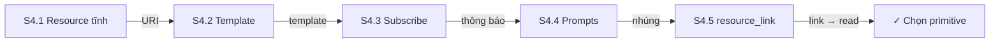
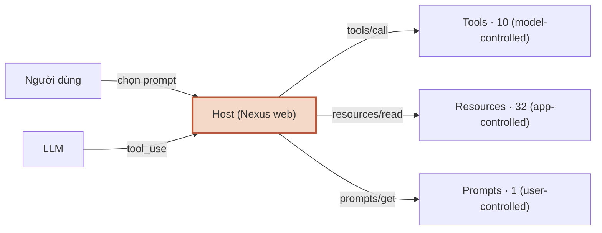
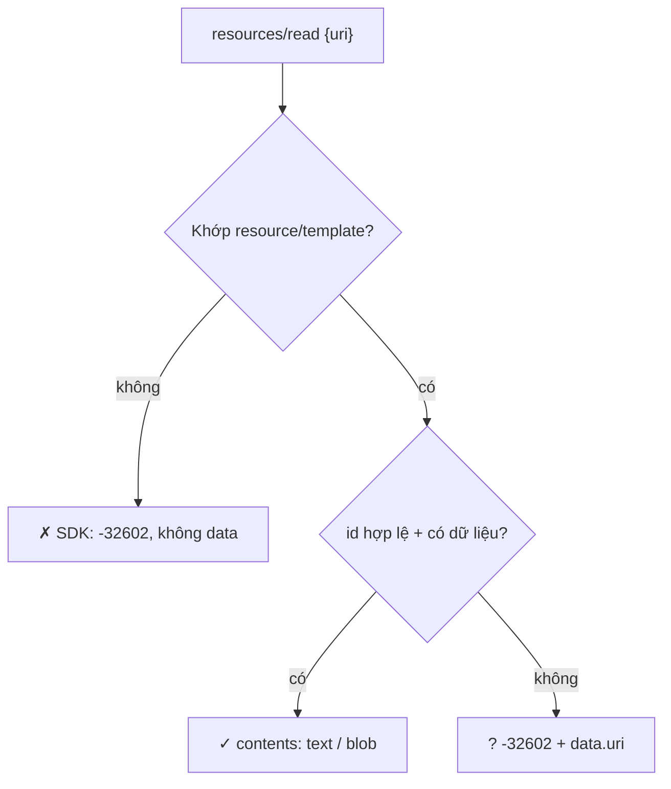
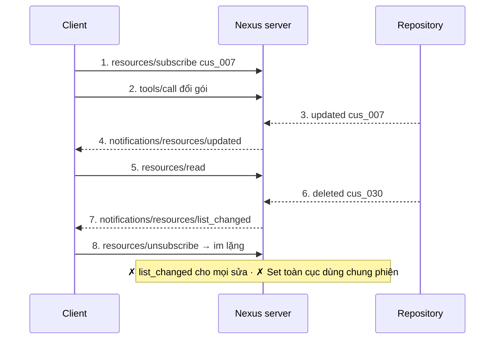
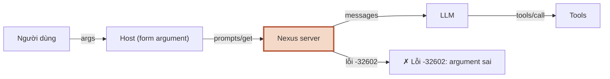
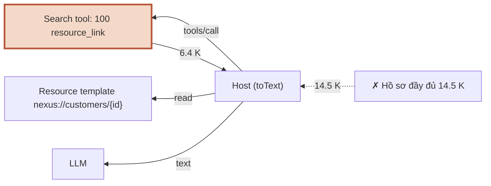

# Module 4 — MCP: Resources & Prompts

> Roadmap MCP × Full-Stack AI · 5 session · 1.5 tuần · C50 Lab 11–18 · 32 resource, 1 template, 1 prompt, tool trả resource_link

## Mục lục

- **Tổng quan** — MCP: Resources & Prompts
- **S4.1** — Static resources & URI design
- **S4.2** — Resource templates & binary
- **S4.3** — Subscription & list-changed
- **S4.4** — Prompts
- **S4.5** — resource_link
- **Kiểm tra cuối** — Exit check Module 4

---

## Module 4 — MCP: Resources & Prompts

M3 làm tool cho đúng. M4 thêm hai primitive còn lại của phía server, và điểm khác cốt lõi không nằm ở API mà ở **ai được quyết định**: tool do **model** chọn gọi, resource do **ứng dụng (host)** chọn đưa vào context, prompt do **người dùng** chọn từ menu. Chọn sai primitive là lỗi thiết kế, không phải lỗi code — mọi thứ vẫn chạy, chỉ là LLM đoán mò, context phình, hoặc người dùng không tìm thấy tính năng.

Kết quả sau module: `apps/mcp-server` có resource tĩnh `nexus://docs/glossary`, template `nexus://customers/{id}` (30 khách), resource nhị phân (biểu đồ PNG), subscription + `list_changed` nối với repository, prompt `nexus_weekly_summary(team, language?)` và tool `nexus_search_customers` trả `resource_link`. Host Nexus web đọc glossary và đưa vào system prompt.

> **Repo Nexus của bài được dựng lại từ nội dung M3.** Sandbox dựng M4 không có `nexus-m3.zip`, nên `nexus/` được viết lại theo `m3.src.md` (cùng tên file, cùng hành vi: 9 tool `nexus_*`, `toolOk`/`toolFail`, `instrument`, rates client, progress, logger 2 sink, host web lọc `readOnlyHint`). Chi tiết nhỏ có thể lệch bản bạn đang có. Diff trong bài lấy từ commit “M3 baseline (dựng lại từ m3.src.md)” → “M4”. `deploy/` của M2 không dựng lại (M4 không đụng tới).

### 5 session

| Session | Học gì | Output |
|---|---|---|
| **S4.1** Static resources & URI design | `registerResource`, list/read, thiết kế URI `nexus://`, annotations; tool vs resource vs prompt — ai chọn · C50 Lab 11 | `nexus://docs/glossary`; host web nạp glossary vào system prompt |
| **S4.2** Resource templates & binary | `ResourceTemplate`, trích biến, id không tồn tại → `-32602` + `data.uri`, `blob` vs `text`, MIME · C50 Lab 12–13 | `nexus://customers/{id}`, `nexus://charts/customers-by-city.png` |
| **S4.3** Subscription & list-changed | `resources/subscribe`, `notifications/resources/updated` ≠ `list_changed`, repository phát sự kiện, hủy khi phiên đóng · C50 Lab 14–15 | Đổi gói → `updated`; xóa khách → `list_changed`; unsubscribe → im lặng |
| **S4.4** Prompts | `registerPrompt`, argument luôn là chuỗi, mặc định đặt ở đâu, nhúng resource vào message · C50 Lab 16–17 | `nexus_weekly_summary(team, language?)` |
| **S4.5** resource_link | Tool trả tham chiếu thay vì nội dung; host đọc khi cần; đo context · C50 Lab 18 | `nexus_search_customers` — 100 kết quả = 6.4 K ký tự |

### Phiên bản đã chạy

```console
$ node -v && pnpm -v && pnpm exec tsc -v
v22.22.2
10.28.0
Version 7.0.2
$ pnpm -r ls --depth 0 @modelcontextprotocol/sdk zod mongodb next react | grep -v "^$"
Legend: production dependency, optional only, dev only
@nexus/mcp-server /home/claude/nexus/apps/mcp-server (PRIVATE)
dependencies:
@modelcontextprotocol/sdk 1.30.1
mongodb 7.7.0
zod 4.6.5
@nexus/web /home/claude/nexus/apps/web (PRIVATE)
dependencies:
@modelcontextprotocol/sdk 1.30.1
next 16.3.7
react 19.3.0
zod 4.6.5
@nexus/shared /home/claude/nexus/packages/shared (PRIVATE)
dependencies:
zod 4.6.5
$ npm view @modelcontextprotocol/sdk dist-tags.latest && npm view @modelcontextprotocol/server version
1.31.0
2.2.0
```

| Khác biệt phiên bản gặp khi dựng bài | Xử lý trong bài |
|---|---|
| `@modelcontextprotocol/sdk` **1.31.0** ra ngày 28/09 (dist-tag `latest`); M3 dùng 1.30.1 | Code bài giữ **1.30.1** như M3 (khớp C50). Đã chạy thử 1.31.0 cho 3 hành vi của M4: giống hệt 1.30.1 (output ở Cheat Sheet Tổng quan) |
| Spec **2026-07-28**: resource không tồn tại **MUST** trả `-32602` + `data.uri` (bản 2025-11-25 gợi ý `-32002`; client SHOULD chấp nhận cả hai) | Nexus trả `-32602` + `data: { uri }` — đúng spec mới, tương thích bản cũ, và cùng mã SDK v1 tự trả khi URI không khớp gì |
| Spec 2026-07-28 thay `resources/subscribe` bằng `subscriptions/listen` (lọc theo `resourceSubscriptions`); SDK 1.30 chỉ thương lượng tới `2025-11-25` | Bài dạy `resources/subscribe` (C50 + SDK v1). Ghi chú cách chuyển ở S4.3 |
| SDK **v2** (`@modelcontextprotocol/server` 2.2.0): `ResourceNotFoundError`, `.default()` của prompt công bố `required: false`, subscription do SDK quản qua `ServerEventBus` / `notify.*` | Không đổi code bài; ghi chú khác biệt + cách chuyển ở S4.2, S4.3, S4.4 |
| SDK 1.30: `McpError` ném trong read callback → client thấy tiền tố `MCP error -32602:` **2 lần** | Nexus ném `ResourceError` (Error có `code` + `data`), không dùng `McpError` (S4.2) |
| SDK 1.30/1.31 + Zod 4: field `.default()` trong `argsSchema` của prompt được công bố `required: true` | `.optional()` + mặc định áp trong handler (S4.4) |
| `McpServer` v1 tự khai `resources.listChanged` nhưng **không** xử lý `resources/subscribe` | Tự khai `subscribe: true` + 2 handler (S4.3) |
| Next.js 16.3 (Turbopack) cảnh báo `path.resolve(process.cwd(), …)` trong host | Thêm `/*turbopackIgnore: true*/` (build sạch cảnh báo) |

### Đã chạy thật gì, chưa chạy gì

Sandbox dựng bài không có: harness chấm C50, Claude Desktop, Docker daemon/MongoDB (tải MongoDB bị proxy chặn), đường ra internet. Bài **không** bịa output cho phần chưa chạy.

| Phần | Trạng thái | Thay thế đã chạy |
|---|---|---|
| C50 Lab 11–18 (`npm run check`) | ✗ chưa chạy ở sandbox | — (lab C50 chỉ dạy đủ để tự làm, không có lời giải) |
| Resources, template, blob, subscribe, prompt, `resource_link` của Nexus; `pnpm check` | ✓ chạy thật | SDK client thật qua stdio và qua `InMemoryTransport`, dữ liệu RAM cùng hợp đồng repository |
| Claude Desktop: menu prompt, chọn resource, hiển thị `resource_link` | ✗ chưa chạy ở sandbox | SDK client (`scripts/read.ts`, `scripts/prompt.ts`); host Nexus web đọc resource (chạy thật) |
| MongoDB: change stream cho `watch()`, `search()` trên Mongo | ✗ (không có Mongo) | Bản Mongo qua `tsc` strict; bản RAM chạy thật cùng hợp đồng |
| Host Nexus web đưa glossary vào context | ✓ chạy thật (`next build` + `next start`) | LLM là provider giả lập như M2/M3 |
| SDK 1.31.0 và SDK v2 2.2.0 | ✓ chạy thật (chỉ để so sánh) | `lesson-code/m4-sdk/check.mjs` |

### Cách dùng trang

- Mỗi session: **Lý thuyết + Lab** (bảng C# → TS, lab C50 + lab Nexus có AC và lệnh nghiệm thu, bẫy có lỗi thật, code mẫu & pattern, 3 câu trắc nghiệm) · **Cheat Sheet** · **Code** (toàn bộ file của session theo cây thư mục).
- **Luật vàng C50:** tự code tới khi `npm run check` xanh rồi mới xem video Review. Trang này không có lời giải C50.
- Lời giải lab Nexus nằm trong mục thu gọn “Xem sau khi làm xong”. Tab Code có toàn bộ file — mở khi đã làm xong.
- Ô tick AC được nhớ trên trình duyệt này. Tick khi lệnh nghiệm thu xanh.

### Exit check Module 4

- [ ] C50 Lab 11–18 xanh hết.
- [ ] Với 5 tính năng bất kỳ, chọn đúng tool / resource / prompt và bảo vệ được lựa chọn (bài thực hành 4 ở [Kiểm tra cuối](#fx)).
- [ ] Trang Kiểm tra cuối: mọi session ≥ 80%.


---

## Tổng quan · Cheat Sheet

### Bản đồ module

**Sơ đồ (Bản đồ dịch vụ) — Module 4 gồm những session nào, nối vào nhau ra sao?**



**Đọc sơ đồ:** Đọc từ ô đầu (trái trên) sang phải, vòng xuống hàng dưới và đi ngược về trái tới đích. Nhãn mũi tên = thứ mang sang session sau. *Màu: xanh ô-liu + ✓ = đã xong / đích · viền terracotta = đang học · be = sắp học.*


### Chọn primitive

| Câu hỏi | Tool | Resource | Prompt |
|---|---|---|---|
| Ai quyết định dùng? | Model, giữa cuộc chat | Ứng dụng (host) / người dùng chọn đính kèm | Người dùng, từ menu / slash command |
| Có tác dụng phụ / tính toán theo tham số? | Có thể | Không — chỉ đọc | Không — chỉ sinh message |
| Định danh | Tên `nexus_<động từ>_<danh từ>` | URI `nexus://<nhóm>/<id>` | Tên `nexus_<việc>` |
| Lỗi đi đường nào | `result.isError` (model đọc) | JSON-RPC error (host đọc) | JSON-RPC error (host đọc) |
| Nexus | `nexus_list_customers`, `nexus_search_customers` | `nexus://docs/glossary`, `nexus://customers/{id}` | `nexus_weekly_summary` |

### Bảng pattern của module

| Pattern | Session | Tương đương C# / .NET | Dùng khi |
|---|---|---|---|
| Nạp một lần lúc import (module singleton) | S4.1 | `static readonly Lazy<string>`, `IFileProvider` đăng ký singleton | Tài liệu tĩnh đi cùng mã: đọc 1 lần, không class provider, không container |
| Lỗi mang mã giao thức (`ResourceError` + 2 hàm tạo) | S4.2 | `ProblemDetails`, `BadHttpRequestException(StatusCode)` | Resource/request lỗi phải ra JSON-RPC error đúng `code` + `data`, không cần cây exception |
| Observer trả hàm hủy (`watch() → Unwatch`) + union sự kiện | S4.3 | `IObservable<T>.Subscribe → IDisposable`, `event +=/-=` | Nối nguồn thay đổi (repo, change stream) với thông báo MCP, hủy chắc chắn khi phiên đóng |
| Bảng tra `Record<K, V>` thay Strategy/Factory | S4.4 | `Dictionary<Team, IStrategy>` + factory | Nội dung thay đổi theo 1–2 khóa hữu hạn; tsc bắt thiếu khóa |
| Tham chiếu thay giá trị (claim-check / `resource_link`) | S4.5 | HATEOAS link, Claim Check pattern | Kết quả nhiều/dày: trả URI để đọc khi cần, không nhồi nội dung |


### Lệnh cả module

```console
$ pnpm check                                                            # typecheck 3 package + smoke (tool + resource + prompt)
$ cd apps/mcp-server
$ node scripts/read.ts nexus://customers/cus_007                        # resources/read qua MCP client thật
$ node scripts/prompt.ts nexus_weekly_summary '{"team":"sales"}'        # prompts/get — mọi argument là chuỗi
$ node scripts/call.ts nexus_search_customers '{"query":"cà phê"}'      # tool trả resource_link
```

### SDK 1.31.0 và SDK v2 với 3 hành vi của M4

```console
$ node check.mjs
sdk 1.31.0 · prompt .default() → required=true
sdk 1.31.0 · read nexus://docs/nope → code=-32602 message="MCP error -32602: MCP error -32602: Resource nexus://docs/nope not found" data=undefined
sdk 1.31.0 · read nexus://customers/cus_999 → code=-32602 message="MCP error -32602: MCP error -32602: Resource nexus://customers/cus_999 not found" data=undefined
sdk v2 2.2.0 · prompt .default() → required=false
sdk v2 2.2.0 · read nexus://docs/nope → code=-32602 message="Resource not found: nexus://docs/nope" data={"uri":"nexus://docs/nope"}
sdk v2 2.2.0 · read nexus://customers/cus_999 → code=-32602 message="Resource not found: nexus://customers/cus_999" data={"uri":"nexus://customers/cus_999"}
```

### 12 bẫy của module

| # | Bẫy | Session | Dấu hiệu |
|---|---|---|---|
| 1 | URI lệch 1 ký tự (`/` cuối, hoa/thường, query) | S4.1 | `-32602 Resource … not found` |
| 2 | URI thiếu scheme | S4.1 | `-32603 Invalid URL` |
| 3 | Ném `McpError` trong read callback | S4.2 | `MCP error -32002: MCP error -32002: …` |
| 4 | Read callback để exception bay ra | S4.2 | `-32603 connect ECONNREFUSED 127.0.0.1:27999` |
| 5 | `blob` là data URL / byte PNG nhét vào `text` | S4.2 | `Invalid Base64 string` / chữ ký `c289504e` |
| 6 | Quên khai capability `subscribe` | S4.3 | Host chặt: `Server does not support resource subscriptions` |
| 7 | `list_changed` cho mọi thay đổi | S4.3 | Client tải lại list 10 lần / 10 lần sửa |
| 8 | Tập subscription toàn cục | S4.3 | Phiên B nhận `updated` của phiên A |
| 9 | Nghe repository không hủy | S4.3 | 100 phiên → 100 listener còn sống |
| 10 | `.default()` trong `argsSchema` của prompt | S4.4 | `required: true` dù có mặc định |
| 11 | Argument prompt kiểu số / role `system` | S4.4 | `expected number, received string` / `Invalid option: expected one of "user"…` |
| 12 | `resource_link` thiếu `name` / trỏ URL REST | S4.5 | `Invalid tools/call result` / `Resource https://… not found` |


---

## Tổng quan · Code

### Cây repo sau Module 4

```txt
nexus/
├─ package.json · pnpm-workspace.yaml · tsconfig.base.json · .gitignore · .dockerignore
├─ packages/shared/src/        index.ts · tools.ts · customer.ts · exchange-rate.ts · chat.ts
│                              resources.ts · prompts.ts                                        (M4)
├─ apps/mcp-server/
│  ├─ src/                     index.ts · server.ts · deps.ts · env.ts · log.ts · db.ts
│  │  ├─                       tool-result.ts (toolOkLinks — M4) · instrument.ts · progress.ts · png.ts
│  │  ├─ rates/client.ts
│  │  ├─ tools/                9 tool của M3 + search-customers.ts                               (M4)
│  │  ├─ resources/            glossary.md · docs.ts · customers.ts · charts.ts
│  │  │                        errors.ts · subscriptions.ts                                      (M4)
│  │  ├─ prompts/              weekly-summary.ts                                                 (M4)
│  │  └─ customers/            repository.ts (search, watch — M4) · memory-repository.ts · mongo-repository.ts · seed-data.ts
│  └─ scripts/                 smoke.ts · call.ts · read.ts (M4) · prompt.ts (M4) · rates-stub.ts · seed.ts · tx-check.ts
├─ apps/web/                   app/ · lib/llm/ · lib/mcp/host.ts (context() — M4) · scripts/chat-probe.ts
└─ infra/docker-compose.yml
```

### Gốc repo

`package.json`

```json
{
  "name": "nexus",
  "private": true,
  "type": "module",
  "packageManager": "pnpm@10.28.0",
  "engines": {
    "node": ">=22.18"
  },
  "scripts": {
    "typecheck": "pnpm -r typecheck",
    "smoke": "pnpm --filter @nexus/mcp-server smoke",
    "check": "pnpm typecheck && pnpm smoke"
  },
  "devDependencies": {
    "@types/node": "^22.19.0",
    "typescript": "7.0.2"
  }
}
```
`pnpm-workspace.yaml`

```yaml
packages:
  - "apps/*"
  - "packages/*"
```
`tsconfig.base.json`

```json
{
  "compilerOptions": {
    "target": "ES2023",
    "lib": ["ES2023"],
    "module": "NodeNext",
    "moduleResolution": "NodeNext",
    "strict": true,
    "noUncheckedIndexedAccess": true,
    "exactOptionalPropertyTypes": false,
    "noEmit": true,
    "allowImportingTsExtensions": true,
    "erasableSyntaxOnly": true,
    "verbatimModuleSyntax": true,
    "isolatedModules": true,
    "skipLibCheck": true,
    "types": ["node"]
  }
}
```
`apps/mcp-server/package.json`

```json
{
  "name": "@nexus/mcp-server",
  "private": true,
  "type": "module",
  "scripts": {
    "start": "node src/index.ts",
    "typecheck": "tsc -p tsconfig.json",
    "smoke": "node scripts/smoke.ts",
    "seed": "node scripts/seed.ts"
  },
  "dependencies": {
    "@modelcontextprotocol/sdk": "1.30.1",
    "@nexus/shared": "workspace:*",
    "mongodb": "7.7.0",
    "zod": "4.6.5"
  }
}
```

### Composition root sau M4

`apps/mcp-server/src/server.ts`

```ts
import { McpServer } from "@modelcontextprotocol/sdk/server/mcp.js";
import type { Deps } from "./deps.ts";
import { registerPing } from "./tools/ping.ts";
import { registerGetTime } from "./tools/get-time.ts";
import { registerListCustomers } from "./tools/list-customers.ts";
import { registerGetCustomer } from "./tools/get-customer.ts";
import { registerGetExchangeRate } from "./tools/get-exchange-rate.ts";
import { registerChartCustomersByCity } from "./tools/chart-customers-by-city.ts";
import { registerUpdateCustomerTier } from "./tools/update-customer-tier.ts";
import { registerDeleteCustomer } from "./tools/delete-customer.ts";
import { registerGenerateReport } from "./tools/generate-report.ts";
import { registerSearchCustomers } from "./tools/search-customers.ts";
import { registerDocs } from "./resources/docs.ts";
import { registerCustomerResources } from "./resources/customers.ts";
import { registerChartResources } from "./resources/charts.ts";
import { enableResourceSubscriptions } from "./resources/subscriptions.ts";
import { registerWeeklySummary } from "./prompts/weekly-summary.ts";

export type { Deps } from "./deps.ts";

const INSTRUCTIONS =
  "Server dữ liệu nội bộ của Nexus: khách hàng, tỷ giá, báo cáo. " +
  "Mọi tool có prefix nexus_. Thuật ngữ nghiệp vụ ở resource nexus://docs/glossary; " +
  "hồ sơ khách ở nexus://customers/{id}. Không đoán số liệu khi tool trả lỗi — báo người dùng.";

/** Composition root của MCP server: không biết transport (stdio hay HTTP ở M7). */
export function createServer(deps: Deps): McpServer {
  const server = new McpServer(
    { name: "nexus", version: "0.4.0" },
    { instructions: INSTRUCTIONS, capabilities: { logging: {} } },
  );
  // Tools — model chọn gọi
  registerPing(server, deps);
  registerGetTime(server, deps);
  registerListCustomers(server, deps);
  registerGetCustomer(server, deps);
  registerGetExchangeRate(server, deps);
  registerChartCustomersByCity(server, deps);
  registerUpdateCustomerTier(server, deps);
  registerDeleteCustomer(server, deps);
  registerGenerateReport(server, deps);
  registerSearchCustomers(server, deps);
  // Resources — ứng dụng chọn đưa vào context (M4)
  registerDocs(server);
  registerCustomerResources(server, deps);
  registerChartResources(server, deps);
  enableResourceSubscriptions(server, deps);
  // Prompts — người dùng chọn (M4)
  registerWeeklySummary(server);
  return server;
}
```

### So sánh phiên bản SDK (lesson-code, không thuộc repo)

`lesson-code/m4-sdk/check.mjs`

```js
// So 3 hành vi của M4 trên SDK 1.31.0 (v1 mới nhất) và SDK v2 2.2.0 — code bài vẫn dùng 1.30.1.
import { z } from "zod";
import { McpServer as McpServer131 } from "sdk131/server/mcp.js";
import { Client as Client131 } from "sdk131/client/index.js";
import { InMemoryTransport as Mem131 } from "sdk131/inMemory.js";
import { McpServer as McpServerV2, ResourceTemplate as TemplateV2, ResourceNotFoundError, InMemoryTransport as MemV2 } from "@modelcontextprotocol/server";
import { Client as ClientV2 } from "@modelcontextprotocol/client";

async function run(label, Server, Client, Mem, extra) {
  const s = new Server({ name: "check", version: "1" });
  s.registerPrompt("p", { argsSchema: extra.args({ language: z.enum(["vi", "en"]).default("vi") }) }, async ({ language }) => ({
    messages: [{ role: "user", content: { type: "text", text: language } }],
  }));
  s.registerResource("c", "nexus://docs/glossary", {}, async (uri) => ({ contents: [{ uri: uri.href, text: "x" }] }));
  extra.template?.(s);
  const [a, b] = Mem.createLinkedPair();
  await s.connect(a);
  const c = new Client({ name: "check", version: "1" });
  await c.connect(b);
  const { prompts } = await c.listPrompts();
  console.log(`${label} · prompt .default() → required=${prompts[0].arguments[0].required}`);
  for (const uri of ["nexus://docs/nope", "nexus://customers/cus_999"]) {
    try {
      await c.readResource({ uri });
    } catch (e) {
      console.log(`${label} · read ${uri} → code=${e.code} message=${JSON.stringify(e.message)} data=${JSON.stringify(e.data)}`);
    }
  }
  await c.close();
}

await run("sdk 1.31.0", McpServer131, Client131, Mem131, { args: (shape) => shape });
await run("sdk v2 2.2.0", McpServerV2, ClientV2, MemV2, {
  args: (shape) => z.object(shape),
  template: (s) =>
    s.registerResource("customer", new TemplateV2("nexus://customers/{id}", { list: undefined }), {}, async (uri) => {
      throw new ResourceNotFoundError(uri.href);
    }),
});
```
`lesson-code/m4-sdk/package.json`

```json
{ "name": "m4-sdk-check", "private": true, "type": "module",
  "dependencies": { "sdk131": "npm:@modelcontextprotocol/sdk@1.31.0", "@modelcontextprotocol/server": "2.2.0", "@modelcontextprotocol/client": "2.2.0", "zod": "4.6.5" } }
```

Code từng phần nằm ở tab **Code** của session tương ứng.

---

## S4.1 — Static resources & URI design

Mục tiêu: biết khi nào dữ liệu nên là **resource** thay vì tool, công bố resource tĩnh đúng chuẩn (URI, metadata, MIME), và cho host của mình dùng nó.

### C# → TS/Node

| Khái niệm C# | Tương đương TS/Node | Khác ở đâu |
|---|---|---|
| `app.MapGet("/docs/glossary", …)` | `server.registerResource(name, "nexus://docs/glossary", meta, read)` | Định danh là **URI tuyệt đối** so khớp nguyên văn, không có routing/middleware |
| `EmbeddedResource` / `IFileProvider` | `readFileSync(new URL("./glossary.md", import.meta.url))` lúc import | `import.meta.url` thay `AppContext.BaseDirectory`; đọc 1 lần là đủ |
| `Content-Type` header | `mimeType` trong metadata **và** trong từng `contents[]` | Host dùng để quyết định đưa cho model hay chỉ hiển thị |
| `Content-Length` | `size` (byte) | Là **byte**, không phải ký tự: glossary 1536 byte = 1264 ký tự |
| `[ResponseCache]`, `Last-Modified` | `annotations.lastModified`, `priority`, `audience` | Gợi ý cho host, không có cơ chế cache HTTP |
| Swagger liệt kê endpoint | `resources/list` | Host liệt kê cho **người/ứng dụng** chọn; model không thấy danh sách này |
| Controller action model gọi được | Tool | Resource **không** nằm trong `tools/list` — model không tự gọi được |
| `404 Not Found` | JSON-RPC error `-32602` + `data.uri` | Không có `isError` như tool (chi tiết S4.2) |

### Lab

#### Lab C50 — 11 Static Resources

**Mục tiêu:** công bố dữ liệu tĩnh dạng resource: liệt kê được, đọc được, URI đặt đúng; và biết lúc nào nên trả dữ liệu từ tool thay vì publish thành resource.

- [ ] Lab 11 xanh.

**Lệnh nghiệm thu** (trong repo C50, thư mục của lab — chưa chạy ở sandbox dựng bài):

```console
$ npm run check
```

Cần nắm để tự làm (không phải lời giải):

- `registerResource(name, uri, metadata, readCallback)` với `uri` là **chuỗi** (không có `{…}`) = resource tĩnh. Read callback nhận `URL` đã parse và trả `{ contents: [...] }` — `contents` là **mảng**, mỗi phần tử có `uri` (dùng `uri.href`), `mimeType`, và `text` **hoặc** `blob`.
- Harness so URI nguyên văn: scheme, chữ hoa/thường, dấu `/` cuối đều tính (Bẫy 1). Copy URI từ đề.
- `resources/list` lấy metadata từ tham số thứ 3 (`title`, `description`, `mimeType`, …). Đề thường kiểm cả metadata, không chỉ nội dung.
- Câu hỏi Review của lab (“trả từ tool hay publish thành resource?”): dùng câu hỏi quyết định ở mục “Ai quyết định đưa dữ liệu vào context” bên dưới.

#### Lab Nexus S4.1 — `nexus://docs/glossary` + host nạp vào context

**Mục tiêu:** thuật ngữ nghiệp vụ (MRR, churn, gói, tuần báo cáo…) thành resource tĩnh `text/markdown`; host Nexus web đọc **1 lần** khi kết nối và đưa vào system prompt — câu hỏi “X là gì?” trả lời được mà không gọi tool.

- [ ] `pnpm check` xanh; smoke có dòng `✓ resources/list (…) có nexus://docs/glossary` và `✓ resources/read glossary → … ký tự`.
- [ ] Metadata có `title`, `description`, `mimeType: "text/markdown"`, `size` (byte), `annotations`.
- [ ] URI lấy từ **một** hằng `RESOURCE` trong `packages/shared` (server và web cùng import).
- [ ] `chat-probe "MRR là gì?"` trả định nghĩa MRR và **không** có event `tool_start`.
- [ ] Viết 3 câu: khi nào chọn resource thay vì tool, mỗi câu 1 ví dụ trong Nexus (so với bảng “Chọn primitive” ở Cheat Sheet Tổng quan).

**Lệnh nghiệm thu:**

```console
$ pnpm check
$ (cd apps/mcp-server && node scripts/read.ts nexus://docs/glossary | head -3)
$ (cd apps/web && pnpm build && NEXUS_DATA=memory PORT=3100 pnpm start &)
$ node apps/web/scripts/chat-probe.ts http://localhost:3100 "MRR là gì?"
```

**Gợi ý hướng làm:** `packages/shared/src/resources.ts` (hằng URI) → `apps/mcp-server/src/resources/glossary.md` + `docs.ts` → đăng ký trong `server.ts` → `apps/web/lib/mcp/host.ts` thêm `context()` → `route.ts` ghép vào system prompt. `scripts/read.ts` có trong tab Code.

Output thật — host nhìn thấy gì từ server (script `lesson-code/m4/resources-tour.ts`):

```console
$ node m4/resources-tour.ts
tools/list               10 tool   → host đưa cho LLM, LLM tự quyết gọi
resources/list           32 resource (2 tĩnh + 30 khách từ template)
resources/templates/list 1 template: nexus://customers/{id}
prompts/list             1 prompt: nexus_weekly_summary
tool nào tên chứa 'glossary'? 0

resources/read nexus://docs/glossary → text/markdown · 1264 ký tự · 3 ms
# Thuật ngữ nghiệp vụ Nexus

Tài liệu tham chiếu cho trợ lý và người dùng. Khi câu hỏi dùng các từ dưới đây, hiểu theo đúng định nghĩa này.
```

Và host web sau M4 (provider giả lập, MCP server thật) — 2 câu đầu trả lời từ glossary, không có `tool_start`; câu 3 vẫn đi qua tool:

```console
$ node apps/web/scripts/chat-probe.ts http://localhost:3100 "MRR là gì?"
1147 ms  {"type":"done"}
answer: MRR (Monthly Recurring Revenue): doanh thu định kỳ hằng tháng, chỉ tính khách gói pro và enterprise.
$ node apps/web/scripts/chat-probe.ts http://localhost:3100 "Churn là gì?"
578 ms  {"type":"done"}
answer: Churn: khách rời bỏ (bị xóa khỏi hệ thống) trong kỳ. Tỷ lệ churn = số khách rời bỏ / số khách đầu kỳ.
$ node apps/web/scripts/chat-probe.ts http://localhost:3100 "Có bao nhiêu khách hàng ở Hà Nội?"
95 ms  {"type":"tool_start","name":"nexus_list_customers","input":{"city":"Hà Nội","limit":5}}
96 ms  {"type":"tool_end","name":"nexus_list_customers","isError":false,"ms":13}
177 ms  {"type":"done"}
answer: Có 12 khách hàng.
```

Cùng câu hỏi với host của M3 (commit “M3 baseline”, chạy song song ở cổng 3101) — host chưa đọc resource nào:

```console
$ node apps/web/scripts/chat-probe.ts http://localhost:3101 "MRR là gì?"
834 ms  {"type":"done"}
answer: Mình chưa hiểu câu hỏi.
```

<details>
<summary>Xem sau khi làm xong — lời giải Lab Nexus S4.1</summary>

`packages/shared/src/resources.ts`

```ts
// URI resource của Nexus — MỘT nguồn cho server (đăng ký), host (web đọc glossary), tool (resource_link).
// Quy ước: nexus://<nhóm>/<định danh>. Scheme riêng vì client KHÔNG tự tải được — phải đọc qua MCP server
// (spec: https:// chỉ dùng khi client tự fetch được).

export const RESOURCE = {
  glossary: "nexus://docs/glossary",
  customersByCityChart: "nexus://charts/customers-by-city.png",
} as const;

export const RESOURCE_TEMPLATE = {
  customer: "nexus://customers/{id}",
} as const;

export const customerUri = (id: string): string => `nexus://customers/${encodeURIComponent(id)}`;

export type ResourceUri = (typeof RESOURCE)[keyof typeof RESOURCE];
```
`apps/mcp-server/src/resources/docs.ts`

```ts
import { readFileSync } from "node:fs";
import type { McpServer } from "@modelcontextprotocol/sdk/server/mcp.js";
import { RESOURCE } from "@nexus/shared";

// Đọc 1 lần lúc khởi động: tài liệu tĩnh, đi cùng mã nguồn (Docker image copy cả src/).
const GLOSSARY = readFileSync(new URL("./glossary.md", import.meta.url), "utf8");
const GLOSSARY_MODIFIED = "2026-09-28T00:00:00Z";

export function registerDocs(server: McpServer): void {
  server.registerResource(
    "glossary",
    RESOURCE.glossary,
    {
      title: "Thuật ngữ nghiệp vụ Nexus",
      description: "Định nghĩa khách hàng, gói dịch vụ, MRR, churn, tuần báo cáo, nhóm nội bộ. Nạp vào context trước khi trả lời câu hỏi nghiệp vụ.",
      mimeType: "text/markdown",
      size: Buffer.byteLength(GLOSSARY),
      annotations: { audience: ["assistant", "user"], priority: 0.9, lastModified: GLOSSARY_MODIFIED },
    },
    async (uri) => ({ contents: [{ uri: uri.href, mimeType: "text/markdown", text: GLOSSARY }] }),
  );
}

export const glossaryText = (): string => GLOSSARY;
```
`apps/mcp-server/src/resources/glossary.md`

```md
# Thuật ngữ nghiệp vụ Nexus

Tài liệu tham chiếu cho trợ lý và người dùng. Khi câu hỏi dùng các từ dưới đây, hiểu theo đúng định nghĩa này.

## Khách hàng

- **Khách hàng (customer)**: một doanh nghiệp đang dùng Nexus. Id dạng `cus_` + số, ví dụ `cus_007`.
- **Thành phố**: nơi đặt văn phòng chính của khách. Chỉ có 5 giá trị: Hà Nội, Hải Phòng, TP.HCM, Đà Nẵng, Cần Thơ.
- **Khách mới**: khách có ngày tạo (`createdAt`) nằm trong tuần báo cáo.

## Gói dịch vụ (tier)

- **free**: miễn phí, không có hỗ trợ trực tiếp.
- **pro**: trả phí theo tháng, hỗ trợ trong giờ hành chính.
- **enterprise**: hợp đồng năm, có người phụ trách riêng.
- **Nâng gói (upgrade)**: đổi từ free → pro, pro → enterprise hoặc free → enterprise. Chiều ngược lại là **hạ gói (downgrade)**.

## Chỉ số

- **MRR (Monthly Recurring Revenue)**: doanh thu định kỳ hằng tháng, chỉ tính khách gói pro và enterprise.
- **Churn**: khách rời bỏ (bị xóa khỏi hệ thống) trong kỳ. Tỷ lệ churn = số khách rời bỏ / số khách đầu kỳ.
- **Tuần báo cáo**: từ 00:00 thứ Hai tới 23:59 Chủ nhật, giờ Việt Nam (Asia/Ho_Chi_Minh).

## Nhóm nội bộ

- **sales**: quan tâm khách mới và nâng gói.
- **cs** (customer success): quan tâm khách enterprise, hạ gói và churn.
- **finance**: quan tâm MRR và tỷ giá quy đổi.
```

Host web (diff thật M3 → M4, trích các hunk về glossary — phần `toText` nằm ở S4.5):

`apps/web/lib/mcp/host.ts`

```diff
 import type { CallToolResult, Tool } from "@modelcontextprotocol/sdk/types.js";
+import { RESOURCE } from "@nexus/shared";
 import type { ToolSpec } from "../llm/types.ts";
 
 export interface McpHost {
   tools(): ToolSpec[];
+  /** Resource mà ỨNG DỤNG chọn đưa vào system prompt (M4 · S4.1). Model không tự gọi được resource. */
+  context(): string;
   call(name: string, input: Record<string, unknown>, signal: AbortSignal): Promise<{ text: string; isError: boolean }>;
 
+/** Đọc resource text; server không có resource này thì trả chuỗi rỗng (host vẫn chạy). */
+async function readText(client: Client, uri: string): Promise<string> {
+  try {
+    const { contents } = await client.readResource({ uri });
+    return contents.map((c) => ("text" in c ? c.text : "")).join("\n");
+  } catch {
+    return "";
+  }
+}
 
   const allowed = tools.filter((t) => t.annotations?.readOnlyHint === true);
+  // Đọc 1 lần lúc kết nối, dùng cho mọi tin nhắn (resource tĩnh — M4 · S4.3 mới cần theo dõi thay đổi)
+  const glossary = await readText(client, RESOURCE.glossary);
   return {
     tools: () => allowed.map(toSpec),
+    context: () => glossary,
```

`apps/web/app/api/chat/route.ts`

```diff
           let called = false;
-          for await (const ev of llm.stream({ system: SYSTEM, messages, tools: host.tools() }, signal)) {
+          const system = host.context() ? `${SYSTEM}\n\n<glossary>\n${host.context()}\n</glossary>` : SYSTEM;
+          for await (const ev of llm.stream({ system, messages, tools: host.tools() }, signal)) {
             if (ev.type === "text") send({ type: "text", delta: ev.delta });
```

</details>

<details>
<summary>Tra khi test đỏ</summary>

| Triệu chứng | Nguyên nhân | Sửa |
|---|---|---|
| `-32602 … Resource nexus://docs/glossary/ not found` | URI lệch 1 ký tự so với lúc đăng ký (`/` cuối, hoa/thường, query) | Dùng hằng `RESOURCE.glossary` ở mọi nơi; không ghép chuỗi |
| `-32603 Invalid URL` | URI thiếu scheme (`docs/glossary`) — SDK gọi `new URL()` và ném | URI tuyệt đối: `nexus://docs/glossary` |
| `ENOENT … glossary.md` lúc khởi động | Đường dẫn tương đối theo `process.cwd()` | `new URL("./glossary.md", import.meta.url)` — theo vị trí file mã nguồn |
| Glossary không có trong `resources/list` | Đăng ký sau `server.connect()` mà client đã list trước đó | Đăng ký trong `createServer()` (trước connect); đăng ký muộn thì SDK tự gửi `list_changed` |
| `size` lệch với độ dài chuỗi | `size` là byte UTF-8, tiếng Việt 1 ký tự = 2–3 byte | `Buffer.byteLength(text)` |
| Chat vẫn gọi tool / trả lời “chưa hiểu” | Host không đọc resource, hoặc đọc lỗi bị nuốt thành `""` | Chạy `node scripts/read.ts nexus://docs/glossary`; log lỗi trong `readText` khi debug |
| Harness C50 báo sai metadata | Thiếu `mimeType`/`description` trong tham số thứ 3 | Metadata ở `registerResource`, không phải trong `contents` |

</details>

### Ai quyết định đưa dữ liệu vào context

**Sơ đồ (Bản đồ dịch vụ) — Ba primitive, ba người chọn: ai quyết định dữ liệu nào vào context?**



**Đọc sơ đồ:** Trái = 2 bên có thể 'muốn' dữ liệu (người dùng, LLM). Giữa = host, nơi DUY NHẤT nói chuyện với server. Phải = 3 primitive của Nexus. LLM chỉ đi tới được Tools; Resources do host tự chọn đọc; Prompts do người dùng chọn qua menu. *Màu: viền terracotta = host (điểm quyết định). Kịch bản kết thúc bằng ✗ = đường không tồn tại. Nhãn mũi tên = method JSON-RPC hoặc hành động.*


Ba primitive khác nhau ở **người chọn**, không ở dữ liệu. Cùng 1 hồ sơ khách có thể vừa là tool (`nexus_get_customer`) vừa là resource (`nexus://customers/{id}`, S4.2) — hai đường cho hai người chọn khác nhau.

Câu hỏi quyết định cho mỗi tính năng:

1. **Model cần tự quyết lúc nào lấy, với tham số nào?** → Tool. Ví dụ: “bao nhiêu khách ở Hà Nội” — model chọn gọi `nexus_list_customers` với `city`.
2. **Ứng dụng biết trước dữ liệu này luôn cần, hoặc người dùng muốn tự đính kèm?** → Resource. Ví dụ: glossary luôn cần để hiểu thuật ngữ; hồ sơ 1 khách người dùng kéo vào chat.
3. **Người dùng khởi động một quy trình có tên, có tham số?** → Prompt (S4.4). Ví dụ: “Tóm tắt tuần cho sales”.

Hệ quả thực tế: resource **không** có trong `tools/list`, nên host không làm gì thì model không bao giờ thấy nó (output `resources-tour` ở trên: 10 tool, 0 tool chứa “glossary”). Host quyết định: đưa vào system prompt (Nexus web), hiện trong picker cho người dùng chọn (Claude Desktop), hay tự động theo `annotations.priority`.

### Thiết kế URI

URI là **khóa** — so khớp nguyên văn sau `new URL(uri).href`. Quy ước Nexus:

| Quy tắc | Đúng | Sai |
|---|---|---|
| Scheme riêng khi client không tự tải được | `nexus://docs/glossary` | `https://nexus.local/docs/glossary` (spec: `https://` chỉ khi client tự fetch được) |
| `nexus://<nhóm>/<định danh>` — nhóm là danh từ số nhiều | `nexus://customers/cus_007` | `nexus://getCustomer?id=cus_007` |
| Chữ thường, ASCII, không `/` cuối | `nexus://charts/customers-by-city.png` | `nexus://Charts/Khách-theo-TP/` |
| Không lộ hạ tầng | `nexus://customers/cus_007` | `nexus://mongo/nexus/customers/cus_007` |
| 1 nguồn | `RESOURCE.glossary`, `customerUri(id)` | Chuỗi URI viết tay ở 3 file |

Đuôi `.png` trong `customers-by-city.png` là cho người đọc; host quyết định theo `mimeType`, không theo đuôi.

### Phần khác C# thật sự

**1. Không có routing.** SDK v1 so khớp `resources/read` theo thứ tự: resource tĩnh (so chuỗi `href` chính xác) → từng template. Không có normalize, không có “gần đúng” (Bẫy 1).

**2. Metadata nằm ở 2 chỗ.** `resources/list` lấy từ tham số thứ 3 của `registerResource`; `resources/read` trả `mimeType` trong từng phần tử `contents`. Host có thể chỉ gọi 1 trong 2 — khai cả hai.

**3. Resource là hợp đồng với host, không phải với model.** Description của tool viết cho model (M3). Description của resource viết cho **người/ứng dụng** chọn: “Định nghĩa khách hàng, gói dịch vụ, MRR…”. `annotations.audience` nói nội dung dành cho ai (`assistant`, `user`), `priority` 0–1 gợi ý mức cần đưa vào context.

**4. Đọc file theo vị trí module.** `new URL("./glossary.md", import.meta.url)` — tương đương `Path.Combine(AppContext.BaseDirectory, …)`. `process.cwd()` phụ thuộc chỗ bạn đứng khi chạy `node` (host spawn server từ `apps/web`).

### Bẫy dev .NET hay vấp

#### Bẫy 1 — URI lệch 1 ký tự

Quen ASP.NET bỏ qua `/` cuối và không phân biệt hoa thường. MCP thì không:

`lesson-code/m4/traps/uri-variants.ts`

```ts
// Bẫy S4.1 — URI là KHÓA so khớp nguyên văn (sau khi qua `new URL`), không phải đường dẫn "gần đúng".
import { attempt, connect } from "../connect.ts";

const c = await connect();
const VARIANTS = [
  "nexus://docs/glossary", // đúng
  "nexus://docs/glossary/", // thêm "/" cuối (host ghép chuỗi)
  "nexus://Docs/Glossary", // hoa/thường
  "nexus://docs/glossary?v=2", // thêm query
  "docs/glossary", // thiếu scheme
];
for (const uri of VARIANTS) {
  await attempt(uri.padEnd(28), () => c.readResource({ uri }), (r) => `ok, ${r.contents.length} content`);
}
console.log(`new URL('nexus://Docs/Glossary').href = ${new URL("nexus://Docs/Glossary").href}`);
await c.close();
```

```console
$ node m4/traps/uri-variants.ts
nexus://docs/glossary        → ok, 1 content (3 ms)
nexus://docs/glossary/       → [protocol error] code=-32602 MCP error -32602: MCP error -32602: Resource nexus://docs/glossary/ not found (3 ms)
nexus://Docs/Glossary        → [protocol error] code=-32602 MCP error -32602: MCP error -32602: Resource nexus://Docs/Glossary not found (1 ms)
nexus://docs/glossary?v=2    → [protocol error] code=-32602 MCP error -32602: MCP error -32602: Resource nexus://docs/glossary?v=2 not found (1 ms)
docs/glossary                → [protocol error] code=-32603 MCP error -32603: Invalid URL (1 ms)
new URL('nexus://Docs/Glossary').href = nexus://Docs/Glossary
```

Chỉ bản đúng từng ký tự đọc được. `new URL` giữ nguyên hoa/thường của phần host với scheme lạ (`nexus:`), nên `nexus://Docs/Glossary` là URI khác. Thiếu scheme còn tệ hơn: `-32603 Invalid URL` — lỗi **nội bộ** chứ không phải “không tìm thấy”, host khó hiểu. Chữa tận gốc: mọi nơi dùng `RESOURCE.*` / `customerUri()`.

Để ý dòng `MCP error -32602: MCP error -32602:` — tiền tố lặp 2 lần là của chính SDK 1.30 (S4.2 giải thích và tránh cho code của mình).

#### Bẫy 2 — tài liệu tĩnh làm thành tool

Dịch thẳng “GET /glossary” thành tool `nexus_get_glossary`. Chạy được, nhưng: model phải **đoán** lúc nào cần gọi (thường là không gọi — output host M3 ở trên trả “Mình chưa hiểu câu hỏi.” vì không ai đưa định nghĩa vào context), mỗi lần gọi tốn 1 vòng LLM, và tool đó chiếm chỗ trong danh sách 10 tool mà model phải chọn. Dữ liệu **luôn** cần thì ứng dụng nạp sẵn: host M4 trả lời “MRR là gì?” với 0 lần gọi tool.

#### Bẫy 3 — đọc file theo `process.cwd()`

`readFileSync("src/resources/glossary.md")` chạy được khi đứng ở `apps/mcp-server`, hỏng khi host web spawn server từ `apps/web` (cwd khác). Server chết lúc import, host chỉ thấy `Connection closed`. Luôn `new URL("./glossary.md", import.meta.url)`.

### Code mẫu & pattern

#### Code production

`apps/mcp-server/src/resources/docs.ts`

```ts
import { readFileSync } from "node:fs";
import type { McpServer } from "@modelcontextprotocol/sdk/server/mcp.js";
import { RESOURCE } from "@nexus/shared";

// Đọc 1 lần lúc khởi động: tài liệu tĩnh, đi cùng mã nguồn (Docker image copy cả src/).
const GLOSSARY = readFileSync(new URL("./glossary.md", import.meta.url), "utf8");
const GLOSSARY_MODIFIED = "2026-09-28T00:00:00Z";

export function registerDocs(server: McpServer): void {
  server.registerResource(
    "glossary",
    RESOURCE.glossary,
    {
      title: "Thuật ngữ nghiệp vụ Nexus",
      description: "Định nghĩa khách hàng, gói dịch vụ, MRR, churn, tuần báo cáo, nhóm nội bộ. Nạp vào context trước khi trả lời câu hỏi nghiệp vụ.",
      mimeType: "text/markdown",
      size: Buffer.byteLength(GLOSSARY),
      annotations: { audience: ["assistant", "user"], priority: 0.9, lastModified: GLOSSARY_MODIFIED },
    },
    async (uri) => ({ contents: [{ uri: uri.href, mimeType: "text/markdown", text: GLOSSARY }] }),
  );
}

export const glossaryText = (): string => GLOSSARY;
```
`packages/shared/src/resources.ts`

```ts
// URI resource của Nexus — MỘT nguồn cho server (đăng ký), host (web đọc glossary), tool (resource_link).
// Quy ước: nexus://<nhóm>/<định danh>. Scheme riêng vì client KHÔNG tự tải được — phải đọc qua MCP server
// (spec: https:// chỉ dùng khi client tự fetch được).

export const RESOURCE = {
  glossary: "nexus://docs/glossary",
  customersByCityChart: "nexus://charts/customers-by-city.png",
} as const;

export const RESOURCE_TEMPLATE = {
  customer: "nexus://customers/{id}",
} as const;

export const customerUri = (id: string): string => `nexus://customers/${encodeURIComponent(id)}`;

export type ResourceUri = (typeof RESOURCE)[keyof typeof RESOURCE];
```
`apps/web/lib/mcp/host.ts`

```ts
import path from "node:path";
import { Client } from "@modelcontextprotocol/sdk/client/index.js";
import { StdioClientTransport } from "@modelcontextprotocol/sdk/client/stdio.js";
import type { CallToolResult, Tool } from "@modelcontextprotocol/sdk/types.js";
import { RESOURCE } from "@nexus/shared";
import type { ToolSpec } from "../llm/types.ts";

export interface McpHost {
  /** Tool đưa cho LLM. Tới M11 (thẻ xác nhận trong chat) chỉ đưa tool readOnlyHint: true. */
  tools(): ToolSpec[];
  /** Resource mà ỨNG DỤNG chọn đưa vào system prompt (M4 · S4.1). Model không tự gọi được resource. */
  context(): string;
  call(name: string, input: Record<string, unknown>, signal: AbortSignal): Promise<{ text: string; isError: boolean }>;
}

function toSpec(t: Tool): ToolSpec {
  return { name: t.name, description: t.description ?? "", inputSchema: t.inputSchema };
}

/** Kết quả tool → chuỗi đưa vào context của LLM (export để đo kích thước ở bài M4). */
export function toText(res: CallToolResult): string {
  return res.content
    .map((c) => {
      if (c.type === "text") return c.text;
      // M4 · S4.5: tham chiếu — model thấy URI + tên, nội dung chỉ đọc khi cần
      if (c.type === "resource_link") return `[resource_link] ${c.uri} ${c.title ?? c.name}`;
      if (c.type === "resource") return "text" in c.resource ? c.resource.text : `[resource ${c.resource.uri}]`;
      return `[${c.type}]`;
    })
    .join("\n");
}

/** Đọc resource text; server không có resource này thì trả chuỗi rỗng (host vẫn chạy). */
async function readText(client: Client, uri: string): Promise<string> {
  try {
    const { contents } = await client.readResource({ uri });
    return contents.map((c) => ("text" in c ? c.text : "")).join("\n");
  } catch {
    return "";
  }
}

async function connect(): Promise<McpHost> {
  const entry = path.resolve(/*turbopackIgnore: true*/ process.cwd(), process.env.NEXUS_MCP_ENTRY ?? "../mcp-server/src/index.ts");
  const client = new Client({ name: "nexus-web", version: "0.3.0" });
  await client.connect(
    new StdioClientTransport({
      command: process.execPath,
      args: [entry],
      env: { ...(process.env as Record<string, string>), LOG_LEVEL: "warning" },
      stderr: "inherit",
    }),
  );
  const { tools } = await client.listTools();
  const allowed = tools.filter((t) => t.annotations?.readOnlyHint === true);
  // Đọc 1 lần lúc kết nối, dùng cho mọi tin nhắn (resource tĩnh — M4 · S4.3 mới cần theo dõi thay đổi)
  const glossary = await readText(client, RESOURCE.glossary);
  return {
    tools: () => allowed.map(toSpec),
    context: () => glossary,
    async call(name, input, signal) {
      if (!allowed.some((t) => t.name === name)) {
        return { text: `Tool ${name} không được phép gọi từ chat.`, isError: true };
      }
      const res = (await client.callTool({ name, arguments: input }, undefined, { signal })) as CallToolResult;
      return { text: toText(res), isError: res.isError === true };
    },
  };
}

// 1 kết nối MCP cho cả process web — không tạo mới mỗi tin nhắn.
let host: Promise<McpHost> | undefined;
export function getHost(): Promise<McpHost> {
  host ??= connect().catch((err: unknown) => {
    host = undefined; // lần sau thử lại
    throw err;
  });
  return host;
}
```

#### Pattern: Nạp một lần lúc import (module singleton)

**Vấn đề:** tài liệu tĩnh đi cùng mã nguồn cần đọc 1 lần, dùng cho mọi request, và dùng được ở nơi khác (prompt ở S4.4 nhúng lại glossary).

**Tương đương C#:** `static readonly Lazy<string>` hoặc `IFileProvider` / provider class đăng ký singleton trong DI.

**Dịch thẳng vs kiểu TS:**

`lesson-code/m4/patterns/glossary-provider.direct.ts`

```ts
// "Dịch thẳng từ C#": IResourceProvider + class có Lazy<string> + đăng ký qua DI container tự chế.
// So với apps/mcp-server/src/resources/docs.ts (hằng module, đọc 1 lần lúc import).
import { readFile } from "node:fs/promises";

export interface IResourceProvider {
  readonly uri: string;
  readonly mimeType: string;
  getContentAsync(): Promise<string>;
}

export class GlossaryResourceProvider implements IResourceProvider {
  readonly uri = "nexus://docs/glossary";
  readonly mimeType = "text/markdown";
  private cached: string | null = null;
  private readonly path: string;

  constructor(path: string) {
    this.path = path;
  }

  async getContentAsync(): Promise<string> {
    // Lazy<T> tự viết: không an toàn khi 2 request đầu tiên tới cùng lúc (đọc file 2 lần)
    if (this.cached === null) {
      this.cached = await readFile(this.path, "utf8");
    }
    return this.cached;
  }
}

export class ResourceProviderRegistry {
  private readonly providers = new Map<string, IResourceProvider>();

  register(provider: IResourceProvider): this {
    this.providers.set(provider.uri, provider);
    return this;
  }

  resolve(uri: string): IResourceProvider {
    const p = this.providers.get(uri);
    if (!p) throw new Error(`No provider for ${uri}`);
    return p;
  }
}
```
`apps/mcp-server/src/resources/docs.ts`

```ts
import { readFileSync } from "node:fs";
import type { McpServer } from "@modelcontextprotocol/sdk/server/mcp.js";
import { RESOURCE } from "@nexus/shared";

// Đọc 1 lần lúc khởi động: tài liệu tĩnh, đi cùng mã nguồn (Docker image copy cả src/).
const GLOSSARY = readFileSync(new URL("./glossary.md", import.meta.url), "utf8");
const GLOSSARY_MODIFIED = "2026-09-28T00:00:00Z";

export function registerDocs(server: McpServer): void {
  server.registerResource(
    "glossary",
    RESOURCE.glossary,
    {
      title: "Thuật ngữ nghiệp vụ Nexus",
      description: "Định nghĩa khách hàng, gói dịch vụ, MRR, churn, tuần báo cáo, nhóm nội bộ. Nạp vào context trước khi trả lời câu hỏi nghiệp vụ.",
      mimeType: "text/markdown",
      size: Buffer.byteLength(GLOSSARY),
      annotations: { audience: ["assistant", "user"], priority: 0.9, lastModified: GLOSSARY_MODIFIED },
    },
    async (uri) => ({ contents: [{ uri: uri.href, mimeType: "text/markdown", text: GLOSSARY }] }),
  );
}

export const glossaryText = (): string => GLOSSARY;
```

- Bản dịch thẳng: interface + class provider + `Lazy` tự viết (2 request đầu cùng lúc đọc file 2 lần) + registry `resolve()` ném lúc chạy nếu quên đăng ký. 44 dòng, 3 kiểu mới, chưa nối gì với SDK.
- Bản TS: **module là singleton sẵn** — `const GLOSSARY = readFileSync(...)` chạy đúng 1 lần khi module được import lần đầu, mọi nơi import dùng chung. Lỗi thiếu file lộ ra lúc khởi động (fail fast), không phải lúc request đầu tiên. Export `glossaryText()` để prompt dùng lại, không cần container.
- Đọc đồng bộ ở top-level là chấp nhận được **vì** chỉ chạy 1 lần lúc boot; trong handler thì luôn `await readFile`.

**Khi nào KHÔNG dùng:** file lớn (hàng MB) hoặc nhiều file → đọc lười trong read callback bằng `readFile`. Nội dung đổi khi server đang chạy (M5: file export; M10: glossary riêng từng tenant) → đọc mỗi lần hoặc cache có hết hạn + `resources/updated`. Đừng dựng `ResourceProviderRegistry` — `McpServer` đã là registry.

### Trắc nghiệm S4.1

1. Theo output thật của `resources-tour`, model có tự gọi `resources/read nexus://docs/glossary` được không?
   - A. Có, SDK tự thêm 1 tool đọc resource cho mỗi resource
   - B. Không — resource không có trong `tools/list` (10 tool, 0 tool chứa “glossary”); host phải tự đọc và đưa vào context
   - C. Có, nếu description của resource đủ rõ

   <details><summary>Đáp án</summary>

   **B.** Resource là application-controlled. Host Nexus web đọc glossary lúc kết nối và ghép vào system prompt — vì vậy “MRR là gì?” trả lời được mà không có `tool_start`.

   </details>

2. Resource đăng ký là `nexus://docs/glossary`. Host đọc `nexus://docs/glossary/`. Kết quả thật?
   - A. Đọc được, SDK bỏ `/` cuối
   - B. JSON-RPC error `-32602 … Resource nexus://docs/glossary/ not found`
   - C. `-32603 Invalid URL`

   <details><summary>Đáp án</summary>

   **B.** Resource tĩnh so khớp `href` nguyên văn. `-32603 Invalid URL` là khi thiếu scheme (`docs/glossary`).

   </details>

3. Dữ liệu nào trong Nexus nên là resource thay vì tool?
   - A. “Số khách ở thành phố X” — model chọn X theo câu hỏi
   - B. “Đổi gói khách cus_007”
   - C. Bảng thuật ngữ nghiệp vụ, luôn cần để hiểu câu hỏi, không có tham số

   <details><summary>Đáp án</summary>

   **C.** Có tham số do model chọn → tool. Có tác dụng phụ → tool. Nội dung cố định mà ứng dụng biết trước là cần → resource.

   </details>


---

## S4.1 · Cheat Sheet

### `registerResource` tĩnh

```txt
server.registerResource(
  "glossary",                              // name — định danh logic
  "nexus://docs/glossary",                 // URI tuyệt đối, so khớp nguyên văn
  { title, description, mimeType, size, annotations },   // → resources/list
  async (uri) => ({ contents: [{ uri: uri.href, mimeType, text }] }),   // → resources/read
)
```

### Metadata

| Field | Ý nghĩa | Nexus glossary |
|---|---|---|
| `title` | Tên hiển thị cho người | “Thuật ngữ nghiệp vụ Nexus” |
| `description` | Để người/ứng dụng quyết định có đính kèm không | Nội dung + khi nào cần |
| `mimeType` | Host chọn cách dùng | `text/markdown` |
| `size` | Byte (không phải ký tự) | 1536 |
| `annotations.audience` | `assistant` / `user` | cả hai |
| `annotations.priority` | 0–1, mức cần đưa vào context | 0.9 |
| `annotations.lastModified` | ISO 8601 | ngày sửa file |

### URI

| Nên | Không nên |
|---|---|
| `nexus://<nhóm số nhiều>/<id>` | `nexus://getX?id=…` |
| Chữ thường, không `/` cuối | Hoa/thường lẫn lộn, `/` cuối |
| Scheme riêng khi phải đọc qua server | `https://` cho thứ client không tự tải được |
| `RESOURCE.*`, `customerUri(id)` | Ghép chuỗi tại chỗ |

### Lệnh

```console
$ node scripts/read.ts nexus://docs/glossary
$ node scripts/read.ts nexus://docs/glossary/     # -32602 not found
```

### Pattern của session

| Pattern | Session | Tương đương C# / .NET | Dùng khi |
|---|---|---|---|
| Nạp một lần lúc import (module singleton) | S4.1 | `static readonly Lazy<string>`, `IFileProvider` đăng ký singleton | Tài liệu tĩnh đi cùng mã: đọc 1 lần, không class provider, không container |


---

## S4.1 · Code

### Cây thư mục

```txt
nexus/
├─ packages/shared/src/resources.ts          RESOURCE, RESOURCE_TEMPLATE, customerUri
├─ apps/mcp-server/src/resources/
│  ├─ glossary.md
│  └─ docs.ts                                registerDocs, glossaryText
├─ apps/mcp-server/scripts/read.ts           resources/read qua client thật
└─ apps/web/lib/mcp/host.ts · app/api/chat/route.ts · lib/llm/scripted.ts
lesson-code/m4/
├─ connect.ts · resources-tour.ts
├─ traps/uri-variants.ts
└─ patterns/glossary-provider.direct.ts
```

### packages/shared

`packages/shared/src/resources.ts`

```ts
// URI resource của Nexus — MỘT nguồn cho server (đăng ký), host (web đọc glossary), tool (resource_link).
// Quy ước: nexus://<nhóm>/<định danh>. Scheme riêng vì client KHÔNG tự tải được — phải đọc qua MCP server
// (spec: https:// chỉ dùng khi client tự fetch được).

export const RESOURCE = {
  glossary: "nexus://docs/glossary",
  customersByCityChart: "nexus://charts/customers-by-city.png",
} as const;

export const RESOURCE_TEMPLATE = {
  customer: "nexus://customers/{id}",
} as const;

export const customerUri = (id: string): string => `nexus://customers/${encodeURIComponent(id)}`;

export type ResourceUri = (typeof RESOURCE)[keyof typeof RESOURCE];
```

### apps/mcp-server

`apps/mcp-server/src/resources/docs.ts`

```ts
import { readFileSync } from "node:fs";
import type { McpServer } from "@modelcontextprotocol/sdk/server/mcp.js";
import { RESOURCE } from "@nexus/shared";

// Đọc 1 lần lúc khởi động: tài liệu tĩnh, đi cùng mã nguồn (Docker image copy cả src/).
const GLOSSARY = readFileSync(new URL("./glossary.md", import.meta.url), "utf8");
const GLOSSARY_MODIFIED = "2026-09-28T00:00:00Z";

export function registerDocs(server: McpServer): void {
  server.registerResource(
    "glossary",
    RESOURCE.glossary,
    {
      title: "Thuật ngữ nghiệp vụ Nexus",
      description: "Định nghĩa khách hàng, gói dịch vụ, MRR, churn, tuần báo cáo, nhóm nội bộ. Nạp vào context trước khi trả lời câu hỏi nghiệp vụ.",
      mimeType: "text/markdown",
      size: Buffer.byteLength(GLOSSARY),
      annotations: { audience: ["assistant", "user"], priority: 0.9, lastModified: GLOSSARY_MODIFIED },
    },
    async (uri) => ({ contents: [{ uri: uri.href, mimeType: "text/markdown", text: GLOSSARY }] }),
  );
}

export const glossaryText = (): string => GLOSSARY;
```
`apps/mcp-server/src/resources/glossary.md`

```md
# Thuật ngữ nghiệp vụ Nexus

Tài liệu tham chiếu cho trợ lý và người dùng. Khi câu hỏi dùng các từ dưới đây, hiểu theo đúng định nghĩa này.

## Khách hàng

- **Khách hàng (customer)**: một doanh nghiệp đang dùng Nexus. Id dạng `cus_` + số, ví dụ `cus_007`.
- **Thành phố**: nơi đặt văn phòng chính của khách. Chỉ có 5 giá trị: Hà Nội, Hải Phòng, TP.HCM, Đà Nẵng, Cần Thơ.
- **Khách mới**: khách có ngày tạo (`createdAt`) nằm trong tuần báo cáo.

## Gói dịch vụ (tier)

- **free**: miễn phí, không có hỗ trợ trực tiếp.
- **pro**: trả phí theo tháng, hỗ trợ trong giờ hành chính.
- **enterprise**: hợp đồng năm, có người phụ trách riêng.
- **Nâng gói (upgrade)**: đổi từ free → pro, pro → enterprise hoặc free → enterprise. Chiều ngược lại là **hạ gói (downgrade)**.

## Chỉ số

- **MRR (Monthly Recurring Revenue)**: doanh thu định kỳ hằng tháng, chỉ tính khách gói pro và enterprise.
- **Churn**: khách rời bỏ (bị xóa khỏi hệ thống) trong kỳ. Tỷ lệ churn = số khách rời bỏ / số khách đầu kỳ.
- **Tuần báo cáo**: từ 00:00 thứ Hai tới 23:59 Chủ nhật, giờ Việt Nam (Asia/Ho_Chi_Minh).

## Nhóm nội bộ

- **sales**: quan tâm khách mới và nâng gói.
- **cs** (customer success): quan tâm khách enterprise, hạ gói và churn.
- **finance**: quan tâm MRR và tỷ giá quy đổi.
```
`apps/mcp-server/scripts/read.ts`

```ts
// Đọc 1 resource qua MCP client THẬT (stdio) — lệnh nghiệm thu của M4.
//   node scripts/read.ts nexus://customers/cus_007
import { Client } from "@modelcontextprotocol/sdk/client/index.js";
import { StdioClientTransport } from "@modelcontextprotocol/sdk/client/stdio.js";
import { McpError } from "@modelcontextprotocol/sdk/types.js";

const [uri] = process.argv.slice(2);
if (!uri) {
  process.stderr.write("dùng: node scripts/read.ts <uri>\n");
  process.exit(2);
}
const client = new Client({ name: "nexus-read", version: "0.4.0" });
await client.connect(
  new StdioClientTransport({
    command: process.execPath,
    args: [new URL("../src/index.ts", import.meta.url).pathname],
    env: { ...(process.env as Record<string, string>), NEXUS_DATA: process.env.NEXUS_DATA ?? "memory", LOG_LEVEL: "error" },
    stderr: "inherit",
  }),
);
const t0 = performance.now();
try {
  const { contents } = await client.readResource({ uri });
  for (const c of contents) {
    if ("text" in c) console.log(`${c.uri} · ${c.mimeType ?? "?"} · text ${c.text.length} ký tự\n${c.text}`);
    else console.log(`${c.uri} · ${c.mimeType ?? "?"} · blob base64 ${c.blob.length} ký tự, bắt đầu '${c.blob.slice(0, 5)}'`);
  }
} catch (err) {
  // Resource không có isError: lỗi là JSON-RPC error
  if (err instanceof McpError) console.log(`[protocol error] code=${err.code} ${err.message}${err.data === undefined ? "" : ` data=${JSON.stringify(err.data)}`}`);
  else throw err;
}
console.log(`(${Math.round(performance.now() - t0)} ms)`);
await client.close();
```

### apps/web

`apps/web/lib/mcp/host.ts`

```ts
import path from "node:path";
import { Client } from "@modelcontextprotocol/sdk/client/index.js";
import { StdioClientTransport } from "@modelcontextprotocol/sdk/client/stdio.js";
import type { CallToolResult, Tool } from "@modelcontextprotocol/sdk/types.js";
import { RESOURCE } from "@nexus/shared";
import type { ToolSpec } from "../llm/types.ts";

export interface McpHost {
  /** Tool đưa cho LLM. Tới M11 (thẻ xác nhận trong chat) chỉ đưa tool readOnlyHint: true. */
  tools(): ToolSpec[];
  /** Resource mà ỨNG DỤNG chọn đưa vào system prompt (M4 · S4.1). Model không tự gọi được resource. */
  context(): string;
  call(name: string, input: Record<string, unknown>, signal: AbortSignal): Promise<{ text: string; isError: boolean }>;
}

function toSpec(t: Tool): ToolSpec {
  return { name: t.name, description: t.description ?? "", inputSchema: t.inputSchema };
}

/** Kết quả tool → chuỗi đưa vào context của LLM (export để đo kích thước ở bài M4). */
export function toText(res: CallToolResult): string {
  return res.content
    .map((c) => {
      if (c.type === "text") return c.text;
      // M4 · S4.5: tham chiếu — model thấy URI + tên, nội dung chỉ đọc khi cần
      if (c.type === "resource_link") return `[resource_link] ${c.uri} ${c.title ?? c.name}`;
      if (c.type === "resource") return "text" in c.resource ? c.resource.text : `[resource ${c.resource.uri}]`;
      return `[${c.type}]`;
    })
    .join("\n");
}

/** Đọc resource text; server không có resource này thì trả chuỗi rỗng (host vẫn chạy). */
async function readText(client: Client, uri: string): Promise<string> {
  try {
    const { contents } = await client.readResource({ uri });
    return contents.map((c) => ("text" in c ? c.text : "")).join("\n");
  } catch {
    return "";
  }
}

async function connect(): Promise<McpHost> {
  const entry = path.resolve(/*turbopackIgnore: true*/ process.cwd(), process.env.NEXUS_MCP_ENTRY ?? "../mcp-server/src/index.ts");
  const client = new Client({ name: "nexus-web", version: "0.3.0" });
  await client.connect(
    new StdioClientTransport({
      command: process.execPath,
      args: [entry],
      env: { ...(process.env as Record<string, string>), LOG_LEVEL: "warning" },
      stderr: "inherit",
    }),
  );
  const { tools } = await client.listTools();
  const allowed = tools.filter((t) => t.annotations?.readOnlyHint === true);
  // Đọc 1 lần lúc kết nối, dùng cho mọi tin nhắn (resource tĩnh — M4 · S4.3 mới cần theo dõi thay đổi)
  const glossary = await readText(client, RESOURCE.glossary);
  return {
    tools: () => allowed.map(toSpec),
    context: () => glossary,
    async call(name, input, signal) {
      if (!allowed.some((t) => t.name === name)) {
        return { text: `Tool ${name} không được phép gọi từ chat.`, isError: true };
      }
      const res = (await client.callTool({ name, arguments: input }, undefined, { signal })) as CallToolResult;
      return { text: toText(res), isError: res.isError === true };
    },
  };
}

// 1 kết nối MCP cho cả process web — không tạo mới mỗi tin nhắn.
let host: Promise<McpHost> | undefined;
export function getHost(): Promise<McpHost> {
  host ??= connect().catch((err: unknown) => {
    host = undefined; // lần sau thử lại
    throw err;
  });
  return host;
}
```
`apps/web/app/api/chat/route.ts`

```ts
import { ChatRequestSchema, type ChatEvent } from "@nexus/shared";
import { createScriptedProvider } from "../../../lib/llm/scripted.ts";
import type { LlmMessage, LlmProvider } from "../../../lib/llm/types.ts";
import { getHost } from "../../../lib/mcp/host.ts";

export const runtime = "nodejs";
export const dynamic = "force-dynamic";

const MAX_STEPS = 4;
const SYSTEM = "Bạn là trợ lý dữ liệu của Nexus. Chỉ trả lời dựa trên kết quả tool; tool lỗi thì nói thẳng, không đoán số.";

function provider(): LlmProvider {
  // Provider thật (Anthropic/OpenAI) nằm sau cùng interface — sandbox dựng bài dùng bản giả lập.
  return createScriptedProvider();
}

export async function POST(req: Request): Promise<Response> {
  const parsed = ChatRequestSchema.safeParse(await req.json().catch(() => null));
  if (!parsed.success) return Response.json({ error: "Body không hợp lệ" }, { status: 400 });

  const host = await getHost();
  const llm = provider();
  const enc = new TextEncoder();
  const signal = req.signal;

  const stream = new ReadableStream<Uint8Array>({
    async start(controller) {
      const send = (e: ChatEvent): void => controller.enqueue(enc.encode(JSON.stringify(e) + "\n"));
      const messages: LlmMessage[] = [...parsed.data.messages];
      try {
        for (let step = 0; step < MAX_STEPS; step++) {
          let called = false;
          const system = host.context() ? `${SYSTEM}\n\n<glossary>\n${host.context()}\n</glossary>` : SYSTEM;
          for await (const ev of llm.stream({ system, messages, tools: host.tools() }, signal)) {
            if (ev.type === "text") send({ type: "text", delta: ev.delta });
            if (ev.type === "tool_call") {
              called = true;
              send({ type: "tool_start", name: ev.call.name, input: ev.call.input });
              const t0 = performance.now();
              const r = await host.call(ev.call.name, ev.call.input, signal);
              send({ type: "tool_end", name: ev.call.name, isError: r.isError, ms: Math.round(performance.now() - t0) });
              messages.push({ role: "tool", toolCallId: ev.call.id, name: ev.call.name, content: r.text, isError: r.isError });
            }
          }
          if (!called) break;
        }
        send({ type: "done" });
      } catch (err) {
        send({ type: "error", message: signal.aborted ? "Đã dừng." : "Có lỗi khi xử lý câu hỏi." });
        console.error(err);
      } finally {
        controller.close();
      }
    },
  });
  return new Response(stream, { headers: { "content-type": "application/x-ndjson; charset=utf-8", "cache-control": "no-store" } });
}
```
`apps/web/lib/llm/scripted.ts`

```ts
import { TOOL } from "@nexus/shared";
import type { LlmEvent, LlmProvider, StreamRequest } from "./types.ts";

/**
 * Provider GIẢ LẬP (LLM_PROVIDER=scripted): kịch bản cố định, cùng hợp đồng LlmProvider với provider thật.
 * Dùng khi không có API key (sandbox dựng bài) và trong E2E.
 */
export function createScriptedProvider(): LlmProvider {
  return {
    async *stream(req: StreamRequest, signal: AbortSignal): AsyncIterable<LlmEvent> {
      const last = req.messages.at(-1);
      if (last?.role === "user" && /khách/i.test(last.content) && req.tools.some((t) => t.name === TOOL.listCustomers)) {
        const city = /hà nội|ha noi/i.test(last.content) ? "Hà Nội" : undefined;
        yield { type: "tool_call", call: { id: "call_1", name: TOOL.listCustomers, input: city ? { city, limit: 5 } : { limit: 5 } } };
        return;
      }
      let answer = "Mình chưa hiểu câu hỏi.";
      // Câu "X là gì?": trả lời từ glossary mà HOST đã đưa vào system prompt — không cần tool
      const term = last?.role === "user" ? /^(.+?) là gì\??$/i.exec(last.content.trim())?.[1] : undefined;
      const def = term ? req.system.split("\n").find((l) => l.toLowerCase().includes(`**${term.toLowerCase()}`)) : undefined;
      if (def) answer = def.replace(/^- /, "").replaceAll("**", "");
      if (last?.role === "tool") {
        const total = /"total":(\d+)/.exec(last.content)?.[1];
        answer = last.isError ? "Công cụ báo lỗi, mình không đoán số liệu." : `Có ${total ?? "?"} khách hàng.`;
      }
      for (const word of answer.split(" ")) {
        if (signal.aborted) return;
        yield { type: "text", delta: word + " " };
        await new Promise((r) => setTimeout(r, 20));
      }
      yield { type: "end" };
    },
  };
}
```

### lesson-code

`lesson-code/m4/connect.ts`

```ts
// Kết nối tới Nexus MCP server THẬT qua stdio (process con), dữ liệu RAM. Dùng chung cho các script đo của M4.
import { Client } from "@modelcontextprotocol/sdk/client/index.js";
import { StdioClientTransport } from "@modelcontextprotocol/sdk/client/stdio.js";

export const SERVER_ENTRY = new URL("../../nexus/apps/mcp-server/src/index.ts", import.meta.url).pathname;

export async function connect(name = "lesson-m4", env: Record<string, string> = {}): Promise<Client> {
  const client = new Client({ name, version: "1.0.0" });
  await client.connect(
    new StdioClientTransport({
      command: process.execPath,
      args: [SERVER_ENTRY],
      env: { ...(process.env as Record<string, string>), NEXUS_DATA: "memory", LOG_LEVEL: "error", ...env },
      stderr: "inherit",
    }),
  );
  return client;
}

/** In lỗi JSON-RPC của 1 lời gọi dạng "[protocol error] code message". */
export async function attempt<T>(label: string, fn: () => Promise<T>, show: (r: T) => string): Promise<void> {
  const t0 = performance.now();
  try {
    const r = await fn();
    console.log(`${label} → ${show(r)} (${Math.round(performance.now() - t0)} ms)`);
  } catch (err) {
    const e = err as { code?: number; message?: string; data?: unknown; name?: string };
    const ms = Math.round(performance.now() - t0);
    if (typeof e.code !== "number") {
      // Không phải lỗi JSON-RPC: client SDK tự ném (thường là ZodError khi kết quả sai schema)
      console.log(`${label} → [client error] ${e.name ?? "Error"}: ${(e.message ?? String(err)).replace(/\s+/g, " ")} (${ms} ms)`);
      return;
    }
    const data = e.data === undefined ? "" : ` data=${JSON.stringify(e.data)}`;
    console.log(`${label} → [protocol error] code=${e.code} ${e.message ?? String(err)}${data} (${ms} ms)`);
  }
}
```
`lesson-code/m4/resources-tour.ts`

```ts
// S4.1 — host nhìn thấy gì: tool (model gọi) vs resource (ứng dụng đọc) vs prompt (người dùng chọn).
import { connect } from "./connect.ts";

const c = await connect();
const [{ tools }, { resources }, { resourceTemplates }, { prompts }] = await Promise.all([
  c.listTools(),
  c.listResources(),
  c.listResourceTemplates(),
  c.listPrompts(),
]);
console.log(`tools/list               ${tools.length} tool   → host đưa cho LLM, LLM tự quyết gọi`);
console.log(`resources/list           ${resources.length} resource (2 tĩnh + ${resources.length - 2} khách từ template)`);
console.log(`resources/templates/list ${resourceTemplates.length} template: ${resourceTemplates.map((t) => t.uriTemplate).join(", ")}`);
console.log(`prompts/list             ${prompts.length} prompt: ${prompts.map((p) => p.name).join(", ")}`);
console.log(`tool nào tên chứa 'glossary'? ${tools.filter((t) => t.name.includes("glossary")).length}`);

const t0 = performance.now();
const { contents } = await c.readResource({ uri: "nexus://docs/glossary" });
const ms = Math.round(performance.now() - t0);
const first = contents[0];
if (first && "text" in first) {
  console.log(`\nresources/read nexus://docs/glossary → ${first.mimeType} · ${first.text.length} ký tự · ${ms} ms`);
  console.log(first.text.split("\n").slice(0, 4).join("\n"));
}
await c.close();
```
`lesson-code/m4/traps/uri-variants.ts`

```ts
// Bẫy S4.1 — URI là KHÓA so khớp nguyên văn (sau khi qua `new URL`), không phải đường dẫn "gần đúng".
import { attempt, connect } from "../connect.ts";

const c = await connect();
const VARIANTS = [
  "nexus://docs/glossary", // đúng
  "nexus://docs/glossary/", // thêm "/" cuối (host ghép chuỗi)
  "nexus://Docs/Glossary", // hoa/thường
  "nexus://docs/glossary?v=2", // thêm query
  "docs/glossary", // thiếu scheme
];
for (const uri of VARIANTS) {
  await attempt(uri.padEnd(28), () => c.readResource({ uri }), (r) => `ok, ${r.contents.length} content`);
}
console.log(`new URL('nexus://Docs/Glossary').href = ${new URL("nexus://Docs/Glossary").href}`);
await c.close();
```

---

## S4.2 — Resource templates & binary

Mục tiêu: resource có tham số trong URI (`nexus://customers/{id}`), xử lý id sai định dạng và id không tồn tại bằng lỗi chuẩn mà không làm sập server, và trả dữ liệu nhị phân đúng cách (`blob` + MIME).

### C# → TS/Node

| Khái niệm C# | Tương đương TS/Node | Khác ở đâu |
|---|---|---|
| `[HttpGet("customers/{id}")]` | `new ResourceTemplate("nexus://customers/{id}", { list })` | RFC 6570 URI template; `{id}` **không** khớp `/` |
| Route value `string id` | `variables.id` — `string` hoặc `string[]` | Có thể là mảng (template dạng `{id*}`) — phải thu hẹp kiểu |
| `[RegularExpression]` trên route | `CustomerIdSchema.safeParse(raw)` trong read callback | Template không có ràng buộc; kiểm trong callback |
| `NotFound()` | Ném lỗi có `code: -32602` + `data: { uri }` | Không có `isError`: resource lỗi luôn là JSON-RPC error |
| `ProblemDetails` | `ResourceError` (Error + `code` + `data`) | SDK đọc `err.code`/`err.data`, gửi `err.message` nguyên văn |
| `File(bytes, "image/png")` | `{ uri, mimeType: "image/png", blob: base64 }` | `blob` là base64 thuần; `text` chỉ cho văn bản |
| Liệt kê mọi bản ghi qua endpoint | Callback `list` của template | Bắt buộc khai (kể cả `undefined`); tập lớn thì không liệt kê hết |

### Lab

#### Lab C50 — 12 Resource Templates · 13 Binary Resources

**Mục tiêu:** Lab 12 nhúng biến vào URI, trích biến ra, xử lý id không tồn tại; Lab 13 trả `blob` thay vì `text`, và hiểu MIME type quyết định ai (host nào, model nào) đọc được.

- [ ] Lab 12 xanh.
- [ ] Lab 13 xanh.

**Lệnh nghiệm thu** (repo C50 — chưa chạy ở sandbox dựng bài):

```console
$ npm run check
```

Cần nắm để tự làm:

- Lab 12: tham số 2 của `registerResource` là `new ResourceTemplate(uriTemplate, { list: … })`; read callback nhận thêm `variables`. `list` là **bắt buộc khai** — `undefined` nếu không liệt kê.
- Lab 12, id không tồn tại: resource không có `isError`, nên phải **ném** lỗi JSON-RPC. Mã lỗi đã đổi giữa các bản spec (`-32002` ở bản cũ, `-32602` + `data.uri` từ 2026-07-28) — harness kiểm mã nào thì đọc đúng đề của lab, đừng đoán theo bài này.
- Lab 12: kiểm định dạng biến trước khi chạm dữ liệu. Id rác không được làm process chết — lệnh tiếp theo vẫn phải chạy.
- Lab 13: `blob` là chuỗi base64 **thuần** (không `data:…;base64,`); `mimeType` khớp byte thật. Byte nhị phân nhét vào `text` hỏng âm thầm (Bẫy 3).

#### Lab Nexus S4.2 — `nexus://customers/{id}` + biểu đồ PNG

**Mục tiêu:** hồ sơ từng khách thành resource theo template (JSON), 30 khách xuất hiện trong `resources/list`; id sai định dạng và id không tồn tại trả `-32602` với `data` phân biệt được; biểu đồ khách theo thành phố thành resource `image/png`.

- [ ] `read nexus://customers/cus_007` → `application/json`, 133 ký tự.
- [ ] `cus_999` → `-32602 Resource not found…` với `data={"uri":…}` (chỉ `uri`).
- [ ] `abc` → `-32602 URI không hợp lệ…` với `data` có thêm `expected`.
- [ ] Không còn `new McpError` trong `src/resources` (lệnh grep ra `0`), message lỗi không lặp tiền tố `MCP error`.
- [ ] Biểu đồ → `image/png`, blob bắt đầu `iVBOR`.
- [ ] `resources/list` có 30 khách, `description` chỉ chứa field ổn định (thành phố).

**Lệnh nghiệm thu:**

```console
$ node scripts/read.ts nexus://customers/cus_007
$ node scripts/read.ts nexus://customers/cus_999
$ node scripts/read.ts nexus://customers/abc
$ node scripts/read.ts nexus://charts/customers-by-city.png
$ grep -rn "new McpError" src/resources | wc -l
```

**Gợi ý hướng làm:** `resources/errors.ts` trước (1 class + 2 hàm tạo), rồi `resources/customers.ts` (template + list + read), `resources/charts.ts` dùng lại `barChartPng` của M3.

Output thật — 5 lệnh đọc:

```console
$ node scripts/read.ts nexus://customers/cus_007
nexus://customers/cus_007 · application/json · text 133 ký tự
{"id":"cus_007","name":"In ấn Hồng Hà","city":"Hà Nội","tier":"pro","email":"lienhe@kh007.vn","createdAt":"2025-03-01T00:00:00.000Z"}
(3 ms)
$ node scripts/read.ts nexus://customers/cus_999
[protocol error] code=-32602 MCP error -32602: Resource not found: nexus://customers/cus_999. Không có khách 'cus_999'. Tìm id đúng bằng nexus_search_customers. data={"uri":"nexus://customers/cus_999"}
(3 ms)
$ node scripts/read.ts nexus://customers/abc
[protocol error] code=-32602 MCP error -32602: URI không hợp lệ: nexus://customers/abc. Cần dạng nexus://customers/cus_<số>, ví dụ nexus://customers/cus_007. data={"uri":"nexus://customers/abc","expected":"nexus://customers/cus_<số>, ví dụ nexus://customers/cus_007"}
(6 ms)
$ node scripts/read.ts nexus://customers/cus_007/orders
[protocol error] code=-32602 MCP error -32602: MCP error -32602: Resource nexus://customers/cus_007/orders not found
(3 ms)
$ node scripts/read.ts nexus://charts/customers-by-city.png
nexus://charts/customers-by-city.png · image/png · blob base64 2724 ký tự, bắt đầu 'iVBOR'
(32 ms)
```

<details>
<summary>Xem sau khi làm xong — lời giải Lab Nexus S4.2</summary>

`apps/mcp-server/src/resources/customers.ts`

```ts
import { ResourceTemplate, type McpServer } from "@modelcontextprotocol/sdk/server/mcp.js";
import { CustomerIdSchema, RESOURCE_TEMPLATE, TOOL, customerUri } from "@nexus/shared";
import type { Deps } from "../deps.ts";
import { invalidResourceUri, resourceNotFound } from "./errors.ts";

/** Trần số khách đưa vào resources/list. Tập lớn hơn: tìm bằng tool + resource_link (S4.5). */
export const MAX_LISTED = 100;

export function registerCustomerResources(server: McpServer, deps: Deps): void {
  const template = new ResourceTemplate(RESOURCE_TEMPLATE.customer, {
    // list: bắt buộc khai (kể cả undefined) — SDK ép bạn nghĩ xem tập này có liệt kê được không.
    list: async () => {
      const page = await deps.customers.list({ limit: MAX_LISTED });
      return {
        resources: page.items.map((c) => ({
          uri: customerUri(c.id),
          name: c.id,
          title: c.name,
          // Chỉ để field ổn định trong metadata: đổi gói KHÔNG gửi list_changed, nên đừng đưa gói vào đây
          description: c.city,
          mimeType: "application/json",
        })),
      };
    },
  });

  server.registerResource(
    "customer",
    template,
    {
      title: "Hồ sơ khách hàng",
      description: `Hồ sơ đầy đủ của 1 khách (JSON). Id dạng 'cus_007'. Tìm id bằng tool ${TOOL.searchCustomers} hoặc ${TOOL.listCustomers}.`,
      mimeType: "application/json",
    },
    async (uri, variables) => {
      // variables.id: string | string[] — URI template có thể tách mảng
      const raw = Array.isArray(variables.id) ? variables.id.join(",") : variables.id;
      const id = CustomerIdSchema.safeParse(raw);
      if (!id.success) throw invalidResourceUri(uri.href, "nexus://customers/cus_<số>, ví dụ nexus://customers/cus_007");
      const customer = await deps.customers.get(id.data);
      if (!customer) {
        throw resourceNotFound(uri.href, `Không có khách '${id.data}'. Tìm id đúng bằng ${TOOL.searchCustomers}.`);
      }
      return { contents: [{ uri: uri.href, mimeType: "application/json", text: JSON.stringify(customer) }] };
    },
  );
}
```
`apps/mcp-server/src/resources/errors.ts`

```ts
import { ErrorCode } from "@modelcontextprotocol/sdk/types.js";

/**
 * Resource KHÔNG có `isError` như tool: lỗi đi bằng JSON-RPC error.
 * Không tìm thấy = -32602 (Invalid Params) + data { uri }:
 *   - spec 2026-07-28: MUST dùng -32602 (các bản trước gợi ý -32002; client SHOULD chấp nhận cả hai)
 *   - SDK v1 tự trả -32602 khi URI không khớp resource/template nào → Nexus nhất quán với SDK
 */
export const LEGACY_RESOURCE_NOT_FOUND = -32002;

/**
 * Lỗi JSON-RPC có `code` + `data`. SDK đọc `err.code` (số nguyên) và gửi `err.message` nguyên văn.
 * Không dùng `McpError` ở đây: constructor của nó đã chèn "MCP error <code>: " vào message,
 * rồi client SDK chèn THÊM lần nữa (output thật ở S4.2).
 */
export class ResourceError extends Error {
  readonly code: number;
  readonly data: Readonly<Record<string, string>>;
  constructor(code: number, message: string, data: Readonly<Record<string, string>>) {
    super(message);
    this.name = "ResourceError";
    this.code = code;
    this.data = data;
  }
}

/** data CHỈ có { uri } — quy ước của spec mới để client nhận ra "không tìm thấy". */
export const resourceNotFound = (uri: string, hint: string): ResourceError =>
  new ResourceError(ErrorCode.InvalidParams, `Resource not found: ${uri}. ${hint}`, { uri });

/** URI sai hình thức: cùng mã -32602 nhưng data có thêm `expected` → không nhầm với "không tìm thấy". */
export const invalidResourceUri = (uri: string, expected: string): ResourceError =>
  new ResourceError(ErrorCode.InvalidParams, `URI không hợp lệ: ${uri}. Cần dạng ${expected}.`, { uri, expected });
```
`apps/mcp-server/src/resources/charts.ts`

```ts
import type { McpServer } from "@modelcontextprotocol/sdk/server/mcp.js";
import { CITIES, RESOURCE } from "@nexus/shared";
import type { Deps } from "../deps.ts";
import { barChartPng } from "../png.ts";

/**
 * Resource NHỊ PHÂN: `blob` (base64 thuần) + mimeType đúng định dạng byte.
 * Cùng dữ liệu với tool nexus_chart_customers_by_city — khác người chọn: ở đây ứng dụng/người dùng chọn đưa vào.
 */
export function registerChartResources(server: McpServer, deps: Deps): void {
  server.registerResource(
    "customers-by-city-chart",
    RESOURCE.customersByCityChart,
    {
      title: "Biểu đồ khách theo thành phố",
      description: `Ảnh PNG 480×240, cột theo thứ tự: ${CITIES.join(", ")}. Luôn phản ánh dữ liệu hiện tại.`,
      mimeType: "image/png",
      annotations: { audience: ["user"], priority: 0.3 },
    },
    async (uri) => {
      const counts = await deps.customers.countByCity();
      const png = barChartPng(CITIES.map((c) => counts[c]));
      return { contents: [{ uri: uri.href, mimeType: "image/png", blob: png.toString("base64") }] };
    },
  );
}
```

</details>

<details>
<summary>Tra khi test đỏ</summary>

| Triệu chứng | Nguyên nhân | Sửa |
|---|---|---|
| `MCP error -32602: MCP error -32602: …` ở client | Ném `McpError` — constructor đã chèn tiền tố, client chèn lần 2 | Ném Error có `code` + `data` (`ResourceError`) |
| `-32603 connect ECONNREFUSED …` tới host | Read callback để exception của DB bay ra | Bắt lỗi hạ tầng, ném `-32603` với câu chung; log chi tiết ra stderr |
| `nexus://customers/cus_007/orders` → not found | `{id}` không khớp `/` | Template riêng cho URI con: `nexus://customers/{id}/orders` |
| `TS2345 Argument of type 'string …' is not assignable … CustomerId` | Đưa `variables.id` thẳng vào repository | Thu hẹp kiểu + `CustomerIdSchema.safeParse` |
| Client: `Invalid Base64 string` | `blob` là data URL | `buffer.toString("base64")` |
| Ảnh hỏng, không lỗi | Byte PNG nhét vào `text` | `blob` cho nhị phân |
| `resources/list` chậm / khổng lồ | `list` trả mọi bản ghi của collection lớn | Giới hạn (`MAX_LISTED`) hoặc `list: undefined` + tool search (S4.5) |
| Harness C50 báo sai mã lỗi | Mã not-found khác bản spec harness dùng | Theo đúng đề lab |

</details>

### Một URI đi qua những câu hỏi nào

**Sơ đồ (Luồng quyết định) — resources/read một URI: lỗi nào, ai trả, client đọc được gì?**



**Đọc sơ đồ:** Đọc từ trên xuống. Câu 1 do SDK trả lời (so khớp URI với resource tĩnh rồi tới template). Câu 2 là việc của read callback: id hợp lệ không, có dữ liệu không. Không có nhánh isError — resource lỗi là JSON-RPC error. *Màu: đỏ gạch + ✗ + viền đứt = bị chặn/sai · vàng mù tạt + ? + viền chấm = cần xem lại · xanh ô-liu + ✓ = chạy đúng.*


Đọc JSON-RPC thô (script ở tab Code) để thấy rõ: resource **không bao giờ** trả `isError`. So với tool lỗi ở dòng cuối:

```console
$ m4/raw-resources.sh
{"jsonrpc":"2.0","id":4,"error":{"code":-32602,"message":"MCP error -32602: Resource nexus://customer/cus_007 not found"}}
{"result":{"contents":[{"uri":"nexus://customers/cus_007","mimeType":"application/json","text":"{\"id\":\"cus_007\",\"name\":\"In ấn Hồng Hà\",\"city\":\"Hà Nội\",\"tier\":\"pro\",\"email\":\"lienhe@kh007.vn\",\"createdAt\":\"2025-03-01T00:00:00.000Z\"}"}]},"jsonrpc":"2.0","id":2}
{"jsonrpc":"2.0","id":3,"error":{"code":-32602,"message":"Resource not found: nexus://customers/cus_999. Không có khách 'cus_999'. Tìm id đúng bằng nexus_search_customers.","data":{"uri":"nexus://customers/cus_999"}}}
{"result":{"content":[{"type":"text","text":"Không có khách hàng nào với id 'cus_999'. Gọi nexus_list_customers (có thể lọc theo city) để lấy id đúng, rồi gọi lại."}],"isError":true},"jsonrpc":"2.0","id":5}
```

(Thứ tự dòng là thứ tự server trả xong — ghép theo `id`. Dòng `initialize` đã được lọc bỏ.)

- `id: 2` — `result.contents[0]`: `uri`, `mimeType`, `text` là chuỗi JSON của khách.
- `id: 3` — `error` do Nexus ném: `-32602`, message **1** lần tiền tố, `data: {uri}`.
- `id: 4` — URI sai nhóm (`customer` thay vì `customers`): không khớp template nào, **SDK** trả `-32602`, không có `data`.
- `id: 5` — tool: vẫn là `result`, có `isError: true`, text cho **model** đọc.

Vì sao resource lỗi là JSON-RPC error: người nhận là **host**, không phải model. Host có code xử lý (bỏ qua, báo người dùng, thử URI khác); model không được “đọc lỗi rồi gọi lại” như với tool.

### Mã lỗi: spec đổi, Nexus chọn gì

| Tình huống | Spec 2025-11-25 | Spec 2026-07-28 | SDK 1.30 tự trả | Nexus |
|---|---|---|---|---|
| URI không khớp resource/template nào | `-32002` (SHOULD) | `-32602` (MUST) + `data.uri` | `-32602`, không `data` | (SDK lo) |
| Khớp template, id không tồn tại | `-32002` (SHOULD) | `-32602` (MUST) + `data.uri` | — | `-32602` + `data: {uri}` |
| Id sai định dạng | — | — | — | `-32602` + `data: {uri, expected}` |
| Lỗi nội bộ | `-32603` | `-32603` | `-32603` + `err.message` | `-32603` câu chung |

Chọn `-32602`: đúng MUST của spec mới, không sai bản cũ (bản cũ chỉ SHOULD `-32002`, và client SHOULD chấp nhận cả hai), khớp mã SDK tự trả. `data` **chỉ có `uri`** là dấu hiệu “không tìm thấy” theo quy ước của SDK v2 — id sai định dạng thêm `expected` để host phân biệt.

### Nhị phân: `blob` và MIME

| | `text` | `blob` |
|---|---|---|
| Nội dung | Chuỗi Unicode | Base64 thuần của byte |
| Dùng cho | JSON, Markdown, CSV, mã nguồn | PNG, PDF, zip |
| Client kiểm | Là chuỗi | Base64 hợp lệ (`Invalid Base64 string` nếu không) |
| Ai đọc được | Mọi model (nếu host đưa vào) | Tùy `mimeType`: `image/*` model đa phương thức xem được; `application/pdf`, `application/zip` thường chỉ người tải về |

`mimeType` là thứ host dùng để quyết định: đưa ảnh cho model đa phương thức, hiển thị cho người, hay chỉ cho tải. Biểu đồ Nexus có `annotations.audience: ["user"]` — dành cho người xem; số liệu cho model vẫn đi qua tool (M3).

### Phần khác C# thật sự

**1. Template không có ràng buộc kiểu.** Không có `{id:int}` hay `{id:regex(...)}`. Mọi chuỗi không chứa `/` đều khớp `{id}` — validate trong callback, và đó là **input không tin cậy** từ host (spec: server MUST validate mọi URI).

**2. `variables` là `Record<string, string | string[]>`.** URI template RFC 6570 cho phép biến mảng (`{id*}`). TS bắt bạn thu hẹp kiểu trước khi dùng (Bẫy 4).

**3. Lỗi phải mang `code`.** SDK v1 bắt exception trong read callback và đọc `err.code`: số nguyên → dùng; không có → `-32603` + `err.message` nguyên văn (Bẫy 2).

**4. `list` là tùy chọn có chủ đích.** `resources/list` gọi `list` của mọi template **mỗi lần**. 30 khách thì liệt kê được; 300 000 khách thì không — lúc đó `list: undefined` và để tool search trả `resource_link` (S4.5). Nexus giữ trần `MAX_LISTED = 100`.

### Bẫy dev .NET hay vấp

#### Bẫy 1 — ném `McpError` như `throw new NotFoundException()`

`lesson-code/m4/traps/mcp-error-resource.ts`

```ts
// Bẫy S4.2 — ném McpError trong read callback: message bị chèn "MCP error <code>:" HAI lần ở client.
import { McpServer, ResourceTemplate } from "@modelcontextprotocol/sdk/server/mcp.js";
import { McpError } from "@modelcontextprotocol/sdk/types.js";
import { attempt } from "../connect.ts";
import { pair } from "../pair.ts";

const server = new McpServer({ name: "trap", version: "1.0.0" });
server.registerResource(
  "customer",
  new ResourceTemplate("nexus://customers/{id}", { list: undefined }),
  { mimeType: "application/json" },
  async (uri) => {
    throw new McpError(-32002, `Resource not found: ${uri.href}`, { uri: uri.href }); // "dịch thẳng" throw new NotFoundException(...)
  },
);
const c = await pair(server);
await attempt("read nexus://customers/cus_999", () => c.readResource({ uri: "nexus://customers/cus_999" }), () => "ok");
const e = new McpError(-32002, "Resource not found");
console.log(`server: new McpError(-32002, "Resource not found").message = ${JSON.stringify(e.message)}`);
await c.close();
```

```console
$ node m4/traps/mcp-error-resource.ts
read nexus://customers/cus_999 → [protocol error] code=-32002 MCP error -32002: MCP error -32002: Resource not found: nexus://customers/cus_999 data={"uri":"nexus://customers/cus_999"} (2 ms)
server: new McpError(-32002, "Resource not found").message = "MCP error -32002: Resource not found"
```

`McpError` sinh ra cho **phía nhận**: client SDK dựng nó từ JSON-RPC error và chèn tiền tố vào `message`. Ném nó ở server thì tiền tố đi lên dây rồi bị chèn lần 2. Chính SDK 1.30 cũng dính (dòng `-32602` của `nexus://customer/cus_007` ở trên). Nexus ném `ResourceError` — `Error` thường có `code` + `data`.

#### Bẫy 2 — để exception của DB bay khỏi read callback

`lesson-code/m4/traps/throw-in-read.ts`

```ts
// Bẫy S4.2 — read callback gọi DB, DB từ chối kết nối, không bắt lỗi: message nội bộ đi thẳng tới client.
import { McpServer, ResourceTemplate } from "@modelcontextprotocol/sdk/server/mcp.js";
import { MongoClient } from "mongodb";
import { attempt } from "../connect.ts";
import { pair } from "../pair.ts";

const mongo = new MongoClient("mongodb://127.0.0.1:27999/?replicaSet=rs0", { serverSelectionTimeoutMS: 500 });
const server = new McpServer({ name: "trap", version: "1.0.0" });
server.registerResource(
  "customer",
  new ResourceTemplate("nexus://customers/{id}", { list: undefined }),
  { mimeType: "application/json" },
  async (uri, { id }) => {
    const doc = await mongo.db("nexus").collection<{ _id: string }>("customers").findOne({ _id: String(id) });
    return { contents: [{ uri: uri.href, mimeType: "application/json", text: JSON.stringify(doc) }] };
  },
);
const c = await pair(server);
await attempt("read nexus://customers/cus_007", () => c.readResource({ uri: "nexus://customers/cus_007" }), () => "ok");
await c.close();
await mongo.close();
```

```console
$ node m4/traps/throw-in-read.ts
read nexus://customers/cus_007 → [protocol error] code=-32603 MCP error -32603: connect ECONNREFUSED 127.0.0.1:27999 (515 ms)
```

Giống Bẫy 2 của S3.3 nhưng tệ hơn: resource không có `instrument` bọc ngoài. Địa chỉ DB đi tới host (và có thể tới UI). Với repository thật: bắt lỗi hạ tầng trong callback, log ra stderr, ném `ResourceError(-32603, "Không đọc được dữ liệu khách hàng", …)`.

#### Bẫy 3 — nhị phân sai đường

`lesson-code/m4/traps/blob-data-url.ts`

```ts
// Bẫy S4.2 — nhị phân: (1) blob là data URL, (2) nhét byte PNG vào `text`.
import { McpServer } from "@modelcontextprotocol/sdk/server/mcp.js";
import { attempt } from "../connect.ts";
import { pair } from "../pair.ts";
import { barChartPng } from "../../../nexus/apps/mcp-server/src/png.ts";

const png = barChartPng([12, 5, 5, 4, 4]);
const server = new McpServer({ name: "trap", version: "1.0.0" });
server.registerResource("chart-data-url", "nexus://charts/a.png", { mimeType: "image/png" }, async (uri) => ({
  contents: [{ uri: uri.href, mimeType: "image/png", blob: `data:image/png;base64,${png.toString("base64")}` }],
}));
server.registerResource("chart-as-text", "nexus://charts/b.png", { mimeType: "image/png" }, async (uri) => ({
  contents: [{ uri: uri.href, mimeType: "image/png", text: png.toString("latin1") }],
}));
const c = await pair(server);
await attempt("read a.png (blob = data URL)", () => c.readResource({ uri: "nexus://charts/a.png" }), () => "ok");
await attempt("read b.png (byte PNG trong text)", () => c.readResource({ uri: "nexus://charts/b.png" }), (r) => {
  const t = r.contents[0] && "text" in r.contents[0] ? r.contents[0].text : "";
  const back = Buffer.from(t, "utf8");
  return `ok nhưng: ${png.length} byte PNG → text ${t.length} ký tự → đọc lại UTF-8 ${back.length} byte, chữ ký '${back.subarray(0, 4).toString("hex")}' (PNG thật: 89504e47)`;
});
await c.close();
```

```console
$ node m4/traps/blob-data-url.ts
read a.png (blob = data URL) → [client error] $ZodError: [ { "code": "custom", "path": [ "contents", 0, "blob" ], "message": "Invalid Base64 string" } ] (3 ms)
read b.png (byte PNG trong text) → ok nhưng: 2042 byte PNG → text 2042 ký tự → đọc lại UTF-8 2890 byte, chữ ký 'c289504e' (PNG thật: 89504e47) (0 ms)
```

Data URL: client từ chối cả lời gọi. Byte trong `text`: **không lỗi gì**, nhưng 2042 byte thành 2890 byte sau một vòng UTF-8 và chữ ký PNG `89504e47` thành `c289504e` — ảnh hỏng mà không ai báo.

#### Bẫy 4 — dùng thẳng `variables.id`

`lesson-code/m4/tsc-traps/template-var.ts`

```ts
import type { Variables } from "@modelcontextprotocol/sdk/shared/uriTemplate.js";
import type { CustomerRepository } from "../../../nexus/apps/mcp-server/src/customers/repository.ts";

export const read = (repo: CustomerRepository, variables: Variables) => repo.get(variables.id);
```

> ❌ **TS2345** (dòng 4, cột 82): Argument of type 'string | string[] | undefined' is not assignable to parameter of type 'string & $brand<"CustomerId">'. Type 'undefined' is not assignable to type 'string & $brand<"CustomerId">'.

Lỗi bạn muốn có: branded `CustomerId` của M3 ép mọi đường vào repository phải qua `CustomerIdSchema` — kể cả đường mới là URI template.

### Code mẫu & pattern

#### Code production

`apps/mcp-server/src/resources/customers.ts`

```ts
import { ResourceTemplate, type McpServer } from "@modelcontextprotocol/sdk/server/mcp.js";
import { CustomerIdSchema, RESOURCE_TEMPLATE, TOOL, customerUri } from "@nexus/shared";
import type { Deps } from "../deps.ts";
import { invalidResourceUri, resourceNotFound } from "./errors.ts";

/** Trần số khách đưa vào resources/list. Tập lớn hơn: tìm bằng tool + resource_link (S4.5). */
export const MAX_LISTED = 100;

export function registerCustomerResources(server: McpServer, deps: Deps): void {
  const template = new ResourceTemplate(RESOURCE_TEMPLATE.customer, {
    // list: bắt buộc khai (kể cả undefined) — SDK ép bạn nghĩ xem tập này có liệt kê được không.
    list: async () => {
      const page = await deps.customers.list({ limit: MAX_LISTED });
      return {
        resources: page.items.map((c) => ({
          uri: customerUri(c.id),
          name: c.id,
          title: c.name,
          // Chỉ để field ổn định trong metadata: đổi gói KHÔNG gửi list_changed, nên đừng đưa gói vào đây
          description: c.city,
          mimeType: "application/json",
        })),
      };
    },
  });

  server.registerResource(
    "customer",
    template,
    {
      title: "Hồ sơ khách hàng",
      description: `Hồ sơ đầy đủ của 1 khách (JSON). Id dạng 'cus_007'. Tìm id bằng tool ${TOOL.searchCustomers} hoặc ${TOOL.listCustomers}.`,
      mimeType: "application/json",
    },
    async (uri, variables) => {
      // variables.id: string | string[] — URI template có thể tách mảng
      const raw = Array.isArray(variables.id) ? variables.id.join(",") : variables.id;
      const id = CustomerIdSchema.safeParse(raw);
      if (!id.success) throw invalidResourceUri(uri.href, "nexus://customers/cus_<số>, ví dụ nexus://customers/cus_007");
      const customer = await deps.customers.get(id.data);
      if (!customer) {
        throw resourceNotFound(uri.href, `Không có khách '${id.data}'. Tìm id đúng bằng ${TOOL.searchCustomers}.`);
      }
      return { contents: [{ uri: uri.href, mimeType: "application/json", text: JSON.stringify(customer) }] };
    },
  );
}
```
`apps/mcp-server/src/resources/errors.ts`

```ts
import { ErrorCode } from "@modelcontextprotocol/sdk/types.js";

/**
 * Resource KHÔNG có `isError` như tool: lỗi đi bằng JSON-RPC error.
 * Không tìm thấy = -32602 (Invalid Params) + data { uri }:
 *   - spec 2026-07-28: MUST dùng -32602 (các bản trước gợi ý -32002; client SHOULD chấp nhận cả hai)
 *   - SDK v1 tự trả -32602 khi URI không khớp resource/template nào → Nexus nhất quán với SDK
 */
export const LEGACY_RESOURCE_NOT_FOUND = -32002;

/**
 * Lỗi JSON-RPC có `code` + `data`. SDK đọc `err.code` (số nguyên) và gửi `err.message` nguyên văn.
 * Không dùng `McpError` ở đây: constructor của nó đã chèn "MCP error <code>: " vào message,
 * rồi client SDK chèn THÊM lần nữa (output thật ở S4.2).
 */
export class ResourceError extends Error {
  readonly code: number;
  readonly data: Readonly<Record<string, string>>;
  constructor(code: number, message: string, data: Readonly<Record<string, string>>) {
    super(message);
    this.name = "ResourceError";
    this.code = code;
    this.data = data;
  }
}

/** data CHỈ có { uri } — quy ước của spec mới để client nhận ra "không tìm thấy". */
export const resourceNotFound = (uri: string, hint: string): ResourceError =>
  new ResourceError(ErrorCode.InvalidParams, `Resource not found: ${uri}. ${hint}`, { uri });

/** URI sai hình thức: cùng mã -32602 nhưng data có thêm `expected` → không nhầm với "không tìm thấy". */
export const invalidResourceUri = (uri: string, expected: string): ResourceError =>
  new ResourceError(ErrorCode.InvalidParams, `URI không hợp lệ: ${uri}. Cần dạng ${expected}.`, { uri, expected });
```
`apps/mcp-server/src/resources/charts.ts`

```ts
import type { McpServer } from "@modelcontextprotocol/sdk/server/mcp.js";
import { CITIES, RESOURCE } from "@nexus/shared";
import type { Deps } from "../deps.ts";
import { barChartPng } from "../png.ts";

/**
 * Resource NHỊ PHÂN: `blob` (base64 thuần) + mimeType đúng định dạng byte.
 * Cùng dữ liệu với tool nexus_chart_customers_by_city — khác người chọn: ở đây ứng dụng/người dùng chọn đưa vào.
 */
export function registerChartResources(server: McpServer, deps: Deps): void {
  server.registerResource(
    "customers-by-city-chart",
    RESOURCE.customersByCityChart,
    {
      title: "Biểu đồ khách theo thành phố",
      description: `Ảnh PNG 480×240, cột theo thứ tự: ${CITIES.join(", ")}. Luôn phản ánh dữ liệu hiện tại.`,
      mimeType: "image/png",
      annotations: { audience: ["user"], priority: 0.3 },
    },
    async (uri) => {
      const counts = await deps.customers.countByCity();
      const png = barChartPng(CITIES.map((c) => counts[c]));
      return { contents: [{ uri: uri.href, mimeType: "image/png", blob: png.toString("base64") }] };
    },
  );
}
```

#### Pattern: Lỗi mang mã giao thức (`ResourceError` + 2 hàm tạo)

**Vấn đề:** read callback cần kết thúc bằng JSON-RPC error đúng `code` + `data` (không tìm thấy, sai định dạng), còn lỗi lạ phải thành `-32603` mà không lộ nội bộ.

**Tương đương C#:** `ProblemDetails` với `status` + `extensions`, hoặc `BadHttpRequestException(message, StatusCodes.Status404NotFound)`.

**Dịch thẳng vs kiểu TS:**

`lesson-code/m4/patterns/resource-errors.direct.ts`

```ts
// "Dịch thẳng từ C#": cây exception + 1 "filter" đổi exception → mã lỗi.
// So với apps/mcp-server/src/resources/errors.ts (1 class mang code + data, 2 hàm tạo).
export abstract class ResourceException extends Error {
  abstract readonly statusCode: number;
}

export class ResourceNotFoundException extends ResourceException {
  readonly statusCode = 404;
  readonly uri: string;
  constructor(uri: string) {
    super(`Resource ${uri} was not found`);
    this.uri = uri;
  }
}

export class InvalidResourceUriException extends ResourceException {
  readonly statusCode = 400;
  constructor(uri: string) {
    super(`Invalid URI ${uri}`);
  }
}

/** "Exception filter": đổi status HTTP → mã JSON-RPC. Thêm loại lỗi mới là sửa 2 chỗ. */
export function toJsonRpcError(err: unknown): { code: number; message: string } {
  if (err instanceof ResourceNotFoundException) return { code: -32002, message: err.message };
  if (err instanceof InvalidResourceUriException) return { code: -32602, message: err.message };
  if (err instanceof ResourceException) return { code: -32603, message: err.message };
  return { code: -32603, message: err instanceof Error ? err.message : String(err) }; // lọt message nội bộ
}
```
`apps/mcp-server/src/resources/errors.ts`

```ts
import { ErrorCode } from "@modelcontextprotocol/sdk/types.js";

/**
 * Resource KHÔNG có `isError` như tool: lỗi đi bằng JSON-RPC error.
 * Không tìm thấy = -32602 (Invalid Params) + data { uri }:
 *   - spec 2026-07-28: MUST dùng -32602 (các bản trước gợi ý -32002; client SHOULD chấp nhận cả hai)
 *   - SDK v1 tự trả -32602 khi URI không khớp resource/template nào → Nexus nhất quán với SDK
 */
export const LEGACY_RESOURCE_NOT_FOUND = -32002;

/**
 * Lỗi JSON-RPC có `code` + `data`. SDK đọc `err.code` (số nguyên) và gửi `err.message` nguyên văn.
 * Không dùng `McpError` ở đây: constructor của nó đã chèn "MCP error <code>: " vào message,
 * rồi client SDK chèn THÊM lần nữa (output thật ở S4.2).
 */
export class ResourceError extends Error {
  readonly code: number;
  readonly data: Readonly<Record<string, string>>;
  constructor(code: number, message: string, data: Readonly<Record<string, string>>) {
    super(message);
    this.name = "ResourceError";
    this.code = code;
    this.data = data;
  }
}

/** data CHỈ có { uri } — quy ước của spec mới để client nhận ra "không tìm thấy". */
export const resourceNotFound = (uri: string, hint: string): ResourceError =>
  new ResourceError(ErrorCode.InvalidParams, `Resource not found: ${uri}. ${hint}`, { uri });

/** URI sai hình thức: cùng mã -32602 nhưng data có thêm `expected` → không nhầm với "không tìm thấy". */
export const invalidResourceUri = (uri: string, expected: string): ResourceError =>
  new ResourceError(ErrorCode.InvalidParams, `URI không hợp lệ: ${uri}. Cần dạng ${expected}.`, { uri, expected });
```

- Bản dịch thẳng: cây exception theo HTTP status + 1 hàm “filter” `instanceof` đổi sang mã JSON-RPC. Thêm loại lỗi là sửa 2 chỗ; nhánh cuối lọt `err.message`; `data.uri` rơi mất ở `InvalidResourceUriException`.
- Bản TS: 1 class mang đúng 2 thứ SDK đọc (`code`, `data`) + 2 hàm tạo có tên theo **ý nghĩa** (`resourceNotFound`, `invalidResourceUri`). Không filter — SDK chính là filter. `data` khác nhau (`{uri}` vs `{uri, expected}`) để host phân biệt.
- Class ở đây là hợp lý: cần `instanceof Error` (stack trace, SDK bắt được) — khác `toolFail` của M3 là **giá trị trả về**.

**Khi nào KHÔNG dùng:** trong **tool** — lỗi model cần đọc vẫn là `toolFail` (`isError`). Đừng tạo `ResourceError` cho từng tình huống; 2 hàm tạo là đủ cho tới khi có mã thật sự mới (M7: `-32001`/401 là việc của transport, không phải ở đây).

### Khác biệt SDK v2 (ghi chú, không đổi code bài)

Output thật (`lesson-code/m4-sdk/check.mjs`, ở Cheat Sheet Tổng quan): v2 có sẵn `ResourceNotFoundError(uri)` → dây là `-32602`, `message: "Resource not found: …"` (1 lần), `data: {uri}` — **đúng** hình dạng Nexus đang trả. Khi chuyển sang v2 ở M15: thay `resourceNotFound(...)` bằng `new ResourceNotFoundError(uri)`, giữ `invalidResourceUri` (ném `ProtocolError` với `data.expected`).

### Trắc nghiệm S4.2

1. Theo JSON-RPC thô ở trên, `resources/read nexus://customers/cus_999` trả gì?
   - A. `result` có `isError: true` và text gợi ý
   - B. `error: { code: -32602, message: "Resource not found: …", data: { uri } }` — không có `result`
   - C. `result.contents` rỗng

   <details><summary>Đáp án</summary>

   **B.** Resource lỗi luôn là JSON-RPC error. Spec 2026-07-28 còn cấm trả `contents` rỗng cho resource không tồn tại (mơ hồ với “có nhưng trống”).

   </details>

2. Template `nexus://customers/{id}`. Host đọc `nexus://customers/cus_007/orders`. Output thật?
   - A. Callback chạy với `id = "cus_007/orders"`
   - B. SDK trả `-32602 … Resource nexus://customers/cus_007/orders not found` — `{id}` không khớp `/`
   - C. Callback chạy với `id = "cus_007"`, bỏ phần sau

   <details><summary>Đáp án</summary>

   **B.** Biến đơn trong URI template không chứa `/`. URI con cần template riêng.

   </details>

3. Vì sao `blob` của biểu đồ bắt đầu bằng `iVBOR`?
   - A. Đó là base64 của chữ ký PNG `89 50 4E 47` — base64 thuần, không có tiền tố `data:`
   - B. SDK tự thêm tiền tố nhận diện PNG
   - C. Là tên MIME type mã hóa

   <details><summary>Đáp án</summary>

   **A.** Có tiền tố `data:image/png;base64,` thì client SDK từ chối với `Invalid Base64 string` (Bẫy 3).

   </details>


---

## S4.2 · Cheat Sheet

### Template

```txt
server.registerResource(
  "customer",
  new ResourceTemplate("nexus://customers/{id}", { list: async () => ({ resources: [...] }) }),   // list: undefined nếu không liệt kê
  { title, description, mimeType },
  async (uri, variables) => { /* variables.id: string | string[] */ return { contents: [...] } },
)
```

### Lỗi resource (Nexus)

| Tình huống | `code` | `data` |
|---|---|---|
| Không tìm thấy | `-32602` | `{ uri }` |
| Sai định dạng | `-32602` | `{ uri, expected }` |
| Lỗi hạ tầng | `-32603` | câu chung, chi tiết ra stderr |
| URI không khớp gì (SDK) | `-32602` | — |

Ném `ResourceError` (có `code`), **không** `McpError`.

### `text` hay `blob`

| Nội dung | Field | `mimeType` |
|---|---|---|
| JSON / Markdown / CSV | `text` | `application/json`, `text/markdown`, `text/csv` |
| Ảnh | `blob` (base64 thuần) | `image/png`, `image/jpeg` |
| PDF / file | `blob` | `application/pdf`, … |

### Lệnh

```console
$ node scripts/read.ts nexus://customers/cus_007
$ node scripts/read.ts nexus://customers/cus_999          # -32602 data={uri}
$ node scripts/read.ts nexus://charts/customers-by-city.png
```

### Pattern của session

| Pattern | Session | Tương đương C# / .NET | Dùng khi |
|---|---|---|---|
| Lỗi mang mã giao thức (`ResourceError` + 2 hàm tạo) | S4.2 | `ProblemDetails`, `BadHttpRequestException(StatusCode)` | Resource/request lỗi phải ra JSON-RPC error đúng `code` + `data`, không cần cây exception |


---

## S4.2 · Code

### Cây thư mục

```txt
nexus/apps/mcp-server/src/resources/
├─ customers.ts        template nexus://customers/{id}, list (≤ 100), read
├─ charts.ts           nexus://charts/customers-by-city.png (blob)
└─ errors.ts           ResourceError, resourceNotFound, invalidResourceUri
lesson-code/m4/
├─ raw-resources.sh · pair.ts
├─ traps/mcp-error-resource.ts · throw-in-read.ts · blob-data-url.ts
├─ tsc-traps/template-var.ts
└─ patterns/resource-errors.direct.ts
```

### apps/mcp-server/src/resources

`apps/mcp-server/src/resources/customers.ts`

```ts
import { ResourceTemplate, type McpServer } from "@modelcontextprotocol/sdk/server/mcp.js";
import { CustomerIdSchema, RESOURCE_TEMPLATE, TOOL, customerUri } from "@nexus/shared";
import type { Deps } from "../deps.ts";
import { invalidResourceUri, resourceNotFound } from "./errors.ts";

/** Trần số khách đưa vào resources/list. Tập lớn hơn: tìm bằng tool + resource_link (S4.5). */
export const MAX_LISTED = 100;

export function registerCustomerResources(server: McpServer, deps: Deps): void {
  const template = new ResourceTemplate(RESOURCE_TEMPLATE.customer, {
    // list: bắt buộc khai (kể cả undefined) — SDK ép bạn nghĩ xem tập này có liệt kê được không.
    list: async () => {
      const page = await deps.customers.list({ limit: MAX_LISTED });
      return {
        resources: page.items.map((c) => ({
          uri: customerUri(c.id),
          name: c.id,
          title: c.name,
          // Chỉ để field ổn định trong metadata: đổi gói KHÔNG gửi list_changed, nên đừng đưa gói vào đây
          description: c.city,
          mimeType: "application/json",
        })),
      };
    },
  });

  server.registerResource(
    "customer",
    template,
    {
      title: "Hồ sơ khách hàng",
      description: `Hồ sơ đầy đủ của 1 khách (JSON). Id dạng 'cus_007'. Tìm id bằng tool ${TOOL.searchCustomers} hoặc ${TOOL.listCustomers}.`,
      mimeType: "application/json",
    },
    async (uri, variables) => {
      // variables.id: string | string[] — URI template có thể tách mảng
      const raw = Array.isArray(variables.id) ? variables.id.join(",") : variables.id;
      const id = CustomerIdSchema.safeParse(raw);
      if (!id.success) throw invalidResourceUri(uri.href, "nexus://customers/cus_<số>, ví dụ nexus://customers/cus_007");
      const customer = await deps.customers.get(id.data);
      if (!customer) {
        throw resourceNotFound(uri.href, `Không có khách '${id.data}'. Tìm id đúng bằng ${TOOL.searchCustomers}.`);
      }
      return { contents: [{ uri: uri.href, mimeType: "application/json", text: JSON.stringify(customer) }] };
    },
  );
}
```
`apps/mcp-server/src/resources/errors.ts`

```ts
import { ErrorCode } from "@modelcontextprotocol/sdk/types.js";

/**
 * Resource KHÔNG có `isError` như tool: lỗi đi bằng JSON-RPC error.
 * Không tìm thấy = -32602 (Invalid Params) + data { uri }:
 *   - spec 2026-07-28: MUST dùng -32602 (các bản trước gợi ý -32002; client SHOULD chấp nhận cả hai)
 *   - SDK v1 tự trả -32602 khi URI không khớp resource/template nào → Nexus nhất quán với SDK
 */
export const LEGACY_RESOURCE_NOT_FOUND = -32002;

/**
 * Lỗi JSON-RPC có `code` + `data`. SDK đọc `err.code` (số nguyên) và gửi `err.message` nguyên văn.
 * Không dùng `McpError` ở đây: constructor của nó đã chèn "MCP error <code>: " vào message,
 * rồi client SDK chèn THÊM lần nữa (output thật ở S4.2).
 */
export class ResourceError extends Error {
  readonly code: number;
  readonly data: Readonly<Record<string, string>>;
  constructor(code: number, message: string, data: Readonly<Record<string, string>>) {
    super(message);
    this.name = "ResourceError";
    this.code = code;
    this.data = data;
  }
}

/** data CHỈ có { uri } — quy ước của spec mới để client nhận ra "không tìm thấy". */
export const resourceNotFound = (uri: string, hint: string): ResourceError =>
  new ResourceError(ErrorCode.InvalidParams, `Resource not found: ${uri}. ${hint}`, { uri });

/** URI sai hình thức: cùng mã -32602 nhưng data có thêm `expected` → không nhầm với "không tìm thấy". */
export const invalidResourceUri = (uri: string, expected: string): ResourceError =>
  new ResourceError(ErrorCode.InvalidParams, `URI không hợp lệ: ${uri}. Cần dạng ${expected}.`, { uri, expected });
```
`apps/mcp-server/src/resources/charts.ts`

```ts
import type { McpServer } from "@modelcontextprotocol/sdk/server/mcp.js";
import { CITIES, RESOURCE } from "@nexus/shared";
import type { Deps } from "../deps.ts";
import { barChartPng } from "../png.ts";

/**
 * Resource NHỊ PHÂN: `blob` (base64 thuần) + mimeType đúng định dạng byte.
 * Cùng dữ liệu với tool nexus_chart_customers_by_city — khác người chọn: ở đây ứng dụng/người dùng chọn đưa vào.
 */
export function registerChartResources(server: McpServer, deps: Deps): void {
  server.registerResource(
    "customers-by-city-chart",
    RESOURCE.customersByCityChart,
    {
      title: "Biểu đồ khách theo thành phố",
      description: `Ảnh PNG 480×240, cột theo thứ tự: ${CITIES.join(", ")}. Luôn phản ánh dữ liệu hiện tại.`,
      mimeType: "image/png",
      annotations: { audience: ["user"], priority: 0.3 },
    },
    async (uri) => {
      const counts = await deps.customers.countByCity();
      const png = barChartPng(CITIES.map((c) => counts[c]));
      return { contents: [{ uri: uri.href, mimeType: "image/png", blob: png.toString("base64") }] };
    },
  );
}
```

### lesson-code

`lesson-code/m4/raw-resources.sh`

```bash
#!/usr/bin/env bash
# JSON-RPC thô tới Nexus server (stdio): resource thành công, resource lỗi, so với tool lỗi.
# Mỗi dòng gửi là 1 message; server trả lời mỗi request 1 dòng trên stdout.
cd "$(dirname "$0")/../../nexus/apps/mcp-server" || exit 1
{
  echo '{"jsonrpc":"2.0","id":1,"method":"initialize","params":{"protocolVersion":"2025-06-18","capabilities":{},"clientInfo":{"name":"raw","version":"1"}}}'
  echo '{"jsonrpc":"2.0","method":"notifications/initialized"}'
  echo '{"jsonrpc":"2.0","id":2,"method":"resources/read","params":{"uri":"nexus://customers/cus_007"}}'
  echo '{"jsonrpc":"2.0","id":3,"method":"resources/read","params":{"uri":"nexus://customers/cus_999"}}'
  echo '{"jsonrpc":"2.0","id":4,"method":"resources/read","params":{"uri":"nexus://customer/cus_007"}}'
  echo '{"jsonrpc":"2.0","id":5,"method":"tools/call","params":{"name":"nexus_get_customer","arguments":{"id":"cus_999"}}}'
  sleep 0.5
} | NEXUS_DATA=memory LOG_LEVEL=error node src/index.ts | grep -v '"id":1}' | grep -v notifications/message
```
`lesson-code/m4/pair.ts`

```ts
// Nối 1 McpServer (bẫy/minh họa) với 1 Client trong cùng process — không cần spawn.
import { Client } from "@modelcontextprotocol/sdk/client/index.js";
import type { McpServer } from "@modelcontextprotocol/sdk/server/mcp.js";
import { InMemoryTransport } from "@modelcontextprotocol/sdk/inMemory.js";

export async function pair(server: McpServer, name = "lesson-pair"): Promise<Client> {
  const [a, b] = InMemoryTransport.createLinkedPair();
  await server.connect(a);
  const client = new Client({ name, version: "1.0.0" });
  await client.connect(b);
  return client;
}
```
`lesson-code/m4/traps/mcp-error-resource.ts`

```ts
// Bẫy S4.2 — ném McpError trong read callback: message bị chèn "MCP error <code>:" HAI lần ở client.
import { McpServer, ResourceTemplate } from "@modelcontextprotocol/sdk/server/mcp.js";
import { McpError } from "@modelcontextprotocol/sdk/types.js";
import { attempt } from "../connect.ts";
import { pair } from "../pair.ts";

const server = new McpServer({ name: "trap", version: "1.0.0" });
server.registerResource(
  "customer",
  new ResourceTemplate("nexus://customers/{id}", { list: undefined }),
  { mimeType: "application/json" },
  async (uri) => {
    throw new McpError(-32002, `Resource not found: ${uri.href}`, { uri: uri.href }); // "dịch thẳng" throw new NotFoundException(...)
  },
);
const c = await pair(server);
await attempt("read nexus://customers/cus_999", () => c.readResource({ uri: "nexus://customers/cus_999" }), () => "ok");
const e = new McpError(-32002, "Resource not found");
console.log(`server: new McpError(-32002, "Resource not found").message = ${JSON.stringify(e.message)}`);
await c.close();
```
`lesson-code/m4/traps/throw-in-read.ts`

```ts
// Bẫy S4.2 — read callback gọi DB, DB từ chối kết nối, không bắt lỗi: message nội bộ đi thẳng tới client.
import { McpServer, ResourceTemplate } from "@modelcontextprotocol/sdk/server/mcp.js";
import { MongoClient } from "mongodb";
import { attempt } from "../connect.ts";
import { pair } from "../pair.ts";

const mongo = new MongoClient("mongodb://127.0.0.1:27999/?replicaSet=rs0", { serverSelectionTimeoutMS: 500 });
const server = new McpServer({ name: "trap", version: "1.0.0" });
server.registerResource(
  "customer",
  new ResourceTemplate("nexus://customers/{id}", { list: undefined }),
  { mimeType: "application/json" },
  async (uri, { id }) => {
    const doc = await mongo.db("nexus").collection<{ _id: string }>("customers").findOne({ _id: String(id) });
    return { contents: [{ uri: uri.href, mimeType: "application/json", text: JSON.stringify(doc) }] };
  },
);
const c = await pair(server);
await attempt("read nexus://customers/cus_007", () => c.readResource({ uri: "nexus://customers/cus_007" }), () => "ok");
await c.close();
await mongo.close();
```
`lesson-code/m4/traps/blob-data-url.ts`

```ts
// Bẫy S4.2 — nhị phân: (1) blob là data URL, (2) nhét byte PNG vào `text`.
import { McpServer } from "@modelcontextprotocol/sdk/server/mcp.js";
import { attempt } from "../connect.ts";
import { pair } from "../pair.ts";
import { barChartPng } from "../../../nexus/apps/mcp-server/src/png.ts";

const png = barChartPng([12, 5, 5, 4, 4]);
const server = new McpServer({ name: "trap", version: "1.0.0" });
server.registerResource("chart-data-url", "nexus://charts/a.png", { mimeType: "image/png" }, async (uri) => ({
  contents: [{ uri: uri.href, mimeType: "image/png", blob: `data:image/png;base64,${png.toString("base64")}` }],
}));
server.registerResource("chart-as-text", "nexus://charts/b.png", { mimeType: "image/png" }, async (uri) => ({
  contents: [{ uri: uri.href, mimeType: "image/png", text: png.toString("latin1") }],
}));
const c = await pair(server);
await attempt("read a.png (blob = data URL)", () => c.readResource({ uri: "nexus://charts/a.png" }), () => "ok");
await attempt("read b.png (byte PNG trong text)", () => c.readResource({ uri: "nexus://charts/b.png" }), (r) => {
  const t = r.contents[0] && "text" in r.contents[0] ? r.contents[0].text : "";
  const back = Buffer.from(t, "utf8");
  return `ok nhưng: ${png.length} byte PNG → text ${t.length} ký tự → đọc lại UTF-8 ${back.length} byte, chữ ký '${back.subarray(0, 4).toString("hex")}' (PNG thật: 89504e47)`;
});
await c.close();
```

---

## S4.3 — Subscription & list-changed

Mục tiêu: báo client khi dữ liệu thay đổi — đúng **loại** thông báo (nội dung 1 resource đổi ≠ danh sách resource đổi), đúng **người nhận** (chỉ ai subscribe), và dọn sạch khi phiên đóng.

### C# → TS/Node

| Khái niệm C# | Tương đương TS/Node | Khác ở đâu |
|---|---|---|
| SignalR `Groups.AddToGroupAsync(conn, "cus_007")` | `resources/subscribe { uri }` | Client xin theo **URI**; server tự giữ danh sách |
| `Clients.Group(...).SendAsync("Updated")` | `server.server.sendResourceUpdated({ uri })` | Chỉ báo “đã đổi” — **không** gửi nội dung; client tự `resources/read` |
| Hub method “ListChanged” | `server.sendResourceListChanged()` | Gửi mọi client, không kèm tham số |
| `event EventHandler<T>` + `+=`/`-=` | `repo.watch(listener)` trả hàm hủy | Hủy = gọi hàm trả về, không cần giữ tham chiếu handler |
| `IDisposable` khi connection đóng | `server.server.onclose` | Phải tự nối; SDK không tự dọn listener của bạn |
| `static ConcurrentDictionary` giữ subscription | `Set` trong closure của **1** `McpServer` | Mỗi phiên 1 server → 1 tập (Bẫy 3) |
| EF Core change tracking / SQL CDC | Mongo change stream `collection.watch()` | Cần replica set; bắt cả thay đổi từ process khác |
| Capability negotiation SignalR | `capabilities.resources.{subscribe, listChanged}` | SDK v1 tự khai `listChanged`, **không** khai `subscribe` |

### Lab

#### Lab C50 — 14 Subscribing to Updates · 15 List-changed Notifications

**Mục tiêu:** Lab 14 báo client khi 1 resource đã subscribe thay đổi, quản lý và hủy subscription; Lab 15 báo khi resource được thêm/bớt — và không nhầm “nội dung đổi” với “danh sách đổi”.

- [ ] Lab 14 xanh.
- [ ] Lab 15 xanh.

**Lệnh nghiệm thu** (repo C50 — chưa chạy ở sandbox dựng bài):

```console
$ npm run check
```

Cần nắm để tự làm:

- Lab 14: `McpServer` v1 **không** xử lý `resources/subscribe`. Bạn khai capability `resources.subscribe` (trước `connect`) và đăng ký handler cho `SubscribeRequestSchema` / `UnsubscribeRequestSchema` qua `server.server`. Handler trả `{}`.
- Lab 14: chỉ gửi `notifications/resources/updated` cho URI **đang** được subscribe; sau unsubscribe phải im lặng. Harness sẽ kiểm cả hai chiều.
- Lab 15: thêm/xóa resource → `list_changed` (không kèm URI). Sửa nội dung resource có sẵn → **không** phải `list_changed`. Đọc câu Review của lab: “A content update is not a list change”.
- Resource đăng ký/xóa bằng `registerResource` / `.remove()` sau khi connect: SDK tự gửi `list_changed`. Resource sinh từ template (danh sách từ `list` callback) thì bạn tự gửi.

#### Lab Nexus S4.3 — thay đổi khách hàng → thông báo MCP

**Mục tiêu:** repository phát sự kiện `updated` / `created` / `deleted`; server nối vào: đổi gói → `updated` cho `nexus://customers/{id}` (nếu có người subscribe); xóa khách → `list_changed` + `updated` cho biểu đồ; hủy subscription → im lặng; phiên đóng → gỡ listener.

- [ ] `initialize` công bố `resources: {"listChanged":true,"subscribe":true}`.
- [ ] Subscribe `cus_007` + đổi gói → `updated nexus://customers/cus_007`; biểu đồ **không** nhận gì (đổi gói không đổi số khách theo thành phố).
- [ ] Đặt lại cùng gói → 0 thông báo.
- [ ] Xóa `cus_030` → `list_changed` + `updated` cho biểu đồ và `cus_030`; `resources/list` còn 31.
- [ ] Unsubscribe → đổi gói tiếp → 0 thông báo.
- [ ] Subscribe URI không tồn tại → `-32602` + `data.uri`.
- [ ] Mongo: `watch()` dùng change stream — **chưa chạy ở sandbox**, kiểm trên máy bạn bằng cách sửa khách trong `mongosh` khi client đang subscribe.

**Lệnh nghiệm thu:**

```console
$ pnpm check                              # smoke: 2 dòng subscribe/unsubscribe
$ node m4/subscribe-demo.ts               # trong lesson-code/, server Nexus thật qua stdio
```

**Gợi ý hướng làm:** mở rộng `CustomerRepository` (union `CustomerChange`, `watch()` trả `Unwatch`) → cả 2 implementation → `resources/subscriptions.ts` → gọi trong `createServer()`.

Output thật — `subscribe-demo.ts` (server Nexus thật, stdio, dữ liệu RAM):

```console
$ node m4/subscribe-demo.ts
① subscribe cus_007, cus_030 + biểu đồ
           (không thông báo nào)
② cus_007: pro → enterprise
  43 ms  ← updated       nexus://customers/cus_007
③ cus_007: enterprise → enterprise (không đổi)
           (không thông báo nào)
④ cus_008 (không subscribe): free → pro
           (không thông báo nào)
⑤ xóa cus_030
 143 ms  ← list_changed
 143 ms  ← updated       nexus://charts/customers-by-city.png
 143 ms  ← updated       nexus://customers/cus_030
   resources/list sau list_changed: 31 resource
   đọc lại nexus://customers/cus_030 → [protocol error] code=-32602 MCP error -32602: Resource not found: nexus://customers/cus_030. Không có khách 'cus_030'. Tìm id đúng bằng nexus_search_customers. data={"uri":"nexus://customers/cus_030"} (2 ms)
⑥ unsubscribe cả hai, rồi cus_007: enterprise → free
           (không thông báo nào)
⑦ subscribe nexus://docs/nope → [protocol error] code=-32602 MCP error -32602: Resource not found: nexus://docs/nope. Chỉ subscribe được URI có trong resources/list hoặc khớp nexus://customers/{id}. data={"uri":"nexus://docs/nope"} (1 ms)
```

<details>
<summary>Xem sau khi làm xong — lời giải Lab Nexus S4.3</summary>

`apps/mcp-server/src/resources/subscriptions.ts`

```ts
import type { McpServer } from "@modelcontextprotocol/sdk/server/mcp.js";
import { SubscribeRequestSchema, UnsubscribeRequestSchema } from "@modelcontextprotocol/sdk/types.js";
import { RESOURCE, customerUri } from "@nexus/shared";
import type { Deps } from "../deps.ts";
import { resourceNotFound } from "./errors.ts";

const CUSTOMER_URI_RE = /^nexus:\/\/customers\/[^/]+$/;
const isKnownUri = (uri: string): boolean => Object.values<string>(RESOURCE).includes(uri) || CUSTOMER_URI_RE.test(uri);

/**
 * resources/subscribe + resources/unsubscribe, và nối thay đổi dữ liệu → thông báo MCP.
 * Tập subscription sống trong closure của 1 McpServer = 1 phiên client (M7: mỗi phiên HTTP 1 server riêng),
 * KHÔNG để ở biến toàn cục của module.
 * Gọi TRƯỚC server.connect(): capability phải có trong kết quả initialize.
 */
export function enableResourceSubscriptions(server: McpServer, deps: Deps): () => void {
  const subscribed = new Set<string>();
  server.server.registerCapabilities({ resources: { subscribe: true, listChanged: true } });

  server.server.setRequestHandler(SubscribeRequestSchema, async (req) => {
    const { uri } = req.params;
    if (!isKnownUri(uri)) throw resourceNotFound(uri, "Chỉ subscribe được URI có trong resources/list hoặc khớp nexus://customers/{id}.");
    subscribed.add(uri);
    deps.log.debug("resource subscribed", { uri, total: subscribed.size });
    return {};
  });
  server.server.setRequestHandler(UnsubscribeRequestSchema, async (req) => {
    subscribed.delete(req.params.uri);
    deps.log.debug("resource unsubscribed", { uri: req.params.uri, total: subscribed.size });
    return {};
  });

  const notifyUpdated = (uri: string): void => {
    if (!subscribed.has(uri)) return; // không ai nghe → im lặng
    void server.server.sendResourceUpdated({ uri }).catch(() => undefined);
  };

  const unwatch = deps.customers.watch((change) => {
    if (change.kind === "updated") {
      notifyUpdated(customerUri(change.id)); // nội dung đổi, danh sách không đổi
      return; // đổi gói không đổi số khách theo thành phố → biểu đồ KHÔNG đổi
    }
    // created / deleted: DANH SÁCH đổi, và số khách theo thành phố (nội dung biểu đồ) đổi
    server.sendResourceListChanged();
    notifyUpdated(RESOURCE.customersByCityChart);
    if (change.kind === "deleted") {
      notifyUpdated(customerUri(change.id)); // người đang theo dõi đọc lại sẽ nhận "Resource not found"
      subscribed.delete(customerUri(change.id));
    }
  });

  const prevClose = server.server.onclose;
  server.server.onclose = () => {
    unwatch(); // không rò listener khi phiên đóng
    prevClose?.();
  };
  return unwatch;
}
```
`apps/mcp-server/src/customers/repository.ts`

```ts
import type { City, Customer, CustomerId, Tier } from "@nexus/shared";

export interface CustomerPage {
  total: number;
  items: Customer[];
}

export interface TierChange {
  previousTier: Tier;
  changed: boolean;
}

/**
 * Sự kiện thay đổi dữ liệu (M4 · S4.3). Tách 2 loại vì MCP tách 2 thông báo:
 *   updated         → nội dung 1 resource đổi       → notifications/resources/updated (cho ai subscribe)
 *   created/deleted → danh sách resource đổi         → notifications/resources/list_changed
 */
export type CustomerChange =
  | { kind: "updated"; id: string }
  | { kind: "created"; id: string }
  | { kind: "deleted"; id: string };

export type Unwatch = () => void;

/**
 * Hợp đồng dữ liệu khách hàng. 2 implementation: Mongo (production) và RAM (dev/test, sandbox dựng bài).
 * Tool và resource chỉ biết interface này.
 */
export interface CustomerRepository {
  list(filter: { city?: City | undefined; limit: number }): Promise<CustomerPage>;
  /** Nhận CustomerId đã parse (branded) — string thô là lỗi compile. */
  get(id: CustomerId): Promise<Customer | undefined>;
  countByCity(): Promise<Record<City, number>>;
  /** undefined = không có khách này. */
  updateTier(id: CustomerId, tier: Tier): Promise<TierChange | undefined>;
  /** false = không có gì để xóa (gọi lần 2). */
  delete(id: CustomerId): Promise<boolean>;
  /** M4 · S4.5 — tìm theo tên/email (không phân biệt hoa thường, bỏ dấu). */
  search(filter: { query: string; city?: City | undefined; limit: number }): Promise<CustomerPage>;
  /** M4 · S4.3 — nghe thay đổi (kể cả từ process khác, với Mongo change stream). Trả hàm hủy. */
  watch(listener: (change: CustomerChange) => void): Unwatch;
}

/** Chuẩn hóa để tìm kiếm: thường hóa + bỏ dấu tiếng Việt ("Cà phê" → "ca phe"). */
export function fold(s: string): string {
  return s.normalize("NFD").replace(/\p{Diacritic}/gu, "").replace(/đ/gi, "d").toLowerCase();
}
```
`apps/mcp-server/src/customers/memory-repository.ts`

```ts
import { CITIES, type City, type Customer, type CustomerId, type Tier } from "@nexus/shared";
import { fold, type CustomerChange, type CustomerPage, type CustomerRepository, type TierChange } from "./repository.ts";

/** Repository trong RAM — cùng hợp đồng với bản Mongo. Dùng cho dev, test, sandbox. */
export function createMemoryRepository(seed: readonly Customer[]): CustomerRepository {
  const rows = new Map(seed.map((c) => [c.id, { ...c }]));
  const listeners = new Set<(c: CustomerChange) => void>();
  const emit = (c: CustomerChange): void => {
    for (const l of listeners) l(c);
  };
  return {
    async list({ city, limit }): Promise<CustomerPage> {
      const all = [...rows.values()].filter((c) => city === undefined || c.city === city);
      return { total: all.length, items: all.slice(0, limit) };
    },
    async get(id: CustomerId) {
      const c = rows.get(id);
      return c && { ...c };
    },
    async countByCity() {
      const out = Object.fromEntries(CITIES.map((c) => [c, 0])) as Record<City, number>;
      for (const c of rows.values()) out[c.city] += 1;
      return out;
    },
    async updateTier(id: CustomerId, tier: Tier): Promise<TierChange | undefined> {
      const c = rows.get(id);
      if (!c) return undefined;
      const previousTier = c.tier;
      c.tier = tier;
      const changed = previousTier !== tier;
      if (changed) emit({ kind: "updated", id }); // đặt lại cùng gói: không có gì để báo
      return { previousTier, changed };
    },
    async delete(id: CustomerId) {
      const deleted = rows.delete(id);
      if (deleted) emit({ kind: "deleted", id });
      return deleted;
    },
    async search({ query, city, limit }): Promise<CustomerPage> {
      const q = fold(query);
      const all = [...rows.values()].filter(
        (c) => (city === undefined || c.city === city) && (fold(c.name).includes(q) || c.email.toLowerCase().includes(q)),
      );
      return { total: all.length, items: all.slice(0, limit) };
    },
    watch(listener) {
      listeners.add(listener);
      return () => void listeners.delete(listener);
    },
  };
}
```
`apps/mcp-server/src/customers/mongo-repository.ts`

```ts
import type { ChangeStreamDocument, Collection, Db } from "mongodb";
import { CITIES, type City, type Customer, type CustomerId, type Tier } from "@nexus/shared";
import { fold, type CustomerChange, type CustomerPage, type CustomerRepository, type TierChange } from "./repository.ts";

type CustomerDoc = Customer & { _id: string; nameFolded?: string };

const toCustomer = ({ _id, nameFolded: _n, ...rest }: CustomerDoc): Customer => ({ ...rest, id: _id });
const escapeRe = (s: string): string => s.replace(/[.*+?^${}()|[\]\\]/g, "\\$&");

export function createMongoRepository(db: Db): CustomerRepository {
  const col: Collection<CustomerDoc> = db.collection<CustomerDoc>("customers");
  return {
    async list({ city, limit }): Promise<CustomerPage> {
      const filter = city === undefined ? {} : { city };
      const [total, docs] = await Promise.all([
        col.countDocuments(filter),
        col.find(filter).sort({ _id: 1 }).limit(limit).toArray(),
      ]);
      return { total, items: docs.map(toCustomer) };
    },
    async get(id: CustomerId) {
      const doc = await col.findOne({ _id: id });
      return doc ? toCustomer(doc) : undefined;
    },
    async countByCity() {
      const out = Object.fromEntries(CITIES.map((c) => [c, 0])) as Record<City, number>;
      const rows = await col.aggregate<{ _id: City; n: number }>([{ $group: { _id: "$city", n: { $sum: 1 } } }]).toArray();
      for (const r of rows) out[r._id] = r.n;
      return out;
    },
    async updateTier(id: CustomerId, tier: Tier): Promise<TierChange | undefined> {
      // findOneAndUpdate trả bản TRƯỚC khi sửa → biết previousTier trong 1 lượt
      const before = await col.findOneAndUpdate({ _id: id }, { $set: { tier } }, { returnDocument: "before" });
      if (!before) return undefined;
      return { previousTier: before.tier, changed: before.tier !== tier };
    },
    async delete(id: CustomerId) {
      const r = await col.deleteOne({ _id: id });
      return r.deletedCount === 1;
    },
    async search({ query, city, limit }): Promise<CustomerPage> {
      // nameFolded (tên đã bỏ dấu) do seed/ghi dữ liệu điền; regex đã escape — chuỗi của LLM không thành pattern
      const re = new RegExp(escapeRe(fold(query)));
      const filter = { ...(city !== undefined && { city }), $or: [{ nameFolded: re }, { email: re }] };
      const [total, docs] = await Promise.all([col.countDocuments(filter), col.find(filter).sort({ _id: 1 }).limit(limit).toArray()]);
      return { total, items: docs.map(toCustomer) };
    },
    watch(listener) {
      // Change stream: bắt cả thay đổi từ process KHÁC (script, web, mongosh). Cần replica set (M2 · S2.2).
      const stream = col.watch<CustomerDoc, ChangeStreamDocument<CustomerDoc>>([], { fullDocument: "default" });
      stream.on("change", (ev) => {
        const map: Partial<Record<string, CustomerChange["kind"]>> = { insert: "created", update: "updated", replace: "updated", delete: "deleted" };
        const kind = map[ev.operationType];
        if (kind && "documentKey" in ev) listener({ kind, id: String(ev.documentKey._id) });
      });
      stream.on("error", () => undefined); // mất kết nối: driver tự thử lại khi còn resume token
      return () => void stream.close();
    },
  };
}
```

Repository RAM (diff thật M3 → M4):

`apps/mcp-server/src/customers/memory-repository.ts`

```diff
 import { CITIES, type City, type Customer, type CustomerId, type Tier } from "@nexus/shared";
-import type { CustomerPage, CustomerRepository, TierChange } from "./repository.ts";
+import { fold, type CustomerChange, type CustomerPage, type CustomerRepository, type TierChange } from "./repository.ts";
 
   const rows = new Map(seed.map((c) => [c.id, { ...c }]));
+  const listeners = new Set<(c: CustomerChange) => void>();
+  const emit = (c: CustomerChange): void => {
+    for (const l of listeners) l(c);
+  };
   return {
       c.tier = tier;
-      return { previousTier, changed: previousTier !== tier };
+      const changed = previousTier !== tier;
+      if (changed) emit({ kind: "updated", id }); // đặt lại cùng gói: không có gì để báo
+      return { previousTier, changed };
     },
     async delete(id: CustomerId) {
-      return rows.delete(id);
+      const deleted = rows.delete(id);
+      if (deleted) emit({ kind: "deleted", id });
+      return deleted;
+    },
```

</details>

<details>
<summary>Tra khi test đỏ</summary>

| Triệu chứng | Nguyên nhân | Sửa |
|---|---|---|
| Host không subscribe dù server có handler | Không khai `subscribe: true` — host chặt kiểm capability | `server.server.registerCapabilities({ resources: { subscribe: true, listChanged: true } })` trước `connect` |
| `Server does not support resource subscriptions` ở client | Như trên, client bật `enforceStrictCapabilities` | Như trên |
| `Method not found` cho `resources/subscribe` | Không đăng ký handler (McpServer v1 không có sẵn) | `setRequestHandler(SubscribeRequestSchema, …)` + Unsubscribe |
| Client nhận `updated` sau khi unsubscribe | Không xóa khỏi tập, hoặc tập dùng chung giữa phiên | `subscribed.delete(uri)`; tập nằm trong closure của 1 server |
| Client tải lại `resources/list` sau mỗi lần sửa | Gửi `list_changed` cho thay đổi nội dung | Nội dung → `updated`; chỉ thêm/xóa → `list_changed` |
| Biểu đồ báo `updated` khi đổi gói | Báo bừa mọi resource “liên quan” | Chỉ báo resource có nội dung thật sự đổi |
| Bộ nhớ tăng theo số phiên | `watch()` không bao giờ được hủy | Gọi hàm hủy trong `server.server.onclose` |
| Sửa trong `mongosh` mà không có thông báo | Mongo không phải replica set → change stream lỗi | `infra/docker-compose.yml` (M2) chạy `--replSet rs0` |

</details>

### Hai loại thông báo, hai người nhận

**Sơ đồ (Trình tự) — Client subscribe 1 khách; dữ liệu đổi — thông báo nào đi, lúc nào?**



**Đọc sơ đồ:** Ba cột, đọc ①→⑧ từ trên xuống. ①–⑤: đổi NỘI DUNG 1 khách → chỉ người subscribe URI đó nhận updated. ⑥–⑦: xóa khách → DANH SÁCH đổi → list_changed cho mọi client. ⑧: hủy rồi thì im lặng. *Màu: đỏ gạch + ✗ + viền đứt = bị chặn/sai · vàng mù tạt + ? + viền chấm = cần xem lại · xanh ô-liu + ✓ = chạy đúng. Nhãn = method JSON-RPC hoặc sự kiện repository.*


| | `notifications/resources/updated` | `notifications/resources/list_changed` |
|---|---|---|
| Nghĩa | Nội dung **1** resource đổi | Tập resource (thêm/bớt) đổi |
| Tham số | `{ uri }` | Không có |
| Gửi cho | Chỉ client đã subscribe URI đó | Mọi client (nếu server khai `listChanged`) |
| Client làm gì | `resources/read` URI đó | `resources/list` lại (có thể nhiều trang) |
| Nexus | Đổi gói 1 khách | Tạo / xóa khách |

Cái giá của nhầm lẫn — đo thật với 10 lần đổi gói (Bẫy 2): gửi `list_changed` thì client tải lại danh sách 10 lần (40 600 byte với 30 khách); gửi `updated` thì 0 lần.

Metadata trong `resources/list` phải **ổn định** theo đúng quy tắc này: nếu `description` của khách chứa gói (“Hà Nội · gói pro”), đổi gói làm danh sách client đang cache sai mà không có `list_changed` nào báo. Nexus chỉ để thành phố trong `description`; gói nằm trong nội dung (`resources/read`).

### Phần khác C# thật sự

**1. Thông báo không chở dữ liệu.** `updated` chỉ có URI. Client quyết định có đọc lại không (host có thể bỏ qua nếu resource không còn trong context). Khác SignalR thường đẩy luôn payload.

**2. Ai subscribe là trạng thái của phiên.** Với stdio, 1 process = 1 client. Từ M7 (Streamable HTTP), 1 process phục vụ nhiều phiên, mỗi phiên 1 `McpServer` do `createServer()` tạo. Tập subscription phải nằm **trong** `createServer()` — biến cấp module là rò giữa các phiên (Bẫy 3).

**3. Nguồn sự kiện là repository, không phải tool.** Tool `nexus_update_customer_tier` không gọi `sendResourceUpdated`. Repository phát `CustomerChange`, server nối sang MCP. Nhờ vậy thay đổi từ đường khác (web ở M9, script, `mongosh` qua change stream) cũng tới client.

**4. Dọn dẹp là việc của bạn.** SDK không biết bạn đã `watch()` gì. `server.server.onclose` là chỗ gỡ — tương đương `Dispose()` của scope.

### Bẫy dev .NET hay vấp

#### Bẫy 1 — viết handler mà quên khai capability

`lesson-code/m4/traps/no-subscribe-cap.ts`

```ts
// Bẫy S4.3 — viết handler resources/subscribe nhưng quên khai capability `subscribe`.
import { Client } from "@modelcontextprotocol/sdk/client/index.js";
import { InMemoryTransport } from "@modelcontextprotocol/sdk/inMemory.js";
import { McpServer } from "@modelcontextprotocol/sdk/server/mcp.js";
import { SubscribeRequestSchema } from "@modelcontextprotocol/sdk/types.js";
import { attempt } from "../connect.ts";
import { pair } from "../pair.ts";

const server = new McpServer({ name: "trap", version: "1.0.0" });
server.registerResource("glossary", "nexus://docs/glossary", { mimeType: "text/markdown" }, async (uri) => ({
  contents: [{ uri: uri.href, text: "..." }],
}));
try {
  // Không có: server.server.registerCapabilities({ resources: { subscribe: true } })
  server.server.setRequestHandler(SubscribeRequestSchema, async () => ({}));
  console.log("setRequestHandler(resources/subscribe) → ok");
} catch (err) {
  console.log(`setRequestHandler(resources/subscribe) → ${err instanceof Error ? err.message : String(err)}`);
}
const c = await pair(server);
console.log(`capabilities.resources = ${JSON.stringify(c.getServerCapabilities()?.resources)}`);
await attempt("client mặc định: subscribeResource", () => c.subscribeResource({ uri: "nexus://docs/glossary" }), () => "ok");
await attempt("server: sendResourceUpdated", () => server.server.sendResourceUpdated({ uri: "nexus://docs/glossary" }), () => "ok");
await c.close();

// Host kiểm capability chặt (đúng tinh thần spec: chỉ dùng tính năng server đã khai)
const strictServer = new McpServer({ name: "trap", version: "1.0.0" });
strictServer.registerResource("glossary", "nexus://docs/glossary", {}, async (uri) => ({ contents: [{ uri: uri.href, text: "..." }] }));
strictServer.server.setRequestHandler(SubscribeRequestSchema, async () => ({}));
const [x, y] = InMemoryTransport.createLinkedPair();
await strictServer.connect(x);
const strict = new Client({ name: "strict-host", version: "1.0.0" }, { enforceStrictCapabilities: true });
await strict.connect(y);
await attempt("client strict: subscribeResource", () => strict.subscribeResource({ uri: "nexus://docs/glossary" }), () => "ok");
await strict.close();
```

```console
$ node m4/traps/no-subscribe-cap.ts
setRequestHandler(resources/subscribe) → ok
capabilities.resources = {"listChanged":true}
client mặc định: subscribeResource → ok (1 ms)
server: sendResourceUpdated → ok (0 ms)
client strict: subscribeResource → [client error] Error: Server does not support resource subscriptions (required for resources/subscribe) (0 ms)
```

Client SDK mặc định không kiểm, nên mọi thứ “chạy” trong test của bạn. Host chặt (đúng tinh thần spec: chỉ dùng tính năng server đã khai) từ chối ngay, hoặc không bao giờ hiện nút theo dõi. Kiểm bằng mắt: `initialize` phải có `"subscribe":true`.

#### Bẫy 2 — `list_changed` cho mọi thay đổi

`lesson-code/m4/traps/list-changed-on-update.ts`

```ts
// Bẫy S4.3 — gửi list_changed cho MỌI thay đổi (kể cả chỉ đổi nội dung).
// Client đúng chuẩn nghe list_changed thì tải lại TOÀN BỘ resources/list. Đo: 10 lần đổi gói.
import { McpServer, ResourceTemplate } from "@modelcontextprotocol/sdk/server/mcp.js";
import { ResourceListChangedNotificationSchema, ResourceUpdatedNotificationSchema } from "@modelcontextprotocol/sdk/types.js";
import { z } from "zod";
import { pair } from "../pair.ts";
import { SEED_CUSTOMERS } from "../../../nexus/apps/mcp-server/src/customers/seed-data.ts";

const rows = new Map(SEED_CUSTOMERS.map((c) => [c.id, { ...c }]));

function build(naive: boolean): McpServer {
  const server = new McpServer({ name: naive ? "naive" : "nexus-way", version: "1.0.0" });
  server.server.registerCapabilities({ resources: { subscribe: true, listChanged: true } });
  server.registerResource(
    "customer",
    new ResourceTemplate("nexus://customers/{id}", {
      list: async () => ({ resources: [...rows.values()].map((c) => ({ uri: `nexus://customers/${c.id}`, name: c.id, title: c.name, description: c.city })) }),
    }),
    { mimeType: "application/json" },
    async (uri, { id }) => ({ contents: [{ uri: uri.href, text: JSON.stringify(rows.get(String(id))) }] }),
  );
  server.registerTool("set_tier", { inputSchema: { id: z.string(), tier: z.string() } }, async ({ id, tier }) => {
    const c = rows.get(id);
    if (c) c.tier = tier as typeof c.tier;
    if (naive) server.sendResourceListChanged(); // "có gì đổi thì báo list đổi"
    else void server.server.sendResourceUpdated({ uri: `nexus://customers/${id}` });
    return { content: [{ type: "text", text: "ok" }] };
  });
  return server;
}

for (const naive of [true, false]) {
  const c = await pair(build(naive));
  let lists = 0;
  let bytes = 0;
  let updated = 0;
  c.setNotificationHandler(ResourceListChangedNotificationSchema, async () => {
    const r = await c.listResources(); // phản ứng chuẩn của client với list_changed
    lists++;
    bytes += JSON.stringify(r).length;
  });
  c.setNotificationHandler(ResourceUpdatedNotificationSchema, () => void updated++);
  for (let i = 0; i < 10; i++) {
    await c.callTool({ name: "set_tier", arguments: { id: "cus_007", tier: i % 2 ? "pro" : "enterprise" } });
  }
  await new Promise((r) => setTimeout(r, 50));
  console.log(`${naive ? "list_changed mỗi lần sửa" : "updated cho đúng URI  "} → resources/list tải lại ${lists} lần (${bytes} byte), updated ${updated}`);
  await c.close();
}
```

```console
$ node m4/traps/list-changed-on-update.ts
list_changed mỗi lần sửa → resources/list tải lại 10 lần (40600 byte), updated 0
updated cho đúng URI   → resources/list tải lại 0 lần (0 byte), updated 10
```

Chuyện đúng C50 Lab 15 muốn bạn thấy: “có gì đổi thì báo list đổi” khiến mỗi client tải lại toàn bộ danh sách — với 30 khách là 4 KB/lần, với 3 000 khách thì đếm trang.

#### Bẫy 3 — tập subscription toàn cục

Thói quen `static ConcurrentDictionary<string, ...>` trong hub:

`lesson-code/m4/traps/global-subscriptions.ts`

```ts
// Bẫy S4.3 — tập subscription để ở biến TOÀN CỤC của module (kiểu `static ConcurrentDictionary` trong C#).
// 2 phiên (2 client) dùng chung 1 process: B nhận thông báo cho thứ chỉ A subscribe.
import { McpServer } from "@modelcontextprotocol/sdk/server/mcp.js";
import { ResourceUpdatedNotificationSchema, SubscribeRequestSchema } from "@modelcontextprotocol/sdk/types.js";
import { pair } from "../pair.ts";

const SUBSCRIBED = new Set<string>(); // ✗ dùng chung mọi phiên
const servers: McpServer[] = [];

function createSession(): McpServer {
  const server = new McpServer({ name: "trap", version: "1.0.0" });
  server.registerResource("c7", "nexus://customers/cus_007", {}, async (uri) => ({ contents: [{ uri: uri.href, text: "{}" }] }));
  server.server.registerCapabilities({ resources: { subscribe: true } });
  server.server.setRequestHandler(SubscribeRequestSchema, async (req) => {
    SUBSCRIBED.add(req.params.uri);
    return {};
  });
  servers.push(server);
  return server;
}

const a = await pair(createSession(), "client-A");
const b = await pair(createSession(), "client-B");
const got: string[] = [];
a.setNotificationHandler(ResourceUpdatedNotificationSchema, (n) => void got.push(`A ← updated ${n.params.uri}`));
b.setNotificationHandler(ResourceUpdatedNotificationSchema, (n) => void got.push(`B ← updated ${n.params.uri}`));

await a.subscribeResource({ uri: "nexus://customers/cus_007" }); // chỉ A subscribe
// dữ liệu đổi → mỗi phiên tự hỏi "URI này có ai subscribe không?"
for (const s of servers) if (SUBSCRIBED.has("nexus://customers/cus_007")) await s.server.sendResourceUpdated({ uri: "nexus://customers/cus_007" });
await new Promise((r) => setTimeout(r, 20));
console.log(got.join("\n"));
await a.close();
await b.close();
```

```console
$ node m4/traps/global-subscriptions.ts
A ← updated nexus://customers/cus_007
B ← updated nexus://customers/cus_007
```

B nhận thông báo cho URI nó không hề xin — ở M7 đó là rò dữ liệu giữa người dùng (URI khách của tenant khác). Nexus: `const subscribed = new Set<string>()` nằm trong `enableResourceSubscriptions`, gọi 1 lần/`McpServer`.

#### Bẫy 4 — nghe mà không bao giờ hủy

`lesson-code/m4/traps/watch-leak.ts`

```ts
// Bẫy S4.3 — nghe thay đổi của repository mà không hủy khi phiên đóng: listener rò theo số phiên.
import { McpServer } from "@modelcontextprotocol/sdk/server/mcp.js";
import { pair } from "../pair.ts";
import { createServer } from "../../../nexus/apps/mcp-server/src/server.ts";
import { createMemoryRepository } from "../../../nexus/apps/mcp-server/src/customers/memory-repository.ts";
import { createRatesClient } from "../../../nexus/apps/mcp-server/src/rates/client.ts";
import { createLogger } from "../../../nexus/apps/mcp-server/src/log.ts";
import { SEED_CUSTOMERS } from "../../../nexus/apps/mcp-server/src/customers/seed-data.ts";
import type { CustomerRepository } from "../../../nexus/apps/mcp-server/src/customers/repository.ts";

/** Bọc repository để đếm listener còn sống. */
function counted(repo: CustomerRepository): { repo: CustomerRepository; live: () => number } {
  let live = 0;
  return {
    live: () => live,
    repo: {
      ...repo,
      watch(l) {
        live++;
        const off = repo.watch(l);
        return () => (live--, off());
      },
    },
  };
}

const deps = (repo: CustomerRepository) => ({
  customers: repo,
  rates: createRatesClient({ baseUrl: "http://127.0.0.1:9/v6", timeoutMs: 1000 }),
  log: createLogger(),
  now: () => new Date(),
});

// ✗ dịch thẳng: watch trong constructor/registration, không bao giờ unwatch
const naive = counted(createMemoryRepository(SEED_CUSTOMERS));
for (let i = 0; i < 100; i++) {
  const s = new McpServer({ name: "naive", version: "1" });
  naive.repo.watch(() => undefined);
  const c = await pair(s);
  await c.close();
}
// ✓ Nexus: enableResourceSubscriptions hủy watch ở server.onclose
const nexus = counted(createMemoryRepository(SEED_CUSTOMERS));
for (let i = 0; i < 100; i++) {
  const c = await pair(createServer(deps(nexus.repo)));
  await c.close();
}
console.log(`100 phiên mở rồi đóng → listener còn sống: bản dịch thẳng ${naive.live()} · Nexus ${nexus.live()}`);
```

```console
$ node m4/traps/watch-leak.ts
100 phiên mở rồi đóng → listener còn sống: bản dịch thẳng 100 · Nexus 0
```

Mỗi phiên để lại 1 closure giữ cả `McpServer` → không được thu gom. Với stdio ít thấy (1 phiên/process), với HTTP là rò bộ nhớ chắc chắn.

### Code mẫu & pattern

#### Code production

`apps/mcp-server/src/resources/subscriptions.ts`

```ts
import type { McpServer } from "@modelcontextprotocol/sdk/server/mcp.js";
import { SubscribeRequestSchema, UnsubscribeRequestSchema } from "@modelcontextprotocol/sdk/types.js";
import { RESOURCE, customerUri } from "@nexus/shared";
import type { Deps } from "../deps.ts";
import { resourceNotFound } from "./errors.ts";

const CUSTOMER_URI_RE = /^nexus:\/\/customers\/[^/]+$/;
const isKnownUri = (uri: string): boolean => Object.values<string>(RESOURCE).includes(uri) || CUSTOMER_URI_RE.test(uri);

/**
 * resources/subscribe + resources/unsubscribe, và nối thay đổi dữ liệu → thông báo MCP.
 * Tập subscription sống trong closure của 1 McpServer = 1 phiên client (M7: mỗi phiên HTTP 1 server riêng),
 * KHÔNG để ở biến toàn cục của module.
 * Gọi TRƯỚC server.connect(): capability phải có trong kết quả initialize.
 */
export function enableResourceSubscriptions(server: McpServer, deps: Deps): () => void {
  const subscribed = new Set<string>();
  server.server.registerCapabilities({ resources: { subscribe: true, listChanged: true } });

  server.server.setRequestHandler(SubscribeRequestSchema, async (req) => {
    const { uri } = req.params;
    if (!isKnownUri(uri)) throw resourceNotFound(uri, "Chỉ subscribe được URI có trong resources/list hoặc khớp nexus://customers/{id}.");
    subscribed.add(uri);
    deps.log.debug("resource subscribed", { uri, total: subscribed.size });
    return {};
  });
  server.server.setRequestHandler(UnsubscribeRequestSchema, async (req) => {
    subscribed.delete(req.params.uri);
    deps.log.debug("resource unsubscribed", { uri: req.params.uri, total: subscribed.size });
    return {};
  });

  const notifyUpdated = (uri: string): void => {
    if (!subscribed.has(uri)) return; // không ai nghe → im lặng
    void server.server.sendResourceUpdated({ uri }).catch(() => undefined);
  };

  const unwatch = deps.customers.watch((change) => {
    if (change.kind === "updated") {
      notifyUpdated(customerUri(change.id)); // nội dung đổi, danh sách không đổi
      return; // đổi gói không đổi số khách theo thành phố → biểu đồ KHÔNG đổi
    }
    // created / deleted: DANH SÁCH đổi, và số khách theo thành phố (nội dung biểu đồ) đổi
    server.sendResourceListChanged();
    notifyUpdated(RESOURCE.customersByCityChart);
    if (change.kind === "deleted") {
      notifyUpdated(customerUri(change.id)); // người đang theo dõi đọc lại sẽ nhận "Resource not found"
      subscribed.delete(customerUri(change.id));
    }
  });

  const prevClose = server.server.onclose;
  server.server.onclose = () => {
    unwatch(); // không rò listener khi phiên đóng
    prevClose?.();
  };
  return unwatch;
}
```
`apps/mcp-server/src/customers/repository.ts`

```ts
import type { City, Customer, CustomerId, Tier } from "@nexus/shared";

export interface CustomerPage {
  total: number;
  items: Customer[];
}

export interface TierChange {
  previousTier: Tier;
  changed: boolean;
}

/**
 * Sự kiện thay đổi dữ liệu (M4 · S4.3). Tách 2 loại vì MCP tách 2 thông báo:
 *   updated         → nội dung 1 resource đổi       → notifications/resources/updated (cho ai subscribe)
 *   created/deleted → danh sách resource đổi         → notifications/resources/list_changed
 */
export type CustomerChange =
  | { kind: "updated"; id: string }
  | { kind: "created"; id: string }
  | { kind: "deleted"; id: string };

export type Unwatch = () => void;

/**
 * Hợp đồng dữ liệu khách hàng. 2 implementation: Mongo (production) và RAM (dev/test, sandbox dựng bài).
 * Tool và resource chỉ biết interface này.
 */
export interface CustomerRepository {
  list(filter: { city?: City | undefined; limit: number }): Promise<CustomerPage>;
  /** Nhận CustomerId đã parse (branded) — string thô là lỗi compile. */
  get(id: CustomerId): Promise<Customer | undefined>;
  countByCity(): Promise<Record<City, number>>;
  /** undefined = không có khách này. */
  updateTier(id: CustomerId, tier: Tier): Promise<TierChange | undefined>;
  /** false = không có gì để xóa (gọi lần 2). */
  delete(id: CustomerId): Promise<boolean>;
  /** M4 · S4.5 — tìm theo tên/email (không phân biệt hoa thường, bỏ dấu). */
  search(filter: { query: string; city?: City | undefined; limit: number }): Promise<CustomerPage>;
  /** M4 · S4.3 — nghe thay đổi (kể cả từ process khác, với Mongo change stream). Trả hàm hủy. */
  watch(listener: (change: CustomerChange) => void): Unwatch;
}

/** Chuẩn hóa để tìm kiếm: thường hóa + bỏ dấu tiếng Việt ("Cà phê" → "ca phe"). */
export function fold(s: string): string {
  return s.normalize("NFD").replace(/\p{Diacritic}/gu, "").replace(/đ/gi, "d").toLowerCase();
}
```

#### Pattern: Observer trả hàm hủy + union sự kiện

**Vấn đề:** nguồn thay đổi (repository RAM, Mongo change stream) và nơi nhận (mỗi phiên MCP) sống lâu khác nhau. Cần đăng ký dễ, hủy chắc chắn, và nơi nhận phải xử lý **đủ** mọi loại sự kiện.

**Tương đương C#:** `IObservable<T>.Subscribe(observer)` trả `IDisposable`; hoặc `event EventHandler<CustomerChangedEventArgs>` với `+=` / `-=`.

**Dịch thẳng vs kiểu TS:**

`lesson-code/m4/patterns/change-events.direct.ts`

```ts
// "Dịch thẳng từ C#": event + interface listener + class con cho từng loại sự kiện.
// So với apps/mcp-server/src/customers/repository.ts (union CustomerChange + watch() trả hàm hủy).
import { EventEmitter } from "node:events";

export abstract class CustomerChangedEventArgs {
  readonly customerId: string;
  constructor(customerId: string) {
    this.customerId = customerId;
  }
}
export class CustomerUpdatedEventArgs extends CustomerChangedEventArgs {}
export class CustomerCreatedEventArgs extends CustomerChangedEventArgs {}
export class CustomerDeletedEventArgs extends CustomerChangedEventArgs {}

export interface ICustomerChangeListener {
  onCustomerChanged(e: CustomerChangedEventArgs): void;
}

export class CustomerEvents extends EventEmitter {
  // event CustomerChanged += ...; -= phải giữ đúng tham chiếu handler để gỡ
  addListenerObject(l: ICustomerChangeListener): void {
    this.on("changed", l.onCustomerChanged.bind(l)); // bind tạo hàm MỚI → không bao giờ off() được
  }
  removeListenerObject(l: ICustomerChangeListener): void {
    this.off("changed", l.onCustomerChanged); // không khớp tham chiếu ở trên → rò listener
  }
  raise(e: CustomerChangedEventArgs): void {
    this.emit("changed", e);
  }
}

/** Nơi nghe phải instanceof từng loại; thêm loại thứ 4 không ai nhắc sửa chỗ này. */
export function describe(e: CustomerChangedEventArgs): string {
  if (e instanceof CustomerUpdatedEventArgs) return `updated ${e.customerId}`;
  if (e instanceof CustomerCreatedEventArgs) return `created ${e.customerId}`;
  return `deleted ${e.customerId}`;
}
```
`apps/mcp-server/src/customers/repository.ts`

```ts
import type { City, Customer, CustomerId, Tier } from "@nexus/shared";

export interface CustomerPage {
  total: number;
  items: Customer[];
}

export interface TierChange {
  previousTier: Tier;
  changed: boolean;
}

/**
 * Sự kiện thay đổi dữ liệu (M4 · S4.3). Tách 2 loại vì MCP tách 2 thông báo:
 *   updated         → nội dung 1 resource đổi       → notifications/resources/updated (cho ai subscribe)
 *   created/deleted → danh sách resource đổi         → notifications/resources/list_changed
 */
export type CustomerChange =
  | { kind: "updated"; id: string }
  | { kind: "created"; id: string }
  | { kind: "deleted"; id: string };

export type Unwatch = () => void;

/**
 * Hợp đồng dữ liệu khách hàng. 2 implementation: Mongo (production) và RAM (dev/test, sandbox dựng bài).
 * Tool và resource chỉ biết interface này.
 */
export interface CustomerRepository {
  list(filter: { city?: City | undefined; limit: number }): Promise<CustomerPage>;
  /** Nhận CustomerId đã parse (branded) — string thô là lỗi compile. */
  get(id: CustomerId): Promise<Customer | undefined>;
  countByCity(): Promise<Record<City, number>>;
  /** undefined = không có khách này. */
  updateTier(id: CustomerId, tier: Tier): Promise<TierChange | undefined>;
  /** false = không có gì để xóa (gọi lần 2). */
  delete(id: CustomerId): Promise<boolean>;
  /** M4 · S4.5 — tìm theo tên/email (không phân biệt hoa thường, bỏ dấu). */
  search(filter: { query: string; city?: City | undefined; limit: number }): Promise<CustomerPage>;
  /** M4 · S4.3 — nghe thay đổi (kể cả từ process khác, với Mongo change stream). Trả hàm hủy. */
  watch(listener: (change: CustomerChange) => void): Unwatch;
}

/** Chuẩn hóa để tìm kiếm: thường hóa + bỏ dấu tiếng Việt ("Cà phê" → "ca phe"). */
export function fold(s: string): string {
  return s.normalize("NFD").replace(/\p{Diacritic}/gu, "").replace(/đ/gi, "d").toLowerCase();
}
```

- Bản dịch thẳng: `EventEmitter` + interface listener + class con cho từng loại sự kiện. `bind()` tạo hàm mới nên `off()` không bao giờ khớp — rò listener đúng kiểu Bẫy 4, mà không lỗi gì. Nơi nhận `instanceof` từng class; thêm loại thứ 4 không ai nhắc.
- Bản TS: `watch(listener)` trả `Unwatch` — người gọi giữ **hàm hủy**, không phải tham chiếu handler. Sự kiện là union `{ kind, id }`: `switch (change.kind)` được tsc kiểm đủ nhánh, serialize được (gửi qua Redis ở M7 nếu cần).
- Cùng 1 hợp đồng cho RAM (`Set` listener) và Mongo (change stream + `stream.close()`).

**Khi nào KHÔNG dùng:** 1 nguồn, 1 nơi nhận, cùng vòng đời → gọi hàm trực tiếp. Đừng kéo RxJS vào chỉ để có `Subscription`. Nhiều process cần cùng sự kiện (M7, 2 instance) → pub/sub bên ngoài (Redis, change stream), không phải `EventEmitter` trong RAM.

### Khác biệt spec 2026-07-28 / SDK v2 (ghi chú, không đổi code bài)

- Spec 2026-07-28 bỏ `resources/subscribe`/`unsubscribe`: client mở `subscriptions/listen` với `notifications.resourceSubscriptions: [uri…]`; server trả `notifications/resources/updated` trên luồng đó, có `_meta["io.modelcontextprotocol/subscriptionId"]`. Hủy = hủy request listen.
- SDK v2 2.2.0 quản lý luồng listen và lọc theo URI **thay bạn**: server chỉ phát sự kiện qua `ServerEventBus` / `handler.notify.resourceUpdated(uri)` / `notify.resourcesChanged()`.
- Cách chuyển khi tới M15: giữ nguyên `CustomerRepository.watch` và `CustomerChange`; thay `enableResourceSubscriptions` bằng 1 hàm map `updated → notify.resourceUpdated(customerUri(id))`, `created/deleted → notify.resourcesChanged() + notify.resourceUpdated(chart)`. Tập `subscribed` và 2 handler biến mất.

### Trắc nghiệm S4.3

1. Theo output thật, đổi gói `cus_007` (đang subscribe cả `cus_007` lẫn biểu đồ) thì client nhận gì?
   - A. `list_changed` + `updated` biểu đồ + `updated` cus_007
   - B. Chỉ `updated nexus://customers/cus_007` — biểu đồ đếm khách theo thành phố, không đổi
   - C. Không gì, vì tool không gọi `sendResourceUpdated`

   <details><summary>Đáp án</summary>

   **B.** Nội dung 1 resource đổi → `updated` cho đúng URI đó. Tool không gọi thông báo; repository phát `CustomerChange` và server nối sang MCP.

   </details>

2. Vì sao `description` của khách trong `resources/list` chỉ để thành phố, không để gói?
   - A. Đổi gói không gửi `list_changed`, nên metadata chứa gói sẽ sai trong danh sách client đang cache
   - B. Vì spec cấm `description` dài
   - C. Vì gói là dữ liệu nhạy cảm

   <details><summary>Đáp án</summary>

   **A.** Metadata trong list chỉ chứa thứ đổi cùng nhịp với `list_changed`. Nội dung hay đổi nằm trong `resources/read`.

   </details>

3. 2 client nối cùng 1 process; tập subscription là biến cấp module. A subscribe `cus_007`, B không. Output thật?
   - A. Chỉ A nhận `updated`
   - B. Cả A và B nhận `updated nexus://customers/cus_007`
   - C. Không ai nhận

   <details><summary>Đáp án</summary>

   **B.** Mỗi phiên hỏi “có ai subscribe URI này không?” trên cùng 1 `Set`. Tập phải nằm trong closure của từng `McpServer`.

   </details>


---

## S4.3 · Cheat Sheet

### Bật subscription (SDK v1)

```txt
server.server.registerCapabilities({ resources: { subscribe: true, listChanged: true } })
server.server.setRequestHandler(SubscribeRequestSchema,   async (req) => { subscribed.add(req.params.uri); return {} })
server.server.setRequestHandler(UnsubscribeRequestSchema, async (req) => { subscribed.delete(req.params.uri); return {} })
```

### Thay đổi nào → thông báo nào

| Thay đổi | Thông báo | Cho ai |
|---|---|---|
| Sửa nội dung 1 resource | `sendResourceUpdated({ uri })` | Ai subscribe `uri` |
| Thêm / xóa resource (template) | `server.sendResourceListChanged()` | Mọi client |
| `registerResource` / `.remove()` sau connect | SDK tự gửi `list_changed` | Mọi client |
| Sửa mà giá trị không đổi (`changed: false`) | Không gì | — |
| Xóa resource đang được subscribe | `list_changed` + `updated` (đọc lại → `-32602`) | — |

### Phía client (SDK)

| Việc | Code |
|---|---|
| Theo dõi | `client.subscribeResource({ uri })` |
| Bỏ | `client.unsubscribeResource({ uri })` |
| Nghe | `client.setNotificationHandler(ResourceUpdatedNotificationSchema, …)` |
| Kiểm capability chặt | `new Client(info, { enforceStrictCapabilities: true })` |

### Pattern của session

| Pattern | Session | Tương đương C# / .NET | Dùng khi |
|---|---|---|---|
| Observer trả hàm hủy (`watch() → Unwatch`) + union sự kiện | S4.3 | `IObservable<T>.Subscribe → IDisposable`, `event +=/-=` | Nối nguồn thay đổi (repo, change stream) với thông báo MCP, hủy chắc chắn khi phiên đóng |


---

## S4.3 · Code

### Cây thư mục

```txt
nexus/apps/mcp-server/
├─ src/resources/subscriptions.ts         capability + 2 handler + nối CustomerChange → thông báo
├─ src/customers/repository.ts            CustomerChange, Unwatch, watch(), search(), fold()
├─ src/customers/memory-repository.ts     listeners Set
├─ src/customers/mongo-repository.ts      change stream
└─ scripts/smoke.ts                       kiểm subscribe / unsubscribe
lesson-code/m4/
├─ subscribe-demo.ts · inproc.ts
├─ traps/no-subscribe-cap.ts · list-changed-on-update.ts · global-subscriptions.ts · watch-leak.ts
└─ patterns/change-events.direct.ts
```

### apps/mcp-server

`apps/mcp-server/src/resources/subscriptions.ts`

```ts
import type { McpServer } from "@modelcontextprotocol/sdk/server/mcp.js";
import { SubscribeRequestSchema, UnsubscribeRequestSchema } from "@modelcontextprotocol/sdk/types.js";
import { RESOURCE, customerUri } from "@nexus/shared";
import type { Deps } from "../deps.ts";
import { resourceNotFound } from "./errors.ts";

const CUSTOMER_URI_RE = /^nexus:\/\/customers\/[^/]+$/;
const isKnownUri = (uri: string): boolean => Object.values<string>(RESOURCE).includes(uri) || CUSTOMER_URI_RE.test(uri);

/**
 * resources/subscribe + resources/unsubscribe, và nối thay đổi dữ liệu → thông báo MCP.
 * Tập subscription sống trong closure của 1 McpServer = 1 phiên client (M7: mỗi phiên HTTP 1 server riêng),
 * KHÔNG để ở biến toàn cục của module.
 * Gọi TRƯỚC server.connect(): capability phải có trong kết quả initialize.
 */
export function enableResourceSubscriptions(server: McpServer, deps: Deps): () => void {
  const subscribed = new Set<string>();
  server.server.registerCapabilities({ resources: { subscribe: true, listChanged: true } });

  server.server.setRequestHandler(SubscribeRequestSchema, async (req) => {
    const { uri } = req.params;
    if (!isKnownUri(uri)) throw resourceNotFound(uri, "Chỉ subscribe được URI có trong resources/list hoặc khớp nexus://customers/{id}.");
    subscribed.add(uri);
    deps.log.debug("resource subscribed", { uri, total: subscribed.size });
    return {};
  });
  server.server.setRequestHandler(UnsubscribeRequestSchema, async (req) => {
    subscribed.delete(req.params.uri);
    deps.log.debug("resource unsubscribed", { uri: req.params.uri, total: subscribed.size });
    return {};
  });

  const notifyUpdated = (uri: string): void => {
    if (!subscribed.has(uri)) return; // không ai nghe → im lặng
    void server.server.sendResourceUpdated({ uri }).catch(() => undefined);
  };

  const unwatch = deps.customers.watch((change) => {
    if (change.kind === "updated") {
      notifyUpdated(customerUri(change.id)); // nội dung đổi, danh sách không đổi
      return; // đổi gói không đổi số khách theo thành phố → biểu đồ KHÔNG đổi
    }
    // created / deleted: DANH SÁCH đổi, và số khách theo thành phố (nội dung biểu đồ) đổi
    server.sendResourceListChanged();
    notifyUpdated(RESOURCE.customersByCityChart);
    if (change.kind === "deleted") {
      notifyUpdated(customerUri(change.id)); // người đang theo dõi đọc lại sẽ nhận "Resource not found"
      subscribed.delete(customerUri(change.id));
    }
  });

  const prevClose = server.server.onclose;
  server.server.onclose = () => {
    unwatch(); // không rò listener khi phiên đóng
    prevClose?.();
  };
  return unwatch;
}
```
`apps/mcp-server/src/customers/repository.ts`

```ts
import type { City, Customer, CustomerId, Tier } from "@nexus/shared";

export interface CustomerPage {
  total: number;
  items: Customer[];
}

export interface TierChange {
  previousTier: Tier;
  changed: boolean;
}

/**
 * Sự kiện thay đổi dữ liệu (M4 · S4.3). Tách 2 loại vì MCP tách 2 thông báo:
 *   updated         → nội dung 1 resource đổi       → notifications/resources/updated (cho ai subscribe)
 *   created/deleted → danh sách resource đổi         → notifications/resources/list_changed
 */
export type CustomerChange =
  | { kind: "updated"; id: string }
  | { kind: "created"; id: string }
  | { kind: "deleted"; id: string };

export type Unwatch = () => void;

/**
 * Hợp đồng dữ liệu khách hàng. 2 implementation: Mongo (production) và RAM (dev/test, sandbox dựng bài).
 * Tool và resource chỉ biết interface này.
 */
export interface CustomerRepository {
  list(filter: { city?: City | undefined; limit: number }): Promise<CustomerPage>;
  /** Nhận CustomerId đã parse (branded) — string thô là lỗi compile. */
  get(id: CustomerId): Promise<Customer | undefined>;
  countByCity(): Promise<Record<City, number>>;
  /** undefined = không có khách này. */
  updateTier(id: CustomerId, tier: Tier): Promise<TierChange | undefined>;
  /** false = không có gì để xóa (gọi lần 2). */
  delete(id: CustomerId): Promise<boolean>;
  /** M4 · S4.5 — tìm theo tên/email (không phân biệt hoa thường, bỏ dấu). */
  search(filter: { query: string; city?: City | undefined; limit: number }): Promise<CustomerPage>;
  /** M4 · S4.3 — nghe thay đổi (kể cả từ process khác, với Mongo change stream). Trả hàm hủy. */
  watch(listener: (change: CustomerChange) => void): Unwatch;
}

/** Chuẩn hóa để tìm kiếm: thường hóa + bỏ dấu tiếng Việt ("Cà phê" → "ca phe"). */
export function fold(s: string): string {
  return s.normalize("NFD").replace(/\p{Diacritic}/gu, "").replace(/đ/gi, "d").toLowerCase();
}
```
`apps/mcp-server/src/customers/memory-repository.ts`

```ts
import { CITIES, type City, type Customer, type CustomerId, type Tier } from "@nexus/shared";
import { fold, type CustomerChange, type CustomerPage, type CustomerRepository, type TierChange } from "./repository.ts";

/** Repository trong RAM — cùng hợp đồng với bản Mongo. Dùng cho dev, test, sandbox. */
export function createMemoryRepository(seed: readonly Customer[]): CustomerRepository {
  const rows = new Map(seed.map((c) => [c.id, { ...c }]));
  const listeners = new Set<(c: CustomerChange) => void>();
  const emit = (c: CustomerChange): void => {
    for (const l of listeners) l(c);
  };
  return {
    async list({ city, limit }): Promise<CustomerPage> {
      const all = [...rows.values()].filter((c) => city === undefined || c.city === city);
      return { total: all.length, items: all.slice(0, limit) };
    },
    async get(id: CustomerId) {
      const c = rows.get(id);
      return c && { ...c };
    },
    async countByCity() {
      const out = Object.fromEntries(CITIES.map((c) => [c, 0])) as Record<City, number>;
      for (const c of rows.values()) out[c.city] += 1;
      return out;
    },
    async updateTier(id: CustomerId, tier: Tier): Promise<TierChange | undefined> {
      const c = rows.get(id);
      if (!c) return undefined;
      const previousTier = c.tier;
      c.tier = tier;
      const changed = previousTier !== tier;
      if (changed) emit({ kind: "updated", id }); // đặt lại cùng gói: không có gì để báo
      return { previousTier, changed };
    },
    async delete(id: CustomerId) {
      const deleted = rows.delete(id);
      if (deleted) emit({ kind: "deleted", id });
      return deleted;
    },
    async search({ query, city, limit }): Promise<CustomerPage> {
      const q = fold(query);
      const all = [...rows.values()].filter(
        (c) => (city === undefined || c.city === city) && (fold(c.name).includes(q) || c.email.toLowerCase().includes(q)),
      );
      return { total: all.length, items: all.slice(0, limit) };
    },
    watch(listener) {
      listeners.add(listener);
      return () => void listeners.delete(listener);
    },
  };
}
```
`apps/mcp-server/src/customers/mongo-repository.ts`

```ts
import type { ChangeStreamDocument, Collection, Db } from "mongodb";
import { CITIES, type City, type Customer, type CustomerId, type Tier } from "@nexus/shared";
import { fold, type CustomerChange, type CustomerPage, type CustomerRepository, type TierChange } from "./repository.ts";

type CustomerDoc = Customer & { _id: string; nameFolded?: string };

const toCustomer = ({ _id, nameFolded: _n, ...rest }: CustomerDoc): Customer => ({ ...rest, id: _id });
const escapeRe = (s: string): string => s.replace(/[.*+?^${}()|[\]\\]/g, "\\$&");

export function createMongoRepository(db: Db): CustomerRepository {
  const col: Collection<CustomerDoc> = db.collection<CustomerDoc>("customers");
  return {
    async list({ city, limit }): Promise<CustomerPage> {
      const filter = city === undefined ? {} : { city };
      const [total, docs] = await Promise.all([
        col.countDocuments(filter),
        col.find(filter).sort({ _id: 1 }).limit(limit).toArray(),
      ]);
      return { total, items: docs.map(toCustomer) };
    },
    async get(id: CustomerId) {
      const doc = await col.findOne({ _id: id });
      return doc ? toCustomer(doc) : undefined;
    },
    async countByCity() {
      const out = Object.fromEntries(CITIES.map((c) => [c, 0])) as Record<City, number>;
      const rows = await col.aggregate<{ _id: City; n: number }>([{ $group: { _id: "$city", n: { $sum: 1 } } }]).toArray();
      for (const r of rows) out[r._id] = r.n;
      return out;
    },
    async updateTier(id: CustomerId, tier: Tier): Promise<TierChange | undefined> {
      // findOneAndUpdate trả bản TRƯỚC khi sửa → biết previousTier trong 1 lượt
      const before = await col.findOneAndUpdate({ _id: id }, { $set: { tier } }, { returnDocument: "before" });
      if (!before) return undefined;
      return { previousTier: before.tier, changed: before.tier !== tier };
    },
    async delete(id: CustomerId) {
      const r = await col.deleteOne({ _id: id });
      return r.deletedCount === 1;
    },
    async search({ query, city, limit }): Promise<CustomerPage> {
      // nameFolded (tên đã bỏ dấu) do seed/ghi dữ liệu điền; regex đã escape — chuỗi của LLM không thành pattern
      const re = new RegExp(escapeRe(fold(query)));
      const filter = { ...(city !== undefined && { city }), $or: [{ nameFolded: re }, { email: re }] };
      const [total, docs] = await Promise.all([col.countDocuments(filter), col.find(filter).sort({ _id: 1 }).limit(limit).toArray()]);
      return { total, items: docs.map(toCustomer) };
    },
    watch(listener) {
      // Change stream: bắt cả thay đổi từ process KHÁC (script, web, mongosh). Cần replica set (M2 · S2.2).
      const stream = col.watch<CustomerDoc, ChangeStreamDocument<CustomerDoc>>([], { fullDocument: "default" });
      stream.on("change", (ev) => {
        const map: Partial<Record<string, CustomerChange["kind"]>> = { insert: "created", update: "updated", replace: "updated", delete: "deleted" };
        const kind = map[ev.operationType];
        if (kind && "documentKey" in ev) listener({ kind, id: String(ev.documentKey._id) });
      });
      stream.on("error", () => undefined); // mất kết nối: driver tự thử lại khi còn resume token
      return () => void stream.close();
    },
  };
}
```
`apps/mcp-server/scripts/smoke.ts`

```ts
// Smoke test qua MCP client THẬT (stdio, NEXUS_DATA=memory). Luật thiết kế + gọi thử từng tool.
import { Client } from "@modelcontextprotocol/sdk/client/index.js";
import { StdioClientTransport } from "@modelcontextprotocol/sdk/client/stdio.js";
import { ResourceUpdatedNotificationSchema, type CallToolResult } from "@modelcontextprotocol/sdk/types.js";
import { PROMPT, RESOURCE, TOOL, customerUri } from "@nexus/shared";

const transport = new StdioClientTransport({
  command: process.execPath,
  args: [new URL("../src/index.ts", import.meta.url).pathname],
  env: { ...(process.env as Record<string, string>), NEXUS_DATA: "memory", LOG_LEVEL: "error", RATES_API_URL: "http://127.0.0.1:9/v6" },
  stderr: "inherit",
});
const client = new Client({ name: "nexus-smoke", version: "0.3.0" });
await client.connect(transport);

let failures = 0;
const bad = (msg: string): void => {
  failures++;
  console.log(`✗ ${msg}`);
};

// ---- luật thiết kế trên tools/list ----
const { tools } = await client.listTools();
console.log(`tools (${tools.length}): ${tools.map((t) => t.name).join(", ")}`);
for (const t of tools) {
  if (!t.name.startsWith("nexus_")) bad(`tool thiếu prefix nexus_: ${t.name}`);
  if (!t.outputSchema) bad(`tool thiếu outputSchema: ${t.name}`);
  const a = t.annotations ?? {};
  if (a.readOnlyHint === undefined) bad(`tool thiếu readOnlyHint: ${t.name}`);
  if (a.readOnlyHint === false && a.destructiveHint !== true) bad(`tool ghi thiếu destructiveHint: ${t.name}`);
}

// ---- gọi thử ----
type Case = [name: string, args: Record<string, unknown>, expectError: boolean];
const CASES: Case[] = [
  [TOOL.ping, {}, false],
  [TOOL.getTime, {}, false],
  [TOOL.getTime, { timeZone: "Hanoi" }, true],
  [TOOL.listCustomers, {}, false],
  [TOOL.listCustomers, { city: "Hà Nội", limit: 5 }, false],
  [TOOL.listCustomers, { limit: 500 }, true],
  [TOOL.getCustomer, { id: "cus_007" }, false],
  [TOOL.getCustomer, { id: "007" }, true],
  [TOOL.getCustomer, { id: "cus_999" }, true],
  [TOOL.getExchangeRate, { base: "USD" }, true], // cổng 9 đóng → lỗi mạng có chủ đích
  [TOOL.chartCustomersByCity, {}, false],
  [TOOL.updateCustomerTier, { id: "cus_002", tier: "pro" }, false],
  [TOOL.deleteCustomer, { id: "cus_030" }, false],
  [TOOL.deleteCustomer, { id: "cus_030" }, false],
  [TOOL.searchCustomers, { query: "cà phê" }, false],
  [TOOL.searchCustomers, { query: "không-có-ai" }, true],
];
for (const [name, args, expectError] of CASES) {
  const res = (await client.callTool({ name, arguments: args })) as CallToolResult;
  const isError = res.isError === true;
  const first = res.content[0];
  const text = first?.type === "text" ? first.text.slice(0, 70) : first?.type ?? "(rỗng)";
  const mark = isError === expectError ? "✓" : "✗";
  if (isError !== expectError) failures++;
  console.log(`${mark} ${name} ${JSON.stringify(args)} → ${isError ? "isError" : "ok"}: ${text}`);
}

let progressEvents = 0;
await client.callTool({ name: TOOL.generateReport, arguments: {} }, undefined, { onprogress: () => void progressEvents++ });
console.log(`${progressEvents === 6 ? "✓" : "✗"} ${TOOL.generateReport} → progress events: ${progressEvents}`);
if (progressEvents !== 6) failures++;

// ---- M4: resources ----
const check = (ok: boolean, msg: string): void => {
  if (!ok) failures++;
  console.log(`${ok ? "✓" : "✗"} ${msg}`);
};
const { resources } = await client.listResources();
check(resources.some((r) => r.uri === RESOURCE.glossary), `resources/list (${resources.length}) có ${RESOURCE.glossary}`);
const glossary = await client.readResource({ uri: RESOURCE.glossary });
const gtext = glossary.contents[0] && "text" in glossary.contents[0] ? glossary.contents[0].text : "";
check(gtext.includes("MRR"), `resources/read glossary → ${gtext.length} ký tự`);
const cus = await client.readResource({ uri: customerUri("cus_007") });
check(cus.contents[0]?.mimeType === "application/json", `resources/read ${customerUri("cus_007")} → application/json`);
const miss = await client.readResource({ uri: customerUri("cus_999") }).then(
  () => ({ code: 0, data: undefined }),
  (e: { code?: number; data?: unknown }) => ({ code: e.code ?? 0, data: e.data }),
);
check(miss.code === -32602 && JSON.stringify(miss.data) === JSON.stringify({ uri: customerUri("cus_999") }),
  `resources/read ${customerUri("cus_999")} → JSON-RPC error ${miss.code} data=${JSON.stringify(miss.data)}`);
const chart = await client.readResource({ uri: RESOURCE.customersByCityChart });
const blob = chart.contents[0] && "blob" in chart.contents[0] ? chart.contents[0].blob : "";
check(blob.startsWith("iVBOR"), `resources/read chart → blob ${blob.length} ký tự, image/png`);

// ---- M4: subscribe → updated; unsubscribe → im lặng ----
const updated: string[] = [];
client.setNotificationHandler(ResourceUpdatedNotificationSchema, (n) => void updated.push(n.params.uri));
await client.subscribeResource({ uri: customerUri("cus_007") });
await client.callTool({ name: TOOL.updateCustomerTier, arguments: { id: "cus_007", tier: "enterprise" } });
await new Promise((r) => setTimeout(r, 50));
check(updated.includes(customerUri("cus_007")), `subscribe cus_007 + đổi gói → updated: ${updated.join(", ")}`);
await client.unsubscribeResource({ uri: customerUri("cus_007") });
updated.length = 0;
await client.callTool({ name: TOOL.updateCustomerTier, arguments: { id: "cus_007", tier: "pro" } });
await new Promise((r) => setTimeout(r, 50));
check(updated.length === 0, `unsubscribe → không nhận thông báo (${updated.length})`);

// ---- M4: prompts ----
const { prompts } = await client.listPrompts();
const weekly = prompts.find((p) => p.name === PROMPT.weeklySummary);
const lang = weekly?.arguments?.find((a) => a.name === "language");
check(lang?.required === false, `${PROMPT.weeklySummary}: language required=${String(lang?.required)}`);
const got = await client.getPrompt({ name: PROMPT.weeklySummary, arguments: { team: "sales" } });
check(got.messages.length === 2, `prompts/get team=sales (không language) → ${got.messages.length} message · ${got.description ?? ""}`);

await client.close();
console.log(failures === 0 ? "smoke: OK" : `smoke: ${failures} lỗi`);
process.exit(failures === 0 ? 0 : 1);
```

### lesson-code

`lesson-code/m4/subscribe-demo.ts`

```ts
// S4.3 — subscribe → sửa dữ liệu → thông báo nào tới client, lúc nào. Server thật qua stdio, dữ liệu RAM.
import { ResourceListChangedNotificationSchema, ResourceUpdatedNotificationSchema } from "@modelcontextprotocol/sdk/types.js";
import { attempt, connect } from "./connect.ts";

const c = await connect("subscribe-demo");
const t0 = performance.now();
const log: string[] = [];
const at = (): string => `${String(Math.round(performance.now() - t0)).padStart(4)} ms`;
c.setNotificationHandler(ResourceUpdatedNotificationSchema, (n) => void log.push(`${at()}  ← updated       ${n.params.uri}`));
c.setNotificationHandler(ResourceListChangedNotificationSchema, () => void log.push(`${at()}  ← list_changed`));

const settle = (): Promise<void> => new Promise((r) => setTimeout(r, 30));
async function step(title: string, fn: () => Promise<unknown>): Promise<void> {
  log.length = 0;
  await fn();
  await settle();
  console.log(`${title}\n${log.length ? log.join("\n") : "           (không thông báo nào)"}`);
}
const setTier = (id: string, tier: string) => () => c.callTool({ name: "nexus_update_customer_tier", arguments: { id, tier } });

await step("① subscribe cus_007, cus_030 + biểu đồ", async () => {
  await c.subscribeResource({ uri: "nexus://customers/cus_007" });
  await c.subscribeResource({ uri: "nexus://customers/cus_030" });
  await c.subscribeResource({ uri: "nexus://charts/customers-by-city.png" });
});
await step("② cus_007: pro → enterprise", setTier("cus_007", "enterprise"));
await step("③ cus_007: enterprise → enterprise (không đổi)", setTier("cus_007", "enterprise"));
await step("④ cus_008 (không subscribe): free → pro", setTier("cus_008", "pro"));
await step("⑤ xóa cus_030", () => c.callTool({ name: "nexus_delete_customer", arguments: { id: "cus_030" } }));
console.log(`   resources/list sau list_changed: ${(await c.listResources()).resources.length} resource`);
await attempt("   đọc lại nexus://customers/cus_030", () => c.readResource({ uri: "nexus://customers/cus_030" }), () => "ok");
await step("⑥ unsubscribe cả hai, rồi cus_007: enterprise → free", async () => {
  await c.unsubscribeResource({ uri: "nexus://customers/cus_007" });
  await c.unsubscribeResource({ uri: "nexus://charts/customers-by-city.png" });
  await setTier("cus_007", "free")();
});
await attempt("⑦ subscribe nexus://docs/nope", () => c.subscribeResource({ uri: "nexus://docs/nope" }), () => "ok");
await c.close();
```
`lesson-code/m4/inproc.ts`

```ts
// Chạy Nexus server TRONG process với repository tự chọn (ví dụ 120 khách) — nối client qua InMemoryTransport.
// Là đúng createServer() của repo, chỉ thay nguồn dữ liệu.
import { Client } from "@modelcontextprotocol/sdk/client/index.js";
import { InMemoryTransport } from "@modelcontextprotocol/sdk/inMemory.js";
import type { Customer } from "../../nexus/packages/shared/src/index.ts";
import { createServer } from "../../nexus/apps/mcp-server/src/server.ts";
import { createMemoryRepository } from "../../nexus/apps/mcp-server/src/customers/memory-repository.ts";
import { createRatesClient } from "../../nexus/apps/mcp-server/src/rates/client.ts";
import { createLogger } from "../../nexus/apps/mcp-server/src/log.ts";
import { SEED_CUSTOMERS } from "../../nexus/apps/mcp-server/src/customers/seed-data.ts";

const CITIES = ["Hà Nội", "Hải Phòng", "TP.HCM", "Đà Nẵng", "Cần Thơ"] as const;
const TIERS = ["free", "pro", "enterprise"] as const;

/** n khách giả lập, tên "Khách thử nghiệm 031"… nối sau 30 khách mẫu. */
export function generateCustomers(n: number): Customer[] {
  return Array.from({ length: n }, (_, i) => {
    const k = String(i + 31).padStart(3, "0");
    return {
      id: `cus_${k}`,
      name: `Khách thử nghiệm ${k}`,
      city: CITIES[i % CITIES.length] ?? "Hà Nội",
      tier: TIERS[i % TIERS.length] ?? "free",
      email: `lienhe@kh${k}.vn`,
      createdAt: new Date(Date.UTC(2026, 0, 1 + i)).toISOString(),
    };
  });
}

export async function inproc(extra: readonly Customer[] = []): Promise<Client> {
  const customers = createMemoryRepository([...SEED_CUSTOMERS, ...extra]);
  const server = createServer({
    customers,
    rates: createRatesClient({ baseUrl: "http://127.0.0.1:9/v6", timeoutMs: 1000 }),
    log: createLogger(),
    now: () => new Date(),
  });
  const [a, b] = InMemoryTransport.createLinkedPair();
  await server.connect(a);
  const client = new Client({ name: "lesson-inproc", version: "1.0.0" });
  await client.connect(b);
  return client;
}
```
`lesson-code/m4/traps/list-changed-on-update.ts`

```ts
// Bẫy S4.3 — gửi list_changed cho MỌI thay đổi (kể cả chỉ đổi nội dung).
// Client đúng chuẩn nghe list_changed thì tải lại TOÀN BỘ resources/list. Đo: 10 lần đổi gói.
import { McpServer, ResourceTemplate } from "@modelcontextprotocol/sdk/server/mcp.js";
import { ResourceListChangedNotificationSchema, ResourceUpdatedNotificationSchema } from "@modelcontextprotocol/sdk/types.js";
import { z } from "zod";
import { pair } from "../pair.ts";
import { SEED_CUSTOMERS } from "../../../nexus/apps/mcp-server/src/customers/seed-data.ts";

const rows = new Map(SEED_CUSTOMERS.map((c) => [c.id, { ...c }]));

function build(naive: boolean): McpServer {
  const server = new McpServer({ name: naive ? "naive" : "nexus-way", version: "1.0.0" });
  server.server.registerCapabilities({ resources: { subscribe: true, listChanged: true } });
  server.registerResource(
    "customer",
    new ResourceTemplate("nexus://customers/{id}", {
      list: async () => ({ resources: [...rows.values()].map((c) => ({ uri: `nexus://customers/${c.id}`, name: c.id, title: c.name, description: c.city })) }),
    }),
    { mimeType: "application/json" },
    async (uri, { id }) => ({ contents: [{ uri: uri.href, text: JSON.stringify(rows.get(String(id))) }] }),
  );
  server.registerTool("set_tier", { inputSchema: { id: z.string(), tier: z.string() } }, async ({ id, tier }) => {
    const c = rows.get(id);
    if (c) c.tier = tier as typeof c.tier;
    if (naive) server.sendResourceListChanged(); // "có gì đổi thì báo list đổi"
    else void server.server.sendResourceUpdated({ uri: `nexus://customers/${id}` });
    return { content: [{ type: "text", text: "ok" }] };
  });
  return server;
}

for (const naive of [true, false]) {
  const c = await pair(build(naive));
  let lists = 0;
  let bytes = 0;
  let updated = 0;
  c.setNotificationHandler(ResourceListChangedNotificationSchema, async () => {
    const r = await c.listResources(); // phản ứng chuẩn của client với list_changed
    lists++;
    bytes += JSON.stringify(r).length;
  });
  c.setNotificationHandler(ResourceUpdatedNotificationSchema, () => void updated++);
  for (let i = 0; i < 10; i++) {
    await c.callTool({ name: "set_tier", arguments: { id: "cus_007", tier: i % 2 ? "pro" : "enterprise" } });
  }
  await new Promise((r) => setTimeout(r, 50));
  console.log(`${naive ? "list_changed mỗi lần sửa" : "updated cho đúng URI  "} → resources/list tải lại ${lists} lần (${bytes} byte), updated ${updated}`);
  await c.close();
}
```
`lesson-code/m4/traps/watch-leak.ts`

```ts
// Bẫy S4.3 — nghe thay đổi của repository mà không hủy khi phiên đóng: listener rò theo số phiên.
import { McpServer } from "@modelcontextprotocol/sdk/server/mcp.js";
import { pair } from "../pair.ts";
import { createServer } from "../../../nexus/apps/mcp-server/src/server.ts";
import { createMemoryRepository } from "../../../nexus/apps/mcp-server/src/customers/memory-repository.ts";
import { createRatesClient } from "../../../nexus/apps/mcp-server/src/rates/client.ts";
import { createLogger } from "../../../nexus/apps/mcp-server/src/log.ts";
import { SEED_CUSTOMERS } from "../../../nexus/apps/mcp-server/src/customers/seed-data.ts";
import type { CustomerRepository } from "../../../nexus/apps/mcp-server/src/customers/repository.ts";

/** Bọc repository để đếm listener còn sống. */
function counted(repo: CustomerRepository): { repo: CustomerRepository; live: () => number } {
  let live = 0;
  return {
    live: () => live,
    repo: {
      ...repo,
      watch(l) {
        live++;
        const off = repo.watch(l);
        return () => (live--, off());
      },
    },
  };
}

const deps = (repo: CustomerRepository) => ({
  customers: repo,
  rates: createRatesClient({ baseUrl: "http://127.0.0.1:9/v6", timeoutMs: 1000 }),
  log: createLogger(),
  now: () => new Date(),
});

// ✗ dịch thẳng: watch trong constructor/registration, không bao giờ unwatch
const naive = counted(createMemoryRepository(SEED_CUSTOMERS));
for (let i = 0; i < 100; i++) {
  const s = new McpServer({ name: "naive", version: "1" });
  naive.repo.watch(() => undefined);
  const c = await pair(s);
  await c.close();
}
// ✓ Nexus: enableResourceSubscriptions hủy watch ở server.onclose
const nexus = counted(createMemoryRepository(SEED_CUSTOMERS));
for (let i = 0; i < 100; i++) {
  const c = await pair(createServer(deps(nexus.repo)));
  await c.close();
}
console.log(`100 phiên mở rồi đóng → listener còn sống: bản dịch thẳng ${naive.live()} · Nexus ${nexus.live()}`);
```

---

## S4.4 — Prompts

Mục tiêu: đóng gói một workflow mà **người dùng** chủ động chọn (menu, slash command) thành prompt có argument; biết argument đi qua đâu, host thấy gì về nó, và giá trị mặc định phải đặt ở đâu.

### C# → TS/Node

| Khái niệm C# | Tương đương TS/Node | Khác ở đâu |
|---|---|---|
| Razor template / `string.Format` | `registerPrompt(name, { argsSchema }, (args) => ({ messages }))` | Kết quả là **mảng message** cho LLM, không phải 1 chuỗi |
| Tham số `int days = 7` | Argument **luôn là chuỗi** | `z.number()` → client không gửi được (`expected number, received string`) |
| Giá trị mặc định trong chữ ký method | `.optional()` + mặc định trong handler | `.default()` làm SDK 1.30 công bố `required: true` (Bẫy 1) |
| `enum Team` trong API | `z.enum(TEAMS)` trong `argsSchema` | `prompts/list` **không** công bố enum — ghi giá trị hợp lệ vào `description` |
| System message riêng | Chỉ `role: "user"` / `"assistant"` | Không có `system` — host tự lo system prompt |
| Đính kèm file vào request | `content: { type: "resource", resource: { uri, text } }` | Nhúng nguyên resource vào message |
| Model binding lỗi → 400 | JSON-RPC `-32602 Invalid arguments for prompt …` | Người nhận là host/người dùng, không phải model |
| Endpoint model gọi | Không — prompt không nằm trong `tools/list` | Người dùng chọn; model chỉ thấy message sau khi chọn |

### Lab

#### Lab C50 — 16 Defining Prompts · 17 Prompts with Arguments

**Mục tiêu:** Lab 16 định nghĩa prompt — primitive thứ ba, do con người chọn; Lab 17 nhận argument (ngôn ngữ, mức độ chặt) và đặt giá trị mặc định đúng chỗ.

- [ ] Lab 16 xanh.
- [ ] Lab 17 xanh.

**Lệnh nghiệm thu** (repo C50 — chưa chạy ở sandbox dựng bài):

```console
$ npm run check
```

Cần nắm để tự làm:

- Lab 16: `registerPrompt(name, { title, description }, cb)`; `cb` trả `{ messages: [{ role, content: { type: "text", text } }] }`. `role` chỉ `user` hoặc `assistant`.
- Lab 17: mọi argument là **chuỗi** trên dây. Argument tùy chọn phải được công bố `required: false` — chạy `prompts/list` và **nhìn** trường `required` trước khi nộp (Bẫy 1 cho thấy vì sao).
- Lab 17 “Where the defaults belong”: mặc định sống ở **server** (handler), và được **nói ra** trong `description` của argument — client chỉ biết `required`, không biết giá trị mặc định.
- Argument giới hạn tập giá trị (ngôn ngữ, mức độ): validate bằng Zod, message lỗi liệt kê giá trị hợp lệ — đó là thứ duy nhất người dùng đọc được khi nhập sai.

#### Lab Nexus S4.4 — prompt `nexus_weekly_summary(team, language?)`

**Mục tiêu:** người dùng chọn “Tóm tắt tuần theo nhóm”, nhập `team` (sales | cs | finance), tùy chọn `language` (vi | en, mặc định vi); prompt trả lệnh cho LLM (tool nào cần gọi, trình bày thế nào) + glossary nhúng.

- [ ] `prompts/list`: `team` `required=true`, `language` `required=false`; mỗi argument có description nói giá trị hợp lệ (và mặc định).
- [ ] `{"team":"sales"}` → `description: Tóm tắt tuần · sales · vi`, 2 message (text + resource glossary).
- [ ] `{"team":"finance","language":"en"}` → lệnh tiếng Anh, có `nexus_get_exchange_rate`.
- [ ] `{"team":"marketing"}` → `-32602` liệt kê `sales, cs, finance`.
- [ ] Tên prompt và schema argument lấy từ `packages/shared` (`PROMPT`, `WeeklySummaryArgsSchema`).
- [ ] Prompt hiện trong menu Claude Desktop, chạy được cả có và không có `language` — **chưa chạy ở sandbox**, kiểm trên máy bạn.

**Lệnh nghiệm thu:**

```console
$ node scripts/prompt.ts nexus_weekly_summary '{"team":"sales"}'
$ node scripts/prompt.ts nexus_weekly_summary '{"team":"finance","language":"en"}'
$ node scripts/prompt.ts nexus_weekly_summary '{"team":"marketing"}'
$ pnpm smoke | grep -E "weekly|prompts/get"
```

**Gợi ý hướng làm:** `packages/shared/src/prompts.ts` (tên + schema) → `apps/mcp-server/src/prompts/weekly-summary.ts` (bảng tra nội dung theo team × ngôn ngữ) → đăng ký trong `server.ts`. Nhúng glossary bằng `glossaryText()` của S4.1.

Output thật — `prompts/list` như host thấy, rồi 4 lần `prompts/get`:

```console
$ node m4/prompt-list.ts
nexus_weekly_summary — Tóm tắt tuần theo nhóm
  Soạn bản tóm tắt tuần cho 1 nhóm (sales | cs | finance) từ số liệu Nexus. language: vi | en, mặc định vi.
  · team      required=true  Nhóm nhận bản tóm tắt: sales | cs | finance
  · language  required=false Ngôn ngữ trả lời: vi | en. Bỏ trống = vi
```

```console
$ node scripts/prompt.ts nexus_weekly_summary '{"team":"sales"}'
description: Tóm tắt tuần · sales · vi
#1 user: Viết bản tóm tắt tuần cho nhóm sales, tập trung vào khách mới trong tuần và các lần nâng gói (free → pro → enterprise). Lấy số liệu bằng các tool: nexus_generate_report, nexus_list_customers. Hiểu thuật ngữ theo tài liệu đính kèm. Trình bày: 3 gạch đầu dòng số liệu chính, 1 đoạn nhận xét, 1 việc nên làm tuần tới. Tool lỗi thì nói rõ, không đoán số.
#2 user: [resource nexus://docs/glossary, 1264 ký tự]
$ node scripts/prompt.ts nexus_weekly_summary '{"team":"finance","language":"en"}'
description: Tóm tắt tuần · finance · en
#1 user: Write the weekly summary for the finance team, focusing on paying customers (pro + enterprise) by city and the current USD/VND rate. Get the numbers with these tools: nexus_generate_report, nexus_list_customers, nexus_get_exchange_rate. Use the attached glossary for business terms. Format: 3 bullet points of key numbers, 1 paragraph of commentary, 1 action for next week. If a tool fails, say so; never guess numbers.
#2 user: [resource nexus://docs/glossary, 1264 ký tự]
$ node scripts/prompt.ts nexus_weekly_summary '{"team":"marketing"}'
[protocol error] code=-32602 MCP error -32602: MCP error -32602: Invalid arguments for prompt nexus_weekly_summary: team phải là một trong: sales, cs, finance at team
$ node scripts/prompt.ts nexus_weekly_summary '{"team":"cs","language":"fr"}'
[protocol error] code=-32602 MCP error -32602: MCP error -32602: Invalid arguments for prompt nexus_weekly_summary: language phải là một trong: vi, en at language
```

<details>
<summary>Xem sau khi làm xong — lời giải Lab Nexus S4.4</summary>

`packages/shared/src/prompts.ts`

```ts
import { z } from "zod";

export const PROMPT = {
  weeklySummary: "nexus_weekly_summary",
} as const;

export const TEAMS = ["sales", "cs", "finance"] as const;
export const LANGUAGES = ["vi", "en"] as const;
export const DEFAULT_LANGUAGE = "vi" satisfies (typeof LANGUAGES)[number];

// Argument của prompt LUÔN là chuỗi (spec). prompts/list chỉ công bố name + description + required:
// client KHÔNG thấy enum hay default → phải viết chúng vào description.
// Tùy chọn = `.optional()` + mặc định áp trong handler. KHÔNG dùng `.default()`: SDK 1.30 + Zod 4 công bố
// field `.default()` là `required: true` (output thật ở S4.4).
export const WeeklySummaryArgsSchema = z.object({
  team: z
    .enum(TEAMS, { error: `team phải là một trong: ${TEAMS.join(", ")}` })
    .describe(`Nhóm nhận bản tóm tắt: ${TEAMS.join(" | ")}`),
  language: z
    .enum(LANGUAGES, { error: `language phải là một trong: ${LANGUAGES.join(", ")}` })
    .optional()
    .describe(`Ngôn ngữ trả lời: ${LANGUAGES.join(" | ")}. Bỏ trống = ${DEFAULT_LANGUAGE}`),
});
export type WeeklySummaryArgs = z.output<typeof WeeklySummaryArgsSchema>;
```
`apps/mcp-server/src/prompts/weekly-summary.ts`

```ts
import type { McpServer } from "@modelcontextprotocol/sdk/server/mcp.js";
import type { GetPromptResult } from "@modelcontextprotocol/sdk/types.js";
import { DEFAULT_LANGUAGE, PROMPT, RESOURCE, TOOL, WeeklySummaryArgsSchema, type WeeklySummaryArgs } from "@nexus/shared";
import { glossaryText } from "../resources/docs.ts";

type Team = WeeklySummaryArgs["team"];
type Lang = NonNullable<WeeklySummaryArgs["language"]>;

const FOCUS: Record<Team, Record<Lang, string>> = {
  sales: {
    vi: "khách mới trong tuần và các lần nâng gói (free → pro → enterprise)",
    en: "new customers this week and tier upgrades (free → pro → enterprise)",
  },
  cs: {
    vi: "khách enterprise, các lần hạ gói và khách rời bỏ (churn)",
    en: "enterprise customers, downgrades and churned customers",
  },
  finance: {
    vi: "số khách trả phí (pro + enterprise) theo thành phố và tỷ giá USD/VND hiện tại",
    en: "paying customers (pro + enterprise) by city and the current USD/VND rate",
  },
};

function instruction(team: Team, lang: Lang): string {
  const tools = `${TOOL.generateReport}, ${TOOL.listCustomers}` + (team === "finance" ? `, ${TOOL.getExchangeRate}` : "");
  return lang === "vi"
    ? `Viết bản tóm tắt tuần cho nhóm ${team}, tập trung vào ${FOCUS[team].vi}. ` +
        `Lấy số liệu bằng các tool: ${tools}. Hiểu thuật ngữ theo tài liệu đính kèm. ` +
        "Trình bày: 3 gạch đầu dòng số liệu chính, 1 đoạn nhận xét, 1 việc nên làm tuần tới. Tool lỗi thì nói rõ, không đoán số."
    : `Write the weekly summary for the ${team} team, focusing on ${FOCUS[team].en}. ` +
        `Get the numbers with these tools: ${tools}. Use the attached glossary for business terms. ` +
        "Format: 3 bullet points of key numbers, 1 paragraph of commentary, 1 action for next week. If a tool fails, say so; never guess numbers.";
}

/**
 * Prompt = workflow do NGƯỜI DÙNG chọn (menu / slash command của host).
 * Mặc định của argument nằm ở SERVER (handler: `language = DEFAULT_LANGUAGE`) và được ghi vào description —
 * client chỉ biết `required: false`, không biết giá trị mặc định.
 */
export function registerWeeklySummary(server: McpServer): void {
  server.registerPrompt(
    PROMPT.weeklySummary,
    {
      title: "Tóm tắt tuần theo nhóm",
      description: "Soạn bản tóm tắt tuần cho 1 nhóm (sales | cs | finance) từ số liệu Nexus. language: vi | en, mặc định vi.",
      argsSchema: WeeklySummaryArgsSchema.shape,
    },
    async ({ team, language = DEFAULT_LANGUAGE }): Promise<GetPromptResult> => ({
      description: `Tóm tắt tuần · ${team} · ${language}`,
      messages: [
        { role: "user", content: { type: "text", text: instruction(team, language) } },
        {
          role: "user",
          // Nhúng NGUYÊN resource vào prompt: model có thuật ngữ mà host không cần đọc thêm
          content: { type: "resource", resource: { uri: RESOURCE.glossary, mimeType: "text/markdown", text: glossaryText() } },
        },
      ],
    }),
  );
}
```
`apps/mcp-server/scripts/prompt.ts`

```ts
// Lấy 1 prompt qua MCP client THẬT (stdio) — lệnh nghiệm thu của M4.
//   node scripts/prompt.ts nexus_weekly_summary '{"team":"sales"}'
import { Client } from "@modelcontextprotocol/sdk/client/index.js";
import { StdioClientTransport } from "@modelcontextprotocol/sdk/client/stdio.js";
import { McpError } from "@modelcontextprotocol/sdk/types.js";

const [name, rawArgs = "{}"] = process.argv.slice(2);
if (!name) {
  process.stderr.write("dùng: node scripts/prompt.ts <prompt> '<json args: mọi giá trị là chuỗi>'\n");
  process.exit(2);
}
const parsed: unknown = JSON.parse(rawArgs);
if (typeof parsed !== "object" || parsed === null || Object.values(parsed).some((v) => typeof v !== "string")) {
  throw new Error("args của prompt phải là object { tên: chuỗi }");
}
const args = parsed as Record<string, string>;

const client = new Client({ name: "nexus-prompt", version: "0.4.0" });
await client.connect(
  new StdioClientTransport({
    command: process.execPath,
    args: [new URL("../src/index.ts", import.meta.url).pathname],
    env: { ...(process.env as Record<string, string>), NEXUS_DATA: "memory", LOG_LEVEL: "error" },
    stderr: "inherit",
  }),
);
try {
  const res = await client.getPrompt({ name, arguments: args });
  console.log(`description: ${res.description ?? "—"}`);
  for (const [i, m] of res.messages.entries()) {
    const c = m.content;
    const body = c.type === "text" ? c.text : c.type === "resource" ? `[resource ${c.resource.uri}, ${"text" in c.resource ? c.resource.text.length + " ký tự" : "blob"}]` : `[${c.type}]`;
    console.log(`#${i + 1} ${m.role}: ${body}`);
  }
} catch (err) {
  if (err instanceof McpError) console.log(`[protocol error] code=${err.code} ${err.message}`);
  else throw err;
}
await client.close();
```

</details>

<details>
<summary>Tra khi test đỏ</summary>

| Triệu chứng | Nguyên nhân | Sửa |
|---|---|---|
| Argument tùy chọn hiện `required: true` | `.default(...)` trong `argsSchema` (SDK 1.30/1.31 + Zod 4) | `.optional()` + mặc định trong handler |
| `expected number, received string at days` | Argument khai `z.number()` | Argument là chuỗi: `z.enum`/`z.string().regex`, đổi kiểu trong handler |
| `TS2322 Type 'number' is not assignable to type 'string'` | Client truyền số cho `arguments` | `String(n)` — hợp đồng là `Record<string, string>` |
| `Invalid option: expected one of "user"…` ở client | Message `role: "system"` | Chỉ `user`/`assistant`; chỉ dẫn đặt trong message `user` đầu |
| Người dùng không biết nhập gì cho `team` | Enum không có trong `prompts/list` | Liệt kê giá trị trong `description` và trong message lỗi |
| Prompt không hiện trong menu | Host đọc `prompts/list` lúc kết nối, bạn đăng ký sau | Đăng ký trong `createServer()`; đăng ký muộn thì SDK gửi `prompts/list_changed` |
| Harness C50 báo sai mặc định | Mặc định đặt ở client/đề không khớp | Mặc định trong handler, ghi trong description |

</details>

### Prompt đi qua những ai

**Sơ đồ (Luồng dữ liệu) — Người dùng chọn prompt: argument đi đâu, message nào tới LLM?**



**Đọc sơ đồ:** Hàng trên từ trái sang phải: người dùng chọn prompt, host hiện form argument, server trả messages. Rẽ xuống: messages thành đầu vào cho LLM, LLM gọi tool như mọi câu hỏi khác. Argument sai quay về ô đỏ bên trái. *Màu: đỏ gạch + ✗ + viền đứt = bị chặn/sai · vàng mù tạt + ? + viền chấm = cần xem lại · xanh ô-liu + ✓ = chạy đúng. Nhãn mũi tên = dữ liệu đi qua.*


Điểm cần nhìn: server **không** gọi LLM. `prompts/get` chỉ trả message; host đưa chúng vào cuộc chat như thể người dùng vừa gõ, rồi LLM làm việc bình thường — gọi tool, đọc kết quả. Prompt là cách đóng gói **câu hỏi tốt** (đúng tool, đúng định dạng, đúng thuật ngữ) để người dùng không phải tự viết.

Message thứ 2 của `nexus_weekly_summary` là `type: "resource"` — nhúng nguyên glossary (1264 ký tự). Khác `resource_link` (S4.5) ở chỗ nội dung đi **kèm**, không phải tham chiếu: prompt chạy 1 lần, cần thuật ngữ ngay, nên nhúng.

### Mặc định đặt ở đâu

Host dựng form từ `prompts/list` — và chỉ có 3 thứ cho mỗi argument: `name`, `description`, `required`. Không có kiểu, không có enum, không có mặc định. Hệ quả:

| Thông tin | Đặt ở | Vì sao |
|---|---|---|
| Tập giá trị hợp lệ | `z.enum` (kiểm) + `description` (nói) + message lỗi | Host không thấy enum |
| Có bắt buộc không | `.optional()` | Chỉ thứ này thành `required: false` trong SDK 1.30 |
| Giá trị mặc định | Handler (`language = DEFAULT_LANGUAGE`) + `description` | Client không biết mặc định; server là nơi duy nhất quyết |
| Hằng mặc định | `DEFAULT_LANGUAGE` trong `packages/shared` | Web (M11) dựng form cũng cần |

Output thật khi đặt mặc định bằng `.default()` (Bẫy 1): `prompts/list` công bố `language` là `required: true` — Claude Desktop sẽ bắt người dùng nhập, dù server xử lý được khi vắng mặt.

### Phần khác C# thật sự

**1. Prompt là dữ liệu trả về, không phải lời gọi LLM.** Không có `IChatClient` nào trong handler. Muốn server tự gọi LLM là sampling (M6).

**2. Kiểu argument bị ép về chuỗi ở mọi tầng.** Spec định nghĩa `arguments: { [name]: string }`; client SDK khai `Record<string, string>` (truyền số là lỗi compile — Bẫy 2); server parse bằng `argsSchema`. `z.number()` hợp lệ về TS nhưng không bao giờ nhận được số.

**3. Validate cho người, không cho model.** Lỗi argument của prompt về tới host/người dùng qua JSON-RPC error, không qua model. Message viết cho người: “team phải là một trong: sales, cs, finance”.

**4. Menu là của host.** Claude Desktop hiện prompt dưới dạng lựa chọn/slash command; Nexus web (M11) sẽ có nút “Tóm tắt tuần”. Server chỉ công bố.

### Bẫy dev .NET hay vấp

#### Bẫy 1 — `.default()` như tham số mặc định của C#

`lesson-code/m4/traps/prompt-default.ts`

```ts
// Bẫy S4.4 — (1) `.default()` trong argsSchema, (2) argument kiểu số, (3) role "system" trong message.
import { McpServer } from "@modelcontextprotocol/sdk/server/mcp.js";
import { z } from "zod";
import { attempt } from "../connect.ts";
import { pair } from "../pair.ts";

const server = new McpServer({ name: "trap", version: "1.0.0" });
server.registerPrompt(
  "weekly_default",
  { argsSchema: { team: z.string(), language: z.enum(["vi", "en"]).default("vi") } }, // "dịch thẳng" string language = "vi"
  async ({ team, language }) => ({ messages: [{ role: "user", content: { type: "text", text: `${team}/${language}` } }] }),
);
server.registerPrompt(
  "last_days",
  { argsSchema: { days: z.number().int().min(1).max(31) } }, // "dịch thẳng" int days
  async ({ days }) => ({ messages: [{ role: "user", content: { type: "text", text: `${days} ngày` } }] }),
);
server.registerPrompt("with_system", {}, async () => ({
  // quen OpenAI/Anthropic API: tách system prompt ra message riêng
  messages: [{ role: "system" as "user", content: { type: "text", text: "Bạn là trợ lý Nexus." } }],
}));

const c = await pair(server);
const { prompts } = await c.listPrompts();
for (const p of prompts) {
  console.log(`prompts/list ${p.name}: ${JSON.stringify(p.arguments ?? [])}`);
}
await attempt("get weekly_default {team:'sales'}", () => c.getPrompt({ name: "weekly_default", arguments: { team: "sales" } }), (r) => JSON.stringify(r.messages[0]?.content));
await attempt("get last_days {days:'7'}", () => c.getPrompt({ name: "last_days", arguments: { days: "7" } }), () => "ok");
await attempt("get with_system", () => c.getPrompt({ name: "with_system" }), () => "ok");
await c.close();
```

```console
$ node m4/traps/prompt-default.ts
prompts/list weekly_default: [{"name":"team","required":true},{"name":"language","required":true}]
prompts/list last_days: [{"name":"days","required":true}]
prompts/list with_system: []
get weekly_default {team:'sales'} → {"type":"text","text":"sales/vi"} (3 ms)
get last_days {days:'7'} → [protocol error] code=-32602 MCP error -32602: MCP error -32602: Invalid arguments for prompt last_days: Invalid input: expected number, received string at days (1 ms)
get with_system → [client error] $ZodError: [ { "code": "invalid_value", "values": [ "user", "assistant" ], "path": [ "messages", 0, "role" ], "message": "Invalid option: expected one of \"user\"|\"assistant\"" } ] (0 ms)
```

Dòng 1: `language` có mặc định nhưng bị công bố `required: true`. Gọi không kèm `language` vẫn chạy (`sales/vi`) — nên test của bạn xanh, còn host thì bắt người dùng nhập. SDK v2 2.2.0 sửa chỗ này (`required=false`, output ở Cheat Sheet Tổng quan) — nhưng code v1 phải tự tránh.

Dòng `last_days`: `z.number()` không bao giờ nhận được số. Dòng `with_system`: server trả được, **client** từ chối cả kết quả.

#### Bẫy 2 — gọi prompt với argument không phải chuỗi

`lesson-code/m4/tsc-traps/prompt-number-arg.ts`

```ts
import type { Client } from "@modelcontextprotocol/sdk/client/index.js";

export const lastWeek = (c: Client) => c.getPrompt({ name: "last_days", arguments: { days: 7 } });
```

> ❌ **TS2322** (dòng 3, cột 86): Type 'number' is not assignable to type 'string'.

Lỗi tốt: kiểu của client SDK nói đúng hợp đồng. Host tự viết (M11) dựng `arguments` từ form thì mọi thứ đã là chuỗi — đổi kiểu là việc của server.

#### Bẫy 3 — nhét chỉ dẫn “system” vào prompt

Quen tách system prompt khi gọi OpenAI/Anthropic API, viết `role: "system"` (dòng `with_system` ở output trên → `Invalid option: expected one of "user"|"assistant"`). Prompt MCP chỉ có `user`/`assistant`. Chỉ dẫn cho model viết trong message `user` đầu tiên, như `instruction()` của Nexus.

### Code mẫu & pattern

#### Code production

`apps/mcp-server/src/prompts/weekly-summary.ts`

```ts
import type { McpServer } from "@modelcontextprotocol/sdk/server/mcp.js";
import type { GetPromptResult } from "@modelcontextprotocol/sdk/types.js";
import { DEFAULT_LANGUAGE, PROMPT, RESOURCE, TOOL, WeeklySummaryArgsSchema, type WeeklySummaryArgs } from "@nexus/shared";
import { glossaryText } from "../resources/docs.ts";

type Team = WeeklySummaryArgs["team"];
type Lang = NonNullable<WeeklySummaryArgs["language"]>;

const FOCUS: Record<Team, Record<Lang, string>> = {
  sales: {
    vi: "khách mới trong tuần và các lần nâng gói (free → pro → enterprise)",
    en: "new customers this week and tier upgrades (free → pro → enterprise)",
  },
  cs: {
    vi: "khách enterprise, các lần hạ gói và khách rời bỏ (churn)",
    en: "enterprise customers, downgrades and churned customers",
  },
  finance: {
    vi: "số khách trả phí (pro + enterprise) theo thành phố và tỷ giá USD/VND hiện tại",
    en: "paying customers (pro + enterprise) by city and the current USD/VND rate",
  },
};

function instruction(team: Team, lang: Lang): string {
  const tools = `${TOOL.generateReport}, ${TOOL.listCustomers}` + (team === "finance" ? `, ${TOOL.getExchangeRate}` : "");
  return lang === "vi"
    ? `Viết bản tóm tắt tuần cho nhóm ${team}, tập trung vào ${FOCUS[team].vi}. ` +
        `Lấy số liệu bằng các tool: ${tools}. Hiểu thuật ngữ theo tài liệu đính kèm. ` +
        "Trình bày: 3 gạch đầu dòng số liệu chính, 1 đoạn nhận xét, 1 việc nên làm tuần tới. Tool lỗi thì nói rõ, không đoán số."
    : `Write the weekly summary for the ${team} team, focusing on ${FOCUS[team].en}. ` +
        `Get the numbers with these tools: ${tools}. Use the attached glossary for business terms. ` +
        "Format: 3 bullet points of key numbers, 1 paragraph of commentary, 1 action for next week. If a tool fails, say so; never guess numbers.";
}

/**
 * Prompt = workflow do NGƯỜI DÙNG chọn (menu / slash command của host).
 * Mặc định của argument nằm ở SERVER (handler: `language = DEFAULT_LANGUAGE`) và được ghi vào description —
 * client chỉ biết `required: false`, không biết giá trị mặc định.
 */
export function registerWeeklySummary(server: McpServer): void {
  server.registerPrompt(
    PROMPT.weeklySummary,
    {
      title: "Tóm tắt tuần theo nhóm",
      description: "Soạn bản tóm tắt tuần cho 1 nhóm (sales | cs | finance) từ số liệu Nexus. language: vi | en, mặc định vi.",
      argsSchema: WeeklySummaryArgsSchema.shape,
    },
    async ({ team, language = DEFAULT_LANGUAGE }): Promise<GetPromptResult> => ({
      description: `Tóm tắt tuần · ${team} · ${language}`,
      messages: [
        { role: "user", content: { type: "text", text: instruction(team, language) } },
        {
          role: "user",
          // Nhúng NGUYÊN resource vào prompt: model có thuật ngữ mà host không cần đọc thêm
          content: { type: "resource", resource: { uri: RESOURCE.glossary, mimeType: "text/markdown", text: glossaryText() } },
        },
      ],
    }),
  );
}
```
`packages/shared/src/prompts.ts`

```ts
import { z } from "zod";

export const PROMPT = {
  weeklySummary: "nexus_weekly_summary",
} as const;

export const TEAMS = ["sales", "cs", "finance"] as const;
export const LANGUAGES = ["vi", "en"] as const;
export const DEFAULT_LANGUAGE = "vi" satisfies (typeof LANGUAGES)[number];

// Argument của prompt LUÔN là chuỗi (spec). prompts/list chỉ công bố name + description + required:
// client KHÔNG thấy enum hay default → phải viết chúng vào description.
// Tùy chọn = `.optional()` + mặc định áp trong handler. KHÔNG dùng `.default()`: SDK 1.30 + Zod 4 công bố
// field `.default()` là `required: true` (output thật ở S4.4).
export const WeeklySummaryArgsSchema = z.object({
  team: z
    .enum(TEAMS, { error: `team phải là một trong: ${TEAMS.join(", ")}` })
    .describe(`Nhóm nhận bản tóm tắt: ${TEAMS.join(" | ")}`),
  language: z
    .enum(LANGUAGES, { error: `language phải là một trong: ${LANGUAGES.join(", ")}` })
    .optional()
    .describe(`Ngôn ngữ trả lời: ${LANGUAGES.join(" | ")}. Bỏ trống = ${DEFAULT_LANGUAGE}`),
});
export type WeeklySummaryArgs = z.output<typeof WeeklySummaryArgsSchema>;
```

#### Pattern: Bảng tra `Record<K, V>` thay Strategy/Factory

**Vấn đề:** nội dung prompt đổi theo 2 khóa hữu hạn (`team` × `language`). Thêm team mới phải buộc người sửa điền đủ mọi ngôn ngữ.

**Tương đương C#:** Strategy pattern — `ITeamFocusStrategy` + mỗi team 1 class + `StrategyFactory` với `switch`; hoặc `Dictionary<Team, IStrategy>`.

**Dịch thẳng vs kiểu TS:**

`lesson-code/m4/patterns/prompt-builder.direct.ts`

```ts
// "Dịch thẳng từ C#": Strategy theo nhóm + fluent builder.
// So với apps/mcp-server/src/prompts/weekly-summary.ts (bảng tra Record<Team, Record<Lang, string>> + object literal).
export interface ITeamFocusStrategy {
  getFocus(language: string): string;
}
export class SalesFocus implements ITeamFocusStrategy {
  getFocus(language: string): string {
    return language === "en" ? "new customers and upgrades" : "khách mới và nâng gói";
  }
}
export class CsFocus implements ITeamFocusStrategy {
  getFocus(language: string): string {
    return language === "en" ? "enterprise, downgrades, churn" : "enterprise, hạ gói, churn";
  }
}
// FinanceFocus quên viết — không gì báo lỗi cho tới lúc chạy

export class StrategyFactory {
  static create(team: string): ITeamFocusStrategy {
    switch (team) {
      case "sales":
        return new SalesFocus();
      case "cs":
        return new CsFocus();
      default:
        throw new Error(`Unknown team ${team}`);
    }
  }
}

interface Message {
  role: "user" | "assistant";
  content: { type: "text"; text: string };
}

export class PromptBuilder {
  private readonly messages: Message[] = [];
  private language = "vi";

  withLanguage(language: string): this {
    this.language = language;
    return this;
  }

  addUser(text: string): this {
    this.messages.push({ role: "user", content: { type: "text", text } });
    return this;
  }

  addFocus(team: string): this {
    return this.addUser(StrategyFactory.create(team).getFocus(this.language));
  }

  build(): { messages: Message[] } {
    return { messages: [...this.messages] };
  }
}
```
`apps/mcp-server/src/prompts/weekly-summary.ts`

```ts
import type { McpServer } from "@modelcontextprotocol/sdk/server/mcp.js";
import type { GetPromptResult } from "@modelcontextprotocol/sdk/types.js";
import { DEFAULT_LANGUAGE, PROMPT, RESOURCE, TOOL, WeeklySummaryArgsSchema, type WeeklySummaryArgs } from "@nexus/shared";
import { glossaryText } from "../resources/docs.ts";

type Team = WeeklySummaryArgs["team"];
type Lang = NonNullable<WeeklySummaryArgs["language"]>;

const FOCUS: Record<Team, Record<Lang, string>> = {
  sales: {
    vi: "khách mới trong tuần và các lần nâng gói (free → pro → enterprise)",
    en: "new customers this week and tier upgrades (free → pro → enterprise)",
  },
  cs: {
    vi: "khách enterprise, các lần hạ gói và khách rời bỏ (churn)",
    en: "enterprise customers, downgrades and churned customers",
  },
  finance: {
    vi: "số khách trả phí (pro + enterprise) theo thành phố và tỷ giá USD/VND hiện tại",
    en: "paying customers (pro + enterprise) by city and the current USD/VND rate",
  },
};

function instruction(team: Team, lang: Lang): string {
  const tools = `${TOOL.generateReport}, ${TOOL.listCustomers}` + (team === "finance" ? `, ${TOOL.getExchangeRate}` : "");
  return lang === "vi"
    ? `Viết bản tóm tắt tuần cho nhóm ${team}, tập trung vào ${FOCUS[team].vi}. ` +
        `Lấy số liệu bằng các tool: ${tools}. Hiểu thuật ngữ theo tài liệu đính kèm. ` +
        "Trình bày: 3 gạch đầu dòng số liệu chính, 1 đoạn nhận xét, 1 việc nên làm tuần tới. Tool lỗi thì nói rõ, không đoán số."
    : `Write the weekly summary for the ${team} team, focusing on ${FOCUS[team].en}. ` +
        `Get the numbers with these tools: ${tools}. Use the attached glossary for business terms. ` +
        "Format: 3 bullet points of key numbers, 1 paragraph of commentary, 1 action for next week. If a tool fails, say so; never guess numbers.";
}

/**
 * Prompt = workflow do NGƯỜI DÙNG chọn (menu / slash command của host).
 * Mặc định của argument nằm ở SERVER (handler: `language = DEFAULT_LANGUAGE`) và được ghi vào description —
 * client chỉ biết `required: false`, không biết giá trị mặc định.
 */
export function registerWeeklySummary(server: McpServer): void {
  server.registerPrompt(
    PROMPT.weeklySummary,
    {
      title: "Tóm tắt tuần theo nhóm",
      description: "Soạn bản tóm tắt tuần cho 1 nhóm (sales | cs | finance) từ số liệu Nexus. language: vi | en, mặc định vi.",
      argsSchema: WeeklySummaryArgsSchema.shape,
    },
    async ({ team, language = DEFAULT_LANGUAGE }): Promise<GetPromptResult> => ({
      description: `Tóm tắt tuần · ${team} · ${language}`,
      messages: [
        { role: "user", content: { type: "text", text: instruction(team, language) } },
        {
          role: "user",
          // Nhúng NGUYÊN resource vào prompt: model có thuật ngữ mà host không cần đọc thêm
          content: { type: "resource", resource: { uri: RESOURCE.glossary, mimeType: "text/markdown", text: glossaryText() } },
        },
      ],
    }),
  );
}
```

- Bản dịch thẳng: interface + 2 class strategy + factory + fluent builder có state (`language` gán rồi mới `addFocus`, đổi thứ tự là sai). Quên `FinanceFocus` — compile sạch, lỗi lúc chạy (`Unknown team finance`).
- Bản TS: `FOCUS: Record<Team, Record<Lang, string>>` với `Team`, `Lang` suy từ Zod enum. Thiếu `finance` hoặc thiếu `en` ở 1 team là **lỗi compile**. Handler trả object literal — không builder, không state.
- Logic khác nhau thật (team finance thêm `nexus_get_exchange_rate`) viết thẳng 1 điều kiện trong `instruction()`, không cần class.

**Khi nào KHÔNG dùng:** mỗi nhánh có **hành vi** khác nhau đáng kể (gọi API khác, bước khác) → hàm riêng cho từng nhánh, tra bằng `Record<Team, (args) => GetPromptResult>`. Nội dung dài, người không code cũng sửa → file `.md` theo tên (`prompts/weekly/sales.vi.md`), nạp 1 lần như glossary.

### Khác biệt SDK v2 (ghi chú, không đổi code bài)

v2 2.2.0 công bố `.default()` là `required: false` và nhận `argsSchema: z.object(...)` (v1 dùng `.shape`). Khi chuyển: `argsSchema: WeeklySummaryArgsSchema` (bỏ `.shape`); giữ `.optional()` + mặc định trong handler — vẫn đúng ở mọi phiên bản.

### Trắc nghiệm S4.4

1. Theo output thật, `language: z.enum(["vi","en"]).default("vi")` được `prompts/list` (SDK 1.30) công bố thế nào?
   - A. `required: false`, `default: "vi"`
   - B. `required: true` — dù gọi không kèm `language` vẫn chạy với `vi`
   - C. Không xuất hiện trong danh sách argument

   <details><summary>Đáp án</summary>

   **B.** Host dựa vào `required` để dựng form, nên sẽ bắt người dùng nhập. Dùng `.optional()` + mặc định trong handler.

   </details>

2. Server `nexus_weekly_summary` gọi LLM ở đâu?
   - A. Không gọi — `prompts/get` chỉ trả message; host đưa vào chat, LLM làm việc (gọi tool) như câu hỏi thường
   - B. Trong handler, trước khi trả `messages`
   - C. Qua sampling mỗi lần `prompts/get`

   <details><summary>Đáp án</summary>

   **A.** Prompt là dữ liệu. Server mượn LLM của client là sampling — M6.

   </details>

3. Người dùng nhập `team = marketing`. Ai nhận lỗi, dạng gì?
   - A. Model nhận `isError` và tự sửa
   - B. Host nhận JSON-RPC error `-32602 … team phải là một trong: sales, cs, finance`
   - C. Server dùng mặc định `sales`

   <details><summary>Đáp án</summary>

   **B.** Lỗi argument của prompt là lỗi giao thức cho host/người dùng. Message liệt kê giá trị hợp lệ vì `prompts/list` không công bố enum.

   </details>


---

## S4.4 · Cheat Sheet

### `registerPrompt`

```txt
server.registerPrompt(
  "nexus_weekly_summary",
  { title, description, argsSchema: WeeklySummaryArgsSchema.shape },     // v1: .shape
  async ({ team, language = DEFAULT_LANGUAGE }) => ({
    description: "…",
    messages: [
      { role: "user", content: { type: "text", text: "lệnh cho LLM" } },
      { role: "user", content: { type: "resource", resource: { uri, mimeType, text } } },
    ],
  }),
)
```

### Argument

| Muốn | Viết | `prompts/list` công bố |
|---|---|---|
| Bắt buộc, tập cố định | `z.enum(TEAMS, { error: "…" })` + `.describe()` liệt kê giá trị | `required: true` + description |
| Tùy chọn có mặc định | `.optional()` + mặc định trong handler | `required: false` |
| Số | `z.string().regex(/^\d+$/)` rồi `Number()` trong handler | `required: …` |
| ~~`.default()`~~ | tránh ở SDK v1 | `required: true` (sai) |

### `role` và `content`

| `role` | `content.type` |
|---|---|
| `user`, `assistant` (không có `system`) | `text`, `image`, `audio`, `resource` (nhúng), `resource_link` |

### Lệnh

```console
$ node scripts/prompt.ts nexus_weekly_summary '{"team":"sales"}'
$ node scripts/prompt.ts nexus_weekly_summary '{"team":"cs","language":"fr"}'     # -32602
```

### Pattern của session

| Pattern | Session | Tương đương C# / .NET | Dùng khi |
|---|---|---|---|
| Bảng tra `Record<K, V>` thay Strategy/Factory | S4.4 | `Dictionary<Team, IStrategy>` + factory | Nội dung thay đổi theo 1–2 khóa hữu hạn; tsc bắt thiếu khóa |


---

## S4.4 · Code

### Cây thư mục

```txt
nexus/
├─ packages/shared/src/prompts.ts                 PROMPT, TEAMS, LANGUAGES, DEFAULT_LANGUAGE, WeeklySummaryArgsSchema
├─ apps/mcp-server/src/prompts/weekly-summary.ts
└─ apps/mcp-server/scripts/prompt.ts              prompts/get qua client thật
lesson-code/m4/
├─ prompt-list.ts
├─ traps/prompt-default.ts
├─ tsc-traps/prompt-number-arg.ts
└─ patterns/prompt-builder.direct.ts
```

### packages/shared

`packages/shared/src/prompts.ts`

```ts
import { z } from "zod";

export const PROMPT = {
  weeklySummary: "nexus_weekly_summary",
} as const;

export const TEAMS = ["sales", "cs", "finance"] as const;
export const LANGUAGES = ["vi", "en"] as const;
export const DEFAULT_LANGUAGE = "vi" satisfies (typeof LANGUAGES)[number];

// Argument của prompt LUÔN là chuỗi (spec). prompts/list chỉ công bố name + description + required:
// client KHÔNG thấy enum hay default → phải viết chúng vào description.
// Tùy chọn = `.optional()` + mặc định áp trong handler. KHÔNG dùng `.default()`: SDK 1.30 + Zod 4 công bố
// field `.default()` là `required: true` (output thật ở S4.4).
export const WeeklySummaryArgsSchema = z.object({
  team: z
    .enum(TEAMS, { error: `team phải là một trong: ${TEAMS.join(", ")}` })
    .describe(`Nhóm nhận bản tóm tắt: ${TEAMS.join(" | ")}`),
  language: z
    .enum(LANGUAGES, { error: `language phải là một trong: ${LANGUAGES.join(", ")}` })
    .optional()
    .describe(`Ngôn ngữ trả lời: ${LANGUAGES.join(" | ")}. Bỏ trống = ${DEFAULT_LANGUAGE}`),
});
export type WeeklySummaryArgs = z.output<typeof WeeklySummaryArgsSchema>;
```

### apps/mcp-server

`apps/mcp-server/src/prompts/weekly-summary.ts`

```ts
import type { McpServer } from "@modelcontextprotocol/sdk/server/mcp.js";
import type { GetPromptResult } from "@modelcontextprotocol/sdk/types.js";
import { DEFAULT_LANGUAGE, PROMPT, RESOURCE, TOOL, WeeklySummaryArgsSchema, type WeeklySummaryArgs } from "@nexus/shared";
import { glossaryText } from "../resources/docs.ts";

type Team = WeeklySummaryArgs["team"];
type Lang = NonNullable<WeeklySummaryArgs["language"]>;

const FOCUS: Record<Team, Record<Lang, string>> = {
  sales: {
    vi: "khách mới trong tuần và các lần nâng gói (free → pro → enterprise)",
    en: "new customers this week and tier upgrades (free → pro → enterprise)",
  },
  cs: {
    vi: "khách enterprise, các lần hạ gói và khách rời bỏ (churn)",
    en: "enterprise customers, downgrades and churned customers",
  },
  finance: {
    vi: "số khách trả phí (pro + enterprise) theo thành phố và tỷ giá USD/VND hiện tại",
    en: "paying customers (pro + enterprise) by city and the current USD/VND rate",
  },
};

function instruction(team: Team, lang: Lang): string {
  const tools = `${TOOL.generateReport}, ${TOOL.listCustomers}` + (team === "finance" ? `, ${TOOL.getExchangeRate}` : "");
  return lang === "vi"
    ? `Viết bản tóm tắt tuần cho nhóm ${team}, tập trung vào ${FOCUS[team].vi}. ` +
        `Lấy số liệu bằng các tool: ${tools}. Hiểu thuật ngữ theo tài liệu đính kèm. ` +
        "Trình bày: 3 gạch đầu dòng số liệu chính, 1 đoạn nhận xét, 1 việc nên làm tuần tới. Tool lỗi thì nói rõ, không đoán số."
    : `Write the weekly summary for the ${team} team, focusing on ${FOCUS[team].en}. ` +
        `Get the numbers with these tools: ${tools}. Use the attached glossary for business terms. ` +
        "Format: 3 bullet points of key numbers, 1 paragraph of commentary, 1 action for next week. If a tool fails, say so; never guess numbers.";
}

/**
 * Prompt = workflow do NGƯỜI DÙNG chọn (menu / slash command của host).
 * Mặc định của argument nằm ở SERVER (handler: `language = DEFAULT_LANGUAGE`) và được ghi vào description —
 * client chỉ biết `required: false`, không biết giá trị mặc định.
 */
export function registerWeeklySummary(server: McpServer): void {
  server.registerPrompt(
    PROMPT.weeklySummary,
    {
      title: "Tóm tắt tuần theo nhóm",
      description: "Soạn bản tóm tắt tuần cho 1 nhóm (sales | cs | finance) từ số liệu Nexus. language: vi | en, mặc định vi.",
      argsSchema: WeeklySummaryArgsSchema.shape,
    },
    async ({ team, language = DEFAULT_LANGUAGE }): Promise<GetPromptResult> => ({
      description: `Tóm tắt tuần · ${team} · ${language}`,
      messages: [
        { role: "user", content: { type: "text", text: instruction(team, language) } },
        {
          role: "user",
          // Nhúng NGUYÊN resource vào prompt: model có thuật ngữ mà host không cần đọc thêm
          content: { type: "resource", resource: { uri: RESOURCE.glossary, mimeType: "text/markdown", text: glossaryText() } },
        },
      ],
    }),
  );
}
```
`apps/mcp-server/scripts/prompt.ts`

```ts
// Lấy 1 prompt qua MCP client THẬT (stdio) — lệnh nghiệm thu của M4.
//   node scripts/prompt.ts nexus_weekly_summary '{"team":"sales"}'
import { Client } from "@modelcontextprotocol/sdk/client/index.js";
import { StdioClientTransport } from "@modelcontextprotocol/sdk/client/stdio.js";
import { McpError } from "@modelcontextprotocol/sdk/types.js";

const [name, rawArgs = "{}"] = process.argv.slice(2);
if (!name) {
  process.stderr.write("dùng: node scripts/prompt.ts <prompt> '<json args: mọi giá trị là chuỗi>'\n");
  process.exit(2);
}
const parsed: unknown = JSON.parse(rawArgs);
if (typeof parsed !== "object" || parsed === null || Object.values(parsed).some((v) => typeof v !== "string")) {
  throw new Error("args của prompt phải là object { tên: chuỗi }");
}
const args = parsed as Record<string, string>;

const client = new Client({ name: "nexus-prompt", version: "0.4.0" });
await client.connect(
  new StdioClientTransport({
    command: process.execPath,
    args: [new URL("../src/index.ts", import.meta.url).pathname],
    env: { ...(process.env as Record<string, string>), NEXUS_DATA: "memory", LOG_LEVEL: "error" },
    stderr: "inherit",
  }),
);
try {
  const res = await client.getPrompt({ name, arguments: args });
  console.log(`description: ${res.description ?? "—"}`);
  for (const [i, m] of res.messages.entries()) {
    const c = m.content;
    const body = c.type === "text" ? c.text : c.type === "resource" ? `[resource ${c.resource.uri}, ${"text" in c.resource ? c.resource.text.length + " ký tự" : "blob"}]` : `[${c.type}]`;
    console.log(`#${i + 1} ${m.role}: ${body}`);
  }
} catch (err) {
  if (err instanceof McpError) console.log(`[protocol error] code=${err.code} ${err.message}`);
  else throw err;
}
await client.close();
```

### lesson-code

`lesson-code/m4/prompt-list.ts`

```ts
// S4.4 — prompts/list: client (và menu của host) chỉ thấy name, title, description, arguments[name, description, required].
import { connect } from "./connect.ts";

const c = await connect();
const { prompts } = await c.listPrompts();
for (const p of prompts) {
  console.log(`${p.name} — ${p.title ?? ""}\n  ${p.description ?? ""}`);
  for (const a of p.arguments ?? []) console.log(`  · ${a.name.padEnd(9)} required=${String(a.required).padEnd(5)} ${a.description ?? ""}`);
}
await c.close();
```
`lesson-code/m4/traps/prompt-default.ts`

```ts
// Bẫy S4.4 — (1) `.default()` trong argsSchema, (2) argument kiểu số, (3) role "system" trong message.
import { McpServer } from "@modelcontextprotocol/sdk/server/mcp.js";
import { z } from "zod";
import { attempt } from "../connect.ts";
import { pair } from "../pair.ts";

const server = new McpServer({ name: "trap", version: "1.0.0" });
server.registerPrompt(
  "weekly_default",
  { argsSchema: { team: z.string(), language: z.enum(["vi", "en"]).default("vi") } }, // "dịch thẳng" string language = "vi"
  async ({ team, language }) => ({ messages: [{ role: "user", content: { type: "text", text: `${team}/${language}` } }] }),
);
server.registerPrompt(
  "last_days",
  { argsSchema: { days: z.number().int().min(1).max(31) } }, // "dịch thẳng" int days
  async ({ days }) => ({ messages: [{ role: "user", content: { type: "text", text: `${days} ngày` } }] }),
);
server.registerPrompt("with_system", {}, async () => ({
  // quen OpenAI/Anthropic API: tách system prompt ra message riêng
  messages: [{ role: "system" as "user", content: { type: "text", text: "Bạn là trợ lý Nexus." } }],
}));

const c = await pair(server);
const { prompts } = await c.listPrompts();
for (const p of prompts) {
  console.log(`prompts/list ${p.name}: ${JSON.stringify(p.arguments ?? [])}`);
}
await attempt("get weekly_default {team:'sales'}", () => c.getPrompt({ name: "weekly_default", arguments: { team: "sales" } }), (r) => JSON.stringify(r.messages[0]?.content));
await attempt("get last_days {days:'7'}", () => c.getPrompt({ name: "last_days", arguments: { days: "7" } }), () => "ok");
await attempt("get with_system", () => c.getPrompt({ name: "with_system" }), () => "ok");
await c.close();
```

---

## S4.5 — resource_link

Mục tiêu: tool trả **tham chiếu** (`resource_link`) tới resource thay vì nhồi nội dung vào kết quả, để kết quả lớn vẫn gọn trong context; host/model đọc chi tiết đúng mục cần.

### C# → TS/Node

| Khái niệm C# | Tương đương TS/Node | Khác ở đâu |
|---|---|---|
| HATEOAS `links: [{ rel, href }]` trong DTO | `{ type: "resource_link", uri, name, title? }` trong `content` | Kiểu khối chuẩn — host biết đó là tham chiếu, không phải text |
| `href` tới endpoint REST | `uri` tới resource của **chính** server MCP | Host đọc qua `resources/read`, không tự gọi HTTP |
| Claim Check (lưu payload, gửi khóa) | Link + template `nexus://customers/{id}` | Payload đã có sẵn dạng resource (S4.2) |
| Trả `IEnumerable<CustomerDto>` đầy đủ | Trả link + `structuredContent` tóm tắt | Kích thước theo số kết quả, không theo độ dày hồ sơ |
| `X-Total-Count` header | `total` trong `structuredContent` + câu tóm tắt | Model đọc câu “Còn 20 kết quả nữa” |
| `[Required] Name` trên DTO | `name` bắt buộc trong `resource_link` | Thiếu → server tự từ chối kết quả của chính nó (Bẫy 1) |

### Lab

#### Lab C50 — 18 resource_link

**Mục tiêu:** nối kết quả tool với resource — trả tham chiếu thay vì nội dung.

- [ ] Lab 18 xanh.

**Lệnh nghiệm thu** (repo C50 — chưa chạy ở sandbox dựng bài):

```console
$ npm run check
```

Cần nắm để tự làm:

- Khối `resource_link` nằm trong mảng `content` của tool result, cạnh các khối `text`. Bắt buộc `type`, `uri`, `name`; thêm `title`, `description`, `mimeType` nếu hữu ích.
- `uri` phải là thứ server của bạn **đọc được** qua `resources/read` (resource tĩnh hoặc khớp template). Harness có thể đọc thử từng link.
- Link không thay được mọi thứ: vẫn nên có 1 khối `text` tóm tắt (bao nhiêu kết quả, có bị cắt không) cho model.
- Có `outputSchema` thì vẫn phải có `structuredContent` (M3) — `resource_link` không thay nó.

#### Lab Nexus S4.5 — `nexus_search_customers` trả `resource_link`

**Mục tiêu:** tìm khách theo tên/email (không phân biệt dấu, hoa thường), trả 1 câu tóm tắt + tối đa 100 `resource_link` tới `nexus://customers/{id}` + `structuredContent` (id, tên, uri); host đưa vào context dạng gọn.

- [ ] `{"query":"cà phê"}` → 2 link (Cà phê Phố Cổ, Cà phê Vợt Chợ Lớn) + `structuredContent`.
- [ ] 150 khách, `{"query":"khach","limit":100}` → 100 link; phần host đưa vào context ≤ 8 000 ký tự (đo thật: 6.4 K); câu tóm tắt báo số kết quả còn lại.
- [ ] Mọi link đọc được bằng `resources/read`.
- [ ] Không có kết quả → `isError` gợi ý bước tiếp; `query` 1 ký tự → schema chặn.
- [ ] Host (`toText`) hiển thị link dạng `[resource_link] <uri> <title>`.

**Lệnh nghiệm thu:**

```console
$ node scripts/call.ts nexus_search_customers '{"query":"cà phê"}'
$ node scripts/read.ts nexus://customers/cus_020
$ node m4/search-size.ts                   # trong lesson-code/: 150 khách, limit 100
```

**Gợi ý hướng làm:** schema input/output trong `packages/shared/src/customer.ts` → `search()` trong repository (cả 2 bản, `fold()` bỏ dấu) → `toolOkLinks()` trong `tool-result.ts` → tool → `toText()` của host xử lý `resource_link`.

Output thật — 3 lời gọi:

```console
$ node scripts/call.ts nexus_search_customers '{"query":"cà phê"}'
Tìm thấy 2 khách khớp 'cà phê', trả 2 tham chiếu.
[resource_link] nexus://customers/cus_001  Cà phê Phố Cổ
[resource_link] nexus://customers/cus_020  Cà phê Vợt Chợ Lớn
structuredContent: {"query":"cà phê","total":2,"returned":2,"items":[{"id":"cus_001","name":"Cà phê Phố Cổ","uri":"nexus://customers/cus_001"},{"id":"cus_020","name":"Cà phê Vợt Chợ Lớn","uri":"nexus://customers/cus_020"}]}
(21 ms)
$ node scripts/call.ts nexus_search_customers '{"query":"hai","city":"Hải Phòng"}'
[isError] Không có khách nào khớp 'hai' ở Hải Phòng. Thử từ khóa ngắn hơn (một phần tên), bỏ bộ lọc city, hoặc gọi nexus_list_customers.
(11 ms)
$ node scripts/call.ts nexus_search_customers '{"query":"x"}'
[isError] MCP error -32602: Input validation error: Invalid arguments for tool nexus_search_customers: Too small: expected string to have >=2 characters at query
(8 ms)
```

Và đo phần đi vào context với 150 khách (30 mẫu + 120 giả lập), `limit: 100` — so với bản “dịch thẳng” trả nguyên hồ sơ:

```console
$ node m4/search-size.ts
nexus_search_customers  → 101 khối (100 resource_link) · vào context 6.4 K ký tự · 64 ký tự/kết quả
Tìm thấy 120 khách khớp 'khach', trả 100 tham chiếu. Còn 20 kết quả nữa — thu hẹp query hoặc thêm city.
[resource_link] nexus://customers/cus_031 Khách thử nghiệm 031
[resource_link] nexus://customers/cus_032 Khách thử nghiệm 032
search_customers_full   → 1 khối text JSON · vào context 14.5 K ký tự · 145 ký tự/kết quả
resources/read nexus://customers/cus_031 → 141 ký tự (2 ms)
```

Output thật — `pnpm check` sau cả module (typecheck 3 package + smoke tool, resource, subscription, prompt):

```console
$ pnpm check

> nexus@ check /home/claude/nexus
> pnpm typecheck && pnpm smoke


> nexus@ typecheck /home/claude/nexus
> pnpm -r typecheck

Scope: 3 of 4 workspace projects
packages/shared typecheck$ tsc -p tsconfig.json
packages/shared typecheck: Done
apps/mcp-server typecheck$ tsc -p tsconfig.json
apps/web typecheck$ tsc -p tsconfig.json
apps/web typecheck: Done
apps/mcp-server typecheck: Done

> nexus@ smoke /home/claude/nexus
> pnpm --filter @nexus/mcp-server smoke


> @nexus/mcp-server@ smoke /home/claude/nexus/apps/mcp-server
> node scripts/smoke.ts

tools (10): nexus_ping, nexus_get_time, nexus_list_customers, nexus_get_customer, nexus_get_exchange_rate, nexus_chart_customers_by_city, nexus_update_customer_tier, nexus_delete_customer, nexus_generate_report, nexus_search_customers
✓ nexus_ping {} → ok: {"reply":"pong","at":"2026-09-30T16:24:00.908Z"}
✓ nexus_get_time {} → ok: {"timeZone":"Asia/Ho_Chi_Minh","iso":"2026-09-30T16:24:00.912Z","local
✓ nexus_get_time {"timeZone":"Hanoi"} → isError: Múi giờ 'Hanoi' không có trong cơ sở dữ liệu IANA. Gọi lại với tên dạn
✓ nexus_list_customers {} → ok: {"total":30,"returned":20,"items":[{"id":"cus_001","name":"Cà phê Phố 
✓ nexus_list_customers {"city":"Hà Nội","limit":5} → ok: {"total":12,"returned":5,"items":[{"id":"cus_001","name":"Cà phê Phố C
✓ nexus_list_customers {"limit":500} → isError: MCP error -32602: Input validation error: Invalid arguments for tool n
✓ nexus_get_customer {"id":"cus_007"} → ok: {"id":"cus_007","name":"In ấn Hồng Hà","city":"Hà Nội","tier":"pro","e
✓ nexus_get_customer {"id":"007"} → isError: MCP error -32602: Input validation error: Invalid arguments for tool n
✓ nexus_get_customer {"id":"cus_999"} → isError: Không có khách hàng nào với id 'cus_999'. Gọi nexus_list_customers (có
✓ nexus_get_exchange_rate {"base":"USD"} → isError: Dịch vụ tỷ giá đang lỗi hoặc không truy cập được. Thử lại sau ít phút.
✓ nexus_chart_customers_by_city {} → ok: {"counts":{"Hà Nội":12,"Hải Phòng":5,"TP.HCM":5,"Đà Nẵng":4,"Cần Thơ":
✓ nexus_update_customer_tier {"id":"cus_002","tier":"pro"} → ok: {"id":"cus_002","tier":"pro","previousTier":"free","changed":true}
✓ nexus_delete_customer {"id":"cus_030"} → ok: {"id":"cus_030","deleted":true}
✓ nexus_delete_customer {"id":"cus_030"} → ok: {"id":"cus_030","deleted":false}
✓ nexus_search_customers {"query":"cà phê"} → ok: Tìm thấy 2 khách khớp 'cà phê', trả 2 tham chiếu.
✓ nexus_search_customers {"query":"không-có-ai"} → isError: Không có khách nào khớp 'không-có-ai'. Thử từ khóa ngắn hơn (một phần 
✓ nexus_generate_report → progress events: 6
✓ resources/list (31) có nexus://docs/glossary
✓ resources/read glossary → 1264 ký tự
✓ resources/read nexus://customers/cus_007 → application/json
✓ resources/read nexus://customers/cus_999 → JSON-RPC error -32602 data={"uri":"nexus://customers/cus_999"}
✓ resources/read chart → blob 2708 ký tự, image/png
✓ subscribe cus_007 + đổi gói → updated: nexus://customers/cus_007
✓ unsubscribe → không nhận thông báo (0)
✓ nexus_weekly_summary: language required=false
✓ prompts/get team=sales (không language) → 2 message · Tóm tắt tuần · sales · vi
smoke: OK
```

<details>
<summary>Xem sau khi làm xong — lời giải Lab Nexus S4.5</summary>

`apps/mcp-server/src/tools/search-customers.ts`

```ts
import type { McpServer } from "@modelcontextprotocol/sdk/server/mcp.js";
import { RESOURCE_TEMPLATE, SearchCustomersInputSchema, SearchCustomersOutputSchema, TOOL, customerUri } from "@nexus/shared";
import type { Deps } from "../deps.ts";
import { instrument } from "../instrument.ts";
import { toolFail, toolOkLinks } from "../tool-result.ts";

export function registerSearchCustomers(server: McpServer, deps: Deps): void {
  server.registerTool(
    TOOL.searchCustomers,
    {
      title: "Tìm khách hàng",
      description:
        "Tìm khách theo tên hoặc email (không phân biệt dấu), trả DANH SÁCH THAM CHIẾU (resource_link) chứ không trả hồ sơ. " +
        `Gọi khi người dùng nhắc tên/email khách mà chưa có id. Cần chi tiết 1 khách: đọc resource ${RESOURCE_TEMPLATE.customer} ` +
        `hoặc gọi ${TOOL.getCustomer}. Để đếm, đọc 'total'.`,
      inputSchema: SearchCustomersInputSchema.shape,
      outputSchema: SearchCustomersOutputSchema.shape,
      annotations: { readOnlyHint: true, idempotentHint: true, openWorldHint: false },
    },
    instrument(TOOL.searchCustomers, deps.log, async ({ query, city, limit }) => {
      const page = await deps.customers.search({ query, city, limit });
      if (page.total === 0) {
        return toolFail({
          what: `Không có khách nào khớp '${query}'${city ? ` ở ${city}` : ""}.`,
          next: `Thử từ khóa ngắn hơn (một phần tên), bỏ bộ lọc city, hoặc gọi ${TOOL.listCustomers}.`,
        });
      }
      const items = page.items.map((c) => ({ id: c.id, name: c.name, uri: customerUri(c.id) }));
      const more = page.total > items.length ? ` Còn ${page.total - items.length} kết quả nữa — thu hẹp query hoặc thêm city.` : "";
      return toolOkLinks(
        SearchCustomersOutputSchema,
        { query, total: page.total, returned: items.length, items },
        `Tìm thấy ${page.total} khách khớp '${query}', trả ${items.length} tham chiếu.${more}`,
        // Link tối giản: uri + name (id) + title (tên hiển thị). mimeType đã có ở template, không lặp 100 lần.
        page.items.map((c) => ({ uri: customerUri(c.id), name: c.id, title: c.name })),
      );
    }),
  );
}
```
`apps/mcp-server/src/tool-result.ts`

```ts
import type { CallToolResult } from "@modelcontextprotocol/sdk/types.js";
import type { z } from "zod";

/**
 * Thành công: structuredContent (máy đọc, client tự kiểm theo outputSchema)
 * + bản text JSON của CÙNG dữ liệu (host/model chỉ đọc `content`).
 * `data: z.output<S>` → gõ sai field là lỗi COMPILE (SDK v1 không nối type outputSchema ↔ handler).
 */
export function toolOk<S extends z.ZodType>(schema: S, data: z.output<S>): CallToolResult {
  void schema; // chỉ dùng cho suy kiểu
  return {
    structuredContent: data as Record<string, unknown>,
    content: [{ type: "text", text: JSON.stringify(data) }],
  };
}

export interface ToolFailure {
  /** Chuyện gì xảy ra — sự thật cụ thể. */
  what: string;
  /** Làm gì tiếp — tham số nào đổi, tool nào gọi, hay dừng và báo người dùng. */
  next: string;
}

/** Lỗi mà model đọc được và tự sửa: result isError, KHÔNG phải JSON-RPC error. */
export function toolFail({ what, next }: ToolFailure): CallToolResult {
  return { isError: true, content: [{ type: "text", text: `${what} ${next}` }] };
}

export interface Link {
  uri: string;
  name: string;
  title?: string;
  description?: string;
  mimeType?: string;
}

/**
 * M4 · S4.5 — thành công, nhưng `content` là 1 câu tóm tắt + các resource_link (tham chiếu) thay vì JSON đầy đủ.
 * Host/model đọc chi tiết từng mục khi CẦN qua resources/read.
 */
export function toolOkLinks<S extends z.ZodType>(schema: S, data: z.output<S>, summary: string, links: readonly Link[]): CallToolResult {
  void schema;
  return {
    structuredContent: data as Record<string, unknown>,
    content: [{ type: "text", text: summary }, ...links.map((l) => ({ type: "resource_link" as const, ...l }))],
  };
}
```
`packages/shared/src/customer.ts`

```ts
import { z } from "zod";

export const CITIES = ["Hà Nội", "Hải Phòng", "TP.HCM", "Đà Nẵng", "Cần Thơ"] as const;
export const CitySchema = z.enum(CITIES);
export type City = z.infer<typeof CitySchema>;

export const TIERS = ["free", "pro", "enterprise"] as const;
export const TierSchema = z.enum(TIERS).describe("Gói dịch vụ: free, pro hoặc enterprise");
export type Tier = z.infer<typeof TierSchema>;

// Id khách hàng: parse một lần ở ranh giới (SDK parse arguments), mang nhãn type CustomerId.
export const CUSTOMER_ID_RE = /^cus_\d{3,}$/;
export const CustomerIdSchema = z
  .string()
  .regex(CUSTOMER_ID_RE, "Id khách hàng có dạng 'cus_' + số, ví dụ 'cus_007'")
  .brand<"CustomerId">()
  .describe("Id khách hàng, ví dụ 'cus_007'");
export type CustomerId = z.infer<typeof CustomerIdSchema>;

export const CustomerSchema = z.object({
  id: z.string(),
  name: z.string(),
  city: CitySchema,
  tier: TierSchema,
  email: z.string(),
  createdAt: z.string().describe("Ngày tạo, ISO 8601"),
});
export type Customer = z.infer<typeof CustomerSchema>;

// ---------- input ----------
export const ListCustomersInputSchema = z.object({
  city: CitySchema.optional().describe("Lọc theo thành phố; bỏ trống = mọi thành phố"),
  limit: z.number().int().min(1).max(50).default(20).describe("Số bản ghi tối đa trả về trong 'items' (1–50)"),
});

export const GetCustomerInputSchema = z.object({ id: CustomerIdSchema });

export const UpdateCustomerTierInputSchema = z.object({ id: CustomerIdSchema, tier: TierSchema });

export const DeleteCustomerInputSchema = z.object({ id: CustomerIdSchema });

// M4 · S4.5 — tìm theo tên/email, trả resource_link thay vì nội dung đầy đủ
export const SearchCustomersInputSchema = z.object({
  query: z.string().trim().min(2).max(100).describe("Chuỗi cần tìm trong tên hoặc email; không phân biệt hoa thường và dấu"),
  city: CitySchema.optional().describe("Lọc thêm theo thành phố"),
  limit: z.number().int().min(1).max(100).default(20).describe("Số kết quả tối đa (1–100)"),
});

// ---------- output ----------
const CustomerSummarySchema = CustomerSchema.pick({ id: true, name: true, city: true, tier: true });

export const ListCustomersOutputSchema = z.object({
  total: z.number().int().describe("Tổng số khách khớp bộ lọc — dùng field này để đếm"),
  returned: z.number().int(),
  items: z.array(CustomerSummarySchema),
});

export const GetCustomerOutputSchema = CustomerSchema;

export const UpdateCustomerTierOutputSchema = z.object({
  id: z.string(),
  tier: TierSchema,
  previousTier: TierSchema,
  changed: z.boolean(),
});

export const DeleteCustomerOutputSchema = z.object({ id: z.string(), deleted: z.boolean() });

export const SearchCustomersOutputSchema = z.object({
  query: z.string(),
  total: z.number().int().describe("Tổng số khách khớp — có thể lớn hơn số link trả về"),
  returned: z.number().int(),
  items: z.array(z.object({ id: z.string(), name: z.string(), uri: z.string() })),
});
```

Host (diff thật M3 → M4, hunk `toText`):

`apps/web/lib/mcp/host.ts`

```diff
-function toText(res: CallToolResult): string {
-  return res.content.map((c) => (c.type === "text" ? c.text : `[${c.type}]`)).join("\n");
+/** Kết quả tool → chuỗi đưa vào context của LLM (export để đo kích thước ở bài M4). */
+export function toText(res: CallToolResult): string {
+  return res.content
+    .map((c) => {
+      if (c.type === "text") return c.text;
+      // M4 · S4.5: tham chiếu — model thấy URI + tên, nội dung chỉ đọc khi cần
+      if (c.type === "resource_link") return `[resource_link] ${c.uri} ${c.title ?? c.name}`;
+      if (c.type === "resource") return "text" in c.resource ? c.resource.text : `[resource ${c.resource.uri}]`;
+      return `[${c.type}]`;
+    })
+    .join("\n");
+}
```

</details>

<details>
<summary>Tra khi test đỏ</summary>

| Triệu chứng | Nguyên nhân | Sửa |
|---|---|---|
| `-32602 Invalid tools/call result: … "path": ["name"] …` | `resource_link` thiếu `name` — server tự validate kết quả của mình | Luôn có `name` (Nexus: id khách) |
| Đọc link → `Resource https://… not found` | Link trỏ URL REST, không phải URI resource của server | `customerUri(id)` — cùng hằng với template |
| Model thấy `[resource_link]` trần, không biết là ai | Host chỉ in `type` | `toText` in `uri` + `title ?? name` |
| Context vẫn to | Nhồi thêm JSON đầy đủ vào khối `text` cạnh link | `text` chỉ 1 câu tóm tắt; chi tiết để `structuredContent` / resource |
| Model tưởng đã đủ kết quả | Không báo bị cắt | Câu tóm tắt nói `total` và số còn lại |
| `Output validation error` | Đổi `content` mà quên `structuredContent` khớp `outputSchema` | `toolOkLinks(schema, data, …)` — `data` kiểm lúc compile |
| Tìm “ca phe” không ra “Cà phê” | So chuỗi có dấu | `fold()` cả 2 phía (NFD + bỏ dấu + `đ→d`) |

</details>

### Tham chiếu thay vì nội dung

**Sơ đồ (Luồng dữ liệu) — Tìm được 100 khách: cái gì thật sự vào context của LLM?**



**Đọc sơ đồ:** Host gọi tool search (trên), nhận 100 tham chiếu và chỉ đưa URI + tên vào context (trái). Cần chi tiết 1 khách thì host đọc đúng 1 resource (giữa). Nét đứt dưới là bản dịch thẳng: nguyên hồ sơ của cả 100 khách đi thẳng vào context. *Màu: đỏ gạch + ✗ + viền đứt = bị chặn/sai · vàng mù tạt + ? + viền chấm = cần xem lại · xanh ô-liu + ✓ = chạy đúng. Nét đứt = đường của bản dịch thẳng (không nên có).*


Đọc số đo cho đúng:

- **64 ký tự/kết quả với link, 145 với hồ sơ đầy đủ.** Hồ sơ khách của Nexus hiện chỉ 6 field (141 ký tự khi đọc 1 link). Chênh ~2,3 lần.
- Chênh lệch thật nằm ở **độ dốc**: link luôn ~64 ký tự dù hồ sơ có 6 hay 60 field. Từ M10 hồ sơ có người liên hệ, ghi chú, lịch sử gói — bản dịch thẳng tăng theo, bản link không.
- Link không miễn phí: host/model phải đọc thêm khi cần chi tiết (3 ms/lần với RAM). Vì vậy `nexus_list_customers` (≤ 50 khách, 4 field) vẫn trả dữ liệu trực tiếp — model thường cần đọc ngay để đếm/lọc.

Quy tắc chọn của Nexus: kết quả **nhiều** (tới 100) hoặc **dày** (hồ sơ, tài liệu, file) → link; kết quả ít và mỏng, model cần ngay → dữ liệu trực tiếp.

### Ai đọc link?

Spec không bắt host phải làm gì với `resource_link`. Tùy host:

| Host | Với `resource_link` |
|---|---|
| Nexus web (của bạn, chạy thật) | Đưa `[resource_link] uri title` vào context; chưa tự đọc. M11: host tự đọc khi model nêu URI, hoặc hiện thẻ bấm được |
| Claude Desktop / host khác | Hiển thị cho người dùng, có thể cho đính kèm — **chưa chạy ở sandbox**, kiểm trên máy bạn |

Vì model không gọi được `resources/read`, nếu muốn **model** tự lấy chi tiết thì description phải chỉ đường tool: “Cần chi tiết 1 khách: đọc resource … hoặc gọi `nexus_get_customer`”. Cùng dữ liệu có 2 cửa — resource cho host, tool cho model — đúng như bảng “Chọn primitive”.

### Phần khác C# thật sự

**1. `content` là mảng khối có kiểu** (M3) — `resource_link` là 1 kiểu khối như `text`, `image`. 100 link = 100 khối + 1 khối `text`.

**2. Server tự validate kết quả của chính nó.** SDK 1.30 kiểm `CallToolResult` trước khi gửi: khối sai hình dạng → cả lời gọi thành `-32602 Invalid tools/call result` (Bẫy 1). Khác ASP.NET serialize gì cũng được.

**3. Link là hợp đồng với template.** `uri` trong link phải khớp template của S4.2 — dùng chung `customerUri()` từ `packages/shared`. Đổi URI template mà quên link là link chết (Bẫy 2).

### Bẫy dev .NET hay vấp

#### Bẫy 1 — `resource_link` thiếu `name`, và link trỏ URL REST

`lesson-code/m4/traps/bad-links.ts`

```ts
// Bẫy S4.5 — resource_link (1) thiếu `name`, (2) trỏ URL REST mà server MCP không đọc được.
import { McpServer, ResourceTemplate } from "@modelcontextprotocol/sdk/server/mcp.js";
import type { CallToolResult } from "@modelcontextprotocol/sdk/types.js";
import { attempt } from "../connect.ts";
import { pair } from "../pair.ts";

const server = new McpServer({ name: "trap", version: "1.0.0" });
server.registerResource("customer", new ResourceTemplate("nexus://customers/{id}", { list: undefined }), {}, async (uri) => ({
  contents: [{ uri: uri.href, text: "{}" }],
}));
server.registerTool("links_no_name", {}, async () => ({
  content: [{ type: "resource_link", uri: "nexus://customers/cus_007" } as unknown as { type: "resource_link"; uri: string; name: string }],
}));
server.registerTool("links_rest_url", {}, async () => ({
  // quen trả URL của Web API cho frontend
  content: [{ type: "resource_link", uri: "https://api.nexus.local/customers/cus_007", name: "cus_007" }],
}));

const c = await pair(server);
await attempt("callTool links_no_name", () => c.callTool({ name: "links_no_name" }), () => "ok");
await attempt("callTool links_rest_url", () => c.callTool({ name: "links_rest_url" }), (r) => {
  const first = (r as CallToolResult).content[0];
  return `ok, link ${first?.type === "resource_link" ? first.uri : "?"}`;
});
await attempt("  → resources/read link đó", () => c.readResource({ uri: "https://api.nexus.local/customers/cus_007" }), () => "ok");
await c.close();
```

```console
$ node m4/traps/bad-links.ts
callTool links_no_name → [protocol error] code=-32602 MCP error -32602: MCP error -32602: Invalid tools/call result: [
  {
    "code": "invalid_union",
    "errors": [
      [
        {
          "code": "invalid_value",
] (5 ms)
callTool links_rest_url → ok, link https://api.nexus.local/customers/cus_007 (0 ms)
  → resources/read link đó → [protocol error] code=-32602 MCP error -32602: MCP error -32602: Resource https://api.nexus.local/customers/cus_007 not found (1 ms)
```

(… còn 127 dòng dump Zod của dòng đầu đã cắt — nguyên văn ở `lesson-code/m4/traps/bad-links.ts` khi chạy lại.)

Thiếu `name`: server **tự** từ chối kết quả, model không nhận gì. URL REST: tool “thành công” nhưng link chết — host đọc qua MCP thì `not found`. Spec cho phép `https://` chỉ khi client tự tải được; `api.nexus.local` cần token của web, client không có.

#### Bẫy 2 — trả nguyên danh sách DTO

`lesson-code/m4/traps/search-full.ts`

```ts
// Bẫy S4.5 — "dịch thẳng" GET /customers?search=…: trả NGUYÊN hồ sơ của mọi kết quả.
import { McpServer } from "@modelcontextprotocol/sdk/server/mcp.js";
import { z } from "zod";
import type { CustomerRepository } from "../../../nexus/apps/mcp-server/src/customers/repository.ts";

export function createFullSearchServer(repo: CustomerRepository): McpServer {
  const server = new McpServer({ name: "naive-search", version: "1.0.0" });
  server.registerTool(
    "search_customers_full",
    { inputSchema: { query: z.string(), limit: z.number().int().max(100).default(20) } },
    async ({ query, limit }) => {
      const page = await repo.search({ query, limit });
      return { content: [{ type: "text", text: JSON.stringify({ total: page.total, items: page.items }) }] };
    },
  );
  return server;
}
```

14.5 K ký tự cho 100 kết quả (output `search-size` ở trên), tăng tuyến tính theo độ dày hồ sơ, và host không biết phần nào là tham chiếu để đọc tiếp. Đây là thói quen `return Ok(customers)` của Web API.

#### Bẫy 3 — nhồi cả JSON lẫn link

Thêm `{ type: "text", text: JSON.stringify(items) }` cạnh 100 link “cho chắc” — context gấp đôi và 2 bản có thể lệch nhau. `structuredContent` đã chở dữ liệu máy đọc; khối `text` chỉ 1 câu tóm tắt.

### Code mẫu & pattern

#### Code production

`apps/mcp-server/src/tools/search-customers.ts`

```ts
import type { McpServer } from "@modelcontextprotocol/sdk/server/mcp.js";
import { RESOURCE_TEMPLATE, SearchCustomersInputSchema, SearchCustomersOutputSchema, TOOL, customerUri } from "@nexus/shared";
import type { Deps } from "../deps.ts";
import { instrument } from "../instrument.ts";
import { toolFail, toolOkLinks } from "../tool-result.ts";

export function registerSearchCustomers(server: McpServer, deps: Deps): void {
  server.registerTool(
    TOOL.searchCustomers,
    {
      title: "Tìm khách hàng",
      description:
        "Tìm khách theo tên hoặc email (không phân biệt dấu), trả DANH SÁCH THAM CHIẾU (resource_link) chứ không trả hồ sơ. " +
        `Gọi khi người dùng nhắc tên/email khách mà chưa có id. Cần chi tiết 1 khách: đọc resource ${RESOURCE_TEMPLATE.customer} ` +
        `hoặc gọi ${TOOL.getCustomer}. Để đếm, đọc 'total'.`,
      inputSchema: SearchCustomersInputSchema.shape,
      outputSchema: SearchCustomersOutputSchema.shape,
      annotations: { readOnlyHint: true, idempotentHint: true, openWorldHint: false },
    },
    instrument(TOOL.searchCustomers, deps.log, async ({ query, city, limit }) => {
      const page = await deps.customers.search({ query, city, limit });
      if (page.total === 0) {
        return toolFail({
          what: `Không có khách nào khớp '${query}'${city ? ` ở ${city}` : ""}.`,
          next: `Thử từ khóa ngắn hơn (một phần tên), bỏ bộ lọc city, hoặc gọi ${TOOL.listCustomers}.`,
        });
      }
      const items = page.items.map((c) => ({ id: c.id, name: c.name, uri: customerUri(c.id) }));
      const more = page.total > items.length ? ` Còn ${page.total - items.length} kết quả nữa — thu hẹp query hoặc thêm city.` : "";
      return toolOkLinks(
        SearchCustomersOutputSchema,
        { query, total: page.total, returned: items.length, items },
        `Tìm thấy ${page.total} khách khớp '${query}', trả ${items.length} tham chiếu.${more}`,
        // Link tối giản: uri + name (id) + title (tên hiển thị). mimeType đã có ở template, không lặp 100 lần.
        page.items.map((c) => ({ uri: customerUri(c.id), name: c.id, title: c.name })),
      );
    }),
  );
}
```
`apps/mcp-server/src/tool-result.ts`

```ts
import type { CallToolResult } from "@modelcontextprotocol/sdk/types.js";
import type { z } from "zod";

/**
 * Thành công: structuredContent (máy đọc, client tự kiểm theo outputSchema)
 * + bản text JSON của CÙNG dữ liệu (host/model chỉ đọc `content`).
 * `data: z.output<S>` → gõ sai field là lỗi COMPILE (SDK v1 không nối type outputSchema ↔ handler).
 */
export function toolOk<S extends z.ZodType>(schema: S, data: z.output<S>): CallToolResult {
  void schema; // chỉ dùng cho suy kiểu
  return {
    structuredContent: data as Record<string, unknown>,
    content: [{ type: "text", text: JSON.stringify(data) }],
  };
}

export interface ToolFailure {
  /** Chuyện gì xảy ra — sự thật cụ thể. */
  what: string;
  /** Làm gì tiếp — tham số nào đổi, tool nào gọi, hay dừng và báo người dùng. */
  next: string;
}

/** Lỗi mà model đọc được và tự sửa: result isError, KHÔNG phải JSON-RPC error. */
export function toolFail({ what, next }: ToolFailure): CallToolResult {
  return { isError: true, content: [{ type: "text", text: `${what} ${next}` }] };
}

export interface Link {
  uri: string;
  name: string;
  title?: string;
  description?: string;
  mimeType?: string;
}

/**
 * M4 · S4.5 — thành công, nhưng `content` là 1 câu tóm tắt + các resource_link (tham chiếu) thay vì JSON đầy đủ.
 * Host/model đọc chi tiết từng mục khi CẦN qua resources/read.
 */
export function toolOkLinks<S extends z.ZodType>(schema: S, data: z.output<S>, summary: string, links: readonly Link[]): CallToolResult {
  void schema;
  return {
    structuredContent: data as Record<string, unknown>,
    content: [{ type: "text", text: summary }, ...links.map((l) => ({ type: "resource_link" as const, ...l }))],
  };
}
```
`apps/web/lib/mcp/host.ts`

```ts
import path from "node:path";
import { Client } from "@modelcontextprotocol/sdk/client/index.js";
import { StdioClientTransport } from "@modelcontextprotocol/sdk/client/stdio.js";
import type { CallToolResult, Tool } from "@modelcontextprotocol/sdk/types.js";
import { RESOURCE } from "@nexus/shared";
import type { ToolSpec } from "../llm/types.ts";

export interface McpHost {
  /** Tool đưa cho LLM. Tới M11 (thẻ xác nhận trong chat) chỉ đưa tool readOnlyHint: true. */
  tools(): ToolSpec[];
  /** Resource mà ỨNG DỤNG chọn đưa vào system prompt (M4 · S4.1). Model không tự gọi được resource. */
  context(): string;
  call(name: string, input: Record<string, unknown>, signal: AbortSignal): Promise<{ text: string; isError: boolean }>;
}

function toSpec(t: Tool): ToolSpec {
  return { name: t.name, description: t.description ?? "", inputSchema: t.inputSchema };
}

/** Kết quả tool → chuỗi đưa vào context của LLM (export để đo kích thước ở bài M4). */
export function toText(res: CallToolResult): string {
  return res.content
    .map((c) => {
      if (c.type === "text") return c.text;
      // M4 · S4.5: tham chiếu — model thấy URI + tên, nội dung chỉ đọc khi cần
      if (c.type === "resource_link") return `[resource_link] ${c.uri} ${c.title ?? c.name}`;
      if (c.type === "resource") return "text" in c.resource ? c.resource.text : `[resource ${c.resource.uri}]`;
      return `[${c.type}]`;
    })
    .join("\n");
}

/** Đọc resource text; server không có resource này thì trả chuỗi rỗng (host vẫn chạy). */
async function readText(client: Client, uri: string): Promise<string> {
  try {
    const { contents } = await client.readResource({ uri });
    return contents.map((c) => ("text" in c ? c.text : "")).join("\n");
  } catch {
    return "";
  }
}

async function connect(): Promise<McpHost> {
  const entry = path.resolve(/*turbopackIgnore: true*/ process.cwd(), process.env.NEXUS_MCP_ENTRY ?? "../mcp-server/src/index.ts");
  const client = new Client({ name: "nexus-web", version: "0.3.0" });
  await client.connect(
    new StdioClientTransport({
      command: process.execPath,
      args: [entry],
      env: { ...(process.env as Record<string, string>), LOG_LEVEL: "warning" },
      stderr: "inherit",
    }),
  );
  const { tools } = await client.listTools();
  const allowed = tools.filter((t) => t.annotations?.readOnlyHint === true);
  // Đọc 1 lần lúc kết nối, dùng cho mọi tin nhắn (resource tĩnh — M4 · S4.3 mới cần theo dõi thay đổi)
  const glossary = await readText(client, RESOURCE.glossary);
  return {
    tools: () => allowed.map(toSpec),
    context: () => glossary,
    async call(name, input, signal) {
      if (!allowed.some((t) => t.name === name)) {
        return { text: `Tool ${name} không được phép gọi từ chat.`, isError: true };
      }
      const res = (await client.callTool({ name, arguments: input }, undefined, { signal })) as CallToolResult;
      return { text: toText(res), isError: res.isError === true };
    },
  };
}

// 1 kết nối MCP cho cả process web — không tạo mới mỗi tin nhắn.
let host: Promise<McpHost> | undefined;
export function getHost(): Promise<McpHost> {
  host ??= connect().catch((err: unknown) => {
    host = undefined; // lần sau thử lại
    throw err;
  });
  return host;
}
```

#### Pattern: Tham chiếu thay giá trị (claim-check / `resource_link`)

**Vấn đề:** kết quả tìm kiếm có thể nhiều và mỗi mục có thể dày; đưa hết vào context thì đắt và phần lớn không dùng.

**Tương đương C#:** HATEOAS (`links` trong DTO, `LinkGenerator`), hoặc Claim Check pattern (gửi khóa, người nhận tự lấy payload).

**Dịch thẳng vs kiểu TS:**

`lesson-code/m4/patterns/customer-links.direct.ts`

```ts
// "Dịch thẳng từ C#": HATEOAS DTO — mỗi kết quả là 1 object có danh sách Links[] (rel, href, method).
// So với apps/mcp-server/src/tools/search-customers.ts (resource_link chuẩn MCP, host biết đọc).
export class LinkDto {
  readonly rel: string;
  readonly href: string;
  readonly method: string;
  constructor(rel: string, href: string, method: string) {
    this.rel = rel;
    this.href = href;
    this.method = method;
  }
}

export class CustomerSearchItemDto {
  readonly id: string;
  readonly name: string;
  readonly links: LinkDto[];
  constructor(id: string, name: string, baseUrl: string) {
    this.id = id;
    this.name = name;
    this.links = [
      new LinkDto("self", `${baseUrl}/customers/${id}`, "GET"),
      new LinkDto("orders", `${baseUrl}/customers/${id}/orders`, "GET"),
    ];
  }
}

/** Kết quả trả ra model: 1 khối text JSON — host không biết đâu là tham chiếu để đọc tiếp. */
export function toToolText(items: readonly CustomerSearchItemDto[]): string {
  return JSON.stringify({ items });
}
```
`apps/mcp-server/src/tools/search-customers.ts`

```ts
import type { McpServer } from "@modelcontextprotocol/sdk/server/mcp.js";
import { RESOURCE_TEMPLATE, SearchCustomersInputSchema, SearchCustomersOutputSchema, TOOL, customerUri } from "@nexus/shared";
import type { Deps } from "../deps.ts";
import { instrument } from "../instrument.ts";
import { toolFail, toolOkLinks } from "../tool-result.ts";

export function registerSearchCustomers(server: McpServer, deps: Deps): void {
  server.registerTool(
    TOOL.searchCustomers,
    {
      title: "Tìm khách hàng",
      description:
        "Tìm khách theo tên hoặc email (không phân biệt dấu), trả DANH SÁCH THAM CHIẾU (resource_link) chứ không trả hồ sơ. " +
        `Gọi khi người dùng nhắc tên/email khách mà chưa có id. Cần chi tiết 1 khách: đọc resource ${RESOURCE_TEMPLATE.customer} ` +
        `hoặc gọi ${TOOL.getCustomer}. Để đếm, đọc 'total'.`,
      inputSchema: SearchCustomersInputSchema.shape,
      outputSchema: SearchCustomersOutputSchema.shape,
      annotations: { readOnlyHint: true, idempotentHint: true, openWorldHint: false },
    },
    instrument(TOOL.searchCustomers, deps.log, async ({ query, city, limit }) => {
      const page = await deps.customers.search({ query, city, limit });
      if (page.total === 0) {
        return toolFail({
          what: `Không có khách nào khớp '${query}'${city ? ` ở ${city}` : ""}.`,
          next: `Thử từ khóa ngắn hơn (một phần tên), bỏ bộ lọc city, hoặc gọi ${TOOL.listCustomers}.`,
        });
      }
      const items = page.items.map((c) => ({ id: c.id, name: c.name, uri: customerUri(c.id) }));
      const more = page.total > items.length ? ` Còn ${page.total - items.length} kết quả nữa — thu hẹp query hoặc thêm city.` : "";
      return toolOkLinks(
        SearchCustomersOutputSchema,
        { query, total: page.total, returned: items.length, items },
        `Tìm thấy ${page.total} khách khớp '${query}', trả ${items.length} tham chiếu.${more}`,
        // Link tối giản: uri + name (id) + title (tên hiển thị). mimeType đã có ở template, không lặp 100 lần.
        page.items.map((c) => ({ uri: customerUri(c.id), name: c.id, title: c.name })),
      );
    }),
  );
}
```

- Bản dịch thẳng: 2 class DTO + `links[]` với `rel`/`href`/`method` kiểu REST, serialize thành 1 khối text JSON. Host không phân biệt được đâu là link; `href` trỏ endpoint HTTP mà client MCP không gọi được; mỗi mục kéo theo 2 link.
- Bản TS: object literal đúng kiểu khối `resource_link` của spec — host nào cũng nhận ra. `uri` sinh từ `customerUri()` (cùng hằng với template). Dữ liệu máy đọc đi riêng qua `structuredContent`, kiểm lúc compile bằng `toolOkLinks`.

**Khi nào KHÔNG dùng:** vài kết quả mỏng mà model cần ngay (đếm, so sánh) → trả dữ liệu trực tiếp (`nexus_list_customers`). Nội dung không có resource tương ứng → đừng tạo resource chỉ để có link. 1 kết quả duy nhất → trả luôn nội dung.

### Trắc nghiệm S4.5

1. Theo số đo thật, 100 kết quả `resource_link` đưa bao nhiêu vào context (qua `toText` của host), so với trả nguyên hồ sơ?
   - A. Bằng nhau, vì link cũng chứa tên
   - B. 6.4 K ký tự (64/kết quả) so với 14.5 K (145/kết quả)
   - C. 0 ký tự — link không vào context

   <details><summary>Đáp án</summary>

   **B.** Link vẫn tốn ~64 ký tự mỗi mục. Lợi ích lớn nhất là không tăng khi hồ sơ dày lên.

   </details>

2. Tool trả `{ type: "resource_link", uri }` thiếu `name`. Output thật?
   - A. Client bỏ qua khối đó
   - B. Cả lời gọi thành JSON-RPC error `-32602 Invalid tools/call result` — SDK server tự kiểm kết quả
   - C. Model nhận `isError`

   <details><summary>Đáp án</summary>

   **B.** `name` bắt buộc. Kết quả sai hình dạng bị chặn trước khi rời server.

   </details>

3. Khi nào `nexus_list_customers` nên trả dữ liệu trực tiếp thay vì link?
   - A. Kết quả ít (≤ 50), mỗi mục mỏng (4 field), model cần ngay để đếm/lọc
   - B. Không bao giờ — luôn dùng link
   - C. Khi host là Claude Desktop

   <details><summary>Đáp án</summary>

   **A.** Link tốn 1 vòng đọc khi cần chi tiết. Dữ liệu nhỏ và cần ngay thì trả thẳng.

   </details>


---

## S4.5 · Cheat Sheet

### Khối `resource_link`

```txt
{ type: "resource_link", uri: "nexus://customers/cus_031", name: "cus_031", title: "Khách thử nghiệm 031" }
bắt buộc: type, uri, name · tùy chọn: title, description, mimeType, annotations, size
```

### Kết quả tool dạng tham chiếu

| Phần | Nội dung |
|---|---|
| `content[0]` | `text`: 1 câu — tổng, trả bao nhiêu, còn bao nhiêu, cách thu hẹp |
| `content[1..]` | `resource_link` (≤ `limit`) |
| `structuredContent` | `{ query, total, returned, items: [{ id, name, uri }] }` khớp `outputSchema` |

### Link hay dữ liệu

| Kết quả | Trả |
|---|---|
| Nhiều (tới 100) hoặc dày (hồ sơ, tài liệu, file) | `resource_link` |
| Ít, mỏng, model cần ngay | Dữ liệu trực tiếp |
| 1 mục | Nội dung luôn |

### Số đo (150 khách, limit 100)

| | Vào context | /kết quả |
|---|---|---|
| `resource_link` | 6.4 K ký tự | 64 |
| Nguyên hồ sơ | 14.5 K ký tự | 145 |
| Đọc 1 link | 141 ký tự, 3 ms | — |

### Pattern của session

| Pattern | Session | Tương đương C# / .NET | Dùng khi |
|---|---|---|---|
| Tham chiếu thay giá trị (claim-check / `resource_link`) | S4.5 | HATEOAS link, Claim Check pattern | Kết quả nhiều/dày: trả URI để đọc khi cần, không nhồi nội dung |


---

## S4.5 · Code

### Cây thư mục

```txt
nexus/
├─ packages/shared/src/customer.ts                 SearchCustomersInput/OutputSchema
├─ apps/mcp-server/src/tool-result.ts              toolOkLinks
├─ apps/mcp-server/src/tools/search-customers.ts
├─ apps/mcp-server/src/customers/repository.ts     search(), fold()
├─ apps/mcp-server/scripts/call.ts                 in resource_link
└─ apps/web/lib/mcp/host.ts                        toText: resource_link, resource
lesson-code/m4/
├─ search-size.ts
├─ traps/bad-links.ts · search-full.ts
└─ patterns/customer-links.direct.ts
```

### apps/mcp-server

`apps/mcp-server/src/tools/search-customers.ts`

```ts
import type { McpServer } from "@modelcontextprotocol/sdk/server/mcp.js";
import { RESOURCE_TEMPLATE, SearchCustomersInputSchema, SearchCustomersOutputSchema, TOOL, customerUri } from "@nexus/shared";
import type { Deps } from "../deps.ts";
import { instrument } from "../instrument.ts";
import { toolFail, toolOkLinks } from "../tool-result.ts";

export function registerSearchCustomers(server: McpServer, deps: Deps): void {
  server.registerTool(
    TOOL.searchCustomers,
    {
      title: "Tìm khách hàng",
      description:
        "Tìm khách theo tên hoặc email (không phân biệt dấu), trả DANH SÁCH THAM CHIẾU (resource_link) chứ không trả hồ sơ. " +
        `Gọi khi người dùng nhắc tên/email khách mà chưa có id. Cần chi tiết 1 khách: đọc resource ${RESOURCE_TEMPLATE.customer} ` +
        `hoặc gọi ${TOOL.getCustomer}. Để đếm, đọc 'total'.`,
      inputSchema: SearchCustomersInputSchema.shape,
      outputSchema: SearchCustomersOutputSchema.shape,
      annotations: { readOnlyHint: true, idempotentHint: true, openWorldHint: false },
    },
    instrument(TOOL.searchCustomers, deps.log, async ({ query, city, limit }) => {
      const page = await deps.customers.search({ query, city, limit });
      if (page.total === 0) {
        return toolFail({
          what: `Không có khách nào khớp '${query}'${city ? ` ở ${city}` : ""}.`,
          next: `Thử từ khóa ngắn hơn (một phần tên), bỏ bộ lọc city, hoặc gọi ${TOOL.listCustomers}.`,
        });
      }
      const items = page.items.map((c) => ({ id: c.id, name: c.name, uri: customerUri(c.id) }));
      const more = page.total > items.length ? ` Còn ${page.total - items.length} kết quả nữa — thu hẹp query hoặc thêm city.` : "";
      return toolOkLinks(
        SearchCustomersOutputSchema,
        { query, total: page.total, returned: items.length, items },
        `Tìm thấy ${page.total} khách khớp '${query}', trả ${items.length} tham chiếu.${more}`,
        // Link tối giản: uri + name (id) + title (tên hiển thị). mimeType đã có ở template, không lặp 100 lần.
        page.items.map((c) => ({ uri: customerUri(c.id), name: c.id, title: c.name })),
      );
    }),
  );
}
```
`apps/mcp-server/src/tool-result.ts`

```ts
import type { CallToolResult } from "@modelcontextprotocol/sdk/types.js";
import type { z } from "zod";

/**
 * Thành công: structuredContent (máy đọc, client tự kiểm theo outputSchema)
 * + bản text JSON của CÙNG dữ liệu (host/model chỉ đọc `content`).
 * `data: z.output<S>` → gõ sai field là lỗi COMPILE (SDK v1 không nối type outputSchema ↔ handler).
 */
export function toolOk<S extends z.ZodType>(schema: S, data: z.output<S>): CallToolResult {
  void schema; // chỉ dùng cho suy kiểu
  return {
    structuredContent: data as Record<string, unknown>,
    content: [{ type: "text", text: JSON.stringify(data) }],
  };
}

export interface ToolFailure {
  /** Chuyện gì xảy ra — sự thật cụ thể. */
  what: string;
  /** Làm gì tiếp — tham số nào đổi, tool nào gọi, hay dừng và báo người dùng. */
  next: string;
}

/** Lỗi mà model đọc được và tự sửa: result isError, KHÔNG phải JSON-RPC error. */
export function toolFail({ what, next }: ToolFailure): CallToolResult {
  return { isError: true, content: [{ type: "text", text: `${what} ${next}` }] };
}

export interface Link {
  uri: string;
  name: string;
  title?: string;
  description?: string;
  mimeType?: string;
}

/**
 * M4 · S4.5 — thành công, nhưng `content` là 1 câu tóm tắt + các resource_link (tham chiếu) thay vì JSON đầy đủ.
 * Host/model đọc chi tiết từng mục khi CẦN qua resources/read.
 */
export function toolOkLinks<S extends z.ZodType>(schema: S, data: z.output<S>, summary: string, links: readonly Link[]): CallToolResult {
  void schema;
  return {
    structuredContent: data as Record<string, unknown>,
    content: [{ type: "text", text: summary }, ...links.map((l) => ({ type: "resource_link" as const, ...l }))],
  };
}
```
`apps/mcp-server/scripts/call.ts`

```ts
// Gọi 1 tool qua MCP client THẬT (stdio) — dùng cho lệnh nghiệm thu.
//   node scripts/call.ts <tool> '<json args>'
import { Client } from "@modelcontextprotocol/sdk/client/index.js";
import { StdioClientTransport } from "@modelcontextprotocol/sdk/client/stdio.js";
import type { CallToolResult } from "@modelcontextprotocol/sdk/types.js";

const [name, rawArgs = "{}"] = process.argv.slice(2);
if (!name) {
  process.stderr.write("dùng: node scripts/call.ts <tool> '<json args>'\n");
  process.exit(2);
}
const args: unknown = JSON.parse(rawArgs);
if (typeof args !== "object" || args === null || Array.isArray(args)) throw new Error("args phải là JSON object");

const transport = new StdioClientTransport({
  command: process.execPath,
  args: [new URL("../src/index.ts", import.meta.url).pathname],
  env: { ...(process.env as Record<string, string>), NEXUS_DATA: process.env.NEXUS_DATA ?? "memory", LOG_LEVEL: "error" },
  stderr: "inherit",
});
const client = new Client({ name: "nexus-call", version: "0.3.0" });
await client.connect(transport);
const t0 = performance.now();
const res = (await client.callTool({ name, arguments: args as Record<string, unknown> })) as CallToolResult;
const ms = Math.round(performance.now() - t0);
for (const c of res.content) {
  if (c.type === "text") console.log(`${res.isError ? "[isError] " : ""}${c.text}`);
  else if (c.type === "image") console.log(`[image ${c.mimeType}, base64 ${c.data.length} ký tự, bắt đầu '${c.data.slice(0, 5)}']`);
  else if (c.type === "resource_link") console.log(`[resource_link] ${c.uri}  ${c.title ?? c.name}`);
  else console.log(`[${c.type}]`);
}
if (res.structuredContent) console.log("structuredContent:", JSON.stringify(res.structuredContent));
console.log(`(${ms} ms)`);
await client.close();
```

### packages/shared

`packages/shared/src/customer.ts`

```ts
import { z } from "zod";

export const CITIES = ["Hà Nội", "Hải Phòng", "TP.HCM", "Đà Nẵng", "Cần Thơ"] as const;
export const CitySchema = z.enum(CITIES);
export type City = z.infer<typeof CitySchema>;

export const TIERS = ["free", "pro", "enterprise"] as const;
export const TierSchema = z.enum(TIERS).describe("Gói dịch vụ: free, pro hoặc enterprise");
export type Tier = z.infer<typeof TierSchema>;

// Id khách hàng: parse một lần ở ranh giới (SDK parse arguments), mang nhãn type CustomerId.
export const CUSTOMER_ID_RE = /^cus_\d{3,}$/;
export const CustomerIdSchema = z
  .string()
  .regex(CUSTOMER_ID_RE, "Id khách hàng có dạng 'cus_' + số, ví dụ 'cus_007'")
  .brand<"CustomerId">()
  .describe("Id khách hàng, ví dụ 'cus_007'");
export type CustomerId = z.infer<typeof CustomerIdSchema>;

export const CustomerSchema = z.object({
  id: z.string(),
  name: z.string(),
  city: CitySchema,
  tier: TierSchema,
  email: z.string(),
  createdAt: z.string().describe("Ngày tạo, ISO 8601"),
});
export type Customer = z.infer<typeof CustomerSchema>;

// ---------- input ----------
export const ListCustomersInputSchema = z.object({
  city: CitySchema.optional().describe("Lọc theo thành phố; bỏ trống = mọi thành phố"),
  limit: z.number().int().min(1).max(50).default(20).describe("Số bản ghi tối đa trả về trong 'items' (1–50)"),
});

export const GetCustomerInputSchema = z.object({ id: CustomerIdSchema });

export const UpdateCustomerTierInputSchema = z.object({ id: CustomerIdSchema, tier: TierSchema });

export const DeleteCustomerInputSchema = z.object({ id: CustomerIdSchema });

// M4 · S4.5 — tìm theo tên/email, trả resource_link thay vì nội dung đầy đủ
export const SearchCustomersInputSchema = z.object({
  query: z.string().trim().min(2).max(100).describe("Chuỗi cần tìm trong tên hoặc email; không phân biệt hoa thường và dấu"),
  city: CitySchema.optional().describe("Lọc thêm theo thành phố"),
  limit: z.number().int().min(1).max(100).default(20).describe("Số kết quả tối đa (1–100)"),
});

// ---------- output ----------
const CustomerSummarySchema = CustomerSchema.pick({ id: true, name: true, city: true, tier: true });

export const ListCustomersOutputSchema = z.object({
  total: z.number().int().describe("Tổng số khách khớp bộ lọc — dùng field này để đếm"),
  returned: z.number().int(),
  items: z.array(CustomerSummarySchema),
});

export const GetCustomerOutputSchema = CustomerSchema;

export const UpdateCustomerTierOutputSchema = z.object({
  id: z.string(),
  tier: TierSchema,
  previousTier: TierSchema,
  changed: z.boolean(),
});

export const DeleteCustomerOutputSchema = z.object({ id: z.string(), deleted: z.boolean() });

export const SearchCustomersOutputSchema = z.object({
  query: z.string(),
  total: z.number().int().describe("Tổng số khách khớp — có thể lớn hơn số link trả về"),
  returned: z.number().int(),
  items: z.array(z.object({ id: z.string(), name: z.string(), uri: z.string() })),
});
```

### lesson-code

`lesson-code/m4/search-size.ts`

```ts
// S4.5 — 150 khách (30 mẫu + 120 giả lập), tìm "khach", limit 100: đo phần host đưa vào context của LLM.
import type { CallToolResult } from "@modelcontextprotocol/sdk/types.js";
import { generateCustomers, inproc } from "./inproc.ts";
import { pair } from "./pair.ts";
import { createFullSearchServer } from "./traps/search-full.ts";
import { toText } from "../../nexus/apps/web/lib/mcp/host.ts";
import { createMemoryRepository } from "../../nexus/apps/mcp-server/src/customers/memory-repository.ts";
import { SEED_CUSTOMERS } from "../../nexus/apps/mcp-server/src/customers/seed-data.ts";

const extra = generateCustomers(120);
const args = { query: "khach", limit: 100 };
const kb = (n: number): string => `${(n / 1000).toFixed(1)} K`;

// ✓ Nexus: resource_link
const nexus = await inproc(extra);
const r1 = (await nexus.callTool({ name: "nexus_search_customers", arguments: args })) as CallToolResult;
const links = r1.content.filter((c) => c.type === "resource_link");
const ctx1 = toText(r1);
console.log(`nexus_search_customers  → ${r1.content.length} khối (${links.length} resource_link) · vào context ${kb(ctx1.length)} ký tự · ${Math.round(ctx1.length / links.length)} ký tự/kết quả`);
console.log(ctx1.split("\n").slice(0, 3).join("\n"));

// ✗ dịch thẳng: nguyên hồ sơ
const naive = await pair(createFullSearchServer(createMemoryRepository([...SEED_CUSTOMERS, ...extra])));
const r2 = (await naive.callTool({ name: "search_customers_full", arguments: args })) as CallToolResult;
const ctx2 = toText(r2);
console.log(`search_customers_full   → 1 khối text JSON · vào context ${kb(ctx2.length)} ký tự · ${Math.round(ctx2.length / 100)} ký tự/kết quả`);

// Cần chi tiết 1 khách: đọc đúng 1 link
const first = links[0];
if (first?.type === "resource_link") {
  const t0 = performance.now();
  const { contents } = await nexus.readResource({ uri: first.uri });
  const c = contents[0];
  console.log(`resources/read ${first.uri} → ${c && "text" in c ? c.text.length : 0} ký tự (${Math.round(performance.now() - t0)} ms)`);
}
await nexus.close();
await naive.close();
```
`lesson-code/m4/traps/bad-links.ts`

```ts
// Bẫy S4.5 — resource_link (1) thiếu `name`, (2) trỏ URL REST mà server MCP không đọc được.
import { McpServer, ResourceTemplate } from "@modelcontextprotocol/sdk/server/mcp.js";
import type { CallToolResult } from "@modelcontextprotocol/sdk/types.js";
import { attempt } from "../connect.ts";
import { pair } from "../pair.ts";

const server = new McpServer({ name: "trap", version: "1.0.0" });
server.registerResource("customer", new ResourceTemplate("nexus://customers/{id}", { list: undefined }), {}, async (uri) => ({
  contents: [{ uri: uri.href, text: "{}" }],
}));
server.registerTool("links_no_name", {}, async () => ({
  content: [{ type: "resource_link", uri: "nexus://customers/cus_007" } as unknown as { type: "resource_link"; uri: string; name: string }],
}));
server.registerTool("links_rest_url", {}, async () => ({
  // quen trả URL của Web API cho frontend
  content: [{ type: "resource_link", uri: "https://api.nexus.local/customers/cus_007", name: "cus_007" }],
}));

const c = await pair(server);
await attempt("callTool links_no_name", () => c.callTool({ name: "links_no_name" }), () => "ok");
await attempt("callTool links_rest_url", () => c.callTool({ name: "links_rest_url" }), (r) => {
  const first = (r as CallToolResult).content[0];
  return `ok, link ${first?.type === "resource_link" ? first.uri : "?"}`;
});
await attempt("  → resources/read link đó", () => c.readResource({ uri: "https://api.nexus.local/customers/cus_007" }), () => "ok");
await c.close();
```
`lesson-code/m4/traps/search-full.ts`

```ts
// Bẫy S4.5 — "dịch thẳng" GET /customers?search=…: trả NGUYÊN hồ sơ của mọi kết quả.
import { McpServer } from "@modelcontextprotocol/sdk/server/mcp.js";
import { z } from "zod";
import type { CustomerRepository } from "../../../nexus/apps/mcp-server/src/customers/repository.ts";

export function createFullSearchServer(repo: CustomerRepository): McpServer {
  const server = new McpServer({ name: "naive-search", version: "1.0.0" });
  server.registerTool(
    "search_customers_full",
    { inputSchema: { query: z.string(), limit: z.number().int().max(100).default(20) } },
    async ({ query, limit }) => {
      const page = await repo.search({ query, limit });
      return { content: [{ type: "text", text: JSON.stringify({ total: page.total, items: page.items }) }] };
    },
  );
  return server;
}
```

---

## Kiểm tra cuối — Module 4

Hai phần: trắc nghiệm chấm theo session (qua khi **mọi** session ≥ 80%), và thực hành trên repo Nexus của bạn. Câu hỏi khác với 3 câu cuối mỗi session.

### Trắc nghiệm S4.1 — Resource tĩnh & URI

1. Glossary tiếng Việt 1264 ký tự. `size` trong metadata nên là gì?
   - A. 1264 — số ký tự
   - B. Số byte UTF-8 (`Buffer.byteLength`) — 1536 với glossary của Nexus
   - C. Số dòng
   - D. Bỏ trống, SDK tự tính

   <details><summary>Đáp án</summary>

   **B.** `size` là byte. Tiếng Việt có dấu tốn 2–3 byte mỗi ký tự.

   </details>

2. Vì sao Nexus dùng scheme `nexus://` thay vì `https://nexus.local/docs/glossary`?
   - A. Spec: `https://` chỉ dùng khi client tự tải được từ web; glossary phải đọc qua MCP server
   - B. `https://` bị SDK cấm
   - C. Để URI ngắn hơn
   - D. Vì resource không được có dấu `.` trong URI

   <details><summary>Đáp án</summary>

   **A.** Scheme riêng báo cho host: “đọc qua server này”. `https://` làm host tưởng tự fetch được.

   </details>

3. `readFileSync("src/resources/glossary.md")` chạy được khi `cd apps/mcp-server`, hỏng khi host web spawn server. Vì sao?
   - A. Node không đọc được file `.md`
   - B. Đường dẫn tương đối tính theo `process.cwd()` — host spawn từ `apps/web`
   - C. Host web chặn đọc file
   - D. `readFileSync` không chạy trong ESM

   <details><summary>Đáp án</summary>

   **B.** Dùng `new URL("./glossary.md", import.meta.url)` — tính theo vị trí file mã nguồn.

   </details>

4. Host Nexus web đọc glossary lúc nào?
   - A. Mỗi tin nhắn, trước khi gọi LLM
   - B. 1 lần khi kết nối MCP, rồi dùng lại cho mọi tin nhắn qua `context()`
   - C. Khi model gọi tool `nexus_get_glossary`
   - D. Không đọc, model tự đọc

   <details><summary>Đáp án</summary>

   **B.** Resource tĩnh: đọc 1 lần. Khi nội dung có thể đổi mới cần subscribe (S4.3).

   </details>

### Trắc nghiệm S4.2 — Template & nhị phân

1. Read callback của template gặp `id = "abc"`. Nexus trả gì, vì sao `data` có thêm `expected`?
   - A. `-32002`, để host biết là không tìm thấy
   - B. `-32602` với `data: { uri, expected }` — thêm `expected` để host phân biệt “sai định dạng” với “không tìm thấy” (`data` chỉ có `uri`)
   - C. `result.contents` rỗng
   - D. `isError: true`

   <details><summary>Đáp án</summary>

   **B.** Quy ước spec mới / SDK v2: `-32602` với `data` đúng `{uri}` là not-found. Sai định dạng dùng cùng mã nhưng `data` khác.

   </details>

2. Vì sao Nexus không ném `McpError` trong read callback?
   - A. Constructor của `McpError` chèn “MCP error <code>:” vào message, client SDK chèn thêm lần nữa → message lặp tiền tố
   - B. `McpError` không có `code`
   - C. SDK không bắt được `McpError`
   - D. `McpError` chỉ dùng cho tool

   <details><summary>Đáp án</summary>

   **A.** Output thật: `MCP error -32002: MCP error -32002: Resource not found…`. `ResourceError` là `Error` có `code` + `data`.

   </details>

3. `resources/list` của Nexus có 30 khách nhờ `list` của template. Collection có 300 000 khách thì nên làm gì?
   - A. Giữ nguyên, SDK tự phân trang
   - B. Không liệt kê hết (`list: undefined` hoặc trần nhỏ) và để tool search trả `resource_link`
   - C. Đổi mỗi khách thành resource tĩnh
   - D. Tách thành 300 template

   <details><summary>Đáp án</summary>

   **B.** SDK v1 gọi `list` của mọi template trong mỗi `resources/list`. Tập lớn tìm bằng tool (S4.5).

   </details>

4. Resource `application/pdf` (blob) và resource `text/markdown`. Khác nhau với model thế nào?
   - A. Không khác, host đưa cả hai cho model
   - B. Markdown đưa thẳng vào context được; PDF tùy host/model — thường chỉ cho người tải hoặc cần bước chuyển đổi
   - C. Model đọc PDF tốt hơn
   - D. PDF phải đặt trong `text`

   <details><summary>Đáp án</summary>

   **B.** MIME type quyết định ai đọc được. Đó là câu Review của C50 Lab 13.

   </details>

### Trắc nghiệm S4.3 — Subscription & list-changed

1. Thêm 1 khách mới vào Nexus. Server nên gửi gì?
   - A. `resources/updated` cho mọi khách
   - B. `list_changed` (danh sách resource đổi) — và `updated` cho biểu đồ nếu có người subscribe (số khách theo thành phố đổi)
   - C. Không gì, client tự `resources/list` định kỳ
   - D. `tools/list_changed`

   <details><summary>Đáp án</summary>

   **B.** Thêm/xóa → danh sách đổi. Nội dung biểu đồ đổi theo → `updated` cho URI biểu đồ.

   </details>

2. `notifications/resources/updated` chứa gì?
   - A. Chỉ `uri` — client tự `resources/read` nếu cần nội dung mới
   - B. `uri` và nội dung mới
   - C. Diff giữa bản cũ và mới
   - D. Danh sách mọi URI đã đổi

   <details><summary>Đáp án</summary>

   **A.** Thông báo không chở dữ liệu. Host quyết định có đọc lại không.

   </details>

3. Sửa khách trong `mongosh` (process khác). Client đang subscribe có nhận `updated` không?
   - A. Không bao giờ — chỉ thay đổi qua tool mới được báo
   - B. Có, với repository Mongo dùng change stream (cần replica set) — bản RAM thì không thấy thay đổi ngoài process
   - C. Có, SDK tự theo dõi Mongo
   - D. Chỉ khi restart server

   <details><summary>Đáp án</summary>

   **B.** Nguồn sự kiện là repository. Phần Mongo chưa chạy ở sandbox — kiểm trên máy bạn.

   </details>

4. Mở rồi đóng 100 phiên. Bản dịch thẳng còn 100 listener, Nexus còn 0. Nexus gỡ listener ở đâu?
   - A. Trong handler `resources/unsubscribe`
   - B. Trong `server.server.onclose` — gọi hàm hủy mà `watch()` trả về
   - C. Garbage collector tự gỡ
   - D. Trong `finally` của mỗi tool

   <details><summary>Đáp án</summary>

   **B.** Unsubscribe chỉ xóa URI khỏi tập; listener của repository sống tới khi phiên đóng.

   </details>

### Trắc nghiệm S4.4 — Prompts

1. Prompt cần argument “số ngày” (1–31). Khai thế nào trong SDK v1?
   - A. `z.number().int().min(1).max(31)`
   - B. `z.string().regex(/^\d{1,2}$/)` (hoặc enum chuỗi), đổi sang số và kiểm khoảng trong handler; ghi khoảng vào description
   - C. `z.coerce.number()` và không cần ghi gì
   - D. Không được — prompt không nhận số

   <details><summary>Đáp án</summary>

   **B.** Argument prompt luôn là chuỗi. `z.number()` cho output thật `expected number, received string`.

   </details>

2. Host dựng form cho prompt từ đâu, và thấy được gì về argument?
   - A. Từ `argsSchema` Zod đầy đủ
   - B. Từ `prompts/list`: chỉ `name`, `description`, `required`
   - C. Từ JSON Schema như tool
   - D. Host không dựng form

   <details><summary>Đáp án</summary>

   **B.** Không có enum, không có kiểu, không có mặc định — mọi thứ người dùng cần biết phải nằm trong `description`.

   </details>

3. Message thứ 2 của `nexus_weekly_summary` là `type: "resource"` chứ không phải `resource_link`. Vì sao?
   - A. Prompt chạy 1 lần và LLM cần thuật ngữ ngay — nhúng nội dung tránh thêm 1 vòng đọc
   - B. `resource_link` không được dùng trong prompt
   - C. Vì glossary là nhị phân
   - D. Để host không phải đọc prompt

   <details><summary>Đáp án</summary>

   **A.** Nhúng khi nhỏ và chắc chắn cần; link khi nhiều/dày và chưa chắc cần.

   </details>

4. Người dùng chọn prompt nhưng không nhập `language`. Ai quyết định dùng `vi`?
   - A. Host, theo mặc định của nó
   - B. LLM
   - C. Server — handler áp `DEFAULT_LANGUAGE`; description nói trước cho người dùng
   - D. Client SDK tự điền từ `.default()`

   <details><summary>Đáp án</summary>

   **C.** Mặc định thuộc server. Client không biết giá trị mặc định.

   </details>

### Trắc nghiệm S4.5 — resource_link

1. Tool tìm được 120 khách, `limit` 100. Khối `text` tóm tắt nên nói gì?
   - A. Tổng 120, trả 100 tham chiếu, còn 20 — cách thu hẹp (query khác, thêm city)
   - B. Không cần, link đã đủ
   - C. JSON đầy đủ của 100 khách
   - D. Chỉ “OK”

   <details><summary>Đáp án</summary>

   **A.** Output thật: “Tìm thấy 120 khách khớp 'khach', trả 100 tham chiếu. Còn 20 kết quả nữa — thu hẹp query hoặc thêm city.”

   </details>

2. Model thấy link `nexus://customers/cus_031` và cần email của khách đó. Với host Nexus hiện tại, model làm gì?
   - A. Gọi `resources/read` trực tiếp
   - B. Gọi tool `nexus_get_customer` với id — model không có đường gọi `resources/read`; description của search chỉ đường này
   - C. Đoán email từ tên
   - D. Không làm gì được

   <details><summary>Đáp án</summary>

   **B.** Resource cho host, tool cho model. Đến M11 host mới tự đọc link.

   </details>

3. `uri` trong link sinh từ đâu trong Nexus, vì sao?
   - A. Viết tay trong tool cho rõ
   - B. `customerUri(id)` trong `packages/shared` — cùng nguồn với template, đổi template không làm link chết
   - C. Từ `request.url` của web
   - D. Từ `resources/list`

   <details><summary>Đáp án</summary>

   **B.** Link là hợp đồng với template; 1 nguồn cho cả hai.

   </details>

4. Tìm “ca phe” có ra “Cà phê Phố Cổ” không, vì sao?
   - A. Có — `fold()` chuẩn hóa cả query lẫn tên: NFD, bỏ dấu, `đ → d`, chữ thường
   - B. Không — phải gõ đúng dấu
   - C. Có, vì Mongo tự bỏ dấu
   - D. Chỉ khi `city` được chọn

   <details><summary>Đáp án</summary>

   **A.** Bản Mongo dùng field `nameFolded` do seed điền; bản RAM fold lúc tìm.

   </details>

### Chấm điểm

*(Bản HTML có nút chấm điểm theo session.)*

### Thực hành

Làm trên repo Nexus của bạn. Không có lời giải — nghiệm thu bằng lệnh.

#### Bài 1 — resource tĩnh mới, 15 phút, không tra

`nexus://docs/tiers` — bảng gói dịch vụ (free/pro/enterprise: quyền lợi, hỗ trợ) dạng `text/markdown`.

- [ ] URI trong `RESOURCE`; metadata đủ `title`, `description`, `mimeType`, `size` (byte), `annotations`.
- [ ] File `.md` đọc theo `import.meta.url`, 1 lần.
- [ ] Nghiệm thu:

```console
$ node scripts/read.ts nexus://docs/tiers          # text/markdown
$ node scripts/read.ts nexus://docs/tiers/         # -32602 not found
$ pnpm check
```

#### Bài 2 — template theo thành phố

`nexus://cities/{city}` → JSON `{ city, total, customers: [{ id, uri }] }`, `city` dạng slug (`ha-noi`, `hai-phong`, `tp-hcm`, `da-nang`, `can-tho`).

- [ ] Slug lạ → `-32602` + `data` có `expected`; thành phố hợp lệ nhưng 0 khách → `total: 0` (không phải lỗi).
- [ ] `list` liệt kê đủ 5 thành phố; `description` chỉ chứa field ổn định.
- [ ] Xóa 1 khách ở Hà Nội khi đang subscribe `nexus://cities/ha-noi` → nhận `updated` cho URI đó.
- [ ] Nghiệm thu: `node scripts/read.ts nexus://cities/ha-noi` (total 12), `nexus://cities/hue` (-32602), và 1 script client subscribe + xóa.

#### Bài 3 — prompt `nexus_customer_brief(id, tone?)`

- [ ] `id` validate bằng `CustomerIdSchema`; `tone` ∈ `short | detailed`, tùy chọn, mặc định `short` trong handler.
- [ ] `prompts/list`: `id` `required=true`, `tone` `required=false`.
- [ ] Message 2 nhúng nội dung `nexus://customers/{id}` (`type: "resource"`); khách không tồn tại → `-32602`.
- [ ] Nghiệm thu bằng `node scripts/prompt.ts nexus_customer_brief '{"id":"cus_007"}'` và `'{"id":"cus_999"}'`.

#### Bài 4 — chọn primitive (Exit check)

Với 5 tính năng, ghi: tool / resource / prompt, ai chọn, 1 câu bảo vệ. So với bảng “Chọn primitive” ở Cheat Sheet Tổng quan.

- [ ] “Xuất hóa đơn tháng này của khách X thành PDF”.
- [ ] “Quy trình onboarding khách enterprise” mà CS chạy mỗi khi có khách mới.
- [ ] “Danh sách thành phố Nexus phục vụ”.
- [ ] “Tìm khách có email chứa @gmail.com”.
- [ ] “Ảnh logo của từng khách”.

#### Bài 5 — Claude Desktop (chưa chạy được ở sandbox)

- [ ] Nối Nexus (`NEXUS_DATA=memory`) vào Claude Desktop; đính kèm `nexus://docs/glossary` từ danh sách resource, hỏi “churn là gì?”.
- [ ] Chạy prompt `nexus_weekly_summary` từ menu, không nhập `language` — form có bắt nhập không? Đổi tạm sang `.default("vi")`, khởi động lại, so sánh. Trả lại `.optional()`.
- [ ] Hỏi “tìm khách tên có chữ cà phê” — ghi lại Claude Desktop hiển thị `resource_link` thế nào.
