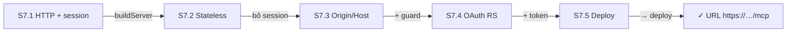
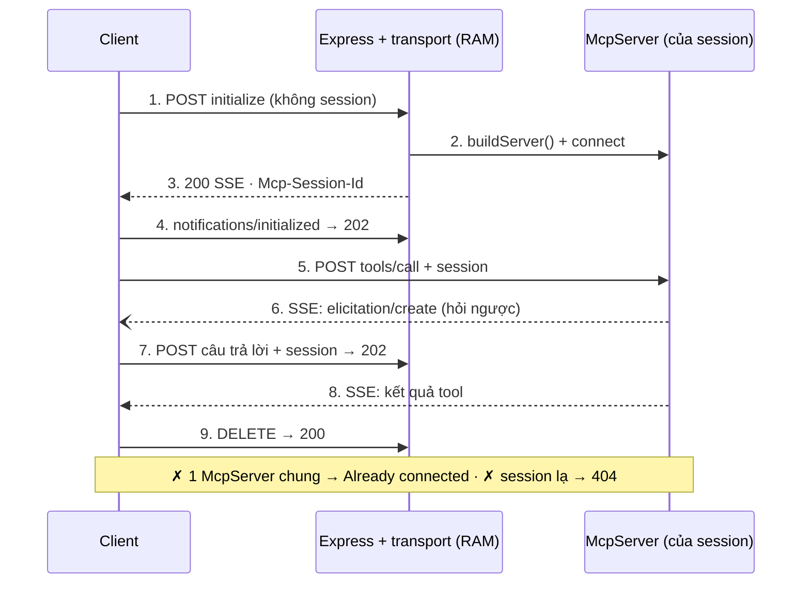
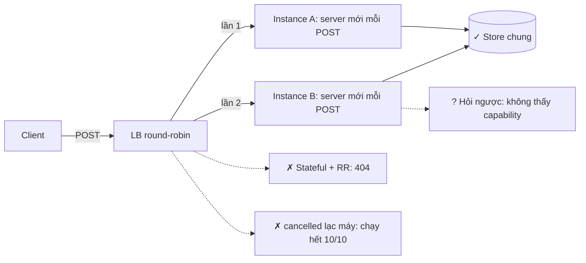
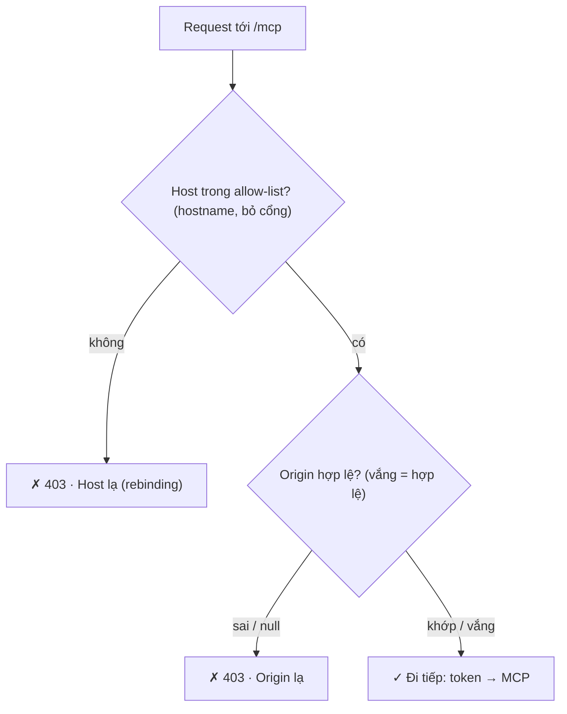
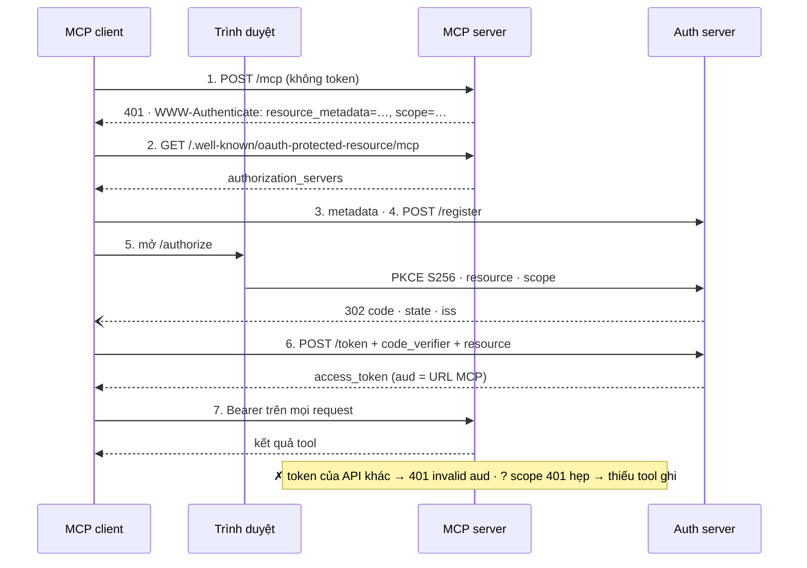
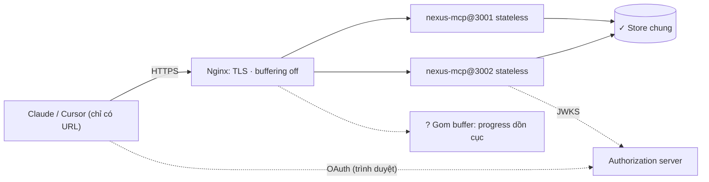

# Module 7 — Remote MCP, Auth & Deploy

> Roadmap MCP × Full-Stack AI · 5 session · 2 tuần · C50 Lab 36–43 · Streamable HTTP, stateless, Origin/Host, OAuth resource server, Web-standard + Nginx, cache hint

## Mục lục

- **Tổng quan** — Remote MCP, Auth & Deploy
- **S7.1** — Streamable HTTP
- **S7.2** — Stateless & streaming
- **S7.3** — Security headers & DNS rebinding
- **S7.4** — OAuth resource server & token
- **S7.5** — Deploy & cache control
- **Kiểm tra cuối** — Exit check Module 7 · Bàn giao M8+

---

## Module 7 — Remote MCP, Auth & Deploy

M2–M6 chạy MCP như **process con** của client (stdio): cùng máy, cùng người, không cần đăng nhập. M7 đưa server lên mạng. Ba thứ đổi cùng lúc: **transport** (HTTP thay stdin/stdout, có hoặc không có session), **ai được gọi** (Origin/Host chống trình duyệt bị lợi dụng, OAuth chống người lạ), và **chạy ở đâu** (nhiều instance sau load balancer, Nginx + TLS, runtime edge). Cuối module, một client lạ chỉ cần URL `https://…/mcp` là tự đi hết: 401 → tìm authorization server → đăng ký → người dùng duyệt → token → gọi tool.

**Bản gọn.** Khác M3–M6, code của module này **không** nằm trong repo Nexus. Toàn bộ là package độc lập `m7-samples/` (~900 dòng trong `src/`, 5 tool kiểu Nexus: `nexus_whoami`, `nexus_list_tasks`, `nexus_generate_report`, `nexus_create_task`, `nexus_delete_task`) để đọc nhanh và copy thẳng vào project. Phần [Bàn giao cho M8+](#fx) chỉ chỗ ráp vào `nexus-m6` (`apps/mcp-server`) và những gì module sau dùng lại.

> **Spec mới đã ra trong lúc bạn học: 2026-07-28.** Code bài giữ đúng phiên bản C50 dùng (SDK v1 `1.30.1`, spec **2025-11-25** — có session, có `initialize`). Bản 2026-07-28 **bỏ hẳn** session và `Mcp-Session-Id`, bỏ `initialize`, bỏ kênh GET và resumability, thêm `server/discover`, chốt `ttlMs`/`cacheScope` (đúng thứ Lab 43 bắt “làm trước”), và deprecate Roots, Sampling, Logging, Dynamic Client Registration. Mọi chỗ khác biệt được ghi ngay trong session tương ứng + bảng ở Cheat Sheet; `sdk-v2-probe/` chạy thật SDK v2 2.3.1 để bạn thấy spec mới trên dây. Học S7.1 không phí: client 2025-11-25 sẽ còn chạy nhiều năm, và SDK v2 vẫn phục vụ chúng.

### 5 session

| Session | Học gì | Output |
|---|---|---|
| **S7.1** Streamable HTTP | 1 endpoint POST/GET/DELETE, `Mcp-Session-Id`, SSE trên response, vì sao HTTP+SSE cũ bị bỏ · C50 Lab 36 | stdio + HTTP từ cùng `buildServer()`, đi tay từng request trên dây |
| **S7.2** Stateless & streaming | Bỏ session để scale ngang, progress qua SSE, hủy vs mất kết nối · C50 Lab 37–38 | 2 instance round-robin đúng; đo được chỗ stateless mất `cancelled` và capability |
| **S7.3** Security headers & DNS rebinding | Kiểm `Host` + `Origin` tuyệt đối, bind `127.0.0.1`, fail-fast cấu hình nguy hiểm · C50 Lab 39 | 9 kiểu request trình duyệt → đúng 2 cái qua; CORS `*` + guard → 403 |
| **S7.4** OAuth resource server & token | PRM (RFC 9728), 401 + `WWW-Authenticate`, verify JWT (chữ ký, `aud`, `iss`, `exp`), tool theo scope · C50 Lab 40–41 | 6 loại token sai bị chặn; client lạ đi trọn luồng OAuth trong 14 request |
| **S7.5** Deploy & cache control | Web-standard `Request → Response`, Nginx + TLS, systemd, `ttlMs`/`cacheScope` · C50 Lab 42–43 | Handler chạy như 1 hàm; HTTPS qua Nginx thật; client tôn trọng TTL |

### Phiên bản đã chạy

```console
$ node -v && npx tsc -v && npm ls --depth=0 2>/dev/null | tail -n +2 && nginx -v 2>&1 && openssl version
v22.22.0
Version 6.0.3
+-- @hono/node-server@2.1.4
+-- @modelcontextprotocol/sdk@1.30.1
+-- @types/express@5.0.6
+-- @types/node@22.20.5
+-- express@5.2.1
+-- jose@6.2.12
+-- typescript@6.0.3
`-- zod@4.6.5

nginx version: nginx/1.24.0 (Ubuntu)
OpenSSL 3.0.13 30 Jan 2024 (Library: OpenSSL 3.0.13 30 Jan 2024)
```

| Khác biệt phiên bản gặp khi dựng bài | Xử lý trong bài |
|---|---|
| `@modelcontextprotocol/sdk` 1.32.1 là `latest` v1; SDK **v2 2.3.1** (`@modelcontextprotocol/server` + `client`) hỗ trợ spec 2026-07-28 | Code bài giữ **1.30.1** (khớp C50). v1 cả 1.32.1 vẫn chỉ biết đến 2025-11-25 (`LATEST_PROTOCOL_VERSION`). `sdk-v2-probe/` chạy thật v2 |
| Spec **2026-07-28** (ra 28/07/2026) bỏ session, `initialize`, GET stream, resumability | Ghi khác biệt ở từng session; [bảng chuyển đổi](#ov) ở Cheat Sheet |
| `listen 443 ssl http2;` là cú pháp nginx 1.24 (Ubuntu 24.04); `http2 on;` cần ≥ 1.25.1 | `deploy/nginx/mcp.conf` dùng cú pháp 1.24 — [bẫy S7.5](#s75) |
| SDK v1 tự gửi `X-Accel-Buffering: no` trên mọi stream SSE | Nginx `proxy_buffering on` **không** làm hỏng progress — trừ khi proxy bỏ qua header đó ([bẫy S7.5](#s75)) |
| TypeScript 7.0.2 đã là `latest` | Bài giữ **6.0.3** như M3–M6 |

### Đã chạy thật gì, chưa chạy gì

| Phần | Trạng thái | Thay thế đã chạy |
|---|---|---|
| C50 Lab 36–43 (`npm run check` của C50) | ✗ chưa chạy ở sandbox | — (chỉ dạy đủ để tự làm, không lời giải) |
| Streamable HTTP stateful/stateless, 2 instance + LB, progress, hủy, Origin/Host | ✓ chạy thật | LB round-robin tí hon (`scripts/lib.ts`) thay ALB |
| OAuth: PRM, 401, verify JWT, scope, trọn luồng client | ✓ chạy thật | Authorization server **dev** trong repo (JWT RS256 thật, JWKS, PKCE, DCR) thay Auth0/Keycloak/Cognito — không kéo được image |
| Claude Desktop / Cursor kết nối bằng URL | ✗ chưa chạy ở sandbox | Client SDK v1 thật + `OAuthClientProvider` tự viết đi trọn luồng (thứ Claude/Cursor làm) |
| Nginx + TLS + 2 instance | ✓ chạy thật | Nginx 1.24 thật, cert **tự ký** cho `localhost`; cùng file `deploy/nginx/mcp.conf` |
| EC2, domain thật, Let's Encrypt, systemd | ✗ chưa chạy ở sandbox | Lệnh + kết quả mong đợi bằng lời ([S7.5](#s75)) |
| Runtime edge (Cloudflare Workers…) | ✗ chưa chạy | Cùng `fetch` handler gọi trực tiếp như hàm + chạy trên Node qua `@hono/node-server` |
| SDK v2 / spec 2026-07-28 | ✓ chạy thật (so sánh) | `sdk-v2-probe/probe.ts` |

### Cách dùng trang

- Mỗi session: **Lý thuyết + Lab** (bảng C# → TS, lab C50 + lab áp dụng có AC và lệnh nghiệm thu, output thật, sơ đồ, bẫy có lỗi thật, code mẫu & pattern, 3 câu trắc nghiệm) · **Cheat Sheet** · **Code** (toàn bộ file của session theo cây thư mục).
- **Luật vàng C50:** tự code tới khi `npm run check` xanh rồi mới xem video Review.
- Lời giải lab áp dụng nằm trong mục thu gọn “Xem sau khi làm xong”. Tab Code có toàn bộ file — mở khi đã làm xong.
- Mọi panel TERMINAL là output chạy thật (`runs/*.txt`, chụp bằng `m7-samples/scripts/capture-runs.sh`). Mọi editor là file thật trong `m7-samples/`, qua `tsc --noEmit` strict.
- Sơ đồ: bấm nút kịch bản để chạy từng bước, bấm vào ô để xem Là gì · Chạy ở đâu · Nhận gì · Trả gì. Ô tick AC được nhớ trên trình duyệt này.

### Exit check Module 7

- [ ] C50 Lab 36–43 xanh hết.
- [ ] Vẽ được luồng OAuth của MCP từ lúc client nhận 401 tới lúc gọi tool thành công (bài thực hành 6 ở [Kiểm tra cuối](#fx), đối chiếu sơ đồ S7.4).
- [ ] `npm run check` xanh trong `m7-samples/` (và `npm run s75:nginx` nếu máy có nginx).
- [ ] Kiểm tra cuối: mọi session ≥ 80%.


---

## Tổng quan · Cheat Sheet

### Bản đồ module

**Sơ đồ (Bản đồ dịch vụ) — Module 7 gồm những session nào, mỗi session thêm lớp gì quanh server?**



**Đọc sơ đồ:** Đọc từ ô đầu (trái trên) sang phải, vòng xuống hàng dưới và đi ngược về trái tới đích. Nhãn mũi tên = thứ mang sang session sau. *Màu: xanh ô-liu + ✓ = đã xong / đích · viền terracotta = đang học · be = sắp học.*


### Thứ tự lớp trong 1 request (production)

| # | Lớp | Ở đâu | Trả gì khi chặn |
|---|---|---|---|
| 1 | TLS, chuyển HTTP → HTTPS, giới hạn body | Nginx | 301 / 413 |
| 2 | Host + Origin | `securityGuard` | 403 |
| 3 | PRM công khai | `/.well-known/oauth-protected-resource/mcp` | — |
| 4 | Bearer token (chữ ký, `iss`, `aud`, `exp`, scope tối thiểu) | `requireBearer` | 401 / 403 + `WWW-Authenticate` |
| 5 | Body JSON ≤ 1 MB | `express.json` | 413 |
| 6 | Transport (session hoặc stateless) | `mountStateful` / `mountStateless` | 400 / 404 / 405 / 406 |
| 7 | Tool theo scope + kiểm lại trong handler | `buildServer({ scopes })` | tool không tồn tại / `isError` |

### Bảng pattern của module

| Pattern | Session | Tương đương C# / .NET | Dùng khi |
|---|---|---|---|
| Factory theo kết nối: `buildServer(ctx)` | S7.1 | `AddScoped` + factory delegate, KHÔNG `AddSingleton<McpServer>` | Cùng bộ tool cho nhiều transport / nhiều phiên |
| Share-nothing per request (stateless) | S7.2 | Scoped service + state ở DB/Redis, không sticky session | Chạy N instance sau LB, autoscale, serverless |
| Lõi thuần + adapter: `createHostOriginCheck` | S7.3 | `HostFilteringMiddleware` — nhưng là hàm, không subclass | Cùng chính sách cho Express và Web-standard |
| Lõi thuần + adapter: `checkBearer` | S7.4 | `JwtBearerHandler` — nhưng hàm trả union, không subclass + exception | Cùng chính sách token cho Express và Web-standard |
| Authorization theo khả năng nhìn thấy | S7.4 | Policy-based authorization + ẩn endpoint khỏi Swagger | Model không thấy được thứ nó không được gọi |
| Decorator ở mép transport cho phần spec mới: `attachCacheHints` | S7.5 | `DelegatingHandler` / `IResultFilter` thêm header | Tính năng spec chưa có trong SDK, cần gỡ sạch khi SDK hỗ trợ |


### Lệnh cả module

```console
$ cd m7-samples
$ npm run check                                   # typecheck + S7.1…S7.5
$ npm run s75:nginx                               # Nginx + TLS + OAuth trọn luồng (cần nginx, openssl)
$ MODE=stateful PORT=3000 npm start               # server HTTP có session, http://127.0.0.1:3000/mcp
$ npm run dev:auth                                # authorization server dev ở :3400
$ MCP_RESOURCE=http://127.0.0.1:3401/mcp AUTH_ISSUER=http://127.0.0.1:3400 AUTH_JWKS_URI=http://127.0.0.1:3400/jwks PORT=3401 npm start
$ npx @modelcontextprotocol/inspector             # (ngoài sandbox) nhập URL để thử bằng tay
```

### v1 (2025-11-25) → v2 (2026-07-28): đổi gì

| Chủ đề | Bài này (SDK 1.30.1, spec 2025-11-25) | Spec 2026-07-28 / SDK v2 2.3.1 (đo ở `sdk-v2-probe`) |
|---|---|---|
| Bắt tay | `initialize` → `notifications/initialized` | Không có. Mỗi request mang `_meta` `io.modelcontextprotocol/protocolVersion`, `clientCapabilities`, `clientInfo`; `server/discover` (tùy chọn) |
| Session | `Mcp-Session-Id` tùy chọn (S7.1) | **Bỏ**. State xuyên lời gọi = handle do server cấp, truyền như argument tool |
| Server hỏi ngược (sampling, elicitation, roots) | Request server → client trên SSE (chết khi stateless — S7.2) | **MRTR**: server trả `resultType: "input_required"`, client gửi lại request kèm `inputResponses` |
| Kênh GET / notification | GET mở SSE; `resources/subscribe` | `subscriptions/listen` (1 POST stream dài, opt-in từng loại) |
| Resumability | `Last-Event-ID` + `EventStore` | **Bỏ**: stream đứt = request mất, client gửi lại với id mới |
| Header HTTP | `MCP-Protocol-Version` sau initialize | `MCP-Protocol-Version` + `Mcp-Method` (+ `Mcp-Name`) **bắt buộc** mỗi POST; thiếu → `-32020` |
| Cache | Không có (bài tự gắn — S7.5) | `ttlMs` + `cacheScope` **bắt buộc** trên list/read; v2: `new McpServer(info, { cacheHints })` |
| Deprecated | — | Roots, Sampling, Logging, DCR (thay bằng Client ID Metadata Documents), HTTP+SSE |
| Phục vụ cả 2 đời client | — | v2 `createMcpHandler(factory)`: client 2025 được phục vụ kiểu stateless — **chính là pattern S7.2** |

### 16 bẫy của module

| # | Bẫy | Session | Dấu hiệu |
|---|---|---|---|
| 1 | 1 `McpServer` cho mọi session | S7.1 | `Already connected to a transport` |
| 2 | `express.json()` rồi `handleRequest(req, res)` thiếu `req.body` | S7.1 | `-32700 Parse error: Invalid JSON` |
| 3 | Session sau load balancer round-robin | S7.1–7.2 | `404 Session not found` ở request thứ 2 |
| 4 | Tin `notifications/cancelled` khi stateless | S7.2 | Client hủy, tool vẫn chạy hết 10/10 bước |
| 5 | Elicitation/sampling khi stateless | S7.2 | Server không thấy capability client |
| 6 | Kiểm Origin bằng `includes`/regex | S7.3 | `http://localhost.evil.example` lọt qua |
| 7 | Chỉ kiểm Origin, bỏ Host | S7.3 | Trình duyệt cũ / request không Origin sau rebinding lọt |
| 8 | Bind `0.0.0.0` khi chạy local | S7.3 | Máy khác trong Wi-Fi gọi được tool |
| 9 | CORS `*` cho web client chạy được, không guard | S7.3 | Trang lạ tạo được task qua trình duyệt nạn nhân |
| 10 | `decodeJwt` thay vì verify | S7.4 | Token tự ký `sub=admin` được nhận |
| 11 | Không kiểm `aud` | S7.4 | Token của API khác dùng được (token passthrough) |
| 12 | Tiếng Việt trong `WWW-Authenticate` | S7.4 | `500 ERR_INVALID_CHAR`, mất luôn header 401 |
| 13 | `req.auth` không khai báo kiểu | S7.4 | `TS2339 Property 'auth' does not exist` |
| 14 | `scope` trong 401 quá hẹp | S7.4 | Đăng nhập xong vẫn không thấy tool ghi |
| 15 | Proxy gom buffer SSE | S7.5 | 4 progress đến trong cùng ~1 ms, ngay trước kết quả |
| 16 | `http2 on;` trên nginx 1.24 | S7.5 | `unknown directive "http2"` |


---

## Tổng quan · Code

### Cây `m7-samples/`

```txt
Module 7/
├─ Module-7-Remote-Auth-Deploy.html · .md     bài học (dựng bằng lesson-toolkit)
├─ runs/                                     output chạy thật (capture-runs.sh)
└─ m7-samples/
   ├─ package.json · tsconfig.json · README.md
   ├─ src/
   │  ├─ server.ts            buildServer(ctx): 5 tool, lọc theo scope            (S7.1, S7.4)
   │  ├─ store.ts             TaskStore: RAM / file dùng chung                    (S7.2)
   │  ├─ stdio.ts · main.ts   entry stdio · entry HTTP (env → zod → createApp)    (S7.1, S7.3)
   │  ├─ app.ts               composition root Express: thứ tự middleware
   │  ├─ express-auth.d.ts    req.auth: AuthInfo                                  (S7.4)
   │  ├─ http/                stateful.ts · stateless.ts · guard.ts              (S7.1, S7.2, S7.3)
   │  ├─ auth/                resource-server.ts · dev-auth-server.ts            (S7.4)
   │  ├─ web.ts · web-node.ts                                                    (S7.5)
   │  └─ cache-hints.ts · client-cache.ts                                        (S7.5)
   ├─ scripts/  lib.ts · s71-session · s72-scale · s73-guard · s74-auth · s74-oauth-flow · s75-web · s75-nginx.sh · dev-auth · capture-runs.sh
   ├─ traps/    shared-server · body-consumed · origin-includes · cors-star · jwt-decode-only · header-unicode · tsc/req-auth.ts (CỐ Ý lỗi)
   ├─ patterns/ *.direct.ts — bản “dịch thẳng từ C#” để so sánh (qua tsc, không dùng)
   ├─ deploy/   nginx/mcp.conf · systemd/nexus-mcp@.service · mcp.env.example
   └─ sdk-v2-probe/  probe.ts (SDK v2 2.3.1, spec 2026-07-28)
```

`m7-samples` qua `tsc -p tsconfig.json` (strict, `noUncheckedIndexedAccess`, `erasableSyntaxOnly`). `traps/tsc/` là file **cố ý lỗi**, lỗi thật lấy bằng `tsc -p traps/tsc/tsconfig.json`.

### Kiểm tổng

```console
$ npm run check 2>&1 | grep -E "^(OK|FAILED)"
OK: S7.1 7/7
OK: S7.2 8/8
OK: S7.3 11/11
OK: S7.4 10/10
OK: OAuth flow 3/3
OK: S7.5 web + cache 5/5
```

### Gốc package

`m7-samples/package.json`

```json
{
  "name": "m7-samples",
  "private": true,
  "type": "module",
  "engines": {
    "node": ">=22.18"
  },
  "scripts": {
    "typecheck": "tsc -p tsconfig.json",
    "start": "node src/main.ts",
    "start:stdio": "node src/stdio.ts",
    "start:web": "node src/web-node.ts",
    "dev:auth": "node scripts/dev-auth.ts",
    "s71": "node scripts/s71-session.ts",
    "s72": "node scripts/s72-scale.ts",
    "s73": "node scripts/s73-guard.ts",
    "s74": "node scripts/s74-auth.ts && node scripts/s74-oauth-flow.ts",
    "s75": "node scripts/s75-web.ts",
    "s75:nginx": "bash scripts/s75-nginx.sh",
    "check": "npm run typecheck && npm run s71 && npm run s72 && npm run s73 && npm run s74 && npm run s75"
  },
  "dependencies": {
    "@hono/node-server": "2.1.4",
    "@modelcontextprotocol/sdk": "1.30.1",
    "express": "5.2.1",
    "jose": "6.2.12",
    "zod": "4.6.5"
  },
  "devDependencies": {
    "@types/express": "5.0.6",
    "@types/node": "22.20.5",
    "typescript": "6.0.3"
  }
}
```
`m7-samples/tsconfig.json`

```json
{
  "compilerOptions": {
    "target": "ES2024",
    "lib": ["ES2024", "DOM"],
    "module": "NodeNext",
    "moduleResolution": "NodeNext",
    "types": ["node"],
    "strict": true,
    "noUncheckedIndexedAccess": true,
    "noImplicitOverride": true,
    "noFallthroughCasesInSwitch": true,
    "verbatimModuleSyntax": true,
    "erasableSyntaxOnly": true,
    "allowImportingTsExtensions": true,
    "noEmit": true,
    "skipLibCheck": true,
    "isolatedModules": true
  },
  "include": ["src", "scripts", "traps", "patterns"],
  "exclude": ["traps/tsc"]
}
```
`m7-samples/README.md`

````md
# m7-samples — Remote MCP, Auth & Deploy (Module 7)

Code độc lập (không phụ thuộc repo Nexus) cho 5 session của Module 7. Bài học đầy đủ: `../Module-7-Remote-Auth-Deploy.html` (hoặc `.md`).

Node ≥ 22.18 (chạy `.ts` trực tiếp bằng type stripping) · TypeScript 6.0.3 · `@modelcontextprotocol/sdk` 1.30.1 (khớp C50, spec 2025-11-25) · Express 5 · jose 6.

```bash
npm install
npm run check          # typecheck + 6 kịch bản S7.1–S7.5, ~25 giây, không cần mạng ngoài
npm run s75:nginx      # cần nginx + openssl: Nginx thật + TLS tự ký + OAuth trọn luồng qua https://localhost:8443/mcp
bash scripts/capture-runs.sh   # chụp lại mọi output vào ../runs/
````

### Cây thư mục

| Đường dẫn | Session | Là gì |
|---|---|---|
| `src/server.ts` | S7.1 | `buildServer(ctx)` — 1 định nghĩa tool cho mọi transport; lọc tool theo scope (S7.4) |
| `src/store.ts` | S7.2 | `TaskStore`: RAM (1 process) hoặc file JSON (nhiều instance dùng chung) |
| `src/stdio.ts` | S7.1 | entry stdio |
| `src/http/stateful.ts` | S7.1 | Streamable HTTP có `Mcp-Session-Id` |
| `src/http/stateless.ts` | S7.2 | mỗi POST 1 server + transport mới |
| `src/http/guard.ts` | S7.3 | kiểm Host + Origin (lõi thuần + adapter Express) |
| `src/auth/resource-server.ts` | S7.4 | PRM (RFC 9728), `checkBearer`, verify JWT bằng JWKS |
| `src/auth/dev-auth-server.ts` | S7.4 | authorization server DEV (RFC 8414, 7591, PKCE, JWKS) — thay Auth0/Keycloak khi chạy thử |
| `src/app.ts` · `src/main.ts` | tất cả | composition root Express · entry đọc env (zod), từ chối cấu hình nguy hiểm |
| `src/web.ts` · `src/web-node.ts` | S7.5 | cùng server dạng `Request → Response` (Workers/Deno/Bun/Next.js) · chạy trên Node |
| `src/cache-hints.ts` · `src/client-cache.ts` | S7.5 | `ttlMs` + `cacheScope` (spec 2026-07-28) phía server · client tôn trọng TTL |
| `deploy/` | S7.5 | `nginx/mcp.conf`, `systemd/nexus-mcp@.service`, `mcp.env.example` |
| `scripts/` | | kịch bản chạy thật cho từng session + `lib.ts` (spawn server, HTTP thô, LB round-robin) |
| `traps/` · `patterns/` | | bẫy có output lỗi thật · bản "dịch thẳng từ C#" để so sánh (đều qua tsc) |
| `sdk-v2-probe/` | S7.5 | cùng tool viết bằng SDK v2 2.3.1 — xem spec 2026-07-28 trên dây |

### Biến môi trường (`src/main.ts`)

| Biến | Mặc định | Ý nghĩa |
|---|---|---|
| `MODE` | `stateless` | `stateful` (có session) / `stateless` |
| `HOST` · `PORT` | `127.0.0.1` · `3000` | bind khác localhost mà không bật auth → từ chối khởi động |
| `ALLOWED_HOSTS` · `ALLOWED_ORIGINS` | `127.0.0.1,localhost` · rỗng | danh sách tuyệt đối, phân cách dấu phẩy |
| `MCP_RESOURCE` · `AUTH_ISSUER` · `AUTH_JWKS_URI` | — | đủ cả 3 = bật OAuth; thiếu 1 = lỗi |
| `AUTH_CHALLENGE_SCOPE` | `nexus:read nexus:write` | scope ghi trong 401 — client xin đúng chừng này |
| `DATA_FILE` | — | store file dùng chung (bắt buộc khi chạy ≥ 2 instance) |
| `BEHIND_PROXY` | `false` | sau Nginx: tin `X-Forwarded-*` 1 hop |
| `CACHE_LIST_TTL_MS` | — | bật cache hint cho `tools/list` |
| `ELICIT_TIMEOUT_MS` | `30000` | chờ người dùng xác nhận xóa |
```

### Composition root

`m7-samples/src/app.ts`

```ts
import express, { type Request } from "express";
import type { Transport } from "@modelcontextprotocol/sdk/shared/transport.js";
import { buildServer } from "./server.ts";
import type { TaskStore } from "./store.ts";
import { securityGuard, type GuardConfig } from "./http/guard.ts";
import { mountStateful } from "./http/stateful.ts";
import { mountStateless } from "./http/stateless.ts";
import { mountProtectedResourceMetadata, requireBearer, type ResourceConfig } from "./auth/resource-server.ts";
import { attachCacheHints, type CachePolicy } from "./cache-hints.ts";

export type AppOptions = {
  mode: "stateful" | "stateless";
  store: TaskStore;
  instance: string;
  guard?: GuardConfig;
  auth?: ResourceConfig;
  cache?: Omit<CachePolicy, "perUserLists">;
  /** Sau Nginx: tin X-Forwarded-* từ 1 hop (để req.ip, req.protocol đúng). */
  behindProxy?: boolean;
  log?: (line: string) => void;
  elicitTimeoutMs?: number;
};

/** Composition root: thứ tự middleware LÀ chính sách bảo mật — guard → metadata công khai → token → body → MCP. */
export function createApp(o: AppOptions) {
  const app = express();
  app.disable("x-powered-by");
  if (o.behindProxy) app.set("trust proxy", 1);
  app.get("/healthz", (_req, res) => void res.json({ ok: true, instance: o.instance, mode: o.mode }));

  if (o.guard) app.use(securityGuard(o.guard));
  if (o.auth) mountProtectedResourceMetadata(app, o.auth);

  const mcp = express.Router();
  if (o.auth) mcp.use(requireBearer(o.auth));
  mcp.use(express.json({ limit: "1mb" }));

  const cache = o.cache ? { ...o.cache, perUserLists: o.auth !== undefined } : undefined;
  const makeServer = (req: Request) => {
    const server = buildServer({ store: o.store, instance: o.instance, scopes: o.auth ? (req.auth?.scopes ?? []) : undefined, ...(o.log ? { log: o.log } : {}), ...(o.elicitTimeoutMs ? { elicitTimeoutMs: o.elicitTimeoutMs } : {}) });
    if (cache) {
      const connect = server.connect.bind(server);
      server.connect = (t: Transport) => connect(attachCacheHints(t, cache));
    }
    return server;
  };

  const sessions = o.mode === "stateful" ? mountStateful(mcp, makeServer) : (mountStateless(mcp, makeServer), null);
  app.use(mcp);
  return { app, sessions };
}
```
`m7-samples/src/main.ts`

```ts
import { z } from "zod";
import { createApp } from "./app.ts";
import { createFileStore, createMemoryStore } from "./store.ts";
import { remoteJwks } from "./auth/resource-server.ts";
import { SCOPE_READ, SCOPE_WRITE } from "./server.ts";
import { LOCAL_BIND } from "./http/guard.ts";

// Entry HTTP: mọi khác biệt môi trường nằm ở env, code giống hệt local / EC2.
const csv = z.string().transform((s) => s.split(",").map((x) => x.trim()).filter(Boolean));
const Env = z.object({
  MODE: z.enum(["stateful", "stateless"]).default("stateless"),
  HOST: z.string().default(LOCAL_BIND),
  PORT: z.coerce.number().int().min(1).max(65535).default(3000),
  INSTANCE: z.string().default(`pid-${process.pid}`),
  DATA_FILE: z.string().optional(),
  ALLOWED_HOSTS: csv.default(["127.0.0.1", "localhost"]),
  ALLOWED_ORIGINS: csv.default([]),
  MCP_RESOURCE: z.url().optional(),
  AUTH_ISSUER: z.url().optional(),
  AUTH_JWKS_URI: z.url().optional(),
  BEHIND_PROXY: z.stringbool().default(false),
  CACHE_LIST_TTL_MS: z.coerce.number().int().min(0).optional(),
  AUTH_CHALLENGE_SCOPE: z.string().default(`${SCOPE_READ} ${SCOPE_WRITE}`),
  ELICIT_TIMEOUT_MS: z.coerce.number().int().min(100).default(30_000),
});
const parsed = Env.safeParse(process.env);
if (!parsed.success) {
  process.stderr.write(`env sai:\n${z.prettifyError(parsed.error)}\n`);
  process.exit(1);
}
const env = parsed.data;
const authParts = [env.MCP_RESOURCE, env.AUTH_ISSUER, env.AUTH_JWKS_URI].filter(Boolean).length;
if (authParts !== 0 && authParts !== 3) {
  process.stderr.write("env sai: MCP_RESOURCE, AUTH_ISSUER, AUTH_JWKS_URI phải có đủ cả 3 (bật auth) hoặc không có cái nào\n");
  process.exit(1);
}
if (authParts === 0 && env.HOST !== LOCAL_BIND && env.HOST !== "localhost") {
  process.stderr.write(`từ chối: bind ${env.HOST} mà không bật auth — ai trong mạng cũng gọi được tool\n`);
  process.exit(1);
}

const log = (l: string) => process.stderr.write(`[${env.INSTANCE}] ${l}\n`);
const { app, sessions } = createApp({
  mode: env.MODE,
  store: env.DATA_FILE ? createFileStore(env.DATA_FILE) : createMemoryStore(),
  instance: env.INSTANCE,
  guard: { allowedHosts: env.ALLOWED_HOSTS, allowedOrigins: env.ALLOWED_ORIGINS },
  ...(env.MCP_RESOURCE && env.AUTH_ISSUER && env.AUTH_JWKS_URI
    ? { auth: { resource: env.MCP_RESOURCE, issuer: env.AUTH_ISSUER, jwks: remoteJwks(env.AUTH_JWKS_URI), scopesSupported: [SCOPE_READ, SCOPE_WRITE], requiredScope: SCOPE_READ, challengeScope: env.AUTH_CHALLENGE_SCOPE } }
    : {}),
  ...(env.CACHE_LIST_TTL_MS !== undefined ? { cache: { listTtlMs: env.CACHE_LIST_TTL_MS, readTtlMs: 0 } } : {}),
  behindProxy: env.BEHIND_PROXY,
  elicitTimeoutMs: env.ELICIT_TIMEOUT_MS,
  log,
});

const http = app.listen(env.PORT, env.HOST, () => log(`MCP ${env.MODE} tại http://${env.HOST}:${env.PORT}/mcp${env.MCP_RESOURCE ? " (OAuth bật)" : ""}`));

// SIGTERM (systemd stop, deploy): ngừng nhận kết nối mới, đóng session, rồi thoát.
process.once("SIGTERM", () => {
  log("SIGTERM → đóng");
  http.close(() => process.exit(0));
  void sessions?.closeAll();
  http.closeIdleConnections();
  setTimeout(() => process.exit(1), 10_000).unref();
});
```
`m7-samples/src/server.ts`

```ts
import { McpServer } from "@modelcontextprotocol/sdk/server/mcp.js";
import type { CallToolResult } from "@modelcontextprotocol/sdk/types.js";
import { z } from "zod";
import { TaskSchema, type TaskStore } from "./store.ts";

/** Mọi thứ 1 server cần biết về nơi nó chạy — transport KHÔNG nằm trong này (S7.1). */
export type ServerCtx = {
  store: TaskStore;
  /** Tên instance (S7.2: thấy request rơi vào máy nào). */
  instance: string;
  /** Scope của token (S7.4). undefined = server không bật auth (stdio, local). */
  scopes?: readonly string[] | undefined;
  log?: (line: string) => void;
  /** Chờ người dùng trả lời elicitation tối đa bao lâu. */
  elicitTimeoutMs?: number;
};

export const SCOPE_READ = "nexus:read";
export const SCOPE_WRITE = "nexus:write";

const ok = <T extends Record<string, unknown>>(data: T): CallToolResult => ({
  content: [{ type: "text", text: JSON.stringify(data) }],
  structuredContent: data,
});
const fail = (message: string): CallToolResult => ({ isError: true, content: [{ type: "text", text: message }] });
const sleep = (ms: number, signal: AbortSignal) =>
  new Promise<void>((resolve, reject) => {
    const t = setTimeout(resolve, ms);
    signal.addEventListener("abort", () => (clearTimeout(t), reject(signal.reason)), { once: true });
  });

/**
 * MỘT định nghĩa tool cho mọi transport (stdio, HTTP stateful, stateless, web-standard).
 * Tạo server MỚI mỗi lần gọi: 1 McpServer chỉ nối được 1 transport.
 */
export function buildServer(ctx: ServerCtx): McpServer {
  const canWrite = ctx.scopes === undefined || ctx.scopes.includes(SCOPE_WRITE);
  const server = new McpServer(
    { name: "nexus-m7", version: "0.7.0" },
    { instructions: "Việc nội bộ của team. Ghi (tạo/xóa) chỉ hiện khi token có scope nexus:write." },
  );

  server.registerTool(
    "nexus_whoami",
    {
      title: "Ai đang gọi",
      description: "Trả instance đang phục vụ, danh tính và scope của token, session id (nếu có). Dùng để chẩn đoán kết nối.",
      inputSchema: {},
      outputSchema: { instance: z.string(), subject: z.string().nullable(), scopes: z.array(z.string()), sessionId: z.string().nullable() },
      annotations: { readOnlyHint: true, openWorldHint: false },
    },
    async (_args, extra) =>
      ok({
        instance: ctx.instance,
        subject: typeof extra.authInfo?.extra?.["sub"] === "string" ? extra.authInfo.extra["sub"] : null,
        scopes: extra.authInfo?.scopes ?? [],
        sessionId: extra.sessionId ?? null,
      }),
  );

  server.registerTool(
    "nexus_list_tasks",
    {
      title: "Danh sách việc",
      description: "Việc của team, lọc theo người phụ trách (owner). Gọi khi cần biết ai đang làm gì.",
      inputSchema: { owner: z.string().min(1).max(40).optional().describe("Tên người phụ trách, ví dụ lan") },
      outputSchema: { instance: z.string(), items: z.array(TaskSchema) },
      annotations: { readOnlyHint: true, openWorldHint: false },
    },
    async ({ owner }) => ok({ instance: ctx.instance, items: ctx.store.list(owner) }),
  );

  server.registerTool(
    "nexus_generate_report",
    {
      title: "Báo cáo tiến độ",
      description: "Tổng hợp báo cáo theo từng bước (chạy lâu). Báo progress nếu client gửi progressToken.",
      inputSchema: { steps: z.number().int().min(1).max(10).default(5), delayMs: z.number().int().min(10).max(2000).default(200) },
      outputSchema: { instance: z.string(), steps: z.number(), open: z.number(), done: z.number() },
      annotations: { readOnlyHint: true, openWorldHint: false },
    },
    async ({ steps, delayMs }, extra) => {
      const token = extra._meta?.progressToken;
      for (let i = 1; i <= steps; i++) {
        try {
          await sleep(delayMs, extra.signal); // client hủy / mất kết nối → signal abort → dừng thật
        } catch (e) {
          ctx.log?.(`report dừng ở bước ${i}/${steps}: ${extra.signal.aborted ? "signal abort (client hủy hoặc mất kết nối)" : String(e)}`);
          throw e;
        }
        if (token !== undefined) {
          await extra.sendNotification({ method: "notifications/progress", params: { progressToken: token, progress: i, total: steps, message: `bước ${i}/${steps}` } });
        }
      }
      ctx.log?.(`report xong ${steps}/${steps} bước`);
      const all = ctx.store.list();
      return ok({ instance: ctx.instance, steps, open: all.filter((t) => !t.done).length, done: all.filter((t) => t.done).length });
    },
  );

  if (!canWrite) return server; // S7.4: token chỉ có nexus:read → tool ghi KHÔNG tồn tại trong tools/list

  server.registerTool(
    "nexus_create_task",
    {
      title: "Tạo việc",
      description: "Tạo 1 việc mới cho 1 người. Cần scope nexus:write.",
      inputSchema: { title: z.string().min(3).max(120), owner: z.string().min(1).max(40) },
      outputSchema: { instance: z.string(), task: TaskSchema },
      annotations: { readOnlyHint: false, destructiveHint: false, idempotentHint: false, openWorldHint: false },
    },
    async ({ title, owner }, extra) => {
      if (extra.authInfo && !extra.authInfo.scopes.includes(SCOPE_WRITE)) return fail("Token không có scope nexus:write."); // lớp 2
      const task = ctx.store.create(title, owner);
      ctx.log?.(`create ${task.id} by ${String(extra.authInfo?.extra?.["sub"] ?? "local")}`);
      return ok({ instance: ctx.instance, task });
    },
  );

  server.registerTool(
    "nexus_delete_task",
    {
      title: "Xóa việc",
      description: "Xóa hẳn 1 việc. Hỏi người dùng xác nhận (elicitation); client không hỏi được thì KHÔNG xóa.",
      inputSchema: { id: z.string().regex(/^t\d+$/) },
      outputSchema: { instance: z.string(), deleted: z.boolean(), note: z.string() },
      annotations: { readOnlyHint: false, destructiveHint: true, idempotentHint: true, openWorldHint: false },
    },
    async ({ id }, extra) => {
      if (extra.authInfo && !extra.authInfo.scopes.includes(SCOPE_WRITE)) return fail("Token không có scope nexus:write.");
      if (!server.server.getClientCapabilities()?.elicitation) {
        return fail("Client này không hỏi được người dùng (không có elicitation) nên không xóa. Đánh dấu xong bằng cách khác.");
      }
      const r = await server.server.elicitInput(
        {
          message: `Xóa hẳn việc ${id}?`,
          requestedSchema: { type: "object", properties: { confirm: { type: "boolean", title: "Tôi đồng ý xóa", default: false } }, required: ["confirm"] },
        },
        { signal: extra.signal, timeout: ctx.elicitTimeoutMs ?? 30_000 },
      );
      if (r.action !== "accept" || r.content?.["confirm"] !== true) return ok({ instance: ctx.instance, deleted: false, note: `người dùng không đồng ý (${r.action})` });
      return ok({ instance: ctx.instance, deleted: ctx.store.delete(id), note: "đã xóa" });
    },
  );

  return server;
}
```
`m7-samples/src/store.ts`

```ts
import { readFileSync, renameSync, writeFileSync, existsSync } from "node:fs";
import { z } from "zod";

export const TaskSchema = z.object({ id: z.string(), title: z.string(), owner: z.string(), done: z.boolean() });
export type Task = z.infer<typeof TaskSchema>;
const FileSchema = z.object({ seq: z.number().int(), tasks: z.array(TaskSchema) });

/** Cổng dữ liệu. Stateless (S7.2) cần store DÙNG CHUNG giữa các instance: file ở đây, Mongo ở M10. */
export type TaskStore = {
  list(owner?: string): Task[];
  create(title: string, owner: string): Task;
  delete(id: string): boolean;
};

const SEED: Task[] = [
  { id: "t1", title: "Gọi lại khách Cà phê Phố Cổ", owner: "lan", done: false },
  { id: "t2", title: "Gửi báo giá quý 4", owner: "minh", done: false },
  { id: "t3", title: "Chốt hợp đồng Tạp hóa Cô Ba", owner: "lan", done: true },
];

export function createMemoryStore(seed: Task[] = SEED): TaskStore {
  const tasks = seed.map((t) => ({ ...t }));
  let seq = tasks.length;
  return {
    list: (owner) => tasks.filter((t) => !owner || t.owner === owner),
    create(title, owner) {
      const t = { id: `t${++seq}`, title, owner, done: false };
      tasks.push(t);
      return t;
    },
    delete(id) {
      const i = tasks.findIndex((t) => t.id === id);
      if (i < 0) return false;
      tasks.splice(i, 1);
      return true;
    },
  };
}

/** Store dùng chung qua 1 file JSON: đủ để 2 process thấy cùng dữ liệu. Ghi qua file tạm + rename (không ghi dở). */
export function createFileStore(path: string): TaskStore {
  type Data = z.infer<typeof FileSchema>;
  const read = (): Data => (existsSync(path) ? FileSchema.parse(JSON.parse(readFileSync(path, "utf8"))) : { seq: SEED.length, tasks: SEED });
  const write = (d: Data): void => {
    writeFileSync(`${path}.${process.pid}.tmp`, JSON.stringify(d));
    renameSync(`${path}.${process.pid}.tmp`, path);
  };
  return {
    list: (owner) => read().tasks.filter((t) => !owner || t.owner === owner),
    create(title, owner) {
      const d = read();
      const t = { id: `t${++d.seq}`, title, owner, done: false };
      d.tasks.push(t);
      write(d);
      return t;
    },
    delete(id) {
      const d = read();
      const n = d.tasks.length;
      d.tasks = d.tasks.filter((t) => t.id !== id);
      write(d);
      return d.tasks.length < n;
    },
  };
}
```

### So sánh SDK v2 (không thuộc package chính)

`m7-samples/sdk-v2-probe/probe.ts`

```ts
// SDK v2 2.3.1: createMcpHandler(factory) — 1 handler phục vụ CẢ spec 2026-07-28 (không session, không initialize) LẪN client 2025-11-25.
import { createMcpHandler, McpServer } from "@modelcontextprotocol/server";
import { z } from "zod";

const handler = createMcpHandler(() => {
  const s = new McpServer({ name: "nexus-v2", version: "0.7.0" }, { cacheHints: { "tools/list": { ttlMs: 300_000, cacheScope: "public" } } });
  s.registerTool("nexus_list_tasks", { description: "Việc của team", inputSchema: z.object({ owner: z.string().optional() }) }, async ({ owner }) => ({
    content: [{ type: "text", text: `việc của ${owner ?? "mọi người"}` }],
  }));
  return s;
});

const META = { "io.modelcontextprotocol/protocolVersion": "2026-07-28", "io.modelcontextprotocol/clientCapabilities": {}, "io.modelcontextprotocol/clientInfo": { name: "probe", version: "1" } };
async function post(label: string, body: unknown, headers: Record<string, string> = {}) {
  const r = await handler.fetch(new Request("http://localhost/mcp", { method: "POST", headers: { "content-type": "application/json", accept: "application/json, text/event-stream", ...headers }, body: JSON.stringify(body) }));
  const text = await r.text();
  const data = text.startsWith("{") ? text : text.split("\n").find((l) => l.startsWith("data: "))?.slice(6) ?? text;
  console.log(`${label}\n  → ${r.status} ${r.headers.get("content-type")} · mcp-session-id: ${r.headers.get("mcp-session-id") ?? "—"}\n  ${data.length > 300 ? `${data.slice(0, 299)}…` : data}`);
}

await post("1. 2026-07-28: server/discover", { jsonrpc: "2.0", id: 1, method: "server/discover", params: { _meta: META } }, { "mcp-protocol-version": "2026-07-28", "mcp-method": "server/discover" });
await post("2. 2026-07-28: tools/list (không initialize trước)", { jsonrpc: "2.0", id: 2, method: "tools/list", params: { _meta: META } }, { "mcp-protocol-version": "2026-07-28", "mcp-method": "tools/list" });
await post("3. 2026-07-28: thiếu header Mcp-Method", { jsonrpc: "2.0", id: 3, method: "tools/list", params: { _meta: META } }, { "mcp-protocol-version": "2026-07-28" });
await post("4. client 2025-11-25: initialize", { jsonrpc: "2.0", id: 4, method: "initialize", params: { protocolVersion: "2025-11-25", capabilities: {}, clientInfo: { name: "old", version: "1" } } });
await handler.close();
```
`m7-samples/sdk-v2-probe/package.json`

```json
{
  "name": "m7-sdk-v2-probe",
  "private": true,
  "type": "module",
  "description": "So sánh: cùng server viết bằng SDK v2 (spec 2026-07-28) — chỉ để đọc khác biệt, không phải code bài",
  "dependencies": { "@modelcontextprotocol/server": "2.3.1", "zod": "4.6.5" },
  "devDependencies": { "@types/node": "22.20.5", "typescript": "6.0.3" }
}
```

Code từng phần nằm ở tab **Code** của session tương ứng.

---

## S7.1 — Streamable HTTP

Mục tiêu: chuyển server từ stdio sang HTTP theo chuẩn hiện tại (2025-11-25), nhìn tận dây từng request của 1 phiên có session, và giữ **1 định nghĩa tool** cho cả 2 transport.

### C# → TS/Node

| Khái niệm C# | Tương đương TS/Node | Khác ở đâu |
|---|---|---|
| ASP.NET Core minimal API `app.MapPost("/mcp")` | Express 5 `router.post("/mcp", …)` + `StreamableHTTPServerTransport.handleRequest(req, res, req.body)` | Transport tự viết response (JSON hoặc SSE) — handler của bạn không `return` gì |
| SignalR hub (1 kết nối 2 chiều) | 1 endpoint: **POST** gửi message, **GET** mở SSE server → client, **DELETE** đóng session | Không WebSocket; mỗi message client là 1 POST mới |
| Session ASP.NET (`ISession`, cookie) | Header `Mcp-Session-Id` do server cấp ở response của `initialize` | Không cookie; client tự gắn header vào mọi request sau |
| `services.AddSingleton<McpServer>()` | `buildServer(ctx)` gọi lại cho **mỗi** session | 1 `McpServer` chỉ nối được 1 transport ([Bẫy 1](#bẫy-1-một-mcpserver-cho-mọi-session)) |
| `IAsyncEnumerable<T>` trả từng phần | SSE (`text/event-stream`): `event: message` / `data: {...}` | Kết quả + progress + request ngược đi chung 1 stream của POST đó |
| `[FromBody]` + model binding | `express.json()` rồi truyền `req.body` làm tham số thứ 3 | Body stream chỉ đọc được 1 lần ([Bẫy 2](#bẫy-2-body-đã-bị-đọc)) |
| `IHostedService` dọn session hết hạn | `setInterval(...).unref()` | `unref()` để timer không giữ process sống khi tắt |

### Lab

#### Lab C50 — 36 Streamable HTTP

**Mục tiêu:** chuyển server từ stdio sang HTTP; Review: bức tranh đầy đủ của dạng có session.

- [ ] Lab 36 xanh.

**Lệnh nghiệm thu** (repo C50 — chưa chạy ở sandbox):

```console
$ npm run check
```

Cần nắm để tự làm (không phải lời giải):

- 1 endpoint, 3 method. POST nhận **mọi** message của client (request, notification, response cho request ngược). Notification/response → `202` không body. Request → JSON **hoặc** SSE — client phải chấp nhận cả hai, nên `Accept` phải có cả `application/json` và `text/event-stream` (SDK trả `406` nếu thiếu).
- Session chỉ được cấp ở response của `initialize`. Request sau thiếu header → `400`; header không biết → `404` (và client **phải** `initialize` lại — đây là tín hiệu chuẩn, đừng trả 401 hay 500).
- Harness sẽ mở nhiều client cùng lúc: mỗi session một transport **và** một server. Đọc lại câu báo lỗi của SDK khi `connect` lần 2.
- Express đã parse body thì phải đưa body cho transport.
- Review “bức tranh đầy đủ”: vẽ ra 3 thứ server giữ trong RAM cho mỗi session (transport, server, các stream SSE đang mở) — S7.2 sẽ hỏi bạn chúng sống ở đâu khi có 2 máy.

#### Lab áp dụng S7.1 — stdio + HTTP từ cùng 1 định nghĩa

**Mục tiêu:** server của bạn (Nexus `apps/mcp-server` hoặc project riêng) chạy song song stdio (local) và Streamable HTTP có session (remote), định nghĩa tool không lặp.

- [ ] `buildServer(ctx)` là nơi **duy nhất** gọi `registerTool`; entry stdio và entry HTTP chỉ chọn transport.
- [ ] `initialize` trả `Mcp-Session-Id`; thiếu session → 400, session lạ → 404, `DELETE` xong gọi lại → 404.
- [ ] 2 client cùng lúc không ném `Already connected to a transport`.
- [ ] Server → client request (elicitation) chạy được trong mode có session.
- [ ] Danh sách tool qua stdio và qua HTTP giống hệt.

**Lệnh nghiệm thu:**

```console
$ cd m7-samples && node scripts/s71-session.ts          # → OK: S7.1 7/7
$ grep -rn "registerTool" src | grep -v "src/server.ts" | wc -l   # → 0
```

**Gợi ý hướng làm:** tách `buildServer(ctx)` ra khỏi entry → `src/stdio.ts` 4 dòng → `src/http/stateful.ts` (Map session → transport + server) → `src/app.ts` gắn router. Viết script đi tay bằng HTTP thô trước khi dùng client SDK: thấy header trên dây rồi mới tin SDK.

Output thật — HTTP thô (bên trên), client SDK, rồi so stdio với HTTP:

```console
$ node scripts/s71-session.ts
— HTTP thô —
POST initialize                 → 200 text/event-stream · Mcp-Session-Id: be89a932-f01d-457b-9add-5f7b720c4855
  {"result":{"protocolVersion":"2025-11-25","capabilities":{"tools":{"listChanged":true}},"serverInfo":{"name":"nexus-m7","version"…
✓ initialize trả session id
POST notifications/initialized  → 202 (notification: không có body)
POST tools/list, KHÔNG session  → 400 {"jsonrpc":"2.0","error":{"code":-32000,"message":"Bad Request: request đầu tiên phải là initialize…
✓ thiếu session → 400
POST tools/list, session lạ     → 404 {"jsonrpc":"2.0","error":{"code":-32001,"message":"Session not found: hết hạn hoặc thuộc instance k…
✓ session không tồn tại → 404 (client phải initialize lại)
POST tools/list, Accept thiếu SSE → 406 {"jsonrpc":"2.0","error":{"code":-32000,"message":"Not Acceptable: Client must accept both applicat…
✓ Accept phải có cả application/json và text/event-stream → 406
POST tools/list, đúng session   → 200 text/event-stream · nexus_whoami, nexus_list_tasks, nexus_generate_report, nexus_create_task, nexus_delete_task
DELETE /mcp                     → 200; gọi lại cùng session → 404
✓ DELETE kết thúc session

— Client SDK (StreamableHTTPClientTransport) —
connect → sessionId 8472d7af-2032-4fff-943a-c83ba4ddd06a · protocol 2025-11-25
nexus_whoami → {"instance":"A","subject":null,"scopes":[],"sessionId":"8472d7af-2032-4fff-943a-c83ba4ddd06a"}
  ← server hỏi người dùng (elicitation qua SSE của session): "Xóa hẳn việc t2?" → đồng ý
nexus_delete_task t2 → {"instance":"A","deleted":true,"note":"đã xóa"}
✓ server → client request (elicitation) chạy được trong mode có session

— Cùng buildServer() qua stdio —
stdio: nexus_whoami, nexus_list_tasks, nexus_generate_report, nexus_create_task, nexus_delete_task
http : nexus_whoami, nexus_list_tasks, nexus_generate_report, nexus_create_task, nexus_delete_task
✓ 2 transport, 1 định nghĩa tool, cùng danh sách
log server: [A] MCP stateful tại http://127.0.0.1:3101/mcp
OK: S7.1 7/7
```

Đọc output: `initialize` trả `text/event-stream` chứ không phải JSON — SDK v1 mặc định mở SSE cho **mọi** request (để có chỗ đẩy progress/request ngược trước kết quả); `enableJsonResponse: true` thì trả JSON. Dòng `← server hỏi người dùng` là request **server → client** đi trên SSE của chính POST `tools/call`, rồi client trả lời bằng 1 POST mới mang cùng session — thứ chỉ chạy được vì cả 2 POST rơi vào cùng 1 transport trong RAM.

<details>
<summary>Xem sau khi làm xong — lời giải Lab áp dụng S7.1</summary>

`m7-samples/src/http/stateful.ts`

```ts
import { randomUUID } from "node:crypto";
import type { Request, Response, Router } from "express";
import type { McpServer } from "@modelcontextprotocol/sdk/server/mcp.js";
import { StreamableHTTPServerTransport } from "@modelcontextprotocol/sdk/server/streamableHttp.js";
import { isInitializeRequest } from "@modelcontextprotocol/sdk/types.js";

type Session = { transport: StreamableHTTPServerTransport; server: McpServer; subject: string | null; lastSeen: number };

const rpcError = (res: Response, http: number, code: number, message: string) =>
  res.status(http).json({ jsonrpc: "2.0", error: { code, message }, id: null });

/**
 * S7.1 — Streamable HTTP có session (spec 2025-11-25).
 * 1 session = 1 transport + 1 McpServer, sống trong RAM của ĐÚNG process này (lý do S7.2 tồn tại).
 */
export function mountStateful(router: Router, makeServer: (req: Request) => McpServer, opts: { idleMs?: number } = {}) {
  const sessions = new Map<string, Session>();
  const subjectOf = (req: Request) => (typeof req.auth?.extra?.["sub"] === "string" ? req.auth.extra["sub"] : null);

  /** Tìm session của request; trả null sau khi đã tự trả lỗi. */
  const find = (req: Request, res: Response): Session | null => {
    const id = req.header("mcp-session-id");
    if (!id) return (rpcError(res, 400, -32000, "Bad Request: thiếu Mcp-Session-Id (chỉ initialize được gửi không có session)"), null);
    const s = sessions.get(id);
    if (!s) return (rpcError(res, 404, -32001, "Session not found: hết hạn hoặc thuộc instance khác — client phải initialize lại"), null);
    if (s.subject !== subjectOf(req)) return (rpcError(res, 403, -32000, "Session thuộc người khác"), null); // S7.4: id session KHÔNG phải là xác thực
    s.lastSeen = Date.now();
    return s;
  };

  router.post("/mcp", async (req, res) => {
    if (req.header("mcp-session-id")) {
      const s = find(req, res);
      if (s) await s.transport.handleRequest(req, res, req.body);
      return;
    }
    if (!isInitializeRequest(req.body)) return void rpcError(res, 400, -32000, "Bad Request: request đầu tiên phải là initialize");

    const server = makeServer(req);
    const transport = new StreamableHTTPServerTransport({
      sessionIdGenerator: () => randomUUID(),
      onsessioninitialized: (id) => void sessions.set(id, { transport, server, subject: subjectOf(req), lastSeen: Date.now() }),
    });
    transport.onclose = () => {
      if (transport.sessionId) sessions.delete(transport.sessionId);
    };
    await server.connect(transport);
    await transport.handleRequest(req, res, req.body);
  });

  // GET = kênh SSE server → client (notification, request ngược). DELETE = client đóng session.
  const passthrough = async (req: Request, res: Response) => {
    const s = find(req, res);
    if (s) await s.transport.handleRequest(req, res);
  };
  router.get("/mcp", passthrough);
  router.delete("/mcp", passthrough);

  // Dọn session bỏ quên: client không bắt buộc gửi DELETE.
  const idleMs = opts.idleMs ?? 30 * 60_000;
  const timer = setInterval(() => {
    for (const [id, s] of sessions) if (Date.now() - s.lastSeen > idleMs) void s.transport.close().then(() => sessions.delete(id));
  }, Math.min(idleMs, 60_000));
  timer.unref();

  return { count: () => sessions.size, closeAll: () => Promise.all([...sessions.values()].map((s) => s.transport.close())) };
}
```
`m7-samples/src/stdio.ts`

```ts
import { StdioServerTransport } from "@modelcontextprotocol/sdk/server/stdio.js";
import { buildServer } from "./server.ts";
import { createFileStore, createMemoryStore } from "./store.ts";

// S7.1 — cùng buildServer() với bản HTTP; chỉ khác transport. Local, không auth (process con của client).
const store = process.env["DATA_FILE"] ? createFileStore(process.env["DATA_FILE"]) : createMemoryStore();
const server = buildServer({ store, instance: "stdio", log: (l) => process.stderr.write(`${l}\n`) });
await server.connect(new StdioServerTransport());
```
`m7-samples/src/server.ts`

```ts
/**
 * MỘT định nghĩa tool cho mọi transport (stdio, HTTP stateful, stateless, web-standard).
 * Tạo server MỚI mỗi lần gọi: 1 McpServer chỉ nối được 1 transport.
 */
export function buildServer(ctx: ServerCtx): McpServer {
  const canWrite = ctx.scopes === undefined || ctx.scopes.includes(SCOPE_WRITE);
  const server = new McpServer(
    { name: "nexus-m7", version: "0.7.0" },
    { instructions: "Việc nội bộ của team. Ghi (tạo/xóa) chỉ hiện khi token có scope nexus:write." },
  );

  server.registerTool(
    "nexus_whoami",
    {
      title: "Ai đang gọi",
      description: "Trả instance đang phục vụ, danh tính và scope của token, session id (nếu có). Dùng để chẩn đoán kết nối.",
      inputSchema: {},
      outputSchema: { instance: z.string(), subject: z.string().nullable(), scopes: z.array(z.string()), sessionId: z.string().nullable() },
      annotations: { readOnlyHint: true, openWorldHint: false },
    },
    async (_args, extra) =>
      ok({
        instance: ctx.instance,
        subject: typeof extra.authInfo?.extra?.["sub"] === "string" ? extra.authInfo.extra["sub"] : null,
        scopes: extra.authInfo?.scopes ?? [],
        sessionId: extra.sessionId ?? null,
      }),
  );
```
</details>

<details>
<summary>Tra khi test đỏ</summary>

| Triệu chứng | Nguyên nhân | Sửa |
|---|---|---|
| `Already connected to a transport` | 1 `McpServer` dùng cho nhiều session | `buildServer()` mỗi session |
| `-32700 Parse error: Invalid JSON` | `express.json()` đã đọc body, `handleRequest` không nhận `req.body` | `transport.handleRequest(req, res, req.body)` |
| `406 Not Acceptable` | `Accept` thiếu `text/event-stream` | Client phải gửi cả 2 loại |
| `400` khi gọi `tools/list` | Gửi request thường trước `initialize`, hoặc quên header `Mcp-Session-Id` | Gắn session id lấy từ response `initialize` |
| `404 Session not found` sau khi deploy | Session nằm trong RAM process cũ | Bình thường — client phải `initialize` lại; muốn khỏi → stateless (S7.2) |
| Session cứ tăng trong `sessions.size` | Client không gửi `DELETE` | Dọn theo `lastSeen` (idle timeout) |
| Client cũ (2024-11-05) không kết nối được | Client chỉ biết HTTP+SSE (`GET /sse` + `POST /messages`) | Nâng client; hoặc host thêm 2 endpoint cũ (SDK còn `SSEServerTransport`, deprecated) |

</details>

### Một phiên đi qua những gì

**Sơ đồ (Trình tự) — Một phiên Streamable HTTP có session: request nào đi đâu, server nhớ gì?**



**Đọc sơ đồ:** Ba cột, đọc ①→⑨ từ trên xuống. Mọi mũi tên từ client là 1 POST mới, nhưng đều tìm về CÙNG transport + server trong RAM nhờ Mcp-Session-Id. ⑥–⑦ là lý do session tồn tại: request ngược và câu trả lời của nó đi trên 2 HTTP request khác nhau. *Màu: đỏ gạch + ✗ + viền đứt = bị chặn/sai · vàng mù tạt + ? + viền chấm = cần xem lại · xanh ô-liu + ✓ = chạy đúng. Nhãn = HTTP method + JSON-RPC.*


### Vì sao HTTP+SSE (2024-11-05) bị bỏ

Bản cũ có **2 endpoint**: client mở `GET /sse` giữ suốt phiên, server gửi lại sự kiện `endpoint` chứa URL `POST /messages?sessionId=…`; mọi **response** của server đi về trên kết nối GET đó. Hệ quả: (1) server bắt buộc giữ 1 kết nối dài cho mỗi client, kể cả server chỉ có tool đồng bộ; (2) POST và GET phải rơi vào **cùng** máy — không stateless được, khó với load balancer và serverless; (3) kết nối GET đứt là mất mọi response đang bay. Streamable HTTP (2025-03-26) gộp về 1 endpoint, response đi ngay trên POST của chính request đó, SSE thành **tùy chọn**, session thành **tùy chọn**. Spec 2026-07-28 đi nốt bước cuối: bỏ hẳn session.

### Phần khác C# thật sự

**1. Transport viết response, không phải bạn.** `handleRequest` tự set status, header, tự mở SSE và giữ response mở tới khi có kết quả. Code Express của bạn chỉ: tìm/tạo transport, gọi `handleRequest`, xong. Đừng `res.json()` sau đó.

**2. 1 McpServer = 1 transport.** `McpServer` giữ trạng thái giao thức của **một** phía bên kia (capability client đã khai, request đang chờ, id kế tiếp). Đó là lý do composition root của MCP là **factory** chứ không phải singleton — ngược phản xạ `AddSingleton` của .NET.

**3. Session id không phải xác thực.** `Mcp-Session-Id` chỉ là con trỏ tới state. Ai đoán/lấy được id là “vào” session nếu server không kiểm thêm. Spec yêu cầu id ngẫu nhiên an toàn (UUID v4 OK), và khi có auth thì gắn session với danh tính: `stateful.ts` lưu `subject` lúc tạo và trả 403 nếu token request sau là người khác.

**4. GET là tùy chọn — và rắc rối.** Kênh GET để server đẩy notification không gắn request nào (`list_changed`…). Không cần thì trả `405` (client SDK chấp nhận, thấy ở S7.4 bước 11). Spec 2026-07-28 bỏ GET, thay bằng `subscriptions/listen`.

**5. `MCP-Protocol-Version` trên mọi request sau `initialize`.** Thiếu header, server 2025-11-25 **giả định 2025-03-26**. Header sai/không hỗ trợ → 400. Client SDK tự gắn; script HTTP thô phải tự gắn (`s71-session.ts` có).

### Bẫy dev .NET hay vấp

#### Bẫy 1 — một McpServer cho mọi session

`m7-samples/traps/shared-server.ts`

```ts
// Bẫy S7.1 — "singleton như DI .AddSingleton": 1 McpServer cho mọi session HTTP.
import { McpServer } from "@modelcontextprotocol/sdk/server/mcp.js";
import { StreamableHTTPServerTransport } from "@modelcontextprotocol/sdk/server/streamableHttp.js";
import { randomUUID } from "node:crypto";

const server = new McpServer({ name: "singleton", version: "1" }); // tạo 1 lần, dùng chung
for (const user of ["phiên của Lan", "phiên của Minh"]) {
  const transport = new StreamableHTTPServerTransport({ sessionIdGenerator: () => randomUUID() });
  try {
    await server.connect(transport);
    console.log(`✓ connect ${user}`);
  } catch (e) {
    console.log(`✗ connect ${user}: ${e instanceof Error ? e.message : String(e)}`);
  }
}
```

```console
$ node traps/shared-server.ts
✓ connect phiên của Lan
✗ connect phiên của Minh: Already connected to a transport. Call close() before connecting to a new transport, or use a separate Protocol instance per connection.
```

Phiên thứ 2 chết ngay lúc `connect`. Trong server thật, lỗi này chỉ hiện khi có **người thứ hai** kết nối — chạy thử 1 mình thì xanh.

#### Bẫy 2 — body đã bị đọc

`m7-samples/traps/body-consumed.ts`

```ts
// Bẫy S7.1 — express.json() đã đọc hết body, rồi gọi handleRequest(req, res) KHÔNG truyền req.body.
import express from "express";
import { McpServer } from "@modelcontextprotocol/sdk/server/mcp.js";
import { StreamableHTTPServerTransport } from "@modelcontextprotocol/sdk/server/streamableHttp.js";

const app = express();
app.use(express.json());
app.post("/mcp", async (req, res) => {
  const server = new McpServer({ name: "x", version: "1" });
  const transport = new StreamableHTTPServerTransport({ sessionIdGenerator: undefined });
  await server.connect(transport);
  await transport.handleRequest(req, res); // thiếu tham số thứ 3: req.body
});
const http = app.listen(3901, "127.0.0.1");
const t0 = Date.now();
const r = await fetch("http://127.0.0.1:3901/mcp", {
  method: "POST",
  headers: { "content-type": "application/json", accept: "application/json, text/event-stream" },
  body: JSON.stringify({ jsonrpc: "2.0", id: 0, method: "initialize", params: { protocolVersion: "2025-11-25", capabilities: {}, clientInfo: { name: "c", version: "1" } } }),
  signal: AbortSignal.timeout(3000),
}).catch((e: unknown) => e);
console.log(r instanceof Response ? `${r.status} sau ${Date.now() - t0}ms: ${await r.text()}` : `không phản hồi sau ${Date.now() - t0}ms: ${String(r)}`);
http.closeAllConnections();
http.close();
```

```console
$ node traps/body-consumed.ts
400 sau 56ms: {"jsonrpc":"2.0","error":{"code":-32700,"message":"Parse error: Invalid JSON"},"id":null}
```

`express.json()` đã tiêu thụ stream body; transport đọc lại thì nhận rỗng → “Invalid JSON”. Câu lỗi nói về JSON của **client**, nên người ta đi sửa client. Sửa: `handleRequest(req, res, req.body)`.

### Code mẫu & pattern

#### Code production

`m7-samples/src/server.ts`

```ts
import { McpServer } from "@modelcontextprotocol/sdk/server/mcp.js";
import type { CallToolResult } from "@modelcontextprotocol/sdk/types.js";
import { z } from "zod";
import { TaskSchema, type TaskStore } from "./store.ts";

/** Mọi thứ 1 server cần biết về nơi nó chạy — transport KHÔNG nằm trong này (S7.1). */
export type ServerCtx = {
  store: TaskStore;
  /** Tên instance (S7.2: thấy request rơi vào máy nào). */
  instance: string;
  /** Scope của token (S7.4). undefined = server không bật auth (stdio, local). */
  scopes?: readonly string[] | undefined;
  log?: (line: string) => void;
  /** Chờ người dùng trả lời elicitation tối đa bao lâu. */
  elicitTimeoutMs?: number;
};

export const SCOPE_READ = "nexus:read";
export const SCOPE_WRITE = "nexus:write";

const ok = <T extends Record<string, unknown>>(data: T): CallToolResult => ({
  content: [{ type: "text", text: JSON.stringify(data) }],
  structuredContent: data,
});
const fail = (message: string): CallToolResult => ({ isError: true, content: [{ type: "text", text: message }] });
const sleep = (ms: number, signal: AbortSignal) =>
  new Promise<void>((resolve, reject) => {
    const t = setTimeout(resolve, ms);
    signal.addEventListener("abort", () => (clearTimeout(t), reject(signal.reason)), { once: true });
  });

/**
 * MỘT định nghĩa tool cho mọi transport (stdio, HTTP stateful, stateless, web-standard).
 * Tạo server MỚI mỗi lần gọi: 1 McpServer chỉ nối được 1 transport.
 */
export function buildServer(ctx: ServerCtx): McpServer {
  const canWrite = ctx.scopes === undefined || ctx.scopes.includes(SCOPE_WRITE);
  const server = new McpServer(
    { name: "nexus-m7", version: "0.7.0" },
    { instructions: "Việc nội bộ của team. Ghi (tạo/xóa) chỉ hiện khi token có scope nexus:write." },
  );
```

#### Pattern: Factory theo kết nối — `buildServer(ctx)`

**Vấn đề:** cùng 1 bộ tool phải phục vụ stdio, HTTP có session, HTTP stateless, Web-standard; mỗi kết nối cần **instance riêng** của server (Bẫy 1), nhưng định nghĩa tool chỉ được viết 1 lần.

**Tương đương C#:** `services.AddScoped<McpServer>(sp => Build(sp.GetRequiredService<ITaskStore>(), …))` — factory delegate, scope = 1 kết nối. Không phải `AddSingleton`.

**Dịch thẳng vs kiểu TS:**

`m7-samples/patterns/transport-host.direct.ts`

```ts
// "Dịch thẳng từ C#" — S7.1: AddSingleton<McpServer> + 1 lớp host cho mỗi transport. ĐỪNG viết thế này.
import { McpServer } from "@modelcontextprotocol/sdk/server/mcp.js";
import { StdioServerTransport } from "@modelcontextprotocol/sdk/server/stdio.js";
import { StreamableHTTPServerTransport } from "@modelcontextprotocol/sdk/server/streamableHttp.js";
import { z } from "zod";

export abstract class McpHostBase {
  protected static readonly server = new McpServer({ name: "nexus", version: "1" }); // singleton cho cả process
  abstract startAsync(): Promise<void>;
}

export class StdioHost extends McpHostBase {
  async startAsync() {
    McpHostBase.server.registerTool("nexus_list_tasks", { inputSchema: { owner: z.string().optional() } }, async () => ({ content: [] }));
    await McpHostBase.server.connect(new StdioServerTransport());
  }
}

export class HttpHost extends McpHostBase {
  async startAsync() {
    // đăng ký lại cùng tool (copy) — và lần connect thứ 2 sẽ ném "Already connected to a transport"
    McpHostBase.server.registerTool("nexus_list_tasks_http", { inputSchema: { owner: z.string().optional() } }, async () => ({ content: [] }));
    await McpHostBase.server.connect(new StreamableHTTPServerTransport({ sessionIdGenerator: () => crypto.randomUUID() }));
  }
}
```
`m7-samples/src/server.ts`

```ts
/**
 * MỘT định nghĩa tool cho mọi transport (stdio, HTTP stateful, stateless, web-standard).
 * Tạo server MỚI mỗi lần gọi: 1 McpServer chỉ nối được 1 transport.
 */
export function buildServer(ctx: ServerCtx): McpServer {
  const canWrite = ctx.scopes === undefined || ctx.scopes.includes(SCOPE_WRITE);
  const server = new McpServer(
    { name: "nexus-m7", version: "0.7.0" },
    { instructions: "Việc nội bộ của team. Ghi (tạo/xóa) chỉ hiện khi token có scope nexus:write." },
  );
```
`m7-samples/src/stdio.ts`

```ts
import { StdioServerTransport } from "@modelcontextprotocol/sdk/server/stdio.js";
import { buildServer } from "./server.ts";
import { createFileStore, createMemoryStore } from "./store.ts";

// S7.1 — cùng buildServer() với bản HTTP; chỉ khác transport. Local, không auth (process con của client).
const store = process.env["DATA_FILE"] ? createFileStore(process.env["DATA_FILE"]) : createMemoryStore();
const server = buildServer({ store, instance: "stdio", log: (l) => process.stderr.write(`${l}\n`) });
await server.connect(new StdioServerTransport());
```
`m7-samples/src/http/stateless.ts`

```ts
import type { Request, Response, Router } from "express";
import type { McpServer } from "@modelcontextprotocol/sdk/server/mcp.js";
import { StreamableHTTPServerTransport } from "@modelcontextprotocol/sdk/server/streamableHttp.js";

/**
 * S7.2 — Stateless: mỗi POST một server + transport mới, xong là vứt.
 * Không có gì sống qua 2 request → instance nào nhận cũng được → scale ngang sau load balancer.
 */
export function mountStateless(router: Router, makeServer: (req: Request) => McpServer) {
  router.post("/mcp", async (req, res) => {
    const server = makeServer(req);
    const transport = new StreamableHTTPServerTransport({ sessionIdGenerator: undefined });
    // Client ngắt kết nối giữa chừng → đóng transport → signal của tool đang chạy bị abort.
    res.on("close", () => {
      void transport.close();
      void server.close();
    });
    await server.connect(transport);
    await transport.handleRequest(req, res, req.body);
  });

  // Không session → không có kênh GET để server đẩy về, không có gì để DELETE.
  const notAllowed = (_req: Request, res: Response) =>
    res.status(405).set("Allow", "POST").json({ jsonrpc: "2.0", error: { code: -32000, message: "Method not allowed (stateless)" }, id: null });
  router.get("/mcp", notAllowed);
  router.delete("/mcp", notAllowed);
}
```

- Bản dịch thẳng: abstract class + 1 subclass mỗi transport + `static readonly server` (singleton). Mỗi host tự `registerTool` → định nghĩa tool bị chép (và lệch: `nexus_list_tasks_http`). Host thứ 2 `connect` cùng server → `Already connected`. Thêm transport thứ 3 = thêm class thứ 3.
- Bản TS (tab 2–4 của editor): 1 hàm nhận `ServerCtx` (dữ liệu: store, instance, scopes), trả server mới. Transport không nằm trong `ServerCtx` — `stdio.ts`, `stateful.ts`, `stateless.ts`, `web.ts` gọi cùng hàm, mỗi nơi 1–3 dòng. Không class, không kế thừa, không DI container.

**Khi nào KHÔNG dùng:** server chỉ chạy stdio cho đúng 1 client (Claude Desktop local) — 1 `new McpServer` ở top-level là đủ, factory chỉ thêm 1 lớp. Và đừng nhét transport/req vào `ServerCtx` “cho tiện” — tool biết transport là tool không chạy được ở nơi khác.

### Trắc nghiệm S7.1

1. Client gửi `tools/list` kèm `Mcp-Session-Id` mà server không còn biết (đã restart). Spec 2025-11-25 nói gì?
   - A. Server trả 401, client đăng nhập lại
   - B. Server trả 404, client **phải** gửi `initialize` mới không kèm session
   - C. Server tự tạo session mới với id đó
   - D. Server trả 500

   <details><summary>Đáp án</summary>

   **B.** 404 là tín hiệu chuẩn “session hết”. Output thật: `session lạ → 404`, sau `DELETE` → 404.

   </details>

2. Vì sao `initialize` trong output thật trả `content-type: text/event-stream` chứ không phải JSON?
   - A. Spec bắt buộc SSE cho `initialize`
   - B. SDK v1 mặc định mở SSE cho mọi request (để kịp đẩy progress/request ngược trước kết quả); `enableJsonResponse: true` thì trả JSON
   - C. Express tự đổi
   - D. Do client gửi `Accept: text/event-stream` trước

   <details><summary>Đáp án</summary>

   **B.** Spec cho server chọn JSON hoặc SSE; client phải đọc được cả hai.

   </details>

3. HTTP+SSE (2024-11-05) bị thay vì lý do nào là cốt lõi?
   - A. SSE chậm hơn WebSocket
   - B. Response đi về trên 1 kết nối GET dài khác với POST — buộc giữ kết nối và buộc 2 request vào cùng máy
   - C. Không hỗ trợ JSON-RPC
   - D. Không có TLS

   <details><summary>Đáp án</summary>

   **B.** Streamable HTTP trả response ngay trên POST của chính request đó; SSE và session thành tùy chọn.

   </details>


---

## S7.1 · Cheat Sheet

### Request trên dây (2025-11-25)

| Client gửi | Header cần | Server trả |
|---|---|---|
| `POST initialize` | `Accept: application/json, text/event-stream` | `200` JSON/SSE + `Mcp-Session-Id` |
| `POST notifications/initialized` | `Mcp-Session-Id`, `MCP-Protocol-Version` | `202` không body |
| `POST` request (`tools/call`…) | như trên | `200` JSON hoặc SSE (progress, request ngược, rồi kết quả) |
| `POST` response cho request ngược | như trên | `202` |
| `GET` | `Accept: text/event-stream` + session | SSE dài, hoặc `405` |
| `DELETE` | session | `200` (hoặc `405` nếu không cho đóng) |
| Thiếu session · session lạ · `Accept` thiếu SSE | | `400` · `404` · `406` |

### Khung stateful tối thiểu

```txt
POST /mcp:  có header session? → sessions.get(id) ?? 404 → transport.handleRequest(req, res, req.body)
            không có? → isInitializeRequest(body) ? tạo transport({ sessionIdGenerator, onsessioninitialized }) + buildServer() + connect : 400
GET|DELETE: sessions.get(id) ?? 404 → handleRequest(req, res)
transport.onclose → sessions.delete(id) · idle timeout → transport.close()
```

### Pattern của session

| Pattern | Session | Tương đương C# / .NET | Dùng khi |
|---|---|---|---|
| Factory theo kết nối: `buildServer(ctx)` | S7.1 | `AddScoped` + factory delegate, KHÔNG `AddSingleton<McpServer>` | Cùng bộ tool cho nhiều transport / nhiều phiên |


### Áp vào project

- [ ] Tách `buildServer(ctx)` khỏi entry; grep `registerTool` chỉ ra 1 file.
- [ ] Entry HTTP: `express.json({ limit })` + truyền `req.body`.
- [ ] Session: lưu kèm `subject` khi có auth; idle timeout; `onclose` xóa khỏi Map.
- [ ] Đừng chọn stateful nếu không cần request ngược — xem S7.2.


---

## S7.1 · Code

### Cây thư mục

```txt
m7-samples/
├─ src/server.ts              buildServer(ctx) — 1 định nghĩa tool cho mọi transport
├─ src/stdio.ts               entry stdio (4 dòng)
├─ src/http/stateful.ts       Streamable HTTP có Mcp-Session-Id, idle timeout, gắn session với subject
├─ scripts/s71-session.ts     đi tay HTTP thô → client SDK → so stdio/HTTP
├─ scripts/lib.ts             startServer, raw (HTTP thô đặt được Host), check/summary
├─ traps/shared-server.ts · body-consumed.ts
└─ patterns/transport-host.direct.ts
```

### src

`m7-samples/src/server.ts`

```ts
import { McpServer } from "@modelcontextprotocol/sdk/server/mcp.js";
import type { CallToolResult } from "@modelcontextprotocol/sdk/types.js";
import { z } from "zod";
import { TaskSchema, type TaskStore } from "./store.ts";

/** Mọi thứ 1 server cần biết về nơi nó chạy — transport KHÔNG nằm trong này (S7.1). */
export type ServerCtx = {
  store: TaskStore;
  /** Tên instance (S7.2: thấy request rơi vào máy nào). */
  instance: string;
  /** Scope của token (S7.4). undefined = server không bật auth (stdio, local). */
  scopes?: readonly string[] | undefined;
  log?: (line: string) => void;
  /** Chờ người dùng trả lời elicitation tối đa bao lâu. */
  elicitTimeoutMs?: number;
};

export const SCOPE_READ = "nexus:read";
export const SCOPE_WRITE = "nexus:write";

const ok = <T extends Record<string, unknown>>(data: T): CallToolResult => ({
  content: [{ type: "text", text: JSON.stringify(data) }],
  structuredContent: data,
});
const fail = (message: string): CallToolResult => ({ isError: true, content: [{ type: "text", text: message }] });
const sleep = (ms: number, signal: AbortSignal) =>
  new Promise<void>((resolve, reject) => {
    const t = setTimeout(resolve, ms);
    signal.addEventListener("abort", () => (clearTimeout(t), reject(signal.reason)), { once: true });
  });

/**
 * MỘT định nghĩa tool cho mọi transport (stdio, HTTP stateful, stateless, web-standard).
 * Tạo server MỚI mỗi lần gọi: 1 McpServer chỉ nối được 1 transport.
 */
export function buildServer(ctx: ServerCtx): McpServer {
  const canWrite = ctx.scopes === undefined || ctx.scopes.includes(SCOPE_WRITE);
  const server = new McpServer(
    { name: "nexus-m7", version: "0.7.0" },
    { instructions: "Việc nội bộ của team. Ghi (tạo/xóa) chỉ hiện khi token có scope nexus:write." },
  );

  server.registerTool(
    "nexus_whoami",
    {
      title: "Ai đang gọi",
      description: "Trả instance đang phục vụ, danh tính và scope của token, session id (nếu có). Dùng để chẩn đoán kết nối.",
      inputSchema: {},
      outputSchema: { instance: z.string(), subject: z.string().nullable(), scopes: z.array(z.string()), sessionId: z.string().nullable() },
      annotations: { readOnlyHint: true, openWorldHint: false },
    },
    async (_args, extra) =>
      ok({
        instance: ctx.instance,
        subject: typeof extra.authInfo?.extra?.["sub"] === "string" ? extra.authInfo.extra["sub"] : null,
        scopes: extra.authInfo?.scopes ?? [],
        sessionId: extra.sessionId ?? null,
      }),
  );

  server.registerTool(
    "nexus_list_tasks",
    {
      title: "Danh sách việc",
      description: "Việc của team, lọc theo người phụ trách (owner). Gọi khi cần biết ai đang làm gì.",
      inputSchema: { owner: z.string().min(1).max(40).optional().describe("Tên người phụ trách, ví dụ lan") },
      outputSchema: { instance: z.string(), items: z.array(TaskSchema) },
      annotations: { readOnlyHint: true, openWorldHint: false },
    },
    async ({ owner }) => ok({ instance: ctx.instance, items: ctx.store.list(owner) }),
  );

  server.registerTool(
    "nexus_generate_report",
    {
      title: "Báo cáo tiến độ",
      description: "Tổng hợp báo cáo theo từng bước (chạy lâu). Báo progress nếu client gửi progressToken.",
      inputSchema: { steps: z.number().int().min(1).max(10).default(5), delayMs: z.number().int().min(10).max(2000).default(200) },
      outputSchema: { instance: z.string(), steps: z.number(), open: z.number(), done: z.number() },
      annotations: { readOnlyHint: true, openWorldHint: false },
    },
    async ({ steps, delayMs }, extra) => {
      const token = extra._meta?.progressToken;
      for (let i = 1; i <= steps; i++) {
        try {
          await sleep(delayMs, extra.signal); // client hủy / mất kết nối → signal abort → dừng thật
        } catch (e) {
          ctx.log?.(`report dừng ở bước ${i}/${steps}: ${extra.signal.aborted ? "signal abort (client hủy hoặc mất kết nối)" : String(e)}`);
          throw e;
        }
        if (token !== undefined) {
          await extra.sendNotification({ method: "notifications/progress", params: { progressToken: token, progress: i, total: steps, message: `bước ${i}/${steps}` } });
        }
      }
      ctx.log?.(`report xong ${steps}/${steps} bước`);
      const all = ctx.store.list();
      return ok({ instance: ctx.instance, steps, open: all.filter((t) => !t.done).length, done: all.filter((t) => t.done).length });
    },
  );

  if (!canWrite) return server; // S7.4: token chỉ có nexus:read → tool ghi KHÔNG tồn tại trong tools/list

  server.registerTool(
    "nexus_create_task",
    {
      title: "Tạo việc",
      description: "Tạo 1 việc mới cho 1 người. Cần scope nexus:write.",
      inputSchema: { title: z.string().min(3).max(120), owner: z.string().min(1).max(40) },
      outputSchema: { instance: z.string(), task: TaskSchema },
      annotations: { readOnlyHint: false, destructiveHint: false, idempotentHint: false, openWorldHint: false },
    },
    async ({ title, owner }, extra) => {
      if (extra.authInfo && !extra.authInfo.scopes.includes(SCOPE_WRITE)) return fail("Token không có scope nexus:write."); // lớp 2
      const task = ctx.store.create(title, owner);
      ctx.log?.(`create ${task.id} by ${String(extra.authInfo?.extra?.["sub"] ?? "local")}`);
      return ok({ instance: ctx.instance, task });
    },
  );

  server.registerTool(
    "nexus_delete_task",
    {
      title: "Xóa việc",
      description: "Xóa hẳn 1 việc. Hỏi người dùng xác nhận (elicitation); client không hỏi được thì KHÔNG xóa.",
      inputSchema: { id: z.string().regex(/^t\d+$/) },
      outputSchema: { instance: z.string(), deleted: z.boolean(), note: z.string() },
      annotations: { readOnlyHint: false, destructiveHint: true, idempotentHint: true, openWorldHint: false },
    },
    async ({ id }, extra) => {
      if (extra.authInfo && !extra.authInfo.scopes.includes(SCOPE_WRITE)) return fail("Token không có scope nexus:write.");
      if (!server.server.getClientCapabilities()?.elicitation) {
        return fail("Client này không hỏi được người dùng (không có elicitation) nên không xóa. Đánh dấu xong bằng cách khác.");
      }
      const r = await server.server.elicitInput(
        {
          message: `Xóa hẳn việc ${id}?`,
          requestedSchema: { type: "object", properties: { confirm: { type: "boolean", title: "Tôi đồng ý xóa", default: false } }, required: ["confirm"] },
        },
        { signal: extra.signal, timeout: ctx.elicitTimeoutMs ?? 30_000 },
      );
      if (r.action !== "accept" || r.content?.["confirm"] !== true) return ok({ instance: ctx.instance, deleted: false, note: `người dùng không đồng ý (${r.action})` });
      return ok({ instance: ctx.instance, deleted: ctx.store.delete(id), note: "đã xóa" });
    },
  );

  return server;
}
```
`m7-samples/src/stdio.ts`

```ts
import { StdioServerTransport } from "@modelcontextprotocol/sdk/server/stdio.js";
import { buildServer } from "./server.ts";
import { createFileStore, createMemoryStore } from "./store.ts";

// S7.1 — cùng buildServer() với bản HTTP; chỉ khác transport. Local, không auth (process con của client).
const store = process.env["DATA_FILE"] ? createFileStore(process.env["DATA_FILE"]) : createMemoryStore();
const server = buildServer({ store, instance: "stdio", log: (l) => process.stderr.write(`${l}\n`) });
await server.connect(new StdioServerTransport());
```
`m7-samples/src/http/stateful.ts`

```ts
import { randomUUID } from "node:crypto";
import type { Request, Response, Router } from "express";
import type { McpServer } from "@modelcontextprotocol/sdk/server/mcp.js";
import { StreamableHTTPServerTransport } from "@modelcontextprotocol/sdk/server/streamableHttp.js";
import { isInitializeRequest } from "@modelcontextprotocol/sdk/types.js";

type Session = { transport: StreamableHTTPServerTransport; server: McpServer; subject: string | null; lastSeen: number };

const rpcError = (res: Response, http: number, code: number, message: string) =>
  res.status(http).json({ jsonrpc: "2.0", error: { code, message }, id: null });

/**
 * S7.1 — Streamable HTTP có session (spec 2025-11-25).
 * 1 session = 1 transport + 1 McpServer, sống trong RAM của ĐÚNG process này (lý do S7.2 tồn tại).
 */
export function mountStateful(router: Router, makeServer: (req: Request) => McpServer, opts: { idleMs?: number } = {}) {
  const sessions = new Map<string, Session>();
  const subjectOf = (req: Request) => (typeof req.auth?.extra?.["sub"] === "string" ? req.auth.extra["sub"] : null);

  /** Tìm session của request; trả null sau khi đã tự trả lỗi. */
  const find = (req: Request, res: Response): Session | null => {
    const id = req.header("mcp-session-id");
    if (!id) return (rpcError(res, 400, -32000, "Bad Request: thiếu Mcp-Session-Id (chỉ initialize được gửi không có session)"), null);
    const s = sessions.get(id);
    if (!s) return (rpcError(res, 404, -32001, "Session not found: hết hạn hoặc thuộc instance khác — client phải initialize lại"), null);
    if (s.subject !== subjectOf(req)) return (rpcError(res, 403, -32000, "Session thuộc người khác"), null); // S7.4: id session KHÔNG phải là xác thực
    s.lastSeen = Date.now();
    return s;
  };

  router.post("/mcp", async (req, res) => {
    if (req.header("mcp-session-id")) {
      const s = find(req, res);
      if (s) await s.transport.handleRequest(req, res, req.body);
      return;
    }
    if (!isInitializeRequest(req.body)) return void rpcError(res, 400, -32000, "Bad Request: request đầu tiên phải là initialize");

    const server = makeServer(req);
    const transport = new StreamableHTTPServerTransport({
      sessionIdGenerator: () => randomUUID(),
      onsessioninitialized: (id) => void sessions.set(id, { transport, server, subject: subjectOf(req), lastSeen: Date.now() }),
    });
    transport.onclose = () => {
      if (transport.sessionId) sessions.delete(transport.sessionId);
    };
    await server.connect(transport);
    await transport.handleRequest(req, res, req.body);
  });

  // GET = kênh SSE server → client (notification, request ngược). DELETE = client đóng session.
  const passthrough = async (req: Request, res: Response) => {
    const s = find(req, res);
    if (s) await s.transport.handleRequest(req, res);
  };
  router.get("/mcp", passthrough);
  router.delete("/mcp", passthrough);

  // Dọn session bỏ quên: client không bắt buộc gửi DELETE.
  const idleMs = opts.idleMs ?? 30 * 60_000;
  const timer = setInterval(() => {
    for (const [id, s] of sessions) if (Date.now() - s.lastSeen > idleMs) void s.transport.close().then(() => sessions.delete(id));
  }, Math.min(idleMs, 60_000));
  timer.unref();

  return { count: () => sessions.size, closeAll: () => Promise.all([...sessions.values()].map((s) => s.transport.close())) };
}
```

### scripts

`m7-samples/scripts/s71-session.ts`

```ts
// S7.1 — Streamable HTTP có session: nhìn tận dây (HTTP thô), rồi dùng client SDK, rồi so với stdio.
import { Client } from "@modelcontextprotocol/sdk/client/index.js";
import { StreamableHTTPClientTransport } from "@modelcontextprotocol/sdk/client/streamableHttp.js";
import { StdioClientTransport } from "@modelcontextprotocol/sdk/client/stdio.js";
import { ElicitRequestSchema } from "@modelcontextprotocol/sdk/types.js";
import { ACCEPT_BOTH, check, cut, initBody, raw, ROOT, startServer, summary } from "./lib.ts";

const PORT = "3101";
const URL_ = `http://127.0.0.1:${PORT}/mcp`;
const srv = await startServer({ MODE: "stateful", PORT, INSTANCE: "A" });
const sseData = (body: string) => body.split("\n").filter((l) => l.startsWith("data: ")).map((l) => l.slice(6)).join("");

console.log("— HTTP thô —");
const init = await raw(URL_, { body: initBody(), headers: ACCEPT_BOTH });
const sid = String(init.headers["mcp-session-id"] ?? "");
console.log(`POST initialize                 → ${init.status} ${init.headers["content-type"]} · Mcp-Session-Id: ${sid}`);
console.log(`  ${cut(sseData(init.body), 130)}`);
check(init.status === 200 && /^[0-9a-f-]{36}$/.test(sid), "initialize trả session id");

const s = { ...ACCEPT_BOTH, "mcp-session-id": sid, "mcp-protocol-version": "2025-11-25" };
const inited = await raw(URL_, { body: { jsonrpc: "2.0", method: "notifications/initialized" }, headers: s });
console.log(`POST notifications/initialized  → ${inited.status} (notification: không có body)`);

const noSid = await raw(URL_, { body: { jsonrpc: "2.0", id: 1, method: "tools/list" }, headers: ACCEPT_BOTH });
console.log(`POST tools/list, KHÔNG session  → ${noSid.status} ${cut(noSid.body, 100)}`);
check(noSid.status === 400, "thiếu session → 400");

const badSid = await raw(URL_, { body: { jsonrpc: "2.0", id: 1, method: "tools/list" }, headers: { ...s, "mcp-session-id": "00000000-0000-0000-0000-000000000000" } });
console.log(`POST tools/list, session lạ     → ${badSid.status} ${cut(badSid.body, 100)}`);
check(badSid.status === 404, "session không tồn tại → 404 (client phải initialize lại)");

const noAccept = await raw(URL_, { body: { jsonrpc: "2.0", id: 2, method: "tools/list" }, headers: { ...s, accept: "application/json" } });
console.log(`POST tools/list, Accept thiếu SSE → ${noAccept.status} ${cut(noAccept.body, 100)}`);
check(noAccept.status === 406, "Accept phải có cả application/json và text/event-stream → 406");

const list = await raw(URL_, { body: { jsonrpc: "2.0", id: 3, method: "tools/list" }, headers: s });
const names = (JSON.parse(sseData(list.body)) as { result: { tools: { name: string }[] } }).result.tools.map((t) => t.name);
console.log(`POST tools/list, đúng session   → ${list.status} ${list.headers["content-type"]} · ${names.join(", ")}`);

const del = await raw(URL_, { method: "DELETE", headers: s });
const after = await raw(URL_, { body: { jsonrpc: "2.0", id: 4, method: "tools/list" }, headers: s });
console.log(`DELETE /mcp                     → ${del.status}; gọi lại cùng session → ${after.status}`);
check(del.status === 200 && after.status === 404, "DELETE kết thúc session");

console.log("\n— Client SDK (StreamableHTTPClientTransport) —");
const client = new Client({ name: "s71", version: "1" }, { capabilities: { elicitation: {} } });
client.setRequestHandler(ElicitRequestSchema, async (r) => {
  console.log(`  ← server hỏi người dùng (elicitation qua SSE của session): "${r.params.message}" → đồng ý`);
  return { action: "accept", content: { confirm: true } };
});
const transport = new StreamableHTTPClientTransport(new URL(URL_));
await client.connect(transport);
console.log(`connect → sessionId ${transport.sessionId} · protocol ${transport.protocolVersion}`);
const who = await client.callTool({ name: "nexus_whoami", arguments: {} });
console.log(`nexus_whoami → ${JSON.stringify(who.structuredContent)}`);
const delTask = await client.callTool({ name: "nexus_delete_task", arguments: { id: "t2" } });
console.log(`nexus_delete_task t2 → ${JSON.stringify(delTask.structuredContent)}`);
check((delTask.structuredContent as { deleted?: boolean } | undefined)?.deleted === true, "server → client request (elicitation) chạy được trong mode có session");
await transport.terminateSession();
await client.close();

console.log("\n— Cùng buildServer() qua stdio —");
const stdio = new Client({ name: "s71-stdio", version: "1" });
await stdio.connect(new StdioClientTransport({ command: process.execPath, args: ["src/stdio.ts"], cwd: ROOT, stderr: "ignore" }));
const stdioNames = (await stdio.listTools()).tools.map((t) => t.name);
const httpClient = new Client({ name: "s71b", version: "1" });
await httpClient.connect(new StreamableHTTPClientTransport(new URL(URL_)));
const httpNames = (await httpClient.listTools()).tools.map((t) => t.name);
console.log(`stdio: ${stdioNames.join(", ")}`);
console.log(`http : ${httpNames.join(", ")}`);
check(JSON.stringify(stdioNames) === JSON.stringify(httpNames), "2 transport, 1 định nghĩa tool, cùng danh sách");
await stdio.close();
await httpClient.close();

console.log(`log server: ${srv.logs.join(" | ")}`);
await srv.stop();
summary("S7.1");
```
`m7-samples/scripts/lib.ts`

```ts
import { spawn, type ChildProcess } from "node:child_process";
import { request as httpRequest, createServer, type IncomingHttpHeaders } from "node:http";
import { fileURLToPath } from "node:url";

export const ROOT = fileURLToPath(new URL("..", import.meta.url));

/** Chạy `node src/main.ts` (hoặc entry khác) như process thật, đợi tới khi nó báo đã listen. */
export function startServer(env: Record<string, string>, entry = "src/main.ts"): Promise<{ proc: ChildProcess; logs: string[]; stop: () => Promise<number | null> }> {
  return new Promise((resolve, reject) => {
    const proc = spawn(process.execPath, [entry], { cwd: ROOT, env: { PATH: process.env["PATH"] ?? "", ...env }, stdio: ["ignore", "pipe", "pipe"] });
    const logs: string[] = [];
    const stop = () =>
      new Promise<number | null>((r) => {
        if (proc.exitCode !== null) return r(proc.exitCode);
        proc.once("exit", (c) => r(c));
        proc.kill("SIGTERM");
      });
    const t = setTimeout(() => reject(new Error(`server không lên: ${logs.join(" | ")}`)), 8000);
    proc.stderr?.on("data", (b: Buffer) => {
      for (const l of b.toString().split("\n").filter(Boolean)) {
        logs.push(l);
        if (l.includes("MCP ") && l.includes(" tại ")) {
          clearTimeout(t);
          resolve({ proc, logs, stop });
        }
      }
    });
    proc.once("exit", (code) => {
      clearTimeout(t);
      reject(new Error(`server thoát (code ${code}): ${logs.join(" | ")}`));
    });
  });
}

export type RawResponse = { status: number; headers: IncomingHttpHeaders; body: string };

/** HTTP thô bằng node:http — đặt được cả Host (fetch thì không cho), để thấy đúng thứ trên dây. */
export function raw(url: string, opts: { method?: string; headers?: Record<string, string>; body?: unknown } = {}): Promise<RawResponse> {
  const u = new URL(url);
  const body = opts.body === undefined ? undefined : JSON.stringify(opts.body);
  return new Promise((resolve, reject) => {
    const req = httpRequest(
      { host: u.hostname, port: u.port, path: u.pathname + u.search, method: opts.method ?? (body ? "POST" : "GET"),
        headers: { ...(body ? { "content-type": "application/json" } : {}), ...opts.headers } },
      (res) => {
        let data = "";
        res.on("data", (c: Buffer) => (data += c.toString()));
        res.on("end", () => resolve({ status: res.statusCode ?? 0, headers: res.headers, body: data }));
      },
    );
    req.on("error", reject);
    if (body) req.write(body);
    req.end();
  });
}

export const ACCEPT_BOTH = { accept: "application/json, text/event-stream" };

export function initBody(id = 0) {
  return { jsonrpc: "2.0", id, method: "initialize", params: { protocolVersion: "2025-11-25", capabilities: {}, clientInfo: { name: "raw-http", version: "1" } } };
}

/** Cắt cho vừa 1 dòng terminal. */
export const cut = (s: string, n = 110) => (s.length > n ? `${s.slice(0, n - 1)}…` : s);

/** Load balancer round-robin tí hon (thay ALB/Nginx upstream) — ghi lại request nào đi instance nào. */
export function roundRobin(port: number, targets: number[]) {
  let i = 0;
  const hits: string[] = [];
  const server = createServer((req, res) => {
    const target = targets[i++ % targets.length] ?? targets[0] ?? 0;
    const chunks: Buffer[] = [];
    req.on("data", (c: Buffer) => chunks.push(c));
    req.on("end", () => {
      const body = Buffer.concat(chunks);
      let method = req.method ?? "?";
      try {
        const j: unknown = JSON.parse(body.toString() || "null");
        if (j && typeof j === "object" && "method" in j && typeof j.method === "string") method = j.method;
      } catch { /* không phải JSON */ }
      hits.push(`${method} → :${target}`);
      const up = httpRequest({ host: "127.0.0.1", port: target, path: req.url, method: req.method, headers: { ...req.headers, host: `127.0.0.1:${target}` } }, (ur) => {
        res.writeHead(ur.statusCode ?? 502, ur.headers);
        ur.pipe(res);
      });
      up.on("error", () => res.writeHead(502).end());
      res.on("close", () => up.destroy()); // client đi thì cắt luôn phía sau (giống Nginx)
      up.end(body);
    });
  });
  return new Promise<{ hits: string[]; close: () => void }>((r) =>
    server.listen(port, "127.0.0.1", () => r({ hits, close: () => (server.closeAllConnections(), server.close()) })),
  );
}

let fails = 0;
let total = 0;
export function check(ok: boolean, label: string, detail = "") {
  total++;
  if (!ok) fails++;
  console.log(`${ok ? "✓" : "✗"} ${label}${detail ? `  ${detail}` : ""}`);
}
export function summary(name: string): never {
  console.log(fails === 0 ? `OK: ${name} ${total}/${total}` : `FAILED: ${name} ${total - fails}/${total}`);
  process.exit(fails === 0 ? 0 : 1);
}
```

### traps · patterns

`m7-samples/traps/shared-server.ts`

```ts
// Bẫy S7.1 — "singleton như DI .AddSingleton": 1 McpServer cho mọi session HTTP.
import { McpServer } from "@modelcontextprotocol/sdk/server/mcp.js";
import { StreamableHTTPServerTransport } from "@modelcontextprotocol/sdk/server/streamableHttp.js";
import { randomUUID } from "node:crypto";

const server = new McpServer({ name: "singleton", version: "1" }); // tạo 1 lần, dùng chung
for (const user of ["phiên của Lan", "phiên của Minh"]) {
  const transport = new StreamableHTTPServerTransport({ sessionIdGenerator: () => randomUUID() });
  try {
    await server.connect(transport);
    console.log(`✓ connect ${user}`);
  } catch (e) {
    console.log(`✗ connect ${user}: ${e instanceof Error ? e.message : String(e)}`);
  }
}
```
`m7-samples/traps/body-consumed.ts`

```ts
// Bẫy S7.1 — express.json() đã đọc hết body, rồi gọi handleRequest(req, res) KHÔNG truyền req.body.
import express from "express";
import { McpServer } from "@modelcontextprotocol/sdk/server/mcp.js";
import { StreamableHTTPServerTransport } from "@modelcontextprotocol/sdk/server/streamableHttp.js";

const app = express();
app.use(express.json());
app.post("/mcp", async (req, res) => {
  const server = new McpServer({ name: "x", version: "1" });
  const transport = new StreamableHTTPServerTransport({ sessionIdGenerator: undefined });
  await server.connect(transport);
  await transport.handleRequest(req, res); // thiếu tham số thứ 3: req.body
});
const http = app.listen(3901, "127.0.0.1");
const t0 = Date.now();
const r = await fetch("http://127.0.0.1:3901/mcp", {
  method: "POST",
  headers: { "content-type": "application/json", accept: "application/json, text/event-stream" },
  body: JSON.stringify({ jsonrpc: "2.0", id: 0, method: "initialize", params: { protocolVersion: "2025-11-25", capabilities: {}, clientInfo: { name: "c", version: "1" } } }),
  signal: AbortSignal.timeout(3000),
}).catch((e: unknown) => e);
console.log(r instanceof Response ? `${r.status} sau ${Date.now() - t0}ms: ${await r.text()}` : `không phản hồi sau ${Date.now() - t0}ms: ${String(r)}`);
http.closeAllConnections();
http.close();
```
`m7-samples/patterns/transport-host.direct.ts`

```ts
// "Dịch thẳng từ C#" — S7.1: AddSingleton<McpServer> + 1 lớp host cho mỗi transport. ĐỪNG viết thế này.
import { McpServer } from "@modelcontextprotocol/sdk/server/mcp.js";
import { StdioServerTransport } from "@modelcontextprotocol/sdk/server/stdio.js";
import { StreamableHTTPServerTransport } from "@modelcontextprotocol/sdk/server/streamableHttp.js";
import { z } from "zod";

export abstract class McpHostBase {
  protected static readonly server = new McpServer({ name: "nexus", version: "1" }); // singleton cho cả process
  abstract startAsync(): Promise<void>;
}

export class StdioHost extends McpHostBase {
  async startAsync() {
    McpHostBase.server.registerTool("nexus_list_tasks", { inputSchema: { owner: z.string().optional() } }, async () => ({ content: [] }));
    await McpHostBase.server.connect(new StdioServerTransport());
  }
}

export class HttpHost extends McpHostBase {
  async startAsync() {
    // đăng ký lại cùng tool (copy) — và lần connect thứ 2 sẽ ném "Already connected to a transport"
    McpHostBase.server.registerTool("nexus_list_tasks_http", { inputSchema: { owner: z.string().optional() } }, async () => ({ content: [] }));
    await McpHostBase.server.connect(new StreamableHTTPServerTransport({ sessionIdGenerator: () => crypto.randomUUID() }));
  }
}
```

---

## S7.2 — Stateless & streaming

Mục tiêu: bỏ session để chạy N instance sau load balancer; stream progress qua HTTP; và biết chính xác **mất gì** khi bỏ session (hủy bằng notification, request ngược, capability client) — bằng số đo, không bằng lời đồn.

### C# → TS/Node

| Khái niệm C# | Tương đương TS/Node | Khác ở đâu |
|---|---|---|
| Stateless Web API sau Azure LB / ALB | `new StreamableHTTPServerTransport({ sessionIdGenerator: undefined })` mỗi POST | Server + transport sống đúng 1 request rồi bỏ |
| ARR affinity / sticky session | Không cần — và **đừng** dùng để vá stateful | Sticky chết khi instance chết, deploy, autoscale |
| `IDistributedCache` / DB cho state | `TaskStore` dùng chung (file ở đây, Mongo ở M10) | RAM process = không ai khác thấy |
| `IProgress<T>` | `notifications/progress` trên SSE của chính POST đó | Chỉ khi client gửi `_meta.progressToken` |
| `HttpContext.RequestAborted` | `res.on("close")` → `transport.close()` → `extra.signal` abort | Đóng kết nối mới hủy được khi stateless |
| `CancellationTokenSource.Cancel()` phía client | `notifications/cancelled` (SDK gửi bằng **1 POST mới**) | Stateless: POST đó tới server khác/mới → mất |
| Response caching per instance | Không có state per instance | Mọi instance phải cho kết quả giống nhau |

### Lab

#### Lab C50 — 37 Stateless Design · 38 Streaming Responses

**Mục tiêu:** Lab 37 bỏ session và scale ngang (Review: “dùng xong vứt, nên chạy được trên nhiều node”); Lab 38 gửi progress qua HTTP (Review: thứ tự trên SSE và xử lý mất kết nối).

- [ ] Lab 37 xanh.
- [ ] Lab 38 xanh.

**Lệnh nghiệm thu** (repo C50 — chưa chạy ở sandbox):

```console
$ npm run check
```

Cần nắm để tự làm:

- Stateless trong SDK v1 = không truyền `sessionIdGenerator`. Mỗi POST tạo server + transport mới; đóng chúng khi response đóng. GET/DELETE không có nghĩa → `405`.
- Thứ gì trước đây nằm trong session (đếm số lần gọi, cache, “đã initialize chưa”) phải đi đâu đó dùng chung, hoặc biến mất. Harness có thể gửi request kế tiếp **không** có `initialize` trước — server stateless phải chịu được.
- Progress chỉ gửi khi request có `progressToken`; gửi qua `extra.sendNotification` để nó đi trên **đúng** stream của request đó. Thứ tự: mọi progress **trước** kết quả; sau kết quả không gửi gì nữa.
- Mất kết nối: spec nói *mất kết nối không có nghĩa là client hủy*. Nhưng khi stateless không có chỗ nào giao lại kết quả → dừng việc là hợp lý. Hiểu SDK làm gì khi response đóng (đọc `Protocol._onclose`: abort mọi handler đang chạy).

#### Lab áp dụng S7.2 — chế độ stateless, 2 instance round-robin

**Mục tiêu:** server của bạn chạy `MODE=stateless`, 2 instance sau 1 LB round-robin, mọi tool vẫn đúng; progress đến từng cái; client đi thì tool dừng thật.

- [ ] 2 instance round-robin mà mọi tool vẫn đúng (roadmap): ghi ở instance A, đọc ở B thấy.
- [ ] Progress đến **trước** kết quả, cách nhau đúng nhịp tool (không dồn cục).
- [ ] Client đóng kết nối giữa chừng → log server “report dừng ở bước k/10”, không chạy nốt.
- [ ] Biết và ghi trong README: tool nào của bạn **không** chạy được khi stateless (request ngược), và nó trả gì thay vì treo.
- [ ] Bản stateful sau cùng LB → `404 Session not found` (để thấy vì sao không chọn nó).

**Lệnh nghiệm thu:**

```console
$ cd m7-samples && node scripts/s72-scale.ts           # → OK: S7.2 8/8
```

**Gợi ý hướng làm:** `src/http/stateless.ts` (12 dòng) → store dùng chung (`DATA_FILE`) → LB tí hon trong `scripts/lib.ts` (`roundRobin`) ghi lại request nào đi đâu → đo progress bằng `onprogress` + `Date.now()`.

Output thật — 2 instance, LB round-robin, cùng 1 file store:

```console
$ node scripts/s72-scale.ts
— Stateless × 2 instance, round-robin —
tools/list: 5 tool
create → instance A · list → instance B thấy: Gọi lại khách Cà phê Phố Cổ | Chốt hợp đồng Tạp hóa Cô Ba | Gọi khách mới ở Đà Nẵng
LB: initialize → :3201 · notifications/initialized → :3202 · GET → :3201 · tools/list → :3202 · tools/call → :3201 · tools/call → :3202
✓ ghi ở 1 instance, đọc ở instance kia vẫn thấy (store dùng chung)
✓ request rải đều 2 instance

— Progress qua HTTP (SSE trên response của chính POST đó) —
progress: 1/4 @262ms · 2/4 @510ms · 3/4 @762ms · 4/4 @1015ms
kết quả @1016ms: {"instance":"A","steps":4,"open":3,"done":1}
✓ 4 progress đến TỪNG CÁI trước kết quả

— Hủy và mất kết nối (report 10 bước × 250 ms) —
(1) client: McpError: MCP error -32001: AbortError: This operation was aborted
    LB: tools/call → :3202 · notifications/cancelled → :3201
    server: A [A] report xong 4/4 bước · B [B] report xong 10/10 bước
✓ stateless: cancelled tới server MỚI (không biết request) → tool chạy hết 10 bước
(2) client đóng kết nối: AbortError
    server: [A] report dừng ở bước 3/10: signal abort (client hủy hoặc mất kết nối)
✓ mất kết nối → res 'close' → transport.close() → signal abort → tool dừng thật

— Stateless + server hỏi ngược (elicitation) —
client khai elicitation lúc initialize · delete t1 → [isError] Client này không hỏi được người dùng (không có elicitation) nên không xóa. Đánh dấu xong bằng cách khác.
✓ stateless: server của request này KHÔNG thấy initialize → không biết capability client

— Stateful: cùng hủy (1), cùng 1 instance —
server: [S] report dừng ở bước 3/10: signal abort (client hủy hoặc mất kết nối)
✓ stateful: cancelled tới đúng session → tool dừng

— Stateful × 2 instance, round-robin —
client: Streamable HTTP error: Error POSTing to endpoint: {"jsonrpc":"2.0","error":{"code":-32001,"message":"Session not found: hết hạn hoặc thuộc instance khác — client phải initialize lại"},"id":null}
LB: initialize → :3211 · notifications/initialized → :3212
✓ stateful sau round-robin: session tạo ở A, request kế rơi vào B → 404
OK: S7.2 8/8
```

Đọc output, 4 chỗ đáng tiền:

1. **LB ghi `GET → :3201`**: client SDK v1 tự mở kênh GET sau `initialize`; server stateless trả `405`, client chấp nhận và chạy tiếp.
2. **Hủy (1)**: SDK client hủy bằng `notifications/cancelled` gửi trong **1 POST mới** — LB đưa nó sang `:3201`, còn tool đang chạy ở `:3202`. Server mới không biết request nào → bỏ qua. Kết quả: B chạy **hết 10/10 bước** cho một client đã bỏ đi. Cùng thao tác ở stateful (cùng session, cùng RAM) → dừng ở bước 3.
3. **Hủy (2)**: đóng hẳn kết nối HTTP → `res 'close'` → `transport.close()` → SDK abort mọi handler → dừng ở bước 3. Ở stateless, **đóng kết nối** là cách hủy duy nhất chắc chắn.
4. **Elicitation khi stateless**: client **có** khai `elicitation` lúc `initialize`, nhưng `initialize` rơi vào 1 server khác đã bị vứt. Server của request `tools/call` chưa từng thấy capability client → `getClientCapabilities()` rỗng → tool trả lỗi rõ ràng (đúng thiết kế: không hỏi được thì không xóa). Đây chính là lý do spec 2026-07-28 bắt client gửi `clientCapabilities` trong `_meta` của **mỗi** request, và thay request ngược bằng MRTR.

<details>
<summary>Xem sau khi làm xong — lời giải Lab áp dụng S7.2</summary>

`m7-samples/src/http/stateless.ts`

```ts
import type { Request, Response, Router } from "express";
import type { McpServer } from "@modelcontextprotocol/sdk/server/mcp.js";
import { StreamableHTTPServerTransport } from "@modelcontextprotocol/sdk/server/streamableHttp.js";

/**
 * S7.2 — Stateless: mỗi POST một server + transport mới, xong là vứt.
 * Không có gì sống qua 2 request → instance nào nhận cũng được → scale ngang sau load balancer.
 */
export function mountStateless(router: Router, makeServer: (req: Request) => McpServer) {
  router.post("/mcp", async (req, res) => {
    const server = makeServer(req);
    const transport = new StreamableHTTPServerTransport({ sessionIdGenerator: undefined });
    // Client ngắt kết nối giữa chừng → đóng transport → signal của tool đang chạy bị abort.
    res.on("close", () => {
      void transport.close();
      void server.close();
    });
    await server.connect(transport);
    await transport.handleRequest(req, res, req.body);
  });

  // Không session → không có kênh GET để server đẩy về, không có gì để DELETE.
  const notAllowed = (_req: Request, res: Response) =>
    res.status(405).set("Allow", "POST").json({ jsonrpc: "2.0", error: { code: -32000, message: "Method not allowed (stateless)" }, id: null });
  router.get("/mcp", notAllowed);
  router.delete("/mcp", notAllowed);
}
```
`m7-samples/src/store.ts`

```ts
/** Store dùng chung qua 1 file JSON: đủ để 2 process thấy cùng dữ liệu. Ghi qua file tạm + rename (không ghi dở). */
export function createFileStore(path: string): TaskStore {
  type Data = z.infer<typeof FileSchema>;
  const read = (): Data => (existsSync(path) ? FileSchema.parse(JSON.parse(readFileSync(path, "utf8"))) : { seq: SEED.length, tasks: SEED });
  const write = (d: Data): void => {
    writeFileSync(`${path}.${process.pid}.tmp`, JSON.stringify(d));
    renameSync(`${path}.${process.pid}.tmp`, path);
  };
  return {
    list: (owner) => read().tasks.filter((t) => !owner || t.owner === owner),
    create(title, owner) {
      const d = read();
      const t = { id: `t${++d.seq}`, title, owner, done: false };
      d.tasks.push(t);
      write(d);
      return t;
    },
    delete(id) {
      const d = read();
      const n = d.tasks.length;
      d.tasks = d.tasks.filter((t) => t.id !== id);
      write(d);
      return d.tasks.length < n;
    },
  };
}
```
`m7-samples/src/server.ts`

```ts
  server.registerTool(
    "nexus_generate_report",
    {
      title: "Báo cáo tiến độ",
      description: "Tổng hợp báo cáo theo từng bước (chạy lâu). Báo progress nếu client gửi progressToken.",
      inputSchema: { steps: z.number().int().min(1).max(10).default(5), delayMs: z.number().int().min(10).max(2000).default(200) },
      outputSchema: { instance: z.string(), steps: z.number(), open: z.number(), done: z.number() },
      annotations: { readOnlyHint: true, openWorldHint: false },
    },
    async ({ steps, delayMs }, extra) => {
      const token = extra._meta?.progressToken;
      for (let i = 1; i <= steps; i++) {
        try {
          await sleep(delayMs, extra.signal); // client hủy / mất kết nối → signal abort → dừng thật
        } catch (e) {
          ctx.log?.(`report dừng ở bước ${i}/${steps}: ${extra.signal.aborted ? "signal abort (client hủy hoặc mất kết nối)" : String(e)}`);
          throw e;
        }
        if (token !== undefined) {
          await extra.sendNotification({ method: "notifications/progress", params: { progressToken: token, progress: i, total: steps, message: `bước ${i}/${steps}` } });
        }
      }
      ctx.log?.(`report xong ${steps}/${steps} bước`);
      const all = ctx.store.list();
      return ok({ instance: ctx.instance, steps, open: all.filter((t) => !t.done).length, done: all.filter((t) => t.done).length });
    },
  );
```
</details>

<details>
<summary>Tra khi test đỏ</summary>

| Triệu chứng | Nguyên nhân | Sửa |
|---|---|---|
| `404 Session not found` ở request thứ 2 sau LB | Còn chạy stateful | `sessionIdGenerator: undefined`; hoặc 1 instance |
| Ghi ở A, đọc ở B không thấy | Store trong RAM process | Store dùng chung (DB/file/Redis) |
| Tool trả `isError` “không hỏi được người dùng” | Stateless: server không thấy capability client | Thiết kế lại tool không cần request ngược, hoặc chạy stateful cho tool đó |
| Client hủy mà tool vẫn chạy hết | `notifications/cancelled` tới server khác | Client đóng kết nối; tool kiểm `extra.signal` |
| Progress không đến | Client không gửi `progressToken` (thiếu `onprogress`) | Gửi `onprogress`; server kiểm `_meta.progressToken` |
| Progress đến cùng lúc ở cuối | Proxy gom buffer | Nginx `proxy_buffering off` (S7.5, Bẫy 3) |
| Rò bộ nhớ khi tải cao | Không đóng server/transport sau request | `res.on("close", …)` đóng cả hai |

</details>

### Stateless vs stateful sau load balancer

**Sơ đồ (Bản đồ dịch vụ) — 2 instance sau load balancer: cái gì chạy đúng, cái gì vỡ khi bỏ session?**



**Đọc sơ đồ:** Trên: đường chạy đúng — LB rải request lên A và B, cả hai đọc/ghi cùng store. Dưới: 3 thứ CẦN trí nhớ giữa 2 request (session, hủy bằng notification, hỏi ngược) — vỡ khi request kế tiếp rơi sang máy khác. *Màu: đỏ gạch + ✗ + viền đứt = bị chặn/sai · vàng mù tạt + ? + viền chấm = cần xem lại · xanh ô-liu + ✓ = chạy đúng. Nét đứt = đường chỉ vỡ khi có ≥ 2 instance.*


### Phần khác C# thật sự

**1. “Stateless” ở đây là stateless về giao thức, không về dữ liệu.** Task vẫn được ghi; chỉ là không instance nào giữ gì **giữa 2 request**. Kiểm nhanh: kill bất kỳ instance nào giữa 2 lời gọi — mọi thứ vẫn đúng.

**2. Stateless lấy đi đúng 3 thứ.** (a) request server → client (elicitation, sampling, roots) — câu trả lời đến server khác; (b) hủy bằng notification — đến server khác; (c) capability client — chỉ có trong `initialize`. Còn lại (tools, progress, kết quả) chạy y nguyên. Nếu server của bạn không dùng (a), chọn stateless gần như không mất gì.

**3. Progress đi trên response của chính request.** Không cần kênh GET, không cần session: SSE của POST `tools/call` chở progress rồi kết quả, rồi đóng. Đó là phần “streaming” vẫn sống trong spec 2026-07-28.

**4. Mất kết nối ≠ hủy — trên giấy.** Spec cho phép server giữ việc chạy tiếp để client nối lại (resumability, `Last-Event-ID` + `EventStore`). SDK v1 không có `EventStore` thì đóng response = `transport.close()` = abort handler. Với stateless, không có chỗ nối lại → dừng là đúng. Spec 2026-07-28 bỏ resumability: stream đứt = request mất, client gửi lại với id mới — tool ghi dữ liệu phải **idempotent** hoặc có khóa chống trùng.

**5. Nhiều instance = nhiều đồng hồ, nhiều khóa.** Thứ gì sinh ngẫu nhiên lúc khởi động (khóa ký cursor của M6 · S6.4, id tăng dần trong RAM) sẽ khác nhau giữa A và B. Cursor do A ký, B đọc → “không hợp lệ”. Đặt secret chung qua env (M6: `NEXUS_CURSOR_SECRET`).

### Bẫy dev .NET hay vấp

#### Bẫy 1 — vá stateful bằng sticky session

Phản xạ .NET: bật ARR affinity / `ip_hash` để mọi request của 1 client về 1 máy. Output thật ở trên (phần cuối) cho thấy round-robin thường làm vỡ ngay ở request thứ 2. Sticky “chữa” được cho tới khi: instance đó chết, bạn deploy (mọi session mất cùng lúc), autoscale thêm máy (máy mới không có session nào, máy cũ quá tải), client đổi IP (4G ↔ Wi-Fi). Bản dịch thẳng:

`m7-samples/patterns/session-registry.direct.ts`

```ts
// "Dịch thẳng từ C#" — S7.2: static ConcurrentDictionary<string, Session> + sticky session ở load balancer. ĐỪNG viết thế này.
import type { StreamableHTTPServerTransport } from "@modelcontextprotocol/sdk/server/streamableHttp.js";

export class SessionRegistry {
  private static readonly sessions = new Map<string, StreamableHTTPServerTransport>(); // RAM của 1 process
  static add(id: string, t: StreamableHTTPServerTransport) {
    SessionRegistry.sessions.set(id, t);
  }
  static get(id: string): StreamableHTTPServerTransport {
    const t = SessionRegistry.sessions.get(id);
    if (!t) throw new Error(`Session ${id} not found`); // instance khác không bao giờ thấy session này
    return t;
  }
  // Không ai gọi remove khi client biến mất → map phình mãi; deploy/restart → mọi session chết cùng lúc.
}
```

#### Bẫy 2 — tin rằng client hủy là server dừng

Đo ở output trên, mục “Hủy (1)”: client nhận `AbortError` sau 600 ms và đi tiếp; LB ghi `notifications/cancelled → :3201`; instance B ghi `report xong 10/10 bước`. Với tool gọi API trả phí hay ghi DB, đó là tiền và dữ liệu thật. Sửa ở 2 phía: tool luôn truyền `extra.signal` xuống mọi việc chậm (`fetch`, DB, `sleep`); client muốn hủy chắc chắn thì **đóng kết nối** của request đó.

#### Bẫy 3 — tool cần hỏi người dùng chạy ở chế độ stateless

Đo ở output trên, mục “Stateless + server hỏi ngược”: client có khai `elicitation`, server vẫn coi như không. Không có lỗi giao thức nào — chỉ là tool cư xử như với client “nghèo” nhất. Nếu tool của bạn **bắt buộc** hỏi người dùng (xóa, thanh toán): hoặc chạy stateful cho riêng endpoint đó (và chấp nhận sticky + mất session khi deploy), hoặc chuyển sang luồng ngoài băng (link xác nhận), hoặc lên spec 2026-07-28 (MRTR).

### Code mẫu & pattern

#### Code production

`m7-samples/src/http/stateless.ts`

```ts
import type { Request, Response, Router } from "express";
import type { McpServer } from "@modelcontextprotocol/sdk/server/mcp.js";
import { StreamableHTTPServerTransport } from "@modelcontextprotocol/sdk/server/streamableHttp.js";

/**
 * S7.2 — Stateless: mỗi POST một server + transport mới, xong là vứt.
 * Không có gì sống qua 2 request → instance nào nhận cũng được → scale ngang sau load balancer.
 */
export function mountStateless(router: Router, makeServer: (req: Request) => McpServer) {
  router.post("/mcp", async (req, res) => {
    const server = makeServer(req);
    const transport = new StreamableHTTPServerTransport({ sessionIdGenerator: undefined });
    // Client ngắt kết nối giữa chừng → đóng transport → signal của tool đang chạy bị abort.
    res.on("close", () => {
      void transport.close();
      void server.close();
    });
    await server.connect(transport);
    await transport.handleRequest(req, res, req.body);
  });

  // Không session → không có kênh GET để server đẩy về, không có gì để DELETE.
  const notAllowed = (_req: Request, res: Response) =>
    res.status(405).set("Allow", "POST").json({ jsonrpc: "2.0", error: { code: -32000, message: "Method not allowed (stateless)" }, id: null });
  router.get("/mcp", notAllowed);
  router.delete("/mcp", notAllowed);
}
```

#### Pattern: Share-nothing per request

**Vấn đề:** chạy N bản giống hệt nhau sau LB, thêm/bớt bất kỳ lúc nào, deploy không làm rơi phiên của ai.

**Tương đương C#:** ASP.NET Core API stateless: service `Scoped`, state ở SQL/Redis (`IDistributedCache`), không `ISession` in-proc, không sticky.

**Dịch thẳng vs kiểu TS:**

`m7-samples/patterns/session-registry.direct.ts`

```ts
// "Dịch thẳng từ C#" — S7.2: static ConcurrentDictionary<string, Session> + sticky session ở load balancer. ĐỪNG viết thế này.
import type { StreamableHTTPServerTransport } from "@modelcontextprotocol/sdk/server/streamableHttp.js";

export class SessionRegistry {
  private static readonly sessions = new Map<string, StreamableHTTPServerTransport>(); // RAM của 1 process
  static add(id: string, t: StreamableHTTPServerTransport) {
    SessionRegistry.sessions.set(id, t);
  }
  static get(id: string): StreamableHTTPServerTransport {
    const t = SessionRegistry.sessions.get(id);
    if (!t) throw new Error(`Session ${id} not found`); // instance khác không bao giờ thấy session này
    return t;
  }
  // Không ai gọi remove khi client biến mất → map phình mãi; deploy/restart → mọi session chết cùng lúc.
}
```
`m7-samples/src/http/stateless.ts`

```ts
import type { Request, Response, Router } from "express";
import type { McpServer } from "@modelcontextprotocol/sdk/server/mcp.js";
import { StreamableHTTPServerTransport } from "@modelcontextprotocol/sdk/server/streamableHttp.js";

/**
 * S7.2 — Stateless: mỗi POST một server + transport mới, xong là vứt.
 * Không có gì sống qua 2 request → instance nào nhận cũng được → scale ngang sau load balancer.
 */
export function mountStateless(router: Router, makeServer: (req: Request) => McpServer) {
  router.post("/mcp", async (req, res) => {
    const server = makeServer(req);
    const transport = new StreamableHTTPServerTransport({ sessionIdGenerator: undefined });
    // Client ngắt kết nối giữa chừng → đóng transport → signal của tool đang chạy bị abort.
    res.on("close", () => {
      void transport.close();
      void server.close();
    });
    await server.connect(transport);
    await transport.handleRequest(req, res, req.body);
  });

  // Không session → không có kênh GET để server đẩy về, không có gì để DELETE.
  const notAllowed = (_req: Request, res: Response) =>
    res.status(405).set("Allow", "POST").json({ jsonrpc: "2.0", error: { code: -32000, message: "Method not allowed (stateless)" }, id: null });
  router.get("/mcp", notAllowed);
  router.delete("/mcp", notAllowed);
}
```

Bản dịch thẳng là `SessionRegistry` ở Bẫy 1 (static Map + throw khi không thấy + không ai dọn). Bản TS là `mountStateless` (tab 2): 1 closure, không Map, không class; state duy nhất là `TaskStore` truyền vào `buildServer` — đổi sang Mongo không đụng transport.

**Khi nào KHÔNG dùng:** server cần request ngược (elicitation để xác nhận, sampling) trên spec 2025-11-25, hoặc tool giữ tài nguyên đắt mở giữa các lời gọi (phiên trình duyệt headless, kết nối SSH). Khi đó: stateful + 1 instance (hoặc sticky có chủ đích), hoặc đưa state ra ngoài qua **handle** do server cấp (đúng cách spec 2026-07-28 đề xuất).

### Trắc nghiệm S7.2

1. Server stateless, 2 instance round-robin. Client SDK v1 hủy 1 `tools/call` đang chạy bằng `AbortSignal`. Đo thật thấy gì?
   - A. Tool dừng ngay ở cả 2 instance
   - B. `notifications/cancelled` đi bằng POST mới, rơi vào instance/server khác → tool chạy hết 10/10 bước
   - C. Client không hủy được, treo
   - D. LB tự hủy request

   <details><summary>Đáp án</summary>

   **B.** Ở stateful cùng thao tác → dừng ở bước 3. Đóng hẳn kết nối thì stateless cũng dừng.

   </details>

2. Client khai `elicitation` lúc `initialize`. Server stateless gọi `getClientCapabilities()` trong 1 `tools/call` sau đó. Kết quả?
   - A. Có `elicitation`, vì client đã khai
   - B. Rỗng — server của request này mới tạo, chưa từng thấy `initialize`
   - C. Lỗi `-32601`
   - D. SDK tự gửi lại `initialize`

   <details><summary>Đáp án</summary>

   **B.** Spec 2026-07-28 sửa đúng chỗ này: capability đi trong `_meta` của mọi request.

   </details>

3. Vì sao progress vẫn chạy tốt ở chế độ stateless?
   - A. Progress dùng kênh GET
   - B. Progress đi trên SSE response của chính POST `tools/call`, trước kết quả — không cần nhớ gì giữa 2 request
   - C. Progress được lưu trong store dùng chung
   - D. LB giữ kết nối

   <details><summary>Đáp án</summary>

   **B.** Đo thật: 4 progress cách nhau ~250 ms (đúng nhịp tool), kết quả ngay sau cái cuối.

   </details>


---

## S7.2 · Cheat Sheet

### Stateful hay stateless (spec 2025-11-25)

| Cần | Stateful | Stateless |
|---|---|---|
| Tool thường, progress, kết quả | ✓ | ✓ |
| N instance sau LB round-robin, deploy không rơi phiên | ✗ (404) | ✓ |
| Request ngược: elicitation, sampling, roots | ✓ | ✗ |
| Hủy bằng `notifications/cancelled` | ✓ | ✗ (đóng kết nối thì được) |
| Capability client trong tool | ✓ | ✗ |
| Kênh GET cho notification | ✓ | ✗ (405) |

### Khung stateless tối thiểu

```txt
POST /mcp: server = buildServer(ctx); transport = new StreamableHTTPServerTransport({ sessionIdGenerator: undefined })
           res.on("close", () => { transport.close(); server.close() })
           await server.connect(transport); await transport.handleRequest(req, res, req.body)
GET|DELETE /mcp: 405 + Allow: POST
```

### Pattern của session

| Pattern | Session | Tương đương C# / .NET | Dùng khi |
|---|---|---|---|
| Share-nothing per request (stateless) | S7.2 | Scoped service + state ở DB/Redis, không sticky session | Chạy N instance sau LB, autoscale, serverless |


### Áp vào project

- [ ] `MODE=stateless` mặc định cho remote; liệt kê tool cần request ngược và quyết định riêng cho chúng.
- [ ] State dùng chung (Mongo ở M10); secret ký cursor qua env, giống nhau mọi instance.
- [ ] Mọi việc chậm trong tool nhận `extra.signal`.
- [ ] Tool ghi idempotent hoặc có khóa chống trùng (client sẽ gửi lại khi stream đứt).


---

## S7.2 · Code

### Cây thư mục

```txt
m7-samples/
├─ src/http/stateless.ts      mỗi POST 1 server + transport mới, res 'close' → đóng
├─ src/store.ts               TaskStore RAM / file JSON dùng chung (ghi tạm + rename)
├─ src/server.ts              nexus_generate_report: progress + dừng theo extra.signal
├─ scripts/s72-scale.ts       2 instance + LB round-robin, progress, hủy (1)(2), elicitation, stateful vỡ
├─ scripts/lib.ts             roundRobin(): LB tí hon ghi lại request nào đi instance nào
└─ patterns/session-registry.direct.ts
```

### src

`m7-samples/src/http/stateless.ts`

```ts
import type { Request, Response, Router } from "express";
import type { McpServer } from "@modelcontextprotocol/sdk/server/mcp.js";
import { StreamableHTTPServerTransport } from "@modelcontextprotocol/sdk/server/streamableHttp.js";

/**
 * S7.2 — Stateless: mỗi POST một server + transport mới, xong là vứt.
 * Không có gì sống qua 2 request → instance nào nhận cũng được → scale ngang sau load balancer.
 */
export function mountStateless(router: Router, makeServer: (req: Request) => McpServer) {
  router.post("/mcp", async (req, res) => {
    const server = makeServer(req);
    const transport = new StreamableHTTPServerTransport({ sessionIdGenerator: undefined });
    // Client ngắt kết nối giữa chừng → đóng transport → signal của tool đang chạy bị abort.
    res.on("close", () => {
      void transport.close();
      void server.close();
    });
    await server.connect(transport);
    await transport.handleRequest(req, res, req.body);
  });

  // Không session → không có kênh GET để server đẩy về, không có gì để DELETE.
  const notAllowed = (_req: Request, res: Response) =>
    res.status(405).set("Allow", "POST").json({ jsonrpc: "2.0", error: { code: -32000, message: "Method not allowed (stateless)" }, id: null });
  router.get("/mcp", notAllowed);
  router.delete("/mcp", notAllowed);
}
```
`m7-samples/src/store.ts`

```ts
import { readFileSync, renameSync, writeFileSync, existsSync } from "node:fs";
import { z } from "zod";

export const TaskSchema = z.object({ id: z.string(), title: z.string(), owner: z.string(), done: z.boolean() });
export type Task = z.infer<typeof TaskSchema>;
const FileSchema = z.object({ seq: z.number().int(), tasks: z.array(TaskSchema) });

/** Cổng dữ liệu. Stateless (S7.2) cần store DÙNG CHUNG giữa các instance: file ở đây, Mongo ở M10. */
export type TaskStore = {
  list(owner?: string): Task[];
  create(title: string, owner: string): Task;
  delete(id: string): boolean;
};

const SEED: Task[] = [
  { id: "t1", title: "Gọi lại khách Cà phê Phố Cổ", owner: "lan", done: false },
  { id: "t2", title: "Gửi báo giá quý 4", owner: "minh", done: false },
  { id: "t3", title: "Chốt hợp đồng Tạp hóa Cô Ba", owner: "lan", done: true },
];

export function createMemoryStore(seed: Task[] = SEED): TaskStore {
  const tasks = seed.map((t) => ({ ...t }));
  let seq = tasks.length;
  return {
    list: (owner) => tasks.filter((t) => !owner || t.owner === owner),
    create(title, owner) {
      const t = { id: `t${++seq}`, title, owner, done: false };
      tasks.push(t);
      return t;
    },
    delete(id) {
      const i = tasks.findIndex((t) => t.id === id);
      if (i < 0) return false;
      tasks.splice(i, 1);
      return true;
    },
  };
}

/** Store dùng chung qua 1 file JSON: đủ để 2 process thấy cùng dữ liệu. Ghi qua file tạm + rename (không ghi dở). */
export function createFileStore(path: string): TaskStore {
  type Data = z.infer<typeof FileSchema>;
  const read = (): Data => (existsSync(path) ? FileSchema.parse(JSON.parse(readFileSync(path, "utf8"))) : { seq: SEED.length, tasks: SEED });
  const write = (d: Data): void => {
    writeFileSync(`${path}.${process.pid}.tmp`, JSON.stringify(d));
    renameSync(`${path}.${process.pid}.tmp`, path);
  };
  return {
    list: (owner) => read().tasks.filter((t) => !owner || t.owner === owner),
    create(title, owner) {
      const d = read();
      const t = { id: `t${++d.seq}`, title, owner, done: false };
      d.tasks.push(t);
      write(d);
      return t;
    },
    delete(id) {
      const d = read();
      const n = d.tasks.length;
      d.tasks = d.tasks.filter((t) => t.id !== id);
      write(d);
      return d.tasks.length < n;
    },
  };
}
```
`m7-samples/src/server.ts`

```ts
  server.registerTool(
    "nexus_generate_report",
    {
      title: "Báo cáo tiến độ",
      description: "Tổng hợp báo cáo theo từng bước (chạy lâu). Báo progress nếu client gửi progressToken.",
      inputSchema: { steps: z.number().int().min(1).max(10).default(5), delayMs: z.number().int().min(10).max(2000).default(200) },
      outputSchema: { instance: z.string(), steps: z.number(), open: z.number(), done: z.number() },
      annotations: { readOnlyHint: true, openWorldHint: false },
    },
    async ({ steps, delayMs }, extra) => {
      const token = extra._meta?.progressToken;
      for (let i = 1; i <= steps; i++) {
        try {
          await sleep(delayMs, extra.signal); // client hủy / mất kết nối → signal abort → dừng thật
        } catch (e) {
          ctx.log?.(`report dừng ở bước ${i}/${steps}: ${extra.signal.aborted ? "signal abort (client hủy hoặc mất kết nối)" : String(e)}`);
          throw e;
        }
        if (token !== undefined) {
          await extra.sendNotification({ method: "notifications/progress", params: { progressToken: token, progress: i, total: steps, message: `bước ${i}/${steps}` } });
        }
      }
      ctx.log?.(`report xong ${steps}/${steps} bước`);
      const all = ctx.store.list();
      return ok({ instance: ctx.instance, steps, open: all.filter((t) => !t.done).length, done: all.filter((t) => t.done).length });
    },
  );
```

### scripts · patterns

`m7-samples/scripts/s72-scale.ts`

```ts
// S7.2 — 2 instance sau 1 load balancer round-robin: stateless chạy đúng, stateful vỡ. Progress qua HTTP, hủy và mất kết nối.
import { mkdtempSync } from "node:fs";
import { tmpdir } from "node:os";
import { join } from "node:path";
import { Client } from "@modelcontextprotocol/sdk/client/index.js";
import { StreamableHTTPClientTransport } from "@modelcontextprotocol/sdk/client/streamableHttp.js";
import { CallToolResultSchema, ElicitRequestSchema, type CallToolResult } from "@modelcontextprotocol/sdk/types.js";
import { z } from "zod";
import { ACCEPT_BOTH, check, roundRobin, startServer, summary } from "./lib.ts";

const data = join(mkdtempSync(join(tmpdir(), "m7-")), "tasks.json");
const inst = (mode: string, port: number, name: string) =>
  startServer({ MODE: mode, PORT: String(port), INSTANCE: name, DATA_FILE: data, ELICIT_TIMEOUT_MS: "1500" });
const field = (r: CallToolResult, k: string): unknown => (r.structuredContent ? r.structuredContent[k] : undefined);
const text = (r: CallToolResult) => (r.content[0]?.type === "text" ? r.content[0].text : "");
const call = async (c: Client, name: string, args: Record<string, unknown>) => CallToolResultSchema.parse(await c.callTool({ name, arguments: args }));
const wait = (ms: number) => new Promise((r) => setTimeout(r, ms));
const lastLog = (logs: string[], ...keys: string[]) => logs.filter((l) => keys.some((k) => l.includes(k))).at(-1);

console.log("— Stateless × 2 instance, round-robin —");
const [a, b] = await Promise.all([inst("stateless", 3201, "A"), inst("stateless", 3202, "B")]);
const lb = await roundRobin(3200, [3201, 3202]);
const c = new Client({ name: "s72", version: "1" });
await c.connect(new StreamableHTTPClientTransport(new URL("http://127.0.0.1:3200/mcp")));
const tools = await c.listTools();
const created = await call(c, "nexus_create_task", { title: "Gọi khách mới ở Đà Nẵng", owner: "lan" });
const listed = await call(c, "nexus_list_tasks", { owner: "lan" });
const titles = z.array(z.object({ title: z.string() })).catch([]).parse(field(listed, "items")).map((t) => t.title);
console.log(`tools/list: ${tools.tools.length} tool`);
console.log(`create → instance ${String(field(created, "instance"))} · list → instance ${String(field(listed, "instance"))} thấy: ${titles.join(" | ")}`);
console.log(`LB: ${lb.hits.join(" · ")}`);
check(field(created, "instance") !== field(listed, "instance") && titles.some((t) => t.includes("Đà Nẵng")), "ghi ở 1 instance, đọc ở instance kia vẫn thấy (store dùng chung)");
check(new Set(lb.hits.map((h) => h.split("→ ")[1])).size === 2, "request rải đều 2 instance");

console.log("\n— Progress qua HTTP (SSE trên response của chính POST đó) —");
const t0 = Date.now();
const marks: string[] = [];
const rep = await c.callTool({ name: "nexus_generate_report", arguments: { steps: 4, delayMs: 250 } }, undefined, {
  onprogress: (p) => void marks.push(`${p.progress}/${p.total} @${Date.now() - t0}ms`),
});
console.log(`progress: ${marks.join(" · ")}`);
console.log(`kết quả @${Date.now() - t0}ms: ${JSON.stringify(rep.structuredContent)}`);
check(marks.length === 4, "4 progress đến TỪNG CÁI trước kết quả");

console.log("\n— Hủy và mất kết nối (report 10 bước × 250 ms) —");
// (1) Client SDK hủy bằng AbortSignal: SDK gửi notifications/cancelled bằng 1 POST MỚI.
lb.hits.length = 0;
const ac = new AbortController();
setTimeout(() => ac.abort(), 600);
await c.callTool({ name: "nexus_generate_report", arguments: { steps: 10, delayMs: 250 } }, undefined, { signal: ac.signal }).catch((e: unknown) => console.log(`(1) client: ${String(e)}`));
await wait(2600);
console.log(`    LB: ${lb.hits.join(" · ")}`);
console.log(`    server: A ${lastLog(a.logs, "report") ?? "—"} · B ${lastLog(b.logs, "report") ?? "—"}`);
check([...a.logs, ...b.logs].some((l) => l.includes("report xong 10/10")), "stateless: cancelled tới server MỚI (không biết request) → tool chạy hết 10 bước");

// (2) Client đóng hẳn kết nối HTTP của POST đang stream.
const raw = new AbortController();
const beforeA = a.logs.length;
setTimeout(() => raw.abort(), 600);
await fetch("http://127.0.0.1:3201/mcp", {
  method: "POST", signal: raw.signal, headers: { ...ACCEPT_BOTH, "content-type": "application/json" },
  body: JSON.stringify({ jsonrpc: "2.0", id: 9, method: "tools/call", params: { name: "nexus_generate_report", arguments: { steps: 10, delayMs: 250 } } }),
}).then((r) => r.text()).catch((e: unknown) => console.log(`(2) client đóng kết nối: ${e instanceof Error ? e.name : String(e)}`));
await wait(400);
const stop2 = a.logs.slice(beforeA).find((l) => l.includes("report dừng"));
console.log(`    server: ${stop2 ?? "(không dừng)"}`);
check(stop2 !== undefined, "mất kết nối → res 'close' → transport.close() → signal abort → tool dừng thật");

console.log("\n— Stateless + server hỏi ngược (elicitation) —");
const ce = new Client({ name: "s72-elicit", version: "1" }, { capabilities: { elicitation: {} } });
ce.setRequestHandler(ElicitRequestSchema, async () => ({ action: "accept", content: { confirm: true } }));
await ce.connect(new StreamableHTTPClientTransport(new URL("http://127.0.0.1:3201/mcp")));
const del = await call(ce, "nexus_delete_task", { id: "t1" });
console.log(`client khai elicitation lúc initialize · delete t1 → ${del.isError ? "[isError] " : ""}${text(del)}`);
check(del.isError === true, "stateless: server của request này KHÔNG thấy initialize → không biết capability client");
await ce.close();
await c.close();
lb.close();
await Promise.all([a.stop(), b.stop()]);

console.log("\n— Stateful: cùng hủy (1), cùng 1 instance —");
const one = await inst("stateful", 3221, "S");
const cs = new Client({ name: "s72-s", version: "1" });
await cs.connect(new StreamableHTTPClientTransport(new URL("http://127.0.0.1:3221/mcp")));
const ac3 = new AbortController();
setTimeout(() => ac3.abort(), 600);
await cs.callTool({ name: "nexus_generate_report", arguments: { steps: 10, delayMs: 250 } }, undefined, { signal: ac3.signal }).catch(() => undefined);
await wait(300);
console.log(`server: ${lastLog(one.logs, "report") ?? "—"}`);
check(one.logs.some((l) => l.includes("report dừng")), "stateful: cancelled tới đúng session → tool dừng");
await cs.close();
await one.stop();

console.log("\n— Stateful × 2 instance, round-robin —");
const [sa, sb] = await Promise.all([inst("stateful", 3211, "A"), inst("stateful", 3212, "B")]);
const lb2 = await roundRobin(3210, [3211, 3212]);
const s = new Client({ name: "s72-stateful", version: "1" });
let err = "";
try {
  await s.connect(new StreamableHTTPClientTransport(new URL("http://127.0.0.1:3210/mcp")));
  await s.listTools();
} catch (e) {
  err = e instanceof Error ? e.message : String(e);
}
console.log(`client: ${err || "(không lỗi)"}`);
console.log(`LB: ${lb2.hits.join(" · ")}`);
check(err.includes("Session not found"), "stateful sau round-robin: session tạo ở A, request kế rơi vào B → 404");
await s.close().catch(() => undefined);
lb2.close();
await Promise.all([sa.stop(), sb.stop()]);
summary("S7.2");
```
`m7-samples/scripts/lib.ts`

```ts
/** Load balancer round-robin tí hon (thay ALB/Nginx upstream) — ghi lại request nào đi instance nào. */
export function roundRobin(port: number, targets: number[]) {
  let i = 0;
  const hits: string[] = [];
  const server = createServer((req, res) => {
    const target = targets[i++ % targets.length] ?? targets[0] ?? 0;
    const chunks: Buffer[] = [];
    req.on("data", (c: Buffer) => chunks.push(c));
    req.on("end", () => {
      const body = Buffer.concat(chunks);
      let method = req.method ?? "?";
      try {
        const j: unknown = JSON.parse(body.toString() || "null");
        if (j && typeof j === "object" && "method" in j && typeof j.method === "string") method = j.method;
      } catch { /* không phải JSON */ }
      hits.push(`${method} → :${target}`);
      const up = httpRequest({ host: "127.0.0.1", port: target, path: req.url, method: req.method, headers: { ...req.headers, host: `127.0.0.1:${target}` } }, (ur) => {
        res.writeHead(ur.statusCode ?? 502, ur.headers);
        ur.pipe(res);
      });
      up.on("error", () => res.writeHead(502).end());
      res.on("close", () => up.destroy()); // client đi thì cắt luôn phía sau (giống Nginx)
      up.end(body);
    });
  });
  return new Promise<{ hits: string[]; close: () => void }>((r) =>
    server.listen(port, "127.0.0.1", () => r({ hits, close: () => (server.closeAllConnections(), server.close()) })),
  );
}
```
`m7-samples/patterns/session-registry.direct.ts`

```ts
// "Dịch thẳng từ C#" — S7.2: static ConcurrentDictionary<string, Session> + sticky session ở load balancer. ĐỪNG viết thế này.
import type { StreamableHTTPServerTransport } from "@modelcontextprotocol/sdk/server/streamableHttp.js";

export class SessionRegistry {
  private static readonly sessions = new Map<string, StreamableHTTPServerTransport>(); // RAM của 1 process
  static add(id: string, t: StreamableHTTPServerTransport) {
    SessionRegistry.sessions.set(id, t);
  }
  static get(id: string): StreamableHTTPServerTransport {
    const t = SessionRegistry.sessions.get(id);
    if (!t) throw new Error(`Session ${id} not found`); // instance khác không bao giờ thấy session này
    return t;
  }
  // Không ai gọi remove khi client biến mất → map phình mãi; deploy/restart → mọi session chết cùng lúc.
}
```

---

## S7.3 — Security headers & DNS rebinding

Mục tiêu: chặn tấn công đi **qua trình duyệt của chính người dùng** vào server MCP local hoặc remote: kiểm `Host` và `Origin` theo danh sách tuyệt đối, bind `127.0.0.1` khi chạy local, và từ chối khởi động với cấu hình nguy hiểm.

### C# → TS/Node

| Khái niệm C# | Tương đương TS/Node | Khác ở đâu |
|---|---|---|
| `HostFilteringMiddleware` + `AllowedHosts` trong appsettings | `createHostOriginCheck({ allowedHosts })` | So **tên miền** sau khi bỏ cổng (`new URL("http://" + host).hostname`) |
| CORS policy `WithOrigins(...)` | Kiểm `Origin` ở server, trả 403 | CORS là lời **mời** trình duyệt gửi request chéo origin; mở `*` cho tiện là mời mọi trang gọi tool ([Bẫy 3](#bẫy-3-mở-cors-cho-web-client-chạy-được)) |
| `Kestrel.ListenLocalhost(5000)` | `app.listen(port, "127.0.0.1")` | `0.0.0.0` = mọi card mạng, kể cả Wi-Fi quán cà phê |
| `IValidateOptions<T>` fail khi khởi động | `main.ts`: zod parse env + từ chối `HOST=0.0.0.0` khi không có auth | Thoát với mã 1 trước khi mở cổng |
| `Uri.Compare(..., UriComponents.SchemeAndServer)` | `new URL(origin).origin === allowed` | Không `includes`, không regex không neo |
| `[DisableCors]` / anti-forgery token | Không có cookie → không CSRF kiểu cổ điển | Nhưng server local **không auth** thì chỉ còn Host/Origin bảo vệ |

### Lab

#### Lab C50 — 39 Security Headers

**Mục tiêu:** kiểm `Origin` và `Host`; Review: tấn công DNS rebinding.

- [ ] Lab 39 xanh.

**Lệnh nghiệm thu** (repo C50 — chưa chạy ở sandbox):

```console
$ npm run check
```

Cần nắm để tự làm:

- DNS rebinding: trang `http://attacker.example` chạy JS trong trình duyệt nạn nhân. Kẻ tấn công đổi DNS của `attacker.example` sang `127.0.0.1` (TTL rất ngắn). Với trình duyệt, request tới `http://attacker.example:3000/mcp` vẫn **cùng origin** với trang → same-origin policy không chặn, JS đọc được response. Server local nhận request với `Host: attacker.example:3000`. Đó là chỗ duy nhất bạn thấy được sự khác thường.
- Vì vậy: kiểm `Host` chặn được rebinding kể cả khi không có `Origin`; kiểm `Origin` chặn trang lạ gọi thẳng `http://127.0.0.1:3000` trong trường hợp server (hoặc proxy đứng trước) lỡ trả CORS cho phép — xem Bẫy 3.
- Spec: `Origin` có mặt mà sai → **403** (body có thể là JSON-RPC error không `id`). Không có `Origin` (client không phải trình duyệt: Claude Desktop, CLI) → cho qua.
- So khớp tuyệt đối sau khi chuẩn hóa (`URL.origin` / `URL.hostname`). Harness sẽ thử các biến thể “trông giống”.
- `Origin: null` (iframe sandbox, `file://`) không bao giờ nằm trong allow-list.

#### Lab áp dụng S7.3 — middleware Origin/Host

**Mục tiêu:** middleware kiểm Origin/Host cho server của bạn; request có Origin lạ bị trả 403 (roadmap); local bind `127.0.0.1`; cấu hình nguy hiểm không khởi động được.

- [ ] Request có Origin lạ bị trả 403 (roadmap) — kể cả biến thể `localhost.evil.example`, sai cổng, `null`.
- [ ] Host lạ (rebinding) bị 403 dù **không** có Origin.
- [ ] Client không trình duyệt (không Origin, Host đúng) vẫn 200.
- [ ] Server bind `127.0.0.1`: gọi qua IP LAN của máy → `ECONNREFUSED`.
- [ ] `HOST=0.0.0.0` mà không bật auth → thoát mã 1 với câu giải thích.
- [ ] Cùng 1 lõi kiểm dùng được cho Express và Web-standard (S7.5).

**Lệnh nghiệm thu:**

```console
$ cd m7-samples && node scripts/s73-guard.ts           # → OK: S7.3 11/11
```

**Gợi ý hướng làm:** viết `hostnameOf` + `originOf` (chuẩn hóa bằng `URL`, rác → `null`) → lõi `createHostOriginCheck(cfg)` trả câu lỗi hoặc `null` → adapter Express 5 dòng → đặt **trước** mọi route khác trong `app.ts` → `main.ts` kiểm env khi khởi động.

Output thật — server bind `127.0.0.1:3301`, cho phép `http://localhost:5173`:

```console
$ node scripts/s73-guard.ts
✓ 200 CLI/Claude Desktop (không Origin)         
✓ 200 web app được phép                         
✓ 403 trang lạ gọi thẳng                          Origin không được phép: https://evil.example
✓ 403 origin giả dạng tiền tố                     Origin không được phép: http://localhost:5173.evil.example
✓ 403 sai cổng                                    Origin không được phép: http://localhost:5174
✓ 403 origin null (iframe sandbox, file://)       Origin không được phép: null
✓ 403 DNS rebinding: Host của kẻ tấn công         Host không được phép: rebind.attacker.example:3301
✓ 403 rebinding, trình duyệt cũ không gửi Origin  Host không được phép: rebind.attacker.example:3301
✓ 403 Host 127.0.0.1.nip.io                       Host không được phép: 127.0.0.1.nip.io:3301

— Bind 127.0.0.1: gọi từ IP khác của máy —
http://192.0.2.2:3301/mcp → ECONNREFUSED
✓ máy khác trong mạng không chạm tới được

— Từ chối khởi động: 0.0.0.0 mà không bật auth —
exit=1 · từ chối: bind 0.0.0.0 mà không bật auth — ai trong mạng cũng gọi được tool
✓ fail fast thay vì mở tool cho cả mạng
OK: S7.3 11/11
```

Dòng 8 (rebinding, không Origin) là lý do phải kiểm Host: một số client/trình duyệt cũ và request `GET` đơn giản không gửi `Origin`; chỉ kiểm Origin thì dòng này lọt.

<details>
<summary>Xem sau khi làm xong — lời giải Lab áp dụng S7.3</summary>

`m7-samples/src/http/guard.ts`

```ts
import type { RequestHandler, Response } from "express";

/**
 * S7.3 — chặn DNS rebinding + request chéo từ trình duyệt.
 * - Host: tên miền trong header phải nằm trong danh sách (so tên, bỏ cổng).
 * - Origin: KHÔNG có thì cho qua (client không phải trình duyệt không gửi Origin);
 *   có thì phải khớp TUYỆT ĐỐI scheme + host + port. Không so chuỗi con, không regex lỏng.
 */
export type GuardConfig = { allowedHosts: readonly string[]; allowedOrigins: readonly string[] };

const deny = (res: Response, message: string) => res.status(403).json({ jsonrpc: "2.0", error: { code: -32000, message }, id: null });

/** "127.0.0.1:3000" → "127.0.0.1", "[::1]:3000" → "[::1]", rác → null. */
export function hostnameOf(hostHeader: string | undefined): string | null {
  if (!hostHeader) return null;
  try {
    return new URL(`http://${hostHeader}`).hostname;
  } catch {
    return null;
  }
}

/** "https://app.example.com:443/x" → "https://app.example.com" (dạng chuẩn hóa của trình duyệt), "null"/rác → null. */
export function originOf(header: string): string | null {
  if (header === "null") return null;
  try {
    const u = new URL(header);
    return u.protocol === "http:" || u.protocol === "https:" ? u.origin : null;
  } catch {
    return null;
  }
}

/** Lõi thuần: trả câu lỗi (→ 403) hoặc null (cho qua). Express và Web-standard dùng chung. */
export function createHostOriginCheck(cfg: GuardConfig) {
  const hosts = new Set(cfg.allowedHosts.map((h) => h.toLowerCase()));
  const origins = new Set(cfg.allowedOrigins.map((o) => originOf(o)).filter((o): o is string => o !== null));
  return (hostHeader: string | null | undefined, originHeader: string | null | undefined): string | null => {
    const host = hostnameOf(hostHeader ?? undefined);
    if (!host || !hosts.has(host)) return `Host không được phép: ${hostHeader ?? "(trống)"}`;
    if (originHeader !== null && originHeader !== undefined) {
      const origin = originOf(originHeader);
      if (!origin || !origins.has(origin)) return `Origin không được phép: ${originHeader}`;
    }
    return null;
  };
}

export function securityGuard(cfg: GuardConfig): RequestHandler {
  const check = createHostOriginCheck(cfg);
  return (req, res, next) => {
    const why = check(req.headers.host, req.headers.origin);
    if (why) return void deny(res, why);
    next();
  };
}

/** Bind local = 127.0.0.1, KHÔNG 0.0.0.0: process khác trong LAN/Wi-Fi quán cà phê không gọi tới được. */
export const LOCAL_BIND = "127.0.0.1";
```
`m7-samples/src/main.ts`

```ts
const env = parsed.data;
const authParts = [env.MCP_RESOURCE, env.AUTH_ISSUER, env.AUTH_JWKS_URI].filter(Boolean).length;
if (authParts !== 0 && authParts !== 3) {
  process.stderr.write("env sai: MCP_RESOURCE, AUTH_ISSUER, AUTH_JWKS_URI phải có đủ cả 3 (bật auth) hoặc không có cái nào\n");
  process.exit(1);
}
if (authParts === 0 && env.HOST !== LOCAL_BIND && env.HOST !== "localhost") {
  process.stderr.write(`từ chối: bind ${env.HOST} mà không bật auth — ai trong mạng cũng gọi được tool\n`);
  process.exit(1);
}
```
</details>

<details>
<summary>Tra khi test đỏ</summary>

| Triệu chứng | Nguyên nhân | Sửa |
|---|---|---|
| Mọi request 403 “Host không được phép: 127.0.0.1:3000” | So cả `host:port` với danh sách tên | So `hostname` (bỏ cổng) |
| Sau Nginx mọi request 403 Host | Nginx gửi `Host: 127.0.0.1:3001` (thiếu `proxy_set_header Host $host`) hoặc danh sách thiếu domain thật | Đặt header ở Nginx; `ALLOWED_HOSTS=mcp.example.com` |
| Web app hợp lệ bị 403 | Origin trong danh sách có `/` cuối hoặc path | Lưu dạng `URL.origin` (scheme + host + port) |
| Claude Desktop/CLI bị 403 | Bắt buộc phải có Origin | Không có Origin → cho qua (chỉ trình duyệt gửi Origin) |
| IPv6 `[::1]` bị chặn | Danh sách có `::1` không ngoặc | `URL.hostname` trả `[::1]` — lưu đúng dạng đó |
| Đặt CORS rồi vẫn bị gọi | CORS không chặn request tới server | Kiểm Origin ở server, trả 403 |

</details>

### Request trình duyệt đi tới đâu

**Sơ đồ (Luồng quyết định) — Request tới /mcp: Host và Origin quyết định gì?**



**Đọc sơ đồ:** Đọc từ trên xuống. Câu 1: Host (bỏ cổng) có trong allow-list không — bắt được DNS rebinding kể cả khi trình duyệt không gửi Origin. Câu 2: nếu CÓ Origin thì URL.origin phải khớp tuyệt đối; KHÔNG có Origin (CLI, Claude Desktop) thì cho qua. *Màu: đỏ gạch + ✗ + viền đứt = bị chặn/sai · vàng mù tạt + ? + viền chấm = cần xem lại · xanh ô-liu + ✓ = chạy đúng.*


### Phần khác C# thật sự

**1. Server MCP local là mục tiêu ngon.** Nó chạy trên máy dev, có quyền đọc file, gọi API bằng token của bạn, thường **không auth** (S7.4 chỉ bật cho remote). Bất kỳ tab trình duyệt nào bạn mở đều chạy được JS gọi `http://127.0.0.1:<cổng>`. Host/Origin + bind localhost là toàn bộ hàng rào của nó.

**2. CORS là lời mời, không phải tường lửa.** Đo thật ở Bẫy 3: SDK v1 bắt `Content-Type: application/json` (sai → `415`), nên `fetch` JSON từ trang khác buộc trình duyệt **preflight** (`OPTIONS`) trước. Server không trả `Access-Control-Allow-Origin` → trình duyệt không gửi POST. Còn lại 2 cửa: (a) **DNS rebinding** — trang và server “cùng origin” nên không có preflight nào; (b) ai đó thêm `cors({ origin: "*" })` để web client/Inspector chạy được — preflight qua, tool chạy. Kiểm Origin + Host ở server đóng cả hai, bất kể CORS cấu hình thế nào.

**3. Thứ tự middleware là chính sách.** Guard đứng trước PRM và token (`app.ts`): request có Host lạ không được chạm tới cả trang metadata lẫn bộ verify JWT (đỡ tốn CPU, bớt bề mặt tấn công). `/healthz` đứng trước guard có chủ đích — LB gọi bằng IP.

**4. Sau reverse proxy, Host là thứ Nginx gửi.** `proxy_set_header Host $host` chuyển nguyên Host của client. Không có dòng đó, app thấy `127.0.0.1:3001` cho **mọi** request — guard vô dụng hoặc chặn hết. Output S7.5 có 1 request `Host: evil.example` đi qua Nginx và bị app trả 403.

**5. Fail fast thay vì cảnh báo.** `main.ts` thoát mã 1 khi bind `0.0.0.0` không auth, khi bật auth thiếu 1 trong 3 biến. Cảnh báo trong log thì không ai đọc; process không lên thì người deploy phải đọc.

### Bẫy dev .NET hay vấp

#### Bẫy 1 — so chuỗi con

`m7-samples/traps/origin-includes.ts`

```ts
// Bẫy S7.3 — kiểm Origin bằng so chuỗi con, kiểu `origin.Contains("localhost")`.
import { originOf } from "../src/http/guard.ts";

const naive = (origin: string) => origin.includes("localhost") || origin.startsWith("http://127.0.0.1");
const exact = (origin: string) => originOf(origin) === "http://localhost:5173";
for (const o of ["http://localhost:5173", "http://localhost.evil.example", "https://evil.example/?x=localhost", "http://127.0.0.1.nip.io", "http://localhost:5173.evil.example"]) {
  console.log(`${o.padEnd(36)} so chuỗi con: ${naive(o) ? "CHO QUA" : "chặn   "} · so tuyệt đối: ${exact(o) ? "cho qua" : "chặn"}`);
}
```

```console
$ node traps/origin-includes.ts
http://localhost:5173                so chuỗi con: CHO QUA · so tuyệt đối: cho qua
http://localhost.evil.example        so chuỗi con: CHO QUA · so tuyệt đối: chặn
https://evil.example/?x=localhost    so chuỗi con: CHO QUA · so tuyệt đối: chặn
http://127.0.0.1.nip.io              so chuỗi con: CHO QUA · so tuyệt đối: chặn
http://localhost:5173.evil.example   so chuỗi con: CHO QUA · so tuyệt đối: chặn
```

`origin.Contains("localhost")` là bản C# hay gặp nhất. 4/5 origin giả lọt qua. `URL.origin` chuẩn hóa (bỏ path, query, cổng mặc định) rồi so **bằng**.

#### Bẫy 2 — bind `0.0.0.0` khi chạy local

Mặc định của nhiều template Express/Docker là `0.0.0.0`. Output S7.3 ở trên: server bind `127.0.0.1` → IP LAN `ECONNREFUSED`; cố bind `0.0.0.0` không auth → `main.ts` từ chối khởi động. Trong Docker, container cần `0.0.0.0` **bên trong** — khi đó publish cổng chỉ trên host loopback: `-p 127.0.0.1:3000:3000`.

#### Bẫy 3 — mở CORS `*` cho web client chạy được

Trình duyệt mô phỏng đúng thủ tục: preflight `OPTIONS` từ `https://evil.example`, được phép mới gửi POST tạo task:

`m7-samples/traps/cors-star.ts`

```ts
async function browser(port: number) {
  const pre = await fetch(`http://127.0.0.1:${port}/mcp`, {
    method: "OPTIONS",
    headers: { origin: EVIL, "access-control-request-method": "POST", "access-control-request-headers": "content-type" },
  });
  const allowed = pre.headers.get("access-control-allow-origin");
  if (!pre.ok || (allowed !== "*" && allowed !== EVIL)) return `preflight ${pre.status} (ACAO: ${allowed ?? "không có"}) → trình duyệt KHÔNG gửi POST`;
  const r = await fetch(`http://127.0.0.1:${port}/mcp`, {
    method: "POST",
    headers: { origin: EVIL, "content-type": "application/json", accept: "application/json, text/event-stream" },
    body,
  });
  const text = await r.text();
  return `preflight ${pre.status} (ACAO: ${allowed}) → POST ${r.status} ${text.includes("việc do trang lạ tạo") ? "→ tool ĐÃ CHẠY, task được tạo" : text.slice(0, 70)}`;
}

const permissiveCors: express.RequestHandler = (req, res, next) => {
  res.set({ "access-control-allow-origin": "*", "access-control-allow-headers": "*", "access-control-allow-methods": "GET,POST,DELETE,OPTIONS" });
  if (req.method === "OPTIONS") return void res.sendStatus(204);
  next();
};
```

```console
$ node traps/cors-star.ts
không CORS, không guard       preflight 200 (ACAO: không có) → trình duyệt KHÔNG gửi POST
  └ request đơn giản (text/plain) không preflight → POST 415 Unsupported Media Type: Content-Type must be application/json
CORS *, không guard           preflight 204 (ACAO: *) → POST 200 → tool ĐÃ CHẠY, task được tạo
CORS *, có guard Host/Origin  preflight 204 (ACAO: *) → POST 403 {"jsonrpc":"2.0","error":{"code":-32000,"message":"Origin không được p
```

Không CORS: trình duyệt dừng ở preflight; request “đơn giản” (`text/plain`, không preflight) bị SDK trả `415`. Thêm 1 middleware CORS `*` (thường để MCP Inspector bản web hay 1 dashboard nội bộ gọi được) → task do trang lạ tạo. Cùng cấu hình CORS đó + guard → `403`. Cần CORS cho web app của bạn thì liệt kê **đúng** origin, và vẫn giữ guard.

### Code mẫu & pattern

#### Code production

`m7-samples/src/http/guard.ts`

```ts
/** Lõi thuần: trả câu lỗi (→ 403) hoặc null (cho qua). Express và Web-standard dùng chung. */
export function createHostOriginCheck(cfg: GuardConfig) {
  const hosts = new Set(cfg.allowedHosts.map((h) => h.toLowerCase()));
  const origins = new Set(cfg.allowedOrigins.map((o) => originOf(o)).filter((o): o is string => o !== null));
  return (hostHeader: string | null | undefined, originHeader: string | null | undefined): string | null => {
    const host = hostnameOf(hostHeader ?? undefined);
    if (!host || !hosts.has(host)) return `Host không được phép: ${hostHeader ?? "(trống)"}`;
    if (originHeader !== null && originHeader !== undefined) {
      const origin = originOf(originHeader);
      if (!origin || !origins.has(origin)) return `Origin không được phép: ${originHeader}`;
    }
    return null;
  };
}

export function securityGuard(cfg: GuardConfig): RequestHandler {
  const check = createHostOriginCheck(cfg);
  return (req, res, next) => {
    const why = check(req.headers.host, req.headers.origin);
    if (why) return void deny(res, why);
    next();
  };
}

/** Bind local = 127.0.0.1, KHÔNG 0.0.0.0: process khác trong LAN/Wi-Fi quán cà phê không gọi tới được. */
export const LOCAL_BIND = "127.0.0.1";
```

#### Pattern: Lõi thuần + adapter

**Vấn đề:** cùng 1 chính sách (Host/Origin, sau đó là token ở S7.4) phải chạy trong Express hôm nay, trong `fetch` handler (Workers, Next.js) ngày mai, và test được không cần dựng server.

**Tương đương C#:** `HostFilteringMiddleware` + `IOptions<HostFilteringOptions>` — logic dính vào pipeline ASP.NET; muốn dùng ngoài ASP.NET phải tách thủ công.

**Dịch thẳng vs kiểu TS:**

`m7-samples/patterns/origin-validator.direct.ts`

```ts
// "Dịch thẳng từ C#" — S7.3: lớp validator + regex/Contains, đăng ký như service. ĐỪNG viết thế này.
export interface IOriginValidator {
  isAllowed(origin: string | undefined, host: string | undefined): boolean;
}

export class RegexOriginValidator implements IOriginValidator {
  private readonly pattern: RegExp;
  constructor(pattern: RegExp = /localhost|127\.0\.0\.1/) {
    this.pattern = pattern;
  }
  isAllowed(origin: string | undefined, host: string | undefined): boolean {
    if (!origin) return true; // không Origin → cho qua (đúng)…
    return this.pattern.test(origin) && (host ?? "").length > 0; // …nhưng regex không neo, không so Host thật
  }
}
```
`m7-samples/src/http/guard.ts`

```ts
export function createHostOriginCheck(cfg: GuardConfig) {
  const hosts = new Set(cfg.allowedHosts.map((h) => h.toLowerCase()));
  const origins = new Set(cfg.allowedOrigins.map((o) => originOf(o)).filter((o): o is string => o !== null));
  return (hostHeader: string | null | undefined, originHeader: string | null | undefined): string | null => {
    const host = hostnameOf(hostHeader ?? undefined);
    if (!host || !hosts.has(host)) return `Host không được phép: ${hostHeader ?? "(trống)"}`;
    if (originHeader !== null && originHeader !== undefined) {
      const origin = originOf(originHeader);
      if (!origin || !origins.has(origin)) return `Origin không được phép: ${originHeader}`;
    }
    return null;
  };
}

export function securityGuard(cfg: GuardConfig): RequestHandler {
  const check = createHostOriginCheck(cfg);
  return (req, res, next) => {
    const why = check(req.headers.host, req.headers.origin);
    if (why) return void deny(res, why);
    next();
  };
}

```

- Bản dịch thẳng: interface + class + regex mặc định không neo (`/localhost|127\.0\.0\.1/` khớp cả `localhost.evil.example`), nhận `host` nhưng không so với gì. Muốn dùng trong Express phải bọc thêm middleware class; trong Web-standard lại bọc lần nữa.
- Bản TS: `createHostOriginCheck(cfg)` là hàm thuần `(host, origin) → string | null`, đóng gói 2 `Set` đã chuẩn hóa trong closure. Adapter Express 5 dòng (`securityGuard`), adapter Web-standard 2 dòng (`web.ts`). Test bằng gọi hàm.

**Khi nào KHÔNG dùng:** chính sách chỉ sống ở 1 framework và không bao giờ đổi — dùng luôn middleware có sẵn (`createMcpExpressApp({ host, allowedHosts })` của SDK làm phần Host cho Express). Đừng tách lõi cho thứ 3 dòng.

### Trắc nghiệm S7.3

1. Server local không auth, không guard, có thêm middleware CORS `*` để web dashboard gọi được. Trang `https://evil.example` gọi `fetch(".../mcp", { method: "POST", headers: { "content-type": "application/json" }, body })` tạo task. Đo thật thấy gì?
   - A. Trình duyệt chặn vì khác origin
   - B. Preflight `204` (ACAO `*`) → POST `200` → task được tạo. Thêm guard Host/Origin → `403`
   - C. SDK trả `415`
   - D. Server trả `401`

   <details><summary>Đáp án</summary>

   **B.** Không CORS thì trình duyệt dừng ở preflight; `text/plain` thì SDK trả `415`. CORS `*` mở cửa, Origin check đóng lại.

   </details>

2. Sau DNS rebinding, request từ trang kẻ tấn công tới server local mang header nào khác thường?
   - A. `Origin: null`
   - B. `Host: rebind.attacker.example:3301` — tên miền của kẻ tấn công trỏ về 127.0.0.1
   - C. `Authorization` giả
   - D. Không có gì khác — không phát hiện được

   <details><summary>Đáp án</summary>

   **B.** Kiểm Host bắt được kể cả khi không có Origin (dòng 8 output thật).

   </details>

3. Server sau Nginx trả 403 “Host không được phép: 127.0.0.1:3001” cho mọi request. Sửa?
   - A. Thêm `127.0.0.1` vào allow-list
   - B. Tắt guard khi `BEHIND_PROXY`
   - C. `proxy_set_header Host $host;` ở Nginx + `ALLOWED_HOSTS` là domain thật
   - D. Bind `0.0.0.0`

   <details><summary>Đáp án</summary>

   **C.** A làm guard vô dụng (mọi request qua Nginx đều mang Host đó).

   </details>


---

## S7.3 · Cheat Sheet

| Kiểm | Lấy từ | Chuẩn hóa | Sai → |
|---|---|---|---|
| Host | `req.headers.host` | `new URL("http://" + host).hostname` | 403 |
| Origin (nếu có) | `req.headers.origin` | `new URL(origin).origin`; `"null"` → loại | 403 |
| Bind | `app.listen(port, "127.0.0.1")` | — | không ai ngoài máy chạm được |
| Docker local | `-p 127.0.0.1:3000:3000` | — | — |

SDK có sẵn cho Express: `createMcpExpressApp({ host: "127.0.0.1" })` tự bật kiểm Host cho localhost; `hostHeaderValidation([...])`. Tùy chọn `allowedHosts`/`allowedOrigins` **trong transport** đã deprecated — dùng middleware.

### Pattern của session

| Pattern | Session | Tương đương C# / .NET | Dùng khi |
|---|---|---|---|
| Lõi thuần + adapter: `createHostOriginCheck` | S7.3 | `HostFilteringMiddleware` — nhưng là hàm, không subclass | Cùng chính sách cho Express và Web-standard |


### Áp vào project

- [ ] Guard là middleware **đầu tiên** sau `/healthz`.
- [ ] `ALLOWED_HOSTS` = domain thật (remote) / `127.0.0.1,localhost` (local); `ALLOWED_ORIGINS` = đúng web app của bạn (thường rỗng).
- [ ] Local: bind `127.0.0.1`; Docker publish trên loopback.
- [ ] Env sai → không khởi động.


---

## S7.3 · Code

### Cây thư mục

```txt
m7-samples/
├─ src/http/guard.ts          hostnameOf, originOf, createHostOriginCheck (lõi) + securityGuard (Express)
├─ src/main.ts                env → zod; từ chối 0.0.0.0 không auth, auth thiếu biến
├─ src/app.ts                 guard là middleware đầu tiên sau /healthz
├─ scripts/s73-guard.ts       9 kiểu Host/Origin, bind 127.0.0.1, fail fast
├─ traps/origin-includes.ts · cors-star.ts
└─ patterns/origin-validator.direct.ts
```

### src

`m7-samples/src/http/guard.ts`

```ts
import type { RequestHandler, Response } from "express";

/**
 * S7.3 — chặn DNS rebinding + request chéo từ trình duyệt.
 * - Host: tên miền trong header phải nằm trong danh sách (so tên, bỏ cổng).
 * - Origin: KHÔNG có thì cho qua (client không phải trình duyệt không gửi Origin);
 *   có thì phải khớp TUYỆT ĐỐI scheme + host + port. Không so chuỗi con, không regex lỏng.
 */
export type GuardConfig = { allowedHosts: readonly string[]; allowedOrigins: readonly string[] };

const deny = (res: Response, message: string) => res.status(403).json({ jsonrpc: "2.0", error: { code: -32000, message }, id: null });

/** "127.0.0.1:3000" → "127.0.0.1", "[::1]:3000" → "[::1]", rác → null. */
export function hostnameOf(hostHeader: string | undefined): string | null {
  if (!hostHeader) return null;
  try {
    return new URL(`http://${hostHeader}`).hostname;
  } catch {
    return null;
  }
}

/** "https://app.example.com:443/x" → "https://app.example.com" (dạng chuẩn hóa của trình duyệt), "null"/rác → null. */
export function originOf(header: string): string | null {
  if (header === "null") return null;
  try {
    const u = new URL(header);
    return u.protocol === "http:" || u.protocol === "https:" ? u.origin : null;
  } catch {
    return null;
  }
}

/** Lõi thuần: trả câu lỗi (→ 403) hoặc null (cho qua). Express và Web-standard dùng chung. */
export function createHostOriginCheck(cfg: GuardConfig) {
  const hosts = new Set(cfg.allowedHosts.map((h) => h.toLowerCase()));
  const origins = new Set(cfg.allowedOrigins.map((o) => originOf(o)).filter((o): o is string => o !== null));
  return (hostHeader: string | null | undefined, originHeader: string | null | undefined): string | null => {
    const host = hostnameOf(hostHeader ?? undefined);
    if (!host || !hosts.has(host)) return `Host không được phép: ${hostHeader ?? "(trống)"}`;
    if (originHeader !== null && originHeader !== undefined) {
      const origin = originOf(originHeader);
      if (!origin || !origins.has(origin)) return `Origin không được phép: ${originHeader}`;
    }
    return null;
  };
}

export function securityGuard(cfg: GuardConfig): RequestHandler {
  const check = createHostOriginCheck(cfg);
  return (req, res, next) => {
    const why = check(req.headers.host, req.headers.origin);
    if (why) return void deny(res, why);
    next();
  };
}

/** Bind local = 127.0.0.1, KHÔNG 0.0.0.0: process khác trong LAN/Wi-Fi quán cà phê không gọi tới được. */
export const LOCAL_BIND = "127.0.0.1";
```
`m7-samples/src/main.ts`

```ts
import { z } from "zod";
import { createApp } from "./app.ts";
import { createFileStore, createMemoryStore } from "./store.ts";
import { remoteJwks } from "./auth/resource-server.ts";
import { SCOPE_READ, SCOPE_WRITE } from "./server.ts";
import { LOCAL_BIND } from "./http/guard.ts";

// Entry HTTP: mọi khác biệt môi trường nằm ở env, code giống hệt local / EC2.
const csv = z.string().transform((s) => s.split(",").map((x) => x.trim()).filter(Boolean));
const Env = z.object({
  MODE: z.enum(["stateful", "stateless"]).default("stateless"),
  HOST: z.string().default(LOCAL_BIND),
  PORT: z.coerce.number().int().min(1).max(65535).default(3000),
  INSTANCE: z.string().default(`pid-${process.pid}`),
  DATA_FILE: z.string().optional(),
  ALLOWED_HOSTS: csv.default(["127.0.0.1", "localhost"]),
  ALLOWED_ORIGINS: csv.default([]),
  MCP_RESOURCE: z.url().optional(),
  AUTH_ISSUER: z.url().optional(),
  AUTH_JWKS_URI: z.url().optional(),
  BEHIND_PROXY: z.stringbool().default(false),
  CACHE_LIST_TTL_MS: z.coerce.number().int().min(0).optional(),
  AUTH_CHALLENGE_SCOPE: z.string().default(`${SCOPE_READ} ${SCOPE_WRITE}`),
  ELICIT_TIMEOUT_MS: z.coerce.number().int().min(100).default(30_000),
});
const parsed = Env.safeParse(process.env);
if (!parsed.success) {
  process.stderr.write(`env sai:\n${z.prettifyError(parsed.error)}\n`);
  process.exit(1);
}
const env = parsed.data;
const authParts = [env.MCP_RESOURCE, env.AUTH_ISSUER, env.AUTH_JWKS_URI].filter(Boolean).length;
if (authParts !== 0 && authParts !== 3) {
  process.stderr.write("env sai: MCP_RESOURCE, AUTH_ISSUER, AUTH_JWKS_URI phải có đủ cả 3 (bật auth) hoặc không có cái nào\n");
  process.exit(1);
}
if (authParts === 0 && env.HOST !== LOCAL_BIND && env.HOST !== "localhost") {
  process.stderr.write(`từ chối: bind ${env.HOST} mà không bật auth — ai trong mạng cũng gọi được tool\n`);
  process.exit(1);
}

const log = (l: string) => process.stderr.write(`[${env.INSTANCE}] ${l}\n`);
const { app, sessions } = createApp({
  mode: env.MODE,
  store: env.DATA_FILE ? createFileStore(env.DATA_FILE) : createMemoryStore(),
  instance: env.INSTANCE,
  guard: { allowedHosts: env.ALLOWED_HOSTS, allowedOrigins: env.ALLOWED_ORIGINS },
  ...(env.MCP_RESOURCE && env.AUTH_ISSUER && env.AUTH_JWKS_URI
    ? { auth: { resource: env.MCP_RESOURCE, issuer: env.AUTH_ISSUER, jwks: remoteJwks(env.AUTH_JWKS_URI), scopesSupported: [SCOPE_READ, SCOPE_WRITE], requiredScope: SCOPE_READ, challengeScope: env.AUTH_CHALLENGE_SCOPE } }
    : {}),
  ...(env.CACHE_LIST_TTL_MS !== undefined ? { cache: { listTtlMs: env.CACHE_LIST_TTL_MS, readTtlMs: 0 } } : {}),
  behindProxy: env.BEHIND_PROXY,
  elicitTimeoutMs: env.ELICIT_TIMEOUT_MS,
  log,
});

const http = app.listen(env.PORT, env.HOST, () => log(`MCP ${env.MODE} tại http://${env.HOST}:${env.PORT}/mcp${env.MCP_RESOURCE ? " (OAuth bật)" : ""}`));

// SIGTERM (systemd stop, deploy): ngừng nhận kết nối mới, đóng session, rồi thoát.
process.once("SIGTERM", () => {
  log("SIGTERM → đóng");
  http.close(() => process.exit(0));
  void sessions?.closeAll();
  http.closeIdleConnections();
  setTimeout(() => process.exit(1), 10_000).unref();
});
```
`m7-samples/src/app.ts`

```ts
import express, { type Request } from "express";
import type { Transport } from "@modelcontextprotocol/sdk/shared/transport.js";
import { buildServer } from "./server.ts";
import type { TaskStore } from "./store.ts";
import { securityGuard, type GuardConfig } from "./http/guard.ts";
import { mountStateful } from "./http/stateful.ts";
import { mountStateless } from "./http/stateless.ts";
import { mountProtectedResourceMetadata, requireBearer, type ResourceConfig } from "./auth/resource-server.ts";
import { attachCacheHints, type CachePolicy } from "./cache-hints.ts";

export type AppOptions = {
  mode: "stateful" | "stateless";
  store: TaskStore;
  instance: string;
  guard?: GuardConfig;
  auth?: ResourceConfig;
  cache?: Omit<CachePolicy, "perUserLists">;
  /** Sau Nginx: tin X-Forwarded-* từ 1 hop (để req.ip, req.protocol đúng). */
  behindProxy?: boolean;
  log?: (line: string) => void;
  elicitTimeoutMs?: number;
};

/** Composition root: thứ tự middleware LÀ chính sách bảo mật — guard → metadata công khai → token → body → MCP. */
export function createApp(o: AppOptions) {
  const app = express();
  app.disable("x-powered-by");
  if (o.behindProxy) app.set("trust proxy", 1);
  app.get("/healthz", (_req, res) => void res.json({ ok: true, instance: o.instance, mode: o.mode }));

  if (o.guard) app.use(securityGuard(o.guard));
  if (o.auth) mountProtectedResourceMetadata(app, o.auth);

  const mcp = express.Router();
  if (o.auth) mcp.use(requireBearer(o.auth));
  mcp.use(express.json({ limit: "1mb" }));

  const cache = o.cache ? { ...o.cache, perUserLists: o.auth !== undefined } : undefined;
  const makeServer = (req: Request) => {
    const server = buildServer({ store: o.store, instance: o.instance, scopes: o.auth ? (req.auth?.scopes ?? []) : undefined, ...(o.log ? { log: o.log } : {}), ...(o.elicitTimeoutMs ? { elicitTimeoutMs: o.elicitTimeoutMs } : {}) });
    if (cache) {
      const connect = server.connect.bind(server);
      server.connect = (t: Transport) => connect(attachCacheHints(t, cache));
    }
    return server;
  };

  const sessions = o.mode === "stateful" ? mountStateful(mcp, makeServer) : (mountStateless(mcp, makeServer), null);
  app.use(mcp);
  return { app, sessions };
}
```

### scripts · traps · patterns

`m7-samples/scripts/s73-guard.ts`

```ts
// S7.3 — Origin/Host: request trình duyệt gửi khi bị DNS rebinding, và bind 127.0.0.1.
import { networkInterfaces } from "node:os";
import { spawnSync } from "node:child_process";
import { ACCEPT_BOTH, check, initBody, raw, ROOT, startServer, summary } from "./lib.ts";

const PORT = "3301";
const srv = await startServer({ MODE: "stateless", PORT, INSTANCE: "G", ALLOWED_ORIGINS: "http://localhost:5173" });
const URL_ = `http://127.0.0.1:${PORT}/mcp`;

const cases: { label: string; headers: Record<string, string>; want: number }[] = [
  { label: "CLI/Claude Desktop (không Origin)", headers: { host: `127.0.0.1:${PORT}` }, want: 200 },
  { label: "web app được phép", headers: { host: `localhost:${PORT}`, origin: "http://localhost:5173" }, want: 200 },
  { label: "trang lạ gọi thẳng", headers: { host: `127.0.0.1:${PORT}`, origin: "https://evil.example" }, want: 403 },
  { label: "origin giả dạng tiền tố", headers: { host: `127.0.0.1:${PORT}`, origin: "http://localhost:5173.evil.example" }, want: 403 },
  { label: "sai cổng", headers: { host: `127.0.0.1:${PORT}`, origin: "http://localhost:5174" }, want: 403 },
  { label: "origin null (iframe sandbox, file://)", headers: { host: `127.0.0.1:${PORT}`, origin: "null" }, want: 403 },
  { label: "DNS rebinding: Host của kẻ tấn công", headers: { host: `rebind.attacker.example:${PORT}`, origin: `http://rebind.attacker.example:${PORT}` }, want: 403 },
  { label: "rebinding, trình duyệt cũ không gửi Origin", headers: { host: `rebind.attacker.example:${PORT}` }, want: 403 },
  { label: "Host 127.0.0.1.nip.io", headers: { host: `127.0.0.1.nip.io:${PORT}` }, want: 403 },
];
for (const k of cases) {
  const r = await raw(URL_, { body: initBody(), headers: { ...ACCEPT_BOTH, ...k.headers } });
  const why = r.status === 403 ? (JSON.parse(r.body) as { error: { message: string } }).error.message : "";
  check(r.status === k.want, `${r.status} ${k.label.padEnd(42)}`, why);
}

console.log("\n— Bind 127.0.0.1: gọi từ IP khác của máy —");
const ip = Object.values(networkInterfaces()).flat().find((n) => n && n.family === "IPv4" && !n.internal)?.address;
if (ip) {
  const r = await raw(`http://${ip}:${PORT}/mcp`, { body: initBody(), headers: ACCEPT_BOTH }).catch((e: unknown) => e);
  const code = r instanceof Error && "code" in r ? String(r.code) : "đến được (!)";
  console.log(`http://${ip}:${PORT}/mcp → ${code}`);
  check(code === "ECONNREFUSED", "máy khác trong mạng không chạm tới được");
}
await srv.stop();

console.log("\n— Từ chối khởi động: 0.0.0.0 mà không bật auth —");
const bad = spawnSync(process.execPath, ["src/main.ts"], { cwd: ROOT, env: { PATH: process.env["PATH"] ?? "", HOST: "0.0.0.0", PORT: "3302" }, encoding: "utf8", timeout: 5000 });
console.log(`exit=${bad.status} · ${bad.stderr.trim()}`);
check(bad.status === 1, "fail fast thay vì mở tool cho cả mạng");
summary("S7.3");
```
`m7-samples/traps/origin-includes.ts`

```ts
// Bẫy S7.3 — kiểm Origin bằng so chuỗi con, kiểu `origin.Contains("localhost")`.
import { originOf } from "../src/http/guard.ts";

const naive = (origin: string) => origin.includes("localhost") || origin.startsWith("http://127.0.0.1");
const exact = (origin: string) => originOf(origin) === "http://localhost:5173";
for (const o of ["http://localhost:5173", "http://localhost.evil.example", "https://evil.example/?x=localhost", "http://127.0.0.1.nip.io", "http://localhost:5173.evil.example"]) {
  console.log(`${o.padEnd(36)} so chuỗi con: ${naive(o) ? "CHO QUA" : "chặn   "} · so tuyệt đối: ${exact(o) ? "cho qua" : "chặn"}`);
}
```
`m7-samples/traps/cors-star.ts`

```ts
// Bẫy S7.3 — mở CORS "*" cho web client/Inspector chạy được, quên kiểm Origin.
// Mô phỏng đúng thứ trình duyệt làm với fetch JSON chéo origin: preflight OPTIONS trước, có được phép mới gửi POST.
import express from "express";
import { createApp } from "../src/app.ts";
import { createMemoryStore } from "../src/store.ts";

const EVIL = "https://evil.example";
const body = JSON.stringify({ jsonrpc: "2.0", id: 1, method: "tools/call", params: { name: "nexus_create_task", arguments: { title: "việc do trang lạ tạo", owner: "lan" } } });

async function browser(port: number) {
  const pre = await fetch(`http://127.0.0.1:${port}/mcp`, {
    method: "OPTIONS",
    headers: { origin: EVIL, "access-control-request-method": "POST", "access-control-request-headers": "content-type" },
  });
  const allowed = pre.headers.get("access-control-allow-origin");
  if (!pre.ok || (allowed !== "*" && allowed !== EVIL)) return `preflight ${pre.status} (ACAO: ${allowed ?? "không có"}) → trình duyệt KHÔNG gửi POST`;
  const r = await fetch(`http://127.0.0.1:${port}/mcp`, {
    method: "POST",
    headers: { origin: EVIL, "content-type": "application/json", accept: "application/json, text/event-stream" },
    body,
  });
  const text = await r.text();
  return `preflight ${pre.status} (ACAO: ${allowed}) → POST ${r.status} ${text.includes("việc do trang lạ tạo") ? "→ tool ĐÃ CHẠY, task được tạo" : text.slice(0, 70)}`;
}

const permissiveCors: express.RequestHandler = (req, res, next) => {
  res.set({ "access-control-allow-origin": "*", "access-control-allow-headers": "*", "access-control-allow-methods": "GET,POST,DELETE,OPTIONS" });
  if (req.method === "OPTIONS") return void res.sendStatus(204);
  next();
};

const cases = [
  { label: "không CORS, không guard      ", cors: false, guard: false },
  { label: "CORS *, không guard          ", cors: true, guard: false },
  { label: "CORS *, có guard Host/Origin ", cors: true, guard: true },
];
let port = 3920;
for (const c of cases) {
  const outer = express();
  if (c.cors) outer.use(permissiveCors);
  const { app } = createApp({
    mode: "stateless", store: createMemoryStore(), instance: "x",
    ...(c.guard ? { guard: { allowedHosts: ["127.0.0.1", "localhost"], allowedOrigins: ["http://localhost:5173"] } } : {}),
  });
  outer.use(app);
  const h = outer.listen(++port, "127.0.0.1");
  console.log(`${c.label} ${await browser(port)}`);
  if (!c.cors && !c.guard) {
    // fetch không đặt content-type = text/plain = "request đơn giản": trình duyệt gửi THẲNG, không preflight.
    const simple = await fetch(`http://127.0.0.1:${port}/mcp`, { method: "POST", headers: { origin: EVIL, accept: "application/json, text/event-stream" }, body });
    console.log(`${"  └ request đơn giản (text/plain)".padEnd(30)} không preflight → POST ${simple.status} ${/"message":"([^"]*)"/.exec(await simple.text())?.[1] ?? ""}`);
  }
  h.close();
}
```
`m7-samples/patterns/origin-validator.direct.ts`

```ts
// "Dịch thẳng từ C#" — S7.3: lớp validator + regex/Contains, đăng ký như service. ĐỪNG viết thế này.
export interface IOriginValidator {
  isAllowed(origin: string | undefined, host: string | undefined): boolean;
}

export class RegexOriginValidator implements IOriginValidator {
  private readonly pattern: RegExp;
  constructor(pattern: RegExp = /localhost|127\.0\.0\.1/) {
    this.pattern = pattern;
  }
  isAllowed(origin: string | undefined, host: string | undefined): boolean {
    if (!origin) return true; // không Origin → cho qua (đúng)…
    return this.pattern.test(origin) && (host ?? "").length > 0; // …nhưng regex không neo, không so Host thật
  }
}
```

---

## S7.4 — OAuth resource server & token verification

Mục tiêu: server remote có auth đúng spec — **không cấp token**, chỉ **kiểm token**: công bố Protected Resource Metadata (RFC 9728), trả 401 kèm `WWW-Authenticate` chỉ đường, verify JWT (chữ ký, `iss`, `aud`, `exp`), và quyết định tool nào **tồn tại** theo scope. Rồi chạy trọn luồng từ phía client để vẽ được nó.

### C# → TS/Node

| Khái niệm C# | Tương đương TS/Node | Khác ở đâu |
|---|---|---|
| `AddAuthentication().AddJwtBearer(o => { o.Authority; o.Audience; })` | `checkBearer(header, cfg)` + `jwtVerify(token, jwks, { issuer, audience, algorithms })` của `jose` | Không có “Authority” tự dò metadata — bạn cấu hình `issuer` + `jwks_uri` |
| `TokenValidationParameters.ValidAudience` | `audience: cfg.resource` (URI chuẩn của chính server) | `aud` = **URL của MCP server**, không phải tên API tự đặt |
| `ChallengeAsync` → `401 WWW-Authenticate: Bearer` | Thêm `resource_metadata="…"` và `scope="…"` vào header | Client MCP dựa vào `resource_metadata` để tìm authorization server |
| `[Authorize(Policy = "write")]` | Tool ghi **không được đăng ký** khi token thiếu `nexus:write` | Model không thấy tool → không thử gọi; vẫn kiểm lại trong handler |
| `HttpContext.User` | `req.auth` (tự khai báo kiểu) → `extra.authInfo` trong tool | Express không có sẵn — [Bẫy 4](#bẫy-4-reqauth-không-có-kiểu) |
| `IdentityServer` / Entra ID | Authorization server **riêng** (Auth0, Keycloak, Cognito…); bài dùng `dev-auth-server.ts` | MCP server **không** phải authorization server |
| `JwtSecurityTokenHandler.ReadJwtToken` (không validate) | `decodeJwt` của jose | Chỉ base64 — [Bẫy 1](#bẫy-1-đọc-token-thay-vì-kiểm-token) |
| Exception → middleware trả 401 | `checkBearer` trả union 2 nhánh: `ok: true` + `auth`, hoặc `ok: false` + `status`, `wwwAuthenticate`, `body` | Lỗi token là **dữ liệu**; lỗi hạ tầng (JWKS chết) mới ném |

### Lab

#### Lab C50 — 40 OAuth Resource Server · 41 Token Verification

**Mục tiêu:** Lab 40 triển khai RFC 9728 (Review: chỉ đường tới auth server bằng 401); Lab 41 bật/tắt tool theo audience và scope (Review: tự viết tay bước verify chữ ký JWT).

- [ ] Lab 40 xanh.
- [ ] Lab 41 xanh.

**Lệnh nghiệm thu** (repo C50 — chưa chạy ở sandbox):

```console
$ npm run check
```

Cần nắm để tự làm:

- **PRM** là 1 JSON công khai: `resource` (URI chuẩn của server), `authorization_servers` (≥ 1), `scopes_supported`, `bearer_methods_supported`. Đường dẫn chuẩn chèn `/.well-known/oauth-protected-resource` **trước** path của resource: `https://x.com/mcp` → `https://x.com/.well-known/oauth-protected-resource/mcp`.
- **401** cho request không token / token sai, header `WWW-Authenticate: Bearer resource_metadata="<URL PRM>"` (thêm `scope="…"` để client biết xin gì). Token đúng nhưng thiếu quyền → **403** `error="insufficient_scope"`.
- **Verify tay JWT** (Review Lab 41): tách 3 phần base64url; header nói `alg` + `kid`; lấy khóa công khai đúng `kid` từ JWKS; kiểm chữ ký trên chuỗi `header.payload` **đúng như nhận được** (không encode lại); **chỉ sau đó** mới đọc claim: `iss` khớp, `aud` chứa resource của bạn, `exp` chưa qua (cho lệch đồng hồ vài giây), `nbf` nếu có. Không bao giờ để `alg` trong token quyết định thuật toán (danh sách cho phép do bạn đặt) — đọc lại thứ tự kiểm cursor ở M6 · S6.4, cùng nguyên lý.
- **Theo audience và scope**: token cấp cho server khác (aud khác) → 401, dù chữ ký đúng. Tool ghi chỉ xuất hiện trong `tools/list` khi có scope ghi.
- Đừng log token, đừng đưa token vào text lỗi.

#### Lab áp dụng S7.4 — Nexus yêu cầu token, tool ghi cần `nexus:write`

**Mục tiêu:** server của bạn yêu cầu token; tool ghi cần scope `nexus:write` (roadmap); một client lạ chỉ có URL đi được hết luồng.

- [ ] Token sai `aud` bị từ chối (chống token passthrough) (roadmap).
- [ ] Token chỉ có `nexus:read` không thấy tool ghi trong `tools/list` (roadmap); gọi thẳng tên tool cũng không được.
- [ ] Token hết hạn / sai chữ ký / sai issuer / rác → 401 có `error="invalid_token"`; thiếu scope tối thiểu → 403 `insufficient_scope`.
- [ ] 401 không token có `resource_metadata` trỏ đúng PRM; PRM trả `authorization_servers`.
- [ ] Client SDK + `OAuthClientProvider` đi trọn luồng: 401 → PRM → metadata AS → đăng ký → authorize (PKCE S256, `resource`) → token → gọi tool ghi thành công.

**Lệnh nghiệm thu:**

```console
$ cd m7-samples
$ node scripts/s74-auth.ts          # → OK: S7.4 10/10
$ node scripts/s74-oauth-flow.ts    # → OK: OAuth flow 3/3
```

**Gợi ý hướng làm:** `prmPath()` + route PRM → `verifyAccessToken()` (jose, JWKS từ xa, `algorithms` cố định) → lõi `checkBearer()` trả union → adapter Express gắn `req.auth` → `buildServer({ scopes })` bỏ đăng ký tool ghi → test bằng token tự ký (`mint`) đủ kiểu sai → cuối cùng mới chạy luồng client.

Output thật — resource server (child process) + authorization server dev, token được ký bằng chính khóa của AS (trừ ca “khóa khác”):

```console
$ node scripts/s74-auth.ts
— Không token —
401 WWW-Authenticate: Bearer resource_metadata="http://127.0.0.1:3401/.well-known/oauth-protected-resource/mcp", scope="nexus:read nexus:write"
✓ 401 chỉ đường tới Protected Resource Metadata
GET /.well-known/oauth-protected-resource/mcp → 200 {"resource":"http://127.0.0.1:3401/mcp","authorization_servers":["http://127.0.0.1:3400"],"scopes_supported":["nexus:read","nexus:write"],"bearer_methods_supported":["header"],"resource_name":"Nexus MCP (M7 sample)"}
✓ PRM nói: hỏi token ở http://127.0.0.1:3400

— Token sai đủ kiểu —
✓ 401 aud là API khác (token passthrough)     error="invalid_token", error_description="invalid aud"
✓ 401 hết hạn 1 phút trước                    error="invalid_token", error_description="token expired"
✓ 401 ký bằng khóa khác, cùng kid             error="invalid_token", error_description="bad signature"
✓ 401 issuer khác                             error="invalid_token", error_description="invalid iss"
✓ 401 chuỗi rác                               error="invalid_token", error_description="ERR_JWS_INVALID"
✓ 403 chỉ có nexus:write, thiếu nexus:read    error="insufficient_scope"

— Tool theo scope —
nexus:read             → nexus_whoami, nexus_list_tasks, nexus_generate_report
  gọi thẳng nexus_create_task → [isError] MCP error -32602: Tool nexus_create_task not found
✓ token chỉ đọc: tool ghi không có trong tools/list, gọi thẳng cũng không được
nexus:read nexus:write → nexus_whoami, nexus_list_tasks, nexus_generate_report, nexus_create_task, nexus_delete_task
  nexus_whoami → {"instance":"RS","subject":"lan","scopes":["nexus:read","nexus:write"],"sessionId":null}
✓ token có nexus:write thấy tool ghi

log RS: [RS] MCP stateless tại http://127.0.0.1:3401/mcp (OAuth bật)
OK: S7.4 10/10
```

Trọn luồng phía client — `fetch` có log từng bước (thứ Claude Desktop/Cursor làm khi bạn dán URL):

```console
$ node scripts/s74-oauth-flow.ts
 1. POST :3401/mcp → 401
 2. GET  :3401/.well-known/oauth-protected-resource/mcp → 200
 3. GET  :3400/.well-known/oauth-authorization-server → 200
 4. POST :3400/register → 201
 5. [trình duyệt] :3400/authorize?…&code_challenge_method=S256&resource=:3401/mcp → 302 → :3499/callback?code=…&iss=http://127.0.0.1:3400
    connect() ném UnauthorizedError → người dùng đã duyệt, đổi code lấy token
✓ lần đầu: 401 → client tự đi hết discovery + đăng ký + authorize
 6. GET  :3401/.well-known/oauth-protected-resource/mcp → 200
 7. GET  :3400/.well-known/oauth-authorization-server → 200
 8. POST :3400/token → 200
    access_token: aud=http://127.0.0.1:3401/mcp · scope="nexus:read nexus:write" · sub=lan · hết hạn sau 3600s
✓ token gắn đúng resource (RFC 8707) — server khác không dùng lại được
 9. POST :3401/mcp [Bearer] → 200
10. POST :3401/mcp [Bearer] → 202
11. GET  :3401/mcp [Bearer] → 405
12. POST :3401/mcp [Bearer] → 200
13. POST :3401/mcp [Bearer] → 200
    tools: nexus_whoami, nexus_list_tasks, nexus_generate_report, nexus_create_task, nexus_delete_task
    nexus_create_task → {"instance":"RS","task":{"id":"t4","title":"Việc tạo qua OAuth","owner":"lan","done":false}}
✓ gọi tool ghi thành công bằng token vừa lấy
14. POST :3401/mcp [Bearer] → 200
    progress đến @260ms, @508ms, @760ms, @1012ms · xong @1012ms
OK: OAuth flow 3/3
```

Đọc output luồng: bước 1–5 là lần `connect()` đầu: 401 → client đọc `resource_metadata` từ header (không đoán đường), lấy metadata AS, **tự đăng ký** (DCR, bước 4), rồi mở “trình duyệt” tới `/authorize` với PKCE S256 và `resource=` (RFC 8707). `connect()` ném `UnauthorizedError` — đúng thiết kế: SDK không tự chờ người dùng. Có `code` rồi, `finishAuth()` đổi lấy token (bước 6–8). Bước 9–14 là phiên MCP thật với `Bearer` trên **mọi** request (spec bắt buộc, kể cả request trong cùng phiên). Token có `aud` = đúng URL server — server khác nhận token này sẽ từ chối.

<details>
<summary>Xem sau khi làm xong — lời giải Lab áp dụng S7.4</summary>

`m7-samples/src/auth/resource-server.ts`

```ts
import type { RequestHandler, Router } from "express";
import type { AuthInfo } from "@modelcontextprotocol/sdk/server/auth/types.js";
import { createRemoteJWKSet, errors as joseErrors, jwtVerify, type JWTVerifyGetKey } from "jose";

/**
 * S7.4 — MCP server là OAuth RESOURCE server: không cấp token, chỉ KIỂM token.
 * resource = URI chuẩn của chính server (vd https://mcp.example.com/mcp) — token phải mang aud = đúng giá trị này.
 */
export type ResourceConfig = {
  resource: string;
  issuer: string;
  jwks: JWTVerifyGetKey;
  scopesSupported: readonly string[];
  /** Scope tối thiểu để vào được /mcp. */
  requiredScope: string;
  /** Scope ghi trong WWW-Authenticate của 401 — client SDK xin ĐÚNG chừng này ở lần authorize đầu. */
  challengeScope: string;
  now?: () => Date;
};

/** reason: mã ASCII (đi vào header HTTP — header KHÔNG nhận tiếng Việt); message: câu cho người đọc (body JSON). */
export type VerifyResult = { ok: true; auth: AuthInfo } | { ok: false; reason: string; message: string };

export function remoteJwks(jwksUri: string): JWTVerifyGetKey {
  return createRemoteJWKSet(new URL(jwksUri), { cooldownDuration: 30_000, timeoutDuration: 3_000 });
}

/** Đường PRM theo RFC 9728: chèn /.well-known/oauth-protected-resource TRƯỚC path của resource. */
export function prmPath(resource: string): string {
  const path = new URL(resource).pathname.replace(/\/$/, "");
  return `/.well-known/oauth-protected-resource${path}`;
}

export function prmUrl(resource: string): string {
  return new URL(prmPath(resource), resource).href;
}

export async function verifyAccessToken(token: string, cfg: ResourceConfig): Promise<VerifyResult> {
  try {
    const { payload } = await jwtVerify(token, cfg.jwks, {
      issuer: cfg.issuer,
      audience: cfg.resource, // chống token passthrough: token cấp cho API khác thì aud khác → từ chối
      algorithms: ["RS256", "ES256"], // không bao giờ để thư viện tự chọn (alg: none, HS256 với khóa công khai…)
      clockTolerance: 5,
      ...(cfg.now ? { currentDate: cfg.now() } : {}),
    });
    const scopes = typeof payload["scope"] === "string" ? payload["scope"].split(" ").filter(Boolean) : [];
    const cid = payload["client_id"] ?? payload["azp"];
    const clientId = typeof cid === "string" ? cid : "unknown";
    return {
      ok: true,
      auth: {
        token,
        clientId,
        scopes,
        ...(payload.exp !== undefined ? { expiresAt: payload.exp } : {}),
        resource: new URL(cfg.resource),
        extra: { sub: payload.sub ?? null },
      },
    };
  } catch (e) {
    if (e instanceof joseErrors.JWTExpired) return { ok: false, reason: "token expired", message: "token hết hạn" };
    if (e instanceof joseErrors.JWTClaimValidationFailed) return { ok: false, reason: `invalid ${e.claim}`, message: `claim ${e.claim} không hợp lệ` };
    if (e instanceof joseErrors.JWSSignatureVerificationFailed) return { ok: false, reason: "bad signature", message: "chữ ký sai" };
    if (e instanceof joseErrors.JOSEError) return { ok: false, reason: e.code, message: "token không đọc được" };
    throw e; // lỗi không phải của token (mạng tới JWKS…) → để tầng trên trả 500/503, đừng giả làm 401
  }
}

/** GET /.well-known/oauth-protected-resource/mcp — client đọc cái này để biết hỏi token ở đâu. */
export function mountProtectedResourceMetadata(router: Router, cfg: ResourceConfig): void {
  router.get(prmPath(cfg.resource), (_req, res) => {
    res.set("Cache-Control", "public, max-age=3600").json(protectedResourceMetadata(cfg));
  });
}

export type BearerCheck = { ok: true; auth: AuthInfo } | { ok: false; status: 401 | 403; wwwAuthenticate: string; body: { error: string; error_description?: string } };

/**
 * Lõi thuần, không biết Express hay Request/Response: header Authorization vào → danh tính hoặc lỗi HTTP ra.
 * Adapter Express (requireBearer) và adapter Web-standard (web.ts, S7.5) cùng gọi hàm này.
 */
export async function checkBearer(authorization: string | null | undefined, cfg: ResourceConfig): Promise<BearerCheck> {
  const challenge = (extra: string) => `Bearer resource_metadata="${prmUrl(cfg.resource)}", scope="${cfg.challengeScope}"${extra}`;
  if (!authorization?.startsWith("Bearer ")) {
    return { ok: false, status: 401, wwwAuthenticate: challenge(""), body: { error: "unauthorized", error_description: "Thiếu Bearer token" } };
  }
  const v = await verifyAccessToken(authorization.slice(7), cfg);
  if (!v.ok) {
    return { ok: false, status: 401, wwwAuthenticate: challenge(`, error="invalid_token", error_description="${v.reason}"`), body: { error: "invalid_token", error_description: v.message } };
  }
  if (!v.auth.scopes.includes(cfg.requiredScope)) {
    return { ok: false, status: 403, wwwAuthenticate: challenge(`, error="insufficient_scope"`), body: { error: "insufficient_scope" } };
  }
  return v;
}

/** Adapter Express: 401 có WWW-Authenticate trỏ về PRM; 403 insufficient_scope khi token đúng nhưng thiếu quyền. */
export function requireBearer(cfg: ResourceConfig): RequestHandler {
  return async (req, res, next) => {
    const r = await checkBearer(req.headers.authorization, cfg);
    if (!r.ok) return void res.set("WWW-Authenticate", r.wwwAuthenticate).status(r.status).json(r.body);
    req.auth = r.auth; // StreamableHTTPServerTransport đọc req.auth → extra.authInfo trong handler tool
    next();
  };
}

/** Nội dung PRM (RFC 9728) — dùng chung cho Express và Web-standard. */
export function protectedResourceMetadata(cfg: ResourceConfig) {
  return {
    resource: cfg.resource,
    authorization_servers: [cfg.issuer],
    scopes_supported: cfg.scopesSupported,
    bearer_methods_supported: ["header"],
    resource_name: "Nexus MCP (M7 sample)",
  };
}
```
`m7-samples/src/express-auth.d.ts`

```ts
import type { AuthInfo } from "@modelcontextprotocol/sdk/server/auth/types.js";

// req.auth: chỗ middleware token (S7.4) gửi danh tính cho StreamableHTTPServerTransport → extra.authInfo trong tool.
// Tương đương HttpContext.User — nhưng TS không có sẵn, phải tự "mở rộng" kiểu Request của Express.
declare module "express-serve-static-core" {
  interface Request {
    auth?: AuthInfo;
  }
}
```
`m7-samples/src/server.ts`

```ts

  if (!canWrite) return server; // S7.4: token chỉ có nexus:read → tool ghi KHÔNG tồn tại trong tools/list

  server.registerTool(
    "nexus_create_task",
    {
      title: "Tạo việc",
      description: "Tạo 1 việc mới cho 1 người. Cần scope nexus:write.",
      inputSchema: { title: z.string().min(3).max(120), owner: z.string().min(1).max(40) },
      outputSchema: { instance: z.string(), task: TaskSchema },
      annotations: { readOnlyHint: false, destructiveHint: false, idempotentHint: false, openWorldHint: false },
    },
    async ({ title, owner }, extra) => {
      if (extra.authInfo && !extra.authInfo.scopes.includes(SCOPE_WRITE)) return fail("Token không có scope nexus:write."); // lớp 2
      const task = ctx.store.create(title, owner);
      ctx.log?.(`create ${task.id} by ${String(extra.authInfo?.extra?.["sub"] ?? "local")}`);
      return ok({ instance: ctx.instance, task });
    },
  );
```
Authorization server dev (chỉ để chạy thử — production dùng provider thật):

`m7-samples/src/auth/dev-auth-server.ts`

```ts
  app.get("/authorize", (req, res) => {
    const q = (k: string) => (typeof req.query[k] === "string" ? req.query[k] : "");
    const client = clients.get(q("client_id"));
    // redirect_uri sai thì KHÔNG redirect (tránh open redirect) — trả lỗi tại chỗ.
    if (!client || !client.redirect_uris.includes(q("redirect_uri"))) return void oauthError(res, 400, "invalid_request", "client_id/redirect_uri không khớp đăng ký");
    const back = new URL(q("redirect_uri"));
    const fail = (error: string) => {
      back.searchParams.set("error", error);
      back.searchParams.set("state", q("state"));
      res.redirect(302, back.href);
    };
    if (q("response_type") !== "code") return fail("unsupported_response_type");
    if (q("code_challenge_method") !== "S256" || q("code_challenge").length < 43) return fail("invalid_request"); // PKCE bắt buộc
    if (!opts.resources.includes(q("resource"))) return fail("invalid_target");
    const asked = q("scope").split(" ").filter(Boolean);
    const granted = (asked.length ? asked : [...opts.user.scopes]).filter((s) => opts.user.scopes.includes(s));
    const code = randomBytes(24).toString("base64url");
    codes.set(code, { clientId: client.client_id, redirectUri: q("redirect_uri"), challenge: q("code_challenge"), scope: granted.join(" "), resource: q("resource"), exp: Date.now() + 60_000 });
    back.searchParams.set("code", code);
    back.searchParams.set("state", q("state"));
    back.searchParams.set("iss", opts.issuer);
    res.redirect(302, back.href);
  });

  app.post("/token", async (req, res) => {
    const b = (k: string) => (typeof req.body?.[k] === "string" ? String(req.body[k]) : "");
    if (b("grant_type") !== "authorization_code") return void oauthError(res, 400, "unsupported_grant_type", "chỉ hỗ trợ authorization_code");
    const c = codes.get(b("code"));
    codes.delete(b("code")); // code dùng 1 lần
    if (!c || c.exp < Date.now()) return void oauthError(res, 400, "invalid_grant", "code không tồn tại / đã dùng / hết hạn");
    if (c.clientId !== b("client_id") || c.redirectUri !== b("redirect_uri")) return void oauthError(res, 400, "invalid_grant", "client/redirect_uri khác lúc authorize");
    const verifierHash = createHash("sha256").update(b("code_verifier")).digest("base64url");
    if (verifierHash !== c.challenge) return void oauthError(res, 400, "invalid_grant", "PKCE code_verifier sai");
    if (b("resource") && b("resource") !== c.resource) return void oauthError(res, 400, "invalid_target", "resource khác lúc authorize");
    const access_token = await mint({ sub: opts.user.sub, aud: c.resource, scope: c.scope, clientId: c.clientId });
    res.set("Cache-Control", "no-store").json({ access_token, token_type: "Bearer", expires_in: ttl, scope: c.scope });
  });
```

Client (thứ Claude/Cursor làm hộ bạn):

`m7-samples/scripts/s74-oauth-flow.ts`

```ts
/** "Trình duyệt + người dùng bấm Đồng ý" thu nhỏ. Claude Desktop/Cursor mở trình duyệt thật ở bước này. */
class HeadlessProvider implements OAuthClientProvider {
  info: OAuthClientInformationMixed | undefined;
  saved: OAuthTokens | undefined;
  verifier = "";
  expectedState = "";
  code = "";
  readonly redirectUrl = "http://127.0.0.1:3499/callback";
  get clientMetadata(): OAuthClientMetadata {
    return { client_name: "m7-headless", redirect_uris: [this.redirectUrl], grant_types: ["authorization_code"], response_types: ["code"], token_endpoint_auth_method: "none", scope: "nexus:read nexus:write" };
  }
  state() {
    return (this.expectedState = randomBytes(16).toString("base64url"));
  }
  clientInformation() { return this.info; }
  saveClientInformation(i: OAuthClientInformationMixed) { this.info = i; }
  tokens() { return this.saved; }
  saveTokens(t: OAuthTokens) { this.saved = t; }
  saveCodeVerifier(v: string) { this.verifier = v; }
  codeVerifier() { return this.verifier; }
  async redirectToAuthorization(url: URL) {
    const res = await fetch(url, { redirect: "manual" });
    const back = new URL(res.headers.get("location") ?? "");
    console.log(`${String(++step).padStart(2)}. [trình duyệt] ${short(url.href.split("?")[0] ?? "")}?…&code_challenge_method=${url.searchParams.get("code_challenge_method")}&resource=${short(url.searchParams.get("resource") ?? "")} → ${res.status} → ${short(back.origin + back.pathname)}?code=…&iss=${back.searchParams.get("iss")}`);
    if (back.searchParams.get("state") !== this.expectedState) throw new Error("state không khớp (CSRF)");
    if (back.searchParams.get("iss") !== ISSUER) throw new Error("iss không khớp (RFC 9207, mix-up attack)");
    this.code = back.searchParams.get("code") ?? "";
  }
}
```

</details>

<details>
<summary>Tra khi test đỏ</summary>

| Triệu chứng | Nguyên nhân | Sửa |
|---|---|---|
| Client báo không tìm thấy authorization server | 401 thiếu `resource_metadata`, hoặc PRM sai đường | Header đúng URL; đường = chèn well-known trước path |
| `invalid aud` với token “đúng” | Client xin token không có `resource`, hoặc `MCP_RESOURCE` khác URL client dùng (http/https, cổng, `/` cuối) | `resource` = URL chính xác client gõ; không `/` cuối |
| `invalid iss` | `AUTH_ISSUER` thiếu/thừa `/` cuối so với `iss` trong token | Copy nguyên giá trị `issuer` từ metadata AS |
| `ERR_JWKS_NO_MATCHING_KEY` | AS xoay khóa, `kid` mới chưa có trong cache | `createRemoteJWKSet` tự tải lại khi gặp `kid` lạ (có cooldown) |
| 500 `ERR_INVALID_CHAR` thay vì 401 | Tiếng Việt trong `WWW-Authenticate` | Header chỉ ASCII; câu tiếng Việt để body |
| Đăng nhập xong không thấy tool ghi | `scope` trong 401 chỉ có `nexus:read` → client chỉ xin chừng đó | `AUTH_CHALLENGE_SCOPE`; hoặc 403 `insufficient_scope` để client step-up |
| `TS2339 Property 'auth' does not exist` | Chưa mở rộng kiểu `Request` | `src/express-auth.d.ts` |
| Mọi request 500 khi AS sập | JWKS không tải được | Đúng — đừng biến lỗi hạ tầng thành 401; cảnh báo + retry ở JWKS |

</details>

### Luồng OAuth của MCP (Exit check M7)

**Sơ đồ (Trình tự) — Luồng OAuth của MCP: từ 401 tới lúc gọi tool thành công**



**Đọc sơ đồ:** Bốn cột, đọc ①→⑦. MCP server chỉ xuất hiện ở 3 chỗ: trả 401 chỉ đường (①), phát PRM (②), kiểm token (⑦). Đăng nhập, consent, cấp token là việc của authorization server + trình duyệt. resource ở ⑤–⑥ gắn token với đúng server này; kiểm aud ở ⑦ làm token của server khác vô dụng ở đây. *Màu: đỏ gạch + ✗ + viền đứt = bị chặn/sai · vàng mù tạt + ? + viền chấm = cần xem lại · xanh ô-liu + ✓ = chạy đúng. Nét đứt = redirect qua trình duyệt. Vàng = mang token.*


### Phần khác C# thật sự

**1. MCP server là resource server, không phải identity provider.** Không có trang đăng nhập, không lưu mật khẩu, không cấp token. Bạn cấu hình 3 thứ: `resource` (URL của mình), `issuer`, `jwks_uri`. Cả bài dùng `dev-auth-server.ts` chỉ vì sandbox không chạy được Keycloak.

**2. `aud` là URL của server, và đó là cả câu chuyện token passthrough.** Client phải gửi `resource=https://mcp.example.com/mcp` (RFC 8707) khi xin token; server phải từ chối token không mang đúng `aud` đó. Không kiểm `aud`: token người dùng cấp cho “API lịch” (cùng AS) dùng được ở server của bạn — và nếu server bạn lại **chuyển tiếp** token nhận được xuống API khác (token passthrough), bạn thành “confused deputy”. Spec cấm cả hai: server **không** được nhận token không dành cho mình, **không** được chuyển tiếp token của client; gọi API khác thì xin token riêng cho API đó.

**3. Tool tồn tại hay không là quyết định bảo mật.** Model chỉ gọi được thứ có trong `tools/list`. Không đăng ký `nexus_create_task` cho token chỉ đọc vừa giảm bề mặt (model không thử), vừa rõ ràng hơn lỗi 403 giữa chừng. Vẫn kiểm scope trong handler (`extra.authInfo`) — phòng thủ 2 lớp, như elicitation ở M6.

**4. Stateful + auth: mỗi request vẫn phải có token.** Spec: `Authorization` trên **mọi** request, kể cả trong cùng session. Và session gắn với danh tính (`stateful.ts` lưu `subject`, request sau khác người → 403). Session id bị lộ không đủ để chiếm phiên.

**5. Client chọn scope theo header 401.** Thứ tự spec: `scope` trong `WWW-Authenticate` → nếu không có thì toàn bộ `scopes_supported` của PRM. Đo thật ở [Bẫy 5](#bẫy-5-scope-trong-401-quá-hẹp): server ghi `scope="nexus:read"` → client chỉ xin `nexus:read` → đăng nhập xong không có tool ghi. Muốn xin ít rồi xin thêm khi cần: trả **403** `insufficient_scope` + `scope` mới để client “step-up” — bài chọn cách đơn giản: 401 ghi đủ scope server dùng.

**6. Đăng ký client: 3 đường, spec đang đổi.** 2025-11-25 xếp thứ tự: đăng ký sẵn → **Client ID Metadata Documents** (client_id là 1 URL HTTPS trỏ tới JSON mô tả client) → DCR. Spec 2026-07-28 **deprecate DCR**. SDK v1 1.30.1 + AS dev của bài dùng DCR (đơn giản nhất để chạy); provider thật bạn chọn ở M15 nên hỗ trợ CIMD.

### Bẫy dev .NET hay vấp

#### Bẫy 1 — đọc token thay vì kiểm token

`m7-samples/traps/jwt-decode-only.ts`

```ts
// Bẫy S7.4 — "đọc token" thay vì "kiểm token": decode payload, tin luôn.
import { decodeJwt, generateKeyPair, SignJWT } from "jose";
import { verifyAccessToken } from "../src/auth/resource-server.ts";
import { createDevAuthServer } from "../src/auth/dev-auth-server.ts";
import { createLocalJWKSet } from "jose";

const RES = "https://mcp.example.com/mcp";
const as = await createDevAuthServer({ issuer: "https://auth.example.com", resources: [RES], user: { sub: "lan", scopes: ["nexus:read"] } });
const { privateKey: attacker } = await generateKeyPair("RS256");
const forged = await new SignJWT({ scope: "nexus:read nexus:write" }).setProtectedHeader({ alg: "RS256" })
  .setIssuer("https://auth.example.com").setSubject("admin").setAudience(RES).setExpirationTime("1h").sign(attacker);
const otherApi = await as.mint({ sub: "lan", aud: "https://calendar-api.example.com", scope: "nexus:read nexus:write" });

const naive = (t: string) => {
  const p = decodeJwt(t); // chỉ base64-decode, KHÔNG kiểm chữ ký, aud, iss
  return `chấp nhận sub=${p.sub} scope="${String(p["scope"])}"`;
};
const cfg = { resource: RES, issuer: "https://auth.example.com", jwks: createLocalJWKSet({ keys: [as.jwk] }), scopesSupported: [], requiredScope: "nexus:read", challengeScope: "nexus:read" };
for (const [label, t] of [["token tự ký (khóa kẻ tấn công)", forged], ["token của API lịch (aud khác)", otherApi]] as const) {
  const v = await verifyAccessToken(t, cfg);
  console.log(`${label}\n  decode-only: ${naive(t)}\n  verify     : ${v.ok ? "chấp nhận" : `từ chối — ${v.message}`}`);
}
```

```console
$ node traps/jwt-decode-only.ts
token tự ký (khóa kẻ tấn công)
  decode-only: chấp nhận sub=admin scope="nexus:read nexus:write"
  verify     : từ chối — chữ ký sai
token của API lịch (aud khác)
  decode-only: chấp nhận sub=lan scope="nexus:read nexus:write"
  verify     : từ chối — claim aud không hợp lệ
```

`decodeJwt` (như `ReadJwtToken`) chỉ giải base64. Token tự ký `sub=admin` và token của “API lịch” đều được “chấp nhận”. `verifyAccessToken` từ chối cả hai với đúng lý do.

#### Bẫy 2 — không kiểm `aud` (token passthrough)

Đã đo ở output S7.4: token ký **đúng khóa** của AS, đúng issuer, còn hạn, đủ scope — chỉ có `aud` là API khác → `401 invalid aud`. Bỏ dòng `audience:` trong `jwtVerify` là token đó qua. Đây là lỗi phổ biến nhất khi tự viết resource server: mọi thứ “trông đúng” vì chữ ký đúng.

#### Bẫy 3 — tiếng Việt trong header

`m7-samples/traps/header-unicode.ts`

```ts
// Bẫy S7.4 — viết câu lỗi tiếng Việt vào header WWW-Authenticate.
import express from "express";

const app = express();
app.post("/mcp", (_req, res) => {
  res.set("WWW-Authenticate", `Bearer error="invalid_token", error_description="token hết hạn"`).status(401).json({ error: "invalid_token" });
});
const http = app.listen(3902, "127.0.0.1");
const r = await fetch("http://127.0.0.1:3902/mcp", { method: "POST" });
console.log(`client nhận: ${r.status} ${r.headers.get("www-authenticate") ?? "(không có WWW-Authenticate)"} · body: ${(await r.text()).split("\n")[0]?.slice(0, 80)}`);
http.close();
```

```console
$ node traps/header-unicode.ts 2>&1 | head -4
client nhận: 500 (không có WWW-Authenticate) · body: <!DOCTYPE html>
TypeError [ERR_INVALID_CHAR]: Invalid character in header content ["WWW-Authenticate"]
    at ServerResponse.setHeader (node:_http_outgoing:703:3)
    at ServerResponse.header (/home/claude/m7/Module 7/m7-samples/node_modules/express/lib/response.js:686:10)
```

*(Stack trace còn dài — đã cắt bằng `head -4` trong lệnh.)* Header HTTP chỉ nhận ASCII hiển thị (và Latin-1). Node ném `ERR_INVALID_CHAR` **khi set header** → Express trả 500 trang HTML → client mất luôn `WWW-Authenticate` → không biết đi lấy token ở đâu. Gặp thật khi dựng bài (bản đầu của `resource-server.ts`). Sửa: `reason` ASCII cho header, `message` tiếng Việt cho body.

#### Bẫy 4 — `req.auth` không có kiểu

`m7-samples/traps/tsc/req-auth.ts`

```ts
import type { RequestHandler } from "express";
export const whoami: RequestHandler = (req, res) => void res.json({ sub: req.auth?.extra?.["sub"] });
```

> ❌ **TS2339** (dòng 2, cột 78): Property 'auth' does not exist on type 'Request<ParamsDictionary, any, any, ParsedQs, Record<string, any>>'.

```console
$ npx tsc -p traps/tsc/tsconfig.json
traps/tsc/req-auth.ts(2,78): error TS2339: Property 'auth' does not exist on type 'Request<ParamsDictionary, any, any, ParsedQs, Record<string, any>>'.
```

Express không có `HttpContext.User`. SDK khai báo `req.auth` trong `bearerAuth.d.ts` — chỉ có hiệu lực khi bạn import file đó. Tự viết middleware thì tự khai báo (`src/express-auth.d.ts`, 10 dòng). Đừng `(req as any).auth`.

#### Bẫy 5 — `scope` trong 401 quá hẹp

```console
$ AUTH_CHALLENGE_SCOPE=nexus:read node scripts/s74-oauth-flow.ts
 1. POST :3401/mcp → 401
 2. GET  :3401/.well-known/oauth-protected-resource/mcp → 200
 3. GET  :3400/.well-known/oauth-authorization-server → 200
 4. POST :3400/register → 201
 5. [trình duyệt] :3400/authorize?…&code_challenge_method=S256&resource=:3401/mcp → 302 → :3499/callback?code=…&iss=http://127.0.0.1:3400
    connect() ném UnauthorizedError → người dùng đã duyệt, đổi code lấy token
✓ lần đầu: 401 → client tự đi hết discovery + đăng ký + authorize
 6. GET  :3401/.well-known/oauth-protected-resource/mcp → 200
 7. GET  :3400/.well-known/oauth-authorization-server → 200
 8. POST :3400/token → 200
    access_token: aud=http://127.0.0.1:3401/mcp · scope="nexus:read" · sub=lan · hết hạn sau 3600s
✓ token gắn đúng resource (RFC 8707) — server khác không dùng lại được
 9. POST :3401/mcp [Bearer] → 200
10. POST :3401/mcp [Bearer] → 202
11. GET  :3401/mcp [Bearer] → 405
12. POST :3401/mcp [Bearer] → 200
13. POST :3401/mcp [Bearer] → 200
    tools: nexus_whoami, nexus_list_tasks, nexus_generate_report
    nexus_create_task → undefined
✗ gọi tool ghi thành công bằng token vừa lấy
14. POST :3401/mcp [Bearer] → 200
    progress đến @260ms, @508ms, @758ms, @1010ms · xong @1010ms
FAILED: OAuth flow 2/3
```

Cùng client, cùng AS; chỉ đổi `AUTH_CHALLENGE_SCOPE=nexus:read`. Token cấp ra `scope="nexus:read"`, `tools/list` không có tool ghi, gọi `nexus_create_task` → không có kết quả có cấu trúc. Người dùng thấy “đăng nhập rồi mà không tạo được việc”. So với output luồng ở trên (`scope="nexus:read nexus:write"`, tạo được task).

### Code mẫu & pattern

#### Code production

`m7-samples/src/auth/resource-server.ts`

```ts
export type BearerCheck = { ok: true; auth: AuthInfo } | { ok: false; status: 401 | 403; wwwAuthenticate: string; body: { error: string; error_description?: string } };

/**
 * Lõi thuần, không biết Express hay Request/Response: header Authorization vào → danh tính hoặc lỗi HTTP ra.
 * Adapter Express (requireBearer) và adapter Web-standard (web.ts, S7.5) cùng gọi hàm này.
 */
export async function checkBearer(authorization: string | null | undefined, cfg: ResourceConfig): Promise<BearerCheck> {
  const challenge = (extra: string) => `Bearer resource_metadata="${prmUrl(cfg.resource)}", scope="${cfg.challengeScope}"${extra}`;
  if (!authorization?.startsWith("Bearer ")) {
    return { ok: false, status: 401, wwwAuthenticate: challenge(""), body: { error: "unauthorized", error_description: "Thiếu Bearer token" } };
  }
  const v = await verifyAccessToken(authorization.slice(7), cfg);
  if (!v.ok) {
    return { ok: false, status: 401, wwwAuthenticate: challenge(`, error="invalid_token", error_description="${v.reason}"`), body: { error: "invalid_token", error_description: v.message } };
  }
  if (!v.auth.scopes.includes(cfg.requiredScope)) {
    return { ok: false, status: 403, wwwAuthenticate: challenge(`, error="insufficient_scope"`), body: { error: "insufficient_scope" } };
  }
  return v;
}

/** Adapter Express: 401 có WWW-Authenticate trỏ về PRM; 403 insufficient_scope khi token đúng nhưng thiếu quyền. */
export function requireBearer(cfg: ResourceConfig): RequestHandler {
  return async (req, res, next) => {
    const r = await checkBearer(req.headers.authorization, cfg);
    if (!r.ok) return void res.set("WWW-Authenticate", r.wwwAuthenticate).status(r.status).json(r.body);
    req.auth = r.auth; // StreamableHTTPServerTransport đọc req.auth → extra.authInfo trong handler tool
    next();
  };
}
```

#### Pattern: Lõi thuần + adapter (lần 2) — `checkBearer`

**Vấn đề:** cùng 1 chính sách token cho Express (S7.4) và `fetch` handler (S7.5); lỗi token phải thành **401/403 có header đúng** chứ không phải exception rơi vào error handler chung.

**Tương đương C#:** `JwtBearerHandler : AuthenticationHandler<JwtBearerOptions>` + `[Authorize]` + exception/`ChallengeAsync`.

**Dịch thẳng vs kiểu TS:**

`m7-samples/patterns/jwt-handler.direct.ts`

```ts
// "Dịch thẳng từ C#" — S7.4: AuthenticationHandler<TOptions> + exception làm luồng điều khiển. ĐỪNG viết thế này.
import { decodeJwt } from "jose";

export class UnauthorizedException extends Error {}
export class ForbiddenException extends Error {}

export abstract class AuthenticationHandlerBase<TOptions> {
  protected readonly options: TOptions;
  constructor(options: TOptions) {
    this.options = options; // `constructor(protected readonly options)` kiểu C# 12 primary ctor: tsc chặn (erasableSyntaxOnly)
  }
  abstract handleAuthenticateAsync(header: string | undefined): Promise<Record<string, unknown>>;
}

export class JwtBearerHandler extends AuthenticationHandlerBase<{ audience: string; requiredScope: string }> {
  async handleAuthenticateAsync(header: string | undefined) {
    if (!header) throw new UnauthorizedException("missing token"); // 401 nhưng không có WWW-Authenticate → client không biết đi đâu lấy token
    const claims = decodeJwt(header.replace("Bearer ", "")); // "TODO: validate signature"
    if (claims.aud !== this.options.audience) throw new UnauthorizedException("bad audience");
    if (!String(claims["scope"]).includes(this.options.requiredScope)) throw new ForbiddenException(); // includes: "nexus:readonly" chứa "nexus:read"
    return claims;
  }
}
```
`m7-samples/src/auth/resource-server.ts`

```ts
export type BearerCheck = { ok: true; auth: AuthInfo } | { ok: false; status: 401 | 403; wwwAuthenticate: string; body: { error: string; error_description?: string } };

/**
 * Lõi thuần, không biết Express hay Request/Response: header Authorization vào → danh tính hoặc lỗi HTTP ra.
 * Adapter Express (requireBearer) và adapter Web-standard (web.ts, S7.5) cùng gọi hàm này.
 */
export async function checkBearer(authorization: string | null | undefined, cfg: ResourceConfig): Promise<BearerCheck> {
  const challenge = (extra: string) => `Bearer resource_metadata="${prmUrl(cfg.resource)}", scope="${cfg.challengeScope}"${extra}`;
  if (!authorization?.startsWith("Bearer ")) {
    return { ok: false, status: 401, wwwAuthenticate: challenge(""), body: { error: "unauthorized", error_description: "Thiếu Bearer token" } };
  }
  const v = await verifyAccessToken(authorization.slice(7), cfg);
  if (!v.ok) {
    return { ok: false, status: 401, wwwAuthenticate: challenge(`, error="invalid_token", error_description="${v.reason}"`), body: { error: "invalid_token", error_description: v.message } };
  }
  if (!v.auth.scopes.includes(cfg.requiredScope)) {
    return { ok: false, status: 403, wwwAuthenticate: challenge(`, error="insufficient_scope"`), body: { error: "insufficient_scope" } };
  }
  return v;
}

/** Adapter Express: 401 có WWW-Authenticate trỏ về PRM; 403 insufficient_scope khi token đúng nhưng thiếu quyền. */
export function requireBearer(cfg: ResourceConfig): RequestHandler {
  return async (req, res, next) => {
    const r = await checkBearer(req.headers.authorization, cfg);
    if (!r.ok) return void res.set("WWW-Authenticate", r.wwwAuthenticate).status(r.status).json(r.body);
    req.auth = r.auth; // StreamableHTTPServerTransport đọc req.auth → extra.authInfo trong handler tool
    next();
  };
}
```

- Bản dịch thẳng: abstract base + generic options + 2 exception class. Đọc token bằng `decodeJwt` (“TODO: validate signature”), 401 **không có** `WWW-Authenticate` (client MCP không biết đi đâu), kiểm scope bằng `includes` (chuỗi `"nexus:readonly"` chứa `"nexus:read"`). Và `constructor(protected readonly options)` — cú pháp “primary constructor” quen tay bị tsc chặn vì `erasableSyntaxOnly` (Node chạy `.ts` không biên dịch được nó).
- Bản TS (`checkBearer`, tab 2): 1 hàm async, vào chuỗi header, ra union 2 nhánh mang sẵn `status` + `wwwAuthenticate` + `body`. Express adapter 5 dòng, Web adapter 2 dòng. Scope là **mảng** sau `split(" ")`, so bằng `includes` của mảng (khớp nguyên phần tử).

**Khi nào KHÔNG dùng:** chỉ có Express và dùng luôn `requireBearerAuth({ verifier, requiredScopes, resourceMetadataUrl })` của SDK — nó trả 401/403 đúng spec; bạn chỉ viết `verifier.verifyAccessToken`. Tự viết lõi khi cần chạy ngoài Express hoặc cần kiểm soát câu lỗi.

#### Pattern: Authorization theo khả năng nhìn thấy

**Vấn đề:** model gọi mọi tool nó thấy; tool “bị cấm” vẫn hiện thì model sẽ thử, người dùng nhận lỗi giữa chừng.

**Tương đương C#:** policy-based authorization + lọc endpoint khỏi Swagger theo policy (`IDocumentFilter`).

**Bản TS:** `buildServer({ scopes })` — `if (!canWrite) return server;` trước khi đăng ký tool ghi (`src/server.ts` dòng 101). Stateless làm việc này rẻ: server mới mỗi request, đúng scope của token request đó. Kèm `cacheScope: "private"` cho `tools/list` (S7.5) — danh sách giờ phụ thuộc người gọi.

**Khi nào KHÔNG dùng:** stateful với token đổi scope giữa phiên (step-up) — danh sách tool đã chốt lúc `initialize`; cần gửi `notifications/tools/list_changed` hoặc buộc client tạo session mới.

### Trắc nghiệm S7.4

1. Token ký đúng khóa của AS, đúng `iss`, còn hạn, scope đủ, nhưng `aud` là `https://calendar-api.example.com`. Server MCP của bạn nên làm gì?
   - A. Nhận — chữ ký đúng là đủ
   - B. Nhận, rồi dùng token đó gọi calendar API hộ người dùng
   - C. 401 `invalid_token` — token không dành cho server này (chống token passthrough)
   - D. 403 `insufficient_scope`

   <details><summary>Đáp án</summary>

   **C.** Output thật: `401 aud là API khác → invalid aud`. B là đúng thứ spec cấm (chuyển tiếp token).

   </details>

2. Trong luồng client đo thật, client biết authorization server ở đâu nhờ gì?
   - A. Cấu hình cứng trong client
   - B. `resource_metadata` trong `WWW-Authenticate` của 401 → PRM → `authorization_servers`
   - C. DNS SRV record
   - D. Thử `/.well-known/openid-configuration` của chính MCP server

   <details><summary>Đáp án</summary>

   **B.** Bước 1→2→3 của output. Không có header thì client mới dò well-known theo thứ tự spec.

   </details>

3. Token chỉ có `nexus:read`. Server của bài trả gì cho `tools/list` và cho `tools/call nexus_create_task`?
   - A. Danh sách đủ 5 tool; gọi tool ghi → 403
   - B. 3 tool (không có tool ghi); gọi thẳng tên tool ghi → `isError` “Tool … not found”
   - C. 401
   - D. Danh sách đủ, tool ghi trả `isError` “thiếu scope”

   <details><summary>Đáp án</summary>

   **B.** Tool không được đăng ký. Handler vẫn kiểm scope (lớp 2) phòng khi chạy stateful/đổi cấu hình.

   </details>


---

## S7.4 · Cheat Sheet

### Kiểm token — thứ tự

| # | Kiểm | Sai → |
|---|---|---|
| 1 | Có `Authorization: Bearer …` | 401 + `WWW-Authenticate: Bearer resource_metadata="…", scope="…"` |
| 2 | Chữ ký (khóa theo `kid` từ JWKS, `algorithms` cố định) | 401 `invalid_token` |
| 3 | `iss` = issuer cấu hình | 401 |
| 4 | `aud` chứa URI chuẩn của server | 401 (token passthrough) |
| 5 | `exp` / `nbf` (lệch đồng hồ ≤ 5 s) | 401 |
| 6 | Scope tối thiểu (`nexus:read`) | 403 `insufficient_scope` |
| 7 | Scope từng tool → đăng ký / không đăng ký tool | tool không tồn tại |

### PRM tối thiểu

```json
{ "resource": "https://mcp.example.com/mcp", "authorization_servers": ["https://auth.example.com"],
  "scopes_supported": ["nexus:read", "nexus:write"], "bearer_methods_supported": ["header"] }
```

Đường: `https://mcp.example.com/.well-known/oauth-protected-resource/mcp`.

### Spec nói gì (2025-11-25)

| Bên | MUST |
|---|---|
| MCP server | PRM (RFC 9728) có `authorization_servers`; kiểm `aud`; 401 cho token sai/hết hạn; không chuyển tiếp token của client |
| MCP client | Dùng PRM để tìm AS; PKCE `S256` (từ chối AS không quảng cáo `code_challenge_methods_supported`); `resource` ở cả `/authorize` và `/token`; `Bearer` trên mọi request; không gửi token qua query string |
| Authorization server | OAuth 2.1; metadata RFC 8414 hoặc OIDC Discovery; HTTPS; redirect URI khớp tuyệt đối |
| 2026-07-28 thêm | AS nên trả `iss` trong redirect (RFC 9207), client phải kiểm; DCR deprecated → CIMD; client khai `application_type` khi DCR |

### Pattern của session

| Pattern | Session | Tương đương C# / .NET | Dùng khi |
|---|---|---|---|
| Lõi thuần + adapter: `checkBearer` | S7.4 | `JwtBearerHandler` — nhưng hàm trả union, không subclass + exception | Cùng chính sách token cho Express và Web-standard |
| Authorization theo khả năng nhìn thấy | S7.4 | Policy-based authorization + ẩn endpoint khỏi Swagger | Model không thấy được thứ nó không được gọi |


### Áp vào project

- [ ] `MCP_RESOURCE` = đúng URL người dùng dán vào client (https, không `/` cuối).
- [ ] `jwtVerify` có đủ `issuer`, `audience`, `algorithms`.
- [ ] Header chỉ ASCII; không log token.
- [ ] Tool ghi đăng ký theo scope + kiểm lại trong handler.
- [ ] Gọi API khác từ tool → token riêng cho API đó (M15 · S15.2), không chuyển tiếp.


---

## S7.4 · Code

### Cây thư mục

```txt
m7-samples/
├─ src/auth/resource-server.ts   prmPath, verifyAccessToken (jose), checkBearer (lõi), requireBearer (Express), PRM
├─ src/auth/dev-auth-server.ts   AS dev: RFC 8414 metadata, DCR, authorize + PKCE S256, token JWT RS256, JWKS, iss
├─ src/express-auth.d.ts         req.auth: AuthInfo
├─ src/server.ts                 tool ghi chỉ đăng ký khi có nexus:write (+ kiểm lại trong handler)
├─ scripts/s74-auth.ts           401/PRM, 6 token sai, tool theo scope
├─ scripts/s74-oauth-flow.ts     client đi trọn luồng OAuth (thứ Claude/Cursor làm)
├─ scripts/dev-auth.ts           chạy AS dev độc lập
├─ traps/jwt-decode-only.ts · header-unicode.ts · tsc/req-auth.ts (CỐ Ý lỗi)
└─ patterns/jwt-handler.direct.ts
```

### src

`m7-samples/src/auth/resource-server.ts`

```ts
import type { RequestHandler, Router } from "express";
import type { AuthInfo } from "@modelcontextprotocol/sdk/server/auth/types.js";
import { createRemoteJWKSet, errors as joseErrors, jwtVerify, type JWTVerifyGetKey } from "jose";

/**
 * S7.4 — MCP server là OAuth RESOURCE server: không cấp token, chỉ KIỂM token.
 * resource = URI chuẩn của chính server (vd https://mcp.example.com/mcp) — token phải mang aud = đúng giá trị này.
 */
export type ResourceConfig = {
  resource: string;
  issuer: string;
  jwks: JWTVerifyGetKey;
  scopesSupported: readonly string[];
  /** Scope tối thiểu để vào được /mcp. */
  requiredScope: string;
  /** Scope ghi trong WWW-Authenticate của 401 — client SDK xin ĐÚNG chừng này ở lần authorize đầu. */
  challengeScope: string;
  now?: () => Date;
};

/** reason: mã ASCII (đi vào header HTTP — header KHÔNG nhận tiếng Việt); message: câu cho người đọc (body JSON). */
export type VerifyResult = { ok: true; auth: AuthInfo } | { ok: false; reason: string; message: string };

export function remoteJwks(jwksUri: string): JWTVerifyGetKey {
  return createRemoteJWKSet(new URL(jwksUri), { cooldownDuration: 30_000, timeoutDuration: 3_000 });
}

/** Đường PRM theo RFC 9728: chèn /.well-known/oauth-protected-resource TRƯỚC path của resource. */
export function prmPath(resource: string): string {
  const path = new URL(resource).pathname.replace(/\/$/, "");
  return `/.well-known/oauth-protected-resource${path}`;
}

export function prmUrl(resource: string): string {
  return new URL(prmPath(resource), resource).href;
}

export async function verifyAccessToken(token: string, cfg: ResourceConfig): Promise<VerifyResult> {
  try {
    const { payload } = await jwtVerify(token, cfg.jwks, {
      issuer: cfg.issuer,
      audience: cfg.resource, // chống token passthrough: token cấp cho API khác thì aud khác → từ chối
      algorithms: ["RS256", "ES256"], // không bao giờ để thư viện tự chọn (alg: none, HS256 với khóa công khai…)
      clockTolerance: 5,
      ...(cfg.now ? { currentDate: cfg.now() } : {}),
    });
    const scopes = typeof payload["scope"] === "string" ? payload["scope"].split(" ").filter(Boolean) : [];
    const cid = payload["client_id"] ?? payload["azp"];
    const clientId = typeof cid === "string" ? cid : "unknown";
    return {
      ok: true,
      auth: {
        token,
        clientId,
        scopes,
        ...(payload.exp !== undefined ? { expiresAt: payload.exp } : {}),
        resource: new URL(cfg.resource),
        extra: { sub: payload.sub ?? null },
      },
    };
  } catch (e) {
    if (e instanceof joseErrors.JWTExpired) return { ok: false, reason: "token expired", message: "token hết hạn" };
    if (e instanceof joseErrors.JWTClaimValidationFailed) return { ok: false, reason: `invalid ${e.claim}`, message: `claim ${e.claim} không hợp lệ` };
    if (e instanceof joseErrors.JWSSignatureVerificationFailed) return { ok: false, reason: "bad signature", message: "chữ ký sai" };
    if (e instanceof joseErrors.JOSEError) return { ok: false, reason: e.code, message: "token không đọc được" };
    throw e; // lỗi không phải của token (mạng tới JWKS…) → để tầng trên trả 500/503, đừng giả làm 401
  }
}

/** GET /.well-known/oauth-protected-resource/mcp — client đọc cái này để biết hỏi token ở đâu. */
export function mountProtectedResourceMetadata(router: Router, cfg: ResourceConfig): void {
  router.get(prmPath(cfg.resource), (_req, res) => {
    res.set("Cache-Control", "public, max-age=3600").json(protectedResourceMetadata(cfg));
  });
}

export type BearerCheck = { ok: true; auth: AuthInfo } | { ok: false; status: 401 | 403; wwwAuthenticate: string; body: { error: string; error_description?: string } };

/**
 * Lõi thuần, không biết Express hay Request/Response: header Authorization vào → danh tính hoặc lỗi HTTP ra.
 * Adapter Express (requireBearer) và adapter Web-standard (web.ts, S7.5) cùng gọi hàm này.
 */
export async function checkBearer(authorization: string | null | undefined, cfg: ResourceConfig): Promise<BearerCheck> {
  const challenge = (extra: string) => `Bearer resource_metadata="${prmUrl(cfg.resource)}", scope="${cfg.challengeScope}"${extra}`;
  if (!authorization?.startsWith("Bearer ")) {
    return { ok: false, status: 401, wwwAuthenticate: challenge(""), body: { error: "unauthorized", error_description: "Thiếu Bearer token" } };
  }
  const v = await verifyAccessToken(authorization.slice(7), cfg);
  if (!v.ok) {
    return { ok: false, status: 401, wwwAuthenticate: challenge(`, error="invalid_token", error_description="${v.reason}"`), body: { error: "invalid_token", error_description: v.message } };
  }
  if (!v.auth.scopes.includes(cfg.requiredScope)) {
    return { ok: false, status: 403, wwwAuthenticate: challenge(`, error="insufficient_scope"`), body: { error: "insufficient_scope" } };
  }
  return v;
}

/** Adapter Express: 401 có WWW-Authenticate trỏ về PRM; 403 insufficient_scope khi token đúng nhưng thiếu quyền. */
export function requireBearer(cfg: ResourceConfig): RequestHandler {
  return async (req, res, next) => {
    const r = await checkBearer(req.headers.authorization, cfg);
    if (!r.ok) return void res.set("WWW-Authenticate", r.wwwAuthenticate).status(r.status).json(r.body);
    req.auth = r.auth; // StreamableHTTPServerTransport đọc req.auth → extra.authInfo trong handler tool
    next();
  };
}

/** Nội dung PRM (RFC 9728) — dùng chung cho Express và Web-standard. */
export function protectedResourceMetadata(cfg: ResourceConfig) {
  return {
    resource: cfg.resource,
    authorization_servers: [cfg.issuer],
    scopes_supported: cfg.scopesSupported,
    bearer_methods_supported: ["header"],
    resource_name: "Nexus MCP (M7 sample)",
  };
}
```
`m7-samples/src/auth/dev-auth-server.ts`

```ts
import { createHash, randomBytes, randomUUID } from "node:crypto";
import express from "express";
import { exportJWK, generateKeyPair, SignJWT, type CryptoKey, type JWK } from "jose";

/**
 * Authorization server DEV — chỉ để chạy thật luồng OAuth 2.1 trong máy (thay Auth0/Keycloak/Cognito).
 * Có: metadata RFC 8414, đăng ký động RFC 7591, authorize + PKCE S256, token JWT RS256, JWKS, `iss` trong redirect (RFC 9207).
 * KHÔNG có: màn hình đăng nhập/consent (tự duyệt cho DEV_USER), refresh token, thu hồi. Production: dùng provider thật.
 */
export type DevAuthOptions = {
  issuer: string;
  /** Resource được phép xin token (RFC 8707). Khác danh sách → từ chối. */
  resources: readonly string[];
  user: { sub: string; scopes: readonly string[] };
  tokenTtlS?: number;
};

type Client = { client_id: string; redirect_uris: string[]; client_name?: string };
type Code = { clientId: string; redirectUri: string; challenge: string; scope: string; resource: string; exp: number };

export async function createDevAuthServer(opts: DevAuthOptions) {
  const { privateKey, publicKey } = await generateKeyPair("RS256");
  const kid = randomUUID().slice(0, 8);
  const jwk: JWK = { ...(await exportJWK(publicKey)), kid, alg: "RS256", use: "sig" };
  const clients = new Map<string, Client>();
  const codes = new Map<string, Code>();
  const ttl = opts.tokenTtlS ?? 3600;

  /** Ký token. Dùng trực tiếp trong test để tạo token sai aud / hết hạn / thiếu scope. */
  async function mint(claims: { sub: string; aud: string; scope: string; clientId?: string; expSecondsFromNow?: number; issuer?: string; key?: CryptoKey }) {
    const now = Math.floor(Date.now() / 1000);
    return new SignJWT({ scope: claims.scope, client_id: claims.clientId ?? "dev-test" })
      .setProtectedHeader({ alg: "RS256", kid, typ: "at+jwt" })
      .setIssuer(claims.issuer ?? opts.issuer)
      .setSubject(claims.sub)
      .setAudience(claims.aud)
      .setIssuedAt(now)
      .setExpirationTime(now + (claims.expSecondsFromNow ?? ttl))
      .setJti(randomUUID())
      .sign(claims.key ?? privateKey);
  }

  const app = express();
  app.use(express.urlencoded({ extended: false }), express.json());
  const oauthError = (res: express.Response, status: number, error: string, description: string) =>
    res.status(status).json({ error, error_description: description });

  app.get("/.well-known/oauth-authorization-server", (_req, res) => {
    res.json({
      issuer: opts.issuer,
      authorization_endpoint: `${opts.issuer}/authorize`,
      token_endpoint: `${opts.issuer}/token`,
      registration_endpoint: `${opts.issuer}/register`,
      jwks_uri: `${opts.issuer}/jwks`,
      response_types_supported: ["code"],
      grant_types_supported: ["authorization_code"],
      code_challenge_methods_supported: ["S256"],
      token_endpoint_auth_methods_supported: ["none"],
      scopes_supported: opts.user.scopes,
      authorization_response_iss_parameter_supported: true,
    });
  });

  app.get("/jwks", (_req, res) => void res.json({ keys: [jwk] }));

  app.post("/register", (req, res) => {
    const uris: unknown = req.body?.redirect_uris;
    if (!Array.isArray(uris) || uris.length === 0 || !uris.every((u) => typeof u === "string")) {
      return void oauthError(res, 400, "invalid_redirect_uri", "redirect_uris phải là mảng URL");
    }
    const c: Client = { client_id: `dev-${randomBytes(6).toString("hex")}`, redirect_uris: uris, client_name: String(req.body.client_name ?? "") };
    clients.set(c.client_id, c);
    res.status(201).json({ ...req.body, ...c, client_id_issued_at: Math.floor(Date.now() / 1000), token_endpoint_auth_method: "none" });
  });

  app.get("/authorize", (req, res) => {
    const q = (k: string) => (typeof req.query[k] === "string" ? req.query[k] : "");
    const client = clients.get(q("client_id"));
    // redirect_uri sai thì KHÔNG redirect (tránh open redirect) — trả lỗi tại chỗ.
    if (!client || !client.redirect_uris.includes(q("redirect_uri"))) return void oauthError(res, 400, "invalid_request", "client_id/redirect_uri không khớp đăng ký");
    const back = new URL(q("redirect_uri"));
    const fail = (error: string) => {
      back.searchParams.set("error", error);
      back.searchParams.set("state", q("state"));
      res.redirect(302, back.href);
    };
    if (q("response_type") !== "code") return fail("unsupported_response_type");
    if (q("code_challenge_method") !== "S256" || q("code_challenge").length < 43) return fail("invalid_request"); // PKCE bắt buộc
    if (!opts.resources.includes(q("resource"))) return fail("invalid_target");
    const asked = q("scope").split(" ").filter(Boolean);
    const granted = (asked.length ? asked : [...opts.user.scopes]).filter((s) => opts.user.scopes.includes(s));
    const code = randomBytes(24).toString("base64url");
    codes.set(code, { clientId: client.client_id, redirectUri: q("redirect_uri"), challenge: q("code_challenge"), scope: granted.join(" "), resource: q("resource"), exp: Date.now() + 60_000 });
    back.searchParams.set("code", code);
    back.searchParams.set("state", q("state"));
    back.searchParams.set("iss", opts.issuer);
    res.redirect(302, back.href);
  });

  app.post("/token", async (req, res) => {
    const b = (k: string) => (typeof req.body?.[k] === "string" ? String(req.body[k]) : "");
    if (b("grant_type") !== "authorization_code") return void oauthError(res, 400, "unsupported_grant_type", "chỉ hỗ trợ authorization_code");
    const c = codes.get(b("code"));
    codes.delete(b("code")); // code dùng 1 lần
    if (!c || c.exp < Date.now()) return void oauthError(res, 400, "invalid_grant", "code không tồn tại / đã dùng / hết hạn");
    if (c.clientId !== b("client_id") || c.redirectUri !== b("redirect_uri")) return void oauthError(res, 400, "invalid_grant", "client/redirect_uri khác lúc authorize");
    const verifierHash = createHash("sha256").update(b("code_verifier")).digest("base64url");
    if (verifierHash !== c.challenge) return void oauthError(res, 400, "invalid_grant", "PKCE code_verifier sai");
    if (b("resource") && b("resource") !== c.resource) return void oauthError(res, 400, "invalid_target", "resource khác lúc authorize");
    const access_token = await mint({ sub: opts.user.sub, aud: c.resource, scope: c.scope, clientId: c.clientId });
    res.set("Cache-Control", "no-store").json({ access_token, token_type: "Bearer", expires_in: ttl, scope: c.scope });
  });

  return { app, mint, jwk, clientCount: () => clients.size };
}
```
`m7-samples/src/express-auth.d.ts`

```ts
import type { AuthInfo } from "@modelcontextprotocol/sdk/server/auth/types.js";

// req.auth: chỗ middleware token (S7.4) gửi danh tính cho StreamableHTTPServerTransport → extra.authInfo trong tool.
// Tương đương HttpContext.User — nhưng TS không có sẵn, phải tự "mở rộng" kiểu Request của Express.
declare module "express-serve-static-core" {
  interface Request {
    auth?: AuthInfo;
  }
}
```

### scripts

`m7-samples/scripts/s74-auth.ts`

```ts
// S7.4 — Resource server: 401 + WWW-Authenticate, PRM, verify JWT (chữ ký, aud, exp, iss), tool theo scope.
import { generateKeyPair } from "jose";
import { Client } from "@modelcontextprotocol/sdk/client/index.js";
import { StreamableHTTPClientTransport } from "@modelcontextprotocol/sdk/client/streamableHttp.js";
import { CallToolResultSchema } from "@modelcontextprotocol/sdk/types.js";
import { createDevAuthServer } from "../src/auth/dev-auth-server.ts";
import { ACCEPT_BOTH, check, cut, initBody, raw, startServer, summary } from "./lib.ts";

const ISSUER = "http://127.0.0.1:3400";
const RESOURCE = "http://127.0.0.1:3401/mcp";
const as = await createDevAuthServer({ issuer: ISSUER, resources: [RESOURCE], user: { sub: "lan", scopes: ["nexus:read", "nexus:write"] } });
const asHttp = as.app.listen(3400, "127.0.0.1");
const rs = await startServer({ MODE: "stateless", PORT: "3401", INSTANCE: "RS", MCP_RESOURCE: RESOURCE, AUTH_ISSUER: ISSUER, AUTH_JWKS_URI: `${ISSUER}/jwks` });

console.log("— Không token —");
const r0 = await raw(RESOURCE, { body: initBody(), headers: ACCEPT_BOTH });
console.log(`${r0.status} WWW-Authenticate: ${r0.headers["www-authenticate"]}`);
check(r0.status === 401 && String(r0.headers["www-authenticate"]).includes("resource_metadata="), "401 chỉ đường tới Protected Resource Metadata");

const prm = await raw("http://127.0.0.1:3401/.well-known/oauth-protected-resource/mcp");
console.log(`GET /.well-known/oauth-protected-resource/mcp → ${prm.status} ${prm.body}`);
check(prm.status === 200 && JSON.parse(prm.body).authorization_servers[0] === ISSUER, "PRM nói: hỏi token ở " + ISSUER);

console.log("\n— Token sai đủ kiểu —");
const { privateKey: attackerKey } = await generateKeyPair("RS256");
const bad: { label: string; token: string; want: number }[] = [
  { label: "aud là API khác (token passthrough)", token: await as.mint({ sub: "lan", aud: "https://api.other.example", scope: "nexus:read nexus:write" }), want: 401 },
  { label: "hết hạn 1 phút trước", token: await as.mint({ sub: "lan", aud: RESOURCE, scope: "nexus:read", expSecondsFromNow: -60 }), want: 401 },
  { label: "ký bằng khóa khác, cùng kid", token: await as.mint({ sub: "lan", aud: RESOURCE, scope: "nexus:read", key: attackerKey }), want: 401 },
  { label: "issuer khác", token: await as.mint({ sub: "lan", aud: RESOURCE, scope: "nexus:read", issuer: "https://evil.example" }), want: 401 },
  { label: "chuỗi rác", token: "abc.def.ghi", want: 401 },
  { label: "chỉ có nexus:write, thiếu nexus:read", token: await as.mint({ sub: "lan", aud: RESOURCE, scope: "nexus:write" }), want: 403 },
];
for (const k of bad) {
  const r = await raw(RESOURCE, { body: initBody(), headers: { ...ACCEPT_BOTH, authorization: `Bearer ${k.token}` } });
  check(r.status === k.want, `${r.status} ${k.label.padEnd(38)}`, cut(String(r.headers["www-authenticate"]).replace(/^.*?scope="[^"]*"(, )?/, ""), 70));
}

const connect = async (scope: string) => {
  const token = await as.mint({ sub: "lan", aud: RESOURCE, scope });
  const c = new Client({ name: "s74", version: "1" });
  await c.connect(new StreamableHTTPClientTransport(new URL(RESOURCE), { requestInit: { headers: { authorization: `Bearer ${token}` } } }));
  return c;
};

console.log("\n— Tool theo scope —");
const ro = await connect("nexus:read");
const roTools = (await ro.listTools()).tools.map((t) => t.name);
console.log(`nexus:read             → ${roTools.join(", ")}`);
const roCreate = CallToolResultSchema.parse(await ro.callTool({ name: "nexus_create_task", arguments: { title: "Thử ghi lén", owner: "lan" } }));
console.log(`  gọi thẳng nexus_create_task → ${roCreate.isError ? "[isError] " : ""}${roCreate.content[0]?.type === "text" ? roCreate.content[0].text : ""}`);
check(!roTools.includes("nexus_create_task") && roCreate.isError === true, "token chỉ đọc: tool ghi không có trong tools/list, gọi thẳng cũng không được");
const rw = await connect("nexus:read nexus:write");
const rwTools = (await rw.listTools()).tools.map((t) => t.name);
console.log(`nexus:read nexus:write → ${rwTools.join(", ")}`);
const who = await rw.callTool({ name: "nexus_whoami", arguments: {} });
console.log(`  nexus_whoami → ${JSON.stringify(who.structuredContent)}`);
check(rwTools.includes("nexus_create_task"), "token có nexus:write thấy tool ghi");
await ro.close();
await rw.close();

console.log(`\nlog RS: ${rs.logs.join(" | ")}`);
await rs.stop();
asHttp.close();
summary("S7.4");
```
`m7-samples/scripts/s74-oauth-flow.ts`

```ts
// S7.4 — Trọn luồng OAuth của MCP, phía client (thay Claude Desktop/Cursor): 401 → PRM → metadata AS → đăng ký → authorize + PKCE → token → gọi tool.
import { randomBytes } from "node:crypto";
import { decodeJwt } from "jose";
import { Client } from "@modelcontextprotocol/sdk/client/index.js";
import { StreamableHTTPClientTransport } from "@modelcontextprotocol/sdk/client/streamableHttp.js";
import { UnauthorizedError, type OAuthClientProvider } from "@modelcontextprotocol/sdk/client/auth.js";
import type { OAuthClientInformationMixed, OAuthClientMetadata, OAuthTokens } from "@modelcontextprotocol/sdk/shared/auth.js";
import type { FetchLike } from "@modelcontextprotocol/sdk/shared/transport.js";
import { createDevAuthServer } from "../src/auth/dev-auth-server.ts";
import { check, startServer, summary } from "./lib.ts";

const ISSUER = process.env["ISSUER"] ?? "http://127.0.0.1:3400";
const RESOURCE = process.env["RESOURCE"] ?? "http://127.0.0.1:3401/mcp";
const external = process.env["RESOURCE"] !== undefined; // s75: server đã chạy sau Nginx

let step = 0;
const short = (u: string) => u.replace(/([?&](code|state|code_challenge)=)[^&]{6}[^&]*/g, "$1…").replace(/https?:\/\/(127\.0\.0\.1|localhost):/g, ":");
/** fetch có log: thấy từng bước của luồng trên dây. */
const loggingFetch: FetchLike = async (url, init) => {
  const res = await fetch(url, init);
  const auth = new Headers(init?.headers).get("authorization") ? " [Bearer]" : "";
  console.log(`${String(++step).padStart(2)}. ${(init?.method ?? "GET").padEnd(4)} ${short(String(url))}${auth} → ${res.status}`);
  return res;
};

/** "Trình duyệt + người dùng bấm Đồng ý" thu nhỏ. Claude Desktop/Cursor mở trình duyệt thật ở bước này. */
class HeadlessProvider implements OAuthClientProvider {
  info: OAuthClientInformationMixed | undefined;
  saved: OAuthTokens | undefined;
  verifier = "";
  expectedState = "";
  code = "";
  readonly redirectUrl = "http://127.0.0.1:3499/callback";
  get clientMetadata(): OAuthClientMetadata {
    return { client_name: "m7-headless", redirect_uris: [this.redirectUrl], grant_types: ["authorization_code"], response_types: ["code"], token_endpoint_auth_method: "none", scope: "nexus:read nexus:write" };
  }
  state() {
    return (this.expectedState = randomBytes(16).toString("base64url"));
  }
  clientInformation() { return this.info; }
  saveClientInformation(i: OAuthClientInformationMixed) { this.info = i; }
  tokens() { return this.saved; }
  saveTokens(t: OAuthTokens) { this.saved = t; }
  saveCodeVerifier(v: string) { this.verifier = v; }
  codeVerifier() { return this.verifier; }
  async redirectToAuthorization(url: URL) {
    const res = await fetch(url, { redirect: "manual" });
    const back = new URL(res.headers.get("location") ?? "");
    console.log(`${String(++step).padStart(2)}. [trình duyệt] ${short(url.href.split("?")[0] ?? "")}?…&code_challenge_method=${url.searchParams.get("code_challenge_method")}&resource=${short(url.searchParams.get("resource") ?? "")} → ${res.status} → ${short(back.origin + back.pathname)}?code=…&iss=${back.searchParams.get("iss")}`);
    if (back.searchParams.get("state") !== this.expectedState) throw new Error("state không khớp (CSRF)");
    if (back.searchParams.get("iss") !== ISSUER) throw new Error("iss không khớp (RFC 9207, mix-up attack)");
    this.code = back.searchParams.get("code") ?? "";
  }
}

const as = external ? null : await createDevAuthServer({ issuer: ISSUER, resources: [RESOURCE], user: { sub: "lan", scopes: ["nexus:read", "nexus:write"] } });
const asHttp = as?.app.listen(3400, "127.0.0.1");
const rs = external ? null : await startServer({ MODE: "stateless", PORT: "3401", INSTANCE: "RS", MCP_RESOURCE: RESOURCE, AUTH_ISSUER: ISSUER, AUTH_JWKS_URI: `${ISSUER}/jwks`, ...(process.env["AUTH_CHALLENGE_SCOPE"] ? { AUTH_CHALLENGE_SCOPE: process.env["AUTH_CHALLENGE_SCOPE"] } : {}) });

const provider = new HeadlessProvider();
const first = new StreamableHTTPClientTransport(new URL(RESOURCE), { authProvider: provider, fetch: loggingFetch });
const c1 = new Client({ name: "m7-headless", version: "1" });
let unauthorized = false;
try {
  await c1.connect(first);
} catch (e) {
  unauthorized = e instanceof UnauthorizedError;
  console.log(`    connect() ném ${e instanceof Error ? e.constructor.name : "?"} → người dùng đã duyệt, đổi code lấy token`);
}
check(unauthorized, "lần đầu: 401 → client tự đi hết discovery + đăng ký + authorize");
await first.finishAuth(provider.code);
const claims = decodeJwt(provider.saved?.access_token ?? "");
console.log(`    access_token: aud=${String(claims.aud)} · scope="${String(claims["scope"])}" · sub=${claims.sub} · hết hạn sau ${(claims.exp ?? 0) - Math.floor(Date.now() / 1000)}s`);
check(claims.aud === RESOURCE, "token gắn đúng resource (RFC 8707) — server khác không dùng lại được");

const c2 = new Client({ name: "m7-headless", version: "1" });
await c2.connect(new StreamableHTTPClientTransport(new URL(RESOURCE), { authProvider: provider, fetch: loggingFetch }));
const tools = await c2.listTools();
const created = await c2.callTool({ name: "nexus_create_task", arguments: { title: "Việc tạo qua OAuth", owner: "lan" } });
console.log(`    tools: ${tools.tools.map((t) => t.name).join(", ")}`);
console.log(`    nexus_create_task → ${JSON.stringify(created.structuredContent)}`);
check(!created.isError, "gọi tool ghi thành công bằng token vừa lấy");
const t0 = Date.now();
const marks: number[] = [];
await c2.callTool({ name: "nexus_generate_report", arguments: { steps: 4, delayMs: 250 } }, undefined, { onprogress: () => void marks.push(Date.now() - t0) });
console.log(`    progress đến @${marks.join("ms, @")}ms · xong @${Date.now() - t0}ms`);
await c2.close();
await c1.close().catch(() => undefined);
await rs?.stop();
asHttp?.close();
summary("OAuth flow");
```
`m7-samples/scripts/dev-auth.ts`

```ts
// Chạy authorization server DEV độc lập: ISSUER, RESOURCES (phân cách dấu phẩy), PORT.
import { createDevAuthServer } from "../src/auth/dev-auth-server.ts";

const issuer = process.env["ISSUER"] ?? "http://127.0.0.1:3400";
const resources = (process.env["RESOURCES"] ?? "http://127.0.0.1:3401/mcp").split(",");
const as = await createDevAuthServer({ issuer, resources, user: { sub: process.env["DEV_USER"] ?? "lan", scopes: ["nexus:read", "nexus:write"] } });
const port = Number(new URL(issuer).port || 80);
as.app.listen(port, "127.0.0.1", () => process.stderr.write(`[auth] MCP dev authorization server tại ${issuer} · resources: ${resources.join(", ")}\n`));
```

### traps · patterns

`m7-samples/traps/jwt-decode-only.ts`

```ts
// Bẫy S7.4 — "đọc token" thay vì "kiểm token": decode payload, tin luôn.
import { decodeJwt, generateKeyPair, SignJWT } from "jose";
import { verifyAccessToken } from "../src/auth/resource-server.ts";
import { createDevAuthServer } from "../src/auth/dev-auth-server.ts";
import { createLocalJWKSet } from "jose";

const RES = "https://mcp.example.com/mcp";
const as = await createDevAuthServer({ issuer: "https://auth.example.com", resources: [RES], user: { sub: "lan", scopes: ["nexus:read"] } });
const { privateKey: attacker } = await generateKeyPair("RS256");
const forged = await new SignJWT({ scope: "nexus:read nexus:write" }).setProtectedHeader({ alg: "RS256" })
  .setIssuer("https://auth.example.com").setSubject("admin").setAudience(RES).setExpirationTime("1h").sign(attacker);
const otherApi = await as.mint({ sub: "lan", aud: "https://calendar-api.example.com", scope: "nexus:read nexus:write" });

const naive = (t: string) => {
  const p = decodeJwt(t); // chỉ base64-decode, KHÔNG kiểm chữ ký, aud, iss
  return `chấp nhận sub=${p.sub} scope="${String(p["scope"])}"`;
};
const cfg = { resource: RES, issuer: "https://auth.example.com", jwks: createLocalJWKSet({ keys: [as.jwk] }), scopesSupported: [], requiredScope: "nexus:read", challengeScope: "nexus:read" };
for (const [label, t] of [["token tự ký (khóa kẻ tấn công)", forged], ["token của API lịch (aud khác)", otherApi]] as const) {
  const v = await verifyAccessToken(t, cfg);
  console.log(`${label}\n  decode-only: ${naive(t)}\n  verify     : ${v.ok ? "chấp nhận" : `từ chối — ${v.message}`}`);
}
```
`m7-samples/traps/header-unicode.ts`

```ts
// Bẫy S7.4 — viết câu lỗi tiếng Việt vào header WWW-Authenticate.
import express from "express";

const app = express();
app.post("/mcp", (_req, res) => {
  res.set("WWW-Authenticate", `Bearer error="invalid_token", error_description="token hết hạn"`).status(401).json({ error: "invalid_token" });
});
const http = app.listen(3902, "127.0.0.1");
const r = await fetch("http://127.0.0.1:3902/mcp", { method: "POST" });
console.log(`client nhận: ${r.status} ${r.headers.get("www-authenticate") ?? "(không có WWW-Authenticate)"} · body: ${(await r.text()).split("\n")[0]?.slice(0, 80)}`);
http.close();
```
`m7-samples/patterns/jwt-handler.direct.ts`

```ts
// "Dịch thẳng từ C#" — S7.4: AuthenticationHandler<TOptions> + exception làm luồng điều khiển. ĐỪNG viết thế này.
import { decodeJwt } from "jose";

export class UnauthorizedException extends Error {}
export class ForbiddenException extends Error {}

export abstract class AuthenticationHandlerBase<TOptions> {
  protected readonly options: TOptions;
  constructor(options: TOptions) {
    this.options = options; // `constructor(protected readonly options)` kiểu C# 12 primary ctor: tsc chặn (erasableSyntaxOnly)
  }
  abstract handleAuthenticateAsync(header: string | undefined): Promise<Record<string, unknown>>;
}

export class JwtBearerHandler extends AuthenticationHandlerBase<{ audience: string; requiredScope: string }> {
  async handleAuthenticateAsync(header: string | undefined) {
    if (!header) throw new UnauthorizedException("missing token"); // 401 nhưng không có WWW-Authenticate → client không biết đi đâu lấy token
    const claims = decodeJwt(header.replace("Bearer ", "")); // "TODO: validate signature"
    if (claims.aud !== this.options.audience) throw new UnauthorizedException("bad audience");
    if (!String(claims["scope"]).includes(this.options.requiredScope)) throw new ForbiddenException(); // includes: "nexus:readonly" chứa "nexus:read"
    return claims;
  }
}
```

---

## S7.5 — Deploy & cache control

Mục tiêu: chạy ở môi trường thật — viết lại server thành hàm Web-standard `Request → Response` (chạy được ở edge), đặt sau Nginx + TLS với 2 instance; và làm quen với phần spec chưa chốt bằng cách cài **trước** cache hint `ttlMs` / `cacheScope` (đã chốt trong spec 2026-07-28), sao cho gỡ ra được bằng 1 dòng.

### C# → TS/Node

| Khái niệm C# | Tương đương TS/Node | Khác ở đâu |
|---|---|---|
| `HttpContext` (Kestrel) | `Request` / `Response` chuẩn Web (Fetch API) | Cùng kiểu chạy trên Node, Workers, Deno, Bun, Next.js Route Handler |
| Azure Functions isolated `HttpRequestData → HttpResponseData` | `createFetchHandler(o): (req: Request) => Promise<Response>` | Không framework; test bằng `await handler(new Request(...))` |
| `WebApplication.Run()` | `serve({ fetch: handler, port })` (`@hono/node-server`) | Adapter đổi `IncomingMessage` ↔ `Request` |
| IIS/Kestrel sau Nginx + systemd unit | `deploy/nginx/mcp.conf` + `deploy/systemd/nexus-mcp@.service` | `@` template: 1 file, N instance theo cổng |
| `ResponseCaching` + `Cache-Control: max-age` | `ttlMs` + `cacheScope` **trong body JSON-RPC** | MCP không chỉ chạy HTTP (stdio) → hint nằm trong kết quả, không trong header |
| `DelegatingHandler` thêm header cho mọi response | `attachCacheHints(transport, policy)` bọc `send` | Gắn ở mép transport, code tool không biết |
| Feature flag cho API preview | 1 file `cache-hints.ts` + 1 dòng gọi | Gỡ khi SDK hỗ trợ (`v2: new McpServer(info, { cacheHints })`) |

### Lab

#### Lab C50 — 42 Deploy · 43 Cache Control

**Mục tiêu:** Lab 42 viết lại server thành dạng chạy được ở edge (Review: chuyển sang Request/Response chuẩn Web); Lab 43 cài trước phần spec sắp ra (Review: sống chung với spec chưa chốt).

- [ ] Lab 42 xanh.
- [ ] Lab 43 xanh.

**Lệnh nghiệm thu** (repo C50 — chưa chạy ở sandbox):

```console
$ npm run check
```

Cần nắm để tự làm:

- **Lab 42:** SDK v1 có `WebStandardStreamableHTTPServerTransport` — `handleRequest(request, { authInfo })` trả **`Promise<Response>`**. Bản Node (`StreamableHTTPServerTransport`) chỉ là lớp bọc nó. Edge runtime không có `express`, `node:http`, thường không có file system, không giữ RAM giữa 2 request → mặc nhiên stateless (S7.2). Đọc Host từ `request.headers`/`new URL(request.url)`, không từ `req.socket`.
- Những gì phụ thuộc Node (`node:fs` store, `process.env`) phải đi vào qua tham số của factory, không import thẳng trong handler.
- **Lab 43:** Review “sống chung với spec chưa chốt”: (1) cô lập phần mới ở **1 chỗ** dễ xóa, (2) không đổi hành vi với client cũ (field thêm vào được bỏ qua — JSON-RPC result cho phép thêm thuộc tính), (3) có test cho cả 2 phía, (4) ghi rõ nguồn (SEP/PR) để biết khi nào gỡ.
- Ngữ nghĩa TTL giống `Cache-Control: max-age` nhưng tính bằng **mili-giây**; `cacheScope` giống `public`/`private`. List lọc theo người dùng → `private`.

#### Lab áp dụng S7.5 — Nexus sau Nginx, HTTPS, kết nối bằng URL

**Mục tiêu:** server của bạn chạy trên EC2 sau Nginx, HTTPS, kết nối được từ Claude Desktop/Cursor bằng URL (roadmap); có bản Web-standard; có cache hint.

- [ ] Cùng server chạy dạng hàm `Request → Response` (gọi trực tiếp, không cổng) và trên Node.
- [ ] `tools/list` có `ttlMs` + `cacheScope` (`public` khi không auth, `private` khi lọc theo token); client SDK v1 cũ vẫn chạy.
- [ ] Client tôn trọng TTL: trong hạn dùng cache, hết hạn tải lại khi cần, `list_changed` xóa cache, tải lại lỗi thì dùng bản cũ.
- [ ] Nginx: `nginx -t` sạch; HTTP → HTTPS; 2 instance luân phiên; progress không bị gom; Host lạ qua Nginx vẫn bị app chặn.
- [ ] Claude hoặc Cursor kết nối remote server qua luồng OAuth và gọi được tool (roadmap) — **chưa chạy ở sandbox**, thay bằng client SDK đi trọn luồng qua `https://localhost:8443/mcp`.

**Lệnh nghiệm thu:**

```console
$ cd m7-samples
$ node scripts/s75-web.ts            # → OK: S7.5 web + cache 5/5
$ npm run s75:nginx                  # cần nginx + openssl → OK: OAuth flow 3/3 qua Nginx
```

**Gợi ý hướng làm:** `src/web.ts` dùng lại `buildServer`, `createHostOriginCheck`, `checkBearer` (lõi thuần từ S7.3–S7.4 trả công ngay ở đây) → `src/web-node.ts` 10 dòng → `cache-hints.ts` (hàm thuần `withHints` + bọc `send`) → `client-cache.ts` với đồng hồ tiêm vào → `deploy/nginx/mcp.conf` → script dựng Nginx local.

Output thật — handler gọi như hàm, bật OAuth, chạy trên Node, client tôn trọng TTL:

```console
$ node scripts/s75-web.ts
— 1. Handler là 1 hàm: Request vào, Response ra (không cổng, không Express) —
initialize → 200 text/event-stream · mcp-session-id: (không có — stateless)
tools/list → 5 tool · ttlMs=300000 · cacheScope=public
✓ không auth: list giống nhau cho mọi người → public
Origin lạ → 403 {"jsonrpc":"2.0","error":{"code":-32000,"message":"Origin không được phép: https://evil.e…
✓ guard dùng chung lõi với Express

— 2. Cùng handler, bật OAuth —
không token → 401 · www-authenticate: Bearer resource_metadata="http://localhost/.well-known/oauth-protected-resource/mcp", scope="nexus:read nexus:write"
token nexus:read → nexus_whoami, nexus_list_tasks, nexus_generate_report · cacheScope=private
✓ list lọc theo token → private (gateway không được chia sẻ cho người khác)

— 3. Chạy trên Node (adapter @hono/node-server), client SDK v1 —
SDK 1.30.1 listTools: 5 tool (field lạ ttlMs/cacheScope bị bỏ qua, không lỗi) · progress @217ms, @416ms, @620ms
✓ client cũ vẫn chạy với server có field mới; progress vẫn stream

— 4. Client tôn trọng ttlMs (đồng hồ giả) —
t=0s get → network
t=60s get → cache
t=299.999s get → cache
t=300s get → network
t=310s list_changed → invalidate
t=310.001s get → network
t=700s get (server sập) → stale
✓ 6 lần cần list → 4 lần ra mạng (1 lần thất bại dùng bản cũ)
OK: S7.5 web + cache 5/5
```

Nginx thật (cùng `deploy/nginx/mcp.conf`, chỉ đổi domain → `localhost`, cert tự ký, cổng), 2 instance, authorization server dev, client đi trọn luồng OAuth qua HTTPS:

```console
$ bash scripts/s75-nginx.sh
$ nginx -t
nginx: the configuration file <tmp>/nginx.conf syntax is ok
nginx: configuration file <tmp>/nginx.conf test is successful
$ curl -s https://localhost:8443/healthz   (2 lần)
{"ok":true,"instance":"ec2-3601","mode":"stateless"}
{"ok":true,"instance":"ec2-3602","mode":"stateless"}
$ curl -si -X POST https://localhost:8443/mcp   (không token)
HTTP/2 401 
www-authenticate: Bearer resource_metadata="https://localhost:8443/.well-known/oauth-protected-resource/mcp", scope="nexus:read nexus:write"
$ curl -s http://localhost:8080/mcp -o /dev/null -w '%{http_code} → %{redirect_url}'
301 → https://localhost/mcp
$ curl -sk --resolve evil.example:8443:127.0.0.1 -X POST https://evil.example:8443/mcp   (rebinding: Host lạ lọt qua Nginx)
{"jsonrpc":"2.0","error":{"code":-32000,"message":"Host không được phép: evil.example"},"id":null}
$ RESOURCE=https://localhost:8443/mcp ISSUER=http://127.0.0.1:3400 node scripts/s74-oauth-flow.ts   (client qua Nginx + TLS)
 1. POST :8443/mcp → 401
 2. GET  :8443/.well-known/oauth-protected-resource/mcp → 200
 3. GET  :3400/.well-known/oauth-authorization-server → 200
 4. POST :3400/register → 201
 5. [trình duyệt] :3400/authorize?…&code_challenge_method=S256&resource=:8443/mcp → 302 → :3499/callback?code=…&iss=http://127.0.0.1:3400
    connect() ném UnauthorizedError → người dùng đã duyệt, đổi code lấy token
✓ lần đầu: 401 → client tự đi hết discovery + đăng ký + authorize
 6. GET  :8443/.well-known/oauth-protected-resource/mcp → 200
 7. GET  :3400/.well-known/oauth-authorization-server → 200
 8. POST :3400/token → 200
    access_token: aud=https://localhost:8443/mcp · scope="nexus:read nexus:write" · sub=lan · hết hạn sau 3600s
✓ token gắn đúng resource (RFC 8707) — server khác không dùng lại được
 9. POST :8443/mcp [Bearer] → 200
10. POST :8443/mcp [Bearer] → 202
11. GET  :8443/mcp [Bearer] → 405
12. POST :8443/mcp [Bearer] → 200
13. POST :8443/mcp [Bearer] → 200
    tools: nexus_whoami, nexus_list_tasks, nexus_generate_report, nexus_create_task, nexus_delete_task
    nexus_create_task → {"instance":"ec2-3602","task":{"id":"t4","title":"Việc tạo qua OAuth","owner":"lan","done":false}}
✓ gọi tool ghi thành công bằng token vừa lấy
14. POST :8443/mcp [Bearer] → 200
    progress đến @264ms, @514ms, @764ms, @1018ms · xong @1018ms
OK: OAuth flow 3/3
$ log 2 instance
[ec2-3602] MCP stateless tại http://127.0.0.1:3602/mcp (OAuth bật)
[ec2-3601] MCP stateless tại http://127.0.0.1:3601/mcp (OAuth bật)
[ec2-3602] create t4 by lan
[ec2-3601] report xong 4/4 bước
```

Đọc output Nginx: `healthz` 2 lần ra `ec2-3601` rồi `ec2-3602` (round-robin); 401 qua HTTP/2 mang `resource_metadata` là **https://localhost:8443/…** — app thấy đúng scheme/host công khai nhờ `X-Forwarded-*` + `Host $host`. `301 → https://localhost/mcp` mất cổng 8443 vì `$host` không có cổng — ở production cổng 443 nên đúng. Request `Host: evil.example` lọt qua Nginx (server block mặc định) và bị **app** trả 403 — guard S7.3 vẫn là lớp quyết định. Log 2 instance: tạo task ở 3602, báo cáo ở 3601 — stateless + store chung.

<details>
<summary>Xem sau khi làm xong — lời giải Lab áp dụng S7.5</summary>

`m7-samples/src/web.ts`

```ts
import { WebStandardStreamableHTTPServerTransport } from "@modelcontextprotocol/sdk/server/webStandardStreamableHttp.js";
import { buildServer } from "./server.ts";
import type { TaskStore } from "./store.ts";
import { createHostOriginCheck, type GuardConfig } from "./http/guard.ts";
import { checkBearer, prmPath, protectedResourceMetadata, type ResourceConfig } from "./auth/resource-server.ts";
import { attachCacheHints, type CachePolicy } from "./cache-hints.ts";

export type FetchHandler = (req: Request) => Promise<Response>;

/**
 * S7.5 — cùng server, viết lại thành 1 hàm `Request → Response` (Web standard).
 * Không Express, không module http của Node: chạy được trên Cloudflare Workers, Deno, Bun, Vercel/Next.js Route Handler, và Node (qua adapter).
 * Luôn stateless: runtime edge không giữ RAM giữa 2 request.
 */
export function createFetchHandler(o: {
  store: TaskStore;
  instance: string;
  guard: GuardConfig;
  auth?: ResourceConfig;
  cache?: Omit<CachePolicy, "perUserLists">;
}): FetchHandler {
  const guard = createHostOriginCheck(o.guard);
  const json = (status: number, body: unknown, headers: Record<string, string> = {}) =>
    new Response(JSON.stringify(body), { status, headers: { "content-type": "application/json", ...headers } });
  const cache = o.cache ? { ...o.cache, perUserLists: o.auth !== undefined } : undefined;

  return async (req) => {
    const url = new URL(req.url);
    if (url.pathname === "/healthz") return json(200, { ok: true, instance: o.instance, runtime: "web-standard" });

    const why = guard(req.headers.get("host") ?? url.host, req.headers.get("origin"));
    if (why) return json(403, { jsonrpc: "2.0", error: { code: -32000, message: why }, id: null });

    if (o.auth && req.method === "GET" && url.pathname === prmPath(o.auth.resource)) {
      return json(200, protectedResourceMetadata(o.auth), { "cache-control": "public, max-age=3600" });
    }
    if (url.pathname !== "/mcp") return json(404, { error: "not_found" });
    if (req.method !== "POST") return json(405, { jsonrpc: "2.0", error: { code: -32000, message: "Method not allowed (stateless)" }, id: null }, { allow: "POST" });

    let authInfo;
    if (o.auth) {
      const r = await checkBearer(req.headers.get("authorization"), o.auth);
      if (!r.ok) return json(r.status, r.body, { "www-authenticate": r.wwwAuthenticate });
      authInfo = r.auth;
    }

    const server = buildServer({ store: o.store, instance: o.instance, scopes: o.auth ? (authInfo?.scopes ?? []) : undefined });
    const transport = new WebStandardStreamableHTTPServerTransport({ sessionIdGenerator: undefined });
    await server.connect(cache ? attachCacheHints(transport, cache) : transport);
    req.signal.addEventListener("abort", () => void transport.close(), { once: true }); // client đi → hủy tool đang chạy
    return transport.handleRequest(req, authInfo ? { authInfo } : {});
  };
}
```
`m7-samples/src/web-node.ts`

```ts
import { serve } from "@hono/node-server";
import { createFetchHandler } from "./web.ts";
import { createMemoryStore } from "./store.ts";

// Chạy fetch handler trên Node: adapter đổi IncomingMessage ↔ Request/Response. Trên Workers: `export default { fetch: handler }`.
const port = Number(process.env["PORT"] ?? 3501);
const handler = createFetchHandler({
  store: createMemoryStore(),
  instance: "web",
  guard: { allowedHosts: ["127.0.0.1", "localhost"], allowedOrigins: [] },
  cache: { listTtlMs: Number(process.env["CACHE_LIST_TTL_MS"] ?? 300_000), readTtlMs: 0 },
});
serve({ fetch: handler, port, hostname: "127.0.0.1" }, () => process.stderr.write(`[web] MCP web-standard tại http://127.0.0.1:${port}/mcp\n`));
```
`m7-samples/src/cache-hints.ts`

```ts
import type { Transport } from "@modelcontextprotocol/sdk/shared/transport.js";
import type { JSONRPCMessage } from "@modelcontextprotocol/sdk/types.js";

/**
 * S7.5 — Cache hint `ttlMs` + `cacheScope` (SEP-2549, chốt trong spec 2026-07-28).
 * SDK v1 1.30.1 chưa biết 2 field này → gắn thêm ở MÉP transport, không đụng code tool.
 * Đây là phần "spec mới" duy nhất của server: xóa file này + 1 dòng gọi là gỡ sạch.
 */
export type CachePolicy = {
  /** Danh sách tool/prompt/template: đổi khi deploy. */
  listTtlMs: number;
  /** resources/read: dữ liệu, đổi thường xuyên. */
  readTtlMs: number;
  /** true khi kết quả list khác nhau theo token (S7.4 lọc tool theo scope) → "private". */
  perUserLists: boolean;
};

type Kind = "list" | "read";
const LIST_KEYS = ["tools", "prompts", "resources", "resourceTemplates"] as const;

function kindOf(result: Record<string, unknown>): Kind | null {
  if (LIST_KEYS.some((k) => Array.isArray(result[k]))) return "list";
  if (Array.isArray(result["contents"])) return "read";
  return null;
}

/** Hàm thuần: message vào → message ra (có hint nếu là kết quả cache được). */
export function withHints(msg: JSONRPCMessage, p: CachePolicy): JSONRPCMessage {
  if (!("result" in msg)) return msg;
  const kind = kindOf(msg.result);
  if (!kind) return msg;
  const hints =
    kind === "list"
      ? { ttlMs: p.listTtlMs, cacheScope: p.perUserLists ? "private" : "public" }
      : { ttlMs: p.readTtlMs, cacheScope: "private" }; // dữ liệu của người dùng: không bao giờ public
  return { ...msg, result: { ...msg.result, ...hints } };
}

/** Bọc send() của transport. Gọi TRƯỚC server.connect(transport). */
export function attachCacheHints<T extends Transport>(transport: T, p: CachePolicy): T {
  const send = transport.send.bind(transport);
  transport.send = (msg, opts) => send(withHints(msg, p), opts);
  return transport;
}
```
`m7-samples/src/client-cache.ts`

```ts
/**
 * S7.5 — phía client (host ở M11 dùng lại): tôn trọng `ttlMs` theo spec 2026-07-28 · Caching.
 * - thiếu / âm / không phải số → coi như 0 (cũ ngay)
 * - tươi khi now < t_received + ttlMs; hết hạn → tải lại KHI CẦN (không tự poll nền)
 * - list_changed tới → invalidate() ngay
 * - tải lại lỗi mà còn bản cũ → được dùng bản cũ (spec: MAY serve stale)
 */
export function ttlOf(result: Record<string, unknown>): number {
  const t = result["ttlMs"];
  return typeof t === "number" && Number.isFinite(t) && t > 0 ? t : 0;
}

export function createTtlCache<T extends Record<string, unknown>>(load: () => Promise<T>, now: () => number = Date.now) {
  let entry: { value: T; freshUntil: number } | undefined;
  let fetches = 0;
  return {
    async get(): Promise<{ value: T; from: "cache" | "network" | "stale" }> {
      if (entry && now() < entry.freshUntil) return { value: entry.value, from: "cache" };
      try {
        fetches++;
        const value = await load();
        entry = { value, freshUntil: now() + ttlOf(value) };
        return { value, from: "network" };
      } catch (e) {
        if (entry) return { value: entry.value, from: "stale" };
        throw e;
      }
    },
    invalidate() {
      entry = undefined;
    },
    fetches: () => fetches,
  };
}
```
`m7-samples/deploy/nginx/mcp.conf`

```nginx
# /etc/nginx/sites-available/mcp.conf — Nexus MCP sau Nginx (Ubuntu 24.04, nginx 1.24).
# Thay mcp.example.com bằng domain thật. Cert: certbot --nginx -d mcp.example.com (xem README phần S7.5).

upstream nexus_mcp {
    # 2 instance stateless (systemd: nexus-mcp@3001, nexus-mcp@3002) — round-robin mặc định.
    server 127.0.0.1:3001 max_fails=2 fail_timeout=10s;
    server 127.0.0.1:3002 max_fails=2 fail_timeout=10s;
    keepalive 16;
}

server {
    listen 80;
    server_name mcp.example.com;
    location /.well-known/acme-challenge/ { root /var/www/certbot; }
    location / { return 301 https://$host$request_uri; }
}

server {
    listen 443 ssl http2;    # nginx >= 1.25.1: `listen 443 ssl;` + `http2 on;`
    server_name mcp.example.com;

    ssl_certificate     /etc/letsencrypt/live/mcp.example.com/fullchain.pem;
    ssl_certificate_key /etc/letsencrypt/live/mcp.example.com/privkey.pem;
    ssl_protocols TLSv1.2 TLSv1.3;
    add_header Strict-Transport-Security "max-age=31536000" always;

    client_max_body_size 1m;          # khớp express.json({ limit: "1mb" })

    location = /mcp {
        proxy_pass http://nexus_mcp;
        proxy_http_version 1.1;
        proxy_set_header Connection "";                # giữ keepalive tới upstream
        proxy_set_header Host $host;                   # app kiểm Host (S7.3) — phải là domain thật, không phải 127.0.0.1
        proxy_set_header X-Forwarded-For $proxy_add_x_forwarded_for;
        proxy_set_header X-Forwarded-Proto $scheme;

        proxy_buffering off;                           # SSE: progress phải đi NGAY, không gom đủ buffer mới gửi
        proxy_cache off;
        proxy_read_timeout 1h;                         # tool chạy lâu / stream dài không bị cắt ở 60 s
        proxy_send_timeout 1h;
        # POST không được thử lại sang instance khác (mặc định nginx đã loại non_idempotent) — đừng thêm `non_idempotent`.
    }

    location /.well-known/oauth-protected-resource {
        proxy_pass http://nexus_mcp;
        proxy_set_header Host $host;
        proxy_set_header X-Forwarded-Proto $scheme;
    }

    location = /healthz { proxy_pass http://nexus_mcp; proxy_set_header Host $host; }
    location / { return 404; }
}
```
`m7-samples/deploy/systemd/nexus-mcp@.service`

```ini
# /etc/systemd/system/nexus-mcp@.service — 1 file, nhiều instance: nexus-mcp@3001, nexus-mcp@3002.
#   sudo systemctl enable --now nexus-mcp@3001 nexus-mcp@3002
[Unit]
Description=Nexus MCP (instance %i)
After=network-online.target
Wants=network-online.target

[Service]
User=nexus
WorkingDirectory=/opt/nexus/m7-samples
EnvironmentFile=/etc/nexus/mcp.env
Environment=PORT=%i INSTANCE=ec2-%i
ExecStart=/usr/bin/node src/main.ts
Restart=on-failure
RestartSec=2
KillSignal=SIGTERM
TimeoutStopSec=15
NoNewPrivileges=true
ProtectSystem=strict
ReadWritePaths=/var/lib/nexus

[Install]
WantedBy=multi-user.target
```
`m7-samples/deploy/mcp.env.example`

```dotenv
# /etc/nexus/mcp.env — chmod 600, owner root. Không commit file thật.
MODE=stateless
HOST=127.0.0.1
BEHIND_PROXY=true
ALLOWED_HOSTS=mcp.example.com
ALLOWED_ORIGINS=
DATA_FILE=/var/lib/nexus/tasks.json
MCP_RESOURCE=https://mcp.example.com/mcp
AUTH_ISSUER=https://your-tenant.auth0.com/
AUTH_JWKS_URI=https://your-tenant.auth0.com/.well-known/jwks.json
AUTH_CHALLENGE_SCOPE=nexus:read nexus:write
CACHE_LIST_TTL_MS=300000
```
</details>

<details>
<summary>Tra khi test đỏ</summary>

| Triệu chứng | Nguyên nhân | Sửa |
|---|---|---|
| `unknown directive "http2"` | `http2 on;` trên nginx < 1.25.1 | `listen 443 ssl http2;` |
| Progress đến cùng lúc ở cuối | Proxy/CDN gom buffer, bỏ qua `X-Accel-Buffering` | `proxy_buffering off;` ở `location = /mcp`; tắt buffer ở CDN |
| Tool chạy > 60 s bị cắt `504` | `proxy_read_timeout` mặc định 60 s | `proxy_read_timeout 1h;` |
| 401 có `resource_metadata="http://127.0.0.1:3001/…"` | App không biết URL công khai | `MCP_RESOURCE` = URL công khai; Nginx gửi `Host $host` |
| Client báo `invalid aud` sau Nginx | `MCP_RESOURCE` khác URL client dùng (http/https, cổng) | Đúng URL client gõ |
| Mọi request 403 Host sau Nginx | Thiếu `proxy_set_header Host $host` / `ALLOWED_HOSTS` thiếu domain | Xem S7.3 |
| `413` khi gọi tool | `client_max_body_size` / `express.json limit` | Tăng cả 2 cho khớp, có lý do |
| Client cũ lỗi vì `ttlMs` | Không xảy ra với SDK v1 (bỏ qua field lạ — đo thật) | Nếu client tự viết dùng schema strict → `.passthrough()` |
| Edge runtime báo thiếu `node:fs` / `process` | Import trực tiếp trong handler | Truyền store/cấu hình qua tham số factory |

</details>

### Hạ tầng sau khi deploy

**Sơ đồ (Bản đồ dịch vụ) — Sau khi deploy: request đi qua những gì, chạy ở đâu?**



**Đọc sơ đồ:** Client chỉ biết 2 địa chỉ: URL MCP (Nginx) và authorization server (học từ PRM). Nginx lo TLS và chia tải; mỗi instance tự kiểm Host/Origin + token, tải JWKS 1 lần rồi cache. Ô vàng: cấu hình proxy làm progress dồn cục. *Màu: đỏ gạch + ✗ + viền đứt = bị chặn/sai · vàng mù tạt + ? + viền chấm = cần xem lại · xanh ô-liu + ✓ = chạy đúng. Nét đứt = OAuth / JWKS / đường lỗi.*


### Triển khai EC2 (chưa chạy ở sandbox)

Các lệnh dưới **chưa chạy** ở sandbox dựng bài (không có EC2, domain, DNS). Kết quả mong đợi ghi bằng lời.

1. **EC2 + security group:** Ubuntu 24.04; inbound `22` chỉ IP của bạn, `80` + `443` mọi nơi; **không** mở 3001/3002. → `ss -ltnp` trên máy chỉ thấy node ở `127.0.0.1:3001/3002`.
2. **Cài đặt:** `sudo apt install -y nginx certbot python3-certbot-nginx`; Node 22 (NodeSource hoặc `nvm`); `sudo useradd -r -s /usr/sbin/nologin nexus`; code vào `/opt/nexus/m7-samples`, `npm ci --omit=dev` (TypeScript chỉ cần lúc dev: Node 22.18+ chạy `.ts` trực tiếp). → `node -v` ≥ 22.18.
3. **Env:** `sudo install -m 600 deploy/mcp.env.example /etc/nexus/mcp.env`, sửa domain + issuer + JWKS thật; `sudo install -d -o nexus /var/lib/nexus`. → `main.ts` khởi động không báo `env sai`.
4. **systemd:** copy `deploy/systemd/nexus-mcp@.service`, `sudo systemctl enable --now nexus-mcp@3001 nexus-mcp@3002`. → `journalctl -u nexus-mcp@3001` có dòng `MCP stateless tại http://127.0.0.1:3001/mcp (OAuth bật)`; reboot máy, 2 service tự chạy lại.
5. **Nginx + cert:** copy `deploy/nginx/mcp.conf`, đổi `mcp.example.com`; lần đầu chưa có cert thì tạm bỏ block 443, `sudo certbot --nginx -d mcp.example.com` rồi khôi phục; `sudo nginx -t && sudo systemctl reload nginx`. → `curl -sI https://mcp.example.com/healthz` → `HTTP/2 200`; `certbot renew --dry-run` thành công.
6. **Kiểm từ ngoài:** `curl -si -X POST https://mcp.example.com/mcp` → `401` + `WWW-Authenticate: Bearer resource_metadata="https://mcp.example.com/.well-known/oauth-protected-resource/mcp"…`.
7. **Kết nối client:** Claude (thêm remote MCP server / custom connector bằng URL) hoặc Cursor (`mcp.json`: `{ "mcpServers": { "nexus": { "url": "https://mcp.example.com/mcp" } } }`). → Client mở trình duyệt tới authorization server, bạn đăng nhập + đồng ý, client liệt kê 5 tool và gọi được `nexus_create_task`. Provider thật phải hỗ trợ: `resource` (RFC 8707) hoặc cấu hình audience = URL MCP; DCR hoặc CIMD; PKCE S256 trong metadata — kiểm từng mục khi chọn provider ở M15 · S15.3.

### Phần khác C# thật sự

**1. Web-standard là “hợp đồng” chung của mọi runtime JS.** `Request`, `Response`, `Headers`, `ReadableStream` có ở Node 18+, trình duyệt, Workers, Deno, Bun, Next.js. Viết lõi trên đó là 1 lần, chạy mọi nơi; Express chỉ còn là 1 adapter. Bằng chứng ở output: cùng `createFetchHandler` được gọi như hàm thường (không cổng) và được phục vụ qua `@hono/node-server`.

**2. Edge = stateless bắt buộc, và S7.2 trả công.** Không giữ RAM giữa request, không file system, thường giới hạn thời gian chạy. Server đã stateless + store ngoài + lõi thuần thì chuyển sang edge chỉ là đổi adapter. Cái không chuyển được: request ngược (elicitation) và tool chạy lâu hơn giới hạn của nền tảng.

**3. Hint cache nằm trong body, không trong header.** MCP chạy cả stdio; header HTTP không có ở đó. Nên `ttlMs`/`cacheScope` là field của **kết quả JSON-RPC** (SEP-2549 giải thích đúng lý do này). Header `Cache-Control` của HTTP vẫn có thể có cho PRM (bài đặt `max-age=3600`), nhưng không thay được hint trong body.

**4. `cacheScope` theo người gọi.** `tools/list` lọc theo scope token (S7.4) → kết quả khác nhau giữa người dùng → `private`: gateway dùng chung **không được** trả bản của Lan cho Minh. Không auth → `public`. `resources/read` dữ liệu người dùng → luôn `private`. Spec: `cacheScope` không thay kiểm quyền — vẫn kiểm từng request.

**5. TTL là gợi ý độ tươi, không phải lịch poll.** Client kiểm khi **cần**; hết hạn mới tải lại; không chạy nền theo TTL. `list_changed` (nếu có kênh) xóa ngay. Tải lại lỗi → dùng bản cũ (spec cho phép). `client-cache.ts` làm đúng 4 luật này, test bằng đồng hồ giả — M11 (Next.js host) dùng lại nguyên file.

**6. Sống chung với spec chưa chốt.** Lab 43 ra đề khi cache hint còn là đề xuất; giờ nó **đã** nằm trong 2026-07-28 (bắt buộc ở list/read) và SDK v2 có `cacheHints`. Cách cô lập của bài: 1 file, 1 dòng gọi trong `app.ts`/`web.ts`, hàm thuần có test. Khi lên SDK v2: xóa `cache-hints.ts`, chuyển giá trị sang `new McpServer(info, { cacheHints: { "tools/list": { ttlMs, cacheScope } } })` — `sdk-v2-probe` cho thấy kết quả trên dây giống hệt.

### Spec 2026-07-28 trên dây (SDK v2 2.3.1)

`m7-samples/sdk-v2-probe/probe.ts`

```ts
// SDK v2 2.3.1: createMcpHandler(factory) — 1 handler phục vụ CẢ spec 2026-07-28 (không session, không initialize) LẪN client 2025-11-25.
import { createMcpHandler, McpServer } from "@modelcontextprotocol/server";
import { z } from "zod";

const handler = createMcpHandler(() => {
  const s = new McpServer({ name: "nexus-v2", version: "0.7.0" }, { cacheHints: { "tools/list": { ttlMs: 300_000, cacheScope: "public" } } });
  s.registerTool("nexus_list_tasks", { description: "Việc của team", inputSchema: z.object({ owner: z.string().optional() }) }, async ({ owner }) => ({
    content: [{ type: "text", text: `việc của ${owner ?? "mọi người"}` }],
  }));
  return s;
});

const META = { "io.modelcontextprotocol/protocolVersion": "2026-07-28", "io.modelcontextprotocol/clientCapabilities": {}, "io.modelcontextprotocol/clientInfo": { name: "probe", version: "1" } };
async function post(label: string, body: unknown, headers: Record<string, string> = {}) {
  const r = await handler.fetch(new Request("http://localhost/mcp", { method: "POST", headers: { "content-type": "application/json", accept: "application/json, text/event-stream", ...headers }, body: JSON.stringify(body) }));
  const text = await r.text();
  const data = text.startsWith("{") ? text : text.split("\n").find((l) => l.startsWith("data: "))?.slice(6) ?? text;
  console.log(`${label}\n  → ${r.status} ${r.headers.get("content-type")} · mcp-session-id: ${r.headers.get("mcp-session-id") ?? "—"}\n  ${data.length > 300 ? `${data.slice(0, 299)}…` : data}`);
}

await post("1. 2026-07-28: server/discover", { jsonrpc: "2.0", id: 1, method: "server/discover", params: { _meta: META } }, { "mcp-protocol-version": "2026-07-28", "mcp-method": "server/discover" });
await post("2. 2026-07-28: tools/list (không initialize trước)", { jsonrpc: "2.0", id: 2, method: "tools/list", params: { _meta: META } }, { "mcp-protocol-version": "2026-07-28", "mcp-method": "tools/list" });
await post("3. 2026-07-28: thiếu header Mcp-Method", { jsonrpc: "2.0", id: 3, method: "tools/list", params: { _meta: META } }, { "mcp-protocol-version": "2026-07-28" });
await post("4. client 2025-11-25: initialize", { jsonrpc: "2.0", id: 4, method: "initialize", params: { protocolVersion: "2025-11-25", capabilities: {}, clientInfo: { name: "old", version: "1" } } });
await handler.close();
```

```console
$ cd sdk-v2-probe && node probe.ts
1. 2026-07-28: server/discover
  → 200 application/json · mcp-session-id: —
  {"result":{"supportedVersions":["2026-07-28"],"capabilities":{"tools":{"listChanged":true}},"resultType":"complete","ttlMs":0,"cacheScope":"private","_meta":{"io.modelcontextprotocol/serverInfo":{"name":"nexus-v2","version":"0.7.0"}}},"jsonrpc":"2.0","id":1}
2. 2026-07-28: tools/list (không initialize trước)
  → 200 application/json · mcp-session-id: —
  {"result":{"tools":[{"name":"nexus_list_tasks","description":"Việc của team","inputSchema":{"type":"object","$schema":"https://json-schema.org/draft/2020-12/schema","properties":{"owner":{"type":"string"}}}}],"resultType":"complete","ttlMs":300000,"cacheScope":"public","_meta":{"io.modelcontextprot…
3. 2026-07-28: thiếu header Mcp-Method
  → 400 application/json · mcp-session-id: —
  {"jsonrpc":"2.0","error":{"code":-32020,"message":"Bad Request: the request headers and body disagree: the body names method tools/list but the required Mcp-Method header is absent","data":{"mismatch":{"header":"(missing)","body":"the body names method tools/list but the required Mcp-Method header …
4. client 2025-11-25: initialize
  → 200 text/event-stream · mcp-session-id: —
  {"result":{"protocolVersion":"2025-11-25","capabilities":{"tools":{"listChanged":true}},"serverInfo":{"name":"nexus-v2","version":"0.7.0"}},"jsonrpc":"2.0","id":4}
```

Đọc output: (1) `server/discover` thay `initialize` — không session, kết quả có `resultType`, `ttlMs`, `cacheScope`, `serverInfo` trong `_meta`; (2) `tools/list` gọi **thẳng**, không bắt tay, mang `ttlMs: 300000, cacheScope: "public"` từ `cacheHints`; (3) thiếu header `Mcp-Method` → `400` mã `-32020` (header và body phải khớp — để proxy/gateway định tuyến không cần mở body); (4) client 2025-11-25 vẫn được phục vụ, **stateless** (không `mcp-session-id`) — đúng pattern S7.2.

### Bẫy dev .NET hay vấp

#### Bẫy 1 — import Node trong handler edge

Handler edge không được chạm `node:fs`, `process.env`, `express`. Bài giữ `web.ts` sạch bằng cách nhận mọi thứ qua tham số (`store`, `guard`, `auth`, `cache`); `web-node.ts` mới là nơi đọc env và chọn store. Kiểm nhanh: `grep -n "node:\|process\.\|express" src/web.ts` → 0 dòng.

#### Bẫy 2 — gắn cache hint bằng cách override handler của SDK

`m7-samples/patterns/cache-override.direct.ts`

```ts
// "Dịch thẳng từ C#" — S7.5: override handler tools/list của SDK để chèn field spec mới. ĐỪNG viết thế này.
import { McpServer } from "@modelcontextprotocol/sdk/server/mcp.js";
import { ListToolsRequestSchema } from "@modelcontextprotocol/sdk/types.js";

export function createServerWithCache(): McpServer {
  const server = new McpServer({ name: "nexus", version: "1" }, { capabilities: { tools: {} } });
  // Viết lại tools/list bằng tay: phải tự dựng lại JSON Schema, annotations, outputSchema mà McpServer vẫn làm hộ.
  // Và McpServer đăng ký handler của nó khi registerTool lần đầu → gọi registerTool SAU dòng này là ghi đè mất bản tay.
  server.server.setRequestHandler(ListToolsRequestSchema, async () => ({
    tools: [{ name: "nexus_list_tasks", inputSchema: { type: "object" } }],
    ttlMs: 300_000,
    cacheScope: "public",
  }));
  return server;
}
```

Phản xạ C#: kế thừa/override để “thêm 2 field”. Ở đây phải viết lại cả `tools/list` (JSON Schema, annotations, outputSchema mà `McpServer` vẫn sinh hộ), và thứ tự đăng ký quyết định bản nào thắng. `attachCacheHints` không đụng gì của SDK: chờ message đi ra rồi thêm field.

#### Bẫy 3 — proxy gom buffer, progress dồn cục

```console
$ BUFFERING=on IGNORE_ACCEL=1 bash scripts/s75-nginx.sh 2>&1 | grep -E "progress|OAuth flow"; BUFFERING=on bash scripts/s75-nginx.sh 2>&1 | grep -E "progress"
    progress đến @1019ms, @1020ms, @1020ms, @1020ms · xong @1020ms
OK: OAuth flow 3/3
    progress đến @264ms, @512ms, @763ms, @1017ms · xong @1018ms
```

Dòng 1: `proxy_buffering on` **và** `proxy_ignore_headers X-Accel-Buffering` (hay gặp trong template “hardened”, hoặc CDN không biết header này) → 4 progress đến **trong cùng ~1 ms**, ngay trước kết quả: người dùng nhìn spinner 1 giây rồi thấy tất cả. Dòng cuối: chỉ `proxy_buffering on` → vẫn stream đều, vì SDK v1 tự gửi `X-Accel-Buffering: no` trên mọi stream SSE (Nginx tôn trọng). Đừng dựa vào điều đó — đặt `proxy_buffering off` cho `/mcp`.

#### Bẫy 4 — `http2 on` trên nginx 1.24

```console
$ W=$(mktemp -d); sed "s#listen 443 ssl http2;#listen 443 ssl;\n    http2 on;#" deploy/nginx/mcp.conf > $W/mcp.conf; printf "events {}\nhttp { include $W/mcp.conf; }\n" > $W/nginx.conf; nginx -t -c $W/nginx.conf 2>&1 | sed "s#$W#<tmp>#g"; rm -rf $W
2026/10/09 17:30:51 [emerg] 4197#4197: unknown directive "http2" in <tmp>/mcp.conf:20
nginx: configuration file <tmp>/nginx.conf test failed
```

Tài liệu Nginx mới dùng `http2 on;` (≥ 1.25.1). Ubuntu 24.04 (và nhiều AMI) ship 1.24 → `nginx -t` đỏ, reload thất bại. `listen 443 ssl http2;` chạy cả 2 đời (bản mới chỉ cảnh báo deprecated).

### Code mẫu & pattern

#### Code production

`m7-samples/src/web.ts`

```ts
  return async (req) => {
    const url = new URL(req.url);
    if (url.pathname === "/healthz") return json(200, { ok: true, instance: o.instance, runtime: "web-standard" });

    const why = guard(req.headers.get("host") ?? url.host, req.headers.get("origin"));
    if (why) return json(403, { jsonrpc: "2.0", error: { code: -32000, message: why }, id: null });

    if (o.auth && req.method === "GET" && url.pathname === prmPath(o.auth.resource)) {
      return json(200, protectedResourceMetadata(o.auth), { "cache-control": "public, max-age=3600" });
    }
    if (url.pathname !== "/mcp") return json(404, { error: "not_found" });
    if (req.method !== "POST") return json(405, { jsonrpc: "2.0", error: { code: -32000, message: "Method not allowed (stateless)" }, id: null }, { allow: "POST" });

    let authInfo;
    if (o.auth) {
      const r = await checkBearer(req.headers.get("authorization"), o.auth);
      if (!r.ok) return json(r.status, r.body, { "www-authenticate": r.wwwAuthenticate });
      authInfo = r.auth;
    }

    const server = buildServer({ store: o.store, instance: o.instance, scopes: o.auth ? (authInfo?.scopes ?? []) : undefined });
    const transport = new WebStandardStreamableHTTPServerTransport({ sessionIdGenerator: undefined });
    await server.connect(cache ? attachCacheHints(transport, cache) : transport);
    req.signal.addEventListener("abort", () => void transport.close(), { once: true }); // client đi → hủy tool đang chạy
    return transport.handleRequest(req, authInfo ? { authInfo } : {});
  };
```

#### Pattern: Decorator ở mép transport cho phần spec mới

**Vấn đề:** spec có tính năng mới (ở đây: cache hint) mà SDK bạn đang dùng chưa biết; cần dùng ngay, không fork SDK, không đụng 5 tool, và gỡ sạch khi SDK hỗ trợ.

**Tương đương C#:** `DelegatingHandler` / `IAsyncResultFilter` thêm header vào mọi response — không sửa controller.

**Dịch thẳng vs kiểu TS:**

`m7-samples/patterns/cache-override.direct.ts`

```ts
// "Dịch thẳng từ C#" — S7.5: override handler tools/list của SDK để chèn field spec mới. ĐỪNG viết thế này.
import { McpServer } from "@modelcontextprotocol/sdk/server/mcp.js";
import { ListToolsRequestSchema } from "@modelcontextprotocol/sdk/types.js";

export function createServerWithCache(): McpServer {
  const server = new McpServer({ name: "nexus", version: "1" }, { capabilities: { tools: {} } });
  // Viết lại tools/list bằng tay: phải tự dựng lại JSON Schema, annotations, outputSchema mà McpServer vẫn làm hộ.
  // Và McpServer đăng ký handler của nó khi registerTool lần đầu → gọi registerTool SAU dòng này là ghi đè mất bản tay.
  server.server.setRequestHandler(ListToolsRequestSchema, async () => ({
    tools: [{ name: "nexus_list_tasks", inputSchema: { type: "object" } }],
    ttlMs: 300_000,
    cacheScope: "public",
  }));
  return server;
}
```
`m7-samples/src/cache-hints.ts`

```ts
import type { Transport } from "@modelcontextprotocol/sdk/shared/transport.js";
import type { JSONRPCMessage } from "@modelcontextprotocol/sdk/types.js";

/**
 * S7.5 — Cache hint `ttlMs` + `cacheScope` (SEP-2549, chốt trong spec 2026-07-28).
 * SDK v1 1.30.1 chưa biết 2 field này → gắn thêm ở MÉP transport, không đụng code tool.
 * Đây là phần "spec mới" duy nhất của server: xóa file này + 1 dòng gọi là gỡ sạch.
 */
export type CachePolicy = {
  /** Danh sách tool/prompt/template: đổi khi deploy. */
  listTtlMs: number;
  /** resources/read: dữ liệu, đổi thường xuyên. */
  readTtlMs: number;
  /** true khi kết quả list khác nhau theo token (S7.4 lọc tool theo scope) → "private". */
  perUserLists: boolean;
};

type Kind = "list" | "read";
const LIST_KEYS = ["tools", "prompts", "resources", "resourceTemplates"] as const;

function kindOf(result: Record<string, unknown>): Kind | null {
  if (LIST_KEYS.some((k) => Array.isArray(result[k]))) return "list";
  if (Array.isArray(result["contents"])) return "read";
  return null;
}

/** Hàm thuần: message vào → message ra (có hint nếu là kết quả cache được). */
export function withHints(msg: JSONRPCMessage, p: CachePolicy): JSONRPCMessage {
  if (!("result" in msg)) return msg;
  const kind = kindOf(msg.result);
  if (!kind) return msg;
  const hints =
    kind === "list"
      ? { ttlMs: p.listTtlMs, cacheScope: p.perUserLists ? "private" : "public" }
      : { ttlMs: p.readTtlMs, cacheScope: "private" }; // dữ liệu của người dùng: không bao giờ public
  return { ...msg, result: { ...msg.result, ...hints } };
}

/** Bọc send() của transport. Gọi TRƯỚC server.connect(transport). */
export function attachCacheHints<T extends Transport>(transport: T, p: CachePolicy): T {
  const send = transport.send.bind(transport);
  transport.send = (msg, opts) => send(withHints(msg, p), opts);
  return transport;
}
```

Bản dịch thẳng là `cache-override.direct.ts` ở Bẫy 2 (override handler, chép lại logic SDK). Bản TS là `src/cache-hints.ts` (tab 2): `withHints(msg, policy)` là hàm thuần (test không cần server), `attachCacheHints(transport, policy)` bọc đúng 1 method `send`. Gắn ở 1 chỗ trong `app.ts` và 1 chỗ trong `web.ts`.

**Khi nào KHÔNG dùng:** tính năng đổi **ngữ nghĩa** request (MRTR, `server/discover`, bỏ `initialize`) — bọc message không giả lập được giao thức mới; lên SDK v2. Và đừng bọc transport để sửa lỗi của SDK — báo lỗi/nâng bản.

### Trắc nghiệm S7.5

1. `tools/list` của bài trả `cacheScope: "private"` khi bật OAuth. Vì sao?
   - A. Spec bắt mọi list có auth là private
   - B. Danh sách tool lọc theo scope của token → khác nhau giữa người dùng → gateway chung không được trả bản của người này cho người kia
   - C. Để client không cache
   - D. Vì `ttlMs` = 0

   <details><summary>Đáp án</summary>

   **B.** Không auth → `public` (output thật mục 1 vs 2).

   </details>

2. Client đang giữ `tools/list` với `ttlMs: 300000`, nhận được `notifications/tools/list_changed` ở giây 310 sau khi đã tải lại ở giây 300. Client nên làm gì?
   - A. Bỏ qua — còn hạn tới giây 600
   - B. Xóa cache ngay; lần cần kế tiếp tải lại
   - C. Tải lại ngay lập tức trong handler notification và poll mỗi 300 s
   - D. Đóng phiên

   <details><summary>Đáp án</summary>

   **B.** Notification thắng TTL. TTL không phải lịch poll. Output thật: `t=310s list_changed → invalidate`, `t=310.001s get → network`.

   </details>

3. Nginx có `proxy_buffering on` (mặc định) và **không** có `proxy_ignore_headers`. Progress từ server SDK v1 đến client thế nào (đo thật)?
   - A. Dồn cục ở cuối
   - B. Vẫn đến từng cái đúng nhịp — SDK gửi `X-Accel-Buffering: no`, Nginx tắt buffer cho response đó
   - C. Không đến
   - D. Đến 2 lần

   <details><summary>Đáp án</summary>

   **B.** Chỉ khi proxy bỏ qua header đó mới dồn cục. Vẫn nên đặt `proxy_buffering off` tường minh.

   </details>


---

## S7.5 · Cheat Sheet

### Nginx cho MCP

| Dòng | Vì sao |
|---|---|
| `proxy_set_header Host $host;` | App kiểm Host (S7.3), sinh URL PRM đúng |
| `proxy_set_header X-Forwarded-Proto $scheme;` + `BEHIND_PROXY=true` | `req.protocol` = https |
| `proxy_http_version 1.1;` + `Connection ""` | Keepalive tới upstream |
| `proxy_buffering off;` · `proxy_cache off;` | SSE đi ngay |
| `proxy_read_timeout 1h;` | Tool/stream dài không bị cắt ở 60 s |
| `client_max_body_size 1m;` | Khớp `express.json({ limit })` |
| `listen 443 ssl http2;` | Cú pháp chạy cả nginx 1.24 |
| Không `proxy_next_upstream … non_idempotent` | Không gửi lại POST sang instance khác |

### Cache hint (2026-07-28)

| Kết quả | `ttlMs` gợi ý | `cacheScope` |
|---|---|---|
| `tools/list`, `prompts/list`, `resources/templates/list` không lọc theo người | 300 000 (đổi khi deploy) | `public` |
| Các list trên nhưng lọc theo token | như trên | `private` |
| `resources/read` dữ liệu người dùng | 0 – vài giây | `private` |
| Kết quả `input_required` (MRTR) | — không cache | — |

Client: tươi khi `now < t_nhận + ttlMs`; thiếu/âm → 0; notification → xóa; lỗi khi tải lại → dùng bản cũ; không poll nền.

### Pattern của session

| Pattern | Session | Tương đương C# / .NET | Dùng khi |
|---|---|---|---|
| Decorator ở mép transport cho phần spec mới: `attachCacheHints` | S7.5 | `DelegatingHandler` / `IResultFilter` thêm header | Tính năng spec chưa có trong SDK, cần gỡ sạch khi SDK hỗ trợ |


### Áp vào project

- [ ] `src/web.ts` không import Node; store/cấu hình qua tham số.
- [ ] `deploy/` vào repo: nginx conf, systemd unit, env mẫu (không secret).
- [ ] Cache hint bật qua env; `private` khi lọc theo người dùng.
- [ ] Ghi trong README phần nào là “spec mới” và cách gỡ (1 file + 1 dòng).


---

## S7.5 · Code

### Cây thư mục

```txt
m7-samples/
├─ src/web.ts                 createFetchHandler: Request → Response (guard, PRM, token, stateless, cache)
├─ src/web-node.ts            chạy fetch handler trên Node (@hono/node-server)
├─ src/cache-hints.ts         withHints (thuần) + attachCacheHints (bọc send)
├─ src/client-cache.ts        createTtlCache: tươi / hết hạn / invalidate / dùng bản cũ khi lỗi
├─ deploy/nginx/mcp.conf · systemd/nexus-mcp@.service · mcp.env.example
├─ scripts/s75-web.ts · s75-nginx.sh · capture-runs.sh
├─ sdk-v2-probe/probe.ts
└─ patterns/cache-override.direct.ts
```

### src

`m7-samples/src/web.ts`

```ts
import { WebStandardStreamableHTTPServerTransport } from "@modelcontextprotocol/sdk/server/webStandardStreamableHttp.js";
import { buildServer } from "./server.ts";
import type { TaskStore } from "./store.ts";
import { createHostOriginCheck, type GuardConfig } from "./http/guard.ts";
import { checkBearer, prmPath, protectedResourceMetadata, type ResourceConfig } from "./auth/resource-server.ts";
import { attachCacheHints, type CachePolicy } from "./cache-hints.ts";

export type FetchHandler = (req: Request) => Promise<Response>;

/**
 * S7.5 — cùng server, viết lại thành 1 hàm `Request → Response` (Web standard).
 * Không Express, không module http của Node: chạy được trên Cloudflare Workers, Deno, Bun, Vercel/Next.js Route Handler, và Node (qua adapter).
 * Luôn stateless: runtime edge không giữ RAM giữa 2 request.
 */
export function createFetchHandler(o: {
  store: TaskStore;
  instance: string;
  guard: GuardConfig;
  auth?: ResourceConfig;
  cache?: Omit<CachePolicy, "perUserLists">;
}): FetchHandler {
  const guard = createHostOriginCheck(o.guard);
  const json = (status: number, body: unknown, headers: Record<string, string> = {}) =>
    new Response(JSON.stringify(body), { status, headers: { "content-type": "application/json", ...headers } });
  const cache = o.cache ? { ...o.cache, perUserLists: o.auth !== undefined } : undefined;

  return async (req) => {
    const url = new URL(req.url);
    if (url.pathname === "/healthz") return json(200, { ok: true, instance: o.instance, runtime: "web-standard" });

    const why = guard(req.headers.get("host") ?? url.host, req.headers.get("origin"));
    if (why) return json(403, { jsonrpc: "2.0", error: { code: -32000, message: why }, id: null });

    if (o.auth && req.method === "GET" && url.pathname === prmPath(o.auth.resource)) {
      return json(200, protectedResourceMetadata(o.auth), { "cache-control": "public, max-age=3600" });
    }
    if (url.pathname !== "/mcp") return json(404, { error: "not_found" });
    if (req.method !== "POST") return json(405, { jsonrpc: "2.0", error: { code: -32000, message: "Method not allowed (stateless)" }, id: null }, { allow: "POST" });

    let authInfo;
    if (o.auth) {
      const r = await checkBearer(req.headers.get("authorization"), o.auth);
      if (!r.ok) return json(r.status, r.body, { "www-authenticate": r.wwwAuthenticate });
      authInfo = r.auth;
    }

    const server = buildServer({ store: o.store, instance: o.instance, scopes: o.auth ? (authInfo?.scopes ?? []) : undefined });
    const transport = new WebStandardStreamableHTTPServerTransport({ sessionIdGenerator: undefined });
    await server.connect(cache ? attachCacheHints(transport, cache) : transport);
    req.signal.addEventListener("abort", () => void transport.close(), { once: true }); // client đi → hủy tool đang chạy
    return transport.handleRequest(req, authInfo ? { authInfo } : {});
  };
}
```
`m7-samples/src/web-node.ts`

```ts
import { serve } from "@hono/node-server";
import { createFetchHandler } from "./web.ts";
import { createMemoryStore } from "./store.ts";

// Chạy fetch handler trên Node: adapter đổi IncomingMessage ↔ Request/Response. Trên Workers: `export default { fetch: handler }`.
const port = Number(process.env["PORT"] ?? 3501);
const handler = createFetchHandler({
  store: createMemoryStore(),
  instance: "web",
  guard: { allowedHosts: ["127.0.0.1", "localhost"], allowedOrigins: [] },
  cache: { listTtlMs: Number(process.env["CACHE_LIST_TTL_MS"] ?? 300_000), readTtlMs: 0 },
});
serve({ fetch: handler, port, hostname: "127.0.0.1" }, () => process.stderr.write(`[web] MCP web-standard tại http://127.0.0.1:${port}/mcp\n`));
```
`m7-samples/src/cache-hints.ts`

```ts
import type { Transport } from "@modelcontextprotocol/sdk/shared/transport.js";
import type { JSONRPCMessage } from "@modelcontextprotocol/sdk/types.js";

/**
 * S7.5 — Cache hint `ttlMs` + `cacheScope` (SEP-2549, chốt trong spec 2026-07-28).
 * SDK v1 1.30.1 chưa biết 2 field này → gắn thêm ở MÉP transport, không đụng code tool.
 * Đây là phần "spec mới" duy nhất của server: xóa file này + 1 dòng gọi là gỡ sạch.
 */
export type CachePolicy = {
  /** Danh sách tool/prompt/template: đổi khi deploy. */
  listTtlMs: number;
  /** resources/read: dữ liệu, đổi thường xuyên. */
  readTtlMs: number;
  /** true khi kết quả list khác nhau theo token (S7.4 lọc tool theo scope) → "private". */
  perUserLists: boolean;
};

type Kind = "list" | "read";
const LIST_KEYS = ["tools", "prompts", "resources", "resourceTemplates"] as const;

function kindOf(result: Record<string, unknown>): Kind | null {
  if (LIST_KEYS.some((k) => Array.isArray(result[k]))) return "list";
  if (Array.isArray(result["contents"])) return "read";
  return null;
}

/** Hàm thuần: message vào → message ra (có hint nếu là kết quả cache được). */
export function withHints(msg: JSONRPCMessage, p: CachePolicy): JSONRPCMessage {
  if (!("result" in msg)) return msg;
  const kind = kindOf(msg.result);
  if (!kind) return msg;
  const hints =
    kind === "list"
      ? { ttlMs: p.listTtlMs, cacheScope: p.perUserLists ? "private" : "public" }
      : { ttlMs: p.readTtlMs, cacheScope: "private" }; // dữ liệu của người dùng: không bao giờ public
  return { ...msg, result: { ...msg.result, ...hints } };
}

/** Bọc send() của transport. Gọi TRƯỚC server.connect(transport). */
export function attachCacheHints<T extends Transport>(transport: T, p: CachePolicy): T {
  const send = transport.send.bind(transport);
  transport.send = (msg, opts) => send(withHints(msg, p), opts);
  return transport;
}
```
`m7-samples/src/client-cache.ts`

```ts
/**
 * S7.5 — phía client (host ở M11 dùng lại): tôn trọng `ttlMs` theo spec 2026-07-28 · Caching.
 * - thiếu / âm / không phải số → coi như 0 (cũ ngay)
 * - tươi khi now < t_received + ttlMs; hết hạn → tải lại KHI CẦN (không tự poll nền)
 * - list_changed tới → invalidate() ngay
 * - tải lại lỗi mà còn bản cũ → được dùng bản cũ (spec: MAY serve stale)
 */
export function ttlOf(result: Record<string, unknown>): number {
  const t = result["ttlMs"];
  return typeof t === "number" && Number.isFinite(t) && t > 0 ? t : 0;
}

export function createTtlCache<T extends Record<string, unknown>>(load: () => Promise<T>, now: () => number = Date.now) {
  let entry: { value: T; freshUntil: number } | undefined;
  let fetches = 0;
  return {
    async get(): Promise<{ value: T; from: "cache" | "network" | "stale" }> {
      if (entry && now() < entry.freshUntil) return { value: entry.value, from: "cache" };
      try {
        fetches++;
        const value = await load();
        entry = { value, freshUntil: now() + ttlOf(value) };
        return { value, from: "network" };
      } catch (e) {
        if (entry) return { value: entry.value, from: "stale" };
        throw e;
      }
    },
    invalidate() {
      entry = undefined;
    },
    fetches: () => fetches,
  };
}
```

### deploy

`m7-samples/deploy/nginx/mcp.conf`

```nginx
# /etc/nginx/sites-available/mcp.conf — Nexus MCP sau Nginx (Ubuntu 24.04, nginx 1.24).
# Thay mcp.example.com bằng domain thật. Cert: certbot --nginx -d mcp.example.com (xem README phần S7.5).

upstream nexus_mcp {
    # 2 instance stateless (systemd: nexus-mcp@3001, nexus-mcp@3002) — round-robin mặc định.
    server 127.0.0.1:3001 max_fails=2 fail_timeout=10s;
    server 127.0.0.1:3002 max_fails=2 fail_timeout=10s;
    keepalive 16;
}

server {
    listen 80;
    server_name mcp.example.com;
    location /.well-known/acme-challenge/ { root /var/www/certbot; }
    location / { return 301 https://$host$request_uri; }
}

server {
    listen 443 ssl http2;    # nginx >= 1.25.1: `listen 443 ssl;` + `http2 on;`
    server_name mcp.example.com;

    ssl_certificate     /etc/letsencrypt/live/mcp.example.com/fullchain.pem;
    ssl_certificate_key /etc/letsencrypt/live/mcp.example.com/privkey.pem;
    ssl_protocols TLSv1.2 TLSv1.3;
    add_header Strict-Transport-Security "max-age=31536000" always;

    client_max_body_size 1m;          # khớp express.json({ limit: "1mb" })

    location = /mcp {
        proxy_pass http://nexus_mcp;
        proxy_http_version 1.1;
        proxy_set_header Connection "";                # giữ keepalive tới upstream
        proxy_set_header Host $host;                   # app kiểm Host (S7.3) — phải là domain thật, không phải 127.0.0.1
        proxy_set_header X-Forwarded-For $proxy_add_x_forwarded_for;
        proxy_set_header X-Forwarded-Proto $scheme;

        proxy_buffering off;                           # SSE: progress phải đi NGAY, không gom đủ buffer mới gửi
        proxy_cache off;
        proxy_read_timeout 1h;                         # tool chạy lâu / stream dài không bị cắt ở 60 s
        proxy_send_timeout 1h;
        # POST không được thử lại sang instance khác (mặc định nginx đã loại non_idempotent) — đừng thêm `non_idempotent`.
    }

    location /.well-known/oauth-protected-resource {
        proxy_pass http://nexus_mcp;
        proxy_set_header Host $host;
        proxy_set_header X-Forwarded-Proto $scheme;
    }

    location = /healthz { proxy_pass http://nexus_mcp; proxy_set_header Host $host; }
    location / { return 404; }
}
```
`m7-samples/deploy/systemd/nexus-mcp@.service`

```ini
# /etc/systemd/system/nexus-mcp@.service — 1 file, nhiều instance: nexus-mcp@3001, nexus-mcp@3002.
#   sudo systemctl enable --now nexus-mcp@3001 nexus-mcp@3002
[Unit]
Description=Nexus MCP (instance %i)
After=network-online.target
Wants=network-online.target

[Service]
User=nexus
WorkingDirectory=/opt/nexus/m7-samples
EnvironmentFile=/etc/nexus/mcp.env
Environment=PORT=%i INSTANCE=ec2-%i
ExecStart=/usr/bin/node src/main.ts
Restart=on-failure
RestartSec=2
KillSignal=SIGTERM
TimeoutStopSec=15
NoNewPrivileges=true
ProtectSystem=strict
ReadWritePaths=/var/lib/nexus

[Install]
WantedBy=multi-user.target
```
`m7-samples/deploy/mcp.env.example`

```dotenv
# /etc/nexus/mcp.env — chmod 600, owner root. Không commit file thật.
MODE=stateless
HOST=127.0.0.1
BEHIND_PROXY=true
ALLOWED_HOSTS=mcp.example.com
ALLOWED_ORIGINS=
DATA_FILE=/var/lib/nexus/tasks.json
MCP_RESOURCE=https://mcp.example.com/mcp
AUTH_ISSUER=https://your-tenant.auth0.com/
AUTH_JWKS_URI=https://your-tenant.auth0.com/.well-known/jwks.json
AUTH_CHALLENGE_SCOPE=nexus:read nexus:write
CACHE_LIST_TTL_MS=300000
```

### scripts · patterns

`m7-samples/scripts/s75-web.ts`

```ts
// S7.5 — Web-standard handler (chạy như hàm, rồi chạy trên Node) + cache hint ttlMs/cacheScope + client tôn trọng TTL.
import { createLocalJWKSet } from "jose";
import { Client } from "@modelcontextprotocol/sdk/client/index.js";
import { StreamableHTTPClientTransport } from "@modelcontextprotocol/sdk/client/streamableHttp.js";
import { createFetchHandler } from "../src/web.ts";
import { createMemoryStore } from "../src/store.ts";
import { createDevAuthServer } from "../src/auth/dev-auth-server.ts";
import { createTtlCache } from "../src/client-cache.ts";
import { check, cut, startServer, summary } from "./lib.ts";

const H = { "content-type": "application/json", accept: "application/json, text/event-stream" };
const rpc = (id: number, method: string, params: Record<string, unknown> = {}) => JSON.stringify({ jsonrpc: "2.0", id, method, params });
const sse = async (r: Response) => JSON.parse((await r.text()).split("\n").find((l) => l.startsWith("data: "))?.slice(6) ?? "null");

console.log("— 1. Handler là 1 hàm: Request vào, Response ra (không cổng, không Express) —");
const guard = { allowedHosts: ["localhost", "127.0.0.1"], allowedOrigins: [] };
const handler = createFetchHandler({ store: createMemoryStore(), instance: "fn", guard, cache: { listTtlMs: 300_000, readTtlMs: 0 } });
const init = await handler(new Request("http://localhost/mcp", { method: "POST", headers: H, body: rpc(0, "initialize", { protocolVersion: "2025-11-25", capabilities: {}, clientInfo: { name: "fn", version: "1" } }) }));
console.log(`initialize → ${init.status} ${init.headers.get("content-type")} · mcp-session-id: ${init.headers.get("mcp-session-id") ?? "(không có — stateless)"}`);
const list = await sse(await handler(new Request("http://localhost/mcp", { method: "POST", headers: H, body: rpc(1, "tools/list") })));
console.log(`tools/list → ${list.result.tools.length} tool · ttlMs=${list.result.ttlMs} · cacheScope=${list.result.cacheScope}`);
check(list.result.ttlMs === 300000 && list.result.cacheScope === "public", "không auth: list giống nhau cho mọi người → public");
const evil = await handler(new Request("http://localhost/mcp", { method: "POST", headers: { ...H, origin: "https://evil.example" }, body: rpc(2, "tools/list") }));
console.log(`Origin lạ → ${evil.status} ${cut(await evil.text(), 90)}`);
check(evil.status === 403, "guard dùng chung lõi với Express");

console.log("\n— 2. Cùng handler, bật OAuth —");
const RES = "http://localhost/mcp";
const as = await createDevAuthServer({ issuer: "http://127.0.0.1:3400", resources: [RES], user: { sub: "lan", scopes: ["nexus:read", "nexus:write"] } });
const authed = createFetchHandler({
  store: createMemoryStore(), instance: "fn-auth", guard, cache: { listTtlMs: 300_000, readTtlMs: 0 },
  auth: { resource: RES, issuer: "http://127.0.0.1:3400", jwks: createLocalJWKSet({ keys: [as.jwk] }), scopesSupported: ["nexus:read", "nexus:write"], requiredScope: "nexus:read", challengeScope: "nexus:read nexus:write" },
});
const noTok = await authed(new Request(RES, { method: "POST", headers: H, body: rpc(1, "tools/list") }));
console.log(`không token → ${noTok.status} · www-authenticate: ${noTok.headers.get("www-authenticate")}`);
const tok = await as.mint({ sub: "lan", aud: RES, scope: "nexus:read" });
const ro = await sse(await authed(new Request(RES, { method: "POST", headers: { ...H, authorization: `Bearer ${tok}` }, body: rpc(1, "tools/list") })));
console.log(`token nexus:read → ${ro.result.tools.map((t: { name: string }) => t.name).join(", ")} · cacheScope=${ro.result.cacheScope}`);
check(noTok.status === 401 && ro.result.cacheScope === "private", "list lọc theo token → private (gateway không được chia sẻ cho người khác)");

console.log("\n— 3. Chạy trên Node (adapter @hono/node-server), client SDK v1 —");
const web = await startServer({ PORT: "3501" }, "src/web-node.ts");
const c = new Client({ name: "s75", version: "1" });
await c.connect(new StreamableHTTPClientTransport(new URL("http://127.0.0.1:3501/mcp")));
const tools = await c.listTools();
const marks: number[] = [];
const t0 = Date.now();
await c.callTool({ name: "nexus_generate_report", arguments: { steps: 3, delayMs: 200 } }, undefined, { onprogress: () => void marks.push(Date.now() - t0) });
console.log(`SDK 1.30.1 listTools: ${tools.tools.length} tool (field lạ ttlMs/cacheScope bị bỏ qua, không lỗi) · progress @${marks.join("ms, @")}ms`);
check(tools.tools.length === 5 && marks.length === 3, "client cũ vẫn chạy với server có field mới; progress vẫn stream");
await c.close();
await web.stop();

console.log("\n— 4. Client tôn trọng ttlMs (đồng hồ giả) —");
let clock = 0;
let failNext = false;
const cache = createTtlCache(async () => {
  if (failNext) throw new Error("server sập");
  return { tools: ["a", "b"], ttlMs: 300_000 };
}, () => clock);
const seen: string[] = [];
for (const [at, action] of [[0, "get"], [60_000, "get"], [299_999, "get"], [300_000, "get"], [310_000, "list_changed"], [310_001, "get"], [700_000, "down"]] as const) {
  clock = at;
  if (action === "list_changed") {
    cache.invalidate();
    seen.push(`t=${at / 1000}s list_changed → invalidate`);
    continue;
  }
  failNext = action === "down";
  seen.push(`t=${at / 1000}s ${action === "down" ? "get (server sập)" : "get"} → ${(await cache.get()).from}`);
}
console.log(seen.join("\n"));
check(cache.fetches() === 4, "6 lần cần list → 4 lần ra mạng (1 lần thất bại dùng bản cũ)");
summary("S7.5 web + cache");
```
`m7-samples/scripts/s75-nginx.sh`

```bash
#!/usr/bin/env bash
# S7.5 — dựng lại "EC2" trong máy: Nginx thật (deploy/nginx/mcp.conf, đổi domain → localhost, cert tự ký)
# + 2 instance stateless + authorization server dev, rồi chạy trọn luồng OAuth qua https://localhost:8443/mcp.
#   BUFFERING=on scripts/s75-nginx.sh                  → buffering bật, nhưng SDK gửi X-Accel-Buffering: no → vẫn stream
#   BUFFERING=on IGNORE_ACCEL=1 scripts/s75-nginx.sh   → proxy bỏ qua header đó → progress dồn cục (bẫy)
set -euo pipefail
export NO_PROXY="*" no_proxy="*"   # máy có HTTPS_PROXY: localhost đi thẳng
cd "$(dirname "$0")/.."
W=$(mktemp -d)
PIDS=()
cleanup() {
  for p in "${PIDS[@]}"; do kill "$p" 2>/dev/null || true; done
  [ -f "$W/nginx.pid" ] && nginx -p "$W" -c "$W/nginx.conf" -s stop 2>/dev/null || true
  rm -rf "$W"
}
trap cleanup EXIT

openssl req -x509 -newkey rsa:2048 -nodes -days 1 -subj "/CN=localhost" \
  -addext "subjectAltName=DNS:localhost" -keyout "$W/key.pem" -out "$W/cert.pem" 2>/dev/null

# Cùng file với production; chỉ đổi domain, cert, cổng.
sed -e "s#mcp.example.com#localhost#g" \
    -e "s#/etc/letsencrypt/live/localhost/fullchain.pem#$W/cert.pem#" \
    -e "s#/etc/letsencrypt/live/localhost/privkey.pem#$W/key.pem#" \
    -e "s#listen 80;#listen 127.0.0.1:8080;#" -e "s#listen 443 ssl http2;#listen 127.0.0.1:8443 ssl http2;#" \
    -e "s#127.0.0.1:3001#127.0.0.1:3601#" -e "s#127.0.0.1:3002#127.0.0.1:3602#" \
    -e "s#root /var/www/certbot;#root $W;#" \
    -e "s#proxy_buffering off;#proxy_buffering ${BUFFERING:-off};${IGNORE_ACCEL:+ proxy_ignore_headers X-Accel-Buffering;}#" \
    deploy/nginx/mcp.conf > "$W/mcp.conf"
cat > "$W/nginx.conf" <<EOF
pid $W/nginx.pid;
error_log $W/error.log;
events {}
http {
  access_log $W/access.log;
  client_body_temp_path $W; proxy_temp_path $W; fastcgi_temp_path $W; uwsgi_temp_path $W; scgi_temp_path $W;
  include $W/mcp.conf;
}
EOF

echo "❯ nginx -t"
nginx -t -p "$W" -c "$W/nginx.conf" 2>&1 | sed "s#$W#<tmp>#g"
nginx -p "$W" -c "$W/nginx.conf"

RES=https://localhost:8443/mcp
ISS=http://127.0.0.1:3400
ISSUER=$ISS RESOURCES=$RES node scripts/dev-auth.ts 2>"$W/auth.log" & PIDS+=($!)
for port in 3601 3602; do
  MODE=stateless PORT=$port INSTANCE="ec2-$port" BEHIND_PROXY=true ALLOWED_HOSTS=localhost DATA_FILE="$W/tasks.json" \
  MCP_RESOURCE=$RES AUTH_ISSUER=$ISS AUTH_JWKS_URI=$ISS/jwks node src/main.ts 2>>"$W/mcp.log" & PIDS+=($!)
done
sleep 1.5

echo "❯ curl -s https://localhost:8443/healthz   (2 lần)"
for _ in 1 2; do curl -s --cacert "$W/cert.pem" https://localhost:8443/healthz; echo; done
echo "❯ curl -si -X POST https://localhost:8443/mcp   (không token)"
curl -si --cacert "$W/cert.pem" -X POST https://localhost:8443/mcp -H 'content-type: application/json' -d '{}' \
  | grep -iE '^(HTTP|www-authenticate)' | tr -d '\r'
echo "❯ curl -s http://localhost:8080/mcp -o /dev/null -w '%{http_code} → %{redirect_url}'"
curl -s http://localhost:8080/mcp -o /dev/null -w '%{http_code} → %{redirect_url}\n'
echo "❯ curl -sk --resolve evil.example:8443:127.0.0.1 -X POST https://evil.example:8443/mcp   (rebinding: Host lạ lọt qua Nginx)"
curl -sk --resolve evil.example:8443:127.0.0.1 https://evil.example:8443/mcp -X POST -H 'content-type: application/json' -d '{}'; echo

echo "❯ RESOURCE=$RES ISSUER=$ISS node scripts/s74-oauth-flow.ts   (client qua Nginx + TLS)"
NODE_EXTRA_CA_CERTS="$W/cert.pem" RESOURCE=$RES ISSUER=$ISS node scripts/s74-oauth-flow.ts
echo "❯ log 2 instance"
sed "s#$W#<tmp>#g" "$W/mcp.log"
```
`m7-samples/scripts/capture-runs.sh`

```bash
#!/usr/bin/env bash
# Chụp lại mọi output dùng trong Module-7 .md vào ../runs/*.txt. Mỗi file: dòng "❯ lệnh" rồi stdout+stderr nguyên văn.
set -uo pipefail
cd "$(dirname "$0")/.."
OUT=../runs
mkdir -p "$OUT"
run() { # run <file> <lệnh...>
  local f=$1; shift
  { echo "❯ $*"; bash -c "$*" 2>&1; } > "$OUT/$f"
}
run versions.txt 'node -v && npx tsc -v && npm ls --depth=0 2>/dev/null | tail -n +2 && nginx -v 2>&1 && openssl version'
run s71-session.txt node scripts/s71-session.ts
run s72-scale.txt node scripts/s72-scale.ts
run s73-guard.txt node scripts/s73-guard.ts
run s74-auth.txt node scripts/s74-auth.ts
run s74-oauth-flow.txt node scripts/s74-oauth-flow.ts
run s75-web.txt node scripts/s75-web.ts
run s75-nginx.txt bash scripts/s75-nginx.sh
run check.txt 'npm run check 2>&1 | grep -E "^(OK|FAILED)"'
# bẫy
run trap-s71-shared-server.txt node traps/shared-server.ts
run trap-s71-body-consumed.txt node traps/body-consumed.ts
run trap-s73-origin-includes.txt node traps/origin-includes.ts
run trap-s73-cors-star.txt node traps/cors-star.ts
run trap-s74-jwt-decode-only.txt node traps/jwt-decode-only.ts
run trap-s74-header-unicode.txt 'node traps/header-unicode.ts 2>&1 | head -4'
run trap-s74-req-auth.txt npx tsc -p traps/tsc/tsconfig.json
run trap-s74-scope-challenge.txt 'AUTH_CHALLENGE_SCOPE=nexus:read node scripts/s74-oauth-flow.ts'
run trap-s75-buffering.txt 'BUFFERING=on IGNORE_ACCEL=1 bash scripts/s75-nginx.sh 2>&1 | grep -E "progress|OAuth flow"; BUFFERING=on bash scripts/s75-nginx.sh 2>&1 | grep -E "progress"'
run trap-s75-http2-on.txt 'W=$(mktemp -d); sed "s#listen 443 ssl http2;#listen 443 ssl;\n    http2 on;#" deploy/nginx/mcp.conf > $W/mcp.conf; printf "events {}\nhttp { include $W/mcp.conf; }\n" > $W/nginx.conf; nginx -t -c $W/nginx.conf 2>&1 | sed "s#$W#<tmp>#g"; rm -rf $W'
run v2-probe.txt 'cd sdk-v2-probe && node probe.ts'
ls -1 "$OUT"
```
`m7-samples/patterns/cache-override.direct.ts`

```ts
// "Dịch thẳng từ C#" — S7.5: override handler tools/list của SDK để chèn field spec mới. ĐỪNG viết thế này.
import { McpServer } from "@modelcontextprotocol/sdk/server/mcp.js";
import { ListToolsRequestSchema } from "@modelcontextprotocol/sdk/types.js";

export function createServerWithCache(): McpServer {
  const server = new McpServer({ name: "nexus", version: "1" }, { capabilities: { tools: {} } });
  // Viết lại tools/list bằng tay: phải tự dựng lại JSON Schema, annotations, outputSchema mà McpServer vẫn làm hộ.
  // Và McpServer đăng ký handler của nó khi registerTool lần đầu → gọi registerTool SAU dòng này là ghi đè mất bản tay.
  server.server.setRequestHandler(ListToolsRequestSchema, async () => ({
    tools: [{ name: "nexus_list_tasks", inputSchema: { type: "object" } }],
    ttlMs: 300_000,
    cacheScope: "public",
  }));
  return server;
}
```

---

## Kiểm tra cuối — Module 7

Hai phần: trắc nghiệm chấm theo session và thực hành không lời giải, nghiệm thu bằng lệnh. Câu hỏi khác 3 câu cuối mỗi session.

Chấm: mỗi session 4 câu, qua khi **mọi** session ≥ 80% — với 4 câu nghĩa là **4/4** (3/4 = 75%). Sai câu nào thì đọc lại đúng session đó rồi làm lại.

### Trắc nghiệm S7.1 — Streamable HTTP

1. Client gửi `notifications/initialized` (có session). Server trả gì?
   - A. `200` + JSON rỗng
   - B. `202 Accepted`, không body
   - C. `204 No Content`
   - D. SSE rỗng

   <details><summary>Đáp án</summary>

   **B.** Notification và response của client → 202 không body (output thật S7.1).

   </details>

2. Harness mở 2 client cùng lúc vào server stateful của bạn; client thứ 2 nhận lỗi ngay khi `initialize`. Nguyên nhân khả dĩ nhất?
   - A. Thiếu header `MCP-Protocol-Version`
   - B. Dùng 1 `McpServer` chung → `Already connected to a transport`
   - C. Cổng bị chiếm
   - D. Client thứ 2 thiếu token

   <details><summary>Đáp án</summary>

   **B.** 1 server = 1 transport. `buildServer()` mỗi session.

   </details>

3. Server 2025-11-25 nhận request **không** có header `MCP-Protocol-Version` và không có cách nào khác biết phiên bản. Spec bảo server giả định gì?
   - A. 2025-11-25
   - B. 2024-11-05
   - C. 2025-03-26
   - D. Trả 400

   <details><summary>Đáp án</summary>

   **C.** Header sai/không hỗ trợ mới là 400.

   </details>

4. Ai có `Mcp-Session-Id` hợp lệ của Lan thì vào được phiên của Lan trên server có auth của bài không?
   - A. Có — session id là đủ
   - B. Không — mọi request vẫn cần Bearer token, và `stateful.ts` so `subject` của token với chủ session (khác → 403)
   - C. Chỉ khi cùng IP
   - D. Chỉ khi chưa `DELETE`

   <details><summary>Đáp án</summary>

   **B.** Session id là con trỏ tới state, không phải xác thực.

   </details>

### Trắc nghiệm S7.2 — Stateless & streaming

1. Tool nào của bài **vẫn chạy đúng** khi stateless sau 2 instance?
   - A. `nexus_delete_task` với client có elicitation
   - B. `nexus_generate_report` có progress
   - C. Hủy `nexus_generate_report` bằng `notifications/cancelled`
   - D. Kênh GET nhận `list_changed`

   <details><summary>Đáp án</summary>

   **B.** Progress đi trên SSE của chính POST. A, C, D đều cần trí nhớ giữa 2 request.

   </details>

2. Vì sao 2 instance stateless cần **store dùng chung** dù giao thức không giữ state?
   - A. SDK yêu cầu
   - B. Dữ liệu nghiệp vụ (task) vẫn phải thấy được từ mọi instance — tạo ở A, đọc ở B
   - C. Để lưu session
   - D. Để LB biết route

   <details><summary>Đáp án</summary>

   **B.** “Stateless” là về giao thức, không về dữ liệu.

   </details>

3. Spec nói “mất kết nối không có nghĩa là client hủy”. Vì sao bài vẫn dừng tool khi kết nối đóng ở chế độ stateless?
   - A. SDK v1 bug
   - B. Không có resumability/session nào để giao lại kết quả sau — chạy tiếp là phí; SDK abort handler khi transport đóng
   - C. Spec bắt buộc dừng
   - D. Để tiết kiệm RAM

   <details><summary>Đáp án</summary>

   **B.** Với stateful + `EventStore`, server có thể chạy tiếp để client nối lại bằng `Last-Event-ID` (bị bỏ ở 2026-07-28).

   </details>

4. Cursor ký HMAC của M6 (S6.4) với khóa ngẫu nhiên lúc khởi động. Chạy 2 instance stateless. Chuyện gì xảy ra?
   - A. Không sao
   - B. Trang 1 từ A, trang 2 vào B → “cursor không hợp lệ” khoảng một nửa số lần
   - C. Cursor hết hạn ngay
   - D. LB tự gắn cursor vào đúng máy

   <details><summary>Đáp án</summary>

   **B.** Đặt `NEXUS_CURSOR_SECRET` chung cho mọi instance.

   </details>

### Trắc nghiệm S7.3 — Security headers & DNS rebinding

1. Server local cho phép `http://localhost:5173`. Request nào bị 403?
   - A. Không Origin, Host `127.0.0.1:3301`
   - B. Origin `http://localhost:5173`, Host `localhost:3301`
   - C. Origin `http://localhost:5173/`, Host `localhost:3301`
   - D. Không Origin, Host `rebind.attacker.example:3301`

   <details><summary>Đáp án</summary>

   **D.** Host của kẻ tấn công. C vẫn qua: `URL.origin` chuẩn hóa `http://localhost:5173/` thành `http://localhost:5173`.

   </details>

2. Vì sao DNS rebinding không bị preflight CORS chặn?
   - A. Trình duyệt bỏ qua CORS với localhost
   - B. Với trình duyệt, trang `attacker.example` và request tới `attacker.example:3301` là **cùng origin** — không có request chéo origin nào để preflight
   - C. Kẻ tấn công tắt CORS
   - D. SDK không hỗ trợ OPTIONS

   <details><summary>Đáp án</summary>

   **B.** Chỉ Host (tên kẻ tấn công) lộ ra — vì vậy phải kiểm Host.

   </details>

3. Docker: app trong container phải bind `0.0.0.0`. Làm sao giữ “chỉ máy này gọi được” khi chạy local?
   - A. Không cách nào
   - B. `-p 127.0.0.1:3000:3000` — chỉ publish cổng trên loopback của host
   - C. `-p 3000:3000`
   - D. `--network host`

   <details><summary>Đáp án</summary>

   **B.** C publish trên mọi card mạng của host.

   </details>

4. Đo thật: server **không** guard, **không** CORS. Trang lạ `fetch` JSON tạo task. Kết quả?
   - A. Task được tạo
   - B. Trình duyệt dừng ở preflight (không có `Access-Control-Allow-Origin`) — POST không được gửi; bản `text/plain` thì SDK trả 415
   - C. Server trả 401
   - D. Server trả 403

   <details><summary>Đáp án</summary>

   **B.** Nhưng chỉ cần ai đó thêm CORS `*` là task được tạo — guard mới là lớp chắc chắn.

   </details>

### Trắc nghiệm S7.4 — OAuth resource server

1. `MCP_RESOURCE=https://mcp.example.com/mcp/` (có `/` cuối), client dùng URL `https://mcp.example.com/mcp`. Hệ quả?
   - A. Không sao
   - B. Token có `aud` = URL client gửi trong `resource` → server so với giá trị có `/` → `invalid aud`
   - C. 404
   - D. Client không tìm thấy PRM

   <details><summary>Đáp án</summary>

   **B.** Spec khuyên dạng không `/` cuối và nhất quán ở mọi nơi.

   </details>

2. Vì sao `jwtVerify` của bài truyền `algorithms: ["RS256", "ES256"]`?
   - A. Cho nhanh
   - B. Không để header `alg` của token (do kẻ tấn công viết) quyết định thuật toán — chặn `alg: none` và nhầm khóa công khai thành khóa HMAC
   - C. jose bắt buộc
   - D. Để hỗ trợ token cũ

   <details><summary>Đáp án</summary>

   **B.** Cùng nguyên lý “kiểm chữ ký trước, tin nội dung sau” của cursor M6.

   </details>

3. Server cần gọi GitHub API thay người dùng trong 1 tool. Làm sao đúng spec?
   - A. Chuyển tiếp access token MCP nhận được sang GitHub
   - B. Xin token riêng cho GitHub (OAuth với GitHub, lưu theo người dùng); không bao giờ chuyển tiếp token của client MCP
   - C. Dùng token của server cho mọi người
   - D. Hỏi người dùng nhập GitHub token qua elicitation form

   <details><summary>Đáp án</summary>

   **B.** A là token passthrough (cấm); D là hỏi bí mật qua form (cấm — M6 · S6.3).

   </details>

4. Client nhận `403` + `WWW-Authenticate: Bearer error="insufficient_scope", scope="nexus:read nexus:write"` khi đang dùng token chỉ đọc. Spec gợi ý client làm gì?
   - A. Bỏ cuộc
   - B. Step-up: authorize lại với scope trong header, rồi thử lại request (giới hạn số lần)
   - C. Gửi lại y nguyên
   - D. Xóa client đã đăng ký

   <details><summary>Đáp án</summary>

   **B.** Đó là lý do header 403 mang `scope` + `resource_metadata`.

   </details>

### Trắc nghiệm S7.5 — Deploy & cache control

1. Thứ gì **không** chuyển được sang Cloudflare Workers chỉ bằng đổi adapter?
   - A. Kiểm Host/Origin
   - B. Verify JWT bằng JWKS
   - C. Tool cần elicitation (request ngược) theo spec 2025-11-25
   - D. Progress trên SSE

   <details><summary>Đáp án</summary>

   **C.** Edge = stateless (S7.2). A, B, D chạy y nguyên (output thật: handler gọi như hàm).

   </details>

2. Vì sao `ttlMs` nằm trong body JSON-RPC chứ không dùng `Cache-Control`?
   - A. Header không đủ chỗ
   - B. MCP chạy cả stdio (không có header); hint phải đi theo kết quả ở mọi transport
   - C. Nginx xóa `Cache-Control`
   - D. Do JSON nhanh hơn

   <details><summary>Đáp án</summary>

   **B.** SEP-2549 ghi đúng lý do này.

   </details>

3. App sau Nginx, `MCP_RESOURCE=https://mcp.example.com/mcp`. 401 lại trả `resource_metadata="https://mcp.example.com/.well-known/oauth-protected-resource/mcp"` dù app chạy ở `127.0.0.1:3001`. Vì sao đúng?
   - A. Nginx viết lại header
   - B. App sinh URL PRM từ `MCP_RESOURCE` (URL công khai), không từ địa chỉ nó đang listen
   - C. Trùng hợp
   - D. Client tự sửa

   <details><summary>Đáp án</summary>

   **B.** `prmUrl(cfg.resource)`. Output Nginx: `https://localhost:8443/.well-known/…`.

   </details>

4. Lên SDK v2, phần cache hint của bài chuyển thế nào?
   - A. Giữ `attachCacheHints` mãi
   - B. Xóa `cache-hints.ts` + 1 dòng gọi; đặt `cacheHints` trong options của `McpServer` — kết quả trên dây giống hệt (đo ở `sdk-v2-probe`)
   - C. Không cần cache nữa
   - D. Chuyển sang header HTTP

   <details><summary>Đáp án</summary>

   **B.** Đó là giá trị của việc cô lập phần spec mới ở 1 chỗ.

   </details>

### Chấm điểm

*(Bản HTML có nút chấm điểm theo session.)*

### Thực hành

Không lời giải — nghiệm thu bằng lệnh. Làm trên `m7-samples/` hoặc trên Nexus.

#### Bài 1 — session có giới hạn

`mountStateful` nhận thêm `maxSessions`. Vượt trần → `initialize` mới trả `503` + `Retry-After: 5` (không đá phiên cũ).

- [ ] Script mở `maxSessions + 1` client: client cuối nhận 503 có `Retry-After`.
- [ ] `DELETE` 1 phiên → client cuối `initialize` lại thành công.
- [ ] Phiên idle quá `idleMs` bị dọn, `sessions.size` giảm (đồng hồ tiêm vào, không `sleep` thật).

#### Bài 2 — hủy chắc chắn khi stateless

Viết client nhỏ (không dùng `callTool` của SDK) gửi `tools/call` bằng `fetch` có `AbortSignal`, đọc SSE tự viết, in từng progress; Ctrl+C → abort `fetch`.

- [ ] Qua LB round-robin 2 instance: hủy ở giây 0.6 → log server “report dừng ở bước 3/10” ở **đúng** instance đang chạy.
- [ ] So với `callTool` + `signal` của SDK (chạy hết 10/10): ghi kết quả 2 cách vào README.

#### Bài 3 — guard cho IPv6 và cổng

- [ ] `ALLOWED_HOSTS=[::1],localhost`: request `Host: [::1]:3301` → 200; `Host: [::2]:3301` → 403.
- [ ] Origin `http://localhost:5173` khi server cho phép `http://localhost:5173/` (có `/`) → vẫn 200 (chuẩn hóa ở cả 2 phía).
- [ ] Bài kiểm chạy trong `scripts/s73-guard.ts` (thêm case), vẫn `OK`.

#### Bài 4 — step-up scope

Server trả `AUTH_CHALLENGE_SCOPE=nexus:read`. Khi token chỉ đọc gọi `tools/call` tới tên tool ghi đã biết, server trả **403** `insufficient_scope` + `scope="nexus:read nexus:write"` (HTTP, trước khi vào MCP) thay vì `isError`.

- [ ] Client tự viết (dựa trên `s74-oauth-flow.ts`) gặp 403 → authorize lại với scope mới → gọi lại thành công; tối đa 1 lần step-up.
- [ ] Token chỉ đọc vẫn **không** thấy tool ghi trong `tools/list`.
- [ ] Không vòng lặp vô hạn khi người dùng từ chối scope mới.

#### Bài 5 — resource read có cache hint

Thêm resource template `nexus://tasks/{id}`; `resources/read` trả `ttlMs: 0, cacheScope: "private"`; `resources/templates/list` trả `ttlMs` = `CACHE_LIST_TTL_MS`, `public` khi không auth.

- [ ] `withHints` có test cho 4 loại kết quả (list công khai, list lọc, read, kết quả không cache được như `tools/call`).
- [ ] Client SDK v1 đọc resource bình thường.

#### Bài 6 — Exit check: vẽ luồng OAuth

Vẽ (giấy hoặc mermaid trong README) luồng từ lúc client nhận 401 tới lúc gọi tool thành công, **không nhìn** sơ đồ S7.4.

- [ ] Đủ 4 bên: client, trình duyệt/người dùng, MCP server, authorization server.
- [ ] Mỗi mũi tên ghi: method + đường dẫn + thứ quan trọng mang theo (`resource_metadata`, `code_challenge`, `resource`, `iss`, `aud`).
- [ ] Chỉ ra 2 chỗ chống token passthrough và 2 chỗ chống đánh cắp `code`.
- [ ] Đối chiếu với `runs/s74-oauth-flow.txt`: mỗi dòng 1–14 khớp 1 mũi tên.

#### Bài 7 — chưa chạy được ở sandbox

- [ ] EC2 + domain + Let's Encrypt theo [Triển khai EC2](#s75): ghi lại output `curl -sI https://<domain>/healthz` và `certbot renew --dry-run`.
- [ ] Provider thật (Auth0 / Keycloak / Cognito): ghi lại nó có hỗ trợ `resource` (RFC 8707), DCR hoặc CIMD, `code_challenge_methods_supported` không; cấu hình `AUTH_ISSUER`, `AUTH_JWKS_URI` thật; `node scripts/s74-auth.ts`-kiểu kiểm `aud` với token thật.
- [ ] Claude Desktop/Claude và Cursor kết nối bằng URL: ghi lại từng bước người dùng thấy, scope client xin, tool liệt kê được, và `nexus_create_task` chạy.


## Bàn giao cho M8+

### Trạng thái sau Module 7

| Có | Ở đâu | Đã kiểm |
|---|---|---|
| Server MCP 1 định nghĩa, 4 cách chạy (stdio, HTTP stateful, stateless, Web-standard) | `m7-samples/src` | `npm run check` |
| Guard Host/Origin, OAuth resource server, tool theo scope | `src/http/guard.ts`, `src/auth/` | S7.3, S7.4 |
| Authorization server dev (chỉ dev/test) | `src/auth/dev-auth-server.ts` | S7.4, S7.5 |
| Nginx + systemd + env mẫu | `deploy/` | `nginx -t` + chạy thật local |
| Client tôn trọng TTL | `src/client-cache.ts` | S7.5 |
| Spec 2026-07-28 trên dây | `sdk-v2-probe/` | S7.5 |

### Ráp vào Nexus (`nexus-m6/apps/mcp-server`)

Nexus đã có factory đúng kiểu S7.1: `createServer(deps)` trong `src/server.ts` (M6). Việc còn lại:

1. Copy `src/http/{stateful,stateless,guard}.ts`, `src/auth/resource-server.ts`, `src/express-auth.d.ts`, `src/cache-hints.ts`, `src/app.ts`, `src/main.ts` vào `apps/mcp-server/src/`. Thêm `express`, `jose` vào `package.json`.
2. Trong `app.ts`, `makeServer(req)` gọi `createServer(deps, { scopes: req.auth?.scopes })`; `createServer` không đăng ký tool ghi khi thiếu `nexus:write` (patch thật bên dưới).
3. Giữ `src/index.ts` (stdio) như cũ — đó là entry local; `main.ts` là entry remote.
4. Quyết định 3 tool dùng request ngược của M6 khi stateless: `nexus_delete_task` (elicitation → đã có nhánh “không hỏi được thì không xóa”), `nexus_enrich_customer` (sampling → đã rơi về luật), `nexus_export_tasks` (roots → về `NEXUS_EXPORT_DIR`; và với server remote, thư mục của người dùng không nằm trên máy server — cân nhắc bỏ tool này khỏi bản remote).
5. Đặt `NEXUS_CURSOR_SECRET` chung (S7.2) — cursor M6 phải đọc được ở mọi instance.
6. `completable(Schema.clone(), …)` của M6 đã đúng cho nhiều server/process — không cần sửa (S6.3, Bẫy 4).

Bước 2 + bỏ `nexus_export_tasks` khỏi bản remote — patch thật trên `nexus-m6`, file `nexus-patch/m7-scopes.patch` trong folder Module 7 (`git apply` được):

`nexus/apps/mcp-server/src/server.ts`

```diff
   "Nexus: dữ liệu khách hàng, đơn hàng và việc nội bộ của công ty. " +
   "Số liệu tổng hợp: dùng nexus_revenue_by / nexus_find_orders, đừng tự cộng. Danh sách việc dài: theo nextCursor.";
 
-/** 1 server = 1 phiên client. Đăng ký mọi thứ ở đây — composition root của MCP. */
-export function createServer(deps: Deps): McpServer {
+export const SCOPE_WRITE = "nexus:write";
+
+/** M7 · S7.4: scopes của token (undefined = không bật auth: stdio, local) — tool ghi chỉ đăng ký khi có nexus:write. */
+export type ServerOptions = { scopes?: readonly string[] | undefined };
+
+/** 1 server = 1 phiên client (stdio) hoặc 1 request (HTTP stateless). Đăng ký mọi thứ ở đây — composition root của MCP. */
+export function createServer(deps: Deps, opts: ServerOptions = {}): McpServer {
+  const canWrite = opts.scopes === undefined || opts.scopes.includes(SCOPE_WRITE);
   const server = new McpServer(SERVER_INFO, { instructions: INSTRUCTIONS, capabilities: { logging: {} } });
   registerPing(server, deps);
   registerGetTime(server, deps);
   registerListCustomers(server, deps);
   registerGetCustomer(server, deps);
-  registerEnrichCustomer(server, deps);
+  if (canWrite) registerEnrichCustomer(server, deps); // apply: true ghi dữ liệu
   registerRevenueBy(server, deps);
   registerFindOrders(server, deps);
   registerListTasks(server, deps);
-  registerCreateTask(server, deps);
-  registerUpdateTask(server, deps);
-  registerDeleteTask(server, deps);
-  registerExportTasks(server, deps, trackRoots(server.server, deps.log)); // roots: theo dõi riêng từng phiên
+  if (canWrite) {
+    registerCreateTask(server, deps);
+    registerUpdateTask(server, deps);
+    registerDeleteTask(server, deps);
+  }
+  // roots chỉ có nghĩa khi server chạy CÙNG máy với người dùng (stdio) — server remote không đăng ký tool này
+  if (opts.scopes === undefined) registerExportTasks(server, deps, trackRoots(server.server, deps.log));
   registerGlossary(server);
   registerCustomerResource(server, deps);
   registerWeeklySummary(server);
```

```console
$ git apply m7-scopes.patch && pnpm check 2>&1 | grep -E "^OK|FAILED|typecheck: Done"
packages/shared typecheck: Done
apps/cli typecheck: Done
apps/mcp-server typecheck: Done
OK: smoke xanh
OK: 10/10 đạt
OK: 6/6 file đúng thư mục
OK: 9/9 đúng như mong đợi
OK: agent 4/4
```

Stdio (`src/index.ts` gọi `createServer(deps)`, không truyền `scopes`) giữ nguyên đủ 12 tool — vì vậy `pnpm check` của M6 vẫn 10/10, 6/6, 9/9, 4/4.

### Module sau dùng gì từ đây

| Module | Dùng lại | Ghi chú |
|---|---|---|
| **M8** Chất lượng & bảo mật | `buildServer()` + `InMemoryTransport` cho test; `traps/` làm ca kiểm bảo mật; threat model (S8.2) bắt đầu từ bảng “Thứ tự lớp” ở Cheat Sheet Tổng quan | Lab 44 viết test — test `checkBearer`, `createHostOriginCheck`, `withHints` không cần server |
| **M8** Tasks extension, MCP Apps | Phần “sống chung với spec chưa chốt” (S7.5) | Tasks đã thành extension `io.modelcontextprotocol/tasks` ở 2026-07-28 — cô lập như cache hint |
| **M9** Next.js & Auth | Phân biệt: auth **của web app** (session cookie) ≠ auth **MCP** (Bearer, `aud` = URL MCP) | Đừng dùng chung token |
| **M11** Next.js làm MCP host | `StreamableHTTPClientTransport` + `OAuthClientProvider` (S7.4 `s74-oauth-flow.ts`), `createTtlCache` (S7.5) | Host giữ kết nối lâu, cache `tools/list` theo TTL, xóa khi `list_changed` |
| **M14** Production EC2 | `deploy/nginx/mcp.conf`, `deploy/systemd/`, `mcp.env.example` → SSM | `mcp.domain.com` → MCP server (roadmap S14.3) |
| **M15** S15.3 server remote + OAuth thật | Toàn bộ S7.4 với provider thật; 2 instance sau LB (S7.2) | Chọn provider hỗ trợ RFC 8707 + CIMD |
| **M15** S15.5 theo kịp spec | Bảng [v1 → v2](#ov) | Nâng SDK v2: MRTR thay request ngược, bỏ session |

### Dựng lại trang này

Nguồn trang nằm trên project, cùng chỗ với M2–M6: `lesson-toolkit/lessons/m7.src.md` (nội dung) + `lesson-toolkit/lessons/m7.py` (cấu hình + sơ đồ). Code và output thật nằm trong folder `Module 7/` của repo.

```console
$ cd "Module 7/m7-samples" && npm install && bash scripts/capture-runs.sh   # chụp lại ../runs/*.txt (cần nginx, openssl)
$ cd lesson-toolkit && npm install
$ python3 build_module.py lessons/m7.py                                    # sửa proj/runs/out_dir trong m7.py cho máy của bạn
$ python3 check_course.py <out>/Module-7-Remote-Auth-Deploy.html
```
