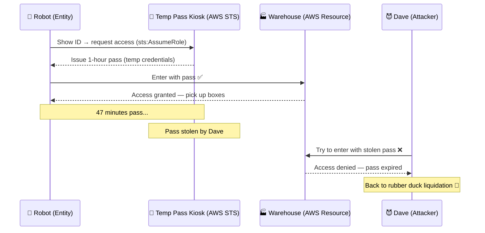

# Practice Creating and Assuming Roles in AWS — Part 1: Introduction

---

## Concept

An **IAM Role** is an AWS identity with permissions — but unlike a user, it has **no permanent credentials**. Instead, it issues **temporary security credentials** when assumed.

Roles are used when:
- An AWS service (EC2, Lambda) needs to call other AWS services
- A user from another AWS account needs access (cross-account)
- A federated user (Google, Active Directory) logs into AWS
- You want to temporarily elevate a user's permissions

**How assuming a role works:**

```
Entity (User / Service / App)
    → calls sts:AssumeRole
    → AWS STS issues temporary credentials
        (AccessKeyId + SecretAccessKey + SessionToken)
    → Entity uses credentials to access resources
    → Credentials expire (15min → 12hrs)
```

**Key components of a Role:**

| Component | Purpose |
|-----------|---------|
| Trust Policy | WHO can assume this role |
| Permission Policy | WHAT the role can do |
| Session Duration | HOW LONG the credentials last |

---

## What Happens Without It?

| Risk | Consequence |
|------|-------------|
| No roles for EC2/Lambda | Must hardcode access keys in code or config |
| No cross-account roles | Must create IAM users in every account |
| No role expiry | Compromised credentials live forever |
| Using users for services | Rotating keys manually = operational nightmare |

> Real damage: Lambda with hardcoded keys → dev leaks `.env` to GitHub → attacker has **permanent credentials** until someone notices. With roles, credentials expire in 1 hour automatically.

---

## Sample in Real Project

**Scenario:** An EC2 instance needs to read from S3 and write logs to CloudWatch.

**Step 1 — Create the Role:**
```
IAM → Roles → Create Role
→ Trusted entity: AWS Service → EC2
→ Attach policy: AmazonS3ReadOnlyAccess
→ Attach policy: CloudWatchLogsFullAccess
→ Role name: ec2-app-role
```

**Step 2 — Trust Policy (auto-generated):**
```json
{
  "Version": "2012-10-17",
  "Statement": [
    {
      "Effect": "Allow",
      "Principal": { "Service": "ec2.amazonaws.com" },
      "Action": "sts:AssumeRole"
    }
  ]
}
```

**Step 3 — Attach role to EC2 instance:**
```
EC2 → Instances → Select instance
→ Actions → Security → Modify IAM Role
→ Select: ec2-app-role → Save
```

**Result:** EC2 app calls S3 and CloudWatch with zero hardcoded credentials. AWS rotates tokens automatically.

---

## Funny Factory Story

At **CloudFactory Inc.**, the delivery robot needed to enter the warehouse to pick up boxes. But it had no permanent badge — robots aren't trusted with permanent access.

So the boss set up a **Temp Pass Kiosk** (AWS STS). Every morning, the robot walks up, scans its ID, and gets a pass valid for 1 hour. It enters the warehouse, grabs the boxes, delivers them, and the pass expires.

Dave tried to steal the robot's pass once. He waited 47 minutes to use it. It had already expired. Dave went back to the rubber duck liquidation team. 🦆



The robot never had a permanent badge. It never needed one. That's the beauty of IAM Roles.

---

## Quiz — 10 Questions (SAA-C03 Style)

*Difficulty scales from Beginner → Advanced*

### Q1 — Beginner
**What is the main difference between an IAM User and an IAM Role?**

- A. IAM Users have temporary credentials; Roles have permanent credentials
- B. ✅ IAM Roles have no permanent credentials and issue temporary tokens when assumed
- C. IAM Roles can only be used by human users
- D. IAM Users are only for AWS services like EC2 and Lambda

**Explanation:** An IAM Role issues temporary credentials via STS when assumed. IAM Users have permanent credentials that must be manually rotated.

---

### Q2 — Beginner
**Which AWS service issues temporary credentials when a role is assumed?**

- A. IAM
- B. ✅ AWS STS (Security Token Service)
- C. AWS KMS
- D. AWS Cognito

**Explanation:** AWS STS issues AccessKeyId + SecretAccessKey + SessionToken. These expire automatically between 15 minutes and 12 hours.

---

### Q3 — Easy
**A Lambda function needs to read objects from S3. What is the correct approach?**

- A. Create an IAM User, generate access keys, store in Lambda env vars
- B. Use root account credentials
- C. ✅ Create an IAM Role with S3 read permissions and assign it to Lambda
- D. Hardcode credentials in source code

**Explanation:** Always use IAM Roles for AWS services. Lambda receives temporary credentials automatically via its execution role.

---

### Q4 — Easy
**What are the two key policies that define an IAM Role?**

- A. Access Policy and Bucket Policy
- B. ✅ Trust Policy and Permission Policy
- C. Identity Policy and Resource Policy
- D. Inline Policy and Managed Policy

**Explanation:** Trust Policy = WHO can assume. Permission Policy = WHAT the role can do.

---

### Q5 — Medium
**Company A wants to give Company B's users access to its AWS resources. What should Company A do?**

- A. Create duplicate IAM users for Company B's staff
- B. Share root credentials
- C. ✅ Create a cross-account IAM Role trusting Company B's account
- D. Use VPC Peering

**Explanation:** Cross-account roles let Company B's users call sts:AssumeRole to get temporary access — no credential sharing needed.

---

### Q6 — Medium
**An EC2 instance has no IAM role. A developer needs DynamoDB access without restarting it. What should they do?**

- A. SSH in and run `aws configure` with access keys
- B. ✅ Create a role and attach it via EC2 → Modify IAM Role (no reboot needed)
- C. Reboot and attach during launch
- D. Embed DynamoDB credentials in the app config

**Explanation:** You can attach/replace an IAM role on a running EC2 instance. Credentials are served immediately via IMDS.

---

### Q7 — Medium
**What is the purpose of the Principal field in a Role's Trust Policy?**

- A. Defines which AWS resources the role can access
- B. ✅ Specifies which entity is allowed to assume the role
- C. Sets the maximum session duration
- D. Determines which region the role is active in

**Explanation:** Principal answers WHO can call sts:AssumeRole — an account, user ARN, AWS service, or federated IdP.

---

### Q8 — Hard
**A role has S3 full access, but an SCP denies s3:DeleteObject. What happens on a delete attempt?**

- A. Delete succeeds because the role has full access
- B. ✅ Delete is denied — SCPs are evaluated first and override IAM policies
- C. Delete succeeds because cross-account roles bypass SCPs
- D. An error occurs because cross-account access doesn't support SCPs

**Explanation:** Evaluation order: SCP → Resource Policy → IAM Policy. An SCP Deny is a hard guardrail that no IAM policy can override.

---

### Q9 — Hard
**You need an EC2 role session to expire after exactly 2 hours. What controls this?**

- A. IAM Password Policy
- B. ✅ Session Duration on the Role + `--duration-seconds` in AssumeRole call
- C. EC2 Instance Metadata TTL
- D. AWS Config rule

**Explanation:** Set MaxSessionDuration ≥ 7200 on the role, then pass `--duration-seconds 7200` in the AssumeRole call.

---

### Q10 — Advanced
**Temporary credentials were leaked to a public GitHub repo 30 minutes ago with a 1-hour session. What is the MOST effective immediate action?**

- A. Delete the GitHub repository
- B. Change the role's trust policy to remove all principals
- C. ✅ Add an inline deny policy with `aws:TokenIssueTime` condition to invalidate all existing sessions
- D. Rotate the access keys for the IAM Role

**Explanation:** Temp credentials can't be rotated. Add a deny policy with `aws:TokenIssueTime < now` to invalidate all in-flight sessions. Then audit CloudTrail for attacker activity.

---

> **Exam tip (SAA-C03):**
> - Roles = temporary credentials via STS — always prefer over access keys for services
> - Trust Policy = who can assume; Permission Policy = what it can do
> - Cross-account access uses roles, not duplicate IAM users
> - SCP Deny always wins over IAM role permissions
> - To revoke leaked STS credentials → use `aws:TokenIssueTime` condition deny
