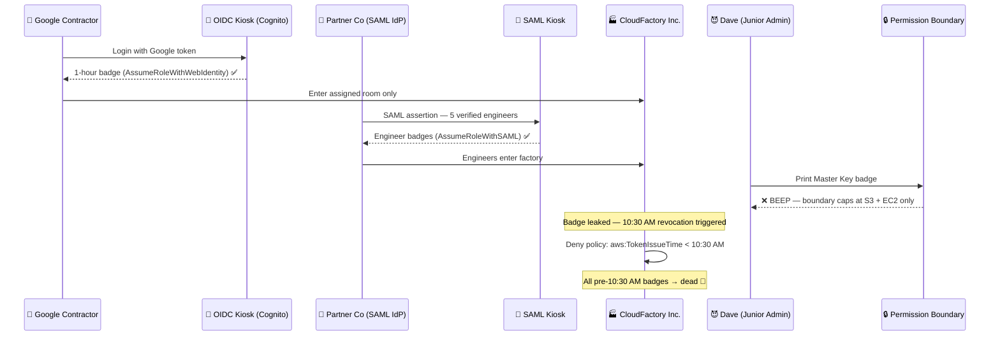

# Practice Creating and Assuming Roles in AWS — Part 3

---

## Concept

Part 3 is the final chapter — **advanced role patterns** used in production: federated access, permission boundaries, role chaining strategies, and incident response for compromised roles.

Four advanced patterns:

```
Pattern 1: Web Identity Federation
User (Google/Facebook) → OIDC Provider → sts:AssumeRoleWithWebIdentity → AWS Resources

Pattern 2: SAML Federation
Corporate AD User → SAML IdP → sts:AssumeRoleWithSAML → AWS Console/API

Pattern 3: Permission Boundary
IAM Role → Boundary sets MAX allowed → Policy grants within boundary
Effective Permissions = IAM Policy ∩ Permission Boundary

Pattern 4: Incident Response
Leaked role creds → Deny policy + aws:TokenIssueTime → Full revocation
```

**SCP vs Permission Boundary — the key distinction:**

| | SCP | Permission Boundary |
|---|---|---|
| Scope | Entire AWS account | Single IAM user or role |
| Set by | Org management account | IAM admin in same account |
| Purpose | Account-level guardrail | Delegate admin safely |

---

## What Happens Without It?

| Risk | Consequence |
|------|-------------|
| No federation | Every contractor needs a permanent IAM user |
| No permission boundaries | Delegated admins can create roles more powerful than themselves |
| No incident response plan | Leaked role creds stay active until natural expiry |
| No SAML/SSO | 100-person company = 100 IAM users to manage manually |

> Real damage: A junior admin is delegated IAM permissions with no permission boundary. They create a role with `AdministratorAccess` and use it to bypass all restrictions. Classic privilege escalation — a boundary would have made that impossible.

---

## Sample in Real Project

### Scenario 1 — Web Identity Federation for a mobile app

```json
{
  "Version": "2012-10-17",
  "Statement": [{
    "Effect": "Allow",
    "Principal": {
      "Federated": "cognito-identity.amazonaws.com"
    },
    "Action": "sts:AssumeRoleWithWebIdentity",
    "Condition": {
      "StringEquals": {
        "cognito-identity.amazonaws.com:aud": "us-east-1:abc-pool-id"
      }
    }
  }]
}
```

Mobile user logs in via Google → Cognito exchanges token → Role issued → User accesses only their own S3 prefix. No IAM user is created.

### Scenario 2 — Permission Boundary for delegated admin

```json
{
  "Version": "2012-10-17",
  "Statement": [{
    "Effect": "Allow",
    "Action": ["s3:*", "ec2:*", "cloudwatch:*"],
    "Resource": "*"
  }]
}
```

Attach as Permission Boundary to the junior admin's role. They can create any IAM role — but those roles can never exceed S3, EC2, and CloudWatch. Privilege escalation blocked.

### Scenario 3 — Incident response for leaked role

```json
{
  "Version": "2012-10-17",
  "Statement": [{
    "Effect": "Deny",
    "Action": "*",
    "Resource": "*",
    "Condition": {
      "DateLessThan": {
        "aws:TokenIssueTime": "2026-05-17T10:30:00Z"
      }
    }
  }]
}
```

Attach inline to the role → all sessions issued before 10:30 AM are dead instantly. Audit CloudTrail by session name for attacker activity.

---

## Funny Factory Story

**CloudFactory Inc.** hired a consultant, 3 Google contractors, and a partner company — none of them get permanent badges.

The Google contractors log in with their Google accounts. A **Temp Kiosk** (Cognito + OIDC) checks their Google ID and prints a 1-hour badge that only opens their assigned room.

The partner company sends a signed note from their HR system (SAML IdP): "These 5 people are verified engineers." The factory hands them badges — no new accounts created.

Then Dave (now a "junior admin") was given keys to make new badges. With no rules, he tried to make himself a Master Key. But the boss had installed a **Permission Boundary** — Dave's badge machine was physically incapable of printing Master Keys. It just beeped sadly.

One day a contractor lost their badge. The boss ran the **TokenIssueTime revocation** — every badge issued before 10:30 AM stopped working immediately. The lost badge beeped red. Dave's self-made badge also beeped red. Nobody was surprised. 🦆🔐



---

## Quiz — 10 Questions (SAA-C03 Style — Final Part)

*All questions are Medium → Advanced difficulty*

### Q1 — Beginner
**What is the primary purpose of Web Identity Federation in AWS?**

- A. Allow AWS services to call each other without IAM roles
- B. Create permanent IAM users from social login accounts
- C. ✅ Allow external IdPs (Google, Facebook, Cognito) to exchange tokens for temporary AWS credentials
- D. Synchronize Active Directory passwords with AWS IAM

**Explanation:** Users authenticate with an external IdP and exchange their OIDC token via `sts:AssumeRoleWithWebIdentity` for temporary AWS credentials. No IAM user is ever created.

---

### Q2 — Beginner
**What is the formula for effective permissions when a Permission Boundary is applied?**

- A. Effective = IAM Policy + Permission Boundary (combined)
- B. Effective = IAM Policy only (boundary is advisory, not enforced)
- C. Effective = Permission Boundary only (IAM Policy is overridden)
- D. ✅ Effective = IAM Policy ∩ Permission Boundary (intersection only)

**Explanation:** Both must agree. The boundary is a hard ceiling — if it doesn't allow an action, that action is blocked regardless of what the IAM policy says.

---

### Q3 — Beginner
**Which STS API action is used for SAML 2.0 enterprise SSO into AWS?**

- A. ✅ sts:AssumeRoleWithSAML
- B. sts:AssumeRole
- C. sts:AssumeRoleWithWebIdentity
- D. sts:GetFederationToken

**Explanation:** A SAML IdP (Okta, Active Directory) generates a SAML assertion → AWS STS validates it via `AssumeRoleWithSAML` → temporary credentials are issued. No IAM user is needed.

---

### Q4 — Intermediate
**A junior admin has a Permission Boundary allowing only S3 and EC2. They create a new role and attach AdministratorAccess. What are the new role's effective permissions?**

- A. AdministratorAccess — the role inherits the full policy as requested
- B. ✅ S3 and EC2 only — the creator's boundary caps all roles they create
- C. The CreateRole call fails — admins with boundaries cannot create roles
- D. The role is auto-deleted by AWS after creation

**Explanation:** Permission Boundaries prevent privilege escalation. Roles created by a bounded admin are also bounded — the intersection caps the new role at the creator's boundary. The junior admin cannot grant more than they themselves have.

---

### Q5 — Intermediate
**Which condition key enforces an MFA requirement at role assumption time?**

- A. `aws:SecureTransport: "true"`
- B. `sts:ExternalId: "mfa-required"`
- C. ✅ `aws:MultiFactorAuthPresent: "true"`
- D. `iam:MFAPresent: "true"`

**Explanation:** `aws:MultiFactorAuthPresent` is evaluated at `AssumeRole` time. If MFA was not used during the caller's current session, the condition fails and credentials are never issued.

---

### Q6 — Intermediate
**What is the "confused deputy" problem and what prevents it?**

- A. Two roles with the same name — prevented by IAM's unique naming requirement
- B. EC2 assuming an unattached role — prevented by IMDSv2
- C. Users assuming too many roles — prevented by session duration limits
- D. ✅ A third-party SaaS assuming your role on behalf of many customers — prevented by the ExternalId condition

**Explanation:** `ExternalId` is a shared secret between you and the third party, included in both the Trust Policy condition and the third party's AssumeRole call. Attackers who know your role ARN but not the ExternalId cannot impersonate you.

---

### Q7 — Hard
**A Cognito unauthenticated role has `s3:PutObject` in its IAM policy. The S3 bucket policy only allows the authenticated role ARN. What happens when an unauthenticated user tries to upload?**

- A. Upload succeeds — the role's IAM policy allows the action
- B. ✅ Upload is denied — the S3 bucket policy does not allow the unauthenticated role ARN
- C. Upload succeeds — Cognito bypasses resource-based policies
- D. Upload is denied — unauthenticated roles can never access S3 under any condition

**Explanation:** Both the IAM policy and the resource-based bucket policy must allow the action. The bucket policy only permits the authenticated role ARN, so the unauthenticated role is denied regardless of its IAM permissions.

---

### Q8 — Hard
**What is the most secure way to grant a third-party auditor read-only AWS access for exactly 24 hours?**

- A. ✅ Create a cross-account role with read-only permissions, MaxSessionDuration 86400s, and an ExternalId condition — delete or revoke after the audit
- B. Create a temporary IAM user with read-only access and delete it after 24 hours
- C. Share root credentials and change the password after 24 hours
- D. Create an IAM user with a 24-hour password expiry policy

**Explanation:** A cross-account role means no credentials are shared. CloudTrail logs every action by session name. Access is instantly revocable by removing the Trust Policy or deleting the role. ExternalId prevents the confused deputy problem.

---

### Q9 — Hard
**An IAM policy allows `s3:GetObject` on `my-bucket/*`. A Permission Boundary allows `s3:*` on `*`. What is the effective permission?**

- A. `s3:*` on all resources — the boundary expands IAM policy access
- B. `s3:*` on `my-bucket/*` — actions from the boundary, resource scope from IAM policy
- C. ✅ `s3:GetObject` on `my-bucket/*` — the intersection of both
- D. No access — the boundary overrides the IAM policy entirely

**Explanation:** Permission Boundaries never expand — they only restrict. The effective permission is the intersection: what the IAM policy allows AND what the boundary allows. `s3:GetObject` on `my-bucket/*` is the only overlap.

---

### Q10 — Advanced
**A role was compromised 2 hours ago and active sessions are ongoing. You need to stop all access immediately while preserving forensic evidence. What is the correct sequence?**

- A. Delete the role immediately to cut off all access
- B. Change the role's permission policy to read-only to limit damage
- C. Rotate the role's access keys to invalidate existing credentials
- D. ✅ 1) Add inline Deny + aws:TokenIssueTime condition → 2) Remove Trust Policy principals → 3) Audit CloudTrail by session name

**Explanation:** The `TokenIssueTime` deny kills all active sessions instantly. Removing Trust Policy principals stops new assumptions. Auditing CloudTrail by session name reconstructs exactly what the attacker accessed. Never delete the role — it destroys forensic evidence.

---

> **Final exam cheat sheet — all 3 parts:**
>
> **Credentials:** Roles = temp creds via STS (all 3 required: AccessKeyId + SecretAccessKey + SessionToken). Role chaining hard cap = 1 hour.
>
> **Trust Policy:** Principal = who can assume. `aws:MultiFactorAuthPresent` = enforce MFA. `sts:ExternalId` = confused deputy protection. `aws:CurrentTime` / `aws:DayOfWeek` = time restrictions.
>
> **Permission Boundary:** Effective = IAM Policy ∩ Boundary. Never additive. Prevents privilege escalation by delegated admins.
>
> **Federation:** OIDC/Social → `AssumeRoleWithWebIdentity`. Corporate SAML/SSO → `AssumeRoleWithSAML`. No permanent IAM users in either case.
>
> **Incident Response:** Active sessions → Deny + `aws:TokenIssueTime < now`. Future sessions → remove Trust Policy principals. Never delete the role — preserve forensic evidence. Always audit CloudTrail by session name.
