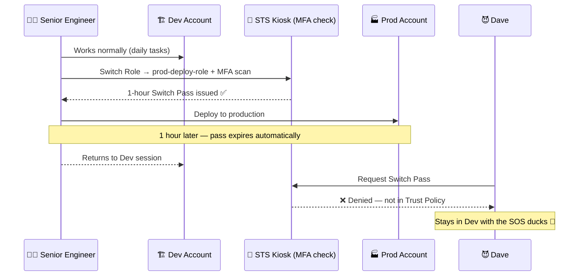

# Practice Creating and Assuming Roles in AWS — Part 2

---

## Concept

Part 2 goes hands-on — creating roles for real scenarios: **service roles, cross-account roles, and role switching** via the AWS Console and CLI.

Three core patterns you must know:

```
Pattern 1: Service Role
EC2 / Lambda → assumes role → accesses AWS resources

Pattern 2: Cross-Account Role
Account A User → sts:AssumeRole → Role in Account B → accesses Account B resources

Pattern 3: Role Switching (Console)
IAM User → Switch Role → elevated/scoped access in target account
```

Key CLI commands:

```bash
# Assume a role and receive temp credentials
aws sts assume-role \
  --role-arn arn:aws:iam::123456789012:role/my-role \
  --role-session-name my-session

# Verify which identity is currently active
aws sts get-caller-identity

# Export temp credentials for use in the shell
export AWS_ACCESS_KEY_ID=...
export AWS_SECRET_ACCESS_KEY=...
export AWS_SESSION_TOKEN=...
```

---

## What Happens Without It?

| Risk | Consequence |
|------|-------------|
| No service role pattern | Devs hardcode keys into EC2/Lambda — keys leak |
| No cross-account roles | IAM users in every account → sprawl, no audit trail |
| No role switching | Admins use high-privilege accounts daily → large blast radius |
| No session naming | Can't trace which session did what in CloudTrail |

> Real damage: A team managing 5 accounts creates an IAM user in each one for every developer — 20 devs × 5 accounts = **100 credential sets** to rotate, audit, and eventually forget. One stale account gets compromised 8 months later.

---

## Sample in Real Project

**Scenario:** A DevOps team manages 3 accounts — `dev`, `staging`, `prod`. Devs work in `dev` daily, but a senior engineer can switch into `prod` for deployments.

**Step 1 — Create deployment role in the prod account:**
```
IAM → Roles → Create Role
→ Trusted entity: Another AWS account
→ Account ID: [dev account ID]
→ Attach policy: PowerUserAccess
→ Role name: prod-deploy-role
→ Add condition: MFA required
```

**Trust Policy for prod-deploy-role:**
```json
{
  "Version": "2012-10-17",
  "Statement": [{
    "Effect": "Allow",
    "Principal": {
      "AWS": "arn:aws:iam::DEV_ACCOUNT_ID:root"
    },
    "Action": "sts:AssumeRole",
    "Condition": {
      "Bool": { "aws:MultiFactorAuthPresent": "true" }
    }
  }]
}
```

**Step 2 — Grant the engineer permission to assume it (in dev account):**
```json
{
  "Version": "2012-10-17",
  "Statement": [{
    "Effect": "Allow",
    "Action": "sts:AssumeRole",
    "Resource": "arn:aws:iam::PROD_ACCOUNT_ID:role/prod-deploy-role"
  }]
}
```

**Step 3 — Engineer switches role in the console:**
```
Top-right menu → Switch Role
→ Account: PROD_ACCOUNT_ID
→ Role: prod-deploy-role
→ Display name: PROD (red)
→ Switch Role
```

**Result:** Engineer works in `dev` all day. Switches to `prod` only for deployments — MFA enforced, session logged in CloudTrail, auto-expires in 1 hour.

---

## Funny Factory Story

**CloudFactory Inc.** now runs 3 buildings — Dev, Staging, and Prod.

Junior workers live in the Dev building all day. But one day, Dave wandered into the Prod building, pressed a button, and deployed half-finished rubber duck firmware to 50,000 customers. The ducks quacked in Morse code. Nobody ordered that feature.

The boss introduced **Role Switching Passes**:
- Junior workers stay in Dev — their badges don't open Prod
- Senior engineers get a **Switch Pass** — but only after scanning their MFA fob at the door
- The pass lasts 1 hour, logs their name in the CloudTrail ledger, and self-destructs after use

Dave applied for a Switch Pass. He was denied. He remains in Dev, surrounded by ducks that now say "SOS" in Morse code. 🦆📟



---

## Quiz — 10 Questions (SAA-C03 Style)

*Difficulty scales from Beginner → Advanced*

### Q1 — Beginner
**When switching roles in the AWS Console, what happens to your original IAM user session?**

- A. Your original session is permanently deleted
- B. ✅ Your original session is suspended and resumes when you switch back
- C. Both sessions run simultaneously with combined permissions
- D. You must log out and log back in to return to your original user

**Explanation:** Your IAM user session is preserved. Clicking "Switch back" restores it instantly. Permissions never merge between sessions.

---

### Q2 — Beginner
**What CLI command verifies which IAM identity is currently active?**

- A. aws iam get-user
- B. aws iam list-roles
- C. ✅ aws sts get-caller-identity
- D. aws iam whoami

**Explanation:** `aws sts get-caller-identity` returns UserId, Account, and ARN for the active identity — whether it's a user or an assumed role.

---

### Q3 — Beginner
**Which Trust Policy Principal allows any IAM entity in account 123456789012 to attempt assuming a role?**

- A. `"Principal": {"AWS": "arn:aws:iam::123456789012:user/*"}`
- B. ✅ `"Principal": {"AWS": "arn:aws:iam::123456789012:root"}`
- C. `"Principal": {"Service": "123456789012.amazonaws.com"}`
- D. `"Principal": "*"`

**Explanation:** `:root` makes the whole account eligible — but entities still need an explicit `sts:AssumeRole` allow in their own policy. `"*"` is dangerous and should never be used.

---

### Q4 — Intermediate
**After sts:AssumeRole, which environment variables must ALL be exported for CLI calls to work?**

- A. Only AWS_ACCESS_KEY_ID and AWS_SECRET_ACCESS_KEY
- B. Store them in `~/.aws/credentials` permanently
- C. Pass them via `--credentials` flag on every command
- D. ✅ AWS_ACCESS_KEY_ID, AWS_SECRET_ACCESS_KEY, and AWS_SESSION_TOKEN — all three required

**Explanation:** All three are required. Missing `AWS_SESSION_TOKEN` causes `AuthFailure` on every API call because STS temp credentials are validated as a triple.

---

### Q5 — Intermediate
**Cross-account role assumption fails with AccessDenied even though the user has sts:AssumeRole permission. What is the most likely cause?**

- A. The user needs AdministratorAccess in Account A
- B. Cross-account roles require MFA by default
- C. ✅ Account B's Trust Policy doesn't include Account A as a Principal
- D. The role must be in the same region as the user

**Explanation:** Both sides must agree. Account A grants `sts:AssumeRole` permission; Account B's Trust Policy must trust Account A's account ID or the specific user ARN. If either is missing, access is denied.

---

### Q6 — Intermediate
**Where does an EC2 application retrieve temporary role credentials from automatically?**

- A. From the IAM console via a scheduled job
- B. ✅ From http://169.254.169.254/latest/meta-data/iam/security-credentials/`<role-name>` (IMDS)
- C. From AWS Secrets Manager, configured at launch
- D. From an S3 bucket path set in the instance's user data

**Explanation:** The Instance Metadata Service (IMDS) at 169.254.169.254 automatically serves refreshed temporary credentials. The AWS SDK reads from IMDS without any manual STS calls.

---

### Q7 — Hard
**How do you restrict a role so it can only be assumed between 09:00–17:00 UTC on weekdays?**

- A. Set session duration to 8 hours
- B. Attach an IAM Permission Boundary with time-based rules
- C. Create an AWS Config rule with a time-based trigger
- D. ✅ Add Condition keys in the Trust Policy: aws:CurrentTime and aws:DayOfWeek

**Explanation:** Trust Policy Conditions are evaluated at `AssumeRole` time. If the time or day condition fails, STS never issues credentials — the restriction is enforced before any permissions apply.

---

### Q8 — Hard
**A Lambda (S3 full access) assumes a second role (DynamoDB read-only) mid-execution. What permissions apply when using the second role's credentials?**

- A. Both S3 and DynamoDB — permissions stack across roles
- B. ✅ Only DynamoDB read — the assumed role replaces permissions for that credential set
- C. S3 full access only — inner role assumptions are ignored by AWS
- D. No permissions — nested role assumptions are not allowed

**Explanation:** Permissions never stack between roles. Each credential set is fully independent. API calls made with the inner role's credentials operate only under the inner role's policies.

---

### Q9 — Hard
**Role chaining: Role A assumes Role B which assumes Role C. Role C has MaxSessionDuration of 12 hours. What is the actual max session for Role C's credentials in this chain?**

- A. ✅ 1 hour — AWS enforces a hard 1-hour cap on all role-chained sessions
- B. 12 hours — same as any directly assumed role
- C. 6 hours — the default mid-point for chained sessions
- D. Unlimited — set by the first role in the chain

**Explanation:** AWS enforces a hard 1-hour maximum on any session produced by role chaining (role → role → role). This is not configurable and cannot be overridden by MaxSessionDuration.

---

### Q10 — Advanced
**A junior engineer removes an OIDC provider from IAM to immediately revoke federated user access. What is the actual effect?**

- A. All existing sessions are immediately revoked
- B. The role trusting the OIDC provider is automatically deleted
- C. ✅ New AssumeRoleWithWebIdentity calls fail, but existing active sessions remain valid until natural expiry
- D. Nothing changes — OIDC providers are not evaluated at session time

**Explanation:** Removing the OIDC provider stops new sessions from being issued. But in-flight temporary credentials remain valid until they expire. Full revocation requires also adding a deny policy with the `aws:TokenIssueTime` condition.

---

> **Exam tips — Part 2:**
> - Switch Role suspends your user session — permissions never combine
> - Both sides must agree for cross-account access: user permission + trust policy
> - All 3 STS values are required: AccessKeyId + SecretAccessKey + SessionToken
> - IMDS at 169.254.169.254 is how EC2 gets role credentials automatically
> - Role chaining hard cap = 1 hour — non-configurable
> - Removing an OIDC provider stops new sessions but does not revoke active ones
